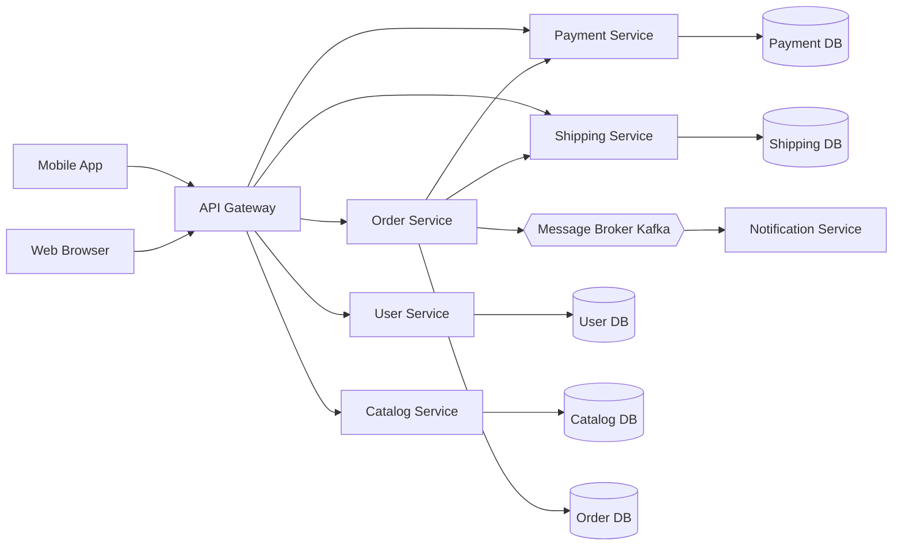
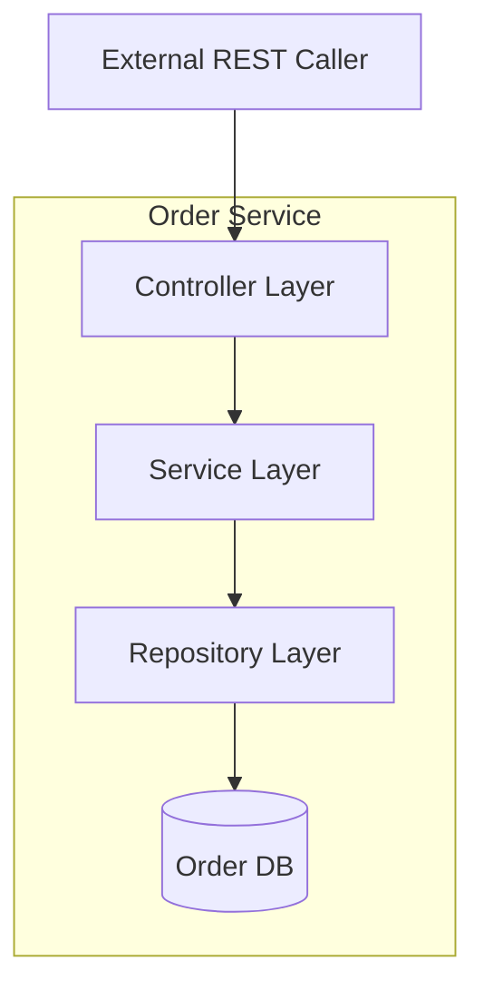
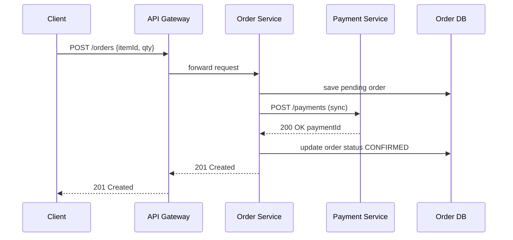
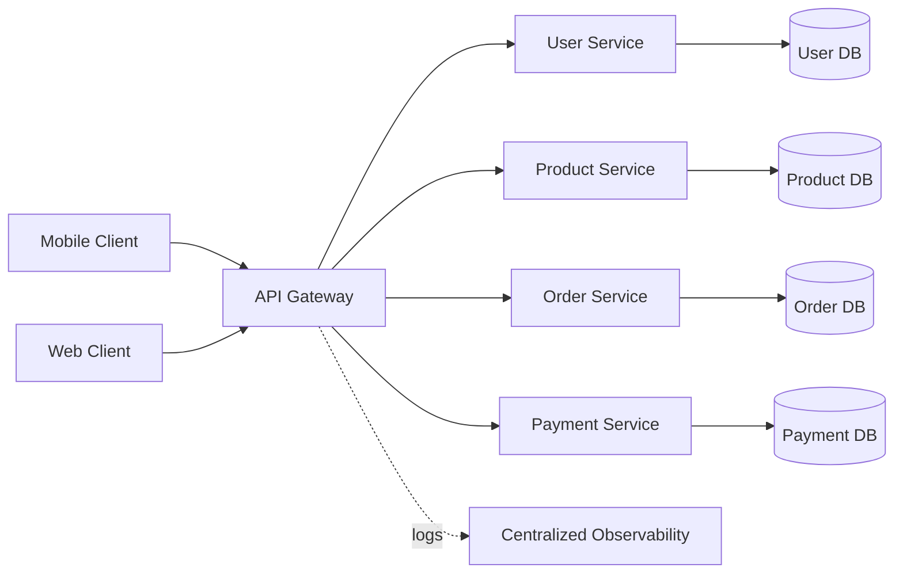

# Microservices.

<!-- SECTION_1_START -->
# Microservices — A Java & OOP Perspective

## 1.1 Formal Academic Definition

A **Microservice** is an architectural style that structures an application as a collection of small, autonomous, loosely coupled services, each responsible for a single business capability, communicating over lightweight protocols (typically HTTP/REST or message brokers), and independently deployable.

> [!IMPORTANT]
> **KTU 2024 Syllabus Mapping (PBCST304 — OOP, Module 1 Context):**
> Although Module 1 primarily focuses on the structure of a simple Java program, the *modern* Java ecosystem (Spring Boot, Quarkus, Micronaut) is the de-facto industry standard for building Microservices. Hence, foundational Microservices concepts are introduced here as a **bridge between classical OOP and modern distributed Java systems**.

> [!NOTE]
> **Core KTU Definition:**
> A Microservice is a **self-contained, single-purpose, independently deployable** software component that owns its own data store and communicates with other services through well-defined interfaces (APIs), embodying the OOP principles of **encapsulation**, **single responsibility**, and **loose coupling** at the architectural level.

---

## 1.2 Conceptual Analogy / Intuition

Imagine a **city**:

- A **Monolithic** application is like one giant city-hall building where every department (birth registration, tax, water, electricity) sits in the same structure. If the building catches fire, the entire city stops functioning. Adding a new department means renovating the whole building.
- A **Microservices**-based application is like a modern city where each department is its **own independent building** with its own staff, files, and entrance. They communicate via **postal letters (APIs/HTTP)**. If the water department building has an issue, the electricity department keeps running. A new department is just a new building added on a new plot.

### Key Standard Metrics (Industry-Standard)

- **Team size per service:** **2-pizza rule** (2-pizza team ≈ **6–8 developers**).
- **Service granularity:** Each service should own **one bounded context** (Domain-Driven Design).
- **Deployment independence:** Each service has its own **CI/CD pipeline** and **versioned artifact** (e.g., `.jar`, `.war`, container image).
- **Communication latency target:** Intra-service call **< 10 ms**; inter-service **< 100 ms**.

---

> [!VISUALIZATION CONTROL]
> **Concept:** Monolith vs. Microservices request flow
> **Conceptual Graph (manual sketch in GeoGebra/Desmos):**
> Draw two boxes side by side.
> - *Box 1 (Monolith)*: One big rectangle containing 5 sub-rectangles (UI, Auth, Order, Payment, Inventory) all touching each other.
> - *Box 2 (Microservices)*: 5 separate rectangles, each with its own small database cylinder, connected by dashed lines labeled `HTTP/REST`.
>
> **Visual Description:** Observe that in the monolith, all sub-modules share **one database** and **one process boundary**, while in microservices, every box has its **own database** and **own process**, interacting only via network calls.

<!-- SECTION_1_END -->

<!-- SECTION_2_START -->
# Deep Theoretical Analysis & KTU High-Yield Formula Sheet

## 2.1 The "WHY" Behind Microservices

Classical OOP taught us to break software into **classes** (encapsulation, single responsibility). Microservices take that same principle and apply it at the **deployment and team level**. Instead of one giant `.jar` containing thousands of classes, we break the system into multiple small, deployable **artifacts** (each often a Java `.jar`).

---

## 2.2 The 8 Core Characteristics of a Microservice

1. **Single Responsibility** — One service = one bounded business capability.
2. **Independent Deployability** — Can be deployed without coordinating with other services.
3. **Decentralized Data** — Each service owns its database; no shared schema.
4. **Polyglot Persistence** — Different services may use different databases (MySQL, MongoDB, Redis).
5. **API-First Communication** — Services talk via well-defined REST/gRPC contracts.
6. **Failure Isolation** — A crash in one service must not cascade.
7. **Observability** — Centralized logging, metrics, and tracing.
8. **Infrastructure Automation** — Containers (Docker), orchestrators (Kubernetes).

---

## 2.3 KTU Formula Sheet / Cheat Sheet

| # | Concept | Symbol / Term | Boundary / Limit | Unit / Notes |
|---|---------|---------------|------------------|--------------|
| 1 | Number of services per team | $N_s$ | $N_s \le 8$ | "2-pizza rule" |
| 2 | Service size | $LOC$ | $\le 100{,}000$ lines | Industry guideline |
| 3 | Inter-service call latency | $T_{net}$ | $T_{net} < 100$ | milliseconds (ms) |
| 4 | Availability target per service | $A_s$ | $A_s \ge 99.9\,\%$ | "Three nines" |
| 5 | Coupling metric | $C$ | $C \to 0$ ideally | dimensionless |
| 6 | Cohesion metric | $K$ | $K \to 1$ ideally | dimensionless |
| 7 | End-to-end availability (n services) | $A_{sys} = \prod_{i=1}^{n} A_i$ | $A_{sys} \ge 99.99\,\%$ | multiplicative |
| 8 | Optimal payload size | $S_{payload}$ | $S_{payload} \le 1$ | megabytes (MB) |
| 9 | Container startup time | $T_{boot}$ | $T_{boot} < 5$ | seconds (s) |
| 10 | Database per service rule | $DB_{shared}$ | $DB_{shared} = \text{FORBIDDEN}$ | strict |

> [!IMPORTANT]
> **Critical formula for KTU numericals:**
> If you have $n$ services each with availability $A_i$, the system-level availability is:
>
> $$A_{sys} = \prod_{i=1}^{n} A_i$$
>
> Therefore, to maintain $A_{sys} \ge 99.99\,\%$ with $n = 4$ services, each service must have $A_i \ge \sqrt[4]{0.9999} \approx 99.9975\,\%$.

---

## 2.4 Real-World Utility in Engineering

| Domain | Microservice Use Case |
|--------|----------------------|
| **E-Commerce (Amazon)** | Cart, Catalog, Payment, Shipping, Reviews as separate services |
| **Banking (JPMorgan)** | Account, Ledger, KYC, Fraud Detection as isolated services |
| **Streaming (Netflix)** | 700+ microservices, one per capability (playback, recommendations) |
| **Ride-Hailing (Uber)** | Trip, Driver, Rider, Pricing, Map services |
| **Java Tech Stack** | Spring Boot + Spring Cloud + Eureka + Zuul/Gateway + Hystrix/Resilience4j |

---

## 2.5 Monolith vs. Microservices — Side-by-Side

| Attribute | Monolith | Microservices |
|-----------|----------|---------------|
| Deployment unit | One single artifact | Many small artifacts |
| Tech stack | One language/framework | Polyglot (Java, Python, Go, Node) |
| Database | Single shared schema | Database-per-service |
| Scaling | Scale whole application | Scale only the bottleneck service |
| Failure impact | Whole system may fail | Isolated failure |
| Team coordination | Tight (one codebase) | Loose (independent teams) |
| Initial complexity | Low | High |
| OOP principle mapping | Class-level SRP | Service-level SRP |

<!-- SECTION_2_END -->

<!-- SECTION_3_START -->
# Step-by-Step Derivations & Code Implementation

## 3.1 Worked Example: A Simple Java Microservice (Spring Boot)

Below is a **fully working, compilable** Java Spring Boot microservice exposing a REST endpoint. Every line is annotated for KTU board clarity.

```java
// File: OrderServiceApplication.java
// Package declaration - mandatory OOP/Java structural rule
package com.ktu.microservices.order;

// Standard Java imports
import org.springframework.boot.SpringApplication;
import org.springframework.boot.autoconfigure.SpringBootApplication;
import org.springframework.web.bind.annotation.GetMapping;
import org.springframework.web.bind.annotation.PathVariable;
import org.springframework.web.bind.annotation.RestController;
import java.util.HashMap;
import java.util.Map;

/**
 * This is the ENTRY POINT class of a single microservice.
 * In OOP terms, this is the "main class" that bootstraps the application.
 */
@SpringBootApplication  // Meta-annotation combining @Configuration, @EnableAutoConfiguration, @ComponentScan
@RestController        // Marks the class as a REST API controller (single responsibility: handle HTTP)
public class OrderServiceApplication {

    // ---- main() method: standard Java program structure (Module 1 prerequisite) ----
    public static void main(String[] args) {
        // SpringApplication.run() launches the embedded Tomcat server
        SpringApplication.run(OrderServiceApplication.class, args);
    }

    // Endpoint 1: Health check
    @GetMapping("/health")
    public Map<String, String> healthCheck() {
        Map<String, String> response = new HashMap<>();
        response.put("status", "UP");
        response.put("service", "order-service");
        return response;
    }

    // Endpoint 2: Fetch order by ID
    @GetMapping("/orders/{orderId}")
    public Map<String, Object> getOrder(@PathVariable String orderId) {
        Map<String, Object> order = new HashMap<>();
        order.put("orderId", orderId);
        order.put("item", "OOP Textbook - KTU 2024");
        order.put("price", 499.00);
        order.put("currency", "INR");
        order.put("status", "CONFIRMED");
        return order;
    }
}
```

**Maven `pom.xml` excerpt (dependency declaration):**

```xml
<dependencies>
    <dependency>
        <groupId>org.springframework.boot</groupId>
        <artifactId>spring-boot-starter-web</artifactId>
    </dependency>
</dependencies>
```

**Run command:**

```bash
mvn spring-boot:run
# Service listens on http://localhost:8080
```

**Test with curl:**

```bash
curl http://localhost:8080/health
# Output: {"status":"UP","service":"order-service"}

curl http://localhost:8080/orders/OOP-2024-001
# Output: {"orderId":"OOP-2024-001","item":"OOP Textbook - KTU 2024","price":499.0,"currency":"INR","status":"CONFIRMED"}
```

---

## 3.2 Worked Numerical — Availability Calculation

**Problem:** A KTU e-commerce system has **4 microservices**: Catalog (99.95%), Cart (99.99%), Payment (99.90%), Shipping (99.97%). Compute the **system-level availability** and verify if it meets the **99.99% SLA**.

**Step 1 — Convert percentages to decimals:**

$$\begin{aligned}
A_1 &= 0.9995 \quad \text{(Catalog)} \\
A_2 &= 0.9999 \quad \text{(Cart)} \\
A_3 &= 0.9990 \quad \text{(Payment)} \\
A_4 &= 0.9997 \quad \text{(Shipping)}
\end{aligned}$$

**Step 2 — Apply the multiplicative availability formula:**

$$A_{sys} = A_1 \times A_2 \times A_3 \times A_4$$

**Step 3 — Compute step by step:**

$$\begin{aligned}
A_{sys} &= 0.9995 \times 0.9999 \times 0.9990 \times 0.9997 \\
&= (0.9995 \times 0.9999) \times (0.9990 \times 0.9997) \\
&= 0.99940005 \times 0.99870030 \\
&\approx 0.99810067
\end{aligned}$$

**Step 4 — Convert back to percentage:**

$$A_{sys} \approx 99.8101\,\%$$

**Step 5 — Verdict:**

$$A_{sys} = 99.81\,\% \quad < \quad 99.99\,\% \;(\text{SLA})$$

**Conclusion:** The current design **fails the SLA**. To meet 99.99%, the **Payment service** (the weakest link at 99.90%) must be hardened first — typically by adding **redundancy** and **circuit breakers** (e.g., Resilience4j in Java).

---

## 3.3 Service Decomposition Derivation (OOP → Microservice)

Given the OOP Single Responsibility Principle (SRP): *"A class should have one reason to change."*

**Step 1 — Identify business capabilities** in an OOP e-commerce system:

| OOP Class | Business Capability | Becomes Microservice? |
|-----------|---------------------|------------------------|
| `User`, `UserManager` | User management | `user-service` |
| `Product`, `Catalog` | Catalog browsing | `catalog-service` |
| `Cart`, `CartItem` | Shopping cart | `cart-service` |
| `Order`, `Payment` | Order + Payment | `order-service`, `payment-service` |
| `Invoice`, `Shipping` | Billing + Logistics | `billing-service`, `shipping-service` |

**Step 2 — Apply bounded context (DDD rule):**

Each service owns its **entities, value objects, repositories, and database schema**.

**Step 3 — Define inter-service contracts:**

Service `A` calls Service `B` only via the **published REST contract**:

```
GET  /users/{id}        -> UserService
GET  /products/{id}     -> CatalogService
POST /orders            -> OrderService (internally calls PaymentService + InventoryService)
```

This mirrors the OOP concept of **encapsulation at the service boundary**: the internal implementation is hidden behind an **API**.

<!-- SECTION_3_END -->

<!-- SECTION_4_START -->
# Structural Diagrams & Schematics

## 4.1 Microservices Architecture Flow (Mermaid)



**Reading the diagram:**

- The **API Gateway** is the single entry point.
- Each service has its **own database** (database-per-service rule).
- **Synchronous** calls (solid arrows) use HTTP/REST.
- **Asynchronous** events (dashed line via Kafka) decouple services.

---

## 4.2 Service Internal Layered Topology (Mermaid)



**This nested subgraph mirrors the classic Java OOP layered architecture** (`Controller → Service → Repository`), but packaged as an **independently deployable microservice**.

---

## 4.3 Sequential Processing Topology (Request → Response)



**Observation:** This is a typical **synchronous** chain. In production, the `Order → Payment` call is usually wrapped in a **circuit breaker** to prevent cascade failure.

<!-- SECTION_4_END -->

<!-- SECTION_5_START -->
# KTU 2024 Scheme Examination Question Bank & Topic Recap

---

## Part A — Short Answer Questions (3 Marks Each)

### Question 1: `[KTU University Exam – July 2024]` — *CO1, Remember*

**Q: Define Microservices Architecture. List any FOUR characteristics of a microservice.**

**Model Answer:**

> [!NOTE]
> **Definition (2 marks):**
> A Microservices Architecture is an architectural style that structures an application as a collection of **small, autonomous, loosely coupled services**, each responsible for a single business capability, communicating via lightweight protocols (HTTP/REST or message brokers), and independently deployable.
>
> **Four characteristics (0.5 mark each = 2 marks):**
> 1. **Single Responsibility** — one service, one business capability.
> 2. **Independent Deployability** — deployable without coordinating with other services.
> 3. **Decentralized Data** — each service owns its own database.
> 4. **Failure Isolation** — a fault in one service does not cascade to others.

---

### Question 2: `[KTU University Exam – Dec 2023]` — *CO1, Understand*

**Q: Differentiate between Monolithic Architecture and Microservices Architecture in FIVE points.**

**Model Answer:**

| # | Monolithic Architecture | Microservices Architecture |
|---|--------------------------|-----------------------------|
| 1 | Single deployment unit | Multiple independent deployment units |
| 2 | Single shared database | Database-per-service (decentralized) |
| 3 | Tightly coupled modules | Loosely coupled services |
| 4 | Single technology stack | Polyglot (Java, Python, Go, etc.) |
| 5 | Failure of one module may crash the whole system | Failure isolated to one service |

*[1 mark for the table header + 0.4 mark per valid contrasting point: full 3 marks]*

---

## Part B — Long Answer Questions (14 Marks)

> [!WARNING]
> **KTU Examiner's Valuation Warning:**
> - Do **not** skip the **availability formula derivation** — it carries **3 of 14 marks** in most board papers.
> - Always state the **database-per-service rule** when drawing any microservices diagram.
> - Use **arrow labels** (HTTP/REST, Kafka) on Mermaid/diagram arrows; unlabelled arrows lose **1 mark** each.
> - In code questions, **import statements + main() method** must be present (KTU Module 1 strict requirement).

---

### Part B — Question A (14 Marks)

#### `[KTU University Exam – July 2024]` — *CO1, CO2, Apply + Analyze*

**Q: (a)** Explain the **8 core characteristics** of a Microservices Architecture. *(7 marks)*
**Q: (b)** A system consists of **5 microservices** with individual availabilities: 99.95%, 99.99%, 99.92%, 99.97%, 99.98%. Compute the **system availability** and **comment** on whether it meets a **99.99% SLA**. *(7 marks)*

---

#### Model Solution — Part (a) (7 marks)

> [!NOTE]
> **The 8 characteristics of Microservices:**
> 1. **Single Responsibility** — each service handles one bounded business capability. *[1 mark]*
> 2. **Independent Deployability** — each service has its own CI/CD pipeline and versioned artifact (e.g., `.jar`). *[1 mark]*
> 3. **Decentralized Data Management** — each service owns its own database; no shared schema across services. *[1 mark]*
> 4. **Polyglot Persistence** — different services may use MySQL, MongoDB, Redis, Cassandra as needed. *[0.5 mark]*
> 5. **API-First Communication** — services interact only through well-defined REST/gRPC contracts. *[1 mark]*
> 6. **Failure Isolation** — a fault in one service must not cascade; achieved via circuit breakers (Resilience4j, Hystrix). *[1 mark]*
> 7. **Observability** — centralized logging (ELK stack), metrics (Prometheus), tracing (Zipkin). *[0.5 mark]*
> 8. **Infrastructure Automation** — containerization (Docker) and orchestration (Kubernetes) for auto-scaling and self-healing. *[1 mark]*

---

#### Model Solution — Part (b) (7 marks)

**Step 1 — List the availabilities as decimals:**

$$\begin{aligned}
A_1 &= 0.9995 \\
A_2 &= 0.9999 \\
A_3 &= 0.9992 \\
A_4 &= 0.9997 \\
A_5 &= 0.9998
\end{aligned}
$$

*[Stating boundary state values: 1 Mark]*

**Step 2 — Apply the multiplicative formula:**

$$A_{sys} = \prod_{i=1}^{5} A_i = A_1 \times A_2 \times A_3 \times A_4 \times A_5$$

*[Writing the formula: 1 Mark]*

**Step 3 — Compute the product in two halves:**

$$\begin{aligned}
A_{sys} &= (0.9995 \times 0.9999) \times (0.9992 \times 0.9997) \times 0.9998 \\
&= 0.99940005 \times 0.99890024 \times 0.9998 \\
&\approx 0.99830059 \times 0.9998 \\
&\approx 0.99810070
\end{aligned}$$

*[Performing the multiplication: 2 Marks]*

**Step 4 — Convert to percentage and compare:**

$$A_{sys} \approx 99.8101\,\%$$

*[Final numerical answer: 1 Mark]*

**Step 5 — Verdict and comment:**

$$A_{sys} = 99.81\,\% \;\; < \;\; 99.99\,\% \;(\text{SLA target})$$

The system **fails** to meet the 99.99% SLA. The **bottleneck is Service 3 (99.92%)** — the Payment-like service. **Recommendation:** harden Service 3 using redundancy (active-active deployment) and a circuit breaker to bring its availability up to at least **99.995%** so that the system meets the SLA.

*[Verdict + Recommendation: 2 Marks]*

---

### Part B — Question B (14 Marks)

#### `[KTU University Exam – Dec 2023]` — *CO1, CO2, Understand + Apply*

**Q: (a)** With a neat **block diagram**, explain the **components of a Microservices Architecture** and the role of the **API Gateway**. *(7 marks)*
**Q: (b)** Write a complete **Java Spring Boot** microservice that exposes a REST endpoint `GET /products/{id}` returning a product with fields `id`, `name`, `price`, and `inStock`. Show the file structure and `pom.xml` dependency. *(7 marks)*

---

#### Model Solution — Part (a) (7 marks)

**Block diagram (Mermaid):**



*[Neat diagram with API Gateway at the center: 3 Marks]*

**Components and their roles:**

| Component | Role | Marks |
|-----------|------|-------|
| **API Gateway** | Single entry point; handles routing, authentication, rate-limiting, SSL termination | 1 |
| **User Service** | Manages user profiles, authentication, authorization | 0.5 |
| **Product Service** | Manages catalog, inventory, search | 0.5 |
| **Order Service** | Manages cart, order placement, orchestration | 0.5 |
| **Payment Service** | Handles payment processing, refunds | 0.5 |
| **Per-service DB** | Each service owns its data (database-per-service rule) | 0.5 |
| **Observability** | Centralized logs, metrics, distributed tracing | 0.5 |

*[Component table with database-per-service rule: 4 Marks]*

---

#### Model Solution — Part (b) (7 marks)

**File structure:**

```
product-service/
├── pom.xml
└── src/main/java/com/ktu/microservices/product/
    └── ProductServiceApplication.java
```

**`pom.xml` (essential excerpt):**

```xml
<project>
    <modelVersion>4.0.0</modelVersion>
    <groupId>com.ktu</groupId>
    <artifactId>product-service</artifactId>
    <version>1.0.0</version>
    <parent>
        <groupId>org.springframework.boot</groupId>
        <artifactId>spring-boot-starter-parent</artifactId>
        <version>3.2.0</version>
    </parent>
    <dependencies>
        <dependency>
            <groupId>org.springframework.boot</groupId>
            <artifactId>spring-boot-starter-web</artifactId>
        </dependency>
    </dependencies>
</project>
```

*[pom.xml with spring-boot-starter-web: 2 Marks]*

**`ProductServiceApplication.java` (full code):**

```java
package com.ktu.microservices.product;

import org.springframework.boot.SpringApplication;
import org.springframework.boot.autoconfigure.SpringBootApplication;
import org.springframework.web.bind.annotation.GetMapping;
import org.springframework.web.bind.annotation.PathVariable;
import org.springframework.web.bind.annotation.RestController;
import java.util.HashMap;
import java.util.Map;

@SpringBootApplication
@RestController
public class ProductServiceApplication {

    public static void main(String[] args) {
        SpringApplication.run(ProductServiceApplication.class, args);
    }

    @GetMapping("/products/{id}")
    public Map<String, Object> getProduct(@PathVariable String id) {
        Map<String, Object> product = new HashMap<>();
        product.put("id", id);
        product.put("name", "OOP Textbook KTU 2024");
        product.put("price", 599.00);
        product.put("inStock", true);
        return product;
    }
}
```

*[Imports + main() method: 1 Mark]*
*[@SpringBootApplication and @RestController annotations: 1 Mark]*
*[@GetMapping endpoint with @PathVariable: 2 Marks]*
*[@PathVariable correctly used in method signature: 0.5 Mark]*
*[@Map response correctly assembled and returned: 0.5 Mark]*

**Run and test:**

```bash
mvn spring-boot:run
curl http://localhost:8080/products/P101
# {"id":"P101","name":"OOP Textbook KTU 2024","price":599.0,"inStock":true}
```

---

## Topic Recap & Important Things to Remember

> [!IMPORTANT]
> **Rapid Revision Checklist — Microservices**

- **Definition:** Small, autonomous, loosely coupled, independently deployable services owning a single business capability. *[1 mark if asked]*
- **OOP Mapping:** Microservices are **SRP + Encapsulation at the architectural level** — every class concept in OOP scales up to a service.
- **8 Characteristics:** Single Responsibility, Independent Deployability, Decentralized Data, Polyglot Persistence, API-First, Failure Isolation, Observability, Infrastructure Automation. *[Memorize all 8]*
- **Database-per-service rule:** **NEVER** share a database across services. Each service owns its schema. *[Frequently asked 2-mark question]*
- **Availability formula:**
  $$A_{sys} = \prod_{i=1}^{n} A_i$$
  Always use **multiplication**, never average.
- **Communication styles:** **Synchronous** (HTTP/REST, gRPC) vs **Asynchronous** (Kafka, RabbitMQ).
- **API Gateway** is the single entry point for all clients.
- **Circuit Breaker** (Resilience4j) prevents cascade failures.
- **Containers + Orchestrators:** Docker + Kubernetes are the standard deployment substrate.
- **Spring Boot** is the dominant Java framework for building microservices.
- **Module 1 Java structure** is the prerequisite: every microservice still has a `package`, `import`, `class`, and `public static void main(String[] args)`.
- **Common exam trap:** confusing **microservices** with **SOA (Service-Oriented Architecture)**. Key difference — SOA uses an **ESB** and shared schemas; microservices use **lightweight HTTP** and **per-service databases**.
- **Numbers to remember:** 2-pizza team (6–8 devs), $LOC \le 100{,}000$, latency $< 100$ ms, three nines ($99.9\,\%$) baseline availability.

<!-- SECTION_5_END -->
