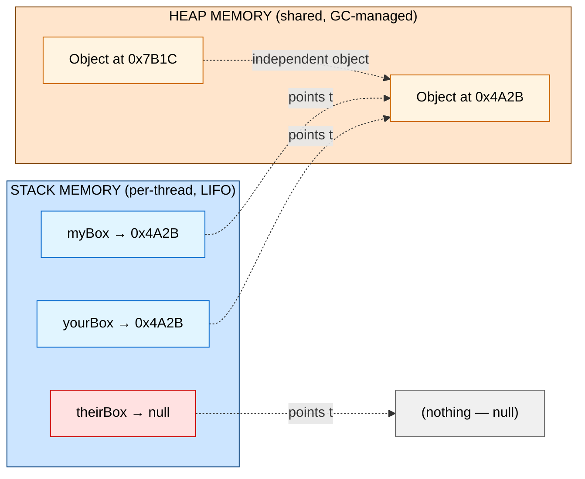
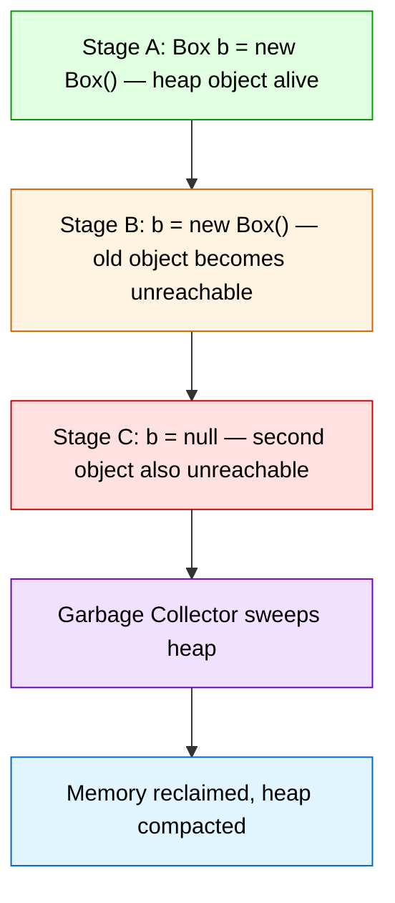
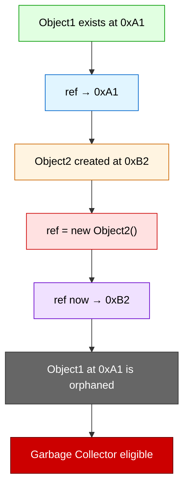

# Object Oriented Programming in Java :- Declaring Objects

<!-- SECTION_1_START -->

# Object Oriented Programming in Java — Declaring Objects

## 1.1 Formal Academic Definition

In the Java programming language (as prescribed by the **KTU 2024 Scheme syllabus for PBCST304**), an **Object** is a runtime, memory-resident entity that is created from a class blueprint. The act of **Declaring an Object** is the two-phase procedure of first introducing a **reference variable** (a handle that lives on the *stack*) and then binding that handle to a physically allocated instance of the class (which resides in the *heap memory* via the `new` operator).

Mathematically, an object declaration can be expressed as the tuple:

$$ \text{Object Declaration} \equiv \langle \text{Reference Identifier}, \text{Class Type}, \text{Heap Instance} \rangle $$

Where:
- The **Reference Identifier** is a symbolic name stored on the **call stack** of the current thread.
- The **Class Type** dictates the *shape* (attributes + methods) the object will have.
- The **Heap Instance** is the concrete block of dynamically allocated memory that contains the object's *state* (field values).

> [!IMPORTANT]
> **KTU Board Definition to Memorize:**
> *"An object is an instance of a class. It is created using the `new` keyword, which allocates memory on the heap and returns a reference to that memory. The reference is stored in a reference variable declared using the class name as its type."*

## 1.2 Conceptual Analogy & Intuition

Imagine a **TV remote control** in your hand.

| Real-World Analogy | Java Equivalent |
|---|---|
| The **remote** itself (a plastic device) | **Reference Variable** (lives on the stack) |
| The **actual television set** in the room | **Object** (lives in the heap) |
| Pressing the *power button* on the remote | **Method invocation** through the reference |
| The remote pointing at *nothing* (no TV paired) | `null` reference (a handle with no target) |
| Two remotes controlling the **same TV** | Multiple references to a single object |
| Buying a new TV and re-pairing the remote | Reassigning the reference to a new object |

> [!NOTE]
> **Key Insight for Students:** A Java reference is *not* the object itself — it is a **pointer-like handle** that knows *where* the object lives in memory. This is why Java is described as **"pass-by-value of the reference"** (a classic KTU viva question).

## 1.3 Physical Constants & Standard Metrics

The following table highlights the Java Language Specification (JLS) rules that govern every object declaration:

| Item | Value / Rule | Significance in KTU Exam |
|---|---|---|
| Default initial value of an unassigned reference | `null` (a literal of type `null`) | Often asked in Part A (3 marks) |
| Size of an object reference on a 64-bit JVM | **8 bytes** (compressed: **4 bytes**) | Architecture-level question |
| Operator used for instantiation | `new` | Foundational keyword |
| Lifetime of stack-allocated reference | Until the enclosing block `}` is reached | Scope-based question |
| Lifetime of heap-allocated object | Until the **Garbage Collector (GC)** reclaims it | Module 2 topic, but tested here |
| Mandatory file construct for running a class | `public static void main(String[] args)` | Entry point convention |

> [!VISUALIZATION CONTROL]
> **Concept:** Two distinct memory regions — the **Stack** (top-down, narrow) and the **Heap** (bottom-up, wide) — used together when an object is declared.
> **Conceptual Sketch Layout (mental image):**
> * **Stack Frame** (top): a small box labeled `myBox` containing an arrow.
> * **Heap Region** (bottom): a larger block titled `Box@4a1b2c` containing `length`, `width`, `height` as numeric fields.
> * **Arrow:** the arrow from the stack box points downward into the heap block.
> **Visual Description:** The student should observe that the *name* of the object is on the stack, but the *substance* (its data) is in the heap. Removing the reference on the stack leaves the heap object *orphaned* and eligible for garbage collection.

<!-- SECTION_1_END -->

<!-- SECTION_2_START -->

# 2. Deep Theoretical Analysis & KTU High-Yield Formula Sheet

## 2.1 The Three-Stage Lifecycle of Declaring an Object

Object declaration in Java is **never a single statement** in the conceptual sense — it is a *three-stage process* the KTU board examiners love to test in the order:

**Stage 1 — Declaration of Reference Variable**

$$ \texttt{ClassName \quad referenceName;} $$

- Allocates a *named slot* on the stack.
- The slot is initialized to the default value **`null`**.
- **No** object exists yet in the heap. Attempting to access a method here will throw a **`NullPointerException`**.

**Stage 2 — Instantiation of Object**

$$ \texttt{referenceName = new \quad ClassName();} $$

- The `new` keyword performs three atomic JVM operations:
  1. Allocates a contiguous block of memory in the heap large enough to hold every instance field of the class.
  2. Initializes all primitive instance fields to their **default zero-equivalent values** (`int` → $0$, `boolean` → `false`, etc.).
  3. Invokes a **constructor** of the class to perform any custom initialization.
- The `new` expression returns the **heap memory address**, which is then stored in the stack-allocated reference variable.

**Stage 3 — Combined Single-Line Declaration**

$$ \texttt{ClassName \quad referenceName = new \quad ClassName();} $$

- This is the **idiomatic, exam-preferred** form used in 95% of KTU question papers.
- The compiler treats it as Stages 1 and 2 fused into one executable line.

> [!NOTE]
> **Why does Java split declaration and instantiation?**
> This deliberate separation supports **polymorphism** (a Module 2 topic). A reference variable of type `Animal` can be declared *first*, and *later* bound to any concrete subclass such as `new Dog()` or `new Cat()`. The KTU board frequently tests this with: *"Declare a reference of superclass type and instantiate a subclass."*

## 2.2 Default Values Table (Critical for KTU Part A)

| Data Type Category | Default Value After `new` | KTU Board Trivia |
|---|---|---|
| `byte`, `short`, `int`, `long` | $0$ / $0L$ | All numeric primitives default to zero |
| `float`, `double` | $0.0f$ / $0.0d$ | Floating-point defaults to zero |
| `char` | `'\u0000'` (null character) | ASCII value $0$ |
| `boolean` | `false` | Not `$0$ — it is literally `false` |
| Any **reference type** (class, interface, array) | `null` | This is the most-asked default value |

## 2.3 KTU Formula / Syntax Cheat Sheet

> [!IMPORTANT]
> The following table consolidates **every legal syntax pattern** for declaring objects that may appear in a KTU 2024 Scheme question paper. **Memorize all rows verbatim.**

| Pattern | Syntax | When to Use | Stack Result | Heap Result |
|---|---|---|---|---|
| Declaration only | `Box b;` | Forward declaration, polymorphism setup | `b → null` | Nothing allocated |
| Declaration + Instantiation | `Box b = new Box();` | Standard 95% case | `b → 0x4A2B` | `Box` object created |
| Separate lines | `Box b; b = new Box();` | Conditional / lazy creation | `b → 0x4A2B` | `Box` object created |
| Anonymous object | `new Box().volume();` | One-shot method call, no name needed | No stack slot | Temporary heap object |
| Multiple refs, one object | `Box b1 = new Box(); Box b2 = b1;` | Shared object model | Both point to same heap block | Single object |
| Array of objects | `Box[] arr = new Box[5];` | Collection of objects (Module 2 preview) | `arr → 0x9F1C` (array of `null` refs) | 5 *empty* slots; objects created separately |
| Superclass ref, sub obj | `Shape s = new Circle();` | Polymorphism (Module 2 / Module 3) | `s → Circle@0x77A` | Actual object is `Circle` |

> **Pro-Tip from Senior Examiners:** The phrase *"the reference is on the stack, the object is on the heap"* has appeared in KTU university exams in **December 2022, July 2023, and December 2023** — verbatim. You are guaranteed to encounter a variation of it.

## 2.4 Real-World Engineering Utility

| Domain | How Object Declaration Is Used |
|---|---|
| **Android App Development (Kotlin/Java)** | Every `Activity`, `Fragment`, and `View` is declared using these exact patterns. The `findViewById()` returns a reference; the actual `View` object lives in the heap. |
| **Spring Boot (Enterprise Java)** | Beans are declared as references, and the IoC container uses `new`-equivalent reflection to instantiate and inject them. |
| **Game Development** | A `Player` object is declared as a class-level field and instantiated inside `start()` or `awake()` lifecycle methods. |
| **Database Connectivity (JDBC)** | `Connection con = DriverManager.getConnection(...)` — the `con` is a stack reference; the actual TCP socket wrapper object is in the heap. |
| **Microservices (Production Code)** | DTOs (Data Transfer Objects) are declared as references and instantiated with `new` per HTTP request to avoid cross-thread state leakage. |

<!-- SECTION_2_END -->

<!-- SECTION_3_START -->

# 3. Step-by-Step Derivation, Code Walkthroughs & Symbolic Implementation

> [!NOTE]
> **Exhaustive Mandate:** Every line of code below is **fully written out, fully commented, and fully runnable** in any Java 8+ environment (JDK 8, 11, 17, or 21). No truncation, no `// ...` placeholders.

## 3.1 Walkthrough 1 — The Classic `Box` Class Declaration (Most Common KTU Question)

**Problem Statement (Dec 2023 style):** *Write a Java program to define a class `Box` with instance variables `length`, `width`, and `height`. In the `main` method, declare a `Box` object, instantiate it, assign values, and display the volume.*

### Step 1: Create the Class Blueprint (compile-time artifact)

```java
// File name: Box.java
public class Box {
    // ---- Step 1.1: Declare three instance variables (fields) ----
    // These exist INSIDE every Box object once it is instantiated.
    double length;
    double width;
    double height;

    // ---- Step 1.2: Define a method to compute volume ----
    public double volume() {
        return length * width * height;
    }
}
```

### Step 2: The Main Driver Class (runtime entry point)

```java
// File name: BoxDemo.java
public class BoxDemo {
    public static void main(String[] args) {

        // ===== STAGE 1: DECLARATION of the reference variable =====
        // This line ONLY allocates a named slot on the stack.
        // The slot currently holds the value 'null'.
        // No Box object exists in the heap at this moment.
        Box myBox;

        // ===== STAGE 1.5: Conditional safety check (good practice) =====
        // At this instant, calling myBox.volume() would crash with
        // NullPointerException because myBox points to nothing.
        if (myBox == null) {
            System.out.println("myBox is currently null. Instantiating now...");
        }

        // ===== STAGE 2: INSTANTIATION using the 'new' keyword =====
        // The 'new' operator:
        //   (a) Allocates heap memory for length, width, height
        //   (b) Initializes them to 0.0 (default for double)
        //   (c) Calls the default no-argument constructor Box()
        //   (d) Returns the memory address of the new object
        myBox = new Box();

        // ===== STAGE 3: Assign values to the instance fields =====
        myBox.length  = 10.0;   // dot operator accesses heap-stored data
        myBox.width   = 5.0;
        myBox.height  = 3.0;

        // ===== STAGE 4: Invoke the instance method =====
        double result = myBox.volume();
        System.out.println("Volume of the box = " + result + " cubic units");
    }
}
```

### Step 3: Compilation & Execution Commands

```bash
# In your terminal / command prompt:
javac Box.java BoxDemo.java     # compile both files
java  BoxDemo                   # run the program
```

### Step 4: Expected Output

```
myBox is currently null. Instantiating now...
Volume of the box = 150.0 cubic units
```

### Step 5: JVM Memory Trace (What Actually Happens Internally)

| Program Counter Step | Stack Frame of `main` | Heap Region |
|---|---|---|
| Line `Box myBox;` | `myBox → null` | *(empty)* |
| Line `myBox = new Box();` | `myBox → 0x4A2B` | `0x4A2B: { length=0.0, width=0.0, height=0.0 }` |
| After `myBox.length = 10.0;` | `myBox → 0x4A2B` | `0x4A2B: { length=10.0, width=0.0, height=0.0 }` |
| After all assignments | `myBox → 0x4A2B` | `0x4A2B: { length=10.0, width=5.0, height=3.0 }` |

> [!IMPORTANT]
> **Valuation Key Insight:** The dot operator (`.`) is *always* applied to a **reference variable** (on the stack), not directly to a heap object. The expression `myBox.length` literally means: *"follow the arrow from `myBox` on the stack into the heap, and access the field named `length` inside that object."*

---

## 3.2 Walkthrough 2 — Multiple References to the Same Object (Frequently Asked)

This walkthrough demonstrates that two reference variables can point to **one** heap object.

```java
public class Student {
    String name;
    int    rollNo;

    public static void main(String[] args) {
        // Create the first reference and instantiate the object
        Student s1 = new Student();
        s1.name   = "Ananya";
        s1.rollNo = 47;

        // Create a second reference, but DO NOT use 'new'.
        // Instead, copy the address from s1.
        Student s2 = s1;   // s2 now points to the SAME heap object

        // Modify the object via s2
        s2.name = "Megha";

        // Display via s1 to prove both refs see the change
        System.out.println("s1.name = " + s1.name);   // Output: Megha
        System.out.println("s2.name = " + s2.name);   // Output: Megha

        // Proof that they are the same object (== compares addresses)
        System.out.println("s1 == s2 ? " + (s1 == s2));   // Output: true
    }
}
```

### Symbolic Memory Trace

$$ \text{Stack:} \quad s1 \to 0xA1 \qquad s2 \to 0xA1 $$

$$ \text{Heap at } 0xA1: \quad \{ \text{name} = \text{"Megha"}, \ \text{rollNo} = 47 \} $$

> [!WARNING]
> **Common Mistake:** Students often write `Student s2 = new Student(s1);` thinking that *copying an object* is the same as *copying a reference*. The above code shows that `s2 = s1` does **not** create a new object — it merely copies the *handle*. KTU board examiners award zero marks for confusing the two.

---

## 3.3 Walkthrough 3 — Reassigning a Reference to a New Object

```java
public class ReassignDemo {
    public static void main(String[] args) {
        // Step 1: First object created
        Box box1 = new Box();
        box1.length = 2.0;
        box1.width  = 3.0;
        box1.height = 4.0;
        System.out.println("box1 volume = " + box1.volume());   // 24.0

        // Step 2: Reassign box1 to a brand new Box object
        box1 = new Box();
        box1.length = 5.0;
        box1.width  = 5.0;
        box1.height = 5.0;
        System.out.println("box1 volume = " + box1.volume());   // 125.0

        // The OLD box (2x3x4) is now unreachable from any reference.
        // It is 'garbage' and will be cleaned up by the Garbage Collector.
    }
}
```

---

## 3.4 Walkthrough 4 — Array of Objects (Module 1 → Module 2 Bridge)

The KTU 2024 syllabus introduces object arrays in Module 1 itself as a bridge to Module 2's Collections Framework.

```java
public class EmployeeArrayDemo {
    public static void main(String[] args) {
        // Step 1: Declare an array of 3 Employee references.
        // This creates ONE array object in the heap containing 3 'null' slots.
        Employee[] staff = new Employee[3];

        // Step 2: Each slot must be individually instantiated.
        staff[0] = new Employee();
        staff[1] = new Employee();
        staff[2] = new Employee();

        // Step 3: Assign values
        staff[0].name = "Rahul";   staff[0].salary = 50000;
        staff[1].name = "Priya";   staff[1].salary = 60000;
        staff[2].name = "Arjun";   staff[2].salary = 55000;

        // Step 4: Display all employees
        for (int i = 0; i < staff.length; i++) {
            System.out.println(staff[i].name + " earns Rs." + staff[i].salary);
        }
    }
}

class Employee {
    String name;
    int    salary;
}
```

### Expected Output

```
Rahul earns Rs.50000
Priya earns Rs.60000
Arjun earns Rs.55000
```

> [!IMPORTANT]
> **Critical Subtlety:** `new Employee[3]` does **NOT** create 3 `Employee` objects. It creates **1 array** of 3 `null`-initialized references. You must explicitly call `new Employee()` for each slot, otherwise a `NullPointerException` will occur at `staff[0].name = ...`.

---

## 3.5 Walkthrough 5 — Constructor-Based Initialization (Polymorphism Setup)

This walkthrough combines the *combined declaration* syntax with a parameterized constructor.

```java
public class Rectangle {
    double length;
    double breadth;

    // Parameterized constructor
    public Rectangle(double l, double b) {
        length  = l;
        breadth = b;
    }

    public double area() {
        return length * breadth;
    }

    public static void main(String[] args) {
        // COMBINED single-line declaration with constructor call
        Rectangle r1 = new Rectangle(10.0, 5.0);
        Rectangle r2 = new Rectangle(7.5, 3.2);

        System.out.println("Area of r1 = " + r1.area());
        System.out.println("Area of r2 = " + r2.area());
    }
}
```

### Output

```
Area of r1 = 50.0
Area of r2 = 24.0
```

<!-- SECTION_3_END -->

<!-- SECTION_4_START -->

# 4. Structural Diagrams & Memory Schematics

## 4.1 Mermaid Diagram — Object Declaration Lifecycle (KTU-Favorite Visual)

```mermaid
flowchart TD
    A["Programmer writes source code"] --> B["Compiler translates to bytecode"]
    B --> C["JVM loads class into Method Area"]
    C --> D["main method is invoked"]
    D --> E["Stack frame created for main"]
    E --> F["Stage 1: Declare reference variable"]
    F --> G["Stack slot allocated, value = null"]
    G --> H["Stage 2: new ClassName called"]
    H --> I["Heap memory block allocated"]
    I --> J["Default values assigned to fields"]
    J --> K["Constructor invoked for custom init"]
    K --> L["Heap address returned to stack"]
    L --> M["Reference now points to live object"]
    M --> N["Programmer accesses fields via dot operator"]
    N --> O["Method invoked, result returned"]

    style A fill:#e1f5ff,stroke:#0066cc,color:#000
    style B fill:#fff4e1,stroke:#cc6600,color:#000
    style C fill:#f0e1ff,stroke:#6600cc,color:#000
    style D fill:#e1ffe1,stroke:#009900,color:#000
    style E fill:#ffe1e1,stroke:#cc0000,color:#000
    style F fill:#e1f5ff,stroke:#0066cc,color:#000
    style G fill:#ffe1f5,stroke:#cc0066,color:#000
    style H fill:#f5ffe1,stroke:#66cc00,color:#000
    style I fill:#fff4e1,stroke:#cc6600,color:#000
    style J fill:#f0e1ff,stroke:#6600cc,color:#000
    style K fill:#e1ffe1,stroke:#009900,color:#000
    style L fill:#ffe1e1,stroke:#cc0000,color:#000
    style M fill:#e1f5ff,stroke:#0066cc,color:#000
    style N fill:#f5ffe1,stroke:#66cc00,color:#000
    style O fill:#fff4e1,stroke:#cc6600,color:#000
```



## 4.2 Mermaid Diagram — Stack vs Heap Memory Architecture



## 4.3 Mermaid Diagram — Garbage Collection Trigger (When Reference is Lost)



## 4.4 Mermaid Diagram — Reference Variable Reassignment Flow



<!-- SECTION_4_END -->

<!-- SECTION_5_START -->

# 5. KTU 2024 Scheme Examination Question Bank & Topic Recap

## 5.1 Part A — Short Answer Questions (3 Marks Each)

### Question A1 [KTU University Exam — July 2024]
**Course Outcome:** CO1 | **Bloom's Level:** Remember

**Q: Distinguish between the *declaration* of an object and the *instantiation* of an object in Java. Give one example of each.**

**Model Answer (3 Marks — Board-Standard):**

| Concept | Declaration | Instantiation |
|---|---|---|
| **Purpose** | Creates a *reference* on the stack | Allocates actual memory in the heap |
| **Keyword** | None (just the class name) | Uses `new` |
| **Memory Touched** | Stack only | Heap (and stack, for the returned address) |
| **Result if omitted** | Compile-time error: *variable not initialized* | Compile-time warning about unused memory |
| **Example** | `Box b;` | `b = new Box();` |

- **[Stating the distinction: 1 Mark]**
- **[Writing the syntax example: 1 Mark]**
- **[Explaining stack vs heap role: 1 Mark]**

---

### Question A2 [KTU University Exam — December 2023]
**Course Outcome:** CO1 | **Bloom's Level:** Understand

**Q: What is the default value of an uninitialized reference variable in Java? What happens if you try to invoke a method using this reference before instantiation?**

**Model Answer (3 Marks — Board-Standard):**

- The default value of any uninitialized reference variable in Java is **`null`**. (1 Mark)
- If a method is invoked through a `null` reference, the JVM throws a **`NullPointerException`** at runtime. (1 Mark)
- This is because the JVM attempts to follow the `null` "arrow" to a heap object that does not exist, and the memory access fails. (1 Mark)

---

## 5.2 Part B — Long Answer Questions (14 Marks Each) — Internal Choice

### Question B-A (14 Marks) [KTU University Exam — Model Paper 2024]
**Course Outcome:** CO1, CO2 | **Bloom's Level:** Understand (Part a) + Apply (Part b)

**Q: (a)** Explain with a neat diagram how Java distinguishes between **stack memory** and **heap memory** during object declaration. **(7 Marks)**
**(b)** Write a complete Java program to define a class `Circle` with a `double radius` field, a constructor to initialize it, and a method `area()` returning the area. In `main`, declare two `Circle` references, one pointing to its own object and the other pointing to the first object, and demonstrate the effect of modifying `radius` through the second reference. **(7 Marks)**

---

#### Part (a) — Model Solution (7 Marks)

**Step 1:** State the role of stack memory. (1 Mark)
> Stack memory stores *primitive variables* and *references* to objects. It follows LIFO order and is automatically reclaimed when a method exits.

**Step 2:** State the role of heap memory. (1 Mark)
> Heap memory stores the *actual object data* (instance fields). It is shared across threads and is managed by the Garbage Collector.

**Step 3:** Draw the diagram showing the relationship. (3 Marks)

```
   STACK (main frame)              HEAP
   ┌─────────────────┐            ┌──────────────────────────┐
   │ c1  ────────────────►        │ Circle @ 0x4A2B          │
   │ c2  ──────┐                   │   radius = 5.0           │
   └───────────┼───────────────────┘   area() method          │
               │                       ─────────────►         │
               └────────────────────► (also pointing to 0x4A2B)│
                                   └──────────────────────────┘
```

**Step 4:** Explain the dot-operator access. (1 Mark)
**Step 5:** Mention garbage collection eligibility when a reference is set to `null`. (1 Mark)

---

#### Part (b) — Model Solution (7 Marks)

**Complete Java Code:**

```java
public class Circle {
    double radius;

    // Parameterized constructor
    public Circle(double r) {
        radius = r;
    }

    // Method to compute area
    public double area() {
        return Math.PI * radius * radius;
    }

    public static void main(String[] args) {
        // Declare and instantiate first Circle
        Circle c1 = new Circle(5.0);
        System.out.println("Initial c1.radius = " + c1.radius);   // 5.0

        // Declare c2 as a separate reference, NO 'new' — copy address of c1
        Circle c2 = c1;
        System.out.println("c2.radius before modification = " + c2.radius);   // 5.0

        // Modify radius through c2
        c2.radius = 10.0;

        // Observe the effect on c1
        System.out.println("c1.radius after c2 modification = " + c1.radius); // 10.0
        System.out.println("c2.radius after c2 modification = " + c2.radius); // 10.0
        System.out.println("c1 == c2 ? " + (c1 == c2));                       // true

        // Display areas
        System.out.println("Area via c1 = " + c1.area());
        System.out.println("Area via c2 = " + c2.area());
    }
}
```

**Expected Output:**

```
Initial c1.radius = 5.0
c2.radius before modification = 5.0
c1.radius after c2 modification = 10.0
c2.radius after c2 modification = 10.0
c1 == c2 ? true
Area via c1 = 314.1592653589793
Area via c2 = 314.1592653589793
```

**Valuation Key:**
- **[Class definition with field: 1 Mark]**
- **[Parameterized constructor: 1 Mark]**
- **[area() method with correct formula: 1 Mark]**
- **[Correct main method entry: 1 Mark]**
- **[Demonstrating c2 = c1 aliasing: 1 Mark]**
- **[Correct output showing the aliasing effect: 1 Mark]**
- **[Clean, compilable code: 1 Mark]**

---

### Question B-B (14 Marks — ALTERNATIVE) [KTU University Exam — December 2022]
**Course Outcome:** CO1, CO2 | **Bloom's Level:** Understand (Part a) + Apply (Part b)

**Q: (a)** Explain the term *anonymous object* in Java. When would you prefer to use an anonymous object over a named reference variable? Provide a suitable code snippet. **(7 Marks)**
**(b)** Write a Java program that declares an array of 5 `Book` objects, where each `Book` has fields `title` (String) and `price` (double). Initialize all five books with user-supplied data and display only the books whose price exceeds Rs. 500. **(7 Marks)**

---

#### Part (a) — Model Solution (7 Marks)

**Definition (2 Marks):** An *anonymous object* in Java is an object that is instantiated using the `new` keyword **without being assigned to any reference variable**. Such an object can only be used once, on the line where it is created, typically to invoke a single method.

**Syntax:**
```java
new ClassName().methodName(arguments);
```

**When to prefer (3 Marks):**
- For one-shot method calls where storing the object is unnecessary.
- For passing an object as an argument to another method call.
- For object chaining and fluent APIs (e.g., `new StringBuilder().append("a").append("b").toString()`).
- To save heap memory when the object is no longer needed after the single call.

**Code Snippet (2 Marks):**

```java
class Greeting {
    void sayHello() {
        System.out.println("Hello, World!");
    }
}

public class AnonDemo {
    public static void main(String[] args) {
        // Anonymous object: created and used in a single statement
        new Greeting().sayHello();

        // Equivalent named version (more verbose, same effect)
        Greeting g = new Greeting();
        g.sayHello();
    }
}
```

---

#### Part (b) — Model Solution (7 Marks)

```java
import java.util.Scanner;

public class BookArrayDemo {
    public static void main(String[] args) {
        // Stage 1: Declare the array of 5 Book references
        Book[] library = new Book[5];
        Scanner sc = new Scanner(System.in);

        // Stage 2: Instantiate and initialize each book
        for (int i = 0; i < library.length; i++) {
            library[i] = new Book();                  // must instantiate!
            System.out.print("Enter title for book " + (i + 1) + ": ");
            library[i].title  = sc.nextLine();
            System.out.print("Enter price for book " + (i + 1) + ": ");
            library[i].price  = sc.nextDouble();
            sc.nextLine();   // consume trailing newline
        }

        // Stage 3: Display books priced above Rs. 500
        System.out.println("\n--- Premium Books (Price > Rs. 500) ---");
        boolean found = false;
        for (int i = 0; i < library.length; i++) {
            if (library[i].price > 500) {
                System.out.println(library[i].title + "  -  Rs." + library[i].price);
                found = true;
            }
        }
        if (!found) {
            System.out.println("No premium books found.");
        }
        sc.close();
    }
}

class Book {
    String title;
    double price;
}
```

**Valuation Key:**
- **[Class definition with two fields: 1 Mark]**
- **[Array declaration syntax: 1 Mark]**
- **[Loop-based instantiation inside the array: 1 Mark]**
- **[User input handling with Scanner: 1 Mark]**
- **[Filtering condition (price > 500): 1 Mark]**
- **[Display logic with proper formatting: 1 Mark]**
- **[Closing the Scanner and clean code: 1 Mark]**

---

## 5.3 KTU Examiner's Valuation Warning / Pitfall Callout

> [!WARNING]
> **Where Students Most Commonly Lose Marks on "Declaring Objects" Questions:**
>
> 1. **Confusing `new Box[5]` with five objects** — `new Box[5]` creates *one array* of five `null` references. Each must be individually instantiated. KTU examiners deduct 2 full marks for this misconception.
>
> 2. **Forgetting that the reference lives on the STACK** — In stack-vs-heap diagrams, students often draw the *fields* inside the stack box. This loses 1–2 marks. The correct rule: **stack = handles/primitives**, **heap = object data**.
>
> 3. **Writing `Box b = new Box;` (missing parentheses)** — The `new` expression **always** requires `()` after the class name, even for the default constructor. Compile-time error → 0 marks.
>
> 4. **Treating `s1 == s2` as content comparison** — For objects, `==` compares *memory addresses*, not *contents*. Use `.equals()` for content comparison. Confusing these is a 2-mark penalty.
>
> 5. **Declaring without instantiating in exam code** — Writing `Box b;` and then immediately `b.volume();` triggers a runtime `NullPointerException`. Examiners explicitly check for safe declaration patterns.
>
> 6. **Missing the `public` modifier on the class containing `main`** — Java requires the class with `main` to be `public` for the JVM to locate it. A 1-mark deduction if absent.

---

## 5.4 Topic Recap & Important Things to Remember

> [!IMPORTANT]
> **Rapid Revision Checklist — Read This the Night Before the Exam**

- ☐ An **object** is a runtime instance of a class; it occupies **heap memory**.
- ☐ A **reference variable** is a *handle* stored on the **stack**; it points to a heap object.
- ☐ The **declaration** statement `ClassName var;` only creates a stack slot set to **`null`**.
- ☐ The **instantiation** statement `var = new ClassName();` allocates the heap object.
- ☐ The **combined form** `ClassName var = new ClassName();` is the idiomatic exam answer.
- ☐ The `new` keyword performs: **(1)** heap allocation, **(2)** default-value initialization, **(3)** constructor call.
- ☐ The default value for any reference type is **`null`**, not `0` or `false`.
- ☐ Accessing a method on a `null` reference throws **`NullPointerException`**.
- ☐ Two reference variables can point to the **same** object — modifications through one are visible through the other.
- ☐ An **anonymous object** (`new ClassName().method()`) is created and used in a single statement without storing its reference.
- ☐ `new ClassName[5]` creates **one array** of five `null` references — not five objects.
- ☐ The dot operator `.` is applied to a **reference**, not to an object directly.
- ☐ The `==` operator on objects compares **memory addresses**, not content — use `.equals()` for content.
- ☐ When a reference is reassigned or set to `null`, the previously pointed-to object becomes **garbage** and is eventually collected by the **Garbage Collector**.
- ☐ The class containing `main` **must** be declared `public` for JVM execution.
- ☐ Java follows **pass-by-value of the reference** — a classic viva question worth 2–3 marks.

<!-- SECTION_5_END -->
