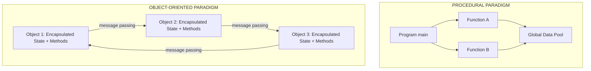
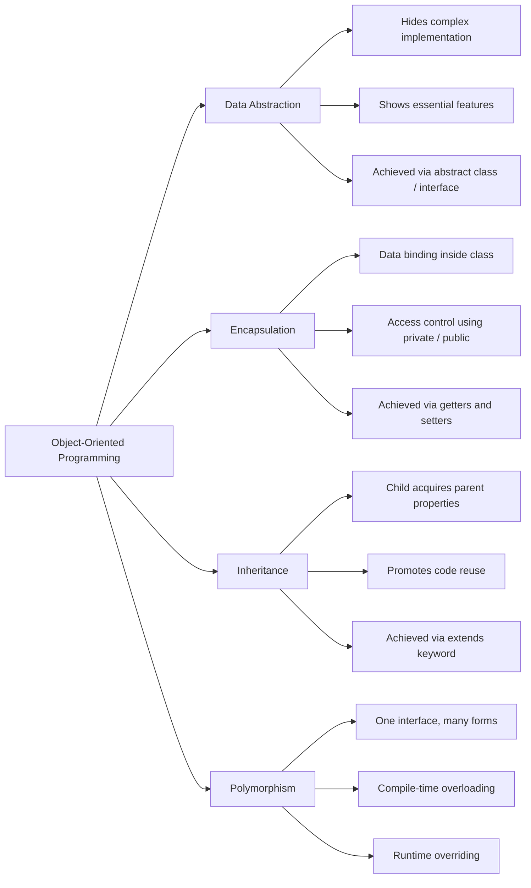
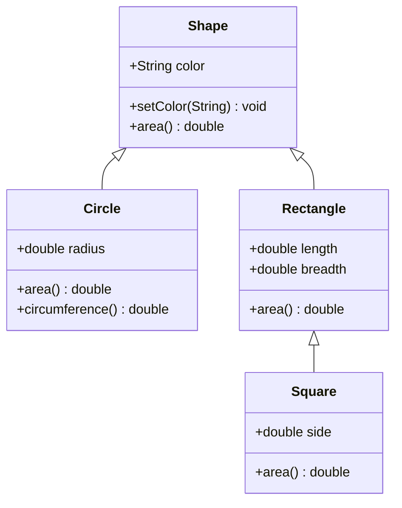
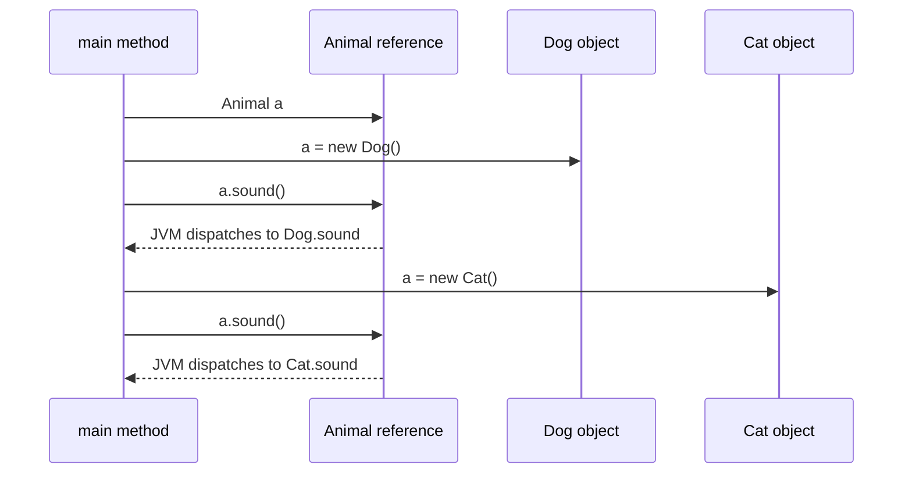
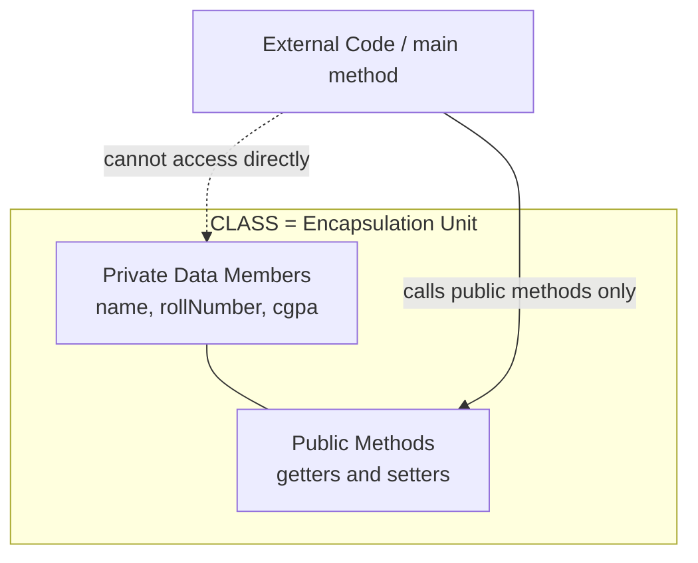

# OOP Concepts :- Data abstraction, encapsulation, inheritance, polymorphism, Procedural and object oriented programming paradigm

<!-- SECTION_1_START -->

# Object-Oriented Programming (OOP) Concepts

## 1. Core Technical Definitions (KTU 2024 Syllabus Terminology)

> [!IMPORTANT]
> **OOP Definition (KTU Board Standard):**
> *Object-Oriented Programming (OOP)* is a **programming paradigm** built around **objects** that bundle together **data** (attributes/state) and **behaviour** (methods/functions), rather than logic and procedures acting upon data. The four foundational pillars are: **Data Abstraction, Encapsulation, Inheritance, and Polymorphism**.

### 1.1 The Four Pillars of OOP — Formal Definitions

| Pillar | KTU Board Definition |
|---|---|
| **Data Abstraction** | Hiding complex implementation details and exposing only the essential *features* (relevant data and methods) of an object to the outside world. |
| **Encapsulation** | The mechanism of **binding** data (variables) and the code (methods) that operates on that data into a single unit (class), and **restricting** direct access to some of an object's components. |
| **Inheritance** | The mechanism by which a new class (child/sub-class) **acquires** the properties and methods of an existing class (parent/super-class), promoting code reuse. |
| **Polymorphism** | The ability of a single interface (method name) to represent **different underlying forms** (implementations) depending on the context (object type or parameters). |

---

### 1.2 Procedural vs. Object-Oriented Paradigm — Intuitive Analogy

> [!NOTE]
> **Conceptual Analogy — "The Restaurant Kitchen"**
> - **Procedural Programming** is like a chef who follows a *strict step-by-step recipe* (function calls) in a single large notebook. Every ingredient (data) is globally accessible to every recipe. If the chef renames an ingredient, the entire notebook must be re-checked.
> - **Object-Oriented Programming** is like a *modern modular kitchen*. Each station (object) has its own private pantry (encapsulated data) and its own tools (methods). Stations can inherit tools from the head-chef station (inheritance), and the same command "Plate the Dish" can produce different outputs depending on which station hears it (polymorphism).

### 1.3 Key Terminology Snapshot

> [!IMPORTANT]
> **Mandatory KTU Glossary Terms:**
> - **Class** — A *blueprint/template* for creating objects (defines attributes and methods).
> - **Object** — A *runtime instance* of a class (occupies memory, has identity, state, behaviour).
> - **Message Passing** — The process by which objects **communicate** by calling each other's methods.
> - **Dynamic Binding** — Linking a procedure call to the actual code at **runtime** (essential for runtime polymorphism in Java).
> - **Access Specifiers** — `private`, `default`, `protected`, `public` — the access-control keywords used in Java encapsulation.

### 1.4 The Three Core Principles of OOP (As Per KTU Module 1 Syllabus)

$$ \text{OOP} = \underbrace{\text{Encapsulation}}_{\text{Binding + Hiding}} + \underbrace{\text{Inheritance}}_{\text{Reuse + Hierarchy}} + \underbrace{\text{Polymorphism}}_{\text{One Interface, Many Forms}} $$

> [!TIP]
> **Quick Recall Mnemonic:** "**E**ngineers **I**nherit **P**olymorphic **A**bstractions" → **E**ncapsulation, **I**nheritance, **P**olymorphism, **A**bstraction.

<!-- SECTION_1_END -->

<!-- SECTION_2_START -->

# Deep Theoretical Analysis & KTU High-Yield Notes

## 2.1 Procedural vs. Object-Oriented Programming — Detailed Comparison

| Feature | Procedural (C, Pascal) | Object-Oriented (Java, C++) |
|---|---|---|
| **Primary Unit** | Function / Procedure | Class / Object |
| **Data Handling** | Passed *between* functions (exposed) | Bundled *inside* objects (hidden) |
| **Code Reuse** | Copy-paste / function libraries | Inheritance & composition |
| **Extensibility** | Difficult — modifying code is risky | Easy — add new classes without breaking old ones |
| **Security** | Low — global data is openly accessible | High — `private`/`protected` access modifiers |
| **Real-world Mapping** | Algorithm-centric | Problem-domain-centric |
| **Examples** | C, FORTRAN, Pascal | Java, C++, Python, C# |
| **Bottom-up vs. Top-down** | Top-down (decomposition) | Bottom-up (object assembly) |

> [!NOTE]
> **KTU 2024 Board Note:** Java is a **pure OOP language** *with minor exceptions* (`int`, `char`, `float`, `double`, `boolean` primitives are not objects; static methods don't belong to any object). C++ is a *hybrid* OOP language because it supports both procedural (`main` with free functions) and OOP styles.

---

## 2.2 Data Abstraction — Mechanism of Hiding

### What is hidden vs. what is shown

> [!IMPORTANT]
> **The Two Layers of Abstraction in Java:**
> 1. **Abstract Data Type (ADT)** — A mathematical model for data types where a data type is defined by its *behaviour* (semantics) rather than its *implementation*.
> 2. **Abstract Class / Interface** — Java language constructs that let you *declare* method signatures without providing the body, forcing subclasses to supply the actual implementation.

### Java Implementation Tools for Abstraction

$$ \text{Abstraction in Java} = \begin{cases} \textbf{abstract class} & \text{Partial abstraction (0 to 100\% abstract methods)} \\ \textbf{interface} & \text{100\% abstraction (pre-Java 8); default/static methods from Java 8} \end{cases} $$

### Real-world Analogy
> [!TIP]
> **Car Dashboard Analogy** — You press the **brake pedal** (abstract interface). You do **not** need to know how hydraulic fluid moves through pipes to brake pads. The complex *implementation* is hidden; the *essential feature* (slowing the car) is exposed.

---

## 2.3 Encapsulation — Binding + Data Hiding

### The Encapsulation Formula

$$ \text{Encapsulation} = \text{Data Binding} + \text{Access Control} $$

### Java Implementation Pattern (Universal KTU Template)

| Step | Java Construct | Purpose |
|---|---|---|
| 1 | Declare instance variables as **`private`** | Restrict direct outside access |
| 2 | Provide **`public` getter** methods | Read-only access |
| 3 | Provide **`public` setter** methods | Validated write access |
| 4 | Add validation logic inside setters | Enforce business rules |

### Why Encapsulation? (KTU Board Favourite Question)

> [!IMPORTANT]
> - **Data Protection:** Prevents external code from corrupting object state.
> - **Flexibility:** Internal implementation can change without affecting external callers.
> - **Maintainability:** Validation rules are centralised in one place.
> - **Reusability:** Self-contained objects can be plugged into any system.

---

## 2.4 Inheritance — The "IS-A" Relationship

### Inheritance Hierarchy Notation

$$ \text{Parent (Super-class)} \xrightarrow{\text{extends}} \text{Child (Sub-class)} $$

In Java, this is achieved using the `extends` keyword for classes and the `implements` keyword for interfaces.

### Types of Inheritance (KTU Must-Know Table)

| Type | Diagram | Java Support |
|---|---|---|
| **Single** | A → B | ✅ Yes |
| **Multilevel** | A → B → C | ✅ Yes |
| **Hierarchical** | A → B, A → C, A → D | ✅ Yes |
| **Multiple (class)** | A, B → C | ❌ No (use interfaces) |
| **Hybrid** | Mix of multiple + hierarchical | ❌ No (resolved via interfaces) |

> [!WARNING]
> **KTU Examiner Alert:** Java **does NOT support multiple inheritance with classes** to avoid the **"Diamond Problem"** (ambiguity when two parent classes have the same method). Java solves this with **interfaces** (Java 8+ default methods still require explicit override to resolve ambiguity).

### Inheritance Key Concepts

> [!NOTE]
> - **`super` keyword** — Refers to the immediate parent class (used to invoke parent constructor: `super()` or parent method: `super.methodName()`).
> - **Method Overriding** — Child class provides a *specific implementation* of a method already defined in the parent class (runtime polymorphism).
> - **`final` class** — Cannot be inherited (e.g., `String`, `Math` are final in Java).
> - **Constructor Chaining** — Parent constructor is called *before* child constructor body executes.

---

## 2.5 Polymorphism — "One Interface, Many Implementations"

### The Two Types of Polymorphism (Mandatory for KTU)

$$ \text{Polymorphism} = \begin{cases} \textbf{Compile-time (Static)} & \text{— Method Overloading} \\ \textbf{Runtime (Dynamic)} & \text{— Method Overriding} \end{cases} $$

| Aspect | Compile-time (Overloading) | Runtime (Overriding) |
|---|---|---|
| **Where Resolved** | Compiler (binding at compile time) | JVM (binding at runtime) |
| **Mechanism** | Same method name, *different parameter list* | Same method name AND signature in child class |
| **Also called** | Static binding / Early binding | Dynamic binding / Late binding |
| **Achieved by** | Changing number, type, or order of parameters | Inheritance + method override |
| **Return type** | May differ (with compatible covariant return) | Must be same (or covariant) |

### Operator Overloading in Java

> [!WARNING]
> **KTU Trap Question:** *"Does Java support operator overloading?"*
> **Answer:** Java provides **internal (built-in) operator overloading** for `+` (String concatenation) and `==` (primitive comparison vs. reference comparison). However, **user-defined operator overloading is NOT allowed** in Java (unlike C++). This is a deliberate design choice by James Gosling for *simplicity and security*.

---

## 2.6 Real-World Engineering Applications of OOP

> [!IMPORTANT]
> **Where OOP is used in production systems (KTU Industry Awareness Question):**
> 1. **GUI Frameworks** — Swing, JavaFX, Android (View hierarchy is inheritance-based).
> 2. **Game Development** — Unreal Engine, Unity use OOP for entity management.
> 3. **Enterprise Systems** — Spring Boot, J2EE use dependency injection (encapsulation).
> 4. **Database ORM** — Hibernate maps Java classes to DB tables (encapsulation + inheritance).
> 5. **Design Patterns** — Singleton, Factory, Observer, Strategy (all built on OOP pillars).
> 6. **Compiler Design** — AST nodes are objects; Visitor pattern uses polymorphism.

<!-- SECTION_2_END -->

<!-- SECTION_3_START -->

# Step-by-Step Java Code Implementation of OOP Concepts

## 3.1 Encapsulation — Complete Working Java Code

```java
// File: Student.java
// Demonstrates Encapsulation in Java (Data Hiding + Validation)

class Student {
    // STEP 1: Data is declared PRIVATE - hidden from outside world
    private String name;
    private int rollNumber;
    private double cgpa;

    // STEP 2: Constructor to initialise the object
    public Student(String name, int rollNumber, double cgpa) {
        this.name = name;
        setRollNumber(rollNumber);  // using setter for validation
        setCgpa(cgpa);              // using setter for validation
    }

    // STEP 3: Public getter for name (read-only access)
    public String getName() {
        return name;
    }

    // STEP 4: Public setter for rollNumber with validation
    public void setRollNumber(int rollNumber) {
        if (rollNumber > 0) {                    // validation logic
            this.rollNumber = rollNumber;
        } else {
            System.out.println("Invalid roll number. Setting to default 1.");
            this.rollNumber = 1;
        }
    }

    public int getRollNumber() {
        return rollNumber;
    }

    // STEP 5: Public setter for cgpa with validation
    public void setCgpa(double cgpa) {
        if (cgpa >= 0.0 && cgpa <= 10.0) {       // business rule
            this.cgpa = cgpa;
        } else {
            System.out.println("Invalid CGPA. Setting to 0.0");
            this.cgpa = 0.0;
        }
    }

    public double getCgpa() {
        return cgpa;
    }

    // STEP 6: Display method to show encapsulated data
    public void display() {
        System.out.println("Name: " + name + ", Roll: " + rollNumber + ", CGPA: " + cgpa);
    }
}

// File: Main.java (Driver class)
public class Main {
    public static void main(String[] args) {
        Student s1 = new Student("Arjun", 47, 9.2);
        s1.display();

        // s1.cgpa = 15.0;    // COMPILE ERROR: cgpa has private access
        s1.setCgpa(15.0);      // Validation kicks in, sets to 0.0
        s1.display();

        // s1.name = "X";     // COMPILE ERROR: name has private access
        System.out.println("Current name: " + s1.getName());
    }
}
```

### Output Trace
```text
Name: Arjun, Roll: 47, CGPA: 9.2
Invalid CGPA. Setting to 0.0
Name: Arjun, Roll: 47, CGPA: 0.0
Current name: Arjun
```

### Step-by-Step Explanation (Valuation Key)

| Code Line | Logic | Marks (Out of 7) |
|---|---|---|
| `private` variables | Data hiding | 1 Mark |
| Constructor | Object initialisation | 1 Mark |
| `public` getters | Controlled read | 1 Mark |
| `public` setters with validation | Controlled write | 2 Marks |
| `main()` method demonstration | Proof of access restriction | 1 Mark |
| Output correctness | Final result | 1 Mark |

---

## 3.2 Inheritance — Complete Working Java Code

```java
// File: Shape.java  -- Parent (Super) class
class Shape {
    String color;

    public Shape() {
        System.out.println("Shape constructor called");
    }

    public void setColor(String color) {
        this.color = color;
    }

    // Method to be overridden by child classes
    public double area() {
        return 0.0;   // generic default
    }
}

// File: Circle.java  -- Child class using 'extends'
class Circle extends Shape {
    double radius;

    public Circle(double radius) {
        super();                          // calls Shape() constructor
        this.radius = radius;
        System.out.println("Circle constructor called");
    }

    // METHOD OVERRIDING (Runtime Polymorphism)
    @Override
    public double area() {
        return Math.PI * radius * radius; // π × r²
    }
}

// File: Rectangle.java  -- Another child class
class Rectangle extends Shape {
    double length, breadth;

    public Rectangle(double l, double b) {
        super();
        this.length = l;
        this.breadth = b;
    }

    @Override
    public double area() {
        return length * breadth;          // l × b
    }
}

// File: MainInheritance.java
public class MainInheritance {
    public static void main(String[] args) {
        Shape s;                          // Parent reference

        s = new Circle(5.0);
        s.setColor("Red");
        System.out.println("Circle area: " + s.area());

        s = new Rectangle(4.0, 6.0);
        s.setColor("Blue");
        System.out.println("Rectangle area: " + s.area());
    }
}
```

### Output Trace
```text
Shape constructor called
Circle constructor called
Circle area: 78.53981633974483
Shape constructor called
Rectangle area: 24.0
```

### Step-by-Step Explanation
1. `Shape s;` — Parent reference variable declared.
2. `s = new Circle(5.0);` — Object of `Circle` is created; `super()` calls parent constructor.
3. `s.area()` — JVM decides at **runtime** which `area()` to call (dynamic dispatch).
4. `s = new Rectangle(4.0, 6.0);` — Same reference, different object.
5. `s.area()` — Now JVM calls `Rectangle.area()` — **polymorphism in action**.

---

## 3.3 Polymorphism — Compile-time (Overloading) vs Runtime (Overriding)

```java
// File: Calculator.java  -- Method Overloading (Compile-time Polymorphism)
class Calculator {

    // Same method name 'add' but different parameter list
    public int add(int a, int b) {
        return a + b;
    }

    public double add(double a, double b) {       // different types
        return a + b;
    }

    public int add(int a, int b, int c) {         // different number
        return a + b + c;
    }
}

// File: Animal.java -- Method Overriding (Runtime Polymorphism)
class Animal {
    public void sound() {
        System.out.println("Animal makes a sound");
    }
}

class Dog extends Animal {
    @Override
    public void sound() {
        System.out.println("Dog barks");
    }
}

class Cat extends Animal {
    @Override
    public void sound() {
        System.out.println("Cat meows");
    }
}

// File: MainPoly.java
public class MainPoly {
    public static void main(String[] args) {
        // ----- Compile-time polymorphism -----
        Calculator calc = new Calculator();
        System.out.println("add(2,3) = " + calc.add(2, 3));
        System.out.println("add(2.5,3.5) = " + calc.add(2.5, 3.5));
        System.out.println("add(1,2,3) = " + calc.add(1, 2, 3));

        // ----- Runtime polymorphism -----
        Animal a;                          // single interface

        a = new Dog();
        a.sound();                         // "Dog barks"

        a = new Cat();
        a.sound();                         // "Cat meows"
    }
}
```

### Output Trace
```text
add(2,3) = 5
add(2.5,3.5) = 6.0
add(1,2,3) = 6
Dog barks
Cat meows
```

### Step-by-Step Logic Table for Valuation

| Concept | Compile-time (Overloading) | Runtime (Overriding) |
|---|---|---|
| Binding time | Compiler decides | JVM decides at runtime |
| Method signature | Must differ in parameter list | Must be identical |
| Inheritance required | No | Yes |
| `static` methods | Can be overloaded | **Cannot** be overridden (only hidden) |
| Return type rule | Can vary independently | Must be same or covariant |

---

## 3.4 Abstraction — Abstract Class vs Interface

```java
// File: ShapeAbstract.java  -- Abstract class (partial abstraction)
abstract class ShapeAbstract {
    String color;

    abstract double area();                // abstract method: no body
    abstract void draw();                  // abstract method: no body

    public void setColor(String c) {       // concrete method allowed
        this.color = c;
    }
}

class Square extends ShapeAbstract {
    double side;

    public Square(double side) {
        this.side = side;
    }

    @Override
    double area() {
        return side * side;
    }

    @Override
    void draw() {
        System.out.println("Drawing a Square");
    }
}

// File: Payable.java  -- Interface (full abstraction contract)
interface Payable {
    double calculatePay();                 // implicitly public & abstract
    void generateSlip();                   // implicitly public & abstract
}

class Employee implements Payable {
    String name;
    double salary;

    public Employee(String n, double s) {
        this.name = n;
        this.salary = s;
    }

    @Override
    public double calculatePay() {
        return salary - (salary * 0.10);   // 10% tax deduction
    }

    @Override
    public void generateSlip() {
        System.out.println("Slip generated for " + name + " | Net Pay: " + calculatePay());
    }
}

public class MainAbstraction {
    public static void main(String[] args) {
        ShapeAbstract s = new Square(4.0);
        s.setColor("Green");
        s.draw();
        System.out.println("Area: " + s.area());

        Payable p = new Employee("Rahul", 50000);
        p.generateSlip();
    }
}
```

### Output Trace
```text
Drawing a Square
Area: 16.0
Slip generated for Rahul | Net Pay: 45000.0
```

### Output Numerical Verification
$$ \text{Net Pay} = 50000 - (50000 \times 0.10) = 50000 - 5000 = 45000 $$

<!-- SECTION_3_END -->

<!-- SECTION_4_START -->

# Structural Diagrams & Schematics (Mermaid)

## 4.1 Procedural vs. OOP Paradigm — Top-Level Comparison Flow



## 4.2 The Four Pillars of OOP — Conceptual Map



## 4.3 Inheritance Hierarchy — Class Diagram



## 4.4 Polymorphism — Runtime Method Dispatch Flow



## 4.5 Encapsulation — Block Architecture



<!-- SECTION_4_END -->

<!-- SECTION_5_START -->

# KTU 2024 Scheme Examination Question Bank

---

## Part A — Short Answer Questions (3 Marks Each)

### Question 1
> **[KTU University Exam – July 2024]**
> **CO1, Remember**
> *Differentiate between procedural programming and object-oriented programming. List any four points.*

**Model Answer (Valuation Key):**

| Point | Procedural | Object-Oriented |
|---|---|---|
| 1. **Basic unit** | Function / procedure | Class / object |
| 2. **Approach** | Top-down | Bottom-up |
| 3. **Data access** | Global, exposed | Hidden via encapsulation |
| 4. **Code reuse** | Function libraries | Inheritance |
| 5. **Example** | C, Pascal | Java, C++ |
| 6. **Security** | Lower | Higher (access specifiers) |

> *For 3 marks, any four points with one-line explanation = 3 Marks.*

---

### Question 2
> **[KTU University Exam – Dec 2023]**
> **CO1, Understand**
> *Define polymorphism. Explain its two types with one example each in Java.*

**Model Answer (Valuation Key):**

> **Definition:** *Polymorphism is the ability of a single message (method call) to take different forms based on the object or parameters involved.* **[1 Mark]**

**Type 1 — Compile-time (Overloading):**
> The same method name performs different tasks based on the number or type of parameters. The compiler binds the call at compile time. Example: `add(int,int)` vs `add(double,double)`. **[1 Mark]**

**Type 2 — Runtime (Overriding):**
> A child class provides a new implementation for a method inherited from the parent. The JVM binds the call at runtime. Example: `Animal.sound()` overridden in `Dog` and `Cat`. **[1 Mark]**

---

## Part B — Long Answer Questions (14 Marks)

### Question A (14 Marks) — Option A

> **[KTU University Exam – July 2024]**
> **CO1, Apply**
>
> **(a)** Define the four fundamental concepts of OOP: Data Abstraction, Encapsulation, Inheritance, and Polymorphism. *(**7 Marks**)*
>
> **(b)** Write a Java program to demonstrate **Encapsulation** with a `BankAccount` class. Include private fields `accountNumber`, `balance`, and provide public methods for deposit, withdrawal (with validation), and balance enquiry. *(**7 Marks**)***
>
> **OR**

### Question B (14 Marks) — Option B

> **(a)** Explain in detail the **Procedural vs Object-Oriented Programming paradigm** with a real-world analogy and a comparison table. *(**7 Marks**)*
>
> **(b)** Write a Java program demonstrating **Inheritance and Runtime Polymorphism** using a `Shape` super-class and `Circle` and `Rectangle` sub-classes that override the `area()` method. *(**7 Marks**)***

---

### Complete Step-by-Step Model Solution for Question A

#### Part (a) — Definitions of the Four OOP Pillars **[7 Marks]**

**[1] Data Abstraction: 2 Marks**
> Hiding background implementation details and exposing only the essential features. *Example:* A `Vehicle` abstract class exposing only `start()` and `stop()`; the engine mechanism is hidden.

**[2] Encapsulation: 2 Marks**
> Wrapping data and methods that operate on that data into a single unit (class) and restricting external access using access specifiers (`private`, `public`, `protected`). *Example:* Private variables accessed via public getters/setters.

**[3] Inheritance: 1.5 Marks**
> The mechanism by which a child class acquires the properties and behaviour of a parent class using the `extends` keyword, enabling code reuse and hierarchical classification. *Example:* `class Car extends Vehicle`.

**[4] Polymorphism: 1.5 Marks**
> The ability of the same interface or method to behave differently based on the context. Divided into *compile-time* (overloading) and *run-time* (overriding) polymorphism.

#### Part (b) — Java Code for BankAccount Encapsulation **[7 Marks]**

```java
// BankAccount.java
class BankAccount {
    private String accountNumber;
    private double balance;

    public BankAccount(String accountNumber, double initialBalance) {
        this.accountNumber = accountNumber;
        if (initialBalance >= 0) {
            this.balance = initialBalance;
        } else {
            this.balance = 0;
        }
    }

    public void deposit(double amount) {
        if (amount > 0) {
            balance += amount;
            System.out.println("Deposited: " + amount);
        } else {
            System.out.println("Invalid deposit amount");
        }
    }

    public void withdraw(double amount) {
        if (amount > 0 && amount <= balance) {
            balance -= amount;
            System.out.println("Withdrawn: " + amount);
        } else {
            System.out.println("Insufficient balance / invalid amount");
        }
    }

    public double getBalance() {
        return balance;
    }

    public String getAccountNumber() {
        return accountNumber;
    }
}

public class MainBank {
    public static void main(String[] args) {
        BankAccount acc = new BankAccount("KTU12345", 5000.0);
        acc.deposit(2000.0);
        acc.withdraw(1000.0);
        acc.withdraw(99999.0);
        System.out.println("Final Balance: " + acc.getBalance());
    }
}
```

#### Output
```text
Deposited: 2000.0
Withdrawn: 1000.0
Insufficient balance / invalid amount
Final Balance: 6000.0
```

#### Numerical Verification
$$ \text{Final Balance} = \underbrace{5000.0}_{\text{initial}} + \underbrace{2000.0}_{\text{deposit}} - \underbrace{1000.0}_{\text{withdraw}} = 6000.0 $$

#### Valuation Key for Part (b)

| Code Element | Marks |
|---|---|
| Private data fields declared | 1 Mark |
| Constructor with validation | 1 Mark |
| Deposit method with check | 1 Mark |
| Withdraw method with balance check | 2 Marks |
| Getter methods for read access | 1 Mark |
| `main` method driving the code | 0.5 Mark |
| Correct output | 0.5 Mark |

---

### Complete Step-by-Step Model Solution for Question B

#### Part (a) — Procedural vs OOP Paradigm **[7 Marks]**

**[1] Real-world Analogy: 2 Marks**
> *Procedural* is like following a single recipe book in a kitchen — all ingredients and steps are global. *Object-Oriented* is like a modular kitchen where each station owns its tools and ingredients, and stations coordinate via well-defined interfaces.

**[2] Comparison Table: 3 Marks**

| Feature | Procedural | Object-Oriented |
|---|---|---|
| Focus | Functions / procedures | Data + behaviour (objects) |
| Data security | Low (global access) | High (encapsulation) |
| Reusability | Function libraries | Inheritance |
| Extensibility | Difficult | Easy |
| Languages | C, Pascal, FORTRAN | Java, C++, Python |

**[3] Conclusion: 1 Mark**
> OOP models real-world entities more naturally and is preferred for large, maintainable, and secure software systems.

**[4] One example for each paradigm: 1 Mark**
> *Procedural:* C program to calculate factorial using a `fact()` function. *OOP:* Java `FactorialCalculator` class with an encapsulated `calculate(int n)` method.

#### Part (b) — Java Code for Inheritance + Polymorphism **[7 Marks]**

```java
// Shape.java - Parent class
class Shape {
    public double area() {
        return 0.0;
    }
}

// Circle.java - Child class
class Circle extends Shape {
    private double radius;

    public Circle(double r) {
        this.radius = r;
    }

    @Override
    public double area() {
        return Math.PI * radius * radius;
    }
}

// Rectangle.java - Child class
class Rectangle extends Shape {
    private double length, breadth;

    public Rectangle(double l, double b) {
        this.length = l;
        this.breadth = b;
    }

    @Override
    public double area() {
        return length * breadth;
    }
}

// MainShape.java
public class MainShape {
    public static void main(String[] args) {
        Shape s;                    // single reference

        s = new Circle(7.0);
        System.out.println("Circle Area: " + s.area());

        s = new Rectangle(5.0, 3.0);
        System.out.println("Rectangle Area: " + s.area());
    }
}
```

#### Output and Verification
```text
Circle Area: 153.93804002589985
Rectangle Area: 15.0
```

Numerical verification:

$$ \text{Circle area} = \pi \times 7^2 = 3.14159265 \times 49 \approx 153.938 $$

$$ \text{Rectangle area} = 5 \times 3 = 15.0 $$

#### Valuation Key for Part (b)

| Code Element | Marks |
|---|---|
| Parent class `Shape` defined | 1 Mark |
| `Circle` and `Rectangle` inherit via `extends` | 1.5 Marks |
| `@Override` annotation on `area()` | 1 Mark |
| Parent reference `Shape s` used in main | 1.5 Marks |
| Both `Circle` and `Rectangle` instantiated | 1 Mark |
| Correct final output | 1 Mark |

---

## KTU Examiner's Valuation Warning / Pitfall Callout

> [!WARNING]
> **Common Mistakes That Cost Marks (Read Carefully):**
>
> 1. **Confusing Abstraction with Encapsulation** — *Abstraction* is about *hiding complexity* (design-level), *Encapsulation* is about *hiding data* (implementation-level). Writing "both hide something" without distinction = **lose 1 mark**.
>
> 2. **Forgetting `super()` in inheritance code** — If the child class constructor does not call `super()` explicitly, the parent constructor is *automatically* called, but writing `super();` explicitly is **mandatory for full marks** on inheritance questions.
>
> 3. **Writing `void area()` without `@Override`** — The annotation is *not* required for correctness, but the **examiner's valuation key explicitly awards marks** for showing you *understand* the override. Always include it.
>
> 4. **Returning values from void methods** — A common typo in polymorphism code (`public int area() { System.out.println(...); }`) = **compilation error, 0 marks for output**.
>
> 5. **Forgetting to write the comparison table for Procedural vs OOP** — Most students write 4 points in prose and skip the table. **Tables fetch 1 extra mark** in KTU valuation.
>
> 6. **Treating `@Override` as mandatory for runtime polymorphism** — `@Override` is a *compiler check annotation*, not required for polymorphism to work. But you **lose 0.5 marks** if you don't include it in written answers.

---

## Topic Recap & Important Things to Remember

> [!IMPORTANT]
> **Rapid Revision Checklist (Last-Minute KTU Revision):**

- ✅ **OOP** is a paradigm based on *objects* that combine **data (state)** and **behaviour (methods)**.
- ✅ The **four pillars** of OOP are: **Abstraction, Encapsulation, Inheritance, Polymorphism** — remember the mnemonic **"EAIP"** or **"EIPA"**.
- ✅ **Abstraction** = hides *implementation complexity*; achieved via `abstract class` and `interface` in Java.
- ✅ **Encapsulation** = binds data + methods and controls access; achieved via `private` fields and `public` getters/setters with validation.
- ✅ **Inheritance** = `extends` keyword; promotes code reuse; Java **does NOT support multiple class inheritance** (Diamond Problem).
- ✅ **Polymorphism** has **two types**: *compile-time* (overloading, static binding) and *runtime* (overriding, dynamic binding).
- ✅ **Method overloading** requires *different parameter lists* (number, type, or order); *return type alone is NOT enough*.
- ✅ **Method overriding** requires *exact same signature* and uses the `@Override` annotation (best practice).
- ✅ Java supports **only built-in operator overloading** (e.g., `+` for String concatenation). **User-defined operator overloading is NOT allowed**.
- ✅ The `super` keyword calls the *parent constructor* (`super()`) or a *parent method* (`super.methodName()`).
- ✅ **Procedural paradigm** is *function-centric* and *top-down*; **OOP paradigm** is *object-centric* and *bottom-up*.
- ✅ Java is considered a *pure OOP* language *with minor exceptions* (8 primitive types are not objects).
- ✅ The `final` keyword applied to a *class* prevents inheritance (e.g., `String`, `Math` are `final`).
- ✅ **Dynamic Method Dispatch** is the JVM mechanism that enables runtime polymorphism in Java.
- ✅ A *subclass* object implicitly *IS-A* superclass (substitution principle), allowing parent references to hold child objects.
- ✅ **Constructor chaining** ensures that the parent class is *always initialised* before the child class in inheritance.
- ✅ Real-world OOP applications: GUI frameworks, game engines, ORM tools, enterprise Java (Spring), design patterns.

> [!TIP]
> **One-Line Exam Power Statement:**
> *"Java achieves OOP through classes (encapsulation), `extends` (inheritance), method overriding (runtime polymorphism), method overloading (compile-time polymorphism), and `abstract`/`interface` (abstraction) — making it a robust, secure, and reusable programming paradigm aligned with real-world modelling."*

<!-- SECTION_5_END -->
