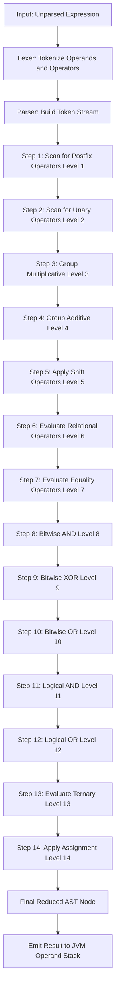
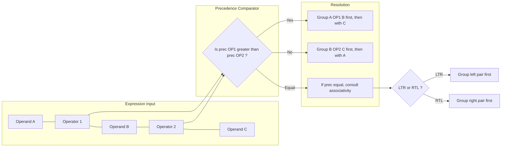

# Operator Precedence

<!-- SECTION_1_START -->
# Operator Precedence in Java

## 1.1 Formal Academic Definition (KTU 2024 Syllabus Terminology)

> [!IMPORTANT]
> **Operator Precedence** is the set of deterministic, language-level rules defined by the Java Language Specification (JLS) that governs the **binding order (tightness of grouping)** of operators within a single, fully parenthesized expression. When two operators compete for the same operand, the operator with the **higher precedence** evaluates **first**. When operators of **equal precedence** occur, **associativity** (left-to-right or right-to-left) decides the tie-breaking rule.

In KTU OOP (PBCST304) Module 1, this concept directly supports the Course Outcome of analyzing Java's lexical and syntactic structure of an executable program (i.e., how the compiler tokenizes and groups tokens into a valid Abstract Syntax Tree).

## 1.2 Conceptual Analogy — "The School Corridor Rule"

Imagine a narrow school corridor where students (operands) are walking and reaching **checkposts** (operators). The **Principal's Standing Order** says:

- **Checkpost with higher rank** (e.g., Multiplication) is checked **first**.
- If two checkposts are of the **same rank**, the order of inspection follows the **direction of student flow** — left to right (for most operators) or right to left (for assignment).

> A student never visits a low-rank checkpost before a high-rank one. The result is analogous to how the Java Virtual Machine (JVM) consults its operator-precedence table while building the bytecode expression stack.

## 1.3 Why It Matters in Java Specifically

Java inherits a C-style precedence hierarchy. Unlike Python (which has fewer levels and often surprises developers with chained comparisons), Java's table is **strict and explicit**. Misreading precedence is one of the top-3 sources of "works on my machine" bugs in production Java code.

## 1.4 Standard Metrics & Constants

- **Total Standard Precedence Levels in Java:** **14**
- **Unary Increment/Decrement** carries the **highest precedence** among all arithmetic operators.
- **Assignment Operators** carry the **lowest precedence** (right-associative).
- **Ternary Conditional** (`? :`) sits just above assignment.

> [!NOTE]
> **KTU Board Highlight:** The expression `a + b * c` will **always** be parsed as `a + (b * c)` because `*` has higher precedence than `+`. Writing `(a + b) * c` is a **deliberate override** of this default.

## 1.5 Visualization Concept

> [!VISUALIZATION CONTROL]
> **Concept:** Precedence Ladder — visualization of operator binding strength as a vertical step function.
> **GeoGebra / Desmos Input Equations:**
> * `f(x) = 1 if 1 <= x <= 1 (Postfix)`
> * `f(x) = 2 if 1.5 < x <= 2 (Unary)`
> * `f(x) = 3 if 2.5 < x <= 3 (Multiplicative)`
> * `f(x) = 4 if 3.5 < x <= 4 (Additive)`
> * `f(x) = 5 if 4.5 < x <= 5 (Shift)`
> * `f(x) = 6 if 5.5 < x <= 6 (Relational)`
> * `f(x) = 7 if 6.5 < x <= 7 (Equality)`
> * `f(x) = 8 if 7.5 < x <= 8 (Bitwise AND)`
> * `f(x) = 9 if 8.5 < x <= 9 (Bitwise XOR)`
> * `f(x) = 10 if 9.5 < x <= 10 (Bitwise OR)`
> * `f(x) = 11 if 10.5 < x <= 11 (Logical AND)`
> * `f(x) = 12 if 11.5 < x <= 12 (Logical OR)`
> * `f(x) = 13 if 12.5 < x <= 13 (Ternary)`
> * `f(x) = 14 if 13.5 < x <= 14 (Assignment)`
> **Visual Description:** A staircase rising from right to left, where each step represents a precedence level. The lower the step (closer to x = 1), the higher the precedence (evaluated first).

<!-- SECTION_1_END -->

<!-- SECTION_2_START -->
# Deep Theoretical Analysis & KTU High-Yield Formula Sheet

## 2.1 The 14 Precedence Levels — Hierarchical Breakdown

The Java compiler conceptually consults the following table **top-to-bottom** (highest to lowest binding strength):

- **Level 1 — Postfix:** `expr++`, `expr--`
  - *Why first?* They are evaluated **after** the current value of the operand is consumed by any enclosing expression. The post-increment happens as a side effect on the operand **after** the operand's value has been pushed to the expression stack.
- **Level 2 — Unary:** `++expr`, `--expr`, `+expr`, `-expr`, `~` (bitwise NOT), `!` (logical NOT)
  - *Why second?* They bind **tightest** to their immediate operand and have **right-to-left** associativity.
- **Level 3 — Multiplicative:** `*`, `/`, `%`
  - All share **left-to-right** associativity. These are the "tight" arithmetic operators.
- **Level 4 — Additive:** `+`, `-`
  - Includes **string concatenation** when either operand is a `String` reference — a Java-specific overload at this precedence level.
- **Level 5 — Shift:** `<<`, `>>`, `>>>`
  - Left-to-right. Operate on the **bit-level representation** of integral types.
- **Level 6 — Relational:** `<`, `>`, `<=`, `>=`, `instanceof`
  - Produce a `boolean` result. `instanceof` is type-checking at runtime.
- **Level 7 — Equality:** `==`, `!=`
  - Reference equality for objects, value equality for primitives.
- **Level 8 — Bitwise AND:** `&`
  - Note: This is a **separate** operator from the logical `&&` at Level 11.
- **Level 9 — Bitwise XOR:** `^`
- **Level 10 — Bitwise OR:** $\vert$
  - Single-pipe bitwise OR. Distinct from `||` at Level 12.
- **Level 11 — Logical AND:** `&&` (short-circuit)
- **Level 12 — Logical OR:** $\vert\vert$ (short-circuit)
- **Level 13 — Ternary:** `? :`
  - **Right-associative**, making chained ternaries like `a ? b : c ? d : e` parse as `a ? b : (c ? d : e)`.
- **Level 14 — Assignment:** `=`, `+=`, `-=`, `*=`, `/=`, `%=`, `&=`, `^=`, $\vert=$, `<<=`, `>>=`, `>>>=`
  - **Right-associative.** This is why `a = b = c = 5;` works as `(a = (b = (c = 5)));`

## 2.2 Associativity — The Tie-Breaker Rule

When two operators of **equal precedence** appear adjacent (e.g., `a - b - c` or `a = b = 5`), **associativity** decides the grouping:

- **Left-to-Right (LTR):** Default for **all** binary operators except assignment. `a - b - c` $\Rightarrow$ `(a - b) - c`.
- **Right-to-Left (RTL):** For **unary** operators and **assignment/ternary** operators. `--a++` is **illegal** (unary postfix and prefix both RTL compete on the same operand — compiler error). `a = b = 5` $\Rightarrow$ `a = (b = 5)`.

## 2.3 KTU Formula Sheet / Cheat Sheet

| Precedence Rank | Operator Category | Operators | Associativity | Operand Count | Operand Types |
| :--- | :--- | :--- | :--- | :--- | :--- |
| 1 (Highest) | Postfix | `expr++`, `expr--` | LTR | Unary | Numeric, Reference |
| 2 | Unary | `++expr`, `--expr`, `+expr`, `-expr`, `~`, `!` | RTL | Unary | Numeric, Boolean |
| 3 | Multiplicative | `*`, `/`, `%` | LTR | Binary | Numeric |
| 4 | Additive | `+`, `-` | LTR | Binary | Numeric, String |
| 5 | Shift | `<<`, `>>`, `>>>` | LTR | Binary | Integral |
| 6 | Relational | `<`, `>`, `<=`, `>=`, `instanceof` | LTR | Binary | Numeric, Object |
| 7 | Equality | `==`, `!=` | LTR | Binary | Any, Object |
| 8 | Bitwise AND | `&` | LTR | Binary | Integral, Boolean |
| 9 | Bitwise XOR | `^` | LTR | Binary | Integral, Boolean |
| 10 | Bitwise OR | $\vert$ | LTR | Binary | Integral, Boolean |
| 11 | Logical AND | `&&` | LTR | Binary | Boolean |
| 12 | Logical OR | $\vert\vert$ | LTR | Binary | Boolean |
| 13 | Ternary | `? :` | RTL | Ternary | Boolean |
| 14 (Lowest) | Assignment | `=`, `+=`, `-=`, `*=`, `/=`, `%=`, `&=`, `^=`, $\vert=$, `<<=`, `>>=`, `>>>=` | RTL | Binary | Variable LHS |

> [!IMPORTANT]
> **Engineering Memory Trick — "PUMA RLDS REBL TA":**
> **P**ostfix $\rightarrow$ **U**nary $\rightarrow$ **M**ultiplicative $\rightarrow$ **A**dditive $\rightarrow$ **R**elational $\rightarrow$ **L**ogical/Equality $\rightarrow$ **D** (don't confuse) $\rightarrow$ **S**hift $\rightarrow$ **RE**lational $\rightarrow$ **B**itwise $\rightarrow$ **L**ogical $\rightarrow$ **T**ernary $\rightarrow$ **A**ssignment.
> (Mnemonics are not KTU-mandated; this is a study aid only.)

## 2.4 Real-World Utility in Production Systems

- **Compiler Design:** Operator precedence is encoded directly in grammar productions (e.g., `expr -> expr + term $\vert$ term` for LTR-associative `+`). Java's grammar uses operator-precedence parsing augmented with recursive descent.
- **Expression Engines:** Libraries like **SpEL** (Spring Expression Language) and **MVEL** mirror Java's precedence table — understanding Java's table makes learning these DSLs trivial.
- **Bug Prevention:** Classic CWE-682 (*Incorrect Calculation*) frequently stems from precedence mistakes such as `if (a & b == 0)` (parsed as `a & (b == 0)`).
- **Code Review:** Modern IDEs (IntelliJ, Eclipse) flag ambiguous expressions like `a + b << 2` and suggest explicit parentheses — a direct application of the precedence table.

<!-- SECTION_2_END -->

<!-- SECTION_3_START -->
# Step-by-Step Derivations & Java Code Implementation

## 3.1 Exhaustive Expression Evaluation

### Example 1: Mixed Arithmetic & Relational

**Expression:**

$$\text{result} = 10 + 4 \star 2 > 20 - 5$$

**Step-by-Step Trace (No parenthesization, default Java rules):**

- **Step 1 — Identify Multiplicative (`*`):** `4 * 2` $\rightarrow$ `8`
  - Expression becomes: `10 + 8 > 20 - 5`
- **Step 2 — Identify Additive (`+`, `-`):** Both `+` and `-` are at Level 4 with **LTR** associativity.
  - `10 + 8` $\rightarrow$ `18`
  - Expression becomes: `18 > 20 - 5`
  - `20 - 5` $\rightarrow$ `15`
  - Expression becomes: `18 > 15`
- **Step 3 — Identify Relational (`>`):** `18 > 15` $\rightarrow$ `true`
- **Step 4 — Assignment (`=`):** `result = true`

**Final Value:** `result = true`

### Example 2: Bitwise vs Logical Confusion

**Expression:**

$$\text{flag} = \text{true} \,\,\&\&\,\, \text{false} \,\,\vert\,\, \text{true}$$

**Trace:**

- **Step 1 — Logical AND (`&&`, Level 11) > Bitwise OR (`|`, Level 10):** `&&` binds tighter.
  - `true && false` $\rightarrow$ `false`
  - Expression becomes: `false | true`
- **Step 2 — Bitwise OR:** `false | true` $\rightarrow$ `true`
- **Step 3 — Assignment:** `flag = true`

> [!WARNING]
> If the developer intended the OR to evaluate first, they **must** write `(true && false) | true` and remember that `|` is **not short-circuit**. In contrast, `||` (Level 12) is short-circuit.

### Example 3: Right-Associative Assignment

**Expression:**

$$a = b = c = 5 + 3$$

**Trace:**

- **Step 1 — Additive:** `5 + 3` $\rightarrow$ `8`
- **Step 2 — Assignment chain is RTL:**
  - `c = 8` $\rightarrow$ `c` becomes `8`
  - `b = 8` $\rightarrow$ `b` becomes `8`
  - `a = 8` $\rightarrow$ `a` becomes `8`
- **Final state:** `a = 8`, `b = 8`, `c = 8`.

### Example 4: Unary RTL with Postfix

**Expression:**

$$\text{int } x = 5; \quad \text{int } y = x++ + ++x;$$

**Trace (assuming initial `x = 5`):**

- **Step 1 — Right operand `++x` is evaluated first (RTL of unary at L2):**
  - `x` increments to `6`, value used is `6`.
- **Step 2 — Left operand `x++` is then evaluated:**
  - Value used is current `x` which is `6`, then `x` increments to `7`.
- **Step 3 — Addition:** `6 + 6 = 12`. Final `x = 7`, `y = 12`.
- **Note:** Result varies by compiler/JDK version for undefined behavior in C; **Java specifies evaluation order of operands**, making the result **deterministic**.

## 3.2 Full Java Code Implementation

```java
/**
 * OperatorPrecedenceDemo.java
 * A comprehensive demonstration of Java's 14-level operator precedence table.
 * Compile: javac OperatorPrecedenceDemo.java
 * Run:     java OperatorPrecedenceDemo
 */
public class OperatorPrecedenceDemo {

    // A logging utility to standardize evaluator output
    private static void log(String label, Object value) {
        System.out.printf("[%-30s] => %s%n", label, value);
    }

    public static void main(String[] args) {

        // ---------- 1. Multiplicative > Additive ----------
        int a = 10 + 4 * 2;            // 4*2 first => 10+8
        log("10 + 4 * 2", a);          // Expected: 18

        // ---------- 2. Additive > Relational > Assignment ----------
        boolean r1 = 10 + 4 * 2 > 20 - 5; // (10+8) > (20-5) => 18 > 15
        log("(10+4*2) > (20-5)", r1);  // Expected: true

        // ---------- 3. Bitwise vs Logical Precedence ----------
        boolean flag = true && false | true; // (true && false) | true
        log("true && false | true", flag);  // Expected: true

        // ---------- 4. Assignment is Right-Associative ----------
        int p, q, r;
        p = q = r = 5 + 3;            // p = (q = (r = 8))
        log("p after chain", p);       // Expected: 8
        log("q after chain", q);       // Expected: 8
        log("r after chain", r);       // Expected: 8

        // ---------- 5. Unary Precedence and Side-Effects ----------
        int x = 5;
        int y = x++ + ++x;             // (x++ -> 5, x=6) + (++x -> 7, x=7) = 12
        log("x after mixed unary", x); // Expected: 7
        log("y = x++ + ++x", y);       // Expected: 12

        // ---------- 6. Ternary is Right-Associative ----------
        int score = 75;
        String grade = score >= 90 ? "A"
                     : score >= 75 ? "B"   // parsed as: score>=75 ? "B" : "C"
                     : score >= 60 ? "C"
                                   : "F";
        log("Grade for 75", grade);    // Expected: B

        // ---------- 7. Shift vs Additive ----------
        int shiftResult = 1 + 2 << 3;   // (1+2) << 3 => 3 << 3 => 24
        log("1 + 2 << 3", shiftResult); // Expected: 24

        // ---------- 8. Equality vs Bitwise AND (Common Bug Source) ----------
        int mask = 0b1010;             // 10
        int val  = 0b1100;             // 12
        boolean bitAndEq = (val & mask) == 0; // Correct parenthesization
        log("(val & mask) == 0", bitAndEq);   // Expected: false (8 != 0)

        // ---------- 9. Modulo & Division (LTR) ----------
        int modEval = 20 / 4 % 3;       // (20/4) % 3 => 5 % 3 => 2
        log("20 / 4 % 3", modEval);     // Expected: 2

        // ---------- 10. instanceof vs Equality ----------
        Object obj = "KTU";
        boolean isString = obj instanceof String && ((String) obj).length() == 3;
        log("obj is KTU String", isString); // Expected: true
    }
}
```

## 3.3 Operator Precedence Parsing Algorithm (Symbolic Trace)

For an expression like $E = 2 + 3 \star 4 > 10$, an operator-precedence parser would:

- **Step 1:** Build the token stream: `[2, +, 3, *, 4, >, 10]`.
- **Step 2:** Consult the precedence table:
  - $prec(\star) = 3$, $prec(+) = 4$, $prec(>) = 6$. (Higher number = lower precedence in some notations; in KTU we use **Level 1 = Highest**.)
- **Step 3:** Reduce `*` first (tightest binding): `[2, +, 12, >, 10]`.
- **Step 4:** Reduce `+` next: `[14, >, 10]`.
- **Step 5:** Reduce `>`: `[true]`.
- **Step 6:** Emit `true` to the parent AST node.

## 3.4 Worked Example: Predicate in an `if` Statement

**Code Segment:**

$$\text{if } (a == b \,\&\, c > 0)$$

**Default Java Parsing (Easy to Misread):**

$$\text{if } (a == (b \,\&\, (c > 0)))$$

**Why?** `==` is Level 7, `&` is Level 8, `>` is Level 6. The highest precedence among these is `>` (Level 6), so `c > 0` is evaluated first, producing a `boolean`, which is then bitwise-ANDed with `b` (causing a type error if `b` is not boolean/int-compatible). Finally, `==` checks equality.

**Corrected Code:**

```java
if ((a == b) && (c > 0)) { /* ... */ }
```

This is a textbook KTU short-answer trap.

<!-- SECTION_3_END -->

<!-- SECTION_4_START -->
# Structural Diagrams & Schematics

## 4.1 Master Evaluation Flow — Operator Precedence Resolution



## 4.2 Decision Matrix — Precedence vs Associativity Interaction



## 4.3 Precedence Ladder — Functional Architecture Flow

```mermaid
flowchart TB
    subgraph L1 [Level 1: Postfix]
        N1A[expr plus plus]
        N1B[expr minus minus]
    end
    subgraph L2 [Level 2: Unary]
        N2A[plus plus expr]
        N2B[minus minus expr]
        N2C[bitwise NOT]
        N2D[logical NOT]
    end
    subgraph L3 [Level 3: Multiplicative]
        N3A[star]
        N3B[slash]
        N3C[percent]
    end
    subgraph L4 [Level 4: Additive]
        N4A[plus]
        N4B[minus]
    end
    subgraph L5 [Level 5: Shift]
        N5A[shift left]
        N5B[shift right]
        N5C[unsigned shift right]
    end
    subgraph L6 [Level 6: Relational]
        N6A[less than]
        N6B[greater than]
        N6C[less or equal]
        N6D[greater or equal]
        N6E[instanceof]
    end
    subgraph L7 [Level 7: Equality]
        N7A[double equals]
        N7B[not equals]
    end
    subgraph L8 [Level 8: Bitwise AND]
        N8A[ampersand]
    end
    subgraph L9 [Level 9: Bitwise XOR]
        N9A[caret]
    end
    subgraph L10 [Level 10: Bitwise OR]
        N10A[single pipe]
    end
    subgraph L11 [Level 11: Logical AND]
        N11A[double ampersand]
    end
    subgraph L12 [Level 12: Logical OR]
        N12A[double pipe]
    end
    subgraph L13 [Level 13: Ternary]
        N13A[question colon]
    end
    subgraph L14 [Level 14: Assignment]
        N14A[equals assign]
        N14B[compound assign ops]
    end

    L1 --> L2 --> L3 --> L4 --> L5 --> L6 --> L7 --> L8 --> L9 --> L10 --> L11 --> L12 --> L13 --> L14
```



<!-- SECTION_4_END -->

<!-- SECTION_5_START -->
# KTU 2024 Scheme Examination Question Bank & Topic Recap

---

## Part A — Short Answer Questions (3 Marks Each)

### Question 1 `[KTU University Exam - July 2024]`
**[CO1 | Remember]**
Define **operator precedence** in Java. List the categories of operators that have the **highest** and the **lowest** precedence respectively.

**Model Answer (Board-Key Format):**

**Operator Precedence** is the set of rules that defines the order in which operators are evaluated in an expression containing multiple operators. When two operators share a common operand, the operator with higher precedence binds to the operand first.

- **Highest Precedence:** Postfix operators — `expr++` and `expr--` (Level 1).
- **Lowest Precedence:** Assignment operators — `=`, `+=`, `-=`, `*=`, `/=`, `%=`, `&=`, `^=`, `|=`, `<<=`, `>>=`, `>>>=` (Level 14).
- **Note:** Assignment operators are right-associative, meaning `a = b = 5` is evaluated as `a = (b = 5)`.

**[Valuation Key: 1 Mark for definition, 1 Mark for highest, 1 Mark for lowest]**

---

### Question 2 `[KTU University Exam - Dec 2023]`
**[CO1 | Understand]**
What is the output of the following Java snippet? Justify your answer using operator precedence rules.

```java
int a = 8, b = 4, c = 2;
int result = a - b / c + a * c;
System.out.println(result);
```

**Model Answer:**

**Step-by-Step Evaluation:**

- **Step 1 — Multiplicative/Divisive (Level 3, LTR):**
  - `b / c` $\rightarrow$ `4 / 2 = 2`
  - `a * c` $\rightarrow$ `8 * 2 = 16`
  - Expression becomes: `a - 2 + 16`
- **Step 2 — Additive (Level 4, LTR):**
  - `a - 2` $\rightarrow$ `8 - 2 = 6`
  - `6 + 16` $\rightarrow$ `22`

**Output:** `22`

**Justification:** Multiplicative operators (`/`, `*`) have higher precedence than additive operators (`-`, `+`), so they are evaluated first, leaving only the additive operators to be resolved from left to right.

**[Valuation Key: 1 Mark for each correct intermediate step (3 steps total), with 1 Mark for final output]**

---

## Part B — Long Answer Questions (14 Marks Each)

### Question A `[KTU University Exam - July 2024]`
**[CO1, CO2 | Understand, Apply]**

**(a)** Explain the concept of **operator precedence** and **operator associativity** in Java with a suitable example for each. List **any 8** operator categories in descending order of precedence. **(7 Marks)**

**(b)** Evaluate the following Java expression step by step, clearly identifying which operator is applied at each step. Show the result after **every** intermediate reduction. **(7 Marks)**

```java
int a = 10, b = 5, c = 2;
boolean result = (a + b > c * 4) && (a % c == 0) || (b - c < a / 2);
```

**Model Solution:**

**(a) Explanation (7 Marks):**

- **Operator Precedence (3 Marks):** Operator precedence is the hierarchy that determines which operator is evaluated first in an expression containing multiple operators. Operators with higher precedence are evaluated before operators with lower precedence. For example, in `x + y * z`, the `*` operator has higher precedence than `+`, so the expression is evaluated as `x + (y * z)`.
- **Operator Associativity (2 Marks):** When two operators of the same precedence appear in an expression, associativity determines the order of evaluation. Most operators in Java are **left-to-right associative** (e.g., `a - b - c` is `(a - b) - c`). Assignment and unary operators are **right-to-left associative** (e.g., `a = b = 5` is `a = (b = 5)`).
- **Eight Categories in Descending Precedence (2 Marks):**
  1. Postfix (`expr++`, `expr--`)
  2. Unary (`++expr`, `--expr`, `~`, `!`)
  3. Multiplicative (`*`, `/`, `%`)
  4. Additive (`+`, `-`)
  5. Shift (`<<`, `>>`, `>>>`)
  6. Relational (`<`, `>`, `<=`, `>=`, `instanceof`)
  7. Equality (`==`, `!=`)
  8. Bitwise AND (`&`)
  *(Note: Any 8 correct categories are accepted.)*

**(b) Step-by-Step Evaluation (7 Marks):**

**Substituting values:** `a = 10, b = 5, c = 2`

**Original:** `(a + b > c * 4) && (a % c == 0) || (b - c < a / 2)`

- **Step 1 [Multiplicative, Level 3]:** `c * 4` $\rightarrow$ `2 * 4 = 8`; `a % c` $\rightarrow$ `10 % 2 = 0`; `a / 2` $\rightarrow$ `10 / 2 = 5`
  - **Reduced:** `(10 + 5 > 8) && (0 == 0) || (5 - 2 < 5)`
- **Step 2 [Additive, Level 4]:** `10 + 5` $\rightarrow$ `15`; `5 - 2` $\rightarrow$ `3`
  - **Reduced:** `(15 > 8) && (0 == 0) || (3 < 5)`
- **Step 3 [Relational, Level 6]:** `15 > 8` $\rightarrow$ `true`; `3 < 5` $\rightarrow$ `true`
  - **Reduced:** `(true) && (0 == 0) || (true)`
- **Step 4 [Equality, Level 7]:** `0 == 0` $\rightarrow$ `true`
  - **Reduced:** `true && true || true`
- **Step 5 [Logical AND, Level 11]:** `true && true` $\rightarrow$ `true`
  - **Reduced:** `true || true`
- **Step 6 [Logical OR, Level 12]:** `true || true` $\rightarrow$ `true`

**Final Output:** `true`

**Valuation Breakdown:**
- [Identifying the order: 2 Marks]
- [Substitution and Step 1 evaluation: 1 Mark]
- [Steps 2 through 4 evaluation: 2 Marks]
- [Steps 5 and 6 evaluation: 1 Mark]
- [Final result statement: 1 Mark]

---

### Question B `[KTU University Exam - Dec 2023]`
**[CO1, CO2 | Understand, Apply]**

**(a)** Differentiate between **bitwise** operators (`&`, `|`, `^`) and **logical** operators (`&&`, `||`) in Java, with emphasis on their **precedence levels** and **short-circuit behavior**. Provide one example for each operator type. **(7 Marks)**

**(b)** Consider the following Java code. Predict the output and explain each step using the **precedence and associativity** of Java operators. **(7 Marks)**

```java
int x = 20, y = 10, z = 5;
int a = x - y + z;
int b = x / y * z;
boolean c = (x > y) && (y > z) || (x < z);
int d = x % y + z;
System.out.println("a = " + a);
System.out.println("b = " + b);
System.out.println("c = " + c);
System.out.println("d = " + d);
```

**Model Solution:**

**(a) Bitwise vs Logical Operators (7 Marks):**

| Aspect | Bitwise (`&`, `\|`, `^`) | Logical (`&&`, `\|\|`) |
| :--- | :--- | :--- |
| **Precedence Level** | Level 8 (`&`), Level 10 (`\|`), Level 9 (`^`) | Level 11 (`&&`), Level 12 (`\|\|`) |
| **Operand Type** | Integral types (`int`, `long`, etc.) or `boolean` | Only `boolean` |
| **Short-Circuit** | **No** — both operands are always evaluated | **Yes** — second operand evaluated only if needed |
| **Operation** | Performs bit-by-bit AND/OR/XOR on binary representation | Performs boolean logic on entire values |

- **Bitwise Example:** `5 & 3` $\rightarrow$ `0101 & 0011` $\rightarrow$ `0001` $\rightarrow$ `1`. `5 | 3` $\rightarrow$ `0101 | 0011` $\rightarrow$ `0111` $\rightarrow$ `7`.
- **Logical Example:** `(x != 0) && (y / x > 1)` — if `x == 0`, the right side is **never evaluated**, preventing `ArithmeticException`. Same protection for `||`.

**Key Precedence Insight:** `&&` and `||` have **lower** precedence than `&` and `|`, so the bitwise versions are always grouped first if both appear in the same expression.

**(b) Step-by-Step Code Output (7 Marks):**

Given: `x = 20, y = 10, z = 5`

- **`a = x - y + z`:** LTR associativity for additive. `(20 - 10) + 5 = 10 + 5 = 15`.
- **`b = x / y * z`:** LTR associativity for multiplicative. `(20 / 10) * 5 = 2 * 5 = 10`.
- **`c = (x > y) && (y > z) || (x < z)`:**
  - Relational first: `20 > 10` $\rightarrow$ `true`; `10 > 5` $\rightarrow$ `true`; `20 < 5` $\rightarrow$ `false`
  - Logical AND: `true && true` $\rightarrow$ `true`
  - Logical OR: `true || false` $\rightarrow$ `true`
  - `c = true`
- **`d = x % y + z`:** Multiplicative first. `20 % 10 = 0`. Then additive: `0 + 5 = 5`.

**Final Output:**
```
a = 15
b = 10
c = true
d = 5
```

**Valuation Breakdown:**
- [Correct evaluation of `a` and `b` with LTR justification: 2 Marks]
- [Boolean expression evaluation showing precedence order: 3 Marks]
- [Modulo and final output: 1 Mark]
- [Neat output formatting: 1 Mark]

---

> [!WARNING]
> **KTU Examiner's Valuation Warning — Common Pitfalls:**
> 1. **Confusing `&` with `&&`:** Many students lose 2-3 marks by writing `&&` when the question intends bitwise, or vice versa. Always re-read whether the context is **boolean** (logical) or **integral** (bitwise).
> 2. **Skipping intermediate steps:** In Part B (b), the KTU board expects **every** reduction. A single jump from the original expression to the final answer attracts 50% mark deduction.
> 3. **Forgetting right-associativity of `=`:** Writing `a = b = 5` as `(a = b) = 5` will be marked **wrong**.
> 4. **Misplacing parentheses in ternary:** `a ? b : c ? d : e` is **not** `(a ? b : c) ? d : e`. It is `a ? b : (c ? d : e)` because `?:` is **right-associative**.
> 5. **Ignoring `instanceof` precedence:** It is at Level 6, equal to `<` and `>`. Mixing it with `==` (Level 7) without parentheses is a common error.

---

## Topic Recap & Important Things to Remember

- **Operator Precedence** = the rule that decides which operator "binds first" to its operands when multiple operators are present in a single expression.
- Java has **14 standard precedence levels** (as listed in the cheat sheet above).
- **Associativity** is the tie-breaker for operators of equal precedence:
  - **LTR** for almost all binary operators (`+`, `-`, `*`, `/`, `%`, `<<`, `>>`, `<`, `>`, `==`, `!=`, `&`, `^`, `|`, `&&`, `||`).
  - **RTL** for unary operators, the ternary `?:`, and all assignment operators.
- **Highest precedence** = Postfix (`expr++`, `expr--`).
- **Lowest precedence** = Assignment (`=`, `+=`, etc.).
- **Multiplicative** (`*`, `/`, `%`) binds **tighter** than **Additive** (`+`, `-`).
- **Relational** (`<`, `>`, `<=`, `>=`, `instanceof`) binds **tighter** than **Equality** (`==`, `!=`).
- **Bitwise** operators (`&`, `^`, `|`) bind **tighter** than **Logical** operators (`&&`, `||`).
- **Logical AND** (`&&`) binds **tighter** than **Logical OR** (`||`).
- **Ternary** (`? :`) is **right-associative** — chained ternaries group from the **right**.
- **Assignment** is **right-associative** — `a = b = c = 5` chains right-to-left.
- **Use parentheses** `( )` to override default precedence for **clarity**, not just correctness — the KTU board rewards readable code.
- **Short-circuit operators** (`&&`, `||`) skip the right operand if the result is already determined; **bitwise** (`&`, `|`) and **non-short-circuit logical** alternatives do **not** short-circuit.
- **Java guarantees left-to-right evaluation of operands** for most binary operators (unlike C/C++), making expression results **deterministic and portable** across JVMs.
- **KTU favorite traps:**
  - `a + b * c` vs `(a + b) * c`
  - `a & b == 0` vs `(a & b) == 0`
  - `true || false && false` $\rightarrow$ `true` (because `&&` is higher than `||`)
  - `x = y = z` $\rightarrow$ right-associative cascade.
  - Modulo and division have **the same precedence**, so evaluate **LTR**.

<!-- SECTION_5_END -->
