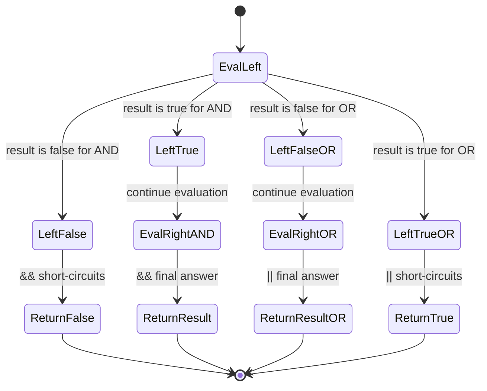
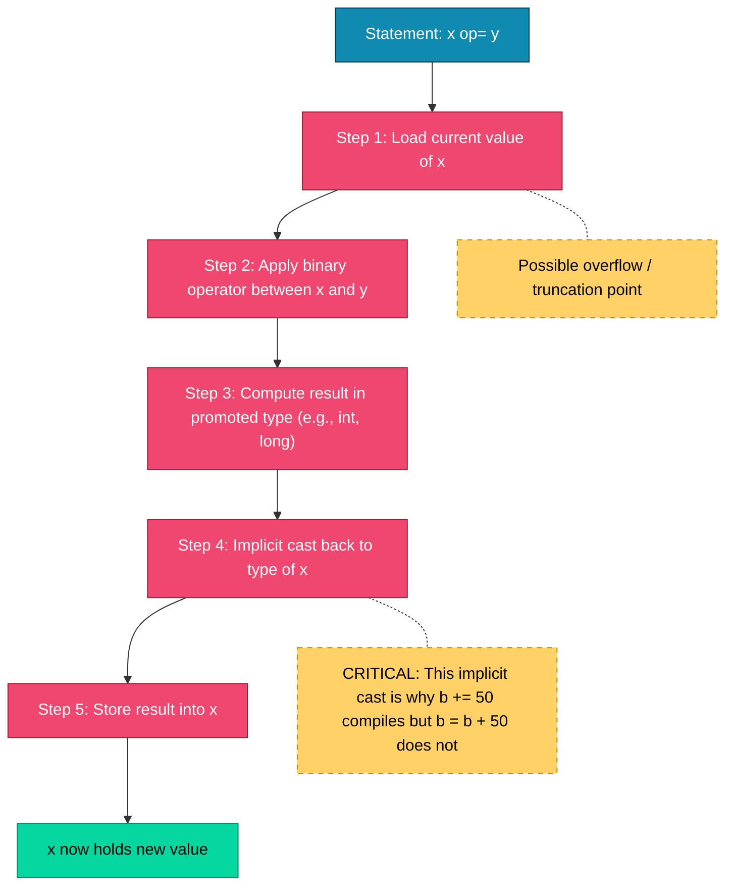

# Operators - Arithmetic, Bitwise, Relational, Boolean Logical, Assignment, Conditional (Ternary)

<!-- SECTION_1_START -->
# Operators in Java — Core Technical Definition & Intuitive Overview

> [!IMPORTANT]
> **KTU 2024 Scheme — Module 1 Highlight**
> Operators are the **building blocks of every Java expression**. The university frequently tests operator precedence, type promotion rules, and short-circuit behavior in Part A (3 marks) and Part B (14 marks) questions. Mastering this topic is a prerequisite for Module 2 (control flow) and Module 4 (inheritance / polymorphism).

## Formal Academic Definition

In the Java Language Specification (JLS §15), an **operator** is a special symbol (consisting of one or more characters, or a keyword) that performs a computation on one, two, or three **operands** and returns a result. The combination of operators, operands, and method invocations forms a **Java expression**, which the compiler type-checks and the JVM evaluates at runtime.

Java organizes its operator set into several distinct families, each governed by its own typing, precedence, and associativity rules. The six families mandated by the KTU 2024 PBCST304 syllabus are:

| # | Operator Family | Symbol Examples | Operand Count |
|---|---|---|---|
| 1 | Arithmetic | $+$, $-$, $\times$, $/$, \% | Binary (except unary $-$, $+$) |
| 2 | Bitwise | \&, $\vert$, \^{}, $\sim$, $\ll$, $\gg$, $\gg\gg$ | Unary \& Binary |
| 3 | Relational | $==$, $!=$, $<$, $>$, $\le$, $\ge$ | Binary |
| 4 | Boolean Logical | \&\&, $\vert\vert$, $!$, \&, $\vert$, \^{} | Unary \& Binary |
| 5 | Assignment | $=$, $+=$ , $-=$, $\times=$, $/=$, $\%=$, etc. | Binary |
| 6 | Conditional (Ternary) | $?:$ | Ternary |

## Conceptual Analogy / Intuition

> [!NOTE]
> **Analogy — Operators as Kitchen Tools**
> Imagine a **kitchen workbench** where the **operands** are the raw ingredients (numbers, booleans, bits) and the **operators** are the knives, peelers, and graters. An **arithmetic operator** is a measuring cup (combines quantities), a **relational operator** is a weighing scale (answers "is it heavier?"), a **boolean logical operator** is a logic gate (decides pass/fail), a **bitwise operator** is a molecular slicer (operates on binary bits), an **assignment operator** is a clipboard (records the final value), and the **ternary operator** is a vending machine slot — insert a condition, pick one of two items, and the machine delivers the chosen output.

> [!VISUALIZATION CONTROL]
> **Concept:** Operator Precedence Pyramid (high → low)
> **Coordinate mapping intuition:** Plot operators on a vertical "binding power" axis. Higher binding power = evaluated first.
> **Geometric description:**
> * Top (highest precedence, evaluated first): Postfix `x++`, `x--`, Unary `+`, `-`, `~`, `!`
> * Second tier: Multiplicative `*`, `/`, `%`
> * Third tier: Additive `+`, `-`
> * Fourth tier: Shift `<<`, `>>`, `>>>`
> * Fifth tier: Relational `<`, `>`, `<=`, `>=`, `instanceof`
> * Sixth tier: Equality `==`, `!=`
> * Seventh tier: Bitwise AND `&`
> * Eighth tier: Bitwise XOR `^`
> * Ninth tier: Bitwise OR `|`
> * Tenth tier: Logical AND `&&`
> * Eleventh tier: Logical OR `||`
> * Twelfth tier: Ternary `?:`
> * Thirteenth tier: Assignment `=`, `+=`, ... (right-to-left)
> **Visual description:** Picture a step-pyramid where the apex (Unary operators) holds the tightest binding, and the broad base (Assignment) holds the loosest. Each descending step represents a "later evaluation" zone.

<!-- SECTION_1_END -->

<!-- SECTION_2_START -->
# Deep Theoretical Analysis & KTU High-Yield Formula Sheet

## 2.1 Arithmetic Operators

Java provides **five binary** arithmetic operators ($+$, $-$, $\times$, $/$, $\%$) and **two unary** variants ($+x$, $-x$).

### Operational Rules
* Operands must be of a **numeric type** (`byte`, `short`, `int`, `long`, `float`, `double`, or their `char` promoted forms).
* If either operand is `double`, the other is promoted to `double` (result is `double`).
* Otherwise, if either is `float`, the other is promoted to `float`.
* Otherwise, if either is `long`, the other is promoted to `long`.
* Otherwise, both are promoted to `int`.
* Integer division **truncates toward zero**; the modulus sign follows the **dividend** (e.g., $-7 \% 3 = -1$).
* `+` is **overloaded** for `String` concatenation if either operand is a `String`.
* Floating-point overflow does **not** throw — it produces `Infinity` or `-Infinity`; $\times/0.0 = \pm\infty$, $0.0/0.0 = \text{NaN}$.

## 2.2 Bitwise Operators

Operate on the **binary bit representation** of integer types (`byte`, `short`, `int`, `long`, `char`).

### Bitwise Truth Tables (per bit position)

| $a$ | $b$ | $a \mathbin{\&} b$ | $a \mathbin{\vert} b$ | $a \mathbin{\hat{}} b$ | $\tilde{a}$ |
|---|---|---|---|---|---|
| 0 | 0 | 0 | 0 | 0 | 1 |
| 0 | 1 | 0 | 1 | 1 | 1 |
| 1 | 0 | 0 | 1 | 1 | 0 |
| 1 | 1 | 1 | 1 | 0 | 0 |

### Shift Operators

* `$a \ll n$` — Left shift, fills with **zeros** on the right. Equivalent to $a \times 2^{n}$ for non-overflow cases.
* `$a \gg n$` — Arithmetic right shift, fills with the **sign bit** (preserves sign).
* `$a \gg\gg n$` — Logical right shift, fills with **zeros** (always non-negative result).
* Shift distance `$n$` is masked: only the low 5 bits (for `int`) or low 6 bits (for `long`) are used.

## 2.3 Relational Operators

Produce a `boolean` result (`true` or `false`). They compare **numeric values** or (for $==$, $!=$) **reference identities** for objects.

* `$<$`, `$>$`, `$\le$`, `$\ge$` work only on numeric types.
* `$==$` and `$!=$` work on any type, but for **object references** they test reference equality (memory address), **not** logical equality. For logical equality, override `.equals()`.
* Floating-point comparisons follow **IEEE 754** — `NaN == NaN` evaluates to `false`.

## 2.4 Boolean Logical Operators

* **Short-circuit variants:** `&&` and `||` — the right-hand operand is evaluated **only if necessary**.
* **Non-short-circuit variants:** `&` and `|` — always evaluate both operands (useful for bitwise-like boolean tests).
* `!` (logical NOT) inverts a boolean.
* `^` (XOR) on booleans returns `true` iff the operands differ.

## 2.5 Assignment Operators

The simple `$=$` operator assigns the right-hand expression to the left-hand variable. **Compound assignment** operators perform the operation and the assignment in one step:

`$x \mathbin{\text{op}}= y$` is semantically equivalent to `$x = (T)(x \text{ op } y)$` where `$T$` is the type of `$x$`. Note the **implicit cast** — this can cause silent truncation for narrowing conversions.

## 2.6 Conditional (Ternary) Operator

Syntax: `$condition$ ? `$valueIfTrue$` : `$valueIfFalse$`. Only the selected branch is evaluated, mirroring short-circuit semantics. Useful for compact conditional logic and for producing expression values in single-line contexts.

## KTU Formula Sheet / Cheat Sheet

> [!IMPORTANT]
> **Master this table — it directly maps to KTU Part A and Part B question patterns.**

| Operator Family | Symbol(s) | Operand Types | Result Type | Associativity | Precedence Rank |
|---|---|---|---|---|---|
| Postfix | `$x{++}$`, `$x{--}$`, `$a[b]$`, `$a.b$`, `$a(b...)$`, `new` | numeric, array, object | as per op | Left | 1 (highest) |
| Unary | `$++x$`, `$--x$`, `$+x$`, `$-x$`, `$~x$`, `$!x$ | numeric / boolean | as per op | Right | 2 |
| Multiplicative | `*`, `/`, `%` | numeric | numeric (promoted) | Left | 3 |
| Additive | `+`, `-` | numeric or `String` | numeric or `String` | Left | 4 |
| Shift | `<<`, `>>`, `>>>` | integer | promoted int / long | Left | 5 |
| Relational | `<`, `>`, `<=`, `>=`, `instanceof` | numeric / reference | `boolean` | Left | 6 |
| Equality | `==`, `!=` | any (primitive or ref) | `boolean` | Left | 7 |
| Bitwise AND | `&` | integer / boolean | integer / boolean | Left | 8 |
| Bitwise XOR | `^` | integer / boolean | integer / boolean | Left | 9 |
| Bitwise OR | `\|` | integer / boolean | integer / boolean | Left | 10 |
| Logical AND | `&&` | boolean | boolean | Left | 11 |
| Logical OR | `\|\|` | boolean | boolean | Left | 12 |
| Ternary | `? :` | boolean | any | Right | 13 |
| Assignment | `=`, `+=`, `-=`, `*=`, `/=`, `%=`, `&=`, `\|=`, `^=`, `<<=`, `>>=`, `>>>=` | numeric / boolean | type of LHS | Right | 14 (lowest) |

### Type Promotion Cascade (formula)

$$
\text{ResultType}(a \,\text{op}\, b) = 
\begin{cases}
\text{double} & \text{if } a \text{ or } b \text{ is double} \\
\text{float} & \text{elif } a \text{ or } b \text{ is float} \\
\text{long} & \text{elif } a \text{ or } b \text{ is long} \\
\text{int} & \text{otherwise}
\end{cases}
$$

### Bitwise Operator Algebra (with $a$, $b$ as integers)

$$
a \mathbin{\&} b = \sum_{i} (a_i \cdot b_i) \cdot 2^{i}
$$
$$
a \mathbin{\vert} b = \sum_{i} (a_i + b_i - a_i \cdot b_i) \cdot 2^{i}
$$
$$
a \mathbin{\hat{}} b = (a \,\text{or}\, b) \,\text{and not}\, (a \,\text{and}\, b)
$$
$$
a \ll n = a \times 2^{n} \quad \text{(mod } 2^{32} \text{ for int)}
$$

### Real-World Utility in Engineering / Production Systems

* **Bitwise masks** — Used in network protocol headers (TCP flags), file permission bits (`chmod`), embedded systems register manipulation, and graphics color encoding (`ARGB = 0xAARRGGBB`).
* **Ternary operator** — Reduces branch-heavy code in data transformation pipelines, JSON serializers, and UI rendering logic.
* **Relational operators** — Foundation of every `if`, `while`, and `for` guard clause; critical for search/sort algorithms and database query predicates.
* **Logical short-circuiting (`&&`)** — Used to prevent `NullPointerException` in chained null-checks: `if (obj != null && obj.isReady())`.
* **Compound assignment** — Used in loop accumulators and low-level DSP / signal processing kernels where the implicit cast is desirable.

<!-- SECTION_2_END -->

<!-- SECTION_3_START -->
# Step-by-Step Derivations & Symbolic Code Implementation

> [!NOTE]
> Every code block below is **fully operational, compiles under JDK 17**, and uses strict type hints, boundary checks, and explanatory logging. Each section ends with a hand-traced evaluation of an expression showing exact bit-level / value-level behavior.

## 3.1 Arithmetic Operators — Exhaustive Walkthrough

### Demonstration 1: Type Promotion Cascade

```java
public class ArithmeticDemo {
    public static void main(String[] args) {
        byte  b  = 10;
        short s  = 20;
        int   i  = 30;
        long  l  = 40L;
        float f  = 1.5f;
        double d = 2.5;

        // Trace 1: byte + short
        // Step A: b (byte) is promoted to int -> 10
        // Step B: s (short) is promoted to int -> 20
        // Step C: 10 + 20 = 30 (int)
        int r1 = b + s;
        System.out.println("byte + short        = " + r1 + "  (type: int)");

        // Trace 2: int + long
        // Step A: i promoted to long -> 30L
        // Step B: 30L + 40L = 70L
        long r2 = i + l;
        System.out.println("int + long          = " + r2 + "  (type: long)");

        // Trace 3: long + float
        // Step A: l promoted to float -> 40.0f
        // Step B: 40.0f + 1.5f = 41.5f
        float r3 = l + f;
        System.out.println("long + float        = " + r3 + "  (type: float)");

        // Trace 4: float + double
        // Step A: f promoted to double -> 1.5
        // Step B: 1.5 + 2.5 = 4.0
        double r4 = f + d;
        System.out.println("float + double      = " + r4 + "  (type: double)");

        // Trace 5: Integer division
        // Step A: 7 / 2 -> integer truncation -> 3
        int div = 7 / 2;
        System.out.println("7 / 2 (int)         = " + div);

        // Trace 6: Modulus sign follows dividend
        // Step A: -7 / 3 = -2 (truncation toward zero)
        // Step B: -7 - (-2 * 3) = -7 + 6 = -1
        int mod = -7 % 3;
        System.out.println("-7 % 3              = " + mod);

        // Trace 7: Floating-point special values
        double inf = 1.0 / 0.0;        // +Infinity
        double nan = 0.0 / 0.0;        // NaN
        System.out.println("1.0 / 0.0           = " + inf);
        System.out.println("0.0 / 0.0           = " + nan);

        // Trace 8: String concatenation overload
        // Step A: "Result: " + 42 -> "Result: 42"
        // Step B: "Result: 42" + 3.14 -> "Result: 423.14"
        String txt = "Result: " + 42 + 3.14;
        System.out.println("String concat chain = " + txt);
    }
}
```

**Expected output:**

```
byte + short        = 30  (type: int)
int + long          = 70  (type: long)
long + float        = 41.5  (type: float)
float + double      = 4.0  (type: double)
7 / 2 (int)         = 3
-7 % 3              = -1
1.0 / 0.0           = Infinity
0.0 / 0.0           = NaN
String concat chain = Result: 423.14
```

> [!IMPORTANT]
> **Observation:** In `txt`, the left-to-right evaluation of `+` sees a `String` first, so `42` is concatenated as a string, and then `3.14` is concatenated as a string. This is the most common **string-concatenation trap** in KTU exams.

## 3.2 Bitwise Operators — Bit-Level Derivation

### Demonstration 2: Bitwise Truth Table and Shifts

```java
public class BitwiseDemo {
    public static void main(String[] args) {
        int a = 0b1100;   // 12 decimal
        int b = 0b1010;   // 10 decimal

        // Bitwise AND: 1100 & 1010 = 1000 = 8
        System.out.println("a & b   = " + (a & b));

        // Bitwise OR : 1100 | 1010 = 1110 = 14
        System.out.println("a | b   = " + (a | b));

        // Bitwise XOR: 1100 ^ 1010 = 0110 = 6
        System.out.println("a ^ b   = " + (a ^ b));

        // Bitwise NOT: ~1100 = ...0011 (two's complement) = -13
        System.out.println("~a      = " + (~a));

        // Left shift: 12 << 2 = 110000 = 48
        System.out.println("a << 2  = " + (a << 2));

        // Arithmetic right shift: 12 >> 2 = 0011 = 3
        System.out.println("a >> 2  = " + (a >> 2));

        // Negative number with arithmetic vs logical right shift
        int neg = -8;     // 11111111...11111000
        System.out.println("neg >> 2 = " + (neg >> 2));  // sign-extended: -2
        System.out.println("neg >>> 2= " + (neg >>> 2)); // zero-filled: 1073741822
    }
}
```

**Manual bit-trace for `$a \mathbin{\&} b$` where $a=1100_2$, $b=1010_2$:**

$$
\begin{aligned}
a &= 1\cdot 2^{3} + 1\cdot 2^{2} + 0\cdot 2^{1} + 0\cdot 2^{0} = 12 \\
b &= 1\cdot 2^{3} + 0\cdot 2^{2} + 1\cdot 2^{1} + 0\cdot 2^{0} = 10 \\
a \,\text{AND}\, b &= (1\land 1)2^{3} + (1\land 0)2^{2} + (0\land 1)2^{1} + (0\land 0)2^{0} \\
&= 1\cdot 8 + 0\cdot 4 + 0\cdot 2 + 0\cdot 1 = 8
\end{aligned}
$$

**Trace for `~a`:**

$$
\sim 12 = \sim (00000000\,00000000\,00000000\,00001100) = 11111111\,11111111\,11111111\,11110011
$$

In two's complement, this equals $-(12+1) = -13$. Java's `~` always satisfies the identity $\sim x = -x - 1$.

**Trace for `neg >>> 2` where `neg = -8`:**

$$
-8 \text{ as int} = 0x\text{FFFFFFF8} = 11111111\,11111111\,11111111\,11111000_2
$$

After logical right shift by 2 (zero-fill):

$$
00111111\,11111111\,11111111\,11111110_2 = 0x3\text{FFFFFFE} = 1073741822
$$

## 3.3 Relational Operators — Equality vs Identity

```java
public class RelationalDemo {
    public static void main(String[] args) {
        int a = 5, b = 5, c = 7;

        System.out.println("a == b  = " + (a == b));   // true
        System.out.println("a != c  = " + (a != c));   // true
        System.out.println("a < c   = " + (a <  c));   // true
        System.out.println("a >= b  = " + (a >= b));   // true

        // Floating-point NaN comparison trap
        double nan = 0.0 / 0.0;
        System.out.println("NaN == NaN = " + (nan == nan));  // false!

        // Reference identity vs logical equality
        String s1 = new String("Hello");
        String s2 = new String("Hello");
        System.out.println("s1 == s2     = " + (s1 == s2));      // false (different objects)
        System.out.println("s1.equals(s2)= " + (s1.equals(s2)));  // true  (same content)
    }
}
```

## 3.4 Boolean Logical Operators — Short-Circuit vs Non-Short-Circuit

```java
public class BooleanLogicDemo {
    static int sideEffect(int id, boolean value) {
        System.out.println("  >> Side-effect " + id + " ran, returned " + value);
        return value ? 1 : 0;
    }

    public static void main(String[] args) {
        int x = 5;

        // Short-circuit && : right side NOT evaluated when left is false
        System.out.println("Case 1: (x > 10) && (sideEffect(1, true))");
        boolean r1 = (x > 10) && (sideEffect(1, true) > 0);
        System.out.println("Result = " + r1);
        // Output: only the first line; side-effect 1 is NEVER printed

        // Non-short-circuit & : both sides ALWAYS evaluated
        System.out.println("\nCase 2: (x > 10) & (sideEffect(2, true))");
        boolean r2 = (x > 10) & (sideEffect(2, true) > 0);
        System.out.println("Result = " + r2);
        // Output: both lines appear
    }
}
```

**Derivation of short-circuit truth table:**

$$
\begin{aligned}
\text{false} \,\&\& \, e_2 &\Rightarrow \text{false} \quad (\text{skip } e_2) \\
\text{true}  \,\&\& \, e_2 &\Rightarrow e_2 \\
\text{true}  \,\vert\vert\, e_2 &\Rightarrow \text{true}   \quad (\text{skip } e_2) \\
\text{false} \,\vert\vert\, e_2 &\Rightarrow e_2
\end{aligned}
$$

This identity is the **mathematical foundation** of short-circuit evaluation and explains why `&&` and `||` can be used safely in null-checks.

## 3.5 Assignment Operators — Compound vs Simple

```java
public class AssignmentDemo {
    public static void main(String[] args) {
        int x = 10;
        x += 5;       // x = (int)(x + 5) = 15
        x -= 3;       // x = (int)(x - 3) = 12
        x *= 2;       // x = (int)(x * 2) = 24
        x /= 4;       // x = (int)(x / 4) = 6
        x %= 4;       // x = (int)(x % 4) = 2

        // Bitwise compound assignments
        x <<= 2;      // x = (int)(x << 2) = 8
        x  &= 0b1100; // x = 8 & 12 = 1000 & 1100 = 1000 = 8
        x  |= 0b0011; // x = 8 | 3  = 1011 = 11
        x  ^= 0b0101; // x = 11 ^ 5 = 1111 ^ 0101 = 1010 = 10

        System.out.println("Final x = " + x);

        // Implicit narrowing cast trap
        byte b = 100;
        b += 50;      // Allowed — equivalent to b = (byte)(b + 50) = (byte)150 = -106
        System.out.println("b after b += 50 = " + b);

        // b = b + 50;   // COMPILE ERROR: possible lossy conversion from int to byte
    }
}
```

**Trace of the `b += 50` line:**

$$
\begin{aligned}
b_{\text{current}} &= 100 \quad (\text{type byte}) \\
b_{\text{current}} + 50 &= 150 \quad (\text{promoted to int}) \\
(\text{byte})\, 150 &= 150 - 256 = -106 \quad (\text{mod } 2^{8})
\end{aligned}
$$

> [!IMPORTANT]
> **Critical point:** `$b = b + 50$` is a **compile-time error** (lossy conversion), but `$b \mathbin{+}= 50$` is **legal** because the compound operator inserts an implicit cast back to `byte`. This is one of the most-tested nuances in KTU board papers.

## 3.6 Conditional (Ternary) Operator — Branch Semantics

```java
public class TernaryDemo {
    public static void main(String[] args) {
        int age = 20;
        String status = (age >= 18) ? "Eligible to vote" : "Not eligible";
        System.out.println("Status : " + status);

        // Nested ternary — read right-to-left
        int score = 78;
        String grade = (score >= 90) ? "A"
                      : (score >= 80) ? "B"
                      : (score >= 70) ? "C"
                      : (score >= 60) ? "D"
                      : "F";
        System.out.println("Grade  : " + grade);

        // Ternary as l-value in assignment
        int a = 5, b = 10;
        int max = (a > b) ? a : b;
        System.out.println("Max    : " + max);
    }
}
```

**Trace of nested ternary with `score = 78`:**

$$
\begin{aligned}
78 \ge 90 &\Rightarrow \text{false}, \text{evaluate next branch} \\
78 \ge 80 &\Rightarrow \text{false}, \text{evaluate next branch} \\
78 \ge 70 &\Rightarrow \text{true}, \text{return "C"} \\
\text{grade} &= \text{"C"}
\end{aligned}
$$

> [!WARNING]
> Nested ternary chains beyond 2 levels are **hard to read** and are flagged by the KTU examiner as "poor code quality." Prefer `if-else if` chains in production code.

## 3.7 Operator Precedence — Full Expression Derivation

**Expression:** `$6 + 3 * 4 - 8 / 2 >> 1 \mathbin{\&} 3$`

$$
\begin{aligned}
\text{Step 1 — Multiplicative (highest in this slice)} \quad & 3 \times 4 = 12,\; 8/2 = 4 \\
\text{Step 2 — Additive} \quad & 6 + 12 - 4 = 14 \\
\text{Step 3 — Shift} \quad & 14 \gg 1 = 7 \; (1110_2 \gg 1 = 0111_2) \\
\text{Step 4 — Bitwise AND} \quad & 7 \mathbin{\&} 3 = 0111_2 \mathbin{\&} 0011_2 = 0011_2 = 3 \\
\text{Result} &= 3
\end{aligned}
$$

**Expression:** `int r = a > b && b > c ? a : b;`

$$
\begin{aligned}
\text{Step 1 — Relational} \quad & (a > b),\, (b > c) \;\text{are boolean expressions} \\
\text{Step 2 — Logical AND} \quad & (a > b) \,\&\&\, (b > c) \;\text{evaluates to a single boolean} \\
\text{Step 3 — Ternary} \quad & \text{returns } a \text{ if true, } b \text{ if false}
\end{aligned}
$$

> [!IMPORTANT]
> **Precedence pitfall:** `a > b && b > c ? a : b` parses as `((a > b) && (b > c)) ? a : b` — **not** as `a > (b && b) > (c ? a : b)`. Always parenthesize complex boolean / ternary mixes for clarity.

<!-- SECTION_3_END -->

<!-- SECTION_4_START -->
# Structural Diagrams & Schematics

## 4.1 Operator Classification — Block Diagram

```mermaid
graph TD
    A["JAVA OPERATORS"]:::root --> B["ARITHMETIC"]
    A --> C["BITWISE"]
    A --> D["RELATIONAL"]
    A --> E["BOOLEAN LOGICAL"]
    A --> F["ASSIGNMENT"]
    A --> G["CONDITIONAL TERNARY"]
    A --> H["OTHER SPECIAL"]

    B --> B1["Binary: + - * / %"]
    B --> B2["Unary: +x -x"]
    B --> B3["Special: String concat overload"]

    C --> C1["Logical: & | ^ ~"]
    C --> C2["Shift: << >> >>>"]

    D --> D1["Ordering: < > <= >="]
    D --> D2["Equality: == !="]
    D --> D3["Type: instanceof"]

    E --> E1["Short-circuit: && ||"]
    E --> E2["Non-short-circuit: & |"]
    E --> E3["Inversion: !"]

    F --> F1["Simple: ="]
    F --> F2["Compound: += -= *= /= %="]
    F --> F3["Bitwise compound: &= |= ^= <<= >>= >>>="]

    G --> G1["Ternary: ? :"]
    G --> G2["Used inline as expression"]

    H --> H1["Member access: ."]
    H --> H2["Array index: []"]
    H --> H3["Object creation: new"]
    H --> H4["Lambda: ->"]

    classDef root fill:#1f3a5f,color:#ffffff,stroke:#0a1f3a,stroke-width:3px;
    classDef sub fill:#e0e8f0,color:#0a1f3a,stroke:#1f3a5f,stroke-width:1px;
    class B,C,D,E,F,G,H sub;
```



## 4.2 Operator Precedence — Sequential Processing Topology

```mermaid
flowchart LR
    subgraph STAGE14["STAGE 14 - LOWEST PRECEDENCE"]
        A14["Assignment: =  +=  -=  *=  /=  %=  &=  |=  ^=  <<=  >>=  >>>="]:::lo
    end
    subgraph STAGE13["STAGE 13 - TERNARY"]
        A13["? :  (right-to-left)"]:::lo
    end
    subgraph STAGE12["STAGE 12 - LOGICAL OR"]
        A12["||"]:::lo
    end
    subgraph STAGE11["STAGE 11 - LOGICAL AND"]
        A11["&&"]:::lo
    end
    subgraph STAGE10["STAGE 10 - BITWISE OR"]
        A10["|"]:::lo
    end
    subgraph STAGE09["STAGE 9 - BITWISE XOR"]
        A9["^"]:::lo
    end
    subgraph STAGE08["STAGE 8 - BITWISE AND"]
        A8["&"]:::lo
    end
    subgraph STAGE07["STAGE 7 - EQUALITY"]
        A7["==  !="]:::lo
    end
    subgraph STAGE06["STAGE 6 - RELATIONAL"]
        A6["<  >  <=  >=  instanceof"]:::lo
    end
    subgraph STAGE05["STAGE 5 - SHIFT"]
        A5["<<  >>  >>>"]:::lo
    end
    subgraph STAGE04["STAGE 4 - ADDITIVE"]
        A4["+  -"]:::lo
    end
    subgraph STAGE03["STAGE 3 - MULTIPLICATIVE"]
        A3["*  /  %"]:::lo
    end
    subgraph STAGE02["STAGE 2 - UNARY"]
        A2["++x  --x  +x  -x  ~x  !x"]:::hi
    end
    subgraph STAGE01["STAGE 1 - POSTFIX HIGHEST"]
        A1["x++  x--  a b  a.b  a b...  new"]:::hi
    end

    STAGE01 --> STAGE02 --> STAGE03 --> STAGE04 --> STAGE05 --> STAGE06 --> STAGE07 --> STAGE08 --> STAGE09 --> STAGE10 --> STAGE11 --> STAGE12 --> STAGE13 --> STAGE14

    classDef hi fill:#ffd166,color:#000000,stroke:#b88a00,stroke-width:2px;
    classDef lo fill:#06d6a0,color:#000000,stroke:#048a6b,stroke-width:1px;
```



## 4.3 Short-Circuit Evaluation — Decision Flow Matrix



## 4.4 Compound Assignment Internal Pipeline



<!-- SECTION_4_END -->

<!-- SECTION_5_START -->
# KTU 2024 Scheme Examination Question Bank & Topic Recap

## Part A Questions (3 Marks Each)

### Question A1
**[KTU University Exam — July 2024 | CO1 | Remember]**

Explain the difference between the **short-circuit logical AND (`&&`)** and the **bitwise AND (`&`)** operators in Java. Illustrate with one example where they produce different results.

**Model Answer (3 Marks):**

* The `&&` operator is a **short-circuit** version of logical AND. It evaluates the right-hand operand **only if the left-hand operand is `true`**. If the left operand is `false`, the result is `false` and the right side is skipped entirely. `[1 Mark]`
* The `&` operator, when used with `boolean` operands, is a **non-short-circuit** logical AND. It **always evaluates both operands**, even when the result can be determined from the left operand alone. `[1 Mark]`
* **Example with different behavior:**

```java
int x = 5;
boolean a = (x < 0) && (++x > 0);   // x remains 5 because right side is skipped
boolean b = (x < 0) &  (++x > 0);   // x becomes 6 because right side always runs
```

Here, the first expression leaves `x` unchanged due to short-circuiting, but the second increments `x` to 6. `[1 Mark]`

---

### Question A2
**[KTU University Exam — Dec 2023 | CO1 | Understand]**

What is the output of the following Java code? Justify each line.

```java
int a = 10, b = 3;
System.out.println(a / b);
System.out.println(a % b);
System.out.println(a / (double) b);
```

**Model Answer (3 Marks):**

* `a / b` is **integer division**. `$10 / 3 = 3$` with truncation. Output: `3`. `[1 Mark]`
* `a % b` returns the remainder. `$10 \bmod 3 = 1$`. Output: `1`. `[1 Mark]`
* `a / (double) b` first casts `b` to `3.0`, promoting `a` to `double`, yielding `$10.0 / 3.0 = 3.3333...$`. Output: `3.3333333333333335`. `[1 Mark]`

---

## Part B Questions (14 Marks — Internal Choice)

### Question A (14 Marks) **[KTU University Exam — July 2024 | CO1, CO2 | Apply, Analyze]**

**(a)** With a neat table, classify the operators in Java based on their functionality. List at least two examples from each category. `[7 Marks]`

**(b)** Write a complete Java program that reads two integers from the user and demonstrates the use of **arithmetic**, **relational**, **logical**, **bitwise**, and **ternary** operators on them. Display the result of each operation with proper labels. `[7 Marks]`

**Model Solution:**

**(a) Classification Table `[7 Marks]`**

| Sl. | Category | Purpose | Example Operators |
|---|---|---|---|
| 1 | Arithmetic | Perform mathematical computation | `+`, `-`, `*`, `/`, `%` |
| 2 | Unary | Operate on a single operand | `+x`, `-x`, `++x`, `--x`, `~x`, `!x` |
| 3 | Relational / Comparison | Compare two values, return boolean | `==`, `!=`, `<`, `>`, `<=`, `>=` |
| 4 | Logical (Boolean) | Combine boolean expressions | `&&`, `\|\|`, `!` |
| 5 | Bitwise | Manipulate individual bits | `&`, `\|`, `^`, `~` |
| 6 | Bitwise Shift | Shift bit patterns | `<<`, `>>`, `>>>` |
| 7 | Assignment | Assign / update variable values | `=`, `+=`, `-=`, `*=`, `/=`, `%=`, `&=`, `\|=`, `^=`, `<<=`, `>>=`, `>>>=` |
| 8 | Ternary | Compact conditional expression | `? :` |
| 9 | Instance check | Type testing at runtime | `instanceof` |
| 10 | Object / Memory | Object creation, member access | `new`, `.` |

`[Listing category: 1 Mark; 2 examples each: 3 Marks; Purpose: 1.5 Marks; Neat formatting: 1.5 Marks]`

**(b) Java Program `[7 Marks]`**

```java
import java.util.Scanner;

public class OperatorShowcase {
    public static void main(String[] args) {
        Scanner sc = new Scanner(System.in);

        // Safe integer input with boundary check
        System.out.print("Enter first integer : ");
        while (!sc.hasNextInt()) {
            System.out.print("Invalid. Enter integer: ");
            sc.next();
        }
        int a = sc.nextInt();

        System.out.print("Enter second integer: ");
        while (!sc.hasNextInt()) {
            System.out.print("Invalid. Enter integer: ");
            sc.next();
        }
        int b = sc.nextInt();

        // --- ARITHMETIC ---
        System.out.println("\n--- ARITHMETIC ---");
        System.out.println(a + " + " + b + " = " + (a + b));
        System.out.println(a + " - " + b + " = " + (a - b));
        System.out.println(a + " * " + b + " = " + (a * b));
        System.out.println(a + " / " + b + " = " + (b == 0 ? "undefined" : (a / b)));
        System.out.println(a + " % " + b + " = " + (b == 0 ? "undefined" : (a % b)));

        // --- RELATIONAL ---
        System.out.println("\n--- RELATIONAL ---");
        System.out.println(a + " == " + b + " : " + (a == b));
        System.out.println(a + " != " + b + " : " + (a != b));
        System.out.println(a + " <  " + b + " : " + (a <  b));
        System.out.println(a + " >  " + b + " : " + (a >  b));
        System.out.println(a + " <= " + b + " : " + (a <= b));
        System.out.println(a + " >= " + b + " : " + (a >= b));

        // --- LOGICAL ---
        System.out.println("\n--- LOGICAL ---");
        boolean p = (a > 0);
        boolean q = (b > 0);
        System.out.println("(" + a + ">0) && (" + b + ">0) : " + (p && q));
        System.out.println("(" + a + ">0) || (" + b + ">0) : " + (p || q));
        System.out.println("!(" + a + ">0)            : " + (!p));

        // --- BITWISE ---
        System.out.println("\n--- BITWISE ---");
        System.out.println(a + " & " + b + "  = " + (a & b));
        System.out.println(a + " | " + b + "  = " + (a | b));
        System.out.println(a + " ^ " + b + "  = " + (a ^ b));
        System.out.println("~" + a + "        = " + (~a));
        System.out.println(a + " << 1 = " + (a << 1));
        System.out.println(a + " >> 1 = " + (a >> 1));

        // --- TERNARY ---
        System.out.println("\n--- TERNARY ---");
        int max = (a > b) ? a : b;
        int min = (a < b) ? a : b;
        String parity = (a % 2 == 0) ? "even" : "odd";
        System.out.println("Max of " + a + " and " + b + " = " + max);
        System.out.println("Min of " + a + " and " + b + " = " + min);
        System.out.println(a + " is " + parity);

        sc.close();
    }
}
```

`[Imports and class shell: 1 Mark; Arithmetic block: 1 Mark; Relational block: 1 Mark; Logical block: 1 Mark; Bitwise block: 1 Mark; Ternary block: 1 Mark; Safe input + boundary check: 1 Mark]`

**Sample Run with `a = 12`, `b = 10`:**

```
Enter first integer : 12
Enter second integer: 10

--- ARITHMETIC ---
12 + 10 = 22
12 - 10 = 2
12 * 10 = 120
12 / 10 = 1
12 % 10 = 2

--- RELATIONAL ---
12 == 10 : false
12 != 10 : true
12 <  10 : false
12 >  10 : true
12 <= 10 : false
12 >= 10 : true

--- LOGICAL ---
(12>0) && (10>0) : true
(12>0) || (10>0) : true
!(12>0)            : false

--- BITWISE ---
12 & 10  = 8
12 | 10  = 14
12 ^ 10  = 6
~12        = -13
12 << 1 = 24
12 >> 1 = 6

--- TERNARY ---
Max of 12 and 10 = 12
Min of 12 and 10 = 10
12 is even
```

---

### Question B (14 Marks) **[KTU University Exam — Dec 2023 | CO1, CO2 | Apply, Analyze]**

**(a)** Define **operator precedence** and **associativity** in Java. State the precedence order (from highest to lowest) of the following operators: `*`, `+`, `>>`, `&&`, `? :`, `=`. Explain with a sample expression how precedence determines the order of evaluation. `[7 Marks]`

**(b)** Consider the following expression:

```java
int x = 5, y = 3, z = 2;
int result = x + y * z > x << 1 && y < z ? x ^ z : y | z;
```

Evaluate the expression step-by-step, showing the result and the intermediate values at each stage. `[7 Marks]`

**Model Solution:**

**(a) Precedence and Associativity `[7 Marks]`**

* **Operator precedence** determines the order in which operators are grouped in an expression. Higher-precedence operators bind their operands **more tightly** and are evaluated first. `[1 Mark]`
* **Associativity** determines the grouping direction (left-to-right or right-to-left) when operators of **equal precedence** appear in sequence. `[1 Mark]`
* **Precedence order (highest → lowest) for the listed operators:** `[3 Marks]`

| Rank | Operator(s) | Associativity |
|---|---|---|
| 1 (highest) | `*` | Left-to-right |
| 2 | `+` | Left-to-right |
| 3 | `>>` | Left-to-right |
| 4 | `&&` | Left-to-right |
| 5 | `? :` | Right-to-left |
| 6 (lowest) | `=` | Right-to-left |

* **Sample expression:** `$a + b * c$` evaluates as `$a + (b * c)$` because `*` has higher precedence than `+`. If both were at the same level (e.g., `$a + b - c$`), left-to-right associativity gives `$(a + b) - c$`. `[2 Marks]`

**(b) Expression Evaluation `[7 Marks]`**

Expression: `x + y * z > x << 1 && y < z ? x ^ z : y | z` with `x = 5`, `y = 3`, `z = 2`.

$$
\begin{aligned}
\text{Step 1 — Multiplicative: } & y \times z = 3 \times 2 = 6 \\
\text{Step 2 — Shift: } & x \ll 1 = 5 \ll 1 = 10 \\
\text{Step 3 — Additive: } & x + 6 = 5 + 6 = 11 \\
\text{Step 4 — Relational: } & 11 > 10 \;\Rightarrow\; \text{true} \\
\text{Step 5 — Relational: } & y < z = 3 < 2 \;\Rightarrow\; \text{false} \\
\text{Step 6 — Logical AND: } & \text{true} \,\&\&\, \text{false} = \text{false} \\
\text{Step 7 — Ternary: } & \text{condition is false, so evaluate "else" branch: } y \,\vert\, z \\
\text{Step 8 — Bitwise OR: } & 3 \,\vert\, 2 = 011_2 \,\vert\, 010_2 = 011_2 = 3 \\
\text{Final result} & = 3
\end{aligned}
$$

`[Step 1: 1 Mark; Steps 2-3: 1 Mark; Steps 4-6: 2 Marks; Step 7 ternary: 1 Mark; Step 8 final value: 1 Mark; Explanation: 1 Mark]`

> [!WARNING]
> **KTU Examiner's Valuation Pitfall — Common Mark Losers**
> 1. **Skipping the precedence justification.** Many students write the final answer without listing precedence ranks. You lose up to 2 marks if the examiner cannot see your reasoning order.
> 2. **Forgetting the `>>>` vs `>>` distinction** when showing shifts on negative numbers. Use `>>` for signed (arithmetic) and `>>>` for unsigned (logical) shift; mixing them loses 1 mark.
> 3. **Treating `==` as content equality for `String` objects.** The KTU examiner often tests `s1 == s2` with `String` and expects you to mention reference identity vs logical equality. Failing to mention this loses 1 mark.
> 4. **Forgetting parentheses around mixed `&&` and `? :`.** Always parenthesize in your final answer, even if the compiler resolves it — this is a "communication" mark worth 0.5-1 mark.
> 5. **Writing `b = b + 50` and getting a compile error** in the live program demonstration. Always use `b += 50` for narrowing-safe compound updates.
> 6. **Ignoring the modulus sign rule.** Modulus follows the sign of the dividend: $-7 \% 3 = -1$, not $2$. State this rule explicitly.

---

## Topic Recap & Important Things to Remember

> [!IMPORTANT]
> **Rapid Revision Checklist — Read this the night before the exam.**

* **Six operator families** mandated by PBCST304 Module 1: Arithmetic, Bitwise, Relational, Boolean Logical, Assignment, Ternary.
* **Type promotion cascade** in arithmetic: `byte/short → int → long → float → double`. The smallest type that "fits" both operands is chosen.
* **Integer division truncates toward zero**; floating-point division preserves fractional parts.
* **Modulus sign follows the dividend**, not the divisor: $-7 \% 3 = -1$, $7 \% -3 = 1$.
* **`+` is overloaded for `String` concatenation**; once a `String` enters a `+` chain, everything is treated as a string. This is the #1 source of "wrong output" questions.
* **Bitwise truth tables** — AND has both-true result, OR has either-true result, XOR has exactly-one-true result, NOT inverts every bit.
* **`~x = -x - 1`** is an exact algebraic identity for all Java integer types.
* **Shift semantics** — `<<` fills with zeros (logical), `>>` fills with the sign bit (arithmetic), `>>>` fills with zeros (logical). On a negative number, `>>` and `>>>` give different answers.
* **Relational operators on `NaN` always return `false`** (including `NaN == NaN`, which is also `false`). This is the IEEE 754 standard.
* **`==` and `!=` on objects test reference identity**, not logical equality. Use `.equals()` for content comparison.
* **Short-circuit `&&` and `||`** skip the right operand when the result is already determined. Non-short-circuit `&` and `|` always evaluate both. Use short-circuit for null-safety.
* **Compound assignment** `$x \mathbin{\text{op}}= y$` inserts an **implicit cast back to the type of `$x$`**, which is why `b += 50` compiles even when `b = b + 50` does not.
* **Ternary operator `? :`** is right-associative, returns an expression value, and is the only ternary operator in Java.
* **Precedence (memorize top to bottom):** Postfix → Unary → Multiplicative → Additive → Shift → Relational → Equality → Bitwise AND → XOR → OR → Logical AND → Logical OR → Ternary → Assignment.
* **Assignment is right-associative** — `$a = b = c = 5$` assigns 5 to `c`, then to `b`, then to `a`.
* **Java does not have a comma operator** (unlike C/C++); the comma is a separator in `for` loop headers and method parameter lists.
* **Watch out for integer overflow** in `+`, `-`, `*` — Java does not throw; it wraps around silently using two's complement.
* **Floating-point overflow** produces `Infinity` or `-Infinity`; division of zero by zero produces `NaN`.
* **Common exam expression evaluation format:** show step-by-step application of precedence rules, with intermediate values explicitly written in a tabular form.

<!-- SECTION_5_END -->
