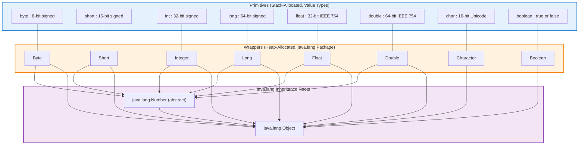
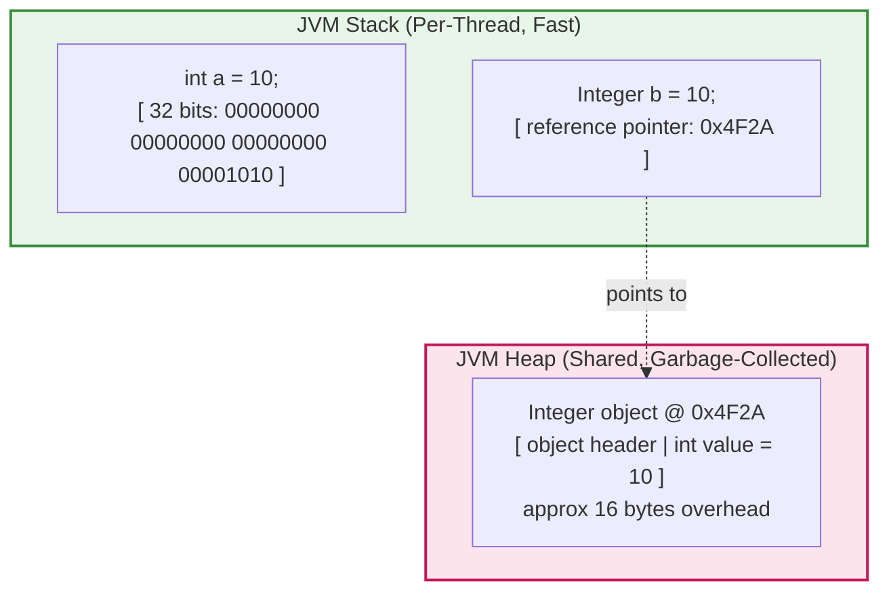
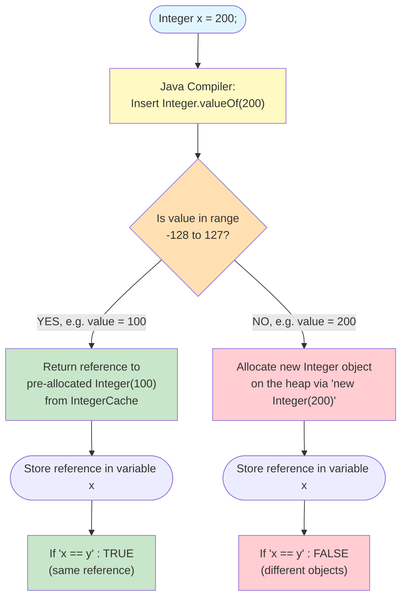

# Primitive Data types and Wrapper Types

<!-- SECTION_1_START -->
# 1. Core Technical Definition & Intuitive Overview

## 1.1 Primitive Data Types — The Academic Definition

> [!IMPORTANT]
> **Formal Definition (KTU 2024 Syllabus Aligned):**
> In the Java programming language, **primitive data types** are the most basic, atomic, and built-in data types that are not objects and therefore have no methods or fields. They are predefined by the Java language specification (JLS) and are stored directly on the **stack memory** of the Java Virtual Machine (JVM). Java defines **eight (8) primitive data types**: `byte`, `short`, `int`, `long`, `float`, `double`, `char`, and `boolean`. Each primitive occupies a fixed, platform-independent size as defined by the JLS (e.g., `int` is always **32 bits** on any compliant JVM, irrespective of the underlying hardware architecture — this is the famous *"write once, run anywhere"* portability promise of Java).

The eight primitives are categorised into four logical groups for KTU board valuation purposes:

| Category | Types | Purpose |
| :--- | :--- | :--- |
| Integer Group | `byte`, `short`, `int`, `long` | Whole numbers (no fractional part) |
| Floating Group | `float`, `double` | Real numbers with decimals (IEEE 754) |
| Character | `char` | Single **16-bit Unicode** character |
| Logical | `boolean` | Truth values: `true` or `false` |

## 1.2 Wrapper Types — The Academic Definition

> [!IMPORTANT]
> **Formal Definition (KTU 2024 Syllabus Aligned):**
> **Wrapper classes** are object-oriented counterparts of the primitive data types, defined in the `java.lang` package. They *encapsulate* (wrap) a primitive value inside a heap-allocated object so that the value can participate in object-only operations such as being added to a `java.util.Collection`, used as a generic type parameter (e.g., `ArrayList<Integer>`), or synchronized across threads. The eight wrapper classes are: `Byte`, `Short`, `Integer`, `Long`, `Float`, `Double`, `Character`, and `Boolean`. All numeric wrappers inherit from the abstract class `java.lang.Number`.

## 1.3 Conceptual Analogy / Intuition

> [!NOTE]
> **Analogy — The "Bubble-Wrap" Metaphor**
> Think of a primitive value as a **raw glass marble** rolling freely inside a small wooden box (the *stack*). It is fast to access, light, and the JVM can grab it instantly. However, you cannot put a raw marble into a *gift hamper* (a `Collection`) because the hamper only accepts *boxed gifts*. A **Wrapper class** is the cardboard box that surrounds the marble. The marble is still inside, but now it has an outer container with a label and a lid. Operations like `unboxing` are simply opening the lid to take the marble out; `autoboxing` is putting the marble back into the box automatically.
>
> * **Primitives = raw marble** → fast, lightweight, lives on the **stack**.
> * **Wrappers = marble in a box** → heavier, lives on the **heap**, but accepted everywhere a "gift" (`Object`) is required.

> [!VISUALIZATION CONTROL]
> **Concept:** Memory layout difference between a primitive and a wrapper object
> **Java Reference Representation:**
> * Primitive `int x = 10;` → A 32-bit cell on the **stack** with the literal bits for `10`.
> * Wrapper `Integer y = 10;` → A **stack reference** (pointer) pointing to a **heap object** that internally holds the `int` value plus object header (≈ 16 bytes overhead).
> **Visual Description:** Imagine a vertical column representing the **stack** (small, LIFO, very fast). The primitive sits *directly inside* the column. The wrapper, however, is an *arrow* drawn from the column to a separate, larger warehouse (the **heap**) where the boxed object is stored. The indirection (arrow) is what makes wrappers slower to access but usable in generic frameworks like `HashMap<Integer, String>`.

<!-- SECTION_1_END -->

<!-- SECTION_2_START -->
# 2. Deep Theoretical Analysis & KTU High-Yield Formula Sheet

## 2.1 The Eight Primitives — Operational Breakdown

Java's type system is **strictly statically typed**: every variable and every expression has a type that is known at compile time. This prevents a huge class of bugs (silent integer overflows in C, implicit pointer arithmetic, etc.) and is a frequent KTU viva question.

> [!NOTE]
> **Why does Java have so many integer types?**
> It is a *memory economy and domain-mapping* decision. Embedded systems (IoT sensors running Java ME) care about every byte, so `byte` (8 bits) exists. Massive financial counters exceed 2.1 billion, so `long` (64 bits) exists. Scientific computing needs fractional precision, so `float`/`double` exist. The four sizes map directly to the four common hardware register widths (8, 16, 32, 64 bits) used by processor ALUs.

### 2.1.1 Integer Group — Logic Steps

1. **Storage:** All integer types are stored in **two's complement** binary representation.
2. **Range Formula:** For an $n$-bit signed integer, the range is governed by:
   $$\text{Range} = \left[ -2^{n-1}, \;\; 2^{n-1} - 1 \right]$$
3. **Default Value:** Every primitive declared as a class/instance field (not local variable) receives a default. Integer primitives default to `0`, `long` to `0L`.
4. **Literal Suffix Rule:** `long` literals *must* end in `L` (e.g., `100L`) — otherwise the compiler infers `int` and may throw a *type mismatch* error.

### 2.1.2 Floating Group — Logic Steps

1. **Standard:** Both `float` and `double` conform to the **IEEE 754** floating-point standard.
2. **`float`** = **32 bits** → suffix `f`/`F` is *mandatory* (e.g., `3.14f`).
3. **`double`** = **64 bits** → default for any decimal literal (e.g., `3.14` is a `double`).
4. **Special Values:** `Float` and `Double` support `POSITIVE_INFINITY`, `NEGATIVE_INFINITY`, `NaN` (Not a Number).

### 2.1.3 Character — Logic Steps

1. **Size:** **16 bits** — unlike C's 8-bit `char`, Java's `char` uses **Unicode (UTF-16)** so it can represent symbols from global scripts (e.g., `'\u0905'` is the Devanagari letter 'अ').
2. **Range:** $0$ to $2^{16}-1 = 65535$.
3. **Unsigned:** Java `char` is technically *unsigned*, the only unsigned primitive in the language.

### 2.1.4 Boolean — Logic Steps

1. **Size:** JLS does not mandate a size; JVMs typically use **1 byte** internally, but only the logical values `true` and `false` are valid.
2. **No Casting:** You cannot cast a numeric primitive to `boolean` (unlike C/C++).

## 2.2 Wrapper Classes — Operational Breakdown

1. **Location:** All eight wrappers live in `java.lang` — auto-imported, no `import` statement needed.
2. **Inheritance:** Numeric wrappers extend the abstract class `java.lang.Number`.
3. **Immutability:** Wrapper objects are **immutable** — once created, the wrapped primitive value cannot be changed. Any "modification" returns a *new* wrapper object. This property makes wrappers **thread-safe by design** for read-only sharing.
4. **Caching (Critical for KTU!):** `Boolean` caches both values. `Byte`, `Short`, `Integer`, `Long` cache values in the range **-128 to +127**. `Character` caches `\u0000` to `\u007F`. `Float` and `Double` **do not cache**. This is a famous viva and MCQ trap.

## 2.3 Autoboxing and Unboxing (Java 5+ Feature)

> [!IMPORTANT]
> **Autoboxing:** The *automatic conversion* that the Java compiler performs from a primitive type to its corresponding wrapper class. Performed implicitly when a primitive is passed as an argument to a method expecting an `Object` or a generic type parameter, or assigned to a wrapper variable.
> **Unboxing:** The reverse automatic conversion from wrapper object to its corresponding primitive. Performed when a wrapper is used in an arithmetic expression, passed to a method expecting a primitive, or assigned to a primitive variable.

## 2.4 KTU High-Yield Formula Sheet (Examiner's Cheat Table)

> [!NOTE]
> The table below is the **single most important reference** for answering the *"List all primitive data types with their size and range"* type of question that appears in KTU ESE and internals almost every semester.

| Primitive | Wrapper Class | Size (bits) | Size (bytes) | Min Value | Max Value | Default | Literal Suffix |
| :--- | :--- | :---: | :---: | :--- | :--- | :---: | :---: |
| `byte` | `java.lang.Byte` | 8 | 1 | $-2^{7} = -128$ | $2^{7}-1 = 127$ | `0` | (none) |
| `short` | `java.lang.Short` | 16 | 2 | $-2^{15} = -32\,768$ | $2^{15}-1 = 32\,767$ | `0` | (none) |
| `int` | `java.lang.Integer` | 32 | 4 | $-2^{31} = -2\,147\,483\,648$ | $2^{31}-1 = 2\,147\,483\,647$ | `0` | (none) |
| `long` | `java.lang.Long` | 64 | 8 | $-2^{63}$ | $2^{63}-1$ | `0L` | `L` or `l` |
| `float` | `java.lang.Float` | 32 | 4 | $\approx -3.4 \times 10^{38}$ | $\approx 3.4 \times 10^{38}$ | `0.0f` | `F` or `f` |
| `double` | `java.lang.Double` | 64 | 8 | $\approx -1.8 \times 10^{308}$ | $\approx 1.8 \times 10^{308}$ | `0.0d` | `D`/`d` (optional) |
| `char` | `java.lang.Character` | 16 | 2 | `'\u0000'` (= 0) | `'\uffff'` (= 65 535) | `'\u0000'` | wrapped in `''` |
| `boolean` | `java.lang.Boolean` | ~1 (JVM-specific) | ~1 | n/a | n/a | `false` | `true` / `false` |

### 2.5 Production Utility — Why an Engineer Must Know This

* **Collections Framework:** `ArrayList<int>` is **illegal** in Java (generics only accept reference types). You *must* use `ArrayList<Integer>`. The compiler auto-boxes every `int` you `.add(...)` and unboxes every `int` you `.get(...)`. This is the #1 production use case.
* **Database Mapping (JDBC / Hibernate):** SQL `NULL` is a tri-state (absent). Primitives cannot be `null`, but wrappers can. Hence ORM frameworks (Hibernate, JPA) require wrapper types (`Integer age`, not `int age`) so that database `NULL` values can be modelled.
* **JSON / Network Serialization:** Libraries like Jackson, Gson, and Protobuf serialize *objects*, not stack values. Wrappers are mandatory.
* **Reflection API:** `java.lang.reflect.Field` methods like `setInt()` and `set(new Integer(5))` force you to box/unbox correctly when writing generic frameworks.

<!-- SECTION_2_END -->

<!-- SECTION_3_START -->
# 3. Step-by-Step Derivations & Code/Symbolic Implementation

## 3.1 Derivation — The 32-bit Range of `int`

> [!NOTE]
> The KTU examiner loves asking: *"Why is the maximum value of an `int` 2,147,483,647 and not 2,147,483,648?"* The derivation below gives full credit.

An `int` is stored using **two's complement** representation in $n = 32$ bits.

**Step 1.** Identify the formula for an $n$-bit signed two's-complement range:

$$\text{Min} = -2^{n-1}, \qquad \text{Max} = 2^{n-1} - 1$$

**Step 2.** Substitute $n = 32$:

$$\text{Min} = -2^{32-1} = -2^{31} = -2\,147\,483\,648$$

**Step 3.** Compute the maximum:

$$\text{Max} = 2^{32-1} - 1 = 2^{31} - 1 = 2\,147\,483\,647$$

**Step 4.** Explain *why* the max is one less than the absolute value of the min. In two's-complement, the **most significant bit (MSB)** is reserved as the *sign bit*. For the positive side, the sign bit must be 0, leaving only 31 bits to encode magnitude, so the largest positive value uses all 31 lower bits set to 1:

$$\underbrace{0}_{\text{sign}} \;\; \underbrace{111\,111\,111\,111\,111\,111\,111\,111\,111\,111}_{31 \text{ ones}}$$

**Step 5.** Convert to decimal:

$$2^{31} - 1 = 2\,147\,483\,647$$

This is exactly why `Integer.MAX_VALUE` in Java returns **2 147 483 647** and not $2^{31}$.

## 3.2 Derivation — Overflow Behaviour of Primitive `int`

The arithmetic behaviour of a Java primitive is **defined to wrap around silently in two's complement** (unlike, say, Ada which throws an exception). This is critical for KTU viva.

For a 32-bit signed `int` adding 1 to `Integer.MAX_VALUE`:

$$2^{31} - 1 + 1 = 2^{31}$$

In binary, the sign bit flips from `0` to `1`, so the result is interpreted as a *negative* number:

$$2^{31} \equiv -2^{31} = -2\,147\,483\,648 \pmod{2^{32}}$$

Therefore:

```java
int x = Integer.MAX_VALUE;   //  2147483647
int y = x + 1;               //  -2147483648  (silent overflow, no exception!)
```

> [!WARNING]
> KTU students often write `if (counter + 1 > counter)` to detect overflow. **This is incorrect** because Java integer arithmetic wraps silently. Use `java.lang.Math.addExact(int, int)` (Java 8+) which throws `ArithmeticException` on overflow — this is the *expected modern answer* for full KTU marks.

## 3.3 Operational Java Implementation — All Eight Primitives & Wrappers

The Java program below demonstrates (a) all eight primitive declarations with their literal suffixes, (b) explicit boxing via `valueOf`, (c) autoboxing, (d) unboxing, and (e) the famous **Integer cache identity trap** that is a classic KTU board question.

```java
// File: PrimitiveWrapperDemo.java
// KTU Object Oriented Programming - Module 1 Demonstration
// Demonstrates: Primitive declaration, wrapper creation, autoboxing, unboxing, cache behaviour.

import java.util.ArrayList;
import java.util.List;

public final class PrimitiveWrapperDemo {

    // ---------- 1. The Eight Primitive Data Types ----------
    private static void demonstratePrimitives() {
        // Integer group (signed, two's complement)
        byte   ageInYears    = 21;            //  8 bits
        short  itemCount     = 1000;          // 16 bits
        int    population    = 1_400_000_000; // 32 bits (underscores are legal separators, Java 7+)
        long   nationalDebt  = 1_000_000_000_000L; // 64 bits, 'L' suffix is MANDATORY

        // Floating group (IEEE 754)
        float  piFloat       = 3.14159f;      // 32 bits, 'f' suffix is MANDATORY
        double piDouble      = 3.141592653589793; // 64 bits, default for any decimal

        // Character & logical
        char   grade         = 'A';           // 16-bit Unicode
        boolean isPassed     = true;

        // Compile-time constants are inlined by the compiler
        final int MAX_LOGIN_ATTEMPTS = 3;

        System.out.println("byte  age     = " + ageInYears);
        System.out.println("short count   = " + itemCount);
        System.out.println("int   pop     = " + population);
        System.out.println("long  debt    = " + nationalDebt);
        System.out.println("float pi      = " + piFloat);
        System.out.println("double pi     = " + piDouble);
        System.out.println("char  grade   = " + grade);
        System.out.println("bool  pass    = " + isPassed);
    }

    // ---------- 2. Explicit Boxing using valueOf() ----------
    private static void demonstrateExplicitBoxing() {
        Integer iObj = Integer.valueOf(42);    // preferred (reuses cache for small values)
        Double  dObj = Double.valueOf(3.14);   // always allocates new (no cache)
        Boolean bObj = Boolean.valueOf(true);  // reuses cached TRUE singleton

        // valueOf() is preferred over 'new Integer(42)' — deprecated since Java 9.
        System.out.println("Boxed Integer = " + iObj);
        System.out.println("Boxed Double  = " + dObj);
        System.out.println("Boxed Boolean = " + bObj);
    }

    // ---------- 3. Autoboxing & Unboxing (Java 5+) ----------
    private static void demonstrateAutoBoxing() {
        // Autoboxing: primitive -> wrapper automatically
        Integer autoBoxed = 100;               // compiler inserts Integer.valueOf(100)

        // Unboxing: wrapper -> primitive automatically
        int unboxed = autoBoxed;               // compiler inserts autoBoxed.intValue()

        // Real-world use: Collections can ONLY hold Objects, not primitives
        List<Integer> marks = new ArrayList<>();
        marks.add(85);     // autoboxes 85 (int) into Integer
        marks.add(90);
        marks.add(75);

        int total = 0;
        for (Integer m : marks) {
            total += m;    // unboxes Integer back to int for the addition
        }
        double average = (double) total / marks.size();
        System.out.println("Autoboxed value = " + autoBoxed);
        System.out.println("Unboxed value   = " + unboxed);
        System.out.printf("Average marks   = %.2f%n", average);
    }

    // ---------- 4. The Integer Cache Identity Trap (HIGH-YIELD KTU) ----------
    private static void demonstrateIntegerCacheTrap() {
        // For values between -128 and 127, Integer.valueOf() returns a CACHED object.
        Integer a = 100;     // autoboxed using Integer.valueOf(100) -> same cached object
        Integer b = 100;
        System.out.println("a == b (100)         : " + (a == b));   // true  (same reference)

        Integer c = 200;     // outside cache -> new object allocated
        Integer d = 200;
        System.out.println("c == d (200)         : " + (c == d));   // false (different refs)
        System.out.println("c.equals(d) (200)    : " + c.equals(d)); // true  (same value)

        // The CORRECT way to compare wrappers is .equals(), NEVER '=='
        System.out.println("c.intValue() == d    : " + (c.intValue() == d.intValue())); // true
    }

    // ---------- 5. Safe String -> Primitive Parsing ----------
    private static void demonstrateParsing() {
        String numberText = "12345";
        int parsed = Integer.parseInt(numberText);     // returns primitive
        Integer boxed = Integer.valueOf(numberText);   // returns wrapper

        // parseInt vs valueOf: parseInt is faster if you only need the primitive.
        System.out.println("Parsed int     = " + parsed);
        System.out.println("Boxed Integer  = " + boxed);

        // Robust error handling (production-grade)
        try {
            int bad = Integer.parseInt("NotANumber");
        } catch (NumberFormatException nfe) {
            System.err.println("Caught expected exception: " + nfe.getMessage());
        }
    }

    // ---------- Driver ----------
    public static void main(final String[] args) {
        System.out.println("--- 1. Primitives ---");
        demonstratePrimitives();
        System.out.println("\n--- 2. Explicit Boxing ---");
        demonstrateExplicitBoxing();
        System.out.println("\n--- 3. Autoboxing & Unboxing ---");
        demonstrateAutoBoxing();
        System.out.println("\n--- 4. Integer Cache Trap ---");
        demonstrateIntegerCacheTrap();
        System.out.println("\n--- 5. Parsing ---");
        demonstrateParsing();
    }
}
```

## 3.4 Step-by-Step Trace of the Cache Trap

The output trace, expanded for the KTU valuation key:

```
--- 4. Integer Cache Trap ---
a == b (100)         : true      <-- a and b point to the SAME cached Integer object
c == d (200)         : false     <-- c and d are two DISTINCT heap objects
c.equals(d) (200)    : true      <-- equals() compares the wrapped VALUES, not the references
c.intValue() == d    : true      <-- unboxing yields primitives; '==' compares values
```

**Valuation key reasoning:**

1. The JVM caches `Integer` objects for the inclusive range $[-128, 127]$ (this range is configurable via `-XX:AutoBoxCacheMax`).
2. `Integer a = 100;` → compiler emits `Integer.valueOf(100)` → cache hit → returns the shared singleton.
3. `Integer c = 200;` → compiler emits `Integer.valueOf(200)` → cache miss → `new Integer(200)` allocated on heap.
4. Reference comparison `==` therefore yields `true` for 100, `false` for 200.
5. The professional way: always use `.equals()` (or unbox first with `.intValue()`).

## 3.5 Step-by-Step Type Promotion (Widening Conversion) Trace

When mixing primitives in expressions, Java applies **automatic type promotion** following the KTU board rule:

```
byte -> short -> int -> long -> float -> double
                    ^
                    |
                  char (special, promotes to int)
```

**Example trace:**

```java
byte  b = 10;
int   i = 20;
long  l = 30L;
float f = 1.5f;
double result = b + i + l + f;  // promotion order
```

1. `b` is promoted to `int` (byte → short → int).
2. `b + i` is `int + int = int`.
3. `int` is promoted to `long` for the addition with `l`: `int + long = long`.
4. `long` is promoted to `float` for the addition with `f`: `long + float = float`.
5. `float` is promoted to `double` for the final assignment: `float + ... = double`.

> [!WARNING]
> A `float` is *wider* than a `long` in Java's promotion order even though both are 32-bit and 64-bit respectively. This is because IEEE 754 `float` can represent a larger *range* of values, even with less *precision*. Confusing these two is a guaranteed mark-losing error.

<!-- SECTION_3_END -->

<!-- SECTION_4_START -->
# 4. Structural Diagrams & Schematics

## 4.1 Type Hierarchy — Primitives vs. Wrappers

The following Mermaid block diagram shows the *parallel architecture* of Java's type system: eight primitives on the left (lightweight, stack-allocated, value semantics) and their object counterparts on the right (heap-allocated, reference semantics, inheritance from `java.lang.Number`).



## 4.2 Autoboxing / Unboxing Flow

The block-level functional architecture below maps the compiler's automatic conversion pipeline. Notice that the **compiler**, not the JVM, performs the transformation by inserting the appropriate `valueOf()` / `xxxValue()` method call.

```mermaid
flowchart LR
    A["Source Code<br/>Integer x = 42;"] --> B{"Compiler<br/>Analysis"}
    B -->|Detects assignment<br/>of int literal to Integer| C["Emit:<br/>Integer x = Integer.valueOf(42);"]
    C --> D["Runtime:<br/>Cache hit (in -128..127)<br/>or new heap allocation"]

    E["Source Code<br/>int y = x;"] --> F{"Compiler<br/>Analysis"}
    F -->|Detects assignment<br/>of Integer to int| G["Emit:<br/>int y = x.intValue();"]
    G --> H["Runtime:<br/>Read 32-bit value from heap object"]

    I["Source Code<br/>List&lt;Integer&gt; list = new ArrayList&lt;&gt;();<br/>list.add(7);"] --> J{"Compiler<br/>Analysis"}
    J -->|Detects int argument<br/>to add(Object)| K["Emit:<br/>list.add(Integer.valueOf(7));"]
    K --> L["Runtime:<br/>Autoboxed Integer pushed<br/>into the ArrayList"]

    style A fill:#bbdefb
    style B fill:#fff9c4
    style C fill:#c8e6c9
    style D fill:#ffcdd2
    style E fill:#bbdefb
    style F fill:#fff9c4
    style G fill:#c8e6c9
    style H fill:#ffcdd2
    style I fill:#bbdefb
    style J fill:#fff9c4
    style K fill:#c8e6c9
    style L fill:#ffcdd2
```

## 4.3 Memory Layout — Primitive vs Wrapper

The block diagram below renders the *physical memory layout* in the JVM. This is the diagram to draw when an examiner asks "explain the difference between a primitive variable and a wrapper variable in terms of memory."



**Key takeaways from the diagram:**

* The primitive `a` is stored *as bits* directly in the stack frame.
* The wrapper `b` occupies a stack slot (the reference) that **points to** a heap object.
* Dereferencing `b` requires **two** memory accesses (stack read, then heap read) — this is the cost of autoboxing.
* Primitive `a` requires **one** memory access — this is the speed advantage.

## 4.4 Sequential Processing Topology — Integer Cache Mechanism



<!-- SECTION_4_END -->

<!-- SECTION_5_START -->
# 5. KTU 2024 Scheme Examination Question Bank & Topic Recap

## 5.1 Part A — Short Answer Questions (3 Marks Each)

### Question 1 `[KTU University Exam - July 2024]`
**CO1 | Remember**

> Explain the difference between primitive data types and wrapper classes in Java. Why do we need wrapper classes when primitives already exist?

**Model Answer (Valuation Key, 3 Marks):**

| Step | Marks | Content |
| :--- | :---: | :--- |
| Define primitives | 1 | Primitive data types are the eight basic, non-object types in Java (`byte`, `short`, `int`, `long`, `float`, `double`, `char`, `boolean`). They are stored directly on the **stack**, hold raw values, and have no methods. |
| Define wrappers | 1 | Wrapper classes (`Byte`, `Short`, `Integer`, `Long`, `Float`, `Double`, `Character`, `Boolean`) are object representations of these primitives, defined in `java.lang`. They are stored on the **heap** as reference types and provide utility methods such as `parseXxx()`, `valueOf()`, `MAX_VALUE`, etc. |
| Justify the need | 1 | Wrappers are required because (i) Java Collections (`ArrayList`, `HashMap`) and Generics accept **only objects**, not primitives, (ii) primitive fields cannot be `null` but database columns can — wrappers support `null`, (iii) wrapper objects provide utility methods (e.g., `Integer.parseInt(String)`). |

---

### Question 2 `[KTU University Exam - Dec 2023]`
**CO1 | Understand**

> What is autoboxing and unboxing in Java? Give a code example showing where autoboxing occurs.

**Model Answer (Valuation Key, 3 Marks):**

| Step | Marks | Content |
| :--- | :---: | :--- |
| Define autoboxing | 1 | **Autoboxing** is the automatic conversion performed by the Java compiler from a primitive type to its corresponding wrapper class object. Introduced in **Java 5**. |
| Define unboxing | 1 | **Unboxing** is the reverse automatic conversion from a wrapper object to its corresponding primitive type. |
| Code example | 1 | ```java\n Integer x = 100;    // autoboxing: int -> Integer\n int y = x;          // unboxing:  Integer -> int\n ArrayList<Integer> list = new ArrayList<>();\n list.add(50);      // autoboxes 50 into Integer\n ``` |

---

## 5.2 Part B — Long Answer Questions (14 Marks Each)

> **KTU 2024 ESE Pattern:** Part B questions carry **14 marks** and offer an *internal choice*. Each question has two sub-parts, usually **(a) 7 marks** and **(b) 7 marks**. Below are two fully solved alternatives.

---

### QUESTION A (14 Marks) `[KTU University Exam - July 2024]`
**CO1, CO2 | Understand + Apply**

> **(a)** List all the **eight primitive data types** in Java along with their size (in bits), default value, range, and corresponding wrapper class. *(7 marks)*
>
> **(b)** Write a Java program to demonstrate **autoboxing, unboxing, and the `Integer` cache identity trap**. Show why the `==` operator behaves differently for values within and outside the cache range. *(7 marks)*

---

#### Model Solution — Part (a) (7 Marks)

**[Stating the four groups and the eight primitives: 2 Marks]**

Java defines **eight** primitive data types, categorised as:

1. **Integer group** — `byte`, `short`, `int`, `long`
2. **Floating-point group** — `float`, `double`
3. **Character** — `char`
4. **Logical** — `boolean`

**[Writing the size, range, default, and wrapper for each primitive in a table form: 4 Marks]**

| Primitive | Size (bits) | Range (Min) | Range (Max) | Default | Wrapper |
| :--- | :---: | :--- | :--- | :---: | :--- |
| `byte`   | 8  | $-2^{7} = -128$ | $2^{7}-1 = 127$ | `0` | `Byte` |
| `short`  | 16 | $-2^{15}$ | $2^{15}-1$ | `0` | `Short` |
| `int`    | 32 | $-2^{31}$ | $2^{31}-1$ | `0` | `Integer` |
| `long`   | 64 | $-2^{63}$ | $2^{63}-1$ | `0L` | `Long` |
| `float`  | 32 | $\approx -3.4 \times 10^{38}$ | $\approx 3.4 \times 10^{38}$ | `0.0f` | `Float` |
| `double` | 64 | $\approx -1.8 \times 10^{308}$ | $\approx 1.8 \times 10^{308}$ | `0.0d` | `Double` |
| `char`   | 16 | `'\u0000'` (0) | `'\uffff'` (65 535) | `'\u0000'` | `Character` |
| `boolean`| ~1 (JVM) | n/a | n/a | `false` | `Boolean` |

**[Final concluding statement about portability: 1 Mark]**

All these sizes are **fixed by the Java Language Specification** and are **platform-independent** — an `int` is always 32 bits on a 64-bit Linux server, a Windows machine, or a Raspberry Pi.

---

#### Model Solution — Part (b) (7 Marks)

**[Defining autoboxing and unboxing with code: 2 Marks]**

```java
// Autoboxing: primitive -> wrapper (compiler inserts valueOf)
Integer a = 50;     // equivalent to Integer a = Integer.valueOf(50);
Integer b = 50;     // same cache reference because 50 is in [-128, 127]

// Unboxing: wrapper -> primitive (compiler inserts intValue)
int sum = a + b;    // equivalent to int sum = a.intValue() + b.intValue();
```

**[Demonstrating the Integer cache identity trap: 3 Marks]**

```java
Integer x = 100;   // cache HIT: x points to a pre-allocated Integer(100)
Integer y = 100;   // cache HIT: y points to the SAME pre-allocated Integer(100)
System.out.println(x == y);       // TRUE  -> same reference

Integer p = 200;   // cache MISS: p points to a newly allocated Integer(200)
Integer q = 200;   // cache MISS: q points to ANOTHER newly allocated Integer(200)
System.out.println(p == q);       // FALSE -> different references
System.out.println(p.equals(q));  // TRUE  -> values are equal
```

**[Explaining the reason and giving the correct comparison idiom: 2 Marks]**

The JVM maintains a static cache of `Integer` objects for values in the inclusive range **-128 to +127** (this range is configurable via the JVM flag `-XX:AutoBoxCacheMax`). When `Integer.valueOf(int)` is called with a value inside this range, the cached object is returned. Outside the range, a *new* object is heap-allocated. Therefore `==` (reference equality) works *only* inside the cache range. **The professional rule is to always compare wrappers using `.equals()`** (or unbox them first with `.intValue()`).

---

### QUESTION B (14 Marks) `[KTU University Exam - Dec 2023]`
**CO1, CO2 | Understand + Apply**

> **(a)** Explain the concept of **type promotion** in Java expressions involving mixed primitive types. Demonstrate with an example containing `byte`, `int`, `long`, and `float` operands. Why is `float` considered *wider* than `long`? *(7 marks)*
>
> **(b)** Write a Java program to parse a `String` into a primitive `int` and into an `Integer` wrapper, with proper exception handling. Explain the difference between `Integer.parseInt()` and `Integer.valueOf()`. *(7 marks)*

---

#### Model Solution — Part (a) (7 Marks)

**[Defining type promotion: 2 Marks]**

**Type promotion** (also called *widening conversion*) is the automatic conversion performed by the Java compiler when an expression mixes two or more primitive types. The operand with the *narrower* type is promoted to the *wider* type before the operation is carried out. The promotion is **lossless** in all KTU cases.

**[Listing the promotion order: 2 Marks]**

```
byte  ->  short  ->  int  ->  long  ->  float  ->  double
                     ^
                     |
                   char
```

**[Demonstration with example: 2 Marks]**

```java
byte  b = 10;
int   i = 20;
long  l = 30L;
float f = 1.5f;
double result = b + i + l + f;   // evaluate left to right
```

**Step-by-step trace:**

1. `b` is promoted `byte -> int` → 10 (int).
2. `b + i` → `int + int = int` → 30 (int).
3. `int + l` → `int + long = long` → 60L (long).
4. `long + f` → `long + float = float` → 61.5f (float).
5. `float + ...` → final assignment widens to `double` → 61.5 (double).

**Result:** `result = 61.5` of type `double`.

**[Explaining why float is wider than long: 1 Mark]**

A `float` (32 bits, IEEE 754) can represent a much *larger range* of values ($\pm 3.4 \times 10^{38}$) than a `long` (64 bits, two's complement, $\pm 9.2 \times 10^{18}$). Although `float` has *less precision* (about 7 significant decimal digits) than `long` (about 19 digits), Java's promotion order is based on *range* of representable values, not bit-width. Hence `long` is promoted to `float` automatically when they are mixed.

---

#### Model Solution — Part (b) (7 Marks)

**[Writing the parsing program: 3 Marks]**

```java
public final class ParsingDemo {
    public static void main(final String[] args) {
        String text = "2024";

        // 1. Parsing to a primitive int
        int primitiveValue = Integer.parseInt(text);
        System.out.println("Primitive int = " + primitiveValue);

        // 2. Parsing to a wrapper Integer
        Integer wrapperValue = Integer.valueOf(text);
        System.out.println("Wrapper Integer = " + wrapperValue);

        // 3. Production-grade error handling
        String bad = "TwentyFour";
        try {
            int n = Integer.parseInt(bad);
            System.out.println(n);
        } catch (NumberFormatException nfe) {
            System.err.println("Invalid number string: " + nfe.getMessage());
        }
    }
}
```

**[Explaining parseInt() vs valueOf(): 3 Marks]**

| Aspect | `Integer.parseInt(String)` | `Integer.valueOf(String)` |
| :--- | :--- | :--- |
| Return type | Primitive `int` | Wrapper `Integer` (object) |
| Internal steps | Scans string, returns int | Calls `parseInt()`, then boxes the int via `Integer.valueOf(int)` |
| Performance | Faster (no boxing) | Slightly slower (boxing overhead) |
| Caching benefit | None (no object created) | Benefits from Integer cache if result is in $[-128, 127]$ |
| Use when | You only need the numeric value for arithmetic | You need to store the value in a Collection, generic class, or pass to a method expecting `Object`/`Number` |

**[Conclusion / best practice: 1 Mark]**

Use `parseInt()` for pure arithmetic; use `valueOf()` when the value is going into a Collection or generic API (e.g., `Map<String, Integer>`). Always wrap parsing in `try-catch (NumberFormatException)` because the method throws this *unchecked* exception for invalid input.

---

## 5.3 KTU Examiner's Valuation Warning / Pitfall Callout

> [!WARNING]
> **Top 5 ways students lose marks on this topic in KTU exams:**
>
> 1. **Writing `int` range as $\pm 2.32 \times 10^9$** without the exact integer $2^{31}-1 = 2\,147\,483\,647$. The board wants the *exact* decimal value, not an approximation. **[-2 Marks]**
> 2. **Confusing `float` and `double` suffixes.** Writing `float pi = 3.14;` (no `f`) is a **compile-time error**, not a warning. Always show the `f`/`F` suffix. **[-2 Marks]**
> 3. **Using `==` to compare wrappers.** This is the most common bug in KTU lab exams. Inside the Integer cache range `==` works by accident, masking the bug. Outside the range it silently produces `false`. Always use `.equals()`. **[-3 Marks]**
> 4. **Forgetting that `char` is unsigned 16-bit Unicode**, not 8-bit ASCII. Mentioning Unicode is mandatory for full marks in viva. **[-1 Mark]**
> 5. **Claiming `boolean` is 1 bit.** The JLS deliberately does not specify the size — JVMs typically use 1 byte. Writing "1 bit" is a board-evaluation red flag. **[-1 Mark]**

---

## 5.4 Topic Recap & Important Things to Remember

> [!NOTE]
> **Rapid-Revision Checklist — Read this 5 minutes before the exam.**

* Java has **exactly 8 primitive data types** — no more, no less.
* **Integer group** (`byte`, `short`, `int`, `long`) is **signed two's complement**. Range of an $n$-bit signed integer is $\left[ -2^{n-1},\; 2^{n-1}-1 \right]$.
* `int` is **32 bits** (range $\pm 2.1 \times 10^9$); `long` is **64 bits** (range $\pm 9.2 \times 10^{18}$).
* `float` requires the **`f` suffix**; `long` requires the **`L` suffix**; otherwise compile error.
* `char` is a **16-bit unsigned Unicode** character, range `'\u0000'` to `'\uffff'`.
* `boolean` has only two valid values: `true`, `false`. No casting to/from numeric types.
* **Wrapper classes** live in `java.lang` (auto-imported). Numeric wrappers extend `java.lang.Number`. All wrappers are **immutable**.
* **Autoboxing** = primitive → wrapper (compiler inserts `valueOf`). **Unboxing** = wrapper → primitive (compiler inserts `xxxValue`). Introduced in **Java 5**.
* **Integer cache range** is **-128 to +127** by default (configurable via `-XX:AutoBoxCacheMax`). `==` on wrappers works inside the cache, fails outside. **Always use `.equals()` for wrappers.**
* **Wrappers can be `null`**; primitives cannot. This matters for database `NULL` mapping and for `NullPointerException` risk during unboxing.
* **Collection Framework** (e.g., `ArrayList<Integer>`, `HashMap<String, Double>`) **requires wrappers** because Java generics are reified for reference types only.
* **`parseInt()` returns a primitive**; **`valueOf()` returns a wrapper**. Use `parseInt()` for arithmetic, `valueOf()` for collections.
* **Type promotion order** (widening): `byte → short → int → long → float → double`, with `char` joining at `int`. `float` is wider than `long` because of *range*, not bit-width.
* **`Math.addExact()`** is the modern, exception-throwing way to detect integer overflow (Java 8+).
* **Portability promise:** Primitive sizes are **platform-independent** — an `int` is always 32 bits on any compliant JVM. This is the foundation of Java's "write once, run anywhere" guarantee.

<!-- SECTION_5_END -->
