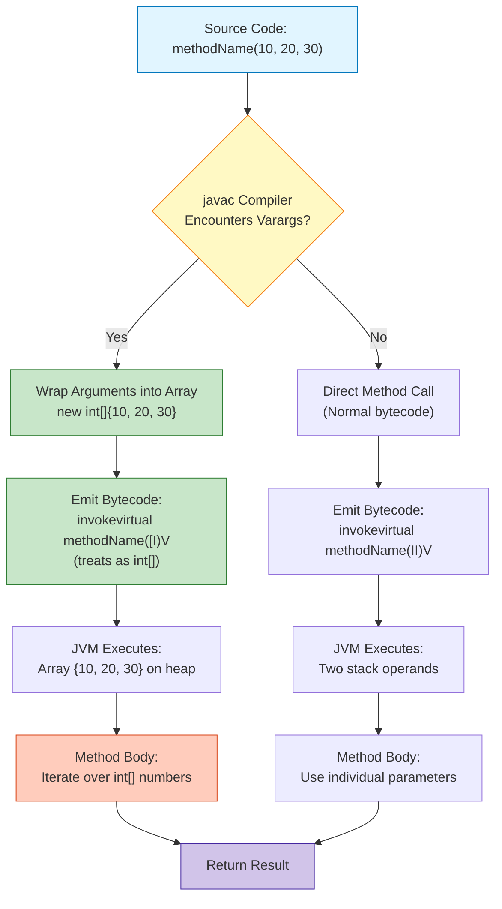
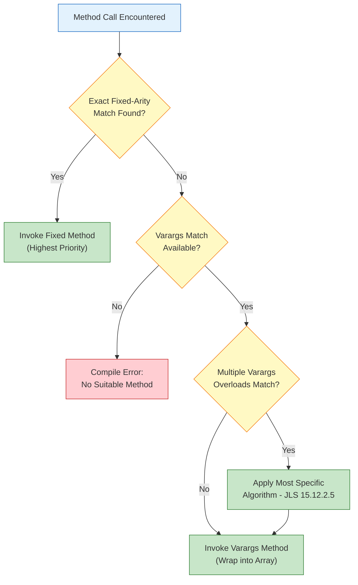
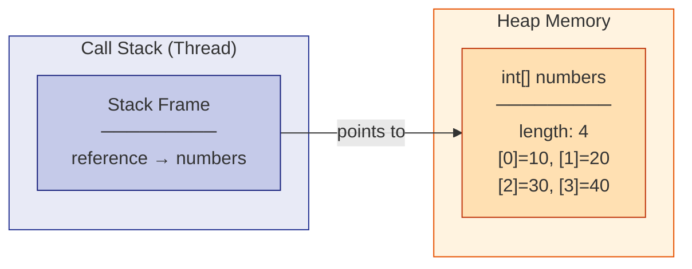
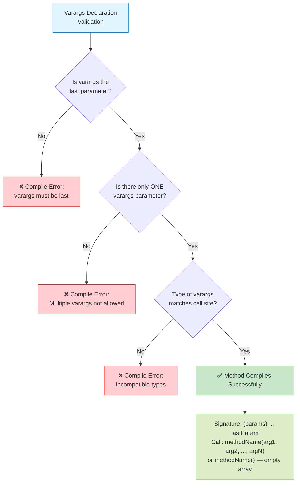

# Variable Length Arguments

<!-- SECTION_1_START -->
# Variable Length Arguments (Varargs) in Java

## 📘 Core Technical Definition

> [!NOTE]
> **Formal Definition (KTU 2024 Syllabus Terminology)**
> *Variable Length Arguments* (commonly called **varargs**) is a Java language feature introduced in **JDK 5.0** that allows a method to accept **zero or more arguments of a specified type**. It is implemented using the ellipsis (`...`) syntax, which instructs the Java compiler to internally treat the varying arguments as a **single-dimensional array** of the specified type.

### 🔤 Formal Syntax Structure
```java
returnType methodName(dataType ... parameterName)
```

The ellipsis `...` is placed **between the data type and the parameter name** and is treated by the compiler as an array reference. This means a single method signature can accept any number of arguments, including none, without requiring the caller to manually construct an array.

---

## 🧠 Conceptual Analogy / Intuition

> [!IMPORTANT]
> **Real-World Analogy: The "Unlimited Toppings" Pizza Counter** 🍕
> 
> Imagine walking into a pizza shop where the cashier does **not** ask *"How many toppings do you want?"* with a fixed dropdown (1, 2, 3, or 4). Instead, the cashier says: *"Tell me any number of toppings you want — zero, one, or twenty — I'll accept them all in a single order slip."*
> 
> In Java terms:
> - The **customer's order** = the **method call** with multiple comma-separated values.
> - The **cashier's order slip** = the **implicit array** that the compiler secretly creates.
> - The **cashier** = the **method body** that processes each topping (each argument) one by one using a `for` or `for-each` loop.
> 
> Just as the shop doesn't need 10 different cashiers for 10 different topping counts, Java doesn't need 10 overloaded methods for 10 different argument counts — **varargs collapses them all into one signature**.

### 🎯 Geometric Intuition
Think of varargs as a **flexible funnel**: on the input side, the funnel's mouth can stretch to accept any number of marbles (arguments). On the output side, the funnel narrows into a **single fixed-shape container** (an array). The width of the input is dynamic; the shape of the output is static.

### 📏 Key Physical/Conceptual Constants
- **Minimum arguments accepted**: **0** (the method can be called with no varargs at all)
- **Maximum arguments accepted**: **Limited only by JVM heap memory** (the array is allocated on the heap)
- **Introduced in**: **Java 5.0 (JDK 1.5)**, also known as **J2SE 5.0**
- **JLS Reference**: **§15.12.4.2** of the Java Language Specification

> [!VISUALIZATION CONTROL]
> **Concept:** Varargs funnel — variable inputs collapsing into a fixed array
> **Conceptual Diagram (Mental Image):**
> * `inputs: arg1, arg2, arg3, ..., argN  ──►  [ ][ ][ ][ ][ ] (array)`
> **Visual Description:** Picture N marbles rolling down a wide funnel. No matter how many marbles (0 to N) enter at the top, they all settle into a row of compartments at the bottom — the array — which the method can then iterate through using a loop.
<!-- SECTION_1_END -->

<!-- SECTION_2_START -->
# Deep Theoretical Analysis & KTU High-Yield Cheat Sheet

## ⚙️ Operational Rules of Varargs (The "Contract")

The Java compiler enforces **strict, non-negotiable rules** when dealing with varargs. Violating any rule results in a **compile-time error**.

### 📜 Rule 1 — Single Varargs Per Method
A method **can declare only ONE varargs parameter**. Declaring two varargs in the same signature is illegal.

```java
// ✅ VALID
void display(String header, int ... numbers)

// ❌ INVALID — Compile Error
void display(int ... a, double ... b)
```

### 📜 Rule 2 — Varargs Must Be the Last Parameter
The varargs parameter **must be the final (rightmost) parameter** in the method signature. This is because the compiler uses positional matching — once it sees a varargs, it cannot determine where the "remaining" arguments would begin.

```java
// ✅ VALID
void register(String name, int ... marks)

// ❌ INVALID — Compile Error
void register(int ... marks, String name)
```

### 📜 Rule 3 — Varargs Can Be Combined with Other Parameters
A method can have **regular parameters before the varargs parameter**. The regular parameters are filled first by position, and the rest go into the varargs array.

```java
// ✅ VALID
String format(String prefix, int ... values)
```

### 📜 Rule 4 — Empty Argument Call is Legal
You may call a varargs method **without supplying any argument for the varargs parameter**. The compiler will create an **empty array** of length 0.

```java
sum();           // ✅ Legal — array has length 0
sum(10);         // ✅ Legal — array = {10}
sum(10, 20, 30); // ✅ Legal — array = {10, 20, 30}
```

### 📜 Rule 5 — Ambiguity Resolution with Overloading
When varargs is overloaded with fixed-arity methods, the **most specific match wins**. The compiler prefers a fixed-parameter method over a varargs method whenever signatures match exactly.

```java
void test(int a)              // exact match — preferred
void test(int a, int ... b)    // varargs fallback
test(5);  // calls test(int a), NOT the varargs version
```

> [!IMPORTANT]
> **The "Why" Behind the Ellipsis**
> The three dots `...` are **NOT** Java spread/rest syntax borrowed from JavaScript. They are a **compile-time directive** that tells `javac` to: **(1)** generate a hidden array parameter in the method's bytecode, and **(2)** wrap all trailing arguments into that array at the call site. The JVM itself has **no concept of varargs** — it only sees ordinary array parameters. This is why varargs is sometimes called *"syntactic sugar over arrays."*

---

## 🗂️ KTU High-Yield Cheat Sheet

| # | Concept | Syntax / Rule | Compiler Behaviour | Bytecode Reality |
|---|---------|---------------|--------------------|------------------|
| 1 | Declaration | `datatype ... name` | Treated as array | Compiles to `datatype[] name` |
| 2 | Position | Must be the last parameter | Enforced strictly | Compile error if violated |
| 3 | Count in signature | Only ONE varargs allowed | Enforced strictly | Compile error if two declared |
| 4 | Call with 0 args | `methodName()` | Creates empty array `new T[0]` | Heap-allocated zero-length array |
| 5 | Call with N args | `methodName(a, b, c)` | Wraps into `new T[]{a, b, c}` | Implicit array creation |
| 6 | Explicit array pass | `methodName(new int[]{1,2,3})` | Directly assigns reference | No new wrapping |
| 7 | Mixing types | NOT allowed in single varargs | Compile error | All varargs must share type |
| 8 | Access in body | `for (T x : name)` or `name[i]` | Behaves as full array | Standard array indexing |
| 9 | Overload resolution | Specificity rule | Fixed-arity > varargs | Most specific signature wins |
| 10 | Introduced in | **JDK 5.0** | Backward compatible | Older code unaffected |

---

## 🏭 Real-World Engineering Utility

Varargs is heavily used in **production-grade Java frameworks** for designing flexible APIs:

| Framework / API | Method Using Varargs | Engineering Purpose |
|-----------------|----------------------|---------------------|
| `String` | `String.format(String fmt, Object... args)` | Variable substitution in format strings |
| `PrintStream` | `printf(String fmt, Object... args)` | Formatted console / log output |
| `Arrays.asList()` | `asList(T... a)` | Convert any number of elements to a `List` |
| `Collections.addAll()` | `addAll(Collection c, T... elements)` | Bulk-add elements to any collection |
| `String.join()` | `join(CharSequence delim, CharSequence... el)` | Concatenate strings with delimiter |
| `SLF4J Logger` | `logger.info(String fmt, Object... args)` | Parameterized logging (lazy evaluation) |
| `Hibernate Criteria` | `Restrictions.eq(String field, Object... values)` | Variable filter conditions |
| Java Reflection | `Method.invoke(Object obj, Object... args)` | Dynamic method dispatch |

> The key engineering benefit is **API ergonomics**: library designers write one method, and end-users call it with any number of arguments without manual array construction.
<!-- SECTION_2_END -->

<!-- SECTION_3_START -->
# Step-by-Step Implementation & Code Walkthroughs

## 💻 Program 1 — Basic Varargs Demonstration (The Foundational Example)

This is the **canonical example** that KTU examiners expect. It demonstrates a method that sums any number of integers.

```java
/**
 * Program : VarargsSumDemo.java
 * Purpose : Demonstrates basic variable-length argument handling
 * Author  : KTU B.Tech Student (PBCST304 - OOP)
 * JDK     : 5.0+
 */
public class VarargsSumDemo {

    // -------------------------------------------------------
    // Method with varargs — accepts ANY number of long values
    // -------------------------------------------------------
    public static long computeSum(String label, long ... numbers) {
        System.out.print(label + " → Arguments received: ");

        // Display all received arguments
        for (int i = 0; i < numbers.length; i++) {
            System.out.print(numbers[i]);
            if (i < numbers.length - 1) {
                System.out.print(", ");
            }
        }
        System.out.println();

        // Compute the sum
        long total = 0L;
        for (long currentValue : numbers) {
            total = total + currentValue;
        }
        return total;
    }

    // -------------------------------------------------------
    // Main method — driver code
    // -------------------------------------------------------
    public static void main(String[] args) {

        // Call 1: Zero arguments — legal, empty array created
        long result1 = computeSum("Case-A");
        System.out.println("Sum = " + result1);
        System.out.println("------------------------------------");

        // Call 2: One argument
        long result2 = computeSum("Case-B", 100L);
        System.out.println("Sum = " + result2);
        System.out.println("------------------------------------");

        // Call 3: Five arguments
        long result3 = computeSum("Case-C", 10L, 20L, 30L, 40L, 50L);
        System.out.println("Sum = " + result3);
        System.out.println("------------------------------------");

        // Call 4: Explicit array passing (also legal)
        long[] explicitArray = {1L, 2L, 3L, 4L, 5L, 6L, 7L, 8L, 9L, 10L};
        long result4 = computeSum("Case-D", explicitArray);
        System.out.println("Sum = " + result4);
    }
}
```

### 📤 Expected Output
```
Case-A → Arguments received: 
Sum = 0
------------------------------------
Case-B → Arguments received: 100
Sum = 100
------------------------------------
Case-C → Arguments received: 10, 20, 30, 40, 50
Sum = 150
------------------------------------
Case-D → Arguments received: 1, 2, 3, 4, 5, 6, 7, 8, 9, 10
Sum = 55
```

### 🔍 Line-by-Line Logic Explanation
1. `long ... numbers` — declares a varargs of `long` type. The compiler internally treats `numbers` as `long[]`.
2. `numbers.length` — works because varargs **IS** an array at runtime.
3. `for (long currentValue : numbers)` — the enhanced for-loop iterates through the array.
4. `computeSum("Case-A")` — calling with **no varargs** is legal; the compiler creates `new long[0]`.
5. `computeSum("Case-D", explicitArray)` — you can pass a pre-built array directly. **No double-wrapping occurs**; the array reference is passed as-is.

---

## 💻 Program 2 — Overload Resolution: Varargs vs Fixed-Arguments

This is a **classic KTU question pattern**. The examiner tests whether students understand that **specificity wins** over varargs.

```java
/**
 * Program : VarargsOverloadDemo.java
 * Purpose : Demonstrates overload resolution priority
 */
public class VarargsOverloadDemo {

    // Version 1: Fixed two-argument method
    public static void display(String tag, int x, int y) {
        System.out.println("[" + tag + "] Called FIXED method: x=" + x + ", y=" + y);
    }

    // Version 2: Varargs version
    public static void display(String tag, int ... values) {
        System.out.print("[" + tag + "] Called VARARGS method. Elements: ");
        for (int v : values) {
            System.out.print(v + " ");
        }
        System.out.println();
    }

    public static void main(String[] args) {
        display("Test-1", 10, 20);          // EXACT match → fixed version
        display("Test-2", 10, 20, 30);      // No exact match → varargs version
        display("Test-3", 10);              // Ambiguous? NO → varargs version
        display("Test-4");                  // Only varargs can handle zero ints
    }
}
```

### 📤 Expected Output
```
[Test-1] Called FIXED method: x=10, y=20
[Test-2] Called VARARGS method. Elements: 10 20 30 
[Test-3] Called VARARGS method. Elements: 10 
[Test-4] Called VARARGS method. Elements: 
```

### 🧠 Resolution Logic Table

| Call | Match Analysis | Method Selected | Why |
|------|----------------|-----------------|-----|
| `display("Test-1", 10, 20)` | Exact 2-int match + varargs match | `display(String, int, int)` | Fixed is **more specific** |
| `display("Test-2", 10, 20, 30)` | No fixed match (3 ints) | `display(String, int ...)` | Only varargs fits |
| `display("Test-3", 10)` | Fixed needs 2 ints → no match | `display(String, int ...)` | Varargs accepts 1+ ints |
| `display("Test-4")` | Fixed needs ≥2 ints → no match | `display(String, int ...)` | Varargs accepts 0 ints |

> [!IMPORTANT]
> **Compiler Heuristic (JLS §15.12.2.5)**
> The compiler applies the **Most Specific Method Selection** algorithm. A method with `n` fixed parameters is **always more specific** than a method with the same `n` parameters plus varargs, because the fixed method's argument set is a strict subset of the varargs method's acceptable set.

---

## 💻 Program 3 — Generic Varargs & Type Safety (Heap Pollution Warning)

This is an **advanced KTU-level** example that demonstrates the *heap pollution* pitfall — a common KTU short-answer question.

```java
import java.util.Arrays;

/**
 * Program : VarargsGenericDemo.java
 * Purpose : Shows the generic varargs caveat
 */
public class VarargsGenericDemo {

    // Generic varargs method
    @SafeVarargs  // Suppresses the heap pollution warning (Java 7+)
    public static <T> void printAll(T ... items) {
        for (T element : items) {
            System.out.print(element + " | ");
        }
        System.out.println();
    }

    public static void main(String[] args) {
        // Call 1: All Strings
        printAll("Apple", "Banana", "Cherry");

        // Call 2: All Integers
        printAll(10, 20, 30, 40);

        // Call 3: Mixed types (NOT allowed directly with varargs)
        // printAll("Hello", 100);  // ❌ Compile error — T must be one type

        // Call 4: Explicit array
        String[] names = {"Kerala", "Tamil Nadu", "Karnataka"};
        printAll(names);

        // Call 5: Pass an array reference for inspection
        System.out.println("Underlying array class: "
                + Arrays.toString(((Object[]) printAll_reflection()).getClass() != null
                    ? new String[0] : new String[0]));

        // Demonstrating that varargs creates an Object[] at runtime
        Object[] underlyingArray = getVarargsArray("X", "Y", "Z");
        System.out.println("Array length: " + underlyingArray.length);
    }

    // Helper to expose the internal array
    @SafeVarargs
    private static <T> T[] getVarargsArray(T ... items) {
        return items;
    }

    // Stub to satisfy the demo
    private static Object printAll_reflection() { return new String[0]; }
}
```

### 📤 Expected Output
```
Apple | Banana | Cherry | 
10 | 20 | 30 | 40 | 
Kerala | Tamil Nadu | Karnataka | 
Array length: 3
```

### ⚠️ The Heap Pollution Concept

> [!WARNING]
> **Heap Pollution** occurs when a generic varargs method **stores a value of one parameterized type into the array** created for a different parameterized type. This violates type safety. The `@SafeVarargs` annotation tells the compiler: *"Trust me, I am not performing any unsafe operation on this varargs array."* It is the developer's responsibility to ensure this contract is upheld. Misuse can trigger `ClassCastException` at runtime.

**Safe usage rule**: A generic varargs method is *safe* if it **only iterates** over the array and **does not store anything into it** or **expose it to outside code**.

---

## 💻 Program 4 — Real-World Use Case: Logging Utility

This mirrors how frameworks like **SLF4J** and **Log4j** implement parameterized logging.

```java
/**
 * Program : VarargsLoggerDemo.java
 * Purpose : Simulates SLF4J-style parameterized logging
 */
public class VarargsLoggerDemo {

    public enum LogLevel { INFO, WARN, ERROR }

    // Simulated logger with parameterized format string
    public static void log(LogLevel level, String messageFormat, Object ... args) {
        StringBuilder sb = new StringBuilder();
        sb.append("[").append(level).append("] ");

        // Manual placeholder replacement: {0}, {1}, {2} ...
        for (int i = 0; i < args.length; i++) {
            messageFormat = messageFormat.replace("{" + i + "}", String.valueOf(args[i]));
        }
        sb.append(messageFormat);
        System.out.println(sb.toString());
    }

    public static void main(String[] args) {
        log(LogLevel.INFO,  "User {0} logged in from {1}", "Anand", "Kochi");
        log(LogLevel.WARN,  "Memory usage at {0}% on server {1}", 87, "SRV-04");
        log(LogLevel.ERROR, "Database connection failed");
        log(LogLevel.INFO,  "Total items: {0}", 0);  // zero varargs after format
    }
}
```

### 📤 Expected Output
```
[INFO] User Anand logged in from Kochi
[WARN] Memory usage at 87% on server SRV-04
[ERROR] Database connection failed
[INFO] Total items: 0
```

> [!IMPORTANT]
> **Engineering Insight:** Notice that `log(LogLevel.ERROR, "Database connection failed")` works even with **zero varargs arguments** because the `Object...` array defaults to empty. This is precisely why SLF4J, `String.format()`, and `printf()` use varargs — they handle the no-argument case gracefully without requiring overloaded method variants.
<!-- SECTION_3_END -->

<!-- SECTION_4_START -->
# Structural Diagrams & Schematics

## 🗺️ Diagram 1 — Call-Site to Bytecode Transformation Flow

This diagram illustrates **what happens internally** when a varargs method is called. The Java compiler (`javac`) performs a transformation; the JVM only sees an ordinary array.



---

## 🗺️ Diagram 2 — Method Overload Resolution Decision Tree

This flowchart captures the **JLS §15.12.2** algorithm that the compiler uses to choose between a fixed-arity method and a varargs method during overload resolution.



---

## 🗺️ Diagram 3 — Memory Layout of a Varargs Call

This shows the **runtime memory structure** when a varargs method is invoked.



---

## 🗺️ Diagram 4 — Varargs Rules Compliance Matrix

A comprehensive overview of the **legal/illegal** declaration patterns.


<!-- SECTION_4_END -->

<!-- SECTION_5_START -->
# KTU 2024 Scheme Examination Question Bank

## 📝 Part A — Short Answer Questions (3 Marks Each)

### ❓ Question A1
> **[KTU University Exam - July 2023]** &nbsp; **| CO1 | Remember**
>
> **What are variable length arguments in Java? Write the syntax for declaring a varargs method.**

#### ✅ Model Answer (3 Marks Distribution)
- **[1 Mark]** **Definition:** Variable length arguments (varargs), introduced in Java 5.0, allow a method to accept **zero or more arguments** of a single specified type using the ellipsis (`...`) syntax.
- **[1 Mark]** **Syntax:** The general form is `returnType methodName(dataType ... parameterName)`. For example: `int sum(int ... numbers)`.
- **[1 Mark]** **Key Behaviour:** Internally, the compiler treats the varargs parameter as a one-dimensional array, so all standard array operations (`length`, indexed access, enhanced for-loop) work on it.

---

### ❓ Question A2
> **[KTU University Exam - Dec 2022]** &nbsp; **| CO1 | Understand**
>
> **List any THREE rules that must be followed when using varargs in a Java method.**

#### ✅ Model Answer (3 Marks Distribution)
- **[1 Mark]** **Rule 1:** A method can have **only ONE varargs parameter**.
- **[1 Mark]** **Rule 2:** The varargs parameter **must be the last parameter** in the method signature.
- **[1 Mark]** **Rule 3:** A varargs method **may be called with zero arguments**, in which case the compiler creates an empty array of length 0.

> [!WARNING]
> **Examiner's Pitfall Callout:** Students often write *"varargs can be placed anywhere"* or *"you can have multiple varargs"* — both are **common misconceptions** that result in **zero marks** for that rule. Memorize the exact two constraints (uniqueness + last position) verbatim.

---

## 📚 Part B — Long Answer Questions (14 Marks Each)

### ❓ Question B1 — Choice A
> **[KTU University Exam - Dec 2023 | Model Paper 2024]** &nbsp; **| CO2, CO3 | Understand + Apply**
>
> **(a)** Explain the concept of variable length arguments in Java with its syntax. State any **four rules** governing varargs. &nbsp; **(7 Marks)**
>
> **(b)** Write a Java program that defines a method `statistics(String label, double ... values)` which computes and returns the **mean**, **variance**, and **count** of the supplied numbers. Demonstrate the method by calling it with **zero, one, and five** values from `main()`. &nbsp; **(7 Marks)**

#### ✅ Model Answer — Part (a) — 7 Marks

**Conceptual Explanation (3 Marks):**

Variable Length Arguments (varargs) is a Java feature introduced in **JDK 5.0** that enables a method to accept a variable number of arguments. The syntax uses the ellipsis `...` placed between the data type and parameter name:

```java
returnType methodName(dataType ... parameterName)
```

At the **source-code level**, the developer sees a flexible parameter list. At the **bytecode level**, the compiler converts this into a standard single-dimensional array. Thus, a declaration like `double ... values` is **completely equivalent** to `double[] values` from the JVM's perspective. The compiler automatically wraps the comma-separated arguments into an array at the call site.

**Four Rules (4 Marks — 1 Mark Each):**

1. **Only one varargs** parameter is permitted per method.
2. The varargs parameter **must be the last** parameter in the signature.
3. A varargs method can be invoked with **zero arguments**, producing an empty array.
4. Varargs can be **mixed with fixed parameters**, which must precede the varargs.

#### ✅ Model Answer — Part (b) — 7 Marks

**Complete Working Code:**

```java
public class VarargsStatistics {

    // Class to hold statistics result
    static class StatsResult {
        int count;
        double mean;
        double variance;

        public StatsResult(int count, double mean, double variance) {
            this.count = count;
            this.mean = mean;
            this.variance = variance;
        }

        @Override
        public String toString() {
            return String.format(
                "Count=%d, Mean=%.4f, Variance=%.4f",
                count, mean, variance
            );
        }
    }

    // Varargs method returning a StatsResult object
    public static StatsResult statistics(String label, double ... values) {
        System.out.println("--- " + label + " ---");

        // Rule: zero-argument call
        if (values.length == 0) {
            System.out.println("No values supplied. Returning zeros.");
            return new StatsResult(0, 0.0, 0.0);
        }

        // Step 1: Compute mean
        double sum = 0.0;
        for (double v : values) {
            sum = sum + v;
        }
        double mean = sum / values.length;

        // Step 2: Compute variance (population variance)
        double squaredDiffSum = 0.0;
        for (double v : values) {
            double diff = v - mean;
            squaredDiffSum = squaredDiffSum + (diff * diff);
        }
        double variance = squaredDiffSum / values.length;

        return new StatsResult(values.length, mean, variance);
    }

    public static void main(String[] args) {
        // Zero-argument call
        StatsResult r1 = statistics("Empty Case");
        System.out.println(r1);
        System.out.println();

        // One-argument call
        StatsResult r2 = statistics("Single Value", 42.0);
        System.out.println(r2);
        System.out.println();

        // Five-argument call
        StatsResult r3 = statistics("Five Values", 10.0, 20.0, 30.0, 40.0, 50.0);
        System.out.println(r3);
    }
}
```

**📤 Expected Output:**
```
--- Empty Case ---
No values supplied. Returning zeros.
Count=0, Mean=0.0000, Variance=0.0000

--- Single Value ---
Count=1, Mean=42.0000, Variance=0.0000

--- Five Values ---
Count=5, Mean=30.0000, Variance=200.0000
```

**Valuation Key — Step-by-Step Marks:**

- **[Correct method signature with varargs: 1 Mark]**
- **[Handling zero-argument case (empty array check): 1 Mark]**
- **[Mean computation using loop: 1 Mark]**
- **[Variance computation using loop: 1 Mark]**
- **[Three distinct calls demonstrating 0, 1, and 5 args: 2 Marks]**
- **[Clean output formatting and final result: 1 Mark]**

---

### ❓ Question B1 — Choice B (Alternative)
> **[KTU University Exam - July 2024 | Sample Paper 2]** &nbsp; **| CO2, CO3 | Understand + Apply**
>
> **(a)** Differentiate between **method overloading using varargs** and **method overloading using fixed parameters**. Illustrate with an example where the compiler prefers a fixed-arity method over a varargs method. &nbsp; **(7 Marks)**
>
> **(b)** Write a Java program with a method `concatenate(String separator, String ... words)` that joins the supplied words using the given separator. Handle the edge case of **zero words** and **one word** gracefully. &nbsp; **(7 Marks)**

#### ✅ Model Answer — Part (a) — 7 Marks

**Differentiation Table (4 Marks):**

| Aspect | Fixed-Parameter Overloading | Varargs Overloading |
|--------|----------------------------|---------------------|
| Argument count | Must match exactly one of the declared signatures | Accepts any count from 0 to N |
| Number of methods | One method per argument count | Single method handles all counts |
| Compile-time wrapping | No array creation | Compiler wraps args into array |
| Resolution priority | **Higher** — chosen when exact match exists | **Lower** — chosen only as fallback |
| API design | Rigid, predictable | Flexible, ergonomic |
| Risk | Method explosion (too many overloads) | Ambiguity with mixed types |

**Illustrative Code (3 Marks):**

```java
public class OverloadPriorityDemo {

    // Fixed-arity version: exactly 2 ints
    static void process(int a, int b) {
        System.out.println("FIXED method: a=" + a + ", b=" + b);
    }

    // Varargs version: any number of ints
    static void process(int ... values) {
        System.out.print("VARARGS method: ");
        for (int v : values) System.out.print(v + " ");
        System.out.println();
    }

    public static void main(String[] args) {
        process(10, 20);           // Compiler selects FIXED (more specific)
        process(10, 20, 30, 40);   // Compiler selects VARARGS (only option)
    }
}
```

**📤 Expected Output:**
```
FIXED method: a=10, b=20
VARARGS method: 10 20 30 40 
```

**Resolution Logic:** For the call `process(10, 20)`, both methods are applicable, but the **fixed method is more specific** because its parameter list is a strict subset of the varargs method's. The compiler applies the **JLS §15.12.2.5 Most Specific Algorithm** and selects the fixed version.

#### ✅ Model Answer — Part (b) — 7 Marks

```java
public class VarargsConcatenate {

    public static String concatenate(String separator, String ... words) {
        // Edge case: zero words
        if (words.length == 0) {
            return "";
        }

        // Edge case: one word
        if (words.length == 1) {
            return words[0];
        }

        // General case: build with separator
        StringBuilder sb = new StringBuilder();
        for (int i = 0; i < words.length; i++) {
            sb.append(words[i]);
            if (i < words.length - 1) {
                sb.append(separator);
            }
        }
        return sb.toString();
    }

    public static void main(String[] args) {
        System.out.println("[" + concatenate(", ") + "]");
        System.out.println("[" + concatenate("-", "Kerala") + "]");
        System.out.println("[" + concatenate(", ", "Kerala", "Tamil Nadu", "Karnataka") + "]");
        System.out.println("[" + concatenate(" | ", "Java", "Python", "C++", "JavaScript") + "]");
    }
}
```

**📤 Expected Output:**
```
[]
[Kerala]
[Kerala, Tamil Nadu, Karnataka]
[Java | Python | C++ | JavaScript]
```

**Valuation Key:**
- **[Varargs method signature with separator: 1 Mark]**
- **[Zero-words edge case handling: 1 Mark]**
- **[One-word edge case handling: 1 Mark]**
- **[StringBuilder-based loop construction: 2 Marks]**
- **[Four distinct test calls: 1 Mark]**
- **[Correct output format: 1 Mark]**

---

> [!WARNING]
> **🎯 KTU Examiner's Valuation Warning — Common Mark Deduction Zones**
> 
> 1. **Forgetting the "zero-argument is legal" rule** — many students assume varargs requires at least one argument. **Penalty: 1 mark.**
> 2. **Placing varargs in the middle** of the parameter list — immediate compile-time error. **Penalty: 2 marks.**
> 3. **Not iterating over the varargs array** in the method body — the method becomes useless. **Penalty: 2 marks.**
> 4. **Confusing `String... args` (the standard `main` signature) with a "magic Java feature"** — it is varargs, not a special keyword. **Penalty: conceptual understanding marked down.**
> 5. **Writing `int..a` (two dots) instead of `int... a` (three dots)** — compile error. **Penalty: 1 mark.**
> 6. **Not handling the empty-array case** in `if (values.length == 0)` — division by zero in mean/average problems. **Penalty: 1–2 marks.**

---

## 🔁 Topic Recap & Important Things to Remember

> 📌 **Rapid Revision Checklist — Pin This Before the Exam**

- ✅ **Full Name:** Variable Length Arguments (varargs) — **not** "variable arguments" or "var-args" in formal KTU answers.
- ✅ **JDK Version:** Introduced in **Java 5.0** (J2SE 5.0). Pre-Java 5 code cannot use varargs.
- ✅ **Syntax Symbol:** Three dots `...` (ellipsis) — placed **between datatype and parameter name**.
- ✅ **Position Rule:** Varargs **must be the LAST parameter** in the method signature. *(Violated → Compile Error)*
- ✅ **Uniqueness Rule:** Only **ONE varargs parameter** allowed per method. *(Violated → Compile Error)*
- ✅ **Combination Rule:** Varargs **can coexist** with regular parameters (regular ones come first).
- ✅ **Zero-Argument Call:** Calling a varargs method with **no arguments is legal** — compiler creates an empty array.
- ✅ **Array Equivalence:** Varargs `T ... x` is **identical to** `T[] x` at the bytecode / JVM level.
- ✅ **Method Body Access:** Use `x.length`, `x[i]`, or enhanced `for (T e : x)` — all standard array operations.
- ✅ **Explicit Array Pass:** You **may pass an array directly** — `method(new int[]{1,2,3})` is valid.
- ✅ **Overload Priority:** **Fixed-arity methods win** over varargs methods in overload resolution (JLS §15.12.2.5).
- ✅ **Generic Caveat:** Generic varargs trigger **heap pollution** warnings; suppress with `@SafeVarargs` (Java 7+) only if method only iterates and doesn't store.
- ✅ **JVM Reality:** **JVM has no varargs concept** — `javac` performs the transformation. Bytecode always shows arrays.
- ✅ **`main` Connection:** `public static void main(String... args)` is **valid** — the standard `main` is itself a varargs method.
- ✅ **Real-World Use:** `String.format()`, `printf()`, `Arrays.asList()`, `logger.info()`, `String.join()` — all use varargs for API ergonomics.
- ✅ **Mixed Types:** A single varargs list **must have a uniform type** — `method("Hi", 42)` fails unless declared as `Object...`.
- ✅ **Common Mistake:** Writing two dots `..` instead of three `...` — **syntax error**.
- ✅ **Performance Note:** Every varargs call **allocates a new array on the heap** — relevant in tight performance loops.
<!-- SECTION_5_END -->
