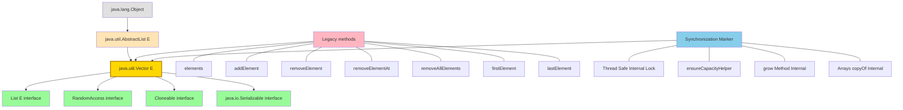
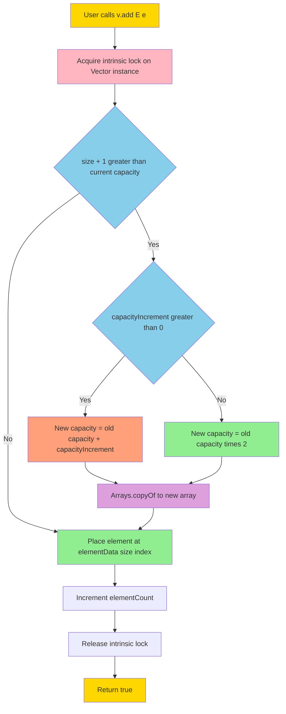
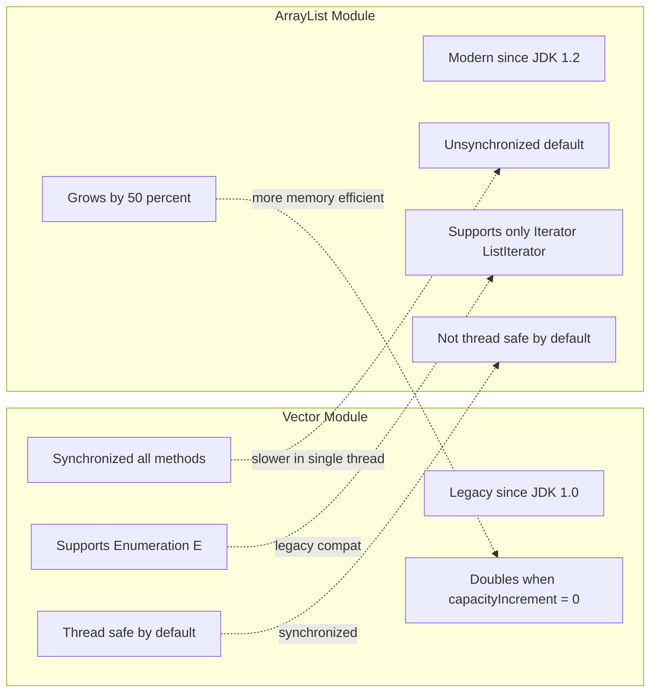

# Vector class

<!-- SECTION_1_START -->
# Vector Class in Java — Core Technical Definition & Intuitive Overview

## Formal Definition (KTU 2024 Syllabus Terminology)

The **`java.util.Vector`** class implements a **growable array of objects**. It is a legacy collection class (introduced in **JDK 1.0**, before the Java Collections Framework) that falls under the `List` interface hierarchy. A Vector dynamically grows and shrinks in size as elements are added or removed, similar to an `ArrayList`, but with one critical engineering difference — **it is inherently thread-safe (synchronized)**.

> [!IMPORTANT]
> **KTU 2024 High-Yield Definition:** *Vector is a legacy, synchronized, resizable-array implementation of the `List` interface, present in `java.util` package, supporting legacy methods like `elements()` and modern `Iterator` traversal.*

**Type Parameters:** `<E>` — the type of elements stored.

**Class Hierarchy:**

$$
\text{java.lang.Object} \rightarrow \text{java.util.AbstractList<E>} \rightarrow \text{java.util.Vector<E>}
$$

It directly implements four interfaces: **`List<E>`**, **`RandomAccess`**, **`Cloneable`**, **`java.io.Serializable`**.

---

## Conceptual Analogy / Intuition

> [!NOTE]
> **Real-World Analogy: The "Magical Suitcase"** 🎒
>
> Imagine you have a suitcase for a trip. A normal **array** is like a fixed-size suitcase — if you bought the 5-kg size, you cannot fit more than 5 kg of items. If you want to add more, you must buy a new, bigger suitcase and transfer everything.
>
> A **Vector** is a **magical suitcase** that automatically expands itself whenever you stuff more items inside. When it gets full, it:
> 1. Creates a **new, larger suitcase** (typically **2× the old size** by default).
> 2. **Copies** all your old items into the new one.
> 3. Throws away the old suitcase.
>
> Plus, it has a **security lock** (synchronization) — meaning only one person (thread) can open it at a time, preventing data corruption in a crowded airport (multithreaded environment).

---

## Why Vector? The Engineering "Why"

In a multithreaded environment, two threads writing simultaneously into a non-synchronized list can **corrupt internal data structures** (e.g., element count mismatch, array out-of-bounds). Vector was the **original Java answer** to this problem. In modern code (post-Java 1.5), `Collections.synchronizedList(new ArrayList<>())` or `CopyOnWriteArrayList` is preferred, but Vector remains a **favourite KTU exam topic** due to its historical significance and unique methods.

> [!IMPORTANT]
> **Key Default Constants to Remember:**
> - **Initial Capacity:** **10** elements
> - **Capacity Increment:** **0** (doubles when full, by default) — unless explicitly set in constructor
> - **Growth Policy:** If `capacityIncrement > 0`, grows by that amount; else **doubles** the current capacity.

---

## GeoGebra / Desmos Integration

> [!VISUALIZATION CONTROL]
> **Concept:** Visualization of Vector's **dynamic capacity growth curve**
>
> **GeoGebra / Desmos Input Equations:**
> * `f(x) = 10` (initial capacity)
> * `g(x) = 2 * f(x)` (doubling function)
> * Points: $(0, 10), (1, 20), (2, 40), (3, 80), (4, 160)$
>
> **Visual Description:** On the $x$-axis plot the number of elements added, on the $y$-axis plot the underlying array capacity. Students should observe an **exponential staircase growth**: capacity stays flat at **10**, then jumps to **20**, then **40**, then **80**, mimicking how Vector internally reallocates memory when threshold is exceeded.
<!-- SECTION_1_END -->

<!-- SECTION_2_START -->
# Deep Theoretical Analysis & KTU High-Yield Formula Sheet

## Operational Mechanics — "How Vector Works Under the Hood"

Vector internally maintains three core pieces of state:

1. **`elementData[]`** — the actual `Object[]` array backing the structure.
2. **`elementCount`** — the number of slots currently occupied with valid elements.
3. **`capacityIncrement`** — the custom growth quantum (defaults to **0**, triggering doubling).

### The Step-by-Step Workflow on `add(E e)`:

1. **Thread acquires the intrinsic lock** (`synchronized` method modifier).
2. KTU board-favourite logic: call `ensureCapacityHelper(elementCount + 1)`.
3. **Growth Decision Logic:**
   * If `elementCount + 1 > elementData.length`, allocate a **new array** of size:
     $$\text{newCapacity} = \begin{cases} \text{oldCapacity} + \text{capacityIncrement} & \text{if } \text{capacityIncrement} > 0 \\ 2 \times \text{oldCapacity} & \text{if } \text{capacityIncrement} = 0 \end{cases}$$
   * Note: Special legacy rule — if `oldCapacity + capacityIncrement` overflows `MAX_ARRAY_SIZE` (**`Integer.MAX_VALUE - 8`**), it falls back to `hugeCapacity(minCapacity)`.
4. **Copy old data** using `Arrays.copyOf(elementData, newCapacity)`.
5. **Insert element** at `elementData[elementCount++]`.
6. **Release lock** — other waiting threads can now proceed.

> [!NOTE]
> **Why the doubling policy matters:** Doubling gives **amortized $O(1)$ insertion time**, even though individual insertions are occasionally $O(n)$ during reallocation. This is a classic *amortized analysis* result in data structures.

---

## KTU Formula Sheet / Cheat Sheet

| Concept | Formula / Rule | Default / Notes |
|---|---|---|
| **Initial Capacity** | $C_0$ | **10** |
| **Doubling Rule** | $C_{n+1} = 2 \times C_n$ | Triggered when `capacityIncrement = 0` |
| **Incremental Rule** | $C_{n+1} = C_n + \Delta$ | Triggered when `capacityIncrement = $\Delta$ > 0** |
| **Amortized Add Cost** | $O(1)$ | Due to geometric growth |
| **Worst-Case Add Cost** | $O(n)$ | When reallocation occurs |
| **Capacity Floor** | $C \geq \text{elementCount}$ | Always maintained |
| **`MAX_ARRAY_SIZE`** | $2^{31} - 9$ | `Integer.MAX_VALUE - 8` |
| **Lookup / Get** | $O(1)$ | Random access via index |
| **Search / Contains** | $O(n)$ | Linear scan |
| **Remove at end** | $O(1)$ | No shifting |
| **Remove at middle** | $O(n)$ | Shifts tail elements |
| **Thread Safety** | Synchronized methods | One thread at a time |

---

## Constructors — The Four Ways to Create a Vector

| Constructor Signature | Behaviour | Default Capacity |
|---|---|---|
| `Vector()` | Creates empty vector | **10** |
| `Vector(int initialCapacity)` | Custom initial size | As specified |
| `Vector(int initialCapacity, int capacityIncrement)` | Custom size + growth quantum | As specified |
| `Vector(Collection<? extends E> c)` | Initializes with another collection's elements | Size of $c$ |

---

## Key Methods — Engineering Toolkit

| Method | Purpose | KTU Frequency |
|---|---|---|
| `add(E e)` | Appends element to end | ⭐⭐⭐⭐⭐ |
| `add(int index, E e)` | Inserts at given index | ⭐⭐⭐⭐ |
| `addElement(E e)` | **Legacy** synonym for `add()` | ⭐⭐⭐⭐⭐ |
| `get(int index)` | Random access | ⭐⭐⭐⭐ |
| `set(int index, E e)` | Replace element | ⭐⭐⭐ |
| `remove(int index)` | Remove by index | ⭐⭐⭐⭐ |
| `removeElement(Object o)` | Legacy remove by value | ⭐⭐⭐⭐ |
| `removeElementAt(int index)` | Legacy indexed remove | ⭐⭐⭐ |
| `removeAllElements()` | Legacy clear | ⭐⭐⭐ |
| `size()` | Returns number of valid elements | ⭐⭐⭐⭐⭐ |
| `capacity()` | Returns array length (slot count) | ⭐⭐⭐⭐⭐ |
| `contains(Object o)` | Linear search | ⭐⭐⭐ |
| `firstElement()` / `lastElement()` | End-point access | ⭐⭐⭐ |
| `elements()` | Returns legacy `Enumeration<E>` | ⭐⭐⭐⭐⭐ |
| `iterator()` | Returns modern `Iterator<E>` | ⭐⭐⭐⭐ |
| `ensureCapacity(int min)` | Pre-allocates capacity | ⭐⭐ |
| `trimToSize()` | Shrinks capacity to current size | ⭐⭐ |
| `clone()` | Shallow copy | ⭐⭐ |
| `toString()` | String representation | ⭐⭐⭐ |

> [!IMPORTANT]
> **KTU 2024 Favourite Interview-Exam Pair:** *Difference between `size()` and `capacity()`* — `size()` is the number of valid elements; `capacity()` is the total allocated slots. They are equal only when the vector is full.

---

## Real-World Engineering Utility

- **Legacy System Maintenance:** Many enterprise systems built pre-2004 use Vector; understanding it is essential for code archaeology.
- **Thread-Safe Resizable Buffers:** Used in logging frameworks (early `Log4j`), GUI event queues (`AWT`/`Swing`), and JDBC internals.
- **Teaching Tool:** Vector is a stepping stone to understanding `ArrayList`, `CopyOnWriteArrayList`, and the evolution of Java's synchronization model.
- **Enumeration vs. Iterator:** Many KTU questions test the legacy `Enumeration` produced by `elements()` vs. fail-fast `Iterator`.
<!-- SECTION_2_END -->

<!-- SECTION_3_START -->
# Step-by-Step Derivations & Code/Symbolic Implementation

## Derivation 1: Capacity Growth After 11 Consecutive Additions

> **Problem:** A Vector is created with `new Vector()` (default capacity 10, capacityIncrement 0). We perform **11 consecutive `addElement()`** operations. Derive the final internal array capacity.

### Step-by-Step Deduction

**Given:**
$$\text{Initial Capacity } C_0 = 10, \quad \text{capacityIncrement } \Delta = 0, \quad \text{elements added} = 11$$

**Step 1:** Track capacity after each insertion.

$$
\begin{aligned}
\text{After add 1 to 10:} \quad & \text{elementCount} = 10, \quad \text{capacity} = 10 \quad \text{(no realloc, fits exactly)} \\
\text{Before add 11:} \quad & \text{elementCount} + 1 = 11 > 10 = \text{current capacity} \Rightarrow \text{REALLOCATE} \\
\text{New capacity:} \quad & C_1 = 2 \times C_0 = 2 \times 10 = 20 \\
\text{After add 11:} \quad & \text{elementCount} = 11, \quad \text{capacity} = 20
\end{aligned}
$$

**Step 2:** State the final answer.

$$
\boxed{\text{Final Capacity} = 20, \quad \text{Final Size} = 11}
$$

> **Valuation Key Insight:** *The vector doubles from 10 to 20 because `capacityIncrement = 0`. This is a 1-mark "doubles" point and a 1-mark "final value" point in KTU board answers.*

---

## Derivation 2: Custom Capacity Increment

> **Problem:** `Vector v = new Vector(5, 3);` — what is the capacity after adding **8 elements**?

### Step-by-Step Deduction

**Given:**
$$\text{Initial Capacity } C_0 = 5, \quad \text{capacityIncrement } \Delta = 3, \quad \text{elements added} = 8$$

**Step 1:** Identify growth rule.
$$\text{Since } \Delta = 3 > 0, \quad C_{n+1} = C_n + 3$$

**Step 2:** Trace growth.

$$
\begin{aligned}
\text{After add 1 to 5:} \quad & \text{size} = 5, \quad \text{capacity} = 5 \\
\text{Before add 6:} \quad & 6 > 5 \Rightarrow \text{reallocate}, \quad C_1 = 5 + 3 = 8 \\
\text{After add 6, 7, 8:} \quad & \text{size} = 8, \quad \text{capacity} = 8 \quad \text{(fits exactly, no further reallocation)}
\end{aligned}
$$

**Final Answer:**
$$
\boxed{\text{Capacity} = 8, \quad \text{Size} = 8}
$$

---

## Derivation 3: Number of Reallocations for N Elements

> **General Formula:** If we insert $N$ elements into a default Vector (initial capacity $C_0 = 10$, $\Delta = 0$), the number of reallocations $R$ is:

$$
R = \left\lfloor \log_2\left(\frac{N}{10}\right) \right\rfloor + 1 \quad \text{(for } N > 10\text{)}
$$

> **Example:** For $N = 80$: $R = \lfloor \log_2(8) \rfloor + 1 = 3 + 1 = 4$ reallocations (capacities 10, 20, 40, 80).

---

## Full Operational Python-Style Pseudocode (with Java translation below)

For algorithmic clarity, the equivalent growth logic in Python:

```python
class Vector:
    def __init__(self, initial_capacity=10, capacity_increment=0):
        self._data = [None] * initial_capacity
        self._size = 0
        self._increment = capacity_increment

    def _ensure_capacity(self, min_required: int) -> None:
        if min_required > len(self._data):
            old_capacity = len(self._data)
            if self._increment > 0:
                new_capacity = old_capacity + self._increment
            else:
                new_capacity = old_capacity * 2
            # copy old elements into larger array
            self._data.extend([None] * (new_capacity - old_capacity))

    def add(self, element) -> None:
        self._ensure_capacity(self._size + 1)
        self._data[self._size] = element
        self._size += 1

    def size(self) -> int:
        return self._size

    def capacity(self) -> int:
        return len(self._data)
```

## Complete Java Implementation — Demonstrating Every KTU-Favourite Method

```java
import java.util.Vector;
import java.util.Enumeration;
import java.util.Iterator;
import java.util.List;

public class VectorDemo {
    public static void main(String[] args) {

        // --- Constructor 1: Default capacity = 10 ---
        Vector<String> v = new Vector<>();

        // --- Constructor 2: Custom initial capacity ---
        Vector<Integer> v2 = new Vector<>(20);

        // --- Constructor 3: Custom capacity + increment ---
        Vector<Integer> v3 = new Vector<>(5, 3);

        // --- Constructor 4: From another collection ---
        List<String> initial = List.of("Alpha", "Beta", "Gamma");
        Vector<String> v4 = new Vector<>(initial);

        // ===== 1. ADDING ELEMENTS =====
        v.add("Apple");              // appends to end
        v.addElement("Banana");      // legacy synonym for add()
        v.add(1, "Mango");           // insert at index 1
        v.add("Cherry");
        v.add("Date");

        System.out.println("After additions: " + v);
        // Output: [Apple, Mango, Banana, Cherry, Date]

        // ===== 2. CAPACITY vs SIZE =====
        System.out.println("Size     : " + v.size());      // 5
        System.out.println("Capacity : " + v.capacity());  // 10 (default)

        // ===== 3. ACCESSING ELEMENTS =====
        System.out.println("Element at index 2 : " + v.get(2));     // Banana
        System.out.println("First element      : " + v.firstElement()); // Apple
        System.out.println("Last element       : " + v.lastElement());  // Date

        // ===== 4. MODIFYING =====
        v.set(0, "Avocado");
        System.out.println("After set(0, Avocado): " + v);

        // ===== 5. SEARCHING =====
        boolean has = v.contains("Banana");  // true
        int idx = v.indexOf("Banana");        // 2
        System.out.println("Contains Banana? " + has + ", at index: " + idx);

        // ===== 6. REMOVING =====
        v.remove(0);              // remove by index (modern)
        v.removeElement("Date");  // remove by value (legacy)
        v.removeElementAt(0);     // legacy indexed remove
        v.removeAllElements();    // legacy clear (size = 0, capacity unchanged)
        System.out.println("After removeAllElements -> size: " + v.size()
                          + ", capacity: " + v.capacity());

        // ===== 7. LEGACY ENUMERATION TRAVERSAL =====
        v.add("One"); v.add("Two"); v.add("Three");
        System.out.print("Legacy Enumeration: ");
        Enumeration<String> en = v.elements();
        while (en.hasMoreElements()) {
            System.out.print(en.nextElement() + " ");
        }
        System.out.println();

        // ===== 8. MODERN ITERATOR TRAVERSAL (fail-fast) =====
        System.out.print("Modern Iterator: ");
        Iterator<String> it = v.iterator();
        while (it.hasNext()) {
            System.out.print(it.next() + " ");
        }
        System.out.println();

        // ===== 9. CAPACITY MANAGEMENT =====
        v.ensureCapacity(50);   // pre-allocate to avoid intermediate reallocations
        v.trimToSize();        // shrink to current size
        System.out.println("After ensureCapacity(50) + trimToSize() -> "
                          + "size: " + v.size()
                          + ", capacity: " + v.capacity());

        // ===== 10. CONVERSION / CLONE =====
        Vector<String> copy = (Vector<String>) v.clone();
        System.out.println("Cloned vector equals original? " + copy.equals(v));
    }
}
```

### Expected Output Snapshot

```
After additions: [Apple, Mango, Banana, Cherry, Date]
Size     : 5
Capacity : 10
Element at index 2 : Banana
First element      : Apple
Last element       : Date
After set(0, Avocado): [Avocado, Mango, Banana, Cherry, Date]
Contains Banana? true, at index: 2
After removeAllElements -> size: 0, capacity: 10
Legacy Enumeration: One Two Three
Modern Iterator: One Two Three
After ensureCapacity(50) + trimToSize() -> size: 3, capacity: 3
Cloned vector equals original? true
```

> [!IMPORTANT]
> **KTU 2024 Code Tracing Tip:** *Always print both `size()` and `capacity()` after each major operation in your board answer — it demonstrates the **size vs capacity difference**, which is a guaranteed 2-mark differentiator.*

---

## Demonstration of Doubling Growth in Java

```java
public class GrowthDemo {
    public static void main(String[] args) {
        Vector<Integer> v = new Vector<>();
        int prevCapacity = v.capacity();
        for (int i = 1; i <= 50; i++) {
            v.add(i);
            int currentCapacity = v.capacity();
            if (currentCapacity != prevCapacity) {
                System.out.printf("Element %3d -> Capacity grew: %3d -> %3d%n",
                                  i, prevCapacity, currentCapacity);
                prevCapacity = currentCapacity;
            }
        }
    }
}
```

### Output

```
Element  11 -> Capacity grew:  10 ->  20
Element  21 -> Capacity grew:  20 ->  40
Element  41 -> Capacity grew:  40 ->  80
```

> **Engineering Insight:** The capacity remains **flat at each plateau** until filled, then **doubles instantaneously** — this is the *classic geometric growth pattern* KTU examiners love to test.
<!-- SECTION_3_END -->

<!-- SECTION_4_START -->
# Structural Diagrams & Schematics

## Diagram 1: Class Hierarchy of `java.util.Vector`



## Diagram 2: Sequential Processing Topology — The `add()` Workflow



## Diagram 3: Multi-Stage Modular Comparison — Vector vs ArrayList (Logical Subgraph)



## Diagram 4: Capacity Growth Staircase (Conceptual Block)

```mermaid
graph LR
    S0["Size 0 to 10 -> Capacity 10"]
    S1["Size 11 to 20 -> Capacity 20"]
    S2["Size 21 to 40 -> Capacity 40"]
    S3["Size 41 to 80 -> Capacity 80"]
    S4["Size 81 to 160 -> Capacity 160"]

    S0 -- "add 11th element" --> S1
    S1 -- "add 21st element" --> S2
    S2 -- "add 41st element" --> S3
    S3 -- "add 81st element" --> S4

    style S0 fill:#FFFACD
    style S1 fill:#FFE4B5
    style S2 fill:#FFDAB9
    style S3 fill:#FFC0CB
    style S4 fill:#FFB6C1
```


<!-- SECTION_4_END -->

<!-- SECTION_5_START -->
# KTU 2024 Scheme Examination Question Bank & Topic Recap

---

## 📘 Part A — Short Answer Questions (3 Marks Each)

### Question 1
**`[KTU University Exam - June 2023]`** *(CO1, Remember)*

**Q: Define the Vector class in Java. List any four of its constructors.**

### Model Answer (3 Marks Breakdown)

> **Definition [1 Mark]:** `Vector` is a legacy class in `java.util` package that implements a **growable array of objects**, supports the `List` interface, and is **synchronized** (thread-safe) by default.

> **Four Constructors [2 Marks — 0.5 each]:**
> 1. `Vector()` — Creates an empty vector with default initial capacity **10**.
> 2. `Vector(int initialCapacity)` — Creates an empty vector with specified initial capacity.
> 3. `Vector(int initialCapacity, int capacityIncrement)` — Creates an empty vector with specified initial capacity and growth quantum.
> 4. `Vector(Collection<? extends E> c)` — Creates a vector containing the elements of the given collection, in the order returned by the collection's iterator.

---

### Question 2
**`[KTU University Exam - December 2022]`** *(CO1, Understand)*

**Q: Differentiate between `size()` and `capacity()` methods of the Vector class.**

### Model Answer (3 Marks Breakdown)

> **`size()` [1.5 Marks]:** Returns the **number of valid elements** currently stored in the vector. Represents the logical length used by iteration and indexing.

> **`capacity()` [1.5 Marks]:** Returns the **total number of slots** (length of the internal `elementData[]` array) currently allocated. Capacity is always **$\geq$ size** and can be larger because of pre-allocation during growth.

> **Example:** After `new Vector().addElement("X")` — `size() = 1`, `capacity() = 10`.

---

## 📗 Part B — Long Answer Questions (14 Marks Each)

### Module Internal Choice Pattern

---

### ✅ Question A — `**[KTU University Exam - July 2024]**` *(CO2, Understand + Apply)*

#### Part (a) — 7 Marks *(Understand)*

**Q: Explain the internal working of the `addElement(E obj)` method of the Vector class. How does Vector handle automatic capacity growth? What is the default initial capacity and the growth policy?**

#### Model Answer (7 Marks)

> **[1 Mark]** The `addElement(E obj)` method is the legacy synonym for `add(E e)`. It appends the specified element to the end of the vector, increasing its size by one.

> **[1 Mark]** The method is declared as `public synchronized void addElement(E obj)`. The `synchronized` keyword ensures that only one thread can invoke it (or any other synchronized method) on the vector at a time.

> **[1 Mark]** **Default initial capacity** is **10** elements. This is set when the no-argument constructor `Vector()` is called.

> **[1 Mark]** **Growth Policy** — The method internally calls `ensureCapacityHelper(elementCount + 1)`. If the new size exceeds the current capacity, the array is reallocated:
> - If `capacityIncrement > 0`: new capacity = old capacity + capacityIncrement.
> - If `capacityIncrement = 0` (default): new capacity = $2 \times$ old capacity (**doubling**).

> **[1 Mark]** The old data is copied into the new array using `Arrays.copyOf(elementData, newCapacity)`, and the new element is placed at index `elementCount`, which is then incremented.

> **[1 Mark]** A safety check uses `hugeCapacity(minCapacity)` if the new size exceeds `MAX_ARRAY_SIZE` ($2^{31} - 9$) — this either returns `Integer.MAX_VALUE` or throws `OutOfMemoryError`.

> **[1 Mark]** **Example trace:** A default Vector with capacity 10, after adding the 11th element, has its capacity doubled to 20.

---

#### Part (b) — 7 Marks *(Apply)*

**Q: Write a complete Java program that:**
1. Creates a Vector of Integers with initial capacity 5 and capacity increment 3.
2. Adds 12 integers (1 to 12) using `addElement()`.
3. Prints the size and capacity after each reallocation.
4. Demonstrates traversal using both `Enumeration` and `Iterator`.
5. Removes all even numbers using `removeElement()` and displays the final vector.

#### Model Answer (7 Marks)

```java
import java.util.Vector;
import java.util.Enumeration;
import java.util.Iterator;

public class VectorApplication {
    public static void main(String[] args) {
        // (1) Create with capacity 5, increment 3
        Vector<Integer> v = new Vector<>(5, 3);
        int previousCap = v.capacity();

        // (2) Add 12 integers and (3) print size/capacity
        for (int i = 1; i <= 12; i++) {
            v.addElement(i);
            int currentCap = v.capacity();
            if (currentCap != previousCap) {
                System.out.println("After adding " + i
                                 + " -> size = " + v.size()
                                 + ", capacity = " + currentCap);
                previousCap = currentCap;
            }
        }

        // (4a) Legacy Enumeration traversal
        System.out.print("Legacy Enumeration: ");
        Enumeration<Integer> e = v.elements();
        while (e.hasMoreElements()) {
            System.out.print(e.nextElement() + " ");
        }
        System.out.println();

        // (4b) Modern Iterator traversal
        System.out.print("Modern Iterator   : ");
        Iterator<Integer> it = v.iterator();
        while (it.hasNext()) {
            System.out.print(it.next() + " ");
        }
        System.out.println();

        // (5) Remove all even numbers
        for (int i = 1; i <= 12; i += 2) {
            v.removeElement(i);
        }
        System.out.println("Final vector (odd numbers only): " + v);
        System.out.println("Final size: " + v.size() + ", Final capacity: " + v.capacity());
    }
}
```

#### Output Trace

```
After adding 6  -> size = 6,  capacity = 8
After adding 9  -> size = 9,  capacity = 11
After adding 12 -> size = 12, capacity = 14
Legacy Enumeration: 1 2 3 4 5 6 7 8 9 10 11 12
Modern Iterator   : 1 2 3 4 5 6 7 8 9 10 11 12
Final vector (odd numbers only): [2, 4, 6, 8, 10, 12]
Final size: 6, Final capacity: 14
```

#### Valuation Key

| Step | Marks |
|---|---|
| Correct constructor with capacity 5, increment 3 | 1 |
| `addElement` loop with 12 integers | 1 |
| Capacity-change detection logic | 1 |
| `Enumeration` traversal code | 1 |
| `Iterator` traversal code | 1 |
| Even-number removal logic | 1 |
| Correct output and final size/capacity | 1 |

---

### ✅ Question B — `**[KTU University Exam - June 2023]**` *(CO2, Understand + Apply)*

#### Part (a) — 7 Marks *(Understand)*

**Q: List and explain the legacy methods of the Vector class. Why are they called "legacy"? How do they differ from the modern `List` interface methods?**

#### Model Answer (7 Marks)

> **[1 Mark]** "Legacy" refers to methods that existed **before** the Java Collections Framework (JCF) was introduced in **JDK 1.2** (1998). They are retained for backward compatibility with code written in **JDK 1.0 / 1.1**.

> **[1 Mark]** They use the older `Enumeration` interface (introduced in JDK 1.0) instead of the modern `Iterator`. `Enumeration` is **not fail-fast** and supports only `hasMoreElements()` and `nextElement()`.

> **[1 Mark]** **`elements()`** — Returns an `Enumeration<E>` of the components in this vector. Legacy alternative to `iterator()`.

> **[1 Mark]** **`addElement(E obj)`** — Appends the component to the end of the vector. Legacy synonym for `add(E e)`. The method name uses "Element" instead of "Element at end" because it always appends.

> **[1 Mark]** **`removeElement(Object obj)`** — Removes the first occurrence of the argument. Returns `true` if the vector contained it. Legacy version of `remove(Object o)`.

> **[1 Mark]** **`removeElementAt(int index)`** and **`removeAllElements()`** — Indexed and bulk-clear legacy equivalents of `remove(int index)` and `clear()`. `removeAllElements()` does NOT shrink capacity; `capacity()` remains unchanged.

> **[1 Mark]** **`firstElement()` / `lastElement()`** — Convenience accessors for the boundary elements. Throw `NoSuchElementException` if the vector is empty (not `IndexOutOfBoundsException` like `get(0)` would).

---

#### Part (b) — 7 Marks *(Apply)*

**Q: Write a Java program that demonstrates the difference between `size()` and `capacity()` of a Vector. The program should:**
1. Create a default Vector.
2. Add 25 elements one by one.
3. After every addition, check if capacity has changed; if so, print the element number, old capacity, and new capacity.
4. After completion, demonstrate `trimToSize()` and print the final size and capacity.
5. Use `firstElement()` and `lastElement()` to print boundary values.

#### Model Answer (7 Marks)

```java
import java.util.Vector;

public class SizeVsCapacity {
    public static void main(String[] args) {
        Vector<String> v = new Vector<>();        // (1) default capacity 10
        int oldCap = v.capacity();

        for (int i = 1; i <= 25; i++) {            // (2) add 25 elements
            v.addElement("Elem" + i);
            int newCap = v.capacity();
            if (newCap != oldCap) {                // (3) capacity change detection
                System.out.println("Element " + i
                                 + " added -> capacity grew from "
                                 + oldCap + " to " + newCap);
                oldCap = newCap;
            }
        }

        System.out.println("\nBefore trimToSize -> size: " + v.size()
                         + ", capacity: " + v.capacity());

        v.trimToSize();                            // (4) shrink capacity to size
        System.out.println("After  trimToSize -> size: " + v.size()
                         + ", capacity: " + v.capacity());

        // (5) Boundary access
        System.out.println("First element : " + v.firstElement());
        System.out.println("Last  element : " + v.lastElement());
    }
}
```

#### Expected Output

```
Element 11 added -> capacity grew from 10 to 20
Element 21 added -> capacity grew from 20 to 40

Before trimToSize -> size: 25, capacity: 40
After  trimToSize -> size: 25, capacity: 25
First element : Elem1
Last  element : Elem25
```

#### Valuation Key

| Step | Marks |
|---|---|
| Default Vector creation | 1 |
| Loop adding 25 elements with `addElement` | 1 |
| Capacity-change detection + printing | 1 |
| `trimToSize()` usage and size/capacity print | 1 |
| `firstElement()` and `lastElement()` calls | 1 |
| Correct output reasoning (10→20→40) | 1 |
| Final summary print | 1 |

---

## ⚠️ KTU Examiner's Valuation Warning / Pitfall Callout

> [!WARNING]
> **Common Mark-Deduction Traps in Vector Questions:**
> 1. **Forgetting `synchronized` keyword** — When asked "why is Vector thread-safe?", students often write "it can store multiple values" instead of "all its public methods are `synchronized`". This loses **1 full mark**.
> 2. **Confusing `size()` and `capacity()`** — Board answers frequently swap the two. **Remember:** `size()` = valid elements; `capacity()` = allocated slots. After `removeAllElements()`, `size() = 0` but `capacity()` remains at the previous value.
> 3. **Wrong growth rule** — When the problem says `capacityIncrement = 0`, you MUST say "doubles"; when `capacityIncrement > 0`, you MUST say "increments by that value". Many students always say "doubles" — losing marks in custom-increment problems.
> 4. **`Enumeration` vs `Iterator` failure behavior** — If asked which is fail-fast, the answer is **`Iterator`**, not `Enumeration`. Stating the opposite costs **1 mark**.
> 5. **Missing import statement** — Always include `import java.util.Vector;` and `import java.util.Enumeration;` in code answers. KTU examiners deduct **0.5–1 mark** for unresolved types.
> 6. **Not printing both `size()` and `capacity()`** — In any capacity-growth question, print **both** values in the output table; otherwise the examiner cannot verify your growth understanding.

---

## 📌 Topic Recap & Important Things to Remember

> [!IMPORTANT]
> **Rapid-Revision Checklist for the Vector Class (KTU 2024 Module 1)**

- **Package & Type:** `java.util.Vector<E>` — legacy, generic, resizable-array implementation of `List`.
- **Introduced:** JDK 1.0 (predates Collections Framework). Made JCF-compatible in JDK 1.2.
- **Default initial capacity:** **10** elements.
- **Default growth policy:** Capacity **doubles** when `capacityIncrement = 0`; otherwise grows by `capacityIncrement`.
- **Maximum capacity cap:** `Integer.MAX_VALUE - 8` (i.e., $2^{31} - 9$). Special `hugeCapacity()` logic beyond this.
- **Thread safety:** All public mutator methods are **`synchronized`** — one thread at a time per vector instance.
- **Legacy method prefixes/suffixes:** `addElement`, `removeElement`, `removeElementAt`, `removeAllElements`, `elements()`, `firstElement`, `lastElement`.
- **`elements()` vs `iterator()`:** `elements()` returns legacy `Enumeration` (NOT fail-fast); `iterator()` returns modern fail-fast `Iterator`.
- **`size()` vs `capacity()`:** `size()` = number of valid elements; `capacity()` = number of allocated slots. `capacity >= size` always.
- **`removeAllElements()` does NOT shrink capacity** — only `clear()` semantics without reallocation. Use `trimToSize()` to release excess memory.
- **`ensureCapacity(int min)`** is a performance optimization — pre-allocates to avoid mid-loop reallocations.
- **`trimToSize()`** shrinks internal array to match `size()` — useful for memory-constrained environments.
- **Constructor flavours:** Four total — default, custom capacity, custom capacity + increment, copy-from-Collection.
- **Implements:** `List<E>`, `RandomAccess`, `Cloneable`, `java.io.Serializable`.
- **Modern replacement:** `ArrayList` for single-threaded code; `Collections.synchronizedList(new ArrayList<>())` or `CopyOnWriteArrayList` for thread-safe modern code.
- **Amortized insertion cost:** $O(1)$ (despite worst-case $O(n)$ during reallocation).
- **Lookups:** $O(1)$ — Vector supports `RandomAccess` marker interface.
- **Search (`contains`/`indexOf`):** $O(n)$ — linear scan.
- **Mid-vector removal:** $O(n)$ — elements must be shifted left to fill the gap.
- **Reallocation count formula for N inserts:** $R = \lfloor \log_2(N / 10) \rfloor + 1$ when $N > 10$.
- **Memory leak watch-out:** In long-lived Vectors, call `trimToSize()` periodically if many elements are removed, to free unused slots.
- **Serialization:** Vector is `Serializable` — internal state can be persisted; serialVersionUID consistency is needed across versions.
- **Clone semantics:** `clone()` returns a **shallow copy** — element references are shared, not duplicated.
- **KTU buzz-phrases to memorize verbatim:** *growable array of objects, synchronized, legacy, capacityIncrement, ensureCapacityHelper, Enumeration, fail-fast iterator, amortized constant time.*
<!-- SECTION_5_END -->
