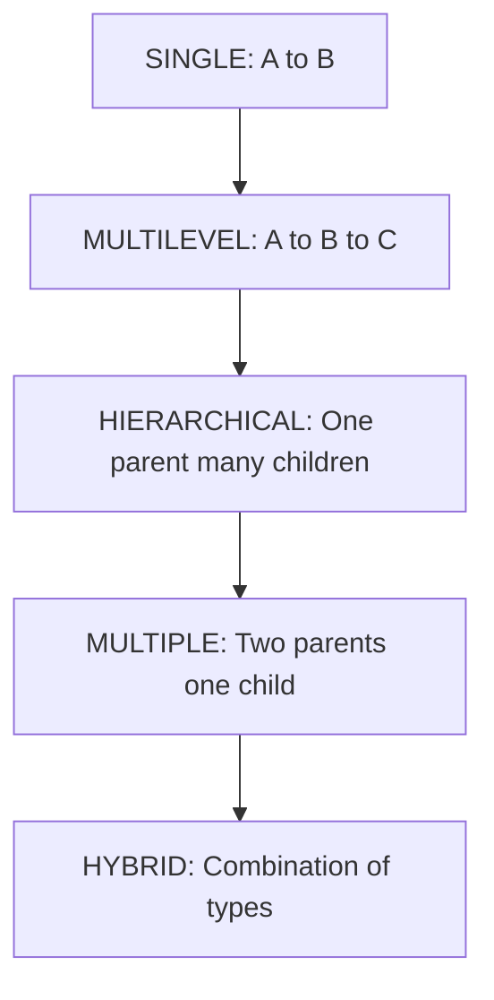
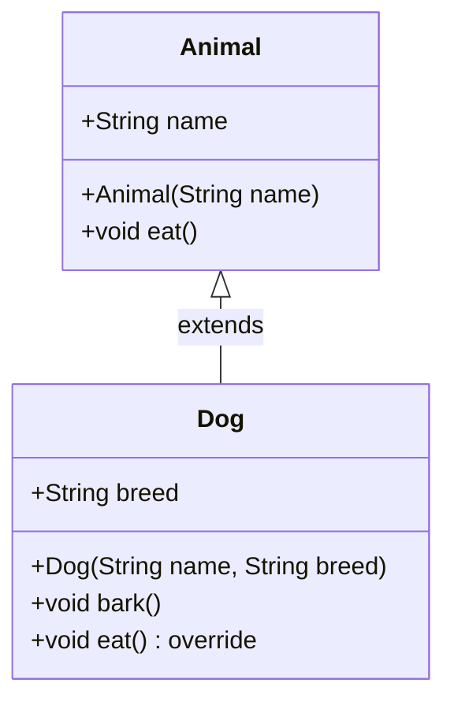
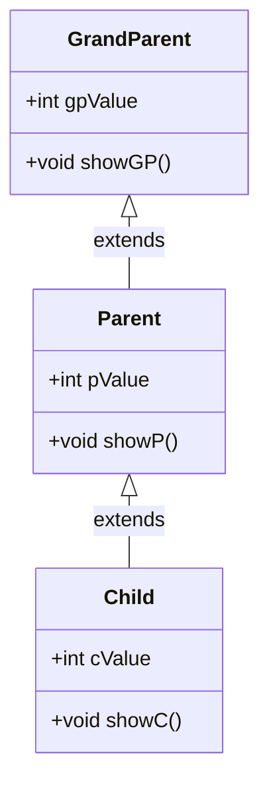
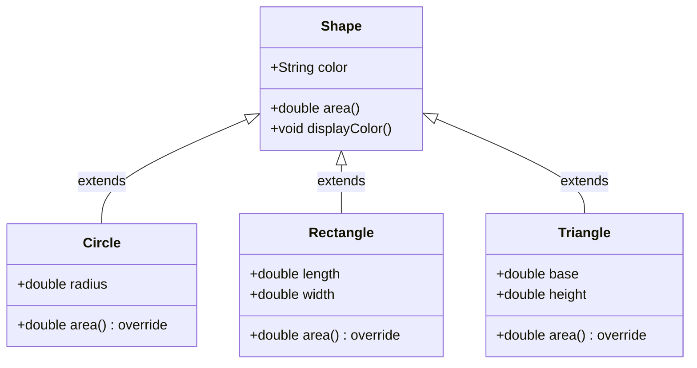
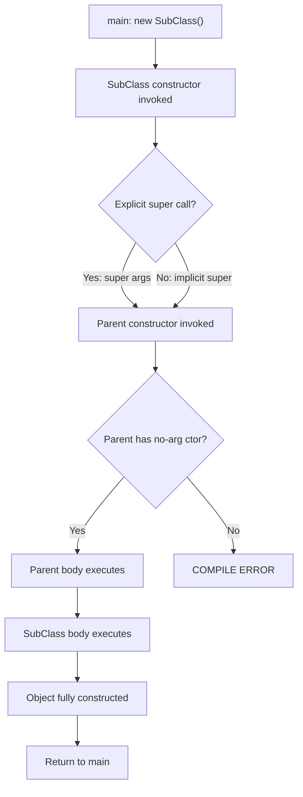
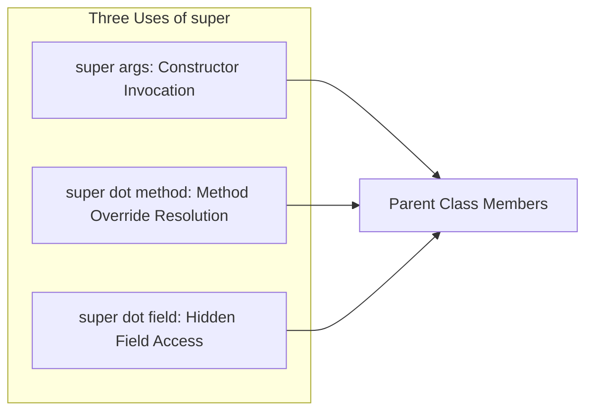
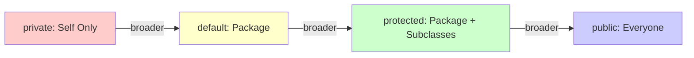
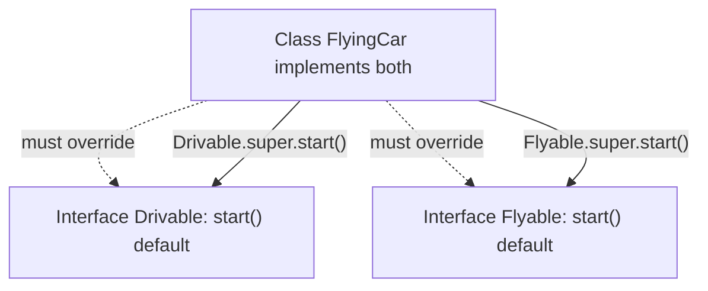
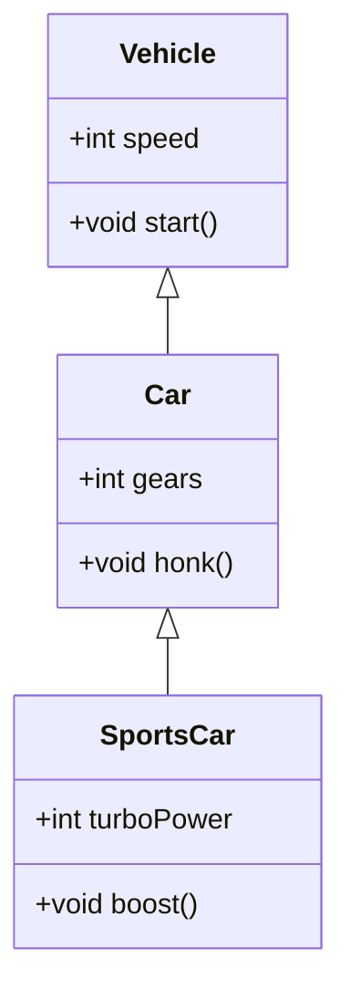

# Inheritance: Super Class, Sub Class, Types of Inheritance, The 'super' keyword, protected Members, Calling Order of Constructors

<!-- SECTION_1_START -->
# 1. Core Technical Definition & Intuitive Overview

## 1.1 Formal Definition (KTU 2024 Syllabus Terminology)

**Inheritance** is a fundamental Object-Oriented Programming (OOP) mechanism in Java that allows a new class (called the **Sub Class**, **Derived Class**, or **Child Class**) to be defined in terms of an existing class (called the **Super Class**, **Base Class**, or **Parent Class**). The subclass inherits — i.e., acquires automatically — the visible **fields** (attributes) and **methods** (behaviors) of its superclass, and may additionally define its own specialized members.

Formally, for classes $C_{parent}$ and $C_{child}$:

$$C_{child} \;\xrightarrow{\text{extends}}\; C_{parent}$$

The relationship established is an **"is-a"** (ISA) relationship, which is the cornerstone of inheritance in the Liskov Substitution Principle and the OOP inheritance hierarchy.

> [!IMPORTANT]
> **KTU 2024 Board Definition (memorize verbatim):**
> *"Inheritance is the process by which one object acquires the properties of another object. It supports the concept of hierarchical classification and provides code reusability, extensibility, and polymorphism."*

---

## 1.2 Conceptual Analogy / Real-World Intuition

Think of inheritance like a **family genealogy** or a **biological inheritance** chart:

| Real-World Concept | OOP Equivalent |
|---|---|
| Parents passing genes/traits to children | Superclass passing members to subclass |
| Child inherits *eye color* but has *own name* | Subclass inherits `color` field, defines its own `name` |
| A "Sedan **is-a** Car" | Sedan extends Car (ISA relationship) |
| A "Car **is-a** Vehicle" | Multi-level inheritance (Car extends Vehicle) |
| Children of same parents share traits | Hierarchical inheritance (multiple subclasses from one superclass) |
| Child inherits from **both** father and mother | **Multiple inheritance** (NOT allowed in Java for classes) |

> [!NOTE]
> **Key Insight:** A subclass is a *specialized* version of its superclass. It contains all features of the parent **PLUS** its own unique features. For example, a `Car` is a specialized `Vehicle` — it has all vehicle features (wheels, engine) **plus** car-specific features (airbags, sunroof).

---

## 1.3 The `extends` Keyword (Java Syntax)

In Java, inheritance is implemented using the **`extends`** keyword:

```java
class SuperClass {
    // parent members
}

class SubClass extends SuperClass {
    // inherits + adds new members
}
```

> [!NOTE]
> **KTU Critical Point:** Java uses **single inheritance** for classes only — a class can extend **only ONE** direct parent. Multiple inheritance is achieved through **interfaces**, not classes.

---

## 1.4 The `protected` Access Modifier (Geometric View)

The `protected` modifier sits **between** `private` and `public` in the access spectrum. Think of it as a **"family-only"** access level:

| Modifier | Same Class | Same Package | Subclass (Different Package) | Other Classes |
|---|---|---|---|---|
| `private` | ✅ | ❌ | ❌ | ❌ |
| **(default)** | ✅ | ✅ | ❌ | ❌ |
| **`protected`** | ✅ | ✅ | ✅ | ❌ |
| `public` | ✅ | ✅ | ✅ | ✅ |

> [!IMPORTANT]
> **`protected` rule of thumb:** Accessible to the class itself, its package-mates, and its descendants (subclasses) — even if the subclasses live in a different package. This is the **only** way for a subclass in another package to access inherited members.

---

## 1.5 The `super` Keyword — Three Powerful Uses

The keyword `super` is a reference variable that always points to the **immediate parent class object**. It has exactly three uses in Java:

1. **`super()`** → calls the parent class **constructor**
2. **`super.methodName()`** → calls the parent class **method** (used in overriding)
3. **`super.variableName`** → accesses the parent class **hidden field** (when subclass shadows a parent variable)

> [!VISUALIZATION CONTROL]
> **Concept:** Memory layout of parent-child class references
> **Conceptual Model:** Imagine a `Parent` object sitting *above* a `Child` object in memory, where the Child holds an implicit `super` pointer that always points "upward" toward the Parent's members.
> **Visual Description:** Draw two stacked rectangles. Label the lower one "Child object" and the upper one "Parent object". Draw a dashed arrow from inside the Child labeled `super` pointing up into the Parent block. This arrow is *implicit* and never null (as long as inheritance exists).

<!-- SECTION_1_END -->

<!-- SECTION_2_START -->
# 2. Deep Theoretical Analysis & KTU High-Yield Formula Sheet

## 2.1 The Five Types of Inheritance (Hierarchical Taxonomy)

### Type 1 — Single Inheritance
A subclass inherits from exactly one superclass.

$$A \rightarrow B \qquad \text{(One parent, one child)}$$

### Type 2 — Multilevel Inheritance
A chain of inheritance: Grandparent → Parent → Child.

$$A \rightarrow B \rightarrow C$$

Each class is simultaneously a child of the class above it and a parent of the class below it.

### Type 3 — Hierarchical Inheritance
One superclass serves as the parent of **multiple** subclasses.

$$B \leftarrow A \rightarrow C \qquad \text{(Tree/fan-out structure)}$$

### Type 4 — Multiple Inheritance
A subclass inherits from **two or more** superclasses directly.

$$A,\; B \rightarrow C$$

> [!WARNING]
> **JAVA RESTRICTION:** Java **does NOT support multiple inheritance with classes** to avoid the **"Diamond Problem"** (ambiguity when both parents define the same method). Multiple inheritance is permitted only via **interfaces** (using `implements`).

### Type 5 — Hybrid Inheritance
A combination of two or more of the above types (e.g., hierarchical + multilevel). In Java, hybrid inheritance is achieved through a **mix of class inheritance and interface implementation**.

---

## 2.2 Why `super` Is Needed (The "Why" Behind Each Use)

| Use Case | Problem Solved | Syntax |
|---|---|---|
| `super()` | Parent has no default constructor / needs specific initialization | `super(args);` must be **first line** |
| `super.method()` | Subclass has overridden a parent method but needs the original behavior | `super.display();` |
| `super.field` | Subclass field shadows (hides) a parent field with the same name | `super.name = value;` |

> [!NOTE]
> **Critical Rule:** A constructor can use **either** `super(...)` **or** `this(...)` as its first statement — **never both**. If neither is written, the compiler silently inserts `super();` (the no-argument parent constructor).

---

## 2.3 Constructor Calling Order (Top-Down Execution Chain)

When a subclass object is instantiated (`new SubClass(...)`), the following sequence occurs:

$$\text{Parent static init} \;\rightarrow\; \text{Parent instance init} \;\rightarrow\; \text{Parent constructor} \;\rightarrow\; \text{Child instance init} \;\rightarrow\; \text{Child constructor}$$

**Three Iron Rules:**

1. **Static initialization happens once**, in order from the topmost ancestor down to the subclass (only on first use of the class).
2. **Instance initialization + constructor execution** flows **top-down**: grandparent's constructor runs *first*, then parent's, then child's.
3. The first statement of every constructor is either an explicit `super(args)` call OR an implicit `super()` (default parent no-arg constructor).

> [!IMPORTANT]
> **KTU Favorite Question Pattern:** "What is the output of the following code with multiple inheritance levels and overloaded constructors?" — Master the order: **root → intermediate → leaf**.

---

## 2.4 KTU High-Yield Formula Sheet / Cheat Sheet

| # | Concept | Syntax / Rule | Important Constraint |
|---|---|---|---|
| 1 | Single Inheritance | `class B extends A` | Java allows ✅ |
| 2 | Multilevel Inheritance | `class C extends B` where `B extends A` | Java allows ✅ |
| 3 | Hierarchical Inheritance | `class B extends A` and `class C extends A` | Java allows ✅ |
| 4 | Multiple Inheritance (classes) | `class C extends A, B` | **NOT allowed** in Java ❌ |
| 5 | Hybrid Inheritance | Mix of above + interfaces | Allowed via interfaces ✅ |
| 6 | `super()` (constructor call) | First line of subclass constructor | Cannot coexist with `this()` |
| 7 | `super.x` (field access) | `super.fieldName` | Accesses **hidden** parent field |
| 8 | `super.method()` (method call) | `super.methodName(args)` | Used in overridden methods |
| 9 | `protected` access | Visible to subclass + same package | Different package = via inheritance only |
| 10 | Constructor order | Parent first, then child | Always top-down chain |
| 11 | Implicit `super()` | Auto-inserted if no explicit call | Only works if parent has no-arg ctor |
| 12 | Inheritance access check | Private members are **NOT** inherited (only hidden) | Subclass cannot access parent's `private` directly |

---

## 2.5 Real-World Engineering Utility

Inheritance is the backbone of **every production Java framework**:

- **Spring Framework:** `RestController` extends `Controller` extends `Component` — every annotation-driven bean relies on multi-level inheritance.
- **Java Collections:** `ArrayList` extends `AbstractList` extends `AbstractCollection` implements `List` (hybrid inheritance via interfaces).
- **GUI (Swing/JavaFX):** `JButton` extends `AbstractButton` extends `JComponent` extends `Container` extends `Component` — 5-level deep hierarchy.
- **JDBC:** `DriverManager` connects to `Driver` interface implementations like `MySqlDriver`, `OracleDriver` — hierarchical interface design.

> Inheritance is **not** just an academic concept — it underpins polymorphism, the "open/closed principle", and almost every design pattern (Template Method, Strategy, Factory).

<!-- SECTION_2_END -->

<!-- SECTION_3_START -->
# 3. Step-by-Step Derivations, Constructor Order Proofs & Code Implementation

## 3.1 Type 1 — Single Inheritance (Complete Working Java Code)

```java
// File: SingleInheritanceDemo.java
package ktu.oop.module2;

// Parent class (Superclass)
class Animal {
    String name;
    
    // Parent constructor
    Animal(String name) {
        this.name = name;
        System.out.println("[Animal] Constructor called for: " + name);
    }
    
    void eat() {
        System.out.println(name + " is eating...");
    }
}

// Child class (Subclass) - inherits from Animal
class Dog extends Animal {
    String breed;
    
    // Child constructor explicitly calls parent constructor
    Dog(String name, String breed) {
        super(name);  // MUST be first line - calls Animal(String)
        this.breed = breed;
        System.out.println("[Dog] Constructor called for breed: " + breed);
    }
    
    // New method specific to Dog
    void bark() {
        System.out.println(name + " is barking: Woof!");
    }
    
    // Overriding parent method
    @Override
    void eat() {
        super.eat();  // Calls parent's eat() first
        System.out.println(name + " (Dog) is eating pedigree.");
    }
}

// Driver class
public class SingleInheritanceDemo {
    public static void main(String[] args) {
        System.out.println("--- Creating Dog object ---");
        Dog d = new Dog("Bruno", "Labrador");
        
        System.out.println("\n--- Method calls ---");
        d.eat();   // Calls overridden method
        d.bark();  // Calls Dog-specific method
        
        System.out.println("\n--- Inherited field access ---");
        System.out.println("Name: " + d.name + ", Breed: " + d.breed);
    }
}
```

**Expected Output:**
```
--- Creating Dog object ---
[Animal] Constructor called for: Bruno
[Dog] Constructor called for breed: Labrador

--- Method calls ---
Bruno is eating...
Bruno (Dog) is eating pedigree.
Bruno is barking: Woof!

--- Inherited field access ---
Name: Bruno, Breed: Labrador
```

**Step-by-step evaluation (constructor order proof):**

| Step | Action | State |
|---|---|---|
| 1 | `new Dog("Bruno", "Labrador")` invoked | Heap memory allocated for Dog object |
| 2 | `super(name)` → calls `Animal(String)` | **Animal constructor runs first** |
| 3 | `this.name = name` executes inside Animal | `name = "Bruno"` |
| 4 | Control returns to `Dog` constructor | `super()` call completed |
| 5 | `this.breed = breed` executes | `breed = "Labrador"` |
| 6 | Dog object fully constructed | Returned to `main()` |

---

## 3.2 Type 2 — Multilevel Inheritance (3-Level Chain)

```java
// File: MultilevelInheritanceDemo.java
package ktu.oop.module2;

class GrandParent {
    int gpValue = 100;
    
    GrandParent() {
        System.out.println("[1] GrandParent no-arg constructor");
    }
    
    void showGP() {
        System.out.println("GrandParent value: " + gpValue);
    }
}

class Parent extends GrandParent {
    int pValue = 200;
    
    Parent() {
        // super() is implicitly inserted here
        System.out.println("[2] Parent no-arg constructor");
    }
    
    void showP() {
        System.out.println("Parent value: " + pValue);
    }
}

class Child extends Parent {
    int cValue = 300;
    
    Child() {
        // super() is implicitly inserted here
        System.out.println("[3] Child no-arg constructor");
    }
    
    void showC() {
        System.out.println("Child value: " + cValue);
    }
}

public class MultilevelInheritanceDemo {
    public static void main(String[] args) {
        System.out.println("=== Instantiating Child ===");
        Child c = new Child();
        
        System.out.println("\n=== Accessing inherited members ===");
        c.showGP();  // Inherited from GrandParent
        c.showP();   // Inherited from Parent
        c.showC();   // Own method
    }
}
```

**Expected Output:**
```
=== Instantiating Child ===
[1] GrandParent no-arg constructor
[2] Parent no-arg constructor
[3] Child no-arg constructor

=== Accessing inherited members ===
GrandParent value: 100
Parent value: 200
Child value: 300
```

**Constructor chain derivation (mathematical notation):**

$$\text{Object}(Child) \;\Rightarrow\; Child.ctor() \;\xrightarrow{implicit\; super()}\; Parent.ctor() \;\xrightarrow{implicit\; super()}\; GrandParent.ctor() \;\xrightarrow{implicit\; super()}\; Object.ctor()$$

The call stack **unwinds** in the same order: GrandParent → Parent → Child completes.

---

## 3.3 Type 3 — Hierarchical Inheritance (One Parent, Many Children)

```java
// File: HierarchicalInheritanceDemo.java
package ktu.oop.module2;

class Shape {
    String color;
    
    Shape(String color) {
        this.color = color;
        System.out.println("[Shape] Created with color: " + color);
    }
    
    double area() {
        return 0.0;  // Base implementation
    }
    
    void displayColor() {
        System.out.println("Color: " + color);
    }
}

class Circle extends Shape {
    double radius;
    
    Circle(String color, double radius) {
        super(color);
        this.radius = radius;
    }
    
    @Override
    double area() {
        return Math.PI * radius * radius;  // πr²
    }
}

class Rectangle extends Shape {
    double length, width;
    
    Rectangle(String color, double length, double width) {
        super(color);
        this.length = length;
        this.width = width;
    }
    
    @Override
    double area() {
        return length * width;  // l × w
    }
}

public class HierarchicalInheritanceDemo {
    public static void main(String[] args) {
        Circle circle = new Circle("Red", 5.0);
        Rectangle rect = new Rectangle("Blue", 4.0, 6.0);
        
        System.out.println("\n--- Circle ---");
        circle.displayColor();
        System.out.printf("Area: %.2f%n", circle.area());
        
        System.out.println("\n--- Rectangle ---");
        rect.displayColor();
        System.out.printf("Area: %.2f%n", rect.area());
    }
}
```

**Step-by-step derivation for `circle.area()`:**

$$\text{area}_{circle} = \pi \times r^2 = \pi \times 5.0^2 = 25\pi \approx 78.54$$

**Step-by-step derivation for `rect.area()`:**

$$\text{area}_{rect} = l \times w = 4.0 \times 6.0 = 24.00$$

---

## 3.4 Type 4 — Multiple Inheritance Attempt (Diamond Problem) and Java's Interface Solution

```java
// File: MultipleInheritanceDemo.java
package ktu.oop.module2;

// Java does NOT allow this:
// class C extends A, B { }   // ❌ COMPILE ERROR

// Workaround using interfaces
interface Drivable {
    default void start() {
        System.out.println("Drivable: Starting engine");
    }
}

interface Flyable {
    default void start() {
        System.out.println("Flyable: Spinning propellers");
    }
}

// HybridCar implements BOTH - must override start() to resolve ambiguity
class FlyingCar implements Drivable, Flyable {
    @Override
    public void start() {
        System.out.println("FlyingCar: Resolving diamond ambiguity...");
        Drivable.super.start();  // Explicitly choose one
        Flyable.super.start();
    }
}

public class MultipleInheritanceDemo {
    public static void main(String[] args) {
        FlyingCar fc = new FlyingCar();
        fc.start();
    }
}
```

> [!IMPORTANT]
> **KTU 2024 Board Insight:** Even with `default` methods in interfaces, the **Diamond Problem** can still occur. Java forces the implementing class to **explicitly override** the ambiguous method and use `InterfaceName.super.method()` to disambiguate. This is the modern Java 8+ solution to multiple inheritance.

---

## 3.5 The `protected` Modifier — Cross-Package Subclass Access

```java
// File 1: ktu/oop/module2/base/Person.java
package ktu.oop.module2.base;

public class Person {
    protected String name;       // protected field
    private int ssn;             // NOT inherited (private)
    
    public Person(String name) {
        this.name = name;
    }
    
    protected void displayName() {
        System.out.println("Person name: " + name);
    }
}
```

```java
// File 2: ktu/oop/module2/derived/Employee.java
package ktu.oop.module2.derived;

import ktu.oop.module2.base.Person;

public class Employee extends Person {
    private double salary;
    
    public Employee(String name, double salary) {
        super(name);  // Calls parent constructor
        this.salary = salary;
    }
    
    public void showDetails() {
        // Can access protected members across packages via inheritance
        System.out.println("Name: " + name);              // ✅ protected access
        displayName();                                    // ✅ protected method
        // System.out.println(ssn);  // ❌ COMPILE ERROR - private not inherited
    }
}
```

**Derivation table — what is/isn't accessible:**

| Member | Same Class | Same Package | Subclass (Diff Pkg) | Other Classes |
|---|---|---|---|---|
| `public` name | ✅ | ✅ | ✅ (via inheritance) | ✅ |
| `protected` name | ✅ | ✅ | ✅ (via inheritance) | ❌ |
| `private` ssn | ✅ | ❌ | ❌ | ❌ |

---

## 3.6 Constructor Order Proof — Multi-Level with `super()` Calls

```java
// File: ConstructorOrderProof.java
package ktu.oop.module2;

class A {
    A() {
        System.out.println("A's constructor");
    }
}

class B extends A {
    B() {
        System.out.println("B's constructor (before super would have been A)");
    }
}

class C extends B {
    C() {
        System.out.println("C's constructor");
    }
}

class D extends C {
    D() {
        System.out.println("D's constructor");
    }
}

public class ConstructorOrderProof {
    public static void main(String[] args) {
        D obj = new D();
    }
}
```

**Output (Constructor call chain visualized):**
```
A's constructor
B's constructor (before super would have been A)
C's constructor
D's constructor
```

**Stack-trace derivation during `new D()`:**

$$\begin{aligned}
\text{Stack Push: } & D.ctor() \\
& \text{executes: } System.out.println(\text{"D's constructor"}) \\
\text{Stack Pop: } & \text{return to main()}
\end{aligned}$$

But before `D.ctor()` body runs, the JVM inserts `super()` → which calls `C.ctor()` → which inserts `super()` → calls `B.ctor()` → inserts `super()` → calls `A.ctor()`. Only after `A` finishes do `B`, `C`, `D` complete in that order.

<!-- SECTION_3_END -->

<!-- SECTION_4_START -->
# 4. Structural Diagrams & Schematics

## 4.1 Inheritance Type — Visual Topology Matrix



## 4.2 Single Inheritance — Class Relationship Diagram



## 4.3 Multilevel Inheritance — 3-Level Chain



## 4.4 Hierarchical Inheritance — Tree Structure



## 4.5 Constructor Order — Top-Down Execution Flow



## 4.6 `super` Keyword — Three Usage Domains



## 4.7 Access Modifier Spectrum — Geometric Visualization



## 4.8 Diamond Problem Resolution with Interfaces



<!-- SECTION_4_END -->

<!-- SECTION_5_START -->
# 5. KTU 2024 Scheme Examination Question Bank & Topic Recap

## Part A — Short Answer Questions (3 Marks Each)

### Question A1 [KTU University Exam — July 2024] — CO1, Remember

**Q: Define inheritance in Java. List any TWO types of inheritance supported by Java with one-line examples.**

**Model Answer (Valuation Key — 3 Marks):**

**Definition (1 Mark):**
Inheritance is the mechanism in Java by which one class (subclass/child class) acquires the properties (fields) and behaviors (methods) of another class (superclass/parent class) using the `extends` keyword, thereby enabling code reusability and establishing an "is-a" relationship.

**Two Types (2 Marks = 1 + 1):**

1. **Single Inheritance:** A subclass extends exactly one superclass.
   *Example:* `class Car extends Vehicle { }` — Car inherits from Vehicle.

2. **Multilevel Inheritance:** A chain of inheritance exists, e.g., Grandparent → Parent → Child.
   *Example:* `class SportsCar extends Car extends Vehicle` — three-level deep hierarchy.

*(Alternative accepted: Hierarchical inheritance — `class Circle extends Shape` and `class Square extends Shape`.)*

---

### Question A2 [KTU University Exam — Dec 2023] — CO1, Remember

**Q: What is the purpose of the `super` keyword in Java? Mention any TWO of its uses.**

**Model Answer (Valuation Key — 3 Marks):**

**Purpose (1 Mark):**
The `super` keyword in Java is a reference variable that refers to the **immediate parent class object**. It is used to access parent class members (constructors, methods, or fields) that have been hidden or overridden by the subclass.

**Two Uses (2 Marks = 1 + 1):**

1. **`super(args)`** — Used to invoke the parent class constructor from the subclass constructor. It must be the **first statement** of the subclass constructor. *Example:* `super(name);` calls the parent's parameterized constructor.

2. **`super.methodName()`** — Used to call the parent class version of a method that has been overridden in the subclass. *Example:* `super.display();` inside an overridden `display()` method calls the parent's display logic.

---

## Part B — Long Answer Questions (14 Marks, Internal Choice)

### Question B-A (Choice A) [KTU University Exam — Dec 2024 Model] — CO2, Understand + Apply (7 + 7)

**Q: (a)** Explain the concept of inheritance in Java with a suitable diagram. Differentiate between **single**, **multilevel**, and **hierarchical** inheritance with one example each. **(7 Marks)**

**(b)** Write a Java program to demonstrate the use of the `super` keyword to call the parent class constructor and overridden method. Show the expected output. **(7 Marks)**

---

#### Model Solution for (a) — 7 Marks

**[Concept Definition: 2 Marks]**
Inheritance is an OOP feature that allows a new class (subclass) to be derived from an existing class (superclass) using the `extends` keyword. The subclass inherits all accessible fields and methods of the superclass, enabling code reuse and the establishment of an "is-a" hierarchical relationship.

**[Diagram: 2 Marks]**



**[Three Types with Examples: 3 Marks = 1 + 1 + 1]**

| Type | Description | Example |
|---|---|---|
| **Single** | One subclass inherits from one superclass | `class Car extends Vehicle` |
| **Multilevel** | Chain of inheritance (A→B→C) | `class SportsCar extends Car extends Vehicle` |
| **Hierarchical** | Multiple subclasses inherit from one superclass | `class Car extends Vehicle` AND `class Bike extends Vehicle` |

---

#### Model Solution for (b) — 7 Marks

**[Program Code: 5 Marks]**

```java
package ktu.oop.module2;

class Vehicle {
    int speed;
    
    Vehicle(int speed) {
        this.speed = speed;
        System.out.println("Vehicle constructor: speed = " + speed);
    }
    
    void display() {
        System.out.println("Vehicle speed: " + speed + " km/h");
    }
}

class Car extends Vehicle {
    String brand;
    
    Car(int speed, String brand) {
        super(speed);          // (1) Calls parent constructor
        this.brand = brand;
        System.out.println("Car constructor: brand = " + brand);
    }
    
    @Override
    void display() {
        super.display();      // (2) Calls parent display()
        System.out.println("Car brand: " + brand);
    }
}

public class SuperKeywordDemo {
    public static void main(String[] args) {
        Car c = new Car(120, "Honda");
        System.out.println("---");
        c.display();
    }
}
```

**[Output: 2 Marks]**
```
Vehicle constructor: speed = 120
Car constructor: brand = Honda
---
Vehicle speed: 120 km/h
Car brand: Honda
```

**[Valuation Key Mark Distribution: 5+2]**
- Correct Vehicle class with constructor: 1 Mark
- Correct Car subclass with `super(speed)`: 1.5 Marks
- Correct `super.display()` call inside overridden method: 1.5 Marks
- `main()` method with proper instantiation: 1 Mark
- Expected output written correctly: 2 Marks

---

### Question B-B (Choice B — Alternative) [KTU University Exam — July 2024 Model] — CO2, Understand + Apply (7 + 7)

**Q: (a)** What is the difference between `private` and `protected` access specifiers in Java? Explain with a cross-package inheritance example. **(7 Marks)**

**(b)** Consider three classes `X`, `Y`, and `Z` such that `Y extends X` and `Z extends Y`. Each class has a constructor that prints its name. Write a Java program and predict the output when an object of `Z` is created. **(7 Marks)**

---

#### Model Solution for (a) — 7 Marks

**[Conceptual Difference Table: 3 Marks]**

| Aspect | `private` | `protected` |
|---|---|---|
| Same class | ✅ Accessible | ✅ Accessible |
| Same package | ❌ Not accessible | ✅ Accessible |
| Subclass (same package) | ❌ Not accessible | ✅ Accessible |
| Subclass (different package) | ❌ Not accessible | ✅ Accessible via inheritance |
| Other classes | ❌ Not accessible | ❌ Not accessible |

**[Cross-Package Example: 4 Marks]**

```java
// File: ktu/parentpkg/Base.java
package ktu.parentpkg;
public class Base {
    private int privateField = 10;
    protected int protectedField = 20;
    
    private void privateMethod() {
        System.out.println("Private method");
    }
    
    protected void protectedMethod() {
        System.out.println("Protected method: " + protectedField);
    }
}

// File: ktu/childpkg/Derived.java
package ktu.childpkg;
import ktu.parentpkg.Base;
public class Derived extends Base {
    public void testAccess() {
        // System.out.println(privateField);  // ❌ Compile error
        System.out.println(protectedField);    // ✅ Accessible
        protectedMethod();                       // ✅ Accessible
    }
}
```

---

#### Model Solution for (b) — 7 Marks

**[Program Code: 4 Marks]**

```java
class X {
    X() {
        System.out.println("X constructor");
    }
}
class Y extends X {
    Y() {
        System.out.println("Y constructor");
    }
}
class Z extends Y {
    Z() {
        System.out.println("Z constructor");
    }
}
public class ChainDemo {
    public static void main(String[] args) {
        Z obj = new Z();
    }
}
```

**[Execution Order Derivation: 2 Marks]**

$$\text{new Z}() \;\Rightarrow\; Z.ctor() \;\xrightarrow{super()}\; Y.ctor() \;\xrightarrow{super()}\; X.ctor() \;\xrightarrow{super()}\; Object.ctor()$$

The chain unwinds top-down: Object → X → Y → Z prints in order.

**[Expected Output: 1 Mark]**
```
X constructor
Y constructor
Z constructor
```

---

> [!WARNING]
> **KTU Examiner's Valuation Warning — Common Pitfalls:**
> 1. **Forgetting to call `super()` explicitly** when the parent has no default constructor → **Compilation Error**. The compiler will say *"constructor X in class X cannot be applied to given types"*. Always provide a matching parent constructor call.
> 2. **Putting `super()` on a non-first line** → **Compile Error**. The line `super(args);` MUST be the very first statement of a constructor.
> 3. **Trying `class C extends A, B`** in Java with classes → **Compile Error**. Java only supports single inheritance for classes. Use interfaces instead.
> 4. **Assuming `private` members are inherited** → They are NOT inherited in the accessible sense. The subclass object *physically* contains them but cannot access them directly. Use `protected` or provide `public/protected` getters.
> 5. **Confusing `super` with `this`** → `this` refers to the **current** object; `super` refers to the **parent** part of the current object.
> 6. **Mark loss in diagram questions** → Always draw the inheritance hierarchy diagram with arrows pointing FROM subclass TO superclass. Wrong direction = 1 mark deducted.

---

## Topic Recap & Important Things to Remember

- **Inheritance** establishes an **"is-a"** relationship and is implemented in Java using the **`extends`** keyword for classes.
- The class being inherited from is the **Superclass / Base Class / Parent Class**; the class that inherits is the **Subclass / Derived Class / Child Class**.
- **Five types of inheritance:** Single, Multilevel, Hierarchical, Multiple, and Hybrid. Java does **NOT** support Multiple Inheritance with classes — it is achieved via **interfaces**.
- The **`super` keyword** has three uses: (1) call parent constructor `super(args)`, (2) call parent method `super.method()`, (3) access parent field `super.field`.
- **`super()` must be the FIRST line** of a subclass constructor. If omitted, the compiler auto-inserts `super()` (only valid if parent has a no-arg constructor).
- **`protected` members** are accessible to (a) the same class, (b) other classes in the same package, and (c) subclasses in any package — but NOT to unrelated classes in other packages.
- **Private members are NOT inherited** in the accessible sense. They are physically present in the subclass object but cannot be accessed directly — use `protected` or accessor methods instead.
- **Constructor execution order** is **top-down**: when a subclass object is created, the parent's constructor executes **first**, then the child's. For multilevel chains, the order is root → intermediate → leaf.
- **Static members** follow the same top-down order for **static initialization** (only once, on first class use), but instance variables and constructors are processed together top-down.
- **Method overriding** (covered in Module 2 polymorphism) works hand-in-hand with inheritance — use `@Override` annotation and `super.method()` to call the original parent version.
- Java supports **only single inheritance for classes** but allows a class to implement **multiple interfaces**, achieving a form of multiple inheritance safely.
- The **Diamond Problem** in multiple inheritance is resolved in Java by either (a) not allowing class-based multiple inheritance, or (b) forcing explicit override + `InterfaceName.super.method()` disambiguation when using `default` interface methods.
- For KTU 2024 exams, always write: **class diagram + Java code + sample output + explanation of constructor order** to score full marks on inheritance questions.
- **Common 14-mark question pattern:** A theoretical part (5 marks) + code-writing part with constructor order prediction (7 marks) + output (2 marks). Practice writing compilable code with proper package declarations and `main()` method.
- Remember the formula: $$\text{Inherited members} = \text{public} \cup \text{protected} \cup \text{(default in same package)}$$

<!-- SECTION_5_END -->
