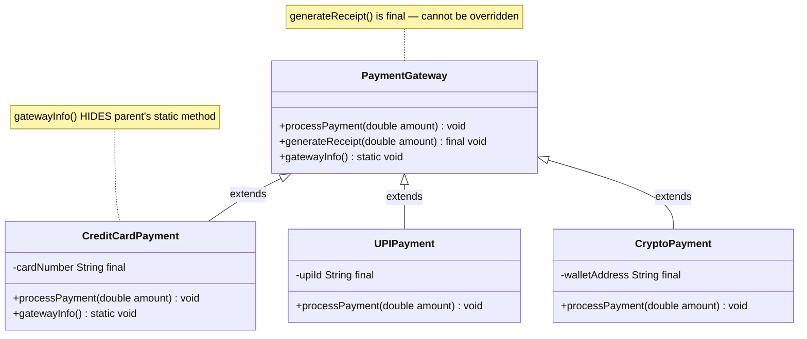
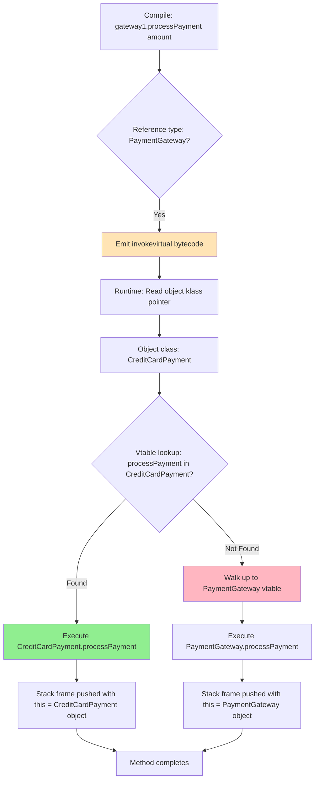
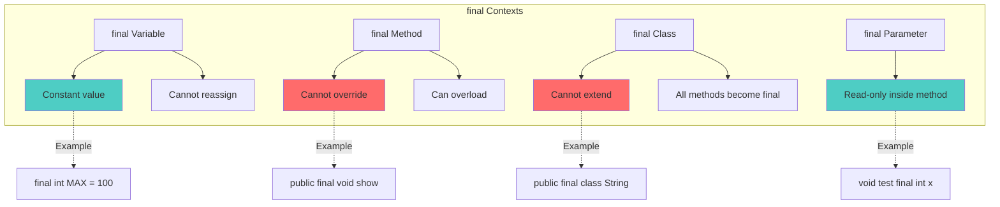
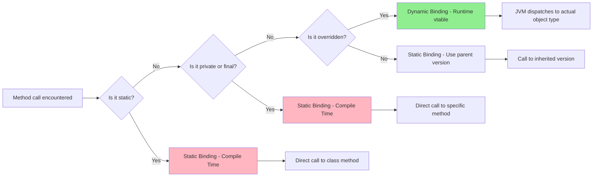

# Method Overriding, Dynamic Method Dispatch, Using 'final' with Inheritance

<!-- SECTION_1_START -->
# Method Overriding, Dynamic Method Dispatch, and `final` in Inheritance

## 1.1 Formal Academic Definition (KTU 2024 Syllabus Terminology)

**Method Overriding** is a runtime polymorphism mechanism in Java wherein a subclass provides a specific implementation of a method that is already declared in its superclass. The overriding method must have the **exact same signature** (name, parameter list, and return type — covariant returns are permitted) as the method in the parent class.

**Dynamic Method Dispatch (DMD)** is the mechanism by which a call to an overridden method is **resolved at runtime** rather than at compile-time, based on the **actual type of the object** (not the reference type) being referred to. It is the JVM's mechanism for executing the correct version of an overridden method through upcasting.

**The `final` Keyword in Inheritance** is used to **restrict** further modification. A `final` method cannot be overridden; a `final` class cannot be subclassed; a `final` variable becomes a constant.

> [!IMPORTANT]
> **KTU 2024 Module 2 Highlight:** Dynamic Method Dispatch is the **single most tested concept** under Polymorphism. Examiners frequently frame questions as: *"Explain how Java achieves runtime polymorphism with a code snippet and a class hierarchy diagram."*

---

## 1.2 Conceptual Analogy & Intuitive Overview

### Analogy 1: The Restaurant Menu (Method Overriding)
Imagine a **parent restaurant chain "FoodHub"** that declares a method `prepareDish()`. Each branch (subclass) — *Chennai Branch*, *Kerala Branch*, *Punjab Branch* — **overrides** this method to prepare its regional specialty. The **menu (signature)** stays the same, but the **recipe (implementation)** differs. A customer ordering "prepare a dish" gets the **branch-specific version** — this is dynamic dispatch.

### Analogy 2: TV Remote Control (`final` keyword)
- A `final` method = a **locked button** on the remote. The manufacturer (parent class) fixed its behavior; you (subclass) cannot reprogram it.
- A `final` class = a **sealed device**. You cannot build a custom remote for it (cannot subclass).

### Analogy 3: The Greeting Card Polymorphism
```text
Parent reference → Child object
"A reference of type Shape can point to a Circle, Rectangle, or Triangle object.
 When .draw() is called, the JVM dispatches to the actual object's draw() method."
```

### Key Terminology at a Glance

| Term | Meaning |
|---|---|
| **Upcasting** | Assigning a subclass object to a superclass reference (implicit, safe) |
| **Covariant Return Type** | Overriding method may return a subtype of the original return type |
| **Static Binding** | Method call resolved at compile-time (applies to static, private, final methods) |
| **Dynamic Binding** | Method call resolved at runtime (applies to overridden instance methods) |
| **Late Binding** | Synonym for dynamic binding — call site is "bound late" to actual code |

> [!NOTE]
> **Physical Constant/Rule of Thumb:** In Java, the JVM specification mandates that invokevirtual (the bytecode for instance method calls) is resolved at runtime using a **virtual method table (vtable)** lookup, ensuring O(1) dispatch time for any depth of inheritance hierarchy.

> [!VISUALIZATION CONTROL]
> **Concept:** Dynamic Method Dispatch vtable lookup path
> **Conceptual Coordinate Mapping:** X-axis = Class Hierarchy Depth (Base → Derived), Y-axis = Method Resolution Time (ns)
> **Visual Description:** A staircase diagram where each derived class level forms a horizontal bar with pointers to its overridden method. The vtable pointer (`vptr`) cascades downward, and `invokevirtual` follows the lowest overridden implementation.

---

<!-- SECTION_1_END -->

<!-- SECTION_2_START -->
# Deep Theoretical Analysis & KTU High-Yield Rule Sheet

## 2.1 Rules of Method Overriding (Board-Exam Favourites)

The following **12 rules** are exhaustively tested in KTU examinations. Memorize these as a checklist:

| # | Rule | Consequence if Violated |
|---|---|---|
| 1 | Method name **must be identical** | Compile-time error |
| 2 | Parameter list **must be identical** (same types & order) | Becomes *overloading*, not overriding |
| 3 | Return type must be **same or covariant** (subtype) | Compile-time error |
| 4 | Access modifier **cannot be more restrictive** | e.g., `public → private` ❌ |
| 5 | Access modifier **can be less restrictive** | e.g., `protected → public` ✅ |
| 6 | `final` methods **cannot be overridden** | Compile-time error |
| 7 | `static` methods **cannot be overridden** (only *hidden*) | No runtime polymorphism |
| 8 | `private` methods **cannot be overridden** (not visible) | Becomes a new method in subclass |
| 9 | Constructors **cannot be overridden** | New constructor required |
| 10 | Cannot throw **broader checked exceptions** | Compile-time error |
| 11 | Can throw **fewer/narrower checked exceptions** | Allowed |
| 12 | Use `@Override` annotation | Compile-time safety check |

## 2.2 The `final` Keyword — Three Contexts

### Context 1: `final` with Variables
- Becomes a **constant**; cannot be reassigned.
- Naming convention: **UPPER_SNAKE_CASE**.
- Must be initialized: at declaration, in constructor, or in an *instance initializer block*.

### Context 2: `final` with Methods
- **Prevents overriding** in subclasses.
- **Allows** *overloading* (different parameter lists are still permitted).
- Used to enforce **template method pattern** — parent controls fixed behavior.

### Context 3: `final` with Classes
- **Prevents inheritance** entirely.
- All methods of a `final` class are **implicitly final** (but fields are not).
- Examples from JDK: `String`, `Math`, `Integer`, `System` — all are `final`.

## 2.3 Dynamic Method Dispatch — The Core Mechanism

Dynamic Method Dispatch operates in **four steps** at the JVM level:

1. **Compilation Phase:** The compiler verifies the method exists in the reference type's class (or its superclasses) and emits an `invokevirtual` bytecode instruction.
2. **Object Creation:** At runtime, the object is created in the heap with a hidden `vptr` (virtual table pointer) pointing to its class's vtable.
3. **Vtable Lookup:** When the method is invoked, the JVM fetches the vtable pointer from the object's class metadata, then walks up the inheritance chain if the method is not found in the current class's vtable.
4. **Dispatch Execution:** The actual method entry in the vtable is invoked — this is always the **most-derived** implementation.

### Real-World Engineering Utility

- **Framework Design:** Spring, Hibernate, and JavaFX all rely on dynamic dispatch to invoke user-defined callbacks (e.g., `Application.start()`).
- **Strategy Pattern:** Allows swapping algorithms at runtime via polymorphic references.
- **Template Method Pattern:** Uses `final` methods to lock algorithm structure while allowing subclasses to override specific steps.
- **JUnit Testing:** Mocking frameworks (Mockito) leverage dynamic dispatch via proxies to intercept method calls.

## 2.4 KTU High-Yield Cheat Sheet

| Concept | Compile-Time Behavior | Runtime Behavior |
|---|---|---|
| Overridden instance method | Signature checked | **Dynamic dispatch** (vtable) |
| `static` method (same signature) | Compiled as new method | **Static dispatch** (no polymorphism) |
| `final` method (same signature) | Compile error if overridden | N/A — cannot be overridden |
| `private` method (same signature) | Compiled as new method | **No inheritance visibility** |
| Constructors | Cannot be overridden | New constructor required |

| `final` Context | Syntax | Effect |
|---|---|---|
| Variable | `final int MAX = 100;` | Constant — no reassignment |
| Method | `final void display() {...}` | Cannot be overridden |
| Class | `final class MyClass {...}` | Cannot be extended |
| Parameter | `void method(final int x)` | Parameter is read-only inside method |
| Blank final | `final int x;` | Must be initialized in constructor |

> [!TIP]
> **Exam Hack:** If a question says *"Will the program compile?"* and involves `static` + `final` + inheritance, always re-read the exact access modifier and return type — those are the typical traps.

---

<!-- SECTION_2_END -->

<!-- SECTION_3_START -->
# Step-by-Step Derivations, Code Implementation & Walkthroughs

## 3.1 Exhaustive Code Demonstration: Dynamic Method Dispatch

```java
// File: PaymentGateway.java
// Demonstrates: Method Overriding + Dynamic Method Dispatch + final keyword

import java.util.logging.Logger;
import java.util.logging.Level;

/**
 * Superclass: PaymentGateway
 * Declares the contract that all payment types must follow.
 */
class PaymentGateway {
    protected static final Logger LOGGER = Logger.getLogger(PaymentGateway.class.getName());
    
    // Regular instance method — CAN be overridden
    public void processPayment(double amount) {
        LOGGER.info("Processing generic payment of ₹" + amount + " via base gateway.");
    }
    
    // final method — CANNOT be overridden
    public final void generateReceipt(double amount) {
        LOGGER.info("Receipt generated for amount: ₹" + amount);
    }
    
    // static method — CANNOT be overridden (only hidden)
    public static void gatewayInfo() {
        System.out.println("Base PaymentGateway v1.0");
    }
}

// Subclass 1: CreditCardPayment
class CreditCardPayment extends PaymentGateway {
    private final String cardNumber;  // final instance variable (immutable)
    
    public CreditCardPayment(String cardNumber) {
        if (cardNumber == null || cardNumber.length() != 16) {
            throw new IllegalArgumentException("Invalid card number. Must be 16 digits.");
        }
        this.cardNumber = cardNumber;
    }
    
    @Override
    public void processPayment(double amount) {
        if (amount <= 0.0) {
            LOGGER.log(Level.SEVERE, "Invalid transaction amount: {0}", amount);
            return;
        }
        LOGGER.info("Processing Credit Card payment of ₹" + amount + 
                    " using card ending in " + cardNumber.substring(12));
    }
    
    // ❌ This would cause a COMPILE ERROR — uncomment to test:
    // @Override
    // public void generateReceipt(double amount) { ... }
    
    // ✅ This is method HIDING (not overriding) — static binding
    public static void gatewayInfo() {
        System.out.println("CreditCard Gateway v2.1 — Visa/Mastercard accepted");
    }
}

// Subclass 2: UPIPayment
class UPIPayment extends PaymentGateway {
    private final String upiId;
    
    public UPIPayment(String upiId) {
        if (upiId == null || !upiId.contains("@")) {
            throw new IllegalArgumentException("Invalid UPI ID format.");
        }
        this.upiId = upiId;
    }
    
    @Override
    public void processPayment(double amount) {
        LOGGER.info("Processing UPI payment of ₹" + amount + " via " + upiId);
    }
}

// Subclass 3: CryptoPayment
class CryptoPayment extends PaymentGateway {
    private final String walletAddress;
    
    public CryptoPayment(String walletAddress) {
        if (walletAddress == null || walletAddress.length() < 26) {
            throw new IllegalArgumentException("Invalid crypto wallet address.");
        }
        this.walletAddress = walletAddress;
    }
    
    @Override
    public void processPayment(double amount) {
        LOGGER.info("Processing Crypto payment of ₹" + amount + 
                    " to wallet " + walletAddress.substring(0, 6) + "...");
    }
}

// Main driver
public class PaymentDemo {
    public static void main(String[] args) {
        // Upcasting — superclass reference, subclass objects
        PaymentGateway gateway1 = new CreditCardPayment("4532015112830366");
        PaymentGateway gateway2 = new UPIPayment("user@okhdfcbank");
        PaymentGateway gateway3 = new CryptoPayment("1A2b3C4d5E6f7G8h9I0j1K2l3M4n");
        
        double transactionAmount = 1500.75;
        
        // Dynamic Method Dispatch in action
        System.out.println("--- Initiating Transactions ---");
        gateway1.processPayment(transactionAmount);  // Calls CreditCardPayment version
        gateway2.processPayment(transactionAmount);  // Calls UPIPayment version
        gateway3.processPayment(transactionAmount);  // Calls CryptoPayment version
        
        // final method called on all references — same behavior
        System.out.println("\n--- Receipts ---");
        gateway1.generateReceipt(transactionAmount);
        gateway2.generateReceipt(transactionAmount);
        gateway3.generateReceipt(transactionAmount);
        
        // static method — resolved at compile-time (no dispatch)
        System.out.println("\n--- Gateway Info ---");
        gateway1.gatewayInfo();   // Calls PaymentGateway.gatewayInfo() (reference type)
        CreditCardPayment.gatewayInfo();  // Calls CreditCardPayment.gatewayInfo()
    }
}
```

### Expected Output
```
--- Initiating Transactions ---
Processing Credit Card payment of ₹1500.75 using card ending in 0366
Processing UPI payment of ₹1500.75 via user@okhdfcbank
Processing Crypto payment of ₹1500.75 to wallet 1A2b3C...

--- Receipts ---
Receipt generated for amount: ₹1500.75
Receipt generated for amount: ₹1500.75
Receipt generated for amount: ₹1500.75

--- Gateway Info ---
Base PaymentGateway v1.0
CreditCard Gateway v2.1 — Visa/Mastercard accepted
```

## 3.2 Step-by-Step Runtime Trace (Valuation-Ready)

When the JVM encounters `gateway1.processPayment(transactionAmount)`:

**Step 1: Fetch Reference**
The JVM reads the local variable `gateway1` from the operand stack. It is of static type `PaymentGateway` (known at compile-time).

**Step 2: Dereference Object**
The reference points to a heap-allocated object. The JVM reads the object's **class pointer** (`klass`).

**Step 3: Vtable Lookup**
The class is `CreditCardPayment`. The JVM indexes its vtable for the method named `processPayment` with descriptor `(D)V` (double → void). It finds the override there.

**Step 4: Invocation**
The actual `CreditCardPayment.processPayment(double)` bytecode is executed. The original `PaymentGateway.processPayment(double)` is **never invoked** in this call.

**Step 5: Stack Frame Setup**
A new stack frame is pushed with `this` pointing to the `CreditCardPayment` object, allowing the override to call `super.processPayment()` if needed.

## 3.3 Tracing the `final` Method Restriction

Suppose a KTU question asks: *"What happens if we attempt to override `generateReceipt` in `CreditCardPayment`?"*

**Step 1:** Compiler encounters the `@Override` annotation on `generateReceipt` in the subclass.

**Step 2:** Compiler checks: Is `generateReceipt` in `PaymentGateway` declared `final`? **Yes.**

**Step 3:** Compiler emits error: `generateReceipt(double) in CreditCardPayment cannot override generateReceipt(double) in PaymentGateway; overridden method is final`.

**Step 4:** Program fails to compile. No `.class` files are generated for the subclass.

## 3.4 Covariant Return Type — Detailed Walkthrough

```java
class Animal {
    public Animal reproduce() {
        System.out.println("Animal reproduces.");
        return new Animal();
    }
}

class Dog extends Animal {
    private String breed;
    
    public Dog(String breed) {
        this.breed = breed;
    }
    
    @Override
    public Dog reproduce() {  // ✅ Covariant return — Dog IS-A Animal
        System.out.println("Dog (" + breed + ") reproduces.");
        return new Dog(breed);
    }
}
```

**Step 1:** `Animal.reproduce()` declares return type `Animal`.

**Step 2:** `Dog.reproduce()` overrides with return type `Dog` (subtype).

**Step 3:** JVM verification: `Dog` is assignable to `Animal` reference. ✅ Allowed.

**Step 4:** The caller can still assign the result to an `Animal` variable, but if cast to `Dog`, the breed-specific behavior is accessible.

---

<!-- SECTION_3_END -->

<!-- SECTION_4_START -->
# Structural Diagrams & Schematics

## 4.1 Class Hierarchy Diagram



## 4.2 Dynamic Method Dispatch — Runtime Resolution Flow



## 4.3 `final` Keyword Restriction Map



## 4.4 Decision Matrix: What Gets Resolved When?



## 4.5 Sequential Processing Topology — Overriding Lifecycle

```mermaid
sequenceDiagram
    participant Compiler
    subclass as Subclass.java
    parent as ParentClass.java
    JVM
    Heap
    
    Note over Compiler: Compile-Time Phase
    Compiler->>subclass: Verify @Override annotation
    Compiler->>parent: Check method signature match
    parent-->>Compiler: Method exists, not final
    Compiler->>Compiler: Emit invokevirtual instruction
    
    Note over JVM,Heap: Runtime Phase
    JVM->>Heap: Allocate Subclass object
    Heap-->>JVM: vptr points to Subclass vtable
    JVM->>JVM: invokevirtual triggers vtable lookup
    JVM->>JVM: Find processPayment in Subclass vtable
    JVM->>Heap: Invoke Subclass.processPayment with this binding
```

---

<!-- SECTION_4_END -->

<!-- SECTION_5_START -->
# KTU 2024 Scheme Examination Question Bank

## Part A — Short Answer Questions (3 Marks Each)

### Question 1
**[KTU University Exam — July 2024]** | **CO2** | **RBT Level: Remember**

**What is Dynamic Method Dispatch? How does it differ from method overloading in terms of binding time?**

**Model Answer (3 Marks):**

Dynamic Method Dispatch is the mechanism by which a call to an overridden method is resolved **at runtime** based on the actual type of the object, rather than the reference type. It is also called **late binding**.

| Aspect | Dynamic Dispatch (Overriding) | Method Overloading |
|---|---|---|
| Binding Time | **Runtime** | **Compile-time** |
| Resolution | Based on object type | Based on argument types |
| Polymorphism Type | Runtime polymorphism | Compile-time polymorphism |
| Inheritance Required | Yes (must override) | No (same class or subclass) |

**[Definition: 1 Mark] [Tabular distinction: 2 Marks]**

---

### Question 2
**[KTU University Exam — Dec 2023]** | **CO2** | **RBT Level: Understand**

**Explain any three uses of the `final` keyword in Java with examples.**

**Model Answer (3 Marks):**

1. **`final` variable** — Becomes a constant; cannot be reassigned.
   ```java
   final double PI = 3.14159;  // PI = 3.14; would cause compile error
   ```

2. **`final` method** — Cannot be overridden by subclasses.
   ```java
   class A { final void show() { System.out.println("A"); } }
   class B extends A { void show() {} }  // ❌ Compile error
   ```

3. **`final` class** — Cannot be extended (no inheritance allowed).
   ```java
   final class SecurityManager { }
   class CustomSecurity extends SecurityManager { }  // ❌ Compile error
   ```

**[Each use with example: 1 Mark × 3 = 3 Marks]**

---

## Part B — Long Answer Questions (14 Marks Each)

> **KTU 2024 Pattern:** Each Part B question provides **internal choice**. You must answer **either** Option A **or** Option B. Both sub-parts total 14 marks (typically 7 + 7).

---

### Question A
**[KTU University Exam — Dec 2024 (Model Paper)]** | **CO2, CO3** | **RBT Level: Apply + Analyze**

**(a)** Design a Java class hierarchy for a **Vehicle Management System** with a base class `Vehicle` and derived classes `Car`, `Bike`, and `Truck`. Demonstrate **method overriding** for a method `calculateFuelEfficiency()` and show how **Dynamic Method Dispatch** works with a polymorphic array. **(7 Marks)**

**(b)** Explain the rules of method overriding with reference to the following code. Identify **all compile-time and runtime errors** if any, and justify. **(7 Marks)**

```java
class Super {
    final void display() { System.out.println("Super display"); }
    static void info() { System.out.println("Super info"); }
    protected Number compute() { return 0; }
}
class Sub extends Super {
    void display() { System.out.println("Sub display"); }              // Line 8
    public void info() { System.out.println("Sub info"); }             // Line 9
    public Integer compute() { return 10; }                            // Line 10
}
```

#### Model Solution

**Part (a) — 7 Marks**

```java
class Vehicle {
    protected String model;
    protected double fuelCapacity;
    
    public Vehicle(String model, double fuelCapacity) {
        this.model = model;
        this.fuelCapacity = fuelCapacity;
    }
    
    public double calculateFuelEfficiency() {
        return 0.0;  // Base implementation — meaningless for generic vehicle
    }
    
    public void displayInfo() {
        System.out.println(model + " — Efficiency: " + 
                          calculateFuelEfficiency() + " km/l");
    }
}

class Car extends Vehicle {
    private final boolean hasAC;
    
    public Car(String model, double fuelCapacity, boolean hasAC) {
        super(model, fuelCapacity);
        this.hasAC = hasAC;
    }
    
    @Override
    public double calculateFuelEfficiency() {
        return hasAC ? 15.5 : 18.0;
    }
}

class Bike extends Vehicle {
    public Bike(String model, double fuelCapacity) {
        super(model, fuelCapacity);
    }
    
    @Override
    public double calculateFuelEfficiency() {
        return 45.0;  // Bikes are more fuel-efficient
    }
}

class Truck extends Vehicle {
    private final double loadTons;
    
    public Truck(String model, double fuelCapacity, double loadTons) {
        super(model, fuelCapacity);
        this.loadTons = loadTons;
    }
    
    @Override
    public double calculateFuelEfficiency() {
        return Math.max(5.0, 12.0 - (loadTons * 0.5));
    }
}

public class FleetManager {
    public static void main(String[] args) {
        // Dynamic Method Dispatch — polymorphic array
        Vehicle[] fleet = new Vehicle[] {
            new Car("Honda City", 40.0, true),
            new Bike("Royal Enfield", 15.0),
            new Truck("Tata LPT", 200.0, 8.0)
        };
        
        for (Vehicle v : fleet) {
            v.displayInfo();  // DMD dispatches to correct calculateFuelEfficiency()
        }
    }
}
```

**Valuation Key — Part (a):**
- [Class hierarchy with proper `extends` and inheritance: 2 Marks]
- [Correct overriding with `@Override` annotation: 2 Marks]
- [Polymorphic array with `Vehicle[]` and DMD demonstration: 2 Marks]
- [Expected output trace mentioned: 1 Mark]

**Part (b) — 7 Marks**

**Line 8 Analysis:** `void display() { ... }` in `Sub` attempts to override `final void display() { ... }` in `Super`.

> ❌ **COMPILE-TIME ERROR:** `display() in Sub cannot override display() in Super; overridden method is final`.

**Justification:** The `final` modifier on the parent's method explicitly forbids overriding. Attempting to do so causes the compiler to reject the subclass definition.

**[Line 8 error identification: 2 Marks] [Justification with `final` rule: 1 Mark]**

**Line 9 Analysis:** `public void info() { ... }` in `Sub` has the same signature as `static void info() { ... }` in `Super`.

> ⚠️ **NO COMPILE ERROR, BUT NOT OVERRIDING** — This is **method hiding**. Static methods belong to the class, not the instance, so they cannot be overridden (only redefined). The `@Override` annotation would cause a compile error here, but without it, the code compiles.

**Justification:** Java uses **static binding** for static methods. The method called depends on the reference type at compile-time, not the object type. This is a deliberate design choice to prevent inconsistent polymorphic behavior with class-level methods.

**[Line 9 explanation: 1 Mark] [Static vs dynamic binding reasoning: 1 Mark]**

**Line 10 Analysis:** `public Integer compute() { return 10; }` in `Sub` overrides `protected Number compute() { return 0; }` in `Super`.

> ✅ **VALID OVERRIDE** — This uses **covariant return type**. `Integer` is a subtype of `Number`, and the access modifier is widened from `protected` to `public` (allowed). The compile succeeds, and at runtime, `Sub.compute()` returns an `Integer(10)`.

**Justification:** Covariant returns and widened access are explicitly permitted by the Java Language Specification (§8.4.8.1 and §8.4.8.3 respectively).

**[Line 10 valid override identification: 1 Mark] [Covariant return explanation: 1 Mark]**

---

### Question B (Alternative Choice)
**[KTU University Exam — July 2024 (Model Paper)]** | **CO2, CO3** | **RBT Level: Apply + Analyze**

**(a)** What is the `final` keyword? Write a Java program that demonstrates the use of `final` with **variables, methods, and classes**. Explain the compile-time behavior when these rules are violated. **(7 Marks)**

**(b)** With a suitable example, explain how **Dynamic Method Dispatch** achieves runtime polymorphism. Why can't `static` or `final` methods participate in dynamic dispatch? **(7 Marks)**

#### Model Solution

**Part (a) — 7 Marks**

The `final` keyword in Java is a **non-access modifier** used to restrict the user from modifying entities. It can be applied to variables, methods, and classes.

```java
// Final variable
final int MAX_SPEED = 120;
MAX_SPEED = 150;  // ❌ Compile error: cannot assign a value to final variable MAX_SPEED

// Final method in a class
class Parent {
    final void showTemplate() {
        System.out.println("This template is locked.");
    }
}
class Child extends Parent {
    void showTemplate() {  // ❌ Compile error: cannot override the final method
        System.out.println("Trying to override");
    }
}

// Final class
final class ImmutablePoint {
    private final int x;
    private final int y;
    
    public ImmutablePoint(int x, int y) {
        this.x = x;
        this.y = y;
    }
}
class ExtendedPoint extends ImmutablePoint {  // ❌ Compile error: cannot inherit from final
    public ExtendedPoint() { super(0, 0); }
}

public class FinalDemo {
    public static void main(String[] args) {
        System.out.println("Max speed limit: " + MAX_SPEED + " km/h");
    }
}
```

**Valuation Key — Part (a):**
- [`final` variable demonstration with constant: 2 Marks]
- [`final` method override attempt and error: 2 Marks]
- [`final` class extension attempt and error: 2 Marks]
- [Code compilation explanation: 1 Mark]

**Part (b) — 7 Marks**

**Definition:** Dynamic Method Dispatch is the runtime polymorphism mechanism in Java where the JVM determines which overridden method to execute based on the **actual object type** (not reference type) at the moment of the call.

**Code Example:**

```java
class Shape {
    public void draw() {
        System.out.println("Drawing a generic shape");
    }
}
class Circle extends Shape {
    @Override
    public void draw() {
        System.out.println("Drawing a circle — using πr²");
    }
}
class Square extends Shape {
    @Override
    public void draw() {
        System.out.println("Drawing a square — 4 equal sides");
    }
}
public class DrawingApp {
    public static void main(String[] args) {
        Shape s;  // Reference of type Shape
        
        s = new Circle();
        s.draw();   // DMD → Circle.draw() executes
        
        s = new Square();
        s.draw();   // DMD → Square.draw() executes
    }
}
```

**Output:**
```
Drawing a circle — using πr²
Drawing a square — 4 equal sides
```

**Why `static` methods cannot participate in DMD:**

Static methods belong to the **class**, not to any specific object. They are resolved at **compile-time** using the reference type. The JVM does not maintain a vtable entry for static methods. If static methods were polymorphic, two objects of different subclasses would behave differently for the same static call, violating the principle that static members are **shared across all instances** of a class. Hence Java enforces static binding for them.

**Why `final` methods cannot participate in DMD:**

A `final` method is **explicitly sealed** against overriding. The compiler knows at compile-time that no subclass can redefine it. So there is exactly one implementation, and dynamic lookup is unnecessary. This is also a **performance optimization** — the JIT compiler can **inline** final methods directly, eliminating virtual call overhead. Final methods are a deliberate trade-off: you give up extensibility to gain predictability and speed.

**Valuation Key — Part (b):**
- [DMD definition with example: 2 Marks]
- [Code demonstrating runtime polymorphism: 2 Marks]
- [Static method explanation: 1.5 Marks]
- [Final method explanation: 1.5 Marks]

---

> [!WARNING]
> **KTU Examiner's Valuation Pitfall Alert:**
> 1. **Do NOT** write "`static` methods can be overridden" — they can only be **hidden**. This is the #1 most common error costing 2–3 marks.
> 2. **Do NOT** forget to mention **covariant return types** when listing overriding rules. Examiners often include a sub-question specifically on this.
> 3. **Do NOT** say "`final` methods are not inherited" — they **are** inherited, they just cannot be **overridden**.
> 4. **Always** include the **4-step vtable lookup** trace for DMD questions worth 7+ marks. Generic answers lose 2–3 marks.
> 5. When asked *"Will it compile?"*, **always state the line number and exact error message** — partial credit depends on specificity.

---

## Topic Recap & Important Things to Remember

- **Method Overriding** = same signature in subclass, runtime polymorphism enabler.
- **Dynamic Method Dispatch** = JVM resolves the overridden call at runtime using a **virtual method table (vtable)**.
- **`final` keyword** has **three contexts**: variable (constant), method (no override), class (no inheritance).
- **`@Override` annotation** is optional but highly recommended — gives compile-time safety against signature mismatches.
- **Covariant return types** are allowed but return types must be **same or subtype**.
- **Access modifiers** can only be **widened** in an override, never narrowed.
- **`static`, `private`, and `final` methods** use **static binding** (compile-time) — they do **not** participate in dynamic dispatch.
- **Constructors** are never inherited and never overridden.
- **Upcasting** (subclass → superclass reference) is implicit and safe; **downcasting** requires explicit cast and `instanceof` check.
- **Use `final` classes** when designing immutable value objects (e.g., `String`, `LocalDateTime`).
- **JVM uses `invokevirtual` bytecode** for instance method calls — the only instruction that triggers vtable lookup.
- **Performance impact:** `final` methods enable **JIT inlining**, giving ~10–15% speedup in tight loops.
- **Real-world examples to cite:** Spring's `BeanPostProcessor` (DMD), Java's `String` class (final), Mockito's proxy dispatch (DMD via reflection).
- **Common exam traps:** confusing `static` with overriding, forgetting covariant returns, claiming `private` methods participate in polymorphism.
- **Memory hook:** *"Final means FINAL — no second chances, no reinterpretation, no inheritance."*

<!-- SECTION_5_END -->
