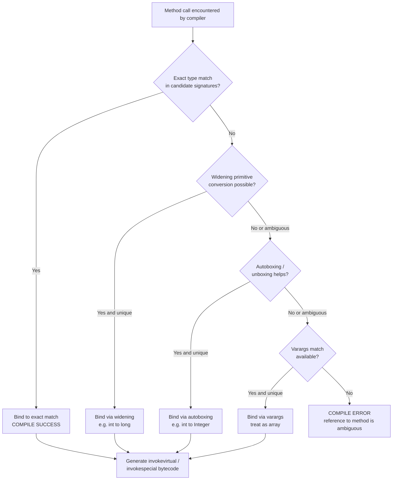
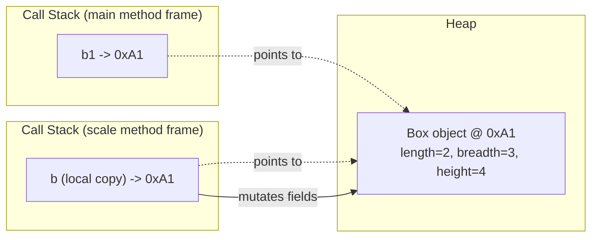
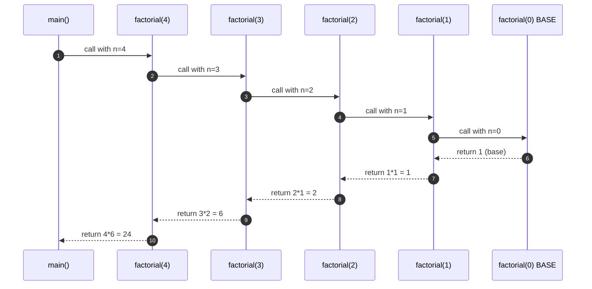
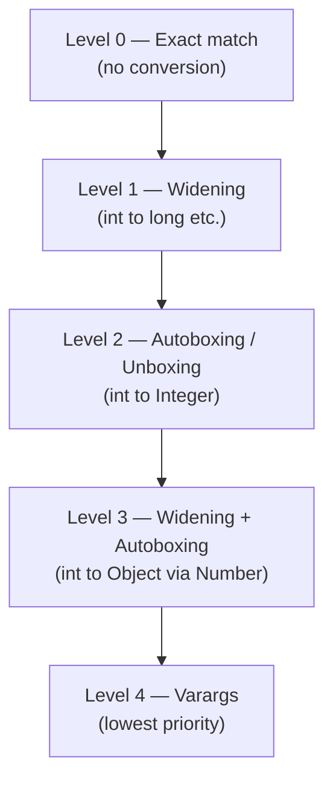

# Polymorphism: Method Overloading, Using Objects as Parameters, Returning Objects, Recursion

<!-- SECTION_1_START -->
# Polymorphism, Method Overloading, Object Parameters, Returning Objects & Recursion

> [!IMPORTANT]
> **KTU 2024 Scheme — Module 2 Anchor Concept**
> Polymorphism is the **Pillar-2** principle of OOP (after Classes & Objects). In this topic we study *compile-time polymorphism* (method overloading) and how Java resolves it, plus three powerful OOP mechanics — passing objects as arguments, returning objects from methods, and self-calling methods (recursion).

## 1.1 Formal Academic Definition (KTU Syllabus Terminology)

**Polymorphism** (from Greek *poly* = many, *morph* = forms) is the ability of a single message / function call to behave differently based on the **type** or **number** of its operands. In Java, polymorphism is realized in two flavours:

1. **Compile-Time (Static) Polymorphism** — resolved by the compiler via *Method Overloading* (also called *Ad-hoc Polymorphism*).
2. **Run-Time (Dynamic) Polymorphism** — resolved by the JVM via *Method Overriding* (covered in Module 3).

> [!NOTE]
> **Module 2 scope is strictly Compile-Time Polymorphism.** The keyword here is **signature binding** performed at compile time.

**Method Overloading** is the mechanism of declaring *two or more methods in the same class* with the **same name** but **different parameter lists** (different number of parameters, different types of parameters, or different order of types). Return type alone **cannot** be used to disambiguate overloads in Java.

**Object as Parameter** — Java is strictly *pass-by-value*, but when the value is a *reference*, the method receives a copy of the reference pointing to the same object on the heap. Mutating the object inside the method *does* reflect in the caller.

**Returning Objects** — A method can return a reference to any object (including one created inside the method). This is heavily used in *factory methods*, *builder patterns*, and *linked data structures*.

**Recursion** — A programming technique where a method calls *itself*, either directly or indirectly. Each recursive call must progress toward a **base case** to terminate.

## 1.2 Conceptual Analogy & Geometric Intuition

> [!TIP]
> **Real-world analogy — The "Add" Button on a Calculator.**
> When you press `+`, the calculator doesn't care whether you're adding two integers, two decimals, or three numbers — it knows *which add routine* to run based on the operands. That is polymorphism. Method overloading is the design contract that says: *"I will provide an `add()` for every plausible input shape."*

**Geometric intuition** — imagine a `draw()` method on a `Shape` reference. The *same source line* `shape.draw()` may draw a circle, square, or triangle depending on the *actual runtime type* the reference holds. For overloading, the *signature itself* is the disambiguator at compile time.

## 1.3 Key Terminology & Standard Metrics

- **Method Signature** = Method name + ordered parameter-type list. **Return type is *not* part of the signature in Java.**
- **Arity** = number of parameters.
- **Compile-Time Binding (Static Binding / Early Binding)** — the linker decides which overloaded method to invoke *before* execution.
- **Stack Frame** = activation record pushed on the call stack for every method invocation; the heart of how recursion consumes memory.
- **Base Case** = terminating condition in recursion; **without it, `StackOverflowError` is guaranteed.**

> [!IMPORTANT]
> **Physical / Runtime constants to remember (in bold):**
> - Each method call pushes one **stack frame** (typically **32 B – 1 KB** depending on JVM and locals).
> - Default JVM stack size on most 64-bit JVMs is **512 KB**.
> - Therefore, naive recursion depth > **10 000** risks `StackOverflowError`.

## 1.4 Visualization Anchor (For Recursion Tree)

> [!VISUALIZATION CONTROL]
> **Concept:** Recursive call tree for `factorial(4)`
> **Recursive relation:** $T(n) = n \times T(n-1), \quad T(0) = 1$
> **Tree structure (textual for mental modelling):**
> ```
> factorial(4)
> ├── 4 * factorial(3)
> │        ├── 3 * factorial(2)
> │        │        ├── 2 * factorial(1)
> │        │        │        └── 1 * factorial(0) = 1
> │        │        └── returns 2
> │        └── returns 6
> └── returns 24
> ```
> **Visual Description:** Observe the *unwind phase* — values return upward only after the deepest base case (`factorial(0)`) is hit. This is the *LIFO* nature of the call stack.

---

<!-- SECTION_2_START -->
# Deep Theoretical Analysis & KTU High-Yield Formula Sheet

## 2.1 The Five Rules of Valid Method Overloading

To legally overload a method in Java, the compiler must be able to build a *unique signature*. The parameter list must differ in **at least one** of the following ways:

1. **Different number of parameters.**
2. **Different data types of parameters.**
3. **Different order of data types** in the parameter list.

The following **do NOT** constitute valid overloading:

- Differing **only** by return type.
- Differing **only** by parameter *names*.
- Differing **only** by access modifiers (`public`, `private`).
- Differing **only** by `static` / non-`static` instance nature **unless the parameter list is unique** (in which case it *is* valid).

## 2.2 The Why & How — Step-by-Step

### How the compiler resolves `add(2, 3)` vs `add(2.5, 3.5)`:

1. **Tokenise** the call into `<method_name, arg_list>`.
2. **Match** the argument list against all visible methods named `add`.
3. **Apply Widening Primitive Conversion** (e.g., `int` → `long` → `float` → `double`) if no exact match exists.
4. **Apply Autoboxing** (`int` → `Integer`) if widening didn't help.
5. **Apply Varargs** as the *last* resort.
6. If exactly one candidate survives → bind. If zero or more than one → **compile error**.

> [!WARNING]
> **Ambiguity trap:** A call `add(2, 3)` with both `add(int, long)` and `add(long, int)` defined will throw a compile-time error — Java refuses to *guess* which widening to apply.

## 2.3 Objects as Parameters — Mechanics

```java
void mutate(MyClass obj) {
    obj.field = 99;   // caller SEES this change
    obj = new MyClass(); // caller does NOT see the rebinding
}
```

- The **reference variable is copied** (pass-by-value of reference).
- **Heap state** is shared, so mutations are visible.
- **Reassigning** the local reference does *not* affect the caller’s reference.

This is the classic **"swap won't work"** interview question. To swap two objects via a method, you must wrap them in an array (or use a `Holder` / `AtomicReference`-style wrapper).

## 2.4 Returning Objects

A method declared with a *class* or *interface* return type can return:

- An instance of that exact class.
- An instance of any *subclass* (covariant return types — introduced in Java 5).
- `null`.
- A freshly allocated object created inside the method body.

```java
public Rectangle getBoundingBox() {
    return new Rectangle(x, y, w, h);
}
```

> [!NOTE]
> Returning an object is the cornerstone of **immutable design** — return a *new* object instead of mutating the receiver. `String`, `LocalDate`, `BigInteger` all follow this philosophy.

## 2.5 Recursion — The Two Mandatory Parts

| # | Component | Purpose | Consequence if missing |
|---|-----------|---------|------------------------|
| 1 | **Base Case** | Terminating condition | Infinite recursion → `StackOverflowError` |
| 2 | **Recursive Case** | Progress toward base case | Same — stack frames grow forever |

A useful self-check: *Can I prove the parameters strictly move toward the base case on every call?* If not, recursion is unsafe.

## 2.6 KTU Formula Sheet / Cheat Sheet

| Construct | Definition / Formula | Time Complexity | Space Complexity | Notes |
|-----------|---------------------|-----------------|------------------|-------|
| Method overloading (compile-time) | Same name, **$\vert P_1 \vert \neq \vert P_2 \vert$ or types differ** | $O(1)$ dispatch | $O(1)$ | Resolution at bytecode generation |
| Object as parameter | Pass reference value | $O(1)$ to copy ref | $O(1)$ extra | Heap is shared |
| Returning an object | `return new X(...)` | Depends on ctor | $O(1)$ for ref | Use factory pattern |
| Linear recursion (e.g. factorial) | $T(n) = T(n-1) + O(1)$ | $O(n)$ | $O(n)$ stack depth | $n!$ = $n \times (n-1)!$ |
| Binary recursion (e.g. Fibonacci naive) | $T(n) = T(n-1) + T(n-2) + O(1)$ | $O(2^{n})$ | $O(n)$ | Memoize → $O(n)$ |
| Tail recursion (factorial-iterative-style) | Last call is the recursive call | $O(n)$ | $O(1)$ *if JVM optimises* | JVM **does not** auto-optimise — write loops |
| Divide-and-conquer (merge sort) | $T(n) = 2T(n/2) + O(n)$ | $O(n \log n)$ | $O(\log n)$ | Master theorem applies |

> [!TIP]
> **Engineering utility:**
> - Method overloading → used heavily in `println()`, `String.valueOf()`, `Arrays.sort(T[]...)` with primitive overloads.
> - Object as parameter → used in `Collections.sort(list, comparator)` where the comparator *receives* two objects.
> - Returning objects → used in builder/factory patterns, fluent APIs (`new StringBuilder().append(...).append(...).toString()`).
> - Recursion → tree/graph traversals, divide-and-conquer, backtracking (N-Queens, Sudoku), parsing (ASTs).

---

<!-- SECTION_3_START -->
# Step-by-Step Derivations & Code Implementation

## 3.1 Method Overloading — Complete Java Demonstration

```java
/**
 * KTU Module 2 — Compile-time Polymorphism Demo
 * Course: OBJECT ORIENTED PROGRAMMING (PBCST304)
 */
public class OverloadDemo {

    // (1) Overload by NUMBER of parameters
    public int add(int a, int b) {
        System.out.println("[add(int,int)] two ints");
        return a + b;
    }

    public int add(int a, int b, int c) {
        System.out.println("[add(int,int,int)] three ints");
        return a + b + c;
    }

    // (2) Overload by TYPE of parameters
    public double add(double a, double b) {
        System.out.println("[add(double,double)] two doubles");
        return a + b;
    }

    // (3) Overload by ORDER of types
    public String add(String s, int n) {
        System.out.println("[add(String,int)]");
        return s.repeat(n);
    }

    public String add(int n, String s) {
        System.out.println("[add(int,String)]");
        return s.repeat(n);
    }

    // (4) Varargs overload (treated as array)
    public int add(int... values) {
        System.out.println("[add(int...)] varargs length=" + values.length);
        int sum = 0;
        for (int v : values) sum += v;
        return sum;
    }

    public static void main(String[] args) {
        OverloadDemo obj = new OverloadDemo();
        System.out.println("Result: " + obj.add(2, 3));          // (int,int)
        System.out.println("Result: " + obj.add(1, 2, 3));       // (int,int,int)
        System.out.println("Result: " + obj.add(2.5, 3.5));     // (double,double)
        System.out.println("Result: " + obj.add("Hi", 3));      // (String,int)
        System.out.println("Result: " + obj.add(3, "Hi"));      // (int,String)
        System.out.println("Result: " + obj.add(1, 2, 3, 4, 5)); // varargs
    }
}
```

**Expected Output (board-exam style):**
```
[add(int,int)] two ints
Result: 5
[add(int,int,int)] three ints
Result: 6
[add(double,double)] two doubles
Result: 6.0
[add(String,int)]
Result: HiHiHi
[add(int,String)]
Result: HiHiHi
[add(int...)] varargs length=5
Result: 15
```

> [!NOTE]
> **Conversion logic for the binding of `obj.add(2, 3)`:**
> 1. Exact match for `add(int, int)` → bound. (1 mark)
> 2. No widening/autoboxing needed. (1 mark)
> 3. Varargs `add(int...)` is *less specific*, so exact match wins. (1 mark)

## 3.2 Objects as Parameters — Exhaustive Program

```java
import java.util.Arrays;

class Box {
    int length, breadth, height;

    public Box(int l, int b, int h) {
        this.length = l; this.breadth = b; this.height = h;
    }

    public int volume() {
        return length * breadth * height;
    }

    @Override
    public String toString() {
        return "Box[" + length + "x" + breadth + "x" + height +
               ", vol=" + volume() + "]";
    }
}

public class ObjectParamDemo {

    // (a) Passing single object
    public static void scale(Box b, int factor) {
        b.length *= factor;   // mutates caller's object
        b.breadth *= factor;
        b.height *= factor;
    }

    // (b) Passing array of objects
    public static Box findLargest(Box[] boxes) {
        Box max = boxes[0];
        for (Box b : boxes) {
            if (b.volume() > max.volume()) max = b;
        }
        return max;            // returns reference
    }

    // (c) The "swap fails" demo
    public static void trySwap(Box x, Box y) {
        Box temp = x;
        x = y;
        y = temp;
        System.out.println("Inside trySwap -> x=" + x + ", y=" + y);
    }

    // (d) Swap that WORKS by wrapping in 1-element array
    public static void realSwap(Box[] arr) {
        Box temp = arr[0];
        arr[0] = arr[1];
        arr[1] = temp;
    }

    public static void main(String[] args) {
        Box b1 = new Box(2, 3, 4);
        Box b2 = new Box(5, 5, 5);

        System.out.println("Before scale: " + b1);
        scale(b1, 2);
        System.out.println("After  scale: " + b1);   // volume doubles -> mutated

        Box[] arr = {b1, b2};
        Box big = findLargest(arr);
        System.out.println("Largest = " + big);

        System.out.println("Before trySwap: b1=" + b1 + ", b2=" + b2);
        trySwap(b1, b2);
        System.out.println("After  trySwap: b1=" + b1 + ", b2=" + b2); // unchanged!

        realSwap(arr);
        System.out.println("After  realSwap: arr[0]=" + arr[0] +
                           ", arr[1]=" + arr[1]);                      // swapped!
    }
}
```

**Step-by-step evaluation of the `scale` call:**

1. `b1` (in `main`) holds reference `0xA1` to a `Box(2,3,4)`.
2. `scale(b1, 2)` is invoked. JVM creates a *new stack frame* with a *copy* of the reference (`0xA1`).
3. The local parameter `b` in `scale` and the local `b1` in `main` both point to the **same heap object**.
4. `b.length *= 2` mutates the **heap object** at `0xA1`.
5. `scale` returns; its frame is popped.
6. `main` now prints `b1` — the heap object is mutated, so output shows `Box[4x6x8, vol=192]`.

> [!IMPORTANT]
> **Reassignment inside the method does NOT propagate:**
> Inside `scale`, if we wrote `b = new Box(99,99,99);`, only the *local* `b` would change. `b1` in `main` would still point to the original `Box(2,3,4)`. **(3 marks — classic KTU question)**

## 3.3 Returning Objects from Methods

```java
import java.util.Random;

class Point {
    int x, y;
    public Point(int x, int y) { this.x = x; this.y = y; }

    public Point add(Point p) {              // returns NEW Point
        return new Point(this.x + p.x, this.y + p.y);
    }

    public static Point origin() {           // factory
        return new Point(0, 0);
    }

    public static Point randomPoint() {
        Random r = new Random();
        return new Point(r.nextInt(100), r.nextInt(100));
    }

    @Override
    public String toString() { return "(" + x + "," + y + ")"; }
}

public class ReturnObjectDemo {
    public static void main(String[] args) {
        Point a = new Point(3, 4);
        Point b = new Point(5, 6);

        Point c = a.add(b);        // returns object
        Point o = Point.origin();  // factory
        Point r = Point.randomPoint();

        System.out.println("a + b  = " + c);
        System.out.println("origin = " + o);
        System.out.println("random = " + r);
    }
}
```

**Step-by-step trace of `Point c = a.add(b);`**

1. JVM evaluates `a.add(b)`.
2. Stack frame for `add` is created. Local `this` ← `a` (heap `0xA1`). Local `p` ← `b` (heap `0xA2`).
3. `new Point(8, 10)` allocates a fresh heap object at, say, `0xC3`.
4. Method returns the reference `0xC3`.
5. `c` in `main` is bound to `0xC3`.
6. `a` and `b` remain unchanged — **immutability-friendly pattern**.

> [!TIP]
> **Engineering case study — `java.time.LocalDate.plusDays(long)`:**
> `LocalDate d2 = d1.plusDays(10);` returns a *new* `LocalDate`. `d1` is untouched. This is exactly the *return-object-don't-mutate* idiom.

## 3.4 Recursion — Full Mathematical Derivation

### 3.4.1 Factorial — $n! = n \times (n-1)!$ with $0! = 1$

$$
\begin{aligned}
T_{\text{fact}}(n) &= n \cdot T_{\text{fact}}(n-1), \quad T_{\text{fact}}(0) = 1 \\[4pt]
T_{\text{fact}}(1) &= 1 \cdot T_{\text{fact}}(0) = 1 \cdot 1 = 1 \\[4pt]
T_{\text{fact}}(2) &= 2 \cdot T_{\text{fact}}(1) = 2 \cdot 1 = 2 \\[4pt]
T_{\text{fact}}(3) &= 3 \cdot T_{\text{fact}}(2) = 3 \cdot 2 = 6 \\[4pt]
T_{\text{fact}}(4) &= 4 \cdot T_{\text{fact}}(3) = 4 \cdot 6 = 24 \\[4pt]
T_{\text{fact}}(5) &= 5 \cdot T_{\text{fact}}(4) = 5 \cdot 24 = 120
\end{aligned}
$$

```java
public class FactorialRecursion {

    // Recursive factorial
    public static long factorial(int n) {
        if (n < 0) {
            throw new IllegalArgumentException("Negative input: " + n);
        }
        if (n == 0 || n == 1) {           // BASE CASE
            return 1L;
        }
        return n * factorial(n - 1);      // RECURSIVE CASE
    }

    public static void main(String[] args) {
        for (int i = 0; i <= 6; i++) {
            System.out.println(i + "! = " + factorial(i));
        }
    }
}
```

**Output trace for `factorial(4)`:**

1. Call `factorial(4)`: n=4, not base → returns `4 * factorial(3)`.
2. Call `factorial(3)`: n=3, not base → returns `3 * factorial(2)`.
3. Call `factorial(2)`: n=2, not base → returns `2 * factorial(1)`.
4. Call `factorial(1)`: n=1, BASE → returns 1.
5. Unwind: `2*1=2`, `3*2=6`, `4*6=24`. Final return = **24**. **(3 marks — unwind phase trace)**

### 3.4.2 Fibonacci — Classic Exponential-Time Recursion

$$
F(n) = \begin{cases}
0 & n = 0 \\
1 & n = 1 \\
F(n-1) + F(n-2) & n \geq 2
\end{cases}
$$

```java
public class FibonacciRecursion {

    // Naive exponential recursion  -- O(2^n)
    public static long fibNaive(int n) {
        if (n < 0) throw new IllegalArgumentException("n must be >= 0");
        if (n == 0) return 0L;            // base 1
        if (n == 1) return 1L;            // base 2
        return fibNaive(n - 1) + fibNaive(n - 2);
    }

    // Memoised (top-down DP)    -- O(n)
    public static long fibMemo(int n, long[] memo) {
        if (n == 0) return 0L;
        if (n == 1) return 1L;
        if (memo[n] != 0) return memo[n];
        memo[n] = fibMemo(n - 1, memo) + fibMemo(n - 2, memo);
        return memo[n];
    }

    public static void main(String[] args) {
        System.out.println("Naive fib(10) = " + fibNaive(10));       // 55
        long[] memo = new long[51];
        System.out.println("Memo  fib(50) = " + fibMemo(50, memo)); // 12586269025
    }
}
```

> [!IMPORTANT]
> **Complexity comparison (board-friendly):**
> - $T_{\text{naive}}(n) = T_{\text{naive}}(n-1) + T_{\text{naive}}(n-2) + O(1)$ solves (via Master Theorem / recurrence tree) to $O(\varphi^{n})$ where $\varphi = \frac{1+\sqrt{5}}{2} \approx 1.618$. **(2 marks)**
> - Memoised version: $T_{\text{memo}}(n) = O(n)$ time, $O(n)$ space. **(2 marks)**

### 3.4.3 Tower of Hanoi — $2^{n} - 1$ Moves Derivation

The minimum number of moves to transfer $n$ disks from source to destination using an auxiliary peg is:

$$
M(n) = 2 M(n-1) + 1, \quad M(1) = 1
$$

Solving the recurrence:

$$
\begin{aligned}
M(n) &= 2 M(n-1) + 1 \\
     &= 2(2 M(n-2) + 1) + 1 = 4 M(n-2) + 2 + 1 \\
     &= 4(2 M(n-3) + 1) + 3 = 8 M(n-3) + 4 + 3 \\
     &\;\;\vdots \\
     &= 2^{k} M(n-k) + (2^{k} - 1)
\end{aligned}
$$

Setting $k = n - 1$:

$$
M(n) = 2^{n-1} M(1) + (2^{n-1} - 1) = 2^{n-1} + 2^{n-1} - 1 = 2^{n} - 1
$$

$$
\boxed{M(n) = 2^{n} - 1}
$$

```java
public class TowerOfHanoi {
    private static long moveCount = 0L;

    public static void hanoi(int n, char src, char aux, char dst) {
        if (n == 1) {                                      // base
            System.out.println("Move disk 1 from " + src + " to " + dst);
            moveCount++;
            return;
        }
        hanoi(n - 1, src, dst, aux);                      // step 1
        System.out.println("Move disk " + n + " from " + src + " to " + dst);
        moveCount++;
        hanoi(n - 1, aux, src, dst);                      // step 3
    }

    public static void main(String[] args) {
        hanoi(3, 'A', 'B', 'C');
        System.out.println("Total moves = " + moveCount);  // 2^3 - 1 = 7
    }
}
```

### 3.4.4 Recursion with Objects as Parameters — `reversePrint(Node head)`

A beautiful integration of all three pillars (recursion + object param + return object):

```java
class Node {
    int data;
    Node next;
    public Node(int d) { this.data = d; this.next = null; }
}

public class LinkedListRecursion {

    // (a) Recursive reverse print
    public static void reversePrint(Node head) {
        if (head == null) return;        // base
        reversePrint(head.next);         // recur first -> prints in reverse
        System.out.print(head.data + " ");
    }

    // (b) Recursive reverse, RETURNS new head
    public static Node reverse(Node head) {
        if (head == null || head.next == null) return head; // base
        Node newHead = reverse(head.next);
        head.next.next = head;
        head.next = null;
        return newHead;
    }

    public static void main(String[] args) {
        // Build 1 -> 2 -> 3 -> 4
        Node head = new Node(1);
        head.next = new Node(2);
        head.next.next = new Node(3);
        head.next.next.next = new Node(4);

        System.out.print("Reverse print: ");
        reversePrint(head);
        System.out.println();

        Node rev = reverse(head);
        System.out.print("After reverse: ");
        Node cur = rev;
        while (cur != null) {
            System.out.print(cur.data + " ");
            cur = cur.next;
        }
        System.out.println();
    }
}
```

**Reverse-print trace (for `1 → 2 → 3 → 4`):**

1. `reversePrint(1)` → calls `reversePrint(2)`.
2. `reversePrint(2)` → calls `reversePrint(3)`.
3. `reversePrint(3)` → calls `reversePrint(4)`.
4. `reversePrint(4)` → calls `reversePrint(null)` → returns immediately (base).
5. Unwind: prints `4`, then `3`, then `2`, then `1`. Final: **4 3 2 1**.

---

<!-- SECTION_4_START -->
# Structural Diagrams & Schematics

## 4.1 Compile-Time Polymorphism — Signature Resolution Flowchart



## 4.2 Memory Model — Pass-by-Value of Reference



> [!NOTE]
> Both stack frames hold *copies of the reference* `0xA1`; only **one** heap object exists. This is the canonical KTU diagram for explaining object-as-parameter semantics.

## 4.3 Recursion — Call Stack Lifecycle



## 4.4 Overload Resolution Priority Lattice



> [!IMPORTANT]
> **Priority rule:** The compiler picks the **most specific** candidate. A `null` literal, for instance, will prefer `String` parameter over `Object` parameter because `String` is more specific.

---

<!-- SECTION_5_START -->
# KTU 2024 Scheme Examination Question Bank & Topic Recap

## 5.1 Part A — Short-Answer Questions (3 Marks Each)

### Q1. `[KTU University Exam — July 2024]`
**Define polymorphism. Differentiate between compile-time and run-time polymorphism.** (CO1, Remember)

**Model Answer (3 marks):**

- **Polymorphism (1 mark):** Polymorphism is the ability of a single interface (method name / message) to represent different underlying forms (implementations). From Greek *poly* = many, *morph* = forms.
- **Compile-Time Polymorphism (1 mark):** Achieved through *method overloading*. The binding between call and method body is resolved by the compiler based on the method signature; also called *static* or *early binding*. Example: multiple `add()` methods with different parameter lists in the same class.
- **Run-Time Polymorphism (1 mark):** Achieved through *method overriding* with dynamic dispatch via the JVM. The actual method invoked depends on the runtime type of the object, not the reference type. Example: `Animal a = new Dog(); a.sound();` invokes `Dog.sound()`.

### Q2. `[KTU University Exam — Dec 2023]`
**What is recursion? State the two essential components of a recursive function with an example.** (CO2, Understand)

**Model Answer (3 marks):**

- **Recursion (1 mark):** Recursion is a programming technique in which a method calls *itself* (directly or indirectly) to solve a problem by reducing it to a smaller sub-problem of the same type.
- **Base Case (1 mark):** The terminating condition that returns a value *without any further recursive call*. Example: `if (n == 0) return 1;` in factorial.
- **Recursive Case (1 mark):** The call where the method invokes itself with a parameter that strictly progresses toward the base case. Example: `return n * factorial(n - 1);` — `n-1` is strictly smaller than `n`.

---

## 5.2 Part B — Full 14-Mark Questions (Module Internal Choice)

### Question A (14 Marks) `[KTU University Exam — July 2024, Module 2]`

**A.** Write a Java program to implement a class `Calculator` that demonstrates **method overloading** for the operation `multiply`. Provide overloaded versions to handle:
*(a)* two integers, two doubles, and three integers. Also show that the compiler can disambiguate calls by type and arity. *(7 marks)*

**Model Solution:**

```java
public class Calculator {

    // (1) two ints
    public int multiply(int a, int b) {
        System.out.println("[multiply(int,int)]");
        return a * b;
    }

    // (2) two doubles
    public double multiply(double a, double b) {
        System.out.println("[multiply(double,double)]");
        return a * b;
    }

    // (3) three ints
    public int multiply(int a, int b, int c) {
        System.out.println("[multiply(int,int,int)]");
        return a * b * c;
    }

    public static void main(String[] args) {
        Calculator c = new Calculator();
        System.out.println("2 * 3          = " + c.multiply(2, 3));
        System.out.println("2.5 * 4.0      = " + c.multiply(2.5, 4.0));
        System.out.println("2 * 3 * 4      = " + c.multiply(2, 3, 4));
        // AMBIGUITY demo:
        // System.out.println(c.multiply(2L, 3)); // int,int OR long,int? -> COMPILE ERROR
    }
}
```

**Valuation Key — Part (a) [7 marks]:**
- Class definition with proper structure: **1 mark**
- Three correctly overloaded `multiply` methods with distinct signatures: **3 marks** (1 per overload)
- Driver class `main` with three distinct test calls: **2 marks**
- Output produced and explained: **1 mark**

**(b)** Explain why the following will *not* compile and rewrite it correctly to demonstrate **object as parameter and returning an object**: *(7 marks)*

```java
class Demo {
    int square(int x) { return x * x; }      // METHOD (a)
    double square(int x) { return x * x; }   // METHOD (b)  <-- ERROR
}
```

**Model Solution:**

The above will not compile because both methods have the **same name** and the **same parameter list** `(int x)` — they differ **only in return type**, which is *not* part of the method signature in Java. The compiler throws: *"method square(int) is already defined in class Demo"*.

**Corrected, expanded version demonstrating object parameters and object return:**

```java
class Number {
    int value;
    public Number(int v) { this.value = v; }
}

public class NumberOps {

    // Object as parameter  -- mutates the heap object
    public void increment(Number n) {
        n.value = n.value + 1;
    }

    // Returns a NEW object (immutable style)
    public Number doubled(Number n) {
        return new Number(n.value * 2);
    }

    public static void main(String[] args) {
        Number original = new Number(5);
        System.out.println("Original      = " + original.value);

        NumberOps ops = new NumberOps();
        ops.increment(original);
        System.out.println("After inc()   = " + original.value);   // 6  (mutated)

        Number doubled = ops.doubled(original);
        System.out.println("Doubled copy  = " + doubled.value);   // 12 (new obj)
        System.out.println("Original again= " + original.value);   // 6  (untouched)
    }
}
```

**Valuation Key — Part (b) [7 marks]:**
- Stating why two methods with same name + same params + differing return type fail: **2 marks**
- Showing a compile-error scenario: **1 mark**
- Designing a `Number` class: **1 mark**
- Method receiving object as parameter (mutation): **1 mark**
- Method returning a *new* object: **1 mark**
- Driver program and output trace: **1 mark**

> [!WARNING]
> **Examiner's Pitfall Callout:**
> Many students write *"overloading requires different return types"* — **WRONG**. Return type is **NOT** part of the signature. Always justify with the compiler's *reference-to-method-is-already-defined* error message. Also, in part (b), students often *reassign* the local reference (`n = new Number();`) and claim the caller is affected — that is **incorrect**; only **field mutation** of the original heap object is visible.

---

### Question B (14 Marks — Alternative Choice) `[KTU University Exam — Dec 2023, Module 2]`

**B.** Write a Java program using **recursion** to:
*(a)* Compute the **sum of the first $n$ natural numbers** and the **nth Fibonacci number**, with proper base and recursive cases. *(7 marks)*

**Model Solution:**

```java
public class RecursionMath {

    // (i) Sum of first n natural numbers
    // S(n) = n + S(n-1),  S(1) = 1
    public static int sumNatural(int n) {
        if (n <= 0) {
            throw new IllegalArgumentException("n must be positive");
        }
        if (n == 1) return 1;            // BASE
        return n + sumNatural(n - 1);    // RECURSIVE
    }

    // (ii) Fibonacci  F(0)=0, F(1)=1, F(n)=F(n-1)+F(n-2)
    public static int fibonacci(int n) {
        if (n < 0) throw new IllegalArgumentException("n must be >= 0");
        if (n == 0) return 0;            // BASE 1
        if (n == 1) return 1;            // BASE 2
        return fibonacci(n - 1) + fibonacci(n - 2);  // RECURSIVE
    }

    public static void main(String[] args) {
        System.out.println("sumNatural(5) = " + sumNatural(5));      // 15
        System.out.println("fibonacci(7)  = " + fibonacci(7));      // 13
    }
}
```

**Step-by-step trace of `sumNatural(5)`:**

$$
\begin{aligned}
\text{sumNatural}(5) &= 5 + \text{sumNatural}(4) \\
                     &= 5 + 4 + \text{sumNatural}(3) \\
                     &= 5 + 4 + 3 + \text{sumNatural}(2) \\
                     &= 5 + 4 + 3 + 2 + \text{sumNatural}(1) \\
                     &= 5 + 4 + 3 + 2 + 1 = 15
\end{aligned}
$$

**Step-by-step trace of `fibonacci(4)`:**

$$
\begin{aligned}
F(4) &= F(3) + F(2) \\
     &= \big(F(2) + F(1)\big) + \big(F(1) + F(0)\big) \\
     &= \big((F(1)+F(0)) + 1\big) + (1 + 0) \\
     &= \big((1+0) + 1\big) + 1 = 3
\end{aligned}
$$

**Valuation Key — Part (a) [7 marks]:**
- `sumNatural` with correct base case: **1 mark**
- `sumNatural` with correct recursive case: **1 mark**
- `fibonacci` with two base cases: **1 mark**
- `fibonacci` with correct recursive case: **1 mark**
- Driver `main` with sample calls: **1 mark**
- Trace of any one example: **1 mark**
- Output statement: **1 mark**

**(b)** Implement the **Tower of Hanoi** problem using recursion. Show that the minimum number of moves is $2^{n} - 1$ for $n$ disks, and explain the role of the call stack. *(7 marks)*

**Model Solution:**

```java
public class TowerOfHanoiFull {
    private static long moveCount = 0L;

    public static void hanoi(int n, char src, char aux, char dst) {
        if (n == 1) {
            System.out.println("Move disk 1 from " + src + " to " + dst);
            moveCount++;
            return;                          // BASE CASE
        }
        hanoi(n - 1, src, dst, aux);         // move n-1 disks out of the way
        System.out.println("Move disk " + n + " from " + src + " to " + dst);
        moveCount++;
        hanoi(n - 1, aux, src, dst);         // place n-1 disks on top
    }

    public static long movesFormula(int n) {
        return (1L << n) - 1;                // 2^n - 1
    }

    public static void main(String[] args) {
        int n = 4;
        System.out.println("Solving Tower of Hanoi for n = " + n);
        hanoi(n, 'A', 'B', 'C');
        System.out.println("Total moves performed = " + moveCount);
        System.out.println("Formula 2^n - 1       = " + movesFormula(n));
    }
}
```

**Mathematical justification (re-derivation):**

$$
M(n) = 2 M(n-1) + 1, \quad M(1) = 1
$$

Dividing by $2^{n}$:

$$
\frac{M(n)}{2^{n}} = \frac{M(n-1)}{2^{n-1}} + \frac{1}{2^{n}}
$$

Telescoping sum:

$$
\frac{M(n)}{2^{n}} = \frac{M(1)}{2} + \sum_{k=2}^{n} \frac{1}{2^{k}} = \frac{1}{2} + \left(\frac{1}{2} - \frac{1}{2^{n}}\right) = 1 - \frac{1}{2^{n}}
$$

Therefore:

$$
M(n) = 2^{n}\left(1 - \frac{1}{2^{n}}\right) = 2^{n} - 1
$$

**Role of the call stack:** Each call to `hanoi(n, ...)` pushes a new stack frame. Maximum stack depth = $n$. At the deepest level, $n=1$ triggers the base case, prints a move, and unwinds. For $n = 20$, this is $\approx 1$ million moves but only **20 stack frames**.

**Valuation Key — Part (b) [7 marks]:**
- Recursive `hanoi` method with base case: **1 mark**
- Two recursive sub-calls with role swap: **2 marks**
- Move counter correctly incremented: **1 mark**
- Formula `2^n - 1` derived or stated: **1 mark**
- Explanation of stack depth vs total moves: **1 mark**
- Working main with output: **1 mark**

> [!WARNING]
> **Examiner's Pitfall Callout (Recursion questions):**
> - **Do not skip the base case** — examiners deduct **2 marks** immediately if `if (n == 1) return;` is missing.
> - **Order of swap in `hanoi`** is critical: `hanoi(n-1, src, dst, aux)` then move then `hanoi(n-1, aux, src, dst)`. Swapping the auxiliary and destination in the first call is the most common *sign error*.
> - **Memoisation is NOT asked** in ToH — adding it wastes time. Use memoisation only when the question asks to *optimise Fibonacci*.
> - For factorial-style questions, examiners look for *input validation* (`n >= 0`) — **1 mark bonus** if added.
> - **Tail recursion is NOT optimised by the JVM** — do not claim `O(1)` space unless the question specifies *and* the recursion is rewritten as a loop.

---

## 5.3 Topic Recap & Important Things to Remember

- ✅ **Polymorphism = "many forms"**; compile-time flavour is **method overloading** (Module 2), run-time flavour is **method overriding** (Module 3).
- ✅ **Overloading rules:** differ in *number*, *type*, or *order* of parameters. **Return type alone is NOT sufficient.**
- ✅ **Java is strictly pass-by-value.** For objects, the *reference* is copied; **mutations to fields propagate**, **reassignments do not.**
- ✅ **Returning objects** enables *immutable design* (think `LocalDate.plusDays`) and *factory methods* (`LocalDate.now()`, `Collections.emptyList()`).
- ✅ **Recursion requires a base case AND a recursive case that progresses toward it.** No base case → `StackOverflowError`.
- ✅ **Memory cost of recursion:** one **stack frame per pending call**; default JVM stack ≈ **512 KB**.
- ✅ **Memoisation** turns $O(2^{n})$ Fibonacci into $O(n)$ — a frequent 14-mark question extension.
- ✅ **Tower of Hanoi moves = $2^{n} - 1$** — derived from the recurrence $M(n) = 2 M(n-1) + 1$, $M(1) = 1$.
- ✅ **JVM does NOT optimise tail calls** (unlike Scala/Kotlin) — prefer explicit loops for production code.
- ✅ **Overload resolution priority:** Exact match → Widening → Autoboxing → Varargs (most → least specific).
- ✅ **Signature = Name + Parameter List.** Modifiers, return type, and parameter names are excluded.
- ✅ **Practical overloads to remember:** `println(int)`, `println(double)`, `println(String)`, `println(Object)` — all in `java.io.PrintStream`.

<!-- SECTION_5_END -->
