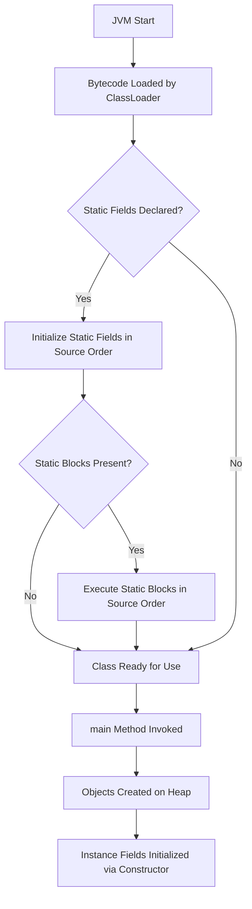
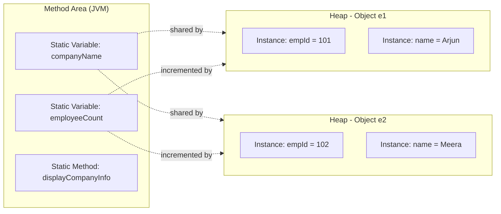
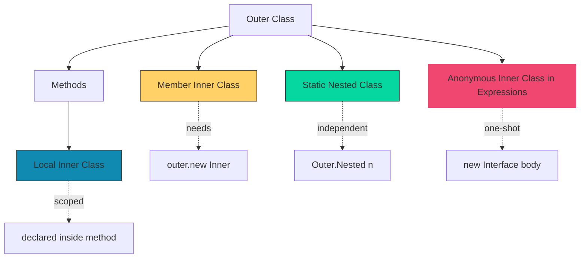
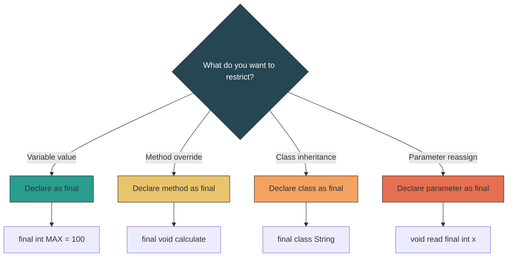
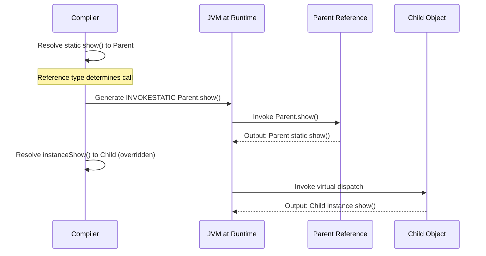

# Static Members, Final Variables, Inner Classes

<!-- SECTION_1_START -->
# Module 2: Polymorphism, Inheritance & Static Members
## Topic: Static Members, Final Variables, and Inner Classes

### 1.1 Static Members — The "Shared Whiteboard" of a Class

> [!IMPORTANT]
> **Formal Definition (KTU 2024 Syllabus Terminology):**
> A **static member** (variable or method) is a class-level entity that belongs to the **class itself** rather than to any individual object (instance). It is declared using the `static` keyword and is stored in the **Method Area** of the JVM memory, shared across all instances of the class.

> [!NOTE]
> **Intuitive Analogy — "The Class Notice Board":**
> Imagine a classroom. Every student (object) has their **own** notebook, pen, and bag (instance variables). But the **notice board on the wall** is common to all students — when the principal posts a circular, *every* student reads the *same* notice. That notice board is the **static variable**. Similarly, a static method is like a **common calculator kept on the teacher's table** — anyone can use it without owning it.

| Property | Instance Member | Static Member |
| :--- | :--- | :--- |
| Belongs to | Object (instance) | Class |
| Memory Location | Heap (per object) | Method Area (single copy) |
| Number of Copies | One per object | **Exactly one per class** |
| Access | Via object reference | Via class name (recommended) |
| Lifetime | Until object is GC'd | Until class is unloaded |

---

### 1.2 Final Variables — The "Engraved on Stone" Concept

> [!IMPORTANT]
> **Formal Definition:**
> The `final` keyword in Java is a **non-access modifier** used to restrict modification. When applied to:
> - **Variable** → value cannot be reassigned (acts as a constant).
> - **Method** → cannot be overridden by subclasses.
> - **Class** → cannot be extended (subclassed).
> - **Parameter** → cannot be reassigned within the method body.

> [!NOTE]
> **Intuitive Analogy — "Engraved vs. Written":**
> A name written on a **chalkboard** can be erased and rewritten (ordinary variable). A name **engraved on a stone tablet** cannot be changed — that is a `final` variable. A `final` method is like a **company policy frozen in the employee handbook** — no department can rewrite it. A `final` class is like a **sealed patent** — no one can build a derivative of it.

---

### 1.3 Inner Classes — The "Class within a Class" Paradigm

> [!IMPORTANT]
> **Formal Definition:**
> An **Inner Class** (or **nested class**) is a class defined within the body of another class. Java supports **four** types, each with distinct scoping, accessibility, and instantiation rules:
> 1. **Member Inner Class** (non-static nested class)
> 2. **Static Nested Class**
> 3. **Local Inner Class** (defined inside a method/block)
> 4. **Anonymous Inner Class** (declared and instantiated in a single expression)

> [!NOTE]
> **Intuitive Analogy — "Rooms inside a House":**
> Think of the outer class as a **house**. A *static nested class* is a **detached garage** with its own entrance (no reference to the house needed). A *member inner class* is a **bedroom** that requires the house to exist (needs an outer reference). A *local inner class* is a **temporary pop-up tent** erected only when a method runs. An *anonymous inner class* is a **firework** — used once for a single burst and discarded.

> [!VISUALIZATION CONTROL]
> **Concept:** Memory layout showing static vs instance storage
> **GeoGebra / Desmos Input Equations:**
> * Static region: `$y = C_{static}$` (horizontal line — single shared value)
> * Instance region: `$y = x_i$` for $i = 1, 2, 3$ (three separate slopes — one per object)
> **Visual Description:** The horizontal line represents one static field in the **Method Area**; the diverging lines represent three independent instance fields in the **Heap** — one per object reference.
<!-- SECTION_1_END -->

<!-- SECTION_2_START -->
## 2. Deep Theoretical Analysis & KTU High-Yield Formula Sheet

### 2.1 Static Variables — Class-Level State

A `static` variable is initialized:
- At **class loading time** (before any object is created).
- In the **declaration order** in which they appear in the source file.
- Exactly **once** per ClassLoader, regardless of how many objects are created.

**Why use static variables?**
- To share a common value across all objects (e.g., a counter for instances, a configuration constant).
- To save memory when the same value would otherwise be duplicated in every object.

### 2.2 Static Methods — Class-Level Behaviour

Key restrictions enforced by the compiler:
- A static method **cannot** use `this` or `super` keywords (no current object context).
- A static method **cannot directly** call a non-static method or access a non-static field (since those require an instance).
- A static method **can** be overloaded but **cannot be overridden** — it can only be **hidden** (a crucial KTU-favourite distinction).

> [!NOTE]
> **Hidden vs Overridden (Module-2 Polymorphism Bridge):**
> When a subclass declares a static method with the same signature as the parent's static method, the parent's version is **hidden**, not overridden. The call is resolved at **compile time** based on the **reference type** — this is **static binding** (early binding).

### 2.3 Static Block — Ordered Initialization

A `static { }` block runs exactly once when the class is first loaded. Multiple static blocks execute in **source-code order**.

```java
static {
    System.out.println("Block 1");
}
static {
    System.out.println("Block 2");
}
```

Output order: `Block 1` then `Block 2`.

### 2.4 Final Variable Rules

| Declaration Style | Blank Final Allowed? | Must Initialize When? |
| :--- | :--- | :--- |
| `final int x = 10;` | No (already initialized) | At declaration |
| `final int x;` (instance field) | Yes (blank final) | In every constructor |
| `final int x;` (static field) | Yes (blank final) | In a static block |
| `final int x;` (local in method) | Yes | Before first use |

**Reference Final vs Object Final (Critical KTU Point):**
- `final Student s = new Student();` → reference `s` cannot be reassigned, but the **internal state of the Student object** can still be modified.
- This is because `final` protects the **reference (handle)**, not the **object's content**.

### 2.5 Final Methods and Final Classes

- A `final` method **cannot be overridden** in any subclass. It may still be **overloaded** (different parameter list).
- A `final` class **cannot be extended**. Examples in Java SE: `String`, `Math`, `Integer` (all wrapper classes).

### 2.6 Inner Classes — Complete Classification

| Type | Declared Inside | Needs Outer Instance? | Can Access Outer Private? | Compiled File |
| :--- | :--- | :--- | :--- | :--- |
| Member Inner | Class body (non-static) | Yes | Yes | `Outer$Inner.class` |
| Static Nested | Class body (static) | No | Only static members | `Outer$Nested.class` |
| Local Inner | Method / block | Yes (final/effectively-final local vars) | Yes | `Outer$1Local.class` |
| Anonymous | Expression context | Yes | Yes | `Outer$1.class` |

### 2.7 KTU High-Yield Formula Sheet

| Concept | Syntax Rule | Memory / Binding |
| :--- | :--- | :--- |
| Static variable | `static datatype varName;` | Method Area, single copy |
| Static method | `static returnType method(){ }` | Bound at compile time (early) |
| Static block | `static { /* code */ }` | Runs once on class load |
| Final variable | `final datatype NAME = value;` | Stored as constant in CP |
| Final method | `final returnType method(){ }` | No dynamic dispatch |
| Final class | `final class ClassName { }` | Cannot be subclassed |
| Member inner | `class Outer { class Inner { } }` | Holds implicit `Outer.this` |
| Static nested | `class Outer { static class Nested { } }` | Independent class file |
| Local inner | Inside method body | Scope limited to method |
| Anonymous | `new Parent() { /* body */ };` | One-shot subclass |

> [!NOTE]
> **Real-World Engineering Utility:**
> Static members are used in production systems for **shared caches** (`static Map`), **factory methods** (`Integer.valueOf()`), and **utility libraries** (`Math.sqrt()`). Final classes enforce **immutability** (e.g., `String`), which is critical for **thread safety** in concurrent server applications. Inner classes are extensively used in **event-handling frameworks** (AWT/Swing listeners) and **callbacks** in Android UI code.
<!-- SECTION_2_END -->

<!-- SECTION_3_START -->
## 3. Step-by-Step Derivations and Code Implementation

### 3.1 Static Variable & Method — Full Working Demonstration

```java
// File: Employee.java
class Employee {
    // static variable - shared across all Employee objects
    static String companyName = "TechCorp Pvt Ltd";
    static int employeeCount = 0;          // acts as a counter
    
    // instance variables - unique per object
    int empId;
    String name;
    
    // constructor increments the static counter
    Employee(int empId, String name) {
        this.empId = empId;
        this.name = name;
        employeeCount++;                   // mutate shared state
    }
    
    // static method - cannot use 'this' or access non-static fields directly
    static void displayCompanyInfo() {
        System.out.println("Company : " + companyName);
        System.out.println("Total Employees : " + employeeCount);
        // System.out.println(name);        // COMPILE ERROR - needs object
    }
    
    // instance method - can access both static and instance members
    void displayEmployee() {
        System.out.println("ID : " + empId + ", Name : " + name
                           + ", Company : " + companyName);
    }
    
    public static void main(String[] args) {
        // calling static method without creating any object
        Employee.displayCompanyInfo();     // Allowed - via class name
        
        Employee e1 = new Employee(101, "Arjun");
        Employee e2 = new Employee(102, "Meera");
        
        e1.displayEmployee();
        e2.displayEmployee();
        
        Employee.displayCompanyInfo();     // count = 2
    }
}
```

**Execution trace:**
1. Class `Employee` loads → static `companyName` and `employeeCount` are initialized in the **Method Area**.
2. `main()` invokes `displayCompanyInfo()` → prints company name, count = 0.
3. `e1` created → constructor runs, `employeeCount` becomes 1.
4. `e2` created → `employeeCount` becomes 2.
5. Final `displayCompanyInfo()` shows count = 2.

**Output:**
```
Company : TechCorp Pvt Ltd
Total Employees : 0
ID : 101, Name : Arjun, Company : TechCorp Pvt Ltd
ID : 102, Name : Meera, Company : TechCorp Pvt Ltd
Company : TechCorp Pvt Ltd
Total Employees : 2
```

---

### 3.2 Static Block — Execution Order Derivation

```java
class LoadingDemo {
    static int a = initializeA();
    static int b;
    
    static {                                  // static block 1
        System.out.println("Static Block 1 executed. b set to 20");
        b = 20;
    }
    
    static {                                  // static block 2
        System.out.println("Static Block 2 executed. a = " + a + ", b = " + b);
    }
    
    static int initializeA() {
        System.out.println("Static method initializeA() called");
        return 100;
    }
    
    public static void main(String[] args) {
        System.out.println("Inside main(). a = " + a + ", b = " + b);
    }
}
```

**Step-by-step evaluation:**
1. JVM loads `LoadingDemo` class.
2. Encounters `static int a = initializeA();` → calls `initializeA()` → prints "Static method initializeA() called", returns 100.
3. Encounters `static int b;` → default value 0.
4. Executes **Static Block 1** → prints its message, sets b = 20.
5. Executes **Static Block 2** → prints a = 100, b = 20.
6. Enters `main()` → prints a = 100, b = 20.

**Output:**
```
Static method initializeA() called
Static Block 1 executed. b set to 20
Static Block 2 executed. a = 100, b = 20
Inside main(). a = 100, b = 20
```

---

### 3.3 Final Variable, Method, and Class

```java
final class ImmutablePoint {                 // final class - cannot be extended
    private final int x;                     // blank final
    private final int y;
    
    ImmutablePoint(int x, int y) {           // must initialize in every constructor
        this.x = x;
        this.y = y;
    }
    
    final void display() {                   // final method - cannot be overridden
        System.out.println("Point(" + x + ", " + y + ")");
    }
    
    // getter methods - no setter (immutability)
    public int getX() { return x; }
    public int getY() { return y; }
}

public class FinalDemo {
    public static void main(String[] args) {
        final int MAX = 100;                 // local final - cannot reassign
        // MAX = 200;                        // COMPILE ERROR
        
        final ImmutablePoint p = new ImmutablePoint(5, 10);
        p.display();
        // p = new ImmutablePoint(1, 1);    // COMPILE ERROR - reference is final
        // p.x = 99;                         // COMPILE ERROR - x is private + final
    }
    
    // class SubPoint extends ImmutablePoint { }  // COMPILE ERROR - final class
}
```

**Key derivation lines for board exam:**
- `final` on a **primitive** variable → value locked.
- `final` on a **reference** variable → handle locked, but object content mutable.
- `final` on a **method** → no dynamic dispatch (no overriding).
- `final` on a **class** → no inheritance allowed.

---

### 3.4 Inner Classes — All Four Types in One Program

```java
// (1) Member Inner Class
class OuterMember {
    private int outerData = 50;
    
    class MemberInner {
        void show() {
            System.out.println("Member Inner accessing outerData = " + outerData);
        }
    }
}

// (2) Static Nested Class
class OuterStatic {
    private static int staticOuter = 100;
    
    static class StaticNested {
        void show() {
            System.out.println("Static Nested accessing staticOuter = " + staticOuter);
        }
    }
}

// (3) Local Inner Class
class OuterLocal {
    void demoLocal() {
        final int localVar = 25;              // must be final or effectively final
        
        class LocalInner {                    // defined inside method
            void show() {
                System.out.println("Local Inner accessing localVar = " + localVar);
            }
        }
        
        LocalInner li = new LocalInner();
        li.show();
    }
}

// (4) Anonymous Inner Class - implementing an interface on the fly
interface Greeting {
    void sayHello(String name);
}

public class InnerClassShowcase {
    public static void main(String[] args) {
        // (1) Member Inner - needs an outer object
        OuterMember outer = new OuterMember();
        OuterMember.MemberInner mi = outer.new MemberInner();
        mi.show();
        
        // (2) Static Nested - no outer object needed
        OuterStatic.StaticNested sn = new OuterStatic.StaticNested();
        sn.show();
        
        // (3) Local Inner - invoked by calling the method
        new OuterLocal().demoLocal();
        
        // (4) Anonymous Inner Class - inline implementation
        Greeting g = new Greeting() {
            @Override
            public void sayHello(String name) {
                System.out.println("Hello, " + name + " from Anonymous class!");
            }
        };
        g.sayHello("KTU Student");
    }
}
```

**Output:**
```
Member Inner accessing outerData = 50
Static Nested accessing staticOuter = 100
Local Inner accessing localVar = 25
Hello, KTU Student from Anonymous class!
```

**Compiled `.class` files produced:**
- `OuterMember$MemberInner.class`
- `OuterStatic$StaticNested.class`
- `OuterLocal$1LocalInner.class`
- `InnerClassShowcase$1.class` (the anonymous class)

---

### 3.5 Static Method Hiding vs Overriding (Polymorphism Bridge)

```java
class Parent {
    static void show() {
        System.out.println("Parent static show()");
    }
    void instanceShow() {
        System.out.println("Parent instance show()");
    }
}

class Child extends Parent {
    static void show() {                     // HIDING (not overriding) static
        System.out.println("Child static show()");
    }
    @Override
    void instanceShow() {                    // true OVERRIDING
        System.out.println("Child instance show()");
    }
}

public class HideVsOverride {
    public static void main(String[] args) {
        Parent p = new Child();
        p.show();                            // compile-time binding: Parent.show()
        p.instanceShow();                    // runtime binding : Child.instanceShow()
    }
}
```

**Output:**
```
Parent static show()
Child instance show()
```

This is a classic **KTU Module 2** question that tests the student's grasp of **early vs late binding**.
<!-- SECTION_3_END -->

<!-- SECTION_4_START -->
## 4. Structural Diagrams & Schematics

### 4.1 Class Loading and Static Initialization Sequence



### 4.2 Static vs Instance Memory Architecture



### 4.3 Inner Class Hierarchy and Access Rules



### 4.4 Final Keyword Decision Matrix



### 4.5 Static Method Resolution: Compile-Time vs Runtime


<!-- SECTION_4_END -->

<!-- SECTION_5_START -->
## 5. KTU 2024 Scheme Examination Question Bank & Topic Recap

### Part A — Short Answer Questions (3 Marks Each)

---

**Q1. [KTU University Exam — July 2024]**
*Differentiate between static variables and instance variables in Java. Give one example for each. (3 Marks, CO2, Understand)*

**Model Answer:**

| Aspect | Static Variable | Instance Variable |
| :--- | :--- | :--- |
| Declaration | `static int count;` | `int count;` |
| Belongs to | Class | Object |
| Memory | Method Area (one copy) | Heap (one per object) |
| Access | `ClassName.var` or `obj.var` | `obj.var` only |
| Lifetime | Until class is unloaded | Until object is GC'd |
| Default value | Initialized at class load | Initialized at object creation |

**[Valuation Key Points: Defining static variable: 1 Mark | Defining instance variable: 1 Mark | Memory/access difference: 1 Mark]**

---

**Q2. [KTU University Exam — Dec 2023]**
*What is a `final` class in Java? Can a `final` class be inherited? Give one example of a final class from the Java standard library. (3 Marks, CO2, Remember)*

**Model Answer:**
- A class declared with the `final` keyword is called a **final class**.
- A final class **cannot be inherited** (cannot be subclassed). Any attempt to extend it causes a compile-time error: `cannot inherit from final class`.
- Example: The `java.lang.String` class is declared as `final class String`, which is why it is **immutable** and safe for use as a key in `HashMap`.

```java
final class MyConfig { /* ... */ }
// class SubConfig extends MyConfig { }  // COMPILE ERROR
```

**[Valuation Key Points: Definition of final class: 1 Mark | Cannot be inherited explanation: 1 Mark | Example: 1 Mark]**

---

### Part B — Long Answer Questions (14 Marks Each)

> [!NOTE]
> **KTU Pattern:** Each Part-B question carries two sub-parts (a) and (b), each of 7 marks. Both are mandatory under the internal-choice pattern; the student answers EITHER the entire **Question A** OR the entire **Question B**.

---

### **Question A (14 Marks)** — [KTU University Exam — July 2024 Model]

**(a)** Explain the four types of inner classes in Java with suitable code snippets. Mention the syntax for instantiating each. **(7 Marks, CO2, Understand)**

**Model Solution:**

**1. Member Inner Class:**
Defined inside another class **without** the `static` keyword. It has access to all members (including private) of the outer class and holds an implicit reference to the outer object.

```java
class CPU {
    int cores = 8;
    class Processor {                        // Member inner class
        void info() {
            System.out.println("Cores: " + cores);  // accesses outer private
        }
    }
}
// Instantiation: CPU cpu = new CPU();
//                CPU.Processor p = cpu.new Processor();
```

**2. Static Nested Class:**
Declared with the `static` modifier. It can access **only static** members of the outer class and does **not** need an outer instance.

```java
class Network {
    static int version = 5;
    static class Protocol {                 // Static nested class
        void show() { System.out.println("Version: " + version); }
    }
}
// Instantiation: Network.Protocol p = new Network.Protocol();
```

**3. Local Inner Class:**
Declared inside a method, constructor, or initializer block. Its scope is limited to that block and can access only `final` or **effectively final** local variables.

```java
void register() {
    int id = 7;                             // effectively final
    class RegForm {                         // Local inner class
        void print() { System.out.println(id); }
    }
    new RegForm().print();
}
```

**4. Anonymous Inner Class:**
A class declared and instantiated in a **single expression**, typically to provide a one-time implementation of an interface or extension of a class.

```java
Runnable r = new Runnable() {
    @Override public void run() { System.out.println("Running"); }
};
new Thread(r).start();
```

**[Valuation Key Points: Naming 4 types: 1 Mark | Member Inner code: 2 Marks | Static Nested code: 2 Marks | Local + Anonymous: 2 Marks]**

---

**(b)** Write a Java program to demonstrate:
- A `static` variable acting as a counter for the number of objects created.
- A `static` method that displays the counter value.
- A `static` block that initializes a `static final` constant.

Show the order of execution using appropriate print statements. **(7 Marks, CO2, Apply)**

**Model Solution:**

```java
class StudentRecord {
    static final String INSTITUTE_NAME;      // blank static final
    static int objectCount = 0;              // static counter
    
    static {                                // static block
        INSTITUTE_NAME = "KTU Kerala";
        System.out.println("[Static Block] Institute initialized to: " + INSTITUTE_NAME);
    }
    
    StudentRecord(String name) {
        System.out.println("[Constructor] Creating record for " + name);
        objectCount++;
    }
    
    static void displayCount() {
        System.out.println("[Static Method] Total records created: " + objectCount);
    }
    
    public static void main(String[] args) {
        System.out.println("[Main] Starting program");
        StudentRecord.displayCount();        // count = 0
        StudentRecord s1 = new StudentRecord("Arjun");
        StudentRecord s2 = new StudentRecord("Meera");
        StudentRecord.displayCount();        // count = 2
    }
}
```

**Output:**
```
[Static Block] Institute initialized to: KTU Kerala
[Main] Starting program
[Static Method] Total records created: 0
[Constructor] Creating record for Arjun
[Constructor] Creating record for Meera
[Static Method] Total records created: 2
```

**Execution-order derivation:**
1. Class `StudentRecord` loads → static block runs first.
2. `objectCount` initialized to 0.
3. `main()` executes → calls `displayCount()` (count = 0).
4. `s1` constructed → `objectCount` becomes 1.
5. `s2` constructed → `objectCount` becomes 2.
6. Final `displayCount()` prints 2.

**[Valuation Key Points: Static counter logic: 2 Marks | Static method: 1 Mark | Static block initialization: 2 Marks | Correct output/trace: 2 Marks]**

---

### **Question B (14 Marks)** — Alternative Choice

**(a)** What is a `final` variable? Explain the concept of a *blank final variable*. How is a blank final instance variable different from a blank final static variable in terms of initialization? Write a Java program that demonstrates both. **(7 Marks, CO2, Understand)**

**Model Solution:**

**Definition:** A `final` variable is one whose value **cannot be changed** once assigned. It acts as a constant.

**Blank Final Variable:** A blank final is a `final` variable that is **declared without an initial value**. It must be initialized exactly once before use.

| Type | Initialization Location | Allowed Times |
| :--- | :--- | :--- |
| Blank final instance variable | Constructor (or instance initializer) | Once per object |
| Blank final static variable | Static block (or inline at declaration) | Once per class |

```java
class Constants {
    final int instanceId;                   // blank final instance
    static final double PI_VALUE;           // blank final static
    
    static {                                // static block initializes blank static final
        PI_VALUE = 3.14159;
    }
    
    Constants(int id) {                     // every constructor must initialize blank instance final
        this.instanceId = id;
    }
    
    void show() {
        System.out.println("Instance ID : " + instanceId);
        System.out.println("PI Value    : " + PI_VALUE);
    }
    
    public static void main(String[] args) {
        new Constants(101).show();
        new Constants(102).show();
    }
}
```

**Key derivation:** Even though `instanceId` is blank final, each object gets its own constant value assigned in the constructor. `PI_VALUE`, however, is initialized **once per class** in the static block and shared.

**[Valuation Key Points: Final variable definition: 1 Mark | Blank final concept: 2 Marks | Difference table/code: 2 Marks | Working program: 2 Marks]**

---

**(b)** Discuss the difference between **method overriding** and **method hiding** in Java with respect to static and instance methods. Provide a code example that proves that static methods are bound at compile time, while instance methods are bound at runtime. **(7 Marks, CO2, Apply)**

**Model Solution:**

| Aspect | Method Overriding | Method Hiding |
| :--- | :--- | :--- |
| Applicable to | Instance methods | Static methods |
| Binding | Runtime (dynamic dispatch) | Compile time (static binding) |
| Polymorphism | Achieved (runtime) | Not achieved |
| Reference type vs Object type | Object type decides | Reference type decides |
| Keyword | `@Override` (recommended) | No special annotation |

**Proof of binding behaviour:**

```java
class Super {
    static void staticMethod()  { System.out.println("Super static"); }
    void instanceMethod()       { System.out.println("Super instance"); }
}

class Sub extends Super {
    static void staticMethod()  { System.out.println("Sub static"); }      // HIDING
    @Override void instanceMethod() { System.out.println("Sub instance"); } // OVERRIDE
}

public class BindingProof {
    public static void main(String[] args) {
        Super ref = new Sub();              // super-typed ref, sub-typed object
        
        ref.staticMethod();                 // Compile-time: Super.staticMethod()  -> "Super static"
        ref.instanceMethod();               // Runtime: Sub.instanceMethod()     -> "Sub instance"
    }
}
```

**Output:**
```
Super static
Sub instance
```

**Derivation:**
- The compiler resolves `ref.staticMethod()` based on the **declared type** `Super` → "Super static".
- The JVM at runtime dispatches `ref.instanceMethod()` based on the **actual object** `Sub` → "Sub instance".
- This proves that **static methods are resolved at compile time** (early binding) and **instance methods at runtime** (late binding / dynamic dispatch).

**[Valuation Key Points: Definitions: 2 Marks | Table comparison: 2 Marks | Code demonstrating both: 2 Marks | Output explanation: 1 Mark]**

---

> [!WARNING]
> **KTU Examiner's Valuation Warning — Common Pitfalls:**
> 1. **Do NOT confuse method hiding with method overriding.** Static methods are **never** overridden — they are hidden. Writing `@Override` on a static method is a compile-time error.
> 2. **Final references vs final objects.** `final Student s = new Student();` does NOT make the Student immutable — only the reference is locked. Students often lose 2 marks here by stating the opposite.
> 3. **Blank final instance variables must be initialized in EVERY constructor** of the class, not just one. If a class has 3 constructors, all 3 must assign the blank final.
> 4. **Static nested class does NOT need an outer instance.** Writing `outer.new Nested()` for a static nested class is a syntax error and costs 1–2 marks.
> 5. **Anonymous inner classes cannot have explicit constructors** because they have no name. Initialization is done via an instance initializer block instead.
> 6. **Local inner classes can only access `final` or effectively final local variables.** Mutating a local variable accessed by a local inner class is a compile-time error in Java 8+.

---

### 📌 Topic Recap & Important Things to Remember

- ✅ **Static variable** = one shared copy in the Method Area; accessible via `ClassName.variable`.
- ✅ **Static method** = cannot use `this`/`super`, cannot directly call non-static members, bound at compile time.
- ✅ **Static block** = runs once at class load, executes in source order, used to initialize static finals.
- ✅ **Final variable** = value cannot be reassigned; **final reference** means handle is locked, not the object content.
- ✅ **Blank final instance variable** = must be initialized in every constructor; **blank final static variable** = must be initialized in a static block.
- ✅ **Final method** = cannot be overridden, but CAN be overloaded.
- ✅ **Final class** = cannot be extended. Examples: `String`, `Math`, all wrapper classes.
- ✅ **Member inner class** = non-static nested, needs outer instance, holds implicit `Outer.this`.
- ✅ **Static nested class** = independent of outer instance, can access only outer static members.
- ✅ **Local inner class** = scoped to the method/block, can access only final or effectively final locals.
- ✅ **Anonymous inner class** = declared and instantiated inline, no name, no constructors, used for one-shot interfaces.
- ✅ **Method hiding** (static) follows **early binding**; **method overriding** (instance) follows **late binding**.
- ✅ Compiled inner classes produce separate `.class` files: `Outer$Inner.class`, `Outer$1.class`, etc.
- ✅ Java is the language — remember that `static` cannot be applied to top-level classes (only nested ones).
<!-- SECTION_5_END -->
