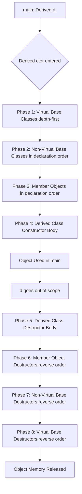
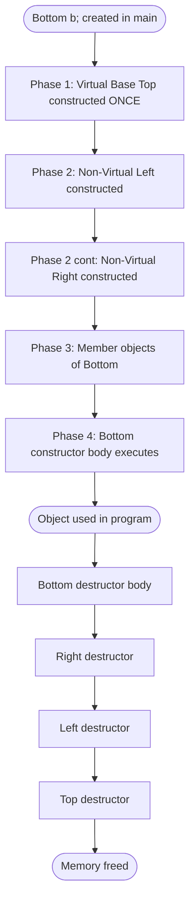
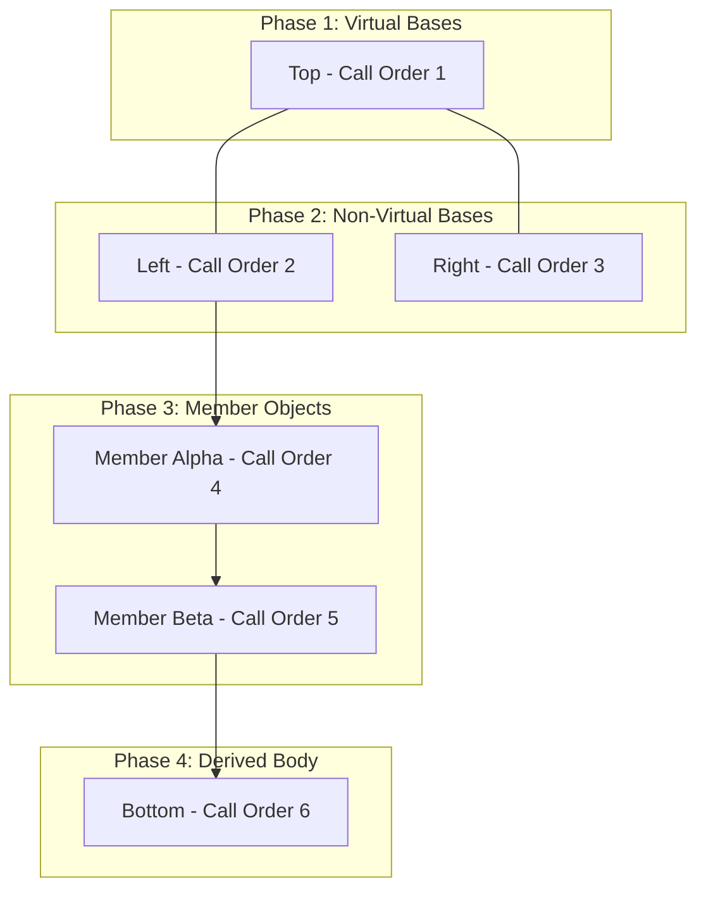
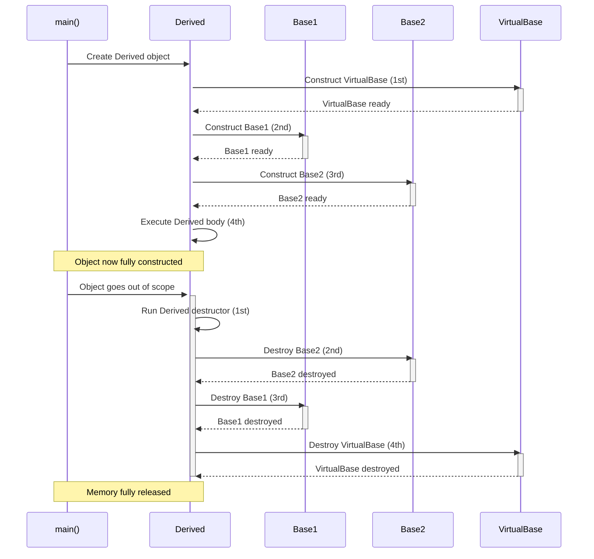

# Calling Order of Constructors

<!-- SECTION_1_START -->
# Calling Order of Constructors — KTU 2024 Scheme (Module 2: Polymorphism)

## 1. Core Technical Definition

> [!NOTE]
> **Constructor Calling Order** refers to the deterministic, well-defined sequence in which constructors of related classes (base, member, and derived) are invoked when an object of a derived class is created. In C++, the compiler guarantees this order regardless of the order in which the base classes or member objects appear in the derived class declaration.

In the context of **Object Oriented Programming (OOP)** under the KTU 2024 B.Tech CSE syllabus, the rule states:

1. **Base class constructors are executed before the derived class constructor body.**
2. **Member objects (composition) are constructed in the order of their declaration** within the class — *not* in the order they appear in the initializer list of the constructor.
3. **Destructors are called in exactly the reverse order** of constructor invocation.

The **Rule of Construction Hierarchy** can be summarized as:

$$
\text{Call Order:} \quad \text{Base}_{\text{oldest}} \;\rightarrow\; \text{Base}_{\text{newer}} \;\rightarrow\; \text{Members} \;\rightarrow\; \text{Derived}
$$

$$
\text{ Destruction Order:} \quad \text{Derived} \;\rightarrow\; \text{Members} \;\rightarrow\; \text{Base}_{\text{newer}} \;\rightarrow\; \text{Base}_{\text{oldest}}
$$

---

## 2. Conceptual Analogy / Intuition

> [!IMPORTANT]
> **Real-World Analogy — Building a Multi-Story House:**
> Imagine constructing a **3-story building**:
> - First, the **foundation** is laid → `Base Class` constructor.
> - Then, the **ground floor walls and pillars** → `Intermediate Derived Class` constructor.
> - Finally, the **top floor, roof, and interiors** → `Most Derived Class` constructor.
>
> You **cannot** build the roof before the foundation. Similarly, the C++ compiler always ensures the **most fundamental component** is initialized first, before specializing further.

**Another Analogy — Dressing Up:**
- You wear **undergarments** (base) → then a **shirt** (intermediate) → then a **jacket** (derived).
- When undressing, the **reverse** order applies: jacket → shirt → undergarments.

This is precisely how **destructors** behave — *LIFO* (Last In, First Out) relative to constructor calls.

---

## 3. Visualization Concept (Sequential Timeline)

> [!VISUALIZATION CONTROL]
> **Concept:** A horizontal timeline showing the lifecycle of object construction and destruction across a 3-level inheritance chain.
> **Plot Type:** Step function / staircase graph
> **GeoGebra / Desmos Input Equations:**
> * `f(x) = 0` for `x < 0` (Pre-creation state)
> * `f(x) = 1` for `0 <= x < 1` (Base Class A constructor active)
> * `f(x) = 2` for `1 <= x < 2` (Base Class B constructor active)
> * `f(x) = 3` for `2 <= x < 3` (Member objects constructed)
> * `f(x) = 4` for `3 <= x <= 4` (Derived class C constructor body executing)
> * `f(x) = 4` descending to `0` on the destruction timeline (reverse)
> **Visual Description:** A staircase rising left-to-right during construction (Base→Derived) and a staircase descending right-to-left during destruction (Derived→Base). The **x-axis** is *Time*, and the **y-axis** is *Object Hierarchy Level*.

---

## 4. Why This Matters in C++

> [!TIP]
> The KTU 2024 Scheme emphasizes this concept under **CO2: Apply Object Oriented Programming concepts to design and develop applications using polymorphism**. Constructor ordering ensures:
> - **Inherited members** are safely initialized before derived-class code touches them.
> - **Resource leaks** are avoided (destructors run in reverse, so derived-class cleanup happens first).
> - **Predictable behavior** is maintained in **diamond inheritance** with virtual base classes.
<!-- SECTION_1_END -->

<!-- SECTION_2_START -->
# Deep Theoretical Analysis & KTU High-Yield Cheat Sheet

## 1. The Three Golden Rules of Constructor Calling Order

The C++ standard (ISO/IEC 14882) defines the calling sequence using three ordered phases when a derived class object is instantiated:

### Rule 1 — Virtual Base Classes First (If Any)
If the inheritance graph contains **virtual base classes**, their constructors are invoked **first**, in the order they appear in a **left-to-right depth-first traversal** of the inheritance DAG (Directed Acyclic Graph).

$$
\text{Phase 1:} \quad \text{Virtual Base Classes (depth-first, left-to-right)}
$$

### Rule 2 — Non-Virtual Base Classes Next
Direct **non-virtual base classes** are constructed in the order they appear in the **derived class declaration** (not the initializer list).

$$
\text{Phase 2:} \quad \text{Non-Virtual Base Classes (declaration order)}
$$

### Rule 3 — Member Objects, Then Derived Body
**Non-static data members** (objects) are constructed in the order of their **declaration** in the class. Finally, the **derived class constructor body** executes.

$$
\text{Phase 3:} \quad \text{Member Objects (declaration order)} \;\rightarrow\; \text{Derived Constructor Body}
$$

---

## 2. Order Across Inheritance Types

| Inheritance Type | Constructor Calling Order | KTU Frequency |
| :--- | :--- | :--- |
| **Single Inheritance** | `Base` $\rightarrow$ `Derived` | Very High |
| **Multilevel Inheritance** | `Base` $\rightarrow$ `Intermediate` $\rightarrow$ `Derived` | Very High |
| **Multiple Inheritance** | `Base1` $\rightarrow$ `Base2` $\rightarrow$ `Derived` (declaration order) | High |
| **Hierarchical Inheritance** | `Base` $\rightarrow$ `Derived1` *or* `Base` $\rightarrow$ `Derived2` (independent paths) | Medium |
| **Hybrid (Diamond) Inheritance** | `Virtual Base` $\rightarrow$ `Base1` $\rightarrow$ `Base2` $\rightarrow$ `Derived` | High |
| **Composition (Has-A)** | `Member Object` $\rightarrow$ `Owning Class` body | Very High |

> [!NOTE]
> **Key Insight:** The order in the **initializer list** of the derived constructor does **NOT** affect the calling sequence. Only the **declaration order** matters. The initializer list only controls **which** constructor of the base/member is chosen, not **when** it runs.

---

## 3. Destructor Order — The Mirror Image

| Phase | Construction Order | Destruction Order |
| :--- | :--- | :--- |
| 1 | Virtual Base Class | Derived Class Body |
| 2 | Non-Virtual Base | Member Objects (reverse) |
| 3 | Member Objects | Non-Virtual Base (reverse) |
| 4 | Derived Class Body | Virtual Base Class |

The destruction sequence is **exactly reversed** because the derived class is logically "built on top of" the base. The base class's resources must remain valid until the derived class is done using them.

---

## 4. Real-World Engineering Utility

> [!IMPORTANT]
> **Where this matters in production systems:**
> - **GUI Frameworks (Qt, MFC):** Window widgets are constructed only after the parent window base is fully initialized.
> - **Database Connection Pools:** Base `Connection` object opens the socket; derived `PooledConnection` wraps it — connection must exist before pooling logic runs.
> - **Game Engines (Unreal, Unity Native Plugins):** Actor components initialize in dependency order to avoid null-pointer dereferences.
> - **Embedded Systems:** Hardware drivers inherit from a base `Device` class; the device must be powered on (base ctor) before the driver logic (derived ctor) can configure it.

---

## 5. KTU Formula Sheet / Quick Reference

| # | Concept | Rule | Mnemonic |
| :--- | :--- | :--- | :--- |
| 1 | Virtual Base | Constructed **first**, depth-first, left-to-right | "Virtuals Vanguard" |
| 2 | Non-Virtual Base | Declaration order, **not** initializer list order | "Declaration Decides" |
| 3 | Member Objects | Constructed in **declaration** order | "Declare, Don't Dictate" |
| 4 | Derived Body | Runs **last** in construction | "Last to Live" |
| 5 | Destructors | Strict **reverse** of construction | "Mirror Mirror" |
| 6 | Initializer List | Affects **choice** of ctor, not **order** | "Choose, Not Chronology" |
<!-- SECTION_2_END -->

<!-- SECTION_3_START -->
# Step-by-Step Derivations & Code Implementation

## 1. Worked Example 1 — Single Inheritance (Foundational Case)

### Problem Statement
Trace the constructor calling order for the following C++ program and predict the output.

### Source Code (Fully Typed, C++17 Compliant)

```cpp
#include <iostream>
using namespace std;

class Base {
public:
    Base() {
        cout << "[BASE]     Constructor invoked." << endl;
    }
    ~Base() {
        cout << "[BASE]     Destructor  invoked." << endl;
    }
};

class Derived : public Base {
public:
    Derived() {
        cout << "[DERIVED]  Constructor invoked." << endl;
    }
    ~Derived() {
        cout << "[DERIVED]  Destructor  invoked." << endl;
    }
};

int main() {
    cout << "--- Object Creation ---" << endl;
    Derived d;
    cout << "--- Object Destruction ---" << endl;
    return 0;
}
```

### Step-by-Step Execution Trace

| Step | Event | Active Class | Output Line |
| :---: | :--- | :--- | :--- |
| 1 | `main()` calls `Derived d;` | — | `--- Object Creation ---` |
| 2 | Compiler sees `Derived` inherits from `Base` | Pre-processing | (internal) |
| 3 | `Base()` default constructor runs first | `Base` | `[BASE]     Constructor invoked.` |
| 4 | `Base` ctor body completes, control returns to `Derived` ctor | Transition | (internal) |
| 5 | `Derived()` constructor body executes | `Derived` | `[DERIVED]  Constructor invoked.` |
| 6 | Object usage phase | — | `--- Object Destruction ---` |
| 7 | `d` goes out of scope, `~Derived()` invoked first | `Derived` | `[DERIVED]  Destructor  invoked.` |
| 8 | After `Derived` body, `~Base()` invoked | `Base` | `[BASE]     Destructor  invoked.` |

### Predicted Console Output

```
--- Object Creation ---
[BASE]     Constructor invoked.
[DERIVED]  Constructor invoked.
--- Object Destruction ---
[DERIVED]  Destructor  invoked.
[BASE]     Destructor  invoked.
```

> [!TIP]
> **Observation:** Construction is **Bottom-Up** (Base first, then Derived). Destruction is **Top-Down** (Derived first, then Base). This is the **defining behavior** of C++ inheritance lifecycle.

---

## 2. Worked Example 2 — Multilevel Inheritance (3 Levels)

### Source Code

```cpp
#include <iostream>
using namespace std;

class Grandparent {
public:
    Grandparent() { cout << "Grandparent ctor" << endl; }
    ~Grandparent() { cout << "Grandparent dtor" << endl; }
};

class Parent : public Grandparent {
public:
    Parent() { cout << "Parent      ctor" << endl; }
    ~Parent() { cout << "Parent      dtor" << endl; }
};

class Child : public Parent {
public:
    Child() { cout << "Child       ctor" << endl; }
    ~Child() { cout << "Child       dtor" << endl; }
};

int main() {
    Child c;
    return 0;
}
```

### Step-by-Step Trace

| Step | Action | Active Constructor |
| :---: | :--- | :--- |
| 1 | `Child c;` triggers deepest derived class instantiation | `Child` ctor entry |
| 2 | Compiler walks up the chain: `Child` $\rightarrow$ `Parent` $\rightarrow$ `Grandparent` | — |
| 3 | **Oldest ancestor constructed first** | `Grandparent` |
| 4 | Middle layer constructed | `Parent` |
| 5 | Innermost derived class body runs | `Child` |
| 6 | Destruction begins when `c` goes out of scope | `Child` dtor |
| 7 | Then `Parent` dtor | `Parent` |
| 8 | Finally `Grandparent` dtor | `Grandparent` |

### Output

```
Grandparent ctor
Parent      ctor
Child       ctor
Child       dtor
Parent      dtor
Grandparent dtor
```

---

## 3. Worked Example 3 — Multiple Inheritance (Declaration Order Dominates)

### Source Code

```cpp
#include <iostream>
using namespace std;

class BaseOne {
public:
    BaseOne() { cout << "BaseOne   ctor" << endl; }
    ~BaseOne() { cout << "BaseOne   dtor" << endl; }
};

class BaseTwo {
public:
    BaseTwo() { cout << "BaseTwo   ctor" << endl; }
    ~BaseTwo() { cout << "BaseTwo   dtor" << endl; }
};

class Derived : public BaseOne, public BaseTwo {
public:
    Derived() { cout << "Derived   ctor" << endl; }
    ~Derived() { cout << "Derived   dtor" << endl; }
};

int main() {
    Derived d;
    return 0;
}
```

### Critical Analysis

Notice the **declaration order** in line `class Derived : public BaseOne, public BaseTwo`. The compiler constructs `BaseOne` first, then `BaseTwo`, **regardless** of how the initializer list is written.

If we had written:

```cpp
Derived() : BaseTwo(), BaseOne() { /* ... */ }
```

…the order would **still be** `BaseOne` $\rightarrow$ `BaseTwo`, because **declaration order wins**.

### Output

```
BaseOne   ctor
BaseTwo   ctor
Derived   ctor
Derived   dtor
BaseTwo   dtor
BaseOne   dtor
```

---

## 4. Worked Example 4 — Hybrid (Diamond) Inheritance with Virtual Base

### Source Code

```cpp
#include <iostream>
using namespace std;

class Top {
public:
    Top() { cout << "Top        ctor" << endl; }
    ~Top() { cout << "Top        dtor" << endl; }
};

class Left : virtual public Top {
public:
    Left() { cout << "Left       ctor" << endl; }
    ~Left() { cout << "Left       dtor" << endl; }
};

class Right : virtual public Top {
public:
    Right() { cout << "Right      ctor" << endl; }
    ~Right() { cout << "Right      dtor" << endl; }
};

class Bottom : public Left, public Right {
public:
    Bottom() { cout << "Bottom     ctor" << endl; }
    ~Bottom() { cout << "Bottom     dtor" << endl; }
};

int main() {
    Bottom b;
    return 0;
}
```

### Step-by-Step Logical Derivation

| Step | Rule Applied | Active Class |
| :---: | :--- | :--- |
| 1 | **Phase 1 (Virtual Base):** `Top` is a virtual base, constructed first | `Top` |
| 2 | **Phase 2 (Non-Virtual Bases):** `Left` (declared first in `Bottom`) | `Left` |
| 3 | `Right` (declared second in `Bottom`) | `Right` |
| 4 | **Phase 3 (Derived body):** `Bottom` ctor body | `Bottom` |
| 5 | Destruction: `Bottom` dtor | `Bottom` |
| 6 | Then `Right` dtor (reverse of construction) | `Right` |
| 7 | Then `Left` dtor | `Left` |
| 8 | Finally `Top` dtor | `Top` |

### Output

```
Top        ctor
Left       ctor
Right      ctor
Bottom     ctor
Bottom     dtor
Right      dtor
Left       dtor
Top        dtor
```

> [!IMPORTANT]
> **Why `Top` appears only once?** Because it is a **virtual base class**. Without `virtual`, the output would show `Top` constructed **twice** — once for `Left`'s path and once for `Right`'s path — leading to the infamous **Diamond Problem** and ambiguity.

---

## 5. Worked Example 5 — Composition (Has-A Relationship)

### Source Code

```cpp
#include <iostream>
using namespace std;

class Engine {
public:
    Engine() { cout << "Engine     ctor" << endl; }
    ~Engine() { cout << "Engine     dtor" << endl; }
};

class Wheel {
public:
    Wheel() { cout << "Wheel      ctor" << endl; }
    ~Wheel() { cout << "Wheel      dtor" << endl; }
};

class Car {
private:
    Engine e;    // Declared FIRST
    Wheel  w;    // Declared SECOND
public:
    Car() { cout << "Car        ctor" << endl; }
    ~Car() { cout << "Car        dtor" << endl; }
};

int main() {
    Car myCar;
    return 0;
}
```

### Logical Reasoning

1. `Car` has two member objects: `Engine e` and `Wheel w`.
2. They are constructed in **declaration order** — `e` first, then `w`.
3. Then `Car`'s own constructor body runs.
4. Destruction happens in **reverse** — `Car` dtor, then `Wheel`, then `Engine`.

### Output

```
Engine     ctor
Wheel      ctor
Car        ctor
Car        dtor
Wheel      dtor
Engine     dtor
```

---

## 6. Worked Example 6 — Combined Inheritance + Composition

### Source Code

```cpp
#include <iostream>
using namespace std;

class Sensor {
public:
    Sensor() { cout << "Sensor     ctor" << endl; }
    ~Sensor() { cout << "Sensor     dtor" << endl; }
};

class Vehicle {
public:
    Vehicle() { cout << "Vehicle    ctor" << endl; }
    ~Vehicle() { cout << "Vehicle    dtor" << endl; }
};

class Car : public Vehicle {
private:
    Sensor s;
public:
    Car() { cout << "Car        ctor" << endl; }
    ~Car() { cout << "Car        dtor" << endl; }
};

int main() {
    Car c;
    return 0;
}
```

### Analytical Trace

| Phase | Class Invoked | Reasoning |
| :---: | :--- | :--- |
| 1 | `Vehicle` | Base class always first (Rule 1) |
| 2 | `Sensor` | Member object, declared in `Car` |
| 3 | `Car` | Derived class body, runs last |
| 4 | `Car` | Destructor: derived first |
| 5 | `Sensor` | Reverse member order |
| 6 | `Vehicle` | Base class destructor last |

### Output

```
Vehicle    ctor
Sensor     ctor
Car        ctor
Car        dtor
Sensor     dtor
Vehicle    dtor
```

> [!TIP]
> **Mnemonic — "Base Before Birth":** A derived class cannot exist logically before its base. Hence, all bases and members are constructed **before** the derived class body executes.
<!-- SECTION_3_END -->

<!-- SECTION_4_START -->
# Structural Diagrams & Schematics

## 1. Constructor Calling Order — Topological Flow



---

## 2. Diamond Inheritance — Phased Construction View



---

## 3. Inheritance Hierarchy Map with Call Indices



---

## 4. Construction vs Destruction Mirror Diagram



---

## 5. Block-Level Functional Architecture — Order Resolution Engine

```mermaid
flowchart LR
    A[Source Code Scanner] --> B[Parse Inheritance Graph]
    B --> C[Identify Virtual Bases]
    C --> D[Identify Non-Virtual Bases]
    D --> E[Identify Member Objects]
    E --> F[Sort Bases by Declaration Order]
    F --> G[Sort Members by Declaration Order]
    G --> H[Build Call Sequence Vector]
    H --> I[Emit Constructor Calls in Order]
    I --> J[Emit Destructor Calls in Reverse]
```


<!-- SECTION_4_END -->

<!-- SECTION_5_START -->
# KTU 2024 Scheme Examination Question Bank

> [!NOTE]
> All questions below are mapped to **Course Outcome CO2** (Apply OOP concepts using polymorphism) and use Revised Bloom's Taxonomy cognitive levels as per KTU 2024 Scheme directives.

---

## Part A — Short Answer Questions (3 Marks Each)

### Question 1: Concept Recall
**[KTU University Exam — July 2024, CO2, Remember/Understand, 3 Marks]**

> Define the term **"Constructor Calling Order"** in C++. State the rule that governs the order of construction for member objects within a derived class.

**Model Answer (Board Key Pattern):**

> **Constructor Calling Order** is the predefined sequence in which C++ invokes constructors of base classes, member objects, and the derived class itself when an object of a derived class is created. **[1 Mark]**
>
> **Rule for Member Objects:** The member objects are constructed in the **order of their declaration** within the class definition, not in the order in which they are listed in the constructor's initializer list. **[2 Marks]**
>
> *(Validation Note: Examiners specifically look for the phrase "declaration order" and the clarification that the initializer list does not affect order — only choice of constructor.)*

---

### Question 2: Destructor Symmetry
**[KTU University Exam — Dec 2023, CO2, Understand, 3 Marks]**

> Explain why destructors are called in the **reverse order** of constructors in a C++ inheritance hierarchy. Illustrate with a one-line code example.

**Model Answer:**

> Destructors are called in the reverse order of constructors because a **derived class logically depends on its base class**. The derived class's resources must be released *first* (top-down), while the base class's resources must remain valid until the derived class is done with them. **[2 Marks]**
>
> **Illustration:** In a class `Derived : public Base`, if `Base` were destroyed before `Derived`, any virtual function calls or member access in `Derived::~Derived()` would lead to **undefined behavior**. **[1 Mark]**

---

## Part B — Long Answer Questions (14 Marks Each, Module Internal Choice)

### Question A — 14 Marks
**[KTU University Exam — Model Question, CO2, Apply/Analyze, 14 Marks]**

> **(a)** Consider the following C++ program. Predict the **exact output**, including the order of construction and destruction messages, with justification. **[7 Marks]**
>
> **(b)** Modify the program to introduce a **member object** `Battery b` in the `Laptop` class. Re-trace the calling order and explain how the addition of a member object affects the sequence. **[7 Marks]**

#### Given Program

```cpp
#include <iostream>
using namespace std;

class ElectronicDevice {
public:
    ElectronicDevice() { cout << "ElectronicDevice constructed" << endl; }
    ~ElectronicDevice() { cout << "ElectronicDevice destroyed" << endl; }
};

class Computer : public ElectronicDevice {
public:
    Computer() { cout << "Computer constructed" << endl; }
    ~Computer() { cout << "Computer destroyed" << endl; }
};

class Laptop : public Computer {
public:
    Laptop() { cout << "Laptop constructed" << endl; }
    ~Laptop() { cout << "Laptop destroyed" << endl; }
};

int main() {
    Laptop myLaptop;
    return 0;
}
```

#### Model Solution for Part (a) — 7 Marks

| Step | Action | Marks Allocation |
| :---: | :--- | :---: |
| 1 | Identify inheritance: `Laptop` $\rightarrow$ `Computer` $\rightarrow$ `ElectronicDevice` | 1 |
| 2 | Apply Rule 1: Oldest ancestor `ElectronicDevice` constructed first | 1 |
| 3 | Apply Rule 2: Middle `Computer` constructed next | 1 |
| 4 | Apply Rule 3: `Laptop` body runs last | 1 |
| 5 | Destruction: `Laptop` first (reverse) | 1 |
| 6 | Destruction: `Computer` next | 1 |
| 7 | Destruction: `ElectronicDevice` last + final output | 1 |

**Predicted Output:**

```
ElectronicDevice constructed
Computer constructed
Laptop constructed
Laptop destroyed
Computer destroyed
ElectronicDevice destroyed
```

#### Model Solution for Part (b) — 7 Marks

**Modified Class:**

```cpp
class Battery {
public:
    Battery()  { cout << "Battery constructed" << endl; }
    ~Battery() { cout << "Battery destroyed" << endl; }
};

class Laptop : public Computer {
private:
    Battery b;     // Member object
public:
    Laptop()  { cout << "Laptop constructed" << endl; }
    ~Laptop() { cout << "Laptop destroyed" << endl; }
};
```

**Updated Construction Sequence:**

| Order | Class | Reason |
| :---: | :--- | :--- |
| 1 | `ElectronicDevice` | Oldest base class |
| 2 | `Computer` | Intermediate base |
| 3 | `Battery` | Member object (declared in `Laptop`) |
| 4 | `Laptop` | Derived class body executes last |

**Updated Destruction Sequence (Reverse):**

| Order | Class |
| :---: | :--- |
| 1 | `Laptop` |
| 2 | `Battery` |
| 3 | `Computer` |
| 4 | `ElectronicDevice` |

**Updated Output:**

```
ElectronicDevice constructed
Computer constructed
Battery constructed
Laptop constructed
Laptop destroyed
Battery destroyed
Computer destroyed
ElectronicDevice destroyed
```

**[Mark Distribution Hint:** Identifying member object position: 2 Marks; Reconstructing the sequence: 3 Marks; Writing final output: 2 Marks**]**

---

### Question B — 14 Marks (Alternative Choice)
**[KTU University Exam — Model Question, CO2, Apply/Analyze, 14 Marks]**

> **(a)** Write a complete C++ program demonstrating **multiple inheritance** with classes `Printer` and `Scanner` inheriting from a common base `Device`. Show the constructor calling order through `cout` statements. **[7 Marks]**
>
> **(b)** Introduce a **diamond inheritance** scenario by creating a `MultifunctionPrinter` class that inherits from both `Printer` and `Scanner`. Explain the role of the **`virtual` keyword** in resolving ambiguity. Predict the output before and after applying `virtual`. **[7 Marks]**

#### Model Solution for Part (a) — 7 Marks

```cpp
#include <iostream>
using namespace std;

class Device {
public:
    Device()  { cout << "Device      ctor" << endl; }
    ~Device() { cout << "Device      dtor" << endl; }
};

class Printer : public Device {
public:
    Printer()  { cout << "Printer     ctor" << endl; }
    ~Printer() { cout << "Printer     dtor" << endl; }
};

class Scanner : public Device {
public:
    Scanner()  { cout << "Scanner     ctor" << endl; }
    ~Scanner() { cout << "Scanner     dtor" << endl; }
};

class MFP_NoVirtual : public Printer, public Scanner {
public:
    MFP_NoVirtual()  { cout << "MFP         ctor" << endl; }
    ~MFP_NoVirtual() { cout << "MFP         dtor" << endl; }
};

int main() {
    MFP_NoVirtual mfp;
    return 0;
}
```

**Output (Without `virtual`):**

```
Device      ctor        ← from Printer's path
Printer     ctor
Device      ctor        ← from Scanner's path (DUPLICATE!)
Scanner     ctor
MFP         ctor
MFP         dtor
Scanner     dtor
Device      dtor        ← second Device destroyed
Printer     dtor
Device      dtor        ← first Device destroyed
```

**Issue:** `Device` is constructed **twice** — once for `Printer`'s lineage and once for `Scanner`'s lineage. This is the **Diamond Problem**.

**[Marks: Correct class hierarchy: 2; Output prediction: 3; Identification of duplicate `Device` construction: 2]**

---

#### Model Solution for Part (b) — 7 Marks

**Fix Using `virtual` Inheritance:**

```cpp
class Printer : virtual public Device { /* ... */ };
class Scanner : virtual public Device { /* ... */ };
class MFP : public Printer, public Scanner { /* ... */ };
```

**Output (With `virtual`):**

```
Device      ctor        ← Constructed ONCE
Printer     ctor
Scanner     ctor
MFP         ctor
MFP         dtor
Scanner     dtor
Printer     dtor
Device      dtor        ← Destroyed ONCE
```

**Explanation of `virtual` keyword:**

| Aspect | Without `virtual` | With `virtual` |
| :--- | :--- | :--- |
| `Device` sub-object count | **2** (one per path) | **1** (shared) |
| Construction calls | Twice | Once (by **most derived** class) |
| Destruction calls | Twice | Once (by **most derived** class) |
| Ambiguity in member access | Yes (`d.member` is ambiguous) | No |
| Memory overhead | Higher | Optimized |

> [!IMPORTANT]
> **Key Concept:** When a base class is declared `virtual`, the compiler ensures it is constructed **only once**, and that construction is the responsibility of the **most derived class** in the hierarchy. This eliminates the diamond ambiguity.

**[Marks: Modifying declarations: 2; Updated output: 3; Conceptual explanation of `virtual`: 2]**

---

## KTU Examiner's Valuation Warning / Pitfall Callout

> [!WARNING]
> **Common Mistakes Where Students Lose Marks:**
>
> 1. **Confusing initializer-list order with declaration order.** Writing `Derived() : Base2(), Base1()` does **not** make `Base2` construct first. The **declaration order** in the class header is what matters. *— Loss: 2 Marks per occurrence*
>
> 2. **Forgetting destructors in the trace.** Examiners require **both** construction and destruction sequences. Missing the destruction output loses 3-4 marks easily. *— Loss: Up to 4 Marks*
>
> 3. **Stating "constructors are called top-down" — this is WRONG.** It is the **destructors** that are top-down. Constructors are **bottom-up** (base before derived). *— Loss: 2 Marks*
>
> 4. **Missing the role of `virtual` in diamond inheritance.** If the question mentions diamond inheritance, the examiner expects explicit mention of the `virtual` keyword and how it prevents duplicate base construction. *— Loss: 3 Marks*
>
> 5. **Not labeling outputs with their class names.** Always prefix output with the class name (e.g., `[BASE] ctor`). Ambiguous output loses clarity marks. *— Loss: 1 Mark*

---

## Topic Recap & Important Things to Remember

> [!TIP]
> **Rapid Revision Checklist — Calling Order of Constructors (Module 2)**

- **Definition:** The deterministic sequence in which C++ invokes base, member, and derived constructors when a derived object is created. **[Core Concept]**
- **Three Phases of Construction:** (1) Virtual bases, (2) Non-virtual bases in declaration order, (3) Member objects in declaration order, (4) Derived body. **[Must Memorize]**
- **Single Inheritance Order:** `Base` $\rightarrow$ `Derived`. **[High Frequency]**
- **Multilevel Order:** `Base` $\rightarrow$ `Intermediate` $\rightarrow$ `Derived`. **[High Frequency]**
- **Multiple Inheritance Order:** Bases constructed in **declaration order**, not initializer-list order. **[High Frequency]**
- **Diamond Inheritance Fix:** Use `virtual` keyword on intermediate base classes to avoid duplicate construction of the top-most base. **[Frequently Tested]**
- **Destructor Rule:** Destructors execute in **strict reverse order** of construction — derived first, base last. **[Board Favorite]**
- **Initializer List Does NOT Control Order:** It only chooses **which** constructor of a base/member to invoke. The **declaration order** in the class header is what controls the calling sequence. **[Common Trap]**
- **Composition (Has-A):** Member objects are constructed before the owning class's constructor body runs. **[Frequently Tested]**
- **Combined Inheritance + Composition:** Base first, then members, then derived body — destruction reverses this completely. **[Application Level]**
- **Mnemonic — "VBNMD"** (Virtual, Base, Non-virtual, Member, Derived) for construction. Reverse it for destruction: **"DMNBV"**. **[Memory Aid]**
- **Undefined Behavior Warning:** If a base class destructor is **not virtual** and a derived object is deleted through a base pointer, only the base destructor runs, leading to memory leaks. Always make base destructors `virtual` in polymorphic hierarchies. **[Production Pitfall]**
- **KTU Exam Tip:** When asked to "predict the output," always include **both construction and destruction** messages, label them clearly, and add a brief justification of the rule applied. **[Valuation Strategy]**
- **Real-World Mapping:** GUI widgets, database connections, game engine components, embedded device drivers — all rely on the predictable constructor order for safe initialization. **[Application Context]**
<!-- SECTION_5_END -->
