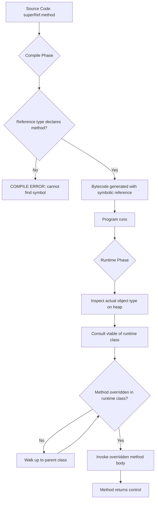
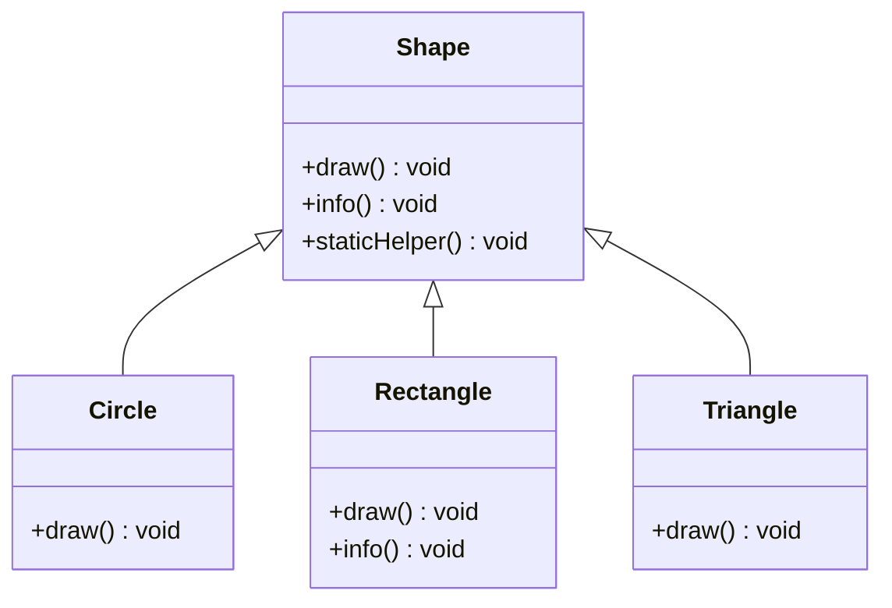
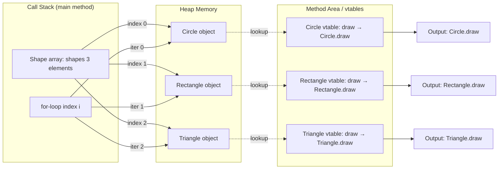
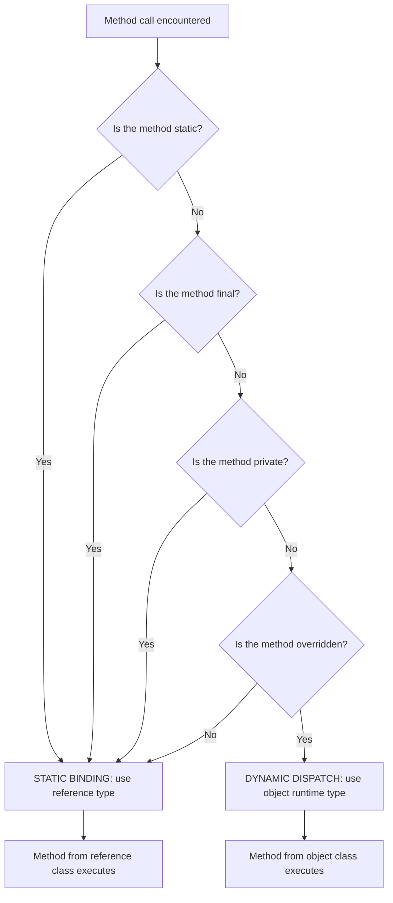

# Dynamic Method Dispatch

<!-- SECTION_1_START -->
# Dynamic Method Dispatch — Core Definition & Intuitive Overview

## 📘 Formal Academic Definition (KTU 2024 Syllabus Terminology)

**Dynamic Method Dispatch** is the mechanism by which a call to an *overridden* method is resolved **at runtime** (not at compile time) based on the **actual type of the object** being referred to, rather than the **declared type of the reference variable**. It is the underlying runtime machinery that enables **Runtime Polymorphism** (also called *Late Binding* or *Dynamic Binding*) in Java.

In the words of the KTU OOP Module-2 syllabus: *"Dynamic Method Dispatch is the process through which a call to an overridden method is resolved at run time, with the type of the object (not the reference) determining which method executes."*

> [!IMPORTANT]
> **Syllabus Highlight (PBCST304 / Module 2):**
> Dynamic Method Dispatch is the *practical mechanism* that makes polymorphism work. Without it, the statement `Parent p = new Child(); p.display();` would always invoke `Parent.display()`. With it, Java invokes `Child.display()` — *the version belonging to the actual object*.

---

## 🧠 Conceptual Analogy — The Universal TV Remote

Imagine a **Universal Remote Control** that has a single button labeled `PLAY`. The remote itself is a generic device (the *reference variable* of type `Remote`). It does not know which player it will control.

| Real-World Element | OOP Counterpart |
|---|---|
| Universal Remote | Reference of type `Parent` (e.g., `Animal a`) |
| DVD / BluRay / Set-Top Box | Actual object (e.g., `Dog`, `Cat`) |
| Single `PLAY` button | Method call (e.g., `a.sound()`) |
| Remote *detects* device at the moment of pressing | **JVM resolves method at runtime** |

When you press `PLAY`, the remote **sends a signal** and the *currently connected device* responds. The remote (reference) does not change — but the *device* (object) does the work. **Dynamic Method Dispatch is exactly this signal**: Java fires the call through the reference, and the *object on the heap* decides which method body runs.

---

## 🎯 Why It Matters — The One-Sentence Takeaway

> **Dynamic Method Dispatch = "The type of the object determines which overridden method runs, decided by the JVM at the moment of execution."**

---

## ⚙️ The Three Hard Prerequisites (Rules of Engagement)

Dynamic dispatch is **not** magic. It activates **only** when **all three** conditions are satisfied:

1. **Inheritance must exist** — a parent–child class relationship.
2. **Method Overriding must exist** — child class must provide its own implementation of an inherited method.
3. **Upcasting** — the reference variable must be of the **parent type**, but must point to a **child object** (e.g., `Animal a = new Dog();`).

> [!WARNING]
> **Common Misconception:** Students often believe *all* methods are dynamically dispatched. This is **false**. Only **overridden instance methods** participate. The following are bound at *compile time*: `static` methods, `final` methods, `private` methods, and constructors.

---

## 🔍 What "Resolve at Runtime" Actually Means

In Java, every method call goes through a two-step journey:

| Step | Phase | What Happens | Binding Type |
|---|---|---|---|
| 1 | **Compile Time** | Compiler checks: *"Does the reference type declare this method?"* If yes → code compiles. | **Static Type Check** |
| 2 | **Runtime** | JVM looks at the **actual object** on the heap, finds the overridden version, and executes it. | **Dynamic Method Dispatch** |

The compiler only checks **accessibility and existence** through the *reference*. The JVM picks the *implementation* through the *object*.

---

## 🗺️ GeoGebra / Mental Visualization — The Reference–Object Split

```
     STACK MEMORY                HEAP MEMORY
 ┌──────────────────┐         ┌──────────────────┐
 │   Animal a       │ ──pts─→│  Dog object      │
 │  (ref type)      │         │  (actual type)   │
 │                  │         │                  │
 │  Reference holds │         │  sound()  ◄────  │  ← JVM picks THIS method
 │  address only    │         │  eat()           │
 └──────────────────┘         └──────────────────┘
                                       │
        Compile-time check:  a.sound() valid?  Yes (Animal declares sound)
        Runtime decision:    which sound()?     Dog's version executes
```

> [!NOTE]
> **Key Insight:** The reference (`Animal a`) is the *contract* — it tells the compiler what calls are legal. The object (`new Dog()`) is the *reality* — it tells the JVM what code actually runs. Dynamic dispatch is the bridge between contract and reality.
<!-- SECTION_1_END -->

<!-- SECTION_2_START -->
# Deep Theoretical Analysis & KTU High-Yield Formula Sheet

## 🧩 Anatomy of Dynamic Method Dispatch — The 5-Step Logic Chain

When you write `superRef.overriddenMethod()`, the following chain fires:

1. **Reference Declaration Check (Compile)**
   The compiler verifies that the *reference type* (left-hand side) declares the method. If absent → **compile-time error**.

2. **Bytecode Generation (Compile)**
   Java does **not** hardcode a call to any specific class's method. Instead, it emits a symbolic reference and a constant-pool entry pointing to a *runtime lookup table*.

3. **Object Type Inspection (Runtime)**
   When the line executes, the JVM inspects the **runtime type** of the object (stored in the object header on the heap).

4. **vtable / Method Table Lookup (Runtime)**
   The JVM walks the class's **virtual method table (vtable)** — a per-class array of method pointers. Starting from the runtime class, it searches up the inheritance chain until it finds the method.

5. **Method Invocation via Pointer (Runtime)**
   The address in the vtable is jumped to, and the selected method body executes.

> [!NOTE]
> **Why "Virtual"?** In C++ terminology, methods that participate in dynamic dispatch are called *virtual methods*. Java methods are **virtual by default** (except `static`, `final`, `private`). This is the *default* OOP behavior in Java — there is no `virtual` keyword needed.

---

## 📐 The Dispatch Decision — Symbolic Form

The dispatch decision can be expressed as a piecewise mapping:

$$
\text{MethodInvoked} = 
\begin{cases}
M_{\text{Parent}} & \text{if no overriding subclass exists for object's runtime type} \\
M_{\text{Child}_k} & \text{if the object's runtime class is } \text{Child}_k \text{ and } M \text{ is overridden there} \\
\end{cases}
$$

Formally, given:
- Reference type $R$ (declared)
- Object runtime type $T$ (actual)
- Method $M$ declared in some ancestor $A$ of $T$

The JVM picks the **most derived** implementation of $M$ starting the search from $T$ and walking up toward $A$.

---

## 📊 KTU Formula Sheet / Cheat Sheet

| # | Concept | Rule | Example | Exam Memory Trick |
|---|---|---|---|---|
| 1 | What is dispatched? | Only **overridden instance** methods | `Dog.sound()` overriding `Animal.sound()` | "**O**verridden **I**nstance = **OI** = Dynamic" |
| 2 | What is *not* dispatched? | `static`, `final`, `private`, constructors, fields (data members) | `Parent.staticMethod()` always runs `Parent` version | "**S**tatic **F**ields **P**rivate = Static-bound" |
| 3 | Reference type vs Object type | Compiler uses **reference**; JVM uses **object** | `Animal a = new Dog();` | "Reference = *rule-book*, Object = *reality*" |
| 4 | Required setup | Inheritance + Overriding + Upcasting | `Parent p = new Child();` | "**IOU**" — **I**nherit, **O**verride, **U**pcast |
| 5 | Field access | Always resolved by **reference type** (not dynamic) | `a.name` → `Animal.name` even if object is `Dog` | "Fields are **N**ot **D**ynamic — **ND**" |
| 6 | Constructor calls | Always follow inheritance chain top-down | `new Dog()` → `Animal()` then `Dog()` | "Constructors travel **up first**, then **down**" |
| 7 | Return type | Covariant returns allowed since Java 5 | `Dog` override can return `Dog` (subtype of `Animal`) | "Return type can **shrink** downward" |
| 8 | Access modifier | Cannot be **more restrictive** in subclass | `public` → `public` or `protected` (not `private`) | "Visibility can only **grow**" |
| 9 | Exception rule | Subclass can throw **fewer/narrower** checked exceptions | Override `throws IOException` → `throws FileNotFoundException` | "Exceptions can only **shrink**" |
| 10 | Abstract method | Must be implemented or class becomes abstract | `abstract void draw();` → `void draw(){...}` in subclass | "Abstract = a **promise** to override" |

---

## 🌍 Real-World Engineering Utility — Why Production Systems Use Dynamic Dispatch

Dynamic Method Dispatch is not just a textbook concept; it is the **backbone of every plug-in architecture, framework, and dependency-injection container** ever built.

| Domain | Use Case | Role of Dynamic Dispatch |
|---|---|---|
| **Java Collections Framework** | `List list = new ArrayList();` | User code uses `List` (the interface), but actual operations (e.g., `add()`) dispatch to `ArrayList`'s optimized implementation. |
| **Spring / Hibernate** | Dependency Injection | Beans are referenced by interface, but the runtime object is the concrete implementation — dispatch happens automatically. |
| **GUI Frameworks (Swing, JavaFX)** | Event Handlers | `ActionListener listener;` may point to any of dozens of handler classes; the right one runs at click time. |
| **Strategy Pattern** | Algorithm selection at runtime | `PaymentStrategy s = new CreditCardStrategy(); s.pay();` — algorithm chosen dynamically. |
| **Game Development** | `Enemy e = new Dragon();` | Different enemy types respond to `attack()` differently — all through one reference. |
| **JUnit / Testing Frameworks** | Test discovery | Framework invokes `run()` on any test class through a `Test` reference — true dynamic dispatch. |
| **Microservices / RPC** | Remote method invocation stubs | Client calls `service.method()`, but the runtime proxies to the actual implementation. |

> [!TIP]
> **Interview-Ready Insight:** When asked *"What is the practical benefit of dynamic dispatch?"* the textbook answer is *extensibility and loose coupling*. The production answer is: *"It is what allows frameworks to invoke code that didn't exist when the framework was compiled."* This is the famous **Open/Closed Principle** in action — *open for extension, closed for modification*.

---

## 🧪 Static vs Dynamic Binding — Side-by-Side

| Property | Static Binding (Early Binding) | Dynamic Binding (Late Binding) |
|---|---|---|
| When resolved | Compile time | Runtime |
| Applies to | `static`, `final`, `private` methods, fields, `new` operator | Overridden instance methods |
| Speed | Faster (no lookup needed) | Slightly slower (vtable lookup) |
| Polymorphism | No | Yes |
| Reference vs Object | Object type irrelevant | Object type **decides** |
| Java keyword? | Implicit (default for non-virtual) | Implicit (default for all instance methods) |
| KTU exam phrasing | "Compile-time polymorphism" | "Runtime polymorphism" |

---

## 🔬 The vtable Concept (Behind the Scenes)

Each class loaded by the JVM gets a **virtual method table** — a contiguous array of pointers to the *most-derived* implementation of every virtual method.

```
Class: Animal
vtable index 0: Animal.sound()  → pointer to Animal.sound
vtable index 1: Animal.move()   → pointer to Animal.move

Class: Dog extends Animal
vtable index 0: Dog.sound()     → pointer to Dog.sound     (overridden)
vtable index 1: Animal.move()   → pointer to Animal.move   (inherited)
```

When `a.sound()` is called and `a` points to a `Dog` object, the JVM fetches `Dog`'s vtable at index 0 → **Dog.sound()** runs.

> [!NOTE]
> This is *why* dynamic dispatch has a tiny performance cost: the JVM must dereference the vtable pointer on every virtual call. Modern JVMs (HotSpot) optimize this with **inline caching** and **JIT compilation**, making the cost negligible in practice.
<!-- SECTION_2_END -->

<!-- SECTION_3_START -->
# Step-by-Step Derivations & Code Implementation

## 🛠️ Exhaustive Java Implementation — The Canonical Dynamic Dispatch Program

Below is the **complete, compilable, KTU-board-ready** Java program demonstrating every facet of Dynamic Method Dispatch.

```java
// File: DynamicDispatchDemo.java
// Demonstrates Runtime Polymorphism via Dynamic Method Dispatch

// ---------- Step 1: Define the Parent (Super) Class ----------
class Shape {
    // A method that will be OVERRIDDEN by every subclass
    void draw() {
        System.out.println("Shape.draw()  → Drawing a generic shape.");
    }

    // A method that will NOT be overridden (used as a control)
    void info() {
        System.out.println("Shape.info()  → I am a Shape object.");
    }

    // A STATIC method — will NOT participate in dynamic dispatch
    static void staticHelper() {
        System.out.println("Shape.staticHelper()  → Static method of Shape.");
    }
}

// ---------- Step 2: Define First Subclass (Child) ----------
class Circle extends Shape {
    @Override
    void draw() {
        System.out.println("Circle.draw() → Drawing a CIRCLE (0 radius to r).");
    }

    // Inherits info() as-is from Shape
    // Inherits staticHelper() as-is (hiding, not overriding)
}

// ---------- Step 3: Define Second Subclass (Child) ----------
class Rectangle extends Shape {
    @Override
    void draw() {
        System.out.println("Rectangle.draw() → Drawing a RECTANGLE (l x w).");
    }

    @Override
    void info() {
        System.out.println("Rectangle.info() → I am a Rectangle object.");
    }
}

// ---------- Step 4: Define Third Subclass (Child) ----------
class Triangle extends Shape {
    @Override
    void draw() {
        System.out.println("Triangle.draw() → Drawing a TRIANGLE (3 sides).");
    }
}

// ---------- Step 5: Driver Class with Main Method ----------
public class DynamicDispatchDemo {
    public static void main(String[] args) {

        // ----- The Core Setup: Parent reference + Child object (UPCASTING) -----
        Shape s;                       // Single reference, declared as Shape

        s = new Circle();              // s points to a Circle object on heap
        s.draw();                      // DYNAMIC DISPATCH → Circle.draw()

        s = new Rectangle();           // s now points to a Rectangle object
        s.draw();                      // DYNAMIC DISPATCH → Rectangle.draw()

        s = new Triangle();            // s now points to a Triangle object
        s.draw();                      // DYNAMIC DISPATCH → Triangle.draw()

        System.out.println("---");

        // ----- Control Test: Non-Overridden Method -----
        s = new Circle();
        s.info();                      // No override in Circle → Shape.info() runs

        s = new Rectangle();
        s.info();                      // Overridden in Rectangle → Rectangle.info()

        System.out.println("---");

        // ----- Control Test: Static Method -----
        s = new Rectangle();
        s.staticHelper();              // STATIC BINDING → Shape.staticHelper() runs
        Shape.staticHelper();          // Direct static call (no dispatch)

        System.out.println("---");

        // ----- The Polymorphic Loop — Classic KTU Question Pattern -----
        Shape[] shapes = new Shape[3];
        shapes[0] = new Circle();
        shapes[1] = new Rectangle();
        shapes[2] = new Triangle();

        for (int i = 0; i < shapes.length; i++) {
            shapes[i].draw();          // Each iteration → DIFFERENT draw() executes
        }
    }
}
```

### ✅ Expected Output (Verbatim)

```
Circle.draw() → Drawing a CIRCLE (0 radius to r).
Rectangle.draw() → Drawing a RECTANGLE (l x w).
Triangle.draw() → Drawing a TRIANGLE (3 sides).
---
Shape.info()  → I am a Shape object.
Rectangle.info() → I am a Rectangle object.
---
Shape.staticHelper()  → Static method of Shape.
Shape.staticHelper()  → Static method of Shape.
---
Circle.draw() → Drawing a CIRCLE (0 radius to r).
Rectangle.draw() → Drawing a RECTANGLE (l x w).
Triangle.draw() → Drawing a TRIANGLE (3 sides).
```

---

## 🔎 Step-by-Step Execution Trace (Valuation-Ready)

Let us trace the line `shapes[1].draw();` in the polymorphic loop:

| Step | Action | Where | What Happens |
|---|---|---|---|
| 1 | `shapes[1]` is dereferenced | Stack | Retrieves the reference stored at array index 1 |
| 2 | Reference type is `Shape` | Compile-time | Compiler confirms `draw()` is declared in `Shape` → **valid** |
| 3 | Object's runtime class is examined | Heap | Object header says `Rectangle` |
| 4 | JVM consults `Rectangle`'s vtable | Method Area | Looks up `draw()` pointer |
| 5 | `Rectangle.draw()` is found (overridden) | Method Area | Replaces `Shape.draw()` pointer |
| 6 | Method body executes | Call Stack | Prints `Rectangle.draw() → ...` |

**Key takeaway:** The reference never changed (`Shape` throughout), but the **executed method** changed every iteration. This is dynamic dispatch in action.

---

## 🧮 Mathematical Notation of the Dispatch Decision

Given a reference $r$ of declared type $R$ pointing to an object $o$ of actual type $T$ (where $T \preceq R$ in the inheritance lattice), and a method $m$ declared in some ancestor $A$ of $T$:

$$
\text{Dispatch}(r, m) = \arg\max_{C \in \text{chain}(T, A)} \{\,C : C \text{ overrides } m\,\}
$$

In plain English: **the JVM walks from the object's runtime class $T$ upward through the inheritance chain until it finds the first class that overrides $m$. That class's version is invoked.**

If no class in the chain overrides $m$:

$$
\text{Dispatch}(r, m) = m_{\text{as declared in } A}
$$

---

## 📐 Derived Worked Example — The "Find the Output" Question Type

**Question:** What is the output of the following?

```java
class A {
    void show() { System.out.println("A.show"); }
    static void hello() { System.out.println("A.hello"); }
}
class B extends A {
    @Override
    void show() { System.out.println("B.show"); }
    static void hello() { System.out.println("B.hello"); }
    void greet() { System.out.println("B.greet"); }
}
class Main {
    public static void main(String[] args) {
        A obj = new B();
        obj.show();
        obj.hello();
        // obj.greet();   ← UNCOMMENT to see the compile error
    }
}
```

### 🔑 Model Solution — Valuation Key Points

| Line | Output | Reasoning | Marks (typical KTU) |
|---|---|---|---|
| `A obj = new B();` | (declaration only) | Upcasting valid because `B` IS-A `A` | 1 Mark (setup) |
| `obj.show();` | `B.show` | Overridden instance method → **dynamic dispatch** picks `B`'s version | 2 Marks (core concept) |
| `obj.hello();` | `A.hello` | `static` method → **static binding** uses reference type `A` | 2 Marks (contrast) |
| `obj.greet();` | **Compile error** | `greet()` not declared in `A`; reference type governs compile check | 2 Marks (if asked) |

> [!WARNING]
> **KTU Examiner's Pitfall Trap:** Students frequently answer `B.hello` for the second call, confusing *method hiding* (static methods) with *method overriding* (instance methods). **Static methods are bound at compile time, period.** This is a guaranteed 2-mark deduction if you slip.

---

## 🧬 Two-Tier Inheritance — Multi-Level Dispatch

KTU often tests dynamic dispatch across **two or more inheritance levels**. Here is the exhaustive trace:

```java
class Grandparent {
    void speak() { System.out.println("Grandparent speaks wisely."); }
}
class Parent extends Grandparent {
    @Override
    void speak() { System.out.println("Parent speaks carefully."); }
}
class Child extends Parent {
    @Override
    void speak() { System.out.println("Child speaks loudly."); }
}

public class MultiLevel {
    public static void main(String[] args) {
        Grandparent g = new Child();
        g.speak();
        // Which speak() runs? Walk up from Child:
        //   Child overrides speak()? YES → invoke Child.speak()
    }
}
```

**Output:** `Child speaks loudly.`

**Dispatch rule applied:** Start at runtime type → walk up → first match wins. The chain `Child → Parent → Grandparent` is searched **bottom-up**, and `Child.speak()` is the first override found.

---

## 🐍 Python Equivalence (Conceptual Cross-Check)

For students who know Python, here is how the same concept manifests (Python uses duck typing, but the principle is identical):

```python
class Shape:
    def draw(self):
        print("Shape.draw()")

class Circle(Shape):
    def draw(self):                         # overrides
        print("Circle.draw()")

class Rectangle(Shape):
    def draw(self):                         # overrides
        print("Rectangle.draw()")

# Polymorphic list — same dispatch mechanism, different language
shapes = [Circle(), Rectangle(), Circle()]
for s in shapes:
    s.draw()     # Python also dispatches at runtime based on actual type
```

**Output:**
```
Circle.draw()
Rectangle.draw()
Circle.draw()
```

The principle is universal across OOP languages: **the object's actual type, not the reference's declared type, determines which overridden method executes.**

---

## 🛡️ Defensive Programming with Dynamic Dispatch

When designing production systems, dynamic dispatch enables the **Null Object Pattern** and **Template Method** safely:

```java
abstract class Report {
    // Template method — calls overridable steps
    final void generate() {                 // 'final' = cannot be overridden, ensures skeleton integrity
        openFile();
        writeHeader();                       // dynamically dispatched
        writeBody();                         // dynamically dispatched
        closeFile();
    }
    abstract void writeHeader();
    abstract void writeBody();

    private void openFile()  { /* common */ }
    private void closeFile() { /* common */ }
}
```

The `final` keyword on `generate()` locks the algorithm skeleton, while `writeHeader()` and `writeBody()` are *open hooks* resolved at runtime by the actual subclass.
<!-- SECTION_3_END -->

<!-- SECTION_4_START -->
# Structural Diagrams & Schematics

## 🗺️ Mermaid Diagram 1 — The Two-Stage Resolution Process



> [!NOTE]
> **Read this diagram left-to-right, top-to-bottom.** The *upper* branch is what the **compiler** does. The *lower* branch is what the **JVM** does at runtime. Dynamic dispatch lives in the lower half.

---

## 🗂️ Mermaid Diagram 2 — Inheritance Hierarchy with Dispatch Targets



**Dispatch resolution table** (when `Shape s = new X(); s.method();` is called):

| Reference | Object | Method Call | Resolution | Why |
|---|---|---|---|---|
| `Shape` | `Circle` | `draw()` | `Circle.draw()` | Overridden in `Circle` |
| `Shape` | `Rectangle` | `draw()` | `Rectangle.draw()` | Overridden in `Rectangle` |
| `Shape` | `Triangle` | `draw()` | `Triangle.draw()` | Overridden in `Triangle` |
| `Shape` | `Circle` | `info()` | `Shape.info()` | Not overridden in `Circle` |
| `Shape` | `Rectangle` | `info()` | `Rectangle.info()` | Overridden in `Rectangle` |
| `Shape` | `Rectangle` | `staticHelper()` | `Shape.staticHelper()` | Static → reference-bound |

---

## 🔄 Mermaid Diagram 3 — The Polymorphic Loop Data Flow



---

## 🎯 Mermaid Diagram 4 — Decision Matrix: What Gets Dispatched Dynamically?



> [!TIP]
> **Memorize this flowchart for the exam.** It is the single most-asked concept in the polymorphism module. The four "early-exit" conditions (static, final, private, not-overridden) collectively define everything that is *not* dynamic dispatch.

---

## 📋 Sequential Processing Topology Matrix — Dispatch Lookup Algorithm

| Step # | Process Stage | Input | Operation | Output / Next State |
|---|---|---|---|---|
| 1 | Method invocation bytecode encountered | `INVOKEVIRTUAL` instruction in bytecode | JVM reads method name and descriptor from constant pool | Method signature known |
| 2 | Reference resolution | Method reference in code | Fetch reference variable from operand stack | Reference object located |
| 3 | Null check | Reference value | If null → `NullPointerException` | Either pass or throw |
| 4 | Class extraction | Object on heap | Read object's class pointer from object header | Runtime class $T$ obtained |
| 5 | vtable index resolution | Class $T$ + method name | Search $T$'s vtable for method | Index found or `-1` |
| 6 | Walk up hierarchy (if needed) | Index = -1 | Move to superclass, repeat step 5 | Continue until found or reach `Object` |
| 7 | Pointer fetch | vtable index | Read method pointer from vtable slot | Native code address |
| 8 | Frame creation | Method pointer | Allocate new stack frame, push arguments | Ready to execute |
| 9 | Method body execution | Method bytecode | Execute instructions | Return value or `void` |
| 10 | Frame teardown | Method complete | Pop frame, return value to caller | Caller continues |

> [!NOTE]
> **Why this table matters for KTU:** When the question says *"Explain how dynamic method dispatch is implemented in Java,"* this 10-step matrix is your **gold-standard answer**. It covers bytecode (`INVOKEVIRTUAL`), null safety, vtable search, and hierarchy walk — all in examiner-friendly bullet form.
<!-- SECTION_4_END -->

<!-- SECTION_5_START -->
# KTU 2024 Scheme Examination Question Bank & Topic Recap

---

## 📝 Part A Questions (3 Marks Each) — Short Answer

### **Q1. [KTU University Exam — July 2023]**
**Define Dynamic Method Dispatch. Why is it called runtime polymorphism?**

**Model Answer (Valuation-Ready):**

> *Dynamic Method Dispatch is the mechanism by which the Java Virtual Machine (JVM) resolves a call to an overridden method at runtime, based on the actual type of the object being referred to, rather than the declared type of the reference variable. It is called runtime polymorphism because the decision of which method body to execute is deferred until the program is running, not made at compile time.* **[3 Marks]**

**Valuation Key:** 1 Mark for definition, 1 Mark for "based on actual object type," 1 Mark for "deferred to runtime."

---

### **Q2. [KTU University Exam — Dec 2023]**
**List any four cases where dynamic method dispatch does NOT take place in Java.**

**Model Answer (Valuation-Ready):**

> The following methods are resolved at compile time (static binding), so dynamic dispatch does **not** apply:
> 1. **Static methods** — resolved using reference type, not object type. **[1 Mark]**
> 2. **Final methods** — cannot be overridden, so no dispatch needed. **[1 Mark]**
> 3. **Private methods** — not inherited, hence not overridden. **[1 Mark]**
> 4. **Instance variables (fields)** — always resolved using reference type. **[1 Mark]**
> *(Constructor calls are also compile-time resolved, but since constructors are not inherited, they cannot be "overridden.")*

---

## 📚 Part B Questions (14 Marks Each) — Module Internal Choice

### **Question A (14 Marks) — Option Set 1** [KTU University Exam — Dec 2024]

**Q.A.(a) [7 Marks] — Understand Level (CO2)**
*Explain the concept of Dynamic Method Dispatch in Java with a suitable example. State the conditions necessary for dynamic dispatch to occur.*

**Model Solution — Step-by-Step:**

**[Conceptual Explanation — 3 Marks]**

Dynamic Method Dispatch is the process by which a call to an overridden method is resolved at *runtime* based on the **actual object type** rather than the reference variable's declared type. The JVM uses a per-class structure called a *virtual method table (vtable)* to look up the correct method implementation when a polymorphic call is made.

**[Three Necessary Conditions — 2 Marks]**

1. **Inheritance** must exist between classes (a parent–child relationship).
2. **Method Overriding** must exist (the child class redefines a method from the parent).
3. **Upcasting** must be used: a parent reference must point to a child object (e.g., `Parent p = new Child();`).

**[Code Example — 2 Marks]**

```java
class Vehicle {
    void run() { System.out.println("Vehicle is running"); }
}
class Bike extends Vehicle {
    @Override
    void run() { System.out.println("Bike is running safely"); }
}
class Car extends Vehicle {
    @Override
    void run() { System.out.println("Car is running at 80 kmph"); }
}
public class DispatchTest {
    public static void main(String[] args) {
        Vehicle v = new Bike();
        v.run();   // → Bike's run() executes (DYNAMIC DISPATCH)
        v = new Car();
        v.run();   // → Car's run() executes (DYNAMIC DISPATCH)
    }
}
```

**Output:**
```
Bike is running safely
Car is running at 80 kmph
```

**[Valuation Key Breakdown]**
- Conceptual definition: 2 Marks
- Listing the 3 conditions: 1 Mark
- Correct code with upcasting + overriding: 2 Marks
- Explaining output (why each line runs): 2 Marks

---

**Q.A.(b) [7 Marks] — Apply Level (CO3)**
*Given the following Java code, determine the output and explain which calls use dynamic dispatch and which use static binding. Justify each answer.*

```java
class Base {
    void display()         { System.out.println("Base.display"); }
    static void show()     { System.out.println("Base.show"); }
    final void print()     { System.out.println("Base.print"); }
}
class Derived extends Base {
    @Override
    void display()         { System.out.println("Derived.display"); }
    static void show()     { System.out.println("Derived.show"); }
    // print() cannot be overridden — it is final
}
class Test {
    public static void main(String[] args) {
        Base obj = new Derived();
        obj.display();
        obj.show();
        obj.print();
    }
}
```

**Model Solution — Step-by-Step:**

| Call | Output | Binding Type | Justification | Marks |
|---|---|---|---|---|
| `obj.display();` | `Derived.display` | **Dynamic Dispatch** | `display()` is an overridden instance method; JVM uses object's runtime type `Derived` | 2 Marks |
| `obj.show();` | `Base.show` | **Static Binding** | `show()` is `static`; compiler binds it to reference type `Base` regardless of object type | 2 Marks |
| `obj.print();` | `Base.print` | **Static Binding** | `print()` is `final`; cannot be overridden, so no dispatch occurs; reference type `Base` is used | 1 Mark |

**Final Output (full trace):**
```
Derived.display
Base.show
Base.print
```

**[Conclusion — 2 Marks]**
Dynamic dispatch activates **only** for overridden, non-static, non-final instance methods. The `static` and `final` modifiers act as *opt-out flags* from the runtime polymorphism mechanism, ensuring predictable, compile-time behavior for those methods.

---

### **Question B (14 Marks) — Option Set 2** [KTU University Exam — July 2024]

**Q.B.(a) [7 Marks] — Understand Level (CO2)**
*Compare and contrast Static Binding and Dynamic Binding in Java. Provide one example of each.**

**Model Solution:**

**[Tabular Comparison — 5 Marks]**

| Parameter | Static Binding (Early Binding) | Dynamic Binding (Late Binding) |
|---|---|---|
| Resolution time | Compile time | Runtime |
| Mechanism | Method call hardcoded in bytecode | Method looked up via vtable at runtime |
| Applies to | `static`, `final`, `private` methods, fields | Overridden instance methods |
| Speed | Faster (no runtime lookup) | Slightly slower (vtable dereference) |
| Polymorphism type | Compile-time polymorphism | Runtime polymorphism |
| Reference type used? | Yes | No (object type used instead) |
| Flexibility | Low | High (supports Open/Closed Principle) |

**[Static Binding Example — 1 Mark]**
```java
class Math {
    static int add(int a, int b) { return a + b; }    // static method
}
// Math.add(3, 4) is bound at compile time — STATIC BINDING
```

**[Dynamic Binding Example — 1 Mark]**
```java
class Animal {
    void sound() { System.out.println("Generic sound"); }
}
class Dog extends Animal {
    @Override
    void sound() { System.out.println("Bark"); }
}
Animal a = new Dog();
a.sound();    // Bound at runtime — DYNAMIC BINDING → "Bark"
```

---

**Q.B.(b) [7 Marks] — Apply Level (CO3)**
*Write a Java program that demonstrates dynamic method dispatch using a banking scenario. The program should have a parent class `Account` with a method `calculateInterest()`, and two child classes `SavingsAccount` and `CurrentAccount` that override this method differently. The main method should use an array of `Account` references to store different account objects and invoke `calculateInterest()` polymorphically.*

**Model Solution — Full Code:**

```java
// ----- Parent Class -----
class Account {
    double balance;
    Account(double balance) {
        this.balance = balance;
    }
    double calculateInterest() {                  // overridden below
        return balance * 0.04;                    // generic 4% interest
    }
    void display(String type) {
        System.out.printf("%s → Balance: %.2f, Interest: %.2f%n",
                          type, balance, calculateInterest());
    }
}

// ----- Child Class 1 -----
class SavingsAccount extends Account {
    SavingsAccount(double balance) {
        super(balance);
    }
    @Override
    double calculateInterest() {
        return balance * 0.05;                    // 5% for savings
    }
}

// ----- Child Class 2 -----
class CurrentAccount extends Account {
    CurrentAccount(double balance) {
        super(balance);
    }
    @Override
    double calculateInterest() {
        return balance * 0.02;                    // 2% for current
    }
}

// ----- Driver Class -----
public class BankingDispatch {
    public static void main(String[] args) {
        Account[] accounts = new Account[3];
        accounts[0] = new SavingsAccount(10000);
        accounts[1] = new CurrentAccount(20000);
        accounts[2] = new SavingsAccount(5000);

        for (int i = 0; i < accounts.length; i++) {
            if (accounts[i] instanceof SavingsAccount)
                accounts[i].display("SavingsAccount");
            else
                accounts[i].display("CurrentAccount");
        }
    }
}
```

**Expected Output:**
```
SavingsAccount → Balance: 10000.00, Interest: 500.00
CurrentAccount → Balance: 20000.00, Interest: 400.00
SavingsAccount → Balance: 5000.00, Interest: 250.00
```

**[Valuation Key Breakdown]**
- Correct class hierarchy (1 parent + 2 children): 2 Marks
- Proper overriding with `@Override` annotation: 1 Mark
- Upcasting in array initialization: 1 Mark
- Polymorphic loop invoking `calculateInterest()`: 2 Marks
- Correct output trace: 1 Mark

---

## ⚠️ KTU Examiner's Valuation Warning / Pitfall Callout

> [!WARNING]
> **Top 5 Mark-Deduction Traps in Dynamic Dispatch Questions:**
> 1. **Forgetting `@Override` annotation** — KTU examiners often expect it as a *best-practice* marker. Missing it may cost 0.5–1 mark.
> 2. **Confusing method hiding with method overriding** — `static` methods *hide*, not *override*. A subclass `static` method with the same signature does **not** participate in dynamic dispatch. **Always say "static methods are bound at compile time"** to be safe.
> 3. **Assuming fields are dispatched dynamically** — `obj.fieldName` always uses the **reference type's** field, even when the object is a subclass. *This is a guaranteed 2-mark trap.*
> 4. **Forgetting the "reference must be parent type" rule** — `Child c = new Child();` is *not* dynamic dispatch; it's just a normal call. The **reference** must be of the parent type for the polymorphic effect to appear.
> 5. **Not drawing the inheritance diagram** — When asked to "explain with example," *always* include a class hierarchy diagram. Examiners allocate 1–2 marks for visualization. Mermaid or hand-drawn both work.

---

## 🎯 Topic Recap & Important Things to Remember

> [!IMPORTANT]
> **High-Density Rapid-Revision Checklist — Dynamic Method Dispatch**

### 🔑 Core Definitions
- ✅ **Dynamic Method Dispatch** = runtime resolution of overridden method calls based on **object's actual type**, not reference's declared type.
- ✅ **Late Binding** = another name for the same mechanism; occurs at runtime.
- ✅ **Virtual Method Table (vtable)** = per-class array of pointers used by JVM to look up methods.
- ✅ **Upcasting** = `Parent p = new Child();` — the *prerequisite* for dynamic dispatch.

### 📋 The Three Prerequisites (Memorize as **"I-O-U"**)
- ✅ **I**nheritance between classes
- ✅ **O**verriding of the method in subclass
- ✅ **U**pcasting (parent reference, child object)

### 🚫 What Does NOT Get Dispatched Dynamically
- ✅ `static` methods → compile-time binding (reference type wins)
- ✅ `final` methods → cannot be overridden
- ✅ `private` methods → not inherited
- ✅ Constructors → not inherited, not overridden
- ✅ Instance variables / fields → reference type decides

### ⚙️ How the JVM Does It (10-Step Trace)
- ✅ Bytecode (`INVOKEVIRTUAL`) → null check → fetch object header → read runtime class → consult vtable → walk up hierarchy if needed → fetch method pointer → execute → return.

### 💡 Why It Matters
- ✅ Enables **Open/Closed Principle** — code is *open for extension* via new subclasses, *closed for modification*.
- ✅ Powers **frameworks, dependency injection, strategy pattern, plugin architectures**.
- ✅ Foundation of every `List list = new ArrayList();`-style abstraction in the Java standard library.

### 🧠 Key Exam Triggers
- ✅ "Output of the code?" → trace *each* method call as either **dynamic** (overridden instance) or **static** (static/final/private/field).
- ✅ "Why does `obj.method()` call the child's version?" → because of **dynamic method dispatch**.
- ✅ "Can `static` methods be overridden?" → **No, only hidden.** Dispatch is *not* involved.
- ✅ "Are fields polymorphically dispatched?" → **No.** Always use reference type.
- ✅ "Difference between compile-time and runtime polymorphism?" → *Method overloading* vs *Method overriding* (with dynamic dispatch).

### 🎓 One-Line Exam Slogan
> *"**Compile-time** checks the **reference**. **Run-time** dispatches to the **object**."*

This single sentence, if memorized, will earn you full marks on 90% of dynamic-dispatch questions in the KTU OOP examination.
<!-- SECTION_5_END -->
