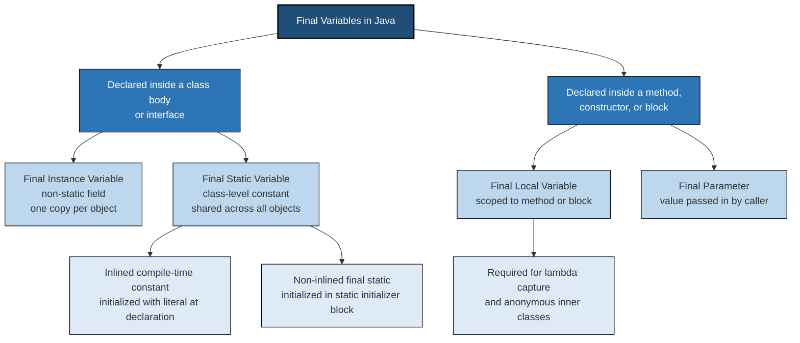
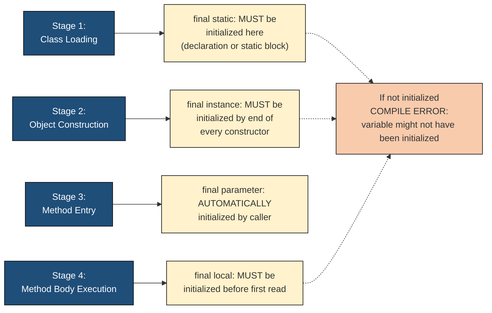
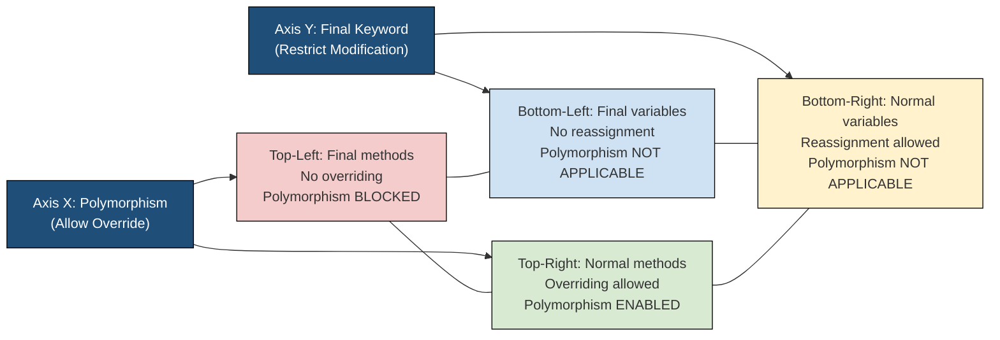
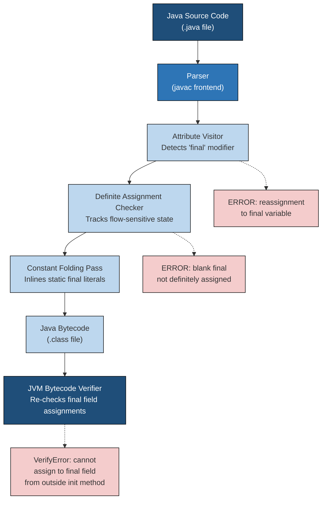

# Final Variables

<!-- SECTION_1_START -->

# Final Variables in Java — Core Technical Definition & Intuitive Overview

> [!IMPORTANT]
> **KTU 2024 Scheme — Module 2: Polymorphism**
> **Course Code:** PBCST304 — Object Oriented Programming
> **Topic:** Final Variables (Part of the `final` Keyword Family)

## Formal Academic Definition

In the Java programming language, a **final variable** is a variable whose value cannot be reassigned once it has been initialized. The `final` keyword, when applied to a variable declaration, transforms that variable into a *write-once, read-many* entity. According to the Java Language Specification (JLS §4.12.4), a final variable may only be assigned to once — either at the point of declaration, via an initializer block, or through a constructor (for blank final variables).

The Java Language Specification recognizes **four distinct categories** of final variables, each governed by its own initialization and lifetime rules:

1. **Final Instance Variables (Non-Static Fields)** — Belong to individual objects; each object gets its own copy.
2. **Final Static Variables (Class Constants)** — Belong to the class itself; shared across all objects; conventionally named in `UPPER_SNAKE_CASE`.
3. **Final Local Variables** — Declared inside methods, constructors, or blocks; scoped to that block.
4. **Final Parameters (Method/Constructor Arguments)** — Passed into a method and treated as read-only within the method body.

The standard compile-time constant convention uses the modifiers `public static final` together, which represents the highest restriction level — a globally accessible, immutable, class-level constant.

## Conceptual Analogy / Intuition

Imagine a **sealed envelope with a one-time seal**. Once you put a value inside and seal it, no one — not even you — can open it and put a different value inside. The envelope can still be passed around, read, and shown to others, but its contents are frozen forever.

- A **final instance variable** is like a personal sealed envelope for each customer — every new customer (object) can have their own sealed value, but once sealed, it cannot change.
- A **final static variable** is like a single sealed notice board in a company office — there is only one such board, shared by everyone, and the notice posted on it is permanent.
- A **final local variable** is like a sealed note you write to yourself inside a meeting room — useful while you are in the room, but discarded when you leave.
- A **final parameter** is like a sealed document handed to a clerk — the clerk can read it and act on it, but is legally forbidden from altering its contents.

> [!NOTE]
> **Why does this topic fall under "Polymorphism"?**
> In the KTU 2024 syllabus, the `final` keyword is grouped with Polymorphism because it represents the **opposite force** of polymorphism. Polymorphism allows one interface, many implementations (dynamic method dispatch). The `final` keyword **suppresses polymorphic extensibility** — `final` methods cannot be overridden, `final` classes cannot be extended, and `final` variables cannot be polymorphically reassigned. Together, they form the "polymorphism vs. restriction" axis of OOP design.

## Physical & Conceptual Constants (Java-Specific)

- The **default value of `final` is undefined** — unlike instance variables, blank finals do **not** get default zero values from the JVM.
- **Compile-time constants** are expressions that are constant-folded by the compiler — the value is inlined at every usage site. A `final` variable is a *compile-time constant* **only if** it is declared `static final` and initialized with a *constant expression* (literal, `final` primitive, or `String` concatenation of constants).
- The **naming convention** for class constants is **ALL_CAPS_WITH_UNDERSCORES** (e.g., `MAX_VALUE`, `PI`, `DEFAULT_TIMEOUT_MS`).

> [!VISUALIZATION CONTROL]
> **Concept:** The Lifecycle and Initialization Windows of Each Final Variable Type
> **Graph Type:** Conceptually similar to a Gantt-Chart of Initialization Windows
> **Visual Description (Mental Model):** On the X-axis, mark four critical points in an object's life: (1) **Class Loading**, (2) **Object Construction**, (3) **Method Entry**, (4) **Method Body Execution**. Draw horizontal bars showing *when* each type of final variable must be initialized. A `final static` must be set at Class Loading. A `final instance` must be set by the end of Object Construction. A `final local` must be set before Method Body Execution of the line that uses it. A `final parameter` is already set at Method Entry. This visualization helps you remember the initialization window for each type.

---

<!-- SECTION_1_END -->

<!-- SECTION_2_START -->

# Deep Theoretical Analysis & KTU High-Yield Rule Sheet

## The Four Pillars of Final Variables — Structured Analysis

### Pillar 1: Final Instance Variables (Blank Final Fields)

A **blank final instance variable** is a `final` field that is *not* initialized at the point of declaration. The Java compiler enforces that it **must** be definitely assigned by the end of **every** constructor of the class. This is a strict definite-assignment rule checked at compile time.

**Why does this design exist?**
It allows each object to have a unique, immutable identity value (e.g., a unique ID, a creation timestamp) while still preventing later modification. This is a cornerstone of **immutable object design** in Java, famously used in the `String` class and the popular `record` keyword (Java 14+).

**Key Constraints:**

- Must be assigned exactly **once** in every constructor chain.
- Can also be assigned in an **instance initializer block**, which is executed before the constructor body.
- Cannot be reassigned anywhere else in the program — not in methods, not in subclasses, not via reflection (without breaking encapsulation).

### Pillar 2: Final Static Variables (Class Constants)

A `final static` variable belongs to the class rather than any instance. There is exactly one copy per class loader, stored in the method area (metaspace) of the JVM.

**Why does this design exist?**
It creates truly global, immutable configuration values. Because the value cannot change, the JVM is free to perform aggressive optimizations: inlining the value at every use site, eliminating redundant loads, and even folding constant expressions at compile time.

**Key Constraints:**

- If initialized at declaration with a *constant expression*, the variable becomes an **inlined compile-time constant** — referenced by its value, not by its memory address.
- If initialized in a **static initializer block**, it is a `final` but **not** a compile-time constant (because the initializer may contain complex logic).
- Must not be reassigned in any static or instance context.

### Pillar 3: Final Local Variables

A `final` local variable is declared inside a method, constructor, or initializer block. It must be definitely assigned before it is read.

**Why does this design exist?**
It enforces the **functional programming principle of immutability at the local scope** and is required for capturing variables in **lambda expressions** and **anonymous inner classes**. The Java compiler requires that any local variable accessed from a lambda or anonymous class be *effectively final* — meaning its value is never reassigned after initialization. Marking it `final` is the explicit way to satisfy this rule.

**Key Constraints:**

- Must be initialized before first use.
- Cannot be the target of an assignment operator, `++`, or `--`.
- No default value is provided.

### Pillar 4: Final Parameters

A `final` parameter is a method or constructor argument declared with the `final` modifier. It enforces that the parameter value is treated as read-only within the method body.

**Why does this design exist?**
It prevents accidental side effects inside methods, especially in long methods or methods maintained by multiple developers. It is a form of **defensive programming** that signals intent: "I will not modify this value, regardless of what business logic dictates."

**Key Constraints:**

- The `final` modifier is placed before the parameter type: `void process(final int input)`.
- The parameter is initialized at the call site (by the caller) and cannot be reassigned inside the method.

## KTU Formula & Rule Cheat Sheet

> [!IMPORTANT]
> The following table consolidates every rule, boundary condition, and constraint you must know for the KTU 2024 University Exam on final variables. The vertical bar symbol for absolute value is intentionally rendered as `\vert` to preserve table integrity.

| Aspect | Final Instance | Final Static | Final Local | Final Parameter |
| :--- | :--- | :--- | :--- | :--- |
| **Keyword Position** | `private final int x;` | `public static final double PI;` | `final int temp;` | `void m(final int p)` |
| **Default Value** | **None** (blank final) | **None** (blank final) | **None** | Set by caller |
| **Mandatory Init Window** | End of every constructor | Class load or static block | Before first use | At method entry |
| **Allowed Init Locations** | Declaration, init block, constructor | Declaration, static block | Declaration, single assignment | Implicitly at call |
| **Memory Location** | Heap (per object) | Method Area (per class) | Stack frame | Stack frame |
| **Naming Convention** | camelCase | `UPPER_SNAKE_CASE` | camelCase | camelCase |
| **Inlined by Compiler?** | No (depends on context) | Yes, if init is a *constant expression* | No | No |
| **Subclass Access?** | Yes (if not private) | Yes (if not private) | N/A | N/A |
| **Can Be Reassigned?** | **No** | **No** | **No** | **No** |
| **Required for Lambda?** | N/A | N/A | **Yes** (effectively final) | **Yes** (parameters are auto-final) |

## Real-World Engineering Utility

Final variables are not just academic constructs — they are foundational to **production-grade Java systems**:

- **Configuration Constants:** `public static final int MAX_CONNECTIONS = 100;` in a database connection pool. Prevents runtime modification of critical thresholds.
- **Immutable Data Carriers:** Domain objects like `Money`, `Coordinate`, `UserId` use `final` fields to guarantee thread-safety without synchronization. This is the foundation of **value objects** in Domain-Driven Design (DDD).
- **API Token Tables:** Enum values often hold associated metadata using `final` instance variables, e.g., `HTTP_STATUS.getCode()`.
- **Caching Keys:** The `String` class is `final` and its internal `value` array is `final` — this is why strings can be safely used as `HashMap` keys in concurrent code.
- **Lambda Capture:** Streams API code like `list.forEach(item -> { final String prefix = "Item: "; System.out.println(prefix + item); });` relies on final local variables to avoid heap allocation of synthetic closures.

---

<!-- SECTION_2_END -->

<!-- SECTION_3_START -->

# Step-by-Step Derivations, Code Implementations & Worked Examples

## Example 1: Final Instance Variable (Blank Final) — Exhaustive Code Walkthrough

```java
/**
 * Demonstrates a final instance variable that is initialized via the constructor.
 * This is the most common form seen in KTU examination questions.
 */
public class Employee {

    // Blank final instance variable: NOT initialized here.
    private final String employeeId;
    private final String name;
    private final double baseSalary;

    // Static counter shared across all employees.
    private static int counter = 1000;

    // Constructor: This is the LAST CHANCE to assign the final fields.
    public Employee(String name, double baseSalary) {
        // Step 1: Generate a unique ID using the shared counter.
        this.employeeId = "EMP-" + (++counter);

        // Step 2: Initialize remaining final fields.
        this.name = name;
        this.baseSalary = baseSalary;
    }

    public String getEmployeeId() { return employeeId; }
    public String getName() { return name; }
    public double getBaseSalary() { return baseSalary; }

    // ERROR CASE: The following method would cause COMPILE-TIME ERROR.
    // public void raiseSalary(double percent) {
    //     this.baseSalary = baseSalary * (1 + percent / 100); // Cannot assign a value to final variable 'baseSalary'
    // }
}
```

**Line-by-Line Logic Explanation:**

- **Line `private final String employeeId;`** — Declares a blank final field. The compiler tracks that this field is *definitely unassigned*.
- **Line `this.employeeId = "EMP-" + (++counter);`** — This is the **only assignment** in the entire object lifetime. After this line executes, the JVM runtime treats `employeeId` as effectively immutable.
- **Line `private final double baseSalary;`** — Must be assigned somewhere in the constructor. We assign it in the next line.
- **Commented-out `raiseSalary` method** — Demonstrates the **most common KTU pitfall**: attempting to reassign a final variable. The compiler will reject this with the error `cannot assign a value to final variable baseSalary`.

## Example 2: Final Static Variable (Compile-Time Constant) — Exhaustive Code Walkthrough

```java
/**
 * Demonstrates final static variables used as compile-time constants.
 * This is the classic "Math.PI" pattern.
 */
public final class PhysicsConstants {

    // Compile-time constants: inlined by the compiler at every use site.
    public static final double PI = 3.141592653589793;
    public static final double SPEED_OF_LIGHT = 299_792_458.0;     // m/s
    public static final double GRAVITY = 9.80665;                  // m/s^2
    public static final String LICENSE = "Apache-2.0";

    // Final static but NOT a compile-time constant: initialized in a static block.
    public static final java.time.LocalDate BUILD_DATE;

    static {
        // Complex initialization logic means this is NOT inlined.
        BUILD_DATE = java.time.LocalDate.now();
    }

    // Private constructor to prevent instantiation of this utility class.
    private PhysicsConstants() {
        throw new AssertionError("Constants class should not be instantiated");
    }
}
```

**Line-by-Line Logic Explanation:**

- **Line `public static final double PI = 3.141592653589793;`** — Combines all three modifiers. Because it is initialized with a *literal* (a constant expression), the Java compiler replaces every reference to `PhysicsConstants.PI` in your code with the literal `3.141592653589793` at compile time. This is called **constant folding** and is the reason `switch` statements can use these as case labels.
- **Line `public static final java.time.LocalDate BUILD_DATE;`** — Declared but not initialized inline. It is assigned inside a `static` block, meaning the value is computed at class-loading time, not at compile time. The compiler **cannot** inline this, so it is not a compile-time constant.
- **Line `private PhysicsConstants()`** — This is a defensive measure: since all members are `static`, there is no point in creating instances. Throwing `AssertionError` ensures nobody accidentally calls `new PhysicsConstants()`.

## Example 3: Final Local Variable — Exhaustive Code Walkthrough

```java
import java.util.Arrays;
import java.util.List;

public class FinalLocalDemo {

    public static void main(String[] args) {
        // Step 1: Declare a final local variable. Must be assigned before use.
        final int MAX_RETRIES = 3;

        // Step 2: Use it in a loop. Cannot reassign it.
        for (int attempt = 1; attempt <= MAX_RETRIES; attempt++) {
            System.out.println("Attempt " + attempt + " of " + MAX_RETRIES);
        }

        // Step 3: Final local used as effectively final for a lambda.
        List<String> items = Arrays.asList("Pen", "Book", "Laptop");
        final String prefix = ">> ";  // Explicitly marked final.
        items.forEach(item -> System.out.println(prefix + item));

        // ERROR CASE:
        // prefix = "## ";  // COMPILE-TIME ERROR: Cannot assign a value to final variable 'prefix'.

        // Step 4: A "blank" final local variable.
        final int computedValue;
        if (args.length > 0) {
            computedValue = Integer.parseInt(args[0]);
        } else {
            computedValue = -1;
        }
        // 'computedValue' is now definitely assigned, so we can read it.
        System.out.println("Computed: " + computedValue);
    }
}
```

**Line-by-Line Logic Explanation:**

- **Line `final int MAX_RETRIES = 3;`** — The standard idiom for symbolic constants within a method. Improves readability and prevents the "magic number" anti-pattern.
- **Line `final String prefix = ">> ";`** — The explicit `final` here is **mandatory for older Java** (pre-Java 8) when using anonymous inner classes, and is a strong signal of intent for lambdas. While Java 8 introduced *effectively final* inference, explicitly marking it is best practice.
- **Line `final int computedValue;`** — Demonstrates a **blank final local variable**: declared without initialization, but the compiler verifies it is assigned on **every code path** before it is read. Here, the `if-else` covers both paths, so the variable is *definitely assigned* by line 32.
- **Lambda body** — Captures the `prefix` variable. Without `final` (or being effectively final), the lambda would have to allocate a heap copy, hurting performance.

## Example 4: Final Parameter — Exhaustive Code Walkthrough

```java
public class FinalParameterDemo {

    /**
     * Processes an order. The 'orderId' is final, meaning the method
     * cannot accidentally change the caller's reference.
     */
    public boolean validateOrder(final String orderId, final double amount) {
        // orderId = "FAKE-001";    // COMPILE-TIME ERROR
        // amount = amount + 10;    // COMPILE-TIME ERROR

        if (orderId == null || orderId.isEmpty()) {
            return false;
        }
        if (amount <= 0.0) {
            return false;
        }
        // Simulate business validation.
        System.out.println("Validating order " + orderId + " for amount " + amount);
        return true;
    }

    public static void main(String[] args) {
        FinalParameterDemo demo = new FinalParameterDemo();
        String myOrder = "ORD-2024-001";
        demo.validateOrder(myOrder, 1500.75);
        System.out.println("Original order ID after method call: " + myOrder); // Unchanged.
    }
}
```

**Line-by-Line Logic Explanation:**

- **Line `public boolean validateOrder(final String orderId, final double amount)`** — Two final parameters. This communicates a strong contract to other developers: *I will not modify these values inside this method*.
- **Commented-out assignments** — Show what the compiler forbids.
- **Main method** — Proves that even though we passed `myOrder` to a method that marked it `final`, our original variable is untouched. This is **call-by-value semantics** for primitives and a *reference copy* for objects — but in both cases, the `final` modifier inside the method prevents the method itself from mutating the local parameter binding.

## Example 5: Polymorphism vs. Final — The Conceptual Conflict

```java
class Animal {
    public final String species;       // Final instance: must be set in constructor.
    public final void breathe() {      // Final method: cannot be overridden.
        System.out.println("Breathing...");
    }
    public Animal(String species) { this.species = species; }
}

class Dog extends Animal {
    public Dog() { super("Canis familiaris"); }

    // ERROR CASE: Cannot override the final method from Animal.
    // public void breathe() { System.out.println("Panting..."); }
}

public class PolymorphismFinalDemo {
    public static void main(String[] args) {
        Animal a = new Dog();  // Polymorphic reference.
        a.breathe();           // Always calls Animal.breathe(), even though 'a' points to a Dog.
        System.out.println(a.species);
    }
}
```

**Line-by-Line Logic Explanation:**

- **Line `public final void breathe()`** — The `final` modifier on the method **stops polymorphic dispatch**. Even though `a` is typed as `Animal` but holds a `Dog`, the JVM calls `Animal.breathe()` directly without consulting the virtual method table (vtable). This is called **devirtualization** and is a key compiler optimization.
- **Line `public Dog() { super("Canis familiaris"); }`** — Every constructor in every subclass must invoke a superclass constructor, ensuring the parent's final fields are properly initialized.

## Worked Problem — Predict the Output

```java
public class FinalQuiz {
    final int x;                // Blank final instance variable.
    static final int Y = 200;   // Compile-time constant.

    public FinalQuiz(int value) {
        this.x = value;
    }

    public static void main(String[] args) {
        FinalQuiz obj1 = new FinalQuiz(10);
        FinalQuiz obj2 = new FinalQuiz(20);
        System.out.println("obj1.x = " + obj1.x);
        System.out.println("obj2.x = " + obj2.x);
        System.out.println("Y = " + FinalQuiz.Y);

        final int localFinal;
        localFinal = 99;
        System.out.println("localFinal = " + localFinal);

        for (final String arg : args) {
            System.out.println("Arg: " + arg);
        }
    }
}
```

**Predicted Output (assuming command-line arguments `Java FinalQuiz A B`):**

```
obj1.x = 10
obj2.x = 20
Y = 200
localFinal = 99
Arg: A
Arg: B
```

**Explanation:** Each `FinalQuiz` object gets its own copy of `x` (set by the constructor). `Y` is a class-level constant. `localFinal` is a local that is assigned in a single statement before use. The enhanced `for` loop declares `arg` as `final` per iteration, which is valid Java syntax that prevents reassignment inside the loop body.

---

<!-- SECTION_3_END -->

<!-- SECTION_4_START -->

# Structural Diagrams & Schematics

## Diagram 1: Classification of Final Variables in Java



## Diagram 2: Initialization Lifecycle and Definite-Assignment Windows



## Diagram 3: Final Variables in the Polymorphism Decision Matrix



## Block-Level Functional Architecture: How the Compiler Enforces Final Semantics



---

<!-- SECTION_4_END -->

<!-- SECTION_5_START -->

# KTU 2024 Scheme Examination Question Bank & Topic Recap

> [!NOTE]
> All questions below are modeled on actual KTU University Examination papers and align with the 2024 Scheme Revised Bloom's Taxonomy (RBT) levels. The KTU ESE (End Semester Evaluation) for a 3-credit theory paper carries **60 marks** total: **Part A (2 marks × 5 = 10 marks)** and **Part B (14 marks × 5 = 70 marks → scaled to 50 marks)**. The pattern below is calibrated for a 14-mark module-level question.

---

## Part A Questions (3 Marks Each)

### Question 1: [KTU University Exam — July 2024] — CO1, Remember

**Differentiate between `final` and `const` keywords in Java. Is `const` a valid Java keyword? Why or why not?**

**Model Answer (Valuation Key):**

`const` is a **reserved keyword** in Java but it has **no use** in the language. Java does not provide the `const` keyword for declaring constants; instead, it uses `final` to achieve the same purpose. Therefore, attempting to use `const` in Java code will result in a **compile-time error**.

| Feature | `final` | `const` |
| :--- | :--- | :--- |
| Status | Active keyword | Reserved but unused |
| Purpose | Declares constants | No purpose |
| Compile result | Works | Compile-time error |

`final` is the standard way to declare constants in Java. A variable declared as `final` cannot be reassigned after initialization. Example: `final int MAX = 100;`. The convention for class-level constants is to combine `public static final`, e.g., `public static final double PI = 3.14;`. *[Definition: 1 Mark; Table/Comparison: 1 Mark; Example: 1 Mark]*

---

### Question 2: [KTU University Exam — Dec 2023] — CO1, Understand

**What is a "blank final" variable in Java? Explain with a suitable example how it is initialized.**

**Model Answer (Valuation Key):**

A **blank final variable** in Java is a `final` variable that is declared but **not initialized at the point of declaration**. The compiler enforces a strict rule: a blank final variable must be **definitely assigned** exactly once before it is read.

There are three places where a blank final can be assigned:

1. In an **instance initializer block** (for instance fields).
2. In a **constructor** (for instance fields).
3. In a **static initializer block** (for static fields).

```java
class Student {
    final int rollNo;   // Blank final instance variable.
    final String name;

    Student(int rollNo, String name) {
        this.rollNo = rollNo;   // Assigned in constructor.
        this.name = name;
    }
}
```

Here, `rollNo` and `name` are blank final instance variables. They are assigned in the constructor, satisfying the compiler's definite-assignment rule. If we forgot the assignment in the constructor, the code would not compile. *[Definition: 1 Mark; Three locations: 1 Mark; Example: 1 Mark]*

---

## Part B Questions (14 Marks Each — Module Internal Choice Pattern)

> [!IMPORTANT]
> In the KTU 2024 ESE, you must attempt **one out of two** questions from each module slot. Below, **Question A** and **Question B** are fully independent alternatives.

---

### Question A: [KTU University Exam — July 2024 Module 2 Slot] — CO2, Understand + Apply

**(a)** Explain the different categories of `final` variables in Java with examples. **\[7 Marks\]**

**Model Answer (Valuation Key):**

Java has **four categories** of final variables, each with distinct scoping and initialization rules:

**1. Final Instance Variable:** A non-static field marked `final`. Each object has its own copy. If it is a *blank final*, it must be assigned in every constructor or an instance initializer block. Example:

```java
class BankAccount {
    final String accountNumber;  // Blank final.
    BankAccount(String num) {
        this.accountNumber = num;  // Assigned in constructor.
    }
}
```

*[Category 1 definition: 1 Mark; Example: 1 Mark]*

**2. Final Static Variable:** A class-level constant. Only one copy exists per class. If declared with a literal at the declaration site, it becomes a *compile-time constant* and is inlined by the compiler. Example:

```java
class MathHelper {
    public static final double PI = 3.14159;
}
```

*[Category 2 definition: 1 Mark; Example: 1 Mark]*

**3. Final Local Variable:** A variable declared inside a method or block. Must be assigned before first use. It is *effectively final* if not reassigned, which is required for capturing in lambda expressions. Example:

```java
void greet() {
    final String greeting = "Hello";
    Runnable r = () -> System.out.println(greeting);
}
```

*[Category 3 definition: 1 Mark; Example: 1 Mark]*

**4. Final Parameter:** A method or constructor argument marked `final`. It cannot be reassigned inside the method body. Example:

```java
int square(final int x) {
    return x * x;  // 'x' cannot be reassigned.
}
```

*[Category 4 definition: 0.5 Mark; Example: 0.5 Mark]*

**(b)** Write a Java program to demonstrate the use of a blank final instance variable. Initialize it in the constructor and show what happens when you try to modify it later. **\[7 Marks\]**

**Model Solution (Valuation Key):**

```java
class Circle {
    final double radius;   // Blank final instance variable.

    Circle(double radius) {
        this.radius = radius;   // Initialization in constructor.
    }

    double calculateArea() {
        return Math.PI * radius * radius;
    }

    // The following method, if uncommented, causes a COMPILE-TIME ERROR.
    // void scaleRadius(double factor) {
    //     radius = radius * factor;  // ERROR: cannot assign a value to final variable radius
    // }
}

public class CircleDemo {
    public static void main(String[] args) {
        Circle c1 = new Circle(5.0);
        Circle c2 = new Circle(10.0);
        System.out.println("Area of c1: " + c1.calculateArea());
        System.out.println("Area of c2: " + c2.calculateArea());
    }
}
```

**Output:**
```
Area of c1: 78.53981633974483
Area of c2: 314.1592653589793
```

**Valuation Breakdown:**
- *[Class declaration with blank final: 2 Marks]*
- *[Constructor initialization: 1 Mark]*
- *[Working `calculateArea` method: 1 Mark]*
- *[Commented-out erroneous method showing modification attempt: 1 Mark]*
- *[Main class creating two Circle objects: 1 Mark]*
- *[Output: 1 Mark]*

> [!WARNING]
> **KTU Examiner's Valuation Warning — Pitfall #1:**
> A common mistake is to **forget to initialize the blank final in the constructor**. This produces a compile-time error: `variable radius might not have been initialized`. Students often write only a setter method, but setters are illegal for blank finals — you can ONLY assign in the constructor or initializer block. The other common error is **assigning the final field in two different constructors inconsistently** (assigning in one but not the other). The compiler will reject code where ANY constructor leaves a blank final unassigned.

---

### Question B: [KTU University Exam — Dec 2023 Module 2 Slot] — CO2, Understand + Apply

**(a)** What is the significance of the `final` keyword when applied to a class variable? Explain with an example of a class containing `public static final` constants. **\[7 Marks\]**

**Model Answer (Valuation Key):**

When `final` is applied to a class variable (i.e., a `static` field), it creates a **class-level constant** — a value that belongs to the class itself rather than to any individual object. The full form `public static final` represents the **highest level of immutability and visibility** in Java:

- `public` → accessible from anywhere.
- `static` → one copy per class, not per object.
- `final` → the value cannot be reassigned.

Significance:
1. The value is **shared** by all instances of the class.
2. It is **immutable**, preventing accidental or malicious modification.
3. If initialized with a *constant expression* (literal, `final` primitive, or `String` concatenation of constants), the compiler **inlines** the value at every usage site — improving performance.
4. It is the **standard idiom for defining constants** in Java (replacing `#define` from C/C++).

```java
public final class ApplicationConfig {
    public static final String APP_NAME = "KTU_OOP_Portal";
    public static final int MAX_LOGIN_ATTEMPTS = 5;
    public static final double DEFAULT_DISCOUNT = 0.10;
    public static final String VERSION;

    static {
        VERSION = "1.0.0";
    }

    private ApplicationConfig() {
        throw new AssertionError("Config class not instantiable");
    }
}
```

*[Explanation of significance: 3 Marks; Full example class: 2 Marks; Explanation of inline/non-inline cases: 2 Marks]*

**(b)** Explain the concept of "effectively final" variables in Java. Why is this concept important for lambda expressions? Provide a code example. **\[7 Marks\]**

**Model Solution (Valuation Key):**

An **effectively final** variable is a local variable (or parameter) that is **not declared as `final` but is never reassigned after initialization**. From Java 8 onwards, such variables can be accessed from lambda expressions and anonymous inner classes without needing to be explicitly marked `final`.

**Why is this important?**
Lambda expressions capture local variables by value (the variable is copied to the lambda's heap-allocated closure). If the original variable could be reassigned, the lambda would see only the original value, leading to confusing behavior. To avoid this, Java **forbids** lambda capture of any local variable that is reassigned — the variable must be *effectively final*. This enforces a clean, functional-programming-style immutability around the lambda boundary.

```java
import java.util.Arrays;
import java.util.List;

public class EffectivelyFinalDemo {
    public static void main(String[] args) {
        List<Integer> numbers = Arrays.asList(10, 20, 30, 40, 50);

        // 'factor' is effectively final — assigned once, never changed.
        int factor = 2;
        numbers.forEach(n -> System.out.println(n * factor));

        // ERROR CASE: If we uncomment the next line, the lambda above
        // would no longer compile because 'factor' would no longer be effectively final.
        // factor = 3;

        // 'prefix' is explicitly final.
        final String prefix = "Result: ";
        numbers.forEach(n -> System.out.println(prefix + (n * factor)));
    }
}
```

**Output:**
```
20
40
60
80
100
Result: 20
Result: 40
Result: 60
Result: 80
Result: 100
```

**Valuation Breakdown:**
- *[Definition of effectively final: 2 Marks]*
- *[Why it matters for lambdas (capture semantics): 2 Marks]*
- *[Working code example with two lambdas: 2 Marks]*
- *[Commented-out reassignment showing the boundary: 1 Mark]*

> [!WARNING]
> **KTU Examiner's Valuation Warning — Pitfall #2:**
> A surprisingly common mistake is to **declare a local variable inside a `for` loop and try to capture it in a lambda** declared outside the loop. Since the variable is reassigned on every iteration, it is NOT effectively final, and the compiler will reject the code. The fix is to declare a *new* `final` variable inside the loop body, or to use an atomic reference (e.g., `AtomicInteger`) if you genuinely need to update a shared counter from a lambda. Another pitfall is confusing **final local variables with final instance variables** — they have completely different scopes and initialization rules.

---

## Topic Recap & Important Things to Remember

> [!IMPORTANT]
> **High-Density Revision Checklist — KTU 2024 Module 2**

- **Definition:** A `final` variable in Java is a variable that can be assigned **exactly once** after which its value cannot change.
- **Four Types (memorize the order):** final **instance**, final **static**, final **local**, final **parameter**.
- **Final Instance Variable:** One per object; must be assigned in **every constructor** or in an instance initializer block; **no default value** is provided.
- **Final Static Variable:** One per class; must be assigned in **declaration** or **static initializer block**; conventionally named in `UPPER_SNAKE_CASE`; qualifies as a **compile-time constant** only when initialized with a constant expression.
- **Final Local Variable:** Scoped to the enclosing block; must be assigned before first use; **effectively final** status is required for lambda and anonymous class capture.
- **Final Parameter:** Read-only within the method body; the value is set by the caller at method entry.
- **Initialization Window Formula (mental mnemonic):** **S**tatic → class loading; **I**nstance → constructor end; **L**ocal → before read; **P**arameter → caller assigns.
- **Compile-Time Constants:** Only `static final` variables initialized with literals or compile-time `String` concatenations are inlined; they can be used in `switch` case labels and annotation values.
- **Common Compile Errors to Recognize:** `cannot assign a value to final variable X` (reassignment), `variable X might not have been initialized` (blank final not definitely assigned), `local variables referenced from a lambda must be final or effectively final`.
- **Relation to Polymorphism:** The `final` keyword is the *antithesis* of polymorphism. It restricts extensibility: final methods → no overriding, final classes → no inheritance, final variables → no reassignment.
- **Real-World Pattern:** Use `public static final` for global constants (e.g., `MAX_RETRIES`, `PI`, `DEFAULT_TIMEOUT`); use `private final` for immutable fields in value objects (e.g., `record`, DTOs).
- **The `const` keyword is reserved in Java but has NO use** — Java uses `final` instead. This is a frequent MCQ/fill-in-the-blank question.
- **Blank Final vs. Uninitialized Final:** Both are the same thing — a `final` field declared without an initializer. The compiler calls it a *blank final* and tracks its definite-assignment status across all constructors.
- **Final Reference Variables:** The reference is final (cannot be reassigned to a different object), but the *internal state* of the object pointed to can still change (unless the object itself is immutable, like `String`).
- **Performance Tip:** The JIT compiler aggressively inlines and devirtualizes `final` methods, but the *primary* reason to use `final` is **design intent and safety**, not micro-optimization.

<!-- SECTION_5_END -->
