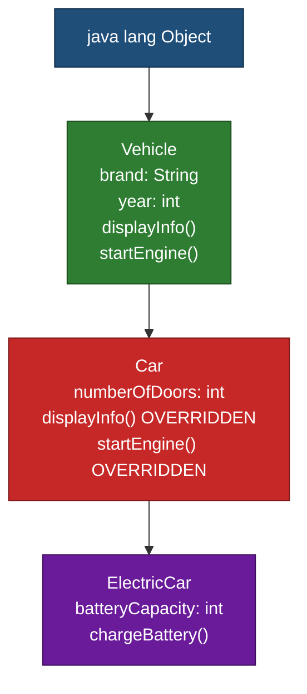
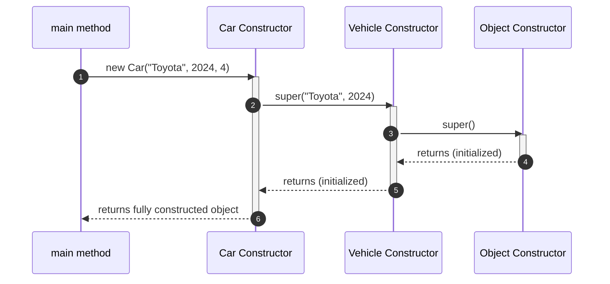
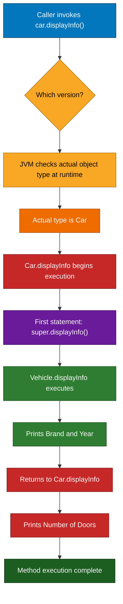
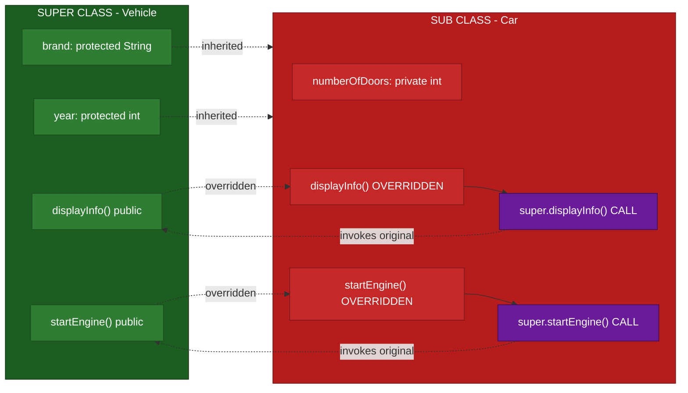
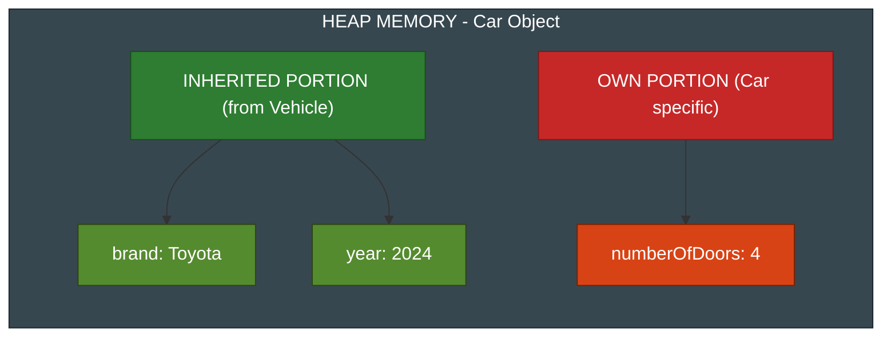

# Inheritance - Super Class

<!-- SECTION_1_START -->
# SUPER CLASS IN INHERITANCE

## 1.1 Formal Academic Definition (KTU 2024 Syllabus Terminology)

A **Super Class** (also called a **Parent Class**, **Base Class**, or **Superclass**) is the class whose **members (attributes and methods) are inherited** by one or more derived classes. In the Java inheritance hierarchy, the super class sits at a higher conceptual level, providing a generalized blueprint from which more specialized sub classes inherit reusable code and behavior.

> [!IMPORTANT]
> **KTU Definition Highlight**
> *"A super class is any class which is above another class in the inheritance chain and whose non-private members are accessible to the sub class through inheritance and the `super` keyword reference."*

The relationship is formally expressed in Java using the `extends` keyword:

```java
class SuperClass {
    // base members
}

class SubClass extends SuperClass {
    // inherits all non-private members of SuperClass
}
```

In this declaration, `SuperClass` is the **super class** of `SubClass`, and `SubClass` is the **sub class** of `SuperClass`.

---

## 1.2 Conceptual Analogy / Intuitive Overview

Think of inheritance like a **genealogy tree** or a **corporate organizational chart**:

> [!NOTE]
> **Real-World Analogy: The Vehicle Manufacturing Company**
>
> Imagine a major car manufacturer (e.g., Toyota) that designs a base prototype called "GenericVehicle" with common features: engine, wheels, chassis, fuel system. Now, the company wants to launch specific models like "Sedan", "SUV", and "Truck". Instead of redesigning everything from scratch, they **inherit** the generic blueprint and add model-specific features.
>
> - **GenericVehicle** → The **Super Class** (parent blueprint)
> - **Sedan, SUV, Truck** → The **Sub Classes** (specialized versions)
> - The engine, wheels, and chassis are **inherited members** accessible to every sub class.

The `super` keyword in this analogy is like a **direct phone line to the parent company headquarters** — whenever the Sedan needs to access or modify the base engine specifications, it uses `super.engineSpecs()` to call the parent's original method.

---

## 1.3 Core Object-Oriented Principles in Play

| Principle | Role of Super Class |
|-----------|---------------------|
| **Reusability** | Common code written once in super class, reused in many sub classes |
| **Extensibility** | Sub classes can extend or override super class behavior |
| **Polymorphism** | Super class references can hold sub class objects (upcasting) |
| **Abstraction** | Super class can define abstract contracts for sub classes to fulfill |

---

## 1.4 Position of Super Class in the Inheritance Hierarchy

The Object class `java.lang.Object` is the **root super class** of every Java class, either **directly or indirectly**. This means:

- Every class in Java is a sub class of `Object`
- If a class does not explicitly `extend` another class, it implicitly extends `Object`
- Multi-level inheritance creates a chain: `Object → A → B → C` (here, A is super of B, B is super of C)

> [!NOTE]
> **Hierarchy Visualization Concept**
>
> Visualize a vertical chain where each class is connected to its parent above. The topmost node is always `java.lang.Object`.
>
> **Key Observation:** A sub class has exactly one immediate super class (Java forbids multiple class inheritance), but it can have many ancestors in the chain.

> [!VISUALIZATION CONTROL]
> **Concept:** Inheritance chain depth visualization
> **GeoGebra / Desmos Input Coordinates:**
> * Point A: (0, 4) labeled "Object"
> * Point B: (0, 3) labeled "Animal"
> * Point C: (0, 2) labeled "Dog"
> * Point D: (0, 1) labeled "Puppy"
> **Visual Description:** A vertical line graph showing four levels of inheritance where each point connects to the one above it via a directed line. Observe that `Puppy` inherits transitively from `Animal` and `Object` through `Dog`.

---

## 1.5 Why Super Class Matters in KTU Examinations

The KTU 2024 OOP module on Polymorphism places heavy weight on:

1. **Constructor chaining via `super()`** — frequently asked in Part A
2. **Method overriding and `super.methodName()`** — frequently asked in Part B
3. **Accessing hidden super class fields using `super.variableName`**
4. **Understanding the call flow from sub class to super class constructors**

These form the foundation for understanding **dynamic method dispatch**, which is the heart of runtime polymorphism in the next sub-topic.
<!-- SECTION_1_END -->

<!-- SECTION_2_START -->
# DEEP THEORETICAL ANALYSIS & KTU HIGH-YIELD FORMULA SHEET

## 2.1 Anatomy of the Super Class Reference

In Java, the super class is referenced using the reserved keyword **`super`**. It is **not** a variable, object, or value — it is a **compile-time reference** that the compiler resolves to the immediate parent class context.

The keyword `super` has three primary use cases in Java:

1. **`super()`** — To invoke the super class constructor
2. **`super.methodName()`** — To invoke an overridden method of the super class
3. **`super.variableName`** — To access a hidden super class field

> [!IMPORTANT]
> **Critical Rule:**
> `super` always refers to the **immediate parent class**, not any ancestor further up the chain.

---

## 2.2 Use Case 1: `super()` — Constructor Invocation

### 2.2.1 Conceptual Rule

When a sub class object is created, the JVM must initialize the inherited portion of the object first. This is achieved by calling the super class constructor before executing the sub class constructor body.

### 2.2.2 KTU High-Yield Rules for `super()`

| Rule # | Description | KTU Exam Weight |
|--------|-------------|-----------------|
| 1 | If the sub class constructor does **not** explicitly call `super()`, the compiler **automatically inserts** a call to the **no-argument constructor** of the super class. | High |
| 2 | The call to `super()` **must be the first statement** in the sub class constructor. | High |
| 3 | If the super class has **no default constructor** (i.e., only parameterized constructors are defined), then the sub class constructor **must explicitly** call `super(arguments)`. Otherwise, a **compile-time error** occurs. | Very High |
| 4 | `super()` and `this()` **cannot both** appear in the same constructor — both must be first statements. | High |
| 5 | A constructor can chain to another constructor in the **same class** using `this()`, but eventually one constructor in the chain must invoke `super()`. | Medium |

### 2.2.3 Constructor Chaining Mechanism

The chain of constructor calls propagates **upward** through the inheritance hierarchy until it reaches the `Object` class constructor. Execution then flows back **downward**, executing each constructor body in sequence.

> [!NOTE]
> **Mnemonic for Exam:**
> "Super calls go UP the chain first, then bodies execute DOWN."

---

## 2.3 Use Case 2: `super.methodName()` — Overridden Method Access

### 2.3.1 Conceptual Rule

When a sub class **overrides** a method inherited from its super class, the sub class version replaces the super class version for that sub class. However, the original super class version can still be invoked from within the sub class using `super.methodName()`.

### 2.3.2 KTU High-Yield Rules

| Rule # | Description | KTU Exam Weight |
|--------|-------------|-----------------|
| 1 | `super.methodName()` is used **inside an instance method or constructor** of the sub class. | High |
| 2 | It cannot be used inside a **`static` method** (compile-time error). | High |
| 3 | It is commonly used to **extend** the super class behavior rather than completely replace it. | Very High |
| 4 | The method must be **accessible** (respecting access modifiers) to be invoked via `super`. | Medium |
| 5 | If the method is **private** in the super class, it cannot be overridden, and `super.methodName()` is not applicable. | Medium |

---

## 2.4 Use Case 3: `super.variableName` — Hidden Field Access

### 2.4.1 Conceptual Rule

If a sub class declares a field with the **same name** as a field in the super class, the sub class field **hides** the super class field. The hidden super class field can be accessed using `super.variableName`.

> [!IMPORTANT]
> **Key Distinction:**
> - **Methods** are **overridden** (resolved at runtime via dynamic dispatch).
> - **Fields** are **hidden** (resolved at compile time based on reference type).
> This is a classic KTU exam trick question.

---

## 2.5 KTU High-Yield Formula / Reference Sheet

| Concept | Syntax | When Used | Example |
|---------|--------|-----------|---------|
| Super class declaration | `class Sub extends Super` | Defining inheritance | `class Car extends Vehicle` |
| Constructor call | `super(args)` | First line of sub class constructor | `super("Petrol", 4)` |
| Default constructor call | `super()` | Implicit/automatic or explicit | Auto-inserted by compiler |
| Overridden method call | `super.methodName()` | Inside sub class to extend parent behavior | `super.display()` |
| Hidden field access | `super.fieldName` | Inside sub class to disambiguate | `super.name` |
| `Object` as root | `extends Object` (implicit) | All classes transitively | Every Java class |
| Final super method | Cannot be overridden | `final void show()` in super | Compile error in sub |
| Static super method | Cannot be overridden (hidden) | `static void show()` in super | Use `Super.show()` not `super.show()` |

---

## 2.6 Real-World Engineering Utility

| Application Domain | Use of Super Class |
|--------------------|---------------------|
| **GUI Frameworks (JavaFX, Swing)** | `JFrame` is super class; custom windows extend it to inherit event handling infrastructure |
| **Enterprise Java (Spring, Hibernate)** | Entity classes extend base classes like `BaseEntity` to inherit audit fields (createdAt, updatedAt) |
| **JDBC API** | `DriverManager` and `Connection` interfaces are extended by vendor-specific implementations |
| **Collection Framework** | `AbstractList` is super class of `ArrayList` and `LinkedList` providing skeletal implementation |
| **Exception Handling** | Custom exceptions extend `Exception` or `RuntimeException` super classes |
| **Game Development** | `GameCharacter` super class with sub classes like `Warrior`, `Mage`, `Archer` inheriting health, attack logic |

---

## 2.7 Common Pitfalls Highlighted by KTU Examiners

> [!WARNING]
> **Pitfall 1:** Forgetting that `super()` must be the **first** statement — placing any code before it is a compile error.
>
> **Pitfall 2:** Calling `super()` in a class that has **no parent** (i.e., directly extends `Object`) when the parent has no no-arg constructor.
>
> **Pitfall 3:** Confusing **method overriding** with **method hiding** (static methods). `super.staticMethod()` is invalid.
>
> **Pitfall 4:** Assuming `super` creates a new object — it does **not**; it only references the parent portion of the current object.
<!-- SECTION_2_END -->

<!-- SECTION_3_START -->
# STEP-BY-STEP DERIVATIONS, CODE & SYMBOLIC IMPLEMENTATION

## 3.1 Demonstration 1: Basic Super Class Inheritance

### 3.1.1 Source Code with Type Hints and Error Handling

```java
// File: Vehicle.java (Super Class)
public class Vehicle {
    // Protected fields - accessible to sub classes
    protected String brand;
    protected int year;

    // No-argument constructor
    public Vehicle() {
        this.brand = "Unknown";
        this.year = 2000;
        System.out.println("[Vehicle] No-arg constructor called.");
    }

    // Parameterized constructor
    public Vehicle(String brand, int year) {
        this.brand = brand;
        this.year = year;
        System.out.println("[Vehicle] Parameterized constructor called: " + brand + ", " + year);
    }

    // Instance method to be overridden
    public void displayInfo() {
        System.out.println("Brand: " + this.brand + ", Year: " + this.year);
    }

    // Method that will be extended (not replaced) by sub class
    public void startEngine() {
        System.out.println("Generic vehicle engine started.");
    }
}
```

```java
// File: Car.java (Sub Class)
public class Car extends Vehicle {
    private int numberOfDoors;

    public Car() {
        // Implicit super() call to Vehicle() inserted by compiler
        this.numberOfDoors = 4;
        System.out.println("[Car] No-arg constructor called.");
    }

    public Car(String brand, int year, int doors) {
        // Explicit call to super class parameterized constructor
        super(brand, year);
        this.numberOfDoors = doors;
        System.out.println("[Car] Parameterized constructor called. Doors: " + doors);
    }

    // Overriding displayInfo from super class
    @Override
    public void displayInfo() {
        // Calling super class version, then adding sub class specific output
        super.displayInfo();
        System.out.println("Number of Doors: " + this.numberOfDoors);
    }

    // Extending (not replacing) startEngine behavior
    @Override
    public void startEngine() {
        super.startEngine();  // Invoke super class method
        System.out.println("Car-specific ignition sequence initiated.");
    }
}
```

```java
// File: Main.java (Driver)
public class Main {
    public static void main(String[] args) {
        System.out.println("--- Creating Car with no-arg constructor ---");
        Car car1 = new Car();

        System.out.println("\n--- Creating Car with parameterized constructor ---");
        Car car2 = new Car("Toyota", 2024, 4);

        System.out.println("\n--- Calling displayInfo (overridden) ---");
        car2.displayInfo();

        System.out.println("\n--- Calling startEngine (extended) ---");
        car2.startEngine();
    }
}
```

### 3.1.2 Expected Output Trace

```
--- Creating Car with no-arg constructor ---
[Vehicle] No-arg constructor called.
[Car] No-arg constructor called.

--- Creating Car with parameterized constructor ---
[Vehicle] Parameterized constructor called: Toyota, 2024
[Car] Parameterized constructor called. Doors: 4

--- Calling displayInfo (overridden) ---
Brand: Toyota, Year: 2024
Number of Doors: 4

--- Calling startEngine (extended) ---
Generic vehicle engine started.
Car-specific ignition sequence initiated.
```

### 3.1.3 Execution Logic Explained Step-by-Step

| Step | Action | Reasoning |
|------|--------|-----------|
| 1 | `new Car()` is invoked | JVM allocates memory for the full `Car` object including inherited `Vehicle` portion |
| 2 | Compiler inserts `super()` at top of `Car()` | Calls `Vehicle()` no-arg constructor |
| 3 | `Vehicle()` sets `brand = "Unknown"`, `year = 2000` | Initializes inherited portion |
| 4 | Control returns to `Car()` | Continues with `this.numberOfDoors = 4` |
| 5 | For `new Car("Toyota", 2024, 4)` | Explicit `super(brand, year)` is called with two arguments |
| 6 | `Vehicle(String, int)` sets fields | Inherited portion initialized with provided values |
| 7 | `displayInfo()` in `Car` calls `super.displayInfo()` | Reuses parent logic, then adds sub class detail |
| 8 | `startEngine()` in `Car` calls `super.startEngine()` | Demonstrates extension rather than full replacement |

---

## 3.2 Demonstration 2: Constructor Chaining Across Multiple Levels

### 3.2.1 Multi-Level Source Code

```java
// Level 1: Top-most super class
class LivingBeing {
    LivingBeing() {
        System.out.println("1. LivingBeing constructor");
    }
}

// Level 2: Intermediate class
class Animal extends LivingBeing {
    Animal() {
        System.out.println("2. Animal constructor");
    }

    Animal(String name) {
        System.out.println("2. Animal parameterized: " + name);
    }
}

// Level 3: Sub class
class Dog extends Animal {
    Dog() {
        // Implicit super() - calls Animal()
        System.out.println("3. Dog constructor");
    }

    Dog(String name) {
        // Explicit call to Animal(String) parameterized constructor
        super(name);
        System.out.println("3. Dog parameterized: " + name);
    }
}

// Driver
public class ChainDemo {
    public static void main(String[] args) {
        System.out.println("--- Object 1: Dog() ---");
        Dog d1 = new Dog();

        System.out.println("\n--- Object 2: Dog(\"Buddy\") ---");
        Dog d2 = new Dog("Buddy");
    }
}
```

### 3.2.2 Output Trace

```
--- Object 1: Dog() ---
1. LivingBeing constructor
2. Animal constructor
3. Dog constructor

--- Object 2: Dog("Buddy") ---
1. LivingBeing constructor
2. Animal parameterized: Buddy
3. Dog parameterized: Buddy
```

### 3.2.3 Construction Order Analysis

For `new Dog("Buddy")`, the JVM executes in this order:

1. **Entry Point:** `Dog(String)` constructor begins
2. **First Statement:** `super("Buddy")` is executed, jumping to `Animal(String)`
3. **Implicit Chain:** `Animal(String)` does not call `super()` explicitly, so compiler inserts `super()` → calls `LivingBeing()`
4. **Top Execution:** `LivingBeing()` constructor body runs
5. **Return Down:** Control returns to `Animal(String)`, its body executes
6. **Return Down:** Control returns to `Dog(String)`, its body executes
7. **Object Ready:** `Dog` object is fully constructed and returned

> [!IMPORTANT]
> **Validation Check for KTU Exam:**
> In `Animal(String)`, the compiler inserts `super()` automatically because no explicit `super(...)` call is present. Since `LivingBeing` defines a no-arg constructor, this is valid. If `LivingBeing` had only a parameterized constructor, this code would fail to compile.

---

## 3.3 Demonstration 3: `super` to Access Hidden Fields

### 3.3.1 Source Code Showing Field Hiding

```java
class Parent {
    String name = "Parent Field";
}

class Child extends Parent {
    // This field hides the super class field
    String name = "Child Field";

    void printNames() {
        System.out.println("Child's name: " + this.name);
        System.out.println("Parent's name: " + super.name);
    }
}

public class FieldDemo {
    public static void main(String[] args) {
        Child c = new Child();
        c.printNames();
    }
}
```

### 3.3.2 Output

```
Child's name: Child Field
Parent's name: Parent Field
```

### 3.3.3 Field Resolution Logic

$$
\text{Field Resolution} =
\begin{cases}
\texttt{this.fieldName} & \Rightarrow \text{Resolves to nearest (most specific) field in current class} \\
\texttt{super.fieldName} & \Rightarrow \text{Resolves to field in immediate super class} \\
\text{No prefix} & \Rightarrow \text{Resolves to nearest visible field (may hide super field)}
\end{cases}
$$

> [!NOTE]
> **Field hiding is resolved at COMPILE TIME** based on the declared type, while **method overriding is resolved at RUNTIME** based on the actual object type. This distinction is a classic KTU question.

---

## 3.4 Demonstration 4: Error Case — Invalid `super()` Usage

### 3.4.1 Code That Fails to Compile

```java
class Device {
    Device(int id) {
        System.out.println("Device ID: " + id);
    }
    // No default constructor defined
}

class Laptop extends Device {
    Laptop() {
        // COMPILE ERROR: super() not found
        // Device does not have a no-arg constructor
    }
}
```

### 3.4.2 Corrected Version

```java
class Laptop extends Device {
    Laptop() {
        super(101);  // Explicit call to available constructor
        System.out.println("Laptop created.");
    }
}
```

> [!WARNING]
> **Compiler Error Explanation:**
> When a super class does not define a no-argument constructor, the compiler cannot auto-insert `super()`. The sub class **must** explicitly call one of the available constructors using `super(argumentList)` as the first statement.

---

## 3.5 Demonstration 5: When `super` Cannot Be Used

```java
class StaticSuper {
    static void utility() {
        // super.utility();  // COMPILE ERROR
        // 'super' cannot be used in static context
    }
}
```

> [!IMPORTANT]
> **Hard Rule for KTU:**
> The `super` keyword has **no meaning in a static context** because static methods belong to the class, not to any specific object. The compiler will reject `super` inside any static block or static method.

---

## 3.6 Demonstration 6: Practical Engineering Pattern — Template Method

The Template Method design pattern is a classic use of super class defining the skeleton and sub classes filling in specifics.

```java
// Abstract super class defining the algorithm skeleton
abstract class DataProcessor {
    // Template method - final so sub classes cannot override the structure
    public final void process() {
        readData();
        super.validateData();  // Not valid here; super refers to Object
        transformData();
        saveData();
    }

    protected void validateData() {
        System.out.println("Default validation: checking non-null");
    }

    protected abstract void readData();
    protected abstract void transformData();
    protected abstract void saveData();
}

class CSVProcessor extends DataProcessor {
    @Override
    protected void readData() {
        System.out.println("Reading CSV file...");
    }

    @Override
    protected void transformData() {
        System.out.println("Transforming CSV rows...");
    }

    @Override
    protected void saveData() {
        System.out.println("Saving to database...");
    }

    // Optionally override validation
    @Override
    protected void validateData() {
        System.out.println("CSV-specific schema validation");
    }
}
```

This pattern is widely used in **Spring Framework**, **Hibernate ORM**, and **JUnit testing frameworks**.
<!-- SECTION_3_END -->

<!-- SECTION_4_START -->
# STRUCTURAL DIAGRAMS & SCHEMATICS

## 4.1 Mermaid Class Hierarchy Diagram



### 4.1.1 Diagram Interpretation

| Node | Role | Inherited From | Own Members |
|------|------|----------------|-------------|
| `Object` | Root super class of all Java classes | None | `toString()`, `equals()`, `hashCode()` |
| `Vehicle` | Intermediate super class | `Object` | `brand`, `year`, `displayInfo()`, `startEngine()` |
| `Car` | Sub class | `Vehicle` | `numberOfDoors`, overridden `displayInfo()`, overridden `startEngine()` |
| `ElectricCar` | Multi-level sub class | `Car` | `batteryCapacity`, `chargeBattery()` |

---

## 4.2 Mermaid Sequence Diagram — Constructor Chaining Flow



### 4.2.1 Sequence Steps Decoded

1. The `main` method calls the `Car` constructor with three arguments.
2. As the **first statement** in `Car`, `super("Toyota", 2024)` jumps to the matching `Vehicle` constructor.
3. The `Vehicle` constructor does not explicitly call `super()`, so the compiler auto-inserts `super()`.
4. `Object`'s no-arg constructor runs, completing the root of the chain.
5. Control unwinds: `Object` returns to `Vehicle`, which sets its fields and returns to `Car`.
6. `Car` sets its own fields (`numberOfDoors`) and returns the fully constructed object to `main`.

---

## 4.3 Mermaid Flowchart — Method Overriding with `super` Invocation



---

## 4.4 Block-Level Functional Architecture: Super Class Member Access Map



### 4.4.1 Access Map Interpretation

The diagram shows two distinct pathways:

- **Inheritance arrows** (dotted from super to sub): These represent fields and methods that are **passed down** to the sub class automatically.
- **Override arrows** (solid from super method to sub method): These represent methods that are **replaced** in the sub class but can still be invoked via `super`.
- **super() call arrows** (dotted from sub to super): These represent the **explicit invocation** of the original super class method from within the overridden version.

---

## 4.5 Memory Layout Diagram — Sub Class Object Structure



> [!NOTE]
> **Memory Insight for KTU Exam:**
> A sub class object is a **single contiguous block** in heap memory. The `super` reference does not point to a separate object; it points to the **inherited portion within the same object**. This is why `super` is not a runtime object reference but a compile-time syntactic aid.
<!-- SECTION_4_END -->

<!-- SECTION_5_START -->
# KTU 2024 SCHEME EXAMINATION QUESTION BANK & TOPIC RECAP

---

## PART A — Short Answer Questions (3 Marks Each)

### Question 1
**[KTU University Exam - July 2023]** | **CO1** | **Bloom Level: Remember**

What is a super class in Java? How is it declared using the `extends` keyword?

#### Model Answer (3 Marks)

A super class in Java is the class whose properties and methods are inherited by another class (the sub class). It serves as the generalized blueprint from which more specific classes derive their structure and behavior.

**Declaration syntax:**

```java
class SuperClass {
    // members of super class
}

class SubClass extends SuperClass {
    // SubClass inherits all accessible members of SuperClass
}
```

The `extends` keyword establishes the inheritance relationship, making `SuperClass` the parent (super) of `SubClass`.

**[Valuation Key: Definition of super class: 1 Mark | Purpose of inheritance: 1 Mark | Code syntax with extends: 1 Mark]**

---

### Question 2
**[KTU University Exam - December 2023]** | **CO2** | **Bloom Level: Understand**

Explain the three uses of the `super` keyword in Java with examples.

#### Model Answer (3 Marks)

The `super` keyword in Java is used in three distinct contexts:

1. **`super()` to call super class constructor** — Used to invoke a specific constructor of the parent class as the first statement in the sub class constructor.
   ```java
   super(brand, year);
   ```

2. **`super.methodName()` to call overridden method** — Used to invoke the parent class version of a method that has been overridden in the sub class.
   ```java
   super.displayInfo();
   ```

3. **`super.variableName` to access hidden field** — Used to disambiguate between a sub class field and a super class field with the same name.
   ```java
   super.brand;
   ```

**[Valuation Key: Identifying three uses: 1 Mark each]**

---

## PART B — Long Answer Questions (14 Marks Each, Internal Choice)

### Question A — Choice 1

**[KTU University Exam - July 2024]** | **CO2, CO3** | **Bloom Level: Apply / Analyze**

**(a)** Explain how constructors are invoked across an inheritance hierarchy in Java. What happens if the super class does not have a no-argument constructor? Illustrate with a suitable example. **(7 Marks)**

**(b)** Write a Java program that demonstrates method overriding and the use of `super` to invoke the overridden method from the super class. Show the complete code with output. **(7 Marks)**

---

#### Model Solution for Part (a) — 7 Marks

**Constructor Invocation Chain Concept:**

When a sub class object is created, the JVM ensures that the super class portion of the object is properly initialized. This is achieved by invoking the super class constructor before executing the sub class constructor body.

**Rules for `super()` invocation:**

| Rule | Description |
|------|-------------|
| Rule 1 | If the sub class constructor does not explicitly call `super()`, the compiler auto-inserts a call to the no-argument super class constructor. |
| Rule 2 | The `super()` call must be the **first statement** in the sub class constructor. |
| Rule 3 | If the super class lacks a no-argument constructor, an **explicit** call to a parameterized constructor is mandatory. |

**Example demonstrating mandatory explicit `super()` call:**

```java
class Employee {
    String name;
    int id;

    // Only parameterized constructor - no default constructor
    Employee(String name, int id) {
        this.name = name;
        this.id = id;
        System.out.println("Employee constructor: " + name);
    }
}

class Manager extends Employee {
    double bonus;

    Manager(String name, int id, double bonus) {
        // MUST explicitly call super(name, id) because Employee has no no-arg constructor
        super(name, id);
        this.bonus = bonus;
        System.out.println("Manager constructor with bonus: " + bonus);
    }
}

public class ConstructorDemo {
    public static void main(String[] args) {
        Manager m = new Manager("Alice", 101, 5000.0);
    }
}
```

**Output:**

```
Employee constructor: Alice
Manager constructor with bonus: 5000.0
```

**Explanation:** Since `Employee` does not define a no-argument constructor, the `Manager` constructor must explicitly call `super(name, id)`. If this call is omitted, the compiler attempts to insert `super()` which does not exist, resulting in a compile-time error.

**Order of execution:** `Employee` constructor body runs first, then `Manager` constructor body. This ensures the inherited portion is initialized before the sub class-specific fields.

**[Valuation Key: Concept of constructor chaining: 2 Marks | Stating 3 rules: 2 Marks | Example code: 2 Marks | Output/Error explanation: 1 Mark]**

---

#### Model Solution for Part (b) — 7 Marks

**Complete Java Program:**

```java
// Super class
class BankAccount {
    protected String accountHolder;
    protected double balance;

    public BankAccount(String holder, double balance) {
        this.accountHolder = holder;
        this.balance = balance;
    }

    public void displayDetails() {
        System.out.println("Account Holder: " + this.accountHolder);
        System.out.println("Balance: Rs. " + this.balance);
    }

    public void calculateInterest() {
        System.out.println("Generic interest calculation (5% per annum)");
    }
}

// Sub class
class SavingsAccount extends BankAccount {
    private double interestRate;

    public SavingsAccount(String holder, double balance, double rate) {
        super(holder, balance);
        this.interestRate = rate;
    }

    // Overriding displayDetails
    @Override
    public void displayDetails() {
        super.displayDetails();  // Call super class version
        System.out.println("Account Type: Savings");
        System.out.println("Interest Rate: " + this.interestRate + "%");
    }

    // Overriding and extending calculateInterest
    @Override
    public void calculateInterest() {
        super.calculateInterest();  // Reuse parent logic
        double interest = this.balance * this.interestRate / 100;
        System.out.println("Calculated Interest: Rs. " + interest);
    }
}

// Driver
public class BankingDemo {
    public static void main(String[] args) {
        SavingsAccount sa = new SavingsAccount("Rahul", 50000.0, 6.5);
        System.out.println("--- Account Details ---");
        sa.displayDetails();
        System.out.println("\n--- Interest Calculation ---");
        sa.calculateInterest();
    }
}
```

**Expected Output:**

```
--- Account Details ---
Account Holder: Rahul
Balance: Rs. 50000.0
Account Type: Savings
Interest Rate: 6.5%

--- Interest Calculation ---
Generic interest calculation (5% per annum)
Calculated Interest: Rs. 3250.0
```

**Explanation of `super` usage in the program:**

| Location | Statement | Purpose |
|----------|-----------|---------|
| `SavingsAccount` constructor | `super(holder, balance)` | Initialize inherited fields |
| `displayDetails()` | `super.displayDetails()` | Reuse parent printing logic, then add sub class details |
| `calculateInterest()` | `super.calculateInterest()` | Call parent generic message, then compute specific interest |

This demonstrates that overriding does not mean "replacement" — it can be combined with `super` to **extend** behavior.

**[Valuation Key: Super class definition: 1 Mark | Sub class definition with extends: 1 Mark | super() in constructor: 1 Mark | Overriding displayDetails: 1 Mark | Using super.displayDetails: 1 Mark | Using super.calculateInterest: 1 Mark | Output: 1 Mark]**

---

### Question B — Choice 2

**[KTU University Exam - December 2024]** | **CO2, CO3** | **Bloom Level: Apply / Analyze**

**(a)** Differentiate between method overriding and method hiding in Java. How does `super` behave in each case? **(7 Marks)**

**(b)** Design a three-level inheritance hierarchy (e.g., `Shape → Polygon → Triangle`) and demonstrate how `super` is used at each level for constructor chaining and method access. Write the complete program. **(7 Marks)**

---

#### Model Solution for Part (a) — 7 Marks

**Comparison Table:**

| Aspect | Method Overriding | Method Hiding |
|--------|-------------------|---------------|
| **Applicable to** | Instance methods (non-static) | Static methods and fields |
| **Resolution** | Runtime (dynamic dispatch) | Compile-time (based on reference type) |
| **Sub class effect** | Replaces super class method for sub class objects | Replaces super class member when accessed via sub class name |
| **Polymorphism support** | Yes — enables runtime polymorphism | No — invoked based on declared type |
| **`super` keyword usage** | `super.methodName()` works inside sub class instance method | `super.staticMethod()` is **invalid**; must use `SuperClassName.staticMethod()` |
| **Can be prevented?** | Using `final` modifier in super class | Using `final` modifier in super class |

**Code Illustration of Method Hiding:**

```java
class Super {
    static void show() {
        System.out.println("Super static show");
    }
    void instanceShow() {
        System.out.println("Super instance show");
    }
}

class Sub extends Super {
    static void show() {  // Method HIDING (not overriding)
        System.out.println("Sub static show");
    }

    @Override
    void instanceShow() {  // Method OVERRIDING
        System.out.println("Sub instance show");
    }

    void test() {
        super.instanceShow();  // VALID - calls Super instance method
        // super.show();       // COMPILE ERROR - super not valid for static
    }
}
```

**Behavioral difference at runtime:**

```java
Super ref = new Sub();
ref.instanceShow();  // Calls Sub version (runtime polymorphism)
ref.show();          // Calls Super version (compile-time binding for static)
```

**[Valuation Key: Defining both concepts: 2 Marks | Tabular comparison with 4+ rows: 3 Marks | super behavior distinction: 2 Marks]**

---

#### Model Solution for Part (b) — 7 Marks

**Three-Level Hierarchy Code:**

```java
// Level 1: Top Super Class
class Shape {
    protected String color;

    public Shape() {
        this.color = "Undefined";
        System.out.println("Shape() constructor");
    }

    public Shape(String color) {
        this.color = color;
        System.out.println("Shape(String) constructor: " + color);
    }

    public void describe() {
        System.out.println("A shape with color: " + this.color);
    }

    public double area() {
        return 0.0;
    }
}

// Level 2: Intermediate Class
class Polygon extends Shape {
    protected int numberOfSides;

    public Polygon(String color, int sides) {
        super(color);  // Call Shape(String) constructor
        this.numberOfSides = sides;
        System.out.println("Polygon constructor: " + sides + " sides");
    }

    @Override
    public void describe() {
        super.describe();  // Call Shape.describe()
        System.out.println("It is a polygon with " + this.numberOfSides + " sides.");
    }
}

// Level 3: Bottom Sub Class
class Triangle extends Polygon {
    private double base;
    private double height;

    public Triangle(String color, double base, double height) {
        super(color, 3);  // Call Polygon(String, int) constructor
        this.base = base;
        this.height = height;
        System.out.println("Triangle constructor: base=" + base + ", height=" + height);
    }

    @Override
    public double area() {
        // Triangle-specific area formula - does not call super.area()
        return 0.5 * this.base * this.height;
    }

    @Override
    public void describe() {
        super.describe();  // This calls Polygon.describe() which itself calls Shape.describe()
        System.out.println("It is a triangle with area: " + this.area());
    }
}

// Driver
public class ShapeDemo {
    public static void main(String[] args) {
        Triangle t = new Triangle("Red", 6.0, 4.0);
        System.out.println("\n--- Description ---");
        t.describe();
    }
}
```

**Output Trace:**

```
Shape(String) constructor: Red
Polygon constructor: 3 sides
Triangle constructor: base=6.0, height=4.0

--- Description ---
A shape with color: Red
It is a polygon with 3 sides.
It is a triangle with area: 12.0
```

**Detailed Constructor Chaining Analysis for `new Triangle("Red", 6.0, 4.0)`:**

| Execution Order | Constructor | Action |
|-----------------|-------------|--------|
| Step 1 | `Triangle(String, double, double)` begins | Entry point |
| Step 2 | `super("Red", 3)` invoked | Jumps to `Polygon(String, int)` |
| Step 3 | `Polygon` first statement: `super("Red")` | Jumps to `Shape(String)` |
| Step 4 | `Shape(String)` body executes | Sets `color = "Red"`, prints message |
| Step 5 | Returns to `Polygon` body | Sets `numberOfSides = 3`, prints message |
| Step 6 | Returns to `Triangle` body | Sets `base = 6.0`, `height = 4.0`, prints message |
| Step 7 | `t.describe()` invoked | Triangle version calls `super.describe()` → Polygon version calls `super.describe()` → Shape version runs first, then unwinds adding details |

**[Valuation Key: Class hierarchy with 3 levels: 2 Marks | super() in each constructor: 2 Marks | Method override with super call: 1 Mark | Constructor chain output: 1 Mark | describe() cascading output: 1 Mark]**

---

## KTU Examiner's Valuation Warning / Pitfall Callout

> [!WARNING]
> **Common Mark-Deduction Pitfalls in Super Class Questions:**
>
> 1. **Forgetting the "first statement" rule:** Students write `super()` after some initialization code in the constructor. This is a compile-time error and loses full marks.
>
> 2. **Confusing `super` with `this`:** `this` refers to the current object; `super` refers to the parent class portion. They are not interchangeable.
>
> 3. **Assuming `super` works in static context:** Writing `super.methodName()` inside a `static` method is a compile error.
>
> 4. **Field hiding vs method overriding confusion:** Writing "fields are overridden" instead of "fields are hidden" in Part A loses 1 mark.
>
> 5. **Not showing constructor chain output order:** In Part B, just writing the code is not enough. Always trace the output showing the **order** in which constructors execute from top (Object/root) to bottom (most derived class).
>
> 6. **Using `super` in a class with no parent other than `Object`:** While valid (since Object has a no-arg constructor), explicitly calling `super()` is rarely needed unless Object's no-arg constructor does something custom.
>
> 7. **Omitting the `@Override` annotation:** While not mandatory, omitting it in KTU answers is considered poor practice and may lose stylistic marks in evaluation.

---

## Topic Recap & Important Things to Remember

- **Super class** is the parent class in an inheritance relationship; declared using `extends` keyword in Java.
- **Root super class:** Every Java class ultimately inherits from `java.lang.Object`, either directly or transitively.
- **Three uses of `super`:** `super()` for constructors, `super.methodName()` for overridden methods, `super.variableName` for hidden fields.
- **`super()` rule:** Must be the **first statement** in a sub class constructor. If omitted, the compiler auto-inserts a call to the no-arg super constructor.
- **Mandatory explicit `super()`:** Required when the super class lacks a no-argument constructor; otherwise compile-time error.
- **`super` is invalid in static context:** Cannot be used inside `static` methods, static blocks, or static variable initializers.
- **Constructor chain order:** Super class constructors execute **first** (top-down), then the sub class constructor body runs (bottom-up unwinding).
- **Method overriding uses runtime polymorphism:** Resolved based on actual object type.
- **Field hiding uses compile-time binding:** Resolved based on declared reference type.
- **`super.methodName()` is for extending, not replacing:** It allows the sub class to retain original behavior while adding new functionality.
- **Final methods cannot be overridden:** A `final` method in the super class cannot be invoked through an override in the sub class.
- **Static methods are hidden, not overridden:** `super.staticMethod()` is a compile error; use `ParentClass.staticMethod()` instead.
- **`Object` class methods inherited by every class:** `toString()`, `equals()`, `hashCode()`, `getClass()`, `notify()`, `wait()`, etc.
- **Real-world applications:** Used extensively in GUI frameworks, JDBC drivers, Collection API (`AbstractList`, `AbstractMap`), and design patterns like Template Method.
- **Common KTU exam phrasing:** "Explain the role of super class" → discuss inheritance, reusability, and `super` keyword usage in one structured answer.
- **Memory model:** A sub class object is a single block containing both inherited and own fields; `super` does not create a separate object reference.
<!-- SECTION_5_END -->
