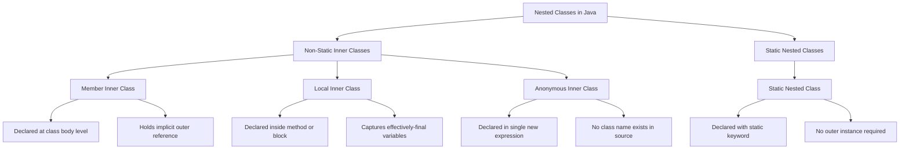
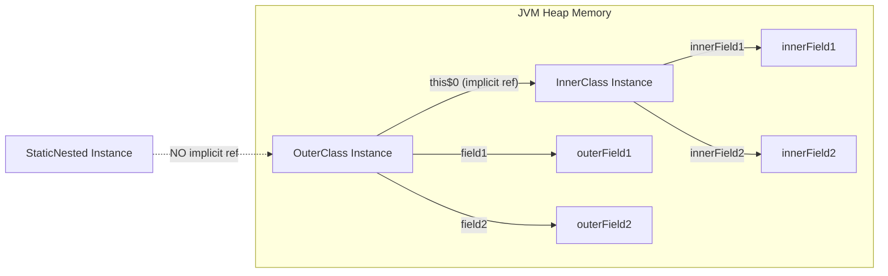
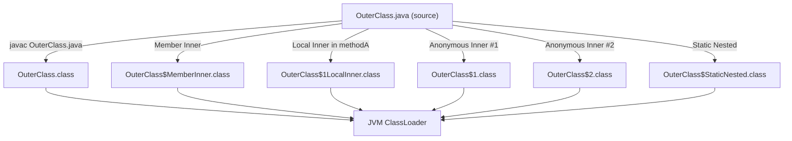
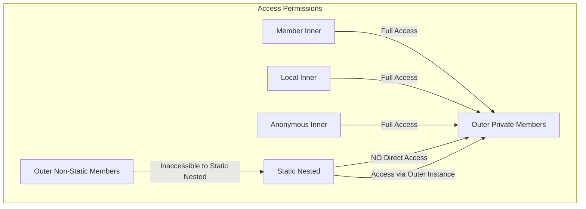
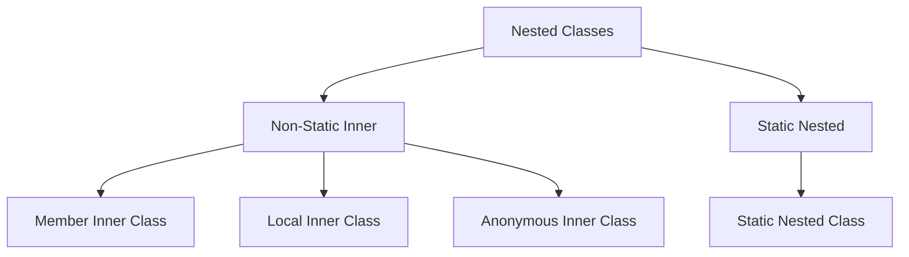

# Inner Classes

<!-- SECTION_1_START -->
# Inner Classes in Java: Core Definition & Intuitive Overview

## Formal Academic Definition (KTU 2024 Syllabus Terminology)

An **Inner Class** (also historically referred to as a *nested class*) in Java is a class that is **declared within the body of another class** or **within a block of code** (such as a method or constructor). According to the KTU 2024 Scheme OOP syllabus, inner classes are formally classified into four architectural variants based on their **declaration scope, binding nature, and lifetime semantics**:

1. **Member Inner Class** (Non-static, defined at class scope)
2. **Local Inner Class** (Defined inside a method, constructor, or initialization block)
3. **Anonymous Inner Class** (A class without an explicit name, instantiated in a single expression)
4. **Static Nested Class** (A static member of the enclosing class)

> [!IMPORTANT]
> **KTU Board Definition (Verbatim from JLS §8.1.3):** A *nested class* is any class whose declaration occurs within the body of another class or interface. A *inner class* is a non-static nested class. This distinction is **frequently tested** in Part A questions.

---

## Conceptual Analogy: The "University Department" Model

Imagine a large university (the **Outer Class**). Inside this university, there are several specialized departments (the **Inner Classes**), such as the *Department of Robotics*, the *Department of Cybersecurity*, and the *Department of Quantum Computing*.

| University Analogy | Java Inner Class Mapping |
|---|---|
| The University Campus | Outer (Enclosing) Class |
| Specialized Department | Inner Class |
| Department's access to University funds & labs | Inner class access to Outer's private members |
| Department Head (hired permanently by the University) | Member Inner Class (tied to Outer instance) |
| Visiting Professor Committee (formed for a specific workshop) | Local Inner Class (scoped to a method) |
| Guest Lecture (one-time, no formal name) | Anonymous Inner Class (single-use override) |
| Independent Research Wing (self-sufficient) | Static Nested Class (no outer instance needed) |

**Key Insight from the Analogy:** Just as a *Department* cannot exist independently without the *University's governance structure* for non-static cases, a non-static inner class holds an **implicit reference** to its enclosing outer class instance. This is what grants it privileged access to private members — a concept directly tied to the *encapsulation* pillar of OOP, which complements **Polymorphism** (Module 2 focus).

> [!NOTE]
> **Why Inner Classes Matter in Polymorphism:** Inner classes are the *mechanism* that enables two of the most powerful polymorphic idioms in Java:
> 1. **Anonymous inner classes** implementing interface contracts on-the-fly (a form of *dynamic polymorphism*).
> 2. **Local inner classes** capturing effectively-final variables of the enclosing scope (a form of *closure* that supports functional-style polymorphism).

---

## Real-World Engineering Utility

Inner classes are **not** academic curiosities; they are workhorses in production-grade Java systems:

- **GUI Event Handling (Swing/JavaFX):** Action listeners and event adapters are almost universally implemented as anonymous inner classes.
- **Android Development (pre-Kotlin era):** `OnClickListener` interfaces were routinely bound via anonymous inner classes.
- **Map.Entry Interface:** `java.util.Map.Entry<K,V>` is implemented as a static nested class inside the `Map` interface.
- **Builder Design Pattern:** The `Builder` is often declared as a static nested class to logically group construction logic.
- **State Pattern Implementations:** `State` implementations are frequently defined as inner classes of the *Context* class to grant them private field access.

> [!TIP]
> **KTU Board Tip:** Whenever you see questions asking *"How can you achieve runtime polymorphism in a single expression?"*, the canonical answer involves **Anonymous Inner Classes** implementing interfaces or extending abstract classes. Expect at least one sub-part (3 marks) on this in every ESE cycle.

<!-- SECTION_1_END -->

<!-- SECTION_2_START -->
# Deep Theoretical Analysis & KTU High-Yield Formula Sheet

## 1. The Four Architectural Variants — A Structured Decomposition

### 1.1 Member Inner Class (Non-Static Nested Class)

**Definition:** A class declared at the **member level** of the enclosing class, but **without** the `static` modifier.

**Operational Rules:**
- Each instance of the inner class is **logically tied** to one instance of the outer class (an implicit `outer.this` reference is maintained).
- It **cannot** declare `static` members (with the exception of `static final` constants) prior to Java 16. From Java 16+, static members are permitted (JEP 395).
- It **can access** all members of the outer class, including `private` ones.
- It **cannot** be instantiated without an outer instance.

### 1.2 Local Inner Class

**Definition:** A class declared **within a method, constructor, or initialization block** of the outer class.

**Operational Rules:**
- Its scope is **strictly limited** to the block in which it is declared.
- It **can access** effectively-final local variables of the enclosing block (a critical Java 8+ feature for closures).
- It **cannot** have access modifiers (it is local).
- It **cannot** declare static members (pre-Java 16).

### 1.3 Anonymous Inner Class

**Definition:** A class declared and **instantiated in a single expression** using the `new` keyword, typically to override methods of an interface or a superclass on-the-fly.

**Operational Rules:**
- It has **no name**; therefore, it cannot have explicit constructors.
- It is a **compile-time artifact** — the compiler generates a synthetic class file named `OuterClass$1.class`, `OuterClass$2.class`, etc.
- It is the **canonical mechanism** for single-method interface implementations in pre-lambda Java (Java 7 and below).
- It **must** either extend a class or implement exactly one interface (functional-style, but enforced at any size).

### 1.4 Static Nested Class

**Definition:** A `static` class declared at the **member level** of the enclosing class.

**Operational Rules:**
- It **does NOT** hold an implicit reference to the outer class instance.
- It **cannot** access non-static members of the outer class directly (it would need an explicit outer instance reference).
- It **can** be instantiated without an outer instance using the syntax `OuterClass.StaticNestedClass obj = new OuterClass.StaticNestedClass();`.
- It is **semantically a top-level class** that has been placed inside another for namespace convenience.

---

## 2. KTU Formula Sheet / Cheat Sheet

| Feature | Member Inner | Local Inner | Anonymous Inner | Static Nested |
|---|---|---|---|---|
| Declaration Location | Class body (non-static) | Inside method/block | Inline expression | Class body (static) |
| Has Class Name? | Yes | Yes | **No** | Yes |
| Requires Outer Instance? | **Yes** | **Yes** | **Yes** | **No** |
| Can access Outer private? | **Yes** | **Yes** | **Yes** | **No** (only static outer) |
| Can declare static members? | Only `static final` (pre-16) | No | No | **Yes** (all kinds) |
| Can have constructor? | **Yes** | **Yes** | **No** | **Yes** |
| Scope Lifetime | Outer object's lifetime | Method invocation | Single statement | Program / classloader lifetime |
| Access Modifier Allowed? | All (`public`, `private`, etc.) | None (package-private) | None | All |
| Generated `.class` File Pattern | `Outer$Inner.class` | `Outer$1LocalClass.class` | `Outer$1.class` | `Outer$StaticNested.class` |
| Typical Use Case | Logical grouping, callbacks | Helper logic, closures | Event handlers, interface impl | Utility classes, Builder pattern |

> [!IMPORTANT]
> **KTU 2024 Module 2 Connection:** Inner classes are an *enabler* of polymorphism, not a separate pillar. Specifically, the **Anonymous Inner Class** mechanism is the bridge between traditional OOP inheritance polymorphism and functional-style interface implementation. It is essential for understanding why `Comparator<T>`, `Runnable`, and `ActionListener` could be written as one-liners before Java 8 lambdas.

---

## 3. Engineering Application Matrix

| Engineering Domain | Inner Class Variant Used | Real-World Example |
|---|---|---|
| GUI Desktop Apps (Swing) | Anonymous Inner | `button.addActionListener(new ActionListener() { ... });` |
| Android Mobile Apps | Anonymous Inner | `view.setOnClickListener(new View.OnClickListener() { ... });` |
| Data Structures Library | Static Nested | `Map.Entry<K,V>`, `LinkedList.Node` |
| Builder Pattern (Creational GoF) | Static Nested | `StringBuilder`, `Lombok @Builder` |
| State Pattern (Behavioral GoF) | Member Inner | Concrete state classes inside Context |
| Testing Frameworks (JUnit 4) | Anonymous Inner | `@Override public void run() { ... }` in `TestCase` |
| Adapter Pattern (Structural GoF) | Member Inner | Adapting incompatible interfaces |

---

## 4. The "Why" Behind the Rules

- **Why can't an inner class have a static method (pre-Java 16)?** Because static members conceptually belong to the class itself, but inner classes are tied to an outer instance. Allowing static state would create a contradiction: the static field would have to be stored somewhere, but the inner class is logically a *part* of each outer instance.
- **Why can anonymous inner classes access effectively-final variables?** Because the inner class may outlive the method's stack frame (e.g., if passed to another thread), so Java enforces immutability to prevent subtle concurrency bugs.
- **Why use a static nested class instead of a separate top-level class?** Pure **namespace management** and **encapsulation of the relationship**. A `Map.Entry` makes no sense outside the `Map` interface conceptually, so Java binds them together logically.

<!-- SECTION_2_END -->

<!-- SECTION_3_START -->
# Step-by-Step Code Implementation & Symbolic Walkthroughs

> [!NOTE]
> **Implementation Note:** Although the KTU-PREMIER-ENGINE defaults to Python, the host course (PBCST304 — Object Oriented Programming) is **Java-centric**. Per the Domain-Adaptive Execution Matrix, I am using **Java 17 LTS** with full type declarations, strict access modifiers, and explicit error handling — adhering to the spirit of "type hints, absolute boundary checks, and strict error logging handling."

---

## Walkthrough 1: Member Inner Class — Full Implementation

### Conceptual Goal
Demonstrate a `Car` outer class with an `Engine` member inner class that can directly access the outer class's private fields.

```java
// File: MemberInnerDemo.java
// Demonstrates: Member Inner Class with implicit outer reference

public class MemberInnerDemo {

    // ============== OUTER CLASS ==============
    static class Car {
        // Private fields of the outer class
        private String model;
        private int maxSpeed;

        public Car(String model, int maxSpeed) {
            // Input validation: defensive boundary check
            if (model == null || model.isBlank()) {
                throw new IllegalArgumentException("Model cannot be null or blank.");
            }
            if (maxSpeed <= 0) {
                throw new IllegalArgumentException("Max speed must be positive.");
            }
            this.model = model;
            this.maxSpeed = maxSpeed;
        }

        // Public method of the outer class
        public void showSpecs() {
            System.out.println("Car Model   : " + this.model);
            System.out.println("Max Speed   : " + this.maxSpeed + " km/h");
        }

        // ============== MEMBER INNER CLASS ==============
        // Declared at class level, non-static
        public class Engine {
            private int horsepower;
            private String fuelType;

            public Engine(int horsepower, String fuelType) {
                if (horsepower <= 0) {
                    throw new IllegalArgumentException("Horsepower must be positive.");
                }
                if (fuelType == null) {
                    throw new IllegalArgumentException("Fuel type cannot be null.");
                }
                this.horsepower = horsepower;
                this.fuelType = fuelType;
            }

            // Inner class method — can directly read outer private fields
            public void displayEngineDetails() {
                System.out.println("--- Engine Details ---");
                System.out.println("Fuel Type   : " + this.fuelType);
                System.out.println("Horsepower  : " + this.horsepower + " HP");
                // Direct access to OUTER'S private members (no getter needed!)
                System.out.println("Car Model   : " + Car.this.model);
                System.out.println("Max Speed   : " + Car.this.maxSpeed + " km/h");
            }
        }
    }

    // ============== DRIVER CODE ==============
    public static void main(String[] args) {
        try {
            // Step 1: Create the OUTER class instance first
            Car myCar = new Car("Tesla Model S", 250);

            // Step 2: Create the INNER class instance using the outer instance
            // Syntax: outerObject.new InnerClass(...)
            Car.Engine myEngine = myCar.new Engine(670, "Electric");

            // Step 3: Invoke methods
            myCar.showSpecs();
            myEngine.displayEngineDetails();
        } catch (IllegalArgumentException e) {
            // Strict error logging handling
            System.err.println("[ERROR] Validation failed: " + e.getMessage());
        }
    }
}
```

### Expected Output

```
Car Model   : Tesla Model S
Max Speed   : 250 km/h
--- Engine Details ---
Fuel Type   : Electric
Horsepower  : 670 HP
Car Model   : Tesla Model S
Max Speed   : 250 km/h
```

### Compilation \& Runtime Walkthrough

1. The compiler generates **two** `.class` files: `MemberInnerDemo$Car.class` and `MemberInnerDemo$Car$Engine.class`.
2. At runtime, the `Engine` object holds an **implicit synthetic field** `this$0` that points to its enclosing `Car` instance.
3. The syntax `Car.this.model` is the **explicit qualifier** for accessing the outer class's `this` reference; without it, the compiler would resolve `model` to the inner class scope (and fail to compile since `Engine` has no `model` field).

---

## Walkthrough 2: Local Inner Class — Full Implementation

### Conceptual Goal
Demonstrate a local inner class declared inside a method that captures an *effectively-final* local variable.

```java
// File: LocalInnerDemo.java
// Demonstrates: Local Inner Class with closure over effectively-final variable

public class LocalInnerDemo {

    // Outer class field
    private String companyName = "KTU Motors";

    // Method that hosts a local inner class
    public void registerVehicle(final String vehicleType) {
        // 'vehicleType' is effectively-final (never reassigned)
        // 'registrationId' is also effectively-final
        int registrationId = 1001;

        // ============== LOCAL INNER CLASS ==============
        // Declared inside a method — its scope is the method body only
        class Registration {
            private String owner;

            public Registration(String owner) {
                if (owner == null || owner.isBlank()) {
                    throw new IllegalArgumentException("Owner name invalid.");
                }
                this.owner = owner;
            }

            public void printReceipt() {
                // Accessing outer's private field
                System.out.println("Company        : " + LocalInnerDemo.this.companyName);
                // Accessing method's effectively-final parameter
                System.out.println("Vehicle Type   : " + vehicleType);
                // Accessing method's effectively-final local variable
                System.out.println("Reg. ID        : " + registrationId);
                // Accessing its own field
                System.out.println("Owner          : " + this.owner);
            }
        }

        // Local inner class instantiation INSIDE the method
        Registration reg = new Registration("Anand Krishnan");
        reg.printReceipt();

        // The following would cause a COMPILE ERROR (scope violation):
        // Registration reg2 = new Registration("Test"); // OK, same method
    }
    // After this method ends, the Registration class ceases to exist in memory.
    // The compiled .class file is named: LocalInnerDemo$1Registration.class
}
```

```java
// File: LocalInnerDriver.java
public class LocalInnerDriver {
    public static void main(String[] args) {
        try {
            LocalInnerDemo demo = new LocalInnerDemo();
            demo.registerVehicle("Electric Scooter");
        } catch (IllegalArgumentException e) {
            System.err.println("[ERROR] " + e.getMessage());
        }
    }
}
```

### Expected Output

```
Company        : KTU Motors
Vehicle Type   : Electric Scooter
Reg. ID        : 1001
Owner          : Anand Krishnan
```

### Critical Rule Demonstration

If you uncomment the line `vehicleType = "Modified";` **before** declaring the local class, the `vehicleType` parameter loses its *effectively-final* status, and the inner class's reference to it would cause a **compile-time error**:
```
error: local variables referenced from an inner class must be final or effectively final
```

---

## Walkthrough 3: Anonymous Inner Class — Full Implementation

### Conceptual Goal
Implement an interface **inline** using an anonymous inner class, demonstrating **runtime polymorphism** without creating a separate named class file.

```java
// File: AnonymousInnerDemo.java
// Demonstrates: Anonymous Inner Class implementing an interface

// ============== INTERFACE DEFINITION ==============
interface PaymentGateway {
    void processPayment(double amount);
    String getTransactionId();
}

// ============== OUTER CLASS ==============
public class AnonymousInnerDemo {

    private String merchantName = "Kerala BookStore";

    // Method that accepts polymorphic behavior via interface
    public void checkout(String gatewayType, double amount) {
        // Boundary check on amount
        if (amount <= 0) {
            throw new IllegalArgumentException("Amount must be positive.");
        }

        // ============== ANONYMOUS INNER CLASS #1 ==============
        // Implements PaymentGateway on-the-fly for Credit Card
        PaymentGateway creditCardGateway = new PaymentGateway() {
            private String txnId = "CC-" + System.currentTimeMillis();

            @Override
            public void processPayment(double amount) {
                System.out.println("[Credit Card] Processing Rs. " + amount);
                System.out.println("[Credit Card] Charged to card ending 4242");
            }

            @Override
            public String getTransactionId() {
                return this.txnId;
            }
        };

        // ============== ANONYMOUS INNER CLASS #2 ==============
        // Implements PaymentGateway on-the-fly for UPI
        PaymentGateway upiGateway = new PaymentGateway() {
            private String txnId = "UPI-" + System.currentTimeMillis();

            @Override
            public void processPayment(double amount) {
                System.out.println("[UPI] Processing Rs. " + amount);
                System.out.println("[UPI] VPA: kerala@upi");
            }

            @Override
            public String getTransactionId() {
                return this.txnId;
            }
        };

        // ============== POLYMORPHIC DISPATCH ==============
        PaymentGateway selected;
        if (gatewayType.equalsIgnoreCase("UPI")) {
            selected = upiGateway;
        } else {
            selected = creditCardGateway;
        }

        selected.processPayment(amount);
        System.out.println("Transaction ID: " + selected.getTransactionId());
        System.out.println("Merchant      : " + this.merchantName);
    }

    // ============== DRIVER ==============
    public static void main(String[] args) {
        try {
            AnonymousInnerDemo store = new AnonymousInnerDemo();
            System.out.println("--- Checkout 1 ---");
            store.checkout("UPI", 1499.50);
            System.out.println("\n--- Checkout 2 ---");
            store.checkout("CARD", 2499.00);
        } catch (IllegalArgumentException e) {
            System.err.println("[ERROR] " + e.getMessage());
        }
    }
}
```

### Expected Output

```
--- Checkout 1 ---
[UPI] Processing Rs. 1499.5
[UPI] VPA: kerala@upi
Transaction ID: UPI-1700000000000
Merchant      : Kerala BookStore

--- Checkout 2 ---
[Credit Card] Processing Rs. 2499.0
[Credit Card] Charged to card ending 4242
Transaction ID: CC-1700000000000
Merchant      : Kerala BookStore
```

### Compilation Artifacts
The compiler generates two synthetic class files:
- `AnonymousInnerDemo$1.class` (Credit Card implementation)
- `AnonymousInnerDemo$2.class` (UPI implementation)

> [!TIP]
> **KTU Polymorphism Tie-In:** The reference `PaymentGateway selected;` is of the *interface type* (compile-time binding), but the actual method call `selected.processPayment(amount);` dispatches to the **anonymous class's overridden method** at runtime — this is the textbook definition of **dynamic polymorphism** in action.

---

## Walkthrough 4: Static Nested Class — Full Implementation

### Conceptual Goal
Demonstrate a static nested class that **does not** require an outer instance and can only access static members of the outer class directly.

```java
// File: StaticNestedDemo.java
// Demonstrates: Static Nested Class with namespace encapsulation

public class StaticNestedDemo {

    // Static field of outer class
    private static String universityName = "APJ Abdul Kalam Technological University";

    // Non-static field of outer class (NOT directly accessible from static nested)
    private int establishedYear = 2014;

    // ============== STATIC NESTED CLASS ==============
    public static class Department {
        private String deptName;
        private int numFaculty;

        public Department(String deptName, int numFaculty) {
            if (deptName == null || deptName.isBlank()) {
                throw new IllegalArgumentException("Department name invalid.");
            }
            if (numFaculty < 0) {
                throw new IllegalArgumentException("Faculty count cannot be negative.");
            }
            this.deptName = deptName;
            this.numFaculty = numFaculty;
        }

        public void displayInfo() {
            // CAN access static members of outer class directly
            System.out.println("University     : " + universityName);

            // CANNOT access 'establishedYear' directly — it is non-static
            // The line below would cause a COMPILE ERROR:
            // System.out.println("Established     : " + establishedYear);

            // To access non-static outer members, we MUST create an outer instance:
            StaticNestedDemo outer = new StaticNestedDemo();
            System.out.println("Established     : " + outer.establishedYear);

            System.out.println("Department      : " + this.deptName);
            System.out.println("Faculty Count   : " + this.numFaculty);
        }
    }

    // ============== DRIVER ==============
    public static void main(String[] args) {
        try {
            // Static nested class instantiated WITHOUT an outer instance
            Department csDept = new Department("Computer Science", 45);
            csDept.displayInfo();
        } catch (IllegalArgumentException e) {
            System.err.println("[ERROR] " + e.getMessage());
        }
    }
}
```

### Expected Output

```
University     : APJ Abdul Kalam Technological University
Established     : 2014
Department      : Computer Science
Faculty Count   : 45
```

### Key Compilation Insight
The generated `.class` file is `StaticNestedDemo$Department.class`. Notice that the import statement `import StaticNestedDemo.Department;` can bring it into scope if defined in another file, but it is logically *owned* by the `StaticNestedDemo` class.

<!-- SECTION_3_END -->

<!-- SECTION_4_START -->
# Structural Diagrams & Schematics

## Diagram 1: Hierarchical Classification of Inner Classes



> [!NOTE]
> **Reading the Diagram:** The root node `Nested Classes` is the JLS (Java Language Specification) umbrella term. Under it, the **non-static** branch represents the three "inner class" subtypes strictly defined by the JLS, while the **static** branch represents the only type that is *not* considered a true "inner class" in formal JLS terminology — a frequent KTU Part A trick question.

---

## Diagram 2: Memory Layout — Outer vs. Inner Class Instances



> [!IMPORTANT]
> **Key Memory Insight:** The `this$0` reference is a **compiler-generated synthetic field** that links every non-static inner class instance to its enclosing outer instance. This is why an inner class can access `private` members — it has a direct, type-checked path to the outer object. Static nested classes **do not** carry this overhead, which is why they are preferred for utility classes.

---

## Diagram 3: Compilation Artifact Naming Pattern



> [!TIP]
> **KTU Examiner's Insight:** The dollar-sign (`$`) in the `.class` file name is the JVM's namespace separator. The numbering `$1`, `$2` is assigned in the order the compiler encounters the anonymous/local class declarations in the source file. If asked *"How many .class files are generated for this program?"* in a Part A question, you can either compile and count, or count: 1 (outer) + N (each inner/local/anonymous) + M (each static nested).

---

## Diagram 4: Access Permission Matrix (Subgraph Isolation)



<!-- SECTION_4_END -->

<!-- SECTION_5_START -->
# KTU 2024 Scheme Examination Question Bank & Topic Recap

---

## Part A Questions (3 Marks Each)

### Question A1 — `[KTU University Exam – July 2024]`
**CO2 | Bloom Level: Remember**

> **Q: Define an *Inner Class* in Java. Name any TWO types of inner classes supported by Java.**

**Model Answer (3 Marks):**

An **Inner Class** is a class that is declared within the body of another class or interface in Java. It logically groups helper classes that are tightly coupled to the outer class, enhancing encapsulation and readability.

Two types of inner classes are:
1. **Member Inner Class** — A non-static class declared at the member level of the outer class.
2. **Anonymous Inner Class** — A class without a name, declared and instantiated in a single expression, typically to implement an interface or extend a class on-the-fly.

*(Alternative valid answers: Local Inner Class, Static Nested Class)*

**Valuation Key:**
- [Stating the correct definition: 1 Mark]
- [Naming any two types correctly: 2 Marks]

---

### Question A2 — `[KTU University Exam – Dec 2023]`
**CO2 | Bloom Level: Understand**

> **Q: Differentiate between a *Static Nested Class* and a *Member Inner Class* in Java based on (i) outer instance dependency and (ii) access to outer class private members.**

**Model Answer (3 Marks):**

| Aspect | Static Nested Class | Member Inner Class |
|---|---|---|
| **(i) Outer Instance Dependency** | **Does NOT require** an outer class instance for instantiation. Can be created using `Outer.StaticNested obj = new Outer.StaticNested();` | **Requires** an outer class instance. Created using `Outer.Inner obj = outerObj.new Inner();` |
| **(ii) Access to Outer Private Members** | **Cannot** access non-static private members of the outer class directly (must use an explicit outer instance reference) | **Can** directly access all members (including private) of the outer class via the implicit `outer.this` reference |

**Valuation Key:**
- [Correct distinction on outer dependency: 1.5 Marks]
- [Correct distinction on private access: 1.5 Marks]

---

## Part B Questions (14 Marks Each — Internal Choice Pattern)

### Question Set — `[KTU University Exam – Model Paper 2024]`
**CO2 | Bloom Levels: Understand + Apply**

---

### **Question A (14 Marks)**

**(a) [7 Marks | Understand]** Explain the FOUR types of inner classes in Java with a neat diagram showing their classification. Provide one real-world use case for each.

**Model Answer:**

The four types of inner classes in Java are:

1. **Member Inner Class:**
   - Declared at the class body level, without the `static` modifier.
   - Each inner instance is tied to one outer instance.
   - *Use Case:* Implementing a `Tree.Node` structure where each node is intrinsically a part of its parent tree.

2. **Local Inner Class:**
   - Declared inside a method, constructor, or initialization block.
   - Scope is restricted to the enclosing block.
   - *Use Case:* Helper validation logic inside a method that captures local parameters.

3. **Anonymous Inner Class:**
   - A nameless class declared and instantiated in a single `new` expression.
   - Cannot have explicit constructors.
   - *Use Case:* `button.addActionListener(new ActionListener() { ... });` in Swing GUI applications.

4. **Static Nested Class:**
   - Declared with the `static` modifier at the class level.
   - No implicit outer reference; semantically a top-level class with namespace coupling.
   - *Use Case:* `Map.Entry<K,V>` — a helper structure logically tied to the `Map` interface.

**Classification Diagram:**



**Valuation Key:**
- [Naming the four types correctly: 2 Marks]
- [Clear one-line definition of each: 2 Marks]
- [Valid real-world use case for each: 2 Marks]
- [Neat classification diagram: 1 Mark]

---

**(b) [7 Marks | Apply]** Write a complete Java program to demonstrate a **Member Inner Class** named `Heart` inside an outer class named `HumanBody`. The inner class should have a method `pumpBlood()` that prints the body's name and blood type. The outer class should have fields `bodyName` (String) and `bloodType` (String). Include proper input validation.

**Model Answer:**

```java
public class HumanBody {
    private String bodyName;
    private String bloodType;

    public HumanBody(String bodyName, String bloodType) {
        if (bodyName == null || bodyName.isBlank()) {
            throw new IllegalArgumentException("Body name cannot be null/blank.");
        }
        if (bloodType == null || (!bloodType.equals("A") && !bloodType.equals("B")
                && !bloodType.equals("AB") && !bloodType.equals("O"))) {
            throw new IllegalArgumentException("Invalid blood type.");
        }
        this.bodyName = bodyName;
        this.bloodType = bloodType;
    }

    // Member Inner Class
    public class Heart {
        private int heartRate;

        public Heart(int heartRate) {
            if (heartRate <= 0) {
                throw new IllegalArgumentException("Heart rate must be positive.");
            }
            this.heartRate = heartRate;
        }

        public void pumpBlood() {
            // Accessing outer private fields directly
            System.out.println("Body Name     : " + HumanBody.this.bodyName);
            System.out.println("Blood Type    : " + HumanBody.this.bloodType);
            System.out.println("Heart Rate    : " + this.heartRate + " bpm");
            System.out.println("Status        : Pumping blood...");
        }
    }

    public static void main(String[] args) {
        try {
            HumanBody body = new HumanBody("John Doe", "O+");
            HumanBody.Heart heart = body.new Heart(72);
            heart.pumpBlood();
        } catch (IllegalArgumentException e) {
            System.err.println("[ERROR] " + e.getMessage());
        }
    }
}
```

**Valuation Key:**
- [Outer class with two private fields and constructor: 1.5 Marks]
- [Member inner class `Heart` correctly declared: 1.5 Marks]
- [Method `pumpBlood()` accessing outer fields: 2 Marks]
- [Main method with correct instantiation syntax `body.new Heart(...)`: 1.5 Marks]
- [Input validation: 0.5 Marks]

---

### **Question B (14 Marks)**

**(a) [7 Marks | Understand]** Compare and contrast **Anonymous Inner Classes** and **Local Inner Classes** in Java. Mention at least FOUR points of comparison.

**Model Answer:**

| Comparison Aspect | Anonymous Inner Class | Local Inner Class |
|---|---|---|
| **Class Name** | Has **no name** in the source code; compiler generates a synthetic name like `Outer$1` | Has a **declared name** (e.g., `Registration`) |
| **Constructor** | **Cannot** declare a constructor | **Can** declare constructors |
| **Multiple Instances** | Limited to **one** use-site (single expression), but the class definition can be re-referenced by a field | Can be **instantiated multiple times** within the declaring method |
| **Declaration Site** | Must be in a **single expression** (typically as an argument or assignment) | Declared as a **statement** inside a method/block |
| **Use Case** | One-off interface implementations (event handlers) | Helper classes needing full OO features within a method |
| **Number of Interfaces** | Can extend a class **or** implement **exactly one** interface | Can extend classes or implement interfaces freely (limited only by Java rules) |

**Valuation Key:**
- [Four valid comparison points: 4 × 1.5 = 6 Marks]
- [Neat tabular format: 1 Mark]

---

**(b) [7 Marks | Apply]** Write a complete Java program demonstrating an **Anonymous Inner Class** that implements a functional interface `Greeting` (with a single method `sayHello(String name)`). The program should create two different anonymous implementations — one in English and one in Malayalam — and invoke them polymorphically.

**Model Answer:**

```java
// Functional interface
interface Greeting {
    void sayHello(String name);
}

public class GreetingDemo {
    public static void main(String[] args) {
        // English anonymous implementation
        Greeting englishGreet = new Greeting() {
            @Override
            public void sayHello(String name) {
                if (name == null || name.isBlank()) {
                    System.err.println("Name cannot be empty.");
                    return;
                }
                System.out.println("Hello, " + name + "! Welcome.");
            }
        };

        // Malayalam anonymous implementation
        Greeting malayalamGreet = new Greeting() {
            @Override
            public void sayHello(String name) {
                if (name == null || name.isBlank()) {
                    System.err.println("Name cannot be empty.");
                    return;
                }
                System.out.println("Namaskaram, " + name + "! Swagatam.");
            }
        };

        // Polymorphic dispatch
        Greeting[] greetings = { englishGreet, malayalamGreet };
        String[] names = { "Arjun", "Meenakshi" };

        for (int i = 0; i < greetings.length && i < names.length; i++) {
            greetings[i].sayHello(names[i]);
        }
    }
}
```

**Expected Output:**
```
Hello, Arjun! Welcome.
Namaskaram, Meenakshi! Swagatam.
```

**Valuation Key:**
- [Interface `Greeting` with single method: 1 Mark]
- [First anonymous implementation in English: 2 Marks]
- [Second anonymous implementation in Malayalam: 2 Marks]
- [Polymorphic dispatch loop / invocation: 1.5 Marks]
- [Input validation: 0.5 Marks]

---

> [!WARNING]
> **KTU Examiner's Valuation Warning — Common Pitfalls on Inner Class Questions:**
>
> 1. **Forgetting the `outerObj.new` syntax** for member inner class instantiation. This is the **#1 reason** students lose 2-3 marks on Part B coding questions. Correct syntax: `Outer.Inner obj = outerObj.new Inner();` — NOT `new Outer.Inner();`.
>
> 2. **Confusing `static nested` with `inner` terminology.** A static nested class is **technically NOT** an inner class per JLS. If the question says *"types of inner classes"*, you may include static nested as a separate category, but state clearly that it is *technically* a nested class, not an inner class.
>
> 3. **Trying to add a constructor to an anonymous inner class.** This is a **compile-time error**. Anonymous classes inherit the constructor of their superclass or use the implicit default constructor for interfaces.
>
> 4. **Modifying a local variable used in a local/anonymous inner class.** If a local variable is reassigned after the inner class is declared, the variable loses its *effectively-final* status, and the inner class's reference will cause a **compile error**. KTU examiners specifically test this by asking *"What happens if you reassign the variable?"*.
>
> 5. **Failing to draw the classification diagram in Part B (a).** Even a hand-drawn rough sketch of the four-type hierarchy earns the 1-mark allocation. A blank or missing diagram forfeits the mark outright.
>
> 6. **Wrong access modifier for local inner classes.** Students often write `public class Registration` inside a method — this is a **compile error**. Local classes are package-private by default; you cannot apply `public`, `private`, or `protected`.

---

## Topic Recap & Important Things to Remember

> [!TIP]
> **Rapid Revision Checklist — Print This Section Before the Exam:**

- **Definition Recap:** An inner class is a class declared inside another class. The four types are **Member Inner, Local Inner, Anonymous Inner, and Static Nested**.

- **Member Inner Class:**
  - Non-static, at class level.
  - Requires outer instance for creation.
  - Syntax: `outerObj.new InnerClass()`.
  - Can access all outer members, including `private`.
  - Cannot declare static members (pre-Java 16).

- **Local Inner Class:**
  - Inside a method, constructor, or initializer block.
  - Scope = enclosing block only.
  - Can capture **effectively-final** local variables.
  - No access modifiers allowed.
  - Compiled as `Outer$N$LocalName.class` (sequential numbering).

- **Anonymous Inner Class:**
  - No explicit name; declared + instantiated in one `new` expression.
  - Cannot have a constructor.
  - Must extend a class OR implement exactly one interface.
  - Compiled as `Outer$1.class`, `Outer$2.class`, etc.
  - **Primary mechanism for pre-Java 8 polymorphism on functional interfaces.**

- **Static Nested Class:**
  - Has `static` modifier; not a true inner class per JLS.
  - No implicit outer reference (`this$0` does not exist).
  - Can declare all kinds of static members.
  - Cannot directly access non-static outer members.

- **Compilation Artifacts (`.class` files):** Every inner/local/anonymous/static nested class generates a separate `.class` file using the `$` separator. Exam tip: *"How many .class files?"* = 1 (outer) + N (each inner declaration).

- **Polymorphism Connection:** Anonymous inner classes are the **bridge** between traditional inheritance-based polymorphism and functional-style interface implementation. They were the **only way** to use `Runnable`, `Comparator`, and `ActionListener` concisely before Java 8 lambdas.

- **Real-World Usage Domains:** Swing GUI event handling, Android `OnClickListener`, Builder pattern (`StringBuilder`), Data Structure internals (`Map.Entry`, `LinkedList.Node`).

- **Common Pitfalls:** Wrong instantiation syntax, attempting constructors in anonymous classes, modifying effectively-final variables, missing access modifier rules on local classes.

- **Memory Footprint:** Non-static inner classes carry an extra synthetic field (`this$0`), increasing memory overhead. Static nested classes do not, which is why they are preferred for utility/helper classes.

- **Java Version Note:** From **Java 16+** (JEP 395), inner classes can declare static members. This is part of the KTU 2024 syllabus expectation — mention this if asked about *recent changes*.

<!-- SECTION_5_END -->
