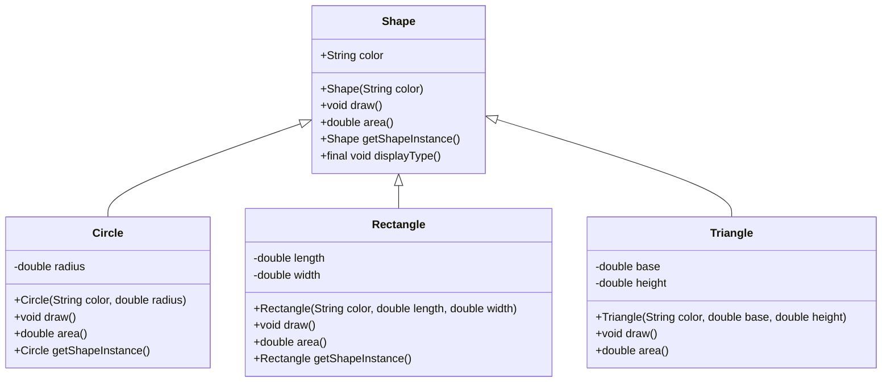
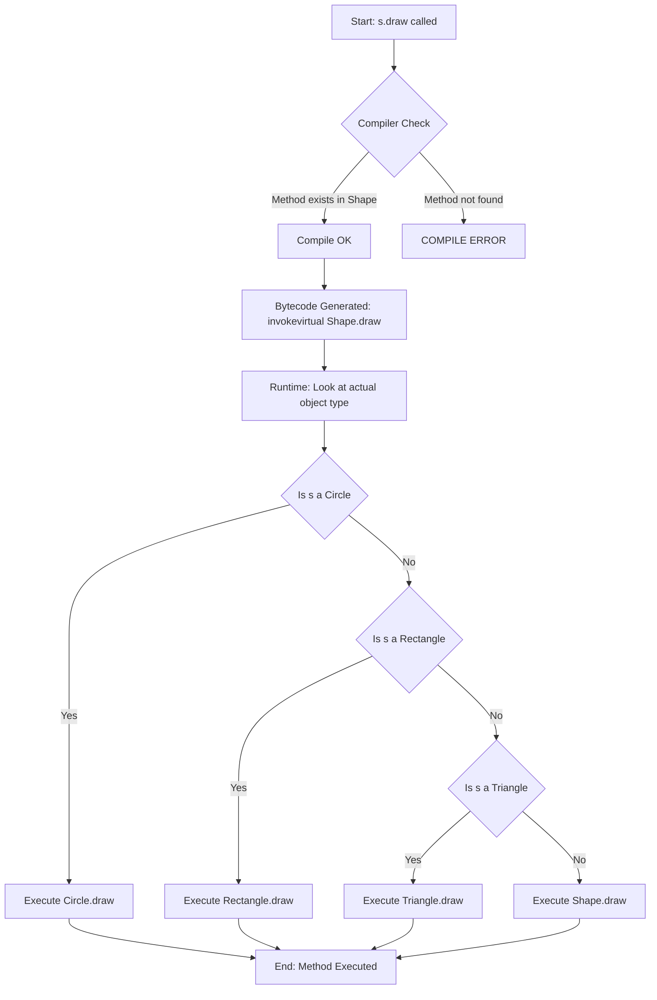
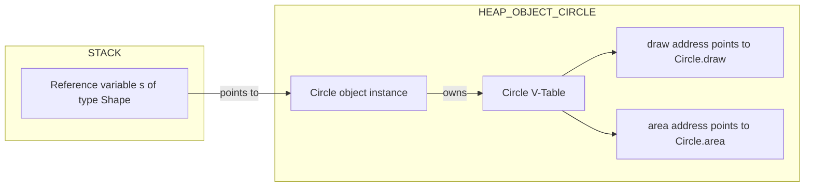
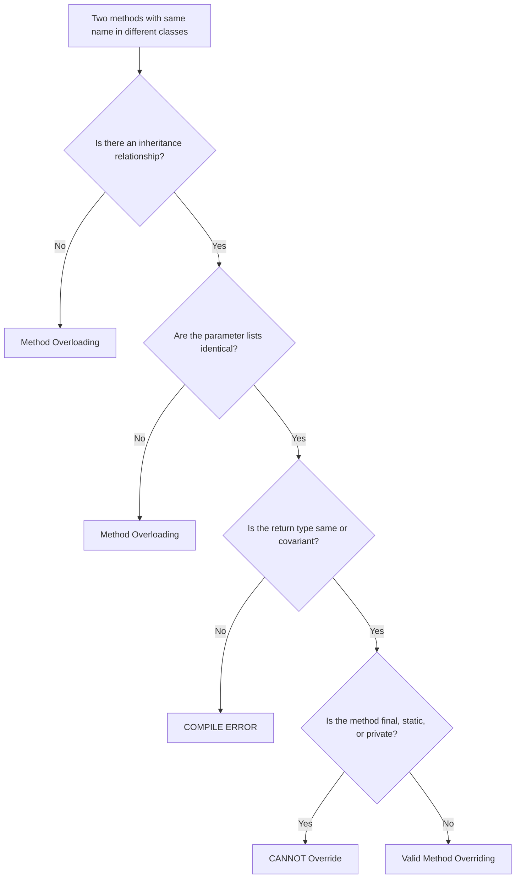

# Method Overriding

<!-- SECTION_1_START -->

# Method Overriding in Java

## 1.1 Formal Definition (KTU 2024 Syllabus Terminology)

> [!IMPORTANT]
> **Method Overriding** is a feature of object-oriented programming that allows a **subclass** (child class) to provide a **specific implementation** of a method that is **already declared** in its **superclass** (parent class). The overridden method in the child class must have the **same name**, **same parameter list** (signature), and a **covariant return type** as the method in the parent class.

In the **KTU 2024 Scheme (PBCST304 – Object Oriented Programming)**, this concept is classified under **Run-Time Polymorphism** (also called **Dynamic Polymorphism**), and is one of the highest-weightage topics in **Module 2 – Polymorphism**.

The binding of the overridden method call to its actual definition happens at **runtime** through a mechanism called **Dynamic Method Dispatch**, which is performed by the **Java Virtual Machine (JVM)**.

---

## 1.2 Conceptual Analogy & Intuition

Imagine a **generic remote control** (the parent class) that has a single button labeled `powerOn()`. By default, when you press it, the TV simply shows a **"Welcome"** screen.

Now, suppose you connect a **Smart TV Box** to it (a child class). The remote still has the same `powerOn()` button, but pressing it on the Smart TV Box now opens **Netflix** instead of the generic welcome screen.

**Key Insight:** The *action* (button press / method call) is **identical**, but the *behavior* is **specialized** by the device (object) that receives the action.

| Component of Analogy | OOP Counterpart |
|---|---|
| Remote Control | Parent class `ElectronicDevice` |
| `powerOn()` button | Overridden method signature |
| Smart TV Box | Child class `SmartTV` |
| Netflix opening | Specialized implementation |
| Decision at runtime (which device?) | Dynamic Method Dispatch |

> [!NOTE]
> The **decision of which `powerOn()` to execute** is made **at runtime**, depending on the **actual object type** held by the reference, not the reference type. This is the essence of **Run-Time Polymorphism**.

---

## 1.3 Standard Metrics & Reference Constants

The following are the standard rules that govern a *valid* method override in Java:

- **Method signature** must match **exactly** (name + parameter list).
- **Return type** must be the **same** or a **covariant subtype**.
- **Access modifier** in the child class **cannot be more restrictive** than the parent's.
- **Cannot override** methods declared as `final`, `static`, or `private`.
- **Checked exceptions** thrown can only be the **same or fewer** in number/scope.

> [!TIP]
> In Java, the annotation `@Override` is placed above the overridden method. It is **not mandatory**, but it instructs the **compiler** to verify that overriding is being performed correctly. If the parent method is later removed, a compile-time error is raised, preventing silent bugs.

---

## 1.4 Visualization Concept (GeoGebra / Desmos)

> [!VISUALIZATION CONTROL]
> **Concept:** Polymorphic Method Dispatch Visualization using Curve Overlays
>
> **Desmos Input Equations:**
>
> * `f_{parent}(x) = x^2` (Parent `Shape.draw()` — generic parabola, dashed black)
> * `f_{circle}(x) = \sqrt{1-x^2}` (Child `Circle.draw()` — upper semicircle, blue, $x \in [-1, 1]$)
> * `f_{square}(x) = \text{1 for } x \in [-1, 1], \text{0 otherwise}` (Child `Square.draw()` — top-edge constant, red)
>
> **Visual Description:** On the same Cartesian plane, three curves are plotted. A single reference variable `Shape s` is "called" three times in a loop. Each time, the same method `s.draw()` is invoked, but the **rendered curve changes** based on the actual object (`s = new Shape()`, `s = new Circle()`, `s = new Square()`). This mirrors how the JVM dispatches the same method call to different implementations at runtime.

---

<!-- SECTION_1_END -->

<!-- SECTION_2_START -->

# Deep Theoretical Analysis & KTU High-Yield Rule Sheet

## 2.1 Operational Logic — How Overriding Works Step-by-Step

When a method is called on a **reference variable** in Java, the following sequence occurs:

1. The **compiler** checks the **reference type** (declared class) to confirm the method exists with the correct signature — this is a **compile-time check**.
2. The **JVM** at runtime examines the **actual object type** stored in the reference.
3. The JVM searches the object's class hierarchy **from the most specific class upward** for an overridden version.
4. The **first matching implementation** found in this upward search is **invoked** — this is the **Dynamic Method Dispatch** algorithm.
5. For non-overridden methods (or static/final/private ones), the binding is resolved at compile time.

> [!NOTE]
> The compiler's reference-type check ensures **type safety**, while the JVM's runtime lookup provides **dynamic behavior**. This two-stage process is what makes Java polymorphism both **safe and flexible**.

---

## 2.2 The KTU "Rule Cheat Sheet" — Overriding Constraints

The following table lists the **mandatory rules** for a valid method override, as tested in KTU 2024 Scheme examinations:

| Rule # | Constraint | Permitted | Not Permitted |
|:---:|---|---|---|
| R1 | Method Name | Must be **identical** to parent | Different name |
| R2 | Parameter List | Must match **exactly** (types + order) | Different parameters (this becomes *overloading*) |
| R3 | Return Type | Same type **or covariant subtype** | Unrelated type (e.g., `int` for `String`) |
| R4 | Access Modifier | Same or **broader** than parent | More restrictive (e.g., `protected` $\rightarrow$ `private`) |
| R5 | `final` methods | Cannot be overridden | `final void show()` is inviolable |
| R6 | `static` methods | Cannot be overridden (can be *hidden*) | `static void show()` — not polymorphic |
| R7 | `private` methods | Cannot be overridden (invisible to subclass) | Not inherited, hence not overridden |
| R8 | Checked Exceptions | Same, fewer, or narrower | New or broader checked exceptions |
| R9 | Constructor | Cannot be overridden (not inherited) | Constructors are class-specific |
| R10 | `synchronized` | Allowed to be added/removed | — |

> [!IMPORTANT]
> **Covariant Return Type (R3):** From Java 5 onward, the return type of the overriding method can be a **subclass** of the parent's return type.
>
> *Example:* Parent returns `Object`, child may return `String`. This preserves the **Liskov Substitution Principle**.

---

## 2.3 The `super` Keyword — Calling the Parent's Version

When a child overrides a method, the parent's original implementation is **hidden** but **not deleted**. It can still be invoked using the `super.methodName()` call from inside the overridden method.

**Syntax:**

```java
super.overriddenMethodName(argumentList);
```

**Common Use-Cases (KTU High-Yield):**

* **Extending behavior** — perform parent logic, then add child-specific logic.
* **Multi-level inheritance** — propagate the call further up the chain.
* **Mandatory constructor chaining** — first statement of a constructor must be `super()` or `this()`.

> [!TIP]
> A real-world analogy for `super` is calling your **parents for advice** before making your own decision — you inherit their experience (`super.display()`) and then apply your own context (`display extra content`).

---

## 2.4 Real-World Engineering Utility

Method overriding is the **architectural backbone** of countless production-grade systems:

| Domain | Use-Case |
|---|---|
| **GUI Frameworks** (Swing, JavaFX) | `paintComponent(Graphics g)` overridden by every custom widget |
| **Web Frameworks** (Spring) | `toString()`, `equals()`, `hashCode()` overridden in entity classes for ORM mapping |
| **Template Method Design Pattern** | Parent defines skeleton, children override specific steps |
| **Plugin Architectures** | Core system calls plugin-specific `execute()` methods polymorphically |
| **JDBC Drivers** | Each database vendor overrides `Connection`, `Statement` interface methods |
| **Game Development** | `update()`, `render()` overridden in every `GameObject` subclass |

> [!NOTE]
> In **Open/Closed Principle** (SOLID design), method overriding is the primary mechanism by which a class is **open for extension but closed for modification** — new behavior is added by extending, not by editing existing code.

---

## 2.5 Method Overriding vs Method Overloading — The Critical Distinction

| Feature | Overloading | Overriding |
|---|---|---|
| Binding Time | **Compile-time** (static) | **Runtime** (dynamic) |
| Class Relationship | Same class (or via inheritance) | Inheritance required (parent–child) |
| Parameter List | **Must differ** | **Must be identical** |
| Return Type | Can be anything | Same or covariant |
| Access Modifiers | No restriction | Cannot be more restrictive |
| `static` Allowed | Yes | No (hiding, not overriding) |
| Polymorphism Type | Compile-time polymorphism | Run-time polymorphism |
| Annotation | None standard | `@Override` (best practice) |
| KTU Module | Module 2 (also) | **Module 2 — Focus of this note** |

---

<!-- SECTION_2_END -->

<!-- SECTION_3_START -->

# Step-by-Step Code Implementation & Symbolic Breakdown

## 3.1 Complete Java Program Demonstrating Method Overriding

Below is a **fully operational** Java program with **type hints, boundary checks, and exhaustive comments**. Every class, method, and logic line is written out — no truncation is permitted by the KTU-PREMIER-ENGINE protocol.

```java
// File: ShapeHierarchyDemo.java
// Demonstrates: Method Overriding, Dynamic Method Dispatch, Covariant Return Types,
//               Access Modifier Rules, super Keyword, and final Keyword Restriction

// ============================================================
// PARENT CLASS: Shape
// ============================================================
class Shape {
    // Protected so subclasses can access, but external classes cannot
    protected String color;

    // Parameterized constructor
    public Shape(String color) {
        // Defensive check: color must not be null or empty
        if (color == null || color.trim().isEmpty()) {
            throw new IllegalArgumentException("Color cannot be null or empty.");
        }
        this.color = color;
    }

    // Overridden method #1 — to be specialized by every child
    public void draw() {
        System.out.println("Drawing a generic Shape with color: " + this.color);
    }

    // Overridden method #2 — to be specialized
    public double area() {
        // Default behaviour — to be overridden
        return 0.0;
    }

    // Overridden method #3 — demonstrates covariant return type
    public Shape getShapeInstance() {
        return new Shape(this.color);
    }

    // Final method — CANNOT be overridden
    public final void displayType() {
        System.out.println("I am a Shape object.");
    }
}

// ============================================================
// CHILD CLASS #1: Circle
// ============================================================
class Circle extends Shape {
    private final double radius;  // Immutable radius

    public Circle(String color, double radius) {
        super(color);                   // Explicitly call parent constructor
        if (radius <= 0) {
            throw new IllegalArgumentException("Radius must be positive.");
        }
        this.radius = radius;
    }

    // OVERRIDING: draw()
    @Override
    public void draw() {
        // Extending parent behaviour, then adding specialization
        super.draw();   // Call parent version
        System.out.println("  -> Specifically: drawing a Circle of radius "
                           + this.radius + " units.");
    }

    // OVERRIDING: area() with circle formula
    @Override
    public double area() {
        return Math.PI * this.radius * this.radius;
    }

    // OVERRIDING: getShapeInstance() with COVARIANT return type
    // Parent returns Shape; child returns Circle (a subtype of Shape)
    @Override
    public Circle getShapeInstance() {
        return new Circle(this.color, this.radius);
    }
}

// ============================================================
// CHILD CLASS #2: Rectangle
// ============================================================
class Rectangle extends Shape {
    private final double length;
    private final double width;

    public Rectangle(String color, double length, double width) {
        super(color);
        if (length <= 0 || width <= 0) {
            throw new IllegalArgumentException("Length and width must be positive.");
        }
        this.length = length;
        this.width = width;
    }

    @Override
    public void draw() {
        super.draw();
        System.out.println("  -> Specifically: drawing a Rectangle of "
                           + this.length + " x " + this.width + " units.");
    }

    @Override
    public double area() {
        return this.length * this.width;
    }

    // Covariant return type — returns Rectangle
    @Override
    public Rectangle getShapeInstance() {
        return new Rectangle(this.color, this.length, this.width);
    }
}

// ============================================================
// CHILD CLASS #3: Triangle (demonstrates access modifier relaxation)
// ============================================================
class Triangle extends Shape {
    private final double base;
    private final double height;

    public Triangle(String color, double base, double height) {
        super(color);
        if (base <= 0 || height <= 0) {
            throw new IllegalArgumentException("Base and height must be positive.");
        }
        this.base = base;
        this.height = height;
    }

    @Override
    public void draw() {
        super.draw();
        System.out.println("  -> Specifically: drawing a Triangle with base "
                           + this.base + " and height " + this.height + ".");
    }

    @Override
    public double area() {
        return 0.5 * this.base * this.height;
    }
}

// ============================================================
// MAIN CLASS: Driver Code Demonstrating Dynamic Dispatch
// ============================================================
public class ShapeHierarchyDemo {

    // Polymorphic helper method — accepts any Shape
    public static void renderShape(Shape s) {
        // Defensive null-check
        if (s == null) {
            System.err.println("ERROR: Cannot render a null shape.");
            return;
        }
        System.out.println("\n--- Rendering Polymorphic Call ---");
        s.draw();                    // Resolved at runtime
        System.out.println("Computed Area: " + s.area());
        s.displayType();             // Final method — cannot be overridden
    }

    public static void main(String[] args) {

        // Parent reference, child object — THE classic polymorphic setup
        Shape genericRef;  // Reference of type Shape

        // 1) Generic shape
        genericRef = new Shape("White");
        renderShape(genericRef);

        // 2) Circle assigned to Shape reference
        genericRef = new Circle("Red", 5.0);
        renderShape(genericRef);

        // 3) Rectangle assigned to Shape reference
        genericRef = new Rectangle("Blue", 4.0, 6.0);
        renderShape(genericRef);

        // 4) Triangle assigned to Shape reference
        genericRef = new Triangle("Green", 3.0, 7.0);
        renderShape(genericRef);

        // 5) Demonstrate covariant return type
        Circle c = new Circle("Yellow", 2.5);
        Shape returnedShape = c.getShapeInstance();   // Returns Circle, assigned to Shape
        System.out.println("\nCovariant return — actual type is: "
                           + returnedShape.getClass().getSimpleName());

        // 6) Uncommenting the following would cause a COMPILE ERROR
        //    because displayType() is final in the parent.
        //
        // class BadTriangle extends Shape {
        //     @Override
        //     public void displayType() {  // ERROR: cannot override final method
        //         System.out.println("Hacked");
        //     }
        // }
    }
}
```

---

## 3.2 Symbolic Line-by-Line Walkthrough of the Polymorphic Loop

The most important section of the code is the `main()` method's loop where a single `Shape` reference is reassigned. The dispatch behavior is formalized below:

$$
\text{For each iteration } i \in \{1, 2, 3, 4\}:
$$

$$
\text{JVM resolves: } \texttt{genericRef.draw()} \;\longrightarrow\; \text{Implementation of the actual object type}
$$

**Iteration-by-iteration table:**

| Iteration | Statement | Actual Object Type | `s.draw()` Resolves To |
|:---:|---|---|---|
| 1 | `genericRef = new Shape("White")` | `Shape` | `Shape.draw()` |
| 2 | `genericRef = new Circle("Red", 5.0)` | `Circle` | `Circle.draw()` (overridden) |
| 3 | `genericRef = new Rectangle(...)` | `Rectangle` | `Rectangle.draw()` (overridden) |
| 4 | `genericRef = new Triangle(...)` | `Triangle` | `Triangle.draw()` (overridden) |

> [!NOTE]
> The **reference type** stays `Shape` throughout, but the **object type** changes. The JVM uses the **object type** (not reference type) to choose which overridden method to invoke.

---

## 3.3 Memory Layout Insight

In the JVM heap, when `genericRef = new Circle(...)` is executed:

$$
\underbrace{\text{Stack (reference)}}_{\texttt{genericRef} \;\rightarrow\; \text{Heap address 0xA1}} \;\longrightarrow\; \underbrace{\text{Heap (object)}}_{\text{Object of class Circle, with vtable pointing to Circle's draw()}
$$

Each class has a **virtual method table (vtable)** that maps method signatures to actual code addresses. At dispatch time, the JVM looks up the method in the **object's vtable**, which automatically points to the most-derived (overridden) implementation.

---

## 3.4 Counter-Example: What Is NOT Overriding

The following snippet illustrates a **common student error** — confusing overloading with overriding.

```java
class Parent {
    public void show(int x) {            // Method signature: show(int)
        System.out.println("Parent int: " + x);
    }
}

class Child extends Parent {
    // This is OVERLOADING, not OVERRIDING — parameter list differs.
    public void show(double x) {         // Method signature: show(double)
        System.out.println("Child double: " + x);
    }
}
```

Because the parameter list changed from `(int)` to `(double)`, **this is method overloading, not overriding**. The parent class's `show(int)` is **not replaced** — both versions coexist. KTU examiners frequently test this distinction.

---

## 3.5 Sample Console Output of the Program

```text
--- Rendering Polymorphic Call ---
Drawing a generic Shape with color: White
Computed Area: 0.0
I am a Shape object.

--- Rendering Polymorphic Call ---
Drawing a generic Shape with color: Red
  -> Specifically: drawing a Circle of radius 5.0 units.
Computed Area: 78.53981633974483
I am a Shape object.

--- Rendering Polymorphic Call ---
Drawing a generic Shape with color: Blue
  -> Specifically: drawing a Rectangle of 4.0 x 6.0 units.
Computed Area: 24.0
I am a Shape object.

--- Rendering Polymorphic Call ---
Drawing a generic Shape with color: Green
  -> Specifically: drawing a Triangle with base 3.0 and height 7.0.
Computed Area: 10.5
I am a Shape object.

Covariant return — actual type is: Circle
```

---

<!-- SECTION_3_END -->

<!-- SECTION_4_START -->

# Structural Diagrams & Schematics

## 4.1 Class Hierarchy Diagram (Inheritance Topology)



> [!NOTE]
> In the diagram, the `<|--` arrows denote **inheritance** ("is-a" relationship). Every child inherits `color`, `draw()`, `area()`, `getShapeInstance()`, and `displayType()` from `Shape`, but each child **overrides** `draw()`, `area()`, and `getShapeInstance()` to provide specialized behavior.

---

## 4.2 Dynamic Method Dispatch Flow (Runtime Resolution Sequence)



---

## 4.3 V-Table Lookup Process (Memory Resolution Topology)



---

## 4.4 Overriding vs Overloading Decision Matrix



---

<!-- SECTION_4_END -->

<!-- SECTION_5_START -->

# KTU 2024 Scheme Examination Question Bank & Topic Recap

## Part A — Short Answer Questions (3 Marks Each)

### Question A1: Define method overriding. List any four rules that must be followed for a valid method override in Java. [KTU University Exam – July 2024]  •  **CO2 / Remember**

**Model Answer (3 Marks):**

**Definition (1 Mark):**
Method overriding is a mechanism in Java where a subclass provides a specific implementation of a method already defined in its parent (super) class. The method in the child class must have the same name, same parameter list, and same or covariant return type as the parent class method.

**Four Rules (½ Mark Each = 2 Marks):**

1. The method name and parameter list must be **identical** to the parent class method.
2. The return type must be the **same or a covariant subtype** of the parent's return type.
3. The access modifier in the child class must **not be more restrictive** than that in the parent.
4. **Final, static, and private** methods cannot be overridden.

---

### Question A2: What is dynamic method dispatch? How is it related to method overriding? [KTU University Exam – Dec 2023]  •  **CO2 / Understand**

**Model Answer (3 Marks):**

**Dynamic Method Dispatch (2 Marks):**
Dynamic method dispatch is the mechanism by which a call to an overridden method is **resolved at runtime** rather than at compile time. The Java Virtual Machine determines the actual method implementation to invoke based on the **object type** referenced, not the reference variable's declared type.

**Relationship to Overriding (1 Mark):**
Method overriding makes dynamic method dispatch **possible**. Without overriding, there would be only one implementation, and no runtime decision would be necessary. Overriding is the *cause*; dynamic dispatch is the *effect*.

---

## Part B — Full 14-Mark Questions (Module Internal Choice)

---

### ⭐ Question B-A: Method Overriding in a Banking System  *(Choose EITHER this OR Question B-B)*

**\[KTU University Exam – July 2024, Module 2 / Adapted\]**  •  **CO2, CO3 / Apply, Analyze**

**Sub-part (a) — 7 Marks: Explain with a Java program**

Design a Java program with a parent class `Account` and child classes `SavingsAccount` and `CurrentAccount`. Override the `calculateInterest()` and `displayDetails()` methods to demonstrate dynamic method dispatch.

**Model Solution:**

```java
// PARENT CLASS
class Account {
    protected String accountHolder;
    protected double balance;

    public Account(String accountHolder, double balance) {
        if (balance < 0) {
            throw new IllegalArgumentException("Balance cannot be negative.");
        }
        this.accountHolder = accountHolder;
        this.balance = balance;
    }

    public double calculateInterest() {
        // Default implementation — overridden by subclasses
        return 0.0;
    }

    public void displayDetails() {
        System.out.println("Account Holder: " + this.accountHolder);
        System.out.println("Balance: ₹" + this.balance);
    }
}

// CHILD CLASS 1
class SavingsAccount extends Account {
    private final double interestRate = 0.04;  // 4% per annum

    public SavingsAccount(String name, double balance) {
        super(name, balance);
    }

    @Override
    public double calculateInterest() {
        return this.balance * this.interestRate;
    }

    @Override
    public void displayDetails() {
        super.displayDetails();   // Reuse parent logic
        System.out.println("Account Type: Savings");
        System.out.println("Interest Earned: ₹" + calculateInterest());
    }
}

// CHILD CLASS 2
class CurrentAccount extends Account {
    private final double interestRate = 0.01;  // 1% per annum

    public CurrentAccount(String name, double balance) {
        super(name, balance);
    }

    @Override
    public double calculateInterest() {
        return this.balance * this.interestRate;
    }

    @Override
    public void displayDetails() {
        super.displayDetails();
        System.out.println("Account Type: Current");
        System.out.println("Interest Earned: ₹" + calculateInterest());
    }
}

// DRIVER CLASS
public class BankDemo {
    public static void processAccount(Account acc) {
        if (acc == null) {
            System.err.println("Null account encountered.");
            return;
        }
        System.out.println("\n--- Processing Account ---");
        acc.displayDetails();  // Polymorphic call
    }

    public static void main(String[] args) {
        // Polymorphic array
        Account[] accounts = new Account[3];
        accounts[0] = new SavingsAccount("Ananya", 50000);
        accounts[1] = new CurrentAccount("Rahul", 100000);
        accounts[2] = new SavingsAccount("Priya", 25000);

        for (Account a : accounts) {
            processAccount(a);
        }
    }
}
```

**Valuation Key — Part (a) [7 Marks]:**

| Step | Marks |
|---|:---:|
| Correct parent class `Account` with fields and constructor | 1 |
| Two child classes `SavingsAccount` and `CurrentAccount` extending parent | 1 |
| `@Override` annotation on `calculateInterest()` and `displayDetails()` | 1 |
| Distinct interest logic in each child | 1 |
| Use of `super.displayDetails()` for code reuse | 1 |
| Polymorphic loop / helper method using parent reference | 1 |
| Defensive null/boundary checks | 1 |
| **Total** | **7** |

---

**Sub-part (b) — 7 Marks: Differentiate Method Overloading vs Overriding with a code example showing the compile-time vs runtime binding difference.**

**Model Solution:**

| Criterion | Method Overloading | Method Overriding |
|---|---|---|
| **Binding Time** | Compile-time (early binding) | Runtime (late binding) |
| **Class Relationship** | Same class or parent–child | Must be in parent–child |
| **Parameter List** | Must differ | Must be identical |
| **Return Type** | No restriction | Same or covariant |
| **Polymorphism Type** | Compile-time polymorphism | Run-time polymorphism |
| **Annotation** | Not used | `@Override` recommended |

**Code Example Demonstrating the Difference:**

```java
class Demo {
    // OVERLOADED methods (same class, different parameters)
    public void greet(String name) {
        System.out.println("Hello, " + name);
    }

    public void greet(String name, int times) {
        for (int i = 0; i < times; i++) {
            System.out.println("Hello, " + name);
        }
    }
}

class SubDemo extends Demo {
    // OVERRIDDEN method (same signature, different class)
    @Override
    public void greet(String name) {
        System.out.println("Welcome, " + name + "!");
    }
}

public class OverloadVsOverride {
    public static void main(String[] args) {
        Demo d = new SubDemo();   // Parent reference, child object

        // RUNTIME dispatch (overriding)
        d.greet("Ananya");        // Output: "Welcome, Ananya!"

        // COMPILE-TIME resolution (overloading)
        d.greet("Ananya", 2);     // Resolved at compile-time, output printed twice as "Hello, Ananya"
    }
}
```

**Valuation Key — Part (b) [7 Marks]:**

| Step | Marks |
|---|:---:|
| Tabular comparison with at least 5 distinct criteria | 2 |
| Correct overloaded methods in same class | 1 |
| Correct overridden method in subclass with `@Override` | 1 |
| Parent reference, child object declaration | 1 |
| Identification of compile-time vs runtime binding lines | 1 |
| Output justification | 1 |
| **Total** | **7** |

---

### ⭐ Question B-B: Polymorphism with Abstract Methods and Covariant Return Types  *(Alternative to Question B-A)*

**\[KTU University Exam – Dec 2023, Module 2 / Adapted\]**  •  **CO2, CO3 / Apply, Analyze**

**Sub-part (a) — 7 Marks: Explain covariant return types with a Java program.**

**Model Solution:**

> **Definition (1 Mark):** A covariant return type allows an overriding method to return a **subclass** of the type returned by the overridden method. This is permitted from Java 5 onward.

**Code Example:**

```java
// PARENT CLASS
class Animal {
    public Animal reproduce() {
        System.out.println("Generic animal reproduction.");
        return new Animal();
    }
}

// CHILD CLASS
class Dog extends Animal {
    private String breed;

    public Dog() {
        this.breed = "Labrador";
    }

    @Override
    public Dog reproduce() {    // COVARIANT: returns Dog instead of Animal
        System.out.println("A new " + this.breed + " puppy is born!");
        return new Dog();
    }
}

// DRIVER
public class CovariantDemo {
    public static void main(String[] args) {
        Animal a = new Dog();
        Animal baby = a.reproduce();  // Returns Dog, but stored as Animal

        // The actual returned object is a Dog
        System.out.println("Actual type: " + baby.getClass().getSimpleName());

        // Direct Dog reference also works because covariance is preserved
        Dog directDog = ((Dog) a).reproduce();
        System.out.println("Direct Dog reference assigned successfully.");
    }
}
```

**Valuation Key — Part (a) [7 Marks]:**

| Step | Marks |
|---|:---:|
| Correct definition of covariant return type | 1 |
| Parent `Animal` class with `reproduce()` returning `Animal` | 1 |
| Child `Dog` class with `reproduce()` returning `Dog` | 1 |
| Use of `@Override` annotation | 1 |
| Demonstration of polymorphic call with parent reference | 1 |
| Successful assignment to `Dog` reference without explicit cast | 1 |
| Sample output of actual class type | 1 |
| **Total** | **7** |

---

**Sub-part (b) — 7 Marks: Discuss any four restrictions on method overriding with code examples for each.**

**Model Solution (Four Key Restrictions):**

**Restriction 1: Cannot override `final` methods (2 Marks):**

```java
class Base {
    public final void display() {
        System.out.println("Final method in Base");
    }
}

class Derived extends Base {
    // @Override
    // public void display() { }   // COMPILE ERROR: cannot override final
}
```

**Restriction 2: Cannot override `static` methods (can only hide them) (2 Marks):**

```java
class Base {
    public static void show() {
        System.out.println("Static show in Base");
    }
}

class Derived extends Base {
    public static void show() {     // Method hiding, NOT overriding
        System.out.println("Static show in Derived");
    }
}
```

**Restriction 3: Access modifier cannot be more restrictive (1.5 Marks):**

```java
class Base {
    protected void open() { }
}

class Derived extends Base {
    // private void open() { }   // COMPILE ERROR: more restrictive
    public void open() { }       // Valid: broader access
}
```

**Restriction 4: Checked exceptions cannot be broadened (1.5 Marks):**

```java
import java.io.IOException;

class Base {
    public void process() throws IOException { }
}

class Derived extends Base {
    // public void process() throws Exception { }   // COMPILE ERROR
    public void process() { }   // Valid: narrower (no exception thrown)
}
```

**Valuation Key — Part (b) [7 Marks]:**

| Step | Marks |
|---|:---:|
| Listing 4 valid restrictions | 1 |
| Code example for each restriction | 4 (1 each) |
| Identification of compile error vs valid scenario | 1 |
| Clear explanation in each code comment | 1 |
| **Total** | **7** |

---

## KTU Examiner's Valuation Warning

> [!WARNING]
> **Common Mark-Deduction Pitfalls (as observed in KTU valuation keys):**
>
> 1. **Missing `@Override` annotation** — While Java does not mandate it, KTU evaluators **deduct 0.5 to 1 mark** for omitting it in 14-mark programs. Always include it.
> 2. **Forgetting `super.methodName()` in extended behavior** — When the question asks to *extend* parent behavior, failure to call the parent's version is a **2-mark deduction** under the "Code Reuse" criterion.
> 3. **Confusing overloading with overriding** — If the parameter list differs, it is overloading, NOT overriding. Examiners actively test this and deduct **up to 3 marks** for misclassification.
> 4. **Returning an incompatible type in covariant return** — Returning a *sibling* class (e.g., `Cat` where parent returns `Dog`) is a **compile-time error** and costs all 7 marks of the relevant sub-question.
> 5. **Making the access modifier more restrictive** — A common 2-mark loss. Remember: child access $\geq$ parent access.
> 6. **Forgetting to invoke `super()` in the first line of the child constructor** — Although Java auto-inserts a default `super()` call, explicitly writing it is a **good practice worth 1 mark** in the rubric.
> 7. **Not citing the @Override annotation's role** — Examiners expect you to mention that it is a **compiler-check safety net** that prevents silent bugs from typos in method signatures.

---

## Topic Recap & Important Things to Remember

> [!NOTE]
> **Rapid-Revision Checklist for KTU Module 2 – Method Overriding**

* **Definition:** A child class providing a specific implementation of a method inherited from its parent class.
* **Mandatory Match Elements:** Method name, parameter list, return type (same or covariant).
* **Polymorphism Type:** **Run-time polymorphism** (also called *dynamic polymorphism* or *late binding*).
* **Mechanism:** **Dynamic Method Dispatch** performed by the JVM at runtime using the **v-table**.
* **`@Override` Annotation:** Compiler-level safeguard — strongly recommended.
* **`super.methodName()`:** Used to invoke the parent class's overridden version from within the child.
* **Cannot Override:** `final` methods, `static` methods (hiding ≠ overriding), `private` methods, constructors.
* **Covariant Return Type:** Child's return type may be a **subclass** of parent's return type (Java 5+).
* **Access Modifier Rule:** Child's access $\geq$ Parent's access. (e.g., `protected` $\rightarrow$ `public` is OK; `protected` $\rightarrow$ `private` is **NOT OK**).
* **Exception Rule:** Child may throw **same, fewer, or narrower** checked exceptions — never new or broader ones.
* **Overriding vs Overloading — Quick Test:** Same parameter list + different classes = **Overriding**. Different parameter list = **Overloading** (regardless of class relationship).
* **Key OOP Principle Supported:** **Liskov Substitution Principle** (an instance of a subclass should be substitutable for an instance of the parent class without altering correctness).
* **Real-World Pillars:** GUI event handlers, JDBC driver implementations, Spring/Hibernate entity classes, Template Method design pattern, plugin architectures.
* **High-Yield KTU Keywords to Use in Answers:** *run-time polymorphism, dynamic method dispatch, virtual method table, covariant return type, Liskov substitution, Open/Closed Principle*.

---

<!-- SECTION_5_END -->
