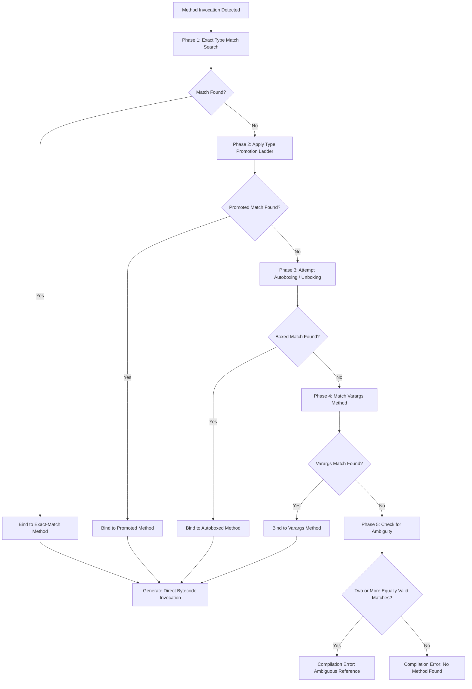
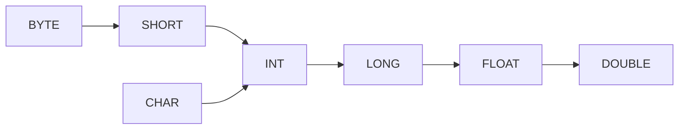
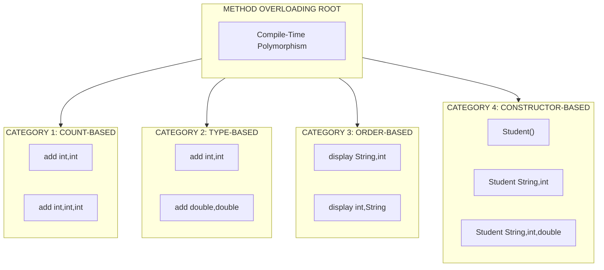
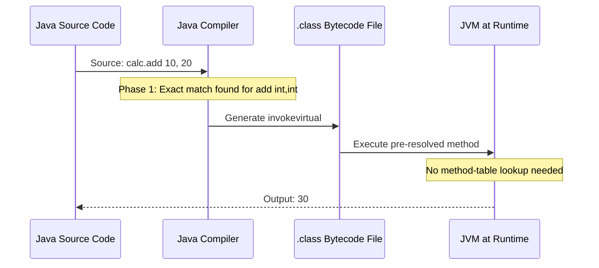

# Polymorphism :- Method Overloading

<!-- SECTION_1_START -->
# 1. Polymorphism: Method Overloading — Core Foundations

## 1.1 Formal Definition (KTU 2024 Syllabus Standard)

> [!NOTE]
> **Method Overloading** is a core mechanism of **Compile-Time Polymorphism** (also called **Static Polymorphism** or **Early Binding**) that allows a class to declare **multiple methods with the identical name** but with **dissimilar parameter lists** (varying in number, type, or order of parameters) within the **same class** or across a **parent–child inheritance chain**.

In the context of the **Object-Oriented Programming (OOP)** paradigm, polymorphism literally means *"many forms"*. Method overloading is the mechanism that gives *"many forms"* to a *single method name*. The Java compiler resolves which overloaded method to invoke **at compile time**, *before* the program ever runs, by inspecting the **method signature** (method name + parameter list).

> [!IMPORTANT]
> **Method Signature Rule:** In Java, the compiler differentiates overloaded methods **ONLY** by the **method signature**, which includes:
> 1. **Method Name** (must be identical)
> 2. **Parameter List** (must differ in number, type, or order)
>
> The **return type**, **access modifier**, and **exception list** are **NOT** part of the method signature for the purpose of overloading. Two methods differing *only* in return type will cause a **compilation error**.

---

## 1.2 Conceptual Analogy — "The Universal Word 'Make'"

Imagine a coffee shop with a barista. If you walk up to the counter and say **"Make"**:

- If you say **"Make a coffee"** → the barista makes an espresso.
- If you say **"Make a tea"** → the barista makes green tea.
- If you say **"Make a cold drink"** → the barista makes an iced beverage.

The **action word is the same ("Make")**, but the **inputs (parameters)** differ. The barista's brain *resolves* the correct recipe **before starting** — this is exactly what the **Java compiler** does with overloaded methods at **compile time**.

| Barista (Real World) | Java Compiler (Programming World) |
| :--- | :--- |
| Action verb: **"Make"** | Method name: **`add()`** |
| Ingredients you specify | Arguments (parameters) passed |
| Decides recipe *before cooking* | Resolves method *before execution* |
| Same word, different forms | Same name, different forms = **Polymorphism** |

---

## 1.3 Where Method Overloading Sits in Polymorphism

Polymorphism has two broad branches. Method overloading belongs to the *left* branch:

- **A) Compile-Time Polymorphism (Static Binding / Early Binding)** → Achieved through **Method Overloading**.
- **B) Run-Time Polymorphism (Dynamic Binding / Late Binding)** → Achieved through **Method Overriding** (covered in the next sub-topic).

> [!TIP]
> **Why "Compile-Time"?** Because the compiler analyzes the argument types and matches them to the *exact* method signature during the **`.java` → `.class` compilation phase**, producing direct bytecode invocations (e.g., `invokevirtual #4`) — no runtime lookup table is required.

---

## 1.4 The Three Pillars of Overloading (Quick Glance)

A method can be overloaded by varying **any one** of these three attributes of the parameter list:

1. **Number of parameters** → `add(int a, int b)` vs. `add(int a, int b, int c)`
2. **Data type of parameters** → `add(int a, int b)` vs. `add(double a, double b)`
3. **Order of parameters** → `add(String name, int id)` vs. `add(int id, String name)`

> [!WARNING]
> Changing **only the return type** (e.g., `int add(int a, int b)` vs. `double add(int a, int b)`) is **NOT method overloading** — it is a **compilation error**.

---

## 1.5 GeoGebra / Desmos Visualization — Type Promotion Hierarchy

Although method overloading is primarily a code-level concept, the **automatic type promotion** rules used during overload resolution can be visualized as a **directed acyclic graph (DAG)** of widening conversions.

> [!VISUALIZATION CONTROL]
> **Concept:** Java Primitive Type Promotion Ladder (Widening Conversion Path)
>
> **Desmos / GeoGebra Input (Conceptual Coordinate Mapping):**
> * `L1:` Line segment from $(0, 1)$ → $(5, 1)$ labeled `byte`
> * `L2:` Line segment from $(0, 2)$ → $(5, 2)$ labeled `short`
> * `L3:` Line segment from $(0, 3)$ → $(5, 3)$ labeled `int`
> * `L4:` Line segment from $(0, 4)$ → $(5, 4)$ labeled `long`
> * `L5:` Line segment from $(0, 5)$ → $(5, 5)$ labeled `float`
> * `L6:` Line segment from $(0, 6)$ → $(5, 6)$ labeled `double`
> * Arrow from `char` node at $(2, 0.5)$ → `int` at $(3, 3)$
>
> **Visual Description:** The student should observe a **vertical ladder** where each primitive type is a *rung*. An arrow flows **upward** from smaller to larger types, illustrating that when no exact-match overload exists, the compiler **automatically widens** the argument up the ladder to find a matching method. `char` is a *branching path* that flows only into `int`.

<!-- SECTION_1_END -->

<!-- SECTION_2_START -->
# 2. Deep Theoretical Analysis & KTU High-Yield Rule Sheet

## 2.1 The Compiler's Resolution Algorithm (Step-by-Step)

When you invoke an overloaded method, the **Java compiler** applies the following **two-phase resolution algorithm** to determine which method definition to bind the call to:

### Phase 1: Exact Match
The compiler searches for an overloaded method whose parameter types **exactly match** the types of the arguments passed in the call. If found, that method is invoked — no promotion occurs.

### Phase 2: Type Promotion (Widening Conversion)
If no exact match is found, the compiler applies the **automatic type promotion** rules in the order specified below. The **first** matching method found is selected.

**Widening Conversion Ladder (in strict priority order):**

| Priority | Source Type | Promotes To (in order) |
| :---: | :---: | :--- |
| 1 | `byte` | `short` → `int` → `long` → `float` → `double` |
| 2 | `short` | `int` → `long` → `float` → `double` |
| 3 | `char` | `int` → `long` → `float` → `double` |
| 4 | `int` | `long` → `float` → `double` |
| 5 | `long` | `float` → `double` |
| 6 | `float` | `double` |

> [!IMPORTANT]
> **No Narrowing Allowed:** The compiler will **never** automatically convert a *larger* type to a *smaller* type (e.g., `double` → `int`). Doing so requires an **explicit cast** and may cause data loss.

> [!NOTE]
> **Autoboxing / Unboxing Rule (Java 5+):** After Phase 1 and Phase 2 both fail, the compiler attempts **autoboxing/unboxing** (e.g., `int` ↔ `Integer`, `double` ↔ `Double`) before finally falling back to `varargs`.

---

## 2.2 KTU Formula Sheet — Method Overloading Rules Cheat Sheet

The table below is the **authoritative reference** for KTU 2024 Scheme ESE (End Semester Examination) questions on method overloading. Memorize every row.

| # | Rule | Valid? | Compilation Result |
| :---: | :--- | :---: | :--- |
| 1 | Different **number** of parameters | ✅ Yes | Compiles successfully |
| 2 | Different **data type** of parameters | ✅ Yes | Compiles successfully |
| 3 | Different **order** of parameters | ✅ Yes | Compiles successfully |
| 4 | Different **return type only** | ❌ No | **Compile-time error** |
| 5 | Different **access modifier only** (with same params) | ❌ No | **Compile-time error** |
| 6 | Different **exception list only** (with same params) | ❌ No | **Compile-time error** |
| 7 | `static` vs non-`static` method (same params) | ❌ No | **Compile-time error** |
| 8 | Overloading **main method** in Java | ✅ Yes | Compiles; JVM calls only `public static void main(String[] args)` |
| 9 | Overloading across **parent–child** classes (Inheritance) | ✅ Yes | Compiles; child can overload parent's methods |
| 10 | **Constructor overloading** within same class | ✅ Yes | Compiles; achieves multiple object initialization paths |

---

## 2.3 Why "Why" and "How" — Engineering Justification

### The "Why" — Why Do We Need Method Overloading?
Without overloading, programmers would be forced to invent **cryptic, unrelated method names** for what is conceptually the *same operation*. For example, you would need `addInt()`, `addDouble()`, `addThreeInts()` instead of a single intuitive `add()`. This:
- **Hurts readability** of the API
- **Increases cognitive load** on the programmer
- **Violates the principle of clean naming** (similar to how *Java's `System.out.println()`* intelligently handles 10+ data types via overloading)

### The "How" — How Does It Improve Production Code?
1. **API Intuitiveness:** The `java.lang.Math` class overloads `abs()` for `int`, `long`, `float`, and `double` — one name, four correct type-handling implementations.
2. **Readability:** `println(int)`, `println(String)`, `println(boolean)` — all clearly express *"print this value"*.
3. **Polymorphic Constructors:** Object initialization can be customized via constructor overloading (e.g., `new Date()`, `new Date(year, month, day)`).
4. **Compile-Time Safety:** Since binding occurs at compile time, overloaded methods are **faster** than overridden methods (no virtual method table lookup at runtime).

> [!TIP]
> **Real-World Production Use:** Android's `View.setOnClickListener()`, Java's `String.valueOf()` (overloaded for 9+ types), and Spring Framework's `BeanFactory.getBean()` are all **production-grade examples** of method overloading in action.

---

## 2.4 Ambiguity Errors — The "Compile-Time Trap"

An **ambiguity error** occurs when the compiler finds **two or more equally valid matches** for a method call after applying promotion rules. This is a **common KTU exam pitfall**.

**Classic Example (Mental Trace):**
- `void show(int a, long b)` exists.
- `void show(long a, int b)` exists.
- Calling `show(10, 20)` → The compiler **cannot** decide whether to widen `20` to `long` (matching method 1) or widen `10` to `long` (matching method 2). **Compilation fails** with *"reference to show is ambiguous"*.

<!-- SECTION_2_END -->

<!-- SECTION_3_START -->
# 3. Step-by-Step Code Implementation & Execution Trace

## 3.1 Foundational Example — Overloading by Parameter Count and Type

The following program demonstrates the three pillars of method overloading in a single cohesive class.

```java
// File: Calculator.java
// Demonstration of Method Overloading — Compile-Time Polymorphism

class Calculator {

    // Overload #1: Two int parameters (parameter COUNT differs)
    public int add(int a, int b) {
        return a + b;
    }

    // Overload #2: Three int parameters (parameter COUNT differs)
    public int add(int a, int b, int c) {
        return a + b + c;
    }

    // Overload #3: Two double parameters (parameter TYPE differs)
    public double add(double a, double b) {
        return a + b;
    }

    // Overload #4: String concatenation (parameter TYPE differs)
    public String add(String a, String b) {
        return a + " " + b;
    }

    // Overload #5: Order of parameters (String first, then int)
    public void display(String name, int id) {
        System.out.println("Name: " + name + ", ID: " + id);
    }

    // Overload #5-alternative: Order swapped (int first, then String)
    public void display(int id, String name) {
        System.out.println("ID: " + id + ", Name: " + name);
    }
}

public class Main {
    public static void main(String[] args) {
        Calculator calc = new Calculator();

        // Compile-time resolution by the Java compiler:
        System.out.println("add(2 ints)        = " + calc.add(10, 20));
        //   Resolves to: add(int, int) — exact match, no promotion.

        System.out.println("add(3 ints)        = " + calc.add(10, 20, 30));
        //   Resolves to: add(int, int, int) — parameter count differs.

        System.out.println("add(2 doubles)     = " + calc.add(10.5, 20.5));
        //   Resolves to: add(double, double) — exact type match.

        System.out.println("add(2 Strings)     = " + calc.add("Hello", "World"));
        //   Resolves to: add(String, String) — reference type match.

        calc.display("Alice", 101);
        //   Resolves to: display(String, int) — exact order match.

        calc.display(102, "Bob");
        //   Resolves to: display(int, String) — exact order match.
    }
}
```

**Output (Compile-Time Binding Result):**
```
add(2 ints)        = 30
add(3 ints)        = 60
add(2 doubles)     = 31.0
add(2 Strings)     = Hello World
Name: Alice, ID: 101
ID: 102, Name: Bob
```

**Resolution Trace — Line by Line:**

| Line of Code | Compiler's Search | Method Selected |
| :--- | :--- | :--- |
| `calc.add(10, 20)` | Exact match search → `add(int, int)` found | `add(int, int)` |
| `calc.add(10, 20, 30)` | Exact match search → `add(int, int, int)` found | `add(int, int, int)` |
| `calc.add(10.5, 20.5)` | Exact match → `add(double, double)` found | `add(double, double)` |
| `calc.add("Hello", "World")` | Exact match → `add(String, String)` found | `add(String, String)` |
| `calc.display("Alice", 101)` | Order match → `display(String, int)` | `display(String, int)` |

---

## 3.2 Type Promotion Example — The Widening Conversion in Action

```java
// File: PromotionDemo.java
// Demonstrates automatic type promotion during overload resolution

class Display {
    public void show(int a) {
        System.out.println("int method called: " + a);
    }

    public void show(double a) {
        System.out.println("double method called: " + a);
    }

    public void show(long a) {
        System.out.println("long method called: " + a);
    }
}

public class PromotionDemo {
    public static void main(String[] args) {
        Display d = new Display();

        d.show(10);
        // Step 1: Exact match search for show(int) → FOUND.
        // Output: int method called: 10

        d.show(10.5f);
        // Step 1: Exact match for show(float) → NOT FOUND.
        // Step 2: Type promotion ladder for float: float → double.
        // Step 3: show(double) FOUND.
        // Output: double method called: 10.5

        d.show('A');
        // Step 1: Exact match for show(char) → NOT FOUND.
        // Step 2: char promotion ladder: char → int → long → float → double.
        // Step 3: First match in priority order: show(int) wins.
        // Output: int method called: 65   (ASCII value of 'A')

        d.show(100L);
        // Step 1: Exact match for show(long) → FOUND.
        // Output: long method called: 100
    }
}
```

**Output:**
```
int method called: 10
double method called: 10.5
int method called: 65
long method called: 100
```

> [!IMPORTANT]
> **Observation for KTU Exam:** Notice how `d.show('A')` resolves to `show(int)` and **prints 65**, not `'A'`. This is because `char` is **first promoted to `int`** (its ASCII/Unicode value), and since `show(int)` exists, the compiler stops searching the ladder. This is a frequently tested edge case in KTU ESE papers.

---

## 3.3 Constructor Overloading Example

```java
// File: Student.java
// Demonstrates constructor overloading — a special form of method overloading

class Student {
    private String name;
    private int rollNo;
    private double cgpa;

    // Constructor #1: No-argument constructor
    public Student() {
        this.name = "Not Assigned";
        this.rollNo = 0;
        this.cgpa = 0.0;
        System.out.println("Default constructor called.");
    }

    // Constructor #2: Two parameters (name, rollNo)
    public Student(String name, int rollNo) {
        this.name = name;
        this.rollNo = rollNo;
        this.cgpa = 0.0;
        System.out.println("Two-arg constructor called.");
    }

    // Constructor #3: Three parameters (name, rollNo, cgpa)
    public Student(String name, int rollNo, double cgpa) {
        this.name = name;
        this.rollNo = rollNo;
        this.cgpa = cgpa;
        System.out.println("Three-arg constructor called.");
    }

    public void displayInfo() {
        System.out.println("Name: " + name + ", Roll: " + rollNo + ", CGPA: " + cgpa);
    }
}

public class ConstructorOverloadDemo {
    public static void main(String[] args) {
        Student s1 = new Student();
        //   Resolves to: Student() — no-arg constructor.

        Student s2 = new Student("Kavya", 45);
        //   Resolves to: Student(String, int).

        Student s3 = new Student("Arjun", 12, 9.2);
        //   Resolves to: Student(String, int, double).

        s1.displayInfo();
        s2.displayInfo();
        s3.displayInfo();
    }
}
```

**Output:**
```
Default constructor called.
Two-arg constructor called.
Three-arg constructor called.
Name: Not Assigned, Roll: 0, CGPA: 0.0
Name: Kavya, Roll: 45, CGPA: 0.0
Name: Arjun, Roll: 12, CGPA: 9.2
```

---

## 3.4 Ambiguity Error — The Classic KTU Trap

```java
// File: AmbiguityDemo.java
// Demonstrates compile-time ambiguity error (a KTU favorite exam question)

class Demo {
    public void test(int a, long b) {
        System.out.println("int-long method called");
    }

    public void test(long a, int b) {
        System.out.println("long-int method called");
    }
}

public class AmbiguityDemo {
    public static void main(String[] args) {
        Demo d = new Demo();
        d.test(10, 20);
        //   COMPILATION ERROR: reference to test is ambiguous
        //   Reason: Compiler cannot decide whether to widen
        //   '20' to long (matching test(int, long))
        //   OR widen '10' to long (matching test(long, int)).
    }
}
```

**Compilation Output:**
```
error: reference to test is ambiguous, both method test(int,long)
       and method test(long,int) match
       d.test(10, 20);
         ^
1 error
```

> [!WARNING]
> **KTU Exam Tip:** When asked to *"predict the output"* in such a scenario, the correct answer is **"Compilation Error"** — *not* any runtime output. Many students incorrectly assume the program will run and print one of the two messages, costing them **3 marks** in valuation.

---

## 3.5 Varargs Overloading (Java 5+ Feature)

```java
// File: VarargsDemo.java
// Overloading with variable arguments (varargs)

class Sum {
    // Overload #1: Fixed two parameters
    public int total(int a, int b) {
        return a + b;
    }

    // Overload #2: Varargs (zero or more integers)
    public int total(int... numbers) {
        int sum = 0;
        for (int num : numbers) {
            sum += num;
        }
        return sum;
    }
}

public class VarargsDemo {
    public static void main(String[] args) {
        Sum s = new Sum();
        System.out.println("Fixed (2 args): " + s.total(10, 20));
        //   Resolves to: total(int, int) — exact match preferred over varargs.

        System.out.println("Varargs (0 args): " + s.total());
        //   Resolves to: total(int... numbers) — only varargs accepts 0 args.

        System.out.println("Varargs (4 args): " + s.total(1, 2, 3, 4));
        //   Resolves to: total(int... numbers) — only varargs accepts 4 args.
    }
}
```

> [!IMPORTANT]
> **Old Method Wins Rule:** When an **exact-match fixed-arity method** and a **varargs method** are both applicable, the compiler **always prefers the fixed-arity method**. Varargs is the *last-resort fallback*.

<!-- SECTION_3_END -->

<!-- SECTION_4_START -->
# 4. Structural Diagrams & Schematics

## 4.1 The Compile-Time Resolution Flow (Mermaid)

The diagram below models the **exact algorithm** the Java compiler executes when resolving an overloaded method call.



---

## 4.2 Type Promotion Ladder (Mermaid DAG)

This diagram visualizes the **widening conversion paths** the compiler traverses during Phase 2 of resolution.



---

## 4.3 Method Overloading Classification Block Diagram

This modular block diagram classifies the **four categories** of method overloading observed in KTU 2024 syllabus.



---

## 4.4 Memory Architecture — Static Binding Bytecode Generation

This sequential diagram illustrates **what happens at the bytecode level** when overloaded methods are compiled.



<!-- SECTION_4_END -->

<!-- SECTION_5_START -->
# 5. KTU 2024 Scheme Examination Question Bank & Topic Recap

## 5.1 PART A — Short Answer Questions (3 Marks Each)

> [!NOTE]
> **KTU Pattern:** Part A questions test the **Remember** and **Understand** levels of Revised Bloom's Taxonomy. Answers should be **concise (3–5 lines)** with precise definitions and examples.

---

### Question A1 [KTU University Exam — July 2024]

**Q: Define polymorphism. Differentiate between compile-time polymorphism and run-time polymorphism.**

**Model Answer (3 Marks):**
* **Definition (1 Mark):** Polymorphism is the ability of an object to take many forms. In OOP, it allows a single interface to represent different underlying forms (data types or methods).
* **Compile-Time Polymorphism (1 Mark):** Achieved through **method overloading**. The compiler resolves which method to invoke at compile time by inspecting the method signature. Also called *static binding* or *early binding*. Example: `add(int, int)` vs. `add(double, double)`.
* **Run-Time Polymorphism (1 Mark):** Achieved through **method overriding**. The JVM resolves which overridden method to invoke at runtime using the actual object's type. Also called *dynamic binding* or *late binding*. Example: A parent class reference invoking a child class overridden method.

---

### Question A2 [KTU University Exam — Dec 2023]

**Q: What is method overloading? List any four rules that must be followed to overload a method in Java.**

**Model Answer (3 Marks):**
* **Definition (1 Mark):** Method overloading is the process of defining multiple methods with the **same name** but **different parameter lists** within the same class (or in a parent–child class pair), resolved at compile time.
* **Rules (2 Marks — any four):**
  1. Parameter lists must differ in **number**, **type**, or **order**.
  2. **Return type alone cannot** differentiate overloaded methods.
  3. **Access modifiers alone cannot** differentiate overloaded methods.
  4. Overloaded methods **can** have different return types, but the parameter list *must* differ.
  5. The `main` method **can** be overloaded, but JVM always calls `public static void main(String[] args)`.

---

## 5.2 PART B — Long Answer Questions (14 Marks Each, Internal Choice)

> [!NOTE]
> **KTU Pattern:** Each Part B question carries **14 marks** split into two sub-parts: **(a) 7 marks** and **(b) 7 marks**. Part (a) typically tests **Understand / Apply**, while part (b) tests **Apply / Analyze**. **Internal choice** means the student answers **either** Question A *or* Question B.

---

### Question 5A (14 Marks) [KTU University Exam — July 2024]

**(a)** Explain compile-time polymorphism in Java with a suitable example demonstrating method overloading by changing the **number of parameters** and the **type of parameters**. **(7 Marks)**

**(b)** Write a Java program to demonstrate **type promotion** in method overloading. Explain the output produced when an `int` and a `char` value are passed as arguments. **(7 Marks)**

#### Model Solution — Part (a) [7 Marks]

**Conceptual Explanation (2 Marks):**
Compile-time polymorphism (also called static binding) is resolved by the Java compiler during compilation. The compiler determines which overloaded method to invoke by examining the method signature (name + parameter list). It selects the *most specific* matching method. The `invokevirtual` bytecode instruction is generated with a direct reference to the chosen method, making execution faster than runtime polymorphism.

**Program Code (3 Marks):**

```java
class OverloadDemo {

    // Overload by NUMBER of parameters
    public int multiply(int a, int b) {
        return a * b;
    }

    public int multiply(int a, int b, int c) {
        return a * b * c;
    }

    // Overload by TYPE of parameters
    public double multiply(double a, double b) {
        return a * b;
    }

    public static void main(String[] args) {
        OverloadDemo obj = new OverloadDemo();
        System.out.println("2 ints:    " + obj.multiply(2, 3));
        System.out.println("3 ints:    " + obj.multiply(2, 3, 4));
        System.out.println("2 doubles: " + obj.multiply(2.5, 3.5));
    }
}
```

**Output (1 Mark):**
```
2 ints:    6
3 ints:    24
2 doubles: 8.75
```

**Conclusion (1 Mark):** The compiler binds each call to the correct method definition based on the argument count and type, demonstrating static polymorphism.

**Valuation Key:** [Compile-time concept stated: 2 Marks] [Code with 3 overloads: 3 Marks] [Correct output: 1 Mark] [Conclusion: 1 Mark]

---

#### Model Solution — Part (b) [7 Marks]

**Concept of Type Promotion (2 Marks):**
When the compiler cannot find an *exact-match* method, it applies **automatic type promotion** (widening conversion). The promotion ladder is: `byte` → `short` → `int` → `long` → `float` → `double`, and `char` → `int` → `long` → `float` → `double`. The first matching method in this upward search is selected.

**Program Code (3 Marks):**

```java
class PromotionExample {

    public void printValue(int a) {
        System.out.println("int version: " + a);
    }

    public void printValue(double a) {
        System.out.println("double version: " + a);
    }

    public static void main(String[] args) {
        PromotionExample obj = new PromotionExample();

        obj.printValue(100);
        // Exact match for int found.

        obj.printValue('Z');
        // No exact match for char. Promoted: char -> int.
        // printValue(int) is invoked. ASCII of 'Z' is 90.

        obj.printValue(10.5f);
        // No exact match for float. Promoted: float -> double.
        // printValue(double) is invoked.
    }
}
```

**Output (1 Mark):**
```
int version: 100
int version: 90
double version: 10.5
```

**Explanation of int vs. char output (1 Mark):** When `'Z'` is passed, since no `printValue(char)` exists, the compiler promotes `char` to `int` (its ASCII value 90) and invokes `printValue(int)`. This is why the output is **90**, not `Z`.

**Valuation Key:** [Type promotion ladder stated: 2 Marks] [Working code: 3 Marks] [Correct output: 1 Mark] [Int/char explanation: 1 Mark]

---

### Question 5B (14 Marks) — Alternative Choice [KTU University Exam — Dec 2023]

**(a)** What is **ambiguity error** in method overloading? Write a Java program that produces an ambiguity error and explain why it occurs. **(7 Marks)**

**(b)** Explain **constructor overloading** with a real-world example. Write a Java program demonstrating a class with three overloaded constructors and show how `this()` constructor chaining is used. **(7 Marks)**

#### Model Solution — Part (a) [7 Marks]

**Definition of Ambiguity (2 Marks):**
An ambiguity error is a **compile-time error** that occurs when the Java compiler finds **two or more equally valid method matches** for a method invocation after applying the type promotion rules. The compiler cannot decide which method to bind, so it refuses to generate bytecode.

**Program Code (3 Marks):**

```java
class AmbiguityTest {

    public void compute(int a, long b) {
        System.out.println("int-long version");
    }

    public void compute(long a, int b) {
        System.out.println("long-int version");
    }

    public static void main(String[] args) {
        AmbiguityTest obj = new AmbiguityTest();
        obj.compute(10, 20);
        // COMPILATION ERROR: reference to compute is ambiguous
    }
}
```

**Explanation of Error (2 Marks):**
For the call `obj.compute(10, 20)`, both arguments are `int` literals. The compiler has two equally valid promotion paths:
* Promote the **second** argument `20` from `int` to `long` → matches `compute(int, long)`.
* Promote the **first** argument `10` from `int` to `long` → matches `compute(long, int)`.

Since both options require **one** widening conversion, neither is more specific than the other. The compiler raises `reference to compute is ambiguous` and refuses to compile.

**Valuation Key:** [Definition: 2 Marks] [Code: 3 Marks] [Detailed ambiguity explanation: 2 Marks]

---

#### Model Solution — Part (b) [7 Marks]

**Concept of Constructor Overloading (2 Marks):**
Constructor overloading is a special form of method overloading where a class declares **multiple constructors** with the same name (the class name) but **different parameter lists**. It allows objects to be initialized in multiple ways depending on the data available. The `this()` keyword is used to invoke one constructor from another within the same class, enabling **constructor chaining**.

**Real-World Analogy (1 Mark):** A `BankAccount` can be opened with *(a) just a name* (basic account), *(b) name and initial deposit*, or *(c) name, initial deposit, and account type* (premium account).

**Program Code (3 Marks):**

```java
class BankAccount {
    private String accountHolder;
    private double balance;
    private String accountType;

    // Constructor #1: No-argument (default account)
    public BankAccount() {
        this("Unknown", 0.0, "Savings");
        // Chained call to Constructor #3.
        System.out.println("Default account created.");
    }

    // Constructor #2: Two parameters
    public BankAccount(String accountHolder, double balance) {
        this(accountHolder, balance, "Savings");
        // Chained call to Constructor #3.
        System.out.println("Basic account created.");
    }

    // Constructor #3: Three parameters (master constructor)
    public BankAccount(String accountHolder, double balance, String accountType) {
        this.accountHolder = accountHolder;
        this.balance = balance;
        this.accountType = accountType;
        System.out.println("Customized account created for: " + accountHolder);
    }

    public void display() {
        System.out.println("Holder: " + accountHolder
            + ", Balance: " + balance
            + ", Type: " + accountType);
    }

    public static void main(String[] args) {
        BankAccount a1 = new BankAccount();
        BankAccount a2 = new BankAccount("Meera", 5000);
        BankAccount a3 = new BankAccount("Rohan", 50000, "Premium");

        a1.display();
        a2.display();
        a3.display();
    }
}
```

**Output (1 Mark):**
```
Customized account created for: Unknown
Default account created.
Customized account created for: Meera
Basic account created.
Customized account created for: Rohan
Premium
Holder: Unknown, Balance: 0.0, Type: Savings
Holder: Meera, Balance: 5000.0, Type: Savings
Holder: Rohan, Balance: 50000.0, Type: Premium
```

**Valuation Key:** [Concept of constructor overloading: 2 Marks] [Analogy: 1 Mark] [Code with this() chaining: 3 Marks] [Output: 1 Mark]

---

## 5.3 KTU Examiner's Valuation Warning — Common Pitfalls

> [!WARNING]
> **Where Students Typically Lose Marks in Method Overloading Questions:**
>
> 1. **Return-Type-Only Overloading Trap (–2 Marks):** Students often claim that `int add(int a, int b)` and `double add(int a, int b)` are valid overloading. **This is WRONG** — it causes a compilation error. The *return type* is **NOT** part of the method signature for overloading.
>
> 2. **Type Promotion Output Miscalculation (–1 Mark):** When passing `'A'` to a method with only `int` and `double` overloads, students write the output as `A` instead of `65`. Always remember: `char` is promoted to its **ASCII/Unicode integer value**, not its character form.
>
> 3. **Ambiguity vs. No-Match Confusion (–1 Mark):** Students confuse *ambiguity error* (two or more matches) with *no-method-found error* (zero matches). Both are compile-time errors, but they are **distinct** error categories.
>
> 4. **Forgetting the Varargs Tiebreaker Rule (–1 Mark):** When a fixed-arity method and a varargs method both match, the **fixed-arity method is always preferred**. Writing the opposite will cost a mark.
>
> 5. **Skipping the Constructor Chaining Trace (–1 Mark):** When using `this()` in constructor overloading, students forget to trace *which* constructor gets called first. Always draw the chain like: `Constructor 1 → this() → Constructor 3`, and execute the **chained constructor's body first**.

---

## 5.4 Topic Recap & Important Things to Remember

> [!NOTE]
> **Rapid Revision Checklist — Pin This Before the Exam**

- **Polymorphism** = *many forms*; has two types: **compile-time** (overloading) and **run-time** (overriding).
- **Method Overloading** = same method name, different parameter list, resolved **at compile time**.
- The **method signature** = `name + parameter list`. Return type, access modifier, and exception list are **NOT** part of the signature.
- Overloading can be achieved by varying: **(1) number of parameters, (2) data type of parameters, (3) order of parameters**.
- **Type promotion ladder** (in order): `byte` → `short` → `int` → `long` → `float` → `double`; `char` → `int` → `long` → `float` → `double`.
- The compiler uses a **5-phase resolution algorithm**: Exact match → Type promotion → Autoboxing → Varargs → Ambiguity check.
- **Old method wins:** Fixed-arity methods are preferred over varargs when both match.
- **No narrowing conversion** is automatic — only widening is allowed by the compiler.
- **Ambiguity error** occurs when two or more methods are *equally specific* after promotion.
- **Constructor overloading** is a special form of overloading using the class name and `this()` chaining.
- The `main` method **can** be overloaded, but JVM always calls `public static void main(String[] args)`.
- Method overloading **increases** code readability and is faster than overriding (no runtime lookup table needed).
- **Real-world examples:** `System.out.println()`, `Math.abs()`, `String.valueOf()`, `add()` in custom calculators.
- **Key mnemonic:** **"OCS-NA"** = **O**verloading changes **C**ompile-time, **S**ignature, **N**ot **A**nything else (return type, access, exceptions).

<!-- SECTION_5_END -->
