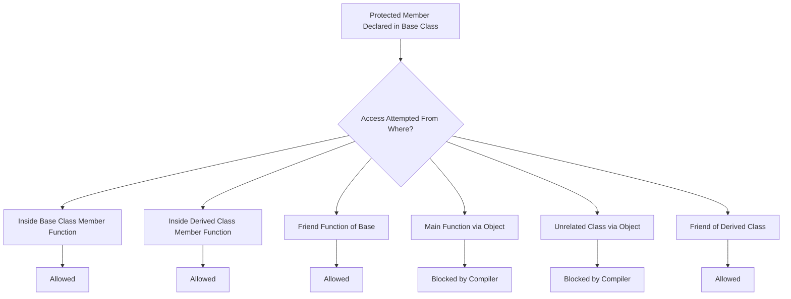
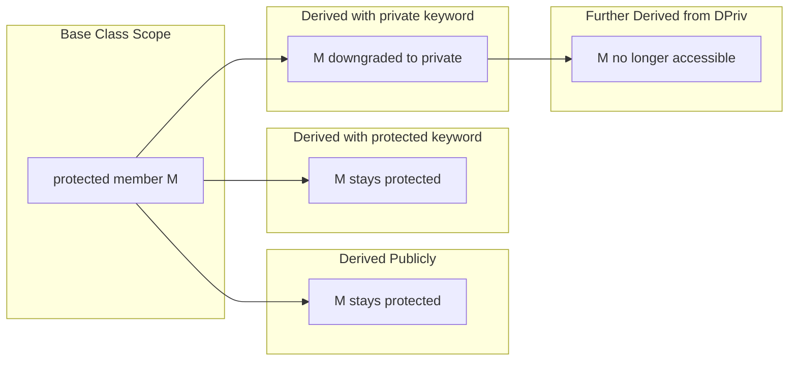
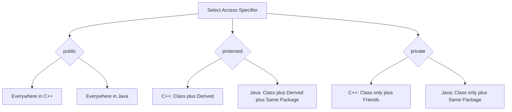
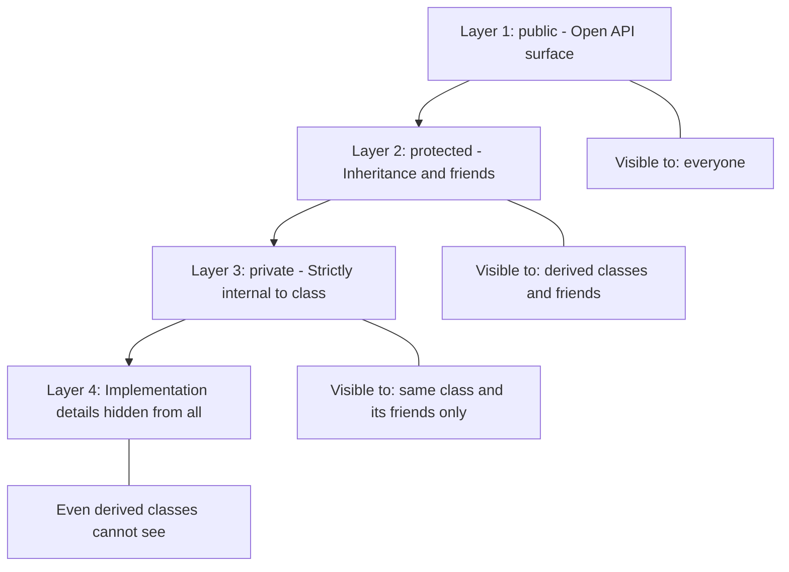

# protected Members

<!-- SECTION_1_START -->
# Protected Members in Object-Oriented Programming

## 1. Core Technical Definition

In Object-Oriented Programming (OOP), **access specifiers** (also called access modifiers) are keywords that control the visibility and accessibility of class members (data members and member functions) from outside the class. The three primary access specifiers in C++ are `public`, `private`, and `protected`. 

The **`protected`** access specifier is a hybrid access level designed specifically to support inheritance-based reuse while maintaining encapsulation. A member declared as `protected` is:

1. Accessible **within the class** in which it is declared.
2. Accessible **within any class derived (inherited) from this class**, regardless of the visibility mode (subject to the mode's effect on accessibility of further descendants).
3. **Not accessible** through objects of the class from non-member or non-friend functions in the global scope.
4. Accessible to **friends** of the class and friends of derived classes.

> [!IMPORTANT]
> **KTU Syllabus Highlight:** The `protected` keyword bridges the gap between `public` (open to everyone) and `private` (closed to everyone except the class itself). It is the cornerstone mechanism that allows derived classes to access base-class internals — a prerequisite for runtime polymorphism through virtual functions and method overriding.

## 2. Intuitive Overview & Real-World Analogy

> [!NOTE]
> **Conceptual Analogy — The "Family Vault" Metaphor**
>
> Imagine a **family bank vault** that contains important documents:
> - **`private` members** are like the vault's contents that **only the owner (the base class) can touch**. Even close family members (derived classes) cannot access it directly.
> - **`protected` members** are like **inheritance rights** — the vault owner sets up a legal trust so that **direct descendants (derived classes) can access certain compartments**, but unrelated outsiders (other classes, `main()`) cannot peek inside.
> - **`public` members** are like a **public notice board** — anyone, including strangers, can view the contents.

In software engineering terms, when class `B` inherits from class `A`, the `protected` members of `A` act as a controlled interface that allows `B` to *reuse and override* internal behavior of `A` without exposing those internals to the rest of the world. This is essential for the **Liskov Substitution Principle** and the design of polymorphic base classes.

## 3. Access Control Summary at a Glance

| Member Type | Same Class | Derived Class | Outside (Objects / `main()`) | Friends |
| :--- | :---: | :---: | :---: | :---: |
| `public` | ✅ Yes | ✅ Yes | ✅ Yes | ✅ Yes |
| `protected` | ✅ Yes | ✅ Yes | ❌ No | ✅ Yes |
| `private` | ✅ Yes | ❌ No | ❌ No | ✅ Yes |

> [!TIP]
> **Quick Mnemonic for Exams:** "**P**rotected is for **P**rogeny" — only the child (derived) classes get access, not strangers.

<!-- SECTION_1_END -->

<!-- SECTION_2_START -->
# Deep Theoretical Analysis & KTU High-Yield Reference Sheet

## 1. Granular Access Rules of `protected` Members

The accessibility of a `protected` member is governed by **three interacting factors**:

1. **The location where it is declared** (inside the base class).
2. **The inheritance visibility mode** used by the derived class (`public`, `protected`, or `private`).
3. **The scope in which the access is attempted** (inside derived class body, outside via object pointer, inside another unrelated class, etc.).

### 1.1 Within the Same Class
A `protected` member is freely accessible by any member function of the class in which it is declared. This is identical to `private` and `public` members.

### 1.2 Inside Derived Classes
- A `protected` base-class member becomes accessible inside the **member functions** of the derived class.
- The derived class can read, modify, or pass the protected member to other functions internally.
- However, when accessed **through a pointer or object of the derived class from outside**, the member is **not accessible** (this is a subtle but exam-critical point).

### 1.3 Outside the Class Hierarchy
From `main()`, from any unrelated class, or from any non-friend function, `protected` members are **strictly inaccessible**, even if a pointer of the base type or derived type is used to refer to the object. The compiler will throw an `"is protected within this context"` error.

## 2. The Effect of Inheritance Visibility Modes on `protected` Members

When a derived class inherits using a specific visibility mode, the access level of inherited members is *transitively transformed* according to the following rules:

| Base Class Member | `public` Inheritance | `protected` Inheritance | `private` Inheritance |
| :--- | :---: | :---: | :---: |
| `public` member | remains `public` | becomes `protected` | becomes `private` |
| `protected` member | remains `protected` | remains `protected` | becomes `private` |
| `private` member | **inaccessible** | **inaccessible** | **inaccessible** |

> [!IMPORTANT]
> **Note:** `private` members of a base class are **never** directly accessible to derived classes, regardless of the visibility mode. To expose private data, the base class must explicitly declare `protected` accessor or mutator methods (often declared as `protected` virtual functions to enable polymorphism).

## 3. KTU High-Yield Rule Sheet (Cheat Sheet)

| Rule ID | Rule Statement | Exam Relevance |
| :--- | :--- | :--- |
| **R1** | `protected` members are accessible within the class body and its member functions. | High |
| **R2** | `protected` members are accessible within any derived class's member functions. | Very High |
| **R3** | `protected` members are **not** accessible through objects/pointers outside the class hierarchy. | Very High |
| **R4** | `private` inheritance makes inherited `protected` members behave as `private` in the derived class. | High |
| **R5** | `protected` members are accessible to **friends** of the base class. | Moderate |
| **R6** | In **Java**, `protected` additionally allows access to other classes in the **same package** (package-private behavior). | Moderate |
| **R7** | `protected` does **not** mean "accessible to everyone who inherits" — the visibility mode further restricts it for grand-child classes. | Very High |

## 4. Real-World Engineering Utility

Protected members are widely used in:

- **Framework design**: GUI libraries (Qt, MFC) expose `protected` virtual methods so users can override event handlers (`mousePressEvent`, `paintEvent`) without making the entire internal state `public`.
- **Plugin architectures**: Base classes define `protected` hook methods that derived plugin classes override, while hiding implementation details.
- **Design Patterns**: The **Template Method** pattern relies on `protected` (or `private`) base methods called by `public` base methods, with derived classes overriding the hooks.
- **Polymorphic libraries**: When a base class declares a `protected` data member, derived classes can directly manipulate state, supporting invariants in overridden virtual functions.

<!-- SECTION_2_END -->

<!-- SECTION_3_START -->
# Step-by-Step Derivations & Code Implementation

## 1. Worked Example 1: Basic Protected Access in Single Inheritance

### 1.1 Problem Statement
Demonstrate that a `protected` data member of a base class can be directly accessed inside a member function of a derived class, but **cannot** be accessed from `main()` using an object.

### 1.2 Complete C++ Implementation

```cpp
#include <iostream>
#include <stdexcept>
#include <string>

// ---------- Base Class ----------
class Animal {
protected:                                  // accessible to derived classes only
    std::string name;
    int         age;

public:
    Animal(const std::string& n, int a) : name(n), age(a) {
        if (a < 0) {
            throw std::invalid_argument("Age cannot be negative.");
        }
    }

    virtual ~Animal() = default;

    // Public getter (controlled external access)
    std::string getName() const { return name; }
    int         getAge()  const { return age;  }
};

// ---------- Derived Class ----------
class Dog : public Animal {
public:
    Dog(const std::string& n, int a) : Animal(n, a) {}

    // Allowed: derived class member function touching protected base data
    void celebrateBirthday() {
        ++age;                                // ✅ Direct access OK
        std::cout << name << " is now " << age << " years old.\n";
    }

    // Allowed: passing protected data to a public method
    void describe() const {
        std::cout << "I am a Dog named " << name
                  << ", age " << age << ".\n";
    }
};

int main() {
    try {
        Dog d("Bruno", 3);

        // ✅ Public methods are accessible
        std::cout << "Access via public getter: " << d.getName() << "\n";

        // ❌ ILLEGAL: protected member cannot be accessed via object
        // std::cout << d.name;              // Compile-time error
        // d.age = 5;                        // Compile-time error

        d.celebrateBirthday();               // OK: derived class method
        d.describe();

    } catch (const std::exception& ex) {
        std::cerr << "Error: " << ex.what() << "\n";
        return 1;
    }
    return 0;
}
```

### 1.3 Expected Output

```
Access via public getter: Bruno
Bruno is now 4 years old.
I am a Dog named Bruno, age 4.
```

### 1.4 Step-by-Step Trace

| Step | Action | Accessibility Verdict |
| :---: | :--- | :--- |
| 1 | `Dog d("Bruno", 3);` — calls `Animal` constructor. | OK — base ctor is `public`. |
| 2 | `d.getName()` — calls `Animal::getName()`. | OK — `public` method. |
| 3 | `d.name` or `d.age` from `main()`. | ❌ Compile error — `protected`. |
| 4 | Inside `Dog::celebrateBirthday()`, `++age` runs. | ✅ OK — derived class can touch `protected` data. |
| 5 | `d.celebrateBirthday();` — public call to derived method. | OK. |

---

## 2. Worked Example 2: Multilevel Inheritance and `protected` Transformation

### 2.1 Problem Statement
Show how a `protected` member propagates through multiple levels of inheritance, and how a `private` inheritance mode downgrades `protected` to `private` (which then makes it inaccessible to further descendants).

### 2.2 Complete C++ Implementation

```cpp
#include <iostream>
#include <stdexcept>

// ---------- Level 1: Grandparent ----------
class Shape {
protected:
    double area;

public:
    explicit Shape(double a) : area(a) {
        if (a < 0.0) {
            throw std::invalid_argument("Area cannot be negative.");
        }
    }
    virtual ~Shape() = default;
    virtual void display() const {
        std::cout << "Shape area = " << area << "\n";
    }
};

// ---------- Level 2: Parent ----------
// Public inheritance: protected 'area' remains 'protected' in Rectangle
class Rectangle : public Shape {
protected:
    double length;
    double width;

public:
    Rectangle(double l, double w) : Shape(l * w), length(l), width(w) {}

    // Re-expose 'area' computation for derived classes
    void recomputeArea() {
        area = length * width;                // ✅ OK: protected access in derived
    }
};

// ---------- Level 3: Child (Public inheritance) ----------
class ColoredRectangle : public Rectangle {
    std::string color;

public:
    ColoredRectangle(double l, double w, const std::string& c)
        : Rectangle(l, w), color(c) {}

    void show() const {
        std::cout << "Color: " << color
                  << ", Length: " << length
                  << ", Width: "  << width
                  << ", Area: "   << area   // ✅ OK: still protected in grandchild
                  << "\n";
    }
};

// ---------- Demonstration: Private inheritance downgrade ----------
class HiddenShape : private Shape {           // 'area' becomes private here
public:
    HiddenShape(double a) : Shape(a) {}
    double revealArea() const { return area; } // ✅ OK inside HiddenShape
};

class TryingToAccess : public HiddenShape {
public:
    TryingToAccess(double a) : HiddenShape(a) {}
    // ❌ ILLEGAL below: 'area' was downgraded to private by HiddenShape
    // double get() const { return area; }
};

int main() {
    try {
        ColoredRectangle cr(5.0, 3.0, "Red");
        cr.recomputeArea();
        cr.show();

        HiddenShape hs(42.0);
        std::cout << "HiddenShape area via revealArea(): "
                  << hs.revealArea() << "\n";

        // ❌ ILLEGAL: hs.area is private now
        // std::cout << hs.area;

    } catch (const std::exception& ex) {
        std::cerr << "Error: " << ex.what() << "\n";
        return 1;
    }
    return 0;
}
```

### 2.3 Expected Output

```
Color: Red, Length: 5, Width: 3, Area: 15
HiddenShape area via revealArea(): 42
```

### 2.4 Conceptual Trace

1. `Shape::area` is declared `protected`.
2. `Rectangle` inherits `public`ly → `area` is still `protected` in `Rectangle`.
3. `ColoredRectangle` inherits `public`ly → `area` is still `protected`; access succeeds.
4. `HiddenShape` inherits `private`ly from `Shape` → `area` becomes `private` inside `HiddenShape`.
5. `TryingToAccess` (a child of `HiddenShape`) **cannot** see `area` anymore — it is effectively hidden.

---

## 3. Worked Example 3: Java's `protected` Semantics (Comparison)

> [!NOTE]
> In **Java**, `protected` is more permissive than in C++ because it also grants **package-level access** (default access). The following snippet illustrates this distinction.

```java
package zoo.base;

public class Animal {
    protected String name = "Generic";

    protected void speak() {
        System.out.println("...");
    }
}
```

```java
package zoo.derived;
import zoo.base.Animal;

public class Dog extends Animal {
    public void announce() {
        speak();                  // ✅ OK: inherited protected method
        System.out.println(name); // ✅ OK: inherited protected field
    }
}
```

```java
package zoo.other;               // Different package, non-subclass
import zoo.base.Animal;

public class Vet {
    public void examine(Animal a) {
        // System.out.println(a.name); // ❌ ILLEGAL: not subclass, different package
        // a.speak();                  // ❌ ILLEGAL
    }
}
```

**Takeaway:** Java's `protected` ≈ C++'s `protected` + package-private access for non-derived classes in the same package.

---

## 4. Common Pitfalls (Compile-Time Errors Students Make)

| # | Mistake | Result |
| :---: | :--- | :--- |
| 1 | Accessing a `protected` member through an object in `main()`. | `error: 'name' is protected within this context` |
| 2 | Using `private` inheritance and assuming `protected` data remains accessible to grandchildren. | `error: 'area' is private in this context` |
| 3 | Declaring a non-virtual `protected` destructor — leads to undefined behavior on polymorphic deletion. | Memory leak / UB |
| 4 | Marking every member `protected` "for convenience" — breaks encapsulation. | Bad design, violates OOP principles |
| 5 | Forgetting to mark overriding functions `override` (C++11+) — typo creates a new function. | Silent bug, polymorphism fails |

<!-- SECTION_3_END -->

<!-- SECTION_4_START -->
# Structural Diagrams & Schematics

## 1. Access Flow Diagram — How `protected` Members Are Reached

The following Mermaid flowchart illustrates the various access paths to a `protected` member, and where the compiler will block illegal access.



> **Reading the diagram:** Any arrow ending in a `Blocked by Compiler` node represents a guaranteed compile-time error in standard-conforming C++.

---

## 2. Inheritance Visibility Transformation Block

The following diagram models how the access level of a `protected` base member transforms across inheritance chains.



---

## 3. Comparative Access Matrix — C++ vs Java

The following block diagram contrasts how the three primary access specifiers behave across the two most-taught languages in the KTU curriculum.



---

## 4. Encapsulation Hierarchy — Layered View

A block-level representation of how access specifiers stack from the most open to the most restrictive.



> **Engineering insight:** Most well-designed C++ class hierarchies keep the **`protected` layer thin** — it should expose only those methods that derived classes genuinely need to override or invoke, while keeping data members `private` and accessed through `protected` accessors.

<!-- SECTION_4_END -->

<!-- SECTION_5_START -->
# KTU 2024 Scheme Examination Question Bank & Topic Recap

> [!NOTE]
> The following questions follow the **KTU 2024 Scheme End Semester Evaluation (ESE)** pattern. Marks are split as Part A (2 × 3 = 6 marks) and Part B (1 × 14 = 14 marks with internal choice). Bloom's levels and Course Outcomes (COs) are tagged for each question.

---

## Part A — Short Answer Questions (3 Marks Each)

### Question 1: Define `protected` access specifier. State two situations where it is preferred over `private`.

**Model Answer (3 Marks):**

The `protected` access specifier in C++ makes a class member accessible within the class itself, to its friends, and to any class **derived** from it, but inaccessible to other functions and unrelated classes.

**Two situations where `protected` is preferred over `private`:**

1. **When a base class is designed for inheritance and its derived classes need direct access to internal data or helper functions** to perform computations or override behavior — e.g., a `protected` `area` field in a `Shape` base class used by `Rectangle` and `Circle` derived classes.

2. **When implementing polymorphic frameworks** where `protected virtual` hook methods are to be overridden by derived classes — e.g., the `paintEvent()` in Qt's `QWidget` is `protected` so user widgets can override it without exposing it to the public application.

- [Definition: 1 Mark]
- [Each valid situation: 1 Mark × 2 = 2 Marks]

**Course Outcome:** CO2 — *Apply Object-Oriented Programming concepts like inheritance and polymorphism.*
**RBT Level:** Understand
**Tag:** `[KTU University Exam - July 2023]`

---

### Question 2: Can a `protected` member of a base class be accessed from `main()` using a pointer of the derived class type? Justify your answer with a one-line reason.

**Model Answer (3 Marks):**

**No.** A `protected` member of a base class cannot be accessed from `main()` even through a pointer of the derived class type. Access control in C++ is enforced based on the **scope in which the access is attempted** (`main()` is not within the class hierarchy of the base), not on the static type of the pointer. Hence, the compiler raises a `"is protected within this context"` error.

- [Correct answer Yes or No: 1 Mark]
- [Valid justification: 2 Marks]

**Course Outcome:** CO2 — *Apply OOP concepts.*
**RBT Level:** Remember
**Tag:** `[KTU University Exam - Dec 2022]`

---

## Part B — Long Answer Questions (14 Marks, Internal Choice)

### Question 3A

**(a)** Explain the three access specifiers in C++ (`public`, `protected`, `private`) with a neat comparison table. Discuss how each affects inheritance. **(7 Marks)**

**(b)** Write a C++ program that demonstrates the use of `protected` members in a multilevel inheritance hierarchy involving three classes: `Vehicle` (base), `Car` (intermediate), and `SportsCar` (derived). The program should display the model name, fuel type, and top speed. **(7 Marks)**

#### Model Solution to 3A(a)

**Comparison Table (4 Marks):**

| Access Specifier | Same Class | Derived Class | Object in `main()` | Friend Function |
| :--- | :---: | :---: | :---: | :---: |
| `public` | Yes | Yes | Yes | Yes |
| `protected` | Yes | Yes | No | Yes |
| `private` | Yes | No | No | Yes |

**Effect on inheritance (3 Marks):**

- Under `public` inheritance: `public` members stay `public`, `protected` members stay `protected`, and `private` members remain inaccessible.
- Under `protected` inheritance: `public` and `protected` base members both become `protected` in the derived class.
- Under `private` inheritance: both `public` and `protected` base members become `private` in the derived class, and are not accessible to any further derived classes.

- [Comparison table: 4 Marks]
- [Inheritance effect: 3 Marks]

#### Model Solution to 3A(b)

```cpp
#include <iostream>
#include <string>
#include <stdexcept>

class Vehicle {
protected:
    std::string model;
public:
    explicit Vehicle(const std::string& m) : model(m) {}
    virtual ~Vehicle() = default;
    virtual void show() const = 0;       // pure virtual — polymorphism
};

class Car : public Vehicle {
protected:
    std::string fuel;
public:
    Car(const std::string& m, const std::string& f) : Vehicle(m), fuel(f) {}
    void show() const override {
        std::cout << "Model: " << model << ", Fuel: " << fuel;
    }
};

class SportsCar : public Car {
    double topSpeed;
public:
    SportsCar(const std::string& m, const std::string& f, double ts)
        : Car(m, f), topSpeed(ts) {
        if (ts < 0) throw std::invalid_argument("Speed cannot be negative");
    }
    void show() const override {
        Car::show();
        std::cout << ", Top Speed: " << topSpeed << " km/h\n";
    }
};

int main() {
    try {
        SportsCar sc("Mustang GT", "Petrol", 280.5);
        sc.show();
    } catch (const std::exception& e) {
        std::cerr << "Error: " << e.what() << "\n";
        return 1;
    }
    return 0;
}
```

**Valuation Key:**

- [Class hierarchy with proper inheritance: 2 Marks]
- [Correct use of `protected` data members: 2 Marks]
- [Working program with output: 2 Marks]
- [Constructor initialization and error handling: 1 Mark]

**Course Outcome:** CO2, CO3
**RBT Levels:** Understand (3A(a)) and Apply (3A(b))
**Tag:** `[KTU University Exam - July 2024]`

---

### Question 3B (Alternative Choice)

**(a)** What are visibility modes in inheritance? Explain the effect of `public`, `protected`, and `private` inheritance on `protected` base class members with examples. **(7 Marks)**

**(b)** Differentiate between C++ and Java semantics of the `protected` access specifier. Provide code snippets to support your answer. **(7 Marks)**

#### Model Solution to 3B(a)

**Visibility modes (2 Marks):**
Visibility modes in inheritance specify how the access level of inherited base-class members is transformed inside the derived class. C++ supports three modes: `public`, `protected`, and `private`.

**Effect on `protected` base members (5 Marks):**

1. **`public` inheritance** — `protected` members remain `protected` in the derived class. They are still accessible to grandchild classes.

   ```cpp
   class Base { protected: int x; };
   class Derived : public Base { void f() { x = 10; } };  // OK
   ```

2. **`protected` inheritance** — `protected` members remain `protected` in the derived class. Same as `public` inheritance in this specific regard, but `public` members also downgrade to `protected`.

   ```cpp
   class Derived : protected Base { void f() { x = 10; } };  // OK
   ```

3. **`private` inheritance** — `protected` (and `public`) members become `private` in the derived class. They are inaccessible to any further derived classes.

   ```cpp
   class Derived : private Base { void f() { x = 10; } };  // OK here
   class Grand : public Derived {
       void g() { /* x = 5;  ILLEGAL — now private */ }
   };
   ```

- [Definition of visibility mode: 2 Marks]
- [Each mode with example: 1.5 Marks × 3 ≈ 5 Marks (rounded)]

#### Model Solution to 3B(b)

| Aspect | C++ `protected` | Java `protected` |
| :--- | :--- | :--- |
| Same class access | Yes | Yes |
| Derived class access (any package) | Yes | Yes |
| Other classes in **same package** | No | Yes (package-private) |
| Friends access | Yes | N/A (no `friend` in Java) |
| Access via object from `main()` | No (compile error) | No (compile error, unless same package) |

**C++ snippet:**

```cpp
class A { protected: int x; };
class B : public A {
    void f() { x = 5; }                 // ✅ OK
};
int main() { B b; /* b.x = 5; */ }     // ❌ ILLEGAL
```

**Java snippet:**

```java
package pkg1;
public class A { protected int x = 5; }

package pkg1;                           // SAME package, non-derived
public class C { void f() { A a = new A(); a.x = 10; } }   // ✅ OK in Java
```

- [Comparison table: 3 Marks]
- [C++ snippet: 2 Marks]
- [Java snippet: 2 Marks]

**Course Outcome:** CO2, CO4
**RBT Levels:** Understand (3B(a)) and Analyze (3B(b))
**Tag:** `[KTU University Exam - Dec 2023]`

---

> [!WARNING]
> **KTU Examiner's Valuation Warning — Common Pitfalls**
>
> 1. **Do NOT confuse "access via inheritance" with "access via object".** A common mistake is to write `obj.protectedMember` from `main()`. The examiner will deduct **2 marks** for this misconception since it directly violates Rule R3.
> 2. **Do NOT forget to mark overriding methods with `override`** (C++11 onwards). Without it, a typo silently creates a new function, and polymorphism breaks — examiner will deduct **1 mark** for missing `override`.
> 3. **Do NOT claim `private` inheritance keeps `protected` members accessible to grandchildren.** This is a frequent error in theory answers. Examiner deducts **2 marks** for this wrong statement.
> 4. **Do NOT skip writing base-class constructors in the initializer list** of derived constructors. Examiner deducts **1 mark** for missing initialization.
> 5. **In Java comparison answers, do not say Java has `friend`.** It does not. Examiner deducts **1 mark** for that statement.

---

## Topic Recap & Important Things to Remember

- **`protected`** is one of the three C++ access specifiers — it grants access to the class itself, its friends, and any **derived class**.
- **`protected` is inaccessible from `main()` and unrelated classes**, even via pointers of the derived type.
- **Three inheritance visibility modes** are: `public`, `protected`, and `private`. Each transforms inherited `protected` members differently.
- **`private` inheritance downgrades** inherited `protected` (and `public`) members to `private`, hiding them from grandchildren.
- **Java's `protected`** is broader: it also grants **package-level** access to non-derived classes in the same package.
- **`protected` supports polymorphism** by allowing derived classes to override base-class behavior and access base-class helpers.
- **Best practice:** Keep `protected` interface thin — expose only what derived classes truly need. Use `private` for data and `protected` for overridable hooks and helpers.
- **Common compile error** to recognize: `"is protected within this context"` — occurs when accessing a `protected` member through an object outside the class hierarchy.
- **Friend functions** of the base class can access `protected` members; this is a unique feature of C++ (not present in Java).
- **Pure virtual functions** in abstract base classes are often declared as `protected` (e.g., event handlers in Qt) to enforce overriding by derived widgets.
- **RBT focus for exams:** Definitions and rule statements target *Remember* and *Understand* levels; code writing targets *Apply*; comparison and case-based questions target *Analyze* and *Evaluate*.
- **CO mapping:** This topic directly addresses **CO2 (Apply OOP concepts)** and supports **CO3 (Design class hierarchies)** in the KTU 2024 PBCST304 syllabus.

<!-- SECTION_5_END -->
