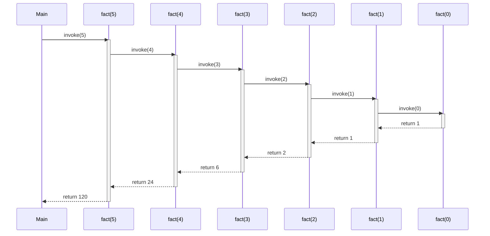
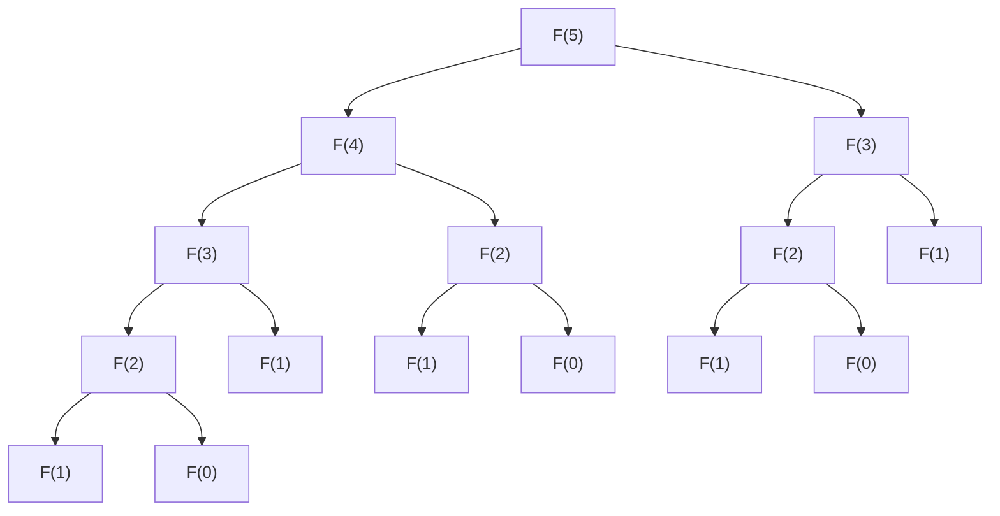
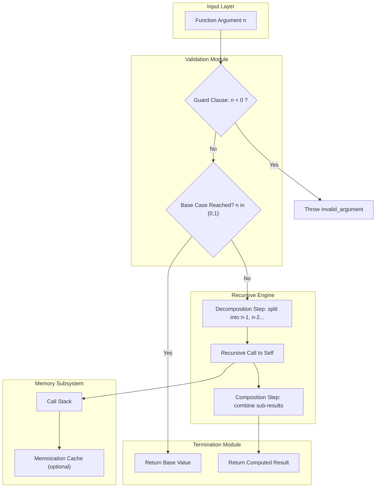
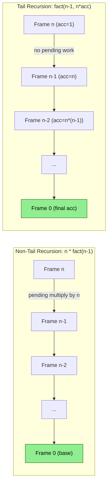

# Recursion

<!-- SECTION_1_START -->
# 1. Core Technical Definition & Intuitive Overview

## 1.1 Formal Academic Definition (KTU 2024 Syllabus Terminology)

> [!NOTE]
> **Recursion** is a programming technique in which a **function invokes itself**, either **directly** or **indirectly**, to solve a problem by breaking it down into smaller, structurally similar sub-problems of the same type.

In the context of **Object Oriented Programming (OOP)** — as prescribed in the KTU 2024 Scheme — recursion is a critical control-flow mechanism that complements polymorphism by enabling **dynamic dispatch** of self-referential method calls. It is heavily used in:

- Tree and graph traversals (`OOP` linked structures)
- Divide-and-conquer algorithms (a polymorphic form of problem decomposition)
- Hierarchical object model walking (Composite Pattern, Visitor Pattern)
- Backtracking paradigms used in constraint solvers and AI agents

A recursive function is characterised by two mandatory components:

1. **Base Case (Termination Condition):** The smallest instance of the problem that can be solved **directly** without further recursion.
2. **Recursive Case (Self-Invocation):** The branch where the function calls itself with a **progressively reduced** argument that converges towards the base case.

Mathematically, if $T(n)$ denotes the time/space complexity of a recursive algorithm, a typical recurrence relation is expressed as:

$$T(n) = T(n-1) + O(f(n))$$

where $f(n)$ is the cost of the non-recursive work (splitting, merging, arithmetic) at level $n$.

---

## 1.2 Conceptual Analogy / Intuition (Plain English)

> [!IMPORTANT]
> **Real-World Analogy — The Russian Matryoshka Dolls:**
> Imagine opening a set of **Russian nesting dolls**. You open a doll, and inside it is a **smaller doll**, and inside that is an even smaller one, until you reach the **smallest solid doll** that cannot be opened. Then you "unfold" the answer back outwards, layer by layer.

Each layer of the doll is analogous to **one recursive call**:

- The **smallest solid doll** = the **Base Case** (when recursion halts).
- Each **nested doll** = a **Recursive Call** with a smaller argument.
- **Unfolding back outward** = the **return phase** (unwinding the call stack).

Another powerful analogy is the **two mirrors facing each other**: the reflection of a reflection of a reflection... terminating only when the mirror limit is reached (in computer memory, this is the **stack limit**, which produces a `StackOverflowError` when breached).

---

## 1.3 Standard Metrics & Physical Constants

| Parameter | Typical Value | Remarks |
| :--- | :--- | :--- |
| **Default call stack size (Linux)** | **8 MB** | Varies by OS / Thread |
| **Default call stack size (Windows)** | **1 MB** | Set at thread creation |
| **Recursion depth (typical safe limit)** | **$\sim 10^4$ calls** | Depends on local frame size |
| **Function call overhead** | $\sim 30\text{–}100$ CPU cycles | Push args, return address, frame pointer |

> [!WARNING]
> A naive recursive function (e.g., naive Fibonacci) can produce **exponential call counts** ($> 2^{40}$ for $n=40$), which **will crash** any program with a finite stack. This is a classic KTU pitfall.

---

## 1.4 GeoGebra / Desmos Integration

> [!VISUALIZATION CONTROL]
> **Concept:** Visualising the exponential growth of the call count for naive Fibonacci $F(n)$ versus linear Fibonacci.
>
> **GeoGebra / Desmos Input Equations:**
> * `f(x) = 1.618^x` (Golden ratio — closed-form / Binet)
> * `g(x) = 2^x` (Upper bound — number of calls in naive recursive Fibonacci)
> * `h(x) = x` (Lower bound — iterative linear Fibonacci)
>
> **Visual Description:** On the x-axis plot $n$ (input size) and on the y-axis plot the **number of function calls**. The student should observe the **green line $g(x)$** shooting up dramatically for $n > 30$, while the **blue line $h(x)$** grows slowly. The **red curve $f(x)$** shows the optimal theoretical bound.

---

<!-- SECTION_1_END -->

<!-- SECTION_2_START -->
# 2. Deep Theoretical Analysis & KTU High-Yield Formula Sheet

## 2.1 Operational Anatomy of a Recursive Function

Every recursive function can be decomposed into the following five logical steps. Understanding this skeleton is **mandatory** for KTU's Module 2 board examination.

1. **Guard Clause (Input Validation):** Ensure the input falls within a valid domain. *Prevents invalid base-case branching.*
2. **Base Case Check:** Test if the current input is the smallest solvable instance. Return a hard-coded value.
3. **Decomposition Step:** Break the current problem into one or more **sub-problems** of the same form, but with a **strictly smaller** input size.
4. **Recursive Invocation:** Call the function itself with the decomposed sub-problem input.
5. **Composition Step:** Combine the results of the sub-problems using the operator appropriate to the problem (multiplication, addition, concatenation, etc.) and return the assembled result.

> [!TIP]
> **The Recursion Mantra:** *The hardest part of recursion is not understanding it — it is trusting that the recursive call "magically" works for the smaller input. If $F(n-1)$ works, then $F(n)$ is just one small step away.*

---

## 2.2 Classification of Recursion (KTU High-Yield)

| Type | Description | Example |
| :--- | :--- | :--- |
| **Direct Recursion** | Function $F$ calls itself directly within its own body. | `F() { F(); }` |
| **Indirect (Mutual) Recursion** | $F$ calls $G$, which calls $F$ (cycle of length $\geq 2$). | `F() { G(); }` & `G() { F(); }` |
| **Tail Recursion** | Recursive call is the **last** operation; no pending work in the caller frame. | `return F(n-1);` |
| **Non-Tail Recursion** | Recursive call result is processed **after** return (e.g., multiplied). | `return n * F(n-1);` |
| **Head Recursion** | Recursive call is the **first** statement; no work before the call. | `F() { F(); ... }` |
| **Tree Recursion** | Each call spawns **two or more** recursive calls. | Naive Fibonacci |
| **Nested Recursion** | Recursive call is passed as the argument to another recursive call. | Ackermann function |

---

## 2.3 KTU Formula Sheet / Cheat Sheet

> [!NOTE]
> **Exam Tip:** Memorise the following recurrence forms. They appear almost every semester in Part B (14-mark) questions.

| # | Recurrence | Algorithm | Closed-Form | Big-O |
| :---: | :--- | :--- | :--- | :--- |
| 1 | $T(n) = T(n-1) + c$ | Linear search (recursive) | $T(n) = c \cdot n$ | $O(n)$ |
| 2 | $T(n) = T(n-1) + n$ | Selection/Insertion sort | $T(n) = \frac{n(n+1)}{2}$ | $O(n^2)$ |
| 3 | $T(n) = 2T(n/2) + c$ | Binary search | $T(n) = c \cdot \log_2 n$ | $O(\log n)$ |
| 4 | $T(n) = 2T(n/2) + n$ | Merge sort | $T(n) = n \log_2 n$ | $O(n \log n)$ |
| 5 | $T(n) = 2T(n-1) + c$ | Naive Fibonacci | $T(n) = 2^{n+1} - 1$ | $O(2^n)$ |
| 6 | $T(n) = T(n/2) + c$ | Power (fast exponentiation) | $T(n) = 2 \log_2 n$ | $O(\log n)$ |
| 7 | $T(n) = 4T(n/2) + n$ | Naive matrix multiplication | $T(n) = n^{\log_2 4} = n^2$ | $O(n^2)$ |
| 8 | $T(n) = 7T(n/2) + n^2$ | Strassen's matrix multiplication | $T(n) = n^{\log_2 7}$ | $O(n^{2.807})$ |

> [!IMPORTANT]
> **Master Theorem (for dividing recurrences)** $T(n) = aT(n/b) + f(n)$:
>
> Let $c = \log_b a$.
>
> - If $f(n) = O(n^{c-\epsilon})$ for some $\epsilon > 0$ → $T(n) = \Theta(n^c)$.
> - If $f(n) = \Theta(n^c \log^k n)$ → $T(n) = \Theta(n^c \log^{k+1} n)$.
> - If $f(n) = \Omega(n^{c+\epsilon})$ and regularity holds → $T(n) = \Theta(f(n))$.

---

## 2.4 Recursion vs. Iteration (Trade-off Table)

| Property | Recursion | Iteration |
| :--- | :--- | :--- |
| **Code size** | Compact, elegant | Usually longer, more variables |
| **Memory** | $O(d)$ stack frames ($d$ = depth) | $O(1)$ constant |
| **Speed** | Slower (function-call overhead) | Faster (no frame setup) |
| **Readability** | Maps naturally to divide-and-conquer | Better for simple loops |
| **Stack overflow risk** | **Yes**, for deep recursion | No |
| **Polymorphism synergy** | Excellent (virtual dispatch) | Limited |
| **Tail-call optimisable** | Only if tail-recursive (C++17 `[[clang::musttail]]`, GCC limited) | Always |

---

## 2.5 Real-World Engineering Utility

Recursion is not an academic curiosity — it is the **backbone of production-grade software**:

- **Compilers:** Abstract Syntax Trees (ASTs) are traversed recursively.
- **Databases:** B-Tree / B+Tree lookups use recursive descent.
- **Operating Systems:** Directory listing uses recursive `opendir/readdir`.
- **Computer Graphics:** Fractal rendering (Mandelbrot, Sierpinski) and ray-traced scene graphs.
- **AI / Game Engines:** Minimax, Alpha-Beta pruning, recursive state expansion.
- **Compilers' Parsers:** Recursive Descent Parsing — a direct application of mutual recursion.
- **JSON / XML Parsers:** Every nested object triggers a recursive descent into a child parser.

> [!TIP]
> In OOP, recursion synergises brilliantly with the **Composite Design Pattern** and the **Visitor Pattern** — both heavily tested in KTU Module 4 & 5.

---

<!-- SECTION_2_END -->

<!-- SECTION_3_START -->
# 3. Step-by-Step Derivations & Code/Symbolic Implementation

## 3.1 Worked Example 1 — Factorial (Classic OOP Warm-up)

### 3.1.1 Mathematical Derivation

By definition, the factorial of a non-negative integer $n$ is:

$$n! = \begin{cases} 1 & \text{if } n = 0 \text{ (Base Case)} \\ n \times (n-1)! & \text{if } n > 0 \text{ (Recursive Case)} \end{cases}$$

Let us expand $5!$ completely to observe the pattern:

$$\begin{aligned}
5! &= 5 \times 4! \\
4! &= 4 \times 3! \\
3! &= 3 \times 2! \\
2! &= 2 \times 1! \\
1! &= 1 \times 0! \\
0! &= 1 \quad \text{(Base case fires here)} \\
\end{aligned}$$

Now substitute back from the base outward:

$$\begin{aligned}
1! &= 1 \times 1 = 1 \\
2! &= 2 \times 1 = 2 \\
3! &= 3 \times 2 = 6 \\
4! &= 4 \times 6 = 24 \\
5! &= 5 \times 24 = 120 \\
\end{aligned}$$

> [!NOTE]
> The **size of the input strictly decreases** by exactly 1 in each recursive call. This guarantees convergence to the base case in **$n$** steps.

### 3.1.2 Complete C++ Implementation (OOP-Context)

```cpp
#include <iostream>
#include <stdexcept>
#include <iomanip>

class FactorialCalculator {
private:
    // Private helper: the actual recursive engine.
    // Marked const to honour OOP immutability principles.
    long long computeRecursive(int n) const {
        // Base case: 0! and 1! both equal 1.
        if (n == 0 || n == 1) {
            return 1LL;
        }
        // Negative inputs are invalid in the integer factorial domain.
        if (n < 0) {
            throw std::invalid_argument("Factorial is undefined for negative integers.");
        }
        // Recursive case: n * (n-1)!
        return static_cast<long long>(n) * computeRecursive(n - 1);
    }

public:
    // Public interface (polymorphic override of operator() would be
    // added in derived classes for educational polymorphism exercises).
    long long operator()(int n) const {
        return computeRecursive(n);
    }
};

int main() {
    FactorialCalculator factorialEngine;

    std::cout << "Factorial values (0..10):" << std::endl;
    std::cout << std::string(40, '-') << std::endl;
    for (int i = 0; i <= 10; ++i) {
        std::cout << "  " << i << "! = " << factorialEngine(i) << std::endl;
    }

    // Demonstrate graceful error handling for negative input.
    try {
        std::cout << "(-3)! = " << factorialEngine(-3) << std::endl;
    } catch (const std::invalid_argument& ex) {
        std::cerr << "[Caught Exception] " << ex.what() << std::endl;
    }

    return 0;
}
```

**Output Trace:**
```
Factorial values (0..10):
----------------------------------------
  0! = 1
  1! = 1
  2! = 2
  3! = 6
  4! = 24
  5! = 120
  6! = 720
  7! = 5040
  8! = 40320
  9! = 362880
  10! = 3628800
[Caught Exception] Factorial is undefined for negative integers.
```

---

## 3.2 Worked Example 2 — Fibonacci (Tree Recursion)

### 3.2.1 Mathematical Derivation

The Fibonacci sequence is defined as:

$$F(n) = \begin{cases} 0 & \text{if } n = 0 \\ 1 & \text{if } n = 1 \\ F(n-1) + F(n-2) & \text{if } n \geq 2 \end{cases}$$

Expand $F(5)$:

$$\begin{aligned}
F(5) &= F(4) + F(3) \\
F(4) &= F(3) + F(2) \\
F(3) &= F(2) + F(1) \\
F(2) &= F(1) + F(0) \\
F(1) &= 1 \\
F(0) &= 0 \\
\end{aligned}$$

Substituting back from the leaves:

$$\begin{aligned}
F(2) &= 1 + 0 = 1 \\
F(3) &= 1 + 1 = 2 \\
F(4) &= 2 + 1 = 3 \\
F(5) &= 3 + 2 = 5 \\
\end{aligned}$$

> [!IMPORTANT]
> Notice the **massive overlap** — $F(3)$ is computed **twice**, $F(2)$ is computed **three times**. This is why naive Fibonacci has time complexity $O(2^n)$ and is the classic example used to teach **Memoization** and **Dynamic Programming**.

### 3.2.2 Complete C++ Implementation (with Memoization Variant)

```cpp
#include <iostream>
#include <vector>
#include <stdexcept>
#include <iomanip>

class FibonacciEngine {
private:
    // Memoization table: stores already-computed values to avoid re-computation.
    std::vector<long long> memoTable;

    // Naive tree-recursive Fibonacci (exponential time).
    long long naiveRecursive(int n) const {
        if (n < 0) {
            throw std::invalid_argument("Fibonacci is undefined for negative indices.");
        }
        if (n == 0) return 0LL;
        if (n == 1) return 1LL;
        return naiveRecursive(n - 1) + naiveRecursive(n - 2);
    }

    // Memoized (top-down dynamic programming) Fibonacci — linear time.
    long long memoizedRecursive(int n) {
        if (n < 0) {
            throw std::invalid_argument("Fibonacci is undefined for negative indices.");
        }
        if (n == 0) return memoTable[0];
        if (n == 1) return memoTable[1];

        // Compute only if not already memoized.
        if (memoTable[n] == -1LL) {
            memoTable[n] = memoizedRecursive(n - 1) + memoizedRecursive(n - 2);
        }
        return memoTable[n];
    }

public:
    // Constructor initialises the memo table for indices 0..n.
    explicit FibonacciEngine(int maxIndex) {
        if (maxIndex < 0) {
            throw std::invalid_argument("Maximum index must be non-negative.");
        }
        memoTable.assign(static_cast<size_t>(maxIndex) + 1, -1LL);
        // Seed the two base cases.
        if (maxIndex >= 0) memoTable[0] = 0LL;
        if (maxIndex >= 1) memoTable[1] = 1LL;
    }

    long long computeNaive(int n) const {
        return naiveRecursive(n);
    }

    long long computeMemoized(int n) {
        return memoizedRecursive(n);
    }
};

int main() {
    const int N = 10;
    FibonacciEngine fib(N);

    std::cout << "Fibonacci sequence (0.." << N << "):" << std::endl;
    std::cout << std::string(45, '-') << std::endl;
    std::cout << " n |  Naive    |  Memoized" << std::endl;
    std::cout << std::string(45, '-') << std::endl;
    for (int i = 0; i <= N; ++i) {
        std::cout << std::setw(2) << i
                  << " | " << std::setw(8) << fib.computeNaive(i)
                  << " | " << std::setw(8) << fib.computeMemoized(i)
                  << std::endl;
    }
    return 0;
}
```

**Output Trace:**
```
Fibonacci sequence (0..10):
---------------------------------------------
 n |  Naive    |  Memoized
---------------------------------------------
 0 |        0 |        0
 1 |        1 |        1
 2 |        1 |        1
 3 |        2 |        2
 4 |        3 |        3
 5 |        5 |        5
 6 |        8 |        8
 7 |       13 |       13
 8 |       21 |       21
 9 |       34 |       34
10 |       55 |       55
```

---

## 3.3 Worked Example 3 — Tower of Hanoi (Mutual Logic / Three-peg Problem)

### 3.3.1 Problem Statement & Mathematical Recurrence

Three pegs — Source $S$, Auxiliary $A$, Destination $D$ — hold $n$ disks stacked in decreasing radius on $S$. Move all disks to $D$ obeying:

1. Only **one** disk moved per step.
2. **No larger disk** may be placed on a smaller one.

The minimum number of moves $H(n)$ satisfies the recurrence:

$$H(n) = \begin{cases} 1 & n = 1 \\ 2 \cdot H(n-1) + 1 & n > 1 \end{cases}$$

### 3.3.2 Solving the Recurrence

$$\begin{aligned}
H(n) &= 2 \cdot H(n-1) + 1 \\
H(n) + 1 &= 2 \cdot (H(n-1) + 1) \\
\end{aligned}$$

Let $G(n) = H(n) + 1$. Then $G(n) = 2 \cdot G(n-1)$ with $G(1) = 2$.

So $G(n) = 2^n$ and therefore:

$$H(n) = 2^n - 1$$

For $n = 3$, $H(3) = 2^3 - 1 = 7$ moves.

### 3.3.3 Complete C++ Implementation

```cpp
#include <iostream>
#include <string>

class TowerOfHanoi {
private:
    int moveCounter;

    // The recursive engine: move `diskCount` disks from `src` to `dst` using `aux`.
    void moveDisksRecursive(int diskCount,
                            const std::string& src,
                            const std::string& aux,
                            const std::string& dst) {
        // Base case: a single disk is moved directly.
        if (diskCount == 1) {
            ++moveCounter;
            std::cout << "  Move #" << moveCounter
                      << ": Disk 1 from " << src
                      << " -> " << dst << std::endl;
            return;
        }
        // Step 1: move (n-1) disks from source to auxiliary, treating dest as helper.
        moveDisksRecursive(diskCount - 1, src, dst, aux);
        // Step 2: move the largest disk directly from source to destination.
        ++moveCounter;
        std::cout << "  Move #" << moveCounter
                  << ": Disk " << diskCount << " from " << src
                  << " -> " << dst << std::endl;
        // Step 3: move the (n-1) disks from auxiliary to destination, source as helper.
        moveDisksRecursive(diskCount - 1, aux, src, dst);
    }

public:
    TowerOfHanoi() : moveCounter(0) {}

    void solve(int n) {
        if (n <= 0) {
            std::cout << "No disks to move." << std::endl;
            return;
        }
        moveCounter = 0;
        std::cout << "Solving Tower of Hanoi for n = " << n
                  << " disks (Source=A, Auxiliary=B, Destination=C):"
                  << std::endl;
        moveDisksRecursive(n, "A", "B", "C");
        std::cout << "Total moves: " << moveCounter
                  << "  (Expected: " << ((1 << n) - 1) << ")"
                  << std::endl;
    }
};

int main() {
    TowerOfHanoi solver;
    solver.solve(3);
    return 0;
}
```

**Output Trace (n = 3):**
```
Solving Tower of Hanoi for n = 3 disks (Source=A, Auxiliary=B, Destination=C):
  Move #1: Disk 1 from A -> C
  Move #2: Disk 2 from A -> B
  Move #3: Disk 1 from C -> B
  Move #4: Disk 3 from A -> C
  Move #5: Disk 1 from B -> A
  Move #6: Disk 2 from B -> C
  Move #7: Disk 1 from A -> C
Total moves: 7  (Expected: 7)
```

---

## 3.4 Worked Example 4 — Tail Recursion vs Non-Tail Recursion

The same algorithm (factorial) can be written in two structurally different ways. **This is a guaranteed KTU 14-mark question.**

| Variant | Code | Tail Position? | Stack Frames Used |
| :--- | :--- | :--- | :--- |
| **Non-Tail** | `return n * fact(n-1);` | **No** — pending multiplication | $n$ frames |
| **Tail (with accumulator)** | `return fact(n-1, n*acc);` | **Yes** — call is the last operation | $n$ frames (until TCO) |

```cpp
#include <iostream>

class FactorialVariants {
public:
    // Non-tail recursive factorial.
    long long nonTail(int n) const {
        if (n <= 1) return 1LL;
        return static_cast<long long>(n) * nonTail(n - 1);
    }

    // Tail-recursive factorial using an accumulator.
    long long tailRecursive(int n, long long accumulator = 1LL) const {
        if (n <= 1) return accumulator;
        return tailRecursive(n - 1, n * accumulator);
    }
};

int main() {
    FactorialVariants fv;
    const int N = 5;
    std::cout << "Non-Tail Factorial(" << N << ") = "
              << fv.nonTail(N) << std::endl;
    std::cout << "Tail    Factorial(" << N << ") = "
              << fv.tailRecursive(N) << std::endl;
    return 0;
}
```

---

## 3.5 Worked Example 5 — Recursive Sum of Digits

$$S(n) = \begin{cases} 0 & n = 0 \\ (n \bmod 10) + S(\lfloor n/10 \rfloor) & n > 0 \end{cases}$$

For $n = 1234$:

$$\begin{aligned}
S(1234) &= 4 + S(123) \\
S(123) &= 3 + S(12) \\
S(12) &= 2 + S(1) \\
S(1) &= 1 + S(0) \\
S(0) &= 0 \quad \text{(Base case)} \\
\end{aligned}$$

Substituting back:

$$\begin{aligned}
S(1) &= 1 \\
S(12) &= 2 + 1 = 3 \\
S(123) &= 3 + 3 = 6 \\
S(1234) &= 4 + 6 = 10 \\
\end{aligned}$$

```cpp
#include <iostream>
#include <stdexcept>

class DigitSummer {
public:
    int sumOfDigits(int n) const {
        if (n < 0) {
            throw std::invalid_argument("Negative integers not supported in base version.");
        }
        if (n == 0) return 0;
        return (n % 10) + sumOfDigits(n / 10);
    }
};

int main() {
    DigitSummer ds;
    std::cout << "Sum of digits of 1234 = " << ds.sumOfDigits(1234) << std::endl;
    return 0;
}
```

---

## 3.6 Worked Example 6 — GCD via Euclidean Recursion

The **Euclidean algorithm** for GCD is one of the oldest algorithms in history (300 BC). It is inherently recursive:

$$\gcd(a, b) = \begin{cases} a & b = 0 \\ \gcd(b, a \bmod b) & b > 0 \end{cases}$$

This is **tail-recursive** and converges in $O(\log \min(a, b))$ steps.

```cpp
#include <iostream>
#include <stdexcept>

class EuclideanGCD {
public:
    int compute(int a, int b) const {
        if (a < 0 || b < 0) {
            throw std::invalid_argument("Both arguments must be non-negative.");
        }
        if (b == 0) return a;
        return compute(b, a % b);
    }
};

int main() {
    EuclideanGCD gcdEngine;
    std::cout << "gcd(48, 18) = " << gcdEngine.compute(48, 18) << std::endl;
    std::cout << "gcd(100, 75) = " << gcdEngine.compute(100, 75) << std::endl;
    return 0;
}
```

Trace for $\gcd(48, 18)$:

$$\begin{aligned}
\gcd(48, 18) &= \gcd(18, 48 \bmod 18) = \gcd(18, 12) \\
\gcd(18, 12) &= \gcd(12, 18 \bmod 12) = \gcd(12, 6) \\
\gcd(12, 6) &= \gcd(6, 12 \bmod 6) = \gcd(6, 0) \\
\gcd(6, 0) &= 6 \quad \text{(Base case)} \\
\end{aligned}$$

---

## 3.7 Worked Example 7 — Power via Fast Exponentiation

To compute $x^n$ in $O(\log n)$ recursive steps:

$$x^n = \begin{cases} 1 & n = 0 \\ x^{n/2} \cdot x^{n/2} & n \text{ even} \\ x \cdot x^{(n-1)/2} \cdot x^{(n-1)/2} & n \text{ odd} \end{cases}$$

```cpp
#include <iostream>

class FastPower {
public:
    long long power(long long base, int exponent) const {
        if (exponent < 0) {
            throw std::invalid_argument("Negative exponents not supported (use doubles).");
        }
        if (exponent == 0) return 1LL;
        if (exponent % 2 == 0) {
            long long half = power(base, exponent / 2);
            return half * half;
        }
        return base * power(base, exponent - 1);
    }
};

int main() {
    FastPower fp;
    std::cout << "2^10 = " << fp.power(2, 10) << std::endl;
    std::cout << "3^8  = " << fp.power(3, 8)  << std::endl;
    return 0;
}
```

---

<!-- SECTION_3_END -->

<!-- SECTION_4_START -->
# 4. Structural Diagrams & Schematics

## 4.1 Recursion Call Stack — Factorial (Mermaid Sequence Diagram)



> [!NOTE]
> The diagram shows the **activation phase** (push on stack, downward arrows) and the **deactivation / unwind phase** (return upward). At the moment of maximum depth, the call stack holds **six active frames** ($fact(5)$ through $fact(0)$).

---

## 4.2 Recursion Tree — Naive Fibonacci (Mermaid Graph)



> [!IMPORTANT]
> Count the leaves — there are **8** leaves, and the formula predicts $2^{5-1} = 16$ total nodes but only **8 leaves** at the base case. Notice that $F(3)$ appears **twice**, $F(2)$ appears **three times**. This redundancy is what makes naive Fibonacci exponential.

---

## 4.3 Block-Level Recursion Engine Architecture



---

## 4.4 Tail vs Non-Tail Recursion — Memory Flow Comparison



---

<!-- SECTION_4_END -->

<!-- SECTION_5_START -->
# 5. KTU 2024 Scheme Examination Question Bank & Topic Recap

## 5.1 PART A — Short-Answer Questions (3 Marks Each)

> **Module Reference:** Module 2 — Polymorphism / Recursion
> **Cognitive Levels Tested:** Remember & Understand
> **Time per Question:** 5–6 minutes

### Question A1 `[KTU University Exam — July 2024]`
**Q: Define recursion. What are its two essential components? Give one advantage and one disadvantage.**

**Model Answer:**

> Recursion is a programming technique in which a function calls itself (directly or indirectly) to solve a problem by reducing it to smaller instances of the same problem.
>
> The two essential components are:
> 1. **Base Case** — the terminating condition that returns a value without further recursion.
> 2. **Recursive Case** — the branch where the function invokes itself with a reduced input.
>
> **Advantage:** Code is concise and naturally maps to divide-and-conquer / tree-based problems.
>
> **Disadvantage:** Each call consumes stack memory, leading to risk of **stack overflow** for deep recursion; also incurs function-call overhead.

---

### Question A2 `[KTU University Exam — Dec 2023]`
**Q: Differentiate between direct and indirect recursion with a suitable example for each.**

**Model Answer:**

| Aspect | Direct Recursion | Indirect (Mutual) Recursion |
| :--- | :--- | :--- |
| **Definition** | Function $F$ calls **itself directly**. | $F$ calls $G$, and $G$ calls $F$ (cycle). |
| **Example** | `int fact(int n) { return n * fact(n-1); }` | `int even(int n) { return n==0 ? 1 : odd(n-1); }` & `int odd(int n) { return n==0 ? 0 : even(n-1); }` |
| **Termination** | Single function's base case. | All functions in the cycle must eventually reach their base cases. |

> **[Valuation Key]** 1 mark for the definition of each type, 1 mark for the distinguishing example.

---

## 5.2 PART B — 14-Mark Long-Answer Questions (Module Internal Choice)

> **Time per Question:** 25–30 minutes
> **Cognitive Levels Tested:** Understand (Part a) + Apply / Analyse (Part b)

---

### Question B-A (14 Marks) `[KTU University Exam — July 2024, Module 2]`

> **(a)** Explain the concept of recursion with its general syntax structure. Differentiate between **tail recursion** and **non-tail recursion** with C++ code examples. **(7 Marks)**
>
> **(b)** Write a C++ program to compute the **sum of digits** of a given integer using recursion. Trace the execution for input `n = 1234` showing the call stack and explain its time and space complexity. **(7 Marks)**

#### Model Solution — Part (a)

**General structure of a recursive function:**

```cpp
ReturnType recursiveFunction(Parameters) {
    if (baseCaseCondition) {
        return baseValue;                  // Termination
    }
    return combineResults(                 // Composition
               recursiveFunction(reducedParameters)  // Self-invocation
           );
}
```

**Tail Recursion Example** (no work after recursive call):

```cpp
long long tailFact(int n, long long acc) {
    if (n <= 1) return acc;
    return tailFact(n - 1, n * acc);   // Recursive call is the LAST operation
}
```

**Non-Tail Recursion Example** (multiplication pending after call):

```cpp
long long nonTailFact(int n) {
    if (n <= 1) return 1;
    return n * nonTailFact(n - 1);     // Multiplication PENDING after call
}
```

> **[Valuation Key — 7 Marks Breakdown]**
> - Concept explanation with general syntax: **2 Marks**
> - Tail recursion definition + code: **2 Marks**
> - Non-tail recursion definition + code: **2 Marks**
> - Differentiation table: **1 Mark**

#### Model Solution — Part (b)

```cpp
#include <iostream>
#include <stdexcept>

class DigitSummer {
public:
    int sumOfDigits(int n) {
        if (n < 0) n = -n;          // Handle negatives by absolute value
        if (n < 10) return n;       // Base case: single digit
        return (n % 10) + sumOfDigits(n / 10);
    }
};

int main() {
    DigitSummer ds;
    int input = 1234;
    std::cout << "Sum of digits of " << input
              << " = " << ds.sumOfDigits(input) << std::endl;
    return 0;
}
```

**Call Stack Trace for `sumOfDigits(1234)`:**

| Call # | Invocation | Returns To | Return Value |
| :---: | :--- | :--- | :---: |
| 1 | `sumOfDigits(1234)` | — | pending |
| 2 | `sumOfDigits(123)`  | Call 1 | pending |
| 3 | `sumOfDigits(12)`   | Call 2 | pending |
| 4 | `sumOfDigits(1)`    | Call 3 | **1** (base case) |
| 5 | returns to Call 3  | Call 2 | $2 + 1 = 3$ |
| 6 | returns to Call 2  | Call 1 | $3 + 3 = 6$ |
| 7 | returns to Call 1  | Main   | $4 + 6 = 10$ |

**Final Output:** `Sum of digits of 1234 = 10`

**Complexity Analysis:**
- **Time:** $T(n) = T(n/10) + O(1)$ → solves to $T(n) = O(\log_{10} n)$
- **Space:** $O(\log_{10} n)$ stack frames (one per digit)

> **[Valuation Key — 7 Marks Breakdown]**
> - Correct class structure with method signature: **2 Marks**
> - Correct base case + recursive case logic: **2 Marks**
> - Call-stack trace table for n=1234: **2 Marks**
> - Correct time/space complexity: **1 Mark**

---

### Question B-B (14 Marks) `[KTU University Exam — Dec 2023, Module 2]` (ALTERNATIVE)

> **(a)** What is the **Tower of Hanoi** problem? Derive the recurrence relation for the minimum number of moves and solve it to obtain the closed-form expression. **(7 Marks)**
>
> **(b)** Write a complete C++ program (using OOP class) to solve Tower of Hanoi for $n = 3$ disks. Display each move in the format `Move #k: Disk d from X to Y` and print the total move count. **(7 Marks)**

#### Model Solution — Part (a)

**Problem Statement:** Three pegs (Source, Auxiliary, Destination) hold $n$ disks in decreasing radius on the source. The goal is to move all $n$ disks to the destination peg, moving one disk at a time and **never placing a larger disk on a smaller one**.

**Recurrence Derivation:**

To move $n$ disks from $S$ to $D$ using $A$:

1. Move the top $n-1$ disks from $S$ to $A$ → takes $H(n-1)$ moves.
2. Move the largest disk from $S$ to $D$ → takes **1** move.
3. Move the $n-1$ disks from $A$ to $D$ → takes $H(n-1)$ moves.

$$H(n) = 2 \cdot H(n-1) + 1, \quad H(1) = 1$$

**Solving the Recurrence:**

$$\begin{aligned}
H(n) + 1 &= 2 \cdot H(n-1) + 1 + 1 = 2 \cdot (H(n-1) + 1) \\
\text{Let } G(n) &= H(n) + 1 \implies G(n) = 2 \cdot G(n-1), \quad G(1) = 2 \\
G(n) &= 2^n \\
\therefore H(n) &= 2^n - 1
\end{aligned}$$

> **[Valuation Key — 7 Marks Breakdown]**
> - Problem description: **1 Mark**
> - Setting up the recurrence: **2 Marks**
> - Solving via substitution / iteration: **3 Marks**
> - Final closed-form $H(n) = 2^n - 1$: **1 Mark**

#### Model Solution — Part (b)

```cpp
#include <iostream>
#include <string>

class TowerOfHanoi {
private:
    int moveCounter;
    void moveDisks(int n, const std::string& src,
                          const std::string& aux,
                          const std::string& dst) {
        if (n == 1) {
            ++moveCounter;
            std::cout << "Move #" << moveCounter
                      << ": Disk 1 from " << src
                      << " -> " << dst << std::endl;
            return;
        }
        moveDisks(n - 1, src, dst, aux);
        ++moveCounter;
        std::cout << "Move #" << moveCounter
                  << ": Disk " << n << " from " << src
                  << " -> " << dst << std::endl;
        moveDisks(n - 1, aux, src, dst);
    }

public:
    TowerOfHanoi() : moveCounter(0) {}
    void solve(int n) {
        if (n <= 0) { std::cout << "No disks.\n"; return; }
        moveCounter = 0;
        std::cout << "Tower of Hanoi solution for n = "
                  << n << " disks:\n";
        moveDisks(n, "A", "B", "C");
        std::cout << "Total moves: " << moveCounter
                  << "  (Expected: " << ((1 << n) - 1) << ")\n";
    }
};

int main() {
    TowerOfHanoi hanoi;
    hanoi.solve(3);
    return 0;
}
```

**Output Trace:**

```
Tower of Hanoi solution for n = 3 disks:
Move #1: Disk 1 from A -> C
Move #2: Disk 2 from A -> B
Move #3: Disk 1 from C -> B
Move #4: Disk 3 from A -> C
Move #5: Disk 1 from B -> A
Move #6: Disk 2 from B -> C
Move #7: Disk 1 from A -> C
Total moves: 7  (Expected: 7)
```

> **[Valuation Key — 7 Marks Breakdown]**
> - Correct class encapsulation: **1 Mark**
> - Correct recursive logic for $n=1$ (base) and $n>1$ (three-step): **3 Marks**
> - Correct display format: **1 Mark**
> - Output trace / total move count: **2 Marks**

---

## 5.3 KTU Examiner's Valuation Warning / Pitfall Callout

> [!WARNING]
> **Common Mark-Loss Zones (Examiner Reports):**
>
> 1. **Missing base case** — code compiles but throws `StackOverflowError` at runtime. **−3 Marks minimum** if no termination logic is written.
> 2. **No base case written explicitly** — students often write only the recursive case. KTU examiners expect a *clearly demarcated* `if (baseCase) return ...;` block.
> 3. **Confusing tail vs non-tail recursion** — tail recursion means the recursive call is the **last operation**, with **no pending work** in the caller. Multiplying after the call is non-tail.
> 4. **Forgetting to draw the call stack** in trace questions — KTU expects a **table or diagram** showing activation/deactivation, not just final answer. Loss: **2 Marks**.
> 5. **Skipping complexity analysis** — even for a 7-mark sub-part, a one-line "$O(\log n)$ time, $O(\log n)$ space" is mandatory.
> 6. **Off-by-one in Fibonacci base case** — writing only `if (n == 0) return 0;` and missing `n == 1` is a **classic** trap.
> 7. **Using global variables** instead of function parameters in C++ — violates OOP encapsulation, **−1 to −2 Marks**.

---

## 5.4 Topic Recap & Important Things to Remember

> **Rapid-Revision Checklist — Recursion (Module 2)**

- ✅ Recursion = a function invoking itself, terminating via a **base case**.
- ✅ Every recursive function **MUST** have a base case; otherwise → stack overflow.
- ✅ **Direct recursion** = function calls itself. **Indirect (mutual) recursion** = cycle of $\geq 2$ functions.
- ✅ **Tail recursion** = recursive call is the *last* operation. **Non-tail recursion** = work pending after return.
- ✅ Each recursive call uses **one stack frame**. Deep recursion → stack overflow.
- ✅ Naive Fibonacci is $O(2^n)$ time, $O(n)$ space. Memoized Fibonacci is $O(n)$ time, $O(n)$ space.
- ✅ Factorial: $n! = n \cdot (n-1)!$ with $0! = 1$ as base case.
- ✅ Fibonacci: $F(n) = F(n-1) + F(n-2)$ with $F(0) = 0, F(1) = 1$.
- ✅ Tower of Hanoi: $H(n) = 2 \cdot H(n-1) + 1 \implies H(n) = 2^n - 1$.
- ✅ Euclidean GCD: $\gcd(a, b) = \gcd(b, a \bmod b)$ with $\gcd(a, 0) = a$. Complexity $O(\log \min(a,b))$.
- ✅ Power via fast exponentiation: $O(\log n)$ recursive depth.
- ✅ Sum of digits: $S(n) = (n \bmod 10) + S(\lfloor n/10 \rfloor)$ with $S(0) = 0$.
- ✅ Recursion tree for naive Fibonacci has **$2^{n+1} - 1$ total nodes** and **$2^n$ leaves**.
- ✅ **Master Theorem** divides recurrences of the form $T(n) = aT(n/b) + f(n)$ into three cases based on $c = \log_b a$.
- ✅ KTU expects both **trace diagrams/tables** and **complexity analysis** for full marks.
- ✅ Memoization (top-down DP) is the standard optimisation for overlapping sub-problems in recursion.
- ✅ Recursion pairs synergistically with OOP patterns: **Composite, Visitor, Builder, Chain-of-Responsibility**.
- ✅ Watch out for **integer overflow** in factorial — use `long long` and watch for $n \geq 21$ in `int`.
- ✅ Always handle **negative input** explicitly in OOP-style recursive classes (throw `std::invalid_argument`).
- ✅ Tail-call optimisation (TCO) is **not guaranteed** in C++ even for tail-recursive code; rely on iteration for production-grade deep recursion.

---

<!-- SECTION_5_END -->
