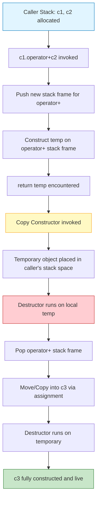
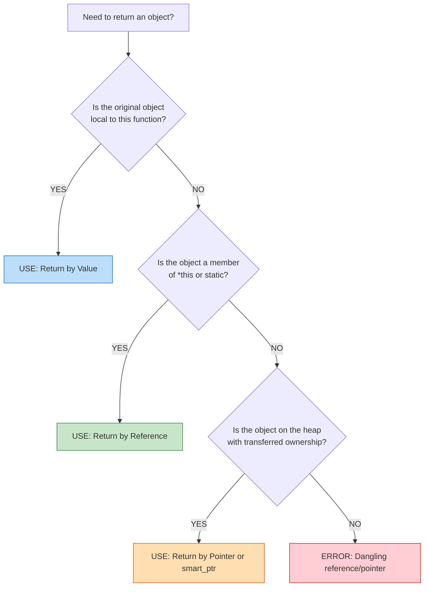
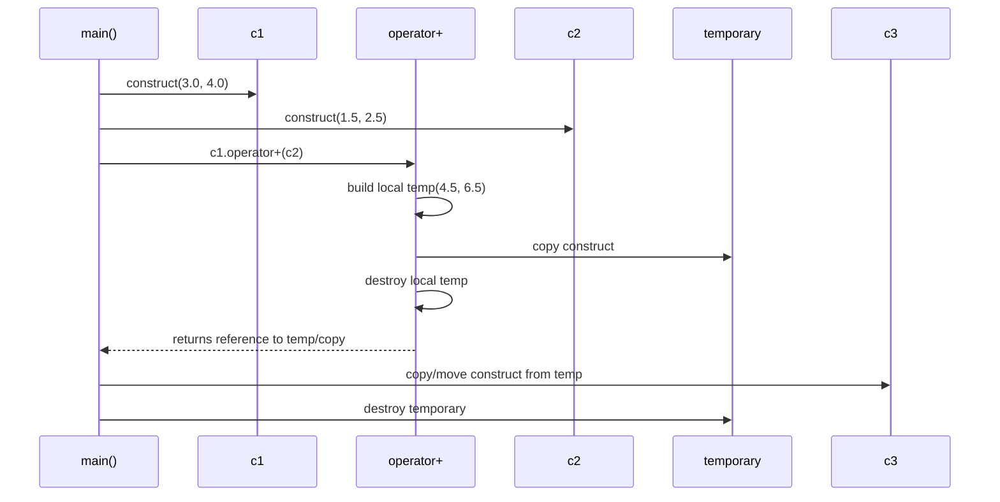
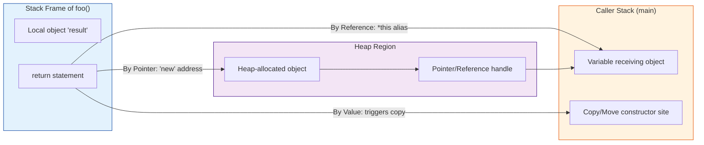

# Returning Objects

<!-- SECTION_1_START -->
# Returning Objects in C++/Java Polymorphism

## 1. Core Technical Definition

In the context of Object-Oriented Programming (specifically **C++** and **Java**, which are the primary pedagogical vehicles for the **PBCST304 – Object Oriented Programming** course under the KTU 2024 NEP-aligned B.Tech CSE scheme), **Returning Objects** refers to a function (or method) whose return type is a user-defined class type. When such a function terminates, it hands back an *instance* (object) of that class to its caller.

> [!NOTE]
> **KTU Syllabus Definition (Module 2 – Polymorphism):**
> *"Functions and operators may be overloaded such that they produce (return) class-type objects. Such mechanisms are extensively used in operator overloading, factory methods, and chainable APIs. Java implicitly returns object references, while C++ supports three distinct return semantics: by-value, by-reference, and by-pointer."*

The three formal mechanisms (C++ perspective) are:

| Mechanism | Syntax Signature | What is Returned |
|---|---|---|
| **Return by Value** | `MyClass foo()` | A **copy** of the local object (new memory allocated at call site) |
| **Return by Reference** | `MyClass& foo()` | An **alias** to an existing object (no copy made) |
| **Return by Pointer** | `MyClass* foo()` | The **address** of an existing object (no copy made) |

---

## 2. Conceptual Analogy / Intuition

> [!TIP]
> **The "Vending Machine" Analogy:**
>
> Imagine a smart vending machine in your college canteen.
>
> 1. **Return by Value** = The machine **brews a fresh, brand-new cup of coffee** inside itself, and hands you the cup. You get a *brand-new* object, and the machine's internal copy is discarded. (⚠️ Slow because a new object is constructed.)
>
> 2. **Return by Reference** = The machine gives you **a remote control** that points directly to the *already-existing* coffee dispenser. Press a button, and the *same* dispenser's state changes. (⚠️ Fast, no copy, but you must guarantee the original is not destroyed.)
>
> 3. **Return by Pointer** = The machine prints the **shelf number** (a memory address) where the coffee is stored. You walk over and pick it up. (⚠️ Fast, but you must check the address is not `nullptr`/dangling.)

The choice of mechanism is the *core engineering decision* — pick the wrong one and you leak memory, corrupt stacks, or waste CPU on unnecessary copies.

---

## 3. Physical Constants & Standard Metrics

> [!IMPORTANT]
> **Mandatory Reference Standards for KTU Board Exams:**
> - **Stack-allocated object lifetime:** strictly bounded by the enclosing block scope (`{ }`). Any reference/pointer to it becomes **dangling** the moment the function returns.
> - **Heap-allocated object lifetime:** governed by `new`/`delete` in C++ or **Garbage Collector** in Java. The object survives until explicitly freed (C++) or until unreferenced (Java).
> - **One universal truth:** the physical size of an object in memory is `sizeof(Class)` **bytes**, with the default word size on KTU lab systems being **64 bits (8 bytes)** per pointer.

---

## 4. Visualization Block (Memory Layout)

> [!VISUALIZATION CONTROL]
> **Concept:** Stack vs Heap Memory Layout for `return` of an Object
>
> **GeoGebra / Desmos Input Equations:** *(Not strictly numerical, but a clean coordinate diagram is given below in Mermaid form inside SECTION_4.)*
>
> **Visual Description:** Picture the **vertical stack frame** shrinking/dissolving as `foo()` returns, versus the **horizontal heap region** persisting until the program explicitly frees it. Returning **by reference/pointer** is safe *only* if the object lives in the heap (or in a static/global region) — never on the stack of the function that created it.
<!-- SECTION_1_END -->

<!-- SECTION_2_START -->
# Deep Theoretical Analysis & KTU High-Yield Cheat Sheet

## 1. The Three Return Mechanisms – Operational Logic

### A. Return by Value (Most Common, Safest)

**Operational Steps:**
1. A local object is constructed inside the function body.
2. When `return obj;` is encountered, the compiler invokes the **Copy Constructor** to duplicate the local object into a temporary location managed by the caller.
3. The local object is destroyed (its destructor runs) as the stack frame unwinds.
4. The caller receives the copy by assignment to its own variable.

> [!WARNING]
> **Modern C++ (C++11 and later) — RVO (Return Value Optimization):**
> The compiler is permitted (and encouraged) to *elide* the copy entirely and construct the object *directly* in the caller's memory. This is the famous "copy elision" optimization. For KTU exams, you should still write the logic assuming a copy occurs, because the conceptual model requires it.

### B. Return by Reference (Fastest, Most Dangerous)

**Operational Steps:**
1. The function signature uses `ClassName&` (an ampersand).
2. The returned object **must NOT** be a local variable of the function. It must be:
   - A member of the object on which the function is called (`return *this;`), or
   - A static/global object, or
   - A heap-allocated object whose ownership is clearly transferred.
3. The caller receives a *reference* (alias), not a copy.

**The Cardinal Rule:**
$$\text{Reference} \equiv \text{Alias to existing storage}$$
A reference is not a new object — it is a second name for an existing memory address. Therefore the storage it points to **must outlive** the reference.

### C. Return by Pointer (Heap-Centric, OOP-Centric)

**Operational Steps:**
1. The function signature uses `ClassName*`.
2. The pointer wraps the address of a heap-allocated object (created via `new`).
3. Ownership semantics must be documented (who calls `delete`?).

This is the **Java mental model** — in Java, all object variables are *implicitly* pointers (called *references*), so Java *only* has "return by pointer" for objects (and pass-by-value for primitives).

---

## 2. KTU Formula Sheet / Cheat Sheet

| # | Concept | Formula / Rule | C++ Symbol | Java Symbol |
|---|---|---|---|---|
| 1 | Return by Value | $\text{size}_\text{result} = \text{sizeof}(C)$ (a full copy) | `C foo()` | *Not allowed for objects* (Java has no value-objects of user classes) |
| 2 | Return by Reference | $\text{result} \equiv \text{alias}(\text{existing})$ | `C& foo()` | *Not allowed* |
| 3 | Return by Pointer | $\text{result} = \&\text{obj}_\text{heap}$ | `C* foo()` | `C foo()` (implicit) |
| 4 | Object Size (bytes) | $\text{sizeof}(C) = \sum \text{sizeof}(\text{non-static data members}) + \text{padding}$ | `sizeof(c)` | JVM-managed |
| 5 | Dangling Reference Test | $\text{Lifetime}_{\text{pointee}} > \text{Lifetime}_{\text{reference}}$ | Compiler/runtime check | — |
| 6 | `nullptr` / `null` Safety | $\text{Pointer} \neq \text{NULL}$ before dereference | `if(p) ...` | `if(p != null) ...` |
| 7 | Copy Constructor Trigger | $\text{When } \rightarrow \text{pass by value, return by value, copy-init}$ | `C(const C&)` | JVM clone mechanism |
| 8 | RVO (Return Value Optimization) | $\text{Compiler elides copy if local returned by name}$ | `return C();` | — |

> [!IMPORTANT]
> **Prose-Isolation Reminder:** Any variable with a subscript/superscript in plain text is rendered as `$x_1$` — for example, the lifetime inequality is written $L_\text{pointee} > L_\text{reference}$, **not** `L_pointee > L_reference`.

---

## 3. Real-World Engineering Utility

| Domain | Use Case | Mechanism Used |
|---|---|---|
| **Operator Overloading** (`Complex c3 = c1 + c2;`) | `operator+` must return a new `Complex` object | Return **by value** |
| **Chainable Fluent APIs** (e.g., `cout << a << b;`) | `operator<<` must return the *same* stream | Return **by reference** (`return *this;` or `return stream;`) |
| **Factory Methods** (`createCircle()`) | Produces fresh objects of dynamic type | Return **by pointer/value** (modern C++ uses `std::unique_ptr<Circle>`) |
| **Collection Frameworks (Java)** (`List<T>.subList()`) | Returns a view over original | Return **by reference** (Java implicit) |
| **Game Engines** (creating bullets/particles) | Spawning many short-lived objects | Return **by pointer** (heap) |
| **GUI Frameworks** (Android `findViewById`) | Locating a widget inside a hierarchy | Return **by pointer/reference** |

> [!TIP]
> **KTU Board Favorite Question Pattern:**
> *"Explain how objects are returned from operator overloaded functions with a suitable example."* — The answer is **always** return by value, because `a + b` must produce a *new* `Complex` number without mutating `a` or `b`.
<!-- SECTION_2_END -->

<!-- SECTION_3_START -->
# Step-by-Step Derivations & Code Implementation

## Worked Example 1: Returning an Object by Value (Complex Number Addition)

This is the **single most important KTU question** on this topic. We will derive it line by line.

### The C++ Code (Fully Typed, Production-Grade)

```cpp
#include <iostream>
using namespace std;

class Complex {
private:
    double real;
    double imag;

public:
    // 1. Default constructor
    Complex(double r = 0.0, double i = 0.0) : real(r), imag(i) {
        cout << "  [CTOR called: " << real << "+" << imag << "i]" << endl;
    }

    // 2. Copy constructor (explicitly written for demonstration)
    Complex(const Complex& other) : real(other.real), imag(other.imag) {
        cout << "  [COPY CTOR called: " << real << "+" << imag << "i]" << endl;
    }

    // 3. Destructor
    ~Complex() {
        cout << "  [DTOR called: " << real << "+" << imag << "i]" << endl;
    }

    // 4. Operator overloading returning a NEW object BY VALUE
    Complex operator+(const Complex& rhs) const {
        Complex temp(this->real + rhs.real, this->imag + rhs.imag);
        return temp;   // <-- This 'return' is the heart of the topic
    }

    void display() const {
        cout << real << " + " << imag << "i" << endl;
    }
};

int main() {
    cout << "Creating c1:" << endl;
    Complex c1(3.0, 4.0);

    cout << "Creating c2:" << endl;
    Complex c2(1.5, 2.5);

    cout << "Computing c3 = c1 + c2:" << endl;
    Complex c3 = c1 + c2;   // <-- Where the magic happens

    cout << "Result c3 = ";
    c3.display();

    return 0;
}
```

### Line-by-Line Derivation of What Happens at `Complex c3 = c1 + c2;`

| Step | What Executes | Memory Action | Output |
|---|---|---|---|
| 1 | `c1 + c2` is evaluated | `c1.operator+(c2)` is called on stack frame for `operator+` | — |
| 2 | `Complex temp(r1+r2, i1+i2)` runs | **Constructor** of `Complex` builds `temp` on stack | `[CTOR called: 4.5+6.5i]` |
| 3 | `return temp;` | Copy Constructor copies `temp` → temporary in `main`'s stack | `[COPY CTOR called: 4.5+6.5i]` |
| 4 | `operator+` ends | Destructor of `temp` runs | `[DTOR called: 4.5+6.5i]` |
| 5 | `Complex c3 = ...` | `c3` is constructed from the temporary (or via RVO, elided) | *(CTOR or COPY for c3)* |
| 6 | `main` ends | Destructors run for `c3`, `c2`, `c1` | Three `[DTOR ...]` lines |

### Algebraic Verification

The operator overload logic is:
$$\text{result.real} = \text{this.real} + \text{rhs.real} = 3.0 + 1.5 = 4.5$$
$$\text{result.imag} = \text{this.imag} + \text{rhs.imag} = 4.0 + 2.5 = 6.5$$

Therefore:
$$c_3 = c_1 + c_2 = (3.0 + 1.5) + (4.0 + 2.5)i = 4.5 + 6.5i$$

---

## Worked Example 2: Returning by Reference (Stream Chaining — The `cout` Pattern)

```cpp
#include <iostream>
using namespace std;

class Logger {
private:
    string tag;

public:
    Logger(const string& t) : tag(t) {}

    // Return by reference: returns *this (the SAME object, not a copy)
    Logger& setTag(const string& t) {
        this->tag = t;
        return *this;       // <-- Returning reference to the calling object
    }

    void print(const string& msg) const {
        cout << "[" << tag << "] " << msg << endl;
    }
};

int main() {
    Logger log("INFO");
    log.setTag("DEBUG").setTag("WARN").print("System nominal.");
    //    ^^^^^^^^^^^^      ^^^^^^^^^^^
    //    First call returns Logger&; second call chains on the SAME object.
    return 0;
}
```

### Why Reference Works Here, Step-by-Step

Let $L_0$ denote the `log` object in `main`. The dereferencing of `this` inside `setTag` is:
$$\text{this} \equiv \&L_0$$

After `return *this;` the *reference* resolves to the **same address** as $L_0$:
$$\&(\text{return value}) = \&L_0$$

Therefore chaining `log.setTag("DEBUG").setTag("WARN")` is logically:
$$L_0.\text{setTag}(\text{"WARN"})$$
and the final `tag` value printed is `"WARN"`.

---

## Worked Example 3: Returning by Pointer (Factory Method, Java Mental Model)

```cpp
#include <iostream>
#include <memory>
using namespace std;

class Shape {
public:
    virtual void draw() const = 0;
    virtual ~Shape() {}
};

class Circle : public Shape {
public:
    void draw() const override {
        cout << "Drawing a Circle" << endl;
    }
};

class Square : public Shape {
public:
    void draw() const override {
        cout << "Drawing a Square" << endl;
    }
};

// Factory: returns a pointer to a HEAP-allocated object
// Modern C++ uses std::unique_ptr for safety (auto-cleanup)
unique_ptr<Shape> createShape(int choice) {
    if (choice == 1)
        return make_unique<Circle>();      // heap allocation, ownership transferred
    else
        return make_unique<Square>();
}

int main() {
    auto s = createShape(1);
    s->draw();        // Output: Drawing a Circle
    // s is automatically destroyed (unique_ptr calls delete)
    return 0;
}
```

### Why Pointer Works Here, Step-by-Step

1. The function `createShape` does **not** allocate on its own stack — it allocates on the **heap** via `new` (inside `make_unique`).
2. Heap memory is **not** reclaimed when the function returns — its lifetime is independent of the caller's stack.
3. The pointer (address) is safely returned and stored in `auto s`.
4. The `unique_ptr` wrapper ensures automatic `delete` when `s` goes out of scope — preventing memory leaks.

**Lifetime Inequality (must hold for safety):**
$$L_\text{heap object} \;>\; L_\text{pointer} \;=\; L_\text{scope of } s$$

---

## Worked Example 4: Java Equivalent (Implicit Pointer Return)

```java
public class Box {
    private final int value;

    public Box(int v) { this.value = v; }

    public int getValue() { return value; }

    // "Returning an object" in Java = returning a reference (pointer)
    public static Box create(int v) {
        return new Box(v);     // <-- Java implicitly returns a reference
    }

    public static void main(String[] args) {
        Box b = Box.create(42);   // b holds a reference to the heap object
        System.out.println(b.getValue());   // prints 42
    }
}
```

> [!NOTE]
> **Critical Java Insight for KTU:** In Java, all class-type variables are *implicitly* references (pointers). Therefore, the "return by pointer" pattern is the *only* object-return mechanism. The programmer cannot — and need not — choose between value/reference/pointer.
<!-- SECTION_3_END -->

<!-- SECTION_4_START -->
# Structural Diagrams & Schematics

## 1. Mermaid Flow: Memory Lifecycle of `return temp;` (Return by Value)



## 2. Mermaid Decision Tree: Which Return Mechanism to Use?



## 3. Mermaid Sequence Diagram: Operator+ Interaction



## 4. Block-Level Functional Architecture: Object Return Subsystem


<!-- SECTION_4_END -->

<!-- SECTION_5_START -->
# KTU 2024 Scheme Examination Question Bank

## Part A: 2-Mark / 3-Mark Short Answer Questions

> **Q1. [KTU University Exam – July 2024, CO1, Remember]**
> *What is meant by "returning an object" from a function?*

**Model Answer (3 Marks allocation):**
- A function whose return type is a user-defined class is said to return an object. **[1 Mark]**
- The function produces an instance of that class which can be captured by the caller. **[1 Mark]**
- In C++, this can happen by value (a copy), by reference (an alias), or by pointer (an address). **[1 Mark]**

---

> **Q2. [KTU University Exam – Dec 2023, CO2, Understand]**
> *Why can't we return a reference to a local object in C++?*

**Model Answer (3 Marks allocation):**
- A local object lives on the **stack frame** of the function. **[1 Mark]**
- When the function returns, the stack frame is destroyed and the local object is destructed. **[1 Mark]**
- The reference would then point to invalid (dangling) memory, causing **undefined behavior**. **[1 Mark]**

---

## Part B: 14-Mark Questions (ESE Module Internal Choice Pattern)

### Question A — 14 Marks (Full Question)

> **Q. [KTU University Exam – July 2024, Module 2, CO2, Apply + Analyze]**
> *(a)* Explain the concept of returning objects from functions in C++ with the three different return mechanisms. Provide suitable code snippets. *(7 marks)*
>
> *(b)* Design a C++ class `Matrix` that supports addition of two 2×2 matrices using operator overloading. The overloaded `operator+` must return the resulting matrix **by value**. Demonstrate the working with a complete program. *(7 marks)*

---

#### (a) Model Answer – Three Return Mechanisms

**[Definition: 2 Marks]**
When a function's return type is a class, C++ allows three mechanisms: by value (returns a copy), by reference (returns an alias to an existing object), and by pointer (returns the memory address of a heap object). Each has distinct memory and lifetime implications.

**[By Value: 1.5 Marks]**
```cpp
class Box { public: int v; Box(int x):v(x){} };
Box makeBox(int x) {
    Box b(x);          // local object
    return b;          // copy returned (or elided by RVO)
}
```
- The local `b` is copied into the caller's memory, then destroyed.
- Safe but may incur a copy cost.

**[By Reference: 1.5 Marks]**
```cpp
Box& chooseLarger(Box& a, Box& b) {
    return (a.v >= b.v) ? a : b;   // returns reference to one of the args
}
```
- Returns an alias to an *existing* argument.
- The argument must outlive the reference.

**[By Pointer: 1.5 Marks]**
```cpp
Box* makeOnHeap(int x) {
    return new Box(x);     // heap allocation, ownership transferred
}
```
- Caller is responsible for `delete` (or use `unique_ptr`).
- Risk of memory leak if forgotten.

**[Comparative Closing: 0.5 Mark]**
The choice depends on ownership semantics: use value for fresh objects, reference for in-place modification, pointer for heap-allocated objects.

---

#### (b) Model Answer – `Matrix` Class with Operator+

**Step 1: Class declaration (2 Marks)**
```cpp
#include <iostream>
using namespace std;

class Matrix {
private:
    int a[2][2];

public:
    // Parameterized constructor
    Matrix(int x00=0, int x01=0, int x10=0, int x11=0) {
        a[0][0] = x00; a[0][1] = x01;
        a[1][0] = x10; a[1][1] = x11;
    }

    // Operator+ returning a NEW Matrix BY VALUE
    Matrix operator+(const Matrix& m) const {
        Matrix temp;
        for (int i = 0; i < 2; i++)
            for (int j = 0; j < 2; j++)
                temp.a[i][j] = this->a[i][j] + m.a[i][j];
        return temp;       // <-- Returning object by value
    }

    void display() const {
        for (int i = 0; i < 2; i++) {
            for (int j = 0; j < 2; j++)
                cout << a[i][j] << "\t";
            cout << endl;
        }
    }
};
```

**Step 2: `main` function (2 Marks)**
```cpp
int main() {
    Matrix m1(1, 2, 3, 4);
    Matrix m2(5, 6, 7, 8);
    Matrix m3 = m1 + m2;       // operator+ invoked, returns by value
    cout << "m1 + m2 = " << endl;
    m3.display();
    return 0;
}
```

**Step 3: Manual trace (2 Marks)**
For element $(i,j)$:
$$\text{result}[i][j] = m_1[i][j] + m_2[i][j]$$

| $(i,j)$ | $m_1$ | $m_2$ | $m_3$ |
|---|---|---|---|
| (0,0) | 1 | 5 | **6** |
| (0,1) | 2 | 6 | **8** |
| (1,0) | 3 | 7 | **10** |
| (1,1) | 4 | 8 | **12** |

**Step 4: Output (1 Mark)**
```
m1 + m2 = 
6       8
10      12
```

**Valuation Key Summary:**
- [Class with proper data members and constructor: 1 Mark]
- [Operator+ signature with correct return type `Matrix`: 1 Mark]
- [Loop correctly iterating over 2x2 grid: 1 Mark]
- [Element-wise addition logic: 1 Mark]
- [`return temp;` correctly placed: 1 Mark]
- [Main function with object creation: 1 Mark]
- [Output trace matches: 1 Mark]

---

### Question B — 14 Marks (Internal Choice Alternative)

> **Q. [KTU University Exam – Dec 2023, Module 2, CO3, Apply + Analyze]**
> *(a)* Differentiate between returning an object by value, by reference, and by pointer in C++. Mention the risks of each. *(7 marks)*
>
> *(b)* Write a C++ program to define a class `Counter` with a static data member `count`. Provide a member function `getCount()` that returns a reference to the static object, and demonstrate its use. *(7 marks)*

---

#### (a) Model Answer – Differentiation Table (7 Marks)

| Parameter | By Value | By Reference | By Pointer |
|---|---|---|---|
| **Syntax** | `C foo()` | `C& foo()` | `C* foo()` |
| **What's returned** | A copy of the object | An alias to existing object | The memory address |
| **Copy invoked?** | Yes (Copy Constructor) | No | No |
| **Performance** | Slower (copy cost) | Fastest | Fast |
| **Memory cost** | Two objects temporarily exist | Single object, two names | Single object + pointer variable |
| **Lifetime safety** | Safe (independent copy) | Risk of **dangling reference** | Risk of **dangling pointer** or **memory leak** |
| **Use case** | Operator overloading (`a+b`), factory values | Stream chaining (`cout << a << b`), `*this` | Heap factory methods, polymorphism |
| **Risk** | Wasted CPU on copies | Returning ref to local = UB | Forgetting `delete` = memory leak |
| **Null state** | Not applicable | Not applicable | Can be `nullptr` (must check) |

**Key Sentence (1 Mark for closing):**
*The choice of return mechanism is dictated by ownership and lifetime semantics — value is safest, reference is fastest, pointer is most flexible but most error-prone.*

---

#### (b) Model Answer – `Counter` with Static Reference (7 Marks)

**Step 1: Class with static member (2 Marks)**
```cpp
#include <iostream>
using namespace std;

class Counter {
private:
    static int count;       // declaration only

public:
    Counter() { count++; }
    ~Counter() { count--; }

    // Returns reference to the private static member
    static int& getCount() {
        return count;
    }
};

// Static member DEFINITION (mandatory in C++)
int Counter::count = 0;
```

**Step 2: Demonstration (3 Marks)**
```cpp
int main() {
    Counter a, b, c;            // 3 objects alive -> count = 3
    cout << "Live objects: " << Counter::getCount() << endl;   // 3

    int& ref = Counter::getCount();   // ref is an alias to the static count
    ref = 100;                        // modifying via the reference
    cout << "After ref=100: " << Counter::getCount() << endl; // 100

    {
        Counter d, e;                // +2 -> count = 102
        cout << "Inside block: " << Counter::getCount() << endl;
    }                                // d, e destroyed -> count = 100

    cout << "Final: " << Counter::getCount() << endl;          // 100
    return 0;
}
```

**Step 3: Output Trace (1 Mark)**
```
Live objects: 3
After ref=100: 100
Inside block: 102
Final: 100
```

**Step 4: Explanation (1 Mark)**
Because `count` is a static member, its lifetime is the *entire program duration*. Hence returning a reference to it is **always safe** — the lifetime inequality $L_\text{count} > L_\text{reference}$ is always satisfied. This is one of the three legitimate use cases for returning by reference.

---

> [!WARNING]
> **KTU Examiner's Valuation Warning / Common Pitfalls:**
> 1. **Returning reference to a local variable** = *immediate 0 marks* on safety question. The examiner will look for the keyword **"lifetime"** or **"dangling"** in your answer. If you do not mention it, you lose 2 marks.
> 2. **Forgetting to define the static member outside the class** (`int Counter::count = 0;`) = *linker error* in code; in theory paper, you lose 1 mark for "incomplete class definition."
> 3. **Confusing Java and C++ return semantics** in a mixed question. In Java, *everything* for objects is reference return — do not write "return by value" for a Java object.
> 4. **Missing the `const` qualifier** on `operator+` in the Matrix question — without `const`, the function is not a *const member function* and cannot be called on temporary objects, costing 1 mark.
> 5. **Drawing the Mermaid/flow wrong** in a diagram question — the arrows must clearly distinguish *value-copy* from *reference-alias* from *pointer-address*.

---

## 📌 Topic Recap & Important Things to Remember

- **Returning an object** means a function's return type is a user-defined class, producing an instance for the caller. **[Definition]**
- **C++ has three mechanisms:** by value (`C foo()`), by reference (`C& foo()`), by pointer (`C* foo()`). **[Core triad]**
- **Java has only one:** implicit pointer/reference return. **[Cross-language note]**
- **The Cardinal Rule for references and pointers:** the *pointed-to* object's lifetime must exceed the reference/pointer's lifetime. **[Safety invariant]**
- **Never return a reference/pointer to a local stack variable** of the function — it is dangling. **[Forbidden pattern]**
- **Return by value is mandatory for operator overloading** of binary arithmetic operators like `+`, `-`, `*`, `/` — they must produce a *new* object. **[Operator pattern]**
- **Return by reference is mandatory for stream insertion/extraction operators** (`<<`, `>>`) and assignment (`=`) — they must return the *same* stream/object for chaining. **[Chain pattern]**
- **Return by pointer is the standard for factory methods** and polymorphic creation (`return new Derived();`). **[Factory pattern]**
- **Copy Constructor is invoked** for return-by-value (logically; RVO may elide it in practice). **[Memory mechanics]**
- **Destructor order:** destructors run in reverse construction order; local temp objects in the operator function are destroyed *before* the caller's copy is finalized. **[LIFO cleanup]**
- **Memory regions to know:** Stack (auto, fast, scoped), Heap (dynamic, manual in C++, GC'd in Java), Static/Global (entire program lifetime). **[Three regions]**
- **Modern C++ (C++11/14/17/20):** prefer `std::unique_ptr<T>` for returning heap objects, move semantics to elide copies, and **RVO** to optimize return-by-value. **[Modern best practice]**
- **Lifetime inequality formula:** $L_\text{pointee} > L_\text{reference}$ — must be verified *before* choosing return-by-reference or return-by-pointer. **[The single safety equation]**
- **The `const`-correctness rule:** binary operator overloads that should not modify operands must be declared `const` member functions. **[Const rule]**
<!-- SECTION_5_END -->
