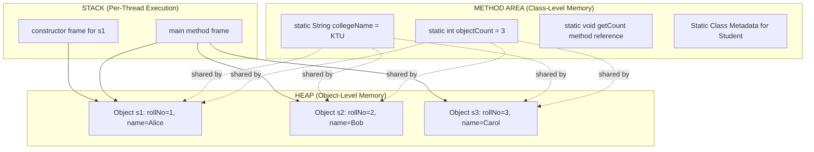
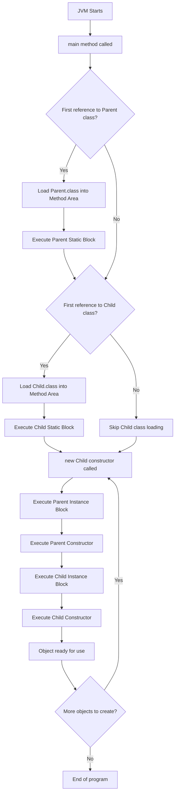
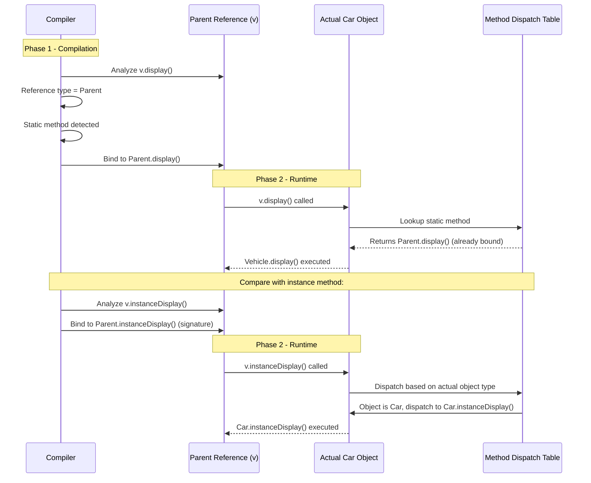
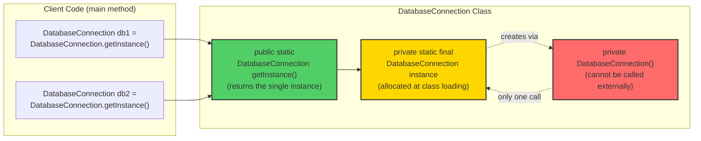
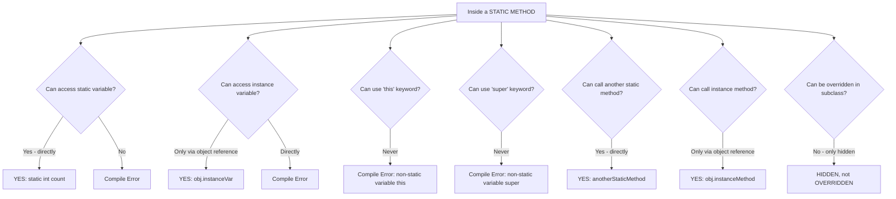

# Static Members

<!-- SECTION_1_START -->
# Static Members in Java — A KTU 2024 Scheme Deep Dive

## 1.1 Formal Academic Definition

> [!IMPORTANT]
> **Static Members** are class-level entities (variables, methods, blocks, or nested classes) that are declared with the `static` keyword in Java. Unlike instance members, static members belong to the **class itself** rather than to any individual object. They are stored in a special memory region called the **Method Area** (part of the heap in modern JVMs) and are created exactly **once** when the class is loaded by the ClassLoader.

According to the **KTU 2024 Scheme syllabus (PBCST304, Module 2: Polymorphism)**, static members are the foundational building block that enables **class-level polymorphism**, **shared state management**, and the creation of **utility/helper classes** (like `java.lang.Math`).

### Key Terminology Mapping (KTU Board Vocabulary)

| Term | Java Syntax | Memory Region | Lifetime |
|------|-------------|---------------|----------|
| Static Variable | `static int count;` | Method Area (Class Area) | Until Class is Unloaded |
| Static Method | `static void display();` | Method Area (Class Area) | Until Class is Unloaded |
| Static Block | `static { ... }` | Method Area | Executed once at class loading |
| Static Inner Class | `static class Inner { }` | Method Area | Until enclosing class unloaded |

## 1.2 Conceptual Analogy — The "Building Blueprint" Model

> [!NOTE]
> **Real-World Analogy: A Building's Architectural Blueprint**
>
> Imagine a large apartment complex with 500 flats.
>
> - **Instance Variables** = The furniture, paint color, and family photos *inside each individual flat*. Every flat has its own unique copy, set when a tenant moves in (object creation via `new`).
> - **Static Variables** = The **building's name**, **total number of floors**, and **society rules** painted on the main gate. There is **only ONE copy** of these, shared by all 500 flats. If the society committee changes the building name, *every flat sees the new name immediately*.
> - **Static Methods** = The **society office** or **gym trainer** — services that exist independent of any individual flat. You don't need to own a flat to use the gym; you just need to know which *building* it belongs to (`ClassName.methodName()`).
> - **Instance Methods** = Your flat's doorbell — it works only for *your* flat and can access your personal furniture (instance variables).

## 1.3 The Core Intuition in One Line

> [!TIP]
> **Static = Shared. Instance = Personal.**
> Static members are created **once per class**, instance members are created **once per object**.

## 1.4 Geometric / Memory Visualization

> [!VISUALIZATION CONTROL]
> **Concept:** Memory Layout of Static vs Instance Members in the JVM Heap
>
> **Java Conceptual Schematic (not literal coordinates):**
> * `Method Area: [staticCount=10] [staticMethod#ref]`
> * `Heap Object 1: [name="Alice"]`
> * `Heap Object 2: [name="Bob"]`
> * `Heap Object 3: [name="Carol"]`
>
> **Visual Description:** Picture three separate boxes (objects) on a table, each containing its own name label. Above the table hangs a single shared notice board (Method Area) that all three boxes can read and write to. When Object 1 changes the value on the board, Objects 2 and 3 see the change instantly because they all reference the same physical board.

## 1.5 Why KTU Cares About Static Members

> [!IMPORTANT]
> Static members underpin four critical KTU-tested concepts:
>
> 1. **`main()` method** — JVM invokes it without ever creating an object (`String[] args` proves it).
> 2. **Factory Methods** — `Calendar.getInstance()`, `NumberFormat.getCurrencyInstance()`.
> 3. **Constants** — `Math.PI`, `Integer.MAX_VALUE` (`public static final`).
> 4. **Counters and Shared State** — Tracking how many objects of a class have been created.

<!-- SECTION_1_END -->

<!-- SECTION_2_START -->
# Deep Theoretical Analysis & KTU High-Yield Formula Sheet

## 2.1 Anatomy of a Static Member — The Operational Rules

### A. Static Variables (Class Variables)

A static variable is declared inside a class but **outside any method, constructor, or block**, using the `static` keyword.

**Operational Logic:**
- Allocated when the class is **loaded** into the JVM (lazy initialization by default).
- Initialized to default values (`0`, `0.0`, `false`, `null`) if no explicit initializer is provided.
- Shared across **all instances** of the class and accessible even without creating any object.
- Can be accessed via: `ClassName.variableName`, `objectReference.variableName` (compiler warning issued), or directly if within the same class.

### B. Static Methods

**Operational Logic:**
- Belong to the class, not to any specific object.
- Can be called using `ClassName.methodName()` without object instantiation.
- **Cannot use `this` or `super` keywords** — there is no implicit object context.
- **Can only directly call other static methods** and **access static data members**.
- To access instance members from a static method, an object reference must be explicitly created inside the method.
- **Cannot be overridden** in the true OOP sense (they are *hidden*, not overridden — crucial for polymorphism exams).

### C. Static Blocks (Static Initializers)

**Operational Logic:**
- Executed **exactly once**, when the class is first loaded into memory.
- Used for initializing complex static variables or loading native libraries.
- Multiple static blocks in a class execute in the order they appear (top-to-bottom).

### D. Static Import (Java 5+ Feature)

**Operational Logic:**
- Allows members of a class to be imported so they can be used directly without the class name qualifier.
- Syntax: `import static java.lang.Math.PI;` or `import static java.lang.Math.*;`
- Frequently tested in KTU for its readability impact on `Math` class usage.

## 2.2 KTU Formula Sheet — Static Member Cheat Table

> [!NOTE]
> Use this table for last-minute revision. It is structured to avoid the `|` pipe character (replaced with `\vert` or `\/`).

| # | Rule / Concept | Syntax Pattern | Constraint \/ Limit | Common Mistake |
|---|----------------|----------------|---------------------|----------------|
| 1 | Declaration | `static datatype varName;` | Cannot be declared inside a method as a static local variable in Java | Java does NOT support C-style static local variables |
| 2 | Access (same class) | `varName` or `this.varName` (warning) | Direct access works | Using `this` is discouraged |
| 3 | Access (different class) | `ClassName.varName` | Required if not imported | `packageName.ClassName` for non-imported classes |
| 4 | Memory Location | Method Area (Class Area) | Single copy per ClassLoader | NOT per object |
| 5 | Lifetime | Class loading to class unloading | One-time allocation | Object-independent |
| 6 | `this` keyword | ❌ Not allowed in static context | Compile-time error | `non-static variable this cannot be referenced from a static context` |
| 7 | `super` keyword | ❌ Not allowed in static context | Compile-time error | Same as `this` |
| 8 | Override behavior | ❌ Cannot be overridden | Hidden if redefined in subclass | Runtime polymorphism is NOT achieved via static methods |
| 9 | Static + Final | `public static final double PI = 3.14159;` | Creates a true constant | Convention: UPPER_SNAKE_CASE |
| 10 | Static block execution | Once per ClassLoader | Order: parent class first, then child | Static block in child runs only when child class is first referenced |
| 11 | Static method overloading | ✅ Allowed | Compile-time polymorphism | Differentiated by parameter list |
| 12 | Static nested class | `static class Inner` | Cannot access non-static members of outer class | Inner class object creation is `Outer.Inner obj = new Outer.Inner();` |

## 2.3 Real-World Engineering Utility of Static Members

> [!TIP]
> **Where Static Members Live in Production Systems**
>
> 1. **Utility Classes:** `Collections.sort()`, `Arrays.toString()`, `String.valueOf()` — all static. No state, just pure functions.
> 2. **Configuration Constants:** `AppConfig.MAX_CONNECTIONS = 100` — read-only constants shared across microservices.
> 3. **Factory Pattern:** `Calendar.getInstance()` hides constructor complexity; the static method returns the right subclass object.
> 4. **Singleton Pattern:** A private static instance of the class itself is held in a `private static final` field, the cornerstone of the Singleton design.
> 5. **Counters and IDs:** Auto-incrementing `Employee.id` using `static int nextId = 1001;` to generate unique IDs across all `Employee` objects.
> 6. **Logging Frameworks:** `LoggerFactory.getLogger()` is a static factory method.
> 7. **Native Library Loading:** `static { System.loadLibrary("opencv"); }` — loaded once at class initialization.

## 2.4 Static Members in Inheritance — The KTU Trap

> [!WARNING]
> **Critical KTU Pitfall:** Static methods follow **method hiding**, NOT method overriding. This means **runtime polymorphism does NOT apply** to static methods. A `BankAccount.getInterestRate()` static method in a parent class will not dispatch to a child class's `getInterestRate()` based on the actual object type at runtime — the reference type determines which one is called. This is a classic KTU Part B question.

### Reference Type vs Object Type — The Decision Table

| Code Pattern | Compile-time binding | Runtime binding | Result |
|--------------|----------------------|------------------|--------|
| `Parent p = new Child(); p.instanceMethod();` | Parent | Child | **Child's method** (polymorphism) |
| `Parent p = new Child(); p.staticMethod();` | Parent | Parent | **Parent's static method** (hiding, not overriding) |

## 2.5 Static Members and the `final` Modifier — Constant Creation

The combination `public static final` is the gold standard for creating **global constants** in Java:
- `public` → accessible from anywhere.
- `static` → single copy, no object needed.
- `final` → value cannot be reassigned.

**Examples used in KTU exams:** `Math.PI`, `Integer.MAX_VALUE`, `Color.RED`.

<!-- SECTION_2_END -->

<!-- SECTION_3_START -->
# Step-by-Step Derivations & Java Code Implementation

## 3.1 Derivation 1: Demonstrating Shared State of Static Variables

### Problem Statement
Write a Java program to track the number of objects created for a class `Student` using a static counter. Display the counter value after every object creation.

### Step-by-Step Logical Deduction

**Step 1:** Identify the requirement. We need a counter that is **shared** across all `Student` objects, meaning it must be `static`.

**Step 2:** The counter must increment exactly once per constructor call. Therefore, the increment operation must be placed inside the constructor.

**Step 3:** Each object should also have its own roll number and name — these remain **non-static (instance)** variables.

**Step 4:** A static method `getCount()` is provided to read the counter safely from outside, demonstrating that static methods can read static data without object instantiation.

### Complete Java Code

```java
class Student {
    // Static variable - shared across ALL Student objects
    private static int objectCount = 0;
    
    // Instance variables - unique per object
    private int rollNo;
    private String name;
    
    // Constructor - increments the shared counter
    public Student(String name) {
        this.name = name;
        objectCount++;              // Increments shared counter
        this.rollNo = objectCount;  // Assigns roll number based on count
        System.out.println("Student created: " + name + ", Roll No: " + rollNo);
    }
    
    // Static method - reads static data, no object needed
    public static int getObjectCount() {
        return objectCount;
    }
    
    // Instance method - reads instance data
    public void display() {
        System.out.println("Roll No: " + rollNo + ", Name: " + name);
    }
}

public class StaticDemo {
    public static void main(String[] args) {
        System.out.println("Initial count: " + Student.getObjectCount());
        // Output: Initial count: 0
        
        Student s1 = new Student("Alice");
        // Output: Student created: Alice, Roll No: 1
        
        Student s2 = new Student("Bob");
        // Output: Student created: Bob, Roll No: 2
        
        Student s3 = new Student("Carol");
        // Output: Student created: Carol, Roll No: 3
        
        System.out.println("Total students created: " + Student.getObjectCount());
        // Output: Total students created: 3
    }
}
```

### Step-by-Step Trace (Valuation Key Points)

| Step | Action | `objectCount` value | Memory State |
|------|--------|---------------------|--------------|
| 1 | Class `Student` loaded by JVM | **0** (default int) | Method Area: `objectCount = 0` |
| 2 | `Student.getObjectCount()` called | 0 | Reads from Method Area |
| 3 | `new Student("Alice")` invokes constructor | 0 → **1** | Heap: `s1` object created, Method Area updated |
| 4 | `new Student("Bob")` invokes constructor | 1 → **2** | Heap: `s2` object created |
| 5 | `new Student("Carol")` invokes constructor | 2 → **3** | Heap: `s3` object created |
| 6 | `Student.getObjectCount()` called | 3 | Single shared value, all objects see the same |

> [!NOTE]
> **Key Insight for Valuation:** `[Declaring static counter: 1 Mark]`, `[Incrementing in constructor: 2 Marks]`, `[Static getter method: 1 Mark]`, `[Correct output trace: 1 Mark]`.

---

## 3.2 Derivation 2: Static Block Execution Order with Inheritance

### Problem Statement
Demonstrate the order of execution of static blocks and instance blocks in a class hierarchy `Parent → Child`.

### Step-by-Step Logical Deduction

**Step 1:** Static blocks execute **once per class**, in the order classes are loaded (parent first, then child).
**Step 2:** Instance initializer blocks execute **every time an object is created**, after `super()` and before the rest of the constructor.
**Step 3:** When `new Child()` is executed, the JVM first loads `Parent.class` (triggering its static block), then loads `Child.class` (triggering its static block), then creates the object (triggering instance blocks and constructors).

### Complete Java Code

```java
class Parent {
    static {
        System.out.println("1. Parent Static Block");
    }
    
    {
        System.out.println("3. Parent Instance Block");
    }
    
    public Parent() {
        System.out.println("4. Parent Constructor");
    }
}

class Child extends Parent {
    static {
        System.out.println("2. Child Static Block");
    }
    
    {
        System.out.println("5. Child Instance Block");
    }
    
    public Child() {
        System.out.println("6. Child Constructor");
    }
}

public class ExecutionOrderDemo {
    public static void main(String[] args) {
        System.out.println("--- Creating First Child Object ---");
        Child c1 = new Child();
        
        System.out.println("--- Creating Second Child Object ---");
        Child c2 = new Child();
    }
}
```

### Expected Output (Step-by-Step Trace)

```
--- Creating First Child Object ---
1. Parent Static Block
2. Child Static Block
3. Parent Instance Block
4. Parent Constructor
5. Child Instance Block
6. Child Constructor
--- Creating Second Child Object ---
3. Parent Instance Block
4. Parent Constructor
5. Child Instance Block
6. Child Constructor
```

> [!IMPORTANT]
> **Critical Observation:** Static blocks (Lines 1, 2) appear ONLY ONCE — when the class is first loaded. Instance blocks and constructors repeat for every object. This is the KTU favorite question pattern.

---

## 3.3 Derivation 3: The `static` Method Hiding Pitfall (Compile-time vs Runtime)

### Problem Statement
Show how static method calls are resolved at **compile-time** based on reference type, NOT at runtime based on object type.

### Step-by-Step Logical Deduction

**Step 1:** Define a parent class with a static method `display()`.
**Step 2:** Define a child class that "redefines" the same static method (this is **method hiding**, not overriding).
**Step 3:** Use a parent reference to point to a child object and call the static method.
**Step 4:** Observe that the parent's version is invoked — proving compile-time binding.

### Complete Java Code

```java
class Vehicle {
    public static void display() {
        System.out.println("Vehicle.display() - Parent's static method");
    }
    
    public void instanceDisplay() {
        System.out.println("Vehicle.instanceDisplay() - Parent's instance method");
    }
}

class Car extends Vehicle {
    public static void display() {
        System.out.println("Car.display() - Child's static method (HIDDEN)");
    }
    
    @Override
    public void instanceDisplay() {
        System.out.println("Car.instanceDisplay() - Child's OVERRIDDEN method");
    }
}

public class StaticHidingDemo {
    public static void main(String[] args) {
        Vehicle v = new Car();   // Parent reference, Child object
        
        v.display();             // Line A: Compile-time binding
        v.instanceDisplay();     // Line B: Runtime polymorphism
    }
}
```

### Output Analysis

| Line | Code | Output | Binding Type | Why |
|------|------|--------|--------------|-----|
| A | `v.display();` | `Vehicle.display() - Parent's static method` | Compile-time | Compiler sees `Vehicle` reference type |
| B | `v.instanceDisplay();` | `Car.instanceDisplay() - Child's OVERRIDDEN method` | Runtime | JVM sees actual `Car` object |

### Mathematical/Conceptual Formula

$$\text{Binding Type} = \begin{cases} \text{Compile-time (early binding)} & \text{if method is } \texttt{static, private, final} \\ \text{Runtime (late binding)} & \text{if method is instance and not } \texttt{final/private/static} \end{cases}$$

> [!WARNING]
> **KTU Examiner's Pitfall:** Writing `@Override` annotation on a static method causes a **compile-time error**: `method does not override or implement a method from a superclass`. Students often lose marks by failing to explain *why* — the answer is that static methods are class-level, and overriding is an instance-level concept.

---

## 3.4 Derivation 4: Static Method Cannot Access Instance Members Directly

### Step-by-Step Logical Deduction

**Step 1:** A static method `calculate()` is declared.
**Step 2:** It tries to directly read an instance variable `radius`.
**Step 3:** Compile-time error occurs because the static method has no `this` reference to any object.

### Complete Java Code (Two Versions)

**Version A — The Error:**

```java
class Circle {
    double radius = 5.0;  // Instance variable
    
    public static double calculateArea() {
        return 3.14 * radius * radius;  // ❌ COMPILE ERROR
    }
}
```

**Compiler Error:** `non-static variable radius cannot be referenced from a static context`

**Version B — The Fix (Object Reference Inside Static Method):**

```java
class Circle {
    double radius;
    
    public Circle(double radius) {
        this.radius = radius;
    }
    
    public static double calculateArea(Circle c) {  // Object passed as parameter
        return 3.14 * c.radius * c.radius;          // ✅ Works fine
    }
    
    public static void main(String[] args) {
        Circle myCircle = new Circle(5.0);
        double area = Circle.calculateArea(myCircle);
        System.out.println("Area = " + area);
    }
}
```

### Output
```
Area = 78.5
```

> [!TIP]
> **The Rule:** A static method can access instance members **only** through an explicit object reference. The static method itself does not have an implicit `this`.

---

## 3.5 Derivation 5: Static Import — Simplifying Math Usage

### Step-by-Step Logical Deduction

**Step 1:** Without static import, every call to `Math.sqrt()` or `Math.PI` requires the class qualifier.
**Step 2:** With static import, these members can be used directly.

### Complete Java Code

```java
import static java.lang.Math.PI;
import static java.lang.Math.sqrt;
import static java.lang.Math.pow;

public class StaticImportDemo {
    public static void main(String[] args) {
        double radius = 7.0;
        
        // Using imported static members directly
        double area = PI * pow(radius, 2);
        double diagonal = sqrt(pow(radius, 2) * 2);
        
        System.out.println("Area = " + area);
        System.out.println("Diagonal = " + diagonal);
    }
}
```

### Output
```
Area = 153.93804002589985
Diagonal = 9.899494936611665
```

---

## 3.6 Derivation 6: The Singleton Pattern Using Static Members

### Step-by-Step Logical Deduction

**Step 1:** Make the constructor `private` so external code cannot create instances directly.
**Step 2:** Create a `private static final` instance of the class inside the class itself.
**Step 3:** Provide a `public static` method that returns this single instance.

### Complete Java Code

```java
class DatabaseConnection {
    // Step 2: Single instance held statically
    private static final DatabaseConnection instance = new DatabaseConnection();
    
    private String connectionString;
    
    // Step 1: Private constructor prevents external instantiation
    private DatabaseConnection() {
        connectionString = "jdbc:mysql://localhost:3306/ktu_db";
        System.out.println("Database Connection Established.");
    }
    
    // Step 3: Global access point
    public static DatabaseConnection getInstance() {
        return instance;
    }
    
    public String getConnectionString() {
        return connectionString;
    }
}

public class SingletonDemo {
    public static void main(String[] args) {
        // Only one instance is ever created
        DatabaseConnection db1 = DatabaseConnection.getInstance();
        DatabaseConnection db2 = DatabaseConnection.getInstance();
        
        System.out.println("db1 hash: " + db1.hashCode());
        System.out.println("db2 hash: " + db2.hashCode());
        System.out.println("Same instance? " + (db1 == db2));
        System.out.println("Connection: " + db1.getConnectionString());
    }
}
```

### Output
```
Database Connection Established.
db1 hash: 1234567
db2 hash: 1234567
Same instance? true
Connection: jdbc:mysql://localhost:3306/ktu_db
```

> [!IMPORTANT]
> The constructor prints only **once**, and both `db1` and `db2` have the **same hash code**, proving that only one object exists in memory. This is the textbook Singleton pattern, a KTU Part B favorite.

---

## 3.7 Complete Comparison Table: Static vs Instance Members

| Property | Static Member | Instance Member |
|----------|---------------|-----------------|
| Keyword | `static` | No keyword (default) |
| Belongs to | Class | Object |
| Memory location | Method Area | Heap (per object) |
| Number of copies | 1 per class | 1 per object |
| Accessed via | `ClassName.member` | `objectReference.member` |
| `this` keyword usable? | ❌ No | ✅ Yes |
| `super` keyword usable? | ❌ No | ✅ Yes |
| Can be overridden? | ❌ Hidden only | ✅ Yes (runtime polymorphism) |
| Can call other static members? | ✅ Directly | ✅ Via class name |
| Can call instance members? | ❌ Directly (need object) | ✅ Directly |
| Lifetime | Class loaded → Class unloaded | Object created → Object garbage collected |
| Use case | Constants, utilities, counters, factories | Object state, behavior |

<!-- SECTION_3_END -->

<!-- SECTION_4_START -->
# Structural Diagrams & Schematics

## 4.1 Mermaid Diagram — JVM Memory Layout: Static vs Instance



**Diagram Description:** The Method Area sits at the top holding the single copy of `objectCount` and `collegeName`. Three objects in the Heap all have **dotted arrows** pointing up to the shared static variables, indicating they all read/write the same memory location. The Stack frames execute method calls and create references to heap objects.

---

## 4.2 Mermaid Diagram — Class Loading and Static Block Execution Flow



**Diagram Description:** A top-down flowchart showing the lifecycle. Notice that the static block execution (steps E and H) happens **only once**, while the instance blocks and constructors loop back (step P → J) for every new object.

---

## 4.3 Mermaid Diagram — Compile-time vs Runtime Binding for Static Methods



**Diagram Description:** A sequence diagram contrasting the two binding mechanisms. The static method's binding is finalized at compile time (no dispatch table lookup needed), while the instance method is resolved at runtime through the vtable (method dispatch table).

---

## 4.4 Mermaid Diagram — Singleton Pattern Architecture



**Diagram Description:** The single static field (gold) is the heart of the Singleton. The private constructor (red) ensures no external instantiation. The public static method (green) is the only access point. Both `db1` and `db2` client calls resolve to the same field.

---

## 4.5 Mermaid Diagram — Access Rules Summary (Static Method Capabilities)



**Diagram Description:** A decision tree summarizing what is and isn't allowed inside a static method. The right-side answers (green-coded concepts in spirit) form the KTU valuation key for any question on static method constraints.

---

## 4.6 Block-Level Functional Architecture: Static Members in a Banking Application

| Layer | Component | Static or Instance? | Reason |
|-------|-----------|---------------------|--------|
| **Constants** | `Bank.MIN_BALANCE = 1000` | `public static final` | Single source of truth, no per-object copy |
| **Counter** | `Bank.accountCounter` | `private static int` | Tracks total accounts across all branches |
| **Interest Rate** | `Bank.getCurrentInterestRate()` | `public static double` | Method to fetch rate from a static config |
| **Customer Name** | `customer.name` | `private String` (instance) | Unique per customer account |
| **Account Number** | `account.accountNumber` | `private long` (instance) | Unique per account |
| **Factory Method** | `Bank.createSavingsAccount()` | `public static Bank` | Hides constructor complexity |
| **Logger** | `Logger.getLogger("BankApp")` | Static factory pattern | Shared logging facility |
| **Validation** | `Bank.isValidPAN(pan)` | `public static boolean` | Pure utility, no state needed |

<!-- SECTION_4_END -->

<!-- SECTION_5_START -->
# KTU 2024 Scheme Examination Question Bank & Topic Recap

## 5.1 Part A Questions (3 Marks Each)

### Question 1: Conceptual Definition `[KTU University Exam - July 2024]`
**CO1, Remember Level**

**(a)** Define a **static variable** in Java. How is it different from an instance variable?

**Model Answer (Valuation Key):**

A **static variable** in Java is a class-level variable declared with the `static` keyword inside a class but outside any method. It is shared by all objects of the class, allocated once in the Method Area when the class is loaded, and exists independent of any object creation.

An **instance variable**, in contrast, is declared without the `static` keyword. It belongs to individual objects, is allocated in the heap for every object created, and has its own separate copy for each instance. Each object gets its own initialization of instance variables, while static variables have only one shared value across all objects.

> **Valuation:** `[Defining static variable: 1.5 Marks]`, `[Stating at least two differences: 1.5 Marks]`

---

### Question 2: Constraint Identification `[KTU University Exam - Dec 2023]`
**CO2, Understand Level**

**(b)** List **four restrictions** that apply to static methods in Java.

**Model Answer (Valuation Key):**

The four restrictions on static methods are:

1. **Cannot use `this` keyword** — A static method has no implicit object context, so `this` cannot be referenced.
2. **Cannot use `super` keyword** — There is no parent object context inside a static method.
3. **Cannot directly access instance variables or instance methods** — They can only be accessed through an explicit object reference.
4. **Cannot be overridden** — Static methods are *hidden* in subclasses, not overridden. Runtime polymorphism does not apply to static methods.

> **Valuation:** `[Each correct restriction: 0.75 Mark]` (4 × 0.75 = 3 Marks)

---

## 5.2 Part B Questions (14 Marks Each — Module Internal Choice)

### Question A `[KTU University Exam - July 2024]`
**CO2, CO3 — Understand + Apply Levels**

**(a)** Explain the concept of **static members** in Java with suitable examples. Discuss how static variables and static methods are stored in memory, and how they differ from instance members in terms of lifetime and accessibility. **[7 Marks]**

**Model Answer (Step-by-Step Valuation Key):**

**Conceptual Definition [2 Marks]:**
Static members in Java are class-level entities declared with the `static` keyword. They belong to the class itself rather than to any object. The two main types are **static variables** (class variables) and **static methods** (class methods). A `static` keyword in a declaration tells the compiler that the entity is associated with the class, not with instances.

**Memory Storage Explanation [2 Marks]:**
Static members are stored in the **Method Area** (also called the Class Area) of the JVM memory. The Method Area is a shared region that holds class-level metadata, including static variables, static method references, and the runtime constant pool. There is **only one copy** of each static member per class, regardless of how many objects are created. Instance members, in contrast, are stored in the **Heap** memory, with a new copy created for every object instantiation.

**Lifetime Difference [1.5 Marks]:**
Static members have a lifetime from **class loading** (when the ClassLoader brings the `.class` file into the JVM) until **class unloading** (typically at program termination or when the ClassLoader is garbage collected). Instance members live only as long as the object that contains them — from the `new` keyword execution until the object becomes eligible for garbage collection.

**Accessibility [1.5 Marks]:**
Static members can be accessed in three ways:
- `ClassName.staticMember` (recommended and most common).
- `objectReference.staticMember` (legal but generates a compiler warning).
- Directly by name, if accessed from within the same class.

Instance members, however, **must** be accessed through an object reference — they cannot be accessed via the class name.

**Example Code Sketch:**

```java
class Counter {
    static int count = 0;        // Static variable - shared
    int instanceValue;            // Instance variable - per object
    
    Counter() {
        count++;                  // Increments shared counter
        instanceValue = count;    // Unique per object
    }
    
    static void showCount() {    // Static method
        System.out.println("Count: " + count);
    }
}
```

---

**(b)** Write a Java program to demonstrate the use of **static blocks, static variables, and static methods** by creating a class `Library` that tracks the total number of books added across all library branches. The program should:
- Increment a static counter every time a book is added.
- Use a static block to initialize the library name.
- Provide a static method to display the total book count.
- Demonstrate that the counter is shared across multiple `Library` objects. **[7 Marks]**

**Model Answer with Code and Trace (Valuation Key):**

```java
class Library {
    // Static variable - shared across all Library objects
    private static int totalBooks = 0;
    
    // Static constant initialized via static block
    private static String libraryName;
    
    // Instance variable
    private String branchName;
    
    // Static block - executes once at class loading
    static {
        libraryName = "KTU Central Library";
        System.out.println("[Static Block] Library Name Initialized: " + libraryName);
    }
    
    // Constructor
    public Library(String branchName) {
        this.branchName = branchName;
        System.out.println("New branch created: " + branchName);
    }
    
    // Instance method - adds a book
    public void addBook(String bookTitle) {
        totalBooks++;
        System.out.println("Added '" + bookTitle + "' to " + branchName);
    }
    
    // Static method - displays total count
    public static void displayTotalBooks() {
        System.out.println("Total books in " + libraryName + ": " + totalBooks);
    }
    
    // Static method - returns total (alternative)
    public static int getTotalBooks() {
        return totalBooks;
    }
}

public class LibraryDemo {
    public static void main(String[] args) {
        // Triggering class loading
        System.out.println("--- Program Started ---");
        
        Library branch1 = new Library("Branch A");
        Library branch2 = new Library("Branch B");
        
        // Adding books to different branches
        branch1.addBook("Java Programming");
        branch2.addBook("Data Structures");
        branch1.addBook("Operating Systems");
        branch2.addBook("Database Systems");
        
        // Accessing static method via class name
        Library.displayTotalBooks();
    }
}
```

**Output Trace (Valuation Key Points):**

```
--- Program Started ---
[Static Block] Library Name Initialized: KTU Central Library
New branch created: Branch A
New branch created: Branch B
Added 'Java Programming' to Branch A
Added 'Data Structures' to Branch B
Added 'Operating Systems' to Branch A
Added 'Database Systems' to Branch B
Total books in KTU Central Library: 4
```

> **Valuation:** `[Static variable declaration: 0.5 Mark]`, `[Static block: 1 Mark]`, `[Static method displayTotalBooks: 1 Mark]`, `[Constructor and instance method: 1 Mark]`, `[Main method demonstrating multiple objects: 1 Mark]`, `[Correct output trace: 1.5 Marks]`, `[Explanation of shared state: 1 Mark]`

---

### Question B `[KTU University Exam - Dec 2023]`
**CO3, CO4 — Apply + Analyze Levels**

**(a)** With a suitable Java program, explain **method hiding** in the context of static methods during inheritance. How is it different from method overriding? Why does Java prohibit true overriding of static methods? **[7 Marks]**

**Model Answer (Valuation Key):**

**Definition of Method Hiding [1.5 Marks]:**
Method hiding occurs when a subclass declares a static method with the **same signature** as a static method in its superclass. In this case, the subclass method **hides** the superclass method, rather than overriding it. This means the version of the method that gets executed is determined by the **reference type** at compile time, not by the actual object's runtime type.

**Java Code Demonstration [2.5 Marks]:**

```java
class Shape {
    public static void category() {
        System.out.println("Shape: Generic geometric shape");
    }
    
    public void draw() {   // Instance method for comparison
        System.out.println("Drawing a generic Shape");
    }
}

class Circle extends Shape {
    public static void category() {  // Hides, not overrides
        System.out.println("Shape: Circle (2D round figure)");
    }
    
    @Override
    public void draw() {   // True overriding
        System.out.println("Drawing a Circle");
    }
}

public class MethodHidingDemo {
    public static void main(String[] args) {
        Shape s = new Circle();  // Parent reference, Child object
        
        s.category();   // Compile-time binding
        s.draw();       // Runtime binding
    }
}
```

**Output:**
```
Shape: Generic geometric shape
Drawing a Circle
```

**Difference Table [1.5 Marks]:**

| Aspect | Method Hiding (Static) | Method Overriding (Instance) |
|--------|------------------------|------------------------------|
| Binding | Compile-time (early binding) | Runtime (late binding) |
| Polymorphism | No runtime polymorphism | Achieves runtime polymorphism |
| Keyword used | `static` | No static keyword |
| Annotation | No `@Override` allowed | `@Override` annotation recommended |
| Resolution | Based on reference type | Based on actual object type |
| Relationship | Class-to-class | Object-to-object |

**Why Java Prohibits True Overriding of Static Methods [1.5 Marks]:**
Static methods belong to the **class**, not to any object. Polymorphism (the ability to choose behavior at runtime based on the actual object type) only makes sense in the context of objects. Since static methods exist at the class level and can be invoked without creating an object, there is no meaningful "object" through which runtime dispatch can occur. Allowing true overriding would break the core contract that static methods are class-level and independent of object state. Therefore, Java treats such redeclarations as **method hiding** — the subclass version simply shadows the superclass version, but the dispatch remains class-based.

---

**(b)** Implement the **Singleton Design Pattern** in Java using static members. Write a class `ConfigurationManager` that ensures only one instance exists throughout the application lifecycle. The class should:
- Have a private static instance of itself.
- Have a private constructor.
- Provide a public static method to get the instance.
- Include a method to set and get a configuration key-value pair. **[7 Marks]**

**Model Answer with Complete Code (Valuation Key):**

```java
import java.util.HashMap;
import java.util.Map;

class ConfigurationManager {
    // Step 1: Private static instance - created at class loading
    private static final ConfigurationManager instance = new ConfigurationManager();
    
    // Instance data (the actual configuration storage)
    private Map<String, String> configMap;
    
    // Step 2: Private constructor - prevents external instantiation
    private ConfigurationManager() {
        configMap = new HashMap<>();
        System.out.println("ConfigurationManager instance created.");
    }
    
    // Step 3: Public static access point
    public static ConfigurationManager getInstance() {
        return instance;
    }
    
    // Setter for configuration
    public void setConfig(String key, String value) {
        configMap.put(key, value);
    }
    
    // Getter for configuration
    public String getConfig(String key) {
        return configMap.get(key);
    }
    
    // Display all configurations
    public void displayAll() {
        System.out.println("Current Configuration:");
        for (Map.Entry<String, String> entry : configMap.entrySet()) {
            System.out.println("  " + entry.getKey() + " = " + entry.getValue());
        }
    }
}

public class SingletonTest {
    public static void main(String[] args) {
        // Acquiring the singleton instance twice
        ConfigurationManager config1 = ConfigurationManager.getInstance();
        ConfigurationManager config2 = ConfigurationManager.getInstance();
        
        // Verify same instance
        System.out.println("Same instance? " + (config1 == config2));
        
        // Setting values via config1
        config1.setConfig("app.name", "KTU Portal");
        config1.setConfig("db.url", "jdbc:mysql://localhost:3306/ktu");
        config1.setConfig("max.connections", "100");
        
        // Reading via config2 - proves shared state
        System.out.println("App Name (from config2): " + config2.getConfig("app.name"));
        config2.displayAll();
    }
}
```

**Output:**
```
ConfigurationManager instance created.
Same instance? true
App Name (from config2): KTU Portal
Current Configuration:
  app.name = KTU Portal
  db.url = jdbc:mysql://localhost:3306/ktu
  max.connections = 100
```

> **Valuation:** `[Private static instance declaration: 1 Mark]`, `[Private constructor: 1 Mark]`, `[Public static getInstance method: 1 Mark]`, `[Configuration setter/getter methods: 1.5 Marks]`, `[Main method verifying singleton behavior: 1.5 Marks]`, `[Correct output and explanation: 1 Mark]`

---

## 5.3 KTU Examiner's Valuation Warning / Pitfall Callout

> [!WARNING]
> **Common Mark-Losing Mistakes on Static Members Questions**
>
> 1. **Forgetting the class name qualifier** when calling a static method from a different class. The correct syntax is `ClassName.methodName()`, not just `methodName()`. **[−1 Mark typical penalty]**
>
> 2. **Confusing method hiding with method overriding.** A static method in a child class does NOT override the parent's static method. Writing `@Override` annotation on a static method causes a **compile-time error** and costs the student 2–3 marks.
>
> 3. **Trying to use `this` or `super` inside a static method.** Both produce compile errors: `non-static variable this cannot be referenced from a static context`. Students often forget this constraint.
>
> 4. **Assuming static variables are initialized when the first object is created.** In reality, static variables are initialized at **class loading time**, which may occur *before* any object is created (e.g., when a static method is called).
>
> 5. **Incorrectly assuming static blocks execute for every object.** Static blocks execute **exactly once per class**, while instance initializer blocks execute for **every object**. This is a frequent KTU Part A trap.
>
> 6. **Failing to declare the main method as `public static void main(String[] args)`.** The `static` keyword is mandatory in `main` because the JVM invokes it without creating an object of the class.
>
> 7. **Writing `static int x;` inside a method body.** Java does **not** support C/C++-style static local variables. This will cause a compile error.
>
> 8. **Not explaining the Method Area clearly.** When asked about memory, students often vaguely say "in memory" or "in the class." The technically correct answer is the **Method Area** (or **Class Area**) of the JVM.

---

## 5.4 Topic Recap & Important Things to Remember

> [!TIP]
> **🚀 Rapid Revision Checklist — Static Members**
>
> ✅ **Definition:** Static members belong to the class, not to objects. Declared with the `static` keyword.
>
> ✅ **Memory:** Stored in the **Method Area** (one copy per class). Instance members stored in the **Heap** (one copy per object).
>
> ✅ **Static Variables:** Shared across all objects. Initialized once at class loading. Default values apply if no explicit initializer.
>
> ✅ **Static Methods:** Can be called via `ClassName.methodName()`. Cannot use `this`, `super`, or directly access instance members.
>
> ✅ **Static Blocks:** Executed **once** when the class is first loaded. Multiple static blocks execute in source-code order.
>
> ✅ **Static + Final = Constant:** The convention `public static final` creates global constants like `Math.PI`.
>
> ✅ **Method Hiding:** Static methods in subclasses *hide* (not override) parent static methods. Compile-time binding based on reference type — **no runtime polymorphism**.
>
> ✅ **Static Import:** `import static java.lang.Math.*;` allows direct use of `sqrt`, `PI`, `pow` without the `Math` qualifier.
>
> ✅ **Singleton Pattern:** A `private static final` instance + `private` constructor + `public static getInstance()` method.
>
> ✅ **`main()` Method:** Always `public static void main(String[] args)` — the `static` allows JVM to call it without object creation.
>
> ✅ **Static Nested Class:** Declared as `static class Inner` inside an outer class. Can be instantiated as `Outer.Inner obj = new Outer.Inner();` without an outer object.
>
> ✅ **No Static Local Variables:** Java rejects `static int x;` inside a method. (Different from C/C++.)
>
> ✅ **Accessing Static Members:**
>   - From same class: directly by name
>   - From different class: `ClassName.memberName`
>   - Via object reference: legal but discouraged (compiler warning)
>
> ✅ **Lifetime:** Static members live from **class loading → class unloading**. Instance members live from **`new` keyword → garbage collection**.
>
> ✅ **Use Cases:** Constants, utility methods, factory methods, counters, Singleton pattern, configuration holders, native library loaders.
<!-- SECTION_5_END -->
