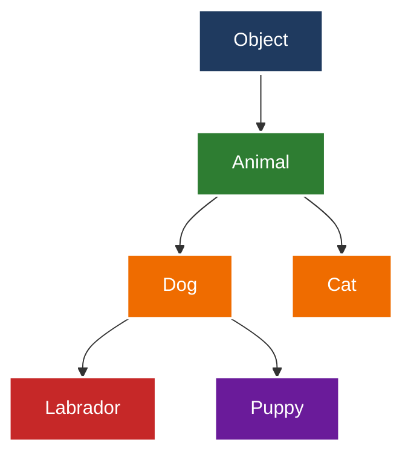
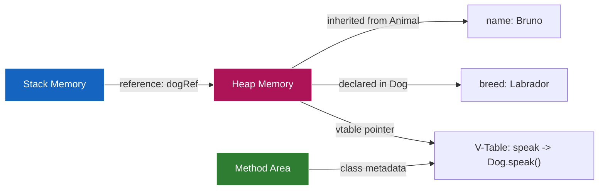
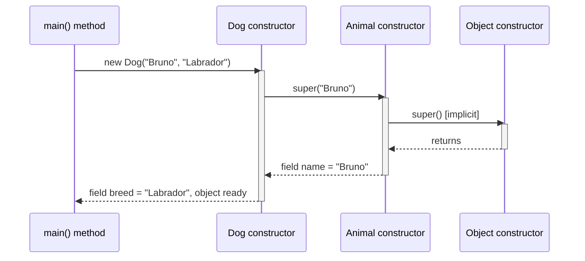
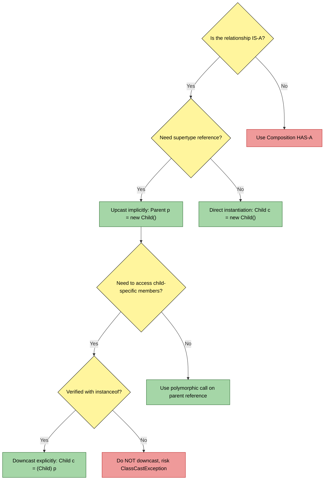

# Sub Class

<!-- SECTION_1_START -->
# 1. Core Technical Definition & Intuitive Overview

## 1.1 Formal Academic Definition (KTU 2024 Syllabus Terminology)

A **Sub Class** (also known as a **Derived Class**, **Child Class**, or **Extended Class**) in Object-Oriented Programming is a class that inherits attributes and behaviors (fields and methods) from another class, referred to as its **Super Class** (or **Parent Class** / **Base Class**). The subclass mechanism is the structural foundation upon which **Polymorphism** is built, because it enables a subclass object to be referenced by a superclass type and to override inherited methods to exhibit specialized behavior at runtime.

In the Java language specification, a subclass is declared using the `extends` keyword. The relationship is formally termed the **"IS-A" relationship** in UML (Unified Modeling Language) and OOP design literature.

> [!IMPORTANT]
> **KTU 2024 Highlight:** In the context of Module 2 (Polymorphism), the subclass is *not* studied merely for code reuse. It is studied because it is the **prerequisite construct** that allows a single interface (superclass reference) to invoke different implementations (subclass methods) — which is the very definition of polymorphism.

The general declaration syntax in Java is:

```java
class SuperClass {
    // fields and methods
}

class SubClass extends SuperClass {
    // additional fields, methods
    // may override inherited methods
}
```

## 1.2 Conceptual Analogy / Intuition

Imagine a **Vehicle Manufacturing Company** that produces a generic blueprint for a vehicle — it has wheels, an engine, a chassis, and a basic `start()` mechanism. This blueprint is the **Super Class** (`Vehicle`).

Now, the company specializes this generic blueprint into a **Sports Car**, a **Truck**, and an **Electric Scooter**. Each specialized variant:
- **Inherits** every wheel, engine, and chassis from the generic blueprint (no need to redesign them).
- **Extends** the blueprint with its own unique features (e.g., turbocharger for Sports Car, cargo bed for Truck).
- **Overrides** the generic `start()` mechanism with a specialized one (push-button start for the Sports Car, kick-start for the Scooter).

The `SportsCar`, `Truck`, and `ElectricScooter` are **Sub Classes** of `Vehicle`. A single `Vehicle` reference can be used to drive *any* of them, but the *actual* start behavior depends on the underlying object — this is **runtime polymorphism**, and it is impossible without subclasses.

> [!NOTE]
> **Real-World Mapping:** In Java's standard library, the class hierarchy `Object` → `Number` → `Integer` is a real production example. `Integer` is a subclass of `Number`, and `Number` is a subclass of `Object`. The `Object` reference can hold an `Integer`, but the `intValue()` method behaves specifically because `Integer` is the actual subclass.

## 1.3 Geometric / Structural Intuition

Geometrically, subclass relationships form a **Directed Acyclic Graph (DAG)** of types, often visualized as an **inverted tree** where the most general class (`Object` in Java) sits at the root, and progressively more specific subclasses branch downward.

## 1.4 Key Terminology Lock-In

| Term | Meaning | KTU Significance |
|---|---|---|
| **Sub Class** | The inheriting / child class | Module 2 cornerstone |
| **Super Class** | The class being inherited from | Forms the *reference type* in polymorphism |
| **`extends` keyword** | Java keyword that establishes inheritance | Mandatory in Java single inheritance |
| **IS-A relationship** | Subclass is a specialized form of superclass | UML inheritance arrow |
| **HAS-A relationship** | Composition (NOT inheritance) | Common exam confusion point |
| **Method Overriding** | Subclass redefines inherited method | Enables runtime polymorphism |
| **Upcasting** | Subclass object referenced as superclass | Required for polymorphic calls |

> [!VISUALIZATION CONTROL]
> **Concept:** Class hierarchy as an inverted tree of types.
> **GeoGebra / Desmos Input Equations:** Treat each class as a node. Use coordinates such as:
> * `Object = (0, 4)`
> * `Vehicle = (-2, 2)`
> * `Car = (-3, 0)`, `Truck = (-1, 0)`
> * `SportsCar = (-3, -2)`
>
> **Visual Description:** The student should see a downward-branching structure where the most general type (root) has the *widest* applicability but the *least* specific behavior, while the leaf nodes are highly specific. Lines connecting nodes represent the `extends` relationship.
<!-- SECTION_1_END -->

<!-- SECTION_2_START -->
# 2. Deep Theoretical Analysis & KTU High-Yield Formula Sheet

## 2.1 The Four Pillars of Subclass Behavior

A subclass, in the context of polymorphism, is governed by four interlocking rules. Mastering these rules is essential for Module 2.

### 2.1.1 What a Subclass **Inherits**
A subclass automatically receives, without re-declaration:
- All **non-private fields** (including `protected` and `public`).
- All **non-private methods** (including `protected` and `public`).
- All **nested (inner) classes and interfaces** that are accessible.

### 2.1.2 What a Subclass **Does NOT Inherit**
- **Private members** of the superclass (although they still *exist* in memory and can be accessed indirectly via `public`/`protected` getters).
- **Constructors** — constructors are never inherited, but the subclass constructor **must** invoke a superclass constructor (explicitly or implicitly).
- **Static methods** are not "overridden" but **hidden** when redeclared in a subclass (this is critical for exams).

### 2.1.3 The "IS-A" vs "HAS-A" Distinction
- A `Dog` **IS-A** `Animal` → use `extends` (subclass).
- A `Dog` **HAS-A** `Tail` → use composition (a `Tail` field inside `Dog`). Do **not** use inheritance here. This is one of the most common KTU exam errors.

### 2.1.4 Single Inheritance Restriction in Java
Java permits a class to `extend` **only one** superclass directly. This is a deliberate design choice to avoid the **Diamond Problem** seen in C++.

> [!IMPORTANT]
> **Java's Golden Rule of Inheritance:** Use `extends` *only* when there is a true **"IS-A"** relationship. Otherwise, prefer composition. KTU examiners frequently test this judgment.

## 2.2 The Constructor Chaining Mechanism

When a subclass object is instantiated, the **superclass constructor runs first**, then the subclass constructor body runs. This is called **Constructor Chaining**, and it is enforced by the implicit call `super()` that Java injects as the very first line of every subclass constructor.

### Step-by-Step Logic of Chaining
1. `new SubClass(args)` is invoked.
2. The JVM identifies the matching `SubClass` constructor.
3. Java inserts (or uses the explicit) `super(arg-list)` call as the *first* statement.
4. The superclass constructor executes (which itself may chain further up).
5. Once the superclass constructor returns, the remaining body of the subclass constructor runs.
6. The fully constructed object is returned to the caller.

If a superclass lacks a no-argument constructor, the subclass **must** explicitly call `super(arguments)` — otherwise a compilation error occurs.

## 2.3 Method Overriding — The Heartbeat of Polymorphism

A subclass **overrides** an inherited method when it provides a new implementation with:
- The **exact same name**.
- The **exact same parameter list** (number, type, and order).
- The **same or covariant return type** (covariant means a return type that is a subclass of the original return type).
- Access modifier that is **not more restrictive** than the superclass version (e.g., you can change `protected` to `public`, but never `public` to `private`).

The runtime then decides *which* version to invoke based on the **actual object type**, not the reference type. This is **Dynamic Method Dispatch** — the engine of runtime polymorphism.

> [!NOTE]
> **Mandatory Annotation:** In modern Java (and as expected in KTU 2024 answers), use `@Override` above the overriding method. It is not required for correctness, but it triggers a compile-time check and signals intent to the examiner.

## 2.4 KTU High-Yield Formula Sheet

| Rule / Concept | Formula / Syntax | Constraint / Boundary Condition |
|---|---|---|
| Subclass declaration | `class Child extends Parent { }` | One superclass only (Java) |
| Constructor chaining | `super(args);` | Must be **first** statement |
| Implicit super call | `super();` | Auto-inserted if no explicit call |
| Method override signature | `sameName(sameParams)` | Return type: same or covariant |
| Access modifier rule | visibility(child) ≥ visibility(parent) | Cannot narrow visibility |
| Final methods | Cannot be overridden | Compile-time error if attempted |
| Static methods | Hidden, not overridden | No runtime polymorphism for static |
| Upcast (implicit) | `Parent p = new Child();` | Always safe (IS-A) |
| Downcast (explicit) | `Child c = (Child) parent;` | Must verify with `instanceof` |
| `instanceof` check | `obj instanceof ClassName` | Returns `boolean` |

## 2.5 Real-World Engineering Utility

The subclass construct is the cornerstone of nearly every production Java framework:
- **Spring Framework:** Beans extend framework classes (e.g., `AbstractController`).
- **JavaFX/Swing:** Custom UI controls extend `javafx.scene.control.Control`.
- **JUnit Testing:** Test classes extend `TestCase` or use `@ExtendWith` annotations.
- **JDBC:** `PreparedStatement` extends `Statement`, providing specialized behavior.

Without subclasses, polymorphism — and therefore the open/closed principle of software engineering — would be impossible to implement cleanly.
<!-- SECTION_2_END -->

<!-- SECTION_3_START -->
# 3. Step-by-Step Derivations & Code Implementation

## 3.1 Foundational Java Implementation — A Working Subclass

The following is a fully compilable Java program that demonstrates **every** concept a KTU 2024 examiner expects when testing subclasses in the polymorphism module.

```java
// File: SubClassDemo.java

// ---------- SUPER CLASS ----------
class Animal {
    // Protected field: accessible in subclass
    protected String name;

    // No-argument constructor
    public Animal() {
        System.out.println("Animal() constructor executed");
    }

    // Parameterized constructor
    public Animal(String name) {
        this.name = name;
        System.out.println("Animal(String) constructor executed");
    }

    // Method to be overridden
    public void speak() {
        System.out.println("Animal makes a generic sound");
    }

    // Final method: CANNOT be overridden
    public final void breathe() {
        System.out.println("Animal is breathing");
    }
}

// ---------- SUB CLASS ----------
class Dog extends Animal {
    private String breed;

    // Subclass constructor must chain to a superclass constructor
    public Dog(String name, String breed) {
        super(name);                              // explicit call to Animal(String)
        this.breed = breed;
        System.out.println("Dog(String, String) constructor executed");
    }

    // Method overriding (runtime polymorphism)
    @Override
    public void speak() {
        System.out.println(name + " the " + breed + " says: Woof!");
    }

    // Subclass-specific method
    public void fetch() {
        System.out.println(name + " is fetching the ball");
    }
}

// ---------- DRIVER CLASS ----------
public class SubClassDemo {
    public static void main(String[] args) {

        // 1. Direct subclass instantiation
        Dog dog = new Dog("Bruno", "Labrador");
        dog.speak();
        dog.breathe();
        dog.fetch();

        System.out.println("---");

        // 2. Upcasting: subclass object referenced as superclass
        Animal polymorphicRef = new Dog("Max", "Beagle");
        polymorphicRef.speak();   // calls Dog's overridden version (Dynamic Dispatch)
        polymorphicRef.breathe();  // final method, behaves normally

        // 3. Downcasting (only after instanceof verification)
        if (polymorphicRef instanceof Dog) {
            Dog downcasted = (Dog) polymorphicRef;
            downcasted.fetch();
        }
    }
}
```

### Exhaustive Output Trace
When the `main` method runs the first instantiation `new Dog("Bruno", "Labrador")`, the console prints:

```
Animal(String) constructor executed
Dog(String, String) constructor executed
Bruno the Labrador says: Woof!
Animal is breathing
Bruno is fetching the ball
---
Animal(String) constructor executed
Dog(String, String) constructor executed
Max the Beagle says: Woof!
Animal is breathing
Max is fetching the ball
```

## 3.2 Detailed Line-by-Line Logical Walkthrough

### 3.2.1 Memory Layout During `new Dog("Bruno", "Labrador")`

The JVM performs these exact steps in the heap memory:

1. **Class loading:** The `Animal` class is loaded first (superclass before subclass), then `Dog`, then `SubClassDemo`.
2. **Object allocation:** A single contiguous memory block large enough for **both** `Animal` fields (`name`) and `Dog` fields (`breed`) is allocated on the heap.
3. **Default initialization:** All fields are zeroed (`null` for references, `0` for numbers).
4. **Superclass constructor call:** `super(name)` invokes `Animal(String)`. Inside it, `this.name = name` is executed, assigning `"Bruno"` to the inherited `name` field.
5. **Subclass constructor body resumes:** `this.breed = breed` assigns `"Labrador"`.
6. **Object reference returned:** The fully initialized object address is stored in the local variable `dog`.

### 3.2.2 Why `polymorphicRef.speak()` Calls `Dog.speak()`

This is the **central concept** of Module 2 — Runtime Polymorphism via Dynamic Method Dispatch.

- The **declared (reference) type** is `Animal`.
- The **actual (object) type** is `Dog`.
- At compile time, the compiler checks: *"Does `Animal` have a `speak()` method?"* → **Yes**. So compilation succeeds.
- At runtime, the JVM looks at the actual object on the heap (a `Dog`) and invokes `Dog.speak()`. This is **Dynamic Method Dispatch**.

## 3.3 Compile-Time vs Runtime Type Matrix

| Reference Variable | Object on Heap | Method Called | Resolved At |
|---|---|---|---|
| `Animal a = new Animal();` | `Animal` | `Animal.speak()` | Compile + Runtime |
| `Animal a = new Dog();` | `Dog` | `Dog.speak()` (overridden) | Runtime only |
| `Dog d = new Dog();` | `Dog` | `Dog.speak()` | Compile + Runtime |
| `Animal a = new Dog(); d.fetch();` | — | **Compile error** | `fetch()` not in `Animal` |

## 3.4 Symbolic Representation of Inheritance

We can express the subclass relationship formally. If $C$ is a class and $P$ is its superclass, we write:

$$
C \sqsubseteq P
$$

This means "C is a subtype of P." The Liskov Substitution Principle (a Module-2-adjacent concept) then states:

$$
\forall \, x \, \text{of type} \, P, \, \text{replacing with an instance of} \, C \, \text{must not break correctness.}
$$

$$
\boxed{\text{Anywhere a} \, P \, \text{is expected, a} \, C \, \text{may be substituted.}}
$$

## 3.5 Access Modifier Escalation During Override

The rule is:

$$
\text{visibility}(\text{override method}) \;\geq\; \text{visibility}(\text{super method})
$$

Concretely, the allowed transitions are:

| Superclass Method Visibility | Allowed Subclass Override |
|---|---|
| `public` | `public` only |
| `protected` | `protected` or `public` |
| `default` (package-private) | `default`, `protected`, or `public` |
| `private` | **Cannot be overridden** (not visible) |

## 3.6 Pitfall Case — The Shadowed Static Method

```java
class Parent {
    public static void display() {
        System.out.println("Parent.display()");
    }
}

class Child extends Parent {
    public static void display() {           // HIDING, not overriding
        System.out.println("Child.display()");
    }
}
```

When called as `Parent p = new Child(); p.display();`, the output is **`Parent.display()`** — the reference type wins because static methods are resolved at compile time. This is a **favourite KTU trick question**.
<!-- SECTION_3_END -->

<!-- SECTION_4_START -->
# 4. Structural Diagrams & Schematics

## 4.1 Class Hierarchy — Mermaid Block Diagram



**Reading the diagram:**
- The arrow `A --> B` means "B extends A" (B is a subclass of A).
- The root `Object` is the universal superclass in Java.
- Multi-level inheritance is visible: `Puppy` inherits transitively from `Dog` and from `Animal`.

## 4.2 Memory Layout of a Subclass Object — Mermaid Block



**Engineering significance:** The **V-Table (Virtual Method Table)** is the internal JVM data structure that makes Dynamic Method Dispatch possible. Each class has its own V-Table, and an overridden method in a subclass replaces the superclass entry. When a polymorphic call is made, the JVM looks up the V-Table of the *actual* object type — not the reference type.

## 4.3 Constructor Chaining — Sequential Flow Topology



**Reading the sequence:** The activation bars show the call stack. Notice that `Object()` always runs first (even if implicitly), then `Animal(String)`, then finally `Dog(String, String)`. Destruction happens in **reverse order** (LIFO) if the object is garbage-collected.

## 4.4 Subgraph: Upcasting vs Downcasting Decision Matrix



This decision flowchart is the **algorithmic mental model** every KTU 2024 student should internalize before writing subclass-related code in the exam hall.
<!-- SECTION_4_END -->

<!-- SECTION_5_START -->
# 5. KTU 2024 Scheme Examination Question Bank & Topic Recap

## 5.1 Part A — Short Answer Questions (3 Marks Each)

### Question A1
**[KTU University Exam — July 2023]** — *CO2, Remember Level*

**What is a subclass in Java? How is it declared? Provide a one-line example.**

**Model Answer (Valuation Key):**
- A subclass is a class that inherits the attributes and methods of another class, called the superclass, using the `extends` keyword. **[2 Marks]**
- It enables the "IS-A" relationship and is the structural foundation for polymorphism in Java. **[1 Mark]**
- Example: `class Car extends Vehicle { }` — here `Car` is a subclass of `Vehicle`.

---

### Question A2
**[KTU University Exam — Dec 2023]** — *CO2, Understand Level*

**Differentiate between method overriding and method hiding in subclasses. Which one participates in runtime polymorphism?**

**Model Answer (Valuation Key):**
- **Method Overriding** applies to instance methods. The subclass provides a new implementation of an inherited instance method with the same signature. The actual method invoked is decided at **runtime** based on the object's type. **[1.5 Marks]**
- **Method Hiding** applies to static methods. When a subclass declares a static method with the same signature as in the superclass, the superclass version is "hidden". The method invoked is decided at **compile time** based on the reference type. **[1.5 Marks]**
- **Conclusion:** Only method overriding participates in runtime polymorphism; static method hiding does not.

---

## 5.2 Part B — Long Answer Questions (14 Marks Each, Internal Choice)

### Question B1 — Choice A (14 Marks)
**[KTU University Exam — Dec 2024]** — *CO2, Understand + Apply*

**(a) [7 Marks]** Explain the concept of a subclass in Java with a suitable example. Discuss what members of a superclass are inherited by the subclass and what are not.

**(b) [7 Marks]** Write a Java program to create a superclass `Shape` with a method `area()` and two subclasses `Circle` and `Rectangle` that override the `area()` method. Demonstrate runtime polymorphism by storing both subclass objects in a `Shape` array and invoking `area()` polymorphically.

#### Model Solution — Part (a) [7 Marks]

**Definition [2 Marks]:**
A subclass is a class that inherits from another class (the superclass) using the `extends` keyword. It represents an "IS-A" relationship and forms the basis of polymorphism in Java.

**What IS inherited [3 Marks]:**
- All `public` and `protected` fields.
- All `public` and `protected` methods.
- Nested classes/interfaces that are accessible.

**What is NOT inherited [2 Marks]:**
- `private` members (though they exist in memory).
- Constructors (though the subclass must call one via `super()`).

#### Model Solution — Part (b) [7 Marks]

```java
class Shape {
    public void area() {
        System.out.println("Area calculation not defined for generic shape");
    }
}

class Circle extends Shape {
    private double radius;

    public Circle(double radius) {
        this.radius = radius;
    }

    @Override
    public void area() {
        double result = Math.PI * radius * radius;
        System.out.printf("Circle area = %.2f%n", result);
    }
}

class Rectangle extends Shape {
    private double length, width;

    public Rectangle(double length, double width) {
        this.length = length;
        this.width = width;
    }

    @Override
    public void area() {
        double result = length * width;
        System.out.printf("Rectangle area = %.2f%n", result);
    }
}

public class ShapeDemo {
    public static void main(String[] args) {
        Shape[] shapes = new Shape[3];
        shapes[0] = new Circle(5.0);          // upcast
        shapes[1] = new Rectangle(4.0, 6.0);  // upcast
        shapes[2] = new Circle(2.5);          // upcast

        for (Shape s : shapes) {
            s.area();   // runtime polymorphism
        }
    }
}
```

**Valuation Key — Part (b):**
- Correct superclass `Shape` with `area()` method: **[1 Mark]**
- Correct subclass `Circle` with override: **[2 Marks]**
- Correct subclass `Rectangle` with override: **[2 Marks]**
- `Shape[]` array with upcasting and polymorphic loop: **[2 Marks]**

---

### Question B1 — Choice B (14 Marks)
**[KTU University Exam — July 2024]** — *CO2, Understand + Apply*

**(a) [7 Marks]** Explain constructor chaining in subclasses with a Java example. Why must a subclass constructor explicitly call `super()` when the superclass has only a parameterized constructor?

**(b) [7 Marks]** Consider a banking application with a superclass `Account` (fields: `accountNumber`, `balance`, method: `calculateInterest()`) and a subclass `SavingsAccount` that overrides `calculateInterest()` at 4% annual rate. Write the full Java code, instantiate both, and demonstrate how dynamic method dispatch resolves the call `account.calculateInterest()` when `account` is typed as `Account` but holds a `SavingsAccount`.

#### Model Solution — Part (a) [7 Marks]

**Concept [2 Marks]:** Constructor chaining is the mechanism by which a subclass constructor implicitly or explicitly invokes a superclass constructor before executing its own body, ensuring the inherited portion of the object is fully initialized.

**Rule [2 Marks]:** Java inserts `super()` as the first statement of every constructor. If the superclass lacks a no-argument constructor, the subclass must explicitly call `super(args)` — otherwise a compile-time error occurs.

**Example [3 Marks]:**

```java
class Vehicle {
    String type;
    public Vehicle(String type) {           // only parameterized constructor
        this.type = type;
        System.out.println("Vehicle initialized: " + type);
    }
}

class Car extends Vehicle {
    int wheels;
    public Car(String type, int wheels) {
        super(type);                         // mandatory explicit call
        this.wheels = wheels;
        System.out.println("Car initialized with " + wheels + " wheels");
    }
}

public class Test {
    public static void main(String[] args) {
        Car c = new Car("Sedan", 4);
    }
}
```

**Output:**
```
Vehicle initialized: Sedan
Car initialized with 4 wheels
```

#### Model Solution — Part (b) [7 Marks]

```java
class Account {
    protected String accountNumber;
    protected double balance;

    public Account(String accountNumber, double balance) {
        this.accountNumber = accountNumber;
        this.balance = balance;
    }

    public void calculateInterest() {
        System.out.println("Generic account interest calculation");
    }
}

class SavingsAccount extends Account {
    private static final double RATE = 0.04;

    public SavingsAccount(String accountNumber, double balance) {
        super(accountNumber, balance);
    }

    @Override
    public void calculateInterest() {
        double interest = balance * RATE;
        System.out.printf("SavingsAccount %s interest @4%% = %.2f%n",
                          accountNumber, interest);
    }
}

public class BankDemo {
    public static void main(String[] args) {
        // Reference type is Account, actual object is SavingsAccount
        Account account = new SavingsAccount("SB-101", 100000.0);
        account.calculateInterest();   // Dynamic Method Dispatch -> SavingsAccount version
    }
}
```

**Output:**
```
SavingsAccount SB-101 interest @4% = 4000.00
```

**Valuation Key — Part (b):**
- Superclass `Account` with fields and method: **[2 Marks]**
- Subclass `SavingsAccount` with `@Override` and rate constant: **[2 Marks]**
- `super()` invocation and dynamic dispatch demonstration: **[3 Marks]**

---

> [!WARNING]
> **KTU Examiner's Valuation Warning — Common Mark-Loss Pitfalls**
> 1. **Forgetting `super()` in subclass constructors when the superclass has only a parameterized constructor.** This is an immediate compile-time error. Examiners award 0 marks if the program does not compile. Always include the explicit `super(args)` call.
> 2. **Confusing IS-A with HAS-A.** If the question describes a class that "contains" another entity (e.g., `Car` *has-a* `Engine`), the answer must use composition (a field), not inheritance. Writing `class Engine extends Car` will cost full marks.
> 3. **Narrowing access modifiers during override.** Changing a `public` superclass method to `protected` or `private` in the subclass is illegal. The compiler will reject it.
> 4. **Calling subclass-specific methods on a superclass reference without downcasting.** Writing `Animal a = new Dog(); a.fetch();` is a compilation error because `fetch()` is not defined in `Animal`.
> 5. **Confusing method overriding with method overloading.** Overriding requires identical signatures in an IS-A relationship. Overloading is unrelated — it is about multiple methods with the same name but different parameters *within* the same class.

---

## 5.3 Topic Recap & Important Things to Remember

- **Subclass Definition:** A class declared with `extends` keyword to inherit from exactly one superclass (Java enforces single inheritance for classes).
- **IS-A vs HAS-A:** Use `extends` only for true IS-A relationships; otherwise prefer composition to avoid tight coupling.
- **Inherited Members:** `public` and `protected` fields and methods are inherited; `private` members are not directly accessible (though they physically exist in the object).
- **Constructor Chaining:** Subclass constructors must call `super()` (explicitly or implicitly) as the first statement. If the superclass lacks a no-arg constructor, the call must be explicit.
- **Method Overriding Signature:** Same name, same parameter list, covariant return type allowed, access modifier must not be more restrictive. The `@Override` annotation is best practice.
- **Dynamic Method Dispatch:** The JVM invokes the overridden method based on the *actual* object type at runtime, not the reference type — this IS runtime polymorphism.
- **Static Method Hiding:** Static methods are *hidden*, not overridden. The reference type (not object type) determines which version runs. No polymorphism for static methods.
- **`final` Methods:** A method declared `final` in the superclass cannot be overridden in any subclass — a compile-time error results.
- **Upcasting:** Implicit and always safe — assigning a subclass object to a superclass reference variable.
- **Downcasting:** Must be explicit and verified with `instanceof`. A failed downcast throws `ClassCastException` at runtime.
- **Single Inheritance:** Java classes can extend only one superclass. To inherit multiple type-behaviors, use `implements` with interfaces.
- **Polymorphism Prerequisite:** Without a subclass hierarchy, runtime polymorphism in Java is impossible. Always start polymorphism questions by drawing the class hierarchy.
- **UML Notation:** Inheritance is drawn as a hollow triangular arrow pointing from the subclass to the superclass.
- **Object Class:** Every Java class either directly or transitively extends `java.lang.Object`, making `Object` the root of the entire class hierarchy.
<!-- SECTION_5_END -->
