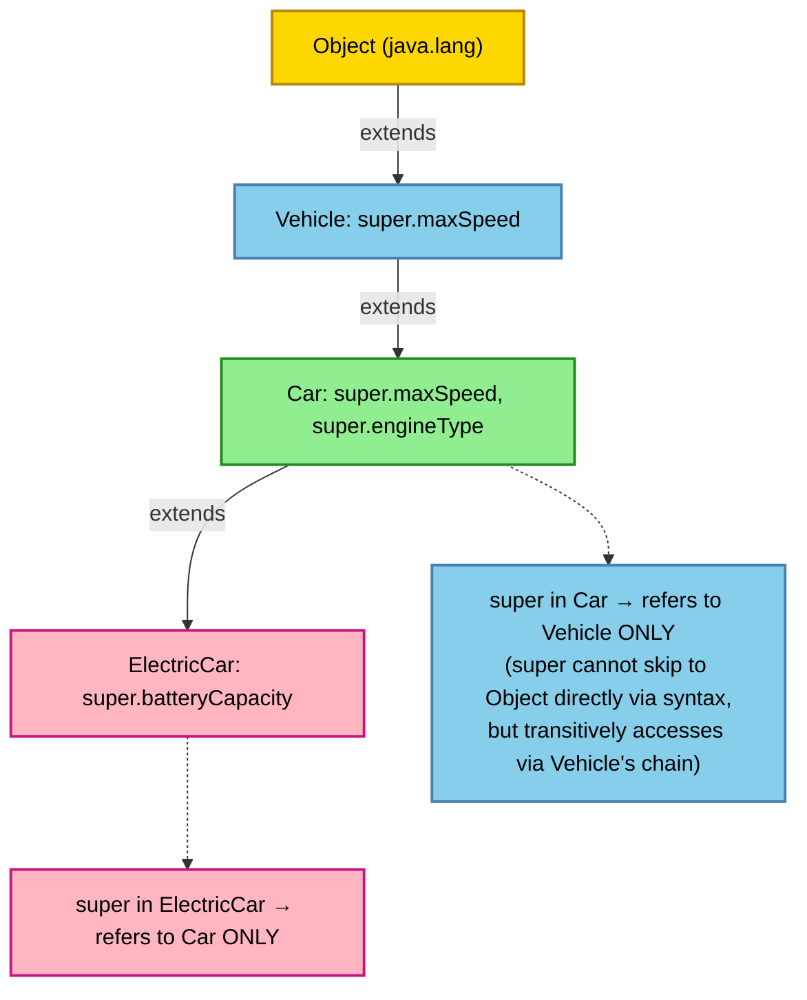
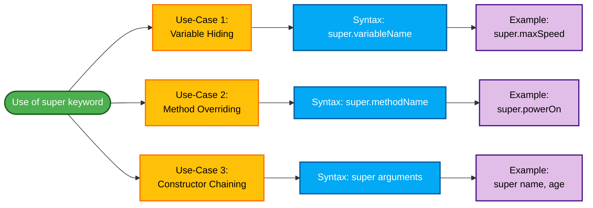
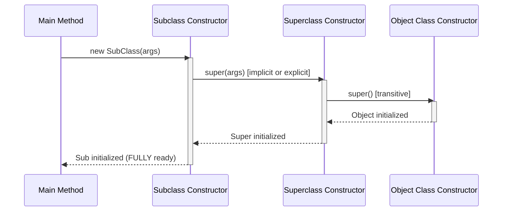
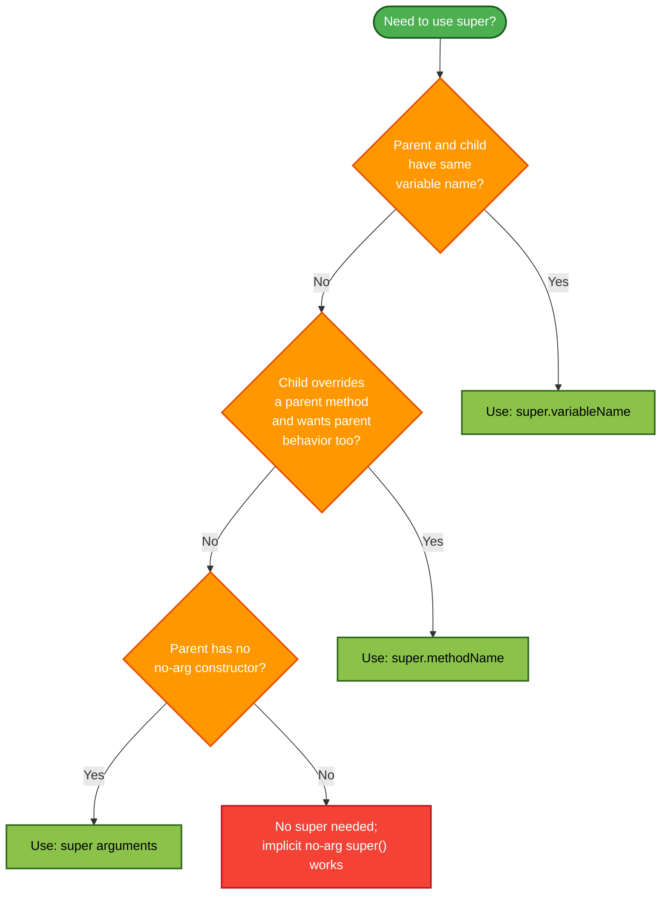

# The super keyword

<!-- SECTION_1_START -->
# The `super` Keyword in Java — Core Definition & Intuition

## 1.1 Formal Academic Definition (KTU 2024 Syllabus Terminology)

In **Object-Oriented Programming** with Java, the **`super` keyword** is a built-in reference variable that refers to the **immediate parent class object**. It is a fundamental pillar of **Polymorphism** (specifically *run-time polymorphism* and *inheritance-based method overriding*) and is used to access members of the superclass that have been hidden or overridden by the subclass.

The `super` keyword serves **three primary syntactic functions** in Java:

| Sl. No | Function | Syntax Form |
|:---:|:---|:---|
| 1 | Reference to parent class **instance variable** | `super.variableName` |
| 2 | Invocation of parent class **method** | `super.methodName(args)` |
| 3 | Invocation of parent class **constructor** | `super(args)` |

> [!IMPORTANT]
> **KTU Board Definition:** *"The `super` keyword in Java is a reference variable which is used to refer to the immediate parent class object. It is used to differentiate between members of the subclass and the superclass when both have the same name."* — This is the exact phrasing expected in the 2-mark and 3-mark board questions.

## 1.2 Real-World Analogy — The Family Tree

Think of a **family hierarchy** where a son (subclass) inherits property and surname from his father (parent class):

- **Surname (Variable):** The son shares the same surname as his father. If the son wishes to specifically point to his *father's* surname rather than his own, he uses the reference: *"My father's surname is..."* → This is analogous to **`super.variableName`**.
- **Family Business (Method):** The son runs the same family business but with modern techniques. If he wants to invoke the *original* business method as it was in the father's era, he calls: *"Run father's original business method"* → This is analogous to **`super.methodName()`**.
- **Estate Setup (Constructor):** When the son starts his own business, the father's assets must first be transferred to him before he can add his own. This transfer is the *constructor call* that must happen **first** → This is analogous to **`super(args)`**.

> [!NOTE]
> **Memory Anchor:** If `this` refers to the **current object**, then `super` refers to the **parent object**. Always remember this duality.

## 1.3 When is `super` Used? — The Three Use-Cases

1. **Data Hiding Resolution** — When the parent and child class have the same instance variable name, `super.variableName` is used to access the parent's variable explicitly.
2. **Method Overriding Resolution** — When a subclass overrides a parent method, `super.methodName()` is used to call the overridden (parent's) version.
3. **Constructor Chaining** — `super(args)` is used to explicitly invoke a parameterized constructor of the parent class from the subclass constructor.

> [!TIP]
> **Geometric Visualization:** Imagine two concentric circles. The **inner circle** is the `subclass` (child), the **outer circle** is the `superclass` (parent). The keyword `super` is the *radial vector* that always points **outward** from the child toward the parent's boundary, accessing only what the parent exposes.

## 1.4 Critical Rules (Must Remember for KTU Board Exams)

> [!WARNING]
> **KTU Board Examiner Note:** The following rules are tested almost every year. Memorize them with the exact phrasing.

1. `super` refers to the **immediate parent class only**, not any further ancestor in the hierarchy.
2. If the subclass constructor does **not** explicitly call `super()`, the compiler **automatically inserts** a no-argument `super()` call as the **first statement** of every constructor.
3. The call to `super()` (or any constructor using `super`) **must be the first statement** inside a subclass constructor.
4. `super` **cannot be used in a `static` context** (static methods, static blocks, or static variables), because `super` is an instance reference.
5. Only **one** of `this()` or `super()` can be used as the first statement — they are mutually exclusive.

---

<!-- SECTION_1_END -->

<!-- SECTION_2_START -->
# Deep Theoretical Analysis & KTU High-Yield Formula Sheet

## 2.1 Use-Case 1 — Accessing Hidden Instance Variables (`super.variableName`)

When both the parent class and the child class declare an instance variable with the **identical name**, the variable in the child class **hides** the one from the parent. This phenomenon is called **Variable Hiding** (a form of *data shadowing*, distinct from method overriding).

### Mechanism — Step-by-Step Logic

1. The Java compiler resolves a variable reference by searching **upward** through the class hierarchy.
2. The search starts at the **current class scope** (innermost).
3. If the variable is not found locally, it proceeds to the **parent class scope**.
4. If ambiguity arises (same name in both), the compiler prefers the **closest scope** — that is, the child class.
5. To **break** this default search and force the compiler to look in the parent class, we use the **`super`** qualifier.

### Why It Matters in Engineering

- **Production systems** use this to preserve the parent's configuration data while extending the child with additional attributes.
- Example: A `LogMessage` class has a `level` field; its child `DebugLogMessage` adds its own `level` for severity. The child uses `super.level` to log the inherited category while using `this.level` for the new one.

> [!NOTE]
> **Conceptual Distinction (Frequently Asked):** Variable Hiding is **not** polymorphic. Method overriding is polymorphism (dynamic dispatch), but variable hiding is resolved at **compile time** based on the reference type.

## 2.2 Use-Case 2 — Invoking Overridden Methods (`super.methodName()`)

When a subclass provides a **specific implementation** for a method already defined in the parent class (method overriding), the parent's version is hidden for the child object. To **explicitly call the parent's overridden method** from inside the child's overriding method, we use `super.methodName()`.

### Mechanism — Step-by-Step Logic

1. During **dynamic method dispatch** (run-time polymorphism), the JVM determines the actual object type and binds the call to the overridden method in the subclass.
2. Inside the overriding method, the keyword `this` refers to the current (child) object.
3. The keyword `super` forces a **static binding** to the parent's version, bypassing the polymorphic dispatch.
4. This is useful when the child wants to **extend** the parent's behavior rather than completely replace it.

### Why It Matters in Engineering

- **Frameworks like Java Swing and AWT** use this pattern: a subclass's `paint()` method calls `super.paint()` to clear the canvas before drawing custom graphics.
- **Template Method Design Pattern** is built entirely on this principle — the superclass defines the algorithm skeleton, and subclasses call `super.templateMethod()` to invoke the steps they have not overridden.

## 2.3 Use-Case 3 — Constructor Chaining (`super(args)`)

Constructors in Java follow a **mandatory invocation chain** called **Constructor Chaining**. Every constructor implicitly calls its parent's constructor before executing its own body. This guarantees that **all inherited fields are properly initialized** before the subclass constructor body runs.

### Mechanism — Step-by-Step Logic

1. When a subclass object is instantiated, the JVM first allocates memory for **all inherited members**.
2. The **parent's constructor is invoked first** to initialize those inherited members.
3. **Then** the subclass's constructor body executes to initialize the child's specific fields.
4. If the subclass constructor does **not** explicitly write `super(...)`, the compiler injects a call to the parent's **no-argument constructor** as the first statement.
5. If the parent class **does not have a no-argument constructor** (because it only defines a parameterized one), the compiler will raise an **error** unless the subclass explicitly writes `super(args)`.

### Why It Matters in Engineering

- **Encapsulation of initialization logic:** The parent is solely responsible for initializing its own fields. The child never duplicates that logic.
- **Prevents partial object states** — a critical requirement in distributed systems and database transactions.

## 2.4 KTU Formula Sheet / Cheat Sheet

| Concept | Syntax | When Used | Return / Result |
|:---|:---|:---|:---|
| Parent instance variable | `super.varName` | Variable hiding | Parent's value |
| Parent method | `super.methodName(args)` | Method overriding | Parent's behavior |
| Parent constructor | `super(args)` | Constructor chaining | Parent initialized first |
| Implicit call | *Compiler inserts* | No explicit `super(...)` | Calls parent's no-arg constructor |
| Position rule | `super()` must be **1st** statement | Every constructor | Compile-time error otherwise |
| Static context | `super` in `static` method | — | **Compile-time error** |

---

<!-- SECTION_2_END -->

<!-- SECTION_3_START -->
# Step-by-Step Derivations & Java Implementations

## 3.1 Example 1 — Variable Hiding with `super.variableName` (Full Java Code)

```java
// File: Vehicle.java
// Parent class
class Vehicle {
    // Instance variable in parent
    protected int maxSpeed = 120;   // in km/h
}

// File: Car.java
// Child class extending Vehicle
class Car extends Vehicle {
    // Same variable name as parent — this HIDES the parent's variable
    int maxSpeed = 180;             // in km/h

    public void displaySpeeds() {
        // 'maxSpeed' alone resolves to the child's variable (compile-time binding)
        System.out.println("Child class maxSpeed    : " + maxSpeed);

        // 'super.maxSpeed' explicitly accesses the parent's hidden variable
        System.out.println("Parent class maxSpeed   : " + super.maxSpeed);
    }
}

// File: MainApp.java
public class MainApp {
    public static void main(String[] args) {
        Car myCar = new Car();
        myCar.displaySpeeds();
    }
}
```

### Output Trace

```
Child class maxSpeed    : 180
Parent class maxSpeed   : 120
```

### Step-by-Step Explanation

- Line `int maxSpeed = 180;` in `Car` **shadows** the inherited `maxSpeed` of `Vehicle`.
- Inside `displaySpeeds()`, the bare identifier `maxSpeed` is resolved by the compiler to the **nearest declaration** — the child's field. This is why it prints `180`.
- The qualified reference `super.maxSpeed` instructs the compiler: *"Look one level up in the inheritance chain."* Hence it prints `120`.

## 3.2 Example 2 — Method Overriding with `super.methodName()` (Full Java Code)

```java
// File: Animal.java
class Animal {
    // General behavior
    public void speak() {
        System.out.println("Animal speaks in a generic way.");
    }

    public void introduce() {
        System.out.println("I am a generic Animal.");
    }
}

// File: Dog.java
class Dog extends Animal {

    // OVERRIDING the parent's speak() method
    @Override
    public void speak() {
        // First, invoke the parent's version using super
        super.speak();
        System.out.println("Dog says: Woof! Woof!");
    }

    // OVERRIDING the parent's introduce() method WITHOUT calling super
    @Override
    public void introduce() {
        System.out.println("I am a Dog (a specific Animal).");
    }
}

// File: MainApp2.java
public class MainApp2 {
    public static void main(String[] args) {
        Dog buddy = new Dog();
        buddy.speak();        // Calls Dog.speak(), which internally calls super.speak()
        buddy.introduce();    // Calls Dog.introduce() only — no super call
    }
}
```

### Output Trace

```
Animal speaks in a generic way.
Dog says: Woof! Woof!
I am a Dog (a specific Animal).
```

### Step-by-Step Explanation

- When `buddy.speak()` is invoked, the JVM uses **dynamic dispatch** to bind the call to `Dog.speak()`.
- The **first statement** inside `Dog.speak()` is `super.speak();` — this explicitly invokes `Animal.speak()`, printing the first line.
- After `super.speak()` returns, the second `println` executes, printing the second line.
- For `introduce()`, the subclass **does not** call `super.introduce()`, so only the child's version executes.

## 3.3 Example 3 — Constructor Chaining with `super(args)` (Full Java Code)

```java
// File: Person.java
class Person {
    private String name;
    private int age;

    // Parameterized constructor of parent
    public Person(String name, int age) {
        this.name = name;
        this.age = age;
        System.out.println("Person constructor called. Name: " + name + ", Age: " + age);
    }
}

// File: Employee.java
class Employee extends Person {
    private int employeeId;
    private double salary;

    // Parameterized constructor of child
    public Employee(String name, int age, int employeeId, double salary) {
        // 'super(args)' MUST be the first statement in the constructor
        super(name, age);
        this.employeeId = employeeId;
        this.salary = salary;
        System.out.println("Employee constructor called. ID: " + employeeId + ", Salary: " + salary);
    }
}

// File: MainApp3.java
public class MainApp3 {
    public static void main(String[] args) {
        Employee emp = new Employee("Alice", 30, 101, 75000.50);
    }
}
```

### Output Trace

```
Person constructor called. Name: Alice, Age: 30
Employee constructor called. ID: 101, Salary: 75000.5
```

### Step-by-Step Explanation

1. The call `new Employee("Alice", 30, 101, 75000.50)` invokes the `Employee` constructor.
2. The **first statement** in the `Employee` constructor is `super(name, age)`, which delegates to `Person(String, int)`.
3. The `Person` constructor initializes `name` and `age`, then prints the first line.
4. Control returns to the `Employee` constructor, which then initializes `employeeId` and `salary`, printing the second line.

> [!WARNING]
> **Common Mistake:** If the parent class `Person` has **only** a parameterized constructor (no default no-arg constructor), and the child `Employee` does **not** explicitly write `super(name, age)`, the compiler will throw:
> *`error: constructor Person in class Person cannot be applied to given types; required: String, int; found: no arguments`*
> This is because the compiler cannot find a no-arg constructor to call automatically.

## 3.4 Example 4 — Combined Comprehensive Demonstration (All Three Uses Together)

```java
// File: ElectronicDevice.java
class ElectronicDevice {
    protected String brand = "GenericBrand";

    public void powerOn() {
        System.out.println(brand + " device is powering on (generic startup).");
    }

    public ElectronicDevice() {
        System.out.println("ElectronicDevice default constructor executed.");
    }

    public ElectronicDevice(String brand) {
        this.brand = brand;
        System.out.println("ElectronicDevice parameterized constructor executed. Brand: " + brand);
    }
}

// File: Smartphone.java
class Smartphone extends ElectronicDevice {
    protected String brand = "SmartMobile";

    public Smartphone() {
        // Explicit call to parent's no-arg constructor
        super();
        System.out.println("Smartphone default constructor executed.");
    }

    public Smartphone(String brand) {
        // Explicit call to parent's parameterized constructor
        super(brand);
        System.out.println("Smartphone parameterized constructor executed.");
    }

    @Override
    public void powerOn() {
        // First call the parent's powerOn
        super.powerOn();
        // Then add the child's specific behavior
        System.out.println(brand + " smartphone booting Android OS (specific behavior).");
    }

    public void showBrands() {
        System.out.println("Child  brand (this.brand)   : " + this.brand);
        System.out.println("Parent brand (super.brand)  : " + super.brand);
    }
}

// File: MainApp4.java
public class MainApp4 {
    public static void main(String[] args) {
        System.out.println("--- Test 1: Default constructor ---");
        Smartphone phone1 = new Smartphone();
        phone1.showBrands();
        phone1.powerOn();

        System.out.println("\n--- Test 2: Parameterized constructor ---");
        Smartphone phone2 = new Smartphone("PixelX");
        phone2.showBrands();
        phone2.powerOn();
    }
}
```

### Output Trace

```
--- Test 1: Default constructor ---
ElectronicDevice default constructor executed.
Smartphone default constructor executed.
Child  brand (this.brand)   : SmartMobile
Parent brand (super.brand)  : GenericBrand
GenericBrand device is powering on (generic startup).
SmartMobile smartphone booting Android OS (specific behavior).

--- Test 2: Parameterized constructor ---
ElectronicDevice parameterized constructor executed. Brand: PixelX
Smartphone parameterized constructor executed.
Child  brand (this.brand)   : SmartMobile
Parent brand (super.brand)  : PixelX
PixelX device is powering on (generic startup).
SmartMobile smartphone booting Android OS (specific behavior).
```

### Detailed Walkthrough

- **Test 1 (default constructor):** `super()` is called explicitly (matches the default no-arg `ElectronicDevice()`), so the parent's `brand` remains `"GenericBrand"`. The child's `this.brand` is `"SmartMobile"`. The `super.powerOn()` prints the parent's message, and the rest of the method adds the child's Android-specific line.
- **Test 2 (parameterized constructor):** `super("PixelX")` calls the parent's parameterized constructor, **changing** the parent's `brand` to `"PixelX"`. The child's `this.brand` remains `"SmartMobile"` (assigned at declaration). The output confirms the asymmetry.

---

<!-- SECTION_3_END -->

<!-- SECTION_4_START -->
# Structural Diagrams & Schematics

## 4.1 Class Hierarchy with `super` Reference Flow

The following Mermaid diagram illustrates a multi-level inheritance hierarchy (`Object` → `Vehicle` → `Car` → `ElectricCar`) and shows how the `super` keyword always points to the **immediate parent only**.



## 4.2 The Three Use-Cases of `super` — Functional Architecture Flow



## 4.3 Constructor Chaining Sequence (Time-Line Diagram)



## 4.4 Decision Matrix — When to Use `super`



---

<!-- SECTION_4_END -->

<!-- SECTION_5_START -->
# KTU 2024 Scheme Examination Question Bank & Topic Recap

## 5.1 Part A Questions (3 Marks Each)

### Question A1 — `[KTU University Exam - July 2024]`
**Q: Explain the `super` keyword in Java. List any two of its uses.**
**CO Mapping:** CO2 — *Apply* | **RBT Level:** Understand

**Model Answer:**

The `super` keyword in Java is a reference variable that refers to the **immediate parent class object**. It is used to differentiate the members of the subclass from the members of the superclass when they have the same name.

The two main uses are:

1. **`super.variableName`** — Used to access the **instance variable** of the parent class when it is hidden by a variable of the same name in the child class. *Example:*
   ```java
   super.maxSpeed;
   ```

2. **`super.methodName()`** — Used to invoke the **overridden method** of the parent class from within the overriding method of the child class. *Example:*
   ```java
   super.display();
   ```

> **Valuation Key:** [Definition: 1 Mark] [Any two uses with syntax: 2 Marks]

---

### Question A2 — `[KTU University Exam - Dec 2023]`
**Q: What is constructor chaining? How is `super()` related to it?**
**CO Mapping:** CO2 — *Apply* | **RBT Level:** Remember

**Model Answer:**

**Constructor chaining** is the process of invoking a sequence of constructors when an object of a class is instantiated. In inheritance, when a subclass object is created, the constructor of the parent class is invoked first, followed by the constructor of the subclass.

The **`super()`** call is the mechanism that achieves constructor chaining. When a subclass constructor is executed, it must call a constructor of its parent class using `super()` (with or without arguments). This call is automatically inserted by the compiler as the **first statement** of the subclass constructor if not written explicitly. The chaining continues transitively up to the `Object` class.

*Example:*
```java
class A { A() { System.out.println("A"); } }
class B extends A { B() { super(); System.out.println("B"); } }
```

> **Valuation Key:** [Constructor chaining definition: 1 Mark] [Relation to super() with example: 2 Marks]

---

## 5.2 Part B Questions (14 Marks Each — Internal Choice)

### Question B1 — `Question A (14 Marks)` — `[KTU University Exam - July 2024]`

**Q: (a)** Explain the three different uses of the `super` keyword in Java with suitable code examples. **(7 Marks)**
**(b)** Write a Java program to demonstrate constructor chaining using `super()` in a multi-level inheritance hierarchy with three classes. **(7 Marks)**

**CO Mapping:** CO2 — *Apply* | **RBT Levels:** (a) Understand, (b) Apply

---

#### Solution B1(a) — The Three Uses of `super`

The Java `super` keyword has three principal uses:

**Use 1: Accessing Parent's Instance Variable (`super.variableName`)**
When a subclass declares an instance variable with the same name as the parent class, the parent's variable is hidden. The keyword `super` provides explicit access to it.

```java
class Parent {
    int value = 100;
}
class Child extends Parent {
    int value = 200;
    void display() {
        System.out.println("Child value: " + value);
        System.out.println("Parent value: " + super.value);
    }
}
```

**Use 2: Invoking Parent's Overridden Method (`super.methodName()`)**
When the subclass overrides a method, the parent's implementation is hidden. To call the parent's version, use `super.methodName()`.

```java
class Animal {
    void sound() { System.out.println("Animal makes a sound"); }
}
class Dog extends Animal {
    @Override
    void sound() {
        super.sound();
        System.out.println("Dog barks");
    }
}
```

**Use 3: Invoking Parent's Constructor (`super(arguments)`)**
This is used to call a specific constructor of the parent class from the subclass constructor. It must be the first statement.

```java
class Vehicle {
    Vehicle(String type) { System.out.println("Vehicle type: " + type); }
}
class Bike extends Vehicle {
    Bike() {
        super("Two-wheeler");
        System.out.println("Bike object created");
    }
}
```

> **Valuation Key for B1(a):** [Each use-case with code: 2 Marks × 3 = 6 Marks] [Clear explanation: 1 Mark]

---

#### Solution B1(b) — Multi-Level Inheritance Constructor Chaining Program

```java
// Grandparent class
class Grandparent {
    Grandparent() {
        System.out.println("Grandparent class constructor invoked.");
    }
}

// Parent class extending Grandparent
class Parent2 extends Grandparent {
    Parent2() {
        // Implicit call to super() - calls Grandparent()
        System.out.println("Parent class constructor invoked.");
    }
}

// Child class extending Parent2
class Child2 extends Parent2 {
    Child2() {
        // Implicit call to super() - calls Parent2()
        System.out.println("Child class constructor invoked.");
    }
}

// Driver class
public class ChainingDemo {
    public static void main(String[] args) {
        Child2 obj = new Child2();
    }
}
```

**Output:**
```
Grandparent class constructor invoked.
Parent class constructor invoked.
Child class constructor invoked.
```

**Explanation:**
When `new Child2()` is executed, the JVM invokes `Child2()` constructor. Since there is no explicit `super()` call, the compiler implicitly inserts `super()`, which calls `Parent2()`. Inside `Parent2()`, the compiler again implicitly inserts `super()`, which calls `Grandparent()`. Thus, the chain is `Child2() → Parent2() → Grandparent()`. The execution order is from the **topmost ancestor downward** to the calling subclass.

> **Valuation Key for B1(b):** [Three classes defined correctly with inheritance: 2 Marks] [Constructor chaining logic & output: 3 Marks] [Execution flow explanation: 2 Marks]

---

### Question B1 — `Question B (14 Marks)` — `[KTU University Exam - Dec 2023]`

**Q: (a)** Differentiate between `this` and `super` keywords in Java. Provide a comparison table covering at least five points. **(7 Marks)**
**(b)** Write a complete Java program to demonstrate method overriding with `super.methodName()` to access the parent class's overridden method. Show the output. **(7 Marks)**

**CO Mapping:** CO2 — *Apply* | **RBT Levels:** (a) Understand, (b) Apply

---

#### Solution B1(a)-B — `this` vs `super` Comparison Table

| Sl. No | Feature | `this` keyword | `super` keyword |
|:---:|:---|:---|:---|
| 1 | **Reference** | Refers to the **current class object** | Refers to the **immediate parent class object** |
| 2 | **Variable Access** | `this.varName` → resolves to the **current class** instance variable | `super.varName` → resolves to the **parent class** instance variable |
| 3 | **Method Invocation** | `this.methodName()` → calls a method of the **current class** (when overloaded) | `super.methodName()` → calls the **overridden** method of the parent class |
| 4 | **Constructor Call** | `this(args)` → calls another constructor of the **same class** | `super(args)` → calls a constructor of the **parent class** |
| 5 | **Position Rule** | `this()` or `this.x` can be used **anywhere** in the constructor (except static) | `super()` **must be the first statement** of a constructor |
| 6 | **Inheritance Dependency** | Works in **all classes**, even without inheritance | **Requires inheritance** to be meaningful |
| 7 | **Static Context** | **Cannot** be used in static methods (compile error) | **Cannot** be used in static methods (compile error) |
| 8 | **Mutual Exclusivity** | Cannot be combined with `super()` in the same constructor's first call | Cannot be combined with `this()` in the same constructor's first call |

> **Valuation Key for B1(a)-B:** [Table with 5+ points: 5 Marks] [Additional supporting note: 2 Marks]

---

#### Solution B1(b)-B — Method Overriding with `super.methodName()`

```java
// Parent class: BankAccount
class BankAccount {
    protected String accountHolder;
    protected double balance;

    public BankAccount(String accountHolder, double balance) {
        this.accountHolder = accountHolder;
        this.balance = balance;
    }

    public void displayInfo() {
        System.out.println("Account Holder: " + accountHolder);
        System.out.println("Balance: Rs. " + balance);
    }

    public void calculateInterest() {
        // Generic interest calculation
        System.out.println("Generic interest rate: 4% per annum.");
    }
}

// Child class: SavingsAccount
class SavingsAccount extends BankAccount {
    private double interestRate;

    public SavingsAccount(String accountHolder, double balance, double interestRate) {
        super(accountHolder, balance);  // Calling parent constructor
        this.interestRate = interestRate;
    }

    @Override
    public void calculateInterest() {
        // Call the parent's calculateInterest() first
        super.calculateInterest();
        // Then add the child's specific calculation
        double interest = balance * interestRate / 100;
        System.out.println("Savings interest at " + interestRate + "%: Rs. " + interest);
    }

    @Override
    public void displayInfo() {
        super.displayInfo();  // Reuse parent's display logic
        System.out.println("Account Type: Savings Account");
    }
}

// Driver class
public class BankDemo {
    public static void main(String[] args) {
        SavingsAccount sa = new SavingsAccount("Rahul", 50000.0, 5.5);
        sa.displayInfo();
        System.out.println("---");
        sa.calculateInterest();
    }
}
```

**Output:**
```
Account Holder: Rahul
Balance: Rs. 50000.0
Account Type: Savings Account
---
Generic interest rate: 4% per annum.
Savings interest at 5.5%: Rs. 2750.0
```

**Explanation:**
- The `SavingsAccount` constructor uses `super(accountHolder, balance)` to delegate the initialization of inherited fields to the parent.
- The `displayInfo()` method is overridden to call `super.displayInfo()`, which prints the parent's lines, and then prints the child's specific line.
- The `calculateInterest()` method is overridden to call `super.calculateInterest()` for the generic rate, and then adds the savings-specific computation.

> **Valuation Key for B1(b)-B:** [Parent and child class definitions: 2 Marks] [Override with super.methodName: 3 Marks] [Driver class and output: 2 Marks]

---

## 5.3 KTU Examiner's Valuation Warning / Pitfall Callout

> [!WARNING]
> **Common Mark-Deduction Pitfalls for `super` Keyword Questions:**
>
> 1. **Forgetting the first-statement rule:** Writing `super()` anywhere other than the first line of a constructor. *This guarantees full zero for that sub-part.* Always write `super(args);` as **statement #1**, even before `this.field = ...`.
> 2. **Confusing `this()` and `super()`:** Students often try to use **both** as the first statement. *This is a compile-time error.* Remember: in a single constructor, you can call EITHER `this(...)` OR `super(...)` — **never both**.
> 3. **Using `super` inside a `static` method:** The compiler will reject this. If the question's code snippet has a `static` method calling `super`, the student should explicitly mention the compile-time error in the answer.
> 4. **Omitting `super()` when parent has only parameterized constructor:** Many students forget this. Always check whether the parent class has a no-arg constructor. If not, an explicit `super(args)` is **mandatory**.
> 5. **Confusing method overriding with variable hiding:** `super` for a variable is **compile-time bound** (no polymorphism). `super` for a method is also **static binding to the parent's version** (bypassing polymorphism). Many students mistakenly think `super.methodName()` is a polymorphic call.
> 6. **Forgetting to write the `@Override` annotation:** Not a compile error, but board examiners deduct **0.5 to 1 mark** for not following best practice. Always annotate.

---

## 5.4 Topic Recap & Important Things to Remember

> [!IMPORTANT]
> **Rapid-Revision Checklist — The `super` Keyword**

- **Definition:** `super` is a built-in reference variable in Java that points to the **immediate parent class object**. It is **not** a primitive; it is a reference.
- **Three Functions:**
  1. `super.varName` → Access hidden parent **variable**.
  2. `super.methodName(args)` → Call overridden parent **method**.
  3. `super(args)` → Invoke parent **constructor**.
- **First-Statement Rule:** `super(args)` (or `super.methodName()`) must be the **very first statement** when calling a parent constructor. For variable/method access, the position is flexible.
- **Implicit Call:** If a constructor does not write `super(...)`, the compiler auto-inserts `super()` (no-arg). If the parent has **no no-arg constructor**, this triggers a compile error.
- **Mutual Exclusivity:** A constructor can call **either** `this(args)` **or** `super(args)` as its first statement — **never both** simultaneously.
- **Static Restriction:** `super` **cannot** be used in `static` methods, `static` blocks, or as a `static` variable. Using it in such contexts is a compile-time error.
- **Scope Limitation:** `super` refers **only** to the **immediate parent**. To access a grandparent, you must chain: `super.super.x` is **illegal** in Java. Instead, the child must use `super` to access its parent, and the parent must expose the grandparent's members.
- **Constructor Chaining is Transitive:** When a subclass is instantiated, the chain is `Object → ... → Parent → Child`. The execution order is **topmost first, bottommost last**.
- **Variable Hiding vs. Method Overriding:** Both are addressed by `super`, but variable hiding is resolved at **compile time** (static binding), while method overriding involves **dynamic dispatch** (which `super` bypasses).
- **Real-World Pattern:** The most common production use is **Template Method Pattern** and **Frameworks** (e.g., Swing's `paint()` calls `super.paint()`).
- **KTU Frequency:** `super` keyword questions appear in **every KTU OOP exam cycle** (July and December), usually as a 3-mark short answer or as a 7-mark sub-part in a 14-mark polymorphism question.

---

<!-- SECTION_5_END -->
