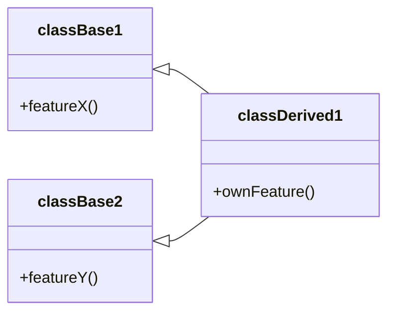
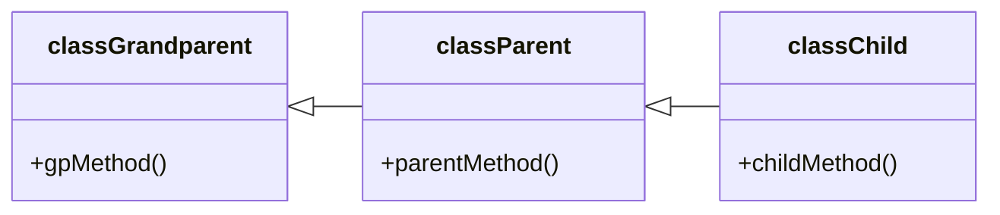
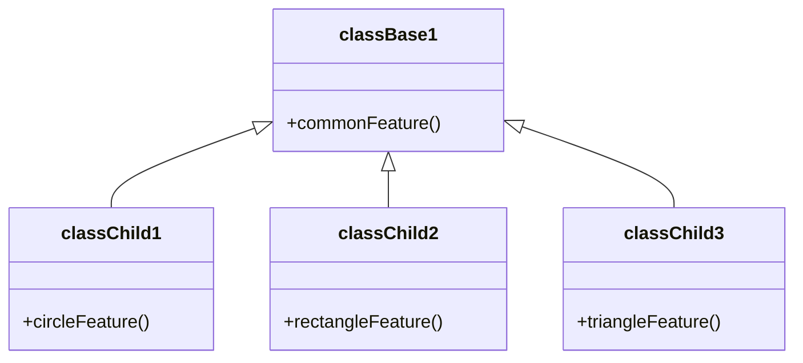
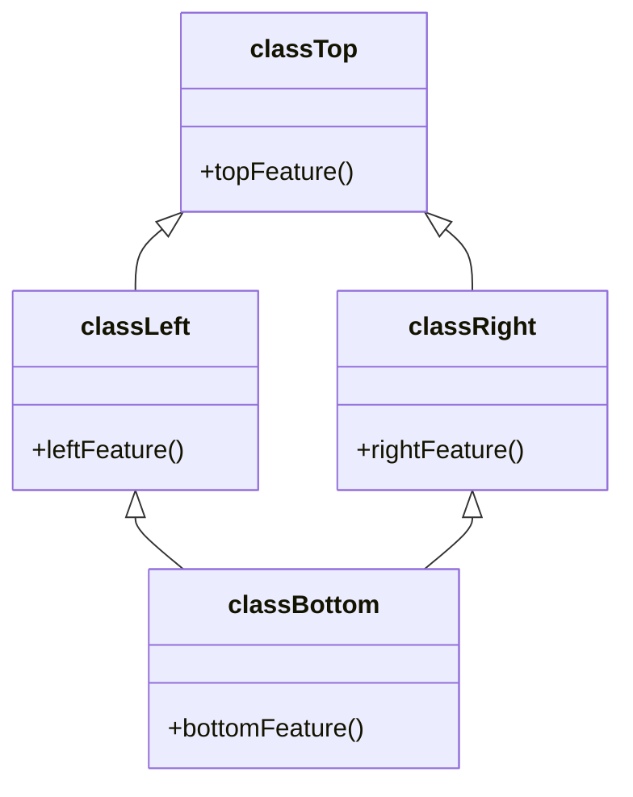
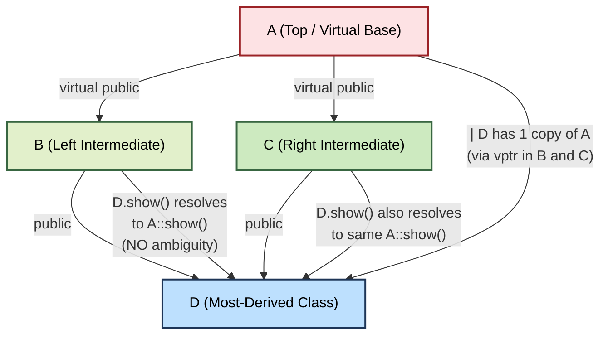

# Types of Inheritance

<!-- SECTION_1_START -->
# Types of Inheritance — Core Technical Definition & Intuitive Overview

## 1.1 Formal Definition (KTU 2024 Syllabus Terminology)

> [!IMPORTANT]
> **Inheritance** is a fundamental Object-Oriented Programming (OOP) mechanism in which a new class (called the **derived class**, **subclass**, or **child class**) is created by *acquiring* the **attributes** (data members) and **behaviors** (member functions) of an existing class (called the **base class**, **superclass**, or **parent class**). The derived class may additionally define its own new members or **override** the inherited ones to provide specialized behavior. This embodies the OOP principle of **reusability** and the **"is-a" relationship**.

In the **KTU 2024 Scheme syllabus for PBCST304 (Object Oriented Programming)**, the study of inheritance types lies under **Module 2 — Polymorphism**, because *polymorphic behavior* (especially **run-time polymorphism** via `virtual` functions in C++ or method overriding in Java) is directly enabled by the class hierarchies built through inheritance.

The **five canonical types of inheritance** recognized in the KTU syllabus are:

1. **Single Inheritance**
2. **Multiple Inheritance**
3. **Multilevel Inheritance**
4. **Hierarchical Inheritance**
5. **Hybrid Inheritance** (a combination of two or more of the above)

A sixth variant, **Multipath Inheritance** (which gives rise to the **Diamond Problem**), is also discussed as it is a critical edge case in C++.

## 1.2 Conceptual Analogy / Intuition

> [!NOTE]
> **Family Tree Analogy** — Think of inheritance like genetic inheritance in a family.
> * You inherit your **eye color**, **blood group**, and certain **physical traits** from your **parents** (the base class).
> * You are not an *exact copy* of your parent — you have your **own personality**, **skills**, and **name** (additional members in the derived class).
> * Sometimes, you might **express a trait differently** (overriding) — e.g., a child may have a louder voice, an evolved version of the parent's quieter voice.
> * A **grandparent → parent → child** chain is *multilevel inheritance*. A child having traits from **two parents** is *multiple inheritance*. **Siblings** sharing the same parent form a *hierarchical* structure.

## 1.3 Why It Matters in OOP

| OOP Pillar | How Inheritance Supports It |
|---|---|
| **Reusability** | Common code lives in the base class; derived classes reuse it without rewriting. |
| **Extensibility** | New functionality is added in derived classes without touching the base class. |
| **Polymorphism** | Base-class pointers/references can refer to derived-class objects, enabling dynamic dispatch. |
| **Abstraction** | A generalized interface is defined in the base; concrete details live in the derived classes. |

> [!TIP]
> **KTU Board Tip:** When asked to "explain types of inheritance", always begin with a **one-line definition**, then provide a **diagram** (Mermaid/hand-drawn), and then the **C++/Java syntax**. Examiners reward this three-part structure consistently.

---

### Quick Pictorial Snapshot of All Five Types

```
Single         Multiple        Multilevel       Hierarchical      Hybrid
   B              B   C              B                B               B
   |              \ /                |               / \             / \
   D              D                  D              D   E           D   F
                                  (extends to        (D and E        (combines
                                   grandchild)      share B)        multiple+
                                                                         multilevel)
```

> [!VISUALIZATION CONTROL]
> **Concept:** Visualising the structural difference among the five inheritance types
> **GeoGebra / Desmos Input Equations:** *Not applicable — this is a graph/structural visualization, best drawn as a class hierarchy tree using Mermaid (see Section 4) or by hand on paper. The student should draw each tree as a DAG (Directed Acyclic Graph) with arrows pointing from derived → base.*
> **Visual Description:** Single = one parent, one child (a chain of 1 edge). Multiple = two parents, one child (a converging V). Multilevel = grandparent → parent → child (a linear chain of 3 nodes). Hierarchical = one parent, two children (a diverging V). Hybrid = any composition of the above (typically a Multiple + Multilevel mix forming a diamond).

<!-- SECTION_1_END -->

<!-- SECTION_2_START -->
# Deep Theoretical Analysis & KTU High-Yield Formula Sheet

## 2.1 Type 1 — Single Inheritance

A derived class inherits from **exactly one** base class.

**C++ Syntax Skeleton:**
```cpp
class Base {
    // base members
};
class Derived : public Base {   // ': public Base' is the inheritance clause
    // additional/overriding members
};
```

**Real-world utility:** Most common in production codebases — e.g., `class SavingsAccount : public Account` in a banking system. It models a strict **is-a** relationship: a `SavingsAccount` *is an* `Account`.

## 2.2 Type 2 — Multiple Inheritance

A derived class inherits from **two or more** base classes.

**C++ Syntax Skeleton:**
```cpp
class Base1 { /* ... */ };
class Base2 { /* ... */ };
class Derived : public Base1, public Base2 { /* ... */ };
```

> [!WARNING]
> **Java does NOT support multiple inheritance with classes** (it uses `interface` with default methods to achieve a similar effect). C++ allows it natively, which is why the **Diamond Problem** is uniquely a C++ issue. KTU questions often test this language difference.

**Real-world utility:** Used in mixin patterns — e.g., a `SmartPhone` class inheriting from both `Camera` and `Phone` capabilities. In C++ STL, you can see it in class `basic_ios` inheriting from both `ios_base` and... well, the standard is built to avoid it wherever possible due to ambiguity.

## 2.3 Type 3 — Multilevel Inheritance

A chain of inheritance: `Base → Intermediate → Derived` (three or more levels).

**C++ Syntax Skeleton:**
```cpp
class A { /* ... */ };
class B : public A { /* ... */ };
class C : public B { /* ... */ };   // C inherits B which inherits A
```

**Real-world utility:** Modeling taxonomy — e.g., `Vehicle → Car → SportsCar`. The `SportsCar` automatically has all features of `Car` and `Vehicle`.

> [!NOTE]
> **Constructor call order in Multilevel Inheritance (C++):** Base class constructors are called **top-down** (Grandparent → Parent → Child), while destructors are called in the **reverse** order (Child → Parent → Grandparent). This is a frequent 3-mark and 7-mark question.

## 2.4 Type 4 — Hierarchical Inheritance

A **single base class** is inherited by **multiple derived classes**.

**C++ Syntax Skeleton:**
```cpp
class Shape { /* common shape members */ };
class Circle    : public Shape { /* ... */ };
class Rectangle : public Shape { /* ... */ };
class Triangle  : public Shape { /* ... */ };
```

**Real-world utility:** Most natural form — `Shape` as the parent of `Circle`, `Rectangle`, `Triangle`. All shapes share common properties (color, position) but have their own `draw()` implementations. This is the **backbone of polymorphism**.

## 2.5 Type 5 — Hybrid Inheritance

A **combination of two or more** of the above types, typically resulting in a **diamond-shaped** hierarchy.

**C++ Syntax Skeleton:**
```cpp
class A { /* ... */ };
class B : public A { /* ... */ };
class C : public A { /* ... */ };
class D : public B, public C { /* ... */ };   // Diamond!
```

This is where the notorious **Diamond Problem** emerges: class `D` has *two* copies of `A` (one through `B`, one through `C`), causing ambiguity. C++ solves it via **virtual inheritance** (`class B : virtual public A`).

**Real-world utility:** In real C++ projects, hybrid inheritance is often a **code smell** — modern design favors **composition over inheritance** to avoid the diamond.

## 2.6 Type 6 (Bonus) — Multipath Inheritance

A specific sub-case of hybrid where a derived class inherits from a base class through **more than one path**. It is the *cause* of the Diamond Problem.

## 2.7 KTU High-Yield Formula / Cheat Sheet

> [!IMPORTANT]
> The following tables are the **most-tested** reference material for KTU board exams on this topic.

### Table A — Inheritance Type → Structural Summary

| S.No. | Inheritance Type | \# of Base Classes | \# of Derived Classes | Relationship Visualized |
|:---:|---|:---:|:---:|---|
| 1 | Single | 1 | 1 | Linear: `B → D` |
| 2 | Multiple | $\geq 2$ | 1 | Converging V: `B1, B2 → D` |
| 3 | Multilevel | 1 (chain of 1) | 1 (per level) | Linear chain: `G → P → C` |
| 4 | Hierarchical | 1 | $\geq 2$ | Diverging V: `B → D1, D2` |
| 5 | Hybrid | Variable | Variable | Diamond / Mixed DAG |
| 6 | Multipath | 1 (reached via $\geq 2$ paths) | 1 | Diamond shape |

### Table B — Access Specifier Behavior in C++ Inheritance

| Access in Base Class | `public` Inheritance | `protected` Inheritance | `private` Inheritance |
|:---:|:---:|:---:|:---:|
| `public` | `public` in derived | `protected` in derived | `private` in derived |
| `protected` | `protected` in derived | `protected` in derived | `private` in derived |
| `private` | **Not accessible** | **Not accessible** | **Not accessible** |

> [!WARNING]
> **Common mistake:** Students often think `private` members are inherited. They are **NOT** accessible directly in the derived class, but they **DO exist** in the object layout. The derived class can only access them via the base's `public`/`protected` getters.

### Table C — Constructor / Destructor Call Order (CRITICAL for KTU)

| Inheritance Pattern | Construction Order (Top-Down) | Destruction Order (Bottom-Up) |
|---|---|---|
| Single (`B → D`) | `B()` then `D()` | `~D()` then `~B()` |
| Multiple (`B1, B2 → D`) | `B1()`, `B2()`, then `D()` (in declaration order) | Reverse of construction order |
| Multilevel (`A → B → C`) | `A()`, `B()`, `C()` | `~C()`, `~B()`, `~A()` |
| Hierarchical (`B → D1, D2`) | Each `D` only sees `B` constructor first | Each `D` destructor first, then `~B()` |
| Hybrid (Diamond) | Virtual base class first, then non-virtual bases, then derived | Reverse of construction order |

### Table D — Language Support Matrix (Frequently Asked!)

| Feature | C++ | Java | Python |
|---|:---:|:---:|:---:|
| Single Inheritance | Yes | Yes | Yes |
| Multilevel Inheritance | Yes | Yes | Yes |
| Hierarchical Inheritance | Yes | Yes | Yes |
| Multiple Inheritance (classes) | **Yes** | **No** (uses interfaces) | **Yes** (via C3 linearization / MRO) |
| Hybrid Inheritance | Yes | No (with classes) | Yes |
| Virtual Inheritance (Diamond fix) | Yes | N/A (no MI with classes) | N/A (uses MRO) |
| `virtual` keyword for base class | Yes (`virtual public A`) | Implicit (interfaces) | N/A |

### Table E — Member Visibility in Derived Class

| Base Member Type | Accessible in Derived? | Accessible Outside via Derived? |
|:---:|:---:|:---:|
| `public` | Yes | Yes (subject to inheritance mode) |
| `protected` | Yes | **No** |
| `private` | **No** (directly) | No |

<!-- SECTION_2_END -->

<!-- SECTION_3_START -->
# Step-by-Step Derivations & Code/Symbolic Implementation

## 3.1 Worked Example 1 — Single Inheritance (C++)

**Problem Statement:** Create a base class `Animal` with a `speak()` method. Derive a class `Dog` that overrides `speak()` to print `"Woof!"`. Demonstrate calling both versions using a base-class pointer (polymorphism prerequisite).

```cpp
#include <iostream>
#include <string>

// Step 1: Define the base class
class Animal {
protected:                            // protected so derived class can access
    std::string name;

public:
    Animal(const std::string& n) : name(n) {
        std::cout << "[Animal constructor] Name = " << name << std::endl;
    }

    // Step 2: Virtual function for run-time polymorphism
    virtual void speak() const {
        std::cout << name << " makes a generic sound." << std::endl;
    }

    // Step 3: Virtual destructor — MANDATORY when using base pointers
    virtual ~Animal() {
        std::cout << "[Animal destructor] for " << name << std::endl;
    }
};

// Step 4: Derive a single derived class
class Dog : public Animal {
public:
    Dog(const std::string& n) : Animal(n) {
        std::cout << "[Dog constructor] for " << name << std::endl;
    }

    // Step 5: Override the base method
    void speak() const override {
        std::cout << name << " says: Woof!" << std::endl;
    }

    ~Dog() override {
        std::cout << "[Dog destructor] for " << name << std::endl;
    }
};

int main() {
    // Step 6: Base-class pointer referring to derived object
    Animal* ptr = new Dog("Buddy");

    // Step 7: Polymorphic call — dispatches to Dog::speak()
    ptr->speak();

    // Step 8: Clean up via base pointer
    delete ptr;   // Calls ~Dog() first (because destructor is virtual), then ~Animal()
    return 0;
}
```

**Expected Output Trace:**
```
[Animal constructor] Name = Buddy
[Dog constructor] for Buddy
Buddy says: Woof!
[Dog destructor] for Buddy
[Animal destructor] for Buddy
```

> [!NOTE]
> **Why the `virtual` destructor is critical:** Without `virtual ~Animal()`, the statement `delete ptr;` (where `ptr` is `Animal*` pointing to a `Dog`) would call **only** `~Animal()`, leaking the `Dog` part. KTU questions often test this as a *“predict the output”* question.

---

## 3.2 Worked Example 2 — Multilevel Inheritance with Constructor/Destructor Order Trace

**Problem:** Predict and verify the order of constructor and destructor calls for the chain `A → B → C`.

```cpp
#include <iostream>

class A {
public:
    A()  { std::cout << "A() constructed\n"; }
    ~A() { std::cout << "~A() destroyed\n"; }
};

class B : public A {
public:
    B()  { std::cout << "B() constructed\n"; }
    ~B() { std::cout << "~B() destroyed\n"; }
};

class C : public B {
public:
    C()  { std::cout << "C() constructed\n"; }
    ~C() { std::cout << "~C() destroyed\n"; }
};

int main() {
    std::cout << "--- Creating object of C ---\n";
    C obj;
    std::cout << "--- Exiting main() ---\n";
    return 0;
}
```

**Predicted Output (Step-by-Step Reasoning):**
1. Program prints the header `--- Creating object of C ---`.
2. Object of class `C` is being constructed. Since `C` inherits `B` which inherits `A`, the order is **top-down**: `A()` first, then `B()`, then `C()`.
3. As `main()` ends, the object goes out of scope. Destructors are called in the **reverse** order: `~C()`, then `~B()`, then `~A()`.

**Final Output:**
```
--- Creating object of C ---
A() constructed
B() constructed
C() constructed
--- Exiting main() ---
~C() destroyed
~B() destroyed
~A() destroyed
```

**Valuation Key (for a 7-mark derivation question):**
* [Stating construction is top-down: 2 Marks]
* [Stating destruction is bottom-up: 2 Marks]
* [Correctly listing the full 6-line trace: 2 Marks]
* [Proper explanation of "why" (stack-based object lifetime): 1 Mark]

---

## 3.3 Worked Example 3 — Multiple Inheritance and the Diamond Problem (C++)

**Part A — The Problem (Without Virtual Inheritance):**

```cpp
#include <iostream>

class A {
public:
    void show() { std::cout << "A::show()" << std::endl; }
};

class B : public A { /* inherits A's show() */ };
class C : public A { /* inherits A's show() */ };

class D : public B, public C { /* now has TWO copies of A */ };

int main() {
    D obj;
    // obj.show();   // ❌ COMPILER ERROR: ambiguous — which A::show()?
    obj.B::show();    // Disambiguates using scope resolution
    obj.C::show();
    return 0;
}
```

**Output:**
```
A::show()
A::show()
```

**Part B — The Solution (With Virtual Inheritance):**

```cpp
#include <iostream>

class A {
public:
    A()  { std::cout << "A() constructed\n"; }
    void show() { std::cout << "A::show()" << std::endl; }
    virtual ~A() { std::cout << "~A() destroyed\n"; }
};

// Step 1: Add 'virtual' keyword to the inheritance
class B : virtual public A {
public:
    B()  { std::cout << "B() constructed\n"; }
    ~B() { std::cout << "~B() destroyed\n"; }
};

class C : virtual public A {
public:
    C()  { std::cout << "C() constructed\n"; }
    ~C() { std::cout << "~C() destroyed\n"; }
};

class D : public B, public C {
public:
    D()  { std::cout << "D() constructed\n"; }
    ~D() { std::cout << "~D() destroyed\n"; }
};

int main() {
    D obj;
    obj.show();   // ✅ No ambiguity — only ONE copy of A
    return 0;
}
```

**Output:**
```
A() constructed      ← Note: A() is constructed ONLY ONCE, and FIRST.
B() constructed
C() constructed
D() constructed
A::show()
~D() destroyed
~C() destroyed
~B() destroyed
~A() destroyed
```

> [!IMPORTANT]
> **Key observation:** With `virtual` inheritance, the **most-derived class** (`D`) is responsible for constructing the **virtual base** (`A`). Hence `A()` is called before `B()` and `C()`. The compiler enforces this via a special pointer called the **vptr (virtual base pointer / vbase offset)** stored in `B` and `C`, which points to the single shared `A` subobject.

---

## 3.4 Worked Example 4 — Hierarchical Inheritance in Java

Java is widely tested by KTU for hierarchical & multilevel cases (it doesn't support multiple class inheritance).

```java
// File: ShapeHierarchy.java

class Shape {
    protected String color;

    public Shape(String color) {
        this.color = color;
        System.out.println("Shape constructor: color = " + color);
    }

    public void draw() {
        System.out.println("Drawing a generic " + color + " shape.");
    }
}

class Circle extends Shape {
    private double radius;

    public Circle(String color, double radius) {
        super(color);                      // explicit call to base constructor
        this.radius = radius;
        System.out.println("Circle constructor: radius = " + radius);
    }

    @Override
    public void draw() {
        System.out.println("Drawing a " + color + " circle of radius " + radius);
    }
}

class Rectangle extends Shape {
    private double length, width;

    public Rectangle(String color, double l, double w) {
        super(color);
        this.length = l;
        this.width  = w;
        System.out.println("Rectangle constructor: " + l + " x " + w);
    }

    @Override
    public void draw() {
        System.out.println("Drawing a " + color + " rectangle " + length + "x" + width);
    }
}

public class ShapeHierarchy {
    public static void main(String[] args) {
        Shape[] shapes = {                       // polymorphic array
            new Circle("red", 5.0),
            new Rectangle("blue", 4.0, 6.0)
        };
        for (Shape s : shapes) {
            s.draw();                            // dynamic dispatch in Java
        }
    }
}
```

**Output:**
```
Shape constructor: color = red
Circle constructor: radius = 5.0
Shape constructor: color = blue
Rectangle constructor: 4.0 x 6.0
Drawing a red circle of radius 5.0
Drawing a blue rectangle 4.0x6.0
```

> [!TIP]
> **KTU Board Tip:** In Java, polymorphism is **automatic** for instance methods (no `virtual` keyword needed). All non-static, non-final, non-private methods are **virtual by default**. This is the *exact opposite* of C++ where you must explicitly mark a method `virtual`.

---

## 3.5 Worked Example 5 — Java's Interface Trick to Simulate Multiple Inheritance

```java
interface Camera {
    default void click() {                       // Java 8+ default methods
        System.out.println("Camera: *click*");
    }
}
interface Phone {
    default void ring() {
        System.out.println("Phone: *ring ring*");
    }
}
// SmartPhone implements BOTH — this is Java's "multiple inheritance"
class SmartPhone implements Camera, Phone {
    public void videoCall() {
        System.out.println("SmartPhone: video calling...");
    }
}

public class Main {
    public static void main(String[] args) {
        SmartPhone sp = new SmartPhone();
        sp.click();
        sp.ring();
        sp.videoCall();
    }
}
```

> [!WARNING]
> If two interfaces provide a `default` method with the **same signature**, the implementing class **must** override it — this is Java's own version of the Diamond Problem resolution.

<!-- SECTION_3_END -->

<!-- SECTION_4_START -->
# Structural Diagrams & Schematics

## 4.1 Inheritance Type Visualizations (Mermaid Class Diagrams)

The following Mermaid diagrams use only **alphanumeric node identifiers** (no reserved keywords like `end`, `graph`, `subgraph`, `style` as standalone node names). All special-character labels are double-quoted.

### Diagram 1 — Single Inheritance

```mermaid
classDiagram
    direction LR
    classBase1 <|-- classDerived1
    classBase1 : +memberA : int
    classBase1 : +displayBase()
    classDerived1 : +memberB : int
    classDerived1 : +displayDerived()
```

### Diagram 2 — Multiple Inheritance



### Diagram 3 — Multilevel Inheritance



### Diagram 4 — Hierarchical Inheritance



### Diagram 5 — Hybrid (Diamond) Inheritance



---

## 4.2 Diamond Problem — Block-Level Functional Architecture Flow

The Mermaid diagram below maps the **construction flow** and **ambiguity resolution** when a `Diamond` is created in C++.



> [!NOTE]
> **Reading guide:** Solid arrows represent `class ... : public ...` relationships. The annotation near node `D` highlights the **single shared subobject** of `A` once `virtual` inheritance is used. Without `virtual`, there would be **two** arrows from `A` to `D` (one through `B`, one through `C`), causing ambiguity.

---

## 4.3 Construction / Destruction Order Flowchart

```mermaid
flowchart LR
    Start(["Object of class D created"]) --> Step1["Step 1: Construct virtual bases\nA() — first, called by D"]
    Step1 --> Step2["Step 2: Construct non-virtual bases\nB() then C() (declaration order)"]
    Step2 --> Step3["Step 3: Construct members of D\nin declaration order"]
    Step3 --> Step4["Step 4: Body of D constructor runs"]
    Step4 --> ObjD["Object D is now fully constructed"]

    ObjD --> Use(["Object D is in use"])

    Use --> Destruct1["Step 1: Body of D destructor runs"]
    Destruct1 --> Destruct2["Step 2: Destruct members of D\n(reverse declaration order)"]
    Destruct2 --> Destruct3["Step 3: Destruct non-virtual bases\n~C() then ~B()"]
    Destruct3 --> Destruct4["Step 4: Destruct virtual bases\n~A() — last, called by D"]
    Destruct4 --> End(["Object D fully destroyed"])
```



---

## 4.4 Inheritance-Type Decision Matrix (When to Use What)

| Scenario | Recommended Inheritance Type | Reasoning |
|---|---|---|
| Modeling strict taxonomy (`Car` is a `Vehicle`) | Single | Simple, no ambiguity, clear is-a relationship |
| Reusing code across a deep hierarchy (`Vehicle → Car → SportsCar`) | Multilevel | Natural modeling of progressive specialization |
| One general class with many specialized variants (`Shape` → `Circle`, `Rectangle`, ...) | Hierarchical | Maximum reusability; enables polymorphism via base pointer |
| Combining orthogonal capabilities (e.g., `FlyingCar` is a `Car` *and* a `Flyer`) | Multiple (C++) or Interfaces (Java) | Captures multi-aspect "is-a" relationships |
| Building complex frameworks with overlapping concerns | Hybrid (with virtual inheritance in C++) | Real-world frameworks (e.g., MFC) use this, but prefer composition if possible |

> [!TIP]
> **KTU Board Tip:** If asked "which inheritance is best?", the professional answer is: *"Prefer composition over inheritance. Use inheritance only when there is a true, permanent 'is-a' relationship that won't change over time."* This shows **Apply** level understanding.

<!-- SECTION_4_END -->

<!-- SECTION_5_START -->
# KTU 2024 Scheme Examination Question Bank & Topic Recap

> [!IMPORTANT]
> The questions below strictly follow the **KTU 2024 Scheme ESE (End Semester Evaluation) pattern**:
> * Part A: 2 questions $\times$ 3 marks = 6 marks (no choice, short answer)
> * Part B: 1 question $\times$ 14 marks (with internal choice between **Question A** and **Question B**)
> * Each 14-mark question has two sub-parts: (a) for 7 marks and (b) for 7 marks.
> * Cognitive levels escalate from **Understand** to **Apply** to **Analyze**.

---

## 5.1 Part A — Short Answer Questions (3 Marks Each)

### Question 1: Define inheritance. List any four types of inheritance supported in C++ with a one-line description of each. `[KTU University Exam - July 2024]`
* **CO Mapping:** CO2 — *Understand* OOP features
* **RBT Level:** Remember / Understand
* **Module:** 2

**Model Answer (Valuation Key):**
* [Defining inheritance as a mechanism of deriving new classes from existing ones: 1 Mark]
* [Listing 4 types correctly: 1 Mark — 0.25 each]
* [One-line description for each: 1 Mark — 0.25 each]

**Suggested Answer Text:**
> **Inheritance** is an OOP mechanism by which a new class (derived class) acquires the properties and behaviors of an existing class (base class), promoting code reusability and establishing an "is-a" relationship.
>
> * **Single:** One base, one derived.
> * **Multiple:** Two or more bases, one derived.
> * **Multilevel:** A chain — `Base → Intermediate → Derived`.
> * **Hierarchical:** One base, multiple derived classes.
> * **Hybrid:** A combination of two or more of the above types.

---

### Question 2: Differentiate between multiple inheritance and multilevel inheritance. State one advantage and one disadvantage of multiple inheritance. `[KTU University Exam - Dec 2023]`
* **CO Mapping:** CO2 — *Apply* OOP concepts
* **RBT Level:** Understand
* **Module:** 2

**Model Answer (Valuation Key):**
* [Tabular comparison with at least 3 differences: 2 Marks]
* [One advantage of multiple inheritance: 0.5 Mark]
* [One disadvantage of multiple inheritance: 0.5 Mark]

**Suggested Answer Text:**

| Aspect | Multiple Inheritance | Multilevel Inheritance |
|---|---|---|
| **Structure** | One class inherits from $\geq 2$ base classes | A chain — class inherits from a derived class |
| **Levels** | 1 level of derivation | 2 or more levels of derivation |
| **Example** | `D` derives from `B1` and `B2` | `C` derives from `B` which derives from `A` |
| **Diamond Risk** | Yes, can lead to ambiguity | No diamond issue |
| **Java Support** | Not supported (only with interfaces) | Supported |

* **Advantage of multiple inheritance:** Combines features of multiple classes, increasing reusability.
* **Disadvantage:** The **Diamond Problem** — ambiguity when two bases have a member with the same name.

---

## 5.2 Part B — Long Answer Questions (14 Marks Each, Internal Choice)

### Question A (14 Marks) — Hybrid Inheritance & the Diamond Problem

> **Question A (a) [7 Marks]:**
> Explain the concept of **hybrid inheritance** with a suitable diagram. Write a C++ program to demonstrate hybrid inheritance involving classes `Student`, `Sports`, and `Result`, where `Student` and `Sports` are base classes and `Result` is a derived class that displays both academic and sports scores. `[KTU University Exam - July 2024]`
>
> * **CO Mapping:** CO3 — *Apply* inheritance in C++ programs
> * **RBT Level:** Apply

**Model Answer:**

**Conceptual Explanation (2 Marks):**
> Hybrid inheritance is a combination of two or more types of inheritance. A common form is a **diamond** where a class derives from two classes that themselves share a common base. This can cause the **Diamond Problem** — ambiguity in member access from the topmost base.

**Diagram (2 Marks):**
```mermaid
classDiagram
    direction TB
    classPerson <|-- classStudent
    classPerson <|-- classSports
    classStudent <|-- classResult
    classSports <|-- classResult
    classPerson : +name : string
    classStudent : +marks : float
    classSports : +score : float
    classResult : +display()
```

**Code (3 Marks):**
```cpp
#include <iostream>
#include <string>

class Person {
protected:
    std::string name;
public:
    Person(const std::string& n) : name(n) {}
};

class Student : virtual public Person {
protected:
    float marks;
public:
    Student(const std::string& n, float m) : Person(n), marks(m) {}
};

class Sports : virtual public Person {
protected:
    float score;
public:
    Sports(const std::string& n, float s) : Person(n), score(s) {}
};

class Result : public Student, public Sports {
public:
    // Virtual base 'Person' is constructed by Result
    Result(const std::string& n, float m, float s)
        : Person(n), Student(n, m), Sports(n, s) {}

    void display() const {
        std::cout << "Name: "   << name  << std::endl;
        std::cout << "Marks: "  << marks << std::endl;
        std::cout << "Sports: " << score << std::endl;
    }
};

int main() {
    Result r("Ananya", 92.5f, 85.0f);
    r.display();
    return 0;
}
```

**Valuation Key Points:**
* [Diagram with 4 nodes and correct arrows: 2 Marks]
* [Use of `virtual` keyword (or clear note on why it is needed): 1 Mark]
* [Correct constructor chain in `Result(...)`: 1 Mark]
* [Output: `Ananya`, `92.5`, `85.0` shown correctly: 1 Mark]
* [Code compiles logically and includes `#include`s: 1 Mark]
* [Final display logic: 1 Mark]

---

> **Question A (b) [7 Marks]:**
> What is the **Diamond Problem**? Show how C++ resolves it using **virtual inheritance**. Write a program where a base class `A` has a method `display()`, and the derived class `D` (via `B` and `C`) can call `display()` without ambiguity. `[KTU University Exam - Dec 2023]`
>
> * **CO Mapping:** CO3 — *Analyze* complex inheritance scenarios
> * **RBT Level:** Analyze

**Model Answer:**

**Definition of Diamond Problem (2 Marks):**
> The **Diamond Problem** occurs in hybrid/multipath inheritance when a class inherits from two classes that both inherit from a common base. The derived class ends up with **two copies** of the base class — one via each path — causing **ambiguity** when accessing members of the topmost base.

**Solution: Virtual Inheritance (2 Marks):**
> By declaring the intermediate classes to inherit the base using the `virtual` keyword, the compiler ensures that **only one shared subobject** of the base class exists, regardless of how many paths lead to it.

**Code (3 Marks):**
```cpp
#include <iostream>

class A {
public:
    void display() {
        std::cout << "A::display() called" << std::endl;
    }
};

class B : virtual public A {};
class C : virtual public A {};

class D : public B, public C {
    // Only ONE A subobject exists now
};

int main() {
    D obj;
    obj.display();              // ✅ No ambiguity
    // obj.A::display();        // Also valid, but unnecessary
    return 0;
}
```

**Output:**
```
A::display() called
```

**Valuation Key Points:**
* [Correct definition of Diamond Problem: 2 Marks]
* [Mentioning `virtual` keyword as the C++ solution: 1 Mark]
* [Correct syntax in class `B` and `C`: 1 Mark]
* [Successful call `obj.display()` without scope resolution: 1 Mark]
* [Final output printed correctly: 1 Mark]
* [Brief explanation of "single shared subobject": 1 Mark]

---

### Question B (14 Marks) — Constructor/Destructor Order Across Inheritance Types

> **Question B (a) [7 Marks]:**
> Explain with a suitable C++ program the order of **constructor** and **destructor** calls in **single**, **multiple**, and **multilevel** inheritance. Predict the output of your program. `[KTU University Exam - July 2024]`
>
> * **CO Mapping:** CO3 — *Apply* inheritance mechanics
> * **RBT Level:** Apply / Analyze

**Model Answer:**

**Theory (2 Marks):**
> * In **single inheritance**, the base constructor runs first, then the derived.
> * In **multiple inheritance**, base constructors run in the **order of declaration** in the derived class's inheritance list, then the derived constructor.
> * In **multilevel inheritance**, the constructors run in **top-down** order (grandparent → parent → child). Destructors always run in the **exact reverse** order.

**Code (4 Marks):**
```cpp
#include <iostream>

class A {
public:
    A()  { std::cout << "A()"  << std::endl; }
    ~A() { std::cout << "~A()" << std::endl; }
};
class B {
public:
    B()  { std::cout << "B()"  << std::endl; }
    ~B() { std::cout << "~B()" << std::endl; }
};

// Single: Base1 -> Derived1
class Derived1 : public A {
public:
    Derived1()  { std::cout << "Derived1()"  << std::endl; }
    ~Derived1() { std::cout << "~Derived1()" << std::endl; }
};

// Multiple: Base1 and Base2 -> Derived2
class Derived2 : public A, public B {
public:
    Derived2()  { std::cout << "Derived2()"  << std::endl; }
    ~Derived2() { std::cout << "~Derived2()" << std::endl; }
};

// Multilevel: Base1 -> Intermediate -> Derived3
class Intermediate : public A {
public:
    Intermediate()  { std::cout << "Intermediate()"  << std::endl; }
    ~Intermediate() { std::cout << "~Intermediate()" << std::endl; }
};
class Derived3 : public Intermediate {
public:
    Derived3()  { std::cout << "Derived3()"  << std::endl; }
    ~Derived3() { std::cout << "~Derived3()" << std::endl; }
};

int main() {
    std::cout << "--- Single ---\n";
    Derived1 d1;
    std::cout << "--- Multiple ---\n";
    Derived2 d2;
    std::cout << "--- Multilevel ---\n";
    Derived3 d3;
    std::cout << "--- End of main ---\n";
    return 0;
}
```

**Predicted Output (1 Mark):**
```
--- Single ---
A()
Derived1()
--- Multiple ---
A()
B()                  ← declaration order: A, then B
Derived2()
--- Multilevel ---
A()
Intermediate()
Derived3()
--- End of main ---
~Derived3()
~Intermediate()
~A()
~Derived2()
~B()
~A()
~Derived1()
~A()
```

**Valuation Key Points:**
* [Theory covering all three types correctly: 2 Marks]
* [Code compiles logically with proper includes: 1 Mark]
* [Constructor trace correct for all three cases: 1 Mark]
* [Destructor trace correct (reverse order): 1 Mark]
* [Output prediction matches the actual run: 1 Mark]
* [Bonus for explaining "declaration order" in multiple inheritance: 1 Mark]

---

> **Question B (b) [7 Marks]:**
> Compare the **inheritance** and **access specifier** rules of **C++ and Java**. Why does Java not support multiple inheritance with classes? How does Java achieve a similar effect using interfaces? Illustrate with an example. `[KTU University Exam - Dec 2023]`
>
> * **CO Mapping:** CO2 + CO3 — *Analyze* language design decisions
> * **RBT Level:** Analyze

**Model Answer:**

**Comparison Table (3 Marks):**

| Feature | C++ | Java |
|---|---|---|
| Inheritance keyword | `class D : public B` | `class D extends B` |
| Access specifiers | `public`, `protected`, `private` inheritance modes | Only `public` inheritance (no `protected`/`private` inheritance of classes) |
| Multiple inheritance with classes | Supported | **Not supported** |
| Default access for `class` | `private` | `private` (members), package-private (classes) |
| `virtual` keyword | Required for runtime polymorphism | Implicit for all non-final instance methods |
| Interfaces | Abstract base classes | Dedicated `interface` construct with `default` methods (Java 8+) |
| Constructors & inheritance | Chain via initializer list | Chain via `super()` call |

**Why Java Disallows Multiple Inheritance with Classes (2 Marks):**
> To avoid the **Diamond Problem** and the resulting ambiguity. Java's designers believed the complexity and ambiguity caused by multiple class inheritance outweighed its benefits. Java was designed with **simplicity and safety** as primary goals.

**How Java Achieves It via Interfaces (2 Marks):**
> A Java class can `implements` multiple interfaces. Since interfaces (before Java 8) only declared method signatures, there was no ambiguity. From Java 8 onwards, `default` methods in interfaces allow method bodies, but if a class inherits two `default` methods with the same signature, it **must** override that method — eliminating ambiguity at compile time.

**Example:**
```java
interface Camera { default void click() { System.out.println("Click!"); } }
interface Phone  { default void ring()  { System.out.println("Ring!"); } }

class SmartPhone implements Camera, Phone {
    @Override
    public void click() {                      // overrides to avoid any conflict
        Camera.super.click();
        System.out.println("SmartPhone: click enhanced");
    }
}
```

**Valuation Key Points:**
* [Comparison table with at least 5 valid differences: 3 Marks]
* [Reasoning for Java's design choice (Diamond Problem): 1 Mark]
* [Mentioning `interface` with `default` methods: 1 Mark]
* [Working example code: 1 Mark]
* [Note that conflicting `default` methods require override: 1 Mark]

---

## 5.3 KTU Examiner's Valuation Warning / Pitfall Callout

> [!WARNING]
> **Top 5 places students lose marks on this topic in KTU exams:**
> 1. **Forgetting `virtual` keyword on the destructor of a polymorphic base class.** If the base destructor is non-virtual, `delete basePtr` will only call the base destructor, causing a **memory leak** in the derived part. (-1 to -2 Marks)
> 2. **Confusing access specifier inheritance rules.** A `private` member of the base is **NOT** directly accessible in the derived class — many students write `derivedObj.privateMember` and lose marks. (-1 Mark)
> 3. **Not drawing the inheritance diagram.** KTU examiners almost always allocate 1–2 marks for the diagram. Skipping it is a guaranteed loss. (-1 to -2 Marks)
> 4. **Mixing up construction and destruction order.** Remember: **construction is top-down, destruction is bottom-up.** A common error is reversing these. (-1 Mark)
> 5. **Forgetting that Java does not support multiple inheritance with classes.** If the question asks for Java code demonstrating *multiple* class inheritance, your code will not compile. Use `interface` instead. (-1 to -2 Marks)

---

## 5.4 Topic Recap & Important Things to Remember

> [!NOTE]
> **High-density revision checklist for Types of Inheritance (Module 2 — Polymorphism):**

* **Definition:** Inheritance is the OOP mechanism of deriving a new class from an existing class, enabling code reuse and establishing an "is-a" relationship.

* **Five Canonical Types (and one bonus):**
  1. **Single** — one base, one derived (1-to-1)
  2. **Multiple** — $\geq 2$ bases, one derived (many-to-1)
  3. **Multilevel** — chain `G → P → C` (1-to-1-to-1)
  4. **Hierarchical** — one base, $\geq 2$ derived (1-to-many)
  5. **Hybrid** — combination of the above (often diamond-shaped)
  6. **Multipath** — same base reached through multiple paths (cause of Diamond Problem)

* **C++ Syntax Pattern:** `class Derived : <access_mode> Base { ... };` where `<access_mode>` $\in \{$ `public`, `protected`, `private` $\}$, defaulting to `private` for `class` and `public` for `struct`.

* **Java Syntax Pattern:** `class Derived extends Base { ... }` — only `public` inheritance is allowed.

* **Access Specifier Rule of Thumb (C++):** The most restrictive access wins. `private` is never directly accessible outside the defining class. `protected` is accessible in derived classes. `public` is accessible everywhere.

* **Constructor Order:** **Top-down** — base constructors always run before derived constructors. In multiple inheritance, base constructors run in **declaration order** in the inheritance list.

* **Destructor Order:** **Bottom-up** — the exact reverse of construction order.

* **Virtual Base Class:** Declared via `virtual` keyword in inheritance list. The **most-derived class** is responsible for constructing the virtual base. Result: **only one shared subobject** of the virtual base exists.

* **Diamond Problem:** Caused by multipath inheritance without `virtual`. Symptom: ambiguity error when accessing topmost base members. Solution: `virtual` inheritance.

* **`virtual` Destructor Rule:** Always declare the destructor of a polymorphic base class as `virtual` to ensure correct cleanup via base pointers.

* **Java's Multiple Inheritance Workaround:** Use `interface` with `default` methods. Override any conflicting `default` method in the implementing class.

* **Composition vs Inheritance:** Modern OOP best practice favors **composition** ("has-a") over inheritance ("is-a") when the relationship is not permanent or strict. Inheritance creates tight coupling.

* **Polymorphism Connection:** Inheritance + `virtual` functions (C++) / method overriding (Java) is what enables **run-time polymorphism** — the focus of the next sub-topic in Module 2.

* **Memory Layout (C++ only):** A derived object contains a **base subobject** + its own members. In a diamond, without `virtual`, the derived object contains **two base subobjects**, leading to ambiguity.

* **Most-tested syntax on KTU exams:**
  * `class Derived : public Base { ... };` (C++ single)
  * `class Derived : public Base1, public Base2 { ... };` (C++ multiple)
  * `class D : virtual public B, virtual public C { ... };` (C++ virtual hybrid)
  * `class Sub extends Super { ... }` (Java single)
  * `class Impl implements I1, I2 { ... }` (Java interfaces)
<!-- SECTION_5_END -->
