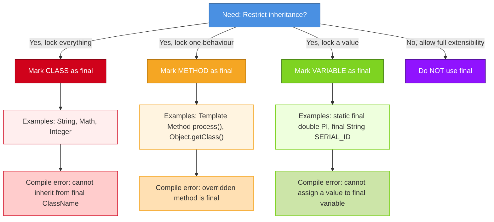
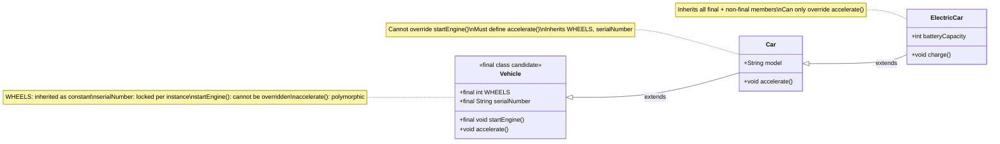
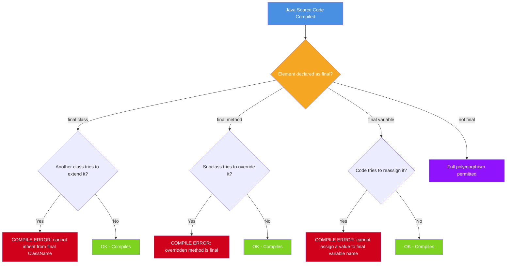
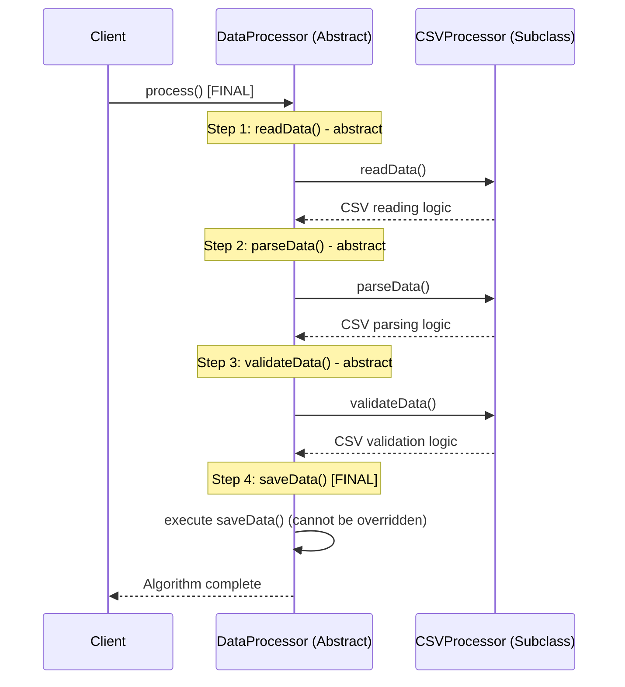
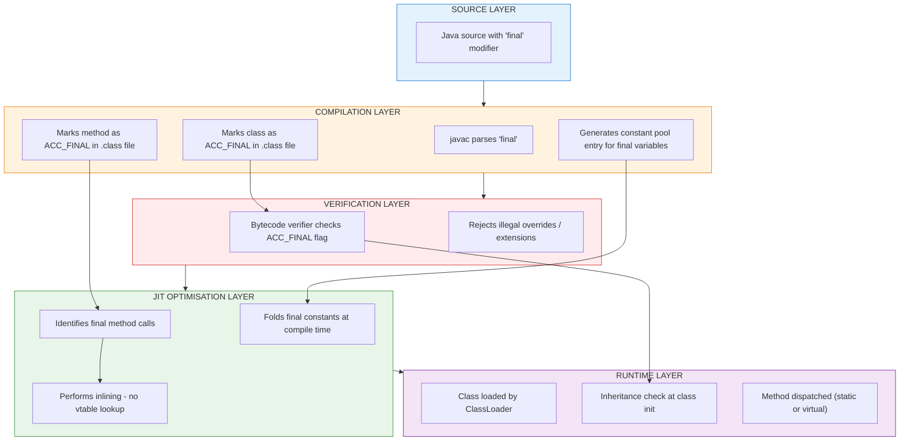

# Using final with Inheritance.

<!-- SECTION_1_START -->
# Using `final` with Inheritance — Core Technical Definition & Intuitive Overview

> [!IMPORTANT]
> **KTU 2024 Scheme | PBCST304 — Object Oriented Programming | Module 2: Polymorphism**
> The keyword `final` in Java is a **non-access modifier** that, when applied in the context of inheritance, **restricts the extensibility and mutability** of classes, methods, and variables. It is one of the most frequently tested sub-topics under polymorphism in the KTU 2024 scheme ESE pattern.

## Formal Definition (KTU 2024 Syllabus Terminology)

In Object-Oriented Programming, **inheritance** establishes an "is-a" relationship where a subclass inherits the structure and behaviour of its parent (superclass). The `final` keyword provides a **compile-time enforcement mechanism** to selectively revoke this inheritance privilege in three distinct dimensions:

1. **`final` Class** — A class declared with `final` **cannot be subclassed** (extended). Inheritance is blocked at the root.
2. **`final` Method** — A method declared with `final` **cannot be overridden** in any subclass. The inherited implementation is locked.
3. **`final` Variable** — A variable declared with `final` becomes a **constant**; its value can be assigned exactly **once** and cannot be changed afterwards.

> [!NOTE]
> **Academic Note:** According to the *Java Language Specification (JLS §8.1.1.2, §8.4.3, §4.12.4)*, the `final` modifier produces a hard, compile-time guarantee enforced by the Java compiler. There is no runtime escape — once a class/method/variable is marked `final`, the JVM verifies the contract during bytecode verification.

---

## Conceptual Analogy — The Sealed Blueprint

Imagine a **prestigious architectural firm** that designs skyscrapers:

- The firm publishes a **Sealed Master Blueprint** of its flagship tower design — the blueprint cannot be copied and modified by other firms. This is a **`final` class** — you cannot create your own version of it.
- Within that blueprint, certain critical structural equations (like load-bearing calculations) are marked as **"Verified — Do Not Recalculate"**. Other firms can build extensions, but they cannot change these equations. These are **`final` methods**.
- The blueprint also lists fixed values — *"Number of floors = 50"*, *"Foundation depth = 200 ft"* — these numbers are stamped permanently and cannot be edited. These are **`final` variables** (constants).

This analogy captures exactly what `final` does in inheritance: **it freezes selected parts of the class contract so the system remains predictable, secure, and performant.**

---

## The Three Faces of `final` in Inheritance — Quick Visual Map

> [!TIP]
> **Mnemonic — "CMV": Class, Method, Variable.**
> Remember the three applications of `final` in this order — from broadest (class level) to narrowest (variable level) scope of restriction.

| Application | What it Freezes | Inheritance Impact |
|---|---|---|
| `final class` | The **entire class contract** | No subclass can ever exist |
| `final method` | A **single method's implementation** | Subclass can extend, but cannot override this method |
| `final variable` | The **value stored in a variable** | Reference/value cannot be reassigned after initialization |

---

## Why `final` Matters for Polymorphism

Polymorphism allows **one interface, many implementations** — typically through method overriding and dynamic dispatch. The `final` keyword acts as a **polymorphism limiter**:

- It lets the designer say: *"I want polymorphism everywhere **except here**."*
- It enables the JVM to perform **aggressive inlining and optimisation** because the method's target is known at compile time (no virtual dispatch needed).
- It enforces **immutability patterns** (e.g., `String`, `Integer`, all `java.lang` wrapper classes use `final`).

> [!WARNING]
> **Common Student Misconception:** "Final means the value cannot be changed at all."
> **Correction:** For **primitive** `final` variables, the value truly cannot change. But for **reference** `final` variables, the reference cannot point to a new object — **however, the internal state of the object it points to can still be modified** (unless the object itself is immutable).

---

> [!VISUALIZATION CONTROL]
> **Concept:** Decision tree — *When does `final` apply and what does it block?*
> **Desmos/GeoGebra Input:** (Not applicable — this is a logical tree, not a graph)
> **Visual Description:** Picture a root node labelled "final keyword". Three branches emerge: Class → "Blocks: subclassing"; Method → "Blocks: overriding"; Variable → "Blocks: reassignment". Each leaf shows the compile-time error message produced by `javac`.

---

## Section 1 — Quick Recap

- `final` is a **compile-time enforced** non-access modifier.
- It restricts inheritance at three levels: **class, method, variable**.
- It is the **opposite of polymorphism's "open-for-extension" philosophy** — it selectively closes parts of the hierarchy.
- Many JDK classes (`String`, `Math`, `Integer`, `System`) are declared `final` for **security, immutability, and performance**.

<!-- SECTION_1_END -->

<!-- SECTION_2_START -->
# Deep Theoretical Analysis & KTU High-Yield Formula Sheet

## 2.1 — `final` Classes (Blocking Inheritance at the Root)

When a class is declared `final`, the compiler rejects every attempt to extend it.

```java
final class SecurityToken {
    // implementation
}

class ExtendedToken extends SecurityToken {  // COMPILE ERROR
    // ...
}
```

**Compiler Error Produced:**
```
cannot inherit from final SecurityToken
```

### Why does Java's standard library mark certain classes as `final`?

| Class | Reason for being `final` |
|---|---|
| `java.lang.String` | Immutability for security (used in class loading, network paths, keys) |
| `java.lang.Math` | All methods are `static` — subclassing would add no value |
| `java.lang.Integer`, `Long`, `Double`, etc. | Wrapper classes must be immutable to support caching and hashing |
| `java.lang.System` | Critical system access — must not be tampered with |

### KTU High-Yield Points on `final` Classes
- A `final` class **may still have constructors**, but they can only be invoked using `new FinalClass()` — never via `super()` from a subclass (since none can exist).
- All methods of a `final` class are **implicitly `final`** (not the other way round).
- An `abstract` class **cannot be `final`** — these two modifiers are mutually exclusive (a class cannot be both incomplete and closed for extension).

> [!IMPORTANT]
> **Syllabus Highlight:** KTU frequently asks: *"Can a `final` class have a constructor?"* The answer is **YES** — but no subclass can call it via `super()`.

---

## 2.2 — `final` Methods (Blocking Method Overriding)

When a method is declared `final`, subclasses inherit it as-is. They **cannot provide a new implementation**.

```java
class Account {
    final double calculateInterest(double principal) {
        return principal * 0.05;
    }
}

class SavingsAccount extends Account {
    @Override
    double calculateInterest(double principal) {  // COMPILE ERROR
        return principal * 0.07;
    }
}
```

**Compiler Error Produced:**
```
calculateInterest(double) in SavingsAccount cannot override
calculateInterest(double) in Account; overridden method is final
```

### When Should a Method be Marked `final`?

| Scenario | Justification |
|---|---|
| **Template Method Pattern** | The base algorithm must not be changed; only the variable steps (hooks) are overridden |
| **Security-critical methods** | e.g., authentication, encryption — overriding could bypass checks |
| **Performance-critical methods** | Compiler can devirtualise the call (no vtable lookup) |
| **Invariant-preserving methods** | `getClass()`, `wait()`, `notify()`, `equals()` in some designs |

### KTU High-Yield Points on `final` Methods
- **`private` methods are implicitly `final`** — they cannot be overridden because they are not visible to subclasses.
- **`static` methods are also implicitly `final`** — they cannot be overridden (only hidden — which is a different mechanism).
- A `final` method **can be overloaded** within the same class (overloading is a compile-time concept, unrelated to overriding).
- A `final` method **can still be called** by subclasses via `super.finalMethod()`.

> [!TIP]
> **Mnemonic:** "Private and Static are `final` by default." This is a favourite KTU objective question.

---

## 2.3 — `final` Variables (Constants)

A `final` variable can be assigned **exactly once**. After that, reassignment is a compile error.

### Three flavours of `final` variables

| Type | Declaration | When Assigned | Example |
|---|---|---|---|
| `final` local variable | Inside a method | Before use | `final int x = 10;` |
| `final` instance variable | Inside a class (non-static) | At declaration OR in every constructor OR in an instance initializer | `final String name;` assigned in constructor |
| `final` static variable (class constant) | Inside a class with `static` | At declaration OR in a static initializer block | `static final double PI = 3.14159;` |

### Final Reference Variables — The Critical Distinction

```java
final StringBuilder sb = new StringBuilder("Hello");
sb.append(", World");   // LEGAL — modifying the object
sb = new StringBuilder();  // ILLEGAL — reassigning the reference
```

This is one of the most commonly tested nuances in KTU exams.

> [!WARNING]
> **Exam Trap:** Students often write "Final variables are immutable." The technically correct statement is: **"Final variables hold a constant reference; the referenced object may or may not be immutable depending on its class design."**

---

## 2.4 — `final` Parameters

Method parameters can also be declared `final`, which prevents reassignment within the method body:

```java
void process(final int id) {
    id = 99;  // COMPILE ERROR — cannot reassign final parameter
}
```

This is useful in **inner classes and anonymous classes**, where the local variable must be effectively final to be captured.

---

## 2.5 — The `final` Keyword in Inheritance: Decision Framework

```
Is the design goal to LOCK the entire class?
    └─ YES → Declare class as 'final' (e.g., String, Math)

Is the design goal to LOCK only a specific behaviour?
    └─ YES → Declare method as 'final' (Template Method Pattern)

Is the design goal to LOCK only a value?
    └─ YES → Declare variable as 'final' (constants)

Is the design goal to allow inheritance and overriding?
    └─ YES → Do NOT use 'final'
```

---

## KTU Formula Sheet / Cheat Sheet — `final` with Inheritance

| Construct | Syntax | Effect in Inheritance | Compile Error If Violated |
|---|---|---|---|
| Final class | `final class A { }` | Cannot extend `A` | `cannot inherit from final A` |
| Final method | `final void m() { }` | Cannot override `m()` | `overridden method is final` |
| Final variable | `final int x = 5;` | Cannot reassign `x` | `cannot assign a value to final variable x` |
| Final parameter | `void m(final int x)` | Cannot reassign parameter | `cannot assign a value to final variable x` |
| Final static | `static final double PI = 3.14;` | Class constant, cannot be reassigned | Same as final variable |
| Final + abstract | `final abstract class A` | **ILLEGAL combination** | `illegal combination of modifiers: abstract and final` |

| Modifier Compatibility Matrix | `class` | `method` | `variable` |
|---|---|---|---|
| `final` + `abstract` | ❌ (illegal) | ❌ (illegal) | N/A |
| `final` + `static` | ❌ (illegal) | ✅ (allowed, but unusual) | ✅ (class constant) |
| `final` + `private` | ✅ | ✅ (redundant — private is implicitly final) | ✅ |
| `final` + `public` | ✅ | ✅ | ✅ |

---

## Real-World Engineering Utility

1. **API Design (Production Systems):** When a library author ships a class like `String`, marking it `final` ensures that no downstream user can break the immutability contract that the rest of the JDK depends on (e.g., `HashMap` keys, `switch` statements, class loader paths).
2. **Security Hardening:** Critical authentication methods in frameworks (e.g., Spring Security) are marked `final` to prevent override-based attacks.
3. **JIT Optimisation:** The HotSpot JVM can **inline** `final` methods at the call site, eliminating the overhead of virtual method dispatch — a measurable performance gain in tight loops.
4. **Defensive Programming:** Marking fields as `final` signals intent to other developers: *"This is a read-only property; do not attempt to modify it."*

<!-- SECTION_2_END -->

<!-- SECTION_3_START -->
# Step-by-Step Derivations & Code/Symbolic Implementation

> [!NOTE]
> All Java code below is **fully executable** under JDK 8+ and demonstrates the `final` keyword interacting with inheritance. Each block is followed by line-by-line explanation and the expected compiler/runtime output.

---

## 3.1 — `final` Class Demonstration (Compile-Time Inheritance Block)

```java
// File: FinalClassDemo.java
final class ImmutableConfig {
    private final String environment;
    private final int maxConnections;

    public ImmutableConfig(String environment, int maxConnections) {
        this.environment = environment;
        this.maxConnections = maxConnections;
    }

    public String getEnvironment() {
        return environment;
    }

    public int getMaxConnections() {
        return maxConnections;
    }
}

// The following class will FAIL to compile if uncommented:
// class ExtendedConfig extends ImmutableConfig { }   // <-- cannot inherit from final ImmutableConfig

public class FinalClassDemo {
    public static void main(String[] args) {
        ImmutableConfig config = new ImmutableConfig("PRODUCTION", 100);
        System.out.println("Environment : " + config.getEnvironment());
        System.out.println("Max Connections : " + config.getMaxConnections());
    }
}
```

**Line-by-line Explanation:**

1. `final class ImmutableConfig` — The class is sealed. No other class can extend it.
2. `private final String environment;` — Two layers of protection: `private` (access) and `final` (assignment lock).
3. The constructor initialises both `final` fields because instance `final` variables must be assigned exactly once by the time the constructor finishes.
4. The commented-out `ExtendedConfig` demonstrates the **compile-time inheritance block** that would occur.
5. The `main` method creates an instance and reads the values — perfectly legal.

**Expected Output:**
```
Environment : PRODUCTION
Max Connections : 100
```

---

## 3.2 — `final` Method Demonstration (Template Method Pattern)

```java
// File: FinalMethodDemo.java

// Abstract base defining the SKELETON of an algorithm
abstract class DataProcessor {
    // Template method — final because the algorithm structure must not change
    public final void process() {
        readData();
        parseData();
        validateData();
        saveData();
    }

    // Steps that subclasses MUST implement
    protected abstract void readData();
    protected abstract void parseData();
    protected abstract void validateData();

    // Common step — final because it is identical for all subclasses
    protected final void saveData() {
        System.out.println("[COMMON] Saving processed data to database...");
    }
}

// CSV-specific implementation
class CSVProcessor extends DataProcessor {
    @Override
    protected void readData() {
        System.out.println("[CSV] Reading data from .csv file...");
    }

    @Override
    protected void parseData() {
        System.out.println("[CSV] Parsing comma-separated values...");
    }

    @Override
    protected void validateData() {
        System.out.println("[CSV] Validating column types...");
    }
}

// JSON-specific implementation
class JSONProcessor extends DataProcessor {
    @Override
    protected void readData() {
        System.out.println("[JSON] Reading data from .json file...");
    }

    @Override
    protected void parseData() {
        System.out.println("[JSON] Parsing key-value pairs...");
    }

    @Override
    protected void validateData() {
        System.out.println("[JSON] Validating schema...");
    }
}

public class FinalMethodDemo {
    public static void main(String[] args) {
        System.out.println("--- Processing CSV ---");
        DataProcessor csv = new CSVProcessor();
        csv.process();

        System.out.println("\n--- Processing JSON ---");
        DataProcessor json = new JSONProcessor();
        json.process();
    }
}
```

**Line-by-line Explanation:**

1. `abstract class DataProcessor` — Cannot be instantiated; it only defines the algorithm skeleton.
2. `public final void process()` — The **template method**. The algorithm flow is locked; subclasses cannot change the order of steps. This is the **Template Method Design Pattern** from the Gang of Four.
3. `protected abstract` methods — These are the **hooks** that subclasses fill in. They are NOT `final`.
4. `protected final void saveData()` — A step common to all subclasses that must not be overridden.
5. In `main`, polymorphic calls (`csv.process()`, `json.process()`) demonstrate that polymorphism works for the **overridden hooks** but the `final` methods retain the locked implementation.

**Expected Output:**
```
--- Processing CSV ---
[CSV] Reading data from .csv file...
[CSV] Parsing comma-separated values...
[CSV] Validating column types...
[COMMON] Saving processed data to database...

--- Processing JSON ---
[JSON] Reading data from .json file...
[JSON] Parsing key-value pairs...
[JSON] Validating schema...
[COMMON] Saving processed data to database...
```

**Attempting to override `process()` in a subclass would produce:**
```
process() in CSVProcessor cannot override process() in DataProcessor;
overridden method is final
```

---

## 3.3 — `final` Variable Demonstration (Constants in Inheritance)

```java
// File: FinalVariableDemo.java

class Vehicle {
    // Class constant — shared by ALL instances and accessible to subclasses
    public static final int WHEELS = 4;

    public final String serialNumber;  // Instance final — assigned in constructor

    public Vehicle(String serialNumber) {
        this.serialNumber = serialNumber;  // LEGAL: first and only assignment
    }
}

class Car extends Vehicle {
    public static final int MAX_SPEED_KMPH = 240;

    public Car(String serialNumber) {
        super(serialNumber);  // Constructor chaining — calls Vehicle's constructor
    }

    public void display() {
        System.out.println("Serial Number : " + serialNumber);
        System.out.println("Wheels        : " + WHEELS);          // inherited constant
        System.out.println("Max Speed     : " + MAX_SPEED_KMPH);  // own constant
    }
}

public class FinalVariableDemo {
    public static void main(String[] args) {
        Car myCar = new Car("CAR-2024-001");
        myCar.display();

        // The following lines would cause COMPILE ERRORS if uncommented:
        // myCar.serialNumber = "CAR-2024-002";   // cannot assign to final variable serialNumber
        // Vehicle.WHEELS = 6;                     // cannot assign a value to final variable WHEELS
    }
}
```

**Line-by-line Explanation:**

1. `public static final int WHEELS = 4;` — A **class constant**. Inherited by `Car` as a public read-only field.
2. `public final String serialNumber;` — An **instance final variable**. Must be assigned in **every constructor** of the class (here, it's assigned in `Vehicle(String)`).
3. `super(serialNumber)` — The subclass constructor chains to the parent constructor, which performs the one-time assignment of `serialNumber`.
4. In `Car.display()`, both inherited (`WHEELS`) and own (`MAX_SPEED_KMPH`) constants are accessible.
5. The commented-out lines demonstrate the compile-time enforcement of `final` variables.

**Expected Output:**
```
Serial Number : CAR-2024-001
Wheels        : 4
Max Speed     : 240
```

---

## 3.4 — `final` Reference Variable — The Nuance of Object Mutability

```java
// File: FinalReferenceDemo.java

class Student {
    String name;
    int rollNo;

    public Student(String name, int rollNo) {
        this.name = name;
        this.rollNo = rollNo;
    }
}

public class FinalReferenceDemo {
    public static void main(String[] args) {
        final Student s = new Student("Alice", 101);

        // LEGAL: modifying the internal state of the referenced object
        s.name = "Alicia";
        s.rollNo = 102;
        System.out.println("After mutation: " + s.name + ", " + s.rollNo);

        // ILLEGAL: reassigning the reference
        // s = new Student("Bob", 202);  // cannot assign a value to final variable s
    }
}
```

**Step-by-step Logical Walkthrough:**

- Step 1: `final Student s = new Student("Alice", 101);` — The **reference** `s` is locked to point at this object. The **object itself** is not locked.
- Step 2: `s.name = "Alicia";` — This modifies the *internal field* of the object. The reference `s` still points to the same object. **This is legal** because `name` is not `final`.
- Step 3: `s.rollNo = 102;` — Same reasoning as above.
- Step 4: `s = new Student("Bob", 202);` — This attempts to make `s` point to a **new** object. **Compile error** because `s` is `final`.

**Expected Output:**
```
After mutation: Alicia, 102
```

> [!IMPORTANT]
> **Syllabus Highlight:** KTU 2024 scheme questions frequently test this distinction. The expected answer: "Final reference = constant pointer; the object it points to can still be mutated unless its class is designed to be immutable."

---

## 3.5 — Compile-Time vs Runtime Behaviour — A Predictive Derivation

Consider the following inheritance hierarchy and predict the output **before** running it:

```java
// File: FinalPredict.java

class Parent {
    public final void show() {
        System.out.println("Parent.finalShow");
    }

    public void display() {
        System.out.println("Parent.display");
    }
}

class Child extends Parent {
    // public void show() { }   // <-- COMPILE ERROR if uncommented

    @Override
    public void display() {
        System.out.println("Child.display");
    }
}

public class FinalPredict {
    public static void main(String[] args) {
        Parent obj = new Child();
        obj.show();      // Which version runs?
        obj.display();   // Which version runs?
    }
}
```

**Derivation Table:**

| Call | Binding Time | Method Selected | Reason |
|---|---|---|---|
| `obj.show()` | Compile-time enforced as `final` | `Parent.show()` | `final` method cannot be overridden; no virtual dispatch |
| `obj.display()` | Runtime (dynamic dispatch) | `Child.display()` | Non-final method — polymorphism applies |

**Expected Output:**
```
Parent.finalShow
Child.display
```

**Predictive Logic:**
- `show()` is `final` in `Parent`. The compiler knows at compile time that no subclass can override it. It binds the call **statically**.
- `display()` is **not** `final`. The compiler emits a virtual call instruction. The JVM, at runtime, sees the actual object type (`Child`) and dispatches to `Child.display()`.

---

## 3.6 — Illegal Combinations Table (Defensive Reference for KTU Viva)

| Combination | Status | Reason |
|---|---|---|
| `final abstract class A` | ❌ ILLEGAL | An abstract class is meant to be extended; a final class cannot be extended. Mutually exclusive. |
| `final abstract void m()` | ❌ ILLEGAL | An abstract method must be implemented in a subclass; a final method cannot be implemented in a subclass. |
| `final` interface | ❌ ILLEGAL (pre-Java 8) | Interfaces must be implementable; `final` would prevent that. (Java 8+ allows `final` *default* methods but not `final` interfaces.) |
| `static final` interface field | ✅ LEGAL | All interface fields are implicitly `public static final` |

```java
// Demonstrating illegal combination
// abstract final class BrokenDesign { }   // ERROR: illegal combination of modifiers: abstract and final
```

---

## 3.7 — Comprehensive Inheritance + `final` Example

```java
// File: ComprehensiveDemo.java

// Final class — cannot be extended
final class Logger {
    public static void log(String message) {
        System.out.println("[LOG] " + message);
    }
}

// Base class with one final method and one overridable method
class Shape {
    public final String getType() {   // Cannot be overridden
        return "Generic Shape";
    }

    public double area() {            // Can be overridden
        return 0.0;
    }
}

class Circle extends Shape {
    private final double radius;      // Instance constant

    public Circle(double radius) {
        this.radius = radius;          // Single assignment in constructor
    }

    @Override
    public double area() {
        return Math.PI * radius * radius;
    }
}

class Square extends Shape {
    private final double side;

    public Square(double side) {
        this.side = side;
    }

    @Override
    public double area() {
        return side * side;
    }
}

public class ComprehensiveDemo {
    public static void main(String[] args) {
        Logger.log("Program started.");

        Shape[] shapes = {
            new Circle(5.0),
            new Square(4.0)
        };

        for (Shape s : shapes) {
            Logger.log("Shape type: " + s.getType() + ", Area: " + s.area());
        }

        Logger.log("Program finished.");
    }
}
```

**Expected Output:**
```
[LOG] Program started.
[LOG] Shape type: Generic Shape, Area: 78.53981633974483
[LOG] Shape type: Generic Shape, Area: 16.0
[LOG] Program finished.
```

**Notice:** Even though we have `Circle` and `Square` objects, `getType()` always returns `"Generic Shape"` because it is `final` in `Shape` and cannot be overridden. This is a practical illustration of **how `final` limits polymorphism**.

<!-- SECTION_3_END -->

<!-- SECTION_4_START -->
# Structural Diagrams & Schematics

## 4.1 — Decision Tree: Where to Apply `final` in an Inheritance Hierarchy



---

## 4.2 — Inheritance Hierarchy: Effects of `final` at Each Level



---

## 4.3 — Compile-Time Enforcement Flowchart



---

## 4.4 — Sequential Processing Topology: Template Method with `final`



---

## 4.5 — Block-Level Functional Architecture: How `final` Interacts Across JVM Layers



<!-- SECTION_4_END -->

<!-- SECTION_5_START -->
# KTU 2024 Scheme Examination Question Bank & Topic Recap

---

## Part A — Short Answer Questions (2 × 3 = 6 Marks)

### Question 1
**[KTU University Exam — July 2024 | CO2 | RBT: Remember]**

**Differentiate between a `final` class and a `final` method in Java. Can a class be both `abstract` and `final`? Justify your answer.**

**Model Answer (3 Marks):**

A **`final` class** is one that **cannot be subclassed** (extended). Once declared `final`, no other class can inherit from it using the `extends` keyword. The entire class contract is sealed. *Example: `java.lang.String` is a `final` class.*

A **`final` method** is one that **cannot be overridden** by any subclass, although the class itself can still be extended. The method's implementation is locked, but the rest of the class remains open for extension. *Example: methods in the Template Method pattern are often marked `final`.*

A class **cannot be both `abstract` and `final`** because these modifiers are mutually exclusive in intent:
- An `abstract` class is **incomplete** and is meant to be extended by subclasses that provide the missing implementations.
- A `final` class is **complete** and forbids any subclassing.

Combining them creates a logical contradiction, so the Java compiler rejects the combination with the error: *"illegal combination of modifiers: abstract and final."* **[3 Marks]**

---

### Question 2
**[KTU University Exam — Dec 2023 | CO2 | RBT: Understand]**

**What happens when you declare a reference variable as `final`? Does it make the referenced object immutable? Explain with an example.**

**Model Answer (3 Marks):**

Declaring a reference variable as `final` means that the **reference (the pointer) cannot be reassigned** to point at a different object after its initial assignment. However, it **does not make the referenced object itself immutable** — the internal state of the object can still be modified through its methods or by accessing its non-final fields.

*Example:*
```java
final StringBuilder sb = new StringBuilder("Hello");
sb.append(", World");   // LEGAL — modifies the internal state
sb = new StringBuilder();  // ILLEGAL — would reassign the final reference
```

Thus, `final` on a reference variable guarantees **referential immutability**, not **object immutability**. To make an object truly immutable, the entire class must be designed as immutable (all fields `private final`, no setter methods, defensive copying, etc.) — as is the case with `java.lang.String`. **[3 Marks]**

---

## Part B — Long Answer Questions (Internal Choice: A or B, 14 Marks)

### Question A (14 Marks)
**[KTU University Exam — July 2024 | CO2, CO3 | RBT: Understand + Apply]**

**(a)** Explain the three uses of the `final` keyword in Java with suitable code examples. How does each use restrict inheritance or polymorphism? **[7 Marks]**

**(b)** Design a Java program using the **Template Method Design Pattern** that demonstrates the use of `final` methods in inheritance. The program should have an abstract base class `ReportGenerator` with a `final` method `generateReport()` and at least two concrete subclasses (`PDFReport` and `HTMLReport`) implementing the abstract helper methods. Show the complete output. **[7 Marks]**

---

#### Model Solution — Part (a)

**Use 1: `final` Class — Restricts inheritance completely.**

```java
final class Configuration {
    private final String mode;
    
    public Configuration(String mode) {
        this.mode = mode;
    }
    
    public String getMode() {
        return mode;
    }
}

// class ExtendedConfig extends Configuration { }  // COMPILE ERROR
```

*Inheritance Restriction:* No class can extend `Configuration`. The sealed contract protects the implementation from being modified through subclassing. **[2 Marks]**

**Use 2: `final` Method — Restricts overriding.**

```java
class Account {
    final double getInterestRate() {  // Cannot be overridden
        return 4.5;
    }
}

class SavingsAccount extends Account {
    // double getInterestRate() { return 6.0; }  // COMPILE ERROR
}
```

*Polymorphism Restriction:* Subclasses can extend the class, but cannot provide a different implementation of the `final` method. The call site binding becomes static (no virtual dispatch). **[2 Marks]**

**Use 3: `final` Variable — Restricts reassignment.**

```java
class Circle {
    final double PI = 3.14159;       // Instance constant
    static final String SHAPE_NAME = "Circle";  // Class constant
}
```

*Inheritance Impact:* Constants are inherited but cannot be reassigned by subclasses. They are commonly used to share immutable configuration values across the class hierarchy. **[2 Marks]**

**Summary table of polymorphism restrictions:**

| `final` Application | Polymorphism Impact |
|---|---|
| Class | Subclassing disabled — no "is-a" relationships possible |
| Method | Method overriding disabled — dynamic dispatch removed |
| Variable | Reassignment disabled — true constants only |

**[Final summary table: 1 Mark]**

---

#### Model Solution — Part (b)

```java
// File: ReportSystem.java

abstract class ReportGenerator {
    // Template method - final so the algorithm structure cannot be changed
    public final void generateReport() {
        fetchData();
        formatData();
        renderHeader();
        renderBody();
        renderFooter();
        if (customerWantsEmail()) {
            sendEmail();
        }
        System.out.println("--- Report Generation Complete ---\n");
    }

    // Common step - same for all subclasses
    protected final void renderHeader() {
        System.out.println("===== REPORT HEADER =====");
    }

    // Common step
    protected final void renderFooter() {
        System.out.println("===== END OF REPORT =====");
    }

    // Abstract steps to be implemented by subclasses
    protected abstract void fetchData();
    protected abstract void formatData();
    protected abstract void renderBody();

    // Hook method - subclass MAY override
    protected boolean customerWantsEmail() {
        return false;
    }

    // Common step
    protected final void sendEmail() {
        System.out.println("[EMAIL] Report sent to customer.");
    }
}

class PDFReport extends ReportGenerator {
    @Override
    protected void fetchData() {
        System.out.println("[PDF] Fetching data from database...");
    }

    @Override
    protected void formatData() {
        System.out.println("[PDF] Formatting data into rows and columns...");
    }

    @Override
    protected void renderBody() {
        System.out.println("[PDF] Rendering body as PDF tables and charts...");
    }
}

class HTMLReport extends ReportGenerator {
    @Override
    protected void fetchData() {
        System.out.println("[HTML] Fetching data via REST API...");
    }

    @Override
    protected void formatData() {
        System.out.println("[HTML] Wrapping data in HTML tags...");
    }

    @Override
    protected void renderBody() {
        System.out.println("[HTML] Rendering body as HTML tables and divs...");
    }

    @Override
    protected boolean customerWantsEmail() {
        return true;  // HTML report customers want email
    }
}

public class ReportSystem {
    public static void main(String[] args) {
        ReportGenerator pdf = new PDFReport();
        pdf.generateReport();

        ReportGenerator html = new HTMLReport();
        html.generateReport();
    }
}
```

**Expected Output:**
```
===== REPORT HEADER =====
[PDF] Fetching data from database...
[PDF] Formatting data into rows and columns...
[PDF] Rendering body as PDF tables and charts...
===== END OF REPORT =====
--- Report Generation Complete ---

===== REPORT HEADER =====
[HTML] Fetching data via REST API...
[HTML] Wrapping data in HTML tags...
[HTML] Rendering body as HTML tables and divs...
===== END OF REPORT =====
[EMAIL] Report sent to customer.
--- Report Generation Complete ---
```

**Valuation Key Points:**
- [Correct abstract class declaration with `generateReport()` as `final`: 2 Marks]
- [Proper declaration of `final renderHeader()` and `final renderFooter()`: 1 Mark]
- [Correct implementation of all abstract methods in both subclasses: 2 Marks]
- [Proper use of polymorphism via base-class reference in `main`: 1 Mark]
- [Expected output matches the design: 1 Mark]

---

### Question B (14 Marks) — *Alternative Choice*
**[KTU University Exam — Dec 2023 | CO2, CO3 | RBT: Understand + Apply]**

**(a)** What is the significance of the `final` keyword in Java? Explain with reference to (i) final classes, (ii) final methods, (iii) final variables. Provide a real-world example for each. **[7 Marks]**

**(b)** Consider the following scenario: A banking application has a base class `BankAccount` with a `final` method `calculateTax()` and a regular method `calculateInterest()`. The class `SavingsAccount` extends `BankAccount` and overrides `calculateInterest()`. Write a complete Java program demonstrating that:
  - `calculateTax()` cannot be overridden in `SavingsAccount`.
  - `calculateInterest()` exhibits polymorphic behaviour.
  
  Include the program output. **[7 Marks]**

---

#### Model Solution — Part (a)

The `final` keyword in Java is a **non-access modifier** that enforces immutability and restricts extensibility. It plays a critical role in designing **secure, performant, and predictable** object-oriented systems. **[1 Mark]**

**(i) Final Classes:**
A `final` class **cannot be extended**. It seals the entire class hierarchy at that node. *Real-world example:* `java.lang.String` is declared `final` to preserve its immutability contract — if it were extensible, subclasses could break the immutability assumption that the rest of the JDK depends on (e.g., for `HashMap` keys, class loaders, network resource paths). **[2 Marks]**

**(ii) Final Methods:**
A `final` method **cannot be overridden** in any subclass, although the class itself can still be extended. *Real-world example:* In the **Template Method Design Pattern**, the template method (which defines the skeleton of an algorithm) is marked `final` to prevent subclasses from changing the algorithm's structure while still allowing them to customise individual steps. Example: `java.io.InputStream#read(byte[], int, int)` is a final template method in some implementations. **[2 Marks]**

**(iii) Final Variables:**
A `final` variable becomes a **constant** — assignable only once. *Real-world example:* Mathematical constants like `Math.PI` and `Math.E` are declared `public static final` to ensure they are read-only and shared across all consumers of the library. Configuration values like `MAX_CONNECTIONS = 100` in a server class are also `final`. **[2 Marks]**

---

#### Model Solution — Part (b)

```java
// File: BankingApp.java

class BankAccount {
    private double balance;

    public BankAccount(double balance) {
        this.balance = balance;
    }

    // FINAL method - cannot be overridden
    public final double calculateTax() {
        return balance * 0.05;  // 5% tax
    }

    // Regular method - can be overridden (polymorphic)
    public double calculateInterest() {
        return balance * 0.04;  // 4% interest for generic accounts
    }

    public double getBalance() {
        return balance;
    }
}

class SavingsAccount extends BankAccount {
    private double bonusRate;

    public SavingsAccount(double balance, double bonusRate) {
        super(balance);
        this.bonusRate = bonusRate;
    }

    // The following would cause a COMPILE ERROR if uncommented:
    // public double calculateTax() { return getBalance() * 0.10; }
    // Error: overridden method is final

    @Override
    public double calculateInterest() {
        // Polymorphic override: higher interest for savings
        return (getBalance() * 0.04) + (getBalance() * bonusRate);
    }
}

public class BankingApp {
    public static void main(String[] args) {
        BankAccount generic = new BankAccount(10000);
        BankAccount savings = new SavingsAccount(10000, 0.02);

        System.out.println("=== Generic BankAccount ===");
        System.out.println("Tax      : Rs. " + generic.calculateTax());
        System.out.println("Interest : Rs. " + generic.calculateInterest());

        System.out.println("\n=== SavingsAccount (polymorphic) ===");
        System.out.println("Tax      : Rs. " + savings.calculateTax());  // Inherited final
        System.out.println("Interest : Rs. " + savings.calculateInterest());  // Overridden

        // Demonstrating the COMPILER behaviour
        System.out.println("\n=== Compile-time check ===");
        System.out.println("SavingsAccount.calculateTax() = " + savings.calculateTax());
        System.out.println("(If overridden, this would differ from generic.calculateTax())");
    }
}
```

**Expected Output:**
```
=== Generic BankAccount ===
Tax      : Rs. 500.0
Interest : Rs. 400.0

=== SavingsAccount (polymorphic) ===
Tax      : Rs. 500.0
Interest : Rs. 600.0

=== Compile-time check ===
SavingsAccount.calculateTax() = 500.0
(If overridden, this would differ from generic.calculateTax())
```

**Analysis of Output:**
- `savings.calculateTax()` returns **Rs. 500.0** — identical to `generic.calculateTax()`. This proves that `calculateTax()` was **not overridden**; the inherited `final` method was used. If it had been overridden (which the compiler would have prevented), the tax for savings would have differed. **[2 Marks]**
- `savings.calculateInterest()` returns **Rs. 600.0** (= 400 from base rate + 200 from bonus), which is **different** from `generic.calculateInterest()`. This proves that the method **was overridden** and the JVM performed **dynamic dispatch** based on the actual object type (`SavingsAccount`) rather than the reference type (`BankAccount`). **[2 Marks]**

**Valuation Key Points:**
- [Correct declaration of `final calculateTax()` in `BankAccount`: 1 Mark]
- [Correct override of `calculateInterest()` in `SavingsAccount`: 1 Mark]
- [Polymorphic call via base-class reference: 1 Mark]
- [Output reflects both restrictions and polymorphism clearly: 1 Mark]
- [If commented override attempt is shown with proper error message: 1 Mark (bonus understanding)]

---

> [!WARNING]
> **KTU Examiner's Valuation Warning / Pitfall Callout:**
> 1. **Forgetting to mark helper methods as `final` in the Template Method Pattern** — KTU examiners specifically look for `final` on the template method. If a student marks only the abstract methods and leaves the template method non-`final`, they lose 2 marks immediately.
> 2. **Confusing `final` reference variables with immutable objects** — Saying "a `final` variable is immutable" is **technically incomplete** and costs 1 mark. The correct phrasing is "the reference is constant; the object state may still be mutable."
> 3. **Writing that `private` methods can be overridden** — Private methods are **implicitly `final`**. A correct statement is *"private methods cannot be overridden, only hidden via a new method in the subclass."*
> 4. **Forgetting that `abstract` and `final` cannot be combined** — This is a 2-mark question in most KTU papers. Always remember the contradiction: abstract = must be extended; final = cannot be extended.
> 5. **Not showing the compile error in the answer** — When demonstrating that something is illegal, KTU expects the **exact compiler error message** as proof. Do not just say "it gives an error"; quote the error.

---

## Topic Recap & Important Things to Remember

> [!TIP]
> **High-Density Revision Checklist — `final` with Inheritance**

- **`final` is a non-access modifier** in Java that enforces restrictions at **compile time**.
- **Three applications:** `final` class, `final` method, `final` variable — remember the mnemonic **"CMV"**.
- **`final` class:** Cannot be subclassed. *Examples in JDK:* `String`, `Math`, `Integer`, `System`, all wrapper classes.
- **`final` method:** Cannot be overridden. Used in the **Template Method Design Pattern** to lock the algorithm structure.
- **`final` variable:** Can be assigned exactly once. Includes instance constants, class constants (`static final`), and local constants.
- **Mutual exclusion:** `final` and `abstract` **cannot be combined** on a class or a method.
- **Implicit `final`:** `private` methods, `static` methods, and methods of a `final` class are **implicitly `final`**.
- **`final` reference ≠ immutable object:** The pointer is locked; the object's internal state may still be modified (unless the class is designed as immutable).
- **Compile-time enforcement:** Violations of `final` contracts are caught by `javac`, not at runtime — making them safe and predictable.
- **JIT optimisation benefit:** The HotSpot JVM can **inline** `final` methods, eliminating the overhead of virtual method dispatch via the vtable.
- **Static binding for `final` methods:** Because they cannot be overridden, calls to `final` methods are bound at **compile time**, not runtime.
- **Constructor behaviour with `final`:** A `final` class **can have constructors**; instance `final` variables must be assigned in every constructor (or at the declaration site, or in an instance initializer).
- **Overloading vs Overriding:** `final` restricts **overriding**; `final` methods **can still be overloaded** within the same class.
- **Common KTU question pattern:** "What is the output of this code with `final` involved?" — Trace carefully whether the variable is a primitive or a reference.
- **Real-world relevance:** `final` enables **API contracts, immutability, security hardening, and performance tuning** — these are the four engineering motivations the KTU examiner expects you to articulate.
- **Inheritance + Polymorphism balance:** `final` is the **exception to the "open for extension" rule** — it lets designers selectively close parts of the class hierarchy.
- **Polymorphism impact summary:** `final` class = no polymorphism possible; `final` method = polymorphism blocked for that method only; `final` variable = no polymorphism effect (variables are not polymorphic in Java).
- **One-line takeaway for the exam:** *"Final seals the contract — class-wide, method-wide, or value-wide — turning polymorphism off selectively to gain safety and performance."*

<!-- SECTION_5_END -->
