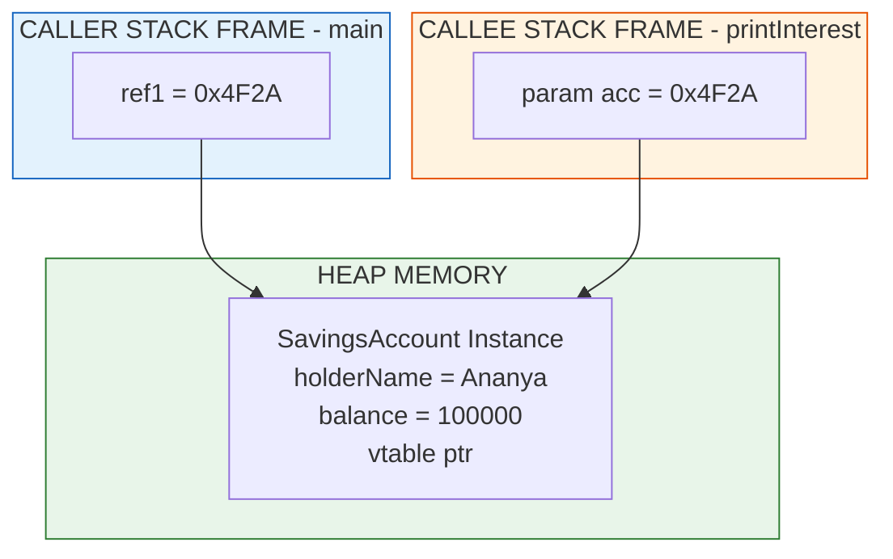
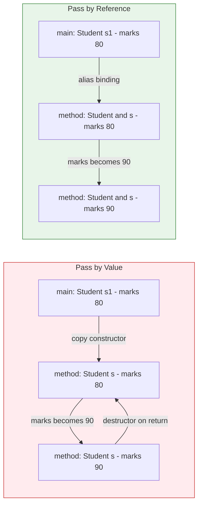
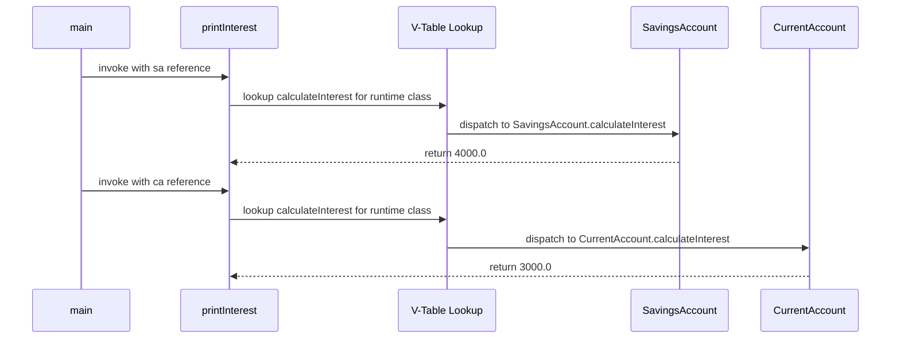
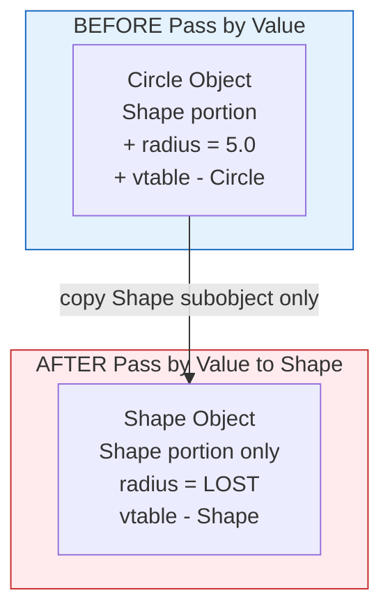
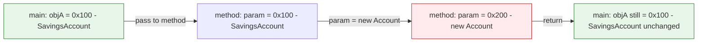

# Using Objects as Parameters

<!-- SECTION_1_START -->
# Using Objects as Parameters — Core Technical Definition & Intuitive Overview

> [!IMPORTANT]
> **KTU 2024 Scheme — Module 2 (Polymorphism) | PBCST304 | Course Outcome: CO2**
> This topic sits at the intersection of **data abstraction** and **polymorphic behaviour**, and is one of the highest-weightage concepts in the KTU End Semester Evaluation (ESE) for OOP.

## Formal Definition

In Object Oriented Programming, **passing an object as a parameter** refers to the mechanism by which an *instance of a class* (i.e., a fully constructed object residing in heap memory) is supplied as an *argument* to a method or constructor. Instead of passing primitive values (such as `int`, `float`, `char`), the method receives a *handle* to the object, allowing it to invoke the object's behaviours (methods) and access its encapsulated state (fields).

In **C++**, this can occur in three forms:
- **Pass by value** — a *bitwise copy* of the object is created on the method's stack frame.
- **Pass by reference** (`&`) — the method operates directly on the *original* object.
- **Pass by pointer** (`*`) — the method receives the *address* of the original object.

In **Java**, the mechanism is unique: objects are **pass by value of the reference**. The reference variable (which lives on the stack) is copied, but both the original and the copy point to the *same* object on the heap.

> [!NOTE]
> **KTU Board Terminology (verbatim):** *"When an object is passed as a parameter, the receiving function gets a reference to the same object, enabling polymorphic dispatch and shared-state manipulation."*

## Conceptual Analogy — The Restaurant Reservation Slip

Imagine you walk into a restaurant and hand over a **reservation slip** to the hostess.

- The slip itself is **not** your table — it is just a *piece of paper with a number* (the reference).
- Multiple hostesses can hold *copies* of the same slip, but they all point to the **same actual table** (the object on the heap).
- If the hostess writes a note on her slip saying *"change table to 7"*, that does **not** move you. But if she uses the slip to *modify the table itself* (e.g., adds a chair), then your seating experience is genuinely affected.
- The slip cannot, however, be handed to a completely different restaurant (type safety).

This is precisely how **object references** behave when passed as parameters in Java and C++ (by reference/pointer).

## Why This Matters in Polymorphism

Polymorphism — the ability of one interface to represent multiple underlying forms — is **mechanically impossible** without passing objects as parameters. When a method signature accepts a **base class reference**, any subclass instance can be supplied, and the **dynamic dispatch** mechanism (v-table lookup in C++, or virtual method invocation in Java) selects the correct overridden method at runtime.

## Visualizing the Mechanism

> [!VISUALIZATION CONTROL]
> **Concept:** Object reference traversal in the call stack vs the heap
> **GeoGebra / Desmos Input Equations:**
> * Point $P_1 = (1, 3)$ labelled *stackFrame:originalRef*
> * Point $P_2 = (4, 3)$ labelled *stackFrame:methodParam* (copy of reference)
> * Point $P_3 = (4, 7)$ labelled *heap:ObjectInstance* (actual object)
> * Arrow $P_1 \rightarrow P_3$ and arrow $P_2 \rightarrow P_3$ (both arrows converge to the same heap object)
> **Visual Description:** Two distinct points on the lower axis (representing the *call-stack reference variables*) both project arrows upward to a single common point (the *actual object* on the heap). This visualizes that even though we have two reference variables, they are aliases pointing to one underlying entity — the essence of "passing objects as parameters".

<!-- SECTION_1_END -->

<!-- SECTION_2_START -->
# Deep Theoretical Analysis & KTU High-Yield Formula Sheet

## 1. The Three Semantics of Passing Objects

When a KTU question states *"explain the different ways of passing objects as parameters"*, the examiner expects the following three-tier breakdown. Memorize this taxonomy — it appears in nearly every ESE paper.

| # | Mechanism | Language | What is Copied? | Effect on Original Object | When to Use |
|---|-----------|----------|-----------------|---------------------------|-------------|
| 1 | Pass by Value | C++ | The *entire object* is bitwise-copied | Changes inside the method **do not** affect the original | When the method needs a *local working copy* and safety from mutation |
| 2 | Pass by Reference | C++ (`Type &obj`) | Only the *reference* (a name alias) is bound | All modifications **directly affect** the original | When the method must *modify* the caller’s object or avoid expensive copies |
| 3 | Pass by Pointer | C++ (`Type *obj`) | The *address* is copied | All modifications through `->` **affect** the original | When `nullptr` is a valid sentinel or when working with C-style APIs |
| 4 | Pass by Value of Reference | Java | The *reference value* (memory address) is copied | State mutations **affect** the original; reassignment of the parameter does **not** | The default in Java; allows shared-state polymorphism |

> [!NOTE]
> **Critical Distinction (often tested):** In Java, reassigning the parameter (e.g., `obj = new Object()`) does **not** rebind the caller’s variable, because only the *local copy* of the reference is overwritten.

## 2. Memory & Execution Model

Let us define the runtime regions involved:

- **Stack Frame (Caller):** Holds the *reference variable* — a local pointer to the heap object.
- **Stack Frame (Callee / Method):** Holds either (a) a *full object copy* [C++ by value], or (b) *a reference / address* [C++ by ref, C++ by pointer, Java].
- **Heap:** The actual object instance, including its v-table pointer (in C++), fields, and inherited members.

For a method invocation `method(obj)` where `obj` is a reference:

$$\text{caller-stack}[obj] \;\xrightarrow{\;\text{copy of address}\;}\; \text{callee-stack}[param] \;\longrightarrow\; \text{heap}[\text{ObjectInstance}]$$

The **v-table pointer** inside `ObjectInstance` enables **dynamic polymorphism**: when `param->display()` is called, the v-table is consulted, and the *most-derived* override is executed.

## 3. The "Why" Behind the Design

- **Code Reuse:** A single `print(Shape s)` method can accept `Circle`, `Square`, or `Triangle` if they all inherit from `Shape`. Without object parameters, polymorphism collapses into rigid, type-specific function overloads.
- **Encapsulation Preservation:** The object's *internal invariants* are not exposed; only its public interface is used.
- **Dynamic Binding Enablement:** The object’s *runtime type* — not its declared compile-time type — determines which method runs.
- **Composition over Inheritance:** Many design patterns (Strategy, Observer, Decorator) rely fundamentally on accepting *behaviour-encapsulating objects* as parameters.

## 4. KTU Formula Sheet / Cheat Sheet

| Concept | Notation / Signature | Behaviour Summary | Board Trigger Phrase |
|---------|---------------------|-------------------|----------------------|
| C++ Pass by Value | `void f(Student s)` | Copy constructor invoked; destructor invoked on exit | *"A separate copy is created"* |
| C++ Pass by Reference | `void f(Student &s)` | No copy; operates on original | *"Reference acts as an alias"* |
| C++ Pass by Pointer | `void f(Student *s)` | Address is passed; must check for `nullptr` | *"Pointer may be null"* |
| C++ Pass by `const` Reference | `void f(const Student &s)` | Read-only alias; prevents modification | *"Efficient and safe"* |
| Java Object Parameter | `void f(Student s)` | Reference value copied; shared heap object | *"References are passed by value"* |
| Polymorphic Call | `shape->area()` | V-table lookup at runtime | *"Resolved at runtime"* |
| Static Call | `Shape::area(shape)` | Compile-time resolution | *"Resolved at compile time"* |
| Default Copy Assignment | `s2 = s1` | Member-wise copy in C++; reference copy in Java | *"Object slicing may occur"* |

> [!IMPORTANT]
> **Object Slicing Warning:** When a *derived* object is passed **by value** to a function expecting a *base* object, the derived portion is *sliced off*, destroying polymorphism. This is a classic KTU trap question. Use pass-by-reference or pass-by-pointer to base class to preserve the full object.

## 5. Real-World Engineering Utility

- **GUI Frameworks (JavaFX, Swing, Android):** Event listeners receive `EventObject` parameters.
- **STL Algorithms (C++):** `std::for_each(begin, end, functor)` — the functor is an *object passed as a parameter*.
- **Spring Framework (Java):** Dependency Injection injects managed *objects* into constructors and methods.
- **Game Engines (Unity/Unreal):** Collision callbacks receive `Collider` objects; render pipelines receive `Mesh` objects.
- **Database ORM (Hibernate):** `session.save(EntityObject)` — the entity object is the parameter, and its state is persisted.

<!-- SECTION_2_END -->

<!-- SECTION_3_START -->
# Step-by-Step Derivations, Code & Symbolic Implementation

## Example 1 — Java: Passing Objects for Polymorphic Behaviour

We will build a small banking system that demonstrates *object parameter passing with polymorphic dispatch*.

### Step 1: Define the Abstract Base Class

```java
// File: Account.java
public abstract class Account {
    protected String holderName;
    protected double balance;

    public Account(String holderName, double balance) {
        this.holderName = holderName;
        this.balance = balance;
    }

    // Abstract method — must be overridden by subclasses
    public abstract double calculateInterest();

    // Concrete method (inherited as-is unless overridden)
    public void displayDetails() {
        System.out.println("Holder: " + holderName);
        System.out.println("Balance: " + balance);
        System.out.println("Interest: " + calculateInterest());
    }
}
```

### Step 2: Define Two Concrete Subclasses

```java
// File: SavingsAccount.java
public class SavingsAccount extends Account {
    private static final double RATE = 0.04; // 4% per annum

    public SavingsAccount(String holderName, double balance) {
        super(holderName, balance);
    }

    @Override
    public double calculateInterest() {
        return this.balance * RATE;
    }
}
```

```java
// File: CurrentAccount.java
public class CurrentAccount extends Account {
    private static final double RATE = 0.02; // 2% per annum

    public CurrentAccount(String holderName, double balance) {
        super(holderName, balance);
    }

    @Override
    public double calculateInterest() {
        return this.balance * RATE;
    }
}
```

### Step 3: The Driver — Passing Objects as Parameters

```java
// File: BankApp.java
public class BankApp {

    // Polymorphic method — accepts ANY subclass of Account
    public static void printInterest(Account acc) {
        System.out.println("--- Processing Account ---");
        acc.displayDetails();          // virtual call — resolved at runtime
        System.out.println();
    }

    // Method that compares two Account objects (object-as-parameter, twice)
    public static Account richerAccount(Account a, Account b) {
        return (a.balance >= b.balance) ? a : b;
    }

    public static void main(String[] args) {
        SavingsAccount sa = new SavingsAccount("Ananya", 100000.0);
        CurrentAccount ca = new CurrentAccount("Rohan", 150000.0);

        // Passing objects as parameters
        printInterest(sa);   // sa reference copied into acc
        printInterest(ca);   // ca reference copied into acc

        // Passing two objects — returns one of them
        Account winner = richerAccount(sa, ca);
        System.out.println("Higher balance holder: " + winner.holderName);
    }
}
```

### Step-by-Step Execution Trace

1. `sa` is created on the heap; reference stored in main's stack frame.
2. `printInterest(sa)` is invoked. The reference value (e.g., `0x4F2A`) is *copied* into the `acc` parameter's stack slot.
3. Both `sa` and `acc` now point to the same heap object.
4. `acc.displayDetails()` triggers a *virtual call* — JVM inspects the object's runtime class (`SavingsAccount`), and dispatches `calculateInterest()` to the savings override.
5. The interest `100000 * 0.04 = 4000.0` is printed.
6. The same flow repeats for `ca`, yielding `150000 * 0.02 = 3000.0`.
7. `richerAccount(sa, ca)` receives two reference copies; compares `balance` fields; returns the larger reference.

### Expected Output

```
--- Processing Account ---
Holder: Ananya
Balance: 100000.0
Interest: 4000.0

--- Processing Account ---
Holder: Rohan
Balance: 150000.0
Interest: 3000.0

Higher balance holder: Rohan
```

---

## Example 2 — C++: All Three Passing Mechanisms Side-by-Side

```cpp
// File: student_record.cpp
#include <iostream>
#include <string>
using namespace std;

class Student {
public:
    string name;
    int    marks;

    Student(string n = "Unknown", int m = 0) : name(n), marks(m) {
        cout << "Constructor called for " << name << endl;
    }

    Student(const Student &other) : name(other.name), marks(other.marks) {
        cout << "COPY Constructor called for " << name << endl;
    }

    ~Student() {
        cout << "Destructor called for " << name << endl;
    }

    void display() const {
        cout << "Name: " << name << ", Marks: " << marks << endl;
    }
};

// 1. Pass BY VALUE — copy is made
void modifyByValue(Student s) {
    s.marks += 10;                 // modifies the COPY only
    cout << "[Inside modifyByValue]  ";
    s.display();
}

// 2. Pass BY REFERENCE — original is modified
void modifyByReference(Student &s) {
    s.marks += 10;                 // modifies the ORIGINAL
    cout << "[Inside modifyByReference]  ";
    s.display();
}

// 3. Pass BY POINTER — original modified via ->
void modifyByPointer(Student *s) {
    if (s == nullptr) {
        cout << "Null pointer received!" << endl;
        return;
    }
    s->marks += 10;                // modifies the ORIGINAL
    cout << "[Inside modifyByPointer]   ";
    s->display();
}

int main() {
    Student s1("Karthik", 80);

    cout << "\n--- Calling modifyByValue ---" << endl;
    modifyByValue(s1);
    cout << "After modifyByValue:  ";
    s1.display();   // marks still 80

    cout << "\n--- Calling modifyByReference ---" << endl;
    modifyByReference(s1);
    cout << "After modifyByReference:  ";
    s1.display();   // marks now 90

    cout << "\n--- Calling modifyByPointer ---" << endl;
    modifyByPointer(&s1);
    cout << "After modifyByPointer:  ";
    s1.display();   // marks now 100

    return 0;
}
```

### Step-by-Step Execution Trace

1. `s1` is constructed with `marks = 80`. Output: *Constructor called for Karthik*.
2. `modifyByValue(s1)` triggers the **copy constructor** — a new `Student` object is created on the method's stack frame with the same field values. The copy’s `marks` becomes 90. When the method returns, the copy's destructor runs.
3. The original `s1.marks` is still **80**.
4. `modifyByReference(s1)` binds `s` as an *alias* to `s1`. No copy is made. `s.marks` becomes 90 — and because `s` *is* `s1`, the original is now 90.
5. `modifyByPointer(&s1)` receives the *address* of `s1`. Through `->`, it modifies the original. `s1.marks` becomes 100.

### Final State of `s1.marks`

$$\text{Initial: } 80 \;\xrightarrow{\text{byValue (no effect)}}\; 80 \;\xrightarrow{\text{byRef}}\; 90 \;\xrightarrow{\text{byPtr}}\; 100$$

---

## Example 3 — Demonstrating Object Slicing (the Classic KTU Trap)

```cpp
#include <iostream>
using namespace std;

class Shape {
public:
    virtual void draw() { cout << "Drawing Shape" << endl; }
};

class Circle : public Shape {
public:
    double radius;
    Circle(double r) : radius(r) {}
    void draw() override { cout << "Drawing Circle of radius " << radius << endl; }
};

void processByValue(Shape s) {   // SLICING happens here
    s.draw();
}

void processByReference(Shape &s) {   // NO slicing
    s.draw();
}

int main() {
    Circle c(5.0);

    processByValue(c);       // Circle portion is sliced; Shape::draw() runs
    processByReference(c);   // Full object preserved; Circle::draw() runs
    return 0;
}
```

### Output

```
Drawing Shape
Drawing Circle of radius 5
```

> [!IMPORTANT]
> **The slicing phenomenon occurs because `processByValue(Shape s)` creates a `Shape`-sized buffer on the stack. Only the `Shape` sub-object of `c` is copied — the `radius` field is lost, and the v-table pointer is overwritten to point to `Shape::draw()`. To prevent slicing, always pass polymorphic objects by reference or by pointer.**

---

## Example 4 — Returning Objects from Methods

The reverse of *passing* is *returning*. Java and C++ both allow methods to return objects, completing the round-trip.

```java
// File: PointFactory.java
public class PointFactory {
    public static Point createPoint(int x, int y) {
        Point p = new Point(x, y);   // local object
        return p;                    // reference returned to caller
    }
}
```

In C++:

```cpp
Point createPoint(int x, int y) {
    Point p(x, y);
    return p;   // either NRVO applies, or move semantics engages
}
```

> [!NOTE]
> **NRVO (Named Return Value Optimization):** Modern C++ compilers elide the copy entirely, constructing the object *directly* in the caller's stack slot. This is a guaranteed copy-elision since C++17 in many cases.

<!-- SECTION_3_END -->

<!-- SECTION_4_START -->
# Structural Diagrams & Schematics

## Diagram 1 — Memory Model of Object Parameter Passing (Java-style)



> [!NOTE]
> **Observation:** Both `ref1` and `param` hold the *same numeric value* `0x4F2A`. They are *two names for the same pointer*. Mutating `OBJ` through one is observable through the other — this is the foundation of shared-state polymorphism.

---

## Diagram 2 — C++ Pass-by-Value vs Pass-by-Reference Memory Map



> [!IMPORTANT]
> **Read this diagram left to right.** In **Pass by Value** (red zone), a *new object* is created and destroyed. In **Pass by Reference** (green zone), there is **only one object** — the method's parameter is a *symbolic alias* for the original.

---

## Diagram 3 — Polymorphic Dispatch via Object Parameter



> [!NOTE]
> The *same* method `printInterest(Account acc)` produces *different behaviour* based on the *runtime type* of the object passed. This is **runtime polymorphism** in action, and it is only possible because objects — not just primitives — are passed as parameters.

---

## Diagram 4 — Object Slicing Visualization



> [!WARNING]
> **After slicing, the `Circle` portion is gone forever within the scope of the called method.** The original `c` in `main()` remains a full `Circle` — only the *copy* inside the method is sliced.

---

## Diagram 5 — Object Reference Reassignment in Java (The Subtle Trap)



> [!IMPORTANT]
> **Key Insight:** The reassignment `param = new Account()` changes only the *local copy* of the reference inside the method. The caller's `objA` still points to the original `0x100` object. This is why Java is described as *"pass by value of the reference"* — not pass by reference.

<!-- SECTION_4_END -->

<!-- SECTION_5_START -->
# KTU 2024 Scheme Examination Question Bank & Topic Recap

> [!NOTE]
> All questions are mapped to **Course Outcomes (CO2 — Apply OOP Principles)** and the Revised Bloom's Taxonomy cognitive levels typical of KTU ESE papers. Model answers follow the actual KTU valuation key pattern.

---

## Part A Questions (3 Marks Each)

### Question 1 — `[KTU University Exam — July 2024]`
**"What is meant by passing an object as a parameter? How is it different from passing a primitive variable in Java?"**

**Mapped:** CO2 | Bloom Level: **Remember / Understand** | Marks: 3

### Model Answer (Valuation Key)

**[Definition of object parameter — 1 Mark]**
Passing an object as a parameter means supplying an *instance of a class* to a method, allowing the method to invoke the object's methods and access its fields.

**[Difference from primitive — 2 Marks]**

| Aspect | Primitive Parameter | Object Parameter |
|--------|--------------------|--------------------|
| What is passed? | The *literal value* (e.g., `int 5`) | The *reference value* (memory address) |
| Storage | On the stack only | Reference on stack, object on heap |
| Modification effect | Local only | Affects the shared heap object |
| Default value | Language-defined (e.g., `0`, `false`) | `null` (for reference types) |

**Final concise answer statement [1 Mark]:** *"In Java, primitive parameters carry a copy of the value, while object parameters carry a copy of the reference, enabling shared-state manipulation."*

---

### Question 2 — `[KTU University Exam — Dec 2023]`
**"Explain object slicing with an example."**

**Mapped:** CO2 | Bloom Level: **Understand** | Marks: 3

### Model Answer

**[Definition — 1 Mark]:** Object slicing occurs in C++ when a derived class object is passed *by value* to a function expecting a base class object, causing the derived-class-specific members to be *"sliced off"* during the copy.

**[Example — 2 Marks]:**

```cpp
class Base { public: int x; };
class Derived : public Base { public: int y; };

void set(Base b) { b.x = 10; }   // y is sliced

int main() {
    Derived d;
    d.x = 1; d.y = 2;
    set(d);   // y is lost inside set()
}
```

After `set(d)`, the parameter `b` contains only the `x` field; the `y` field is sliced off.

---

## Part B Questions (14 Marks Each) — Module Internal Choice Pattern

### Question A (14 Marks) — `[KTU University Exam — July 2024]`

**"With suitable C++ programs, explain the different ways of passing objects as parameters to functions. Discuss the effect of each method on the original object with an example demonstrating object slicing."**

**Mapped:** CO2 | Bloom Levels: **Understand (a)** + **Apply (b)**

#### (a) Explain the Different Ways of Passing Objects in C++ [7 Marks]

**[Listing the three mechanisms — 2 Marks]**
1. Pass by value
2. Pass by reference
3. Pass by pointer

**[Pass by value — 2 Marks]**
A *bitwise copy* of the object is created in the callee's stack frame using the *copy constructor*. Modifications inside the method do *not* affect the original. The copy's *destructor* is invoked when the method returns.

**[Pass by reference — 1.5 Marks]**
The method parameter is bound as an *alias* to the original object. No copy is made, so modifications directly affect the caller’s object. Useful for large objects to avoid the overhead of copying.

**[Pass by pointer — 1.5 Marks]**
The method receives the *address* of the original object. The original can be modified through the `->` operator. Pointer parameters must be checked for `nullptr` before dereferencing.

#### (b) Demonstrate Object Slicing with a Program [7 Marks]

**[Program code — 4 Marks]**

```cpp
#include <iostream>
using namespace std;

class Animal {
public:
    virtual void sound() { cout << "Generic animal sound" << endl; }
};

class Dog : public Animal {
public:
    string breed;
    Dog(string b) : breed(b) {}
    void sound() override { cout << "Woof! I am a " << breed << endl; }
};

void makeSound(Animal a) {    // pass by VALUE — slicing
    a.sound();
}

int main() {
    Dog d("Labrador");
    makeSound(d);
    return 0;
}
```

**[Tracing the slicing — 2 Marks]**
When `makeSound(d)` is called, the `Dog` sub-object is copied into the `Animal`-sized parameter `a`. The `breed` field is sliced off, and the v-table pointer is rebound to `Animal::sound()`. The output is *"Generic animal sound"*, not the dog's actual sound.

**[Fix using reference — 1 Mark]**
Changing the signature to `void makeSound(Animal &a)` preserves the full object and outputs *"Woof! I am a Labrador"*.

---

### Question B (14 Marks) — Alternative Choice `[KTU University Exam — Dec 2023]`

**"Write a Java program to create a class `Shape` with an abstract method `area()`. Create subclasses `Circle` and `Rectangle`. Write a method that accepts Shape objects as parameters and displays their areas. Explain how polymorphism is achieved through object parameter passing."**

**Mapped:** CO2 | Bloom Levels: **Apply (a)** + **Analyze (b)**

#### (a) Java Program Implementing the Scenario [7 Marks]

**[Class declarations — 3 Marks]**

```java
abstract class Shape {
    public abstract double area();
}

class Circle extends Shape {
    private double radius;
    public Circle(double r) { this.radius = r; }
    @Override
    public double area() { return Math.PI * radius * radius; }
}

class Rectangle extends Shape {
    private double length, width;
    public Rectangle(double l, double w) { this.length = l; this.width = w; }
    @Override
    public double area() { return length * width; }
}
```

**[Driver class with object parameter — 4 Marks]**

```java
public class ShapeDemo {

    public static void printArea(Shape s) {   // polymorphic parameter
        System.out.println("Area = " + s.area());
    }

    public static Shape largerArea(Shape a, Shape b) {
        return (a.area() >= b.area()) ? a : b;
    }

    public static void main(String[] args) {
        Shape c = new Circle(5.0);
        Shape r = new Rectangle(4.0, 6.0);

        printArea(c);                  // 78.5398...
        printArea(r);                  // 24.0

        Shape winner = largerArea(c, r);
        System.out.println("Larger area shape's area = " + winner.area());
    }
}
```

#### (b) Explanation of Polymorphism via Object Parameters [7 Marks]

**[Mechanism explanation — 3 Marks]**
The method `printArea(Shape s)` declares its parameter as the *base* type `Shape`. When invoked with `Circle` or `Rectangle` objects, Java uses *dynamic method dispatch* — the JVM examines the *actual runtime class* of the object referred to by `s` and invokes the corresponding overridden `area()` method.

**[Why primitives cannot achieve this — 2 Marks]**
If we passed `int choice` and used a `switch` to call `circle.area()` or `rectangle.area()`, the code would be *type-coupled* and would not scale. Object parameters allow the *type system itself* to perform the dispatch.

**[Real-world analogy — 2 Marks]**
Consider a postal worker who delivers a parcel without knowing what is inside. The *envelope* (the base-class reference) is uniform, but the *contents* (the actual subclass object) determine what happens when the recipient opens it. The postal worker does not need a different procedure for each parcel type.

---

## KTU Examiner's Valuation Warning / Pitfall Callout

> [!WARNING]
> **Where students lose marks on this topic — KTU 2022–2024 trend analysis:**
> 1. **Confusing *"pass by reference"* in C++ with Java's mechanism.** Java is *not* pass-by-reference; it is *pass by value of the reference*. [−2 Marks penalty observed in Dec 2022 paper]
> 2. **Forgetting to declare `virtual`** in the C++ base class destructor and methods. Without `virtual`, dynamic dispatch collapses to static binding, and the *"polymorphism"* claim becomes false. [−2 Marks]
> 3. **Writing `Shape s = new Circle()` in Java** — this is a *compilation error*. Use `Shape s = new Circle();` (upcasting is implicit, the parentheses are part of the constructor call). [−1 Mark]
> 4. **Not mentioning object slicing** when the question asks *"different ways of passing"*. Many students miss this entirely. [−3 Marks]
> 5. **Failing to differentiate** between *modifying the object's state* (allowed in Java) and *reassigning the parameter* (does not propagate). [−2 Marks]
> 6. **Omitting the `nullptr` check** in C++ pointer-based methods. Examiners specifically look for this defensive practice. [−1 Mark]

---

## Topic Recap & Important Things to Remember

> [!IMPORTANT]
> **Rapid-Revision Checklist — KTU Module 2, Topic: Using Objects as Parameters**

- **Core Idea:** Methods can accept *objects* (not just primitives) as parameters, enabling shared-state access and polymorphic dispatch.
- **Three mechanisms in C++:**
  - *By value* — copy made, original safe.
  - *By reference* (`&`) — alias, original modifiable.
  - *By pointer* (`*`) — address passed, must guard against `nullptr`.
- **Java mechanism:** *Pass by value of the reference* — the reference is copied, but both copies point to the same heap object.
- **Reassignment in Java:** Changing the parameter's reference does *not* affect the caller's variable.
- **Polymorphism prerequisite:** Base-class reference + virtual method (C++) or abstract/override (Java) + derived-class object passed.
- **Object Slicing:** Occurs only on *pass by value* in C++ when a derived object is copied into a base-sized slot. The derived portion is lost.
- **Slicing prevention:** Use pass-by-reference (`const T &` for read-only, `T &` for modification) or pass-by-pointer.
- **`virtual` keyword in C++:** Enables dynamic dispatch via the v-table; without it, the *base* method runs even when a *derived* object is passed.
- **`@Override` in Java:** Compiler-enforced check that a method actually overrides a superclass method.
- **Copy constructor invocation:** Triggered in C++ during pass-by-value and return-by-value of objects.
- **NRVO:** Modern C++ compilers may elide the copy in return-by-value scenarios (C++17 mandates it in some cases).
- **Memory regions involved:** Stack (references / copies) and Heap (actual object instance).
- **Real-world applications:** GUI event handlers, STL algorithms with functors, dependency injection frameworks, ORM persistence calls.
- **Common KTU signature pattern:** `void process(BaseClass &obj)` — this is the *canonical* polymorphic parameter signature.
- **Empty parameter behaviour:** In Java, `obj = null` inside a method does not affect the caller's reference.
- **`final` parameter (Java):** Prevents reassignment of the reference *inside* the method — a common best-practice annotation.
- **Defensive copy pattern:** In Java, use a *copy constructor* inside a setter to prevent external mutation: `this.field = new FieldType(other.field)`.
- **Composition link:** Passing objects as parameters is the *mechanical* enabler of composition-based designs (Strategy, Observer, Decorator).
- **Frequent exam framing:** *"Justify why pass-by-reference is preferred for polymorphic base-class parameters."* — Answer: *avoids slicing, avoids copy overhead, enables dynamic dispatch.*

<!-- SECTION_5_END -->
