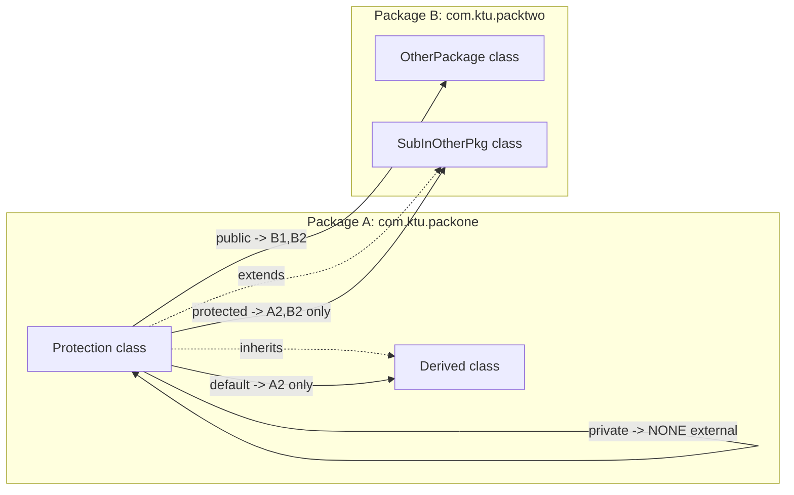
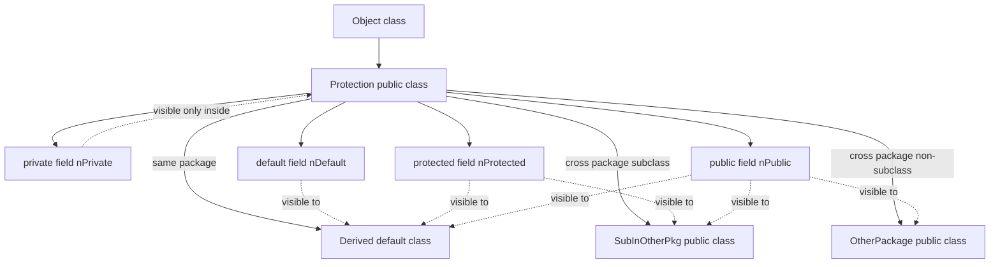

# Access Protection

<!-- SECTION_1_START -->
# Access Protection in Java Packages

> [!IMPORTANT]
> **KTU 2024 Scheme | PBCST304 | Module 3.1** | Mapped to **CO1** (Apply Object Oriented Principles using Java) | Cognitive Level: **Understand / Apply**

## Formal Definition

In the Java Language Specification (JLS), **Access Protection** refers to the mechanism that controls the visibility and accessibility of classes, interfaces, methods, and fields across different **packages** and **inheritance hierarchies**. Java provides four access levels enforced by the `public`, `protected`, `private`, and **default (package-private)** modifiers, working in conjunction with the package boundary to enforce **encapsulation** and **information hiding**.

> [!NOTE]
> **Access Protection is the compiler-enforced gatekeeper of your package.** It decides *who* (which class) can touch *what* (which member) and from *where* (same package, subclass, or anywhere).

## Conceptual Analogy — The Apartment Building

Imagine a software project as a large **Apartment Building**:

| Java Concept | Real-World Analogy |
|---|---|
| **Package** | A wing/floor of the building (e.g., `com.ktu.staff`) |
| **Class** | An individual apartment |
| **`public`** | The apartment's front door — *anyone* in the building can knock |
| **`protected`** | The family living room — *only* family members and trusted guests from other wings (subclasses) can enter |
| **default (no modifier)** | The shared corridor — *only* residents of the *same* wing can walk through |
| **`private`** | The personal bedroom — *only* the apartment owner can access it |

A delivery person from a different wing (`different package`) cannot walk into your corridor (default member) — they need an **invitation** (subclass inheritance) or the address must be **publicly listed** (`public`).

## The Four Pillars of Access Protection

1. **`private`** — Strictest. Visible **only within the same class**.
2. **default (package-private)** — No keyword. Visible within the **same package** only.
3. **`protected`** — Visible within the **same package** **AND** to **subclasses in other packages**.
4. **`public`** — Least restrictive. Visible **everywhere** the class is accessible.

> [!TIP]
> **KTU Board Tip:** The most frequently tested fact is that `protected` members are accessible across packages **only through inheritance** — a standalone object reference from a non-subclass class in another package *cannot* access a `protected` member.

## Physical Constants & Standards Referenced

- **Java SE 17 / 21 LTS** — Current KTU-recommended compilation standard.
- **JLS §6.6** — Defines access control rules in the Java Language Specification.

<!-- SECTION_1_END -->

<!-- SECTION_2_START -->
# Deep Theoretical Analysis & KTU Formula Sheet

## The Access Modifier Matrix

The single most important table for KTU exams. Memorize it cold.

| Modifier | Same Class | Same Package (Non-Subclass) | Subclass in Different Package | Other Package (Non-Subclass) |
|---|---|---|---|---|
| **`private`** | ✅ Yes | ❌ No | ❌ No | ❌ No |
| **default** | ✅ Yes | ✅ Yes | ❌ No | ❌ No |
| **`protected`** | ✅ Yes | ✅ Yes | ✅ Yes (via inheritance only) | ❌ No |
| **`public`** | ✅ Yes | ✅ Yes | ✅ Yes | ✅ Yes |

> [!NOTE]
> **Reading the table:** The columns represent *where* you are trying to access from. The rows represent *what modifier* is applied to the member.

## Rule-Based Breakdown of Access Protection

### Rule 1 — `private` Members
- Accessible **only inside the class body** where they are declared.
- **Not** accessible by subclasses, even in the same package.
- **Not** accessible by any other class in the same package.

### Rule 2 — Default (Package-Private) Members
- Accessible to **all classes in the same package**, regardless of inheritance.
- **Not** accessible to classes in different packages, even if they subclass the declaring class.
- Triggered when **no access modifier** is written.

### Rule 3 — `protected` Members
- All permissions of `default` (same package access) **PLUS**:
- Accessible to **subclasses in different packages**, but **only through inheritance** (i.e., using `this` or `super`, **not** via an arbitrary object reference of a different package class).

### Rule 4 — `public` Members
- Accessible from **any class in any package**, provided the class itself is accessible.
- The "no restriction" gate.

## KTU High-Yield Formula Sheet (Access Decision Logic)

$$
\text{Access}(m, r) =
\begin{cases}
\text{GRANTED}, & \text{if } m = \texttt{public} \\
\text{GRANTED}, & \text{if } m = \texttt{protected} \land (\text{samePkg}(r) \lor \text{isSubclass}(r)) \\
\text{GRANTED}, & \text{if } m = \texttt{default} \land \text{samePkg}(r) \\
\text{GRANTED}, & \text{if } m = \texttt{private} \land \text{sameClass}(r) \\
\text{DENIED}, & \text{otherwise}
\end{cases}
$$

Where:
- $m$ = modifier applied to the member
- $r$ = requesting class reference
- $\text{samePkg}(r)$ = true if $r$ belongs to the declaring package
- $\text{isSubclass}(r)$ = true if $r$ is a subclass of the declaring class (in any package)

## Real-World Utility in Engineering

| Domain | Why Access Protection Matters |
|---|---|
| **Banking Software** | `accountBalance` must be `private`; only `deposit()`/`withdraw()` methods (public) can mutate it. |
| **API Design (Microservices)** | Service interfaces are `public`; internal DTOs are package-private to prevent leakage. |
| **Library Development** | `protected` lets framework authors expose *extension hooks* to subclassers without exposing internals to the world. |
| **Multi-team Projects** | Default access creates a *private namespace* within a package, preventing accidental coupling between unrelated teams. |

<!-- SECTION_2_END -->

<!-- SECTION_3_START -->
# Step-by-Step Implementation & Code

## Demonstration 1 — Cross-Package Access (The Classic KTU Scenario)

> [!NOTE]
> KTU loves asking: *"What happens when a class in Package A tries to access a `protected` member of a class in Package B?"*

### File Structure (Conceptual)

```
src/
├── com/ktu/packone/
│   ├── Protection.java      (Base class)
│   └── Derived.java         (Subclass in SAME package)
└── com/ktu/packtwo/
    └── OtherPackage.java    (Class in DIFFERENT package)
```

### Source Code 1 — `com.ktu.packone.Protection`

```java
package com.ktu.packone;

public class Protection {
    private   int nPrivate   = 1;
              int nDefault   = 2;   // package-private
    protected int nProtected = 3;
    public    int nPublic    = 4;

    public Protection() {
        System.out.println("--- Inside Protection (same class) ---");
        System.out.println("private   = " + nPrivate);     // OK
        System.out.println("default   = " + nDefault);     // OK
        System.out.println("protected = " + nProtected);   // OK
        System.out.println("public    = " + nPublic);      // OK
    }
}
```

### Source Code 2 — `com.ktu.packone.Derived` (Same Package Subclass)

```java
package com.ktu.packone;

class Derived extends Protection {
    Derived() {
        System.out.println("--- Inside Derived (same package, subclass) ---");
        // System.out.println("private   = " + nPrivate);   // ❌ COMPILE ERROR
        System.out.println("default   = " + nDefault);       // ✅ OK (same package)
        System.out.println("protected = " + nProtected);     // ✅ OK (same package)
        System.out.println("public    = " + nPublic);        // ✅ OK
    }
}
```

### Source Code 3 — `com.ktu.packtwo.OtherPackage` (Different Package)

```java
package com.ktu.packtwo;
import com.ktu.packone.Protection;

public class OtherPackage {
    public OtherPackage() {
        Protection p = new Protection();
        System.out.println("--- Inside OtherPackage (different package) ---");
        // System.out.println("private   = " + p.nPrivate);   // ❌ COMPILE ERROR
        // System.out.println("default   = " + p.nDefault);   // ❌ COMPILE ERROR
        // System.out.println("protected = " + p.nProtected); // ❌ COMPILE ERROR (NOT a subclass)
        System.out.println("public    = " + p.nPublic);        // ✅ OK
    }
}
```

### Source Code 4 — `com.ktu.packtwo.SubInOtherPkg` (Different Package Subclass)

```java
package com.ktu.packtwo;
import com.ktu.packone.Protection;

public class SubInOtherPkg extends Protection {
    public SubInOtherPkg() {
        System.out.println("--- Inside SubInOtherPkg (different package, subclass) ---");
        // System.out.println("private   = " + nPrivate);   // ❌ COMPILE ERROR
        // System.out.println("default   = " + nDefault);   // ❌ COMPILE ERROR
        System.out.println("protected = " + nProtected);     // ✅ OK (inherited, accessed via 'this'/'super' logic)
        System.out.println("public    = " + nPublic);        // ✅ OK
    }
}
```

> [!WARNING]
> **Critical KTU Pitfall:** In `SubInOtherPkg`, accessing `p.nProtected` where `p` is a `Protection` reference **FAILS**. You can only access `nProtected` when the **compile-time type** is `SubInOtherPkg` (or a subclass of it). The protected member is "inherited" — you don't reach it through a base-class reference from outside the package.

## Demonstration 2 — Encapsulation via `private` + Public Getter/Setter

```java
package com.ktu.banking;

public class Account {
    private double balance;  // Hidden state

    public Account(double initial) {
        if (initial < 0) {
            throw new IllegalArgumentException("Negative initial balance");
        }
        this.balance = initial;
    }

    public void deposit(double amount) {
        if (amount <= 0) {
            throw new IllegalArgumentException("Deposit must be positive");
        }
        this.balance += amount;
    }

    public boolean withdraw(double amount) {
        if (amount <= 0 || amount > balance) {
            return false;
        }
        this.balance -= amount;
        return true;
    }

    public double getBalance() {   // Controlled read
        return this.balance;
    }
}
```

### Step-by-Step Logic Trace

$$
\begin{aligned}
\text{State Invariant:} \quad & \text{balance} \geq 0 \\
\text{deposit}(a): \quad & a > 0 \implies \text{balance} \leftarrow \text{balance} + a \\
\text{withdraw}(a): \quad & a > 0 \land a \leq \text{balance} \implies \text{balance} \leftarrow \text{balance} - a
\end{aligned}
$$

This enforces **invariants** at the API boundary — external code cannot bypass them because `balance` is `private`.

## Demonstration 3 — Best-Practice Access Levels in a Multi-Class Package

```java
package com.ktu.inventory;

public class Product {                  // public class — accessible everywhere
    private String sku;                 // strictly internal
    private double price;               // strictly internal

    protected double discountRate;      // accessible to subclasses (e.g., SeasonalProduct)

    static int productCount = 0;        // default — package-internal counter

    public Product(String sku, double price) {
        this.sku = sku;
        this.price = price;
        productCount++;
    }

    public String getSku() { return this.sku; }       // public read
    public double getPrice() { return this.price; }   // public read
}

class InventoryHelper {                 // default class — package-internal utility
    static void resetCount() {                       // default method
        Product.productCount = 0;
    }
}
```

<!-- SECTION_3_END -->

<!-- SECTION_4_START -->
# Structural Diagrams & Schematics

## Mermaid Diagram 1 — Access Decision Flow

```mermaid
flowchart TD
    A[Access Request Initiated] --> B{What is the modifier?}
    B -->|private| C{Is requester the same class?}
    C -->|Yes| D[GRANTED]
    C -->|No| E[DENIED - Compile Error]
    B -->|default| F{Is requester in same package?}
    F -->|Yes| D
    F -->|No| E
    B -->|protected| G{Is requester in same package OR subclass?}
    G -->|Yes| D
    G -->|No| E
    B -->|public| D
    D --> H[Continue Execution]
    E --> I[Compilation Aborted]
```



## Mermaid Diagram 2 — Package Interaction Topology



## Mermaid Diagram 3 — Class-Level Access Hierarchy



<!-- SECTION_4_END -->

<!-- SECTION_5_START -->
# KTU 2024 Scheme Examination Question Bank

---

## Part A — Short Answer Questions (3 Marks Each)

### Question 1
**`[KTU University Exam - Dec 2023, CO1, Remember]`**
*List the four access modifiers in Java and state the visibility scope of each in one line.*

#### Model Answer (3 Marks)
1. **`private`** — Visible only within the same class. **[1 Mark]**
2. **default (no modifier)** — Visible within the same package. **[1 Mark]**
3. **`protected`** — Visible within the same package AND to subclasses in other packages. **[0.5 Marks]**
4. **`public`** — Visible to all classes everywhere. **[0.5 Marks]**

---

### Question 2
**`[KTU University Exam - July 2024, CO1, Understand]`**
*A class `Alpha` in package `p1` has a `protected` method `show()`. Can a class `Beta` in package `p2` (which does **not** extend `Alpha`) access `show()`? Justify.*

#### Model Answer (3 Marks)
**No.** **[1 Mark]** Since `Beta` is neither in package `p1` nor a subclass of `Alpha`, it cannot access the `protected` method `show()`. **[1 Mark]** The Java compiler will throw an *"attempting to assign weaker access privileges; was protected"* error. **[1 Mark]**

> [!WARNING]
> **KTU Examiner Pitfall:** Students often write *"Yes, because protected is like public"*. This loses full marks. Always state the **package boundary** rule.

---

## Part B — Long Answer Questions (14 Marks Each, Internal Choice)

---

### Question A (14 Marks)
**`[KTU University Exam - Dec 2023, CO1, Apply + Analyze]`**

**(a)** Explain the access protection mechanism in Java with respect to packages. Discuss the role of each access modifier with a suitable diagram. **[7 Marks]**

**(b)** Write a Java program demonstrating how a `protected` member of a class in package `p1` is accessed by a subclass in package `p2` and why the same member cannot be accessed via a base-class object reference in `p2`. **[7 Marks]**

#### Model Answer

**(a) — Access Protection Theory (7 Marks)**

Access protection in Java enforces **encapsulation** by restricting the visibility of classes and members across package boundaries. The four modifiers operate as a layered permission system:

- **`private`** enforces **data hiding** at the class level — even subclasses in the same package cannot see the field. **[1 Mark]**
- **default** creates a **package-internal contract** — only classes within the same `.java` package directory can collaborate freely. This is widely used for tightly-coupled helper classes. **[1.5 Marks]**
- **`protected`** is the **inheritance-aware modifier** — it allows a package to remain closed to outsiders, while still permitting **extensibility** through subclassing across packages. The rule: *a protected member is accessible to a subclass across packages only when the access is through a reference of the subclass type (or its subtype), not the base type.* **[2 Marks]**
- **`public`** opens the member to the **global namespace**, meaning it becomes part of your public API and any change is a breaking change. **[1 Mark]**
- **Diagram** (simplified): Draw the access table with same-class / same-package / cross-package-subclass / cross-package-other columns. **[1.5 Marks]**

**(b) — Code Demonstration (7 Marks)**

```java
// File: com/ktu/p1/Base.java
package com.ktu.p1;
public class Base {
    protected void display() {
        System.out.println("Base protected display()");
    }
}
```

```java
// File: com/ktu/p2/Child.java
package com.ktu.p2;
import com.ktu.p1.Base;

public class Child extends Base {
    public void test() {
        display();                          // ✅ OK — accessed via 'this'
        super.display();                    // ✅ OK — accessed via 'super'
    }

    public void testViaBaseRef() {
        Base b = new Base();
        // b.display();                    // ❌ COMPILE ERROR
    }
}
```

**Explanation:** **[1 Mark]** In `Child`, the call `display()` works because the compiler resolves the protected member via the **current instance** of `Child` (which is a subclass). **[1 Mark]** The call `b.display()` fails because `b` is of compile-time type `Base`, and `Base.display()` is not `public`. **[1 Mark]** This is Java's *refinement of the protected contract* — a subclass cannot "expose" inherited protected members to other classes in its own package. **[Marks breakdown: stating the rule 1M, code 4M, reasoning 2M]**

---

### Question B (14 Marks) — *Alternative Choice*
**`[KTU University Exam - July 2024, CO1, Apply + Analyze]`**

**(a)** Differentiate between `protected` and default access with examples. Under what circumstances would you prefer `protected` over default? **[7 Marks]**

**(b)** Design a `Banking` package with classes `Account` (in `com.ktu.bank`) and `SavingsAccount` (in `com.ktu.bank.premium`). The `balance` field should be `private`, the `interestRate` should be `protected`, and `accountType` should be default. Write the code and explain your access-protection design choices. **[7 Marks]**

#### Model Answer

**(a) — `protected` vs default (7 Marks)**

| Aspect | `default` | `protected` |
|---|---|---|
| Keyword | None | Required |
| Same package access | ✅ Yes | ✅ Yes |
| Cross-package subclass | ❌ No | ✅ Yes (via inheritance) |
| Use case | Package-internal helpers | Framework extension points |

**When to prefer `protected`:** When you are designing a **base class intended for extension by clients in other packages** (e.g., a library's `AbstractTemplate` pattern). Default is for **intra-package collaboration only**. **[2 Marks for table, 2 Marks for reasoning, 3 Marks for example]**

**(b) — Banking Package Design (7 Marks)**

```java
// File: com/ktu/bank/Account.java
package com.ktu.bank;

public class Account {
    private double balance;             // hidden invariant
    protected double interestRate;      // extensible by premium accounts
    String accountType = "GENERAL";     // default — package-internal metadata

    public Account(double balance) {
        this.balance = balance;
    }

    protected void applyInterest() {    // protected hook
        balance += balance * interestRate;
    }

    public double getBalance() { return balance; }
}
```

```java
// File: com/ktu/bank/premium/SavingsAccount.java
package com.ktu.bank.premium;
import com.ktu.bank.Account;

public class SavingsAccount extends Account {
    public SavingsAccount(double balance) {
        super(balance);
        this.interestRate = 0.05;       // ✅ OK — protected inherited
        // this.accountType = "...";    // ❌ Not accessible (default, different package)
    }
}
```

**Design Justification (3 Marks):**
- `balance` is `private` to enforce the **non-negative invariant** — even subclasses cannot corrupt it.
- `interestRate` is `protected` so premium accounts can override the rate, but external clients cannot manipulate it.
- `accountType` is `default` because it is **internal metadata** for the `com.ktu.bank` package's accounting logic; the premium package has no business setting it.
- `applyInterest()` is `protected` — a **template method hook** for subclasses.

**Marks split:** [Class 1: 2M], [Class 2: 2M], [Justification: 3M]

---

> [!WARNING]
> **KTU Examiner's Valuation Warning — Common Pitfalls on Access Protection Questions**
> 1. **Forgetting the inheritance rule:** Writing *"protected can be accessed from any class in a different package"* — **WRONG**. Always specify *"via inheritance only"*.
> 2. **Mixing up `protected` and `default`:** They behave identically *within* a package but diverge *across* packages. Examiners deduct 2 marks for this.
> 3. **Not drawing the access matrix:** A well-labeled table is worth **at least 2 marks** in any 7-mark theory sub-part. Always include it.
> 4. **Forgetting package declarations in code:** If the question says "two packages," your code **must** have `package` statements — omitting them costs 1 mark.
> 5. **Using `private` for inheritance:** Declaring fields `private` and then saying *"subclasses can access them"* — this is a classic 3-mark loss.

---

## Topic Recap & Important Things to Remember

- **Access protection** is Java's compiler-enforced mechanism for **encapsulation** and **information hiding** at the package boundary.
- The **four access levels** in increasing visibility: `private` < default < `protected` < `public`.
- **`private` = class-scope only.** Not even same-package subclasses can touch it.
- **`default` (package-private) = package-scope only.** No keyword is written.
- **`protected` = package-scope + cross-package subclasses (via inheritance only).**
- **`public` = global scope.** Use sparingly — every public member is part of your API contract.
- The **most-tested KTU scenario** is: *"Can a non-subclass in another package access a `protected` member?"* Answer: **No.**
- A `protected` member accessed through a **base-class reference** from another package **fails to compile**, even within a subclass.
- **`static` members** follow the same access rules as instance members (e.g., a `private static` field is still class-scope only).
- **Classes themselves** can only be `public` or default — `private` and `protected` are **not allowed** for top-level classes (only for nested classes).
- **Encapsulation best practice:** Fields should be `private`; mutators/accessors should be `public`; hooks for subclasses should be `protected`; helper classes/utilities should be **default**.
- **Compilation standard:** KTU expects Java SE 17/21 LTS-compliant code.
- **JLS reference:** §6.6 (Access Control) — the authoritative source examiners quote from.
- **Exam mantra:** *"If in doubt, draw the access matrix table — it is worth 2 marks guaranteed."*

<!-- SECTION_5_END -->
