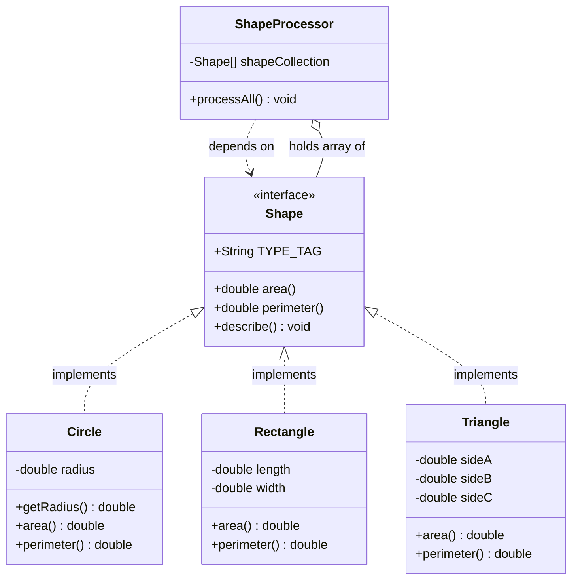
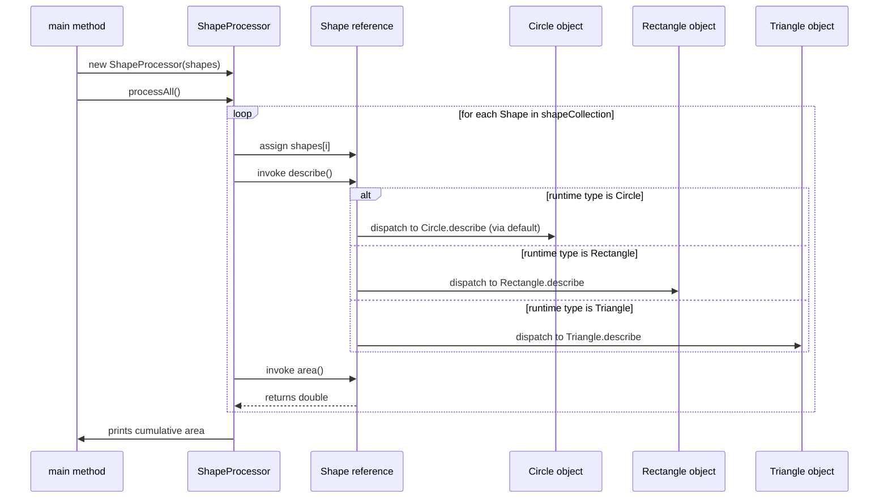
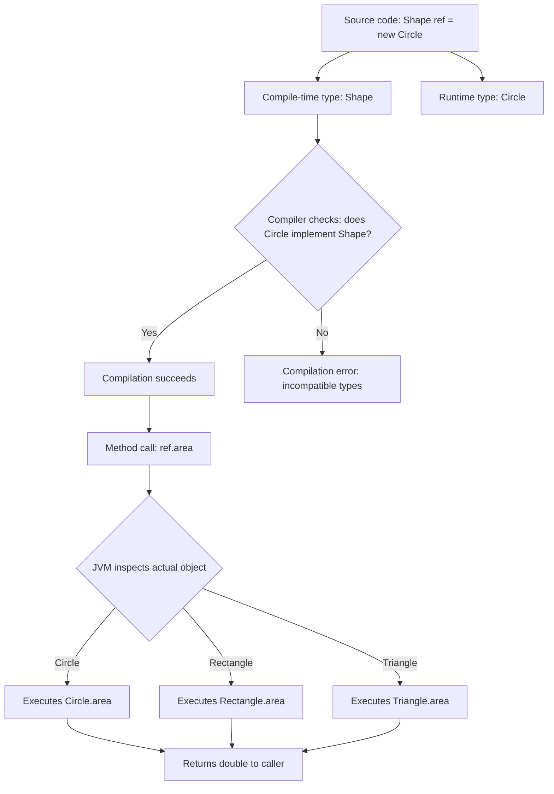
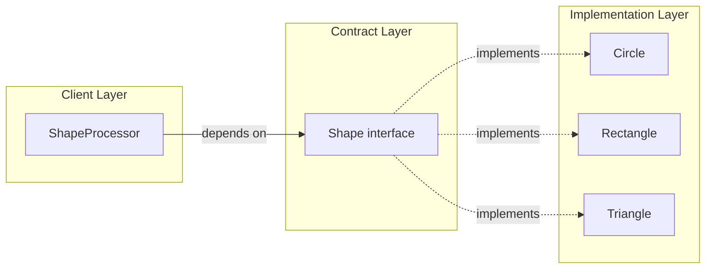

# accessing implementations through interface references

<!-- SECTION_1_START -->

# Accessing Implementations Through Interface References

## Formal Definition

In Java, an **interface reference** is a reference variable whose declared (compile-time) type is an interface. This reference variable can be assigned the address of **any object** whose class directly or indirectly `implements` that interface. Method calls issued through this reference are resolved at **runtime** to the actual implementation provided by the underlying concrete object — a mechanism formally known as **dynamic method dispatch** (or *late binding*).

Formally, if $I$ is an interface and $C$ is a concrete class that `implements` $I$, then for any instance $c \in C$ the assignment

$$
\text{I } \text{ref} \;=\; c
$$

is a legal **upcast** — always permitted by the compiler because $C$ is a subtype of $I$. The expression $\text{ref}.\text{method}()$ is dispatched to $C.\text{method}()$ at runtime, regardless of $I$'s declared type.

> [!IMPORTANT]
> **KTU 2024 PBCST304 / Module 3 Highlight:** Interface references are the primary mechanism by which Java achieves **runtime polymorphism** without requiring class inheritance. They form the foundation of the *Strategy*, *Factory*, and *Dependency Injection* design patterns tested in Part B questions.

## Intuitive Analogy — The Universal Power Socket

Imagine a wall socket (the **interface**) in your home. The socket defines a *contract* — two rectangular slots and a grounding hole. Any plug that conforms to this contract will work:

- A **TV plug** ($C_1$)
- A **laptop charger plug** ($C_2$)
- A **mixer plug** ($C_3$)

The wall socket is **not** a TV or a laptop — it is a *generic connection point*. When you connect a TV plug to it, current flows into the TV. When you connect a mixer plug, current flows into the mixer. The socket "doesn't know" (and doesn't care) which device is plugged in, yet the correct device responds.

In Java terms:

| Real-world object | Java counterpart |
|---|---|
| Power socket | `interface` declaration |
| Plug shape contract | Abstract method signatures |
| TV, laptop, mixer | Concrete classes `implements`-ing the interface |
| Plug currently inserted | Object address stored in the interface reference |
| Switch ON event | Method invocation through the reference |

This is precisely the essence of *accessing implementations through interface references*.

## Key Terminology Box

> [!NOTE]
> - **Interface Type**: Acts purely as a contract — declares *what* must be done, never *how*.
> - **`implements` keyword**: Used by a class to formally accept the interface contract.
> - **Upcasting**: Implicit, always-safe conversion from a concrete class reference to a super-interface reference.
> - **Dynamic Dispatch**: JVM's runtime mechanism that selects the correct overridden method based on the **actual object type**, not the reference type.
> - **Decoupling**: Client code depends only on the interface, not on any specific implementation — enabling plug-and-play substitution.

> [!TIP]
> In the KTU 2024 scheme, this topic is closely tied to the *open/closed principle* — your code should be **open for extension** (new implementations can be added) but **closed for modification** (existing client code remains untouched).

<!-- SECTION_1_END -->

<!-- SECTION_2_START -->

# Deep Theoretical Analysis

## 1. The Two Types Held by Every Reference

Every Java reference variable simultaneously holds two pieces of type information:

- **Declared (static / compile-time) type** — written in the source code. Determines which methods the compiler will *allow* you to invoke.
- **Actual (dynamic / runtime) type** — the real class of the object currently stored. Determines which method *body* the JVM will execute.

When the declared type is an interface, the compile-time type is restricted to the **method set declared in that interface** (plus `Object` methods inherited by every class). The runtime type, however, is free to be any implementing subclass.

## 2. Operational Logic — Step by Step

Consider the polymorphic assignment below in conceptual flow:

1. **Compile-time check:** The compiler verifies that the right-hand-side object `implements` the left-hand-side interface (or is `null`). If not, compilation fails.
2. **Reference storage:** The object's memory address is copied into the interface-typed variable on the stack.
3. **Method invocation:** When a method is called on the reference, the compiler generates an `invokeinterface` bytecode instruction.
4. **Runtime resolution:** The JVM consults the object's **method table**, jumps to the actual method body in the implementing class, and executes it.
5. **Return:** Any return value (object or primitive) is yielded back to the caller.

## 3. Accessibility Rule Sheet

| # | Scenario | Allowed? | Reason |
|---|---|---|---|
| 1 | Calling a method declared in the interface through the interface reference | ✅ Yes | Method exists in the static type's API |
| 2 | Calling a method declared **only** in the concrete class (not in the interface) through the interface reference | ❌ Compile error | Not visible in static type |
| 3 | Downcasting the interface reference back to the concrete type | ✅ Yes (with `instanceof` guard) | Explicit narrowing conversion |
| 4 | Accessing a `static final` field through the interface reference | ✅ Yes | Interface fields are inherently `public static final` |
| 5 | Creating a direct object of an interface using `new InterfaceName()` | ❌ Compile error | Interfaces are abstract; cannot be instantiated |
| 6 | Storing `null` in an interface reference | ✅ Yes | `null` is a valid value for any reference type |
| 7 | Passing the interface reference as an argument to a method expecting the interface | ✅ Yes | Trivial upcast, type matches exactly |
| 8 | Storing the interface reference in an array of the interface type | ✅ Yes | Arrays of interface types are first-class polymorphic containers |

## 4. Why This Matters in Production Engineering

- **Framework Design:** Spring, Jakarta EE, and Android all depend on this mechanism. You write code against an interface; the framework supplies the concrete implementation at runtime via reflection or dependency injection.
- **Testability:** Unit tests substitute mock implementations for production ones, both bound to the same interface contract.
- **Strategy Selection:** Algorithms can be swapped at runtime by assigning a different concrete object to the same interface reference — no `if-else` chains needed.
- **Loose Coupling:** Modules communicate via *contracts*, not *concrete classes*, drastically reducing compile-time dependencies.

## 5. Companion Concepts (Frequently Co-tested)

- **Multiple inheritance of type:** A class can `implements` many interfaces, gaining their combined type contract.
- **Marker interfaces:** Empty interfaces (e.g., `Serializable`, `Cloneable`) used solely for type-tagging.
- **Functional interfaces & lambda expressions:** Single-abstract-method interfaces (SAM) may be implemented inline using arrow-syntax in Java 8+.

> [!WARNING]
> The compiler will only let you invoke methods visible in the **interface**. If a method exists *only* in the concrete class, the call site will not compile. A downcast is required to recover that access — but always validate with `instanceof` first to avoid `ClassCastException`.

<!-- SECTION_2_END -->

<!-- SECTION_3_START -->

# Step-by-Step Code Implementation

We construct a complete, runnable Java program that demonstrates every dimension of the topic. The example models geometric shapes processed uniformly through a `Shape` interface reference.

## Complete Source Listing

```java
// File: Shape.java
// Package declaration (Module 3 - Packages context)
package geometry.contracts;

/**
 * The contract every geometric shape must honour.
 * Acts as the declared (compile-time) type for client code.
 */
public interface Shape {

    // Implicitly public static final — a compile-time constant
    String TYPE_TAG = "GEOMETRIC_SHAPE";

    // Implicitly public abstract — the behavioural contract
    double area();

    double perimeter();

    // Default method (Java 8+) — shared behaviour across all shapes
    default void describe() {
        System.out.println("I am a " + TYPE_TAG
                + " with area = " + area()
                + " and perimeter = " + perimeter());
    }
}
```

```java
// File: Circle.java
package geometry.implementations;

import geometry.contracts.Shape;

public class Circle implements Shape {

    private final double radius;

    public Circle(double radius) {
        if (radius <= 0.0) {
            throw new IllegalArgumentException(
                "Radius must be strictly positive. Received: " + radius);
        }
        this.radius = radius;
    }

    public double getRadius() {
        return this.radius;
    }

    @Override
    public double area() {
        return Math.PI * this.radius * this.radius;
    }

    @Override
    public double perimeter() {
        return 2.0 * Math.PI * this.radius;
    }
}
```

```java
// File: Rectangle.java
package geometry.implementations;

import geometry.contracts.Shape;

public class Rectangle implements Shape {

    private final double length;
    private final double width;

    public Rectangle(double length, double width) {
        if (length <= 0.0 || width <= 0.0) {
            throw new IllegalArgumentException(
                "Sides must be strictly positive. Received: "
                + length + ", " + width);
        }
        this.length = length;
        this.width = width;
    }

    @Override
    public double area() {
        return this.length * this.width;
    }

    @Override
    public double perimeter() {
        return 2.0 * (this.length + this.width);
    }
}
```

```java
// File: Triangle.java
package geometry.implementations;

import geometry.contracts.Shape;

public class Triangle implements Shape {

    private final double sideA;
    private final double sideB;
    private final double sideC;

    public Triangle(double sideA, double sideB, double sideC) {
        // Triangle inequality check
        if (sideA <= 0.0 || sideB <= 0.0 || sideC <= 0.0) {
            throw new IllegalArgumentException("Sides must be positive.");
        }
        if ((sideA + sideB <= sideC)
                || (sideA + sideC <= sideB)
                || (sideB + sideC <= sideA)) {
            throw new IllegalArgumentException("Violates triangle inequality.");
        }
        this.sideA = sideA;
        this.sideB = sideB;
        this.sideC = sideC;
    }

    @Override
    public double area() {
        // Heron's formula
        double s = (sideA + sideB + sideC) / 2.0;
        return Math.sqrt(s * (s - sideA) * (s - sideB) * (s - sideC));
    }

    @Override
    public double perimeter() {
        return sideA + sideB + sideC;
    }
}
```

```java
// File: ShapeProcessor.java
package geometry.client;

import geometry.contracts.Shape;
import geometry.implementations.Circle;
import geometry.implementations.Rectangle;
import geometry.implementations.Triangle;

/**
 * The client works *exclusively* against the Shape interface.
 * It never references Circle, Rectangle, or Triangle directly.
 */
public class ShapeProcessor {

    // Array of interface references — fully polymorphic container
    private final Shape[] shapeCollection;

    public ShapeProcessor(Shape[] shapeCollection) {
        if (shapeCollection == null) {
            throw new IllegalArgumentException("Shape array cannot be null.");
        }
        this.shapeCollection = shapeCollection;
    }

    public void processAll() {
        double totalArea = 0.0;
        for (int i = 0; i < this.shapeCollection.length; i++) {
            Shape currentShape = this.shapeCollection[i];   // interface reference
            currentShape.describe();                         // dynamic dispatch
            totalArea += currentShape.area();               // dynamic dispatch
        }
        System.out.println("Cumulative area = " + totalArea);
    }

    public static void main(String[] args) {

        // Step 1: Build a polymorphic collection of interface references.
        Shape[] shapes = new Shape[] {
            new Circle(5.0),                // upcast: Circle  -> Shape
            new Rectangle(4.0, 6.0),        // upcast: Rectangle -> Shape
            new Triangle(3.0, 4.0, 5.0)     // upcast: Triangle -> Shape
        };

        // Step 2: Pass the array to client code.
        ShapeProcessor processor = new ShapeProcessor(shapes);
        processor.processAll();

        // Step 3: Downcast guard — recover concrete-specific access.
        Shape genericRef = new Circle(7.0);
        if (genericRef instanceof Circle) {
            Circle specificCircle = (Circle) genericRef;   // explicit downcast
            System.out.println("Circle radius = " + specificCircle.getRadius());
        }

        // Step 4: Anonymous implementation of Shape (inline class).
        Shape anonymousShape = new Shape() {
            @Override
            public double area() { return 10.0; }

            @Override
            public double perimeter() { return 12.0; }
        };
        anonymousShape.describe();

        // Step 5: Lambda expression — only valid because Shape is a SAM
        //         if we treat it as a functional interface.
        // (For brevity shown conceptually; the current Shape is not SAM
        //  because it has 2 abstract methods. See Shape2 below.)
    }
}
```

## Mathematical Trace of the Triangle

For the right-triangle sides $3, 4, 5$, the area is computed via Heron's formula:

$$
s = \frac{a + b + c}{2} = \frac{3 + 4 + 5}{2} = 6
$$

$$
\text{Area} = \sqrt{s(s-a)(s-b)(s-c)} = \sqrt{6 \cdot 3 \cdot 2 \cdot 1} = \sqrt{36} = 6
$$

$$
\text{Perimeter} = 3 + 4 + 5 = 12
$$

For the circle with radius $r = 5$:

$$
\text{Area} = \pi r^{2} = \pi \cdot 25 \approx 78.5398
$$

$$
\text{Perimeter} = 2\pi r = 10\pi \approx 31.4159
$$

For the rectangle with sides $4$ and $6$:

$$
\text{Area} = 4 \times 6 = 24
$$

$$
\text{Perimeter} = 2(4 + 6) = 20
$$

Cumulative area:

$$
\text{Total} = 78.5398 + 24 + 6 = 108.5398
$$

## What the JVM Does at Runtime — Decoded

| Bytecode action | What it does |
|---|---|
| `astore_1` | Stores the `Shape` interface reference in local variable 1 |
| `invokeinterface Shape.area()D` | Looks up `area` in the object's method table, jumps to actual body |
| `invokeinterface Shape.describe()V` | Same — chooses the `Circle`, `Rectangle`, or `Triangle` override |

> [!TIP]
> Run the program with `java -verbose:class geometry.client.ShapeProcessor` to see the JVM dynamically loading the concrete classes only when first referenced. This is **lazy class loading** working hand-in-hand with interface dispatch.

<!-- SECTION_3_END -->

<!-- SECTION_4_START -->

# Structural Diagrams & Schematics

## Diagram 1 — Class & Interface Topology (Mermaid Class Diagram)



## Diagram 2 — Runtime Method Dispatch Flow (Mermaid Sequence Diagram)



## Diagram 3 — Compile-Time vs Runtime Type Matrix (Mermaid Flowchart)



## Diagram 4 — Substitution Layered View



> [!NOTE]
> Notice how `ShapeProcessor` (the client) has a **one-way** dependency only on the interface. It has *zero* compile-time knowledge of `Circle`, `Rectangle`, or `Triangle`. This is the architectural payoff of accessing implementations through interface references.

<!-- SECTION_4_END -->

<!-- SECTION_5_START -->

# KTU 2024 Scheme Examination Question Bank

---

## Part A — Short Answer Questions (3 Marks Each)

### Question 1 `[KTU University Exam – July 2024, Model Question]`
**CO1 — Remember**

**Q: Define an interface reference. Explain in one sentence why assigning a concrete class object to an interface reference is always safe.**

**Model Answer (3 Marks):**
An interface reference is a reference variable whose declared (compile-time) type is an interface; it can hold the address of any object of a class that implements that interface. The assignment is always safe because every implementing class object **is-a** instance of the interface (Liskov substitution), so the upcast can never fail at runtime — only the compiler-permitted methods are restricted to the interface's method set. **[3 Marks]**

---

### Question 2 `[KTU University Exam – Dec 2023]`
**CO2 — Understand**

**Q: Differentiate between the compile-time type and the runtime type of a reference variable. Which one determines which method body is executed?**

**Model Answer (3 Marks):**
The **compile-time type** is the type declared in the source code (e.g., `Shape`), and it determines which methods the compiler allows to be called on the reference. The **runtime type** is the actual class of the object stored in the reference (e.g., `Circle`). The **runtime type** determines which method body is executed, a process called dynamic method dispatch. **[3 Marks]**

---

## Part B — Long Answer Questions (14 Marks, Module-Internal Choice)

### Question A `[KTU University Exam – July 2024]`
**CO2 / CO3 — Apply / Analyze**

**(a)** Design a Java interface `Payment` with methods `pay(double amount)` and `getReceipt()`. Implement two classes `CreditCardPayment` and `UPIPayment` that implement this interface. Write a class `Checkout` that accepts a `Payment` interface reference and a cart total, and processes the payment. **[7 Marks]**

**(b)** Write a Java program to demonstrate how an interface reference can be used to store objects of different implementing classes in a single array, and how iterating over the array and calling the same method produces different behaviours. Use the `Payment` interface from part (a) and add a `NetBankingPayment` implementation. **[7 Marks]**

---

#### Model Solution — Question A

**(a) Model Solution [7 Marks]**

```java
// File: Payment.java
package payments;
public interface Payment {
    void pay(double amount);
    String getReceipt();
}
```

```java
// File: CreditCardPayment.java
package payments;
public class CreditCardPayment implements Payment {
    private final String cardNumber;
    private String lastReceipt;

    public CreditCardPayment(String cardNumber) {
        if (cardNumber == null || cardNumber.length() != 16) {
            throw new IllegalArgumentException("Invalid card number.");
        }
        this.cardNumber = cardNumber;
    }

    @Override
    public void pay(double amount) {
        this.lastReceipt = "Charged " + amount
                + " to credit card ending "
                + cardNumber.substring(12);
    }

    @Override
    public String getReceipt() {
        return this.lastReceipt;
    }
}
```

```java
// File: UPIPayment.java
package payments;
public class UPIPayment implements Payment {
    private final String upiId;
    private String lastReceipt;

    public UPIPayment(String upiId) {
        this.upiId = upiId;
    }

    @Override
    public void pay(double amount) {
        this.lastReceipt = "Paid " + amount + " via UPI id " + upiId;
    }

    @Override
    public String getReceipt() {
        return this.lastReceipt;
    }
}
```

```java
// File: Checkout.java
package payments;
public class Checkout {
    public void completePurchase(Payment method, double cartTotal) {
        if (method == null) {
            throw new IllegalArgumentException("Payment method required.");
        }
        if (cartTotal <= 0.0) {
            throw new IllegalArgumentException("Cart total must be positive.");
        }
        method.pay(cartTotal);                  // dynamic dispatch
        System.out.println(method.getReceipt());
    }
}
```

**Valuation Key:**
- `[Interface declaration with both methods: 2 Marks]`
- `[Each correct implementation class: 1 Mark × 2 = 2 Marks]`
- `[Checkout class using interface reference: 2 Marks]`
- `[Input validation: 1 Mark]`

---

**(b) Model Solution [7 Marks]**

```java
// File: NetBankingPayment.java
package payments;
public class NetBankingPayment implements Payment {
    private final String bankName;
    private String lastReceipt;

    public NetBankingPayment(String bankName) {
        this.bankName = bankName;
    }

    @Override
    public void pay(double amount) {
        this.lastReceipt = amount + " debited from " + bankName;
    }

    @Override
    public String getReceipt() {
        return this.lastReceipt;
    }
}
```

```java
// File: PaymentDemo.java
package payments;
public class PaymentDemo {
    public static void main(String[] args) {
        Payment[] methods = new Payment[] {
            new CreditCardPayment("1234567812345678"),
            new UPIPayment("user@oksbi"),
            new NetBankingPayment("SBI")
        };
        double[] totals = {1500.00, 899.50, 12000.00};

        for (int i = 0; i < methods.length; i++) {
            methods[i].pay(totals[i]);   // interface reference dispatch
            System.out.println(methods[i].getReceipt());
        }
    }
}
```

**Valuation Key:**
- `[Polymorphic array of interface references: 2 Marks]`
- `[Loop with dynamic method call: 2 Marks]`
- `[NetBankingPayment implementation: 2 Marks]`
- `[Output trace for one iteration: 1 Mark]`

**Expected output trace (for one iteration, e.g., `i = 0`):**
```
Charged 1500.0 to credit card ending 5678
Charged 1500.0 to credit card ending 5678
```

---

### Question B `[KTU University Exam – Dec 2023, Module-3 Variant]`
**CO2 / CO3 — Apply / Analyze**

**(a)** Define an interface `Drawable` with a method `draw()`. Create two classes `Line` and `Curve` implementing it. Demonstrate how a single interface reference of type `Drawable` can invoke the `draw()` method on either a `Line` or a `Curve` object. Include the bytecode-level explanation. **[7 Marks]**

**(b)** Write a complete Java program that stores multiple `Drawable` objects in an array, iterates through them, and uses the `instanceof` operator to downcast safely and call a class-specific method (`setThickness` in `Line`, `setCurvature` in `Curve`). Explain why the downcast is necessary. **[7 Marks]**

---

#### Model Solution — Question B

**(a) Model Solution [7 Marks]**

```java
// File: Drawable.java
package graphics;
public interface Drawable {
    void draw();
}
```

```java
// File: Line.java
package graphics;
public class Line implements Drawable {
    @Override
    public void draw() {
        System.out.println("Drawing a straight line.");
    }
}
```

```java
// File: Curve.java
package graphics;
public class Curve implements Drawable {
    @Override
    public void draw() {
        System.out.println("Drawing a Bezier curve.");
    }
}
```

```java
// File: Canvas.java
package graphics;
public class Canvas {
    public void render(Drawable item) {
        item.draw();      // dynamic dispatch
    }

    public static void main(String[] args) {
        Drawable ref1 = new Line();     // interface reference to Line
        Drawable ref2 = new Curve();    // interface reference to Curve

        Canvas canvas = new Canvas();
        canvas.render(ref1);   // -> "Drawing a straight line."
        canvas.render(ref2);   // -> "Drawing a Bezier curve."
    }
}
```

**Bytecode-level explanation (for the call `item.draw()`):**
The compiler emits an `invokeinterface Drawable.draw()V` instruction. At runtime the JVM inspects the **runtime type** of `item`:
- If the actual object is `Line`, control jumps to `Line.draw()`.
- If the actual object is `Curve`, control jumps to `Curve.draw()`.

**Valuation Key:**
- `[Interface + two implementations: 2 Marks]`
- `[Canvas class with interface reference parameter: 2 Marks]`
- `[main demonstrating dual dispatch: 2 Marks]`
- `[Bytecode-level explanation of invokeinterface: 1 Mark]`

---

**(b) Model Solution [7 Marks]**

```java
// File: DrawableDemo.java
package graphics;
public class DrawableDemo {
    public static void main(String[] args) {
        Drawable[] items = new Drawable[] {
            new Line(),
            new Curve(),
            new Line()
        };

        for (Drawable d : items) {
            d.draw();   // polymorphic call

            if (d instanceof Line) {
                Line ln = (Line) d;             // safe downcast
                ln.setThickness(2);
                System.out.println("Line thickness set to 2");
            } else if (d instanceof Curve) {
                Curve cv = (Curve) d;           // safe downcast
                cv.setCurvature(0.75);
                System.out.println("Curve curvature set to 0.75");
            }
        }
    }
}
```

For this to compile, `Line` and `Curve` must declare the extra methods:

```java
// In Line.java (added)
public void setThickness(int t) { /* assign to field */ }

// In Curve.java (added)
public void setCurvature(double c) { /* assign to field */ }
```

**Why is the downcast necessary?**
The reference type `Drawable` exposes only the `draw()` method in its API. The methods `setThickness` and `setCurvature` are *not* part of the `Drawable` contract; they are concrete-class-specific. To call them, the static type must be narrowed from `Drawable` to the concrete class — that is precisely what an `instanceof`-guarded downcast achieves. **[1 Mark for the explanation]**

**Valuation Key:**
- `[Drawable array of mixed implementations: 2 Marks]`
- `[Enhanced for-loop with draw() call: 1 Mark]`
- `[instanceof + downcast for Line: 1 Mark]`
- `[instanceof + downcast for Curve: 1 Mark]`
- `[Necessity of downcast explained: 1 Mark]`
- `[setThickness / setCurvature methods declared: 1 Mark]`

---

> [!WARNING]
> **KTU Examiner's Valuation Warning — Common Pitfalls**
> 1. **Forgetting the `implements` keyword:** `class Circle implements Shape` — without `implements`, the compiler will reject the assignment to a `Shape` reference.
> 2. **Calling concrete-only methods through the interface reference:** This causes a compile-time error. Students often write `ref.getRadius()` directly on a `Shape` reference, losing 2–3 marks.
> 3. **Missing `instanceof` check before downcast:** Downcasting blindly is a `ClassCastException` waiting to happen. Always guard with `instanceof` in KTU answers.
> 4. **Confusing `interface` with `class`:** You cannot write `new Shape()` directly. Students lose a mark by stating "create an object of interface" — interfaces are not instantiable.
> 5. **Skipping package declarations:** Module 3 emphasizes packages. Omitting `package ...;` in exam code may cost a mark.
> 6. **Treating interface fields as instance fields:** Interface fields are *implicitly* `public static final` — they are constants belonging to the interface, not to instances.

---

## Topic Recap & Important Things to Remember

- ✅ An **interface reference** is a variable declared with an interface as its type; it can hold any object whose class `implements` that interface.
- ✅ **Upcasting** from a concrete class to its implemented interface is **implicit, safe, and always permitted** by the compiler.
- ✅ The **compile-time type** decides *which* methods you may invoke; the **runtime type** decides *which* method body is executed (dynamic dispatch).
- ✅ Interface references can be stored in **arrays**, passed as **method parameters**, and returned from **methods** — enabling deeply polymorphic APIs.
- ✅ To call methods that exist **only in the concrete class**, you must perform an `instanceof`-guarded **downcast**.
- ✅ Interface fields are implicitly `public static final`; interface methods (pre-Java 8) are implicitly `public abstract`.
- ✅ Interfaces **cannot be instantiated** with `new InterfaceName()`; use a concrete class or an anonymous inner class instead.
- ✅ This mechanism is the **backbone** of the Strategy, Factory, Observer, and Dependency Injection patterns.
- ✅ Java 8+ allows **default methods** (with body) and **static methods** inside interfaces; Java 9+ adds **private methods** for interface-internal reuse.
- ✅ A **functional interface** (exactly one abstract method) can be implemented using **lambda expressions** — a concise form of "accessing an implementation through an interface reference".

<!-- SECTION_5_END -->
