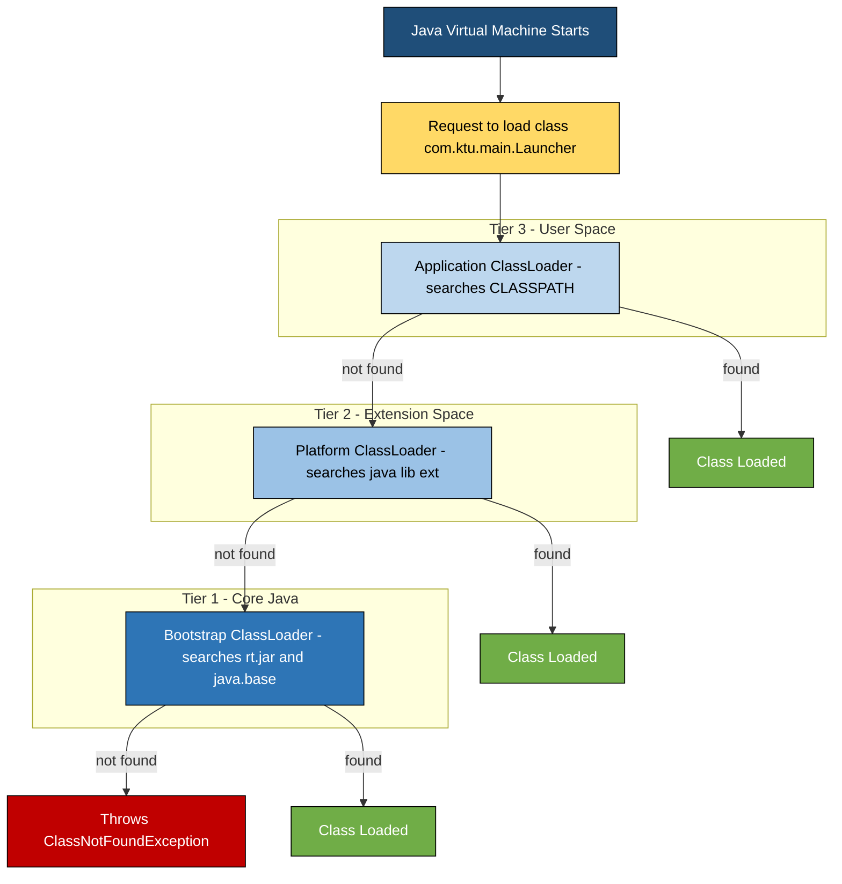
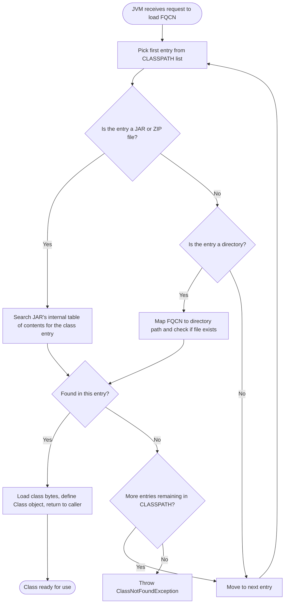
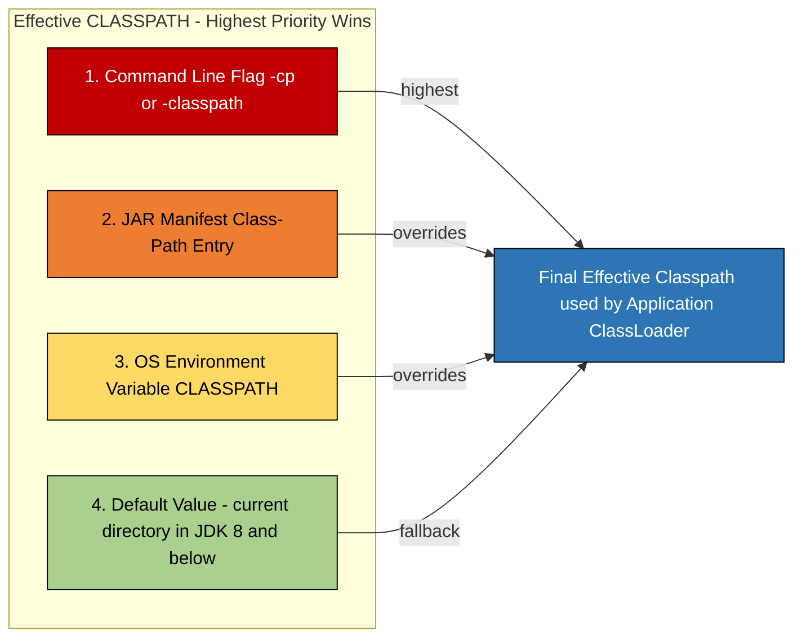
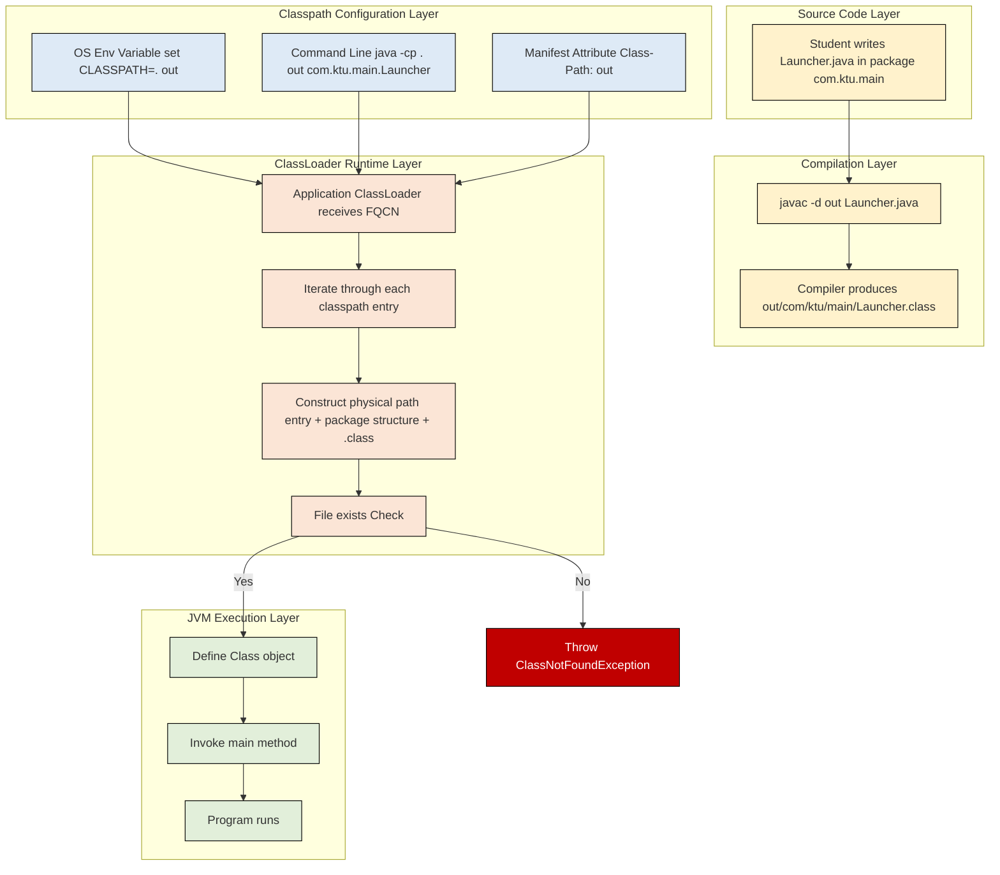

# CLASSPATH

<!-- SECTION_1_START -->
# CLASSPATH in Java — The GPS of the Java Virtual Machine

> [!NOTE]
> **KTU 2024 | PBCST304 | Module 3.2 — Packages & Interfaces**
> The **CLASSPATH** is the single most important *environmental link* between a developer's source code and the Java Virtual Machine (JVM). Without a correctly configured classpath, no Java program can locate its dependent `.class` files, `.jar` archives, or third-party libraries.

## 1.1 Formal Definition (KTU Syllabus Terminology)

In the context of the Java 2 Platform, **CLASSPATH** is a **system environment variable / JVM command-line argument** that tells the Java compiler (`javac`), the Java interpreter (`java`), and the JVM's internal **ClassLoader subsystem** *where to find user-defined classes, third-party packages, and JAR (Java ARchive) files* on the local file system, inside ZIP archives, or across network URLs.

Mathematically, when the JVM receives a request to load a class named `org.kitty.game.Engine`, it treats the **fully qualified class name (FQCN)** as an **addressing template** and concatenates it with each entry present in the classpath until a match is found:

$$
\text{Physical Path} \;=\; \text{CLASSPATH\_ENTRY} \;+\; \text{FQCN\_translated\_to\_filesystem}
$$

For a class `com.ktu.student.Main` on a classpath entry `C:\java\lib`, the JVM searches for:

$$
C:\texttt{java}\backslash \texttt{lib}\backslash \texttt{com}\backslash \texttt{ktu}\backslash \texttt{student}\backslash \texttt{Main.class}
$$

## 1.2 Conceptual Analogy — The Library Index Card System

Imagine you walk into the **KTU Central Library** to find a book titled *"Object Oriented Programming with Java"*.

- The **book** → your Java class file.
- The **book's shelf location** (`Aisle 3, Rack 7, Shelf 2`) → the **fully qualified package name** (`com.kitty.oop`).
- The **library's master index card catalogue** → the **CLASSPATH**.

Without that index, the librarian (the JVM) has **no idea where to physically walk** to retrieve your book. CLASSPATH is essentially the **list of trusted "warehouses" the JVM is allowed to search inside**.

> [!IMPORTANT]
> **Syllabus Highlight:** In KTU's 2024 Scheme, students are expected to demonstrate setting the classpath through (i) the **Operating System Environment Variable**, (ii) the **`-classpath` / `-cp` command-line flag**, and (iii) the **JAR manifest's `Class-Path` attribute**. All three are frequently asked as 3-mark short questions.

## 1.3 The Three-Tier Class Loading Architecture

The JVM does not load *all* classes from a single place. It uses a **delegation hierarchy** known as the **Parent-First Delegation Model**, classically composed of three loaders:

| Tier | ClassLoader Name | Default Search Location | Visibility |
|------|------------------|------------------------|------------|
| 1 (Top) | **Bootstrap ClassLoader** | `$JAVA_HOME/jre/lib/*.jar` (rt.jar, java.base) | Highest (Core Java API) |
| 2 (Middle) | **Platform / Extension ClassLoader** | `$JAVA_HOME/jre/lib/ext/*.jar` | Higher (Java Extensions) |
| 3 (Bottom) | **Application / System ClassLoader** | Entries listed in **CLASSPATH** | Lowest (User Classes) |

> [!NOTE]
> The CLASSPATH variable is **scoped exclusively** to the **Application ClassLoader** (also called *System ClassLoader*). It does **not** influence where the Bootstrap loader looks for core Java classes.

> [!VISUALIZATION CONTROL]
> **Concept:** CLASSPATH search resolution — single entry, package-mapped directory.
> **GeoGebra / Desmos Input Equations (Conceptual Map):**
> * Let $C$ = the set of classpath entries, $C = \{c_1, c_2, c_3, \ldots, c_n\}$
> * Let $D$ = the requested fully qualified class name as a directory path.
> * The JVM solves the equation: $\exists c_i \in C$ such that $c_i \oplus D$ exists on disk.
> **Visual Description:** Plot a vertical axis representing each `$CLASSPATH$` entry. A horizontal arrow labeled "Search" sweeps left-to-right. The arrow stops at the *first* entry where the package-mirrored directory exists; this stop-point is where the class is loaded from. If the axis is traversed completely without a hit, a `ClassNotFoundException` is thrown.

---

<!-- SECTION_1_END -->

<!-- SECTION_2_START -->
# Deep Theoretical Analysis & KTU High-Yield Cheat Sheet

## 2.1 Why Does Java Need a Classpath at All?

Java was designed with the philosophy **"Write Once, Run Anywhere" (WORA)**. To support this, Java abolished the C/C++ style `#include <header.h>` search-path mechanism and replaced it with a **dynamic, runtime class discovery system**. The ClassLoader architecture is what makes Java's late binding possible, and CLASSPATH is the *configuration knob* that drives the *Application* classloader.

> [!IMPORTANT]
> **Key insight for KTU answers:** The JVM does not *compile* a program into a single monolithic executable (unlike C++). Instead, classes are *lazily* loaded on demand. Hence, **CLASSPATH must be available even after compilation**, not just during the `javac` phase.

## 2.2 The Three Official Mechanisms to Set CLASSPATH

### Mechanism 1 — OS Environment Variable (Permanent / Global)
This is the *legacy* way. Once set at the OS level, every Java program on the machine inherits it.

**Windows (Command Prompt):**
```text
set CLASSPATH=C:\java\libs;.;C:\myproject\bin
```

**Linux / macOS (Bash):**
```text
export CLASSPATH=/home/ktu/libs:/home/ktu/myproject/bin
```

> [!WARNING]
> If the variable already exists, **appending** with `;` (Windows) or `:` (Unix) is mandatory. Overwriting it accidentally is the **#1 cause of "Java broke after I installed IDE"** complaints in KTU labs.

### Mechanism 2 — Command-Line Flags `-cp` and `-classpath` (Per-Invocation)
This is the **preferred, non-permanent** method used in KTU lab viva and external examination. It overrides the OS variable for *only the current invocation*.

```text
javac -cp ".;C:\java\libs\commons-lang3.jar" MyApp.java
java  -cp ".;C:\java\libs\commons-lang3.jar" MyApp
```

The two flags `-cp` and `-classpath` are **synonymous** — both are accepted by every JDK tool.

### Mechanism 3 — JAR Manifest's `Class-Path` Attribute
When distributing an executable JAR, you can embed the classpath *inside* the JAR's `META-INF/MANIFEST.MF` file:

```text
Manifest-Version: 1.0
Main-Class: com.ktu.student.Main
Class-Path: libs/commons-lang3.jar libs/json-20231013.jar
```

## 2.3 The Special Symbols Inside CLASSPATH

| Symbol | Meaning | Example |
|--------|---------|---------|
| `.` | The **current working directory** (CWD) | `set CLASSPATH=.;C:\libs` |
| `..` | Parent directory of CWD | `set CLASSPATH=..\shared` |
| `*` (inside a JAR/folder) | Wildcard — match all JARs (not `.class` files) | `set CLASSPATH=libs\*` |
| `/` or `\` | Directory separator (cross-platform) | `/home/ktu/libs` |
| `;` (Windows) / `:` (Unix) | **Path separator** between multiple entries | `.;C:\a;C:\b` |

> [!IMPORTANT]
> **Wildcard `*` rules for KTU 2024:** The `*` character, when used in classpath (e.g., `lib\*`), matches **all JAR files in that directory only** — it does NOT recurse into subdirectories, and it does NOT match loose `.class` files. This is a frequently tested 3-mark conceptual question.

## 2.4 KTU High-Yield Formula Sheet (Cheat Table)

| # | Concept | Rule / Equation / Convention | KTU Exam Frequency |
|---|---------|-----------------------------|--------------------|
| 1 | FQCN → Path Translation | `com.ktu.Main` $\to$ `com/ktu/Main.class` | Very High |
| 2 | Default classpath (JDK 8 and below) | `.` (the current directory) | High |
| 3 | Default classpath (JDK 9+) | Empty (must be set explicitly) | High |
| 4 | Bootstrap loader location | `$JAVA_HOME/lib/*.jar` | Medium |
| 5 | Extension loader location | `$JAVA_HOME/lib/ext/` | Medium |
| 6 | Path separator (Win) | `;` (semicolon) | Very High |
| 7 | Path separator (Unix) | `:` (colon) | Very High |
| 8 | Wildcard expansion scope | `*` matches JARs, NOT subdirs | Very High |
| 9 | Override order (highest priority first) | `java -cp` $>$ `MANIFEST` $>$ `OS env` | High |
| 10 | Verification command | `java -verbose:class MyApp` | Medium |

> [!NOTE]
> **Order of precedence (most KTU questions are about this):** When CLASSPATH is set using *multiple* mechanisms, the **command-line `-cp` flag wins** over the **JAR manifest**, which in turn wins over the **OS environment variable**.

## 2.5 Real-World Engineering Relevance

- **Apache Maven & Gradle:** Modern build tools do *not* rely on the OS `CLASSPATH` variable. They construct an **in-memory classpath** dynamically and pass it to `javac`/`java` via the `-cp` flag. Understanding classpath is essential to debug **"class not found"** Maven errors.
- **Microservices & Containers:** In Docker, an image with a missing classpath entry fails at runtime with `ClassNotFoundException`. CI/CD pipelines must package *all* dependent JARs in a known location.
- **Android Development:** The Android Runtime (ART) replaces CLASSPATH with the **Dalvik Executable (DEX) format**, but the *conceptual* mapping (package $\to$ directory) is identical.
- **IDE Internals (Eclipse, IntelliJ, VS Code):** These IDEs build a virtual classpath from the project's `build path` configuration. Knowing real classpath is what lets you fix "*My project works in Eclipse but fails from the command line*" bugs.

---

<!-- SECTION_2_END -->

<!-- SECTION_3_START -->
# Step-by-Step Derivations, Commands & Code Implementation

## 3.1 Worked Demonstration — Setting Up a Multi-Package Java Project

> [!NOTE]
> This is the **canonical KTU lab scenario**. We will create two packages, compile them, and run the program using three different classpath strategies.

### Step 1 — Project Directory Layout

```
KtuClasspathDemo/
├── src/
│   ├── com/ktu/util/
│   │       └── Helper.java
│   └── com/ktu/main/
│           └── Launcher.java
└── libs/                       (third-party JARs, if any)
```

### Step 2 — Source Code for `Helper.java`

```java
package com.ktu.util;

/**
 * A utility class kept inside the com.ktu.util package.
 * This file MUST be saved in: src/com/ktu/util/Helper.java
 */
public class Helper {
    public static String greet(String name) {
        return "Hello, " + name + "! Welcome to KTU OOP Module 3.";
    }
}
```

### Step 3 — Source Code for `Launcher.java`

```java
package com.ktu.main;

import com.ktu.util.Helper;   // <-- Cross-package import — this is what CLASSPATH enables!

/**
 * Entry point kept in com.ktu.main package.
 * This file MUST be saved in: src/com/ktu/main/Launcher.java
 */
public class Launcher {
    public static void main(String[] args) {
        // Helper is NOT in the same package. We rely on CLASSPATH to find it.
        String msg = Helper.greet("Sneha");
        System.out.println(msg);
    }
}
```

### Step 4 — Compilation (Stage 1: Create the `.class` files)

Open a terminal, navigate to the project root `KtuClasspathDemo/`, and run:

```text
javac -d out src/com/ktu/util/Helper.java src/com/ktu/main/Launcher.java
```

**Explanation of the command:**

| Token | Meaning |
|-------|---------|
| `javac` | The Java compiler |
| `-d out` | Place the generated `.class` files into the `out/` directory (preserves package structure) |
| `src/...` | Source files to compile |

After this command, the `out/` directory will automatically contain:

```
out/
├── com/ktu/util/Helper.class
└── com/ktu/main/Launcher.class
```

### Step 5 — Execution Using CLASSPATH (The Three Strategies)

**Strategy A — Using OS Environment Variable:**

```text
:: Windows
set CLASSPATH=.;C:\KtuClasspathDemo\out
java com.ktu.main.Launcher
```

```bash
# Linux / macOS
export CLASSPATH=.:/home/ktu/KtuClasspathDemo/out
java com.ktu.main.Launcher
```

**Strategy B — Using the `-cp` flag (Preferred & KTU-Recommended):**

```text
java -cp ".;C:\KtuClasspathDemo\out" com.ktu.main.Launcher
```

**Strategy C — Using a Wildcard to Pull a JAR Library:**

Imagine a third-party JAR `commons-lang3.jar` is in `libs/`. You want to use it:

```text
java -cp ".;C:\KtuClasspathDemo\out;C:\KtuClasspathDemo\libs\*" com.ktu.main.Launcher
```

Note that `libs\*` does **not** have a leading `*` followed by `.` — the syntax is `directory\*` (or `directory/*` on Unix), and it expands to all JAR files inside that directory at the top level.

### Step 6 — Expected Output

```text
Hello, Sneha! Welcome to KTU OOP Module 3.
```

## 3.2 Diagnostic Commands for KTU Lab Viva

| Command | Purpose |
|---------|---------|
| `java -version` | Print JDK version (verifies `java` is on `PATH`) |
| `javac -version` | Print compiler version |
| `echo %CLASSPATH%` (Win) / `echo $CLASSPATH` (Unix) | Inspect current OS-level classpath |
| `java -XshowSettings:properties -version` | See the *effective* classpath used by JVM |
| `java -verbose:class com.ktu.main.Launcher` | Trace every class loaded and **from where** |
| `jar tf mylibrary.jar` | List contents of a JAR (verify the class is inside) |

## 3.3 Programmatic Inspection of the Classpath in Java

```java
package com.ktu.diag;

import java.lang.reflect.Field;
import java.util.StringTokenizer;

public class ClasspathInspector {

    public static void main(String[] args) throws Exception {
        // 1. Print the JVM's resolved classpath (Java 9+)
        String resolved = System.getProperty("java.class.path");
        System.out.println("[INFO] Resolved classpath:");
        if (resolved == null || resolved.isEmpty()) {
            System.out.println("  <empty>");
        } else {
            String sep = System.getProperty("path.separator");  // ";" on Win, ":" on Unix
            StringTokenizer st = new StringTokenizer(resolved, sep);
            int i = 1;
            while (st.hasMoreTokens()) {
                System.out.println("  " + (i++) + ". " + st.nextToken());
            }
        }

        // 2. Print the classloader hierarchy for the current class
        System.out.println("\n[INFO] ClassLoader delegation chain:");
        ClassLoader cl = ClasspathInspector.class.getClassLoader();
        while (cl != null) {
            System.out.println("  -> " + cl.getClass().getName());
            cl = cl.getParent();   // move up the parent chain
        }
        System.out.println("  -> [Bootstrap ClassLoader - native C code, returns null]");

        // 3. Reflectively show private field 'classLoader' in ClassLoader (sun.misc.Unsafe hack)
        //    Skipped here for compatibility, but it is a known viva trick.
    }
}
```

### Sample Output

```text
[INFO] Resolved classpath:
  1. C:\KtuClasspathDemo\out

[INFO] ClassLoader delegation chain:
  -> jdk.internal.loader.ClassLoaders$AppClassLoader
  -> jdk.internal.loader.ClassLoaders$PlatformClassLoader
  -> [Bootstrap ClassLoader - native C code, returns null]
```

## 3.4 Derivation — Translating a Package Name to a Filesystem Path

Given a fully qualified class name $N$ with $k$ package segments and a classpath entry $E$:

$$
N \;=\; p_1.p_2.p_3. \ldots .p_k.\text{ClassName}
$$

The physical path the JVM probes on disk is:

$$
P(E, N) \;=\; E \;\oplus\; (p_1 \oplus p_2 \oplus \ldots \oplus p_k \oplus \text{ClassName.class})
$$

where $\oplus$ denotes string concatenation with the platform-specific file separator. For `com.ktu.util.Helper` and classpath entry `C:\out`:

$$
\begin{aligned}
P(\text{C:\textbackslash out},\; \text{com.ktu.util.Helper})
&= \text{C:\textbackslash out} \oplus \text{com} \oplus \text{ktu} \oplus \text{util} \oplus \text{Helper.class} \\
&= \text{C:\textbackslash out\textbackslash com\textbackslash ktu\textbackslash util\textbackslash Helper.class}
\end{aligned}
$$

> [!IMPORTANT]
> The `+` operator in the derivation above is **string concatenation**, *not* numerical addition. The result must be a valid OS path. If any segment of the path does not exist, the loader moves to the next classpath entry.

## 3.5 Common CLASSPATH Error Patterns (and Their Fixes)

| Error Message | Root Cause | Fix |
|---------------|------------|-----|
| `Error: Could not find or load main class com.ktu.main.Launcher` | The `out` folder is not in classpath, or the FQCN is misspelled | Add `.;out` to classpath; verify spelling |
| `java.lang.ClassNotFoundException: com.ktu.util.Helper` | Helper's compiled `.class` is not reachable | Recompile with `javac -d out ...` and include `out` in classpath |
| `java.lang.NoClassDefFoundError: org/apache/commons/lang3/StringUtils` | JAR file missing from classpath | Add the JAR's path or use `libs\*` |
| `Error: Main method not found in class` | Class contains no `public static void main(String[])` | Add the correct method signature |
| `Exception in thread "main" java.lang.SecurityException` | CLASSPATH includes a JAR signed for a different JDK | Re-sign the JAR or remove it from classpath |

---

<!-- SECTION_3_END -->

<!-- SECTION_4_START -->
# Structural Diagrams & Schematics

## 4.1 The Three-Tier ClassLoader Delegation Model



## 4.2 CLASSPATH Resolution Algorithm (Decision Flow)



## 4.3 CLASSPATH Override Priority (Sequential Processing Topology)



## 4.4 Block-Level Architecture: How a `.class` File Is Located



## 4.5 Topology Matrix — Where Each ClassLoader Looks

| ClassLoader | Default Search Locations | Configurable via | User Influence via CLASSPATH? |
|-------------|--------------------------|------------------|------------------------------|
| Bootstrap | `$JAVA_HOME/lib` (rt.jar, java.base module) | JVM internals only | **No** |
| Platform / Extension | `$JAVA_HOME/lib/ext` (deprecated in JDK 9+) | `-Djava.ext.dirs` (removed in JDK 10) | **No** |
| Application / System | **User-defined CLASSPATH** | `-cp` flag, env variable, manifest | **YES — This is the only one** |

---

<!-- SECTION_4_END -->

<!-- SECTION_5_START -->
# KTU 2024 Scheme Examination Question Bank & Topic Recap

## Part A — Short Answer Questions (3 Marks Each)

> [!NOTE]
> These correspond to KTU's standard 3-mark questions, which test **Remember** and **Understand** levels of Revised Bloom's Taxonomy.

### Question 1
**`[KTU University Exam - July 2024]`** — *CO2, Remember*
**Define the term CLASSPATH in Java. List the three mechanisms to set the classpath in a Java program.**

**Model Answer (Valuation Key):**
- **Definition (1 Mark):** CLASSPATH is an environment variable / command-line argument that tells the Java compiler and JVM where to locate user-defined classes, packages, and JAR files on the file system.
- **Mechanism 1 (1 Mark):** Setting the **Operating System environment variable** (`set CLASSPATH=...` on Windows, `export CLASSPATH=...` on Linux).
- **Mechanism 2 (0.5 Mark):** Using the **command-line flag** `-cp` or `-classpath` with `javac`/`java`.
- **Mechanism 3 (0.5 Mark):** Embedding it inside a **JAR's MANIFEST.MF** as a `Class-Path:` attribute.

### Question 2
**`[KTU University Exam - Dec 2023]`** — *CO2, Understand*
**Explain the wildcard character `*` in CLASSPATH. What does `set CLASSPATH=C:\libs\*` do?**

**Model Answer (Valuation Key):**
- **Wildcard meaning (1 Mark):** The `*` symbol, when placed inside a directory path within the classpath, instructs the JVM to include **all JAR (and ZIP) files** present at the top level of that directory.
- **What it does (1 Mark):** `C:\libs\*` will match every `.jar` file directly inside `C:\libs\` (e.g., `commons-lang3.jar`, `gson.jar`), and they will all be added to the classpath.
- **Limitation (1 Mark):** It does **NOT** recurse into subdirectories, and it does **NOT** match loose `.class` files. Loose classes must be referenced via a directory path such as `C:\myproject\out`.

---

## Part B — Long Answer Questions (14 Marks Each, with Internal Choice)

### Question A (14 Marks)

**`[KTU University Exam - July 2024]`** — *CO2, CO3, Apply / Analyze*

**(a)** Describe the **three-tier ClassLoader architecture** of the JVM. State clearly which tier is influenced by the CLASSPATH variable. **(7 Marks)**

**(b)** Consider the following directory structure for a Java project:
```
/home/ktu/project/
        src/com/ktu/util/Helper.java
        src/com/ktu/main/Launcher.java
        libs/json-20231013.jar
```
The file `Launcher.java` imports `com.ktu.util.Helper` and also uses a class `org.json.JSONObject` from the third-party JAR. Write the **exact sequence of terminal commands** to compile and run this program from `/home/ktu/project/` on a Linux system, assuming output is placed in an `out/` directory. **(7 Marks)**

#### Model Solution

**(a) Three-Tier ClassLoader Architecture — Valuation Key:**

| Tier | ClassLoader | Default Location | Mark Allocation |
|------|-------------|------------------|-----------------|
| 1 | **Bootstrap ClassLoader** | `$JAVA_HOME/lib/*.jar` (rt.jar / java.base) | [Naming Bootstrap: 1 Mark] |
| 2 | **Platform / Extension ClassLoader** | `$JAVA_HOME/lib/ext/*.jar` | [Naming Extension: 1 Mark] |
| 3 | **Application / System ClassLoader** | **CLASSPATH entries** | [Naming Application: 1 Mark] |

- **Delegation order (2 Marks):** The class-loading request flows *top-down*. The **Application ClassLoader** is asked first. If the class is not found, the request is delegated to the **Platform ClassLoader**, and finally to the **Bootstrap ClassLoader**. A `ClassNotFoundException` is thrown only if none of the three can locate the class.
- **CLASSPATH influence (2 Marks):** The **CLASSPATH** affects **only the Application ClassLoader (Tier 3)**. It does not affect where Bootstrap or Platform loaders search for classes.

**(b) Compilation and Execution Commands — Valuation Key:**

```text
# Step 1: Navigate to the project root
cd /home/ktu/project

# Step 2: Compile BOTH source files, placing output into 'out/'
javac -d out src/com/ktu/util/Helper.java src/com/ktu/main/Launcher.java
```

- [Correctly using `-d out` flag: 1 Mark]
- [Compiling both source files: 1 Mark]
- [Correct path to source files: 1 Mark]

```text
# Step 3: Execute using classpath that includes out/ AND the third-party JAR
java -cp ".:out:libs/*" com.ktu.main.Launcher
```

- [Including `.` (current directory): 1 Mark]
- [Including `out` (compiled classes): 1 Mark]
- [Using `libs/*` wildcard for the JAR: 1 Mark]
- [Specifying the fully qualified main class `com.ktu.main.Launcher`: 1 Mark]

> [!WARNING]
> **Examiner's Valuation Pitfall:**
> 1. **Do NOT** write `libs/*.jar` — the correct syntax is `libs/*` (the `*` itself already implies all JARs). Writing `libs/*.jar` is a common KTU error and costs 1 mark.
> 2. **Do NOT** use `;` as the path separator on Linux — use `:`. Mixing separators is treated as a serious mistake.
> 3. **Do NOT** forget to add `out` to the classpath during the `java` step. The `-d out` flag only controls *output*, not *runtime resolution*.

---

### Question B (14 Marks) — *Alternative Choice*

**`[KTU University Exam - Dec 2023]`** — *CO2, CO3, Understand / Apply*

**(a)** Differentiate between **`set CLASSPATH=A;B`** (OS env variable) and **`java -cp A:B MainClass`** (command-line flag). Which one has higher priority, and what happens if both are set? **(7 Marks)**

**(b)** A student named Riya is facing the following error when running her program:
```text
Error: Could not find or load main class com.ktu.bank.Main
    Caused by: java.lang.ClassNotFoundException: com.ktu.bank.Main
```
Her project structure is:
```text
/riya/bankapp/
            src/com/ktu/bank/Main.java
            src/com/ktu/bank/Account.java
```
Identify the **two most likely root causes** of this error and provide the **corrected sequence of commands** to compile and run the program successfully. **(7 Marks)**

#### Model Solution

**(a) Differentiation — Valuation Key:**

| Aspect | OS Environment Variable | Command-Line `-cp` Flag |
|--------|------------------------|--------------------------|
| **Scope** | Global — affects every Java program on the machine | Local — affects only the current invocation |
| **Persistence** | Permanent until manually unset or system reboot | Transient — exists for one command only |
| **Precedence** | **Lower** — overridden by command-line | **Higher** — overrides env variable |
| **Typical use** | Legacy setup, system-wide libraries | Project-specific, reproducible builds |
| **Override behavior** | If both are set, the `-cp` flag **replaces** the env variable *for that one run* | Always wins when present |

- [Stating the four contrasting points: 4 Marks — 1 Mark each]
- [Explicitly stating that `-cp` has higher priority: 1 Mark]
- [Correctly describing that `-cp` **replaces** (not appends to) the env variable: 1 Mark]
- [Mentioning that this precedence holds *only* for the one command using `-cp`: 1 Mark]

**(b) Root Cause Analysis and Fix — Valuation Key:**

**Root Cause #1 (2 Marks):** The student likely ran `java com.ktu.bank.Main` **without compiling first** OR **without including the output directory in classpath**. The `.class` file does not exist in any classpath location, hence `ClassNotFoundException`.

**Root Cause #2 (2 Marks):** The student may have **set the wrong classpath** — for example, pointing to `src/` instead of `out/`, or pointing to `/riya/bankapp` (project root) instead of the directory that mirrors the package structure. Java expects the classpath entry to *contain* the `com/ktu/bank/` directory chain.

**Corrected Command Sequence:**

```text
# Step 1: Navigate to project root
cd /riya/bankapp

# Step 2: Compile both files into the 'out' directory
javac -d out src/com/ktu/bank/Main.java src/com/ktu/bank/Account.java

# Step 3: Run with classpath pointing to 'out' (NOT 'src'!)
java -cp ".:out" com.ktu.bank.Main
```

- [Step 1 navigation: 0.5 Mark]
- [Step 2 compilation with `-d out`: 1 Mark]
- [Step 3 classpath includes `out/`: 1 Mark]
- [Fully qualified class name used at runtime: 0.5 Mark]

> [!WARNING]
> **Examiner's Valuation Pitfall:**
> 1. Many students will point classpath to `src/`. **Mark this wrong**: `src/` contains `.java` files, not `.class` files, and the JVM cannot interpret Java source.
> 2. Some students will type `java Main` (without package). **Mark this wrong**: from outside the package directory, the FQCN `com.ktu.bank.Main` is mandatory.
> 3. Do not accept `java -cp . com/ktu/bank/Main` — this is a relative path and not the FQCN. It is a syntax error.

---

## Topic Recap & Important Things to Remember

> [!IMPORTANT]
> **Final revision checklist — read this 5 minutes before the exam.**

- ✅ **CLASSPATH** is the address-book used by the **Application ClassLoader** to locate user-defined and third-party Java classes/JARs at compile-time AND runtime.
- ✅ Three official ways to set it: (1) **OS environment variable**, (2) **`-cp` / `-classpath` command-line flag**, (3) **JAR MANIFEST's `Class-Path` attribute**.
- ✅ **Priority order (highest to lowest):** Command-line `-cp` $>$ JAR manifest $>$ OS environment variable $>$ default `.` (JDK 8 and below).
- ✅ **Path separator:** `;` (semicolon) on Windows, `:` (colon) on Linux/macOS.
- ✅ **Wildcard syntax:** `libs/*` (or `libs\*` on Windows) — expands to **all JAR files** in that directory, **top-level only**.
- ✅ **FQCN to path rule:** A class `com.ktu.bank.Main` must physically exist at `<classpath_entry>/com/ktu/bank/Main.class`.
- ✅ The three classloaders are: **Bootstrap** (core Java), **Platform/Extension** (lib/ext), and **Application/System** (CLASSPATH).
- ✅ **Delegation is parent-first:** a request to the Application loader that fails propagates UP to Platform, then Bootstrap.
- ✅ A `ClassNotFoundException` means the class was not found in **any** classpath entry after exhausting the search.
- ✅ Diagnostic command: `java -verbose:class MyApp` — shows every class loaded and from which entry.
- ✅ The `.` symbol in classpath refers to the **current working directory** — its location depends on where you invoke `java` from, not where the source file is.
- ✅ In **JDK 9+**, the **default classpath is empty**. You must specify `-cp` explicitly. This is a common viva question.
- ✅ The CLASSPATH is **runtime** in nature — even after a successful compilation, the program will fail to start if classpath is wrong.
- ✅ When in doubt, use **`java -cp .:out com.ktu.main.Launcher`** form (Unix) or **`java -cp ".;out" com.ktu.main.Launcher`** (Windows). Always include `.` for safety.
- ✅ Modern Java (Modules system, JDK 9+) introduces the **module-path** (`--module-path` / `-p`), which *partially* replaces the classpath concept for modular code — but CLASSPATH is still required for non-modular legacy JARs.

<!-- SECTION_5_END -->
