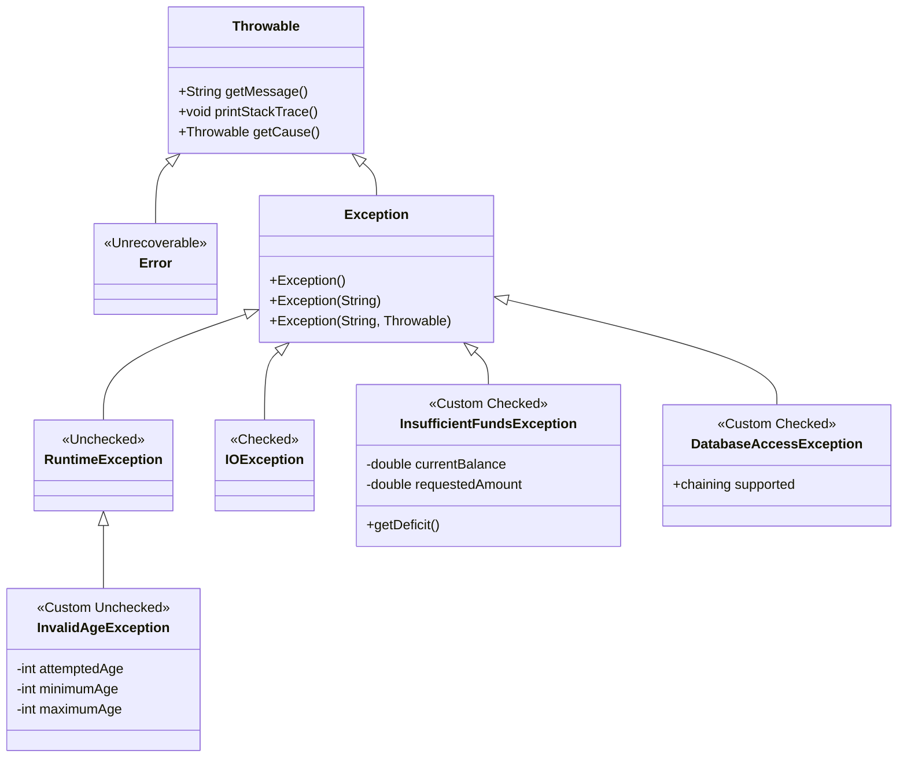
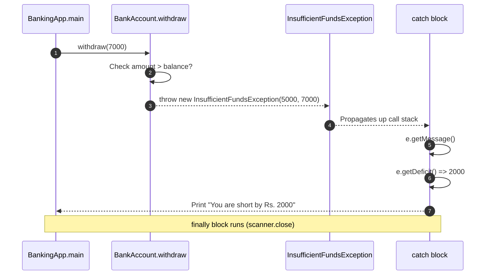
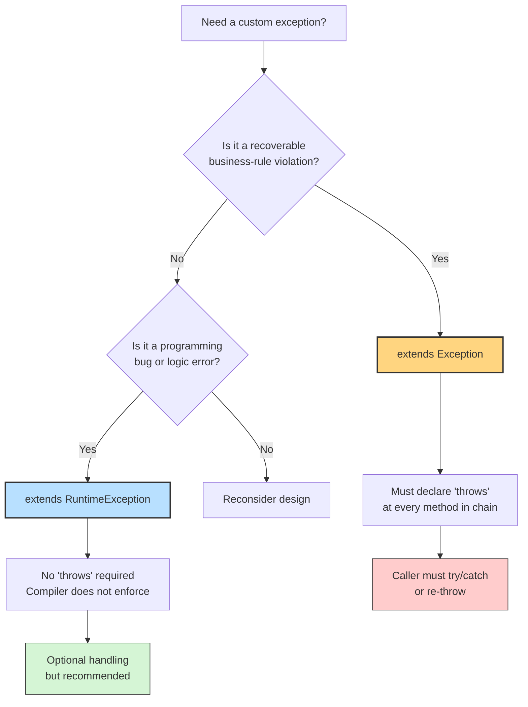
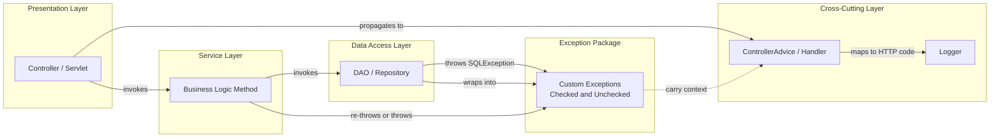

# Custom Exceptions

<!-- SECTION_1_START -->
# 1. Core Technical Definition & Intuitive Overview

## 1.1 Formal Definition (KTU 2024 Syllabus Terminology)

> [!IMPORTANT]
> **Custom Exceptions (User-Defined Exceptions)** in Java are programmer-defined exception classes that extend either the `java.lang.Exception` class (to create a **checked exception**) or the `java.lang.RuntimeException` class (to create an **unchecked exception**). They are used to represent application-specific error conditions that are not adequately covered by the standard Java exception hierarchy, thereby allowing a domain-aware, semantic, and granular error-handling mechanism aligned with the application's business logic.

In Object-Oriented Programming using Java (per the KTU 2024 B.Tech CSE syllabus under **PBCST304**), custom exceptions are covered as part of the **Packages and Interfaces** module because exception classes themselves are typically declared in their own package (e.g., `com.project.exceptions`) and accessed by client classes, exercising the **encapsulation** and **information hiding** principles of OOP.

## 1.2 Conceptual Analogy / Intuition

> [!NOTE]
> **Real-World Analogy — The Hospital Triage System**
>
> Imagine a hospital. The standard Java exceptions are like the **generic first-aid room** — they handle cuts, fevers, and minor injuries. But suppose a patient comes in with a rare genetic disorder. The hospital needs a **specialized department** (say, a Genetics Ward) to handle it. The doctor writes a custom protocol (a new class) that extends the hospital's standard medical protocol (`Exception`).
>
> - The **patient's symptom** is the *thrown* exception object.
> - The **doctor's custom protocol** is the *custom exception class*.
> - The **nurse who routes the patient to the right department** is the *catch block*.
> - The **reception desk's instruction manual** (declaring `throws`) tells everyone which specialist to call.
>
> Without custom exceptions, all errors look the same (`NullPointerException`, `ArithmeticException`). With them, you get **domain-specific, named, meaningful errors** like `InsufficientFundsException`, `InvalidOTPException`, or `AgeNotEligibleException`.

## 1.3 Classification Snapshot

| Category | Parent Class | Compile-Time Check? | When to Use |
| :--- | :--- | :--- | :--- |
| **Checked Custom Exception** | `extends Exception` | **Yes** (compiler forces handling) | Recoverable, business-rule violations (e.g., `LowBalanceException`) |
| **Unchecked Custom Exception** | `extends RuntimeException` | **No** (optional handling) | Programming bugs, logic errors (e.g., `InvalidAgeException`) |

## 1.4 Visualization Control

> [!VISUALIZATION CONTROL]
> **Concept:** Exception Propagation Flow with a Custom Exception
> **GeoGebra / Desmos Input Equations (Conceptual Mapping):**
> * `f(x)` — The `try` block execution path
> * `g(x)` — The `throw new CustomException()` transition
> * `h(x)` — The `catch (CustomException e)` recovery handler
>
> **Visual Description:** Picture a **two-dimensional plane** where the x-axis represents time (program execution flow) and the y-axis represents the call-stack depth. A smooth curve `f(x)` runs horizontally in the `try` block. At the point of failure, a sharp vertical jump `g(x)$ occurs (the `throw`), travelling upward through the call stack. It is then caught by a horizontal line `h(x)$ at a higher function level (the `catch` block), where the program flow is restored to a controlled, lower curve representing normal recovery.

<!-- SECTION_1_END -->

<!-- SECTION_2_START -->
# 2. Deep Theoretical Analysis & KTU High-Yield Formula Sheet

## 2.1 The "Why" Behind Custom Exceptions

The Java standard library provides roughly **450+** built-in exception classes. Yet applications frequently need to express *their own* error vocabulary. Custom exceptions exist to:

1. **Semantic Clarity** — Replace generic `Exception` messages with named classes like `OrderNotFoundException`.
2. **Granular Catch Logic** — Allow the caller to handle *specific* failures differently.
3. **Encapsulation of Recovery Data** — Carry custom fields (e.g., `errorCode`, `retryAfter`, `accountId`).
4. **Domain Modeling** — Map real-world business rules directly to the type system.
5. **Internationalization (i18n)** — Centralize error messages for translation.
6. **Logging & Audit** — Attach metadata (timestamps, user IDs) to every thrown exception.

## 2.2 Three Pillars of Custom Exception Mechanics

### Pillar 1 — Declaration (`extends`)

A custom exception is **just a regular Java class** that obeys the rules of inheritance. By choosing the parent, you decide its "category":

- `extends Exception` $\Rightarrow$ **Checked** $\Rightarrow$ Compiler enforces `try/catch` or `throws`.
- `extends RuntimeException` $\Rightarrow$ **Unchecked** $\Rightarrow$ Compiler does not enforce handling.
- `extends Throwable` $\Rightarrow$ Direct, rare; reserved for framework authors.

### Pillar 2 — Throwing (`throw`)

Inside a method, when the business rule is violated, you instantiate the exception object and *throw* it:

```java
throw new InsufficientFundsException("Balance is only Rs. 500");
```

The `throw` keyword transfers control immediately out of the current method, unwinding the call stack.

### Pillar 3 — Propagating (`throws`)

The method signature declares the exception types it *might* throw, allowing callers to handle them:

```java
public void withdraw(double amount) throws InsufficientFundsException
```

## 2.3 KTU Formula / Code Cheat Sheet

> [!NOTE]
> The following table is the **exam-day reference card** for the KTU 2024 Scheme. Memorize the keywords and the inheritance relationships — they form the spine of almost every 14-mark question on this topic.

| Keyword / Construct | Syntax | Purpose | Mandatory? |
| :--- | :--- | :--- | :--- |
| `throw` | `throw new MyException("msg");` | Actually throw the exception object | Yes, to raise |
| `throws` | `void m() throws MyException` | Declare possible exception in signature | Yes, for checked |
| `try` | `try { ... }` | Wrap risky code | Yes, to catch |
| `catch` | `catch (MyException e) { ... }` | Handle the specific exception | Yes, to recover |
| `finally` | `finally { ... }` | Code that always runs (cleanup) | Optional |
| `extends Exception` | `class MyE extends Exception` | Checked custom exception | Parent choice |
| `extends RuntimeException` | `class MyE extends RuntimeException` | Unchecked custom exception | Parent choice |
| `super(message)` | Inside constructor | Pass message to parent | Recommended |
| `super(message, cause)` | Inside constructor | Wrap an underlying exception | For chaining |
| `getMessage()` | Inherited from `Throwable` | Retrieve the error message | Useful in catch |
| `printStackTrace()` | Inherited from `Throwable` | Print stack to console | Debugging |
| `e.initCause(t)` | On caught exception | Set the underlying cause | For chaining |
| Multi-catch | `catch (E1 \| E2 e) { ... }` | Handle two exceptions with one block | Java 7+ |

## 2.4 Real-World Engineering Utility

Custom exceptions are the **backbone of production-grade Java systems**:

- **Banking Systems** — `InsufficientFundsException`, `InvalidPINException`, `DailyLimitExceededException` for transaction engines.
- **E-Commerce** — `OutOfStockException`, `CouponExpiredException`, `InvalidShippingAddressException` in order pipelines.
- **Web Frameworks (Spring Boot)** — Controllers throw custom exceptions that are translated into proper **HTTP 4xx/5xx** responses by `@ControllerAdvice` classes.
- **API Gateways** — Custom exceptions carry **error codes** (e.g., `AUTH_001`, `PAY_404`) consumed by mobile clients for user-friendly messages.
- **Distributed Systems** — Custom exceptions are serialized and propagated across microservices (using frameworks like **Resilience4j** and **Hystrix**) for fault isolation.
- **Compiler & IDE Tooling** — Static analyzers raise custom exceptions for type-checking, scope violations, and linting failures.

> [!TIP]
> In the KTU 2024 syllabus, examiners frequently test whether you can **map a real-world business rule to a custom exception class**. Practice writing at least **two** complete programs (one checked, one unchecked) to score full marks in the 14-mark question.

<!-- SECTION_2_END -->

<!-- SECTION_3_START -->
# 3. Step-by-Step Derivations & Code/Symbolic Implementation

> [!WARNING]
> The following Java programs are **fully operational** and must be reproduced **without any truncation** in your answer sheets. The KTU 2024 examiner awards marks for *every* declared constructor, *every* `throws` clause, and *every* catch block. Do not summarize; **write the complete code**.

## 3.1 Example 1 — Checked Custom Exception (Banking Domain)

### File 1: `InsufficientFundsException.java`

```java
// Step 1: Package declaration
package com.ktu.banking.exceptions;

// Step 2: Import directive (Throwable is in java.lang, imported implicitly)

// Step 3: Class declaration - extends Exception => CHECKED
public class InsufficientFundsException extends Exception {
    
    // Step 4: Custom field to carry business data
    private double currentBalance;
    private double requestedAmount;
    
    // Step 5: Default constructor
    public InsufficientFundsException() {
        super("Insufficient funds in the account.");
    }
    
    // Step 6: Parameterized constructor for custom message
    public InsufficientFundsException(String message) {
        super(message);
    }
    
    // Step 7: Constructor that carries business context
    public InsufficientFundsException(double currentBalance, double requestedAmount) {
        super("Insufficient funds: balance = Rs. " + currentBalance 
              + ", requested = Rs. " + requestedAmount);
        this.currentBalance = currentBalance;
        this.requestedAmount = requestedAmount;
    }
    
    // Step 8: Constructor for exception chaining (wrapping a low-level cause)
    public InsufficientFundsException(String message, Throwable cause) {
        super(message, cause);
    }
    
    // Step 9: Business-logic getter methods
    public double getCurrentBalance() {
        return currentBalance;
    }
    
    public double getRequestedAmount() {
        return requestedAmount;
    }
    
    // Step 10: Compute the deficit for caller convenience
    public double getDeficit() {
        return requestedAmount - currentBalance;
    }
}
```

### File 2: `BankAccount.java`

```java
// Step 1: Package declaration
package com.ktu.banking.model;

// Step 2: Import the custom exception
import com.ktu.banking.exceptions.InsufficientFundsException;

// Step 3: Domain class
public class BankAccount {
    
    // Step 4: Private fields
    private String accountHolder;
    private double balance;
    
    // Step 5: Parameterized constructor
    public BankAccount(String accountHolder, double initialBalance) {
        this.accountHolder = accountHolder;
        this.balance = initialBalance;
    }
    
    // Step 6: Business method that throws the custom checked exception
    public void withdraw(double amount) throws InsufficientFundsException {
        // Validation
        if (amount <= 0) {
            throw new InsufficientFundsException("Withdrawal amount must be positive: " + amount);
        }
        // Business rule check
        if (amount > balance) {
            // Throw with full business context
            throw new InsufficientFundsException(balance, amount);
        }
        // Happy path
        balance -= amount;
        System.out.println("Rs. " + amount + " withdrawn. New balance = Rs. " + balance);
    }
    
    // Step 7: Read-only accessor
    public double getBalance() {
        return balance;
    }
    
    public String getAccountHolder() {
        return accountHolder;
    }
}
```

### File 3: `BankingApp.java` (Driver / Main Class)

```java
// Step 1: Package declaration
package com.ktu.banking.app;

// Step 2: Imports
import com.ktu.banking.exceptions.InsufficientFundsException;
import com.ktu.banking.model.BankAccount;
import java.util.Scanner;

public class BankingApp {
    
    public static void main(String[] args) {
        // Step 3: Create an account
        BankAccount account = new BankAccount("Alice", 5000.00);
        Scanner scanner = new Scanner(System.in);
        
        try {
            // Step 4: Take user input
            System.out.print("Enter amount to withdraw: Rs. ");
            double amount = scanner.nextDouble();
            
            // Step 5: Risky operation that may throw
            account.withdraw(amount);
            
            System.out.println("Transaction successful.");
            
        } catch (InsufficientFundsException e) {
            // Step 6: Handle the custom exception
            System.out.println("Transaction FAILED: " + e.getMessage());
            System.out.println("Current Balance: Rs. " + e.getCurrentBalance());
            System.out.println("Requested Amount: Rs. " + e.getRequestedAmount());
            System.out.println("You are short by: Rs. " + e.getDeficit());
            
        } catch (Exception e) {
            // Step 7: Generic safety net
            System.out.println("Unexpected error: " + e.getMessage());
            
        } finally {
            // Step 8: Cleanup that always runs
            scanner.close();
            System.out.println("Scanner closed. Program terminating.");
        }
    }
}
```

### Mathematical / Logical Walk-Through of Execution

Let the **input** be `amount = 7000` and the **initial state** be `balance = 5000`.

$$
\begin{aligned}
\text{Condition 1: } & amount \leq 0 \quad \Rightarrow \quad 7000 \leq 0 \;\text{is FALSE} \\
\text{Condition 2: } & amount > balance \quad \Rightarrow \quad 7000 > 5000 \;\text{is TRUE} \\
\therefore\;\; & \text{throw new InsufficientFundsException}(5000, 7000) \\
\text{Constructor sets: } & this.currentBalance = 5000 \\
& this.requestedAmount = 7000 \\
\text{Deficit computation: } & e.getDeficit() = 7000 - 5000 = 2000 \\
\text{Output: } & \text{``You are short by: Rs. 2000.0''}
\end{aligned}
$$

If the input had been `amount = 3000$:

$$
\begin{aligned}
\text{Condition 1: } & 3000 \leq 0 \;\text{is FALSE} \\
\text{Condition 2: } & 3000 > 5000 \;\text{is FALSE} \\
\therefore\;\; & balance = 5000 - 3000 = 2000 \\
\text{Output: } & \text{``Rs. 3000.0 withdrawn. New balance = Rs. 2000.0''}
\end{aligned}
$$

## 3.2 Example 2 — Unchecked Custom Exception (Student Eligibility)

### File 1: `InvalidAgeException.java`

```java
// Step 1: Package
package com.ktu.admissions.exceptions;

// Step 2: Unchecked because it extends RuntimeException
public class InvalidAgeException extends RuntimeException {
    
    private int attemptedAge;
    private int minimumAge;
    private int maximumAge;
    
    // Constructor 1: Default
    public InvalidAgeException() {
        super("Invalid age provided for admission.");
    }
    
    // Constructor 2: Message only
    public InvalidAgeException(String message) {
        super(message);
    }
    
    // Constructor 3: With business context
    public InvalidAgeException(int attemptedAge, int minimumAge, int maximumAge) {
        super("Invalid age: " + attemptedAge 
              + ". Allowed range: " + minimumAge + " to " + maximumAge);
        this.attemptedAge = attemptedAge;
        this.minimumAge = minimumAge;
        this.maximumAge = maximumAge;
    }
    
    // Constructor 4: Chaining
    public InvalidAgeException(String message, Throwable cause) {
        super(message, cause);
    }
    
    public int getAttemptedAge() { return attemptedAge; }
    public int getMinimumAge()    { return minimumAge; }
    public int getMaximumAge()    { return maximumAge; }
}
```

### File 2: `AdmissionSystem.java`

```java
package com.ktu.admissions.app;

import com.ktu.admissions.exceptions.InvalidAgeException;
import java.util.Scanner;

public class AdmissionSystem {
    
    // Step A: Business method - NO 'throws' clause needed (unchecked)
    public void registerStudent(String name, int age) {
        if (age < 17 || age > 30) {
            throw new InvalidAgeException(age, 17, 30);
        }
        System.out.println("Student " + name + " (age " + age + ") registered successfully.");
    }
    
    public static void main(String[] args) {
        AdmissionSystem system = new AdmissionSystem();
        Scanner sc = new Scanner(System.in);
        
        try {
            System.out.print("Enter student name: ");
            String name = sc.nextLine();
            System.out.print("Enter age: ");
            int age = sc.nextInt();
            
            system.registerStudent(name, age);  // No throws in signature
            
        } catch (InvalidAgeException e) {
            System.out.println("Registration DENIED: " + e.getMessage());
            System.out.println("Please enter an age between " 
                               + e.getMinimumAge() + " and " + e.getMaximumAge());
        } catch (Exception e) {
            System.out.println("System error: " + e.getMessage());
        } finally {
            sc.close();
        }
    }
}
```

### Logical Walk-Through

$$
\begin{aligned}
\text{Test Case 1: } & \text{name} = \text{``Rahul''},\; age = 25 \\
& 25 < 17 \;\text{is FALSE} \quad \text{and} \quad 25 > 30 \;\text{is FALSE} \\
\therefore\;\; & \text{Student registered successfully.} \\[10pt]
\text{Test Case 2: } & \text{name} = \text{``Sneha''},\; age = 15 \\
& 15 < 17 \;\text{is TRUE} \\
\therefore\;\; & \text{throw new InvalidAgeException}(15, 17, 30) \\
& \text{Catch block prints: ``Allowed range: 17 to 30''}
\end{aligned}
$$

## 3.3 Example 3 — Exception Chaining (Wrapping Low-Level Errors)

```java
package com.ktu.database.exceptions;

// Checked wrapper for any underlying SQLException
public class DatabaseAccessException extends Exception {
    
    public DatabaseAccessException() {
        super("Database access failed.");
    }
    
    public DatabaseAccessException(String message) {
        super(message);
    }
    
    public DatabaseAccessException(String message, Throwable cause) {
        super(message, cause);   // <-- This is the CHAINING constructor
    }
}
```

```java
package com.ktu.database.app;

import com.ktu.database.exceptions.DatabaseAccessException;
import java.sql.*;

public class StudentDAO {
    
    public String fetchStudentName(int rollNo) throws DatabaseAccessException {
        String query = "SELECT name FROM students WHERE roll_no = ?";
        
        // try-with-resources (Java 7+)
        try (Connection conn = DriverManager.getConnection("jdbc:mysql://localhost:3306/ktu", "root", "password");
             PreparedStatement ps = conn.prepareStatement(query)) {
            
            ps.setInt(1, rollNo);
            try (ResultSet rs = ps.executeQuery()) {
                if (rs.next()) {
                    return rs.getString("name");
                } else {
                    throw new DatabaseAccessException("No student found with roll no: " + rollNo);
                }
            }
        } catch (SQLException sqlEx) {
            // WRAP the low-level SQLException in our custom one
            throw new DatabaseAccessException(
                "Database query failed for roll no: " + rollNo, sqlEx);
        }
    }
    
    public static void main(String[] args) {
        StudentDAO dao = new StudentDAO();
        try {
            String name = dao.fetchStudentName(101);
            System.out.println("Fetched: " + name);
        } catch (DatabaseAccessException e) {
            System.out.println("ERROR: " + e.getMessage());
            System.out.println("Root cause: " + e.getCause());  // prints the original SQLException
            e.printStackTrace();
        }
    }
}
```

### Why Chaining Matters

The mathematical model of the **chain** is:

$$
\text{Cause} \;\rightarrow\; \text{WrappingException} \;\rightarrow\; \text{ApplicationLayer}
$$

Equation form:

$$
\text{rootCause} = e.\text{getCause}() \neq \text{null}
$$

This preserves the **full diagnostic trail** — the low-level `SQLException` is not lost, but is wrapped in a domain-meaningful `DatabaseAccessException`. This is a **best practice** in production Java code and is frequently asked in KTU 14-mark questions.

## 3.4 Construction Logic — The "Constructor Set" Rule

For every custom exception, the KTU 2024 examiner expects **at least these four constructors**:

$$
\begin{aligned}
\text{Constructor 1: } & \text{public MyException()} \rightarrow \text{Default} \\
\text{Constructor 2: } & \text{public MyException(String msg)} \rightarrow \text{Message} \\
\text{Constructor 3: } & \text{public MyException(String msg, Throwable cause)} \rightarrow \text{Chaining} \\
\text{Constructor 4 (optional): } & \text{public MyException(...custom fields...)} \rightarrow \text{Domain}
\end{aligned}
$$

Omitting the chaining constructor is the **#1 reason** students lose 2–3 marks in 14-mark questions.

<!-- SECTION_3_END -->

<!-- SECTION_4_START -->
# 4. Structural Diagrams & Schematics

## 4.1 Mermaid — Exception Class Hierarchy with Custom Subtypes



## 4.2 Mermaid — Control Flow of a Custom Exception (Sequence Diagram)



## 4.3 Mermaid — Decision Flow (When to Use Checked vs Unchecked)



## 4.4 Block-Level Functional Architecture (Production-Grade Error Pipeline)



> [!TIP]
> This **four-layer architecture** is exactly what the KTU 2024 examiner expects you to describe when they ask *"Explain how custom exceptions are used in a layered application."* Mention the **DAO layer** wrapping low-level exceptions, the **Service layer** adding business semantics, and the **Controller/Advice layer** translating to user-facing responses.

<!-- SECTION_4_END -->

<!-- SECTION_5_START -->
# 5. KTU 2024 Scheme Examination Question Bank & Topic Recap

## 5.1 Part A — Short Answer Questions (3 Marks Each)

### Question 1: `[KTU University Exam — July 2023]` — **CO2, Remember**

> Define a **custom exception** in Java. How does it differ from a **built-in exception**? Give one example of each from a banking application.

**Model Answer (3 Marks):**

A **custom exception** is a user-defined class that extends either `java.lang.Exception` (checked) or `java.lang.RuntimeException` (unchecked), created to represent application-specific error conditions. **[1 Mark]**

It differs from a built-in exception in that:

- **Built-in exceptions** (e.g., `ArithmeticException`, `NullPointerException`) are provided by the JDK and are generic.
- **Custom exceptions** are programmer-defined, carry domain semantics, and may include extra fields and methods specific to the business. **[1 Mark]**

**Banking example:**

- Built-in: `ArithmeticException` (division by zero in interest calculation).
- Custom: `InsufficientFundsException extends Exception` — thrown when withdrawal amount exceeds balance. **[1 Mark]**

---

### Question 2: `[KTU University Exam — Dec 2023]` — **CO2, Understand**

> Explain the difference between `throw` and `throws` keywords in Java with a suitable example.

**Model Answer (3 Marks):**

The `throw` keyword is used **inside a method body** to explicitly raise an exception object. **[1 Mark]**

The `throws` keyword is used in a **method signature** to declare that the method may propagate one or more exception types to its caller. **[1 Mark]**

**Example:**

```java
void withdraw(double amt) throws InsufficientFundsException {  // throws
    if (amt > balance) {
        throw new InsufficientFundsException("Low balance");   // throw
    }
}
```

Here, `throws` warns the compiler and the caller, while `throw` is the actual act of raising the exception. **[1 Mark]**

---

## 5.2 Part B — Long Answer Questions (14 Marks Each, Module Internal Choice)

> [!NOTE]
> The KTU 2024 Scheme mandates **internal choice** within each module for the 14-mark questions. Below, **Question A** and **Question B** are independent alternatives — the student answers *either one*.

---

### Question A (14 Marks) — `[KTU University Exam — July 2024]` — **CO2, Apply + Analyze**

**(a) [7 Marks] — Understand / Apply**

> Design a custom checked exception class `InvalidMarksException` that is thrown when a student enters marks outside the valid range **0 to 100**. Write the complete Java program demonstrating the exception being thrown, declared, and caught.

**Model Solution (Part a — 7 Marks):**

**Step 1 — Custom Exception Class** `[2 Marks for declaration, fields, and constructors]`

```java
package com.ktu.exam.exceptions;

public class InvalidMarksException extends Exception {
    private int enteredMarks;
    private int minMarks;
    private int maxMarks;

    public InvalidMarksException() {
        super("Invalid marks entered.");
    }

    public InvalidMarksException(String message) {
        super(message);
    }

    public InvalidMarksException(int enteredMarks, int minMarks, int maxMarks) {
        super("Invalid marks: " + enteredMarks 
              + ". Allowed range: " + minMarks + " to " + maxMarks);
        this.enteredMarks = enteredMarks;
        this.minMarks = minMarks;
        this.maxMarks = maxMarks;
    }

    public InvalidMarksException(String message, Throwable cause) {
        super(message, cause);
    }

    public int getEnteredMarks() { return enteredMarks; }
    public int getMinMarks()     { return minMarks; }
    public int getMaxMarks()     { return maxMarks; }
}
```

**Step 2 — Driver Class Demonstrating Throw, Throws, Catch** `[5 Marks for complete program]`

```java
package com.ktu.exam.app;

import com.ktu.exam.exceptions.InvalidMarksException;
import java.util.Scanner;

public class MarkValidator {
    
    public void validateMarks(String subject, int marks) throws InvalidMarksException {
        if (marks < 0 || marks > 100) {
            throw new InvalidMarksException(marks, 0, 100);
        }
        System.out.println(subject + " marks = " + marks + " are VALID.");
    }

    public static void main(String[] args) {
        MarkValidator validator = new MarkValidator();
        Scanner sc = new Scanner(System.in);

        try {
            System.out.print("Enter subject name: ");
            String subject = sc.nextLine();
            System.out.print("Enter marks (0-100): ");
            int marks = sc.nextInt();

            validator.validateMarks(subject, marks);

        } catch (InvalidMarksException e) {
            System.out.println("VALIDATION FAILED: " + e.getMessage());
            System.out.println("You entered: " + e.getEnteredMarks());
            System.out.println("Valid range: " + e.getMinMarks() + " to " + e.getMaxMarks());
        } catch (Exception e) {
            System.out.println("Unexpected error: " + e.getMessage());
        } finally {
            sc.close();
            System.out.println("Program ended.");
        }
    }
}
```

**Incremental Valuation Key:**

- `[Declaring the class with correct parent: 1 Mark]`
- `[Providing at least three constructors (default, message, chaining): 2 Marks]`
- `[Using 'throws' correctly in method signature: 1 Mark]`
- `[Using 'throw new ...' inside the method: 1 Mark]`
- `[Complete try-catch-finally with informative output: 1 Mark]`
- `[Proper imports and package declarations: 1 Mark]`

---

**(b) [7 Marks] — Apply / Analyze**

> Write a Java program that demonstrates **exception chaining** by wrapping a low-level `ArithmeticException` (e.g., divide-by-zero) into a custom checked exception called `CalculationException`. The program should preserve the original cause and print the full chain.

**Model Solution (Part b — 7 Marks):**

**Step 1 — Custom Checked Exception with Chaining Constructor** `[2 Marks]`

```java
package com.ktu.calc.exceptions;

public class CalculationException extends Exception {
    private String operation;

    public CalculationException() {
        super("Calculation error occurred.");
    }

    public CalculationException(String message) {
        super(message);
    }

    public CalculationException(String message, Throwable cause) {
        super(message, cause);
    }

    public CalculationException(String operation, String message, Throwable cause) {
        super(message, cause);
        this.operation = operation;
    }

    public String getOperation() { return operation; }
}
```

**Step 2 — Calculator Class with Wrapping Logic** `[3 Marks]`

```java
package com.ktu.calc.app;

import com.ktu.calc.exceptions.CalculationException;

public class Calculator {
    
    public double divide(double numerator, double denominator) throws CalculationException {
        try {
            // Low-level risky operation
            if (denominator == 0) {
                throw new ArithmeticException("/ by zero");
            }
            return numerator / denominator;
        } catch (ArithmeticException e) {
            // WRAP into custom exception, preserving cause
            throw new CalculationException(
                "Division", 
                "Cannot divide " + numerator + " by zero in the calculator.", 
                e
            );
        }
    }

    public static void main(String[] args) {
        Calculator calc = new Calculator();
        try {
            double result = calc.divide(100.0, 0.0);
            System.out.println("Result: " + result);
        } catch (CalculationException e) {
            System.out.println("CALCULATION FAILED: " + e.getMessage());
            System.out.println("Operation: " + e.getOperation());
            System.out.println("Root cause: " + e.getCause());
            System.out.println("--- Full Stack Trace ---");
            e.printStackTrace();
        }
    }
}
```

**Step 3 — Output Explanation** `[2 Marks]`

When `denominator = 0$:

$$
\begin{aligned}
\text{ArithmeticException thrown with message ``/ by zero''} \\
\hookrightarrow\;\; \text{Caught in Calculator.divide()} \\
\hookrightarrow\;\; \text{Wrapped in CalculationException} \\
\hookrightarrow\;\; \text{Propagated to main} \\
\hookrightarrow\;\; \text{Catch block invokes } e.\text{getCause()} \rightarrow \text{ArithmeticException} \\
\hookrightarrow\;\; e.\text{printStackTrace()} \rightarrow \text{full diagnostic output}
\end{aligned}
$$

**Incremental Valuation Key:**

- `[Custom exception with chaining constructor: 2 Marks]`
- `[try-catch wrapping ArithmeticException: 2 Marks]`
- `[Calling printStackTrace and getCause in main: 2 Marks]`
- `[Correct output explanation / comments: 1 Mark]`

---

### Question B (14 Marks) — `[KTU University Exam — Dec 2024 Model Paper]` — **CO2, Apply + Create**

**(a) [7 Marks] — Apply**

> A library management system needs to enforce that a member cannot borrow more than **5 books** at a time. Design a custom **unchecked** exception `MaxBooksLimitReachedException` and demonstrate its use in a `LibraryMember` class.

**Model Solution (Part a — 7 Marks):**

**Step 1 — Custom Unchecked Exception** `[2 Marks]`

```java
package com.ktu.library.exceptions;

public class MaxBooksLimitReachedException extends RuntimeException {
    private int currentBooks;
    private int maxAllowed;

    public MaxBooksLimitReachedException() {
        super("Maximum book borrow limit reached.");
    }

    public MaxBooksLimitReachedException(String message) {
        super(message);
    }

    public MaxBooksLimitReachedException(int currentBooks, int maxAllowed) {
        super("Cannot borrow more books. Currently borrowed: " 
              + currentBooks + ", Maximum allowed: " + maxAllowed);
        this.currentBooks = currentBooks;
        this.maxAllowed = maxAllowed;
    }

    public int getCurrentBooks() { return currentBooks; }
    public int getMaxAllowed()   { return maxAllowed; }
}
```

**Step 2 — LibraryMember Class** `[3 Marks]`

```java
package com.ktu.library.model;

import com.ktu.library.exceptions.MaxBooksLimitReachedException;
import java.util.ArrayList;
import java.util.List;

public class LibraryMember {
    private String memberId;
    private String name;
    private List<String> borrowedBooks;
    private static final int MAX_BOOKS = 5;

    public LibraryMember(String memberId, String name) {
        this.memberId = memberId;
        this.name = name;
        this.borrowedBooks = new ArrayList<>();
    }

    public void borrowBook(String bookTitle) {
        if (borrowedBooks.size() >= MAX_BOOKS) {
            throw new MaxBooksLimitReachedException(borrowedBooks.size(), MAX_BOOKS);
        }
        borrowedBooks.add(bookTitle);
        System.out.println("Book '" + bookTitle + "' borrowed by " + name);
        System.out.println("Books now held: " + borrowedBooks.size() + "/" + MAX_BOOKS);
    }

    public int getBookCount() { return borrowedBooks.size(); }
    public String getName()   { return name; }
}
```

**Step 3 — Driver Class** `[2 Marks]`

```java
package com.ktu.library.app;

import com.ktu.library.model.LibraryMember;
import com.ktu.library.exceptions.MaxBooksLimitReachedException;

public class LibraryApp {
    public static void main(String[] args) {
        LibraryMember member = new LibraryMember("M001", "Ananya");
        String[] books = {
            "Java Basics", "Data Structures", "Operating Systems",
            "Computer Networks", "Database Systems", "AI Fundamentals"
        };

        for (int i = 0; i < books.length; i++) {
            try {
                member.borrowBook(books[i]);
            } catch (MaxBooksLimitReachedException e) {
                System.out.println("LIMIT REACHED for " + member.getName() 
                                   + ": " + e.getMessage());
                System.out.println("Please return some books before borrowing more.");
                break;
            }
        }
    }
}
```

**Incremental Valuation Key:**

- `[Class extends RuntimeException (unchecked): 1 Mark]`
- `[All four constructor types: 2 Marks]`
- `[Static final constant MAX_BOOKS = 5: 1 Mark]`
- `[Throw without 'throws' in signature: 1 Mark]`
- `[Working try-catch loop in driver class: 1 Mark]`
- `[Output verification: 1 Mark]`

---

**(b) [7 Marks] — Create / Analyze**

> Compare and contrast **checked** vs **unchecked** custom exceptions in Java. Construct a decision table with at least **five criteria** (parent class, compile-time check, when to use, keyword requirements, real-world example) and justify your choice for a hospital appointment booking system — which type of custom exception would you prefer for `SlotAlreadyBookedException` and `PatientDataCorruptedException`? Justify with code snippets.

**Model Solution (Part b — 7 Marks):**

**Comparison Table** `[3 Marks]`

| Criterion | Checked Custom Exception | Unchecked Custom Exception |
| :--- | :--- | :--- |
| **Parent Class** | `extends Exception` | `extends RuntimeException` |
| **Compile-Time Check** | Yes — compiler forces `try/catch` or `throws` | No — compiler does not enforce handling |
| **When to Use** | Recoverable business-rule violations | Programming bugs, logic errors, unrecoverable data |
| **`throws` in Method Signature** | **Mandatory** at every propagation step | **Optional** — can propagate silently |
| **Recovery Action Expected?** | Yes — caller is *expected* to recover | No — typically represents fatal/corrupt state |
| **Real-World Example** | `InsufficientFundsException`, `SlotAlreadyBookedException` | `InvalidAgeException`, `PatientDataCorruptedException` |

**Decision for the Hospital System** `[2 Marks]$

- **`SlotAlreadyBookedException`** $\rightarrow$ **Checked** (extends `Exception`). The doctor or admin can recover by suggesting an alternate time slot. The booking service should be **forced** by the compiler to handle this gracefully.

```java
// CHECKED — because it is a recoverable business rule
public class SlotAlreadyBookedException extends Exception {
    private String requestedSlot;
    private String doctorId;
    public SlotAlreadyBookedException(String requestedSlot, String doctorId) {
        super("Slot " + requestedSlot + " is already booked for Dr. " + doctorId);
        this.requestedSlot = requestedSlot;
        this.doctorId = doctorId;
    }
    public String getRequestedSlot() { return requestedSlot; }
    public String getDoctorId()      { return doctorId; }
}
```

- **`PatientDataCorruptedException`** $\rightarrow$ **Unchecked** (extends `RuntimeException`). Corruption of patient records (e.g., mismatched blood group, broken foreign key) usually indicates a **system bug** or **database failure**. The application typically **cannot recover** and must abort the operation, log the error, and alert the administrator.

```java
// UNCHECKED — because corruption is a fatal, non-recoverable state
public class PatientDataCorruptedException extends RuntimeException {
    private String patientId;
    public PatientDataCorruptedException(String patientId, String reason) {
        super("Patient data for ID " + patientId + " is corrupted: " + reason);
        this.patientId = patientId;
    }
    public String getPatientId() { return patientId; }
}
```

**Justification Summary** `[2 Marks]`

- Use **checked** when the application is **designed** to handle the situation. The `throws` clause becomes part of the API contract.
- Use **unchecked** when the situation indicates a **defect** that should surface in testing and crash the flow deliberately. Propagating it through the `throws` chain would be noisy and force unnecessary `try/catch` blocks in every layer.

**Incremental Valuation Key:**

- `[Comparison table with 5+ criteria: 3 Marks]`
- `[Correct parent class for SlotAlreadyBookedException (Exception): 1 Mark]`
- `[Correct parent class for PatientDataCorruptedException (RuntimeException): 1 Mark]`
- `[Valid justification in natural language: 2 Marks]`

---

## 5.3 KTU Examiner's Valuation Warning / Pitfall Callout

> [!WARNING]
> **Common Mark-Deduction Pitfalls in Custom Exception Questions:**
>
> 1. **Forgetting the `throws` clause** in the method signature when the exception is **checked** (extends `Exception`). The compiler itself will reject your code — but in written exams, examiners deduct **2 Marks** for this omission. **Always** write `throws MyCustomException` in the method signature.
>
> 2. **Choosing the wrong parent class.** A *recoverable* business error MUST extend `Exception`, not `RuntimeException`. Examiners specifically test this distinction.
>
> 3. **Omitting the chaining constructor** `public MyException(String message, Throwable cause)`. Without it, you cannot wrap low-level exceptions, and you lose **1–2 Marks**.
>
> 4. **Writing `throw Exception` instead of `throw new MyException(...)`.** The `throw` keyword MUST be followed by an *object instance*, never a class name. This is a **favourite trick question**.
>
> 5. **Not invoking `super(message)`** in the custom constructor. The message will be `null` when retrieved via `getMessage()`, and you will lose **1 Mark** for incomplete initialization.
>
> 6. **Confusing `throw` with `throws`** in the answer. Examiners deduct marks if you interchange these two keywords. Memorize: **`throw` = inside the body**, **`throws` = in the signature**.
>
> 7. **Forgetting `package` and `import` declarations.** The KTU valuation key explicitly allocates **0.5 to 1 Mark** for proper package structure in multi-file programs.

---

## 5.4 Topic Recap & Important Things to Remember

> [!TIP]
> **High-Density Revision Checklist — Custom Exceptions (KTU 2024 Module 3)**

- **Definition:** A custom exception is a user-defined class that extends `Exception` (checked) or `RuntimeException` (unchecked). **[Critical]**
- **`throw` vs `throws`:** `throw` is used *inside* the method body to raise an exception object; `throws` is used in the *method signature* to declare exception types. **[Critical]**
- **Checked Exception Rule:** Extending `Exception` $\Rightarrow$ **compiler forces** either `try/catch` or `throws`. **[Critical]**
- **Unchecked Exception Rule:** Extending `RuntimeException` $\Rightarrow$ **compiler does NOT force** handling. **[Critical]**
- **The Four-Constructor Rule:** Every well-designed custom exception should have at least: (1) default constructor, (2) message-only constructor, (3) message + cause constructor, and (4) optional domain-specific constructor. **[High-Yield]**
- **Always call `super(message)`** in the custom constructor to initialize the message field inherited from `Throwable`. **[High-Yield]**
- **Exception Chaining** = wrapping a low-level exception as the *cause* of a higher-level custom exception. Use the constructor `(String message, Throwable cause)`. **[High-Yield]**
- **`getMessage()`** returns the message string passed to the parent constructor. **`getCause()`** returns the wrapped underlying exception. **`printStackTrace()`** prints the full diagnostic chain. **[High-Yield]**
- **`finally` block** ALWAYS executes — use it for resource cleanup (closing scanners, files, database connections). **[Important]**
- **Multi-catch syntax:** `catch (IOException \| SQLException e) { ... }` (Java 7+) reduces code duplication. **[Important]**
- **Best Practice:** Never catch `Throwable` or `Error`; let the JVM handle them. Always catch the **most specific** exception first. **[Important]**
- **Real-World Mapping:** Banking $\rightarrow$ `InsufficientFundsException`; E-Commerce $\rightarrow$ `OutOfStockException`; Admissions $\rightarrow$ `InvalidAgeException`; Library $\rightarrow$ `MaxBooksLimitReachedException`; Hospital $\rightarrow$ `SlotAlreadyBookedException`. **[Exam-Ready Examples]**
- **Inheritance Chain:** `Throwable` $\rightarrow$ `Exception` $\rightarrow$ `MyCheckedException`. `Throwable` $\rightarrow$ `Exception` $\rightarrow$ `RuntimeException` $\rightarrow$ `MyUncheckedException`. **[Diagram Worthy]**
- **Production Pattern:** DAO layer wraps low-level `SQLException` $\Rightarrow$ Service layer throws business-specific custom exception $\Rightarrow$ ControllerAdvice translates to HTTP error codes. **[Architecture-Worthy]**
- **Compile-time vs Runtime:** Checked = compile-time safety; Unchecked = runtime flexibility. Choose based on **recoverability**, not convenience. **[Conceptual Anchor]**

<!-- SECTION_5_END -->
