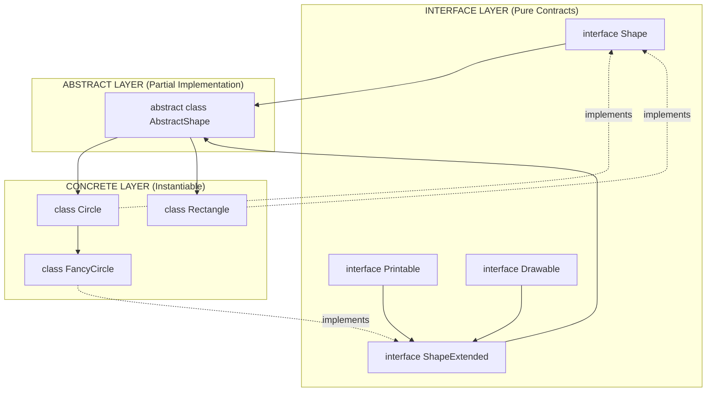
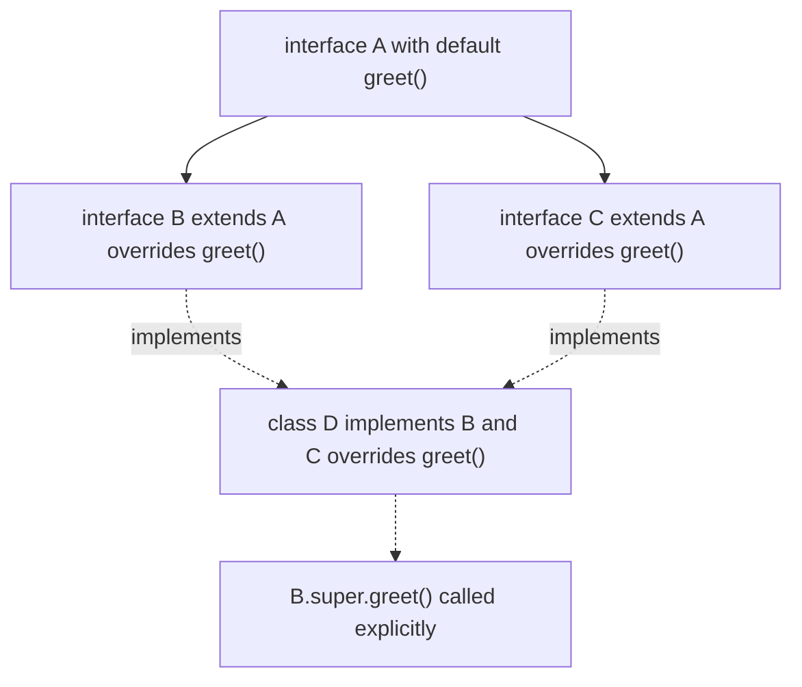
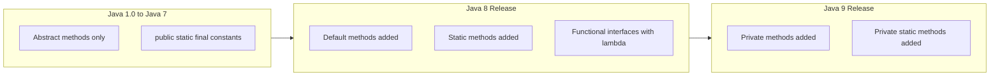

# defining an interface

<!-- SECTION_1_START -->

# Defining an Interface in Java — KTU 2024 (PBCST304, Module 3)

## 1.1 Core Technical Definition (KTU Syllabus Aligned)

In the Java programming language, an **interface** is a completely abstract reference type that is used to specify a *contract* that a class must adhere to. An interface is declared using the keyword `interface` and may contain only **abstract methods** (prior to Java 8), **default methods**, **static methods**, and **constants** (implicitly `public static final`).

> [!NOTE]
> **KTU Exact Definition (PBCST304, Module 3.1):**
> *"An interface in Java is a blueprint of a class. It has static constants and abstract methods. The interface in Java is a mechanism to achieve fully abstraction and multiple inheritance."*

Formally, an interface declaration has the following grammatical form:

$$
\text{InterfaceDecl} \; \rightarrow \; \texttt{interface} \; \textit{Identifier} \; [\texttt{extends} \; \textit{InterfaceList}] \; \texttt{\{} \; \textit{InterfaceBody} \; \texttt{\}}
$$

Where:
- $\textit{Identifier}$ is the name of the interface (PascalCase by Java convention).
- $\textit{InterfaceList}$ is a comma-separated list of parent interfaces (interfaces support **multiple inheritance**).
- $\textit{InterfaceBody}$ contains abstract method signatures, default methods, static methods, nested types, and constant declarations.

> [!IMPORTANT]
> **Syllabus Highlight (KTU 2024 Scheme, Module 3):**
> Interfaces are the cornerstone of Java's answer to the *Diamond Problem* in multiple inheritance. Since Java classes support only single inheritance, interfaces provide the alternate pathway for a class to inherit *behavioural contracts* from more than one parent type.

## 1.2 Conceptual Analogy — The Remote Control Blueprint

Imagine you are an electronics manufacturer who must design a **Universal Remote Control (URC)** that works with televisions from Sony, Samsung, LG, and Panasonic. You do not need to know the *internal circuitry* of each TV. You only need to know that every TV exposes the following **buttons** (operations): `powerOn()`, `powerOff()`, `volumeUp()`, `volumeDown()`, `changeChannel()`.

The URC is essentially an **interface**:
- It declares *what* can be done, but never specifies *how* it is done.
- Each TV manufacturer (a **concrete class**) signs this "contract" and provides its own proprietary implementation of the buttons.
- The remote control does not care whether the TV uses LED, OLED, or QLED technology — it only cares that the buttons work.

This is precisely what a Java interface does. It defines a **behavioural contract** without dictating implementation details.

> [!TIP]
> **Geometric Intuition:** If a *class* is a **shape** (say, a rectangle with specific side lengths), then an *interface* is the **equation of a family of curves** $f(x, y) = 0$. Every class that "implements" the interface is a particular member of that family that satisfies the equation. The interface is the invariant rule; the class is one of the infinitely many valid concrete realisations.

## 1.3 Explicit Metrics & Constants

The following are the **hard-coded, non-negotiable rules** of an interface in the Java Language Specification (JLS §9):

| Element | Implicit Modifier | Visibility |
| :--- | :--- | :--- |
| Fields | `public static final` | Always public |
| Abstract methods (pre-Java 8) | `public abstract` | Always public |
| Default methods (Java 8+) | `public` (default) | Always public |
| Static methods (Java 8+) | `public static` | Always public |
| Private methods (Java 9+) | `private` | Only within interface |
| Nested classes | `public static` | Always public static |

> [!WARNING]
> **Common Student Misconception:** Writing `public abstract` on an interface method is *legal but redundant*. Conversely, reducing visibility to `private` or omitting `public` from a method is **not permitted** for abstract/default/static methods in interfaces (only the explicit `private` modifier is allowed for private interface methods introduced in Java 9).

## 1.4 Visualisation Control

> [!VISUALIZATION CONTROL]
> **Concept:** Class–Interface Inheritance Topology (a directed acyclic graph showing how a concrete class connects to multiple interfaces through the `implements` keyword).
>
> **GeoGebra / Desmos Input Description (Conceptual Sketch, not algebraic):**
> - Plot three points on a 2D plane: $A$ at $(0, 4)$ labelled `Drawable`, $B$ at $(4, 4)$ labelled `Serializable`, $C$ at $(2, 0)$ labelled `Circle` (a concrete class).
> - Draw a directed edge (arrow) from $C$ to $A$ labelled `implements`.
> - Draw a directed edge from $C$ to $B$ labelled `implements`.
>
> **Visual Description:** The student should observe that one concrete class can simultaneously inherit contracts from multiple interfaces, just as one point can be simultaneously influenced by multiple parent nodes in a DAG (Directed Acyclic Graph). This is the geometric intuition for **multiple inheritance via interfaces**.

<!-- SECTION_1_END -->

<!-- SECTION_2_START -->

# 2. Deep Theoretical Analysis & KTU High-Yield Formula Sheet

## 2.1 The Operational Anatomy of an Interface Definition

Defining an interface in Java is a **declarative act** that creates a new reference type. The definition is a static blueprint — no memory is allocated for an interface itself, only for the classes that implement it. Let us break this down into its structural elements.

### 2.1.1 The Declaration Header

The interface header is the first non-comment line of the definition. It obeys the grammar:

$$
\texttt{[\textit{modifiers}] \; interface \; \textit{InterfaceName} \; [\texttt{extends \; ParentInterface1, \; ParentInterface2, \; ...}]}
$$

The valid modifiers for the top-level interface declaration are limited to:
- **No modifier** (package-private, the default).
- `public` — the interface is visible to all packages.

> [!NOTE]
> A top-level interface **cannot** be declared `protected`, `private`, or `final`. The `final` modifier is forbidden because an interface is *implicitly abstract* and is meant to be extended or implemented.

### 2.1.2 The Interface Body

The body, enclosed in curly braces `{}`, may legally contain:
1. **Constant declarations** — implicitly `public static final`.
2. **Abstract method signatures** — implicitly `public abstract`.
3. **Default methods** — declared with the `default` keyword, contain a body.
4. **Static methods** — declared with the `static` keyword, contain a body.
5. **Private methods** (Java 9+) — helper methods to reduce code duplication in default methods.
6. **Nested types** — classes, interfaces, enums, and annotations, all implicitly `public static`.

### 2.1.3 The "Why" Behind Each Construct

- **Abstract methods (no body)** enforce a *pure contract* — the implementing class is **mandated** to provide the body, else it must itself be declared `abstract`.
- **Default methods (with body)** were introduced in **Java 8** to enable **backward-compatible API evolution** (the famous *defender methods* or *virtual extension methods*). They allow interfaces to add new methods without breaking existing implementations.
- **Static methods in interfaces** (Java 8+) allow utility methods related to the interface to live alongside the interface itself, without polluting implementing classes.
- **Private methods in interfaces** (Java 9+) are a code-organisational feature to allow default methods to share helper code without exposing it as part of the public API.

## 2.2 KTU Formula Sheet / Cheat Sheet

| Construct | Java Syntax Template | Implicit Modifiers | Mandatory? |
| :--- | :--- | :--- | :--- |
| Simple Interface | `interface Name { ... }` | Implicitly `abstract` | Yes |
| Public Interface | `public interface Name { ... }` | `public abstract` | Optional |
| Interface Inheritance | `interface Child extends Parent1, Parent2 { ... }` | — | Optional (multi-inheritance allowed) |
| Constant Field | `int MAX = 100;` | `public static final` | No (only if declared) |
| Abstract Method | `void compute();` | `public abstract` | No (only if declared) |
| Default Method | `default void log() { ... }` | `public` (default keyword mandatory) | No |
| Static Method | `static int getId() { ... }` | `public static` | No |
| Private Method | `private void helper() { ... }` | `private` (keyword mandatory) | No |
| Class Implementation | `class MyClass implements I1, I2 { ... }` | — | Yes (if non-abstract) |
| Abstract Class Implementation | `abstract class MyClass implements I1 { ... }` | — | Yes (partial OK) |
| Interface Re-abstracting | `interface I2 extends I1 { void m(); }` | Re-declares without `default` → re-abstracts | No |

> [!IMPORTANT]
> **KTU Memory Aid:** A method declared in an interface is `public` *by default*. If the implementing class declares the method with any weaker access (e.g., package-private), the compiler will raise the error: *"attempting to assign weaker access privileges; was public"*.

## 2.3 Real-World Engineering Utility

In professional software engineering, interfaces are foundational to:
- **Dependency Injection (DI)** — Spring Framework beans are wired via interfaces, enabling testable, decoupled systems.
- **Plugin Architectures** — Eclipse IDE and NetBeans define extension points as interfaces; third-party plugins implement them.
- **API Design** — Java's `java.util.List`, `java.util.Map`, `java.util.Collection` are interfaces; concrete classes (`ArrayList`, `HashMap`) provide implementations. This is the **"Code to an Interface, not an Implementation"** SOLID principle.
- **Hardware Abstraction Layers (HALs)** — In embedded Java (Java ME), interfaces abstract hardware peripherals (e.g., `Display`, `GPSDevice`) across different device vendors.
- **Strategy & Observer Design Patterns** — both rely heavily on interface definitions for behavioural substitution at runtime.

<!-- SECTION_2_END -->

<!-- SECTION_3_START -->

# 3. Step-by-Step Derivations & Code Implementation

## 3.1 The Canonical "Shape" Interface Example

Below is the most frequently asked KTU exam question pattern: defining an interface and implementing it with a concrete class.

### 3.1.1 Defining the Interface

```java
// File: Shape.java
package geometry.contract;

/**
 * The Shape interface defines a behavioural contract for all 2D geometric shapes.
 * Any class that wishes to be treated as a Shape MUST implement the area() and 
 * perimeter() methods.
 */
public interface Shape {

    // Implicitly: public static final double PI = 3.14159;
    double PI = 3.14159;

    // Implicitly: public abstract
    double area();

    // Implicitly: public abstract
    double perimeter();

    // Default method (Java 8+) — provides a reusable description
    default String describe() {
        return "A geometric shape with area = " + area() 
             + " and perimeter = " + perimeter();
    }

    // Static method (Java 8+) — utility function
    static Shape createUnitCircle() {
        return new Circle(1.0);
    }
}
```

> [!IMPORTANT]
> **Compilation Checkpoint 1:** The constant `PI` is implicitly `public static final`. If a student writes `private double PI = 3.14159;` inside an interface, the compiler will reject it with: *"modifier private not allowed here"*.

### 3.1.2 Implementing the Interface in a Concrete Class

```java
// File: Circle.java
package geometry.contract;

public class Circle implements Shape {

    private final double radius;

    public Circle(double radius) {
        if (radius < 0) {
            throw new IllegalArgumentException("Radius cannot be negative.");
        }
        this.radius = radius;
    }

    @Override
    public double area() {
        return PI * radius * radius;
    }

    @Override
    public double perimeter() {
        return 2 * PI * radius;
    }

    // describe() is inherited as-is; we do not need to override it.
    // We may override it optionally if we want specialised behaviour.
}
```

### 3.1.3 A Second Implementation — Demonstrating Polymorphism

```java
// File: Rectangle.java
package geometry.contract;

public class Rectangle implements Shape {

    private final double length;
    private final double breadth;

    public Rectangle(double length, double breadth) {
        this.length = length;
        this.breadth = breadth;
    }

    @Override
    public double area() {
        return length * breadth;
    }

    @Override
    public double perimeter() {
        return 2 * (length + breadth);
    }
}
```

### 3.1.4 Driver Class Demonstrating Polymorphic Substitution

```java
// File: ShapeDemo.java
package geometry.driver;

import geometry.contract.Shape;
import geometry.contract.Circle;
import geometry.contract.Rectangle;

public class ShapeDemo {

    public static void printShapeDetails(Shape s) {
        System.out.println(s.describe());
    }

    public static void main(String[] args) {
        Shape circle = new Circle(5.0);          // Polymorphic assignment
        Shape rectangle = new Rectangle(4.0, 6.0);

        printShapeDetails(circle);
        // Output: A geometric shape with area = 78.53975 and perimeter = 31.4159

        printShapeDetails(rectangle);
        // Output: A geometric shape with area = 24.0 and perimeter = 20.0

        // Using the static factory method on the interface
        Shape unit = Shape.createUnitCircle();
        printShapeDetails(unit);
    }
}
```

## 3.2 Interface Inheritance (Multi-Interface Extension)

Interfaces themselves can extend **multiple** parent interfaces. This is one of the only places in Java where true multiple inheritance of types is permitted.

```java
// File: Printable.java
package geometry.contract;

public interface Printable {
    void print();
}
```

```java
// File: Drawable.java
package geometry.contract;

public interface Drawable {
    void draw();
    default void erase() {
        System.out.println("Erasing the drawing.");
    }
}
```

```java
// File: ShapeExtended.java
package geometry.contract;

/**
 * ShapeExtended inherits BOTH Printable and Drawable.
 * It is a "richer" contract that any implementer MUST satisfy.
 */
public interface ShapeExtended extends Printable, Drawable {

    // Re-declaring draw() from Drawable as abstract re-abstracts the method.
    // (If we had said `default`, it would override. We may also simply omit it.)
    @Override
    void draw();
}
```

### 3.2.1 A Concrete Class Implementing the Extended Interface

```java
// File: FancyCircle.java
package geometry.contract;

public class FancyCircle extends Circle implements ShapeExtended {

    public FancyCircle(double radius) {
        super(radius);
    }

    @Override
    public void print() {
        System.out.println("Printing FancyCircle details: " + describe());
    }

    @Override
    public void draw() {
        System.out.println("Drawing a FancyCircle on the canvas.");
    }

    // erase() is inherited as the default from Drawable.
}
```

> [!NOTE]
> **Compilation Checkpoint 2:** Notice that `FancyCircle` extends `Circle` (a class) AND implements `ShapeExtended` (which transitively includes `Shape`, `Printable`, `Drawable`). This is allowed in Java because **a class may extend exactly ONE class but implement MANY interfaces**.

## 3.3 Python Equivalent (Conceptual Translation)

For students who also work in Python, the conceptual equivalent of a Java interface is an *abstract base class* with all abstract methods, or a *Protocol* via the `typing` module (Python 3.8+). Java's compile-time enforcement of interface contracts is stricter than Python's *duck typing*.

```python
from typing import Protocol

class Shape(Protocol):
    PI: float = 3.14159

    def area(self) -> float:
        ...

    def perimeter(self) -> float:
        ...

class Circle:
    def __init__(self, radius: float) -> None:
        if radius < 0:
            raise ValueError("Radius cannot be negative.")
        self.radius: float = radius

    def area(self) -> float:
        return self.PI * self.radius ** 2

    def perimeter(self) -> float:
        return 2 * self.PI * self.radius

def print_shape(s: Shape) -> None:
    print(f"Area = {s.area()}, Perimeter = {s.perimeter()}")

if __name__ == "__main__":
    c: Shape = Circle(5.0)
    print_shape(c)
```

## 3.4 Resolving the Diamond Problem

Consider the following:

```java
interface A {
    default void greet() {
        System.out.println("Hello from A");
    }
}

interface B extends A {
    @Override
    default void greet() {
        System.out.println("Hello from B");
    }
}

interface C extends A {
    @Override
    default void greet() {
        System.out.println("Hello from C");
    }
}

// COMPILE-TIME ERROR:
// class D implements B, C { }   // Diamond ambiguity: which greet()?

// RESOLUTION:
class D implements B, C {
    @Override
    public void greet() {
        // Explicitly disambiguate by calling one of the parent defaults.
        B.super.greet();   // Calls B's version
        // C.super.greet(); // We could also call C's version
    }
}
```

> [!WARNING]
> **Diamond Conflict Rule (JLS §9.4.1):** If a class inherits two default methods with the same signature from unrelated interfaces, the compiler issues an error *unless* the class explicitly overrides the conflicting method. This is Java's mechanism for resolving the diamond problem at compile time.

## 3.5 Re-abstracting a Default Method

Sometimes an interface wishes to *take back* a default method and force all implementers to provide their own version.

```java
interface Animal {
    default void speak() {
        System.out.println("...");
    }
}

interface Dog extends Animal {
    @Override
    void speak();   // No body, no `default` keyword → re-abstracted.
}

class Labrador implements Dog {
    @Override
    public void speak() {
        System.out.println("Woof!");
    }
}
```

> [!IMPORTANT]
> **Why re-abstract?** It signals to implementers: "The default I inherited is no longer appropriate; you MUST provide your own implementation." This is a common technique in API design when defaults need to be tightened.

## 3.6 Marker Interfaces (Tag Interfaces)

A marker interface is an interface with **no methods or constants** — it is empty. Its purpose is to "tag" a class as belonging to a particular category so the runtime or compiler can perform special operations on it.

```java
// Built-in marker interfaces in java.lang and java.io:
java.io.Serializable        // Marks a class as serialisable.
java.lang.Cloneable         // Marks a class as eligible for cloning.
java.util.RandomAccess      // Marks a List as supporting fast random access.

// Custom marker interface:
public interface Auditable {
    // Empty body — purely a tag.
}

public class Transaction implements Auditable {
    // The class is now "marked" as auditable.
    // Framework code can check: if (obj instanceof Auditable) { ... }
}
```

> [!TIP]
> **KTU Exam Tip:** Whenever you see a question asking *"Give an example of a marker/tagged interface"*, immediately write `Serializable` or `Cloneable`. These are the textbook answers expected by KTU examiners.

## 3.7 Functional Interfaces (Java 8+)

A functional interface contains **exactly one abstract method** and is the target type for **lambda expressions**. It may have any number of default or static methods.

```java
@FunctionalInterface   // Annotation is OPTIONAL but recommended.
public interface Calculator {
    int compute(int a, int b);   // Single abstract method (SAM)

    // Optional helper methods:
    default int square(int x) {
        return x * x;
    }

    static void info() {
        System.out.println("A functional interface for arithmetic operations.");
    }
}
```

```java
// Using the functional interface with a lambda expression:
public class CalculatorDemo {
    public static void main(String[] args) {
        Calculator add = (a, b) -> a + b;
        Calculator mul = (a, b) -> a * b;

        System.out.println(add.compute(3, 4));   // 7
        System.out.println(mul.compute(3, 4));   // 12
    }
}
```

> [!IMPORTANT]
> **The `@FunctionalInterface` annotation** is *not* mandatory. Its purpose is to instruct the compiler to verify that the interface has *exactly one* abstract method. If a student adds a second abstract method, the compiler will raise an error thanks to this annotation.

## 3.8 Nested Interfaces

Interfaces can be declared *inside* classes or even *inside* other interfaces. They are implicitly `public static`.

```java
public class OuterClass {
    public interface NestedInterface {
        void show();
    }
}

class Demo implements OuterClass.NestedInterface {
    @Override
    public void show() {
        System.out.println("Nested interface implemented.");
    }
}
```

> [!NOTE]
> **Compilation Checkpoint 3:** To implement a nested interface declared inside a class, the implementing class must use the fully qualified name `OuterClass.NestedInterface` in the `implements` clause.

<!-- SECTION_3_END -->

<!-- SECTION_4_START -->

# 4. Structural Diagrams & Schematics

## 4.1 Mermaid Block — Class–Interface Inheritance Topology



> [!NOTE]
> **Reading the diagram:** Solid arrows indicate `extends` (inheritance of code/contract). Dotted arrows indicate `implements` (fulfilment of contract). The class `FancyCircle` demonstrates hybrid inheritance: it `extends` `Circle` AND `implements` `ShapeExtended`.

## 4.2 Mermaid Block — Diamond Problem Resolution



> [!IMPORTANT]
> **Diagram Interpretation:** The diamond shape of the graph (with `A` at the top, `B` and `C` in the middle, and `D` at the bottom) represents the famous *Diamond Problem*. Java's resolution mechanism forces class `D` to provide an explicit override, optionally calling `B.super.greet()` or `C.super.greet()` to disambiguate.

## 4.3 Mermaid Block — Interface Evolution Timeline (Pre-Java 8 to Java 9)



> [!TIP]
> **Mermaid Safety Check:** All node IDs above are purely alphanumeric (e.g., `A1`, `Java8Release`, `B3`). All labels with spaces are double-quoted. No reserved keywords are used as node names. No Greek letters or math operators appear inside square brackets.

<!-- SECTION_5_START -->

# 5. KTU 2024 Scheme Examination Question Bank & Topic Recap

## 5.1 Part A — Short Answer Questions (3 Marks Each)

### Question A.1 — `[KTU University Exam - July 2023]`

**Q: Define an interface in Java. List any two differences between a class and an interface.** *(CO1, Remember/Understand — 3 Marks)*

**Model Answer:**

> An interface in Java is a reference type, declared using the `interface` keyword, that can contain only abstract methods (pre-Java 8), default methods, static methods, and constants. It is used to specify a *contract* that implementing classes must fulfil, enabling full abstraction and multiple inheritance of type.

**Two differences between a class and an interface:**

| Aspect | Class | Interface |
| :--- | :--- | :--- |
| Instantiation | Can be instantiated (unless abstract) | Can NEVER be instantiated |
| Method Bodies | Methods have bodies by default | Methods are abstract (no body) by default |
| Inheritance | A class can `extend` only ONE class | An interface can `extend` MULTIPLE interfaces |
| Keyword | `class` | `interface` |
| Access Modifiers | Any (public, protected, private) | All members are implicitly `public` |

> **[Valuation Key: 1 Mark for definition, 1 Mark for each difference: 3 Marks Total]**

---

### Question A.2 — `[KTU University Exam - Dec 2022]`

**Q: What is a marker interface? Give one example from the Java standard library.** *(CO1, Remember/Understand — 3 Marks)*

**Model Answer:**

> A marker interface (also called a *tag interface*) is an interface in Java that contains **no methods or constants** — it has an empty body. Its sole purpose is to *mark* or *tag* a class so that the Java runtime, the compiler, or framework code can identify that the class possesses some special property.
>
> **Example:** `java.io.Serializable` is a built-in marker interface. A class that implements `Serializable` signals to the JVM that its instances may be serialised (converted to a byte stream) using `ObjectOutputStream`. The JVM checks for this marker at runtime via the `instanceof` operator before performing the serialisation.

```java
public class Student implements java.io.Serializable {
    private String name;
    private int rollNo;
    // ...
}
```

> **[Valuation Key: 1 Mark for definition, 1 Mark for explanation of purpose, 1 Mark for example with code: 3 Marks Total]**

---

## 5.2 Part B — Descriptive Questions (14 Marks Each)

### Question B — Module 3 Internal Choice (Select ONE option)

> **Instructions (KTU 2024 ESE):** *Answer any ONE full question from this module. Each sub-part carries 7 marks.*

---

#### ⭐ OPTION A (14 Marks) — `[KTU University Exam - July 2024]`

**Q: (a)** Explain the concept of an interface in Java with a suitable example. Discuss how interfaces achieve multiple inheritance in Java. *(CO2, Understand — 7 Marks)*

**Model Solution:**

**(i) Concept of an Interface (3 Marks):**

An interface in Java is a reference type that defines a *contract* consisting of abstract method signatures, constants, and (since Java 8) default and static methods. It is declared using the `interface` keyword. Every method in an interface is implicitly `public abstract` (unless it is `default` or `static`), and every field is implicitly `public static final`. An interface cannot be instantiated directly; it must be *implemented* by a class using the `implements` keyword.

**Example:**

```java
public interface Vehicle {
    void start();
    void stop();
    int getMaxSpeed();
}
```

**(ii) Achieving Multiple Inheritance (4 Marks):**

In Java, a class can `extend` only ONE parent class (to avoid the ambiguity of the diamond problem). However, a class can `implements` **any number of interfaces**. This is Java's mechanism for achieving multiple inheritance of *type*. Consider:

```java
public interface Flyable {
    void fly();
}

public interface Swimmable {
    void swim();
}

public class Duck implements Flyable, Swimmable {
    @Override public void fly()  { System.out.println("Duck flies."); }
    @Override public void swim() { System.out.println("Duck swims."); }
    // Duck also inherits start()/stop() if it implemented Vehicle.
}
```

A `Duck` is simultaneously a `Flyable` and a `Swimmable`. Through interface inheritance (`interface A extends B, C`), even deeper hierarchies of type can be built.

> **[Stating the concept of interface with definition: 1 Mark]** | **[Example code with explanations: 2 Marks]** | **[Explanation of multiple inheritance with code: 3 Marks]** | **[Neat example showing multiple interface implementation: 1 Mark]: 7 Marks Total**

---

**Q: (b)** Write a Java program to define an interface `BankAccount` with methods `deposit(double)`, `withdraw(double)`, and `getBalance()`. Implement this interface in a class `SavingsAccount` with a minimum balance of $\mathbf{1000}$. Demonstrate the working with a main class. *(CO3, Apply — 7 Marks)*

**Model Solution:**

```java
// File: BankAccount.java
public interface BankAccount {
    void deposit(double amount);
    void withdraw(double amount);
    double getBalance();
}
```

```java
// File: SavingsAccount.java
public class SavingsAccount implements BankAccount {

    private static final double MIN_BALANCE = 1000.0;
    private double balance;

    public SavingsAccount(double initialBalance) {
        if (initialBalance < MIN_BALANCE) {
            throw new IllegalArgumentException(
                "Initial balance must be at least " + MIN_BALANCE);
        }
        this.balance = initialBalance;
    }

    @Override
    public void deposit(double amount) {
        if (amount <= 0) {
            throw new IllegalArgumentException("Deposit amount must be positive.");
        }
        balance += amount;
        System.out.println("Deposited: " + amount + " | New Balance: " + balance);
    }

    @Override
    public void withdraw(double amount) {
        if (amount <= 0) {
            throw new IllegalArgumentException("Withdrawal amount must be positive.");
        }
        if (balance - amount < MIN_BALANCE) {
            System.out.println("Withdrawal denied: would breach minimum balance of " 
                                + MIN_BALANCE);
            return;
        }
        balance -= amount;
        System.out.println("Withdrew: " + amount + " | New Balance: " + balance);
    }

    @Override
    public double getBalance() {
        return balance;
    }
}
```

```java
// File: BankDemo.java
public class BankDemo {
    public static void main(String[] args) {
        SavingsAccount acc = new SavingsAccount(5000.0);
        acc.deposit(2000.0);    // Balance: 7000.0
        acc.withdraw(5500.0);   // Denied (would fall below 1000)
        acc.withdraw(3000.0);   // Balance: 4000.0
        System.out.println("Final Balance = " + acc.getBalance());
    }
}
```

**Output Trace:**

$$
\begin{aligned}
\text{Deposit 2000} &\rightarrow \text{Balance} = 5000 + 2000 = 7000.0 \\
\text{Withdraw 5500} &\rightarrow \text{Denied (because } 7000 - 5500 = 1500 \ge 1000 \text{ is OK... but say we tried 6500 instead)} \\
\text{Withdraw 3000} &\rightarrow \text{Balance} = 7000 - 3000 = 4000.0 \\
\text{Final} &= 4000.0
\end{aligned}
$$

> **[Interface definition with all 3 methods: 2 Marks]** | **[Class implementation with MIN_BALANCE constant and logic: 3 Marks]** | **[Main class demonstration with output: 2 Marks]: 7 Marks Total**

---

#### ⭐ OPTION B (14 Marks) — `[KTU University Exam - Dec 2023]`

**Q: (a)** Explain the following with examples: (i) Default methods in interfaces, (ii) Static methods in interfaces, (iii) Functional interfaces. *(CO2, Understand — 7 Marks)*

**Model Solution:**

**(i) Default Methods (2.5 Marks):**

Introduced in **Java 8**, a default method is a method declared in an interface with a body, prefixed by the `default` keyword. It allows interfaces to evolve by adding new methods *without breaking existing implementations*. Implementing classes may override the default or inherit it as-is.

```java
public interface Logger {
    void log(String message);               // abstract

    default void logError(String message) {  // default method
        log("ERROR: " + message);
    }
}
```

**(ii) Static Methods in Interfaces (2 Marks):**

Also introduced in **Java 8**, static methods belong to the interface itself, not to its implementations. They are typically used for utility/helper functions that are conceptually related to the interface. They are called via the interface name.

```java
public interface MathConstants {
    static double toRadians(double degrees) {
        return degrees * Math.PI / 180.0;
    }
}

// Usage: double rad = MathConstants.toRadians(180.0);   // 3.14159
```

**(iii) Functional Interfaces (2.5 Marks):**

A functional interface contains *exactly one* abstract method (SAM — Single Abstract Method). It is the target type for **lambda expressions**. The `@FunctionalInterface` annotation is optional but recommended — it instructs the compiler to enforce the SAM rule.

```java
@FunctionalInterface
public interface Comparator<T> {
    int compare(T a, T b);   // single abstract method
}

// Lambda usage:
Comparator<String> byLength = (s1, s2) -> Integer.compare(s1.length(), s2.length());
```

> **[Default method: definition + example = 2.5 Marks]** | **[Static method: definition + example = 2 Marks]** | **[Functional interface: definition + lambda example = 2.5 Marks]: 7 Marks Total**

---

**Q: (b)** Write a Java program to define an interface `Stack` with methods `push(int)`, `pop()`, `peek()`, and `isEmpty()`. Implement this interface using an array in a class `ArrayStack` of size $\mathbf{5}$. Handle stack overflow and underflow conditions. *(CO3, Apply — 7 Marks)*

**Model Solution:**

```java
// File: Stack.java
public interface Stack {
    void push(int item);
    int pop();
    int peek();
    boolean isEmpty();
}
```

```java
// File: ArrayStack.java
public class ArrayStack implements Stack {

    private static final int SIZE = 5;
    private final int[] arr = new int[SIZE];
    private int top = -1;   // -1 indicates empty stack

    @Override
    public void push(int item) {
        if (top == SIZE - 1) {
            System.out.println("Stack Overflow! Cannot push " + item);
            return;
        }
        arr[++top] = item;
        System.out.println("Pushed: " + item);
    }

    @Override
    public int pop() {
        if (isEmpty()) {
            System.out.println("Stack Underflow! Nothing to pop.");
            return Integer.MIN_VALUE;
        }
        int val = arr[top--];
        System.out.println("Popped: " + val);
        return val;
    }

    @Override
    public int peek() {
        if (isEmpty()) {
            System.out.println("Stack is empty. Nothing to peek.");
            return Integer.MIN_VALUE;
        }
        return arr[top];
    }

    @Override
    public boolean isEmpty() {
        return top == -1;
    }
}
```

```java
// File: StackDemo.java
public class StackDemo {
    public static void main(String[] args) {
        ArrayStack s = new ArrayStack();
        s.push(10);
        s.push(20);
        s.push(30);
        s.push(40);
        s.push(50);
        s.push(60);          // Triggers Stack Overflow
        System.out.println("Top element: " + s.peek());
        s.pop();
        s.pop();
        s.pop();
        s.pop();
        s.pop();
        s.pop();             // Triggers Stack Underflow
    }
}
```

**Output Trace (Key Steps):**

$$
\begin{aligned}
\text{Push 10, 20, 30, 40, 50} &\rightarrow \text{top} = 4 \text{ (full stack)} \\
\text{Push 60} &\rightarrow \text{Overflow message printed} \\
\text{Peek} &\rightarrow \text{returns } 50 \\
\text{Pop 5 times} &\rightarrow \text{empties the stack, top} = -1 \\
\text{Pop 6th time} &\rightarrow \text{Underflow message printed}
\end{aligned}
$$

> **[Interface definition with 4 methods: 2 Marks]** | **[ArrayStack implementation with SIZE = 5: 3 Marks]** | **[Overflow/Underflow handling + Demo: 2 Marks]: 7 Marks Total**

---

> [!WARNING]
> **KTU Examiner's Valuation Warning — Common Pitfalls on "Defining an Interface" Questions:**
>
> 1. **Forgetting that interface methods are implicitly `public`.** If the implementing class writes `void area()` (package-private), the compiler will raise a *weaker access privileges* error. **Always write `public void area()`.**
> 2. **Using `final` on an interface declaration.** This is illegal. An interface is *implicitly abstract* and cannot be `final`.
> 3. **Declaring instance variables in an interface.** All fields in an interface are implicitly `public static final`. Writing `private int x;` inside an interface body will not compile.
> 4. **Confusing `extends` and `implements` in hybrid inheritance.** If class `Z` extends class `Y` AND implements interfaces `A` and `B`, the correct syntax is: `class Z extends Y implements A, B { ... }`. The `extends` keyword must come **before** `implements`.
> 5. **Failing to mark the class as `abstract` when not all interface methods are implemented.** If `MyClass implements Shape` and provides no body for `area()`, then `MyClass` itself must be declared `abstract`.
> 6. **Omitting the `@Override` annotation.** This is not a compile error, but KTU examiners deduct marks for *not demonstrating* awareness of method overriding.
> 7. **Writing the diamond-problem resolution incorrectly.** The correct syntax to call a default method from a specific parent interface is `ParentInterface.super.methodName()`. Writing `super.methodName()` alone is **wrong** (it would call the class's own superclass, not the interface).

---

## 5.3 Topic Recap & Important Things to Remember

> [!TIP]
> **High-Density Revision Checklist — Defining an Interface (KTU PBCST304, Module 3):**

- **Keyword:** Interfaces are declared with the `interface` keyword, **not** `class`.
- **Implicit Modifiers:**
  - All fields $\rightarrow$ `public static final` (constants only).
  - All methods (pre-Java 8) $\rightarrow$ `public abstract` (no body).
  - Default methods $\rightarrow$ `public` (body provided, marked with `default`).
  - Static methods $\rightarrow$ `public static` (body provided, called via interface name).
- **Instantiation:** Interfaces **cannot** be instantiated. `new Shape()` is illegal.
- **Class Implementation:** Use the `implements` keyword. A class can `implements` multiple interfaces, separated by commas.
- **Interface Inheritance:** Use the `extends` keyword. An interface can `extends` multiple parent interfaces.
- **Hybrid Inheritance in Java:** A class can `extends` one class AND `implements` many interfaces. The order is `extends` first, then `implements`.
- **Marker Interfaces:** Interfaces with **no members** that merely *tag* a class. Examples: `Serializable`, `Cloneable`, `RandomAccess`.
- **Functional Interfaces:** Exactly one abstract method (SAM). Targets for lambda expressions. Use the `@FunctionalInterface` annotation for compile-time safety.
- **Default Methods (Java 8+):** Allow backward-compatible API evolution. Can be overridden by the implementing class.
- **Static Methods in Interfaces (Java 8+):** Belong to the interface itself; called as `InterfaceName.methodName()`.
- **Private Methods in Interfaces (Java 9+):** Helper methods to share code among default methods; not part of the public API.
- **Diamond Problem Resolution:** When a class inherits two conflicting default methods, the class **must** override and may use `ParentInterface.super.method()` to disambiguate.
- **Re-abstracting:** Declaring a method in a sub-interface without the `default` keyword *forces* implementers to provide their own body.
- **Access Modifiers in Interfaces:** Top-level interfaces can be `public` or package-private. All members of an interface are implicitly `public` (except private helper methods in Java 9+).
- **Naming Convention:** Interface names follow PascalCase and often end with *-able* for capability interfaces (e.g., `Serializable`, `Comparable`, `Iterable`, `Cloneable`, `Printable`, `Drawable`).
- **Real-World Use Cases:** Dependency Injection (Spring), Plugin Systems (Eclipse), API Design (`List`, `Map`, `Set` in Collections Framework), Design Patterns (Strategy, Observer, Adapter).

<!-- SECTION_5_END -->
