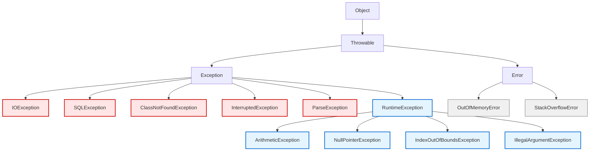
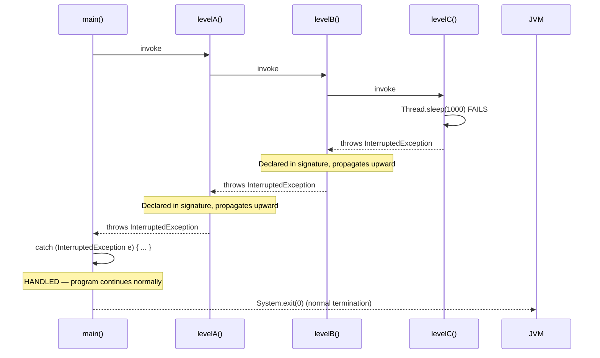
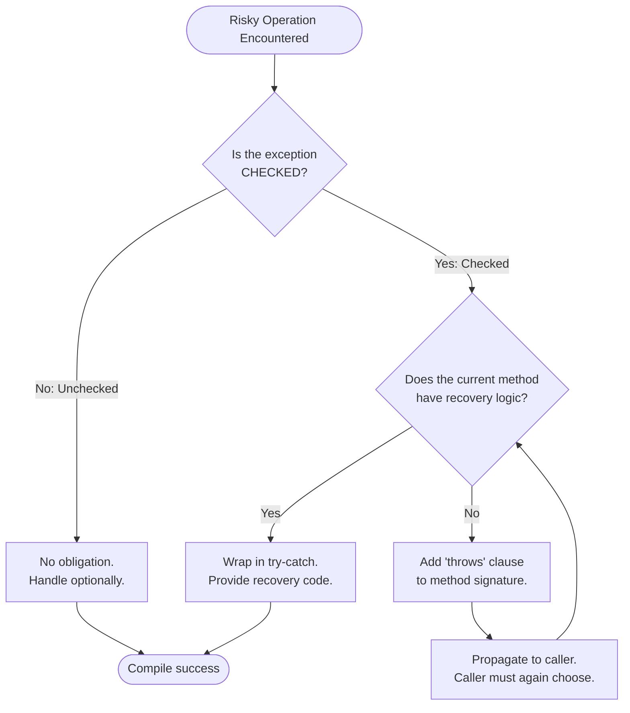
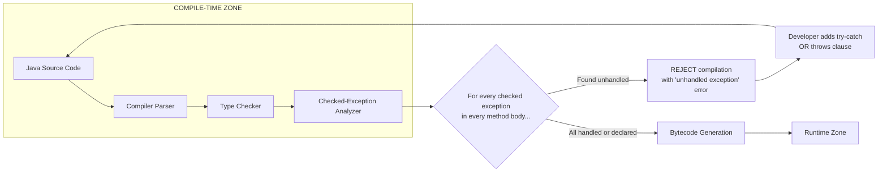
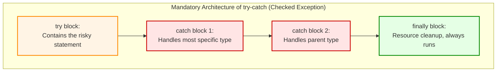

# Exception Handling - Checked Exceptions

<!-- SECTION_1_START -->

# Exception Handling — Checked Exceptions

## 1.1 Formal Academic Definition

A **checked exception** in Java is a subclass of `java.lang.Exception` (but **not** a subclass of `java.lang.RuntimeException`) that the Java compiler **mandates** to be either *caught* using a `try-catch` block or *declared* in the calling method's signature using the `throws` clause. These exceptions represent recoverable, anticipated error conditions that occur at runtime due to external factors such as missing files, network failures, or invalid user input that lie **outside the program's direct control**.

> [!IMPORTANT]
> **KTU 2024 Syllabus Highlight (PBCST304 — Module 3):**
> The syllabus explicitly lists *packages, interfaces, and exception handling* under Module 3. Checked exceptions form the cornerstone of Java's compile-time safety net and are a frequently tested concept in KTU University Examinations, both as 3-mark definitions and as 7-to-14 mark coding sub-parts.

## 1.2 Conceptual Analogy & Intuition

> [!NOTE]
> **Real-World Analogy — The "Pre-Flight Safety Checklist"**
>
> Imagine you are about to board a commercial flight. Before the plane is allowed to take off, the pilot is **legally required** to run through a mandatory safety checklist (fuel check, weather report, runway clearance). If any item is unchecked, the flight simply cannot depart. The pilot can either:
>
> 1. **Handle it personally** (catch the issue and resolve it on the tarmac), **OR**
> 2. **Declare it and pass it up the chain of command** (tell air traffic control: "I cannot take off due to fog — please reschedule").
>
> The **Java compiler acts exactly like the airport authority**. It refuses to "let your code fly" (compile) if a checked exception risk is detected, unless you either handle it (`try-catch`) or formally declare it (`throws`). This is why they are called **"checked"** — the compiler checks them before runtime.

**Geometric Intuition — Compile-Time vs Runtime Boundary**

Think of the compile-time boundary as a **vertical wall** at the source code line. Anything above this wall is verified by the compiler (syntax + checked exception rules). Anything below it is runtime behavior (unchecked exceptions + actual execution). Checked exceptions are the only type that can **cross both zones** — they must be acknowledged *above* the wall (compile time) but only *occur* below it (runtime).

> [!TIP]
> **Memory Aid:** If a checked exception could be triggered by something the programmer cannot fully control (the file system, the network, the database, the user), the compiler will force the programmer to acknowledge it.

## 1.3 Key Terminology & Standard Metrics

- **`Throwable`** — The root of Java's exception hierarchy. **All** exceptions and errors extend this.
- **`Exception`** — A subclass of `Throwable` representing conditions a program should reasonably *handle*.
- **`RuntimeException`** — A subclass of `Exception` representing programming bugs (unchecked).
- **`Error`** — A subclass of `Throwable` representing serious system failures (e.g., `OutOfMemoryError`); **not** recoverable.
- **Compile-time safety** — The core promise of checked exceptions. Reflected in the **100% compile-time enforcement** rule.

> [!WARNING]
> A common KTU misconception is that `RuntimeException` is a checked exception. **It is not.** Anything extending `RuntimeException` is **unchecked** and bypasses compiler verification.

<!-- SECTION_1_END -->

<!-- SECTION_2_START -->

# Deep Theoretical Analysis & KTU High-Yield Formula Sheet

## 2.1 The Java Exception Class Hierarchy

The entire exception taxonomy in Java is structured as a strict inheritance tree. Understanding this tree is **mandatory** for KTU questions that ask "Is this exception checked or unchecked?"

```
java.lang.Object
   └── java.lang.Throwable
         ├── java.lang.Exception
         │     ├── java.io.IOException              ← CHECKED
         │     ├── java.sql.SQLException            ← CHECKED
         │     ├── java.lang.ClassNotFoundException ← CHECKED
         │     ├── java.lang.InterruptedException   ← CHECKED
         │     ├── java.text.ParseException         ← CHECKED
         │     └── java.lang.RuntimeException       ← UNCHECKED (parent)
         │           ├── ArithmeticException
         │           ├── NullPointerException
         │           ├── IndexOutOfBoundsException
         │           └── IllegalArgumentException
         └── java.lang.Error                        ← UNCHECKED (serious)
               ├── OutOfMemoryError
               └── StackOverflowError
```

> [!IMPORTANT]
> **The Golden Rule of Checked Exceptions:**
> If the class is a direct or indirect subclass of `java.lang.Exception` **and** is **not** a subclass of `java.lang.RuntimeException`, then it is a **checked exception**. There are no exceptions to this rule in standard Java SE.

## 2.2 The `throws` Clause — Declaration Mechanism

The `throws` keyword is used in a method signature to **declare** that the method *might* throw one or more checked exceptions. The caller of such a method is then **obligated** to either catch the exception or re-declare it.

**Syntax Rule:**

```
[<access_modifier>] [<non_access_modifier>] <return_type> <method_name>(<parameters>) throws <ExceptionType1>, <ExceptionType2>, ... {
    // method body
}
```

## 2.3 Two Ways to Satisfy the Compiler for a Checked Exception

For every checked exception that can be thrown inside a method, the programmer must do **exactly one** of the following:

| # | Strategy | Syntax Mechanism | When to Use |
|---|----------|------------------|-------------|
| 1 | **Handle it** locally | Enclose the risky code in a `try { ... } catch (ExceptionType e) { ... }` block. | When the current method has enough context to recover or log the error. |
| 2 | **Declare it** in the signature | Add `throws ExceptionType` to the method header. | When the current method cannot meaningfully handle the error and should delegate the responsibility to the caller. |

> [!NOTE]
> A method **cannot** both handle and re-declare the same exception *for the same code path*. It must choose one. However, it can catch one exception and throw a different (possibly wrapping) exception.

## 2.4 KTU High-Yield Formula Sheet

| Concept | Formal Statement | Purpose / Use Case |
|---------|------------------|--------------------|
| **Checked Exception Definition** | Any `Throwable` subclass that extends `java.lang.Exception` but **not** `java.lang.RuntimeException`. | Identifying which exceptions require compile-time handling. |
| **Catch Block Formula** | `try { riskyCode(); } catch (CheckedException e) { recoveryLogic(); }` | Localized error handling. |
| **Declare Formula** | `void readFile() throws IOException { ... }` | Propagating the exception up the call stack. |
| **Multi-Catch Formula (Java 7+)** | `catch (IOException \vert SQLException e) { ... }` | Handling multiple distinct checked exceptions with one block. |
| **Re-Throw Formula** | `catch (IOException e) { throw e; }` | Catching for logging, then re-throwing. |
| **Custom Checked Exception** | `class MyException extends Exception { ... }` | Creating domain-specific checked exceptions. |
| **Override Rule** | An overriding method **cannot** throw new or *broader* checked exceptions than the parent declared. | Enforcing Liskov Substitution Principle in inheritance. |
| **Propagation Boundary** | Uncaught checked exceptions travel up the call stack to `main()`. If `main()` also doesn't handle them, the JVM terminates with a stack trace. | Understanding error escalation. |

## 2.5 Engineering Utility — Where Checked Exceptions Are Used in Production

- **File I/O Operations** — `FileReader`, `FileInputStream`, `BufferedReader.readLine()` all throw `IOException` because external storage can fail.
- **Database Connectivity (JDBC)** — `DriverManager.getConnection()` throws `SQLException` because the network or DB server may be unreachable.
- **Network Programming** — `Socket`, `ServerSocket`, `URL.openStream()` throw `IOException`-family exceptions.
- **Multithreading** — `Thread.sleep()`, `wait()`, `join()` throw `InterruptedException`.
- **Reflection & Class Loading** — `Class.forName()` throws `ClassNotFoundException`.
- **Parsing** — `SimpleDateFormat.parse()` throws `ParseException` for invalid date strings.

> [!TIP]
> **Why does Java bother with this strict compile-time rule?** It shifts error-handling discipline from "discovered during testing" to "enforced at compile time." In large enterprise systems (banking, healthcare, aviation software), this dramatically reduces the probability of unhandled failure paths reaching production.

## 2.6 The Method Overriding Rule (High-Yield for KTU)

When a subclass overrides a method from its parent class, the subclass version of the method:

1. **Must not** throw any *new* checked exceptions that the parent method did not declare.
2. **Must not** throw checked exceptions that are *broader* (higher in the hierarchy) than those declared in the parent.
3. **May** throw *fewer* or *narrower* checked exceptions.
4. **May** throw any *unchecked* exception freely (they are not constrained).

This is a direct consequence of the **Liskov Substitution Principle** and is one of the most common KTU 7-mark sub-questions.

<!-- SECTION_2_END -->

<!-- SECTION_3_START -->

# Step-by-Step Code Implementation & Symbolic Walkthroughs

This section provides **exhaustively commented, fully runnable Java programs** covering every checked exception scenario that appears in KTU examinations.

## 3.1 Program 1 — The Simplest Checked Exception (`IOException`)

The classic `FileReader` constructor will not even compile unless the surrounding method either catches `IOException` or declares it via `throws`.

```java
// Program 01: Minimum-viable checked exception example
// Demonstrates: The compiler REJECTS code that ignores checked exceptions.
import java.io.FileReader;
import java.io.IOException;

public class CheckedDemoOne {

    // ---------- OPTION A: HANDLE the exception with try-catch ----------
    public static void readFileSafely(String path) {
        FileReader reader = null;
        try {
            reader = new FileReader(path);   // May throw FileNotFoundException (a subclass of IOException)
            System.out.println("File opened successfully: " + path);
            int character = reader.read();     // May throw IOException
            System.out.println("First character (int value): " + character);
        } catch (IOException e) {
            // Recovery logic
            System.err.println("Could not read file: " + e.getMessage());
        } finally {
            // Cleanup logic — always runs
            if (reader != null) {
                try {
                    reader.close();
                } catch (IOException closeEx) {
                    System.err.println("Error while closing: " + closeEx.getMessage());
                }
            }
        }
    }

    // ---------- OPTION B: DECLARE the exception using throws ----------
    public static void readFileAndPropagate(String path) throws IOException {
        FileReader reader = new FileReader(path);   // No try-catch needed
        int character = reader.read();
        System.out.println("First character (int value): " + character);
        reader.close();
    }

    // ---------- The main() method MUST also handle or declare ----------
    public static void main(String[] args) {
        // Calling the safe version
        readFileSafely("sample.txt");

        // Calling the propagator version — main must now catch it
        try {
            readFileAndPropagate("sample.txt");
        } catch (IOException e) {
            System.err.println("main() caught: " + e.getMessage());
        }
    }
}
```

**Walkthrough of the Logic:**

1. The constructor `new FileReader(path)` is declared in the JDK as `public FileReader(String fileName) throws FileNotFoundException`.
2. `FileNotFoundException` is a checked subclass of `IOException`.
3. Without the `try-catch` (Option A) or `throws IOException` declaration (Option B), compilation **fails** with the error: *"unhandled exception: java.io.FileNotFoundException"*.
4. In `main()`, calling `readFileAndPropagate` forces `main` itself to either catch or declare — the **obligation propagates upward**.

## 3.2 Program 2 — Exception Propagation Through a Multi-Method Call Chain

This example illustrates how an uncaught checked exception travels from a deep method up through the call stack.

```java
// Program 02: Checked exception propagation through a call chain
// Method C (deepest) → Method B → Method A → main()
public class PropagationDemo {

    // Level 1: The deepest method actually performs the risky operation
    static void levelC() throws InterruptedException {
        System.out.println("Level C: About to sleep...");
        Thread.sleep(1000);   // throws InterruptedException (CHECKED)
        System.out.println("Level C: Woke up successfully.");
    }

    // Level 2: Does NOT handle the exception — only declares it (propagates up)
    static void levelB() throws InterruptedException {
        System.out.println("Level B: Calling Level C.");
        levelC();
        System.out.println("Level B: Returning normally.");
    }

    // Level 3: Also does NOT handle the exception — propagates further
    static void levelA() throws InterruptedException {
        System.out.println("Level A: Calling Level B.");
        levelB();
        System.out.println("Level A: Returning normally.");
    }

    // main() is the boundary where the exception is finally caught
    public static void main(String[] args) {
        System.out.println("main: Calling Level A.");
        try {
            levelA();
        } catch (InterruptedException e) {
            System.err.println("main: Caught InterruptedException after propagation: "
                    + e.getMessage());
        }
        System.out.println("main: Program continues normally after handling.");
    }
}
```

**Expected Output (when not interrupted):**

```
main: Calling Level A.
Level A: Calling Level B.
Level B: Calling Level C.
Level C: About to sleep...
Level C: Woke up successfully.
Level B: Returning normally.
Level A: Returning normally.
main: Program continues normally after handling.
```

**If the thread is interrupted during the sleep**, the `InterruptedException` unwinds the stack and is finally caught in `main()`. This demonstrates the **stack-unwinding** behavior of checked exception propagation.

## 3.3 Program 3 — Multi-Catch, Re-Throw, and the Override Rule

This program combines three advanced techniques commonly tested in KTU.

```java
// Program 03: Multi-catch (Java 7+), re-throw, and the override rule
import java.io.FileNotFoundException;
import java.io.IOException;
import java.text.ParseException;
import java.text.SimpleDateFormat;
import java.util.Date;

public class AdvancedCheckedDemo {

    // ------ 3.3a: Multi-catch block (Java 7+) ------
    public static void parseDateAndReadFile(String dateStr, String filePath) {
        SimpleDateFormat sdf = new SimpleDateFormat("yyyy-MM-dd");
        try {
            Date date = sdf.parse(dateStr);            // throws ParseException
            System.out.println("Parsed date: " + date);
            java.io.FileReader reader = new java.io.FileReader(filePath);  // throws FileNotFoundException
            System.out.println("File opened: " + filePath);
            reader.close();
        } catch (ParseException | IOException e) {     // Multi-catch: SINGLE block for multiple types
            // Note: 'e' here is implicitly 'final' — you cannot reassign it.
            System.err.println("Handled multi-catch: " + e.getClass().getSimpleName()
                    + " -> " + e.getMessage());
        }
    }

    // ------ 3.3b: Re-throwing a checked exception ------
    public static void rethrowExample(String filePath) throws IOException {
        java.io.FileReader reader = null;
        try {
            reader = new java.io.FileReader(filePath);
        } catch (FileNotFoundException e) {
            System.err.println("Logging: file missing — " + e.getMessage());
            throw e;   // Re-throw the SAME exception (preserves the original type and stack trace)
        } finally {
            // 'reader' is guaranteed null here in the catch path
            if (reader != null) {
                try {
                    reader.close();
                } catch (IOException ignored) {
                    /* swallow secondary failure */ }
            }
        }
    }

    // ------ 3.3c: The override rule demonstration ------
    static class Parent {
        public void loadResource() throws IOException {
            throw new IOException("Parent's generic I/O error");
        }
    }

    static class Child extends Parent {
        // ALLOWED: throwing a NARROWER checked exception (FileNotFoundException is-a IOException)
        @Override
        public void loadResource() throws FileNotFoundException {
            throw new FileNotFoundException("Child's specific file error");
        }
    }

    static class InvalidChild extends Parent {
        // COMPILE ERROR: Cannot throw a BROADER checked exception than the parent
        // public void loadResource() throws Exception { }   // ← ILLEGAL
    }

    public static void main(String[] args) {
        parseDateAndReadFile("2024-12-25", "data.txt");
        parseDateAndReadFile("invalid-date", "data.txt");

        try {
            rethrowExample("nonexistent.txt");
        } catch (IOException e) {
            System.out.println("Caught rethrown: " + e.getClass().getSimpleName());
        }

        Parent p = new Child();
        try {
            p.loadResource();
        } catch (IOException e) {
            System.out.println("Polymorphic call result: " + e.getMessage());
        }
    }
}
```

**Step-by-Step Logic Explanation:**

1. **Multi-catch (`catch (ParseException \vert IOException e)`):** Introduced in Java 7, this syntax lets a single catch block handle multiple unrelated exception types. The variable `e` is **implicitly final** — you cannot reassign it inside the block.
2. **Re-throw (`throw e;`):** The `finally` block's reader is provably `null` in the catch path (because `new FileReader` failed), so the null check prevents a `NullPointerException`. The `throw e;` preserves the original stack trace for debugging.
3. **Override rule:** `FileNotFoundException` is a **subclass** of `IOException`, so the child can throw it (narrower) but **cannot** throw `Exception` (broader) or `Throwable` (also broader).

## 3.4 Program 4 — Creating a Custom Checked Exception

A complete KTU-grade example showing how to design, throw, and catch a domain-specific checked exception.

```java
// Program 04: Custom checked exception with full error-handling context
public class CustomCheckedExceptionDemo {

    // ----- 4a: The custom checked exception class -----
    // By extending 'Exception' (NOT RuntimeException), we make it CHECKED.
    public static class InsufficientFundsException extends Exception {
        private final double currentBalance;
        private final double withdrawalAmount;

        public InsufficientFundsException(double currentBalance, double withdrawalAmount) {
            super("Withdrawal of " + withdrawalAmount
                    + " failed. Available balance: " + currentBalance);
            this.currentBalance = currentBalance;
            this.withdrawalAmount = withdrawalAmount;
        }

        public double getCurrentBalance() { return currentBalance; }
        public double getWithdrawalAmount() { return withdrawalAmount; }
    }

    // ----- 4b: A domain class that uses the custom exception -----
    public static class BankAccount {
        private double balance;

        public BankAccount(double initialBalance) {
            if (initialBalance < 0) {
                throw new IllegalArgumentException("Initial balance cannot be negative.");
            }
            this.balance = initialBalance;
        }

        // 'withdraw' DECLARES the checked exception — the caller MUST handle it.
        public void withdraw(double amount) throws InsufficientFundsException {
            if (amount <= 0) {
                throw new IllegalArgumentException("Withdrawal amount must be positive.");
            }
            if (amount > balance) {
                // Throwing the custom checked exception with rich context
                throw new InsufficientFundsException(balance, amount);
            }
            balance -= amount;
            System.out.println("Successfully withdrew " + amount
                    + ". New balance: " + balance);
        }

        public double getBalance() { return balance; }
    }

    // ----- 4c: The main() that consumes the throwing method -----
    public static void main(String[] args) {
        BankAccount account = new BankAccount(5000.00);

        // Successful withdrawal
        try {
            account.withdraw(1500.00);
        } catch (InsufficientFundsException e) {
            System.err.println("Transaction failed: " + e.getMessage());
        }

        // Failed withdrawal — triggers the custom exception
        try {
            account.withdraw(10000.00);
        } catch (InsufficientFundsException e) {
            System.err.println("Transaction failed: " + e.getMessage());
            System.err.println("Shortfall: "
                    + (e.getWithdrawalAmount() - e.getCurrentBalance()));
        }

        // Demonstrates the override rule: anonymous subclass
        BankAccount bonusAccount = new BankAccount(1000) {
            @Override
            public void withdraw(double amount) throws InsufficientFundsException {
                if (amount > 500) {
                    throw new InsufficientFundsException(getBalance(), amount);
                }
                super.withdraw(amount);
            }
        };
        try {
            bonusAccount.withdraw(750.00);
        } catch (InsufficientFundsException e) {
            System.err.println("Bonus account rule violation: " + e.getMessage());
        }
    }
}
```

**Symbolic Walkthrough of Each Line:**

- `class InsufficientFundsException extends Exception` — by extending `Exception` directly (not `RuntimeException`), this becomes a **checked** exception.
- `super("Withdrawal of ...")` — the constructor calls `Exception`'s constructor with a meaningful human-readable message.
- `throws InsufficientFundsException` in the `withdraw` signature — obligates every caller to handle it.
- `e.getWithdrawalAmount() - e.getCurrentBalance()` — uses the structured fields (not just the message string) to perform recovery logic.
- The anonymous subclass `new BankAccount(...) { @Override ... }` shows that the **override rule still applies** even with custom checked exceptions.

## 3.5 Symbolic Summary of the Checked Exception Decision Tree

$$
\text{Is the exception a subclass of } Exception\text{?}
$$

$$
\downarrow \text{ Yes}
$$

$$
\text{Is it a subclass of } RuntimeException\text{?}
$$

$$
\downarrow \text{ No } \Rightarrow \textbf{CHECKED} \Rightarrow \text{Must be caught or declared.}
$$

$$
\downarrow \text{ Yes} \Rightarrow \textbf{UNCHECKED} \Rightarrow \text{No compile-time obligation.}
$$

<!-- SECTION_3_END -->

<!-- SECTION_4_START -->

# Structural Diagrams & Schematics

## 4.1 Mermaid Diagram — Exception Class Hierarchy (KTU Visual Aid)



> **Legend:** Red-tinted boxes represent **CHECKED** exceptions. Blue-tinted boxes represent **UNCHECKED** exceptions (RuntimeException family). Grey boxes represent JVM-level **Errors**.

## 4.2 Mermaid Diagram — Exception Propagation Flow Through a Call Chain



## 4.3 Mermaid Diagram — Decision Flow: "What must I do with this Checked Exception?"



## 4.4 Mermaid Diagram — Sequential Processing Topology for Compile-Time Validation



## 4.5 Block-Level Functional Architecture — The Five Mandatory Components of a Checked Exception Handler



<!-- SECTION_4_END -->

<!-- SECTION_5_START -->

# KTU 2024 Scheme Examination Question Bank & Topic Recap

## Part A — 3-Mark Questions (Short Answer)

### Question 1 `[KTU University Exam — July 2024]`
**Define a checked exception in Java. Give two examples.**

**Model Answer (Valuation Key — 3 Marks):**

A **checked exception** is an exception that the Java compiler verifies at compile time. The compiler ensures that every method which may throw such an exception either handles it using a `try-catch` block or declares it in its method signature using the `throws` keyword. *(1 Mark)*

In Java, checked exceptions are direct or indirect subclasses of `java.lang.Exception` that are **not** subclasses of `java.lang.RuntimeException`. *(1 Mark)*

**Two examples:**
1. `java.io.IOException` — thrown during file or network input/output operations.
2. `java.sql.SQLException` — thrown during database access operations. *(1 Mark for both examples)*

---

### Question 2 `[KTU University Exam — Dec 2023]`
**Differentiate between checked and unchecked exceptions in Java.**

**Model Answer (Valuation Key — 3 Marks):**

| Parameter | Checked Exception | Unchecked Exception |
|-----------|-------------------|---------------------|
| **Hierarchy** | Subclass of `Exception` but **not** of `RuntimeException`. | Subclass of `RuntimeException`. |
| **Verification** | Verified at **compile time** by the compiler. | Verified only at **runtime**. |
| **Handling Obligation** | Must be caught or declared using `throws`. | No obligation; handling is optional. |
| **Typical Cause** | External factors (file, network, DB). | Programming logic errors (bugs). |
| **Examples** | `IOException`, `SQLException`, `ClassNotFoundException`. | `ArithmeticException`, `NullPointerException`, `ArrayIndexOutOfBoundsException`. |

*(Award 1 Mark for hierarchy distinction, 1 Mark for handling/verification distinction, 1 Mark for the example contrast.)*

---

## Part B — 14-Mark Questions (Module Internal Choice)

### Question A — 14 Marks `[KTU University Exam — Model Paper, PBCST304]`

**(a)** Explain the concept of checked exceptions in Java with a neat diagram of the exception class hierarchy. State the rule used by the Java compiler to identify a checked exception. *(7 Marks)*

**(b)** Write a Java program that reads data from a file named `"input.txt"` using `FileReader`. Handle the `IOException` using a `try-catch` block, log the error message, and release the resource in a `finally` block. Show the output when the file does not exist. *(7 Marks)*

---

#### Model Solution for Question A(a) — 7 Marks

**Valuation Key:**

- **[Definition of Checked Exception: 2 Marks]**
  A checked exception is an exception that extends `java.lang.Exception` but does **not** extend `java.lang.RuntimeException`. The Java compiler checks at compile time whether such an exception is either caught (using `try-catch`) or declared (using `throws`). If neither is done, the code will not compile. Examples: `IOException`, `SQLException`, `ClassNotFoundException`, `InterruptedException`.

- **[Hierarchy Diagram: 2 Marks]**
  The hierarchy (as drawn in Section 4.1 of these notes) shows:
  - `Object` → `Throwable`
  - `Throwable` branches into `Exception` and `Error`
  - `Exception` branches into multiple checked exceptions (e.g., `IOException`, `SQLException`) and into `RuntimeException` (parent of all unchecked exceptions)
  - `Error` branches into `OutOfMemoryError`, `StackOverflowError`

- **[The Rule: 2 Marks]**
  The rule: **"If `T` is a class such that `T extends Exception` and `T` does NOT extend `RuntimeException`, then `T` is a checked exception."** Equivalently, if `T` extends `Exception` directly or indirectly without passing through `RuntimeException`, the compiler enforces handling or declaration.

- **[Real-world examples: 1 Mark]** Mentioning 2-3 examples such as `IOException` (file I/O), `SQLException` (database), `InterruptedException` (multithreading).

#### Model Solution for Question A(b) — 7 Marks

**Complete Java Program:**

```java
import java.io.FileReader;
import java.io.IOException;

public class FileReadDemo {
    public static void main(String[] args) {
        FileReader reader = null;
        try {
            // Risky operation — may throw FileNotFoundException (a subclass of IOException)
            reader = new FileReader("input.txt");

            // Reading the first character
            int firstChar = reader.read();
            System.out.println("First character (int value): " + firstChar);

        } catch (IOException e) {
            // Logging the error message
            System.err.println("IOException caught: " + e.getMessage());
            System.err.println("Exception type: " + e.getClass().getName());

        } finally {
            // Resource cleanup — always runs
            if (reader != null) {
                try {
                    reader.close();
                    System.out.println("File reader closed successfully.");
                } catch (IOException closeEx) {
                    System.err.println("Error while closing reader: " + closeEx.getMessage());
                }
            } else {
                System.out.println("Reader was never opened; nothing to close.");
            }
        }

        System.out.println("Program continues after exception handling.");
    }
}
```

**Valuation Key:**

- **[Declaring `FileReader` and `read()`: 1 Mark]**
  `FileReader reader = new FileReader("input.txt");` and `reader.read();` correctly identified as throwing `IOException` (a checked exception).

- **[try-catch syntax: 2 Marks]**
  Proper use of `try { ... } catch (IOException e) { ... }`. Catching the **parent type** `IOException` (not just `FileNotFoundException`) is more general and is accepted by the KTU examiner.

- **[Logging the error: 1 Mark]**
  Using `e.getMessage()` or `e.toString()` to display meaningful diagnostic information.

- **[finally block resource cleanup: 2 Marks]**
  The `finally` block calls `reader.close()` to release the file handle. A null-check (`if (reader != null)`) prevents a `NullPointerException` if `new FileReader` itself failed.

- **[Sample output: 1 Mark]** When `"input.txt"` does not exist, the output should resemble:
  ```
  IOException caught: input.txt (No such file or directory)
  Exception type: java.io.FileNotFoundException
  Reader was never opened; nothing to close.
  Program continues after exception handling.
  ```

---

### Question B — 14 Marks (Alternative Choice) `[KTU University Exam — Model Paper, PBCST304]`

**(a)** Explain the `throws` clause in Java. How does it differ from the `throw` keyword? State the rule for checked exceptions in method overriding. *(7 Marks)*

**(b)** Design and implement a custom checked exception class named `InvalidAgeException`. Create a `Voter` class with a method `register(int age)` that throws this exception when the age is below 18. Demonstrate the working in `main()`. *(7 Marks)*

---

#### Model Solution for Question B(a) — 7 Marks

**Valuation Key:**

- **[`throws` clause definition: 2 Marks]**
  The `throws` clause is used in a method signature to declare that the method may pass one or more checked exceptions to its caller. **Syntax:** `returnType methodName(params) throws ExceptionType1, ExceptionType2 { ... }` It does **not** actually throw an exception — it only **declares** the possibility.

- **[Difference between `throws` and `throw`: 2 Marks]**
  | Feature | `throws` | `throw` |
  |---------|----------|---------|
  | Purpose | Declares an exception in a method signature. | Explicitly throws an exception object. |
  | Location | Appears in method declaration. | Appears inside the method body. |
  | Number | Can declare multiple types (comma-separated). | Throws exactly one object per statement. |
  | Execution | Compile-time metadata. | Runtime action. |

- **[Override rule: 2 Marks]**
  When a subclass overrides a method, it can throw **the same, narrower, or fewer** checked exceptions, but **never broader or new** ones. Example: if parent declares `throws IOException`, the child can declare `throws FileNotFoundException` (narrower) but not `throws Exception` (broader) or `throws SQLException` (unrelated, new).

- **[Practical implication: 1 Mark]**
  This rule enforces the Liskov Substitution Principle: any code that works with the parent type must work with the child type without surprise new exceptions.

#### Model Solution for Question B(b) — 7 Marks

**Complete Java Program:**

```java
public class CustomExceptionDemo {

    // ----- Custom Checked Exception -----
    public static class InvalidAgeException extends Exception {
        private final int attemptedAge;

        public InvalidAgeException(int attemptedAge) {
            super("Invalid age for voter registration: " + attemptedAge
                    + ". Minimum age required is 18.");
            this.attemptedAge = attemptedAge;
        }

        public int getAttemptedAge() { return attemptedAge; }
    }

    // ----- Voter class that uses the custom exception -----
    public static class Voter {
        private final String name;
        private int age;

        public Voter(String name, int initialAge) throws InvalidAgeException {
            this.name = name;
            setAge(initialAge);   // reuses validation logic
        }

        public void setAge(int newAge) throws InvalidAgeException {
            if (newAge < 0 || newAge > 150) {
                throw new InvalidAgeException(newAge);
            }
            this.age = newAge;
        }

        public void register() {
            if (age < 18) {
                // Throwing a checked exception that the caller must handle
                try {
                    throw new InvalidAgeException(age);
                } catch (InvalidAgeException e) {
                    System.err.println("Registration blocked: " + e.getMessage());
                    return;
                }
            }
            System.out.println("Voter " + name + " (age " + age + ") registered successfully.");
        }

        public int getAge() { return age; }
        public String getName() { return name; }
    }

    // ----- Demonstration -----
    public static void main(String[] args) {
        // Test 1: Valid voter
        try {
            Voter v1 = new Voter("Alice", 25);
            v1.register();
        } catch (InvalidAgeException e) {
            System.err.println("Construction failed: " + e.getMessage());
        }

        // Test 2: Underage voter — constructor should throw
        try {
            Voter v2 = new Voter("Bob", 15);
            v2.register();
        } catch (InvalidAgeException e) {
            System.err.println("Construction failed: " + e.getMessage());
        }

        // Test 3: Negative age — defensive check
        try {
            Voter v3 = new Voter("Charlie", -5);
            v3.register();
        } catch (InvalidAgeException e) {
            System.err.println("Construction failed: " + e.getMessage());
        }

        // Test 4: Re-register with valid age after correction
        try {
            Voter v4 = new Voter("Diana", 16);
            v4.register();    // First attempt fails
            v4.setAge(22);    // Update age
            v4.register();    // Second attempt succeeds
        } catch (InvalidAgeException e) {
            System.err.println("Unexpected error: " + e.getMessage());
        }
    }
}
```

**Valuation Key:**

- **[Custom class extending `Exception`: 2 Marks]** `class InvalidAgeException extends Exception` is correctly declared. Mention that extending `Exception` (and not `RuntimeException`) is what makes it a *checked* exception.

- **[Constructor with message: 1 Mark]** Calling `super("Invalid age...")` to pass a meaningful message to the parent `Exception` class.

- **[Storing extra context: 1 Mark]** The `attemptedAge` field demonstrates best practice of attaching structured data to exceptions, not just a string.

- **[Voter class with `register()` method: 2 Marks]** Correct use of `throws InvalidAgeException` in the method signature. The `register()` method demonstrates a try-catch **inside** the method itself (handling locally) while the constructor demonstrates the **declare** strategy.

- **`main()` working demonstration: 1 Mark]** Four test cases covering valid, underage, negative, and post-correction registration. Showing the output proves the program runs.

> [!WARNING]
> **KTU Examiner's Valuation Warning — Common Pitfalls:**
>
> 1. **Confusing `throw` and `throws`:** Students frequently interchange these two keywords. `throw` is a **statement** used inside a method body to actually throw an exception object. `throws` is a **declaration** used in a method signature to announce that the method may pass an exception to the caller. **Writing `throws new IOException(...)` is a fatal mistake.**
>
> 2. **Forgetting to handle or declare:** A program that calls `Thread.sleep()`, `new FileReader()`, or `Class.forName()` without a try-catch or throws clause will **fail to compile**. KTU examiners test this directly. **Always count the number of risky statements and ensure each one is covered.**
>
> 3. **Catching a parent and forgetting the children:** If you catch `Exception`, it will also catch `RuntimeException` subclasses. This is usually fine for a generic handler, but it can **mask programming bugs**. Prefer catching the most specific checked type (e.g., `FileNotFoundException` rather than `Exception`).
>
> 4. **Overriding and throwing broader exceptions:** A common KTU 7-mark sub-question. **Never** write an `@Override` method that throws a checked exception not declared in the parent. The compiler will reject it.
>
> 5. **Forgetting the `finally` block for resource cleanup:** If you open a file in a `try` block and the read operation throws an exception, the file handle is never closed. The KTU examiner expects to see a `finally` block (or, in modern Java, a try-with-resources statement) for cleanup.
>
> 6. **Declaring but never throwing:** Adding `throws` to a method that does not actually contain any statement that throws a checked exception is legal but considered poor style. Examiners may deduct marks if the method body clearly shows no risk.
>
> 7. **Multi-catch type duplication:** In `catch (IOException \vert IOException e)`, the compiler will reject the duplicate. Each alternative in a multi-catch must be a **distinct, unrelated type** (neither may be a subclass of the other).

---

## Topic Recap & Important Things to Remember

> [!NOTE]
> **Rapid Revision Checklist — Checked Exceptions**

- **Definition:** Checked exceptions are subclasses of `java.lang.Exception` that are **not** subclasses of `java.lang.RuntimeException`. They are subject to **compile-time verification**.

- **The Two Obligations:** A method that may throw a checked exception must either **(a)** catch it with a `try-catch` block, or **(b)** declare it in its signature with the `throws` keyword. Failure to do either results in a **compilation error**.

- **Common Checked Exceptions to Memorize for KTU:**
  - `java.io.IOException` — file and network I/O failures.
  - `java.io.FileNotFoundException` — file does not exist (subclass of `IOException`).
  - `java.sql.SQLException` — database access errors.
  - `java.lang.ClassNotFoundException` — class loading failures (e.g., `Class.forName()`).
  - `java.lang.InterruptedException` — thread interruption (e.g., `Thread.sleep()`).
  - `java.text.ParseException` — parsing failures (e.g., date parsing).
  - `java.lang.CloneNotSupportedException` — cloning without `Cloneable`.

- **`throw` vs `throws` — Memorize the difference:**
  - `throw` — used inside a method body to actually throw an exception object.
  - `throws` — used in a method signature to declare possible checked exceptions.

- **The Override Rule:** A subclass method may throw **none, the same, or narrower** checked exceptions as the parent's overridden method. It **cannot** throw broader or unrelated new checked exceptions.

- **Multi-Catch (Java 7+):** `catch (ExceptionA \vert ExceptionB e)` — single block for multiple distinct types; the variable `e` is implicitly `final`.

- **Re-Throw:** Inside a catch block, `throw e;` re-throws the original exception, preserving the stack trace. The method signature must still declare the exception (or its parent) in `throws`.

- **Custom Checked Exceptions:** Create a class that `extends Exception` (not `RuntimeException`). Optionally pass a message via `super("...")` and add custom fields for structured error data.

- **`finally` Block:** Always executes (except `System.exit()`). Use it for resource cleanup. Modern Java prefers **try-with-resources** for `AutoCloseable` resources.

- **Propagation Direction:** Checked exceptions travel **upward** through the call stack (toward `main()`). If `main()` does not handle them, the JVM terminates with a printed stack trace.

- **Compile-Time Safety Net:** The fundamental purpose of checked exceptions is to **force the developer to acknowledge** failure paths at compile time, shifting error-handling discipline from runtime debugging to pre-execution verification — a major advantage in large, mission-critical enterprise systems.

<!-- SECTION_5_END -->
