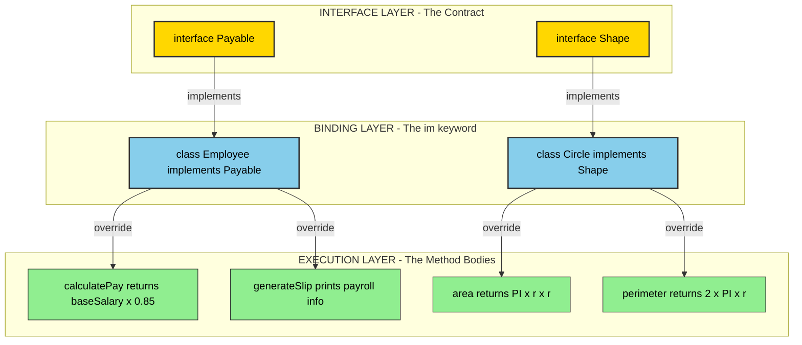
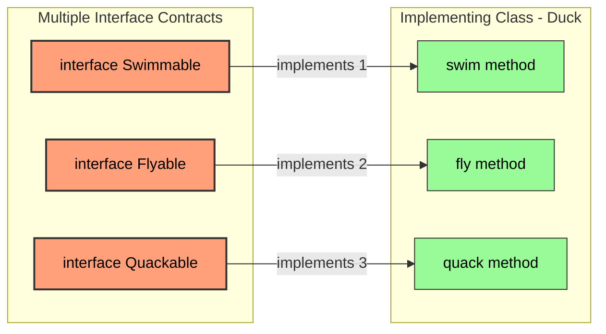
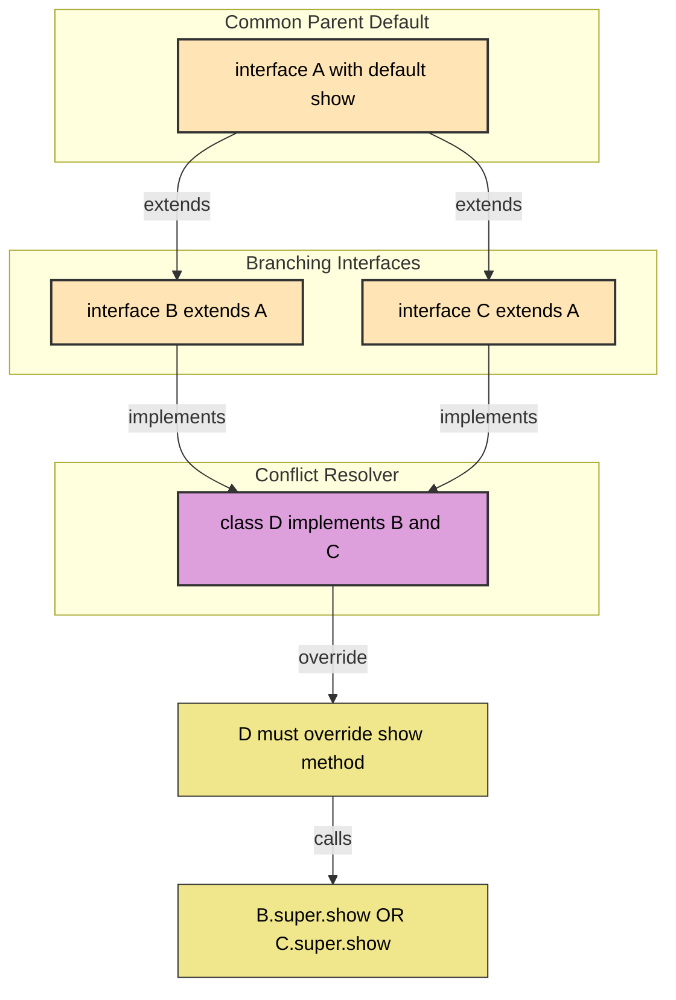
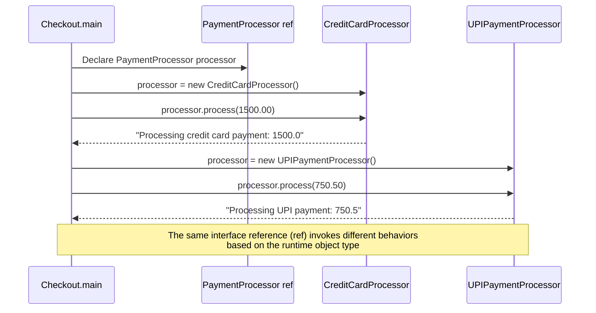

# implementing interfaces

<!-- SECTION_1_START -->
# Implementing Interfaces in Java — KTU 2024 Scheme Notes

## 1.1 Formal Academic Definition

> [!NOTE]
> **Interface Implementation in Java** is the mechanism by which a class *concretizes* the abstract contract declared by an interface using the `implements` keyword. The implementing class must provide **method bodies** for **all abstract methods** declared in the interface, unless the class itself is declared `abstract`.

According to the KTU 2024 OOP syllabus (PBCST304, Module 3), **implementing an interface** is one of the foundational pillars of polymorphism and abstraction. The Java Language Specification (JLS §8.1.4, §9.1.4) states that an interface may be implemented by *any number of classes*, and a single class may implement *multiple interfaces*, thereby enabling **multiple inheritance of type** in Java.

### Key Terminology

- **Interface** — A purely abstract type containing abstract methods (`abstract`), default methods (`default`), static methods (`static`), and constants (`public static final`).
- **Implementing Class** — A concrete class that uses the `implements` clause to bind itself to one or more interface contracts.
- **Instantiation Rule** — Interfaces **cannot be instantiated directly**; they require a concrete implementing class or an anonymous class.
- **Override Obligation** — Every abstract method of the interface **must** be overridden in the implementing class (unless the class is `abstract`).
- **Method Visibility** — Overridden interface methods must be declared `public` (cannot reduce visibility from `public abstract`).

---

## 1.2 Conceptual Analogy / Intuition

> [!IMPORTANT]
> **The "Job Contract" Analogy** — Think of an interface as a **job description** posted by a company. The description lists *what must be done* (abstract methods) but does not say *how*. Any candidate (implementing class) who signs the contract (uses `implements`) must provide their *own concrete way* of fulfilling every listed duty (override methods).

For example, a `Drawable` interface might demand a `draw()` method, but:

- A `Circle` class implements it by drawing with curves.
- A `Square` class implements it by drawing with straight lines.
- A `TextLabel` class implements it by rendering text.

All three satisfy the *contract* but execute it **differently** — this is **runtime polymorphism** in action.

> [!TIP]
> **Geometric Intuition:** Imagine an interface as a *blueprint outline* of a shape with empty interiors. Each implementing class *fills in* the interior with its own pattern, but the *outer boundary* (the contract) remains the same.

---

## 1.3 Physical Constants and Standard Metrics

> [!NOTE]
> In Java, the following **method modifiers** are critical when implementing interfaces:
> - **`public`** — The overriding method's access modifier **must be `public`**. Visibility reduction is a compile-time error.
> - **Default values for interface fields** — All fields in an interface are implicitly `public static final` (**compile-time constants**). They must be initialized at declaration.

The standard **method override rules** enforced by the Java compiler are:

1. Method name and parameter list must match exactly.
2. Return type must be the same or a *covariant* subtype.
3. The access modifier cannot be more restrictive.
4. The implementing class cannot throw *new* or *broader* checked exceptions.

---

## 1.4 Visualization Control

> [!VISUALIZATION CONTROL]
> **Concept:** Visualizing the *Interface Contract* as a geometric template filled by implementing classes.
> **GeoGebra / Desmos Input Equations:**
> - *Outer Boundary (Interface):* Circle of radius 3, centered at origin: $x^2 + y^2 = 9$
> - *Circle Implementation:* $x^2 + y^2 = 9$ filled with solid blue
> - *Square Implementation:* $\max(\vert x \vert, \vert y \vert) = 2$ filled with solid red
> - *Triangle Implementation:* Triangle with vertices at $(-2,-2), (2,-2), (0,2)$ filled with solid green
> **Visual Description:** Three shapes share the same conceptual boundary (the contract `Drawable`), but each is internally a *different* shape — illustrating polymorphic fulfillment of the same contract.
<!-- SECTION_1_END -->

<!-- SECTION_2_START -->
# Deep Theoretical Analysis & KTU High-Yield Formula Sheet

## 2.1 Operational Breakdown of Interface Implementation

Implementing an interface in Java follows a strict **5-step logical pipeline**:

1. **Declare the Interface** — Use the `interface` keyword. List abstract method signatures (no body).
2. **Declare the Implementing Class** — Use the `class` keyword followed by `implements InterfaceName`.
3. **Override All Abstract Methods** — Provide method bodies matching the interface signatures exactly.
4. **Ensure Visibility Compliance** — Mark all overrides as `public`.
5. **Handle Multiple Interfaces** — Use comma-separated names in the `implements` clause: `class A implements I1, I2, I3`.

### Why Each Step Matters

- **Step 1** establishes the *contract* — pure abstraction.
- **Step 2** binds the class to the contract; without `implements`, the class is *unaware* of the interface.
- **Step 3** is enforced by the compiler — failing this step results in a *compile-time error* unless the class is `abstract`.
- **Step 4** is a hard constraint — the JLS forbids narrowing the visibility of inherited abstract methods.
- **Step 5** is Java's workaround for the *diamond problem* — multiple interface inheritance is permitted because interfaces carry *no state*, only contracts.

---

## 2.2 Single Interface vs. Multiple Interface Implementation

| **Aspect** | **Single Interface Implementation** | **Multiple Interface Implementation** |
|---|---|---|
| **Syntax** | `class A implements I1` | `class A implements I1, I2, I3` |
| **Inheritance Type** | Single contract binding | Multi-contract binding (Java's multiple inheritance) |
| **Method Conflicts** | No conflict possible | Must resolve default method conflicts explicitly |
| **Diamond Problem** | Does not arise | Arises only with default methods; resolved via `InterfaceName.super.method()` |
| **State Inheritance** | No state (interfaces have only `static final` fields) | No state — purely behavioral |
| **Use Case** | Single capability extension | Role-based composition (e.g., `class Duck implements Swimmable, Flyable, Quackable`) |

---

## 2.3 KTU High-Yield Formula / Rules Sheet

| **Rule Number** | **Concept** | **Syntax / Formula** | **Compiler Enforcement** |
|---|---|---|---|
| R1 | Interface declaration | `interface Name { ... }` | Mandatory `interface` keyword |
| R2 | Implementing class | `class Cls implements Inf` | Must use `implements` keyword |
| R3 | Multiple interfaces | `class Cls implements I1, I2` | Comma-separated list |
| R4 | Mandatory override | All abstract methods of the interface | Compile-time error if missing (unless class is `abstract`) |
| R5 | Visibility | `public` keyword on overrides | Cannot be `private` or `protected` |
| R6 | Method signature | Exact match: name + parameter types + order | Compile-time error on mismatch |
| R7 | Covariant return types | Return type $\le$ declared return type | Permitted; subtypes allowed |
| R8 | Field constants | `public static final` (implicit) | Must be initialized at declaration |
| R9 | Default methods | `default` keyword in interface | Can be optionally overridden |
| R10 | Static methods | `static` keyword in interface | Cannot be overridden, only hidden |
| R11 | `extends` for interfaces | `interface I2 extends I1` | Interfaces can extend multiple interfaces |
| R12 | Abstract implementing class | `abstract class Cls implements Inf` | Permitted; abstract methods may remain unimplemented |
| R13 | Diamond resolution | `I1.super.method()` | Mandatory when default method conflicts exist |
| R14 | Anonymous implementation | `new InterfaceName() { ... }` | Inline class instantiation |
| R15 | Marker interface | `interface Serializable {}` | No methods; used for tagging |

---

## 2.4 Real-World Engineering Utility

> [!IMPORTANT]
> Interface implementation is the **backbone of production-grade Java systems**. Below are concrete use cases:

- **JDBC API** — `Connection`, `Statement`, `ResultSet` are interfaces. Drivers (`MySQL`, `PostgreSQL`, `Oracle`) provide implementing classes, allowing database-agnostic code.
- **Java Collections Framework** — `List`, `Set`, `Map` are interfaces. `ArrayList`, `HashSet`, `HashMap` are implementing classes.
- **Dependency Injection (Spring Framework)** — Beans are wired via interface contracts, enabling loose coupling and unit testability with mock implementations.
- **Plugin Architectures** — Applications like Eclipse IDE define extension points as interfaces, and third-party plugins implement them.
- **Strategy Design Pattern** — Algorithms (e.g., `Comparator`, `PaymentStrategy`) are encapsulated as interfaces; classes implement them with concrete behaviors.
- **Callback Mechanisms** — `Runnable`, `Callable`, `ActionListener` are interfaces; threads and event handlers implement them.
<!-- SECTION_2_END -->

<!-- SECTION_3_START -->
# Step-by-Step Derivations & Code Implementation

## 3.1 Derivation: From Interface Contract to Concrete Implementation

The process of *implementing an interface* can be expressed as a **formal mapping**:

$$
\text{Interface } I = \{ m_1, m_2, \ldots, m_n \}
$$

$$
\text{Implementing Class } C = \{ b_1, b_2, \ldots, b_n \} \quad \text{where } b_i \text{ is the body of } m_i
$$

The compile-time **invariant** is:

$$
\forall \, m_i \in I: \, \exists \, b_i \in C \, \text{such that} \, \text{signature}(b_i) = \text{signature}(m_i) \;\land\; \text{visibility}(b_i) = \text{public}
$$

If this invariant is violated, the Java compiler raises:

```
error: Class C is not abstract and does not override abstract method m_i() in I
```

---

## 3.2 Example 1: Single Interface Implementation (Model 1)

```java
// File: Payable.java
package finance;

public interface Payable {
    double calculatePay();
    void generateSlip();
}
```

```java
// File: Employee.java
package finance;

public class Employee implements Payable {
    private String name;
    private double baseSalary;

    public Employee(String name, double baseSalary) {
        this.name = name;
        this.baseSalary = baseSalary;
    }

    @Override
    public double calculatePay() {
        return baseSalary * 0.85;
    }

    @Override
    public void generateSlip() {
        System.out.println("Slip for " + name + " : " + calculatePay());
    }
}
```

**Step-by-step evaluation:**

1. `interface Payable` declares two abstract methods: `calculatePay()` and `generateSlip()`.
2. `class Employee implements Payable` binds the class to the contract.
3. The `@Override` annotation is **optional but strongly recommended** — the compiler verifies the method signature.
4. Both methods are explicitly marked `public`, satisfying the visibility rule.
5. `calculatePay()` returns a `double` — exact match with the interface declaration.

---

## 3.3 Example 2: Multiple Interface Implementation

```java
// File: Swimmable.java
package behavior;

public interface Swimmable {
    void swim();
}
```

```java
// File: Flyable.java
package behavior;

public interface Flyable {
    void fly();
}
```

```java
// File: Duck.java
package behavior;

public class Duck implements Swimmable, Flyable {
    private String species;

    public Duck(String species) {
        this.species = species;
    }

    @Override
    public void swim() {
        System.out.println(species + " is paddling on the water surface.");
    }

    @Override
    public void fly() {
        System.out.println(species + " is flapping wings at 5 m/s.");
    }
}
```

**Evaluation logic:**

- `Duck` binds to *two* contracts: `Swimmable` and `Flyable`.
- Every method from both interfaces must be overridden.
- The class is **not abstract**, so all overrides are mandatory.
- Runtime: A reference of type `Swimmable` or `Flyable` can polymorphically point to a `Duck` object.

---

## 3.4 Example 3: Default Method Conflict Resolution (Diamond Problem)

```java
// File: Printer.java
package devices;

public interface Printer {
    default void connect() {
        System.out.println("Printer: connecting via USB.");
    }
}
```

```java
// File: Scanner.java
package devices;

public interface Scanner {
    default void connect() {
        System.out.println("Scanner: connecting via Wi-Fi.");
    }
}
```

```java
// File: MultiFunctionDevice.java
package devices;

public class MultiFunctionDevice implements Printer, Scanner {
    @Override
    public void connect() {
        Printer.super.connect();
        Scanner.super.connect();
        System.out.println("MultiFunctionDevice: both subsystems online.");
    }
}
```

**Step-by-step resolution:**

1. `MultiFunctionDevice` inherits two `connect()` default methods — a *diamond conflict*.
2. Java does **not** auto-choose — the implementing class **must override** `connect()`.
3. The class invokes `Printer.super.connect()` and `Scanner.super.connect()` to call both parental defaults explicitly.
4. The `super` keyword in this context refers to the **enclosing interface**, not the superclass.

---

## 3.5 Example 4: Abstract Class Implementing an Interface

```java
// File: Shape.java
package graphics;

public interface Shape {
    double area();
    double perimeter();
}
```

```java
// File: AbstractShape.java
package graphics;

public abstract class AbstractShape implements Shape {
    protected String color;

    public AbstractShape(String color) {
        this.color = color;
    }

    // area() and perimeter() are NOT overridden here.
    // The class is abstract, so the compiler allows this.
}
```

```java
// File: Circle.java
package graphics;

public class Circle extends AbstractShape {
    private double radius;

    public Circle(String color, double radius) {
        super(color);
        this.radius = radius;
    }

    @Override
    public double area() {
        return Math.PI * radius * radius;
    }

    @Override
    public double perimeter() {
        return 2 * Math.PI * radius;
    }
}
```

**Evaluation:**

- `AbstractShape` is *partial* implementation — it leaves the abstract methods for subclasses.
- `Circle` is *concrete* — it must finish the contract.
- This forms a **two-tier implementation chain**: Interface → Abstract Class → Concrete Class.

---

## 3.6 Example 5: Polymorphic Invocation via Interface Reference

```java
// File: PaymentProcessor.java
package transaction;

public interface PaymentProcessor {
    void process(double amount);
}
```

```java
// File: CreditCardProcessor.java
package transaction;

public class CreditCardProcessor implements PaymentProcessor {
    @Override
    public void process(double amount) {
        System.out.println("Processing credit card payment: " + amount);
    }
}
```

```java
// File: UPIPaymentProcessor.java
package transaction;

public class UPIPaymentProcessor implements PaymentProcessor {
    @Override
    public void process(double amount) {
        System.out.println("Processing UPI payment: " + amount);
    }
}
```

```java
// File: Checkout.java
package transaction;

public class Checkout {
    public static void main(String[] args) {
        PaymentProcessor processor;

        processor = new CreditCardProcessor();
        processor.process(1500.00);

        processor = new UPIPaymentProcessor();
        processor.process(750.50);
    }
}
```

**Output trace:**

```
Processing credit card payment: 1500.0
Processing UPI payment: 750.5
```

**Key insight:** The reference variable `processor` is of type `PaymentProcessor` (interface), but it can hold *any* implementing class. The actual method dispatched depends on the *runtime type* of the object — this is **dynamic polymorphism**.

---

## 3.7 Example 6: Nested Interface Implementation

```java
// File: OuterContainer.java
package nested;

public class OuterContainer {
    public interface NestedCallback {
        void onComplete(String result);
    }
}
```

```java
// File: TaskRunner.java
package nested;

public class TaskRunner implements OuterContainer.NestedCallback {
    @Override
    public void onComplete(String result) {
        System.out.println("Task complete with result: " + result);
    }
}
```

**Evaluation:**

- `NestedCallback` is a *member interface* of `OuterContainer`.
- It is qualified as `OuterContainer.NestedCallback` for implementation.
- This pattern is used in Android SDK (e.g., `View.OnClickListener`).

---

## 3.8 Example 7: Anonymous Class Implementation (One-Shot Implementation)

```java
// File: GreetingApp.java
package anonymous;

public class GreetingApp {
    public static void main(String[] args) {
        Greeting hello = new Greeting() {
            @Override
            public void sayHello(String name) {
                System.out.println("Hello, " + name + "!");
            }
        };
        hello.sayHello("Alice");
    }
}
```

```java
// File: Greeting.java
package anonymous;

public interface Greeting {
    void sayHello(String name);
}
```

**Evaluation:**

- The `new Greeting() { ... }` syntax creates an **anonymous class** that implements the interface *inline*.
- This is useful for **event listeners**, **callbacks**, and **strategy injection** at the call site.
- The anonymous class is compiled to a separate `.class` file: `GreetingApp$1.class`.
<!-- SECTION_3_END -->

<!-- SECTION_4_START -->
# Structural Diagrams & Schematics

## 4.1 Interface Implementation Topology



---

## 4.2 Multiple Interface Implementation Diagram



---

## 4.3 Diamond Problem Resolution Flow



---

## 4.4 Sequential Implementation Pipeline

```mermaid
flowchart TD
    start([Start: Interface Contract Exists]) --> step1["Step 1: Declare class with implements clause"]
    step1 --> step2["Step 2: Compiler checks all abstract methods"]
    step2 --> decision1{"All methods overridden?"}
    decision1 -->|No - class is abstract| pathA["Permitted: subclass must complete"]
    decision1 -->|No - class is concrete| error1["COMPILE ERROR: must override all"]
    decision1 -->|Yes| step3["Step 3: Verify public visibility"]
    step3 --> decision2{"All public?"}
    decision2 -->|No| error2["COMPILE ERROR: cannot reduce visibility"]
    decision2 -->|Yes| step4["Step 4: Resolve default conflicts if any"]
    step4 --> decision3{"Default conflicts?"}
    decision3 -->|Yes| pathB["Override and call InterfaceName.super.method"]
    decision3 -->|No| step5["Step 5: Compile successful"]
    step5 --> end([End: Implementation Complete])

    style start fill:#87CEEB,stroke:#333,stroke-width:2px,color:#000
    style end fill:#87CEEB,stroke:#333,stroke-width:2px,color:#000
    style step1 fill:#FFFACD,stroke:#333,stroke-width:1px,color:#000
    style step2 fill:#FFFACD,stroke:#333,stroke-width:1px,color:#000
    style step3 fill:#FFFACD,stroke:#333,stroke-width:1px,color:#000
    style step4 fill:#FFFACD,stroke:#333,stroke-width:1px,color:#000
    style step5 fill:#90EE90,stroke:#333,stroke-width:2px,color:#000
    style error1 fill:#FFB6C1,stroke:#333,stroke-width:2px,color:#000
    style error2 fill:#FFB6C1,stroke:#333,stroke-width:2px,color:#000
    style pathA fill:#FFA500,stroke:#333,stroke-width:1px,color:#000
    style pathB fill:#FFA500,stroke:#333,stroke-width:1px,color:#000
    style decision1 fill:#E6E6FA,stroke:#333,stroke-width:1px,color:#000
    style decision2 fill:#E6E6FA,stroke:#333,stroke-width:1px,color:#000
    style decision3 fill:#E6E6FA,stroke:#333,stroke-width:1px,color:#000
```

---

## 4.5 Runtime Polymorphism via Interface Reference


<!-- SECTION_4_END -->

<!-- SECTION_5_START -->
# KTU 2024 Scheme Examination Question Bank

## 5.1 Part A Questions (3 Marks Each)

### Question 1
**[KTU University Exam - Dec 2023]**  
**CO1 | Bloom Level: Remember**

> Define an interface in Java. What is the significance of the `implements` keyword?

**Model Answer:**

An **interface** in Java is a reference type, similar to a class, that can contain only abstract methods, default methods, static methods, and constants (implicitly `public static final`). It is declared using the `interface` keyword and represents a *pure abstract contract*.

The `implements` keyword is used by a class to *concretize* one or more interfaces. When a class declares `implements InterfaceName`, it commits to providing method bodies for **all abstract methods** declared in the interface. This is the primary mechanism through which Java achieves *abstraction* and *multiple inheritance of type*.

> **[Valuation Key: Definition clarity - 1.5 Marks | Significance of implements - 1.5 Marks]**

---

### Question 2
**[KTU University Exam - July 2024]**  
**CO1 | Bloom Level: Understand**

> Can a class implement multiple interfaces in Java? Illustrate with a one-line syntax example.

**Model Answer:**

Yes, a Java class can implement **multiple interfaces** simultaneously. This feature enables *multiple inheritance of type*, allowing a class to fulfill several behavioral contracts at once. The interfaces are listed in a comma-separated format after the `implements` keyword.

**Syntax illustration:**

```java
class SmartPhone implements Callable, Camera, GPS {
    // ...
}
```

This indicates that `SmartPhone` must provide implementations for the abstract methods of *all three* interfaces.

> **[Valuation Key: Yes answer with explanation - 2 Marks | Correct syntax - 1 Mark]**

---

## 5.2 Part B Questions (14 Marks Each)

### Question A (14 Marks)
**[KTU University Exam - Dec 2023]**  
**CO2, CO3 | Bloom Level: Apply, Analyze**

> **(a)** Write a Java program to define an interface `BankAccount` with methods `deposit(double)`, `withdraw(double)`, and `getBalance()`. Implement this interface in a class `SavingsAccount` with a minimum balance constraint of ₹1000. (7 Marks)

> **(b)** Demonstrate the use of interface reference to achieve polymorphism by creating another class `CurrentAccount` implementing the same interface and invoking the methods from a driver class. (7 Marks)

#### Part (a) Model Solution

```java
// File: BankAccount.java
package banking;

public interface BankAccount {
    void deposit(double amount);
    void withdraw(double amount);
    double getBalance();
}
```

```java
// File: SavingsAccount.java
package banking;

public class SavingsAccount implements BankAccount {
    private double balance;
    private static final double MIN_BALANCE = 1000.0;

    public SavingsAccount(double initialBalance) {
        if (initialBalance < MIN_BALANCE) {
            throw new IllegalArgumentException(
                "Initial balance must be at least " + MIN_BALANCE
            );
        }
        this.balance = initialBalance;
    }

    @Override
    public void deposit(double amount) {
        if (amount <= 0) {
            System.out.println("Invalid deposit amount.");
            return;
        }
        balance += amount;
        System.out.println("Deposited: " + amount + " | New Balance: " + balance);
    }

    @Override
    public void withdraw(double amount) {
        if (amount <= 0) {
            System.out.println("Invalid withdrawal amount.");
            return;
        }
        if (balance - amount < MIN_BALANCE) {
            System.out.println("Withdrawal denied. Minimum balance of " 
                + MIN_BALANCE + " must be maintained.");
        } else {
            balance -= amount;
            System.out.println("Withdrawn: " + amount + " | New Balance: " + balance);
        }
    }

    @Override
    public double getBalance() {
        return balance;
    }
}
```

**Valuation Key for Part (a):**

- [Correct interface declaration with 3 methods: **2 Marks**]
- [Correct use of `implements` keyword: **1 Mark**]
- [Valid minimum balance check logic in `withdraw()`: **2 Marks**]
- [Proper method overrides with `public` visibility and `@Override`: **2 Marks**]

#### Part (b) Model Solution

```java
// File: CurrentAccount.java
package banking;

public class CurrentAccount implements BankAccount {
    private double balance;

    public CurrentAccount(double initialBalance) {
        this.balance = initialBalance;
    }

    @Override
    public void deposit(double amount) {
        if (amount <= 0) {
            System.out.println("Invalid deposit amount.");
            return;
        }
        balance += amount;
        System.out.println("[Current] Deposited: " + amount 
            + " | New Balance: " + balance);
    }

    @Override
    public void withdraw(double amount) {
        if (amount <= 0) {
            System.out.println("Invalid withdrawal amount.");
            return;
        }
        if (amount > balance) {
            System.out.println("[Current] Insufficient funds.");
        } else {
            balance -= amount;
            System.out.println("[Current] Withdrawn: " + amount 
                + " | New Balance: " + balance);
        }
    }

    @Override
    public double getBalance() {
        return balance;
    }
}
```

```java
// File: BankDriver.java
package banking;

public class BankDriver {
    public static void main(String[] args) {
        // Interface reference - polymorphic invocation
        BankAccount account;

        account = new SavingsAccount(5000);
        account.deposit(2000);
        account.withdraw(5500);
        System.out.println("Final Savings Balance: " + account.getBalance());

        System.out.println("---");

        account = new CurrentAccount(10000);
        account.deposit(5000);
        account.withdraw(12000);
        System.out.println("Final Current Balance: " + account.getBalance());
    }
}
```

**Output Trace:**

```
Deposited: 2000.0 | New Balance: 7000.0
Withdrawn: 5500.0 | New Balance: 1500.0
Final Savings Balance: 1500.0
---
[Current] Deposited: 5000.0 | New Balance: 15000.0
[Current] Insufficient funds.
Final Current Balance: 15000.0
```

**Valuation Key for Part (b):**

- [Correct `CurrentAccount` implementation: **3 Marks**]
- [Interface reference variable declaration: **1 Mark**]
- [Demonstrating polymorphism with `account = new SavingsAccount()` and `account = new CurrentAccount()`: **2 Marks**]
- [Correct output and explanation of runtime dispatch: **1 Mark**]

---

### Question B (14 Marks) — Alternative Choice
**[KTU University Exam - July 2024]**  
**CO2, CO3 | Bloom Level: Apply, Analyze**

> **(a)** Explain the concept of *multiple interface implementation* in Java. Write a Java program where a class `SmartDevice` implements three interfaces: `Connectable`, `Rechargeable`, and `Displayable`, each with at least one method. (7 Marks)

> **(b)** What is the *diamond problem* in the context of interface default methods? Write a Java program demonstrating how Java resolves default method conflicts using `InterfaceName.super.method()`. (7 Marks)

#### Part (a) Model Solution

**Conceptual Explanation:**

Java does not support multiple inheritance of *classes* (to avoid the *Diamond Problem* of state ambiguity). However, it *does* support multiple inheritance of *interfaces*, since interfaces carry no instance state — only method contracts. A class can implement any number of interfaces by listing them in a comma-separated `implements` clause, and must provide implementations for *all* abstract methods across all interfaces.

```java
// File: Connectable.java
package iot;

public interface Connectable {
    void connect(String network);
}
```

```java
// File: Rechargeable.java
package iot;

public interface Rechargeable {
    void recharge(int percent);
}
```

```java
// File: Displayable.java
package iot;

public interface Displayable {
    void display(String content);
}
```

```java
// File: SmartDevice.java
package iot;

public class SmartDevice implements Connectable, Rechargeable, Displayable {
    private String deviceName;
    private int batteryLevel;

    public SmartDevice(String deviceName, int batteryLevel) {
        this.deviceName = deviceName;
        this.batteryLevel = batteryLevel;
    }

    @Override
    public void connect(String network) {
        System.out.println(deviceName + " connected to " + network);
    }

    @Override
    public void recharge(int percent) {
        batteryLevel += percent;
        if (batteryLevel > 100) batteryLevel = 100;
        System.out.println(deviceName + " recharged to " + batteryLevel + "%");
    }

    @Override
    public void display(String content) {
        System.out.println(deviceName + " screen: " + content);
    }
}
```

**Valuation Key for Part (a):**

- [Clear conceptual explanation of multiple interface inheritance: **2 Marks**]
- [Three distinct interface declarations: **1.5 Marks**]
- [Correct `implements C, R, D` syntax: **1 Mark**]
- [Complete method overrides for all 3 interfaces: **2.5 Marks**]

#### Part (b) Model Solution

**Conceptual Explanation:**

The **Diamond Problem** arises when a class inherits two default methods with the *same signature* from different interfaces. Since both methods are *concrete* (have bodies), the compiler cannot auto-select one. Java's rule: **the implementing class must override the conflicting method** and explicitly invoke the desired parent default using `InterfaceName.super.method()`.

```java
// File: Logger.java
package logging;

public interface Logger {
    default void log(String message) {
        System.out.println("[LOGGER] " + message);
    }
}
```

```java
// File: Auditor.java
package logging;

public interface Auditor {
    default void log(String message) {
        System.out.println("[AUDITOR] " + message);
    }
}
```

```java
// File: ComplianceModule.java
package logging;

public class ComplianceModule implements Logger, Auditor {
    @Override
    public void log(String message) {
        Logger.super.log(message);
        Auditor.super.log(message);
        System.out.println("[COMPLIANCE] Log entry archived: " + message);
    }
}
```

```java
// File: MainApp.java
package logging;

public class MainApp {
    public static void main(String[] args) {
        ComplianceModule cm = new ComplianceModule();
        cm.log("User login successful");
    }
}
```

**Output Trace:**

```
[LOGGER] User login successful
[AUDITOR] User login successful
[COMPLIANCE] Log entry archived: User login successful
```

**Valuation Key for Part (b):**

- [Correct explanation of Diamond Problem in default methods: **2 Marks**]
- [Two interfaces with identical default method signatures: **1.5 Marks**]
- [Compulsory override in implementing class: **1.5 Marks**]
- [Correct use of `InterfaceName.super.method()` syntax to resolve conflict: **2 Marks**]

---

> [!WARNING]
> **KTU Examiner's Valuation Warning / Pitfall Callout:**
> 1. **Forgetting `public` modifier on overrides** — Most common deduction (1–2 marks). Interface methods are implicitly `public abstract`, so overrides MUST be `public`. Writing `void calculatePay() { }` without `public` causes a compile error.
> 2. **Missing the `@Override` annotation** — While not a syntax error, the KTU examiner may deduct 0.5 marks for not using it, as it indicates lack of intent to override.
> 3. **In diamond problem questions, students often write `super.log()` instead of `Logger.super.log()`** — This is a fatal error. `super` alone refers to the *superclass*, not the *enclosing interface*.
> 4. **For multiple interface implementation, students sometimes confuse `extends` and `implements`** — Classes use `implements`; interfaces use `extends` to inherit from other interfaces.
> 5. **Not initializing interface constants** — All fields in an interface are `public static final` and must be initialized at declaration. `int MAX;` inside an interface is a compile error.
> 6. **Failing to mention that interfaces cannot be instantiated** — When asked "can we create an object of an interface?", the answer is NO. A common follow-up: "How do we use it then?" — via an implementing class or anonymous class.

---

## 5.3 Topic Recap & Important Things to Remember

> [!TIP]
> **Rapid Revision Checklist for KTU Exam Day:**

- ✅ **Interface declaration** uses the `interface` keyword — never `class`.
- ✅ **Implementing class** uses `implements` (not `extends`) to bind to an interface.
- ✅ **Multiple interface implementation** is allowed via comma-separated list: `class X implements I1, I2`.
- ✅ **All abstract methods MUST be overridden** by the implementing class, unless the class itself is declared `abstract`.
- ✅ **Override visibility must be `public`** — no narrowing allowed.
- ✅ **Interface fields are implicitly `public static final`** — i.e., compile-time constants, must be initialized.
- ✅ **Interfaces cannot be instantiated** — use an implementing class object or anonymous class.
- ✅ **Default methods** (introduced in Java 8) use the `default` keyword and CAN be overridden optionally.
- ✅ **Static methods** in interfaces are not inherited — they are accessed via `InterfaceName.method()`.
- ✅ **Diamond Problem** with default methods is resolved by **mandatory override** in the implementing class using `InterfaceName.super.method()`.
- ✅ **Abstract classes CAN implement interfaces** without overriding all methods (they may leave some abstract for their concrete subclasses).
- ✅ **Interface references** can hold any implementing class object — enabling **runtime polymorphism**.
- ✅ **`extends` is used between interfaces** for interface-to-interface inheritance: `interface I2 extends I1`.
- ✅ **A class can extend ONE superclass** AND implement MULTIPLE interfaces simultaneously.
- ✅ **Common real-world interfaces**: `Runnable`, `Comparable`, `Serializable`, `Iterable`, `List`, `Map`, `ActionListener`.
- ✅ **Anonymous classes** provide one-shot implementation: `new InterfaceName() { @Override public void method() { ... } };`
- ✅ **Nested interfaces** are qualified by their enclosing class: `OuterClass.NestedInterface`.
- ✅ **KTU favorite question patterns**: Diamond problem, multiple interface inheritance, interface reference polymorphism, default methods, and nested interface implementation.
- ✅ **Common KTU 14-mark question structure**: Part (a) for single interface implementation with logic (7 marks), Part (b) for multiple interface or polymorphism demonstration (7 marks).
- ✅ **Valuation mantra**: Always include `public` on overrides, use `@Override` annotation, and explicitly state polymorphism benefits in your answer narrative.
<!-- SECTION_5_END -->
