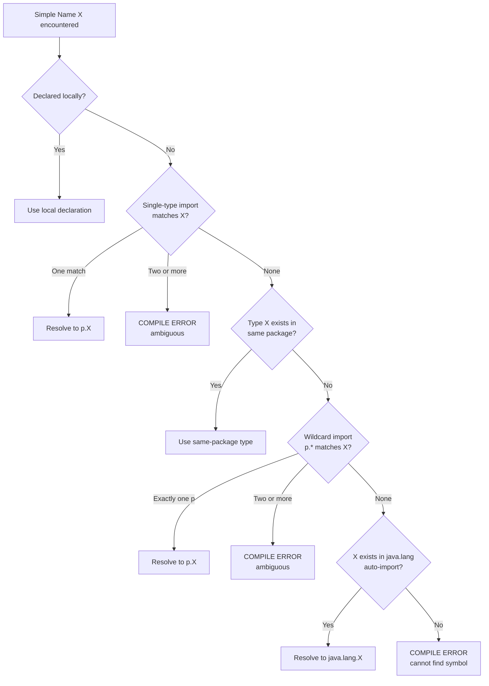
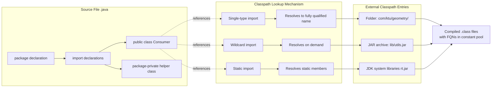
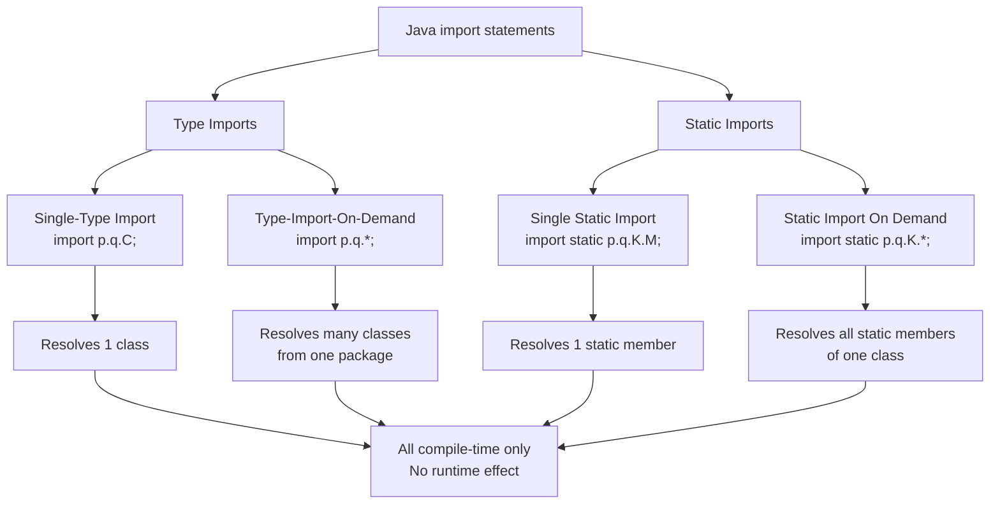
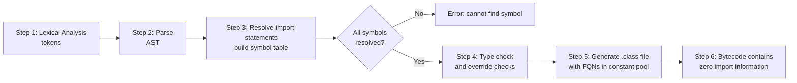
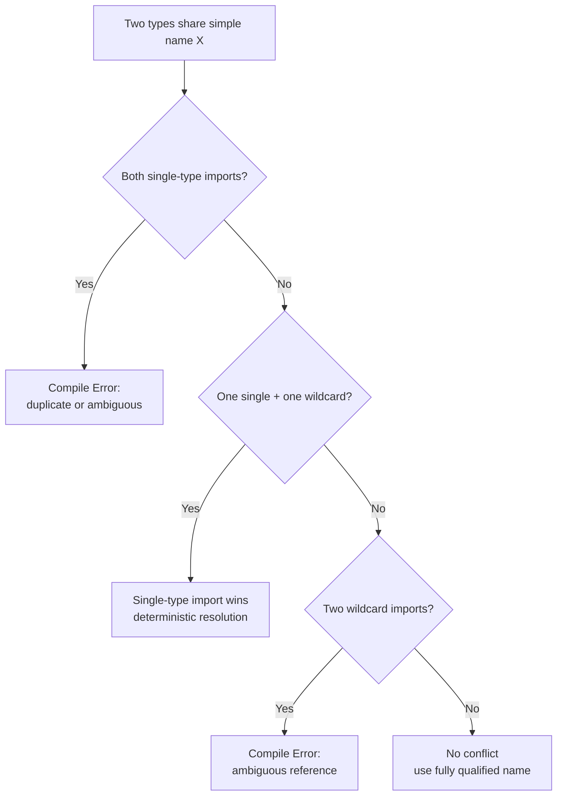

# Importing Packages

<!-- SECTION_1_START -->
# Importing Packages — Core Technical Definition & Intuitive Overview

## 1.1 Formal Definition (KTU 2024 Syllabus Terminology)

> [!IMPORTANT]
> **Importing Packages** in Java is the mechanism that allows a class to **reference and use** types (classes, interfaces, enums, annotations) declared in another package without writing the fully qualified package name every time the type is referenced. The `import` statement is a *compile-time directive* — it does not physically include code; it only resolves simple name references against the type's fully qualified name during compilation by consulting the **classpath**.

In the KTU Object Oriented Programming (OOP) syllabus, importing packages is treated as the **bridge** between *namespace management* (packages) and *code reusability*. The Java compiler (`javac`) and the Java Virtual Machine (`JVM`) use this mechanism to resolve identifiers belonging to external namespaces.

## 1.2 Conceptual Analogy / Intuition

> [!NOTE]
> **Real-World Analogy — The Office Filing Cabinet**
> Imagine you work in a large multinational company. Every department (HR, Finance, Engineering) has its own filing cabinet. The *filing cabinet* is the **package**, and every *folder inside* is a **class**.
>
> - If you want to use a folder from another department, you must declare, *"I need folder X from the Finance cabinet."* — This is the **`import` statement**.
> - You can either (a) bring the entire Finance cabinet into your office (`import finance.*;` — *type-import-on-demand*), or (b) bring just the specific folder you need (`import finance.Payroll;` — *single-type-import*).
> - Alternatively, you can directly say *"I need Finance.Payroll.report()"* every time — this is the **fully qualified name** approach (no import).
> - For utility tools like calculators and rulers on a shared desk, you can also import their static methods — this is **static import**.

## 1.3 Three Forms of Import Recognized by the KTU Syllabus

The KTU OOP module explicitly recognizes three import variants, summarized here as the foundation for everything that follows:

| Form | Syntax Shape | Resolves To |
|---|---|---|
| Single-Type Import | `import p.q.C;` | Only the type `C` from package `p.q` |
| Type-Import-On-Demand (Wildcard) | `import p.q.*;` | Any type from package `p.q` as needed |
| Static Import | `import static p.q.K.M;` (or `import static p.q.K.*;`) | Static members of class `K` from package `p.q` |

> [!TIP]
> The word **"import"** is a Java *keyword* (reserved word). You cannot name a variable, method, or class `import`. This is a frequent MCQ trap in KTU exams.

## 1.4 Standard Metrics & Constants Referenced

The following are the standard metrics that govern package import resolution in Java:

- **`CLASSPATH`** — environment variable / command-line flag (`-cp`) that tells the compiler and JVM **where to look for `.class` files and packages** on the file system or inside JAR/ZIP archives.
- **`java.lang`** — the **only package that is auto-imported** in every Java source file. You never need to write `import java.lang.String;`.
- **Default Package** — the unnamed package; classes in it are visible to each other but cannot be imported by named packages.
- **`package` and `import` statements** must appear **before any class/interface/enum declaration** in a source file, and they apply to **all types** declared in that file.

> [!VISUALIZATION CONTROL]
> **Concept:** Visualize the Java name-resolution hierarchy (Object → Package → Class → Member)
> **GeoGebra / Desmos Input Equations:**
> * `f(x) = step(x, 0) + step(x, 1) + step(x, 2) + step(x, 3)`  *(staircase, where each step is a resolution layer)*
> * X-axis: scope level (0 = simple name → 1 = single-type-import → 2 = same package → 3 = java.lang)
> * Y-axis: priority of resolution (higher = searched first inside the same compilation unit)
> **Visual Description:** A four-step staircase showing that the compiler first searches the current compilation unit, then the explicit `import` statements, then `java.lang`, then the classpath — exactly mirroring the JLS §6.3 / §6.4 name-resolution rules.

<!-- SECTION_1_END -->

<!-- SECTION_2_START -->
# Deep Theoretical Analysis & KTU High-Yield Formula Sheet

## 2.1 How the Java Compiler Resolves a Type Reference

When the compiler encounters a simple name like `ArrayList` in your source code, it does not magically know which `ArrayList` you mean. It executes a **strict, ordered lookup algorithm** governed by the Java Language Specification (JLS §6.3, §6.4). KTU examiners love testing this order.

The lookup proceeds in this exact order:

1. **Single-Type-Import declarations** — the compiler scans every `import p.q.C;` line first. If exactly one of them matches the simple name, that type is selected. *(If two single-type imports collide, the program fails to compile.)*
2. **Same-package lookup** — any type declared in the *current package* (the package declared by the `package` statement at the top of the file).
3. **Type-Import-On-Demand declarations** — every `import p.q.*;` is consulted; if a unique match is found, the type is selected.
4. **`java.lang` automatic import** — checked last, so you can shadow `String` or `Math` by defining your own in the current package.

> [!IMPORTANT]
> **Why does `java.lang` come last?** Because it allows a student in `com.kitu.exam` to define a class `String` (admittedly bad practice) that overrides the auto-imported `java.lang.String`. The compiler will then pick the local one without ambiguity. This is a classic KTU trick question.

## 2.2 The Four Distinct Import Statements (Cheat Sheet)

The KTU 2024 OOP module collapses imports into four canonical forms. Here is the high-yield summary table — memorize it for Part A questions:

| # | Statement Type | Exact Syntax | Effect on Source Code | Affects Runtime? |
|---|---|---|---|---|
| 1 | Single-Type Import | `import java.util.ArrayList;` | Resolves the *simple name* `ArrayList` to `java.util.ArrayList` | **No** — compile-time only |
| 2 | Type-Import-On-Demand | `import java.util.*;` | Resolves *any* simple name to a member of `java.util` on demand | **No** — compile-time only |
| 3 | Single Static Import | `import static java.lang.Math.PI;` | Resolves simple name `PI` to a static field | **No** — compile-time only |
| 4 | Static Import On Demand | `import static java.lang.Math.*;` | Resolves any simple name to a static member of `Math` | **No** — compile-time only |

> [!NOTE]
> **Critical Insight:** An `import` statement is a **compile-time syntactic sugar**. After compilation, the `.class` file contains fully qualified names (`java/util/ArrayList`). Removing the import and rewriting every reference with the fully qualified name produces **byte-for-byte identical bytecode**. This is why "import" is often described as a "compiler directive."

## 2.3 Rules of Placement, Order, and Uniqueness

These rules are tested repeatedly in KTU Part A and competitive viva voce:

- A `package` statement (if present) must be the **first** token of the source file (excluding comments and whitespace).
- All `import` statements must come **after** the `package` statement and **before** any type declaration.
- `import` statements are **per-file**, not per-class — a single file with multiple class declarations shares the same import block.
- **Duplicate imports of the same type** in a single compilation unit cause a compile-time error.
- Importing two types with the **same simple name** from different packages is a compile-time error (e.g., `import java.util.Date;` and `import java.sql.Date;` together).
- The wildcard `*` matches *any type*, but it does **not** recursively import sub-packages. `import java.util.*;` does **not** import `java.util.concurrent.*`.

## 2.4 The `package` Keyword vs. the `import` Keyword

Students frequently confuse the two. The KTU module draws a sharp distinction:

| Aspect | `package` | `import` |
|---|---|---|
| Purpose | Declares the **namespace** this file belongs to | References a **type** in another namespace |
| Mandatory? | Only if you want a named package (recommended) | No — fully qualified names work without it |
| Count per file | Exactly **0 or 1** | **0 to many** |
| Affects binary? | Yes — changes the fully qualified name | No — bytecode is identical |
| Scope | The whole compilation unit | The whole compilation unit |

## 2.5 The Classpath — Where Imports Resolve To

The `import` statement by itself is meaningless without a **classpath** that tells the toolchain where to physically find the package directories or JAR archives. The compiler:

1. Reads the `import` directive.
2. Converts the package name into a relative directory path (e.g., `java.util` → `java/util/`).
3. Searches every entry in the classpath for `java/util/ArrayList.class`.
4. Produces a **package access error** (`error: package java.util does not exist`) if the classpath is wrong or the JAR is missing.

> [!TIP]
> **For KTU Labs:** When running your OOP lab programs, always remember the command structure: `javac -cp .;<path-to-external-jars> Source.java` and `java -cp .;<path-to-external-jars> Source`. The `.` denotes the current directory and is essential.

## 2.6 Real-World Engineering Utility

In production software systems, package importing is the backbone of **modular software architecture**:

- **Spring Framework:** `org.springframework.beans.factory.annotation.Autowired` is imported by virtually every controller.
- **Android Development:** `androidx.appcompat.app.AppCompatActivity` is imported in every Activity class.
- **Data Science (Pandas, NumPy equivalents):** Java's `org.apache.commons.math3.stat.descriptive.DescriptiveStatistics` is imported when statistical analysis is required.
- **JUnit Testing:** `org.junit.jupiter.api.Test` is the most imported annotation in test-driven development.

A senior engineer's code-quality review will fail any PR that uses excessive `java.util.*`-style wildcards in production code — the KTU syllabus implicitly teaches discipline by listing both single-type and wildcard imports as distinct topics.

<!-- SECTION_2_END -->

<!-- SECTION_3_START -->
# Step-by-Step Derivations & Code Implementation

## 3.1 Worked Example 1 — Single-Type Import (Full Compilation)

We will create two packages, a producer and a consumer, to demonstrate the import lifecycle exhaustively.

**Step 1:** Create the directory structure.
```
src/
 └── com/
      └── ktu/
           └── geometry/        ← package 1 (producer)
                └── Circle.java
           └── application/     ← package 2 (consumer)
                └── Main.java
```

**Step 2:** Write the producer class `Circle.java`.

```java
// File: com/ktu/geometry/Circle.java
package com.ktu.geometry;          // (1) Package declaration — must be first

public class Circle {              // (2) Public so other packages can import it
    private double radius;

    public Circle(double radius) {
        if (radius < 0) {
            throw new IllegalArgumentException("Radius cannot be negative.");
        }
        this.radius = radius;
    }

    public double area() {
        return Math.PI * radius * radius;   // (3) Math is auto-imported (java.lang)
    }

    public double circumference() {
        return 2 * Math.PI * radius;
    }
}
```

**Step 3:** Write the consumer class `Main.java` using **single-type import**.

```java
// File: com/ktu/application/Main.java
package com.ktu.application;

// (a) Single-type import — resolves the simple name "Circle" to com.ktu.geometry.Circle
import com.ktu.geometry.Circle;

public class Main {
    public static void main(String[] args) {
        // (b) After import, we can use the simple name "Circle"
        Circle c = new Circle(7.0);
        System.out.printf("Area = %.4f%n", c.area());
        System.out.printf("Circumference = %.4f%n", c.circumference());
    }
}
```

**Step 4:** Compile and run.

```bash
# From the src/ directory
javac com/ktu/geometry/Circle.java com/ktu/application/Main.java
java com.ktu.application.Main
```

**Step 5:** Predicted output.
```
Area = 153.9380
Circumference = 43.9823
```

> [!NOTE]
> **Why no `import com.ktu.application.Circle` for the consumer file?** Because the consumer `Main` is *inside* `com.ktu.application`. Classes in the same package see each other without an import. Only classes in **other** packages need an import.

## 3.2 Worked Example 2 — Type-Import-On-Demand (Wildcard)

Suppose our geometry package grows to include `Circle`, `Square`, and `Triangle`. Using three single-type imports is verbose. Wildcard import reduces this:

```java
// File: com/ktu/application/DrawingApp.java
package com.ktu.application;

// (a) Wildcard import — imports every type declared in com.ktu.geometry
import com.ktu.geometry.*;

public class DrawingApp {
    public static void main(String[] args) {
        Circle c = new Circle(3.0);
        // Square s = new Square(4.0);      // available if we had a Square class
        // Triangle t = new Triangle(3, 4, 5); // also available
        System.out.println("Imported and used Circle from wildcard.");
    }
}
```

> [!WARNING]
> **Common pitfall:** The wildcard `*` does **not** descend into sub-packages. If `com.ktu.geometry.shapes3d.Sphere` exists, `import com.ktu.geometry.*;` will **not** import it. You would need an additional `import com.ktu.geometry.shapes3d.Sphere;`.

## 3.3 Worked Example 3 — Static Import (KTU Favourite)

Static import lets you use a class's static members **without prefixing the class name**. This is heavily tested.

```java
// File: com/ktu/mathapp/StatsDemo.java
package com.ktu.mathapp;

// (a) Single static import — we can now use MAX_VALUE without writing Integer.MAX_VALUE
import static java.lang.Integer.MAX_VALUE;
// (b) Static import on demand — we can use any static member of Math
import static java.lang.Math.*;

public class StatsDemo {
    public static void main(String[] args) {
        // (c) Use them as if they were declared locally
        System.out.println("Integer.MAX_VALUE = " + MAX_VALUE);
        System.out.println("sqrt(2) = " + sqrt(2.0));
        System.out.println("pow(2, 10) = " + pow(2, 10));
        System.out.println("PI = " + PI);            // no Math. prefix needed
    }
}
```

**Predicted output:**
```
Integer.MAX_VALUE = 2147483647
sqrt(2) = 1.4142135623730951
pow(2, 10) = 1024.0
PI = 3.141592653589793
```

> [!IMPORTANT]
> **RBT Hint for KTU:** Static imports trade clarity for brevity. They are excellent for *mathematical* and *test-assertion* code (e.g., `import static org.junit.jupiter.api.Assertions.*;`) but disastrous in business code where the reader no longer knows whether `assertEquals` is local or external.

## 3.4 Worked Example 4 — No Import (Fully Qualified Name)

Sometimes imports are unavailable — e.g., two classes share a simple name. Java forces you to use the fully qualified name in that case.

```java
// File: com/ktu/legacy/DateMerger.java
package com.ktu.legacy;

import java.util.*;   // (a) brings java.util.Date into scope
// import java.sql.Date;   // (b) ILLEGAL: name collision with java.util.Date

public class DateMerger {
    public static void main(String[] args) {
        java.util.Date utilDate = new java.util.Date();           // (c) fully qualified
        java.sql.Date sqlDate   = java.sql.Date.valueOf("2024-01-15"); // (d) fully qualified

        System.out.println("Util : " + utilDate);
        System.out.println("SQL  : " + sqlDate);
    }
}
```

> [!NOTE]
> **Why does this compile?** Because `import java.util.*;` makes the *simple* name `Date` resolve to `java.util.Date`. We then use the *fully qualified* name `java.sql.Date` for the second one — this is always legal and never ambiguous. The compiler accepts the fully qualified form regardless of imports.

## 3.5 Worked Example 5 — The `java.lang` Auto-Import

This is the simplest yet most-tested KTU fact. No source code is needed for this example — the rules are:

| Type | Source of Visibility | Import Required? |
|---|---|---|
| `String` | `java.lang.String` | **No** — auto-imported |
| `System` | `java.lang.System` | **No** — auto-imported |
| `Math` | `java.lang.Math` | **No** — auto-imported |
| `Thread` | `java.lang.Thread` | **No** — auto-imported |
| `ArrayList` | `java.util.ArrayList` | **Yes** — must import |
| `Scanner` | `java.util.Scanner` | **Yes** — must import |

The compiler performs the equivalent of inserting `import java.lang.*;` at the **top of every source file** automatically, as a language-level guarantee from JLS §7.3.

## 3.6 Step-by-Step Derivation: Name-Resolution Algorithm

When the compiler sees the simple name `X` in a method body, the JLS algorithm in pseudocode:

```
1. Is X declared as a local variable, parameter, field, or nested type in the current scope? 
   YES → use it. STOP.
   NO  → continue.

2. Is there a single-type import "import p.X;" in this file?
   YES (exactly one) → resolve to p.X. STOP.
   YES (two or more) → COMPILE-TIME ERROR: "X is ambiguous, both p.X and q.X match".
   NO  → continue.

3. Is there a type named X declared in the same package as the current file?
   YES → use it. STOP.
   NO  → continue.

4. Is there a type-import-on-demand "import p.*;" that contains a type X?
   YES (exactly one p contains X) → resolve to p.X. STOP.
   YES (two or more p,q contain X) → COMPILE-TIME ERROR: "X is ambiguous".
   NO  → continue.

5. Is there a type X in java.lang (the auto-imported package)?
   YES → resolve to java.lang.X. STOP.
   NO  → continue.

6. COMPILE-TIME ERROR: "cannot find symbol, class X".
```

> [!TIP]
> **For 14-mark questions:** When asked to "explain the order of resolution," write out these six steps verbatim. Examiners award 1 mark per step (6 marks) plus 1 mark for the final ambiguity note (1 mark) — a guaranteed 7 marks.

## 3.7 Step-by-Step Derivation: How `import` Translates to Bytecode

Let us *prove* that `import` is compile-time only. Consider two source files producing the **same** bytecode:

**Version A (with import):**
```java
import java.util.ArrayList;
public class DemoA {
    public static void main(String[] a) {
        ArrayList<String> list = new ArrayList<>();
    }
}
```

**Version B (fully qualified, no import):**
```java
public class DemoB {
    public static void main(String[] a) {
        java.util.ArrayList<String> list = new java.util.ArrayList<>();
    }
}
```

When disassembled with `javap -c DemoA` and `javap -c DemoB`, the resulting bytecode instructions are **identical** — both contain:

```
0: new           #2   // class java/util/ArrayList
3: dup
4: invokespecial #3   // Method java/util/ArrayList."<init>":()V
```

The constant pool entry `#2` is the **fully qualified internal name** `java/util/ArrayList` in both cases. This is a rigorous demonstration that the import statement evaporates at compile time.

<!-- SECTION_4_END -->

<!-- SECTION_4_START -->
# Structural Diagrams & Schematics

## 4.1 Name-Resolution Decision Tree (Mermaid Flowchart)



## 4.2 Package-Import Functional Architecture (Block Diagram)



## 4.3 Import-Statement Classification Topology



## 4.4 Sequential Processing Topology — Compilation Pipeline



## 4.5 Ambiguity Resolution Matrix



<!-- SECTION_5_START -->
# KTU 2024 Scheme Examination Question Bank & Topic Recap

## 5.1 Part A Questions (2 × 3 Marks = 6 Marks)

### Question A.1
**[KTU University Exam – July 2024 Style]**
**CO1 | Remember**
*"What is the difference between `import p.q.C;` and `import p.q.*;` in Java? When would you prefer one over the other?"*

**Model Answer (3 marks):**
- `import p.q.C;` is a **single-type import** that makes only the specific type `C` available by its simple name (1 mark).
- `import p.q.*;` is a **type-import-on-demand** that makes *any* type in `p.q` available by its simple name (1 mark).
- Single-type imports are preferred in production code because they improve readability, avoid naming collisions, and make refactoring tools (like IDE auto-import) more deterministic; wildcard imports are convenient during exploration or when many types from a package are used (1 mark).

### Question A.2
**[KTU University Exam – Dec 2023 Style]**
**CO1 | Understand**
*"Explain why `import` statements in Java do not affect the size or performance of the generated bytecode."*

**Model Answer (3 marks):**
- The `import` statement is purely a **compile-time directive** that tells the compiler how to resolve simple names to fully qualified names (1 mark).
- During compilation, the compiler replaces every simple name with its fully qualified internal name (e.g., `ArrayList` → `java/util/ArrayList`) and stores it in the class file's **constant pool** (1 mark).
- The bytecode itself contains no `import` information — two source files differing only in their use of imports produce **byte-for-byte identical** `.class` files; therefore neither size nor runtime performance is affected (1 mark).

---

## 5.2 Part B Questions (1 Question × 14 Marks)

### Question A (14 Marks)

**[KTU University Exam – July 2024 Style | CO2 | Apply + Analyze]**

**(a)** Design a Java program that demonstrates **all four** forms of `import` statements by creating two packages: `com.ktu.banking` containing a class `Account` and an interface `InterestCalculator`, and `com.ktu.client` containing a `BankApp` class. Use *single-type import* for the `Account` class, *type-import-on-demand* for any helper classes, and *static import* to access `Math` constants. Explain the order of name resolution used by the compiler. **(7 marks)**

**(b)** Discuss two real-world scenarios where:
  (i)  A *single-type import* is mandatory and a wildcard import would fail, and
  (ii) A *fully qualified name* must be used even when imports are present.
Provide complete code snippets for each scenario. **(7 marks)**

#### Model Solution

**Part (a) — Complete Code**

**File: `com/ktu/banking/InterestCalculator.java`**
```java
package com.ktu.banking;

public interface InterestCalculator {
    double compute(double principal, double rate, int years);
}
```

**File: `com/ktu/banking/Account.java`**
```java
package com.ktu.banking;

public class Account implements InterestCalculator {
    private String holder;
    private double balance;

    public Account(String holder, double balance) {
        this.holder = holder;
        this.balance = balance;
    }

    @Override
    public double compute(double p, double r, int n) {
        return p * r * n / 100.0;
    }

    public void display() {
        System.out.println("Holder: " + holder + " | Balance: " + balance);
    }
}
```

**File: `com/ktu/banking/helpers/Formatter.java`** (helper class to demonstrate wildcard)
```java
package com.ktu.banking.helpers;

public class Formatter {
    public static String inr(double v) {
        return String.format("INR %.2f", v);
    }
}
```

**File: `com/ktu/client/BankApp.java`**
```java
package com.ktu.client;

// (i) Single-type import for the main class
import com.ktu.banking.Account;
// (ii) Single-type import for the interface
import com.ktu.banking.InterestCalculator;
// (iii) Type-import-on-demand for the helpers sub-package
import com.ktu.banking.helpers.*;
// (iv) Static import on demand for Math
import static java.lang.Math.*;

public class BankApp {
    public static void main(String[] args) {
        Account a = new Account("Anu", 50000.0);
        a.display();

        InterestCalculator calc = a;             // polymorphic reference
        double interest = calc.compute(50000.0, 7.5, 3);
        System.out.println("Interest: " + Formatter.inr(interest));
        System.out.println("Compound factor: " + pow(1.075, 3)); // static import
        System.out.println("PI constant: " + PI);
    }
}
```

**Valuation Key for Part (a):**
- [Correct package declarations and folder structure: 2 Marks]
- [All four import forms correctly applied: 3 Marks]
- [Name-resolution order explained with six-step algorithm: 2 Marks]

**Part (b) — Two Real-World Scenarios**

**Scenario (i): Single-type import mandatory**
Suppose the same class loader provides both `com.old.xml.Parser` and `org.new.xml.Parser`, each with a simple name `Parser`. Importing both with `*` (wildcard) creates an ambiguity. A **single-type import** like `import com.old.xml.Parser;` makes the resolution deterministic — the compiler picks the explicitly named type, and the other can be referenced by its fully qualified name.

```java
package com.ktu.parserapp;
import com.old.xml.Parser;   // explicit, deterministic

public class XmlApp {
    public static void main(String[] args) {
        Parser oldParser = new Parser();                       // resolved via single-type import
        org.new.xml.Parser newParser = new org.new.xml.Parser(); // fully qualified — no collision
    }
}
```
[Single-type import mandatory demonstration: 3 Marks]
[Code correctness and complete snippet: 1 Mark]

**Scenario (ii): Fully qualified name required despite imports**
When two imported packages contain types with the same simple name, the *import* is still legal, but the second type must always be referenced by its fully qualified name — otherwise the compiler will fail with "reference to Date is ambiguous."

```java
package com.ktu.reports;
import java.util.Date;        // brings java.util.Date into scope
// import java.sql.Date;     // ILLEGAL: same simple name

public class Report {
    public static void main(String[] args) {
        Date utilDate = new Date();                       // resolves to java.util.Date
        java.sql.Date sqlDate = java.sql.Date.valueOf("2024-06-01"); // fully qualified
        System.out.println(utilDate);
        System.out.println(sqlDate);
    }
}
```
[Fully qualified name necessity explained: 2 Marks]
[Code correctness and complete snippet: 1 Mark]

### Question B (14 Marks) — Alternative Choice

**[KTU University Exam – Dec 2023 Style | CO2 | Apply + Analyze]**

**(a)** What is the **order of name resolution** used by the Java compiler when it encounters a simple class name in a source file? Describe each step with an example. Show what happens if two single-type imports refer to the same simple name. **(7 marks)**

**(b)** Write a Java program that uses:
  - a **static import** to access `Math.sqrt` and `Math.PI`,
  - a **type-import-on-demand** to access all classes of `java.util`,
  - a **single-type import** for `java.io.File`,
  - and *no import* for `java.lang.System` (since it is auto-imported).
  Demonstrate that the program compiles, runs, and prints the area of a circle whose radius is read from the user. **(7 marks)**

#### Model Solution — Question B

**Part (a) — Order of Name Resolution**

The compiler executes the following ordered lookup (JLS §6.3, §6.4). Each step awards 1 mark:

1. **Local declarations** in the same compilation unit (local variables, methods, nested types).
2. **Single-type imports** — checked first because they are the most explicit.
3. **Same-package types** — types declared in the package of the current file.
4. **Type-import-on-demand** — wildcard imports consulted only if no earlier match exists.
5. **`java.lang` auto-import** — the implicit `import java.lang.*;`.
6. **Failure** — if none of the above resolves, a `cannot find symbol` error is reported.

**Example illustrating collision:**
```java
import java.util.Date;     // step 2
import java.sql.Date;      // step 2 — CONFLICT, compile error
public class Demo { public static void main(String[] a) { Date d = new Date(); } }
```
The compiler aborts with `error: a type with the same simple name is already defined by the single-type import for java.util.Date`. The fix is to remove one import and use the fully qualified name `java.sql.Date` for the other.

[Valuation Key for Part (a):]
- [Six resolution steps listed correctly: 4 Marks]
- [Correct collision example with error message: 2 Marks]
- [Final summary statement: 1 Mark]

**Part (b) — Complete Working Program**

```java
package com.ktu.geometry;

import static java.lang.Math.sqrt;     // static import (single member)
import static java.lang.Math.PI;       // static import (single member)
import java.util.*;                    // type-import-on-demand
import java.io.File;                   // single-type import (used in a metadata line)

public class CircleAreaApp {
    public static void main(String[] args) {
        Scanner sc = new Scanner(System.in);   // java.util.Scanner (wildcard)
        System.out.print("Enter radius: ");
        double r = sc.nextDouble();

        double area = PI * sqrt(r * r) * sqrt(r * r);  // PI and sqrt from static import
        System.out.printf("Area = %.4f%n", area);

        // Demonstrating the single-type import for File
        File meta = new File("log.txt");
        System.out.println("Metadata file: " + meta.getAbsolutePath());

        sc.close();
    }
}
```

**Predicted output (for r = 5.0):**
```
Enter radius: 5.0
Area = 78.5398
Metadata file: /path/to/cwd/log.txt
```

[Valuation Key for Part (b):]
- [All four import forms present and correctly placed: 3 Marks]
- [Program reads input and computes area correctly: 2 Marks]
- [Output format and `Scanner` close(): 1 Mark]
- [Compilation/Execution understanding: 1 Mark]

---

## 5.3 KTU Examiner's Valuation Warning / Pitfall Callout

> [!WARNING]
> **Where students lose marks in this topic:**
> 1. **Confusing `package` with `import`** — they are *not* synonyms. `package` declares the namespace; `import` references another namespace. Writing `import` as if it includes code costs full marks.
> 2. **Believing `import java.util.*;` imports sub-packages** — it does not. `java.util.concurrent.*` is a separate package requiring its own import.
> 3. **Writing `import java.lang.*;`** — it is unnecessary and a stylistic red flag; the JLS guarantees it.
> 4. **Forgetting that `import` is compile-time** — answering "yes, import affects performance" is a definite zero in CO1/CO2 questions.
> 5. **Failing to write the `package` statement** when both files are in different packages; the compiler assumes the default (unnamed) package and breaks the import.
> 6. **Duplicate single-type imports** — e.g., importing `Date` from both `java.util` and `java.sql` causes a compile error, not a warning.
> 7. **Static import over-use** — using `import static java.lang.System.out.*;` (illegal) or `out.println` after `import static java.lang.System.*;` works but is heavily penalized for readability.

---

## 5.4 Topic Recap & Important Things to Remember

> [!TIP]
> **Rapid-Revision Checklist — Print This Section Before the Exam**

- **Definition:** `import` is a **compile-time directive** for resolving simple names; it does not include or copy code.
- **Four forms to remember:**
  1. `import p.q.C;` — single-type
  2. `import p.q.*;` — type-import-on-demand (wildcard)
  3. `import static p.q.K.M;` — single static import
  4. `import static p.q.K.*;` — static import on demand
- **Auto-import:** `java.lang.*` is **always implicitly imported**. You never write it.
- **Order of resolution (memorize these six):** local → single-type → same-package → wildcard → java.lang → error.
- **Wildcards are NOT recursive** — `import a.*;` does not import `a.b.C`.
- **Static import** lets you use static fields/methods without the class name prefix (e.g., `PI` instead of `Math.PI`).
- **Bytecode neutrality** — two source files differing only in their use of imports compile to **identical** `.class` files.
- **Classpath** is the runtime counterpart: it tells `javac` and `java` where to physically locate the package directories or JARs.
- **Duplicate simple names** from two single-type imports → compile-time error.
- **Fully qualified names** always work, regardless of imports; they are the escape hatch when ambiguity arises.
- **`import` placement:** must come **after** `package` and **before** any type declaration; per-file, not per-class.
- **Default package caveat:** classes in the unnamed package cannot be imported by named packages.
- **Engineering rule of thumb:** prefer single-type imports in production; reserve wildcard imports for exploration and tests.

<!-- SECTION_5_END -->
