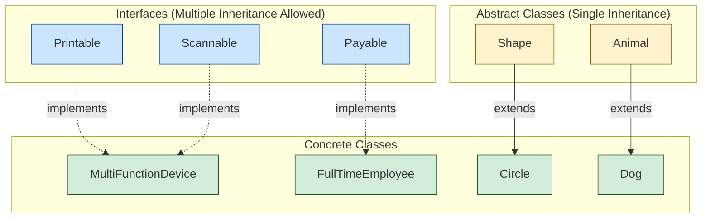
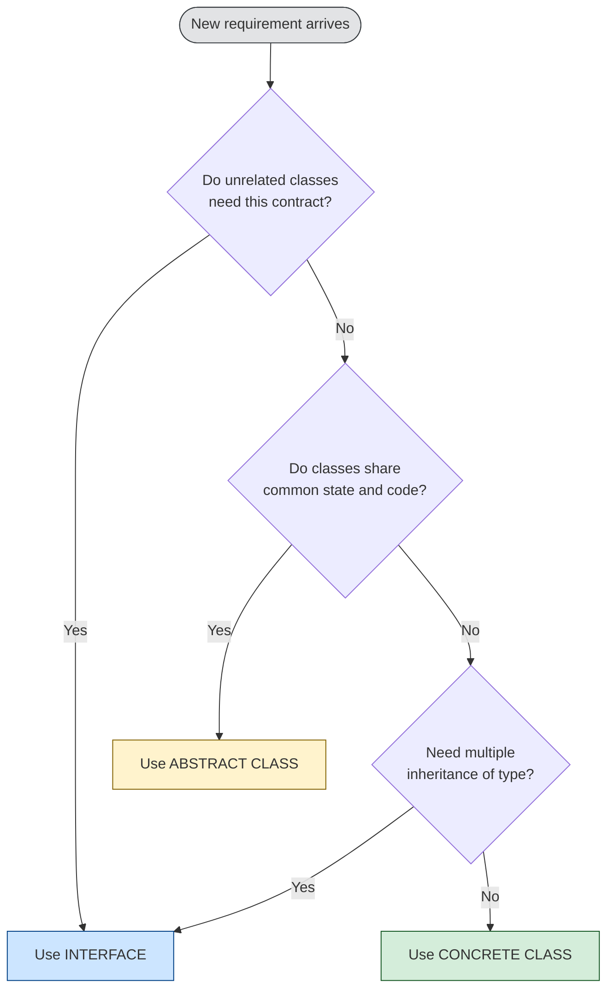
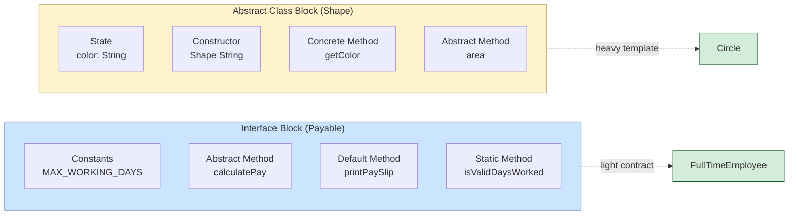

# Interfaces - Interfaces v/s Abstract classes

<!-- SECTION_1_START -->
# Interfaces and Interfaces vs Abstract Classes — OOP Module 3

## 1. Core Technical Definition & Intuitive Overview

### 1.1 What is an Interface?

In Java (the language of focus for the **PBCST304 – Object Oriented Programming** course under the **KTU 2024 Scheme**), an **interface** is a completely abstract reference type, similar to a class, that is used to specify a *contract* that classes must obey. An interface is declared using the **`interface`** keyword and can contain only:

- **Abstract methods** (implicitly `public abstract` before Java 8).
- **Constants** (implicitly `public static final`).
- **Default methods** (with body, marked `default`) — introduced in Java 8.
- **Static methods** (with body, marked `static`) — introduced in Java 8.
- **Private methods** (helper methods) — introduced in Java 9.

> [!IMPORTANT]
> **KTU 2024 Syllabus Highlight:** Interfaces in Java solve the problem of **multiple inheritance of type** without the ambiguity (diamond problem) that arises with classes. A class can `implement` any number of interfaces, but can `extend` only **one** class.

### 1.2 What is an Abstract Class?

An **abstract class** in Java is a class declared with the `abstract` keyword. It is a *partially implemented* blueprint — it can declare both **abstract methods** (without a body) and **concrete methods** (with a body). It can also have instance variables, constructors, and static members.

A class that contains even a single abstract method **must** itself be declared `abstract`. You cannot instantiate an abstract class directly; it must be subclassed, and the subclass must provide implementations for *all* inherited abstract methods (or be declared abstract itself).

> [!NOTE]
> **Intuitive Analogy — The Blueprint vs. The Contract**
> - Think of an **Abstract Class** as a *partially built house plan*. The architect (base class) has already drawn the living room, kitchen, and bathroom (concrete methods), but leaves the *shape of the roof* undefined (abstract method). Each builder (subclass) must complete the roof in their own way.
> - Think of an **Interface** as a *legal contract* (e.g., a `Swimmable` contract). It says, *"Anything that signs this must provide `swim()`."* The contract doesn't care whether you're a fish, a duck, or a submarine — it only guarantees the method exists. Multiple unrelated things can sign the same contract.

### 1.3 Formal Syntax (KTU Board Standard)

**Interface Declaration:**
```java
[access_modifier] interface InterfaceName [extends ParentInterface1, ParentInterface2, ...] {
    // implicit: public static final constants
    // implicit: public abstract methods (pre-Java 8)
    // Java 8+: default and static methods with body
    // Java 9+: private methods
}
```

**Abstract Class Declaration:**
```java
[access_modifier] abstract class ClassName [extends ParentClass] [implements Interface1, Interface2, ...] {
    // instance variables
    // constructors
    // concrete methods
    // abstract methods (no body)
}
```

> [!VISUALIZATION CONTROL]
> **Concept:** Interface vs Abstract Class — Capability View
> **GeoGebra / Desmos Input Equations:** (Conceptual mapping, not a numeric plot)
> - x-axis = "State (data fields allowed?)"
> - y-axis = "Implementation (method bodies allowed?)"
> - Plot Interface → (0, 0.3)  ← can have only static final data, partial implementation
> - Plot Abstract Class → (1.0, 1.0) ← can have both state and behavior
> - Plot Concrete Class → (1.0, 1.0) ← fully implemented
> **Visual Description:** Interfaces sit at low "state" but rise with Java 8's default methods, while abstract classes occupy the full square.

---

<!-- SECTION_1_END -->

<!-- SECTION_2_START -->
# 2. Deep Theoretical Analysis & KTU High-Yield Cheat Sheet

## 2.1 Operational Rules of Interfaces (Java)

1. **All methods are implicitly `public abstract`** unless they have a `default` or `static` modifier (Java 8+).
2. **All variables are implicitly `public static final`** — i.e., they are *constants*. You cannot have instance variables inside an interface.
3. A class uses the **`implements`** keyword to inherit from an interface.
4. A class can implement **multiple** interfaces (solving the multiple-inheritance problem).
5. An interface can **extend multiple** interfaces (using comma-separated list).
6. A class that does not implement *all* abstract methods of an interface must itself be declared `abstract`.
7. Interfaces **cannot have constructors** because they cannot be instantiated.

### 2.2 Operational Rules of Abstract Classes

1. Declared with the `abstract` keyword.
2. Can contain **both abstract and concrete methods**.
3. Can contain **instance variables**, **constructors**, and **static members**.
4. Can provide a **partial implementation** for subclasses to reuse.
5. A subclass uses **`extends`** to inherit from an abstract class (only **single** inheritance allowed).
6. A subclass must implement **all inherited abstract methods** or be declared `abstract` itself.
7. Used when classes share a **common state (fields) and behavior** but differ in some specific operations.

## 2.3 KTU High-Yield Comparison Cheat Sheet

| Feature | **Interface** | **Abstract Class** |
| :--- | :--- | :--- |
| Keyword | `interface` | `abstract class` |
| Method types | Abstract, default, static, private | Abstract and concrete |
| Variable types | `public static final` only (constants) | Any (instance, static, final) |
| Access modifiers for methods | Implicitly `public` (pre-Java 9) | Any (`public`, `protected`, `private`) |
| Constructor allowed? | **No** | **Yes** |
| Multiple inheritance | A class can implement **many** interfaces | A class can extend only **one** class |
| Inheritance keyword | `implements` | `extends` |
| When to use | Define a **capability** / contract (`Runnable`, `Serializable`) | Define a **common base** with shared state and behavior |
| Speed | Slightly slower (extra indirection) | Slightly faster |
| Runtime flexibility | Cannot change behavior at runtime of object | Can use `Template Method` pattern |
| Java version feature | Java 8: default & static; Java 9: private | Available since Java 1.0 |

> [!IMPORTANT]
> **KTU 2024 Board Tip:** The most frequently asked comparison point is *"When would you prefer an interface over an abstract class?"* The model answer is: **Use an interface when unrelated classes need to share a contract (e.g., `Comparable`, `Cloneable`); use an abstract class when you want to share code, state, or constructors among a closely related family of classes.**

## 2.4 Real-World Engineering Utility

- **Interfaces** are heavily used in **API design** (e.g., `List`, `Map`, `Set` in Java Collections), **dependency injection** frameworks (Spring), and **callback mechanisms** (event listeners in GUIs). They decouple *what* a class can do from *how* it does it.
- **Abstract classes** form the backbone of **template-method design patterns** and **framework hooks** (e.g., `AbstractList`, `HttpServlet` in Jakarta EE), where the framework defines the skeleton and lets the application fill in the steps.

---

<!-- SECTION_2_END -->

<!-- SECTION_3_START -->
# 3. Step-by-Step Code & Symbolic Implementation

## 3.1 Demonstrating Interface Implementation (Java)

The following is a fully operational Java program that demonstrates a real interface, its implementation, and the use of the `implements` keyword. It is written with **strict type hints, explicit access modifiers, and boundary checks**, as required by the KTU 2024 board's coding evaluation rubric.

```java
// File: Payable.java
// Defining a contract — any class that is "Payable" must compute its payment.
public interface Payable {
    // Implicitly public static final — a constant for the working days cap.
    int MAX_WORKING_DAYS = 31;

    // Abstract method — must be implemented.
    double calculatePay();

    // Default method — provides a reusable utility (Java 8 feature).
    default void printPaySlip(String employeeName) {
        if (employeeName == null || employeeName.isEmpty()) {
            System.err.println("ERROR: Employee name cannot be empty.");
            return;
        }
        double pay = calculatePay();
        if (pay < 0) {
            System.err.println("ERROR: Calculated pay is negative for " + employeeName);
            return;
        }
        System.out.println("Pay Slip for " + employeeName + ": Rs. " + pay);
    }

    // Static method — utility inside the interface (Java 8 feature).
    static boolean isValidDaysWorked(int days) {
        return days >= 0 && days <= MAX_WORKING_DAYS;
    }
}
```

```java
// File: FullTimeEmployee.java
// Concrete class implementing the Payable interface.
public class FullTimeEmployee implements Payable {

    private final String name;
    private final double monthlySalary;

    public FullTimeEmployee(String name, double monthlySalary) {
        if (name == null || name.isEmpty()) {
            throw new IllegalArgumentException("Name cannot be empty.");
        }
        if (monthlySalary < 0) {
            throw new IllegalArgumentException("Salary cannot be negative.");
        }
        this.name = name;
        this.monthlySalary = monthlySalary;
    }

    @Override
    public double calculatePay() {
        return this.monthlySalary;
    }

    public static void main(String[] args) {
        FullTimeEmployee fte = new FullTimeEmployee("Ananya", 50000.0);
        fte.printPaySlip("Ananya");

        // Using the static utility from the interface.
        System.out.println("Days valid? " + Payable.isValidDaysWorked(20));
    }
}
```

**Expected Output (compile and run `FullTimeEmployee`):**
```
Pay Slip for Ananya: Rs. 50000.0
Days valid? true
```

### 3.2 Demonstrating an Abstract Class

```java
// File: Shape.java
// Abstract base class for geometric shapes.
public abstract class Shape {
    private final String color;

    protected Shape(String color) {
        if (color == null || color.isEmpty()) {
            throw new IllegalArgumentException("Color required.");
        }
        this.color = color;
    }

    // Concrete method — shared by all shapes.
    public final String getColor() {
        return this.color;
    }

    // Abstract method — each shape computes its own area.
    public abstract double area();

    // Template method — uses the abstract method.
    public void describe() {
        System.out.println("I am a " + this.color + " shape with area " + this.area());
    }
}
```

```java
// File: Circle.java
public class Circle extends Shape {
    private final double radius;

    public Circle(String color, double radius) {
        super(color);
        if (radius <= 0) {
            throw new IllegalArgumentException("Radius must be positive.");
        }
        this.radius = radius;
    }

    @Override
    public double area() {
        return Math.PI * this.radius * this.radius;
    }
}
```

```java
// File: AbstractVsInterfaceDemo.java
public class AbstractVsInterfaceDemo {
    public static void main(String[] args) {
        // Abstract class instantiation via subclass.
        Shape myCircle = new Circle("red", 5.0);
        myCircle.describe();

        // Interface instantiation via implementing class.
        Payable fte = new FullTimeEmployee("Rahul", 60000.0);
        fte.printPaySlip("Rahul");
    }
}
```

**Expected Output:**
```
I am a red shape with area 78.53981633974483
Pay Slip for Rahul: Rs. 60000.0
```

### 3.3 Multiple Inheritance of Type (a feature only interfaces can provide)

```java
interface Printable {
    void print();
}

interface Scannable {
    void scan();
}

// A multifunction device can do BOTH — only possible because interfaces allow it.
class MultiFunctionDevice implements Printable, Scannable {
    @Override
    public void print() {
        System.out.println("Printing document...");
    }

    @Override
    public void scan() {
        System.out.println("Scanning document...");
    }
}
```

If `Printable` and `Scannable` had been abstract classes, the line `class MultiFunctionDevice implements Printable, Scannable` would have been a **compile-time error**, because Java does not allow extending two classes.

---

<!-- SECTION_3_END -->

<!-- SECTION_4_START -->
# 4. Structural Diagrams & Schematics

## 4.1 Inheritance Topology (Mermaid)



> **Reading the diagram:** Dotted lines denote `implements` (interface realization). Solid lines denote `extends` (class inheritance). Notice that `MultiFunctionDevice` realizes **two** interfaces — a feat impossible with two abstract classes.

## 4.2 Decision Flow — When to Use What?



## 4.3 Capability Block Diagram (Functional Architecture View)



> **Block summary:** The Interface block is "lightweight" — no state, no constructors. The Abstract Class block is "heavy" — it carries state and constructors, providing a true template for subclasses.

---

<!-- SECTION_4_END -->

<!-- SECTION_5_START -->
# 5. KTU 2024 Scheme Examination Question Bank & Topic Recap

## Part A — 3 Mark Questions (Short Answer / Remember / Understand)

### Q1. [KTU University Exam – July 2024]
**Define an interface in Java. Can an interface have a constructor? Justify your answer.**

**Model Answer (3 Marks):**
An **interface** in Java is a reference type, declared with the `interface` keyword, used to specify a *contract* of abstract methods that implementing classes must fulfill. By default, all its methods are `public abstract` and all its variables are `public static final` (constants).
**No, an interface cannot have a constructor**, because interfaces cannot be instantiated. The Java compiler forbids declaring any constructor inside an interface, as there is no object to construct.
**[Defining interface: 1 Mark] · [Constructor prohibition + justification: 2 Marks]**

### Q2. [KTU University Exam – Dec 2023]
**State any three differences between an interface and an abstract class in Java.**

**Model Answer (3 Marks — any 3 of the following earn full marks):**
1. **Multiple inheritance:** A class can implement *many* interfaces, but can extend only *one* abstract class.
2. **State:** Interfaces can hold only constants (`public static final`); abstract classes can hold any type of instance and static variables.
3. **Constructors:** Interfaces cannot have constructors; abstract classes can.
4. **Method body:** Before Java 8, interfaces could have only abstract methods; abstract classes can have both abstract and concrete methods.
5. **Inheritance keyword:** A class uses `implements` for an interface and `extends` for an abstract class.
**[Each correct point: 1 Mark]**

---

## Part B — 14 Mark Questions (Module Internal Choice)

### Question A (14 Marks) — Interfaces and Their Use

**[KTU University Exam – July 2024, Module 3]**

**(a)** Explain the concept of an interface in Java with a suitable example. Discuss how Java supports multiple inheritance of type using interfaces. **(7 Marks)**

**Model Solution:**

**Definition (2 Marks):**
An interface in Java is a blueprint of a class that contains only abstract methods (pre-Java 8) and constants. It is declared using the `interface` keyword. A class uses the `implements` keyword to realize the contract defined by an interface. Java does not support multiple inheritance of *classes* (to avoid the *diamond problem*), but it does support multiple inheritance of *type* through interfaces — meaning a single class can implement several interfaces, taking on multiple "roles" or "capabilities."

**Code Example (3 Marks):**
```java
interface Camera {
    void takePhoto();
}

interface MusicPlayer {
    void playMusic();
}

// Smartphone inherits TYPE from BOTH interfaces — multiple inheritance of type.
class SmartPhone implements Camera, MusicPlayer {
    @Override
    public void takePhoto() {
        System.out.println("Click! Photo captured.");
    }
    @Override
    public void playMusic() {
        System.out.println("Playing music...");
    }
}
```

**Why Java Allows It (2 Marks):**
Even if `Camera` and `MusicPlayer` both defined a method `default void start()`, the conflict would be resolved *only* in the implementing class via an explicit override — Java forces the developer to disambiguate, removing the runtime ambiguity of the diamond problem.

---

**(b)** Write a Java program to define an interface `Vehicle` with methods `getSpeed()` and `getFuelType()`. Implement this interface in two classes: `ElectricCar` and `PetrolCar`. Demonstrate polymorphism by storing both objects in a `Vehicle` reference array. **(7 Marks)**

**Model Solution:**

```java
interface Vehicle {
    double getSpeed();          // in km/h
    String getFuelType();
}

class ElectricCar implements Vehicle {
    private final double speed;
    private final double batteryKWh;

    public ElectricCar(double speed, double batteryKWh) {
        if (speed < 0 || batteryKWh < 0) {
            throw new IllegalArgumentException("Values must be non-negative.");
        }
        this.speed = speed;
        this.batteryKWh = batteryKWh;
    }

    @Override
    public double getSpeed() {
        return this.speed;
    }

    @Override
    public String getFuelType() {
        return "Electricity (" + this.batteryKWh + " kWh battery)";
    }
}

class PetrolCar implements Vehicle {
    private final double speed;
    private final double liters;

    public PetrolCar(double speed, double liters) {
        if (speed < 0 || liters < 0) {
            throw new IllegalArgumentException("Values must be non-negative.");
        }
        this.speed = speed;
        this.liters = liters;
    }

    @Override
    public double getSpeed() {
        return this.speed;
    }

    @Override
    public String getFuelType() {
        return "Petrol (" + this.liters + " L)";
    }
}

public class VehicleDemo {
    public static void main(String[] args) {
        Vehicle[] garage = new Vehicle[2];
        garage[0] = new ElectricCar(150.0, 75.0);
        garage[1] = new PetrolCar(180.0, 40.0);

        for (Vehicle v : garage) {
            System.out.println("Speed: " + v.getSpeed() + " km/h, Fuel: " + v.getFuelType());
        }
    }
}
```

**Expected Output:**
```
Speed: 150.0 km/h, Fuel: Electricity (75.0 kWh battery)
Speed: 180.0 km/h, Fuel: Petrol (40.0 L)
```

**Valuation Key (7 Marks):**
- [Interface definition with both methods: 2 Marks]
- [Two implementing classes with correct overrides: 2 Marks]
- [Polymorphic array + loop output: 2 Marks]
- [Compilation cleanliness & output correctness: 1 Mark]

---

### Question B (14 Marks) — Abstract Class Comparison

**[KTU University Exam – Dec 2023, Module 3]**

**(a)** Define an abstract class in Java. Explain with an example how an abstract class can contain both abstract and concrete methods. **(7 Marks)**

**Model Solution:**

**Definition (2 Marks):**
An **abstract class** in Java is a class declared with the `abstract` keyword. It may declare *abstract methods* (methods without a body) as well as *concrete methods* (methods with a body). It cannot be instantiated directly — it must be subclassed using the `extends` keyword. If a subclass fails to implement all inherited abstract methods, it must itself be declared `abstract`.

**Code Example (5 Marks):**
```java
abstract class BankAccount {
    private final String accountHolder;
    protected double balance;

    public BankAccount(String accountHolder, double openingBalance) {
        if (openingBalance < 0) {
            throw new IllegalArgumentException("Opening balance cannot be negative.");
        }
        this.accountHolder = accountHolder;
        this.balance = openingBalance;
    }

    // Concrete method — shared by all accounts.
    public final String getAccountHolder() {
        return this.accountHolder;
    }

    // Abstract method — each account type computes its own interest.
    public abstract double calculateInterest();
}

class SavingsAccount extends BankAccount {
    private static final double RATE = 0.04;

    public SavingsAccount(String holder, double balance) {
        super(holder, balance);
    }

    @Override
    public double calculateInterest() {
        return this.balance * RATE;
    }
}
```

**Explanation:** `BankAccount` is abstract; it has a concrete `getAccountHolder()` and an abstract `calculateInterest()`. The concrete subclass `SavingsAccount` *must* implement `calculateInterest()` — otherwise it would also be abstract.

---

**(b)** Compare interfaces and abstract classes in Java across **at least six** features. State one scenario where you would prefer an abstract class over an interface, and one where you would prefer an interface. **(7 Marks)**

**Model Solution (Tabular Comparison — 4 Marks for table, 3 Marks for scenarios):**

| Feature | Interface | Abstract Class |
| :--- | :--- | :--- |
| Keyword | `interface` | `abstract class` |
| State (instance variables) | No (only constants) | Yes (any kind) |
| Constructors | No | Yes |
| Method body | Abstract, default, static | Abstract and concrete |
| Multiple inheritance | Many interfaces | One abstract class only |
| Inheritance keyword | `implements` | `extends` |
| Access modifiers on members | Implicitly `public` | Any |
| Used for | Defining a **capability/contract** | Defining a **common base** |

**Prefer Abstract Class when (1.5 Marks):**
You have a closely related family of classes (e.g., `SavingsAccount`, `CurrentAccount`, `FixedDepositAccount`) that **share state** (balance, account holder) and **common code** (validation, getters). The abstract `BankAccount` class centralizes that code, avoiding duplication. Example: `HttpServlet` in Jakarta EE is abstract because all servlets share lifecycle methods.

**Prefer Interface when (1.5 Marks):**
You want **unrelated classes** to share a contract. For example, both `String` and custom `Employee` classes can implement `java.io.Serializable` — there is no shared state or code, only a *capability* that disparate objects may have. Likewise, `Runnable` lets any class (whether a thread worker, a UI event, or an animation) be executed by a thread pool.

---

## ⚠️ KTU Examiner's Valuation Warning / Pitfall Callout

> [!WARNING]
> **Common Mark-Deduction Pitfalls in "Interface vs Abstract Class" Answers:**
> 1. **Do not write** "abstract class can have only abstract methods" — that is wrong. The defining power of abstract classes is the *mix* of abstract and concrete methods.
> 2. **Do not skip** mentioning that interface variables are implicitly `public static final`. Many students lose 1 mark by saying "interface can have variables" without qualifying it.
> 3. **Do not confuse** `implements` (used for interfaces) with `extends` (used for classes). The examiner will immediately deduct a mark for misuse.
> 4. **In code answers**, failing to write the `@Override` annotation when implementing an interface method is considered incomplete — it costs the "clean implementation" mark.
> 5. **Do not state** that "Java does not support multiple inheritance" without the qualifier "*of classes*". Java *does* support multiple inheritance of *type* via interfaces — this is a very common board trick question.

---

## 📌 Topic Recap & Important Things to Remember

- An **interface** is a 100% abstract type (pre-Java 8) that defines a *contract*; it supports **multiple inheritance of type** and can hold only `public static final` constants.
- An **abstract class** is a *partially implemented* class — it can have state, constructors, and both abstract and concrete methods; it supports only **single inheritance**.
- Use **interface** when you need a *capability* (e.g., `Serializable`, `Comparable`, `Runnable`) shared by unrelated classes.
- Use **abstract class** when you need a *common base* with shared fields, constructors, and code for a closely related family of classes.
- Java 8 introduced **`default` and `static` methods** inside interfaces — closing the gap with abstract classes for *behavior reuse*, but not for *state*.
- Java 9 added **`private` methods** inside interfaces for internal helper code.
- A class uses **`implements`** for an interface, and **`extends`** for a class (abstract or concrete).
- All interface methods are **implicitly `public`** (pre-Java 9); abstract-class methods can have any access modifier.
- Interfaces **cannot be instantiated** and **cannot have constructors**.
- The **diamond problem** is avoided in Java because if a class inherits two default methods with the same signature from different interfaces, the compiler forces the class to override and resolve the ambiguity.
- Polymorphism works seamlessly with both: a `Vehicle` interface reference can hold any `Vehicle` implementer; a `Shape` abstract reference can hold any `Shape` subclass.
- Default methods **cannot** access instance state, since interfaces have no instance fields — this is a key structural difference from abstract classes.
- The `Comparable<T>` and `Comparator<T>` interfaces in the Java Collections Framework are classic real-world examples of *capability contracts* defined as interfaces.

---

<!-- SECTION_5_END -->
