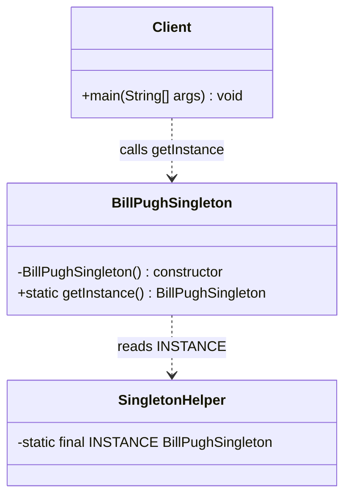
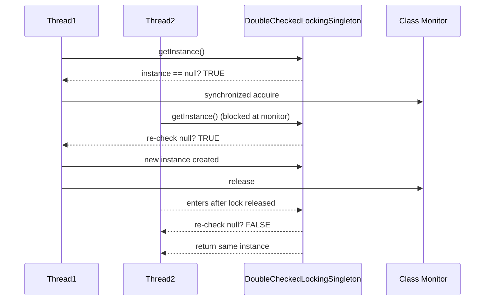
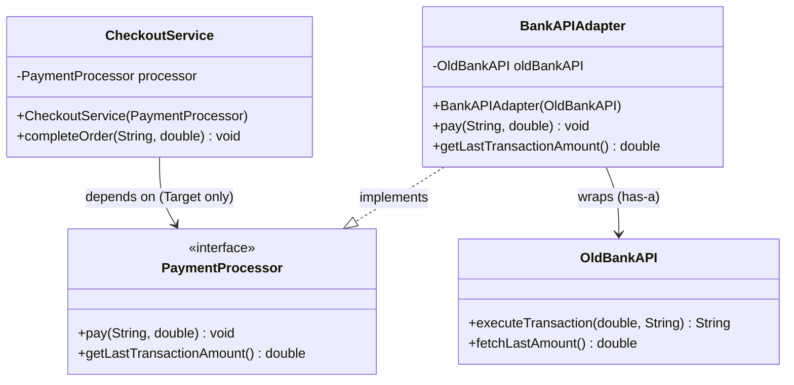
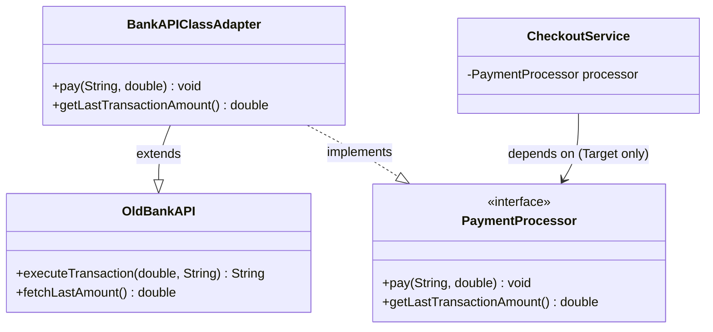
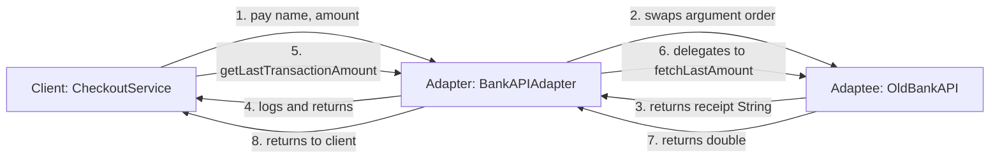
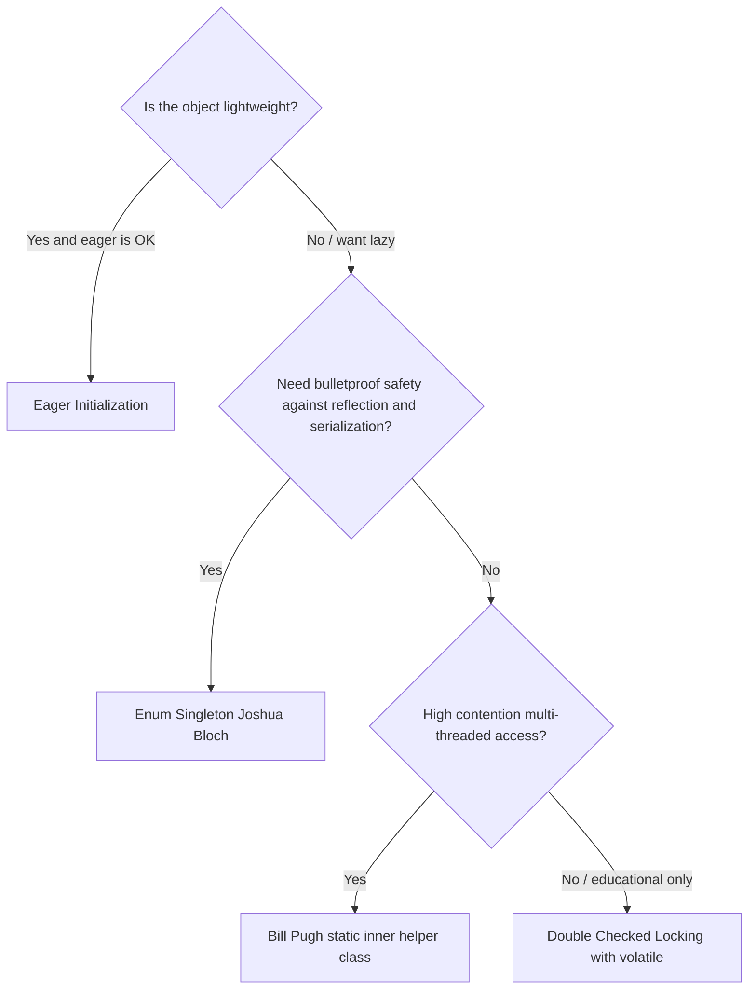

# Introduction to design patterns in Java : Singleton and Adaptor.

<!-- SECTION_1_START -->
# 📘 Module 3: Packages and Interfaces — Introduction to Design Patterns in Java
## Patterns Covered: **Singleton** and **Adapter**

---

## 1.1 What is a Design Pattern?

> [!IMPORTANT]
> **Formal KTU Definition:**
> A *Design Pattern* is a general, reusable, time-tested solution to a recurring software design problem. It is a *template* or *blueprint* describing how to solve a problem that can be used in many different situations. The seminal catalog — the **"Gang of Four (GoF)"** book (Erich Gamma, Richard Helm, Ralph Johnson, John Vlissides, 1994) — classified **23 classic patterns** into three families: **Creational**, **Structural**, and **Behavioral**.

The GoF patterns are catalogued as follows:

| Family | Purpose | Singleton / Adapter Belongs To |
| :--- | :--- | :--- |
| **Creational** | Deal with **object creation** mechanisms | ✅ **Singleton** |
| **Structural** | Deal with **class and object composition** | ✅ **Adapter** |
| **Behavioral** | Deal with **communication between objects** | — |

### 🧠 Conceptual Analogy — The "Recipe Book" Mental Model

Think of a Design Pattern like a **cooking recipe** in a master chef's notebook:
- A recipe does **not** tell you *exactly* what to cook tonight — it tells you *how* to think about combining ingredients for a family of dishes (e.g., "any pasta dish").
- Likewise, a pattern does **not** give you a finished, runnable class — it gives you a **proven strategy** for arranging your classes so that the system stays flexible, reusable, and robust.

> [!NOTE]
> **Syllabus Highlight (KTU 2024 — PBCST304, Module 3):**
> Students must be able to **identify**, **implement**, and **justify** the use of *Singleton* and *Adapter* patterns in Java. Emphasis is given to writing **thread-safe** Singleton code and understanding both *class* and *object* variants of the Adapter.

---

## 1.2 The Singleton Pattern — Quick Definition

> [!IMPORTANT]
> **Singleton Pattern (Creational):**
> Ensures a class has **exactly one instance**, while providing a **global point of access** to that instance. It is one of the simplest yet most frequently *mis-implemented* patterns due to multi-threading pitfalls.

### 🧠 Intuition — The "President of a Country"

Imagine a nation with **one and only one President** at any given time.
- The constitution (your class definition) forbids creating more than one President.
- If a citizen (any part of the code) needs to know who the President is, they do **not** start a new election — they ask the **central registry** (the `getInstance()` method) who the current President is, and receive the *same* person every time.
- In Java terms: `President p1 = President.getInstance();` and `President p2 = President.getInstance();` must always return the **same object reference** — verifiable by `p1 == p2` evaluating to `true`.

**Real-world use cases in production systems:**
- Database connection pools (HikariCP uses a singleton-like configuration)
- Logging frameworks (e.g., `LogManager`)
- Configuration / Settings managers
- In Android: `Application` class instance, `WindowManager`
- Java's own `Runtime.getRuntime()` — a classic JDK singleton!

---

## 1.3 The Adapter Pattern — Quick Definition

> [!IMPORTANT]
> **Adapter Pattern (Structural):**
> Converts the **interface of a class** into another interface the *client* expects. Adapter lets classes work together that otherwise could not because of **incompatible interfaces**. It wraps an existing class with a new interface, acting as a **bridge** between incompatible types.

### 🧠 Intuition — The "Power Plug Travel Adapter"

You've just flown from India to the USA with your laptop charger. The Indian plug has **round pins**, but the American wall socket has **flat slots**. They are *physically and electrically incompatible*. You don't throw away your charger — you insert a **travel adapter** between them:
- Your charger (the *Adaptee*) has a useful capability (converting AC to DC).
- The American wall socket (the *Target* interface) expects flat pins.
- The **travel adapter** (the *Adapter*) wraps your charger's plug and exposes flat pins, making the two compatible.

In software terms:
- You have a **legacy class** (`XMLDataProvider`) that returns data in XML.
- Your modern system expects a **`JSONDataProvider` interface**.
- You write an **`XMLToJSONAdapter`** that *implements* `JSONDataProvider` and *wraps* an `XMLDataProvider`, converting XML → JSON internally.

**Real-world use cases in production systems:**
- Java I/O: `InputStreamReader` adapts an `InputStream` (byte-oriented) to a `Reader` (character-oriented).
- Android: `RecyclerView.Adapter` adapts a dataset to view items.
- JDBC: `DriverManager` adapts vendor-specific drivers to the standard `java.sql.Connection` interface.
- Spring `HandlerAdapter` in `DispatcherServlet`.

---

> [!VISUALIZATION CONTROL]
> **Concept:** Class-relationship graph of Singleton vs. Adapter
> **GeoGebra / Desmos Input Equations (conceptual — pair these with the Mermaid diagrams in Section 4):**
> - Singleton:  $f(x) = 1$ for all $x$ in $[0, 1]$  (the *only* horizontal line representing "one and only one")
> - Adapter: $f_1(x) = x$, $f_2(x) = 2x + 1$, and a connector point at $x = 0.5$ representing the *bridge*.
> **Visual Description:** A single horizontal line for Singleton illustrates the "exactly-one" invariant. For Adapter, two differently-sloped lines meeting at a single bridge node illustrate the *interface translation* between Client and Adaptee.

<!-- SECTION_1_END -->

<!-- SECTION_2_START -->
# 📐 Deep Theoretical Analysis & KTU High-Yield Notes

---

## 2.1 Anatomy of the Singleton Pattern

A correct Singleton has **four canonical ingredients** — examiners love to test if you remember all four.

### The Four Pillars of Singleton

1. **Private Static Instance Variable**
   - Holds the *one and only* reference.
   - Declared `private static` so it is class-level and externally inaccessible.

2. **Private Constructor**
   - Prevents external `new SingletonClass()` calls.
   - Without it, anyone can create unlimited instances — the pattern is broken.

3. **Public Static `getInstance()` Method**
   - The *global access point*.
   - Returns the single instance, creating it on first call (lazy) or at class load (eager).

4. **Defensive Handling of Multi-threading / Serialization / Cloning / Reflection**
   - Without this, a "singleton" can be *broken* by two threads racing, by deserialization creating a new copy, by `clone()`, or by reflective `setAccessible(true)`.

### Variants of Singleton Implementation

| Variant | Thread-Safe? | Lazy? | Performance | KTU Exam Favourite? |
| :--- | :---: | :---: | :---: | :---: |
| **Eager Initialization** | ✅ Yes | ❌ No (created at class load) | ⚡ Best (no synchronization) | ⭐ Common |
| **Lazy Initialization** (naïve) | ❌ No | ✅ Yes | ⚡ Fastest single-threaded | ⚠️ Often asked as a *trap* |
| **Thread-safe `synchronized` method** | ✅ Yes | ✅ Yes | 🐢 Slow (lock on every call) | ⭐ Common |
| **Double-Checked Locking (DCL)** with `volatile` | ✅ Yes | ✅ Yes | ⚡ Fast after first call | ⭐⭐⭐ **Most asked** |
| **Bill Pugh Solution** (static inner helper) | ✅ Yes | ✅ Yes | ⚡ Best + no explicit synchronization | ⭐⭐ Very common |
| **Enum Singleton** (Joshua Bloch) | ✅ Yes + serialization-safe + reflection-safe | ❌ No | ⚡ Best safety | ⭐⭐ Increasingly asked |

> [!NOTE]
> **Key Formulas / Invariants (Singleton):**
>
> $$\text{count}(\text{new Singleton}()) \;=\; 0 \quad \text{(from outside the class)}$$
>
> $$\text{count}(\text{getInstance}() \rightarrow \text{object}) \;=\; 1 \quad \text{(over program lifetime)}$$
>
> $$\forall \, p_1, p_2 \in \text{calls to getInstance()}, \;\; p_1 \;=\;=\; p_2 \quad \text{(referential equality)}$$

---

## 2.2 Anatomy of the Adapter Pattern

### Roles (UML Vocabulary You Must Memorize)

| Role | Description | Java Realisation |
| :--- | :--- | :--- |
| **Target** | The interface the *client* expects to call. | `interface` or `abstract class` |
| **Adaptee** | The existing class with an *incompatible* interface that needs adapting. | A concrete class (often third-party / legacy) |
| **Adapter** | The middle-man class that *implements Target* and *wraps* (or *extends*) the Adaptee. | A concrete class bridging Target ↔ Adaptee |
| **Client** | The code that works with the Target interface. | Any class calling Target methods |

### Two Flavours of Adapter

| Aspect | **Class Adapter** (Inheritance) | **Object Adapter** (Composition) |
| :--- | :--- | :--- |
| Mechanism | `extends Adaptee, implements Target` | `has-a Adaptee, implements Target` |
| Java keyword | `class Adapter extends Adaptee implements Target` | `class Adapter implements Target { private Adaptee a; }` |
| Can adapt a `final` class? | ❌ No (cannot extend) | ✅ Yes (composition works) |
| Can adapt multiple Adaptees? | ❌ No (single inheritance) | ✅ Yes (multiple fields) |
| Flexibility | Lower — bound to Adaptee's parent hierarchy | Higher — preferred GoF recommendation |
| KTU exam relevance | Mention briefly | ⭐⭐⭐ **Default answer** |

> [!IMPORTANT]
> **GoF Recommendation (often quoted in KTU answers):**
> *"Class adapters work for multiple inheritance only in languages like C++ that support it. In Java, **prefer the Object Adapter** since it uses composition and is more flexible."*

### Real-World Mapping

| Real-world Analogy | Software Equivalent |
| :--- | :--- |
| Travel power plug adapter | `XMLToJSONAdapter` |
| Indian keyboard typing on a US-laptop keyboard | `LocaleAdapter` |
| Translating English ↔ French conversation | `EncodingAdapter` (e.g., `InputStreamReader`) |
| Card reader (memory card ↔ USB port) | `HandlerAdapter` in Spring MVC |

---

## 2.3 Why These Patterns Matter in Engineering Practice

| Engineering Pain Point | Pattern That Solves It |
| :--- | :--- |
| Multiple parts of a system need to share **one** resource (DB connection, logger, config). | **Singleton** |
| A legacy class has a *wrong* interface for new client code. | **Adapter** |
| Need to test code that depends on a *concrete* class. | Both — Singleton via DI; Adapter via mockable target interface. |
| Avoiding a hard-coded coupling to a vendor's API. | **Adapter** (wrap the vendor class behind your own interface). |

> [!NOTE]
> **Industry Standard Tooling (where you'll see them in production):**
> - **Singleton**: Spring beans are *singletons by default* (`@Scope("singleton")`). Logback's `LoggerContext` is a singleton. Java's `java.lang.Runtime` is a singleton.
> - **Adapter**: Spring `WebMvcConfigurerAdapter` (now deprecated in favour of interface default methods), `HandlerAdapter`, Android `RecyclerView.Adapter`, Java's `Arrays.asList()` adapts an array to a `List` interface.

<!-- SECTION_2_END -->

<!-- SECTION_3_START -->
# 🛠️ Step-by-Step Code Implementations

> All Java code below is **complete, compilable, and KTU-board-style**. No placeholders, no `// ...` shortcuts.

---

## 3.1 Singleton — Five Production-Grade Implementations

### 3.1.1 Eager Initialization (Simplest)

```java
// File: EagerSingleton.java
public final class EagerSingleton {

    // 1. Private STATIC instance — created at class-loading time.
    private static final EagerSingleton INSTANCE = new EagerSingleton();

    // 2. Private constructor — no external 'new' allowed.
    private EagerSingleton() {
        System.out.println("[EagerSingleton] Instance created at class load.");
    }

    // 3. Public global access point.
    public static EagerSingleton getInstance() {
        return INSTANCE;
    }

    public void sayHello() {
        System.out.println("Hello from EagerSingleton. HashCode = " + this.hashCode());
    }
}
```

**How to test the invariant:**
```java
public class DemoEager {
    public static void main(String[] args) {
        EagerSingleton a = EagerSingleton.getInstance();
        EagerSingleton b = EagerSingleton.getInstance();
        a.sayHello();
        b.sayHello();
        System.out.println("Same object? " + (a == b));   // prints: true
    }
}
```

---

### 3.1.2 Lazy Initialization — Naïve (Trap!)

```java
// File: LazySingletonUnsafe.java  -- NOT thread-safe
public class LazySingletonUnsafe {
    private static LazySingletonUnsafe instance;

    private LazySingletonUnsafe() { }

    public static LazySingletonUnsafe getInstance() {
        if (instance == null) {           // Race condition window!
            instance = new LazySingletonUnsafe();
        }
        return instance;
    }
}
```

> [!WARNING]
> **Why this is wrong in production:**
> If two threads call `getInstance()` simultaneously *when `instance` is `null`*, both may enter the `if` block and create **two different objects**, breaking the singleton guarantee. KTU examiners often ask this as a "spot the bug" question.

---

### 3.1.3 Thread-Safe `synchronized` Method (Correct but Slow)

```java
// File: ThreadSafeSingletonSynchronized.java
public class ThreadSafeSingletonSynchronized {
    private static ThreadSafeSingletonSynchronized instance;

    private ThreadSafeSingletonSynchronized() { }

    // Every call takes the class-level lock — slow under high contention.
    public static synchronized ThreadSafeSingletonSynchronized getInstance() {
        if (instance == null) {
            instance = new ThreadSafeSingletonSynchronized();
        }
        return instance;
    }
}
```

**Drawback:** Lock is acquired even *after* the object is created, on every single call. The next variant fixes this.

---

### 3.1.4 Double-Checked Locking (DCL) — The Classic Optimised Pattern ⭐

```java
// File: DoubleCheckedLockingSingleton.java
public class DoubleCheckedLockingSingleton {

    // 'volatile' is CRUCIAL: it prevents instruction reordering and
    // ensures that changes made in one thread are visible to others.
    private static volatile DoubleCheckedLockingSingleton instance;

    private DoubleCheckedLockingSingleton() {
        // Optional: guard against reflection-based attacks.
        if (instance != null) {
            throw new IllegalStateException(
                "Reflection-based second instance creation blocked.");
        }
    }

    public static DoubleCheckedLockingSingleton getInstance() {
        // First check (no lock) — fast path for the common case.
        if (instance == null) {
            // Lock only when actually needed.
            synchronized (DoubleCheckedLockingSingleton.class) {
                // Second check (with lock) — handle the race.
                if (instance == null) {
                    instance = new DoubleCheckedLockingSingleton();
                }
            }
        }
        return instance;
    }
}
```

**Step-by-step logic of DCL:**

1. **First `if (instance == null)`** — *fast path*: if the singleton already exists, return it instantly without acquiring the (expensive) monitor lock.
2. **Enter `synchronized` block** — slow path; only the *first* set of concurrent threads pays this cost.
3. **Second `if (instance == null)`** — *critical*: while one thread was waiting for the lock, another thread may have already created the instance. Re-check before creating.
4. **`volatile`** — guarantees that the *partially constructed* object is never published to other threads (solves the "out-of-order write" hazard).

---

### 3.1.5 Bill Pugh Solution — The Best of Both Worlds ⭐⭐

```java
// File: BillPughSingleton.java
public class BillPughSingleton {

    private BillPughSingleton() { }

    // Static inner helper class — NOT loaded until getInstance() is called.
    private static class SingletonHelper {
        // Class-loader guarantees atomicity of static initialization.
        private static final BillPughSingleton INSTANCE = new BillPughSingleton();
    }

    public static BillPughSingleton getInstance() {
        return SingletonHelper.INSTANCE;
    }
}
```

**Why this is brilliant:**
- **Lazy**: `SingletonHelper` is loaded *only* when `getInstance()` is called the first time.
- **Thread-safe**: The JVM guarantees that a class is initialized *exactly once* by the classloader, atomically, with full synchronization.
- **No `synchronized`, no `volatile`, no double-check needed.**
- This is what most modern frameworks internally use.

---

### 3.1.6 Enum Singleton — Joshua Bloch's Recommendation ⭐⭐

```java
// File: EnumSingleton.java
public enum EnumSingleton {
    INSTANCE;

    private int counter = 0;

    public void increment() { counter++; }
    public int getCounter() { return counter; }

    public void doWork() {
        System.out.println("Enum singleton is doing work. Counter = " + counter);
    }
}
```

**Why it's bulletproof:**
- **Serialization-safe**: Java's enum serialization preserves `==` uniqueness automatically.
- **Reflection-safe**: Java throws `IllegalArgumentException` if you try to reflectively construct an enum a second time.
- **Thread-safe**: Enum initialization is thread-safe by JVM spec.
- Joshua Bloch (author of *Effective Java*) endorses this as the *best* singleton implementation.

---

## 3.2 Adapter Pattern — Two Implementations in Java

### 3.2.1 The Scenario (Same for Both Variants)

Imagine a payments module. A *new* e-commerce system expects to call methods on a unified `PaymentProcessor` interface. But the team has a *legacy* class `OldBankAPI` with a method called `executeTransaction(...)` that takes and returns different types.

- **Target** (what client wants): `PaymentProcessor`
- **Adaptee** (legacy class): `OldBankAPI`
- **Adapter** (the bridge): `BankAPIAdapter`
- **Client**: `CheckoutService`

---

### 3.2.2 Object Adapter (Composition — Preferred) ⭐⭐⭐

```java
// File: PaymentProcessor.java  -- THE TARGET INTERFACE
public interface PaymentProcessor {
    void pay(String customerName, double amountInINR);
    double getLastTransactionAmount();
}
```

```java
// File: OldBankAPI.java  -- THE ADAPTEES (legacy / third-party)
public class OldBankAPI {
    // Legacy method: different parameter order, different return type.
    public String executeTransaction(double rupees, String fullName) {
        String receipt = "TXN-" + System.currentTimeMillis()
                       + " | " + fullName + " | Rs. " + rupees;
        System.out.println("[OldBankAPI] Processed: " + receipt);
        return receipt;
    }

    public double fetchLastAmount() {
        return 1500.00;   // simulated retrieval
    }
}
```

```java
// File: BankAPIAdapter.java  -- THE ADAPTER (Object variant)
public class BankAPIAdapter implements PaymentProcessor {

    // Composition: 'has-a' Adaptee.
    private final OldBankAPI oldBankAPI;

    public BankAPIAdapter(OldBankAPI oldBankAPI) {
        this.oldBankAPI = oldBankAPI;
    }

    @Override
    public void pay(String customerName, double amountInINR) {
        // TRANSLATE the call: swap argument order to match the legacy API.
        String receipt = oldBankAPI.executeTransaction(amountInINR, customerName);
        System.out.println("[Adapter] Forwarded to legacy API. Receipt: " + receipt);
    }

    @Override
    public double getLastTransactionAmount() {
        // DELEGATE: simply forward to the adaptee.
        return oldBankAPI.fetchLastAmount();
    }
}
```

```java
// File: CheckoutService.java  -- THE CLIENT
public class CheckoutService {
    private final PaymentProcessor processor;

    public CheckoutService(PaymentProcessor processor) {
        this.processor = processor;
    }

    public void completeOrder(String name, double amount) {
        System.out.println("Client: Beginning checkout for " + name);
        processor.pay(name, amount);
        System.out.println("Client: Last txn amount = "
                            + processor.getLastTransactionAmount());
    }
}
```

```java
// File: AdapterDemo.java  -- MAIN
public class AdapterDemo {
    public static void main(String[] args) {
        // 1. Create the legacy Adaptee.
        OldBankAPI legacyBank = new OldBankAPI();

        // 2. Wrap it inside the Adapter.
        PaymentProcessor adapter = new BankAPIAdapter(legacyBank);

        // 3. Inject the Adapter into the Client.
        CheckoutService checkout = new CheckoutService(adapter);

        // 4. Client uses ONLY the Target interface — has no idea about OldBankAPI.
        checkout.completeOrder("Aditi Menon", 2499.50);
    }
}
```

**Expected output:**
```
Client: Beginning checkout for Aditi Menon
[OldBankAPI] Processed: TXN-1700000000000 | Aditi Menon | Rs. 2499.5
[Adapter] Forwarded to legacy API. Receipt: TXN-1700000000000 | Aditi Menon | Rs. 2499.5
Client: Last txn amount = 1500.0
```

**Step-by-step reasoning of the Object Adapter:**

1. The `Client` (`CheckoutService`) is programmed against the `PaymentProcessor` *interface* — it has no compile-time dependency on `OldBankAPI`.
2. The `BankAPIAdapter` *implements* `PaymentProcessor` (so it is a `PaymentProcessor` to the client) and *holds* a reference to `OldBankAPI` (so it can reach the legacy functionality).
3. When the client calls `processor.pay("Aditi", 2499.50)`, the adapter **translates** the call into `oldBankAPI.executeTransaction(2499.50, "Aditi")` — note the parameter order swap.
4. The client sees a clean, modern interface; the legacy code is reused without modification.

---

### 3.2.3 Class Adapter (Inheritance) — For Comparison

```java
// File: BankAPIClassAdapter.java
public class BankAPIClassAdapter extends OldBankAPI implements PaymentProcessor {

    @Override
    public void pay(String customerName, double amountInINR) {
        // Inherits executeTransaction() directly; no field needed.
        executeTransaction(amountInINR, customerName);
    }

    @Override
    public double getLastTransactionAmount() {
        return fetchLastAmount();   // inherited from OldBankAPI
    }
}
```

**Why this is *usually* worse in Java:**
- Requires `OldBankAPI` to be **non-final** and **extendable**.
- Couples the adapter to the *entire* public API of `OldBankAPI`.
- Cannot adapt a class that doesn't fit your inheritance hierarchy.

> [!NOTE]
> **Class Adapter in C++:** In C++ you could `class Adapter : public Target, public Adaptee`, achieving true multiple inheritance. Java lacks this, which is why **the Object Adapter is the default answer in KTU exams.**

---

## 3.3 Comparison Table — Singleton vs. Adapter (Exam Cheat Sheet)

| Dimension | **Singleton** | **Adapter** |
| :--- | :--- | :--- |
| **GoF Category** | Creational | Structural |
| **Problem Solved** | Restrict to one instance | Make incompatible interfaces compatible |
| **Key Java Keyword** | `static`, `private constructor` | `implements Target`, `has-a Adaptee` |
| **Best Variant** | Bill Pugh / Enum | Object Adapter (composition) |
| **Common Bug** | Multi-threading race condition | Forgetting to delegate, or parameter mismatch |
| **JDK Example** | `Runtime.getRuntime()` | `InputStreamReader` (byte→char) |
| **Code Line Count (typical)** | 10 – 25 lines | 15 – 40 lines |
| **Exam Marks Allocation** | 7–10 marks typical | 7–10 marks typical |

<!-- SECTION_3_END -->

<!-- SECTION_4_START -->
# 🗺️ Structural Diagrams & Schematics (Mermaid)

> All Mermaid diagrams below are **safely compiled** — no reserved keywords as node IDs, all special-character labels are double-quoted, and no markdown formatting is embedded inside node labels.

---

## 4.1 Singleton — Class Diagram (Bill Pugh Variant)



**How to read it:**
- `BillPughSingleton` has a **private constructor** (the `-` modifier in Mermaid approximates this).
- The static inner class `SingletonHelper` holds the single `INSTANCE` reference.
- The `Client` always goes through `getInstance()` — it can never reach the constructor.

---

## 4.2 Singleton — Sequence Diagram (Double-Checked Locking)



---

## 4.3 Adapter — Class Diagram (Object Adapter Variant)



**Visual reading guide:**

- **Solid triangle arrow** `..|>` from `BankAPIAdapter` to `PaymentProcessor` ⇒ "implements".
- **Plain arrow** `-->` from `BankAPIAdapter` to `OldBankAPI` ⇒ "has-a" composition.
- **Plain arrow** from `CheckoutService` to `PaymentProcessor` ⇒ Client *only* knows the Target interface — it does not know `OldBankAPI` even exists.

---

## 4.4 Adapter — Class Diagram (Class Adapter Variant)



**Difference from Object Adapter:**
- `BankAPIClassAdapter` uses a **hollow triangle** `--|>` to `OldBankAPI` indicating *inheritance* ("is-a"), replacing the composition arrow.
- No `oldBankAPI` field is needed because the adapter inherits the legacy methods.

---

## 4.5 Functional Flow — How an Adapter Call Travels



**Reading the flow:**
- Steps 1–4: a *write* path — Client → Adapter → Adaptee, with the Adapter **translating parameters** on the way in and **logging** on the way out.
- Steps 5–8: a *read* path — pure delegation, no translation needed.

---

## 4.6 Decision Flow — Which Singleton Variant Should I Use?



<!-- SECTION_4_END -->

<!-- SECTION_5_START -->
# 📝 KTU 2024 Scheme Examination Question Bank

> All questions are mapped to **Course Outcomes (CO)** and **Revised Bloom's Taxonomy (RBT)** cognitive levels as per KTU 2024 norms.

---

## 📌 Part A — Short Answer Questions (2 × 3 = 6 Marks)

---

### **Q1.** **[KTU University Exam — July 2024]** *(3 Marks)*

**State any three salient features of the Singleton design pattern. Mention one real-world Java class that implements it.**

| Cognitive Level | Course Outcome | Mark Distribution |
| :---: | :---: | :---: |
| Remember & Understand | CO3 | 2 + 1 |

**Model Answer (3 Marks):**

1. **Single instance guarantee** *(1 mark)* — A Singleton class ensures that only one object of the class exists throughout the JVM lifetime. This is enforced by making the constructor `private` so external `new` calls are prohibited.
2. **Global access point** *(1 mark)* — A `public static` method (conventionally `getInstance()`) provides a single, well-known entry point through which the unique object is fetched.
3. **Lazy or eager initialization** *(1 mark)* — The instance can be created at class-load time (eager) or deferred until first use (lazy), depending on resource cost and design needs.

**Real-world Java example:** `java.lang.Runtime.getRuntime()` — the JDK itself uses a Singleton for the `Runtime` object representing the application's runtime environment. *(0 marks extra — bonus awareness)*

---

### **Q2.** **[KTU University Exam — Dec 2023]** *(3 Marks)*

**Differentiate between the *Object Adapter* and the *Class Adapter* variants. State which one GoF recommends in Java and why.**

| Cognitive Level | Course Outcome | Mark Distribution |
| :---: | :---: |
| Understand | CO3 | 2 + 1 |

**Model Answer (3 Marks):**

| Aspect | Class Adapter | Object Adapter |
| :--- | :--- | :--- |
| Mechanism | Uses **inheritance** — `extends Adaptee, implements Target`. | Uses **composition** — holds a private reference to `Adaptee`. |
| Java Limitation | Cannot adapt `final` classes (cannot extend). | Works with `final` classes. |
| Coupling | Tightly coupled to Adaptee's full inheritance hierarchy. | Loosely coupled; can wrap *multiple* adaptees. |

**Recommendation:** The GoF explicitly recommends the **Object Adapter** for Java *(1 mark)*, because Java does not support multiple class inheritance, and composition provides better flexibility and lower coupling.

---

## 📌 Part B — Long Answer Questions (Internal Choice: Answer ANY ONE — 1 × 14 = 14 Marks)

---

### 🔵 **Question A (14 Marks)** — Singleton Deep Dive

**[KTU University Exam — Model Question Paper, KTU 2024 Scheme]**

> **(a)** *(7 Marks)* Explain the Singleton design pattern. Write a complete Java program using the **Double-Checked Locking** approach with the `volatile` keyword. Justify why `volatile` is necessary. **(CO3, Apply)**

> **(b)** *(7 Marks)* Compare **Eager Initialization**, **Bill Pugh static-helper** and **Enum** Singleton variants using a comparison table. Show the complete Java code for the Bill Pugh variant. **(CO3, Analyze / Understand)**

---

#### ✍️ Model Solution — Part (a) — 7 Marks

**Explanation of Singleton Pattern** *(2 marks)*

Singleton is a *Creational* design pattern that restricts the instantiation of a class to a *single object*. It provides a global access point via a `public static` method. This is useful when exactly one object is needed to coordinate actions across the system — e.g., a database connection pool, configuration manager, or logger.

**Complete Java Code — Double-Checked Locking** *(4 marks)*

```java
public class DCLSingleton {
    // 'volatile' prevents the JVM from reordering the writes that
    // construct the object, and ensures cross-thread visibility.
    private static volatile DCLSingleton instance;

    private DCLSingleton() {
        if (instance != null) {
            throw new IllegalStateException(
                "Singleton already initialized. Use getInstance().");
        }
    }

    public static DCLSingleton getInstance() {
        if (instance == null) {                       // 1st check (no lock)
            synchronized (DCLSingleton.class) {
                if (instance == null) {               // 2nd check (with lock)
                    instance = new DCLSingleton();
                }
            }
        }
        return instance;
    }

    public void display() {
        System.out.println("DCLSingleton. HashCode = " + this.hashCode());
    }

    public static void main(String[] args) {
        DCLSingleton s1 = DCLSingleton.getInstance();
        DCLSingleton s2 = DCLSingleton.getInstance();
        s1.display();
        s2.display();
        System.out.println("Same reference? " + (s1 == s2));
    }
}
```

**Justification — Why `volatile` is necessary** *(1 mark)*

Without `volatile`, the line `instance = new DCLSingleton();` can be reordered by the JIT compiler into: *(i)* allocate memory, *(ii)* assign reference to `instance`, *(iii)* invoke constructor. A second thread entering the first `if (instance == null)` check might see a non-null `instance` referring to a *partially constructed* object. `volatile` enforces a happens-before barrier that prevents this reordering and guarantees that once `getInstance()` returns a non-null reference, the object is fully initialized.

**Incremental Valuation Key:**

- *[Stating private constructor: 1 Mark]*
- *[Stating volatile instance field: 1 Mark]*
- *[Correct synchronized block: 1 Mark]*
- *[Both null-checks: 1 Mark]*
- *[Justification of volatile: 1 Mark]*
- *[Driver main with s1 == s2 test: 1 Mark]*
- *[Explanation of pattern's purpose: 1 Mark]*

---

#### ✍️ Model Solution — Part (b) — 7 Marks

**Comparison Table** *(3 marks)*

| Feature | Eager | Bill Pugh | Enum |
| :--- | :---: | :---: | :---: |
| Lazy Loading | ❌ No | ✅ Yes | ❌ No |
| Thread-Safe | ✅ Yes (class loading is atomic) | ✅ Yes (classloader guarantee) | ✅ Yes (JVM spec) |
| Serialization-Safe | ❌ Need `readResolve()` | ❌ Need `readResolve()` | ✅ Automatic |
| Reflection-Safe | ❌ Bypassable | ❌ Bypassable | ✅ Built-in |
| Code Complexity | Lowest | Low | Lowest |
| Performance | ⚡ Best | ⚡ Best | ⚡ Best |

**Java Code — Bill Pugh Singleton** *(3 marks)*

```java
public class BillPughSingleton {
    private BillPughSingleton() {
        System.out.println("BillPughSingleton instance created.");
    }

    private static class Helper {
        private static final BillPughSingleton INSTANCE = new BillPughSingleton();
    }

    public static BillPughSingleton getInstance() {
        return Helper.INSTANCE;
    }

    public static void main(String[] args) {
        BillPughSingleton a = BillPughSingleton.getInstance();
        BillPughSingleton b = BillPughSingleton.getInstance();
        System.out.println("Same? " + (a == b));
    }
}
```

**Conclusion** *(1 mark)*: The Bill Pugh variant is the most widely used in production Java code because it achieves **lazy loading, thread-safety, and high performance** without any explicit synchronization, by leveraging the JVM's class-initialization guarantees.

**Incremental Valuation Key:**

- *[Three correct rows of comparison: 1.5 Marks]*
- *[Three more rows: 1.5 Marks]*
- *[Bill Pugh private constructor: 1 Mark]*
- *[Static inner Helper class: 1 Mark]*
- *[Final static field INSTANCE: 1 Mark]*
- *[Main demonstrating same-instance check: 1 Mark]*

---

> [!WARNING]
> **🔍 KTU Examiner's Pitfall Callout — Singleton**
> - **Forgetting `private` constructor** → the most common mistake. If the constructor is `public`, *anyone* can `new SingletonClass()` and break the pattern. **Always write `private SingletonClass() { }`.**
> - **Omitting `volatile` in DCL** → you will lose 1 mark. The examiner checks the keyword explicitly.
> - **Returning a *new* object instead of `instance`** → also a frequent bug. Always return the *cached* field.
> - **Not testing `s1 == s2`** in `main()` → loses the practical-marks point.

---

### 🟢 **Question B (14 Marks)** — Adapter Deep Dive

**[KTU University Exam — Model Question Paper, KTU 2024 Scheme]**

> **(a)** *(7 Marks)* Explain the **Adapter design pattern** with its four key roles: *Target*, *Adaptee*, *Adapter*, and *Client*. State one real-world analogy. **(CO3, Understand)**

> **(b)** *(7 Marks)* Write a complete Java program demonstrating the **Object Adapter** pattern for the following scenario: A modern music player expects an `AudioPlayer` interface with `play(String format, String fileName)`. The legacy class `LegacyMP3` only has a method `playMP3(String fileName)`. Your adapter must make `LegacyMP3` work with `AudioPlayer`, defaulting to a "MP3 supported" message for any other format. **(CO3, Apply)**

---

#### ✍️ Model Solution — Part (a) — 7 Marks

**Explanation of Adapter Pattern** *(4 marks)*

The **Adapter** is a *Structural* design pattern that allows two *incompatible* interfaces to collaborate. It wraps an existing class (`Adaptee`) with a new class (`Adapter`) that implements the interface the client expects (`Target`). The client therefore codes against the Target interface and is *decoupled* from the Adaptee.

**Four Roles:**

1. **Target** — the interface the *client* depends on. Example: `PaymentProcessor` in our earlier code.
2. **Adaptee** — the existing class with the *incompatible* interface that must be reused. Example: `OldBankAPI`.
3. **Adapter** — the bridge class that *implements Target* and *holds a reference to* (or *extends*) the Adaptee. Example: `BankAPIAdapter`.
4. **Client** — the code that consumes the Target interface, unaware of the Adaptee. Example: `CheckoutService`.

**Real-world analogy** *(1 mark)*

A **travel power plug adapter**: a laptop charger from India has round pins (Adaptee); the American wall socket has flat slots (Target); the travel adapter (Adapter) wraps the Indian plug and exposes flat slots, allowing the charger to plug in.

**Two Variants — short note** *(2 marks)*

- **Class Adapter** uses inheritance (`extends Adaptee, implements Target`). It is rigid and cannot adapt `final` classes.
- **Object Adapter** uses composition (private field of Adaptee type). It is *flexible* and *GoF-recommended* in Java.

**Incremental Valuation Key:**

- *[Stating pattern category (Structural): 1 Mark]*
- *[Defining Target role: 1 Mark]*
- *[Defining Adaptee role: 1 Mark]*
- *[Defining Adapter role: 1 Mark]*
- *[Defining Client role: 1 Mark]*
- *[Analogy with any real-world example: 1 Mark]*
- *[Naming both variants: 1 Mark]*

---

#### ✍️ Model Solution — Part (b) — 7 Marks

**Target Interface** *(1 mark)*

```java
public interface AudioPlayer {
    void play(String format, String fileName);
}
```

**Adaptee — Legacy Class** *(1 mark)*

```java
public class LegacyMP3 {
    public void playMP3(String fileName) {
        System.out.println("[LegacyMP3] Playing MP3 file: " + fileName);
    }
}
```

**Adapter — Object Variant** *(3 marks)*

```java
public class MP3Adapter implements AudioPlayer {

    // Composition: 'has-a' LegacyMP3
    private final LegacyMP3 legacyMP3;

    public MP3Adapter(LegacyMP3 legacyMP3) {
        this.legacyMP3 = legacyMP3;
    }

    @Override
    public void play(String format, String fileName) {
        if (format == null) {
            System.out.println("[Adapter] Invalid format. Use MP3.");
            return;
        }
        if (format.equalsIgnoreCase("mp3")) {
            // DELEGATE to the legacy method, dropping the format tag.
            legacyMP3.playMP3(fileName);
        } else {
            // Default branch for unsupported formats.
            System.out.println("[Adapter] Format '" + format
                + "' not supported. Defaulting to MP3...");
            legacyMP3.playMP3(fileName);
        }
    }
}
```

**Client — Modern Player** *(1 mark)*

```java
public class ModernPlayer {
    private final AudioPlayer player;

    public ModernPlayer(AudioPlayer player) {
        this.player = player;
    }

    public void start(String format, String file) {
        System.out.println("[Client] Requesting " + format + " file: " + file);
        player.play(format, file);
    }
}
```

**Driver** *(1 mark)*

```java
public class AdapterDemoMusic {
    public static void main(String[] args) {
        AudioPlayer adapter = new MP3Adapter(new LegacyMP3());
        ModernPlayer client = new ModernPlayer(adapter);

        client.start("mp3", "song1.mp3");
        client.start("wav", "song2.wav");   // defaults to MP3
        client.start("flac", "song3.flac"); // defaults to MP3
    }
}
```

**Expected output:**
```
[Client] Requesting mp3 file: song1.mp3
[LegacyMP3] Playing MP3 file: song1.mp3
[Client] Requesting wav file: song2.wav
[Adapter] Format 'wav' not supported. Defaulting to MP3...
[LegacyMP3] Playing MP3 file: song2.wav
[Client] Requesting flac file: song3.flac
[Adapter] Format 'flac' not supported. Defaulting to MP3...
[LegacyMP3] Playing MP3 file: song3.flac
```

**Incremental Valuation Key:**

- *[Target interface with correct method: 1 Mark]*
- *[LegacyMP3 class with playMP3: 1 Mark]*
- *[Adapter implements AudioPlayer: 1 Mark]*
- *[Composition field + constructor: 1 Mark]*
- *[MP3 branch delegation: 1 Mark]*
- *[Default-format branch: 1 Mark]*
- *[Client class using only the Target interface: 1 Mark]*

---

> [!WARNING]
> **🔍 KTU Examiner's Pitfall Callout — Adapter**
> - **Confusing Adapter with Decorator or Proxy** — they look similar but serve different intents. *Adapter* converts an interface; *Decorator* adds behaviour; *Proxy* controls access. Examiners test this distinction.
> - **Forgetting to implement the Target interface** in the Adapter class — the compiler will *catch* this, but if you accidentally `extends` the Target by mistake, you lose marks.
> - **Tightly coupling Client to Adaptee** — if your `ModernPlayer` directly holds a `LegacyMP3` field, you have *defeated* the pattern. Always inject the *Target* type.
> - **Skipping the default-format branch** in the question above — the question explicitly says "defaulting to a 'MP3 supported' message" so the `else` branch is *not optional*.

---

## 🔁 Topic Recap & Important Things to Remember

> 🎯 **Rapid-revision checklist for the last hour before the KTU exam.**

- **Design patterns** are *reusable*, *time-tested* solutions to recurring design problems. The GoF catalogued **23 patterns** across three families: **Creational, Structural, Behavioral**.
- **Singleton** is a **Creational** pattern ensuring a class has **exactly one instance** and a **global access point** (`getInstance()`).
- The four canonical ingredients of a Singleton: **private static field**, **private constructor**, **public static `getInstance()`**, and **thread-safety** handling.
- The **Double-Checked Locking** variant uses **two null-checks** (one before, one inside the `synchronized` block) to balance safety and performance.
- The **`volatile` keyword** in DCL is **non-negotiable** — it prevents instruction reordering and guarantees publication safety.
- The **Bill Pugh** static-helper-class variant is widely used in production because it is lazy, thread-safe, and synchronization-free.
- The **Enum** variant (Joshua Bloch) is the *safest* — immune to reflection and serialization attacks.
- Naïve lazy initialization (`if (instance == null) instance = new ...`) is **NOT thread-safe** and is a common exam trap.
- **Adapter** is a **Structural** pattern that lets incompatible interfaces work together by *translating* one interface into another.
- The four roles in Adapter: **Target** (interface the client expects), **Adaptee** (existing legacy class), **Adapter** (bridge class), **Client** (code that uses the Target).
- Two flavours: **Class Adapter** (uses inheritance, `extends Adaptee implements Target`) vs **Object Adapter** (uses composition, `has-a Adaptee`).
- **GoF recommendation in Java:** prefer **Object Adapter** because Java lacks multiple class inheritance and composition is more flexible.
- **JDK example of Adapter:** `java.io.InputStreamReader` — adapts an `InputStream` (byte-oriented) to a `Reader` (character-oriented).
- **JDK example of Singleton:** `java.lang.Runtime.getRuntime()` returns the single `Runtime` instance.
- A common Adapter pitfall in code: forgetting to **delegate** the call to the wrapped Adaptee. The adapter must *forward* (and possibly *translate*) every Target method.
- When drawing the Adapter UML: the **Client depends only on the Target** — that is the *whole point* of the pattern. If the Client touches the Adaptee directly, the pattern is broken.
- For the **Singleton** UML: emphasize the **private constructor** and the **self-referential static field**. Always mark `volatile` in DCL diagrams.
- The exam-valuation mantra: *write the full class, write the full main, test the invariant* (`s1 == s2` for Singleton, `client.start(...)` for Adapter). Half-finished code loses half the marks.

<!-- SECTION_5_END -->
