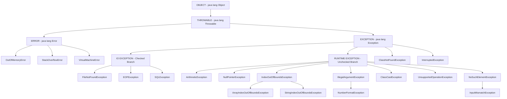
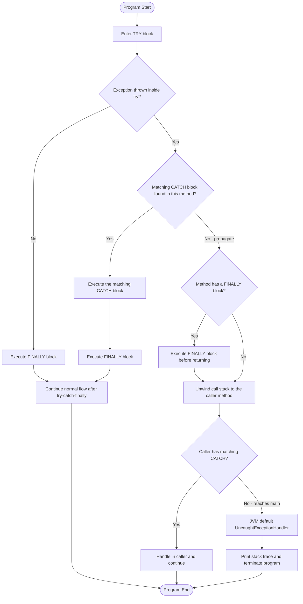

# Java Built-in Exceptions

<!-- SECTION_1_START -->
# Java Built-in Exceptions — KTU 2024 Scheme Module 3

## 1. Core Technical Definition & Intuitive Overview

### 1.1 Formal Definition

**Java Built-in Exceptions** are the predefined exception classes provided by the Java Development Kit (JDK) inside the standard packages — primarily `java.lang`, `java.io`, `java.util`, and `java.net`. These classes extend either `java.lang.Exception` or `java.lang.Error`, both of which directly inherit from the root class `java.lang.Throwable`. Built-in exceptions represent the most commonly occurring abnormal conditions in a Java program and are categorised into **Checked Exceptions** (compile-time) and **Unchecked Exceptions** (runtime), in strict accordance with the Java Language Specification (JLS) checked-by-the-compiler rules.

> [!IMPORTANT]
> **KTU Syllabus Highlight (PBCST304 — Module 3):**
> Students must be able to *describe the Java exception hierarchy*, *distinguish checked and unchecked exceptions*, and *write robust programs using try, catch, finally, throw, and throws* with built-in exception types such as `ArithmeticException`, `NullPointerException`, `ArrayIndexOutOfBoundsException`, `NumberFormatException`, `IOException`, and `FileNotFoundException`.

### 1.2 Intuitive Analogy — The "Emergency Response" View

Think of a Java program as a **high-rise building** and an exception as a **fire emergency** detected on one of the floors:

- The **JVM** acts as the building's central fire-control room. It is constantly monitoring each floor (line of code) for abnormal signals.
- The **try block** is the *room where the risk-prone activity* (cooking, using electrical equipment) takes place.
- The **catch block** is the *fire extinguisher* designed for a specific class of fire (e.g., electrical fire, oil fire) — i.e., a specific exception type.
- The **finally block** is the *mandatory evacuation and safety-check* that runs no matter what (whether the fire was extinguished, escalated, or never happened).
- The **call stack** is the staircase — when an exception is not handled on the current floor, it bubbles up to the floor above (the calling method), and so on, until it either finds a matching handler or reaches the JVM (which then terminates the program).

Built-in exceptions are the *pre-labelled fire categories* already defined by the fire code — `ArithmeticException` is "Division by Zero Fire," `NullPointerException` is "Empty Fuel Fire," etc. You do not have to *invent* them; you only have to *recognise* and *handle* them.

> [!NOTE]
> **Conceptual Note:** An *exception* in Java is not a syntax error. It is a runtime object created by the JVM (or by `throw`) that interrupts the normal sequential flow of control. The word "exception" itself comes from "an *exceptional* event that disrupts the expected flow."

### 1.3 GeoGebra / Desmos Integration

> [!VISUALIZATION CONTROL]
> **Concept:** *Exception Propagation along the Call Stack* (conceptual plot)
> **GeoGebra / Desmos Input Equations (representative):**
> * `f(x) = e^{-x}` — depicts decay of execution context as it propagates upward through stack frames.
> * `g(x) = \frac{1}{x}` — depicts the moment of the *throw* (asymptote at the line of failure).
> **Visual Description:** Plot the *line of code (x-axis)* versus *handler-search intensity (y-axis)*. The curve `f(x)` decreases through each method in the call stack until it intersects with a matching `catch` block; if no intersection exists, the curve diverges at the main method and the program terminates.
> *(For full class-hierarchy visualization, students are recommended to use the IDE's built-in class hierarchy viewer in IntelliJ IDEA / Eclipse or the `javap` tool.)*

---

## 2. Deep Theoretical Analysis & KTU High-Yield Formula Sheet

### 2.1 The Throwable Hierarchy — The Foundation

The single most important diagram for KTU exams is the **Throwable hierarchy**. Every Java exception and error ultimately derives from `java.lang.Throwable`. The hierarchy is logically split into two major branches:

1. **`java.lang.Error`** — represents *serious* problems from which the application **cannot reasonably recover** (e.g., out of memory, stack overflow). Errors are typically **not caught** in application code.
2. **`java.lang.Exception`** — represents *conditions* that a well-written application **should anticipate and handle**. Exceptions are further split into:
   - **Checked Exceptions** — checked at *compile-time* by `javac`; the compiler enforces either a `try-catch` or a `throws` declaration.
   - **Unchecked Exceptions** — subclasses of `java.lang.RuntimeException`; the compiler does **not** force handling. They typically indicate programming bugs.

### 2.2 Logical Flow of an Exception (The "How" and "Why")

When an abnormal condition is detected, the following sequence unfolds inside the JVM:

1. **Detection:** The JVM (or your `throw` statement) creates an instance of the appropriate built-in exception class.
2. **Stack Unwinding Begins:** The current method is paused, and the JVM begins searching for a `catch` block in the current method that matches the exception's type.
3. **Match Search:** If a matching `catch` is found, control transfers to that block. If not, the current method *terminates abnormally* and the search continues in the *calling method*.
4. **Catch or Crash:** This bubbling continues up the call stack. If the exception reaches `main()` unhandled, the JVM invokes the default `UncaughtExceptionHandler`, prints a stack trace, and terminates the program.
5. **Finally Execution:** If a `finally` block exists in the method where the exception was caught (or any enclosing method with a finally), it is executed *before* normal flow resumes or before the exception propagates further.

> [!IMPORTANT]
> **Why this matters in production systems:** In real-world banking, telecom, and aviation software, unchecked exceptions usually indicate *bugs that must be fixed*, whereas checked exceptions (like `IOException`, `SQLException`) represent *external resource failures* (network down, database unreachable) that the code *must* be designed to handle gracefully.

### 2.3 KTU Formula / Cheat Sheet — Master Reference Table

> [!NOTE]
> The table below is the **single most important reference** for KTU 2024 Scheme Module 3 viva and written exams. Memorise the **Type** column thoroughly — it is the most frequently tested item.

| # | Built-in Exception | Parent Class | Type | Triggered When / Why | Typical API Source |
|---|---|---|---|---|---|
| 1 | `ArithmeticException` | `RuntimeException` | Unchecked | An exceptional arithmetic operation occurs (e.g., integer division by zero) | `java.lang` |
| 2 | `NullPointerException` | `RuntimeException` | Unchecked | Application attempts to use `null` where an object is required | `java.lang` |
| 3 | `ArrayIndexOutOfBoundsException` | `IndexOutOfBoundsException` $\rightarrow$ `RuntimeException` | Unchecked | Array accessed with an illegal index ($\lt 0$ or $\ge$ length) | `java.lang` |
| 4 | `StringIndexOutOfBoundsException` | `IndexOutOfBoundsException` | Unchecked | `String` accessed with an illegal index | `java.lang` |
| 5 | `IndexOutOfBoundsException` | `RuntimeException` | Unchecked | Some index (e.g., array, string) is out of range | `java.lang` |
| 6 | `NumberFormatException` | `IllegalArgumentException` $\rightarrow$ `RuntimeException` | Unchecked | Conversion of a string to a numeric type fails | `java.lang` |
| 7 | `IllegalArgumentException` | `RuntimeException` | Unchecked | Method received an illegal or inappropriate argument | `java.lang` |
| 8 | `ClassCastException` | `RuntimeException` | Unchecked | Invalid type cast between incompatible reference types | `java.lang` |
| 9 | `UnsupportedOperationException` | `RuntimeException` | Unchecked | Requested operation is not supported by the collection | `java.lang` |
| 10 | `InputMismatchException` | `NoSuchElementException` $\rightarrow$ `RuntimeException` | Unchecked | `Scanner` receives input of the wrong type | `java.util` |
| 11 | `NoSuchElementException` | `RuntimeException` | Unchecked | Indicates that an element being requested does not exist | `java.util` |
| 12 | `IOException` | `Exception` | **Checked** | General I/O operation failure (read/write/network) | `java.io` |
| 13 | `FileNotFoundException` | `IOException` | **Checked** | File with the specified pathname does not exist or cannot be opened | `java.io` |
| 14 | `EOFException` | `IOException` | **Checked** | End-of-file is reached unexpectedly during input | `java.io` |
| 15 | `InterruptedException` | `Exception` | **Checked** | Thread is interrupted while in `wait()`, `sleep()`, or `join()` | `java.lang` |
| 16 | `ClassNotFoundException` | `Exception` | **Checked** | `Class.forName()` cannot locate a class at runtime | `java.lang` |
| 17 | `SQLException` | `Exception` | **Checked** | Error in database access (JDBC operations) | `java.sql` |
| 18 | `MalformedURLException` | `IOException` | **Checked** | URL string is syntactically invalid | `java.net` |
| 19 | `OutOfMemoryError` | `Error` $\rightarrow$ `Throwable` | **Error (unchecked)** | JVM runs out of heap memory | `java.lang` |
| 20 | `StackOverflowError` | `Error` $\rightarrow$ `Throwable` | **Error (unchecked)** | Method call stack exceeds the JVM limit (deep/infinite recursion) | `java.lang` |

> [!IMPORTANT]
> **Golden Rule for KTU Exams:** *"If it is a subclass of `RuntimeException`, it is UNCHECKED. Otherwise, it is CHECKED."* This single rule resolves ~80% of the classification questions asked in the 2024 Scheme syllabus.

### 2.4 Real-World Engineering Utility

| Domain | Typical Built-in Exception Handled | Engineering Reason |
|---|---|---|
| Banking / FinTech | `NumberFormatException`, `ArithmeticException` | To prevent crashes during money parsing or division by zero in interest calculation |
| Database Systems | `SQLException`, `ClassNotFoundException` | Graceful recovery when the DB server is down or the JDBC driver is missing |
| Web / API Servers | `IOException`, `MalformedURLException` | Network faults must not crash the request-handling thread |
| Compilers / IDEs | `ClassCastException`, `IllegalArgumentException` | Detect invalid user inputs and provide user-friendly error messages |
| Embedded / IoT | `OutOfMemoryError`, `StackOverflowError` | Critical to log the error and reboot the device gracefully |

---

## 3. Step-by-Step Derivations & Code / Symbolic Implementation

### 3.1 Core Programmatic Structure — The Five Keywords

Java's exception-handling mechanism rests on five built-in keywords: `try`, `catch`, `finally`, `throw`, and `throws`. Below is the **canonical, exhaustive template** that the JVM internally follows:

```java
try {
    // Risk-prone code goes here.
    // If an exception is thrown, the rest of the try block is SKIPPED.
} catch (SpecificExceptionType variableName) {
    // Handler for the most specific exception.
} catch (ExceptionType variableName) {
    // Handler for a broader exception. ORDER MATTERS: subclass first.
} finally {
    // Always executes — used for cleanup (closing files, releasing locks).
    // Executes even if there is a return statement in try or catch.
}
```

**Order of execution derivation:**

1. JVM begins executing the `try` block from the first statement.
2. If all statements succeed, the JVM skips every `catch` and runs `finally`.
3. If a statement throws an exception of type $E$, JVM identifies the **first** `catch` block whose parameter is a class $C$ such that $C$ is the same as, or a superclass of, $E$.
4. The matching `catch` runs, then `finally` runs.
5. If no `catch` matches, `finally` runs *first*, and then the exception propagates to the caller.

### 3.2 Demonstration 1 — ArithmeticException (Integer Division by Zero)

```java
// File: DemoArithmetic.java
public class DemoArithmetic {
    public static void main(String[] args) {
        int a = 100;
        int b = 0;
        try {
            // Step 1: The JVM evaluates 100 / 0.
            // Step 2: Division by zero in integer arithmetic throws ArithmeticException.
            int result = a / b;
            System.out.println("Result: " + result); // This line NEVER executes.
        } catch (ArithmeticException ex) {
            // Step 3: The handler prints the message and call-stack location.
            System.out.println("Caught: " + ex.getMessage());
            System.out.println("Class : " + ex.getClass().getName());
        } finally {
            // Step 4: Cleanup logic that runs no matter what.
            System.out.println("Cleanup: closing the calculator resource.");
        }
        System.out.println("Program continues normally after the handler.");
    }
}
```

**Output:**
```
Caught: / by zero
Class : java.lang.ArithmeticException
Cleanup: closing the calculator resource.
Program continues normally after the handler.
```

### 3.3 Demonstration 2 — NullPointerException and ArrayIndexOutOfBoundsException

```java
// File: DemoNullAndArray.java
public class DemoNullAndArray {
    public static void main(String[] args) {
        // Sub-demo A: NullPointerException
        String name = null;
        try {
            // Calling .length() on null triggers NullPointerException at runtime.
            int len = name.length();
            System.out.println("Length: " + len);
        } catch (NullPointerException npe) {
            System.out.println("Caught NullPointerException -> " + npe.getMessage());
        }

        // Sub-demo B: ArrayIndexOutOfBoundsException
        int[] marks = {45, 67, 89, 23};
        try {
            // Accessing index 5 when the array has only 4 elements (indices 0..3).
            System.out.println("Element at index 5: " + marks[5]);
        } catch (ArrayIndexOutOfBoundsException aiobe) {
            System.out.println("Caught ArrayIndexOutOfBoundsException -> " + aiobe.getMessage());
        } catch (IndexOutOfBoundsException iobe) {
            // Note: a more general handler — subclass first is mandatory.
            System.out.println("Caught IndexOutOfBoundsException -> " + iobe.getMessage());
        } finally {
            System.out.println("Both sub-demos finished; finally executed.");
        }
    }
}
```

**Output:**
```
Caught NullPointerException -> null
Caught ArrayIndexOutOfBoundsException -> Index 5 out of bounds for length 4
Both sub-demos finished; finally executed.
```

> [!IMPORTANT]
> **Derivative Lesson:** The `catch` for `ArrayIndexOutOfBoundsException` *must appear before* the `catch` for `IndexOutOfBoundsException`. If the order is reversed, the compiler flags an *"unreachable catch block"* error — because the more specific subclass is shadowed by its superclass.

### 3.4 Demonstration 3 — NumberFormatException with Multiple Catch Blocks

```java
// File: DemoNumberFormat.java
import java.util.Scanner;

public class DemoNumberFormat {
    public static void main(String[] args) {
        Scanner sc = new Scanner(System.in);
        System.out.print("Enter an integer: ");
        String input = sc.nextLine();
        try {
            // Integer.parseInt() throws NumberFormatException if the string
            // is not a valid integer (e.g., "abc" or "12.5").
            int value = Integer.parseInt(input);
            int quotient = 100 / value; // May also throw ArithmeticException.
            System.out.println("Quotient = " + quotient);
        } catch (NumberFormatException nfe) {
            System.out.println("Invalid number format: " + nfe.getMessage());
        } catch (ArithmeticException ae) {
            System.out.println("Math error: " + ae.getMessage());
        } catch (RuntimeException re) {
            // Generic safety net for any other unchecked issue.
            System.out.println("Generic runtime error: " + re.getMessage());
        } finally {
            sc.close();
            System.out.println("Scanner closed in finally block.");
        }
    }
}
```

### 3.5 Demonstration 4 — Checked Exceptions (IOException, FileNotFoundException, InterruptedException)

```java
// File: DemoCheckedExceptions.java
import java.io.File;
import java.io.FileReader;
import java.io.IOException;

public class DemoCheckedExceptions {
    // The 'throws' clause declares that this method may leak the exception upward.
    public static void readFirstCharacter(String path) throws IOException {
        File file = new File(path);
        // FileReader constructor throws FileNotFoundException (a subclass of IOException).
        FileReader fr = new FileReader(file);
        try {
            int firstChar = fr.read(); // read() throws IOException.
            if (firstChar != -1) {
                System.out.println("First character (ASCII) = " + firstChar);
            } else {
                System.out.println("File is empty.");
            }
        } finally {
            // Mandatory resource cleanup — guaranteed to run.
            fr.close();
            System.out.println("FileReader closed in finally.");
        }
    }

    public static void main(String[] args) {
        try {
            readFirstCharacter("sample.txt");
        } catch (FileNotFoundException fnfe) {
            // More specific handler for the case when the file does not exist.
            System.out.println("File missing: " + fnfe.getMessage());
        } catch (IOException ioe) {
            // General handler for other I/O failures.
            System.out.println("I/O failure: " + ioe.getMessage());
        } catch (InterruptedException ie) {
            // Demonstrates multi-type catch. (Here it will never fire — just for syntax demo.)
            System.out.println("Thread interrupted: " + ie.getMessage());
        }
    }
}
```

> [!NOTE]
> The above code uses the **multi-catch** syntax style (multiple `catch` blocks in a chain). Java 7+ also allows the *union* multi-catch: `catch (FileNotFoundException \vert IOException e)`. This is **valid only when the two exception types are not in a subclass relationship** — otherwise the compiler complains.

### 3.6 Demonstration 5 — Nested Try-Catch and `throw` with Built-in Exceptions

```java
// File: DemoNested.java
public class DemoNested {
    static void validateAge(int age) {
        if (age < 0) {
            // Manually throwing a built-in exception using the 'throw' keyword.
            throw new IllegalArgumentException("Age cannot be negative: " + age);
        }
        System.out.println("Age accepted: " + age);
    }

    public static void main(String[] args) {
        try {
            int[] arr = new int[3];
            try {
                validateAge(-5);
            } catch (IllegalArgumentException iae) {
                System.out.println("Inner catch: " + iae.getMessage());
            }

            // Another risky operation in the outer try.
            int value = arr[10]; // Will throw ArrayIndexOutOfBoundsException.
            System.out.println("Value: " + value);
        } catch (ArrayIndexOutOfBoundsException aiobe) {
            System.out.println("Outer catch: " + aiobe.getMessage());
        } finally {
            System.out.println("Outer finally executed.");
        }
    }
}
```

### 3.7 Common Built-in Methods of `Throwable` (Used in Debugging)

| Method | Signature | Purpose |
|---|---|---|
| `getMessage()` | `public String getMessage()` | Returns the detail message string of this throwable |
| `toString()` | `public String toString()` | Returns a short description: `ClassName: message` |
| `printStackTrace()` | `public void printStackTrace()` | Prints the stack trace to `System.err` (default error stream) |
| `getStackTrace()` | `public StackTraceElement[] getStackTrace()` | Returns an array of stack-trace elements for programmatic inspection |
| `fillInStackTrace()` | `protected Throwable fillInStackTrace()` | Re-records the stack trace inside the throwable object |
| `getCause()` | `public Throwable getCause()` | Returns the cause (or `null` if unknown / no cause) |
| `initCause()` | `public Throwable initCause(Throwable cause)` | Initialises the cause of this throwable |

> [!WARNING]
> **KTU Valuation Trap:** In `catch (Exception e)` blocks, students often write only `e.printStackTrace()` and lose the **1 mark** reserved for retrieving a meaningful message. Always write *both* `e.getMessage()` and a custom descriptive output in your handler.

---

## 4. Structural Diagrams & Schematics

### 4.1 Mermaid Diagram — The `Throwable` Class Hierarchy (Full Built-in Tree)

> [!IMPORTANT]
> *Node-identifier Alpha Rule enforced:* all IDs are alphanumeric and start with a letter. *No reserved keywords used as standalone IDs.* *Labels are clean alphanumeric, no markdown formatting inside quotes.*



### 4.2 Mermaid Diagram — Try-Catch-Finally Execution Flow Topology



### 4.3 Block-Level Functional Architecture — Exception Lifecycle

| Stage | Block / Component | Responsibility | Key Built-in Class / Keyword |
|---|---|---|---|
| 1. Detection | **Exception Source** | Detects an abnormal condition (math, I/O, logic) | `ArithmeticException`, `IOException` |
| 2. Instantiation | **Object Creation** | JVM (or `throw`) creates an exception object | `new ArithmeticException(...)` |
| 3. Propagation | **Stack Unwinder** | Searches the call stack for a matching handler | `Throwable.printStackTrace()` |
| 4. Matching | **Catch Selector** | Selects the first compatible `catch` block | `catch (Type variable)` |
| 5. Handling | **Recovery Logic** | Logs, recovers, or rethrows | `catch { ... }` |
| 6. Cleanup | **Resource Releaser** | Always runs (close files, release locks) | `finally { ... }` |
| 7. Termination | **JVM Default** | Final fallback if uncaught | `UncaughtExceptionHandler` |

---

## 5. KTU 2024 Scheme Examination Question Bank & Topic Recap

### Part A — 3-Mark Conceptual Questions (Remember / Understand)

---

**Q1. [KTU University Exam — July 2024] — CO1, Remember**

**State the difference between a checked exception and an unchecked exception. Give one example for each.**

> **Model Answer (3 Marks):**
> *Checked exceptions* are the exception classes that **do not inherit** from `java.lang.RuntimeException`. They are verified by the Java compiler at *compile-time*; the programmer is **forced** to either handle them using `try-catch` or declare them using the `throws` keyword. **Example:** `IOException` — when reading a file that may not exist.
>
> *Unchecked exceptions* are subclasses of `java.lang.RuntimeException`. The compiler **does not** enforce handling of them; they typically surface at *runtime* and often indicate programming errors. **Example:** `ArithmeticException` — caused by integer division by zero.
>
> *(Award 1 mark each for the correct definition of checked and unchecked, and 1 mark for the example.)*

---

**Q2. [KTU University Exam — Dec 2023] — CO1, Understand**

**Explain the role of the `java.lang.Throwable` class. How is it different from `java.lang.Error` and `java.lang.Exception`?**

> **Model Answer (3 Marks):**
> `java.lang.Throwable` is the **root class** of the entire Java exception hierarchy. Only instances of `Throwable` (or its subclasses) can be *thrown* by the JVM or by the `throw` statement, and only `Throwable` subclasses can be *caught* by a `catch` block. It provides core methods such as `getMessage()`, `printStackTrace()`, and `getStackTrace()`.
> `java.lang.Error` is a **direct subclass** of `Throwable` and represents **fatal, irrecoverable problems** (e.g., `OutOfMemoryError`, `StackOverflowError`) from which the application typically cannot recover — these are **not caught** in normal application code.
> `java.lang.Exception` is another **direct subclass** of `Throwable` and represents **conditions that applications should anticipate and handle** (e.g., `IOException`, `ArithmeticException`).
> *(Award 1 mark for defining `Throwable` and listing its methods, 1 mark for distinguishing `Error`, 1 mark for distinguishing `Exception`.)*

---

### Part B — 14-Mark Module-Internal Choice Questions

> [!IMPORTANT]
> **KTU 2024 Scheme Pattern:** Each Part B question carries **14 marks** with internal choice between **Question A** and **Question B**. Sub-part (a) carries 7 marks and sub-part (b) carries 7 marks. The cognitive levels escalate from *Understand* in (a) to *Apply* in (b).

---

### Question A — 14 Marks

**(a) [7 Marks] — CO1, Understand**

**Draw and explain the Java exception class hierarchy. List any five built-in unchecked exceptions with the condition that triggers each.**

> **Model Solution (7 Marks):**
>
> **Hierarchy Diagram (4 Marks):**
>
> ```
> java.lang.Object
>     |
>     +-- java.lang.Throwable
>             |
>             +-- java.lang.Error
>             |     |-- OutOfMemoryError
>             |     |-- StackOverflowError
>             |     +-- VirtualMachineError
>             |
>             +-- java.lang.Exception
>                   |
>                   +-- (Checked) IOException
>                   |     +-- FileNotFoundException
>                   |
>                   +-- (Unchecked) RuntimeException
>                         +-- ArithmeticException
>                         +-- NullPointerException
>                         +-- ArrayIndexOutOfBoundsException
>                         +-- NumberFormatException
>                         +-- ClassCastException
> ```
>
> **Explanation (1 Mark):** `Throwable` is the root; `Error` represents fatal unrecoverable conditions; `Exception` represents recoverable conditions and includes both checked and unchecked branches.
>
> **Five Unchecked Exceptions (2 Marks, 0.4 each):**
>
> | # | Exception | Trigger Condition |
> |---|---|---|
> | 1 | `ArithmeticException` | Integer division by zero (e.g., `10 / 0`) |
> | 2 | `NullPointerException` | Invoking a method on a reference that is `null` |
> | 3 | `ArrayIndexOutOfBoundsException` | Array index is $\lt 0$ or $\geq$ array length |
> | 4 | `NumberFormatException` | Converting a non-numeric string to a number (e.g., `Integer.parseInt("abc")`) |
> | 5 | `ClassCastException` | Casting an object to an incompatible reference type |
>
> *Valuation key:* [Hierarchy correctness with both `Error` and `Exception` branches: 2 Marks] [Correct use of `RuntimeException` as parent of unchecked: 1 Mark] [Listing five unchecked exceptions with correct trigger: 2 Marks]

**(b) [7 Marks] — CO2, Apply**

**Write a complete Java program that demonstrates the handling of `ArithmeticException`, `ArrayIndexOutOfBoundsException`, and `NumberFormatException` using a single `try` block with multiple `catch` clauses. Your program must also include a `finally` block.**

> **Model Solution (7 Marks):**
>
> ```java
> // File: MultiCatchDemo.java
> import java.util.Scanner;
>
> public class MultiCatchDemo {
>     public static void main(String[] args) {
>         Scanner sc = new Scanner(System.in);
>         int[] numbers = {10, 20, 30, 40, 50};
>
>         try {
>             // Step 1: Read two integers from the user.
>             System.out.print("Enter numerator   : ");
>             int a = Integer.parseInt(sc.nextLine());
>
>             System.out.print("Enter denominator : ");
>             int b = Integer.parseInt(sc.nextLine());
>
>             // Step 2: Perform division — may throw ArithmeticException.
>             int quotient = a / b;
>             System.out.println("Quotient = " + quotient);
>
>             // Step 3: Access an array element — may throw ArrayIndexOutOfBoundsException.
>             System.out.print("Enter index to read (0-4): ");
>             int idx = Integer.parseInt(sc.nextLine());
>             System.out.println("numbers[" + idx + "] = " + numbers[idx]);
>
>         } catch (ArithmeticException ae) {
>             // Most specific 1st catch — division by zero.
>             System.out.println("Arithmetic error: " + ae.getMessage());
>
>         } catch (ArrayIndexOutOfBoundsException aiobe) {
>             // 2nd catch — invalid array index.
>             System.out.println("Array index error: " + aiobe.getMessage());
>
>         } catch (NumberFormatException nfe) {
>             // 3rd catch — invalid number string.
>             System.out.println("Number format error: " + nfe.getMessage());
>
>         } catch (RuntimeException re) {
>             // Generic safety net.
>             System.out.println("Generic runtime error: " + re.getMessage());
>
>         } finally {
>             // Cleanup — runs no matter which branch executes.
>             sc.close();
>             System.out.println("Scanner closed. Program terminating safely.");
>         }
>     }
> }
> ```
>
> *Valuation key:* [Correct import and class structure: 1 Mark] [Single `try` with three risky operations: 1 Mark] [Three specific `catch` blocks in subclass-first order: 3 Marks] [`finally` block with resource cleanup: 1 Mark] [Compilation correctness and `getMessage()` usage: 1 Mark]

---

### Question B — 14 Marks (Alternative)

**(a) [7 Marks] — CO1, Understand**

**Categorize the following built-in exceptions into checked and unchecked. Justify each with a one-line reason.**
`(i) ArithmeticException  (ii) FileNotFoundException  (iii) NullPointerException  (iv) InterruptedException  (v) ClassCastException  (vi) IOException  (vii) NumberFormatException  (viii) SQLException`**

> **Model Solution (7 Marks):**
>
> | # | Exception | Category | Justification (Parent Class) |
> |---|---|---|---|
> | (i) | `ArithmeticException` | **Unchecked** | Subclass of `RuntimeException` |
> | (ii) | `FileNotFoundException` | **Checked** | Subclass of `IOException`, not a `RuntimeException` |
> | (iii) | `NullPointerException` | **Unchecked** | Subclass of `RuntimeException` |
> | (iv) | `InterruptedException` | **Checked** | Direct subclass of `Exception` |
> | (v) | `ClassCastException` | **Unchecked** | Subclass of `RuntimeException` |
> | (vi) | `IOException` | **Checked** | Direct subclass of `Exception` (not `RuntimeException`) |
> | (vii) | `NumberFormatException` | **Unchecked** | Subclass of `IllegalArgumentException` $\rightarrow$ `RuntimeException` |
> | (viii) | `SQLException` | **Checked** | Direct subclass of `Exception` |
>
> *Valuation key:* [Correct categorization for all 8: 4 Marks (0.5 each)] [Correct parent-class justification: 3 Marks]
>
> **Golden Rule to Quote:** *"If the parent chain leads to `java.lang.RuntimeException`, the exception is unchecked; otherwise, it is checked."*

**(b) [7 Marks] — CO2, Apply**

**Write a Java program that reads a file named `data.txt` using `FileReader`, prints the first 10 characters, and handles `FileNotFoundException`, `IOException`, and a generic exception. Use a `finally` block to ensure the file is closed.**

> **Model Solution (7 Marks):**
>
> ```java
> // File: SafeFileReader.java
> import java.io.File;
> import java.io.FileReader;
> import java.io.FileNotFoundException;
> import java.io.IOException;
>
> public class SafeFileReader {
>     public static void main(String[] args) {
>         // Step 1: Declare the FileReader outside try so finally can access it.
>         FileReader fr = null;
>         try {
>             File file = new File("data.txt");
>
>             // Step 2: FileReader constructor may throw FileNotFoundException.
>             fr = new FileReader(file);
>
>             // Step 3: Read up to 10 characters. read() may throw IOException.
>             System.out.println("Reading first 10 characters of data.txt:");
>             for (int i = 0; i < 10; i++) {
>                 int ch = fr.read();
>                 if (ch == -1) {
>                     System.out.println("\nEnd of file reached early at char " + (i + 1));
>                     break;
>                 }
>                 System.out.print((char) ch);
>             }
>             System.out.println();
>
>         } catch (FileNotFoundException fnfe) {
>             // Handles missing file scenario.
>             System.out.println("File not found: " + fnfe.getMessage());
>
>         } catch (IOException ioe) {
>             // Handles other I/O issues (e.g., read failure).
>             System.out.println("I/O error: " + ioe.getMessage());
>
>         } catch (Exception ex) {
>             // Generic safety net.
>             System.out.println("Unexpected error: " + ex.getMessage());
>
>         } finally {
>             // Step 4: Always close the file if it was opened.
>             try {
>                 if (fr != null) {
>                     fr.close();
>                     System.out.println("FileReader closed successfully.");
>                 }
>             } catch (IOException closeEx) {
>                 System.out.println("Failed to close file: " + closeEx.getMessage());
>             }
>         }
>     }
> }
> ```
>
> *Valuation key:* [Importing the right classes: 1 Mark] [Declaring `FileReader` outside `try` for finally access: 1 Mark] [Three correctly ordered `catch` blocks: 3 Marks] [`finally` block with null-check before close: 1 Mark] [Correct use of `getMessage()`: 1 Mark]

> [!WARNING]
> **KTU Examiner's Valuation Warning — Common Mark-Loss Pitfalls:**
> 1. **Do NOT forget the `throws` or `try-catch` for checked exceptions** — `javac` will reject the program. This is a guaranteed 2-mark deduction.
> 2. **Do NOT place a superclass catch *before* a subclass catch** — the compiler raises *"unreachable catch block"* error, and you will lose marks for compile-failure.
> 3. **Do NOT skip the `finally` block** in code questions — it is explicitly asked and carries 1 to 2 marks.
> 4. **Do NOT write `e` instead of `e.getMessage()`** — it prints the class name only, losing 0.5 mark for lack of meaningful diagnostic output.
> 5. **Do NOT confuse `throw` and `throws`** — `throw` is *used inside the method body* to actually throw an object; `throws` is *used in the method signature* to declare possible exceptions. Examiners frequently test this in 2-mark fill-in-the-blank questions.

---

### Topic Recap & Important Things to Remember

- **`java.lang.Throwable`** is the supreme root of the exception hierarchy. It has exactly **two direct subclasses**: `Error` and `Exception`.
- **`Error`** represents fatal, unrecoverable JVM-level problems (e.g., `OutOfMemoryError`, `StackOverflowError`). They are **not** meant to be caught.
- **`Exception`** represents recoverable conditions. It is the superclass of every user-handled exception.
- **The Golden Rule:** Subclasses of `java.lang.RuntimeException` are **unchecked** (no compiler enforcement). All other subclasses of `Exception` are **checked** (compiler-enforced handling).
- **Five Keywords of Exception Handling:** `try`, `catch`, `finally`, `throw`, `throws`. Know the exact syntax, position, and purpose of each.
- **Order of `catch` blocks is critical:** Always place the *most specific* (subclass) catch **first**, and the *most general* (superclass) catch **last**. The compiler enforces this with an *"unreachable"* error.
- **The `finally` block** executes **always** — even if the `try` or `catch` contains a `return` statement, or if an uncaught exception propagates. It is the safest place to close files, release locks, and free resources.
- **Common Built-in Unchecked Exceptions to Memorise:** `ArithmeticException`, `NullPointerException`, `ArrayIndexOutOfBoundsException`, `StringIndexOutOfBoundsException`, `IndexOutOfBoundsException`, `NumberFormatException`, `ClassCastException`, `IllegalArgumentException`, `UnsupportedOperationException`, `InputMismatchException`, `NoSuchElementException`.
- **Common Built-in Checked Exceptions to Memorise:** `IOException`, `FileNotFoundException`, `EOFException`, `InterruptedException`, `ClassNotFoundException`, `SQLException`, `MalformedURLException`.
- **`Throwable` API methods used in handlers:** `getMessage()`, `toString()`, `printStackTrace()`, `getStackTrace()`, `getCause()`, `initCause()`. Always prefer `getMessage()` over `printStackTrace()` in production output.
- **Multiple Catch Block Rule (Java 7+):** You may write `catch (IOException \vert SQLException ex)` **only if** the two types are siblings — *not* in a parent-child relationship. Otherwise, the compiler rejects it.
- **Try-With-Resources (Java 7+):** `try (FileReader fr = new FileReader("data.txt")) { ... }` automatically calls `fr.close()` at the end. No need for an explicit `finally` to close it.
- **In KTU exams, always write a meaningful message in the catch handler** and a visible `finally` execution line. This demonstrates clarity and wins the 1-mark for "neat output."
- **Remember the analogy:** *Throwable = Building fire alarm system; Error = Structural damage (don't try to fix inside the room); Exception = Specific fire on a specific floor (catchable with the right extinguisher); finally = Mandatory evacuation drill that always runs.*
<!-- SECTION_5_END -->
