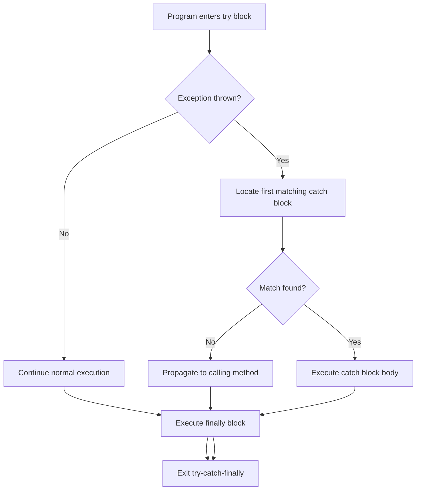
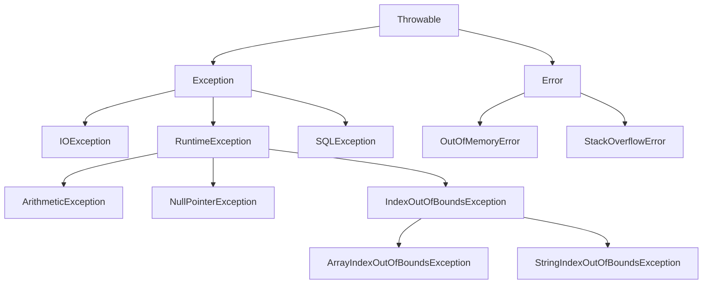
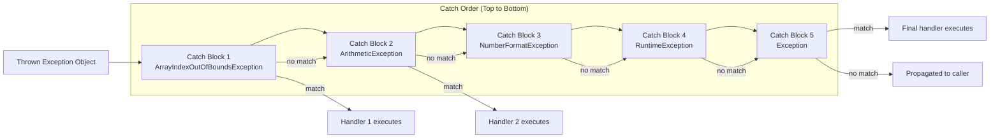
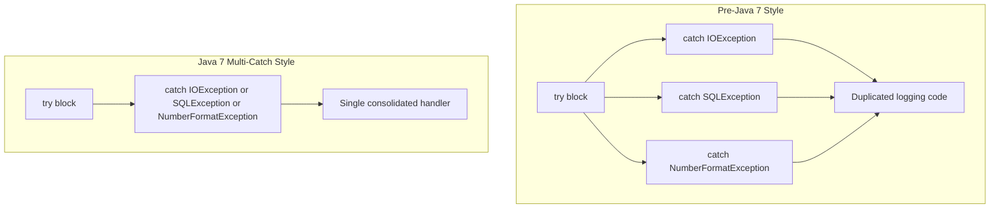

# Multiple catch Clauses

<!-- SECTION_1_START -->
# Multiple Catch Clauses in Java Exception Handling

## 1.1 Formal Academic Definition

In Java, **Multiple Catch Clauses** refer to the mechanism of associating several `catch` blocks with a single `try` block, where each `catch` block is designed to handle a distinct type of exception that may be thrown from the protected code region. The Java Virtual Machine (JVM) inspects the `catch` blocks in the order they are declared (top-to-bottom) and routes the thrown exception to the first matching `catch` handler whose parameter type is compatible with the exception object.

> [!IMPORTANT]
> **KTU 2024 Syllabus Highlight (PBCST304 / Module 3):** Students must understand the syntax, ordering rules, the inheritance hierarchy of exception classes, and the `multi-catch` syntax introduced in Java SE 7 (JSR 334).

## 1.2 Conceptual Analogy / Intuition

Imagine a **hospital emergency ward with multiple specialist doctors**:

- The `try` block is the **patient arriving at reception** with a complaint.
- The receptionist (JVM) examines the symptoms and walks down the corridor of doctors.
- The first doctor whose **specialization matches** the patient's ailment treats them.
- Doctors are arranged from **most specific specialist to most general (general physician)**.

If a heart specialist comes *after* a general physician, the general physician will wrongly treat a cardiac case. This is why **catch ordering is critical** — sub-classes must be caught before super-classes.

## 1.3 Core Terminology

> [!NOTE]
> **Key Terms for Board Examination**
> - **Exception**: An event that disrupts normal program flow (e.g., `ArithmeticException`, `ArrayIndexOutOfBoundsException`).
> - **Catch Block**: A handler routine declared with the syntax `catch (ExceptionType variableName) { ... }`.
> - **Exception Hierarchy**: The class inheritance tree rooted at `java.lang.Throwable`, branching into `Exception` and `Error`.
> - **Unreachable Catch Block**: A compile-time error produced when a `catch` block can never be executed because an earlier block already catches the same (or a super) type.
> - **Multi-Catch (Java 7+)**: A single `catch` clause that handles multiple unrelated exception types using the pipe `|` operator, e.g., `catch (IOException | SQLException ex)`.

> [!VISUALIZATION CONTROL]
> **Concept:** Exception Class Hierarchy (Partial Tree)
> **Desmos/Conceptual Mapping (parent-child relationships):**
> * Root: `Throwable`
> * Level 1: `Exception` and `Error`
> * Level 2 (under Exception): `IOException`, `RuntimeException`, `SQLException`
> * Level 3 (under RuntimeException): `ArithmeticException`, `NullPointerException`, `ArrayIndexOutOfBoundsException`
> **Visual Description:** A downward-branching tree where `Throwable` sits at the apex. As we move downward, the exception types become more *specialized* (specific). Catch blocks must catch leaves (specialized) before roots (generalized).
<!-- SECTION_1_END -->

<!-- SECTION_2_START -->
# Deep Theoretical Analysis & KTU High-Yield Formula Sheet

## 2.1 Operational Rules of Multiple Catch Clauses

The Java Language Specification (JLS §14.20.1) enforces the following deterministic rules:

1. **Sequential Matching**: When an exception is thrown, the JVM evaluates `catch` parameters from the first to the last declared.
2. **Type Compatibility**: A thrown exception of class `E` matches a `catch` parameter of class `C` if `E` is the same as, or a subclass of, `C` (i.e., `C` is an *assignable supertype* of `E`).
3. **First Match Wins**: The first compatible `catch` block executes; all subsequent blocks are ignored for that exception.
4. **Disjointness Rule**: Two `catch` clauses cannot catch the *same* exception class — this is a compile-time error.
5. **Ordering Rule (Reachability)**: A `catch` block for a class `C1` cannot be placed *after* a `catch` block for a class `C2` if `C1` is a subclass of `C2`. Otherwise, the first `catch` would always intercept, making the second *unreachable* (compile error).
6. **Final Catch (Generic)**: The last `catch` is conventionally `catch (Exception e)` to act as a safety net for any unforeseen exception.

## 2.2 The Multi-Catch Syntax (Java 7+)

Java SE 7 introduced **Type Inference in Multi-Catch** to reduce code redundancy:

```java
try {
    // risky I/O and SQL code
} catch (IOException | SQLException ex) {
    logger.log(ex.getMessage());
    throw ex;  // 'ex' is effectively final, type is the common supertype
}
```

The variable `ex` is treated as **`effectively final`** and its compile-time type is the *most specific common supertype* of the listed exception classes (often `Exception` or a shared ancestor).

## 2.3 KTU Formula Sheet / Cheat Sheet

| Construct | Syntax | Key Rule | Exam Tip |
| :--- | :--- | :--- | :--- |
| Standard Multi-Catch | `catch (SubExc e) { }` then `catch (SuperExc e) { }` | Subclass before Superclass | Most common board question |
| Multi-Catch (Java 7+) | `catch (ExcA \| ExcB e) { }` | No subclass relationship allowed in pipe list | Mention JDK version in answer |
| Final Generic Catch | `catch (Exception e) { }` | Must be last block | Always include in examples |
| Unreachable Block | — | Compile-time error | Easy 2-mark question |
| Re-throw (Java 7+) | `throw ex;` in multi-catch | Preserves original exception type | Improves exception transparency |

## 2.4 Real-World Engineering Utility

In **production-grade enterprise systems** (Spring Boot, Micronaut, Jakarta EE), multiple catch clauses are used to:

- **Layered error reporting**: Log technical details for `SQLException`, but return a user-friendly message for `IOException`.
- **Resource cleanup differentiation**: Differentiate between `FileNotFoundException` (recoverable — try alternate path) and `OutOfMemoryError` (fatal — terminate gracefully).
- **API contracts**: Multi-catch reduces boilerplate when a microservice calls both a REST API (`IOException`) and a database (`SQLException`).
- **Defensive programming**: Banking applications use `catch (ArithmeticException e)` to detect division by zero in financial calculations before they corrupt ledgers.
<!-- SECTION_2_END -->

<!-- SECTION_3_START -->
# Step-by-Step Derivations & Code Implementation

## 3.1 Programmatic Implementation: Classic Multi-Catch with Ordering

```java
import java.util.Scanner;
import java.util.InputMismatchException;
import java.util.NoSuchElementException;

public class MultiCatchDemo {
    public static void main(String[] args) {
        Scanner scanner = new Scanner(System.in);
        int[] numerators = {100, 200, 300};
        int[] denominators = {5, 0, 2};
        int index = 0;

        try {
            System.out.print("Enter array index (0 to 2): ");
            index = scanner.nextInt();

            // Three potential exceptions in this try block:
            //  1) InputMismatchException  (scanner input)
            //  2) ArrayIndexOutOfBoundsException (index >= 3 or < 0)
            //  3) ArithmeticException (division by zero)
            int result = numerators[index] / denominators[index];
            System.out.println("Result = " + result);
        }
        catch (InputMismatchException e) {
            // 1) Most specific: input parsing failure
            System.err.println("Error: Please enter integers only.");
        }
        catch (ArrayIndexOutOfBoundsException e) {
            // 2) Specific: index out of valid range
            System.err.println("Error: Index must be between 0 and 2.");
        }
        catch (ArithmeticException e) {
            // 3) Specific: mathematical operation failure
            System.err.println("Error: Division by zero is undefined.");
        }
        catch (RuntimeException e) {
            // 4) Generic safety net for all unchecked exceptions
            System.err.println("Unexpected runtime error: " + e.getMessage());
        }
        finally {
            scanner.close();
            System.out.println("Scanner resource released.");
        }
    }
}
```

### 3.1.1 Execution Trace

| User Input | Exception Thrown | Catch Block Executed |
| :--- | :--- | :--- |
| `1` | `ArithmeticException` | Block 3 |
| `5` | `ArrayIndexOutOfBoundsException` | Block 2 |
| `hello` | `InputMismatchException` | Block 1 |
| `0` | None | (no catch executed) |

## 3.2 Multi-Catch Syntax (Java 7+)

```java
import java.io.*;
import java.sql.*;

public class MultiCatchJava7 {
    public static void performIOAndDB() {
        try (BufferedReader br = new BufferedReader(new FileReader("data.txt"));
             Connection conn = DriverManager.getConnection("jdbc:mysql://localhost/test")) {

            String line = br.readLine();
            int id = Integer.parseInt(line);
            PreparedStatement ps = conn.prepareStatement("SELECT * FROM users WHERE id = ?");
            ps.setInt(1, id);
            ResultSet rs = ps.executeQuery();

            while (rs.next()) {
                System.out.println(rs.getString("name"));
            }
        }
        catch (IOException | SQLException | NumberFormatException ex) {
            // 'ex' is effectively final, of type Exception (common supertype)
            System.err.println("Operation failed: " + ex.getClass().getSimpleName());
            System.err.println("Diagnostic: " + ex.getMessage());
        }
    }
}
```

### 3.2.1 Compilation Rules for `|` Operator

$$
\text{Let } E_1, E_2, E_3, \dots, E_n \text{ be the listed types.}
$$

The multi-catch declaration is valid **if and only if**:

$$
\forall i, j \in \{1, \dots, n\}, \; i \neq j \implies E_i \not\subseteq E_j \;\text{and}\; E_j \not\subseteq E_i
$$

In simpler words, **no listed type may be a subclass of another** listed type. For example, `catch (IOException | FileNotFoundException ex)` is a **compile-time error** because `FileNotFoundException` is a subclass of `IOException`.

## 3.3 Compile-Time Error Demonstration: Unreachable Catch

```java
// INCORRECT — COMPILE-TIME ERROR
try {
    int x = 10 / 0;
}
catch (Exception e) {       // Catches EVERYTHING, including RuntimeException
    System.out.println("Generic");
}
catch (ArithmeticException e) {  // UNREACHABLE — already caught above
    System.out.println("Specific");
}
```

> [!WARNING]
> **Compiler Output:**
> `error: exception java.lang.ArithmeticException has already been caught`
> *Fix: Swap the two blocks — specific subclass first, then the generic `Exception`.*

## 3.4 Step-by-Step Derivation: Determining Catch Order

**Problem:** Given the inheritance tree fragment below, derive the correct ordering of catch blocks for a try block that performs division and array access.

$$
\begin{aligned}
\text{Throwable} &\rightarrow \text{Exception} \\
\text{Exception} &\rightarrow \text{RuntimeException} \\
\text{RuntimeException} &\rightarrow \text{ArithmeticException} \\
\text{RuntimeException} &\rightarrow \text{IndexOutOfBoundsException} \\
\text{IndexOutOfBoundsException} &\rightarrow \text{ArrayIndexOutOfBoundsException}
\end{aligned}
$$

**Step 1 — Identify potential exceptions in try block:**
Division by zero → `ArithmeticException`
Out-of-range index → `ArrayIndexOutOfBoundsException`

**Step 2 — Determine the leaves (most specific classes):**
- `ArithmeticException` (depth 3)
- `ArrayIndexOutOfBoundsException` (depth 4)

**Step 3 — Order from leaf to root:**
1. `ArrayIndexOutOfBoundsException` (most specific leaf)
2. `ArithmeticException` (specific leaf)
3. `RuntimeException` (intermediate super)
4. `Exception` (final generic safety net)

**Final Correct Order:**

```java
catch (ArrayIndexOutOfBoundsException e) { ... }
catch (ArithmeticException e)            { ... }
catch (RuntimeException e)               { ... }
catch (Exception e)                      { ... }
```

## 3.5 Error Handling Comparison Table

| Scenario | Old Style (Pre-Java 7) | New Style (Java 7+ Multi-Catch) | Benefit |
| :--- | :--- | :--- | :--- |
| Two unrelated exceptions | Two `catch` blocks with duplicated code | One `catch (A \| B e)` block | ~40% less code |
| Variable reassignment | Allowed | `ex` is effectively final (cannot reassign) | Safer immutability |
| Re-throwing | `throw e;` loses original stack frame | `throw ex;` preserves exact type | Better debugging |
| Subclass listed | Not applicable | Compile error if any subclass relationship | Catches design flaws early |
<!-- SECTION_3_END -->

<!-- SECTION_4_START -->
# Structural Diagrams & Schematics

## 4.1 Control Flow of Try-Catch Execution



## 4.2 Exception Class Hierarchy (Mermaid Representation)



## 4.3 Catch Block Decision Topology



## 4.4 Multi-Catch vs Separate Catch — Architectural View


<!-- SECTION_4_END -->

<!-- SECTION_5_START -->
# KTU 2024 Scheme Examination Question Bank & Topic Recap

## 5.1 Part A Questions (3 Marks Each)

### Question 1
**[KTU University Exam – July 2024]** Define *multiple catch clauses* in Java. State the rule for ordering them.

**Model Answer (Valuation Key):**
Multiple catch clauses refer to declaring **two or more `catch` blocks** for a single `try` block, where each block handles a *different* exception type. `[1 Mark]`

**Ordering Rule:** The catch block for the **subclass** (more specific exception) must appear *before* the catch block for the **superclass** (more general exception). Otherwise, the subclass catch becomes unreachable and a **compile-time error** occurs. `[2 Marks]`

---

### Question 2
**[KTU University Exam – Dec 2023]** What is the *multi-catch* feature introduced in Java 7? Give the syntax.

**Model Answer (Valuation Key):**
Multi-catch allows a single `catch` block to handle **multiple unrelated exception types** using the pipe (`|`) operator, reducing code duplication. `[2 Marks]`

**Syntax:**

```java
try {
    // code
}
catch (ArithmeticException | NullPointerException ex) {
    // unified handler
}
```

`[1 Mark]`

---

## 5.2 Part B Questions (14 Marks Each — Internal Choice)

### Question A — 14 Marks

**[KTU University Exam – July 2024, Model Paper 2]** *(a)* Explain the concept of multiple catch clauses in Java with the help of a suitable code example. Discuss why the ordering of catch blocks is important. *(7 Marks)*

#### Model Solution

**Definition:** Multiple catch clauses allow a single `try` block to be followed by several `catch` handlers, each specialized to catch a different exception type. The JVM matches the thrown exception to the *first* compatible catch block. `[2 Marks for definition]`

**Code Example:** `[3 Marks]`

```java
class ExceptionOrderDemo {
    public static void main(String[] args) {
        try {
            int a = args.length;
            System.out.println("a = " + a);
            int b = 42 / a;             // may throw ArithmeticException
            int c[] = {1};
            c[42] = 99;                 // may throw ArrayIndexOutOfBoundsException
        }
        catch (ArithmeticException e) {
            System.out.println("Divide by 0: " + e);
        }
        catch (ArrayIndexOutOfBoundsException e) {
            System.out.println("Array index oob: " + e);
        }
        catch (Exception e) {           // generic safety net
            System.out.println("Generic: " + e);
        }
    }
}
```

**Importance of Ordering:** `[2 Marks]`
- Java checks catch blocks **top-to-bottom**.
- If `catch (Exception e)` is placed *first*, it will swallow `ArithmeticException` and `ArrayIndexOutOfBoundsException` (its subclasses), making subsequent catch blocks *unreachable*.
- The compiler enforces this via the rule: **no catch block may catch a subclass of an exception already caught above it**.

---

*(b)* Write a Java program that demonstrates the multi-catch syntax (Java 7+) for handling `IOException` and `SQLException` in a single catch block. Explain one benefit and one limitation. *(7 Marks)*

#### Model Solution

**Program:** `[4 Marks]`

```java
import java.io.*;
import java.sql.*;

public class MultiCatchExample {
    public static void main(String[] args) {
        try {
            FileReader fr = new FileReader("config.txt");
            BufferedReader br = new BufferedReader(fr);
            String data = br.readLine();

            Connection conn = DriverManager.getConnection(
                "jdbc:mysql://localhost:3306/bank", "user", "pass");
            Statement stmt = conn.createStatement();
            ResultSet rs = stmt.executeQuery("SELECT * FROM accounts");
        }
        catch (IOException | SQLException ex) {
            System.out.println("Operation failed.");
            System.out.println("Exception type: " + ex.getClass().getName());
            System.out.println("Message: " + ex.getMessage());
            ex.printStackTrace();
        }
    }
}
```

**Benefit:** `[1.5 Marks]`
Reduces code duplication. Previously, two separate `catch` blocks with identical logging logic were required; now, one consolidated handler suffices.

**Limitation:** `[1.5 Marks]`
The caught variable `ex` is **effectively final** and cannot be reassigned. Also, the two exception types in the `|` list **cannot have an inheritance relationship** (otherwise compile error).

---

### Question B — 14 Marks *(Alternative Choice)*

**[KTU University Exam – Dec 2023, Supplementary]** *(a)* What happens if you place a `catch (Exception e)` block *before* a `catch (ArithmeticException e)` block? Justify with reference to the exception class hierarchy. *(7 Marks)*

#### Model Solution

**Outcome:** A **compile-time error** is produced: *"exception java.lang.ArithmeticException has already been caught"*. `[2 Marks]`

**Justification:** `[3 Marks]`
`ArithmeticException` is a direct subclass of `RuntimeException`, which is a subclass of `Exception`. Therefore, `Exception` is a *supertype* of `ArithmeticException`. Since the first `catch (Exception e)` matches *any* exception of type `Exception` (including `ArithmeticException`), the second catch block becomes **unreachable** — the compiler guarantees that no statement following a `throw` or related catch can be unreachable, hence the error.

**Hierarchy Diagram:** `[2 Marks]`

```
Throwable
   └── Exception
         └── RuntimeException
               └── ArithmeticException
```

**Correction:** Swap the two blocks so that the more specific `ArithmeticException` comes first, and the generic `Exception` comes last as a safety net.

---

*(b)* Differentiate between *traditional multiple catch* and *multi-catch (Java 7+)* with a comparative code example. *(7 Marks)*

#### Model Solution

**Traditional Multiple Catch:** `[2 Marks]`
Requires one `catch` block per exception type. Code is duplicated if the handling logic is the same.

```java
try {
    // risky code
}
catch (FileNotFoundException e) {
    System.out.println("File missing: " + e.getMessage());
}
catch (IOException e) {
    System.out.println("I/O error: " + e.getMessage());
}
```

**Multi-Catch (Java 7+):** `[2 Marks]`
Combines multiple unrelated exception types in one clause using `|`.

```java
try {
    // risky code
}
catch (FileNotFoundException | IOException e) {
    System.out.println("File/I-O problem: " + e.getMessage());
}
```

> ⚠ Note: The above multi-catch is **invalid** because `FileNotFoundException` is a subclass of `IOException`. The valid version is `catch (IOException | SQLException e)`.

**Comparison Table:** `[3 Marks]`

| Feature | Traditional | Multi-Catch |
| :--- | :--- | :--- |
| Number of catch blocks | One per exception | One for multiple types |
| Operator | None | Pipe (`\|`) |
| Code duplication | High | Low |
| Variable mutability | `e` can be reassigned | `ex` is effectively final |
| Subclass relationship | No restriction | Forbidden in list |
| Introduced in | Java 1.0 | Java 7 |

---

> [!WARNING]
> **KTU Examiner's Valuation Warning / Common Pitfalls**
> 1. **Reversed catch order** — Most common 2-mark deduction. Always draw the exception hierarchy before writing catch blocks.
> 2. **Subclass in multi-catch** — `catch (IOException | FileNotFoundException e)` will *not compile*; examiners specifically test this.
> 3. **Forgetting `finally`** — When asked to write a *complete* example, omitting the `finally` block costs 1 mark in some valuation schemes.
> 4. **Using `Throwable` in catch** — `catch (Throwable t)` catches `Error` as well, which is usually undesirable; examiners prefer `catch (Exception e)`.
> 5. **Multi-catch variable re-assignment** — Writing `ex = new IOException();` inside the catch block causes a compile error. The variable is **effectively final**.

---

## 5.3 Topic Recap & Important Things to Remember

- **Definition:** Multiple catch clauses = several `catch` blocks following a single `try`, each catching a specific exception.
- **JVM matching order:** Top-to-bottom; first compatible catch wins.
- **Golden rule:** *Subclass first, superclass last*. Reversing causes an *unreachable catch* compile error.
- **Generic safety net:** The final catch is conventionally `catch (Exception e) { ... }`.
- **Multi-catch (Java 7+):** Uses `|` to combine unrelated exception types in one handler. Variable is **effectively final**.
- **Restriction on `|`:** No two listed types may share an inheritance relationship.
- **Re-throw enhancement:** In a multi-catch block, `throw ex;` preserves the *original* exception type (better than `throw e;`).
- **Hierarchy root:** All Java exceptions inherit from `java.lang.Throwable`; `Error` and its subclasses are *not* typically caught.
- **Unchecked vs Checked:** Multiple catch is most commonly used for *unchecked* (`RuntimeException` subclasses) exceptions, but applies equally to checked exceptions like `IOException`.
- **Code readability tip:** Group related exceptions (e.g., all I/O types) under one multi-catch, and use separate blocks only when handling logic truly differs.
- **Exam mantra:** *"Catch the leaves first; the trunk last."*
<!-- SECTION_5_END -->
