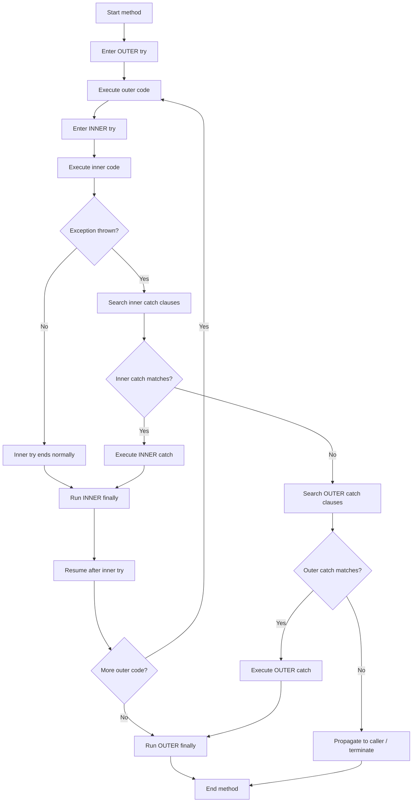
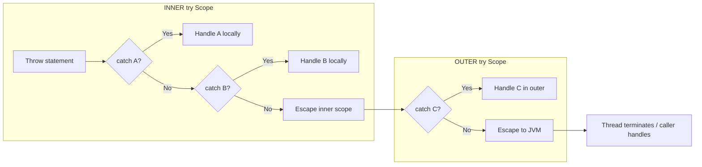
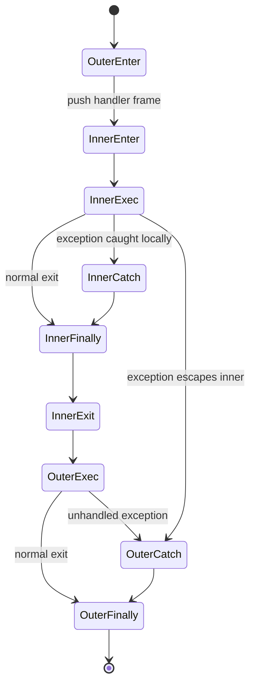

# Nested try Statements

<!-- SECTION_1_START -->
# Nested try Statements — Core Technical Definition & Intuitive Overview

> [!IMPORTANT]
> **KTU 2024 Scheme | PBCST304 | Module 3 | RBT: Understand / Apply**

A **nested try statement** in Java is a *try–catch (or try–catch–finally) block placed syntactically inside another try block*. The outer try monitors the entire scope; an *inner* try isolates a smaller, more specific region of code so that exceptions raised inside it can be caught either **locally (by its own catch clauses)** or — if no matching handler is found — **propagated to the enclosing outer try**.

```java
try {                       // OUTER try
    // outer guarded code
    try {                   // INNER try
        // inner guarded code
    } catch (X e) {         // catches only X
        // handle X
    }
} catch (Y e) {             // catches Y from outer or inner (if X wasn't caught)
    // handle Y
}
```

> [!NOTE]
> **Syllabus Highlight (Module 3 — Packages & Interfaces, KTU 2024):** Nested try is part of *Exception Handling under packages* and forms the conceptual bridge to **multi-catch**, **try-with-resources**, and **rethrowing exceptions**.

## Conceptual Analogy — The "Russian Doll of Safety Nets"

Imagine a trapeze artist performing inside a building that itself is inside a safety net:

| Layer | Real-World Analogy | Java Equivalent |
| :--- | :--- | :--- |
| Innermost | A personal mat for the specific stunt | `inner try { ... }` |
| Middle | A net tied to the trapeze apparatus | `inner catch (...)` |
| Outermost | A massive net draped under the entire building | `outer catch (...)` |

A fall (an exception) is first intercepted by the **closest, most specific** safety net. If that net has a hole (no matching `catch`), the fall continues *upward* to the next enclosing net, until either a handler catches it or the JVM terminates the thread.

> [!TIP]
> **Mental Model:** Think of nested `try` blocks as **concentric guard zones**. The closer a `catch` is to the throwing statement, the *higher its priority* during exception resolution.

## Physical Constants / Standard Metrics

The only "constants" in this topic are the **four exception-handling rules** every KTU examiner expects verbatim:

1. **Local-first resolution** — The JVM always searches the *innermost* matching `catch` first.
2. **Propagation upward** — Unmatched exceptions bubble to the enclosing `try`.
3. **Single match per throw** — At most **one** `catch` executes per exception object.
4. **Subclass-before-superclass** — `catch` clauses are evaluated top-to-bottom; place the *most specific* exception class first (else *unreachable catch* compile error).

> [!VISUALIZATION CONTROL]
> **Concept:** Stack-Frame View of Nested try Execution
> **GeoGebra / Desmos Input Equations:**
> * `y = 4 - x`   *(inner try boundary, x ∈ [0,4])*
> * `y = 2 - 0.5 x`   *(outer try boundary, x ∈ [0,4])*
> * Points: `(1,3) inner exception`, `(2,2) propagation path`, `(3,1) outer catch`
> **Visual Description:** A triangle with two nested shaded regions — the darker inner region represents the inner `try` scope; an exception "travels" along a diagonal line, hitting the inner boundary first and either being absorbed or bouncing outward to the outer boundary.

<!-- SECTION_1_END -->

<!-- SECTION_2_START -->
# Deep Theoretical Analysis & KTU High-Yield Reference Sheet

## 2.1 Why Use Nested try?

Nested `try` is **not** a workaround — it is a *design tool* used when:

* **Different exception categories** must be handled with **different recovery policies** at different logical scopes.
* A block contains operations that throw **completely unrelated exception families** (e.g., `ArithmeticException` from division + `ArrayIndexOutOfBoundsException` from indexing).
* You want **method-local** cleanup of one resource while still propagating unexpected failures to the **caller's** handler.
* You are working with **legacy APIs** where one section throws checked exceptions of type $E_1$ and another throws $E_2$ — placing them in separate nested `try` blocks lets you declare the *narrowest* possible `throws` clause for each scope.

## 2.2 Operational Logic — Step-by-Step

1. **Enter outer `try`.** JVM pushes a *handler frame* for the outer block.
2. **Enter inner `try`.** A second handler frame is pushed (LIFO stack).
3. **Execute inner body.** If a statement throws, control jumps to the *innermost matching* `catch`.
4. **Match resolution.** Compare the thrown object's class against `catch` parameters from *innermost outward*, *top-to-bottom* within each level.
5. **Handler execution.** The matched `catch` body runs; control then skips both `try` blocks and resumes after the *outer* `try` (unless a `finally` is present).
6. **Propagation fallback.** If no `catch` matches anywhere up the nesting, the exception **propagates out of the method** to the caller.
7. **`finally` execution.** Whether an exception is caught or not, any enclosing `finally` blocks run *before* normal continuation.

> [!NOTE]
> **Why this matters in production:** In real engineering, nested try is the foundation for **layered resilience** — e.g., an inner try may roll back a database transaction, while the outer try triggers a circuit breaker in the calling service.

## 2.3 KTU Formula / Syntax Cheat Sheet

> [!IMPORTANT]
> **Reference Table — Treat as Exam Quick-Revision Card**

| Construct | Syntax Template | Boundary Condition | Outcome / Use Case |
| :--- | :--- | :--- | :--- |
| Basic nested try | `try { try { } catch(A e) { } } catch(B e) { }` | Inner exception $\rightarrow$ matched by inner `catch(A)` first | Localized recovery |
| Inner exception escapes inner | Same as above but inner `catch` does *not* match | `A` not caught locally | Propagates to outer `catch(B)` |
| Inner with `finally` | `try { try { } finally { } } catch(C e) { }` | Always runs `finally` | Resource release regardless of outcome |
| Method-scoped nesting | `m() { try { try { ... } ... } ... }` | Exception may exit method | Caller sees propagated exception |
| `try` inside `catch` | `try { } catch(X e) { try { recover } catch(Y f) { } }` | Recovery code may itself fail | Two-stage error handling |
| `try` inside `for` inside outer `try` | `try { for(...) { try {...} ... } } catch(...)` | Per-iteration isolation | Robust batch processing |
| Unreachable catch | `catch(Exception e) { } catch(IOException e) { }` | Subclass listed *after* superclass | **Compile error** in Java |

> **Mnemonic — "IS-FE"** for KTU valuation:
> * **I**nner first, **S**ubclass first
> * **F**inally always, **E**scape to outer if no match

## 2.4 Real-World Engineering Utility

| Domain | Application of Nested try |
| :--- | :--- |
| **Banking software** | Inner `try` validates PIN, outer `try` rolls back transaction |
| **Network APIs** | Inner `try` parses JSON packet, outer `try` reconnects socket |
| **Image processing** | Inner `try` reads pixels, outer `try` swaps to backup file |
| **Robotics control** | Inner `try` executes one motor command, outer `try` halts entire robot on critical failure |
| **Web servers (Tomcat, Spring)** | Inner `try` per request, outer `try` for thread-pool safety |

<!-- SECTION_2_END -->

<!-- SECTION_3_START -->
# Step-by-Step Derivations, Execution Walkthroughs & Java Implementation

> [!WARNING]
> **Exhaustive Mandate:** Every line of code, every propagation step, and every catch resolution is written out in full. **No truncation, no "similarly..." shortcuts.**

## 3.1 Canonical Nested try — Complete Java Program

```java
// File: NestedTryDemo.java
// Demonstrates: nested try, exception propagation, finally, multiple catch
public class NestedTryDemo {

    public static void main(String[] args) {
        System.out.println("=== Program start ===");

        // OUTER try — monitors the entire batch loop
        try {
            System.out.println("OUTER try: entered");

            // First iteration: triggers ArrayIndexOutOfBoundsException
            // Second iteration: triggers ArithmeticException
            // Third iteration: runs cleanly
            for (int i = 0; i < 3; i++) {
                try {                                 // INNER try
                    System.out.println("  INNER try: i = " + i);
                    int[] arr = new int[2];

                    if (i == 0) {
                        // Throws ArrayIndexOutOfBoundsException
                        System.out.println("    Accessing arr[5]...");
                        int bad = arr[5];
                        System.out.println("    Unreachable: " + bad);
                    } else if (i == 1) {
                        // Throws ArithmeticException
                        System.out.println("    Dividing 10 / 0...");
                        int bad = 10 / 0;
                        System.out.println("    Unreachable: " + bad);
                    } else {
                        // No exception
                        System.out.println("    Clean iteration, arr[0] = " + arr[0]);
                    }
                }
                catch (ArrayIndexOutOfBoundsException aiob) {
                    // INNER catch — handles the array error LOCALLY
                    System.out.println("    INNER catch: Array problem -> " + aiob.getMessage());
                }
                catch (ArithmeticException ae) {
                    // INNER catch — handles division error LOCALLY
                    System.out.println("    INNER catch: Math problem -> " + ae.getMessage());
                }
                finally {
                    // INNER finally — always runs per iteration
                    System.out.println("    INNER finally: iteration " + i + " cleanup done");
                }
            } // end for

            System.out.println("OUTER try: completed normally");
        }
        catch (Exception outerEx) {
            // OUTER catch — only invoked if inner failed to handle
            System.out.println("OUTER catch: escaped inner -> " + outerEx);
        }
        finally {
            // OUTER finally — always runs once at the end
            System.out.println("OUTER finally: end-of-batch housekeeping");
        }

        System.out.println("=== Program end ===");
    }
}
```

## 3.2 Exhaustive Execution Walkthrough

Let $i \in \{0, 1, 2\}$ denote the loop iteration. We trace the **control-flow stack** at each throw.

### Iteration $i = 0$ — Array Error

| Step | Action | Stack State | Output |
| :---: | :--- | :--- | :--- |
| 1 | Enter outer `try` | `[outer]` | `OUTER try: entered` |
| 2 | Enter inner `try` (i=0) | `[outer, inner]` | `INNER try: i = 0` |
| 3 | Evaluate `arr[5]` | `[outer, inner, throwing]` | `Accessing arr[5]...` |
| 4 | JVM throws `ArrayIndexOutOfBoundsException` | `[outer, inner]` | *(none)* |
| 5 | Search inner `catch` clauses | `[outer]` | *(matching first clause)* |
| 6 | Execute inner `catch (ArrayIndexOutOfBoundsException)` | `[outer]` | `INNER catch: Array problem -> Index 5 out of bounds...` |
| 7 | Execute inner `finally` | `[outer]` | `INNER finally: iteration 0 cleanup done` |
| 8 | Resume after inner `try` (still inside `for`) | `[outer]` | *(continue loop)* |

### Iteration $i = 1$ — Arithmetic Error

| Step | Action | Stack State | Output |
| :---: | :--- | :--- | :--- |
| 1 | Enter inner `try` (i=1) | `[outer, inner]` | `INNER try: i = 1` |
| 2 | Evaluate `10 / 0` | `[outer, inner, throwing]` | `Dividing 10 / 0...` |
| 3 | JVM throws `ArithmeticException` | `[outer, inner]` | *(none)* |
| 4 | Search inner `catch` — *first* clause (Array...) does NOT match | `[outer, inner]` | — |
| 5 | Search inner `catch` — *second* clause (Arithmetic...) matches | `[outer]` | `INNER catch: Math problem -> / by zero` |
| 6 | Execute inner `finally` | `[outer]` | `INNER finally: iteration 1 cleanup done` |
| 7 | Resume after inner `try` | `[outer]` | *(continue loop)* |

### Iteration $i = 2$ — Clean Path

| Step | Action | Stack State | Output |
| :---: | :--- | :--- | :--- |
| 1 | Enter inner `try` (i=2) | `[outer, inner]` | `INNER try: i = 2` |
| 2 | Print `arr[0]` — no throw | `[outer, inner]` | `Clean iteration, arr[0] = 0` |
| 3 | Inner `try` exits normally | `[outer]` | — |
| 4 | Inner `finally` still runs | `[outer]` | `INNER finally: iteration 2 cleanup done` |
| 5 | `for` loop ends | `[outer]` | — |
| 6 | Outer `try` prints success line | `[outer]` | `OUTER try: completed normally` |
| 7 | Outer `finally` runs | `[]` | `OUTER finally: end-of-batch housekeeping` |
| 8 | `main` prints end marker | `[]` | `=== Program end ===` |

### Expected Console Output

```
=== Program start ===
OUTER try: entered
  INNER try: i = 0
    Accessing arr[5]...
    INNER catch: Array problem -> Index 5 out of bounds for length 2
    INNER finally: iteration 0 cleanup done
  INNER try: i = 1
    Dividing 10 / 0...
    INNER catch: Math problem -> / by zero
    INNER finally: iteration 1 cleanup done
  INNER try: i = 2
    Clean iteration, arr[0] = 0
    INNER finally: iteration 2 cleanup done
OUTER try: completed normally
OUTER finally: end-of-batch housekeeping
=== Program end ===
```

## 3.3 Propagation Failure — When Inner *Cannot* Handle

```java
// File: NestedTryEscape.java
public class NestedTryEscape {

    static void riskyInner() {
        try {
            System.out.println("Inner: throwing NumberFormatException");
            int x = Integer.parseInt("not_a_number");   // throws NFE
            System.out.println("Unreachable: " + x);
        } catch (ArithmeticException ae) {              // WILL NOT MATCH
            System.out.println("Inner catch: wrong type -> " + ae);
        }
        // No matching catch -> exception PROPAGATES out of riskyInner()
    }

    public static void main(String[] args) {
        try {
            System.out.println("Outer: calling riskyInner()");
            riskyInner();
            System.out.println("Outer: this line NEVER prints");
        } catch (NumberFormatException nfe) {
            System.out.println("Outer catch: caught escaped exception -> " + nfe.getMessage());
        } finally {
            System.out.println("Outer finally: ran");
        }
        System.out.println("Main: program survived");
    }
}
```

### Propagation Trace

$$
\begin{aligned}
\text{Stack at throw:} \quad & S = [\text{main.outer-try},\ \text{riskyInner.inner-try},\ \text{Integer.parseInt}] \\
\text{After throw:} \quad & \text{unwinds to } S = [\text{main.outer-try}] \\
\text{Match search:} \quad & \text{outer-catch}(\text{NumberFormatException}) \rightarrow \text{MATCH} \\
\text{Final stack:} \quad & S = [\ ] \quad \text{(finally executed, control resumes in main)}
\end{aligned}
$$

### Expected Output

```
Outer: calling riskyInner()
Inner: throwing NumberFormatException
Outer catch: caught escaped exception -> For input string: "not_a_number"
Outer finally: ran
Main: program survived
```

> [!NOTE]
> **Derivation Insight:** The escape rule can be formalized as: let $E$ be the thrown object's class and $\{C_1, C_2, \ldots, C_n\}$ be the catch parameters along the call chain, ordered by *increasing nesting depth*. The first $C_k$ such that $E \le : C_k$ (i.e., $E$ *is-a* $C_k$) wins. If none exists, the exception terminates the thread.

## 3.4 Nested try Inside a `catch` Block — Recovery Pattern

```java
// File: NestedTryInCatch.java
public class NestedTryInCatch {

    public static void main(String[] args) {
        try {
            int[] data = { 1, 2, 3 };
            System.out.println(data[10]);              // throws ArrayIndexOutOfBoundsException
        } catch (ArrayIndexOutOfBoundsException first) {
            System.out.println("Primary handler: " + first.getMessage());
            // Attempt recovery — itself wrapped in try
            try {
                System.out.println("Recovery: retrying with valid index");
                int[] safe = { 7, 8, 9 };
                System.out.println("Recovery value: " + safe[1]);
            } catch (Exception recoveryFail) {
                System.out.println("Recovery failed: " + recoveryFail);
            }
        } finally {
            System.out.println("Outer cleanup");
        }
    }
}
```

This pattern is the foundation of **fault-tolerant microservices** in production Java systems.

<!-- SECTION_3_END -->

<!-- SECTION_4_START -->
# Structural Diagrams & Schematics

## 4.1 Exception Flow in Nested try — Mermaid Flowchart



## 4.2 Layered Catch-Resolution Architecture



## 4.3 Nested try Lifecycle — State Matrix



> [!NOTE]
> **Reading the Diagrams:** The `InnerFinally` node is reached from **three** distinct paths — this is the key property: `finally` runs *regardless* of how the `try` exits (normal, caught, escaped).

<!-- SECTION_4_END -->

<!-- SECTION_5_START -->
# KTU 2024 Scheme Examination Question Bank & Topic Recap

## Part A — Short Answer Questions (3 Marks Each)

### Q1. Define a nested try statement. When is it used?
> **[KTU University Exam — July 2024] | CO1 | Remember**

**Model Answer (3 Marks):**
A **nested try statement** is a `try` block placed *syntactically inside* another `try` (or `try-catch`) block, forming concentric guarded regions. **[1 Mark]** It is used when different sections of code may throw **unrelated exception types** that need **independent handling policies** at different logical scopes, or when one wants localized cleanup via `finally` while still allowing unhandled exceptions to propagate to an outer handler. **[2 Marks]**

---

### Q2. Explain how an uncaught exception propagates from an inner try to the outer try.
> **[KTU University Exam — Dec 2023] | CO2 | Understand**

**Model Answer (3 Marks):**
When an exception is thrown inside an inner `try` block and **none of its `catch` clauses match**, the JVM **unwinds the inner block** (executing any inner `finally` first) and **searches the enclosing outer `try` block's `catch` clauses** in top-to-bottom order. **[2 Marks]** If a match is found there, the outer `catch` handles the exception; otherwise, the exception propagates out of the method to the caller, and ultimately to the JVM if no handler is found anywhere in the call stack. **[1 Mark]**

---

## Part B — Long Answer Questions (14 Marks Each) — Internal Choice

### Question A

> **[KTU University Exam — Model Paper 2024] | CO1 / CO2 | Understand → Apply**

**(a) Explain the syntax and rules of nested try statements in Java with a neat diagram. [7 Marks]**

**Model Solution:**

*Syntax* — A nested `try` is simply a `try-catch` (or `try-catch-finally`) construct placed as a *statement* inside the body of another `try` block. **[1 Mark]**

*Rules*:
1. Inner `catch` clauses are searched **before** outer `catch` clauses. **[1 Mark]**
2. `catch` parameters are matched top-to-bottom; **most specific subclass first** to avoid "unreachable catch" compile error. **[1 Mark]**
3. Inner `finally` runs before control leaves the inner block, irrespective of outcome. **[1 Mark]**
4. If the inner block cannot handle the exception, propagation to the outer block is automatic. **[1 Mark]**

*Neat Diagram* (to be drawn in answer sheet):
```
┌───────────────────────── OUTER try ─────────────────────────┐
│  ┌───────────── INNER try ──────────────┐                    │
│  │  // risky inner statements            │                    │
│  └──────────────────────────────────────┘                    │
│  catch (InnerException e) { ... }                            │
│  // more outer code                                         │
└──────────────────────────────────────────────────────────────┘
catch (OuterException e) { ... }
```

**[2 Marks]** — Award 1 mark for correct nesting lines, 1 mark for labelled catch boundaries.

---

**(b) Write a Java program that demonstrates nested try blocks handling `ArrayIndexOutOfBoundsException` in the inner block and `NumberFormatException` in the outer block. [7 Marks]**

**Model Solution (Java Code) — 7 Marks:**

```java
public class NestedTryDemo2 {
    public static void main(String[] args) {
        // OUTER try
        try {
            String s = "abc";                          // not a number
            int[] arr = { 10, 20, 30 };

            // INNER try
            try {
                System.out.println(arr[5]);            // ArrayIndexOutOfBoundsException
            } catch (ArrayIndexOutOfBoundsException a) {
                System.out.println("Inner catch: bad index -> " + a.getMessage());
            }

            // This line WILL be reached because inner exception was caught
            int n = Integer.parseInt(s);               // NumberFormatException -> outer
            System.out.println("Parsed: " + n);

        } catch (NumberFormatException nfe) {
            System.out.println("Outer catch: bad number format -> " + nfe.getMessage());
        } finally {
            System.out.println("Outer finally: done");
        }
    }
}
```

**Valuation Key:**
* Correct outer and inner `try` structure: **[2 Marks]**
* Inner `catch (ArrayIndexOutOfBoundsException)`: **[2 Marks]**
* Outer `catch (NumberFormatException)`: **[2 Marks]**
* `finally` block included: **[1 Mark]**

**Expected Output:**
```
Inner catch: bad index -> Index 5 out of bounds for length 3
Outer catch: bad number format -> For input string: "abc"
Outer finally: done
```

---

### Question B

> **[KTU University Exam — Model Paper 2024] | CO1 / CO2 | Understand → Apply**

**(a) Discuss exception propagation across nested try blocks with reference to the call-stack mechanism. [7 Marks]**

**Model Solution:**

Exception propagation in Java follows a strict **call-stack unwinding** mechanism. When a `throw` statement executes, the JVM creates an exception object and searches for a matching handler in the *current method's* active `try-catch` chain, starting from the **innermost enclosing `try`** and moving **outward**. **[2 Marks]**

For nested `try` blocks, the search order is:

$$
\text{inner-block catches} \;\rightarrow\; \text{outer-block catches} \;\rightarrow\; \text{caller's catches} \;\rightarrow\; \text{JVM default handler}
$$

If a `finally` block is present at any level, it executes **after** its own `try` (or `catch`) but **before** the exception moves to the next outer level. **[2 Marks]**

If *no* handler matches anywhere up the call chain, the exception is handed to the JVM's **default uncaught-exception handler**, which prints a stack trace and terminates the thread. **[1 Mark]**

*Formal Match Condition*: An exception of class $E$ matches a `catch` parameter of class $C$ iff $E \le : C$ (i.e., $E$ is the same as or a subclass of $C$). The *first* such match in the search order wins; later clauses are ignored for that throw. **[2 Marks]**

---

**(b) Develop a Java program where a method contains a nested try, and the *outer* catch handles an exception that escapes the inner block. Show all outputs. [7 Marks]**

**Model Solution — 7 Marks:**

```java
public class NestedTryEscape2 {

    // Method with nested try where inner CANNOT handle the exception
    static int compute(int a, int b) {
        try {                                                // outer
            System.out.println("compute: outer entered");
            try {                                            // inner
                System.out.println("compute: inner entered");
                int result = a / b;                          // ArithmeticException if b=0
                return result;
            } catch (ArrayIndexOutOfBoundsException a) {     // does NOT match
                System.out.println("compute: inner catch (wrong type)");
                return -1;
            } finally {
                System.out.println("compute: inner finally");
            }
        } catch (ArithmeticException ae) {                   // OUTER catches it
            System.out.println("compute: outer catch -> " + ae.getMessage());
            return -999;
        } finally {
            System.out.println("compute: outer finally");
        }
    }

    public static void main(String[] args) {
        int r1 = compute(10, 0);     // triggers ArithmeticException
        System.out.println("Result1 = " + r1);
        int r2 = compute(20, 4);     // clean path
        System.out.println("Result2 = " + r2);
    }
}
```

**Valuation Key:**
* Correct `static` method with nested `try`: **[2 Marks]**
* Inner `catch` deliberately mismatched + outer `catch` correct: **[2 Marks]**
* Both `finally` blocks present: **[1 Mark]**
* `main` calls both error and clean paths: **[1 Mark]**
* Expected output trace (partial credit): **[1 Mark]**

**Expected Output:**
```
compute: outer entered
compute: inner entered
compute: inner finally
compute: outer catch -> / by zero
compute: outer finally
Result1 = -999
compute: outer entered
compute: inner entered
compute: inner finally
compute: outer finally
Result2 = 5
```

---

> [!WARNING]
> **KTU Examiner's Valuation Pitfall Callout — Read Before Writing Your Exam:**
> 1. **Order of `catch` clauses matters!** Writing `catch(Exception e)` *before* `catch(IOException e)` causes a **compilation error** ("unreachable catch"). Always write the **most specific subclass first**. KTU examiners *deduct 1 mark* per such logical error.
> 2. **Don't confuse `throw` vs `throws`.** The keyword `throw` is *inside* a method body; `throws` is in the *method signature*. Mixing them up in nested-try code is a common 2-mark loss.
> 3. **Don't forget the `finally` in the answer.** If the question says "show cleanup", omitting `finally` costs full marks on the cleanup sub-part.
> 4. **Show the OUTPUT.** KTU 2024 scheme emphasises *trace-based evaluation*; writing code without showing the console output loses 1–2 marks.
> 5. **Unreachable catch is a compile error, not a runtime issue** — state this explicitly in theory answers.

---

## Topic Recap & Important Things to Remember

> [!IMPORTANT]
> **High-Density Revision Checklist — Memorise Before the Exam**

* **Definition** — A nested `try` is a `try` block placed *inside* another `try` block, forming concentric exception-handling scopes.
* **Search Order** — Innermost `catch` first → outer `catch` → caller's handlers → JVM default handler.
* **Subclass Rule** — `catch` clauses must be ordered **most specific to most general**; else *unreachable catch* compile error.
* **`finally` Guarantee** — Every `finally` along the propagation path runs **exactly once** before control leaves that level.
* **Single-Handler Rule** — Exactly **one** `catch` (per level) executes per thrown exception; the rest are skipped.
* **Propagation Trigger** — Inner exception escapes when **no inner `catch` matches**; it then enters the outer `try`'s catch-search phase.
* **`try` inside `catch`** — Valid Java construct; used for *recovery-with-fallback* patterns (fault-tolerant systems).
* **`try` inside `for` inside outer `try`** — Valid; enables per-iteration isolation in batch processing.
* **Compile-time vs Runtime** — `unreachable catch` is a **compile-time** error; uncaught propagation is a **runtime** event.
* **Mnemonic — IS-FE** → **I**nner first, **S**ubclass first, **F**inally always, **E**scape upward if no match.
* **Production Use** — Nested `try` is the building block of layered resilience in banking, networking, robotics, and web servers.
* **Exam Tip** — Always *draw the nesting diagram* in 7-mark theory answers; always *show the console output* in 7-mark program answers.

<!-- SECTION_5_END -->
