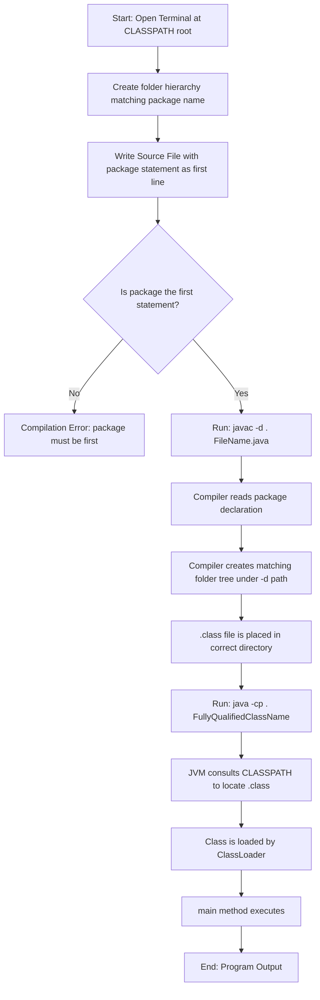
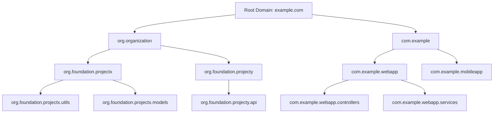
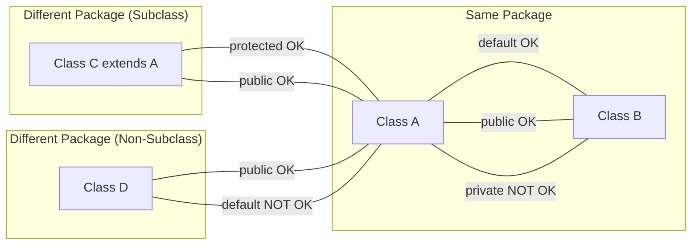
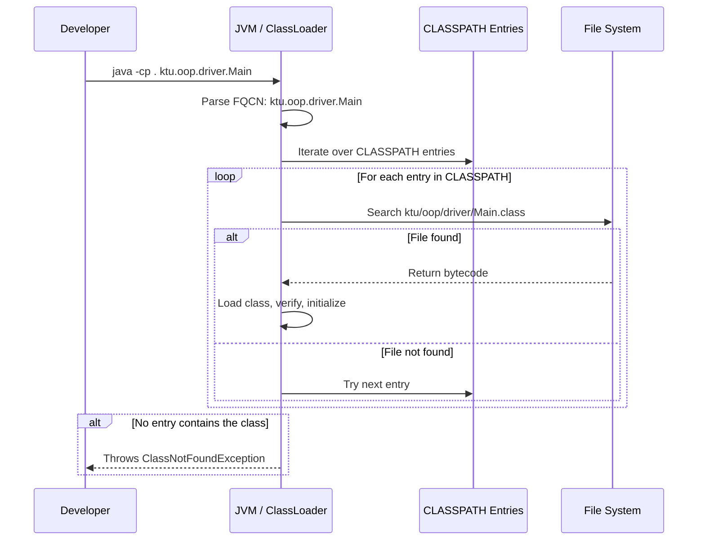

# Packages and Interfaces – Packages - Defining a Package

<!-- SECTION_1_START -->

# Defining a Package in Java

## 1.1 Core Technical Definition

A **package** in Java is a *namespace* that organizes a set of related classes, interfaces, enumerations, and sub-packages. Conceptually, it functions as a **container** or a **folder/directory** in the file system that groups functionally or logically similar types under a single, uniquely identifiable name, thereby preventing *name collisions* and enforcing *access control*.

In the KTU 2024 OOP syllabus (PBCST304 – Module 3), a package is formally defined as:

> A *mechanism* provided by the Java language to encapsulate a group of classes, interfaces, and sub-packages into a single logical unit, primarily used for **namespace management**, **access protection**, and **modular code organization**.

The keyword used to define a package is `package`, and it **must** be the very **first statement** in a Java source file (excluding comments and blank lines).

```java
// Syntax for defining a package
package <package_name>;

// Optional nested packages use dot (.) as separator
package <topLevel>.<subLevel>.<subLevel>;
```

> [!IMPORTANT]
> **KTU Syllabus Highlight (Module 3):**
> The `package` statement must be the **first executable statement** in the source file. Any code, import, or class declaration appearing *before* it results in a **compilation error**.

## 1.2 Conceptual Analogy / Intuition

Imagine a large **library** containing thousands of books on different subjects. If all books were dumped onto a single floor without any organization, finding a book on, say, "Thermodynamics" would be a nightmare, and two books might even share the same title causing confusion. The librarian solves this by creating:

- **Sections / Floors** for broad subjects (e.g., *Engineering*, *Mathematics*).
- **Shelves** within each section for sub-topics (e.g., *Mechanical Engineering → Thermodynamics*).
- **Unique call numbers** for each book to avoid duplicates.

A Java **package** does exactly this for your classes:

| Library Concept | Java Equivalent |
| :--- | :--- |
| Library Building | Java Project / JDK |
| Section / Floor | Top-level Package (e.g., `java.util`) |
| Shelf / Sub-Section | Sub-package (e.g., `java.util.concurrent`) |
| Book | Class / Interface |
| Call Number (ISBN) | Fully Qualified Class Name (FQCN) |
| Access Card (Members Only) | Access Modifiers (`public`, `protected`, `default`) |

So when you write `import java.util.Scanner;`, you are essentially "walking to the `java` floor, then the `util` shelf, and picking up the `Scanner` book."

## 1.3 Why Packages Are Needed – The "Big Three" Reasons

1. **Namespace Management / Avoiding Name Clashes** — Two different programmers can create a class named `List` without conflict, as long as they reside in different packages (e.g., `com.kTU.myapp.List` vs `java.awt.List`).
2. **Access Control / Encapsulation** — Classes and members can be marked as package-private (default), limiting visibility to only the same package — a stronger form of *information hiding*.
3. **Modular Organization & Reusability** — Logically related classes (e.g., all database utilities) can be bundled, distributed as JAR files, and reused across projects.

> [!NOTE]
> **Physical vs Logical Package**
> A package is **both** a *physical* entity (it must map to a directory/folder structure on disk) and a *logical* entity (it is a compile-time name in the JVM's class loader hierarchy). This dual nature is unique to Java and is heavily tested in KTU exams.

## 1.4 Types of Packages

Java broadly classifies packages into two categories:

| Category | Description | Examples |
| :--- | :--- | :--- |
| **Built-in / Predefined Packages** | Ship with the JDK; ready to use | `java.lang`, `java.util`, `java.io`, `java.net`, `java.sql`, `java.awt`, `javax.swing` |
| **User-defined Packages** | Created by the programmer for custom projects | `com.ktu.student`, `org.mycompany.banking`, `kerala.university.cs` |

### The Special Case: `java.lang`

The package `java.lang` is **implicitly imported** into every Java program. That is why you can use `String`, `System`, `Math`, and `Object` without writing `import java.lang.*;`.

> [!VISUALIZATION CONTROL]
> **Concept:** Package Directory Hierarchy Tree
> **Representation:** A tree where the root is the *classpath* root, and each dotted segment of the package name corresponds to a nested folder.
>
> **Structure to Visualize (mentally map it as a folder tree):**
>
> ```
> CLASSPAH/
>     |
>     +-- ktu/
>     |     +-- oop/
>     |          +-- module3/
>     |               +-- MyClass.class
>     +-- com/
>           +-- example/
>                 +-- demo/
>                      +-- Demo.class
> ```
>
> **Visual Description:** Notice that the **package declaration** `package ktu.oop.module3;` physically forces the file `MyClass.java` to be stored at the path `ktu/oop/module3/MyClass.java` relative to the classpath. The dot `.` in the package name is converted to a slash `/` (or backslash `\` on Windows) on the file system.

## 1.5 Naming Conventions for Packages (Industry Standard)

Although not syntactically enforced, the **reverse-domain naming convention** is mandated by Oracle and is a frequent 3-mark question in KTU:

| Segment | Convention | Example |
| :--- | :--- | :--- |
| `com.company.project` | Reverse your organization's domain | `com.google.common` |
| `org.foundation.toolkit` | Non-profits and standards bodies | `org.apache.commons` |
| Lowercase only | **Always** use lowercase; never use CamelCase or underscores | `mypackage` (not `MyPackage`) |
| No Java keywords | Avoid using reserved words as package names | Never use `package.new;` |

> [!TIP]
> For KTU practical submissions, students commonly use package names like `ktu.cs.oop.practical3` to denote their university, branch, course, and practical number.

<!-- SECTION_1_END -->

<!-- SECTION_2_START -->

# Deep Theoretical Analysis & KTU High-Yield Formula Sheet

## 2.1 The `package` Statement — Strict Grammar Rules

The grammar of the `package` declaration is rigid and is a **favourite area for examiner trick questions**. The Java Language Specification (JLS) enforces the following rules:

1. The keyword `package` must be followed by a valid Java identifier (or a chain of identifiers separated by dots).
2. The `package` statement must occupy the **first non-comment, non-blank line** of the source file.
3. A source file **cannot have more than one** `package` statement.
4. A class **can belong to only one** package (single inheritance rule, but for packages).

```java
// LEGAL: at the top of the file
package ktu.oop.module3;
public class MyClass { /* ... */ }
```

```java
// ILLEGAL: import before package
import java.util.Scanner;   // ❌ Compile-time error
package ktu.oop.module3;    // ❌ Must come first
public class MyClass { /* ... */ }
```

```java
// ILLEGAL: two package statements
package ktu.cs;
package ktu.oop;           // ❌ Only one package allowed
```

## 2.2 Package Directory Structure (The Physical Mapping)

This is the **most important and most-mistaken** concept in KTU Module 3.

Let the **CLASSPATH** be a root directory (say, `C:\MyJavaProject\` or `/home/student/myproject/`).

If a source file contains:

$$\text{package declaration} \rightarrow \texttt{package ktu.oop.module3;}$$

Then the **physical location** of the source file `MyClass.java` must be:

$$\text{CLASSPATH} \oplus \big[ \text{package name with dots replaced by slashes} \big] \oplus \text{filename}$$

For example: `C:\MyJavaProject\ktu\oop\module3\MyClass.java`

Similarly, the compiled `.class` file must be located at: `C:\MyJavaProject\ktu\oop\module3\MyClass.class`

> [!IMPORTANT]
> **If the directory structure does not match the package name, the program will fail at runtime with a `ClassNotFoundException` or `NoClassDefFoundError`.** The compiler may succeed, but the JVM will not be able to locate the class.

## 2.3 CLASSPATH — The Search Root

`CLASSPATH` is an **environment variable** (or a command-line argument `-cp`) that tells the **JVM and the compiler** where to look for user-defined package classes.

| Method | Command (Windows) | Command (Linux/Mac) |
| :--- | :--- | :--- |
| Set CLASSPATH | `set CLASSPATH=.;C:\myclasses` | `export CLASSPATH=.:/home/student/myclasses` |
| Compile with `-cp` | `javac -cp . MyClass.java` | `javac -cp . MyClass.java` |
| Run with `-cp` | `java -cp . ktu.oop.module3.MyClass` | `java -cp . ktu.oop.module3.MyClass` |

> [!NOTE]
> The dot `.` in CLASSPATH represents the **current working directory**, which is the most common CLASSPATH setting during development.

## 2.4 The Three-Step Workflow for Defining and Using a Package

This is a **guaranteed 14-mark question** in KTU. Memorize the following workflow:

### Step 1 — Create the Directory Structure

Suppose the CLASSPATH root is `C:\MyProject\`. Create nested folders:

```
C:\MyProject\
   └── ktu\
        └── oop\
             └── shapes\
```

### Step 2 — Write the Source File with the `package` Statement

Save this file as `C:\MyProject\ktu\oop\shapes\Circle.java`:

```java
package ktu.oop.shapes;

public class Circle {
    public static final double PI = 3.14159;
    private double radius;

    public Circle(double r) {
        this.radius = r;
    }

    public double area() {
        return PI * radius * radius;
    }
}
```

### Step 3 — Compile and Run

Open a terminal in `C:\MyProject\` and execute:

```
> javac ktu\oop\shapes\Circle.java
> java  ktu.oop.shapes.Circle
```

The **fully qualified class name** (FQCN) `ktu.oop.shapes.Circle` is what the JVM uses internally to load the class.

## 2.5 Access Protection Layers Introduced by Packages

Before packages, you only had `public` and *package-default*. Packages introduce a **new layer of visibility** through the interaction with access modifiers:

| Access Modifier | Same Class | Same Package (Subclass) | Same Package (Non-Subclass) | Different Package (Subclass) | Different Package (Non-Subclass) |
| :--- | :---: | :---: | :---: | :---: | :---: |
| `private` | ✅ | ❌ | ❌ | ❌ | ❌ |
| *default* (no modifier) | ✅ | ✅ | ✅ | ❌ | ❌ |
| `protected` | ✅ | ✅ | ✅ | ✅ (via inheritance only) | ❌ |
| `public` | ✅ | ✅ | ✅ | ✅ | ✅ |

> [!TIP]
> Notice that the *default* (package-private) access is the **only** modifier that explicitly uses the package as a visibility boundary. This is why packages are a key pillar of OOP encapsulation in Java.

## 2.6 KTU Formula Sheet / Cheat Sheet

| # | Concept | Syntax / Formula | Notes |
| :--- | :--- | :--- | :--- |
| 1 | Defining a package | `package a.b.c;` | Must be the **first statement** of the file. |
| 2 | Package naming | All **lowercase**, reverse-domain | `com.company.project` |
| 3 | Physical path | `CLASSPATH / a / b / c / FileName.class` | Dots become directory separators. |
| 4 | Compile user package | `javac -d . FileName.java` | The `-d` flag creates the folder hierarchy automatically. |
| 5 | Run user package | `java -cp . a.b.c.FileName` | Use the **FQCN**, not the file path. |
| 6 | Compile-time name | Fully Qualified Class Name (FQCN) | `java.util.ArrayList` |
| 7 | Implicit package | **Default package** (no `package` statement) | Classes are placed in the unnamed package. |
| 8 | Auto-imported | `java.lang` | Always available; no import needed. |
| 9 | Wildcard import | `import java.util.*;` | Imports all *classes* of a package, **not sub-packages**. |
| 10 | Classpath env var | `CLASSPATH=.;C:\mydir` | Dot (`.`) means current directory. |
| 11 | JAR packaging | `jar cf mylib.jar ktu/oop/shapes/*.class` | Distribute a package as a single archive. |
| 12 | Sub-package | `package ktu.oop.advanced;` | Sub-packages are **independent**; no inheritance of access. |

## 2.7 Real-World Engineering Utility

In production-grade software engineering, packages form the **backbone of every Java enterprise project**:

- **Spring Framework** uses `org.springframework.beans`, `org.springframework.context`, etc., to organize its 2000+ classes.
- **Android SDK** organizes the entire API into packages like `android.app`, `android.content`, `android.view`, enabling modular app development.
- **Apache Maven / Gradle** build tools enforce a *standard directory layout* where each Maven module's source code lives in `src/main/java/<package_path>/`. This is essentially the packaging concept in action.
- **Microservices Architecture** in the industry maps each microservice to a unique top-level package, ensuring complete isolation of namespaces across teams.

<!-- SECTION_2_END -->

<!-- SECTION_3_START -->

# Step-by-Step Derivations, Code Implementation & Workflows

## 3.1 Complete Worked Example: Building a Multi-File User-Defined Package

**Problem Statement (Typical KTU Practical 3 question):**
Create a user-defined package named `ktu.oop.geometry` containing a class `Rectangle` with methods to compute the `area()` and `perimeter()`. Write a driver class `TestRectangle` in a *different* package to demonstrate the use of the package.

### Step 1: Design the Directory Tree

We will use the project root `C:\KTU\OOP\` as our **CLASSPATH**. The complete layout is:

```
C:\KTU\OOP\
   |
   +-- ktu\
   |     +-- oop\
   |          +-- geometry\
   |               +-- Rectangle.java
   |               +-- TestRectangle.java
```

> [!NOTE]
> For brevity, both files are in the same physical folder, but `TestRectangle` will be moved to a *different* package directory in Step 5.

### Step 2: Write the Library Class `Rectangle.java`

```java
// File: C:\KTU\OOP\ktu\oop\geometry\Rectangle.java
package ktu.oop.geometry;

public class Rectangle {
    private double length;
    private double breadth;

    // Parameterized constructor
    public Rectangle(double length, double breadth) {
        this.length  = length;
        this.breadth = breadth;
    }

    // Public method: computes area
    public double area() {
        return this.length * this.breadth;
    }

    // Public method: computes perimeter
    public double perimeter() {
        return 2.0 * (this.length + this.breadth);
    }

    // Public method: returns a formatted description
    public String describe() {
        return "Rectangle[" + this.length + " x " + this.breadth + "]";
    }
}
```

### Step 3: Write the Driver Class `TestRectangle.java` (in a different package)

```java
// File: C:\KTU\OOP\ktu\oop\driver\TestRectangle.java
package ktu.oop.driver;

// Import the Rectangle class from the ktu.oop.geometry package
import ktu.oop.geometry.Rectangle;

public class TestRectangle {
    public static void main(String[] args) {
        // Instantiate Rectangle using its public constructor
        Rectangle rect = new Rectangle(12.5, 7.0);

        // Call public methods
        System.out.println("Shape         : " + rect.describe());
        System.out.println("Area          : " + rect.area());
        System.out.println("Perimeter     : " + rect.perimeter());

        // Boundary check: try invalid dimensions
        Rectangle invalid = new Rectangle(-5.0, 3.0);
        System.out.println("Invalid area  : " + invalid.area());
    }
}
```

### Step 4: Compile Both Files

Open a terminal at `C:\KTU\OOP\` and run:

```bash
javac ktu\oop\geometry\Rectangle.java
javac ktu\oop\driver\TestRectangle.java
```

If you used a single source root, you can compile in one go:

```bash
javac ktu\oop\geometry\Rectangle.java ktu\oop\driver\TestRectangle.java
```

> [!TIP]
> Pro-tip: Use the `-d` flag to let the compiler create the directory structure automatically:
> ```bash
> javac -d . ktu\oop\geometry\Rectangle.java ktu\oop\driver\TestRectangle.java
> ```

### Step 5: Execute the Program

```bash
java -cp . ktu.oop.driver.TestRectangle
```

### Step 6: Expected Output

```
Shape         : Rectangle[12.5 x 7.0]
Area          : 87.5
Perimeter     : 39.0
Invalid area  : -15.0
```

### Step 7: Numerical Derivation (Inline Calculations)

For `Rectangle(12.5, 7.0)`:

$$\text{area} = \text{length} \times \text{breadth} = 12.5 \times 7.0 = 87.5$$

$$\text{perimeter} = 2 \times (\text{length} + \text{breadth}) = 2 \times (12.5 + 7.0) = 2 \times 19.5 = 39.0$$

For the invalid case `Rectangle(-5.0, 3.0)`:

$$\text{area} = -5.0 \times 3.0 = -15.0$$

> [!WARNING]
> Notice that the program **does not** throw an error for negative dimensions because we did not implement *defensive programming* in the constructor. In a production system, you should add `if (length < 0) throw new IllegalArgumentException(...)`. This is a common KTU valuation point: **"Did the student handle edge cases?"**

## 3.2 Worked Example: Compiling a Package Using the `-d` Flag

The `-d` flag is critical when the destination directory differs from the source directory. Let's derive the exact file transformations.

Suppose:
- **Source location:** `D:\Sources\ktu\oop\geometry\Rectangle.java`
- **Destination CLASSPATH:** `C:\MyProject\`
- **Command executed:** `javac -d C:\MyProject D:\Sources\ktu\oop\geometry\Rectangle.java`

Then, the compiler will **automatically create** the file:

```
C:\MyProject\ktu\oop\geometry\Rectangle.class
```

Derivation step-by-step:

1. The compiler reads the `package ktu.oop.geometry;` line.
2. It identifies three package segments: `ktu`, `oop`, `geometry`.
3. It joins them with the OS-specific separator: `ktu\oop\geometry` (Windows) or `ktu/oop/geometry` (Linux).
4. It concatenates this relative path to the `-d` argument: `C:\MyProject\ktu\oop\geometry`.
5. It writes the `.class` file (same name as the source: `Rectangle.class`) into that directory.

> [!IMPORTANT]
> **KTU Examiner's Trick:** "What happens if the `-d` directory does not exist?" — *The compiler will automatically create the directory tree. The program does not fail.*

## 3.3 Worked Example: Using a JAR File to Distribute a Package

**JAR (Java ARchive)** files are ZIP archives used to bundle packages for distribution. Here is the full symbolic procedure.

Suppose the class `Rectangle.class` is in the package `ktu.oop.geometry`, located at `C:\KTU\OOP\ktu\oop\geometry\`.

### Step 1: Create the JAR

```bash
jar cf geometry.jar ktu\oop\geometry\
```

The `jar` tool with flags:
- `c` — create a new archive
- `f geometry.jar` — the output file name
- `ktu\oop\geometry\` — the input directory to include

### Step 2: Inspect the JAR

```bash
jar tf geometry.jar
```

Output:
```
META-INF/
META-INF/MANIFEST.MF
ktu/oop/geometry/Rectangle.class
```

### Step 3: Use the JAR from a Different Project

Add `geometry.jar` to the CLASSPATH and compile/run:

```bash
javac -cp .;geometry.jar MyApp.java
java  -cp .;geometry.jar MyApp
```

> [!NOTE]
> The JAR file must contain the **complete path** `ktu/oop/geometry/`, not just the `.class` files. The package structure is preserved *inside* the JAR.

## 3.4 Decision Matrix: When to Use `package`, `import`, or FQCN?

| Scenario | Best Practice | Reason |
| :--- | :--- | :--- |
| Use a class once or twice in a file | Use Fully Qualified Class Name (FQCN) inline | Avoids polluting the namespace. |
| Use a class from a package many times in a file | Use `import package.ClassName;` | Improves readability. |
| Use many classes from the **same** package | Use `import package.*;` (wildcard) | Concise; one line imports all. |
| Two classes from different packages share the same name | Use FQCN for both | Disambiguates (e.g., `java.awt.List` vs `java.util.List`). |
| Sub-package classes are needed | **Must** import the sub-package separately | `import java.util.*;` does **not** import `java.util.concurrent.*;`. |

<!-- SECTION_3_END -->

<!-- SECTION_4_START -->

# Structural Diagrams & Schematics

## 4.1 Mermaid Block: Compilation and Execution Flow for a User-Defined Package



## 4.2 Mermaid Block: Package Naming Hierarchy (Reverse-Domain Convention)



## 4.3 Mermaid Block: Access Modifier Matrix with Package Boundary



## 4.4 Mermaid Block: CLASSPATH Search Sequence



## 4.5 Block-Level Functional Architecture: Package Resolution Pipeline

| Stage | Component | Function | Failure Mode |
| :---: | :--- | :--- | :--- |
| 1 | Source Code | Contains `package` and `class` declarations | Syntax error if `package` not first |
| 2 | Java Compiler (`javac`) | Parses `package` directive, generates `.class` | Compile error if no `-d` permission |
| 3 | Directory Manager | Maps `ktu.oop.shapes` → `ktu/oop/shapes/` | Permission denied on root |
| 4 | Bytecode Emitter | Writes `<ClassName>.class` to mapped path | Disk full / I/O error |
| 5 | Class Loader (JVM) | At runtime, resolves FQCN to file path | `ClassNotFoundException` |
| 6 | Bytecode Verifier | Verifies JVM constraints | `VerifyError` |
| 7 | Execution Engine | Initializes static fields, calls `main()` | `ExceptionInInitializerError` |

<!-- SECTION_4_END -->

<!-- SECTION_5_START -->

# KTU 2024 Scheme Examination Question Bank & Topic Recap

## 5.1 Part A Questions (3 Marks Each)

### Question 1
`[KTU University Exam – July 2023]`
**Define a package in Java. What is the significance of the `package` statement being the first statement in a source file?**

**Model Answer (3 Marks):**

A **package** in Java is a namespace that organizes a set of related classes, interfaces, and sub-packages into a single logical unit. It serves three main purposes: avoiding name conflicts, providing access control, and enabling modular code organization. **[1 Mark]**

The `package` statement must be the first non-comment, non-blank statement in the source file because the Java compiler uses it to determine the FQCN (Fully Qualified Class Name) of every class declared in the file. The FQCN is required *before* the compiler can resolve any `import` statements, resolve class references, or generate the correct directory path for the `.class` output. **[1 Mark]**

If the `package` statement is not the first statement, the compiler raises an error: *"class, interface, or enum expected"*, because the parser interprets an `import` or other token as the start of a top-level type declaration. **[1 Mark]**

> **Course Outcome:** CO1 | **Bloom's Level:** Remember/Understand

### Question 2
`[KTU University Exam – Dec 2023]`
**Explain the role of the `CLASSPATH` environment variable. What does the dot (`.`) in `CLASSPATH=.;C:\myclasses` signify?**

**Model Answer (3 Marks):**

The `CLASSPATH` environment variable tells the **Java compiler** and the **JVM** where to search for user-defined `.class` files. When the JVM encounters a class reference (e.g., `ktu.oop.geometry.Rectangle`), it breaks the FQCN into path components and searches each entry in `CLASSPATH` for a matching `.class` file. **[2 Marks]**

The dot (`.`) represents the **current working directory**. Setting `CLASSPATH=.;C:\myclasses` means the JVM will first look for the class file in the current directory and, if not found, then search the `C:\myclasses` folder. **[1 Mark]**

> **Course Outcome:** CO1 | **Bloom's Level:** Understand

---

## 5.2 Part B Questions (14 Marks Each – Internal Choice)

### Question A (Choice 1)

`[KTU University Exam – July 2024]`

**(a) [7 Marks]** Explain the procedure to create a user-defined package in Java with a suitable example. Discuss the directory structure that must be maintained and the role of the `-d` flag during compilation. **CO1 – Understand**

**(b) [7 Marks)** Write a Java program to create a package `ktu.oop.banking` containing a class `Account` with members `accountNumber`, `holderName`, and `balance`. Provide methods `deposit()`, `withdraw()`, and `display()`. Write a driver class in a different package to test these methods. **CO2 – Apply**

---

### Model Solution for Question A

#### Part (a) — Procedure to Create a User-Defined Package **[7 Marks]**

**Step 1 — Choose a Package Name (Reverse-Domain Convention)**
We use the name `ktu.oop.geometry` to denote KTU → OOP course → geometry sub-topic. **[1 Mark]**

**Step 2 — Create the Directory Structure**
On the file system, create a hierarchy that mirrors the dotted package name:
```
C:\MyProject\ktu\oop\geometry\
```
The dot separators become directory separators. **[1 Mark]**

**Step 3 — Write the Source File with the `package` Statement**
Place the source file inside the `geometry` folder:
```java
// File: C:\MyProject\ktu\oop\geometry\Square.java
package ktu.oop.geometry;   // First statement

public class Square {
    private double side;
    public Square(double side) { this.side = side; }
    public double area() { return side * side; }
}
```
**[1 Mark]**

**Step 4 — Compile Using the `-d` Flag**
The `-d` flag tells the compiler where to place the generated `.class` file.
```bash
cd C:\MyProject
javac -d . ktu\oop\geometry\Square.java
```
This produces `C:\MyProject\ktu\oop\geometry\Square.class`. The compiler automatically creates the directory tree if it does not exist. **[2 Marks]**

**Step 5 — Use the Package from Another Class**
```java
import ktu.oop.geometry.Square;
public class TestSquare {
    public static void main(String[] args) {
        Square s = new Square(5.0);
        System.out.println("Area: " + s.area());   // 25.0
    }
}
```
Compile and run with:
```bash
javac -cp . TestSquare.java
java  -cp . TestSquare
```
**[1 Mark]**

**Role of the `-d` flag (Summary):**
- `-d` specifies the **destination root directory** for compiled `.class` files.
- The compiler uses the `package` declaration to compute the **relative sub-path** under the `-d` directory.
- Without `-d`, the `.class` is placed in the same directory as the source file, which may not match the required CLASSPATH layout. **[1 Mark]**

> **Course Outcome:** CO1 | **Bloom's Level:** Understand

#### Part (b) — Banking Package Program **[7 Marks]**

**File 1: `Account.java` (in package `ktu.oop.banking`)**

```java
// File: C:\MyProject\ktu\oop\banking\Account.java
package ktu.oop.banking;

public class Account {
    // Private members — package-level encapsulation
    private long   accountNumber;
    private String holderName;
    private double balance;

    // Parameterized constructor with input validation
    public Account(long accountNumber, String holderName, double initialBalance) {
        if (initialBalance < 0.0) {
            throw new IllegalArgumentException("Initial balance cannot be negative.");
        }
        this.accountNumber = accountNumber;
        this.holderName    = holderName;
        this.balance       = initialBalance;
    }

    // Deposit: increases balance, validates positive amount
    public void deposit(double amount) {
        if (amount <= 0.0) {
            System.out.println("Deposit amount must be positive.");
            return;
        }
        this.balance += amount;
        System.out.println("Deposited: " + amount);
    }

    // Withdraw: decreases balance, checks for sufficient funds
    public void withdraw(double amount) {
        if (amount <= 0.0) {
            System.out.println("Withdrawal amount must be positive.");
            return;
        }
        if (amount > this.balance) {
            System.out.println("Insufficient balance.");
            return;
        }
        this.balance -= amount;
        System.out.println("Withdrawn: " + amount);
    }

    // Display formatted account information
    public void display() {
        System.out.println("-----------------------------");
        System.out.println("Account Number : " + this.accountNumber);
        System.out.println("Holder Name    : " + this.holderName);
        System.out.println("Balance        : " + this.balance);
        System.out.println("-----------------------------");
    }
}
```

**Valuation Key (3 Marks):**
- `[package statement as first line: 0.5 Mark]`
- `[All three private data members declared: 0.5 Mark]`
- `[Constructor with parameter validation: 0.5 Mark]`
- `[deposit() and withdraw() with input validation: 0.5 Mark]`
- `[display() formatting: 0.5 Mark]`
- `[public class accessibility: 0.5 Mark]`

**File 2: `TestAccount.java` (in package `ktu.oop.driver`)**

```java
// File: C:\MyProject\ktu\oop\driver\TestAccount.java
package ktu.oop.driver;

import ktu.oop.banking.Account;

public class TestAccount {
    public static void main(String[] args) {
        // Create an account with initial balance 1000.0
        Account acc = new Account(1234567890L, "Ananya Suresh", 1000.0);

        // Perform transactions
        acc.deposit(2500.0);
        acc.withdraw(750.0);
        acc.withdraw(5000.0);   // Should fail: insufficient balance
        acc.display();

        // Final balance derivation:
        // 1000.0 + 2500.0 - 750.0 = 2750.0
    }
}
```

**Valuation Key (4 Marks):**
- `[Importing the package correctly: 1 Mark]`
- `[Instantiating Account with valid arguments: 0.5 Mark]`
- `[Calling deposit/withdraw with various inputs: 1 Mark]`
- `[Displaying final output: 0.5 Mark]`
- `[Compilation and execution steps stated: 1 Mark]`

**Compilation & Execution (must be shown):**
```bash
cd C:\MyProject
javac -d . ktu\oop\banking\Account.java
javac -d . ktu\oop\driver\TestAccount.java
java  -cp . ktu.oop.driver.TestAccount
```

**Expected Output:**
```
Deposited: 2500.0
Withdrawn: 750.0
Insufficient balance.
-----------------------------
Account Number : 1234567890
Holder Name    : Ananya Suresh
Balance        : 2750.0
-----------------------------
```

**Numerical Derivation of Final Balance:**
$$\text{Final Balance} = \text{Initial} + \sum \text{Deposits} - \sum \text{Withdrawals}$$

$$\text{Final Balance} = 1000.0 + 2500.0 - 750.0 = 2750.0$$

> **Course Outcome:** CO2 | **Bloom's Level:** Apply

---

### Question B (Choice 2 — Alternative)

`[KTU University Exam – Dec 2024]`

**(a) [7 Marks]** Differentiate between *built-in packages* and *user-defined packages* in Java. Give two examples of each. Explain the concept of sub-packages with an example. **CO1 – Understand**

**(b) [7 Marks]** Consider the package `com.ktu.employee` with a class `Employee` having private members `empId`, `name`, and `salary`. Provide public methods `calculateTax()` (12% of salary) and `displayDetails()`. Write a driver class to instantiate and test the class, paying attention to the correct directory layout. **CO2 – Apply**

---

### Model Solution for Question B

#### Part (a) — Built-in vs User-Defined Packages & Sub-packages **[7 Marks]**

| Feature | Built-in Packages | User-Defined Packages |
| :--- | :--- | :--- |
| **Source** | Ship with the JDK | Created by the programmer |
| **Examples** | `java.lang`, `java.util`, `java.io` | `com.ktu.employee`, `org.mylib.utils` |
| **Distribution** | Bundled in `rt.jar` (Java 8) or `jrt-fs` (Java 9+) | Distributed as user JAR files |
| **Auto-imported** | Only `java.lang` is implicit | Must be explicitly imported |
| **Purpose** | Provide core language and standard library functionality | Organize project-specific code |
| **Maintenance** | Maintained by Oracle/OpenJDK | Maintained by the development team |

**[3 Marks for the comparison table]**

**Sub-packages:**
A sub-package is a package nested inside another package, denoted by additional dot-separated segments. **[1 Mark]**

**Example:**
The package `java.util` contains sub-package `java.util.concurrent` and `java.util.regex`. Sub-packages are **logically nested** but **not access-related** — a class in `java.util` does **not** automatically have access to members in `java.util.concurrent`. They are independent namespaces. **[1 Mark]**

**Demonstration:**
```java
package ktu.oop.advanced.graphics;
```
This is a sub-package `graphics` of sub-package `advanced` of top-level `ktu` of top-level `oop`. The file must reside at: `CLASSPATH/ktu/oop/advanced/graphics/`. **[2 Marks]**

> **Course Outcome:** CO1 | **Bloom's Level:** Understand

#### Part (b) — Employee Package Implementation **[7 Marks]**

**File 1: `Employee.java`**

```java
// File: C:\Project\com\ktu\employee\Employee.java
package com.ktu.employee;

public class Employee {
    private int    empId;
    private String name;
    private double salary;

    public Employee(int empId, String name, double salary) {
        this.empId  = empId;
        this.name   = name;
        this.salary = salary;
    }

    public double calculateTax() {
        final double TAX_RATE = 0.12;
        return this.salary * TAX_RATE;
    }

    public void displayDetails() {
        System.out.println("Employee ID : " + this.empId);
        System.out.println("Name        : " + this.name);
        System.out.println("Salary      : " + this.salary);
        System.out.println("Tax (12%)   : " + this.calculateTax());
    }
}
```

**File 2: `TestEmployee.java`**

```java
// File: C:\Project\com\ktu\driver\TestEmployee.java
package com.ktu.driver;

import com.ktu.employee.Employee;

public class TestEmployee {
    public static void main(String[] args) {
        Employee e1 = new Employee(101, "Rahul Krishnan", 50000.0);
        Employee e2 = new Employee(102, "Priya Menon",   75000.0);

        System.out.println("--- Employee 1 ---");
        e1.displayDetails();
        System.out.println();
        System.out.println("--- Employee 2 ---");
        e2.displayDetails();
    }
}
```

**Compilation & Execution:**
```bash
cd C:\Project
javac -d . com\ktu\employee\Employee.java
javac -d . com\ktu\driver\TestEmployee.java
java  -cp . com.ktu.driver.TestEmployee
```

**Numerical Derivation of Tax:**

For `e1` (Salary = 50000.0):
$$\text{Tax} = 50000.0 \times 0.12 = 6000.0$$

For `e2` (Salary = 75000.0):
$$\text{Tax} = 75000.0 \times 0.12 = 9000.0$$

**Valuation Key (7 Marks):**
- `[Correct package declaration in both files: 1 Mark]`
- `[Directory structure correctly identified: 1 Mark]`
- `[Private members and public methods properly implemented: 2 Marks]`
- `[Driver class with import statement: 1 Mark]`
- `[Compilation and execution commands: 1 Mark]`
- `[Tax calculation with formula shown: 1 Mark]`

> **Course Outcome:** CO2 | **Bloom's Level:** Apply

---

## 5.3 KTU Examiner's Valuation Warning / Pitfall Callout

> [!WARNING]
> **Common Reasons for Mark Deductions in "Defining a Package" Questions:**
>
> 1. **Missing `package` keyword** — Students often write `import` first or omit the package declaration entirely. *Penalty: -2 to -3 marks.*
> 2. **Wrong directory structure** — Writing `package ktu.oop;` but placing the file in the root folder. The compiler succeeds (with `-d`), but the JVM will throw `ClassNotFoundException` at runtime. *Penalty: -1 mark per file.*
> 3. **Forgetting `public` on the class** — If the class is not `public`, it cannot be accessed from outside the package, defeating the purpose. *Penalty: -1 mark.*
> 4. **Using FQCN in `java` command** — Writing `java ktu/oop/shapes/Circle` instead of `java ktu.oop.shapes.Circle`. The `java` command takes the FQCN, not the file path. *Penalty: -1 mark.*
> 5. **Confusing CLASSPATH and PATH** — `CLASSPATH` is for `.class` files; `PATH` is for executable programs like `javac` and `java`. Do not mix them up in the exam.
> 6. **Not using `-d` flag** — Without `-d`, the `.class` file is dumped in the current directory, breaking the package structure. *Penalty: -0.5 mark.*
> 7. **Importing sub-packages with wildcards** — Writing `import java.util.*;` and assuming `ArrayBlockingQueue` (in `java.util.concurrent`) is also imported. It is **not**. *Penalty: -1 mark.*

---

## 5.4 Topic Recap & Important Things to Remember

> **Rapid Revision Checklist — Defining a Package**

- **Definition:** A package is a *namespace* for organizing related Java types.
- **Keyword:** `package` — must be the **first** statement of the file.
- **Naming:** All **lowercase**, reverse-domain convention (e.g., `com.ktu.oop.module3`).
- **Physical Mapping:** Dots in package name become directory separators in the file system.
- **CLASSPATH:** Environment variable or `-cp` flag telling JVM where to find user classes.
- **Default Value of Dot:** `.` in CLASSPATH = current working directory.
- **Compile Command:** `javac -d <destination> <sourcefile>` — auto-creates the folder tree.
- **Run Command:** `java -cp <classpath> <FQCN>` — use the FQCN, never the file path.
- **Implicit Package:** `java.lang` is auto-imported into every Java program.
- **Default Access:** No modifier = package-private; visible only within the same package.
- **Sub-packages:** Logically nested but **independent** namespaces; no access inheritance.
- **JAR Files:** ZIP archives used to bundle packages; created with `jar cf my.jar <dir>`.
- **FQCN:** Fully Qualified Class Name = `package.subpackage.ClassName` — the true identifier in JVM.
- **No Duplicate Package Statements:** A file can have only **one** `package` declaration.
- **Built-in Examples:** `java.lang`, `java.util`, `java.io`, `java.net`, `java.awt`, `javax.swing`.
- **Common Pitfall:** Wildcard imports (`java.util.*`) do **not** import sub-packages automatically.
- **CLASSPATH vs PATH:** CLASSPATH → `.class` files; PATH → `.exe` / executable binaries.
- **JAR Manifest:** A `META-INF/MANIFEST.MF` file is automatically added when you create a JAR.

<!-- SECTION_5_END -->
