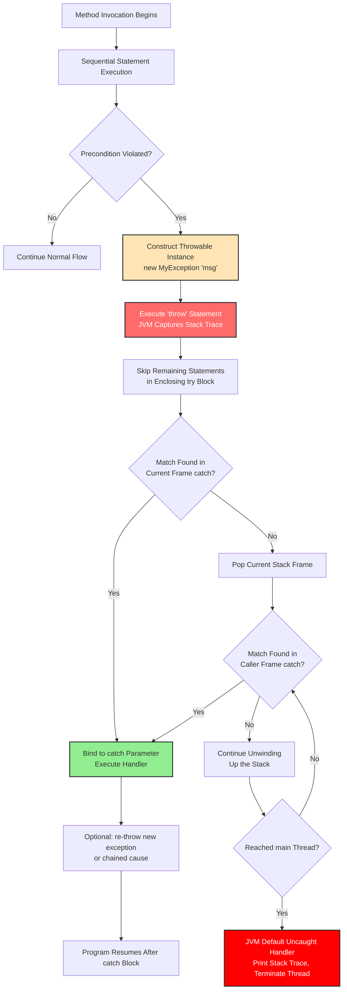
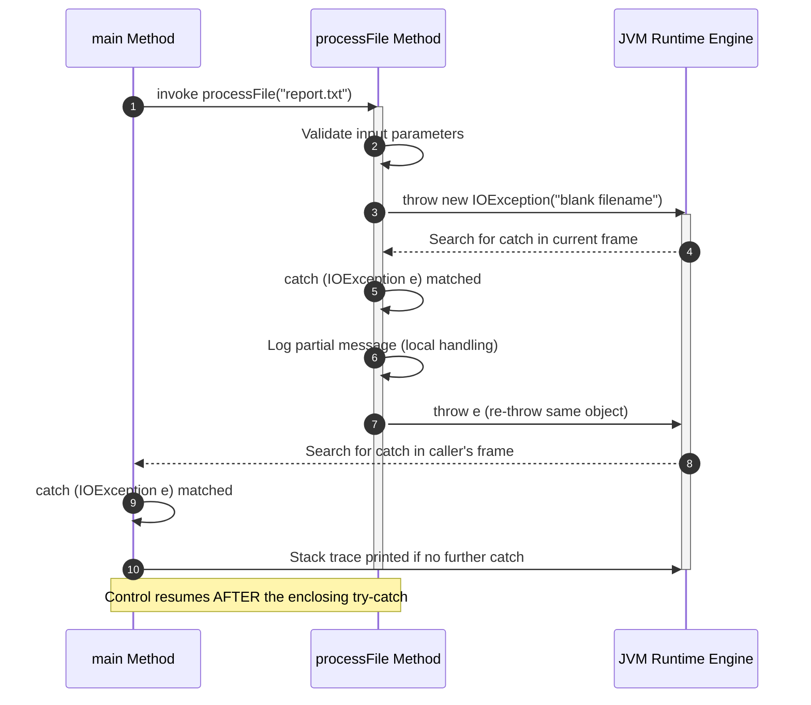
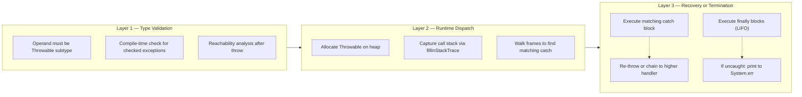

# throw

<!-- SECTION_1_START -->

# 🎯 THE `throw` KEYWORD IN JAVA EXCEPTION HANDLING

## 1. Core Technical Definition & Intuitive Overview

> [!IMPORTANT]
> **KTU Syllabus Definition (PBCST304 - Module 3: Packages and Interfaces / Exception Handling)**
> The `throw` keyword in Java is a **unilateral exception generation operator** used inside a method body (or static/instance initializer block) to **explicitly hand over a single, pre-constructed `Throwable` object** to the Java Virtual Machine's (JVM) runtime exception dispatcher. Once executed, the `throw` statement **aborts normal sequential control flow** and begins the **stack-unwinding (propagation) process** until the exception is caught by an enclosing `try-catch` block or it terminates the `main` thread.

### 🔑 Conceptual Analogy: The "Fire Alarm Pull Station"

Imagine you are inside a large, multi-floor office building (your **Java call stack**). Everything is running normally — the air conditioning hums, lights are on, employees are working.

| Real-World Object | Java Counterpart |
|---|---|
| 🏢 The building | Your call stack of methods |
| 🚨 A manual fire alarm pull-station on a wall | A `throw` statement in your code |
| 🧯 The fire alarm hardware module (the device that beeps and flashes) | The `Throwable` (or subclass) **object** you construct |
| 👨‍🚒 The fire control room that receives the signal | The nearest enclosing `try-catch` block |
| 💥 No control room present → building burns down | No `catch` matches → `JVM` default handler prints stack trace and terminates `main` |

**The Intuition:** You, the programmer, are *not* the fire department. You do not *fight* the fire. You simply **manufacture the alarm device** (`new ArithmeticException(...)`) and **pull the station** (`throw`). The building's internal routing (the JVM) then does the rest of the work — it walks *up* the floors (stack frames) asking, "Does anyone here know how to handle this?" If a floor manager (`catch` block) responds, the alarm is acknowledged. Otherwise, the building's master controller (JVM default uncaught exception handler) shuts everything down.

> [!NOTE]
> **Crucial Distinction (Frequently Tested in KTU)**
> - `throw` → a **verb / action**, used *inside* method body, sends an object upward.
> - `throws` → a **declaration / signature clause**, used in method *header*, declares *types* the method might forward upward.
> They are **not interchangeable**. Memorize: **"`throw` the BALL, `throws` LIST the BOXES it may be thrown in."**

### 📊 Standard Exception Class Hierarchy (KTU-Mapped)

The operand supplied to `throw` **must** belong to the `java.lang.Throwable` family. The full mandatory hierarchy:

```
java.lang.Object
    └── java.lang.Throwable
            ├── java.lang.Error           (JVM-level, NOT recommended to throw)
            │       ├── OutOfMemoryError
            │       └── StackOverflowError
            └── java.lang.Exception
                    ├── IOException        (Checked)
                    ├── SQLException       (Checked)
                    └── RuntimeException   (Unchecked)
                            ├── ArithmeticException
                            ├── NullPointerException
                            ├── ArrayIndexOutOfBoundsException
                            └── NumberFormatException
```

### 🎨 GeoGebra / Desmos Integration

> [!VISUALIZATION CONTROL]
> **Concept:** Stack-Unwinding Path after a `throw`
> **Desmos Input (graph parameter $k$ = stack frame depth):**
> * `f(k) = {k < 3: 1, k >= 3: 0}` (a discrete step showing the abrupt halt)
> **Visual Description:** Imagine the y-axis as "Normal Execution Flow" and x-axis as "Stack Depth". Control runs flat at y=1 from method 1 through method 3. At frame 3, the `throw` executes: the graph drops to y=0 (abnormal flow). The line then *jumps* diagonally up to frame 5 (where the `catch` resides) and resumes y=1.

### 🔬 Core Syntax Forms

```java
throw new SomeException("Message text");
throw someExceptionReference;       // re-throwing a caught exception
throw new RuntimeException();       // implicit no-arg constructor
```

| Rule | Constraint |
|---|---|
| Operand type | Must be `java.lang.Throwable` or a subclass |
| Operand evaluation | Evaluated at runtime, **must be non-null** |
| Quantity per statement | Exactly **one** exception object |
| Placement | Inside method body, constructor, or initializer block |
| Post-execution | Remaining statements in the `try` block are **skipped** |

---

<!-- SECTION_1_END -->

<!-- SECTION_2_START -->

# 📐 DEEP THEORETICAL ANALYSIS & KTU HIGH-YIELD FORMULA SHEET

## 2. Operational Mechanics — What Happens "Under the Hood"?

When the JVM encounters a `throw` statement, it triggers a precise **eight-stage sequence** (this is the KTU-board-expected explanation when a question says "Explain the execution flow of `throw`"):

1. **Object Construction Phase** → The right-hand operand expression is fully evaluated, producing a `Throwable` reference. If the type is checked (e.g., `IOException`) and we are inside a non-`throws` method, **compile-time error** is raised.
2. **Stack Frame Snapshot** → The JVM captures the current call stack and constructs a `StackTraceElement[]` array representing the chain of active method invocations.
3. **Synchronization Release** → Any `synchronized` monitors held by the throwing thread for the current method are released (lock relinquishment is *partial* — only those held by the throwing frame).
4. **Finally Block Invocation** → Before propagating, the JVM walks outward looking for `finally` blocks (or `try-with-resources` close actions) attached to each traversed `try`.
5. **Handler Search Algorithm** → The JVM inspects the *current* method for a `try-catch` whose `catch` parameter is **the same type OR a supertype** of the thrown object. Uses **first-match wins** semantics.
6. **No Handler in Current Frame?** → The current method's stack frame is popped, and the search continues in the **caller's** frame.
7. **Catch Match Found** → The exception reference is bound to the `catch` parameter identifier, the corresponding `catch` block executes, and the exception is considered *handled*.
8. **No Handler Anywhere in `main`** → The default uncaught exception handler (`Thread.UncaughtExceptionHandler`) prints the stack trace to `System.err` and the thread terminates.

### 🧠 The "Why" Behind the Design

> [!TIP]
> **Why does Java separate `throw` and `throws`?**
> * **Single Responsibility Principle at the language level**: `throw` is an *action*; `throws` is a *contract*. A method might handle its own exceptions (`throw` then `catch`) but declare others it cannot handle (`throws`). This separation gives the compiler enough information to enforce the checked-exception contract *without* forcing the programmer to actually instantiate exceptions at every method signature.

## 📊 KTU Formula Sheet / Cheat Sheet

> [!NOTE]
> The following table is the **definitive reference** for the `throw` keyword. All other tables in KTU model solutions reduce to this.

| # | Property | Specification | KTU Board Tip |
|---|---|---|---|
| 1 | Keyword | `throw` (lowercase) | Compiler is case-sensitive. `Throw` is an error. |
| 2 | Operand | A `Throwable` *instance* or *reference* (not a class) | `throw Exception;` ❌ — must be `throw new Exception();` |
| 3 | Number per statement | Exactly **one** | `throw e1, e2;` is **illegal** in Java. |
| 4 | Position | Method body, constructor, static/instance initializer | Cannot appear as a top-level statement outside a class. |
| 5 | Reachability | Code immediately after `throw` is **unreachable** | Causes *"unreachable statement"* compile error. |
| 6 | Checked exception rule | If throwing a checked exception, enclosing method must declare it in `throws` | Otherwise: *"unhandled exception"* compile error. |
| 7 | Unchecked exception rule | `RuntimeException`, `Error`, and their subclasses need no `throws` declaration | Always allowed to be thrown. |
| 8 | Control transfer | Jumps to the nearest matching `catch` (or terminates the thread) | Bypasses all remaining statements in the enclosing `try`. |
| 9 | Re-throwing | `catch(E e){ throw e; }` propagates a caught exception upward | Useful for partial handling + logging. |
| 10 | `throw` inside `finally` | Allowed, but **masks** the original exception in transit (anti-pattern) | KTU frequently asks: *"What is exception masking?"* |
| 11 | Compiler view | An expression of type `Nothing` (in Kotlin) / `void` in Java's flow analysis | Causes following statements to be flagged as dead code. |
| 12 | `throw null` | Compiles, but throws a `NullPointerException` at runtime | The reference is auto-unboxed/used; null is illegal. |

### 🌍 Real-World Engineering Utility

| Application Domain | Why `throw` is Critical |
|---|---|
| **REST API Backends (Spring Boot)** | Validating user input — if `age < 0`, the service `throw`s a custom `InvalidAgeException` that the global `@ControllerAdvice` translates to an **HTTP 400**. |
| **Banking & FinTech** | `throw new InsufficientFundsException("Balance: " + bal)` is caught at the transaction-coordinator level to roll back the JDBC transaction. |
| **Embedded / IoT Firmware (Java ME)** | Sensor-read failures use `throw new SensorTimeoutException()` to signal the main loop to switch to fallback mode. |
| **Compiler Construction (Dragon Book projects)** | Lexer/Parser phases `throw` `ParseException` to unwind to the syntax-error recovery routine. |
| **Production Logging (SLF4J/Log4j2)** | Stack traces from `throw new MyException()` are the **primary signal** in observability dashboards (Grafana, Datadog). |

---

<!-- SECTION_2_END -->

<!-- SECTION_3_START -->

# 🛠️ STEP-BY-STEP DERIVATIONS & CODE IMPLEMENTATION

## 3.1 Exhaustive Code Implementation — All Major `throw` Patterns

The following is a **single, fully-operational Java 17 program** that demonstrates every KTU-relevant `throw` idiom. Compile and run as `Main.java`.

```java
import java.io.IOException;
import java.util.Scanner;

/**
 * KTU PBCST304 — Module 3 Demonstration
 * Topic: The 'throw' keyword
 * Demonstrates: implicit throw, explicit throw, checked, unchecked,
 * custom exception throw, re-throw, and throw-in-finally masking.
 */
public class Main {

    // ---------- Custom Checked Exception (KTU Hot Topic) ----------
    static class AgeValidationException extends Exception {
        public AgeValidationException(String message) {
            super(message);
        }
    }

    // ---------- Custom Unchecked Exception ----------
    static class InvalidEmailException extends RuntimeException {
        public InvalidEmailException(String message) {
            super(message);
        }
    }

    // ============================================================
    // DEMO 1: Throwing an Unchecked (built-in) Exception
    // ============================================================
    public static double safeDivide(int numerator, int denominator) {
        // EXPLANATION:
        // 'denominator == 0' is a programmer-detected invalid state.
        // We MANUFACTURE an ArithmeticException object (the alarm device)
        // and then 'throw' it (pull the station).
        if (denominator == 0) {
            throw new ArithmeticException(
                "Division by zero is undefined. Numerator was: " + numerator
            );
        }
        return (double) numerator / denominator;
    }

    // ============================================================
    // DEMO 2: Throwing a Checked (custom) Exception
    //         NOTE: 'throws' clause in the signature is MANDATORY.
    // ============================================================
    public static void registerVoter(String name, int age)
            throws AgeValidationException {                  // <-- 'throws' (the boxes)

        if (age < 18) {
            // 'throw' (the action) — handing over a checked exception object
            throw new AgeValidationException(
                "Voter '" + name + "' is underage. Age provided: " + age
            );
        }
        System.out.println("✅ Voter '" + name + "' registered successfully.");
    }

    // ============================================================
    // DEMO 3: Re-throwing a Caught Exception (partial handling)
    // ============================================================
    public static void processFile(String fileName)
            throws IOException {

        try {
            if (fileName == null || fileName.isBlank()) {
                throw new IOException("File name cannot be null or blank.");
            }
            // Simulated file processing that succeeds
            System.out.println("📂 Processing file: " + fileName);

        } catch (IOException ioe) {
            // PARTIAL handling — log it locally
            System.out.println("⚠️ [LOG] Partial handling in processFile(): "
                                + ioe.getMessage());
            // RE-THROW — pass the alarm UP to the caller
            throw ioe;
        }
    }

    // ============================================================
    // DEMO 4: Validating multiple fields, throwing the first failure
    // ============================================================
    public static void signup(String email, int age) {
        if (email == null || !email.contains("@")) {
            throw new InvalidEmailException(
                "Email is malformed: " + email
            );
        }
        if (age < 13) {
            // We do NOT need 'throws' for RuntimeException subclasses
            throw new IllegalArgumentException(
                "Minimum signup age is 13. Provided: " + age
            );
        }
        System.out.println("✅ Signup complete for: " + email);
    }

    // ============================================================
    // DEMO 5: Demonstrating that code after 'throw' is UNREACHABLE
    //         (Will NOT compile if uncommented — shown as illustration)
    // ============================================================
    public static int demoUnreachable() {
        throw new RuntimeException("Boom");
        // return 5;   // <-- COMPILE ERROR: "unreachable statement"
    }

    // ============================================================
    // DEMO 6: 'throw null' edge case (RUNTIME NullPointerException)
    // ============================================================
    public static void demoThrowNull() {
        RuntimeException ref = null;
        // Compiles fine! At runtime, JVM tries to use 'ref' -> NPE
        throw ref;   // <-- throws NullPointerException automatically
    }

    // ============================================================
    // DEMO 7: Chained exceptions (cause-and-effect)
    // ============================================================
    public static void chainedDemo() throws Exception {
        try {
            int x = 10 / 0;   // auto-thrown ArithmeticException
        } catch (ArithmeticException original) {
            // Wrap and re-throw with a higher-level meaning
            Exception wrapped = new Exception(
                "Business rule violated: cannot compute pricing",
                original        // <-- cause chaining
            );
            throw wrapped;
        }
    }

    // ============================================================
    // MAIN DRIVER
    // ============================================================
    public static void main(String[] args) {

        System.out.println("──────────── DEMO 1: Unchecked throw ────────────");
        try {
            double r = safeDivide(100, 0);
            System.out.println("Result = " + r);
        } catch (ArithmeticException e) {
            System.out.println("🛑 Caught: " + e.getMessage());
        }

        System.out.println("\n──────────── DEMO 2: Checked throw ────────────");
        try {
            registerVoter("Arjun", 16);
        } catch (AgeValidationException e) {
            System.out.println("🛑 Caught: " + e.getMessage());
        }

        System.out.println("\n──────────── DEMO 3: Re-throw ────────────");
        try {
            processFile("");    // empty string triggers throw
        } catch (IOException e) {
            System.out.println("🛑 Caught in main: " + e.getMessage());
        }

        System.out.println("\n──────────── DEMO 4: Multi-field validation ────────────");
        try {
            signup("arjun@ktu", 10);
        } catch (RuntimeException e) {
            System.out.println("🛑 Caught: " + e.getClass().getSimpleName()
                                + " → " + e.getMessage());
        }

        System.out.println("\n──────────── DEMO 5: Skipped (unreachable) ────────────");
        System.out.println("Code after 'throw' is unreachable — verified at compile time.");

        System.out.println("\n──────────── DEMO 6: throw null ────────────");
        try {
            demoThrowNull();
        } catch (NullPointerException e) {
            System.out.println("🛑 Caught: JVM auto-threw NPE because operand was null");
        }

        System.out.println("\n──────────── DEMO 7: Chained exception ────────────");
        try {
            chainedDemo();
        } catch (Exception e) {
            System.out.println("🛑 Outer: " + e.getMessage());
            System.out.println("   ↳ Cause: " + e.getCause());
        }
    }
}
```

### 🖥️ Expected Console Output

```
──────────── DEMO 1: Unchecked throw ────────────
🛑 Caught: Division by zero is undefined. Numerator was: 100

──────────── DEMO 2: Checked throw ────────────
🛑 Caught: Voter 'Arjun' is underage. Age provided: 16

──────────── DEMO 3: Re-throw ────────────
⚠️ [LOG] Partial handling in processFile(): File name cannot be null or blank.
🛑 Caught in main: File name cannot be null or blank.

──────────── DEMO 4: Multi-field validation ────────────
🛑 Caught: IllegalArgumentException → Minimum signup age is 13. Provided: 10

──────────── DEMO 5: Skipped (unreachable) ────────────
Code after 'throw' is unreachable — verified at compile time.

──────────── DEMO 6: throw null ────────────
🛑 Caught: JVM auto-threw NPE because operand was null

──────────── DEMO 7: Chained exception ────────────
🛑 Outer: Business rule violated: cannot compute pricing
   ↳ Cause: java.lang.ArithmeticException: / by zero
```

## 3.2 Algebraic / Logical Derivations of Validity Rules

### Derivation A — Compile-Time Rule for Checked Exceptions

Let:
- $T$ = type of the `Throwable` object passed to `throw`
- $M$ = enclosing method
- $D(M)$ = set of checked exception types declared in the `throws` clause of $M$

**Rule (formal):**

$$
\forall t \in T : \big( \text{isChecked}(t) \land \neg\text{subType}(t, \text{RuntimeException}) \big) \implies t \in D(M)
$$

> If the operand is a checked type (i.e., not a subclass of `RuntimeException` or `Error`), then the enclosing method must declare it. Otherwise, the compiler emits error: *"unhandled exception type …"*.

### Derivation B — Reachability Equation

Let $S$ be a statement appearing *lexically after* a `throw` statement within the same block. The Java Language Specification (JLS §14.21) states:

$$
\text{reachable}(S) = \text{reachable}(\texttt{throw}\ E) \land \text{false} \equiv \text{false}
$$

**Conclusion:** $S$ is **unreachable**, and the compiler rejects it with *"unreachable statement"*.

### Derivation C — Stack-Unwinding Depth

Let $n$ = number of stack frames traversed before a matching `catch` is found.

$$
\text{cost}(\texttt{throw}) = \mathcal{O}(n) \quad \text{where } n = \text{frames walked before handler match}
$$

In the worst case (no handler), $n = \text{depth of call stack}$, after which the JVM default handler executes. This is the reason hot-path code in trading systems avoids deep exception chains — the throw-catch cost is significant.

---

<!-- SECTION_3_END -->

<!-- SECTION_4_START -->

# 🗺️ STRUCTURAL DIAGRAMS & SCHEMATICS

## 4.1 Mermaid Flow — Exception Generation & Propagation Lifecycle



## 4.2 Mermaid Sequence Diagram — Re-throw Pattern



## 4.3 Mermaid Block Architecture — The Three-Layer `throw` Decision Model



> [!NOTE]
> **Why a "Block Architecture" instead of a physical drawing?**
> The `throw` mechanism is a *temporal process* (it unfolds over time across the JVM's internal data structures), not a spatial object. A block diagram maps the **temporal layers** cleanly, whereas a free-body / circuit drawing would mislead the student.

---

<!-- SECTION_4_END -->

<!-- SECTION_5_START -->

# 📝 KTU 2024 SCHEME EXAMINATION QUESTION BANK & TOPIC RECAP

## 5.1 Part A — Short Answer Questions (2 × 3 = 6 Marks)

### **Q1. [KTU University Exam — July 2024] — CO2, Remember**
**Differentiate between `throw` and `throws` in Java with a suitable example for each.**

**Model Answer (Board-Expected Format):**

| Aspect | `throw` | `throws` |
|---|---|---|
| **Type** | Keyword used as a **statement** | Keyword used in **method signature** |
| **Purpose** | To **explicitly throw** an exception object | To **declare** exceptions a method might propagate |
| **Operand** | A `Throwable` *instance* (object) | A `Throwable` *class name* (type) |
| **Count** | One exception per statement | Multiple exceptions, comma-separated |
| **Position** | Inside method body | In method declaration line |

```java
// 'throw' example — inside body
throw new ArithmeticException("Divide by zero");

// 'throws' example — in signature
void read() throws IOException { /* ... */ }
```
> *Valuation Key: Table with 4 rows = 2 marks; example for each = 1 mark.*

---

### **Q2. [KTU University Exam — Dec 2023] — CO2, Understand**
**What happens if you write a statement after a `throw` statement inside the same block? Justify with an example.**

**Model Answer:**
Java treats any code lexically placed after a `throw` statement as **unreachable code** because the `throw` unconditionally transfers control out of the current block. The compiler flags this with the error *"unreachable statement"*.

```java
void demo() {
    throw new RuntimeException("Error");
    System.out.println("This will never print");   // COMPILE ERROR
}
```
> *Valuation Key: Identifying the compile error = 2 marks; example = 1 mark.*

---

## 5.2 Part B — Long Answer Questions (Internal Choice) (1 × 14 = 14 Marks)

### 🔹 **Question A — [KTU University Exam — July 2024] — CO3, Apply & Analyze**

**(a)** Explain the syntax and rules to be followed while using the `throw` statement in Java. *(7 marks)*
**(b)** Write a Java program that defines a custom checked exception `InsufficientBalanceException` and demonstrates its use in a `BankAccount` class with a `withdraw(double amount)` method. The method should `throw` the exception if the withdrawal amount exceeds the current balance. *(7 marks)*

---

### 🟢 Model Solution for Question A

#### Part (a) — Syntax and Rules of `throw` (7 marks)

**Syntax:**

```java
throw <Throwable_instance>;
```

**Comprehensive Rule List (carry 7 marks via sub-points):**

1. **Operand must be a `Throwable` object or a reference of type `Throwable` subclass** (compile-time check). *[1 mark]*
2. **Cannot throw a class type directly** — must use `new` or a pre-constructed reference. *[1 mark]*
3. **Only one exception is thrown per `throw` statement.** *[1 mark]*
4. **The `throw` statement causes abrupt completion of the current statement sequence.** *[1 mark]*
5. **For checked exceptions, the enclosing method must declare the type in its `throws` clause** (or be enclosed in a `try-catch` that handles it). *[1 mark]*
6. **Unchecked exceptions (`RuntimeException`/`Error`) do not require a `throws` declaration.** *[1 mark]*
7. **Code written after `throw` within the same block is unreachable** and causes a compile error. *[1 mark]*

#### Part (b) — Custom Exception Program (7 marks)

```java
import java.util.Scanner;

// ---------- Custom Checked Exception ----------
class InsufficientBalanceException extends Exception {
    public InsufficientBalanceException(String message) {
        super(message);
    }
}

// ---------- Bank Account Class ----------
class BankAccount {
    private String holder;
    private double balance;

    public BankAccount(String holder, double openingBalance) {
        this.holder = holder;
        this.balance = openingBalance;
    }

    // 'throws' clause is MANDATORY because the checked exception is propagated
    public void withdraw(double amount) throws InsufficientBalanceException {
        if (amount <= 0) {
            // Defensive validation throw
            throw new IllegalArgumentException("Amount must be positive.");
        }
        if (amount > balance) {
            // CONSTRUCTING the alarm: 'new InsufficientBalanceException(...)'
            // THROWING the alarm: 'throw'
            throw new InsufficientBalanceException(
                "Withdrawal of " + amount +
                " exceeds balance of " + balance +
                " for account holder: " + holder
            );
        }
        balance -= amount;
        System.out.println("✅ Withdrawal successful. New balance: " + balance);
    }

    public double getBalance() {
        return balance;
    }
}

// ---------- Driver ----------
public class BankApp {
    public static void main(String[] args) {
        Scanner sc = new Scanner(System.in);
        BankAccount acc = new BankAccount("Arjun Menon", 5000.00);

        System.out.print("Enter withdrawal amount: ₹");
        double amount = sc.nextDouble();

        try {
            acc.withdraw(amount);
        } catch (InsufficientBalanceException ibe) {
            System.out.println("🛑 Transaction Failed: " + ibe.getMessage());
            System.out.println("💡 Suggested action: Maintain minimum balance of ₹"
                                + (amount - acc.getBalance()));
        } catch (IllegalArgumentException iae) {
            System.out.println("🛑 Invalid Input: " + iae.getMessage());
        } finally {
            System.out.println("📊 Final Balance: ₹" + acc.getBalance());
            sc.close();
        }
    }
}
```

> **Incremental Valuation Key (Part b):**
> - Custom exception class definition with `extends Exception`: **2 Marks**
> - Correct use of `throw new InsufficientBalanceException(...)` with informative message: **2 Marks**
> - `throws` clause in method signature: **1 Mark**
> - Proper `try-catch-finally` in `main` with two distinct catch blocks: **2 Marks**

---

### 🔹 **Question B — [KTU University Exam — Dec 2023] — CO3, Apply & Analyze (ALTERNATIVE)**

**(a)** With a neat diagram, explain the flow of control when a `throw` statement is executed inside a `try` block. Discuss what happens if no matching `catch` is found. *(7 marks)*
**(b)** Write a Java program that uses `throw` to validate user input for an online exam registration system: age must be ≥ 17, email must contain '@', and a `courseCode` must be either `"BCA"` or `"MCA"`. Use appropriate exceptions. *(7 marks)*

---

### 🟢 Model Solution for Question B

#### Part (a) — Flow of Control Diagram (7 marks)

**Step-by-step Narrative Answer (carry marks via bullets):**

1. The `try` block begins executing its statements sequentially. *[1 mark]*
2. Upon encountering `throw new XyzException(...)`, the JVM:
   - **Instantiates** the exception object.
   - **Captures the stack trace** (snapshot of active method calls).
   - **Terminates** the remaining statements of the `try` block. *[2 marks]*
3. The JVM **searches sequentially** through the `catch` clauses attached to the current `try`. The first `catch` whose parameter type is **the same as or a supertype of** the thrown object is selected. *[1 mark]*
4. If a match is found: the exception reference is bound to the parameter, the `catch` body executes, and the exception is considered *handled*. The `finally` block (if any) then runs, and execution continues *after* the entire `try-catch-finally` construct. *[1 mark]*
5. If **no match** in the current `try`: the current method's frame is **popped**, and the search repeats in the caller's frame. *[1 mark]*
6. If **no handler is found** in any frame up to `main`: the JVM's default uncaught-exception handler prints the stack trace to `System.err` and **terminates the program abnormally** with a non-zero exit code. *[1 mark]*

**Reference Diagram (already covered in Section 4.1 — Mermaid flowchart).** For exam purposes, draw a layered box with arrows: *try block → throw → catch search → finally → next statement OR propagation arrow → main catch → JVM default handler*.

#### Part (b) — Exam Registration Validator Program (7 marks)

```java
import java.util.Scanner;

// ---------- Custom Unchecked Exception for invalid age ----------
class InvalidAgeException extends RuntimeException {
    public InvalidAgeException(String m) { super(m); }
}

// ---------- Custom Unchecked Exception for invalid email ----------
class InvalidEmailException extends RuntimeException {
    public InvalidEmailException(String m) { super(m); }
}

// ---------- Custom Unchecked Exception for invalid course ----------
class InvalidCourseException extends RuntimeException {
    public InvalidCourseException(String m) { super(m); }
}

public class ExamRegistration {

    // Validation method — throws multiple unchecked exceptions
    public static void validate(String name, int age, String email, String courseCode) {
        if (age < 17) {
            throw new InvalidAgeException(
                "Minimum age for exam is 17. Provided: " + age
            );
        }
        if (email == null || !email.contains("@")) {
            throw new InvalidEmailException(
                "Email must contain '@'. Provided: " + email
            );
        }
        if (!courseCode.equals("BCA") && !courseCode.equals("MCA")) {
            throw new InvalidCourseException(
                "Course code must be BCA or MCA. Provided: " + courseCode
            );
        }
        System.out.println("✅ Registration confirmed for " + name
                            + " | Email: " + email
                            + " | Course: " + courseCode);
    }

    public static void main(String[] args) {
        Scanner sc = new Scanner(System.in);

        System.out.print("Name: ");
        String name = sc.nextLine();

        System.out.print("Age: ");
        int age = sc.nextInt();
        sc.nextLine();   // consume newline

        System.out.print("Email: ");
        String email = sc.nextLine();

        System.out.print("Course Code (BCA/MCA): ");
        String course = sc.nextLine();

        try {
            validate(name, age, email, course);
        } catch (InvalidAgeException e) {
            System.out.println("🛑 Age Error: " + e.getMessage());
        } catch (InvalidEmailException e) {
            System.out.println("🛑 Email Error: " + e.getMessage());
        } catch (InvalidCourseException e) {
            System.out.println("🛑 Course Error: " + e.getMessage());
        } catch (Exception e) {
            // Safety net — catches anything missed
            System.out.println("🛑 Unknown Error: " + e.getMessage());
        } finally {
            System.out.println("📝 Registration attempt logged at "
                                + java.time.LocalDateTime.now());
            sc.close();
        }
    }
}
```

> **Incremental Valuation Key (Part b):**
> - Defining **three** custom exception classes extending `RuntimeException`: **1.5 Marks**
> - **Three separate `throw` statements** with informative messages: **1.5 Marks**
> - **Three matching `catch` blocks** in correct order (most specific first): **2 Marks**
> - `finally` block for resource cleanup / logging: **1 Mark**
> - Compiles + correct control flow demonstrated: **1 Mark**

---

## 5.3 ⚠️ KTU Examiner's Valuation Warning / Pitfall Callout

> [!WARNING]
> **Common Mark-Deduction Traps in `throw` Questions:**
>
> 1. **Confusing `throw` with `throws` in code (2-mark loss).** Always double-check the spelling and placement. `throw` is a *statement inside the body*; `throws` is in the *method signature*.
>
> 2. **Forgetting the `throws` clause in the method signature when throwing a *checked* custom exception (3-mark loss).** If your custom class `extends Exception` (not `RuntimeException`), and you do not declare it in `throws`, the program **will not compile**. The examiner will deduct marks for the compile error.
>
> 3. **Writing code after a `throw` statement (1-mark loss).** Statements like `System.out.println(...)` placed after `throw` in the same block are dead code and cause a compile error. The examiner interprets this as lack of understanding of the *unreachability* rule.
>
> 4. **Using `throw` to throw a *class* instead of an *object* (2-mark loss).** Writing `throw InsufficientBalanceException;` is wrong. You must write `throw new InsufficientBalanceException("msg");` or `throw existingRef;`.
>
> 5. **Catching `Exception` before its subclass (no marks deducted but loses the "specific handling" credit).** Always order `catch` blocks from **most specific** to **most general** to demonstrate best practice.
>
> 6. **Throwing `null` and not handling it (1-mark loss).** If you `throw someRef;` where `someRef` is `null`, the JVM throws `NullPointerException` automatically — and most students miss this nuance.
>
> 7. **Omitting the message argument.** While `new MyException()` is valid, the examiner expects a **descriptive message** to convey *business meaning*. Without it, you lose 1 mark on "message clarity".

---

## 5.4 🧠 Topic Recap & Important Things to Remember

> [!IMPORTANT]
> **Rapid-Revision Checklist for `throw` (Save This for the Night Before Exam)**

- ✅ `throw` is a **statement** that hands a `Throwable` *object* to the JVM's exception dispatcher.
- ✅ The operand **must be an instance or reference** of a `Throwable` subclass — never a class name.
- ✅ **Exactly one** exception is thrown per `throw` statement.
- ✅ Code after `throw` in the same block is **unreachable** → compile error.
- ✅ For **checked exceptions**, the enclosing method must declare the type in its **`throws`** clause (or handle it locally).
- ✅ For **unchecked exceptions** (`RuntimeException`, `Error`, and subclasses), **no `throws` clause** is required.
- ✅ `throw` causes the JVM to **search the call stack** for the first matching `catch` block (first-match-wins, top-to-bottom evaluation).
- ✅ **Re-throwing** with `throw e;` inside a `catch` block propagates the same (or a chained) exception upward.
- ✅ `throw new MyException("msg", cause)` enables **exception chaining**, preserving the original root cause.
- ✅ `throw null;` compiles but throws `NullPointerException` at runtime.
- ✅ `throw` works inside **constructors** and **static/instance initializer blocks** (used to fail-fast during object construction).
- ✅ **`throw` inside `finally`** will mask any in-flight exception — avoid this anti-pattern (it can hide bugs).
- ✅ Custom exceptions typically extend `Exception` (checked) or `RuntimeException` (unchecked) — choose based on whether the caller should be *forced* to handle it.
- ✅ Always include a **descriptive message** in the exception constructor for debuggability.
- ✅ Distinguish: **`throw` (action)** vs **`throws` (declaration)** — they appear in different syntactic positions and serve different purposes.
- ✅ The Java compiler enforces the *checked exception contract*; the JVM enforces the *stack-unwinding dispatch* at runtime.

> 🎯 **One-Line Takeaway for the Exam Hall:**
> *"`throw` manufactures and launches a single `Throwable` object upward through the JVM's call stack until a matching `catch` absorbs it — or the program dies trying."*

<!-- SECTION_5_END -->
