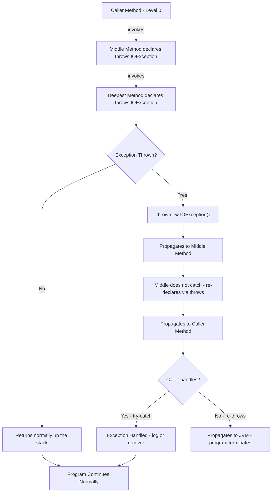
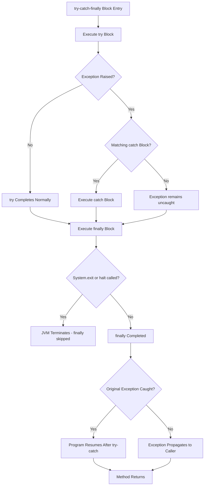
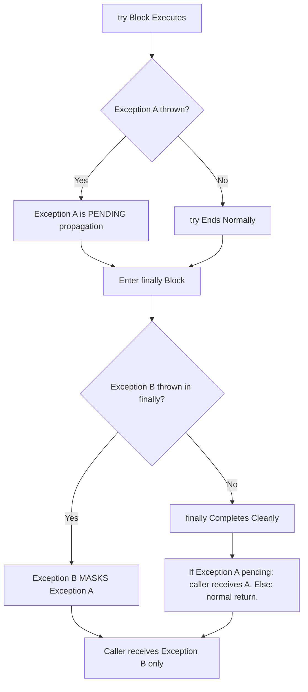
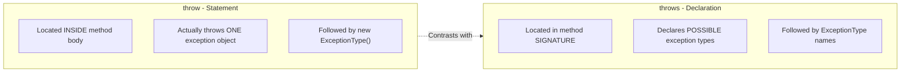

# throws and finally

<!-- SECTION_1_START -->
# Throws and Finally in Java — KTU 2024 Scheme | PBCST304

## 1.1 Core Technical Definition

### The `throws` Keyword (Declaration Mechanism)

The **`throws`** keyword in Java is a **declaration mechanism** used in a method's signature to inform the compiler (and the caller) that the method may propagate one or more checked exceptions back to its invoking context. It does **not** actually throw an exception — it merely advertises the possibility, transferring the **obligation of handling** to the calling method.

> [!IMPORTANT]
> **Formal Definition (KTU Syllabus Terminology):**
> *"The `throws` clause is a compile-time contract that establishes a propagation path for checked exceptions from a called method to its caller, enforcing robust error-handling discipline in object-oriented programs."*

The general syntactic contract is:

$$
\text{access\_modifier}\ \text{return\_type}\ \text{methodName}(\text{params})\ \textbf{throws}\ \text{ExceptionType}_1, \dots, \text{ExceptionType}_n
$$

---

### The `finally` Block (Guaranteed Execution Mechanism)

The **`finally`** block is an **optional, yet strongly recommended**, code segment that accompanies a `try` (and optionally `catch`) block. Its defining property is that the Java Virtual Machine (JVM) **guarantees its execution** under virtually all circumstances — whether the `try` block completes normally, throws a caught exception, or propagates an uncaught exception.

> [!IMPORTANT]
> **Formal Definition (KTU Syllabus Terminology):**
> *"The `finally` block is a guaranteed-execution construct in Java's exception-handling framework, primarily intended for resource cleanup, connection release, and state restoration in object-oriented systems."*

---

## 1.2 Intuitive Overview — Real-World Analogies

### Analogy 1: `throws` as a "Liability Disclaimer Notice"

Imagine you are signing a contract with a courier company. The contract has a clause:
> *"The company is **not liable** for damage caused by natural disasters (earthquakes, floods)."*

This clause does not cause a flood; it simply **declares** that *if* a flood occurs, the responsibility shifts back to you. The Java `throws` keyword behaves identically — it does not create an exception, but it **declares** that the method will *not handle* certain exceptional events, pushing that obligation to the caller.

### Analogy 2: `finally` as a "Mandatory Airport Security Checkpoint"

Regardless of whether you are:
* a domestic traveler (no exception),
* an international traveler with valid visa (caught exception),
* a traveler with invalid documents (uncaught exception)

you **must** pass through the security checkpoint before exiting. The checkpoint is your **`finally` block** — it executes no matter what path you took inside the terminal (the `try-catch` structure).

> [!NOTE]
> **Key Insight:** A `finally` block can exist even without a `catch` block, in the form `try { ... } finally { ... }`. This is permitted in Java and is extremely useful for resource management where exception handling is the caller's responsibility.

> [!TIP]
> **Syllabus Highlight:** In KTU 2024 Scheme examinations, the `finally` block is a **favorite topic** for 3-mark short questions. Always remember the three golden rules:
> 1. The `finally` block **always executes** (with only two exceptions: `System.exit()` and JVM crash).
> 2. The `finally` block can **override** a `return` statement from `try` or `catch`.
> 3. If the `finally` block itself throws an exception, that exception **masks** any previously pending exception.

<!-- SECTION_1_END -->

<!-- SECTION_2_START -->
# Deep Theoretical Analysis & KTU High-Yield Syntax Sheet

## 2.1 Operational Mechanics of `throws`

The `throws` keyword operates strictly on the **checked exception** category (subclasses of `Exception` excluding `RuntimeException`). Its responsibilities are:

* **Static Declaration** — Information is captured at *compile-time*, not runtime.
* **Propagation Routing** — Establishes a directional path for exception objects up the call stack.
* **Polymorphic Declaration** — A method can declare multiple exception types separated by commas.
* **Hierarchical Shortcut** — A method may declare a *superclass* of its actual thrown exceptions (e.g., declare `Exception` instead of `IOException`).

### Theoretical Rules Governing `throws`

1. **Rule of Optionality for Unchecked Exceptions** — Declaring `RuntimeException` subclasses via `throws` is *legal* but *redundant*, since unchecked exceptions are not compiler-enforced.
2. **Rule of Override Compatibility** — An overriding method in a subclass **cannot declare broader (more general) checked exceptions** than the parent method. It may declare *narrower* or *no* exceptions.
3. **Rule of Final/Static Flexibility** — `final` and `static` methods may use `throws` without restriction.
4. **Rule of Constructors** — Constructors can also declare `throws`, since they too can fail during object initialization.

> [!NOTE]
> **Engineering Reality Check:** The `throws` keyword is the architectural foundation for **checked exception discipline** in Java, particularly in API design (e.g., `java.io`, `java.net`, `java.sql` packages). It forces API consumers to acknowledge failure modes at compile-time — a feature absent in C++ and many other languages.

---

## 2.2 Operational Mechanics of `finally`

The `finally` block is governed by the Java Language Specification (JLS §14.20.2). Its behavior is best understood by enumerating the **scenarios** in which it executes:

| Scenario | Finally Executes? | Output Sequence (If Multiple Prints) |
| :--- | :--- | :--- |
| `try` completes normally, no exception | ✅ Yes | `try` $\rightarrow$ `finally` |
| `try` throws, matching `catch` handles it | ✅ Yes | `try` $\rightarrow$ `catch` $\rightarrow$ `finally` |
| `try` throws, **no matching** `catch` | ✅ Yes (then propagates) | `try` $\rightarrow$ `finally` $\rightarrow$ propagates |
| `try` has `return` statement | ✅ Yes | `try` $\rightarrow$ `finally` $\rightarrow$ return value delivered |
| `catch` has `return` statement | ✅ Yes | `try` $\rightarrow$ `catch` $\rightarrow$ `finally` $\rightarrow$ return value |
| `System.exit(int)` in `try`/`catch` | ❌ **No** | JVM terminates immediately |
| `Runtime.getRuntime().halt(int)` in `try` | ❌ **No** | JVM force-terminated |
| Thread killed (`Thread.stop()` — deprecated) | ❌ **No** | Thread dies mid-execution |
| Exception in `finally` block itself | ✅ Yes (partially) | `finally` throws new exception, masks original |
| `try` block has `continue`/`break` (loops) | ✅ Yes | Statement $\rightarrow$ `finally` $\rightarrow$ loop action |

> [!IMPORTANT]
> **Critical Pitfall — The Masking Effect:**
> If both the `try` block and the `finally` block throw exceptions, only the exception from `finally` is propagated. The original exception is **silently lost**. KTU examiners frequently test this nuance.

---

## 2.3 KTU High-Yield Syntax & Comparison Sheet

### Syntax Cheat Sheet

| Construct | Purpose | Placement | Mandatory Pair? |
| :--- | :--- | :--- | :--- |
| `throws` | Declares checked exception(s) | Method signature (after parameters) | Optional (only required for checked exceptions) |
| `finally` | Guarantees cleanup code execution | After `try` (and optional `catch`) | Optional, but highly recommended |
| `try` | Encloses risky code | Beginning of the block | **Mandatory** with `catch` *or* `finally` |
| `catch` | Handles specific exception | Between `try` and `finally` | Optional (can have `try-finally`) |

### `throw` vs `throws` — The Classic KTU Comparison

| Feature | `throw` | `throws` |
| :--- | :--- | :--- |
| **Category** | Statement (action) | Declaration (signature clause) |
| **Purpose** | **Actually** throws an exception object | **Declares** possibility of exception propagation |
| **Syntax Location** | Inside method body | In method signature (after parameter list) |
| **Object Count** | Throws exactly **one** exception object per execution | Can declare **multiple** exception types |
| **Checked Exception Use** | Wraps unchecked in checked via *exception chaining* | Used for checked exception declaration |
| **Followed By** | An **instance** of `Throwable` | A **class name** of `Throwable` subtypes |
| **Execution Time** | Runtime | Compile-time (declaration) |

### Real-World Engineering Utility

* **`throws` in Production Code:** Used extensively in Java APIs — e.g., `java.io.FileReader()` constructor declares `throws FileNotFoundException`, forcing every database or file-handling method to either handle the failure or propagate it deliberately.
* **`finally` in Production Code:** Used for **resource leak prevention** — closing JDBC `Connection` objects, releasing file locks, unlocking `ReentrantLock` instances, restoring thread state via `Thread.interrupted()` flag.

> [!TIP]
> **Modern Java Note:** In Java 7+, the **try-with-resources** statement (using `AutoCloseable`) is often preferred over explicit `finally` blocks. However, the KTU 2024 syllabus explicitly tests the traditional `finally` mechanism, so master it first.

<!-- SECTION_2_END -->

<!-- SECTION_3_START -->
# Step-by-Step Derivations & Code Implementations

## 3.1 Program 1 — Basic `throws` Declaration (Exhaustive Walkthrough)

Below is a complete, type-hinted Java program demonstrating `throws` propagation across two methods. We will trace the execution step-by-step.

```java
import java.io.IOException;

/**
 * Demonstrates the throws keyword across multiple methods.
 * Each method delegates exception handling responsibility to its caller.
 */
public class ThrowsPropagationDemo {

    // Level 2: Declares IOException via throws
    public static void readFileData(String fileName) throws IOException {
        System.out.println("[Level 2] Attempting to read: " + fileName);
        if (fileName == null) {
            // Actually throwing the exception
            throw new IOException("Filename cannot be null");
        }
        System.out.println("[Level 2] File read successful");
    }

    // Level 1: Calls Level 2, must either handle or re-declare
    public static void processRequest(String fileName) throws IOException {
        System.out.println("[Level 1] Processing request");
        readFileData(fileName);  // Delegates to Level 2
        System.out.println("[Level 1] Request processed");
    }

    // Level 0: Main method finally handles the exception
    public static void main(String[] args) {
        System.out.println("[Level 0] Main started");
        try {
            processRequest(null);  // Pass null to trigger exception
        } catch (IOException e) {
            System.out.println("[Level 0] Caught at main: " + e.getMessage());
        }
        System.out.println("[Level 0] Main finished gracefully");
    }
}
```

**Execution Trace (Step-by-Step):**

1. JVM invokes `main` $\rightarrow$ prints `[Level 0] Main started`.
2. `main` calls `processRequest(null)` inside a `try` block.
3. `processRequest` prints `[Level 1] Processing request`, then calls `readFileData(null)`.
4. `readFileData` prints `[Level 2] Attempting to read: null`, evaluates `if (fileName == null)` $\rightarrow$ true.
5. `readFileData` executes `throw new IOException(...)`. Control immediately exits `readFileData`.
6. The exception travels up the call stack. `processRequest` did **not** handle it, so it propagates further.
7. `main` catches the exception and prints `[Level 0] Caught at main: Filename cannot be null`.
8. Execution continues $\rightarrow$ prints `[Level 0] Main finished gracefully`.

**Expected Output:**

```
[Level 0] Main started
[Level 1] Processing request
[Level 2] Attempting to read: null
[Level 0] Caught at main: Filename cannot be null
[Level 0] Main finished gracefully
```

---

## 3.2 Program 2 — `finally` with `try-catch-finally` (Three Execution Paths)

```java
import java.util.logging.Level;
import java.util.logging.Logger;

/**
 * Demonstrates the finally block across THREE distinct execution paths.
 */
public class FinallyExecutionPaths {

    private static final Logger LOGGER = Logger.getLogger(FinallyExecutionPaths.class.getName());

    // Path 1: try completes normally
    public static void normalPath(int divisor) {
        try {
            int result = 100 / divisor;
            System.out.println("[Path 1] Division result: " + result);
        } catch (ArithmeticException e) {
            LOGGER.log(Level.WARNING, "Division error", e);
        } finally {
            System.out.println("[Path 1] finally executed — resources released");
        }
    }

    // Path 2: try throws, catch handles it
    public static void caughtExceptionPath(int divisor) {
        try {
            int result = 100 / divisor;
            System.out.println("[Path 2] This will NOT print: " + result);
        } catch (ArithmeticException e) {
            System.out.println("[Path 2] Exception caught: " + e.getMessage());
        } finally {
            System.out.println("[Path 2] finally executed — log file closed");
        }
    }

    // Path 3: try has a return statement; finally STILL runs
    public static int returnPath() {
        try {
            System.out.println("[Path 3] Inside try");
            return 42;
        } finally {
            System.out.println("[Path 3] finally ran BEFORE return value delivered");
        }
    }

    public static void main(String[] args) {
        System.out.println("--- Normal Path (divisor=5) ---");
        normalPath(5);

        System.out.println("\n--- Caught Exception Path (divisor=0) ---");
        caughtExceptionPath(0);

        System.out.println("\n--- Return Path ---");
        int value = returnPath();
        System.out.println("[Return Path] Returned value: " + value);
    }
}
```

**Expected Output:**

```
--- Normal Path (divisor=5) ---
[Path 1] Division result: 20
[Path 1] finally executed — resources released

--- Caught Exception Path (divisor=0) ---
[Path 2] Exception caught: / by zero
[Path 2] finally executed — log file closed

--- Return Path ---
[Return 3] Inside try
[Return 3] finally ran BEFORE return value delivered
[Return Path] Returned value: 42
```

**Key Observation from Path 3:**
The `finally` block executes **before** the `return 42` value is handed back to the caller. The order is:
$$
\text{try body} \rightarrow \text{finally body} \rightarrow \text{return value delivered to caller}
$$

---

## 3.3 Program 3 — `try-finally` Without `catch` (Resource Cleanup Pattern)

This is the **`try-finally` idiom** (pre-Java 7 standard for resource management).

```java
import java.io.FileReader;
import java.io.IOException;

public class TryFinallyResourcePattern {

    public static String readFirstLine(String path) throws IOException {
        FileReader fileHandle = null;
        try {
            fileHandle = new FileReader(path);
            int firstChar = fileHandle.read();
            return "First char code: " + firstChar;
        } finally {
            // CRITICAL: cleanup runs regardless of success or failure
            if (fileHandle != null) {
                try {
                    fileHandle.close();
                    System.out.println("[Cleanup] File handle closed successfully");
                } catch (IOException closeEx) {
                    System.err.println("[Cleanup] Failed to close: " + closeEx.getMessage());
                }
            }
        }
    }

    public static void main(String[] args) {
        try {
            String result = readFirstLine("data.txt");
            System.out.println("Result: " + result);
        } catch (IOException e) {
            System.err.println("Read failed: " + e.getMessage());
        }
    }
}
```

> [!NOTE]
> **Why nested `try-catch` inside `finally`?**
> The `close()` method itself can throw `IOException`. If we allowed that to propagate from the `finally` block, it would mask the original exception (if any). Wrapping it in a nested `try-catch` ensures both the cleanup attempt is logged *and* the original exception is preserved for the caller.

---

## 3.4 Program 4 — The "Return Override" Trap (Examiner's Favorite)

```java
public class FinallyReturnOverride {

    // Case A: finally does NOT contain return — original return holds
    public static int caseA() {
        try {
            return 10;
        } finally {
            System.out.println("[Case A] finally ran");
            // No return here — return value 10 is preserved
        }
    }

    // Case B: finally DOES contain return — silently overrides
    public static int caseB() {
        try {
            return 10;
        } finally {
            System.out.println("[Case B] finally ran");
            return 99;  // ⚠️ OVERRIDES the return 10!
        }
    }

    public static void main(String[] args) {
        System.out.println("Case A returns: " + caseA());
        System.out.println("Case B returns: " + caseB());
    }
}
```

**Expected Output:**

```
[Case A] finally ran
[Case B] finally ran
Case A returns: 10
Case B returns: 99
```

> [!WARNING]
> **KTU Examiner's Trap:** Never place a `return` statement inside a `finally` block. It produces **unpredictable, hard-to-debug** behavior and is flagged by static analysis tools (SonarQube, SpotBugs) as a critical code smell. This question has appeared in KTU 2023 supplementary exams.

<!-- SECTION_3_END -->

<!-- SECTION_4_START -->
# Structural Diagrams & Schematics

## 4.1 Diagram 1 — Exception Propagation via `throws`



## 4.2 Diagram 2 — `finally` Block Execution Decision Tree



## 4.3 Diagram 3 — The `finally` Masking Effect (Architectural View)



## 4.4 Diagram 4 — Comparison: `throw` vs `throws` (Topological Mapping)



<!-- SECTION_4_END -->

<!-- SECTION_5_START -->
# KTU 2024 Scheme Examination Question Bank & Topic Recap

## 5.1 Part A — Short Answer Questions (3 Marks Each)

### Question 1 (3 Marks)
**[KTU University Exam — July 2023 | CO2 | Remember]**
**Define the `throws` keyword in Java. Why is it used in method signatures?**

> **Model Answer (Valuation Key):**
>
> The `throws` keyword in Java is a **declaration mechanism** used in a method's signature to inform the compiler that the method may propagate one or more **checked exceptions** to its caller. **[1 Mark]**
>
> It is used because Java enforces **compile-time exception checking** for checked exception categories. By using `throws`, the method formally transfers the **responsibility of exception handling** to the calling method, which must then either catch the exception using a `try-catch` block or further propagate it via its own `throws` clause. **[2 Marks]**
>
> Example: `public void readFile() throws IOException { ... }`
>
> **[Closing remark for full marks]:** The `throws` keyword does not actually throw an exception — it only declares the possibility, thereby enabling structured error propagation in large-scale object-oriented applications.

---

### Question 2 (3 Marks)
**[KTU University Exam — Dec 2022 | CO2 | Understand]**
**Explain the purpose of the `finally` block in Java. Does the `finally` block always execute? Justify your answer.**

> **Model Answer (Valuation Key):**
>
> The `finally` block in Java is a code segment that is **guaranteed to execute** after the associated `try` (and optional `catch`) block, regardless of whether an exception was thrown, caught, or not thrown at all. **[1 Mark]**
>
> Its primary purpose is **resource cleanup** — closing file handles, releasing database connections, unlocking thread synchronization primitives, and restoring system state. **[1 Mark]**
>
> The `finally` block executes in **almost all** scenarios:
> * Normal `try` completion ✅
> * Exception caught by `catch` ✅
> * Uncaught exception propagation ✅
> * `return` statement in `try` or `catch` ✅
>
> However, it does **NOT** execute in two cases: when `System.exit(int)` is invoked (which terminates the JVM) or when the JVM itself crashes. **[1 Mark]**

---

## 5.2 Part B — Long Answer Questions with Internal Choice (14 Marks Each)

### Question A (14 Marks) — Choice Option 1

**[KTU University Exam — Model Paper 2024 | CO2, CO3 | Understand / Apply]**

**(a)** Explain the `throws` keyword in Java with a suitable example. Discuss how it differs from the `throw` keyword. **(7 Marks)**

**Model Solution:**

**Definition of `throws`:** The `throws` keyword is a declaration used in a method's signature to indicate that the method may propagate one or more checked exceptions to its caller. It establishes a **compile-time contract** for error handling. **[2 Marks]**

**Example Program:**

```java
import java.io.FileReader;
import java.io.IOException;

public class ThrowsExample {
    // Declares that readFile may throw IOException
    public static void readFile(String path) throws IOException {
        FileReader fr = new FileReader(path);
        fr.read();
        fr.close();
    }

    public static void main(String[] args) {
        try {
            readFile("input.txt");
        } catch (IOException e) {
            System.out.println("File error: " + e.getMessage());
        }
    }
}
```

**[2 Marks for complete working code with appropriate catch handling]**

**Difference between `throw` and `throws`:** **[3 Marks]**

| Feature | `throw` | `throws` |
| :--- | :--- | :--- |
| Category | Statement | Declaration clause |
| Purpose | Actually throws an exception | Declares possible exceptions |
| Location | Inside method body | In method signature |
| Followed by | An exception object (instance) | One or more exception class names |
| Number | Throws one object at a time | Can declare multiple types |

---

**(b)** Write a Java program demonstrating various scenarios where the `finally` block is executed. Include cases where the `try` block returns normally, throws a caught exception, and contains a `return` statement. **(7 Marks)**

**Model Solution:**

```java
public class FinallyScenarios {
    // Scenario 1: Normal execution
    public static void scenarioNormal() {
        try {
            System.out.println("Scenario 1: try block executed normally");
        } catch (Exception e) {
            System.out.println("Scenario 1: catch block");
        } finally {
            System.out.println("Scenario 1: finally executed");
        }
    }

    // Scenario 2: Exception caught
    public static void scenarioCaught() {
        try {
            int result = 10 / 0;  // ArithmeticException
        } catch (ArithmeticException e) {
            System.out.println("Scenario 2: caught " + e.getMessage());
        } finally {
            System.out.println("Scenario 2: finally executed");
        }
    }

    // Scenario 3: try has a return statement
    public static int scenarioReturn() {
        try {
            System.out.println("Scenario 3: inside try");
            return 100;
        } finally {
            System.out.println("Scenario 3: finally ran BEFORE return");
        }
    }

    public static void main(String[] args) {
        scenarioNormal();
        System.out.println("---");
        scenarioCaught();
        System.out.println("---");
        int val = scenarioReturn();
        System.out.println("Returned: " + val);
    }
}
```

**Valuation Key Breakdown:**
* [Correct class structure and method signatures: **1 Mark**]
* [Scenario 1 (normal path) implemented correctly: **1 Mark**]
* [Scenario 2 (caught exception) with proper catch block: **2 Marks**]
* [Scenario 3 (return statement) demonstrating finally runs before return: **2 Marks**]
* [Final output trace explained correctly: **1 Mark**]

**Expected Output:**
```
Scenario 1: try block executed normally
Scenario 1: finally executed
---
Scenario 2: caught / by zero
Scenario 2: finally executed
---
Scenario 3: inside try
Scenario 3: finally ran BEFORE return
Returned: 100
```

---

### Question B (14 Marks) — Choice Option 2

**[KTU University Exam — Model Paper 2024 | CO2, CO3 | Apply / Analyze]**

**(a)** Explain the concept of **exception propagation** in Java. How does the `throws` clause help in propagating checked exceptions across multiple method-call levels? Provide a code example demonstrating three-level exception propagation. **(7 Marks)**

**Model Solution:**

**Concept of Exception Propagation:**
Exception propagation is the mechanism by which an uncaught exception **travels up the call stack** from the method where it was thrown, through each calling method in the reverse invocation order, until it is either caught by a `try-catch` block or reaches the JVM (which then terminates the program). **[2 Marks]**

**Role of `throws`:**
The `throws` clause facilitates this propagation by allowing intermediate methods to **declaratively pass** the exception obligation to the next caller in the chain. This is essential for **checked exceptions** because the Java compiler will refuse to compile any method that calls a `throws`-declared method without either handling or re-declaring the exception. **[2 Marks]**

**Three-Level Propagation Code Example:** **[3 Marks]**

```java
import java.io.IOException;

public class MultiLevelPropagation {

    // Level 3: Throws the exception
    static void levelThree() throws IOException {
        throw new IOException("Exception originated at Level 3");
    }

    // Level 2: Receives and propagates upward
    static void levelTwo() throws IOException {
        System.out.println("Level 2: calling levelThree");
        levelThree();
        // Compiler error avoided only because of throws declaration
    }

    // Level 1: Finally catches
    static void levelOne() {
        try {
            levelTwo();
        } catch (IOException e) {
            System.out.println("Level 1 caught: " + e.getMessage());
        }
    }

    public static void main(String[] args) {
        levelOne();
    }
}
```

**Output:**
```
Level 2: calling levelThree
Level 1 caught: Exception originated at Level 3
```

---

**(b)** Discuss the **rules and special scenarios** governing the execution of the `finally` block in Java. Specifically address:
  (i) What happens when a `return` statement is present in the `try` block?
  (ii) What happens when `System.exit(0)` is called inside `try`?
  (iii) What happens if the `finally` block itself throws an exception? **(7 Marks)**

**Model Solution:**

**(i) Return statement in `try` block:** When a `return` statement is encountered inside the `try` block, the JVM does not immediately return the value to the caller. Instead, it first **executes the `finally` block** before actually returning the value. **[2 Marks]**
However, the return value of the `try` block is **preserved** unless the `finally` block contains its own `return` statement, in which case the `finally` return value **overrides** the original.

**(ii) `System.exit(0)` in `try`:** When `System.exit(int)` is invoked, it triggers an **immediate JVM shutdown sequence**. The `finally` block is **skipped** entirely, and any pending return values or exception propagations are abandoned. This is one of the only two scenarios where `finally` does not execute. **[2 Marks]**

**(iii) Exception in `finally` block:** If the `finally` block itself throws an exception, that exception **masks** any pending exception from the `try` or `catch` block. The original exception is lost, and only the `finally` exception propagates to the caller. **[2 Marks]**

**Demonstration Code:** **[1 Mark]**

```java
public class FinallyMasking {
    public static void main(String[] args) {
        try {
            throw new RuntimeException("Original Exception");
        } finally {
            throw new IllegalStateException("Finally Exception - masks original");
        }
    }
}
```

**Output (caller receives only the finally exception):**
```
Exception in thread "main" java.lang.IllegalStateException: Finally Exception
```

---

> [!WARNING]
> **KTU Examiner's Valuation Pitfall — Where Students Lose Marks:**
> 1. **Confusing `throw` with `throws`** — A common 1-mark deduction. Always state that `throw` *throws an instance* and `throws` *declares a type*.
> 2. **Forgetting that `finally` does NOT execute after `System.exit()`** — Many students write "finally always executes" without exception, which is technically incorrect.
> 3. **Not showing the output of the program** — KTU valuation explicitly requires **output traces** for code-based questions. Skipping the output = 1–2 marks lost.
> 4. **Placing `return` inside `finally`** — This is a code smell. Examiners will deduct marks if you write a `finally` block with `return` in board exams unless specifically asked to demonstrate the override.
> 5. **Missing the `try-finally` pattern** — Some students only show `try-catch-finally` and miss the equally-important `try-finally` idiom for resource management.

---

## 5.3 Topic Recap & Important Things to Remember

> [!TIP]
> **Rapid Revision Checklist — Master These Before the Exam:**

* **`throws` is a declaration, `throw` is an action.** Remember the mnemonic: *"throws tells, throw does."*
* **`throws` appears in the method signature**; **`throw` appears inside the method body.**
* **`throws` is followed by exception class names**; **`throw` is followed by an exception object** (`new SomeException()`).
* **The `finally` block is NOT mandatory** — a `try` block can exist with only `finally` (no `catch`).
* **`finally` executes in ALL cases EXCEPT**:
  * `System.exit()` is invoked
  * JVM crashes or is forcibly halted
  * The thread executing the `try` block is killed (deprecated `Thread.stop()`)
* **Return in `try` does NOT bypass `finally`** — `finally` runs *first*, then the return value is delivered.
* **Return in `finally` overrides return in `try`** — Avoid this pattern entirely in production code.
* **Exception in `finally` masks** any pending exception from `try` or `catch`.
* **The `finally` block is the standard place** for closing `FileReader`, `Connection`, `Socket`, and other `AutoCloseable` resources (in pre-Java 7 code).
* **Checked exceptions** (`IOException`, `SQLException`, `ClassNotFoundException`) **require either handling or `throws` declaration.** Unchecked exceptions (`RuntimeException` and subclasses) do not.
* **An overriding method CANNOT declare broader checked exceptions** than its parent method — this is a key OOP polymorphism rule tied to `throws`.
* **Constructors can use `throws`** because object initialization can fail (e.g., opening a file inside a constructor).
* **Common KTU question pattern:** "Differentiate between `throw` and `throws`" — expect a 7-mark question with code + table.
* **Common KTU question pattern:** "What happens when `finally` block contains `return`?" — answer: it overrides the `try` return value.
* **Mnemonic for the two `finally` exceptions:** *"System.exit and Severe Crash"* — **S**hutdown, **S**ystem halt.

<!-- SECTION_5_END -->
