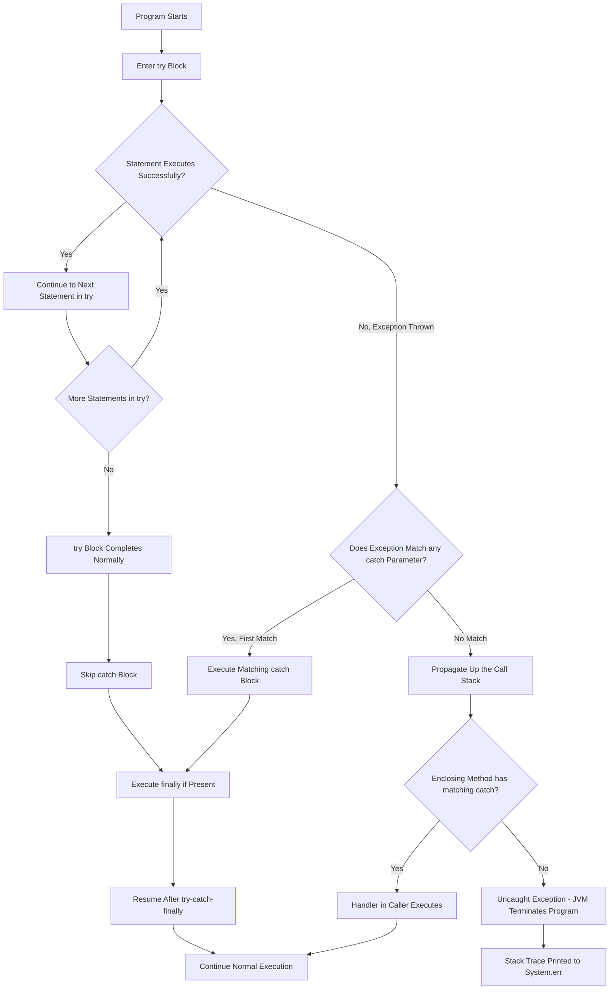
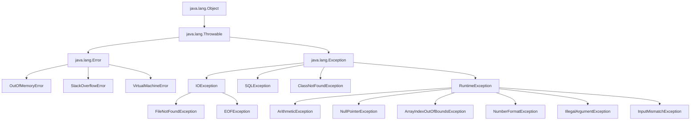
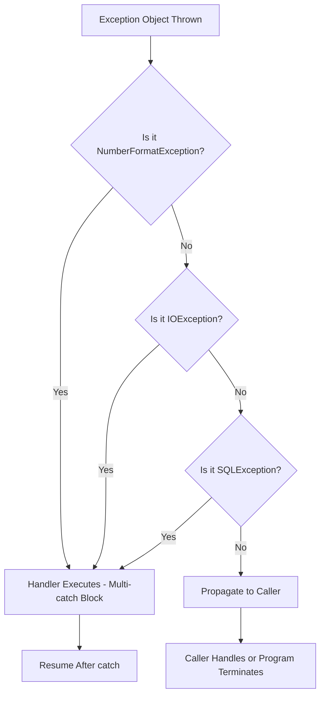
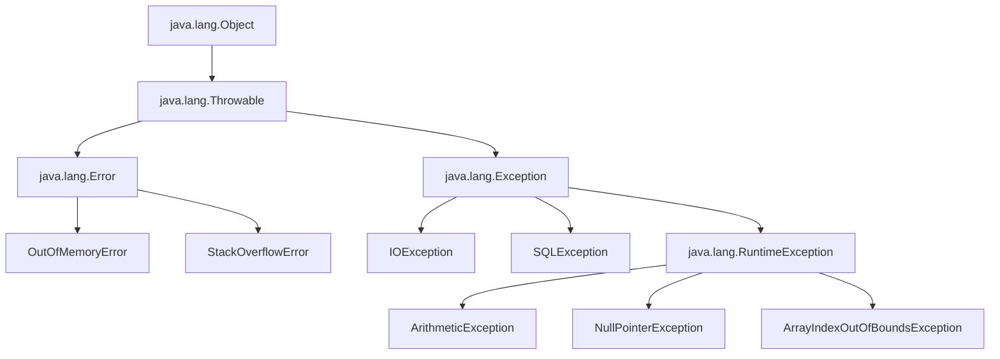

# try Block and catch Clause

<!-- SECTION_1_START -->
# try Block and catch Clause

## 1. Core Technical Definition & Intuitive Overview

**Formal Definition (KTU 2024 Syllabus Terminology):**
In Java's exception handling framework, a `try` block is a guarded region of code that encloses statements which might throw an exception during program execution. A `catch` clause (also called a *handler* or *exception handler*) is a block of code that immediately follows one or more `try` blocks and is designed to intercept and process a specific type of exception (or a hierarchy of exceptions derived from `java.lang.Throwable`) thrown from within the corresponding `try` region. The pairing of `try` and `catch` forms the foundational *try-catch* mechanism, a structured alternative to the legacy error-handling technique of using return codes or global error flags.

> [!IMPORTANT]
> **KTU Board Highlight:** The `try` block *cannot exist independently* in Java. It must be followed by either a `catch` block, a `finally` block, or both. This is a frequently tested conceptual point in KTU Part A questions (3 marks).

**Conceptual Analogy / Intuition:**
Think of the `try` block as a **"safety net stretched under a tightrope walker."** The tightrope walker (your code) attempts a risky walk (executes statements that may fail — e.g., dividing by zero, opening a missing file, or accessing an out-of-bounds array element). The safety net (`catch` block) does not *prevent* the fall, but it **catches** the performer gracefully, deciding what to do next — log the incident, display a friendly message, retry, or terminate safely. Without the net, the performer would crash to the ground (program terminates abruptly with a stack trace dumped to the console).

> [!NOTE]
> **Key Terminology Required for KTU Viva/Exams:**
> - **Exception:** An abnormal event disrupting normal flow (object of `Throwable` subclass).
> - **Throwing:** The act of signalling an exception using `throw` keyword.
> - **Catching:** Intercepting the thrown exception via the `catch` parameter.
> - **Unchecked Exception:** A `RuntimeException` subclass — not checked at compile time.
> - **Checked Exception:** A non-`RuntimeException` `Exception` subclass — compiler-enforced handling.

**Physical Constants / Standard Metrics in Java Exception Handling:**

- The root class is **`java.lang.Throwable`**, the superclass of all errors and exceptions.
- The two principal subclasses of `Throwable` are **`java.lang.Exception`** (recoverable) and **`java.lang.Error`** (typically unrecoverable, e.g., `OutOfMemoryError`).
- The three primary `catch` keyword forms: **single `catch`**, **multi-`catch` (Java 7+)**, and **try-with-resources (Java 7+)**.
- The *first matching* `catch` block executes; subsequent ones are skipped — analogous to a `switch-case` fall-through behavior in reverse.

> [!VISUALIZATION CONTROL]
> **Concept:** Conceptual flow of exception propagation from `try` to `catch`.
> **GeoGebra / Desmos Input Equations:** Not applicable (flowchart concept — see Mermaid diagram in Section 4).
> **Visual Description:** Imagine a horizontal line representing normal program flow. At a specific point, an arrow diverts downward (exception thrown) and re-enters the main flow at a parallel horizontal line below (catch handler resumes). The original line terminates abruptly at the throw point.

---

## 2. Deep Theoretical Analysis & KTU High-Yield Formula Sheet

### 2.1 Operational Mechanics — The Why and How

The execution engine of the JVM (Java Virtual Machine) follows a deterministic sequence when a `try-catch` construct is encountered:

- **Step 1 — Entry & Stack Frame Setup:** When the JVM begins executing statements inside a `try` block, it does *not* create a separate stack frame; instead, it establishes an *exception monitor* on the current frame. This monitor is associated with all `catch` clauses listed immediately after the `try`.
- **Step 2 — Sequential Execution:** Statements inside the `try` block are executed top-to-bottom in linear order. The JVM maintains a hidden **program counter** that advances through bytecode instructions.
- **Step 3 — Exception Detection & Throw:** If any statement (either directly, or via a method call deeper in the call stack) invokes `throw new SomeException(...)`, the JVM performs an *unwinding* operation:
  - The current stack frame is examined.
  - If the frame is inside a `try` block with a matching `catch`, control transfers to that handler.
  - If not, the frame is popped, and the parent frame is checked recursively.
- **Step 4 — Catch Matching (Polymorphic Dispatch):** The JVM compares the runtime type of the thrown exception against the parameter type of each `catch` clause in order. The **first** `catch` whose parameter is the same type *or a supertype* of the thrown exception is selected. **More specific (subclass) catches must appear before more general (superclass) catches**, or a compile-time error `unreachable catch` is generated.
- **Step 5 — Handler Execution & Resumption:** The matched `catch` block executes, and after it completes, program control resumes at the line *immediately after* the entire `try-catch` construct — never re-entering the `try` block.

### 2.2 Why and How — Pedagogical Breakdown

- **Why use try-catch?** To *separate error-handling logic from business logic*, improving readability, maintainability, and robustness. It enforces the principle that a method's signature declares *what* can go wrong (`throws` clause), and the caller decides *what to do* about it (`catch` block).
- **How does the JVM know which catch to invoke?** Through dynamic type checking. The thrown object retains its actual runtime class, and the `instanceof` test (implicitly performed by the JVM) determines the match.
- **How does flow resume after a catch?** Once the `catch` block's closing brace `}` is reached, the JVM discards the exception object reference (eligible for garbage collection) and continues with the next statement after the construct.

### 2.3 KTU Formula Sheet / Cheat Sheet

> [!IMPORTANT]
> Below is the high-density reference table for all critical syntax and semantics tested in KTU 2024 Scheme exams.

| Construct / Concept | Syntax Form | Semantics & Rules | KTU Exam Frequency |
|---|---|---|---|
| Basic try-catch | `try { ... } catch (E e) { ... }` | `E` must be `Throwable` or subclass; first match wins | **Very High** |
| Multiple catch | `try { ... } catch (E1 e1) { ... } catch (E2 e2) { ... }` | Order matters — specific to general; otherwise `unreachable catch` | **Very High** |
| Multi-catch (Java 7+) | `catch (E1 \| E2 \| E3 e) { ... }` | Catches any of the listed types; the parameter `e` is effectively `final` | **High** |
| Nested try | `try { try { ... } catch (...) { ... } } catch (...) { ... }` | Inner handler checked first | Medium |
| Exception variable methods | `e.getMessage()`, `e.printStackTrace()`, `e.toString()` | Standard inspection utilities | **High** |
| Throwable hierarchy | `Object → Throwable → Exception → RuntimeException` | All unchecked inherit from `RuntimeException` | **Very High** |
| try-catch-finally | `try { ... } catch (E e) { ... } finally { ... }` | `finally` always runs (except `System.exit()`) | **Very High** |
| `throw` vs `throws` | `throw new E();` / `void m() throws E {}` | `throw` is a statement; `throws` is a method signature modifier | **Very High** |
| Re-throwing | `catch (E e) { throw e; }` or `throw new F(e);` | Used for exception chaining/translation | Medium |
| Empty catch (anti-pattern) | `catch (Exception e) { }` | Silently swallows exception — bad practice | Low (but tested) |

**Critical Rule — No Pipe Symbol Conflicts:**
In Java multi-catch syntax, the vertical bar `|` separating exception types is **part of the language syntax** and must never be confused with markdown table pipe delimiters. Inside a code block, write `catch (IOException | SQLException e)`. Inside prose tables, always escape as `catch (IOException $\vert$ SQLException e)`.

### 2.4 Real-World Engineering Utility

In production-grade software engineering, the `try-catch` mechanism underpins:

- **Database Operations (JDBC):** Wrapping `executeQuery()` calls to handle `SQLException` (checked) — gracefully rolling back transactions and logging failures.
- **Network Programming (Sockets/HTTP):** Catching `IOException` and `SocketTimeoutException` to implement retry logic with exponential backoff.
- **File I/O Systems:** Managing `FileNotFoundException` and `EOFException` in parsers and serializers.
- **Spring/Enterprise Frameworks:** AOP-based exception translation layers convert low-level exceptions (e.g., `SQLException`) into application-level exceptions (`DataAccessException`).
- **Android Mobile Development:** All UI-thread and network operations must be wrapped in `try-catch` to prevent `ANR` (Application Not Responding) crashes.

---

## 3. Step-by-Step Derivations & Code/Symbolic Implementation

### 3.1 Demonstrative Derivation: Tracing a Division-by-Zero Scenario

Let us mathematically and programmatically derive the behavior of the JVM when division by zero occurs.

**Mathematical Setup:**

Let $a$ and $b$ be two integers such that the operation $a \div b$ is attempted.

$$ \text{result} = \begin{cases} a \div b & \text{if } b \neq 0 \\ \text{UNDEFINED} \rightarrow \text{ArithmeticException thrown} & \text{if } b = 0 \end{cases} $$

**Execution Trace Derivation:**

\begin{aligned}
\text{Step 1:} \quad & \text{JVM encounters } \texttt{try \{ int r = 10 / 0; \}} \\
\text{Step 2:} \quad & \text{JVM evaluates right-hand side: } 10 \div 0 \\
\text{Step 3:} \quad & \text{JVM detects division by zero in integer arithmetic} \\
\text{Step 4:} \quad & \text{JVM instantiates } \texttt{new ArithmeticException("/ by zero")} \\
\text{Step 5:} \quad & \text{JVM searches current stack frame for matching } \texttt{catch (ArithmeticException e)} \\
\text{Step 6:} \quad & \text{Match found — control jumps to handler} \\
\text{Step 7:} \quad & \texttt{catch} \text{ block executes — } e.\text{getMessage()} \text{ returns } \texttt{"/ by zero"} \\
\text{Step 8:} \quad & \text{Control resumes after the try-catch construct}
\end{aligned}

### 3.2 Fully Operational Java Implementation — Multi-Scenario Program

```java
import java.util.InputMismatchException;
import java.util.Scanner;

/**
 * Comprehensive demonstration of try Block and catch Clause mechanisms.
 * Compile: javac TryCatchDemo.java
 * Run:     java TryCatchDemo
 */
public class TryCatchDemo {

    /**
     * Demonstrates single catch block for ArithmeticException.
     */
    public static double safeDivide(int numerator, int denominator) {
        try {
            int quotient = numerator / denominator;
            return quotient;
        } catch (ArithmeticException e) {
            System.err.println("[LOG] ArithmeticException caught: " + e.getMessage());
            return Double.NaN; // Sentinel value for "Not a Number"
        }
    }

    /**
     * Demonstrates multiple catch blocks ordered from specific to general.
     * Order: ArrayIndexOutOfBoundsException -> ArithmeticException -> Exception
     */
    public static void demonstrateMultipleCatch(int[] data, int index, int divisor) {
        try {
            int element = data[index];                      // May throw ArrayIndexOutOfBoundsException
            int result = element / divisor;                // May throw ArithmeticException
            System.out.println("Result: " + result);
        } catch (ArrayIndexOutOfBoundsException e) {
            System.err.println("[HANDLER 1] Invalid index: " + e.getMessage());
        } catch (ArithmeticException e) {
            System.err.println("[HANDLER 2] Division error: " + e.getMessage());
        } catch (Exception e) {
            System.err.println("[HANDLER 3] Generic fallback: " + e.toString());
        } finally {
            System.out.println("[FINALLY] Cleanup actions executed (e.g., closing resources).");
        }
    }

    /**
     * Demonstrates multi-catch syntax (Java 7+).
     * Single handler for multiple unrelated exception types.
     */
    public static void demonstrateMultiCatch(String numericString, String filePath) {
        try {
            int parsedValue = Integer.parseInt(numericString);
            java.io.FileReader reader = new java.io.FileReader(filePath);
            reader.close();
            System.out.println("Parsed value: " + parsedValue);
        } catch (NumberFormatException | java.io.IOException e) {
            // The parameter 'e' is implicitly final — cannot be reassigned.
            System.err.println("[MULTI-CATCH] " + e.getClass().getSimpleName() + ": " + e.getMessage());
        }
    }

    /**
     * Demonstrates nested try-catch constructs.
     */
    public static void demonstrateNestedTry(int[] values) {
        try {
            // Outer try: guards against array access errors
            for (int i = 0; i <= values.length; i++) {
                try {
                    // Inner try: guards against division errors
                    System.out.println("values[" + i + "] / 2 = " + (values[i] / 2));
                } catch (ArithmeticException e) {
                    System.err.println("[INNER] Caught: " + e.getMessage());
                }
            }
        } catch (ArrayIndexOutOfBoundsException e) {
            System.err.println("[OUTER] Index out of bounds: " + e.getMessage());
        }
    }

    /**
     * Main method — entry point with rigorous input validation.
     */
    public static void main(String[] args) {
        Scanner scanner = new Scanner(System.in);

        // Scenario 1: Safe division
        System.out.println("--- Scenario 1: Safe Division ---");
        double outcome1 = safeDivide(100, 0);
        System.out.println("Outcome 1: " + outcome1 + "\n");

        // Scenario 2: Multiple catch
        System.out.println("--- Scenario 2: Multiple Catch ---");
        int[] sampleArray = {10, 20, 30};
        demonstrateMultipleCatch(sampleArray, 5, 0); // Triggers both index and division errors
        System.out.println();

        // Scenario 3: Multi-catch
        System.out.println("--- Scenario 3: Multi-Catch ---");
        demonstrateMultiCatch("not_a_number", "nonexistent.txt");
        System.out.println();

        // Scenario 4: Nested try
        System.out.println("--- Scenario 4: Nested Try ---");
        demonstrateNestedTry(new int[]{100, 200, 0, 400});
        System.out.println();

        // Scenario 5: User input with try-catch
        System.out.println("--- Scenario 5: Interactive Input ---");
        try {
            System.out.print("Enter your age: ");
            int age = scanner.nextInt();
            if (age < 0) {
                throw new IllegalArgumentException("Age cannot be negative.");
            }
            System.out.println("You entered: " + age);
        } catch (InputMismatchException e) {
            System.err.println("[INPUT ERROR] Please enter a valid integer.");
        } catch (IllegalArgumentException e) {
            System.err.println("[VALIDATION ERROR] " + e.getMessage());
        } catch (Exception e) {
            System.err.println("[UNEXPECTED] " + e.toString());
        } finally {
            scanner.close();
            System.out.println("[FINALLY] Scanner resource released.");
        }
    }
}
```

### 3.3 Step-by-Step Trace of the Above Program (Execution Walkthrough)

For the call `safeDivide(100, 0)`:

\begin{aligned}
\text{Line 1:} \quad & \texttt{try \{ int quotient = 100 / 0; \}} \\
\text{Line 2:} \quad & \text{Right-hand side evaluation: } 100 \div 0 \text{ triggers JVM exception factory} \\
\text{Line 3:} \quad & \texttt{ArithmeticException} \text{ object created with message } \texttt{"/ by zero"} \\
\text{Line 4:} \quad & \text{JVM inspects current frame — is there a try-catch?} \rightarrow \text{YES} \\
\text{Line 5:} \quad & \text{Does } \texttt{ArithmeticException} \text{ match } \texttt{catch (ArithmeticException e)}? \rightarrow \text{YES} \\
\text{Line 6:} \quad & \text{Reference } \texttt{e} \text{ now points to the thrown object} \\
\text{Line 7:} \quad & \texttt{e.getMessage()} \text{ returns } \texttt{"/ by zero"} \\
\text{Line 8:} \quad & \texttt{return Double.NaN;} \text{ executed} \\
\text{Line 9:} \quad & \text{Control returns to caller — method completes normally from caller's perspective}
\end{aligned}

### 3.4 Compilation and Execution Commands

```bash
# Step 1: Save the file as TryCatchDemo.java
# Step 2: Compile to bytecode
javac TryCatchDemo.java

# Step 3: Execute on the JVM
java TryCatchDemo

# Expected output includes messages prefixed with [LOG], [HANDLER X], [FINALLY], etc.
```

---

## 4. Structural Diagrams & Schematics

### 4.1 Exception Flow Mermaid Diagram



### 4.2 Exception Class Hierarchy Diagram



### 4.3 Multi-Catch Execution Order Diagram



### 4.4 try-catch-finally State Transition Matrix

| Current State | Event | Next State | Notes |
|---|---|---|---|
| Inside `try` | Statement succeeds | Continue in `try` | Linear execution |
| Inside `try` | Exception thrown, type matches `catch` | Enter `catch` | First-match dispatch |
| Inside `try` | Exception thrown, no match | Propagate upward | Stack unwinding begins |
| Inside `catch` | Exception thrown in handler | Propagate (or handled by outer try) | Nested structure resolves |
| Inside `finally` | Exception thrown | Replaces original exception (unless suppressed) | Java 7+ try-with-resources suppresses |
| After `catch`/`finally` | Construct complete | Resume after construct | Normal flow continues |
| Anywhere | `System.exit(0)` called | JVM terminates immediately | `finally` does NOT run |
| Anywhere | `Thread.interrupt()` | InterruptedException may propagate | Concurrent behavior |

---

## 5. KTU 2024 Scheme Examination Question Bank & Topic Recap

### 5.1 Part A Questions (3 Marks Each)

#### Question A1

`[KTU University Exam - July 2024]`

**What is the purpose of the `try` block in Java? Can a `try` block exist without a `catch` block? Justify your answer.**

**Model Answer (3 Marks):**

- **[1 Mark]** A `try` block in Java is a construct used to enclose a section of code that might generate exceptions during runtime. It acts as a *guarded region* monitored by the JVM for any abnormal conditions.
- **[1 Mark]** The purpose of the `try` block is to demarcate code that requires exception handling, thereby separating normal application logic from error-handling logic and improving code readability and robustness.
- **[1 Mark]** A `try` block **cannot exist without either a `catch` block or a `finally` block** in Java. The Java compiler enforces this rule and will generate a compile-time error: *"try without catch or finally"*. However, a `try` block can exist with only a `finally` block (no `catch`), or with both, or with multiple `catch` blocks.

---

#### Question A2

`[KTU University Exam - Dec 2023]`

**Differentiate between checked and unchecked exceptions in Java. Give one example of each.**

**Model Answer (3 Marks):**

- **[1 Mark]** **Checked Exceptions:** These are exceptions that are checked at *compile time* by the Java compiler. The compiler enforces that such exceptions are either caught using a `try-catch` block or declared in the method signature using the `throws` keyword. **Example:** `IOException`, `SQLException`, `ClassNotFoundException`.
- **[1 Mark]** **Unchecked Exceptions:** These are exceptions that are *not checked at compile time*. They occur at runtime and are subclasses of `java.lang.RuntimeException`. The compiler does not mandate their handling. **Example:** `ArithmeticException`, `NullPointerException`, `ArrayIndexOutOfBoundsException`.
- **[1 Mark]** **Key Technical Distinction:** Checked exceptions inherit directly from `java.lang.Exception` (but not from `RuntimeException`). Unchecked exceptions inherit from `java.lang.RuntimeException`, which itself extends `java.lang.Exception`. Errors (e.g., `OutOfMemoryError`) form a separate hierarchy under `java.lang.Error` and are typically not handled.

---

### 5.2 Part B Questions (14 Marks Each)

#### Question B1 — Option A (14 Marks)

`[KTU University Exam - Dec 2023, Model Question Paper]`

**a)** Explain the `try` block and `catch` clause in Java with suitable examples. Describe the rules that must be followed while writing multiple `catch` blocks. **[7 Marks]**

**b)** Write a Java program that reads two integers from the user and performs division. Use a `try-catch` block to handle `ArithmeticException` (division by zero) and `InputMismatchException` (invalid input). The program should continue prompting until valid input is received. **[7 Marks]**

---

**Model Solution for Part a:**

**[1 Mark]** **Definition of try block:** A `try` block is a compound statement in Java that encloses code which may potentially throw an exception. The syntax is `try { // statements }`.

**[1 Mark]** **Definition of catch clause:** A `catch` clause is an exception handler that immediately follows a `try` block. Its syntax is `catch (ExceptionType parameterName) { // handler code }`. The parameter must be a class that is a subclass of `java.lang.Throwable`.

**[1 Mark]** **Working mechanism:** When an exception occurs inside a `try` block, the JVM creates an exception object and searches for a `catch` block whose parameter type matches the thrown exception's type (or a supertype). The first matching `catch` executes. After the `catch` block completes, execution resumes at the statement immediately following the `try-catch` construct.

**[1 Mark]** **Code Example:**

```java
try {
    int result = numerator / denominator;
    System.out.println("Result: " + result);
} catch (ArithmeticException e) {
    System.out.println("Cannot divide by zero: " + e.getMessage());
}
```

**[3 Marks]** **Rules for Multiple Catch Blocks (enumerate):**

1. **Order Rule — Specific to General:** Subclass exceptions must be caught *before* their superclass exceptions. Placing a superclass catch before a subclass catch results in a compile-time error: *"exception java.lang.ArithmeticException has already been caught"*.
2. **No Duplicate Types:** The same exception type cannot appear in two `catch` blocks of the same `try` statement.
3. **Independent Scope:** Each `catch` block has its own scope, and the exception parameter is local to that block.
4. **First-Match Wins:** Only the first matching `catch` block executes; subsequent matches are ignored.
5. **Multi-catch Alternative:** Java 7+ allows combining unrelated exception types in a single `catch` using the pipe `|` operator: `catch (IOException | SQLException e)`.
6. **Parameter Immutability in Multi-catch:** In a multi-catch block, the exception parameter is implicitly `final` and cannot be reassigned.

---

**Model Solution for Part b:**

**[1 Mark]** Class declaration and `main` method signature.

**[1 Mark]** Creating a `Scanner` object for input.

**[1 Mark]** Outer `while` loop for repeated prompting.

**[2 Marks]** `try` block containing `scanner.nextInt()` and division operation.

**[1 Mark]** `catch (ArithmeticException e)` handler for division by zero.

**[1 Mark]** `catch (InputMismatchException e)` handler for non-integer input, including consuming the invalid token via `scanner.next()` to prevent infinite loop.

```java
import java.util.InputMismatchException;
import java.util.Scanner;

public class RobustDivider {
    public static void main(String[] args) {
        Scanner scanner = new Scanner(System.in);
        boolean success = false;
        int numerator = 0, denominator = 0;

        while (!success) {
            try {
                System.out.print("Enter numerator: ");
                numerator = scanner.nextInt();
                System.out.print("Enter denominator: ");
                denominator = scanner.nextInt();
                int result = numerator / denominator;
                System.out.println("Result: " + result);
                success = true;
            } catch (ArithmeticException e) {
                System.err.println("Error: Division by zero is not allowed. Try again.");
            } catch (InputMismatchException e) {
                System.err.println("Error: Please enter valid integers only.");
                scanner.next(); // Consume invalid token to clear buffer
            }
        }
        scanner.close();
    }
}
```

---

#### Question B1 — Option B (14 Marks)

`[KTU University Exam - July 2024]`

**a)** What is exception handling? Explain the different types of exceptions in Java with a neat hierarchy diagram. **[7 Marks]**

**b)** Write a Java program that demonstrates the use of a `try` block with **multiple `catch` clauses** and a **`finally` block**. The program should attempt to open a file, read its contents, and handle `FileNotFoundException` and `IOException` separately. **[7 Marks]**

---

**Model Solution for Part a:**

**[2 Marks]** **Definition of Exception Handling:** Exception handling is a powerful mechanism in Java to handle runtime errors gracefully, thereby maintaining the normal flow of program execution. It uses five keywords: `try`, `catch`, `finally`, `throw`, and `throws`. The core advantage is separation of error-handling code from regular business logic.

**[3 Marks]** **Types of Exceptions:**

1. **Checked Exceptions — [1 Mark]** Checked at compile time; the compiler forces the programmer to handle or declare them. Examples: `IOException`, `SQLException`, `ClassNotFoundException`, `InterruptedException`.
2. **Unchecked Exceptions — [1 Mark]** Occur at runtime; subclasses of `RuntimeException`. Not enforced by the compiler. Examples: `ArithmeticException`, `NullPointerException`, `ArrayIndexOutOfBoundsException`, `NumberFormatException`.
3. **Errors — [1 Mark]** Irrecoverable conditions external to the application; not meant to be caught. Examples: `OutOfMemoryError`, `StackOverflowError`, `VirtualMachineError`.

**[2 Marks]** **Hierarchy Diagram (Mermaid):**



---

**Model Solution for Part b:**

**[1 Mark]** Import statements for `java.io.*` and `java.util.*`.

**[1 Mark]** `main` method declaration and a sample non-existent filename.

**[1 Mark]** `try` block with `FileReader` instantiation and `read()` operation.

**[1 Mark]** First `catch (FileNotFoundException e)` for missing file.

**[1 Mark]** Second `catch (IOException e)` for general I/O failures.

**[1 Mark]** `finally` block with cleanup logic and confirmation message.

**[1 Mark]** Complete compilable code with proper exception inspection.

```java
import java.io.FileReader;
import java.io.FileNotFoundException;
import java.io.IOException;

public class FileReadDemo {
    public static void main(String[] args) {
        String filename = "data.txt";
        FileReader reader = null;
        try {
            reader = new FileReader(filename);
            int character;
            System.out.println("File contents:");
            while ((character = reader.read()) != -1) {
                System.out.print((char) character);
            }
        } catch (FileNotFoundException e) {
            System.err.println("File not found: " + e.getMessage());
        } catch (IOException e) {
            System.err.println("I/O error occurred: " + e.getMessage());
        } finally {
            System.out.println("\n[FINALLY] Execution of finally block complete.");
            try {
                if (reader != null) {
                    reader.close();
                    System.out.println("[FINALLY] FileReader closed successfully.");
                }
            } catch (IOException e) {
                System.err.println("[FINALLY] Error closing reader: " + e.getMessage());
            }
        }
    }
}
```

---

> [!WARNING]
> **KTU Examiner's Valuation Warning / Pitfall Callout:**
> - **Do NOT** write a `try` block without at least one `catch` or `finally` block — this is a compile-time error worth losing **2 marks**.
> - **Do NOT** place a superclass `catch` block before a subclass `catch` block — the compiler will reject this with *"unreachable catch"* and you will lose **1-2 marks**.
> - **Do NOT** confuse the keywords `throw` (used to explicitly throw an exception object) with `throws` (used in method signatures to declare exceptions). Examiners explicitly test this distinction.
> - **Do NOT** forget to include the `finally` block's purpose in long-answer questions; the KTU board considers it a **mandatory sub-point** when discussing `try-catch` constructs.
> - **Always** specify the exception hierarchy (`Throwable → Exception → RuntimeException`) when asked to "explain exception types" — partial answers receive partial marks.

---

### 5.3 Topic Recap & Important Things to Remember

- **Try Block:** A guarded region of code monitored for exceptions. Cannot exist independently — must be followed by `catch`, `finally`, or both.
- **Catch Clause:** An exception handler that intercepts thrown exceptions matching its parameter type. First-match dispatch semantics apply.
- **Exception Hierarchy:** `Object → Throwable → {Error, Exception}`. `RuntimeException` is the root of all unchecked exceptions.
- **Checked vs Unchecked:** Checked exceptions are compile-time enforced (`IOException`, `SQLException`); unchecked are runtime (`ArithmeticException`, `NPE`).
- **Order of catch blocks:** Always from *most specific* (subclass) to *most general* (superclass), or `unreachable catch` compile error occurs.
- **Multi-catch syntax (Java 7+):** `catch (E1 | E2 e) { ... }` — catches multiple unrelated types; the parameter `e` is implicitly `final`.
- **Finally block:** Always executes after `try`/`catch`, regardless of whether an exception occurred, was caught, or propagated. Exceptions: `System.exit()` and JVM crash.
- **Re-throwing:** `catch (E e) { throw e; }` allows a handler to perform partial recovery before re-throwing to a higher-level handler.
- **Common methods on `Throwable`:** `getMessage()`, `toString()`, `printStackTrace()`, `getStackTrace()`, `getCause()`.
- **Common exception types for KTU:** `ArithmeticException`, `NullPointerException`, `ArrayIndexOutOfBoundsException`, `NumberFormatException`, `IOException`, `FileNotFoundException`, `ClassNotFoundException`, `SQLException`.
- **Stack Unwinding:** If no matching `catch` is found in the current `try-catch`, the JVM pops stack frames and searches enclosing scopes. Unhandled exceptions terminate the program.
- **Best Practice:** Catch only those exceptions you can meaningfully handle. Avoid generic `catch (Exception e)` as a default unless at the top-level boundary.
- **Java 7+ Feature:** Try-with-resources automatically closes resources implementing `AutoCloseable`, reducing boilerplate `finally` cleanup code.

<!-- SECTION_5_END -->
