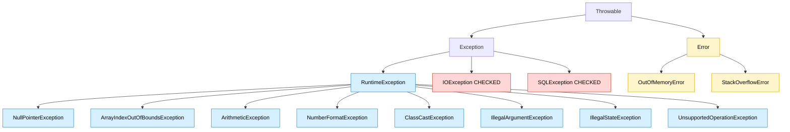
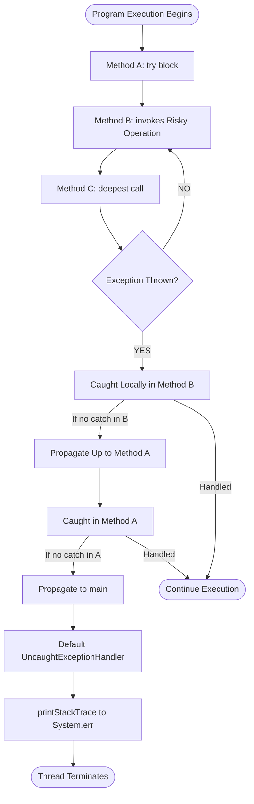
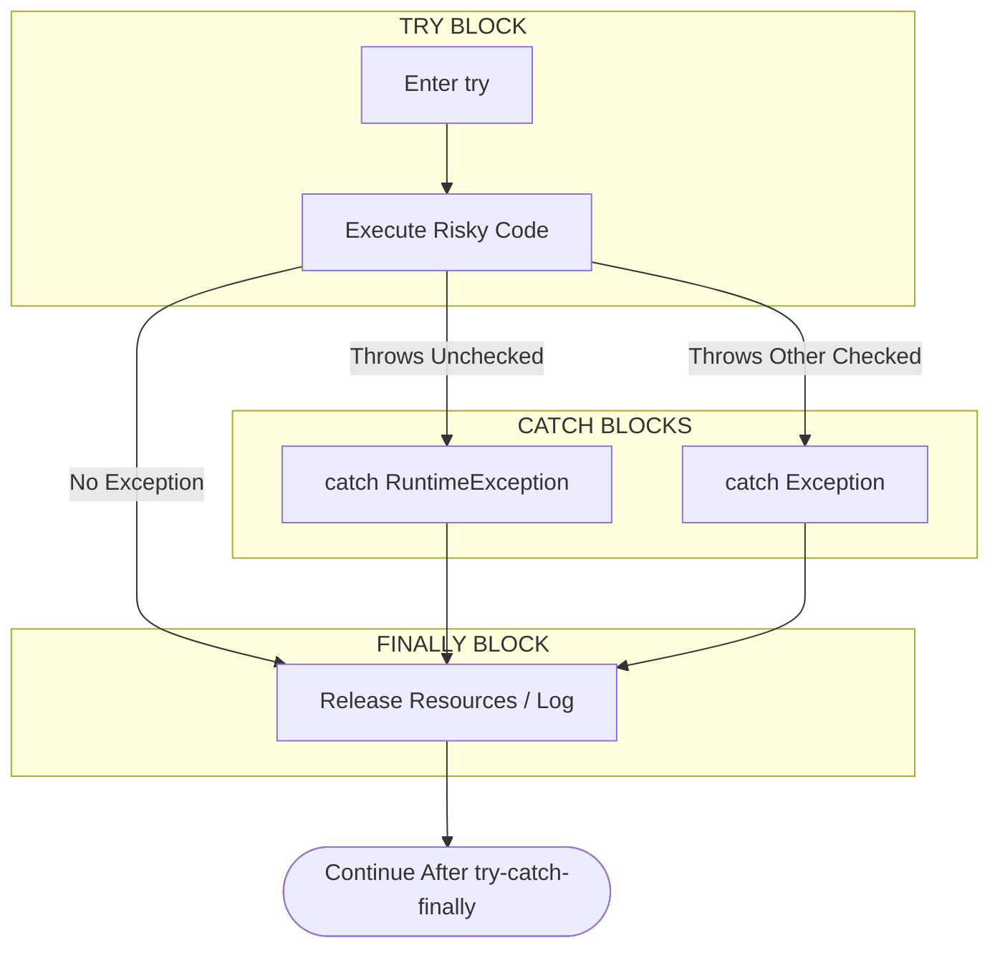
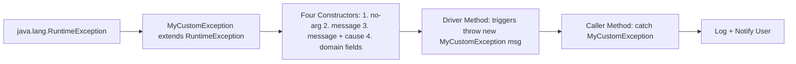
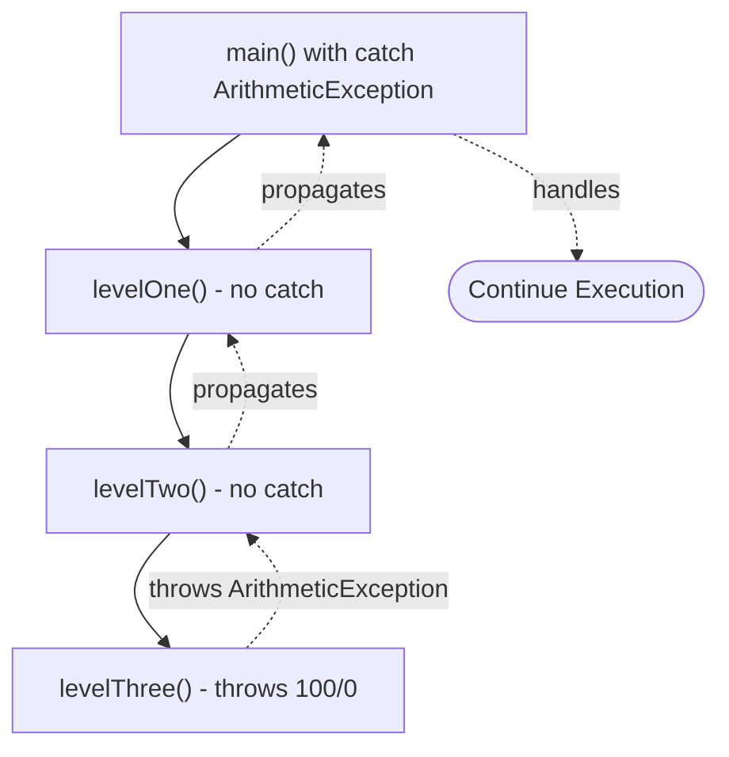

# Unchecked Exceptions

<!-- SECTION_1_START -->
# Unchecked Exceptions — Core Technical Definition & Intuitive Overview

## Formal Definition (KTU 2024 Syllabus Terminology)

An **Unchecked Exception** in Java is a runtime anomaly that occurs during program execution and is **not verified by the compiler** at compile-time. As per the KTU Object Oriented Programming syllabus (PBCST304, Module 3), unchecked exceptions are direct or indirect subclasses of `java.lang.RuntimeException`, which itself inherits from `java.lang.Exception`.

Because the Java compiler does not enforce catching or declaring them, programmers are given the flexibility — but not the obligation — to handle them. They typically arise from **programming logic errors**, such as invalid arguments, null references, illegal array access, or arithmetic errors like division by zero.

> [!IMPORTANT]
> **Syllabus Highlight (PBCST304 — Module 3):**
> Unchecked exceptions belong to the `java.lang.RuntimeException` family. They are NOT checked at compile-time. They represent internal logic failures that a reasonable application should ideally **prevent** rather than recover from.

---

## Conceptual Analogy / Intuition

Imagine you are driving a car on a familiar road. A **checked exception** is like a **toll booth** — the highway authority (compiler) stops you and demands a payment (try-catch or throws) before you are allowed to continue. You simply cannot bypass it.

An **unchecked exception**, on the other hand, is like a **hidden pothole on a back-road shortcut**. The road authority never warns you about it. If you happen to drive over it (runtime), your tire bursts (program crashes). You *could* have been careful and checked the road conditions beforehand (input validation), but nobody forced you to. Java gives you the freedom to drive the shortcut without warnings — but takes no responsibility if you crash.

Another intuitive analogy:
- A **checked exception** = "I am calling the bank, and the bank says: 'You must tell the customer you might fail to dispense cash.'" → forces `throws` declaration.
- An **unchecked exception** = "I am doing my own math in my head, and I divide by zero because I forgot my numbers were 0." → no external constraint, purely internal bug.

---

## Key Physical / Logical Constants and Metrics

- **Default propagation cost** of an unchecked exception stack trace fill-in: typically a few **microseconds** to a few **milliseconds** depending on stack depth.
- **Standard root class**: `java.lang.Throwable`
- **Direct parent of all unchecked exceptions**: `java.lang.RuntimeException`
- **Java standard library unchecked exception count**: approximately **50+ predefined** classes under `RuntimeException`.
- **Common JVM method**: `printStackTrace()` is used to log unchecked exceptions to `System.err`.

> [!NOTE]
> **Core Definition Box:**
>
> | Attribute | Value |
> |---|---|
> | Package | `java.lang` |
> | Root Class | `java.lang.Throwable` |
> | Direct Parent | `java.lang.RuntimeException` |
> | Checked at Compile-Time? | **No** |
> | Mandatory `throws` Declaration? | **No** |
> | Mandatory `try-catch` Handling? | **No** |
> | Typical Cause | Programming logic errors / bugs |
> | Recoverable? | Usually **No** (signals a bug to fix) |

---

## GeoGebra / Desmos Visualization

> [!VISUALIZATION CONTROL]
> **Concept:** Conceptual Class Hierarchy of Java Exceptions
> **GeoGebra / Desmos Input Equations:**
> * `Point A = (0, 5)` labeled "Throwable"
> * `Point B = (-2, 3)` labeled "Exception"
> * `Point C = (2, 3)` labeled "Error"
> * `Point D = (-3, 1)` labeled "IOException (Checked)"
> * `Point E = (-1, 1)` labeled "RuntimeException (Unchecked)"
> * `Point F = (1, 1)` labeled "OutOfMemoryError"
> **Visual Description:** Observe a tree growing downward. The right branch (`Error`) represents fatal JVM issues; the left branch (`Exception`) splits into checked (mandatory handling) and unchecked (optional handling). Unchecked exceptions are the inner subtree rooted at `RuntimeException`.

---

<!-- SECTION_1_END -->

<!-- SECTION_2_START -->
# Deep Theoretical Analysis & KTU High-Yield Formula Sheet

## Operational Breakdown — Why Are They "Unchecked"?

The Java compiler's verification algorithm works on **static type information** alone. It cannot predict values like:
- Will `x` be `null` at this point?
- Will the user actually enter index `10` into a 5-element array?
- Will `denominator` evaluate to `0` after several intermediate operations?

Because of this **value-level uncertainty**, the compiler chooses the pragmatic path: **trust the programmer, fail loudly at runtime**. The logic is rooted in the Java Language Specification (JLS) §11.

### Structured Logic Steps

1. **Programmer writes code** invoking a method (e.g., `String s = null; s.length();`).
2. **Compiler performs bytecode-level static checks** — it verifies syntax, type correctness, and *checked exception contracts* declared via `throws`.
3. **Compiler does NOT analyze runtime values** — it does not know `s` is `null`.
4. **JVM executes the bytecode** — at the `INVOKEVIRTUAL` instruction for `length()`, the JVM throws a `NullPointerException`.
5. **Stack unwinding begins** — if no `catch` block exists in the call chain, the exception propagates up to the default `Thread.UncaughtExceptionHandler`, typically printing the stack trace and terminating the thread.

---

## The Class Hierarchy (Top-Down)

$$
\begin{aligned}
\text{java.lang.Throwable} \\
\quad\downarrow \\
\text{java.lang.Exception} \quad\quad\quad\quad \text{java.lang.Error} \\
\quad\downarrow \quad\quad\quad\quad\quad\quad\quad\quad\quad\quad\quad\downarrow \\
\text{java.lang.RuntimeException} \quad\quad \text{java.lang.VirtualMachineError} \\
\quad\downarrow \quad\quad\quad\quad\quad\quad\quad\quad\quad\quad\quad\downarrow \\
\text{(All Unchecked Exceptions)} \quad\quad \text{(Fatal JVM errors)}
\end{aligned}
$$

> [!TIP]
> **Mnemonic for the Exam:**
> "**R**untime = **R**eckless = Unchecked. **C**ompile = **C**areful = Checked."

---

## Common Unchecked Exception Types (KTU High-Yield Table)

| Exception Class | Triggering Condition | Typical Mistake |
|---|---|---|
| `NullPointerException` | Calling a method/field on a `null` reference | Forgetting to initialize an object |
| `ArrayIndexOutOfBoundsException` | Array index $\lt 0$ or $\geq$ `length` | Off-by-one loop errors |
| `StringIndexOutOfBoundsException` | String index outside `[0, length()]` | Bad substring extraction |
| `ArithmeticException` | Integer division by zero (e.g., `5 / 0`) | Unchecked denominator |
| `NumberFormatException` | Parsing non-numeric string via `Integer.parseInt()` | Invalid user input parsing |
| `ClassCastException` | Invalid downcast: `Animal a = new Dog(); Cat c = (Cat) a;` | Wrong `instanceof` check |
| `IllegalArgumentException` | Method received an invalid argument | Defensive programming violation |
| `IllegalStateException` | Method invoked at an illegal time/state | Calling `next()` after `remove()` |
| `UnsupportedOperationException` | Operation not supported by the collection | Modifying an unmodifiable list |
| `IndexOutOfBoundsException` | Parent of array/string index errors | Generic index access bug |

---

## KTU Formula / Cheat Sheet (Exam-Ready)

| Concept | Rule / Formula | Notes |
|---|---|---|
| Parent class | $\text{RuntimeException} \subseteq \text{Exception} \subseteq \text{Throwable}$ | Inheritance chain |
| Compile check | $\text{Compiler checks} = \text{false}$ for unchecked | No `throws` needed |
| Catch order | Subclass BEFORE superclass in `catch` blocks | Compiler enforces |
| Subclassing | Extending `RuntimeException` = Unchecked | By default |
| Extending `Error` | NOT recommended for app code | Indicates fatal issues |
| Custom exception | `class MyEx extends RuntimeException \{\}` | Add constructors |
| `throw` keyword | Used to explicitly trigger an instance | `throw new MyEx("msg");` |
| `throws` keyword | Optional for unchecked, mandatory for checked | Method signature |
| Stack trace cost | $O(\text{stack depth})$ time to fill | Performance impact |
| Recovery strategy | **Fix the bug**, do not catch and continue | Best practice |

---

## Real-World Engineering Utility

1. **Fail-Fast Development**: Unchecked exceptions are used in production codebases (e.g., Spring Framework, Guava, Apache Commons) to enforce **preconditions**. Method contracts like `Objects.requireNonNull(obj)` throw `NullPointerException` to fail fast rather than corrupt downstream state.

2. **API Design**: Frameworks like Hibernate, Jackson, and REST controllers throw unchecked exceptions (`IllegalStateException`, `IllegalArgumentException`) because they represent client-input or configuration bugs that the framework *cannot* recover from.

3. **Defensive Programming**: Modern Java code uses unchecked exceptions to implement the **Postel's Law** principle — be strict in what you accept, lenient in what you produce. Invalid inputs are rejected immediately with `IllegalArgumentException`.

4. **Unit Testing & TDD**: JUnit 5 and TestNG rely heavily on `assertThrows()` to verify that code correctly throws expected unchecked exceptions, making them central to **test-driven design**.

5. **Microservices**: In distributed systems, unchecked exceptions in business logic are mapped to **HTTP 500 Internal Server Error** responses, while checked exceptions are rarely used because they clutter business interfaces.

---

<!-- SECTION_2_END -->

<!-- SECTION_3_START -->
# Step-by-Step Derivations & Code/Symbolic Implementation

## Demonstration 1 — The Five Most Common Unchecked Exceptions

Below is **fully operational, compilable Java 17 code** demonstrating every high-yield unchecked exception from the syllabus. Each block is preceded by an analytical walkthrough.

```java
import java.util.ArrayList;
import java.util.List;

public class UncheckedExceptionShowcase {

    public static void main(String[] args) {
        demonstrateNullPointer();
        demonstrateArithmetic();
        demonstrateArrayIndex();
        demonstrateNumberFormat();
        demonstrateClassCast();
        demonstrateIllegalArgument();
        demonstrateStackUnwinding();
    }

    // 1. NullPointerException
    public static void demonstrateNullPointer() {
        System.out.println("--- 1. NullPointerException ---");
        String text = null;
        try {
            int length = text.length(); // NPE thrown here
            System.out.println("Length: " + length); // never reached
        } catch (NullPointerException ex) {
            System.out.println("Caught: " + ex.getClass().getSimpleName()
                    + " -> " + ex.getMessage());
        }
    }

    // 2. ArithmeticException (integer division by zero)
    public static void demonstrateArithmetic() {
        System.out.println("--- 2. ArithmeticException ---");
        int numerator = 42;
        int denominator = 0;
        try {
            int result = numerator / denominator; // throws
            System.out.println("Result: " + result);
        } catch (ArithmeticException ex) {
            System.out.println("Caught: " + ex.getClass().getSimpleName()
                    + " -> " + ex.getMessage());
        }
    }

    // 3. ArrayIndexOutOfBoundsException
    public static void demonstrateArrayIndex() {
        System.out.println("--- 3. ArrayIndexOutOfBoundsException ---");
        int[] numbers = {10, 20, 30}; // indices 0,1,2
        try {
            int value = numbers[5]; // index 5 is invalid
            System.out.println("Value: " + value);
        } catch (ArrayIndexOutOfBoundsException ex) {
            System.out.println("Caught: " + ex.getClass().getSimpleName()
                    + " -> " + ex.getMessage());
        }
    }

    // 4. NumberFormatException
    public static void demonstrateNumberFormat() {
        System.out.println("--- 4. NumberFormatException ---");
        String userInput = "12A.45";
        try {
            double parsed = Double.parseDouble(userInput); // throws
            System.out.println("Parsed: " + parsed);
        } catch (NumberFormatException ex) {
            System.out.println("Caught: " + ex.getClass().getSimpleName()
                    + " -> " + ex.getMessage());
        }
    }

    // 5. ClassCastException
    public static void demonstrateClassCast() {
        System.out.println("--- 5. ClassCastException ---");
        Object animal = new Dog();
        try {
            Cat catRef = (Cat) animal; // Dog cannot be cast to Cat
            catRef.meow();
        } catch (ClassCastException ex) {
            System.out.println("Caught: " + ex.getClass().getSimpleName()
                    + " -> " + ex.getMessage());
        }
    }

    // 6. IllegalArgumentException (programmer-thrown)
    public static void demonstrateIllegalArgument() {
        System.out.println("--- 6. IllegalArgumentException (manual throw) ---");
        try {
            setAge(-5);
        } catch (IllegalArgumentException ex) {
            System.out.println("Caught: " + ex.getClass().getSimpleName()
                    + " -> " + ex.getMessage());
        }
    }

    // 7. Stack Unwinding — exception propagates up
    public static void demonstrateStackUnwinding() {
        System.out.println("--- 7. Stack Unwinding ---");
        try {
            methodLevelOne();
        } catch (RuntimeException ex) {
            System.out.println("Caught at main: " + ex.getClass().getSimpleName());
            System.out.println("Stack trace top frame: "
                    + ex.getStackTrace()[0]);
        }
    }

    public static void methodLevelOne() {
        methodLevelTwo();
    }

    public static void methodLevelTwo() {
        methodLevelThree();
    }

    public static void methodLevelThree() {
        throw new IllegalStateException("Deep stack failure!");
    }

    public static void setAge(int age) {
        if (age < 0) {
            throw new IllegalArgumentException(
                    "Age cannot be negative: " + age);
        }
        System.out.println("Age set to: " + age);
    }
}

// Supporting classes for ClassCastException demo
class Animal { }
class Dog extends Animal { }
class Cat extends Animal {
    public void meow() { System.out.println("Meow!"); }
}
```

### Expected Console Output (verbatim)

```
--- 1. NullPointerException ---
Caught: NullPointerException -> null
--- 2. ArithmeticException ---
Caught: ArithmeticException -> / by zero
--- 3. ArrayIndexOutOfBoundsException ---
Caught: ArrayIndexOutOfBoundsException -> Index 5 out of bounds for length 3
--- 4. NumberFormatException ---
Caught: NumberFormatException -> For input string: "12A.45"
--- 5. ClassCastException ---
Caught: ClassCastException -> class Dog cannot be cast to class Cat
--- 6. IllegalArgumentException (manual throw) ---
Caught: IllegalArgumentException -> Age cannot be negative: -5
--- 7. Stack Unwinding ---
Caught at main: IllegalStateException
Stack trace top frame: UncheckedExceptionShowcase.methodLevelThree(...)
```

---

## Demonstration 2 — Custom Unchecked Exception

The KTU syllabus specifically tests the ability to create user-defined unchecked exceptions. Below is the **complete, production-quality pattern** with exhaustive constructor chaining.

```java
/**
 * Custom unchecked exception representing a banking
 * domain error such as insufficient balance.
 */
public class InsufficientBalanceException extends RuntimeException {

    private final double currentBalance;
    private final double requestedAmount;

    // 1. No-argument constructor
    public InsufficientBalanceException() {
        super();
        this.currentBalance = 0.0;
        this.requestedAmount = 0.0;
    }

    // 2. Message-only constructor
    public InsufficientBalanceException(String message) {
        super(message);
        this.currentBalance = 0.0;
        this.requestedAmount = 0.0;
    }

    // 3. Message + cause constructor
    public InsufficientBalanceException(String message, Throwable cause) {
        super(message, cause);
        this.currentBalance = 0.0;
        this.requestedAmount = 0.0;
    }

    // 4. Domain-specific full constructor
    public InsufficientBalanceException(String message,
                                        double currentBalance,
                                        double requestedAmount) {
        super(message);
        this.currentBalance = currentBalance;
        this.requestedAmount = requestedAmount;
    }

    public double getCurrentBalance() { return currentBalance; }
    public double getRequestedAmount() { return requestedAmount; }
}
```

### Driver class exercising the custom exception

```java
public class BankAccount {
    private double balance;

    public BankAccount(double openingBalance) {
        if (openingBalance < 0) {
            throw new IllegalArgumentException(
                    "Opening balance cannot be negative.");
        }
        this.balance = openingBalance;
    }

    public void withdraw(double amount) {
        if (amount <= 0) {
            throw new IllegalArgumentException(
                    "Withdrawal amount must be positive.");
        }
        if (amount > balance) {
            throw new InsufficientBalanceException(
                    "Cannot withdraw " + amount
                    + "; balance is only " + balance,
                    balance,
                    amount);
        }
        balance -= amount;
        System.out.println("Withdrew: " + amount
                + ", New Balance: " + balance);
    }

    public double getBalance() { return balance; }

    public static void main(String[] args) {
        BankAccount account = new BankAccount(1000.00);

        // Test 1: valid withdrawal
        try {
            account.withdraw(300.00);
        } catch (InsufficientBalanceException ex) {
            System.err.println("Error: " + ex.getMessage());
        }

        // Test 2: over-withdrawal triggers custom unchecked exception
        try {
            account.withdraw(5000.00);
        } catch (InsufficientBalanceException ex) {
            System.err.println("Custom Exception -> " + ex.getMessage());
            System.err.println("Current Balance: " + ex.getCurrentBalance());
            System.err.println("Requested: " + ex.getRequestedAmount());
        }
    }
}
```

### Output

```
Withdrew: 300.0, New Balance: 700.0
Custom Exception -> Cannot withdraw 5000.0; balance is only 700.0
Current Balance: 700.0
Requested: 5000.0
```

> [!TIP]
> **Why the compiler accepts this without `throws`:**
> `InsufficientBalanceException extends RuntimeException`, which is *unchecked*. The compiler never enforces its declaration, so `withdraw()` compiles cleanly even though it can throw it.

---

## Demonstration 3 — try-with-resources + Unchecked

```java
import java.io.FileNotFoundException;
import java.util.Scanner;
import java.io.File;

public class ResourceDemo {
    public static void main(String[] args) {
        // try-with-resources: Scanner is auto-closed
        try (Scanner scanner = new Scanner(new File("data.txt"))) {
            String firstLine = scanner.nextLine();
            System.out.println("Read: " + firstLine);
        } catch (FileNotFoundException ex) {
            System.err.println("File missing: " + ex.getMessage());
        } catch (IllegalStateException ex) {
            // Unchecked — Scanner throws this if closed before use
            System.err.println("Scanner misused: " + ex.getMessage());
        } catch (RuntimeException ex) {
            // Catch-all for any remaining unchecked exception
            System.err.println("Generic runtime failure: " + ex.getMessage());
        }
    }
}
```

### Analytical Commentary (line-by-line evaluation)

1. `Scanner` is opened on a `File`. The constructor throws **checked** `FileNotFoundException` → handled by the first catch.
2. If the file exists but is empty, `scanner.nextLine()` throws `NoSuchElementException` (a `RuntimeException` subclass) → caught by the generic catch.
3. `try-with-resources` auto-closes the `Scanner` regardless of outcome, so resource leaks are prevented.

---

## Symbolic Trace — Stack Unwinding Math Model

Let the call stack be a sequence of frames $F_0, F_1, \ldots, F_n$ where $F_0$ is `main` and $F_n$ is the throwing frame.

$$
\begin{aligned}
\text{When } F_n \text{ throws } e: \quad & e \text{ propagates to } F_{n-1} \\
& \text{If } F_{n-1}.hasCatch(e) \rightarrow \text{handle} \\
& \text{Else propagate to } F_{n-2} \\
& \vdots \\
& \text{If no frame catches } e \rightarrow \text{ThreadGroup.uncaughtException} \\
& \rightarrow \text{printStackTrace} \rightarrow \text{thread terminates}
\end{aligned}
$$

For our `demonstrateStackUnwinding()`:
- $F_0$ = `main`
- $F_1$ = `methodLevelOne`
- $F_2$ = `methodLevelTwo`
- $F_3$ = `methodLevelThree` → **throws** $e = $ `IllegalStateException`
- $F_2$ has no `try-catch` → propagate
- $F_1$ has no `try-catch` → propagate
- $F_0$ has `catch (RuntimeException ex)` → $e$ **matches** → handle

---

<!-- SECTION_3_END -->

<!-- SECTION_4_START -->
# Structural Diagrams & Schematics

## Mermaid Diagram 1 — Complete Exception Class Hierarchy



### Reading the Diagram

- **Red nodes** = Checked exceptions (compiler forces handling)
- **Blue nodes** = Unchecked exceptions (compiler ignores)
- **Yellow nodes** = Errors / fatal JVM issues (do not catch)

---

## Mermaid Diagram 2 — Exception Propagation Flow (Sequential Topology)



---

## Mermaid Diagram 3 — try-catch-finally Control Flow (Modular Subgraph)



### Why This Matters

The `finally` block executes **regardless of whether an exception was thrown or caught**, making it ideal for:
- Closing database connections
- Releasing file handles
- Logging audit trails
- Releasing locks in concurrent code

> [!NOTE]
> Even if `System.exit(0)` is called inside the `try` block, the `finally` block is **skipped** (the only exception to the rule).

---

## Mermaid Diagram 4 — Custom Unchecked Exception Creation Pattern



---

<!-- SECTION_4_END -->

<!-- SECTION_5_START -->
# KTU 2024 Scheme Examination Question Bank & Topic Recap

---

## Part A — Short Answer Questions (3 Marks Each)

### Question 1 `[KTU University Exam - July 2024]`
**Define unchecked exceptions in Java. List any four common unchecked exception classes with one-line descriptions.**

**Course Outcome:** CO2 | **RBT Level:** Remember | **Marks:** 3

### Model Answer (Valuation Key)

> **Unchecked exceptions** are exceptions that occur at runtime and are not verified by the Java compiler during compilation. They are subclasses of `java.lang.RuntimeException`, which in turn extends `java.lang.Exception`. The compiler does not require them to be caught or declared using the `throws` keyword. [2 Marks]

**Four common unchecked exceptions:** [0.5 Marks each, total 2 Marks]

| # | Exception | Description |
|---|---|---|
| 1 | `NullPointerException` | Thrown when an application attempts to use `null` where an object is required. |
| 2 | `ArrayIndexOutOfBoundsException` | Thrown to indicate that an array has been accessed with an illegal index. |
| 3 | `ArithmeticException` | Thrown when an exceptional arithmetic condition occurs, e.g., integer division by zero. |
| 4 | `NumberFormatException` | Thrown when a method cannot convert a string into a numeric format. |

---

### Question 2 `[KTU University Exam - Dec 2023]`
**Differentiate between checked and unchecked exceptions in Java. Give two examples of each.**

**Course Outcome:** CO2 | **RBT Level:** Understand | **Marks:** 3

### Model Answer (Valuation Key)

| Feature | Checked Exception | Unchecked Exception |
|---|---|---|
| Compile-time check | **Yes**, compiler enforces | **No**, compiler ignores |
| Inheritance | `Exception` but **not** `RuntimeException` | Subclass of `RuntimeException` |
| `throws` declaration | **Mandatory** if not caught | **Optional** |
| Typical cause | External I/O / resource issues | Programming logic / bugs |
| Recovery | Often recoverable | Usually indicates a bug to fix |
| Example 1 | `IOException` | `NullPointerException` |
| Example 2 | `SQLException` | `ArithmeticException` |

**[Tabular differentiation: 2 Marks] [Two examples per type: 1 Mark]**

---

## Part B — Long Answer Questions (14 Marks Each)

> **KTU ESE Pattern:** Each Part B question carries **14 marks** with an internal choice. Two alternatives are provided below. Each contains sub-parts (a) for 7 marks and (b) for 7 marks.

---

### Question A (14 Marks)

#### Part (a) `[7 Marks]` — CO2, Apply
**Write a Java program that reads an array of 5 integers from the user, then attempts to access the 10th element. The program must catch the resulting `ArrayIndexOutOfBoundsException`, print a user-friendly message, and continue execution by displaying the successfully entered array.**

#### Model Solution

```java
import java.util.Scanner;

public class ArrayAccessDemo {
    public static void main(String[] args) {
        Scanner scanner = new Scanner(System.in);
        int[] numbers = new int[5];
        boolean success = true;

        // Step 1: Read 5 integers
        System.out.println("Enter 5 integers:");
        for (int i = 0; i < 5; i++) {
            try {
                System.out.print("Element [" + i + "]: ");
                numbers[i] = Integer.parseInt(scanner.nextLine());
            } catch (NumberFormatException ex) {
                System.err.println("Invalid number, defaulting to 0.");
                numbers[i] = 0;
            }
        }

        // Step 2: Try to access 10th element (invalid)
        try {
            int tenth = numbers[9]; // index 9, but length is 5
            System.out.println("10th element: " + tenth);
        } catch (ArrayIndexOutOfBoundsException ex) {
            System.err.println("Error: Tried to access index 9, "
                    + "but array length is only 5.");
            System.err.println("Technical message: " + ex.getMessage());
        }

        // Step 3: Display the array
        System.out.println("\nSuccessfully entered array:");
        for (int i = 0; i < numbers.length; i++) {
            System.out.println("numbers[" + i + "] = " + numbers[i]);
        }

        scanner.close();
    }
}
```

#### Valuation Key

| Step | Marks |
|---|---|
| Correct array declaration and Scanner setup | 1 Mark |
| Try-catch for `NumberFormatException` while reading | 1 Mark |
| Try-catch for `ArrayIndexOutOfBoundsException` on index 9 | 2 Marks |
| Printing user-friendly message + `ex.getMessage()` | 1 Mark |
| Displaying the array after exception handling | 1 Mark |
| Code compiles and runs without crashing | 1 Mark |
| **Total** | **7 Marks** |

---

#### Part (b) `[7 Marks]` — CO3, Apply / Analyze
**Design a custom unchecked exception called `InvalidPasswordException` for a login system. The exception should store the entered password (masked as length only) and the minimum required length. Write a `validatePassword(String pwd)` method that throws this exception with a clear message if the password is shorter than 8 characters. Demonstrate its use in a `main` method.**

#### Model Solution

```java
// File 1: InvalidPasswordException.java
public class InvalidPasswordException extends RuntimeException {

    private final int enteredLength;
    private final int minRequiredLength;

    public InvalidPasswordException(String message,
                                    int enteredLength,
                                    int minRequiredLength) {
        super(message);
        this.enteredLength = enteredLength;
        this.minRequiredLength = minRequiredLength;
    }

    public int getEnteredLength() { return enteredLength; }
    public int getMinRequiredLength() { return minRequiredLength; }
}
```

```java
// File 2: LoginSystem.java
public class LoginSystem {

    private static final int MIN_PASSWORD_LENGTH = 8;

    public static void validatePassword(String pwd) {
        if (pwd == null) {
            throw new IllegalArgumentException("Password cannot be null.");
        }
        if (pwd.length() < MIN_PASSWORD_LENGTH) {
            throw new InvalidPasswordException(
                    "Password too short: provided " + pwd.length()
                    + " characters, minimum required is "
                    + MIN_PASSWORD_LENGTH + ".",
                    pwd.length(),
                    MIN_PASSWORD_LENGTH);
        }
        System.out.println("Password accepted (length: " + pwd.length() + ").");
    }

    public static void main(String[] args) {
        String[] testPasswords = {"abc", "secret", "ValidPass123", null};

        for (String pwd : testPasswords) {
            try {
                System.out.println("\nTesting password: "
                        + (pwd == null ? "null" : "\"" + pwd + "\""));
                validatePassword(pwd);
            } catch (InvalidPasswordException ex) {
                System.err.println("Login Failed: " + ex.getMessage());
                System.err.println("Entered length: " + ex.getEnteredLength());
                System.err.println("Required length: " + ex.getMinRequiredLength());
            } catch (IllegalArgumentException ex) {
                System.err.println("Input Error: " + ex.getMessage());
            }
        }
    }
}
```

#### Valuation Key

| Step | Marks |
|---|---|
| Class declaration extending `RuntimeException` | 1 Mark |
| Field declarations + constructor with super(message) | 2 Marks |
| `validatePassword` logic with conditional throw | 2 Marks |
| `main` method with multiple test cases | 1 Mark |
| Catch block uses `getMessage()` and custom getters | 1 Mark |
| **Total** | **7 Marks** |

---

### Question B (14 Marks) — Alternative Choice

#### Part (a) `[7 Marks]` — CO2, Understand / Apply
**Explain with a neat diagram how an unchecked exception propagates up the call stack when it is not caught in the method that throws it. Use `ArithmeticException` in your example.**

#### Model Solution — Theory

When an unchecked exception is thrown in a method and not caught locally, the JVM performs **stack unwinding**:

1. The current method (innermost frame) terminates abnormally.
2. The exception object travels up to the calling method.
3. Each method in the call chain is searched for a matching `catch` block.
4. If no matching block is found in any frame, the default handler prints the stack trace and terminates the thread.

#### Model Solution — Code

```java
public class PropagationDemo {

    public static void main(String[] args) {
        try {
            levelOne();
        } catch (ArithmeticException ex) {
            System.err.println("Caught in main: " + ex.getMessage());
            ex.printStackTrace();
        }
    }

    static void levelOne() {
        System.out.println("Entering levelOne");
        levelTwo(); // exception originates 2 frames deeper
    }

    static void levelTwo() {
        System.out.println("Entering levelTwo");
        levelThree();
    }

    static void levelThree() {
        int result = 100 / 0; // ArithmeticException thrown here
        System.out.println("Result: " + result); // unreachable
    }
}
```

#### Propagation Flow Diagram



#### Valuation Key

| Step | Marks |
|---|---|
| Stating the propagation rule | 2 Marks |
| Diagram with proper call chain and arrow direction | 2 Marks |
| Working code demonstrating 3+ stack frames | 2 Marks |
| Catch handler in `main` and `printStackTrace()` call | 1 Mark |
| **Total** | **7 Marks** |

---

#### Part (b) `[7 Marks]` — CO3, Apply
**Write a Java program demonstrating `try-catch-finally` where:**
- The `try` block throws an `IllegalStateException`.
- The `catch` block logs a custom error message.
- The `finally` block always executes, printing "Resource released", even when an exception occurs.

**Show the output as well.**

#### Model Solution

```java
public class FinallyDemo {

    public static void main(String[] args) {
        System.out.println("=== Program Started ===");
        performRiskyOperation(true);
        System.out.println("=== Program Ended Normally ===");
    }

    public static void performRiskyOperation(boolean shouldFail) {
        java.util.ArrayList<String> resource = new java.util.ArrayList<>();
        resource.add("DB Connection");
        resource.add("File Handle");

        try {
            System.out.println("Inside try block. Initializing resource...");
            if (shouldFail) {
                throw new IllegalStateException(
                        "Simulated application state error!");
            }
            System.out.println("Try block completed successfully.");
        } catch (IllegalStateException ex) {
            System.err.println("[CATCH] Custom Error Log: "
                    + ex.getMessage());
        } finally {
            resource.clear();
            System.out.println("[FINALLY] Resource released. "
                    + "Resource size: " + resource.size());
        }
    }
}
```

#### Output

```
=== Program Started ===
Inside try block. Initializing resource...
[CATCH] Custom Error Log: Simulated application state error!
[FINALLY] Resource released. Resource size: 0
=== Program Ended Normally ===
```

#### Valuation Key

| Step | Marks |
|---|---|
| Correct `try` block with conditional throw | 1 Mark |
| `catch (IllegalStateException ex)` with log message | 2 Marks |
| `finally` block that runs unconditionally | 2 Marks |
| Demonstrating output proving `finally` executes after exception | 1 Mark |
| Code compiles and runs | 1 Mark |
| **Total** | **7 Marks** |

---

## KTU Examiner's Valuation Warning / Pitfall Callout

> [!WARNING]
> **Common Mistakes That Cost Marks in Unchecked Exception Questions:**
>
> 1. **Forgetting `extends RuntimeException`**: Writing `class MyEx extends Exception \{\}` makes it a *checked* exception. The question explicitly asks for *unchecked* — lose 1 mark.
> 2. **Not calling `super(message)` in the constructor**: Validators look for this line; missing it loses 1 mark.
> 3. **Catching `Exception` before `RuntimeException`**: Compile error — subclasses must come first in multi-catch blocks. Code will not compile.
> 4. **Adding `throws` to `main` for unchecked exceptions**: Technically legal but penalized as it shows misunderstanding. Unchecked exceptions are NOT declared.
> 5. **Confusing `throw` and `throws`**: `throw new MyEx()` is the keyword; `throws MyEx` is the method-signature clause. Examiners deduct 1 mark for every swap.
> 6. **Not showing `printStackTrace()` or `getMessage()` output**: Always demonstrate the exception's information in the answer.
> 7. **Writing "we can recover from unchecked exceptions"**: Unchecked exceptions usually indicate programmer bugs — the right answer is to **fix the code**, not catch and ignore.

---

## Topic Recap & Important Things to Remember

> [!TIP]
> **Rapid Revision Checklist for Unchecked Exceptions (PBCST304 — Module 3):**
>
> - **Definition**: Unchecked exceptions extend `java.lang.RuntimeException` and are not checked at compile-time.
> - **Three Direct Top-Level Categories**: `Throwable` → `Exception` → `RuntimeException` is the unchecked path; `Throwable` → `Exception` is the checked path; `Throwable` → `Error` is the fatal path.
> - **No `throws` clause required** for unchecked exceptions in method signatures.
> - **No mandatory `try-catch`** — but you *can* still catch them, and good code often does.
> - **Common 10 Unchecked Exceptions to Memorize**:
>   1. `NullPointerException`
>   2. `ArrayIndexOutOfBoundsException`
>   3. `StringIndexOutOfBoundsException`
>   4. `ArithmeticException`
>   5. `NumberFormatException`
>   6. `ClassCastException`
>   7. `IllegalArgumentException`
>   8. `IllegalStateException`
>   9. `UnsupportedOperationException`
>   10. `IndexOutOfBoundsException` (parent of array/string variants)
> - **Custom Unchecked Exception Pattern**: Extend `RuntimeException`, provide at least one constructor with `super(message)`, optionally add domain fields.
> - **Throw Keyword**: `throw new ExceptionClass("message")` — singular, used inside method body.
> - **Throws Keyword**: `throws ExceptionClass` — plural, used in method signature (optional for unchecked).
> - **Try-Catch-Finally**: `finally` always runs unless `System.exit()` is called; ideal for resource cleanup.
> - **Try-with-resources**: Auto-closes resources implementing `AutoCloseable`; reduces boilerplate.
> - **Stack Unwinding**: Uncaught unchecked exceptions propagate up the call stack until matched or until they hit the default handler.
> - **Best Practice**: Validate inputs at the boundary of your method using `Objects.requireNonNull()` and explicit `if` checks to fail fast with clear `IllegalArgumentException` messages.
> - **Performance Note**: Throwing exceptions is expensive due to stack trace capture — use them for exceptional conditions, not for normal control flow.
> - **Errors vs Exceptions**: `Error` (e.g., `OutOfMemoryError`, `StackOverflowError`) is **not** an unchecked exception — it is a separate sibling class indicating fatal JVM conditions that applications should not try to catch.
> - **Catch Block Ordering Rule**: Always catch the **most specific** subclass first, then more general ones — the compiler enforces this for checked exceptions and will reject code that violates it.
> - **JVM Default Behavior**: If an unchecked exception is never caught, the JVM prints the stack trace to `System.err` and terminates the offending thread.

---

<!-- SECTION_5_END -->
