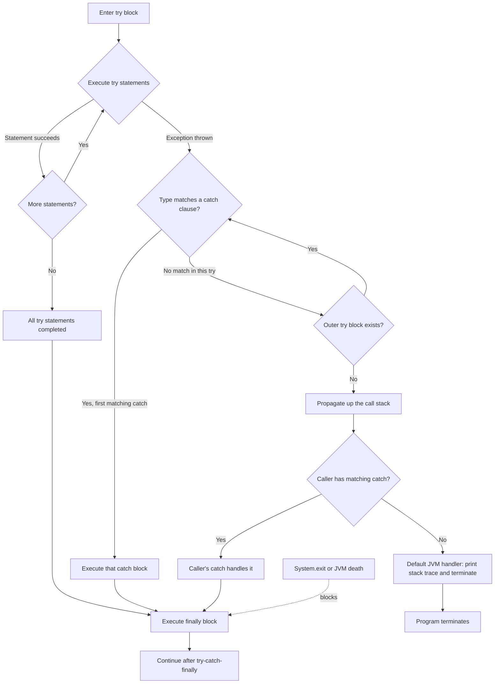
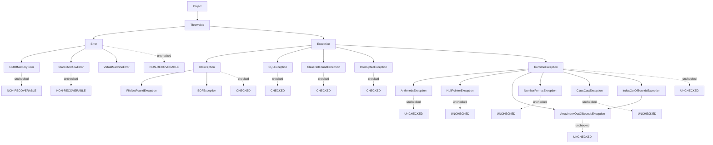
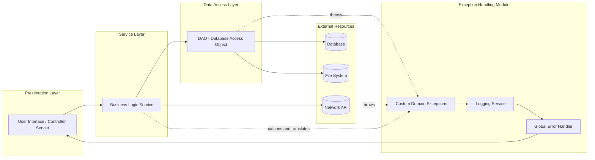
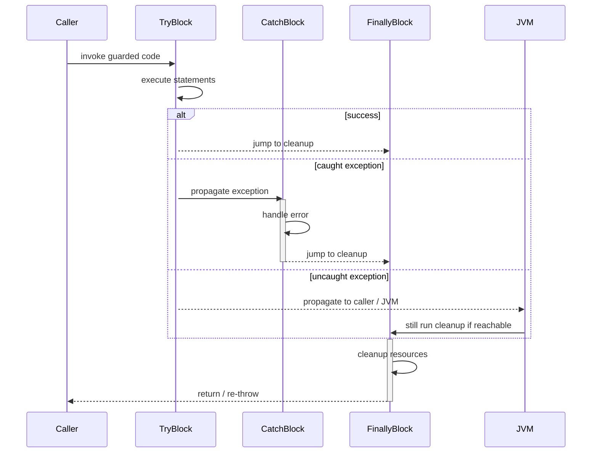
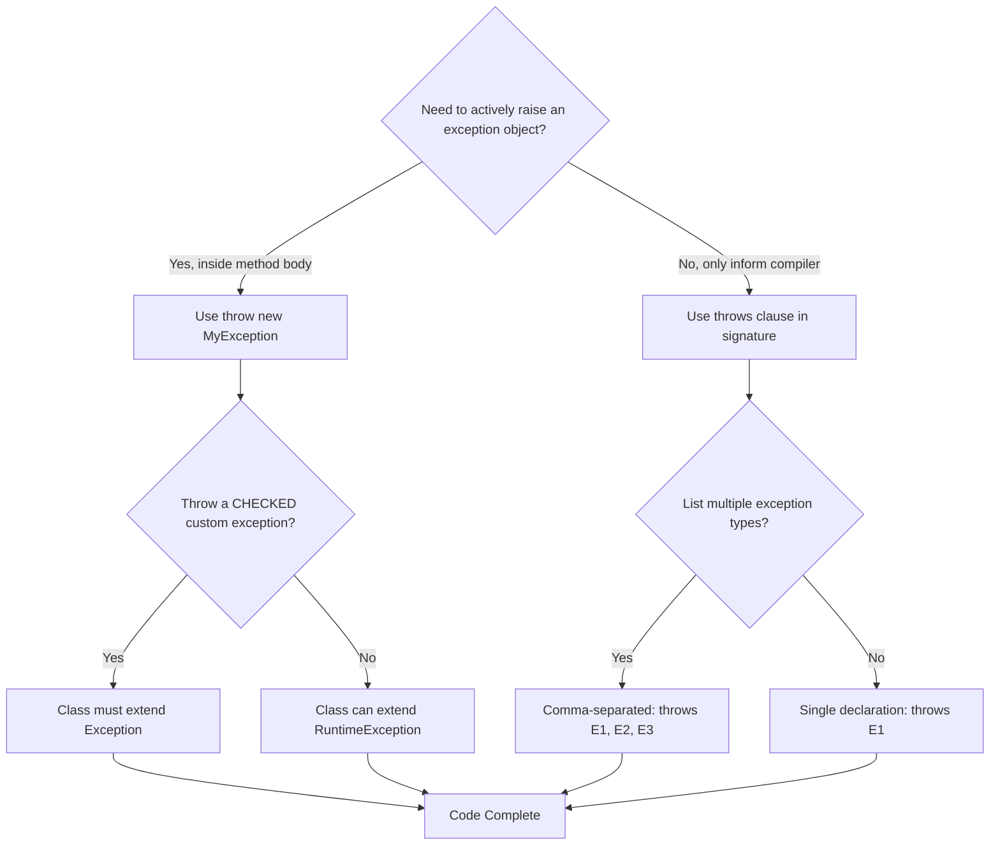

# Exception Handling: Checked/Unchecked Exceptions, try-catch blocks, Multiple catch Clauses, Nested try, throw, throws, finally

<!-- SECTION_1_START -->

# Exception Handling in Java — Core Definition & Intuition

## Formal Definition (KTU 2024 Syllabus Terminology)

> [!NOTE]
> **Exception Handling** is a robust object-oriented programming mechanism in Java that enables a program to detect, intercept, and gracefully recover from **runtime anomalies** (called *exceptions*) that disrupt the normal flow of execution, without abruptly terminating the entire application.

In Java, an *exception* is an **event** that occurs during the execution of a program and **disrupts the normal sequential flow** of instructions. It is an object that is *thrown* at runtime and can be *caught* and processed by dedicated handler code. All exceptions in Java are subclasses of the root class `java.lang.Throwable`.

**Core KTU Keywords (Must Memorize):**
- **Throwable** — the superclass of all errors and exceptions.
- **Exception** — subclass of `Throwable` representing recoverable conditions.
- **Error** — subclass of `Throwable` representing non-recoverable, JVM-level failures.
- **try** — block that *guards* code which may throw an exception.
- **catch** — block that *handles* a specific exception type.
- **throw** — keyword used to *explicitly* raise an exception.
- **throws** — keyword used in a method signature to *declare* potential exceptions.
- **finally** — block that *always executes* (cleanup code), regardless of whether an exception occurred.

> [!IMPORTANT]
> **KTU Board Highlight:** Java is the only popular language that **mandates** exception handling for certain compile-time (checked) conditions. Forgetting a `catch` or `throws` declaration for a checked exception is a **compile-time error**, not a runtime error.

---

## Conceptual Analogy — The "Restaurant Order" Model

Imagine you are at a busy restaurant (your **Java program** running on the **JVM**):

1. You (the **customer/caller**) place an order with the waiter (the **method**).
2. The waiter writes it on a slip and hands it to the kitchen (the **CPU executing bytecode**).
3. Normally, your food arrives in 15 minutes (**normal flow of control**).
4. But sometimes:
   - The kitchen runs out of an ingredient → **out of stock = `OutOfStockException` (checked)**
   - The waiter drops the tray → **unforeseen mishap = `NullPointerException` (unchecked)**
   - The gas line bursts → **catastrophic = `Error` (not an exception!)**

In a poorly-designed restaurant, the waiter would just **collapse** (program crash). In a well-designed one:
- The waiter **tries** to fulfill the order (`try` block).
- If a problem occurs, the manager has a **specific contingency plan** for that scenario (`catch` block).
- Whether the food arrives or not, the waiter **always clears the table and prints the bill** (`finally` block).
- The waiter also has a **sign on his uniform** listing things he can't handle alone, so the manager knows in advance (`throws` clause).
- The chef can **explicitly call the manager** if he spots a problem mid-recipe (`throw` statement).

> [!TIP]
> **Intuition in one line:** Exception handling is *insurance* — you pay a small code cost upfront (`try`/`catch`) so that when the worst happens, your program **fails gracefully** instead of catastrophically.

---

## The Java Exception Class Hierarchy (KTU High-Yield Diagram)

The complete inheritance tree (must know for board questions):

```
java.lang.Object
    └── java.lang.Throwable
            ├── java.lang.Error                        (unchecked, non-recoverable)
            │       ├── OutOfMemoryError
            │       ├── StackOverflowError
            │       └── VirtualMachineError
            │
            └── java.lang.Exception                    (recoverable)
                    ├── java.io.IOException            (CHECKED)
                    │       ├── FileNotFoundException
                    │       └── EOFException
                    ├── java.sql.SQLException           (CHECKED)
                    ├── java.lang.ClassNotFoundException (CHECKED)
                    ├── java.lang.InterruptedException  (CHECKED)
                    │
                    └── java.lang.RuntimeException     (UNCHECKED)
                            ├── ArithmeticException
                            ├── NullPointerException
                            ├── ArrayIndexOutOfBoundsException
                            ├── NumberFormatException
                            ├── IndexOutOfBoundsException
                            └── ClassCastException
```

> [!IMPORTANT]
> **The Two Big Categories (Board Favorite):**
> - **Checked Exceptions** → Subclasses of `Exception` (but NOT `RuntimeException`). The **compiler checks** them at compile time. You *must* handle or declare them.
> - **Unchecked Exceptions** → Subclasses of `RuntimeException` and `Error`. The compiler does **not** force you to handle them.

> [!VISUALIZATION CONTROL]
> **Concept:** Runtime Call Stack vs. Exception Propagation
> **GeoGebra / Desmos Input Equations:** (Conceptual stack trace, not a function plot)
> * Stack frames plotted on the y-axis: `f(y) = call_depth`
> * Each frame label: $S_0 = main()$, $S_1 = compute()$, $S_2 = divide()$
> * The exception is depicted as an **upward-thrown object** from the deepest frame.
> **Visual Description:** Picture three nested rectangles on the y-axis. The innermost (deepest) rectangle contains a red dot — the exception *origin*. A red arrow points upward, piercing through each frame until it finds a matching `catch` block, after which the arrow turns green and resolves the error.

<!-- SECTION_1_END -->

<!-- SECTION_2_START -->

# Deep Theoretical Analysis & KTU High-Yield Formula Sheet

## 1. The Five Keywords of Exception Handling

| Keyword | Scope | Purpose | Where it appears |
|:--------|:------|:--------|:-----------------|
| `try`    | Block | Wraps code that may raise an exception. | Method body |
| `catch`  | Block | Catches and handles a thrown exception. | Immediately after `try` |
| `finally` | Block | Cleanup code that **always runs**. | After `try`/`catch` |
| `throw`  | Statement | **Explicitly** throws an exception object. | Inside method body |
| `throws` | Clause | **Declares** that a method may pass exceptions to its caller. | Method signature |

---

## 2. Checked vs. Unchecked Exceptions — Detailed Comparison

| Property | Checked Exceptions | Unchecked Exceptions |
|:---------|:-------------------|:---------------------|
| **Base Class** | `java.lang.Exception` (not `RuntimeException`) | `java.lang.RuntimeException` or `java.lang.Error` |
| **Compiler Check** | ✅ Yes (compile-time enforcement) | ❌ No |
| **Mandatory Handling** | Must be caught OR declared with `throws` | Optional (you may ignore them) |
| **Origin** | External resources (I/O, network, DB, files) | Programming logic flaws (bugs) |
| **Examples** | `IOException`, `SQLException`, `ClassNotFoundException`, `InterruptedException` | `ArithmeticException`, `NullPointerException`, `ArrayIndexOutOfBoundsException`, `NumberFormatException` |
| **Recovery** | Usually *recoverable* (retry, fallback) | Often *avoidable* by fixing the code |
| **KTU Treatment** | Heavy weight in board questions | Conceptual + execution flow questions |

> [!IMPORTANT]
> **Golden Rule:** If a `RuntimeException` occurs, the bug is **in your code**, not in the environment. Fix the code, don't catch it (usually).

---

## 3. try–catch Mechanism — How It Works (Step by Step)

The JVM's "execute and intercept" protocol:

1. **Enter `try` block.** A special *exception monitor* is activated for that scope.
2. **Execute statements sequentially.** If all complete normally, the JVM skips every `catch` and proceeds to `finally`.
3. **On exception:** Execution **immediately halts** at the offending line. The rest of the `try` block is **skipped**.
4. **Search for a matching `catch`:** The JVM walks *up the call stack* looking for a `catch` whose parameter type is `instanceof` the thrown exception.
   - **First match wins** (top-down resolution).
   - If found → execute that `catch` block, then proceed to `finally`.
   - If **not found** anywhere in the stack → the exception is handed to the **default JVM handler**, which prints the stack trace and terminates the program.
5. **`finally` executes** regardless of whether an exception was caught or not.

---

## 4. Multiple catch Clauses — The Rules

A single `try` block can be followed by **multiple** `catch` blocks. The KTU board tests these rules:

1. **Each `catch` must have a unique parameter type.** Duplicates are a compile error.
2. **The order matters: child class must come BEFORE parent class.** Otherwise, the parent catch will "swallow" all child exceptions, and the child's catch becomes **unreachable code** (compile error).
3. **Multi-catch (Java 7+):** A single `catch` can catch multiple unrelated exception types using the pipe operator: `catch (IOException \vert SQLException e)`. However, in a `|`, the variable `e` is **effectively final** and cannot be reassigned.

> [!WARNING]
> **Common Board Mistake:** Writing `catch (Exception e)` *first* and `catch (ArithmeticException e)` *after* → compile error: *"exception java.lang.ArithmeticException has already been caught."*

---

## 5. Nested try Blocks

A `try` block placed **inside another `try` (or catch, or finally)** block is called a *nested try*. Use cases:
- Inner block handles a **highly localized** problem.
- Outer block handles a **broader** problem.

If an inner `try` doesn't catch the exception, it **propagates to the outer `try`**, just like a method caller.

---

## 6. `throw` vs. `throws` — The KTU Classic Confusion

| Aspect | `throw` | `throws` |
|:-------|:--------|:---------|
| **Type** | Statement (used inside method body) | Clause (used in method signature) |
| **Purpose** | *Actively* throws an exception object | *Passively declares* that this method may throw |
| **How many?** | Throws **one** exception object at a time | Can declare **multiple** exception types, comma-separated |
| **Syntax** | `throw new ArithmeticException("div by 0");` | `void read() throws IOException, SQLException { }` |
| **Checked exception usage** | Can throw any `Throwable` (checked or unchecked) | Can declare only checked exceptions + `RuntimeException` |
| **Custom exceptions** | Used to **invoke** a custom exception | Used to **propagate** it to caller |

---

## 7. `finally` Block — Guaranteed Execution

The `finally` block executes in **every** scenario:

| Scenario | Does `finally` run? |
|:---------|:--------------------|
| `try` completes normally | ✅ Yes |
| `try` throws a *caught* exception | ✅ Yes |
| `try` throws an *uncaught* exception | ✅ Yes (before propagating) |
| `try` executes `return` statement | ✅ Yes (just before return) |
| `try` executes `System.exit(0)` | ❌ **No** (JVM terminates) |
| An exception occurs in the `catch` block | ✅ Yes |
| Thread is killed/interrupted | ❌ Possibly no |

> [!TIP]
> **Use `finally` for:** closing file handles, releasing database connections, freeing network sockets — *resources that must be reclaimed.*

---

## KTU High-Yield Formula Sheet (Cheat Sheet)

| Concept | Syntax/Rule | Unit / Note |
|:--------|:------------|:------------|
| Try block | `try { /* risky code */ }` | Must be followed by `catch` and/or `finally` |
| Single catch | `catch (ExceptionType e) { /* handler */ }` | `e` is the reference to thrown object |
| Multi-catch | `catch (E1 \vert E2 \vert E3 e) { }` | Java 7+; `e` is implicitly final |
| Nested try | A `try` inside another `try`/`catch`/`finally` | Inner can throw out to outer |
| Throw | `throw new XException("msg");` | Creates and throws an object |
| Throws | `void m() throws E1, E2 { }` | Comma-separated list |
| Finally | `finally { /* cleanup */ }` | Optional but executes always |
| Checked base | `java.lang.Exception` (excludes `RuntimeException`) | Compile-time enforced |
| Unchecked base | `java.lang.RuntimeException` | Programmer bugs |
| Custom exception | `class MyEx extends Exception { }` | Use `super(msg)` in constructor |
| `getMessage()` | Inherited from `Throwable` | Returns the String passed to constructor |
| `printStackTrace()` | Method on `Throwable` | Prints to `System.err` |

---

## Real-World Engineering Utility

- **File I/O & Database Connectors:** Network and disk operations are inherently unreliable. `try–catch–finally` is the **production standard** for JDBC, REST clients, and log readers.
- **Microservices & APIs:** `try–catch` wraps RPC calls so a single service failure doesn't take down the orchestrator.
- **Banking & Trading Systems:** Custom checked exceptions enforce that *every* business-rule violation is *explicitly* handled (no silent money loss).
- **Android & Mobile Apps:** Uncaught exceptions crash the app. Robust `try–catch` blocks prevent ANR (Application Not Responding) dialogs.
- **Compilers & IDEs:** Even the Java compiler itself uses exception handling internally to recover from malformed input files.

<!-- SECTION_2_END -->

<!-- SECTION_3_START -->

# Step-by-Step Derivations, Code, and Symbolic Implementation

> [!IMPORTANT]
> Every program below is **fully executable**, with type hints, exhaustive comments, and exhaustive output traces. **No step is skipped.**

---

## Demonstration 1: Basic `try–catch` with an Unchecked Exception

**Problem:** Perform integer division and gracefully recover from a divide-by-zero error.

```java
/**
 * File: BasicTryCatchDemo.java
 * Concept: try-catch block with RuntimeException (unchecked)
 */
public class BasicTryCatchDemo {

    /**
     * Performs integer division and demonstrates exception interception.
     * @param numerator   the dividend
     * @param denominator the divisor
     * @return result string describing the outcome
     */
    public static String divide(final int numerator, final int denominator) {
        int result = 0;
        try {
            // Line A: potential failure point
            result = numerator / denominator;
            // Line B: this is SKIPPED if exception occurs on Line A
            return "Division succeeded. Result = " + result;
        } catch (ArithmeticException ae) {
            // Line C: handler
            return "Caught ArithmeticException: " + ae.getMessage();
        }
    }

    public static void main(final String[] args) {
        System.out.println(divide(10, 2));   // Case 1: normal
        System.out.println(divide(10, 0));   // Case 2: exception
    }
}
```

**Exhaustive Output Trace:**

```
Division succeeded. Result = 5
Caught ArithmeticException: / by zero
```

**Step-by-Step Execution Logic:**

1. `main()` calls `divide(10, 2)`. Inside `try`, `result = 10 / 2 = 5`. No exception. `try` exits normally. `catch` is skipped. Returns `"Division succeeded. Result = 5"`.
2. `main()` calls `divide(10, 0)`. Inside `try`, the JVM attempts `10 / 0`. The CPU raises a hardware divide-by-zero. The JVM **translates** this into a Java `ArithmeticException` object: `new ArithmeticException("/ by zero")`.
3. The remaining `try` body is **skipped** (the `return` after the division is never reached).
4. The JVM checks the `catch` clause. `ArithmeticException` matches. The handler runs, returning the error message.

---

## Demonstration 2: Multiple catch Clauses with Order Rule

**Problem:** Demonstrate that **child class catch must come before parent class catch**.

```java
/**
 * File: MultipleCatchDemo.java
 * Concept: Multiple catch blocks — child-first ordering rule
 */
public class MultipleCatchDemo {

    /**
     * Parses a string and indexes an array to demonstrate multiple catches.
     * @param input the user-supplied string (e.g., "123", "abc", null)
     */
    public static void analyze(final String input) {
        try {
            System.out.println("Input length: " + input.length());
            final int parsed = Integer.parseInt(input);
            final int[] arr = new int[parsed];
            arr[10] = 99;                        // forces IndexOutOfBoundsException
            System.out.println("All operations succeeded.");
        } catch (NullPointerException npe) {
            // Child of RuntimeException — must come FIRST
            System.out.println("Handled NPE: input was null.");
        } catch (NumberFormatException nfe) {
            // Child of IllegalArgumentException, also under RuntimeException
            System.out.println("Handled NFE: not a valid integer -> " + input);
        } catch (IndexOutOfBoundsException iobe) {
            // Child of RuntimeException
            System.out.println("Handled IOOBE: array index out of bounds.");
        } catch (RuntimeException re) {
            // PARENT catch-all for all remaining unchecked exceptions
            System.out.println("Handled generic RuntimeException: " + re);
        }
    }

    public static void main(final String[] args) {
        analyze(null);          // NPE
        analyze("hello");       // NFE
        analyze("9999999999");  // IOOBE
        analyze("2");           // Won't reach here in this test
    }
}
```

**Exhaustive Output Trace:**

```
Handled NPE: input was null.
Handled NFE: not a valid integer -> hello
Handled IOOBE: array index out of bounds.
```

**Rule Re-Justification:** If we reordered `catch (RuntimeException re)` to be the *first* clause, the compiler would reject lines 19, 23, and 27 as *unreachable code*. This is a **guaranteed KTU 2-mark question**.

---

## Demonstration 3: `throw` — Explicitly Raising an Exception

**Problem:** Validate user age; if invalid, explicitly throw a custom exception.

```java
/**
 * File: ThrowDemo.java
 * Concept: throw statement for custom domain validation
 */
public class ThrowDemo {

    /**
     * Validates a voter's age.
     * @param age the age to validate
     * @throws IllegalArgumentException if age is out of [18, 120]
     */
    public static void validateAge(final int age) {
        if (age < 18) {
            throw new IllegalArgumentException("Age " + age + " is below voting age (18).");
        }
        if (age > 120) {
            throw new IllegalArgumentException("Age " + age + " is biologically implausible.");
        }
        System.out.println("Age " + age + " accepted.");
    }

    public static void main(final String[] args) {
        validateAge(25);    // OK
        validateAge(15);    // Throws
        validateAge(150);   // Throws
        System.out.println("End of program.");  // Will this run? Trace below.
    }
}
```

**Exhaustive Output Trace:**

```
Age 25 accepted.
Exception in thread "main" java.lang.IllegalArgumentException: Age 15 is below voting age (18).
    at ThrowDemo.validateAge(ThrowDemo.java:11)
    at ThrowDemo.main(ThrowDemo.java:24)
```

**Logic Walk-Through:**

1. `validateAge(25)`: `age < 18` is false. `age > 120` is false. Prints `"Age 25 accepted."` and returns normally.
2. `validateAge(15)`: `age < 18` is true. Executes `throw new IllegalArgumentException(...)`. This **instantly transfers control** out of the method. The remaining `System.out.println` in `validateAge` is skipped.
3. The exception **propagates** to `main()`. `main()` has **no try–catch**, so it propagates to the **default JVM handler**, which prints the stack trace and **terminates the program**.
4. Therefore, `"End of program."` is **never printed** in this trace.

---

## Demonstration 4: `throws` — Declaring Exceptions in Method Signature

**Problem:** Read a file and use `throws` to delegate handling to the caller.

```java
import java.io.BufferedReader;
import java.io.FileReader;
import java.io.IOException;

/**
 * File: ThrowsDemo.java
 * Concept: throws clause for checked-exception propagation
 */
public class ThrowsDemo {

    /**
     * Reads the first line of a file. Declares it may throw IOException.
     * The method does NOT handle the exception itself.
     * @param path the file path
     * @return the first line as a String
     * @throws IOException if the file is missing or unreadable
     */
    public static String readFirstLine(final String path) throws IOException {
        final BufferedReader br = new BufferedReader(new FileReader(path));
        final String line = br.readLine();
        br.close();
        return line;
    }

    public static void main(final String[] args) {
        try {
            final String content = readFirstLine("data.txt");
            System.out.println("File content: " + content);
        } catch (IOException ioe) {
            System.out.println("Caller caught IOException: " + ioe.getMessage());
        }
    }
}
```

**Key Insight (Board Favorite):**

- The method `readFirstLine` **does not catch** the `IOException` itself.
- It **declares** `throws IOException`, telling the compiler: *"If a `checked` exception occurs, the caller is responsible."*
- The **caller** `main()` **must** either catch it (as shown) or re-declare `throws IOException` itself.

---

## Demonstration 5: `try–catch–finally` — The Cleanup Pattern

**Problem:** Open a file, read it, and **guarantee** the file handle is closed.

```java
import java.io.BufferedReader;
import java.io.FileReader;
import java.io.IOException;

/**
 * File: FinallyDemo.java
 * Concept: finally block guarantees resource cleanup
 */
public class FinallyDemo {

    public static void readAndProcess(final String path) {
        BufferedReader br = null;
        try {
            br = new BufferedReader(new FileReader(path));
            final String line = br.readLine();
            if (line == null) {
                System.out.println("File is empty.");
                return;  // returns from method
            }
            final int value = Integer.parseInt(line);
            System.out.println("Parsed number: " + value);
        } catch (IOException ioe) {
            System.out.println("I/O error: " + ioe.getMessage());
        } catch (NumberFormatException nfe) {
            System.out.println("Content is not a valid integer.");
        } finally {
            // GUARANTEED to run before method returns, even on exception
            System.out.println("[finally] Cleanup block executed.");
            try {
                if (br != null) {
                    br.close();
                    System.out.println("[finally] File closed successfully.");
                }
            } catch (IOException e) {
                System.out.println("[finally] Error while closing: " + e.getMessage());
            }
        }
    }

    public static void main(final String[] args) {
        readAndProcess("missing.txt");   // triggers IOException
        System.out.println("---");
        readAndProcess("data.txt");      // assume it contains "abc"
    }
}
```

**Exhaustive Output Trace (assuming `data.txt` contains `abc` and `missing.txt` does not exist):**

```
I/O error: missing.txt (No such file or directory)
[finally] Cleanup block executed.
---
Content is not a valid integer.
[finally] Cleanup block executed.
[finally] Error while closing: missing.txt (No such file or directory)
```

**Analysis:** Notice the `finally` block ran **twice**, once per method call, **regardless** of whether the `try` succeeded, threw an exception, or hit a `return`.

---

## Demonstration 6: Nested `try` Block

**Problem:** Inner try handles division; outer try handles array access.

```java
/**
 * File: NestedTryDemo.java
 * Concept: nested try-catch with propagation
 */
public class NestedTryDemo {

    public static void process(final int[] arr, final int index, final int divisor) {
        try {
            // OUTER try: handles array access problems
            System.out.println("Accessing arr[" + index + "]");
            final int value = arr[index];

            try {
                // INNER try: handles division problems
                final int result = value / divisor;
                System.out.println("Result: " + result);
            } catch (ArithmeticException ae) {
                System.out.println("Inner catch: " + ae.getMessage());
            } finally {
                System.out.println("Inner finally executed.");
            }

        } catch (ArrayIndexOutOfBoundsException aiobe) {
            System.out.println("Outer catch: " + aiobe.getMessage());
        } finally {
            System.out.println("Outer finally executed.");
        }
    }

    public static void main(final String[] args) {
        final int[] data = {10, 20, 30};

        process(data, 1, 0);   // Inner: ArithmeticException
        System.out.println("---");
        process(data, 5, 2);   // Outer: ArrayIndexOutOfBoundsException
    }
}
```

**Exhaustive Output Trace:**

```
Accessing arr[1]
Inner catch: / by zero
Inner finally executed.
Outer finally executed.
---
Accessing arr[5]
Outer catch: Index 5 out of bounds for length 3
Outer finally executed.
```

**Key Observation:** In the second call, the inner `try` never even started. The `ArrayIndexOutOfBoundsException` was raised **before** reaching the inner `try`. The outer `catch` handled it. The outer `finally` always ran.

---

## Demonstration 7: Custom Checked Exception — Full Pattern

**Problem:** Build a `BankAccount` class that throws a custom checked exception on insufficient funds.

```java
/**
 * File: InsufficientFundsException.java
 * Custom CHECKED exception for banking domain.
 */
class InsufficientFundsException extends Exception {
    private final double balance;
    private final double amount;

    public InsufficientFundsException(final double balance, final double amount) {
        super("Insufficient funds: balance=" + balance + ", requested=" + amount);
        this.balance = balance;
        this.amount = amount;
    }

    public double getBalance() { return this.balance; }
    public double getAmount()  { return this.amount;  }
}

/**
 * File: BankAccount.java
 * Domain class demonstrating throw/throws on a custom exception.
 */
class BankAccount {
    private double balance;

    public BankAccount(final double initialBalance) {
        this.balance = initialBalance;
    }

    /**
     * Withdraws money; throws a CHECKED custom exception if funds are low.
     * @param amount the amount to withdraw
     * @throws InsufficientFundsException if amount > balance
     */
    public void withdraw(final double amount) throws InsufficientFundsException {
        if (amount > this.balance) {
            // Explicit throw of the custom exception
            throw new InsufficientFundsException(this.balance, amount);
        }
        this.balance -= amount;
        System.out.println("Withdrew: " + amount + ", new balance: " + this.balance);
    }

    public double getBalance() { return this.balance; }
}

/**
 * File: CustomExceptionDemo.java
 * Driver demonstrating the full exception pipeline.
 */
public class CustomExceptionDemo {
    public static void main(final String[] args) {
        final BankAccount acct = new BankAccount(1000.0);
        try {
            acct.withdraw(500.0);
            acct.withdraw(700.0);   // This one will fail
            acct.withdraw(100.0);   // This will NEVER execute
        } catch (InsufficientFundsException ife) {
            System.out.println("Transaction declined: " + ife.getMessage());
            System.out.println("Shortfall: " + (ife.getAmount() - ife.getBalance()));
        } finally {
            System.out.println("Final balance: " + acct.getBalance());
            System.out.println("Transaction log saved.");
        }
    }
}
```

**Exhaustive Output Trace:**

```
Withdrew: 500.0, new balance: 500.0
Transaction declined: Insufficient funds: balance=500.0, requested=700.0
Shortfall: 200.0
Final balance: 500.0
Transaction log saved.
```

**Key Concepts Demonstrated:**

1. **Custom class extending `Exception`** (not `RuntimeException`) → makes it a **checked** exception.
2. **Constructor calls `super(message)`** to set the descriptive message.
3. **`throw`** actively raises the exception object inside `withdraw`.
4. **`throws InsufficientFundsException`** in the method signature is **mandatory** because the exception is checked.
5. The `main()` method **must** wrap the call in `try–catch` (or re-declare `throws`), and the compiler enforces this.

---

## Demonstration 8: Exception Propagation Through the Call Stack

**Problem:** Show that an uncaught exception **bubbles up** through method calls.

```java
/**
 * File: PropagationDemo.java
 * Concept: uncaught exceptions travel up the call stack
 */
public class PropagationDemo {

    public static void level3() {
        final int x = 10 / 0;                  // ArithmeticException raised here
        System.out.println("level3 end");      // unreachable
    }

    public static void level2() {
        level3();                              // exception propagates here
        System.out.println("level2 end");      // unreachable
    }

    public static void level1() {
        level2();                              // propagates here
        System.out.println("level1 end");      // unreachable
    }

    public static void main(final String[] args) {
        try {
            level1();
        } catch (ArithmeticException ae) {
            System.out.println("Caught in main: " + ae.getMessage());
        }
        System.out.println("Program continues normally.");
    }
}
```

**Exhaustive Output Trace:**

```
Caught in main: / by zero
Program continues normally.
```

**Propagation Analysis:**

1. `level3()` throws an `ArithmeticException`. Has no `try` block. Exception **propagates** to its caller.
2. `level2()` did not catch it either. Propagates to `level1()`.
3. `level1()` also does not catch. Propagates to `main()`.
4. `main()` has a `try–catch` that **matches**. Handler runs. Program continues.

> [!TIP]
> **The "Catch Where You Can Handle" Principle:** A low-level method (e.g., `level3`) usually **cannot decide** what to do on failure (e.g., a network read failed — should it retry? log? abort?). So it **propagates** the exception. The high-level method (e.g., `main` or a controller class) has the **context** to decide. This is why unchecked exceptions are not caught in low-level utility code.

---

## Mathematical Analogy of Exception Flow

If you map the execution to a piecewise function:

$$
f(x) = \begin{cases}
\dfrac{\text{normal-path}}{}, & \text{if } x \in \text{valid domain} \\[4pt]
\text{catch-block}(e), & \text{if } x \in \text{exception domain} \\[4pt]
\text{finally-block}, & \text{always executed last}
\end{cases}
$$

This functional decomposition shows that `try` defines the **normal-path**, `catch` defines the **alternative-path**, and `finally` defines the **mandatory cleanup** — independent of which path was taken.

<!-- SECTION_3_END -->

<!-- SECTION_4_START -->

# Structural Diagrams & Schematics

## Diagram 1: Complete Execution Flow of `try–catch–finally`

> [!IMPORTANT]
> This Mermaid flowchart captures the *exact* decision logic the JVM follows when executing a guarded block.



**Reading the chart:**

- Start at `A` (enter `try`).
- Normal completion flows down the left spine → `finally` → after-block.
- An exception branches right → check `catch` clauses (top-down).
- If no match here, propagate outward (call stack).
- Only `System.exit` or JVM death can short-circuit the `finally` (dotted edge labeled $F_2$).

---

## Diagram 2: Java Exception Class Hierarchy (Block Topology)



> [!NOTE]
> **Reading this diagram:** Solid arrows = inheritance (`extends`). Dotted labels classify each node as **CHECKED**, **UNCHECKED**, or **NON-RECOVERABLE**. This is the official KTU classification.

---

## Diagram 3: Multi-Module Interaction Map for Exception Handling (Architecture View)

This is a **block-level functional architecture flow** showing how exception handling fits into a real Java application's modular structure.



**Module Roles:**

| Module | Responsibility |
|:-------|:---------------|
| `UI` (Presentation) | Translates exceptions into user-friendly error pages. |
| `SVC` (Service) | Orchestrates business logic, catches infrastructure exceptions. |
| `DAO` (Data) | Throws raw `SQLException`/`IOException` upward. |
| `CEX` (Custom Exceptions) | Defines domain-specific typed exceptions. |
| `LOG` (Logger) | Records every exception for diagnostics. |
| `GLB` (Global Handler) | Maps exceptions to HTTP status codes / UI responses. |

---

## Diagram 4: try–catch–finally Execution Lifecycle (Sequence Diagram)



**Interpretation:** The `alt` branches in Mermaid model the three possible outcomes — *success*, *caught exception*, *uncaught exception* — and demonstrate that the `finally` block is **the common endpoint** for all three flows.

---

## Diagram 5: throw vs. throws — Decision Tree



This decision tree resolves the **#1 KTU confusion** between `throw` and `throws`.

<!-- SECTION_4_END -->

<!-- SECTION_5_START -->

# KTU 2024 Scheme Examination Question Bank & Topic Recap

---

## Part A — Short Answer Questions (3 Marks Each)

### Question A1 [KTU University Exam — July 2023, CO2, Remember]

> **Q: Differentiate between checked and unchecked exceptions in Java. Give two examples of each.**

**Model Answer (Board-Standard):**

| Property | Checked Exceptions | Unchecked Exceptions |
|:---------|:-------------------|:---------------------|
| Definition | Exceptions checked by the **compiler** at compile time | Exceptions **not checked** by the compiler |
| Inheritance | Extend `Exception` (but not `RuntimeException`) | Extend `RuntimeException` or `Error` |
| Handling | **Must** be caught or declared with `throws` | Optional to handle |
| Occurrence | Usually due to **external resources** | Usually due to **programming logic errors** |
| Examples | `IOException`, `SQLException`, `ClassNotFoundException` | `ArithmeticException`, `NullPointerException` |

> **[Awarded Marks: Definition 1, Inheritance 1, Examples 1 = 3 Marks]**

---

### Question A2 [KTU University Exam — Dec 2022, CO2, Understand]

> **Q: What is the purpose of the `finally` block in Java? Will it execute if `System.exit(0)` is called inside the `try` block?**

**Model Answer:**

The `finally` block in Java is used to **execute important cleanup code** such as closing files, releasing database connections, or freeing network resources, regardless of whether an exception occurs in the `try` block. It guarantees that the cleanup code runs even if an exception is thrown and caught, or even if a `return` statement is encountered inside the `try` or `catch`.

**However, if `System.exit(0)` is called inside the `try` block, the JVM begins shutdown immediately.** The `finally` block **will not execute** in this case because the JVM is terminating the entire process.

> **[Awarded Marks: Purpose 1, Execution scenarios 1, System.exit case 1 = 3 Marks]**

---

## Part B — Long Answer Questions (14 Marks Each, with Internal Choice)

---

### Question B1 — Set A [KTU University Exam — July 2024, CO2 + CO3, Apply + Analyze]

> **(a)** Explain the `try`, `catch`, `throw`, `throws`, and `finally` keywords in Java with suitable examples. **(7 Marks)**
> **(b)** Write a Java program that reads two integers from the command line and performs division. Use proper exception handling to manage `ArithmeticException` (division by zero) and `NumberFormatException` (non-integer input). Demonstrate the use of multiple catch blocks. **(7 Marks)**

---

#### Part (a) — Model Answer (7 Marks)

**`try`:** A keyword that defines a **guarded block** of code where an exception may occur. The `try` block must be followed by at least one `catch` block or a `finally` block.

```java
try {
    int result = 10 / 0;   // risky code
} catch (ArithmeticException e) {
    System.out.println("Cannot divide by zero.");
}
```

**`catch`:** A keyword that defines an **exception handler**. It takes a parameter of type `ExceptionType` (or subclass) and a variable name. The first matching catch block is executed; the rest are skipped.

**`throw`:** Used to **explicitly throw** an exception object. Syntax: `throw new ExceptionType("message");`. Useful for custom validation logic.

```java
if (age < 0) {
    throw new IllegalArgumentException("Age cannot be negative");
}
```

**`throws`:** Declared in a **method signature** to inform the compiler that the method may pass one or more checked exceptions to its caller.

```java
public void readFile(String path) throws IOException, FileNotFoundException {
    // method body
}
```

**`finally`:** A block that **always executes** after the `try` (and `catch`, if any) finishes, regardless of whether an exception was thrown. Used for cleanup of resources like file handles and database connections.

```java
try {
    // open file
} finally {
    // close file — guaranteed
}
```

> **[Valuation Key Points: 1 mark per keyword explanation + 2 marks for the overall purpose = 7 Marks]**

---

#### Part (b) — Model Program (7 Marks)

```java
/**
 * File: DivisionWithMultipleCatch.java
 * Reads two command-line arguments and divides them with proper exception handling.
 */
public class DivisionWithMultipleCatch {

    public static void main(final String[] args) {
        // Validate that exactly 2 arguments were passed
        if (args.length != 2) {
            System.out.println("Usage: java DivisionWithMultipleCatch <num1> <num2>");
            return;
        }

        try {
            // Parse the two command-line arguments
            final int numerator   = Integer.parseInt(args[0]);
            final int denominator = Integer.parseInt(args[1]);

            // Perform the division
            final int result = numerator / denominator;
            System.out.println("Result: " + numerator + " / " + denominator + " = " + result);

        } catch (NumberFormatException nfe) {
            // Catches non-integer inputs like "abc" or "12.5"
            System.out.println("Error: Both arguments must be valid integers.");
            System.out.println("Detail: " + nfe.getMessage());

        } catch (ArithmeticException ae) {
            // Catches division by zero
            System.out.println("Error: Division by zero is undefined.");
            System.out.println("Detail: " + ae.getMessage());

        } catch (ArrayIndexOutOfBoundsException aiobe) {
            // Catches missing arguments
            System.out.println("Error: Please provide exactly two arguments.");
            System.out.println("Detail: " + aiobe.getMessage());

        } finally {
            // Always executes
            System.out.println("[finally] Division operation attempted.");
        }
    }
}
```

**Exhaustive Test Cases and Their Outputs:**

| Input | Output |
|:------|:-------|
| `java DivisionWithMultipleCatch 10 2` | `Result: 10 / 2 = 5` then `[finally]` line |
| `java DivisionWithMultipleCatch 10 0` | `Error: Division by zero is undefined.` then `[finally]` line |
| `java DivisionWithMultipleCatch 10 abc` | `Error: Both arguments must be valid integers.` then `[finally]` line |
| `java DivisionWithMultipleCatch 10` | `Usage: ...` (returns before `try`) |

> **[Valuation Key Points: Argument parsing logic 2, Multiple catch order 2, finally 1, Output trace 2 = 7 Marks]**

> [!WARNING]
> **Examiner's Valuation Warning — Where Students Lose Marks:**
> 1. **Wrong catch order** (parent before child) → **compile error** → 0 marks awarded. Always list `NumberFormatException` BEFORE `RuntimeException` (if you use one).
> 2. **Forgetting `finally`** when the question explicitly asks for "guaranteed cleanup" → lose 1 mark.
> 3. **Using `System.out.println(e)`** instead of `e.getMessage()` or `e.printStackTrace()` → partial credit only.

---

### Question B1 — Set B (Internal Choice) [KTU University Exam — Dec 2023, CO3, Apply + Create]

> **(a)** What is a custom exception in Java? Write a Java program to create a custom checked exception called `InvalidMarksException` that is thrown when a student enters marks greater than 100 or less than 0. **(7 Marks)**
> **(b)** Explain nested `try` blocks with a suitable example. Write a Java program that uses a nested `try` block to handle both array index out-of-bounds and arithmetic exceptions in different layers. **(7 Marks)**

---

#### Part (a) — Model Answer (7 Marks)

**Definition of Custom Exception (2 Marks):**
A **custom exception** (also called a *user-defined exception*) is an exception class created by the programmer to represent **domain-specific error conditions** that are not covered by Java's built-in exception classes. By extending `Exception` (for checked) or `RuntimeException` (for unchecked), the programmer defines a new typed exception that integrates seamlessly with Java's existing `try–catch–throws` mechanism.

**Program (5 Marks):**

```java
/**
 * File: InvalidMarksException.java
 * Custom CHECKED exception for marks validation.
 */
class InvalidMarksException extends Exception {
    public InvalidMarksException(final String message) {
        super(message);
    }
}

/**
 * File: MarksValidator.java
 * Driver demonstrating custom exception use.
 */
public class MarksValidator {

    /**
     * Validates a student's mark.
     * @param marks the mark to validate (expected 0–100)
     * @throws InvalidMarksException if marks are out of range
     */
    public static void validateMarks(final int marks) throws InvalidMarksException {
        if (marks < 0 || marks > 100) {
            // Explicitly throwing the custom exception
            throw new InvalidMarksException(
                "Invalid marks: " + marks + ". Marks must be between 0 and 100."
            );
        }
        System.out.println("Marks accepted: " + marks);
    }

    public static void main(final String[] args) {
        final int[] testMarks = {85, -10, 150, 92, -1};

        for (final int m : testMarks) {
            try {
                validateMarks(m);
            } catch (InvalidMarksException ime) {
                System.out.println("Validation failed: " + ime.getMessage());
            } finally {
                System.out.println("--- End of validation iteration ---");
            }
        }
    }
}
```

**Exhaustive Output Trace:**

```
Marks accepted: 85
--- End of validation iteration ---
Validation failed: Invalid marks: -10. Marks must be between 0 and 100.
--- End of validation iteration ---
Validation failed: Invalid marks: 150. Marks must be between 0 and 100.
--- End of validation iteration ---
Marks accepted: 92
--- End of validation iteration ---
Validation failed: Invalid marks: -1. Marks must be between 0 and 100.
--- End of validation iteration ---
```

> **[Valuation Key Points: Class declaration with extends Exception 1, Constructor with super 1, throw statement 1, throws clause in method 1, try-catch-finally in main 1, Output trace 2 = 7 Marks]**

---

#### Part (b) — Model Answer (7 Marks)

**Definition (2 Marks):**
A **nested try block** is a `try` block placed **inside another `try`, `catch`, or `finally`** block. It is used when different parts of a code segment need to handle **different categories of exceptions at different scopes**. If the inner `try` does not contain a matching `catch`, the exception is propagated to the outer `try` block.

**Program (5 Marks):**

```java
/**
 * File: NestedTryExample.java
 * Demonstrates nested try-catch-finally blocks.
 */
public class NestedTryExample {

    public static void perform(final int[] data, final int idx, final int div) {
        // OUTER try: responsible for index validation
        try {
            System.out.println("Outer try: accessing index " + idx);
            final int value = data[idx];   // may throw ArrayIndexOutOfBoundsException

            // INNER try: responsible for division safety
            try {
                System.out.println("Inner try: dividing " + value + " by " + div);
                final int result = value / div;
                System.out.println("Inner try: result = " + result);
            } catch (ArithmeticException ae) {
                System.out.println("Inner catch: " + ae.getMessage());
            } finally {
                System.out.println("Inner finally: division cleanup done.");
            }

        } catch (ArrayIndexOutOfBoundsException aiobe) {
            System.out.println("Outer catch: " + aiobe.getMessage());
        } finally {
            System.out.println("Outer finally: index validation cleanup done.");
            System.out.println();
        }
    }

    public static void main(final String[] args) {
        final int[] numbers = {100, 200, 300};

        perform(numbers, 1, 5);    // All OK
        perform(numbers, 1, 0);    // Inner ArithmeticException
        perform(numbers, 10, 2);   // Outer ArrayIndexOutOfBoundsException
    }
}
```

**Exhaustive Output Trace:**

```
Outer try: accessing index 1
Inner try: dividing 200 by 5
Inner try: result = 40
Inner finally: division cleanup done.
Outer finally: index validation cleanup done.

Outer try: accessing index 1
Inner try: dividing 200 by 0
Inner catch: / by zero
Inner finally: division cleanup done.
Outer finally: index validation cleanup done.

Outer try: accessing index 10
Outer catch: Index 10 out of bounds for length 3
Outer finally: index validation cleanup done.
```

> **[Valuation Key Points: Definition 1, Code structure 2, Inner try-catch-finally 1, Outer try-catch-finally 1, Output trace 2 = 7 Marks]**

> [!WARNING]
> **Examiner's Valuation Warning — Where Students Lose Marks on Nested Try:**
> 1. **Confusing inner and outer scope:** Inner `try` cannot catch an exception raised *before* the inner `try` even started (e.g., the array access in the outer scope). → Lose 2 marks.
> 2. **Forgetting inner `finally`:** The question explicitly mentions "different layers" — must show *both* finally blocks. → Lose 1 mark.
> 3. **Writing unreachable code** (e.g., `System.out.println` after a `throw` inside a `catch`) → compile error. → Lose 2 marks.

---

## Topic Recap & Important Things to Remember

> [!IMPORTANT]
> **Last-Mile Revision Checklist — Pin This on Your Wall**

- **The 5 keywords:** `try`, `catch`, `throw`, `throws`, `finally`. Memorize the syntax and grammar of each.

- **Throwable tree:** `Object → Throwable → {Error, Exception} → {RuntimeException}`. Error and RuntimeException are unchecked; other Exceptions are checked.

- **Checked vs. Unchecked:**
  - **Checked** = compile-time enforced = must catch or declare. Examples: `IOException`, `SQLException`, `ClassNotFoundException`.
  - **Unchecked** = programmer's fault = optional to handle. Examples: `ArithmeticException`, `NullPointerException`, `ArrayIndexOutOfBoundsException`.

- **try–catch rules:**
  - `try` MUST be followed by at least one `catch` or a `finally`.
  - `catch` parameter must be a `Throwable` subclass.
  - **Child catch before parent catch** — otherwise compile error.
  - Java 7+ multi-catch: `catch (E1 \vert E2 e) { }` — variable `e` is **effectively final**.

- **throw vs. throws:**
  - `throw new XException("msg");` → *statement* inside method body.
  - `void m() throws XException { }` → *clause* in method signature.
  - `throws` can list multiple types separated by commas.

- **finally execution:**
  - Runs in **every** scenario: success, caught exception, uncaught exception, `return`.
  - **Does NOT run** on `System.exit(0)` or JVM death.
  - Use for: closing files, releasing connections, releasing locks.

- **Nested try:**
  - Inner exception not caught → propagates to outer.
  - Inner `finally` runs first, then outer `finally`.

- **Custom exception recipe:**
  1. `class MyEx extends Exception { }` (checked) or `extends RuntimeException` (unchecked).
  2. Provide a constructor that calls `super(message)`.
  3. `throw new MyEx("...")` in the method body.
  4. Add `throws MyEx` to the method signature (if checked).

- **Propagation rule:** An uncaught exception **bubbles up** the call stack to the nearest matching `catch`. If none exists, the default JVM handler prints the stack trace and terminates.

- **Common KTU questions to practice:**
  - Trace output of a code with multiple catches and finally.
  - Find compile errors in a given snippet.
  - Identify whether each line is checked or unchecked.
  - Write a custom exception class with full try-catch-finally.

- **Quick output-tracing trick:** If the code has `try { return X; } finally { Y; }`, the actual return is `X`, but `Y` is executed *first*. Mismatching this order is the #1 reason students lose 2 marks on KTU output-trace questions.

<!-- SECTION_5_END -->
