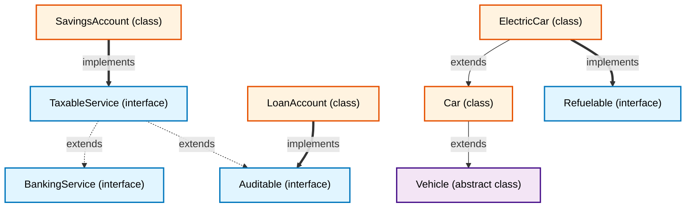
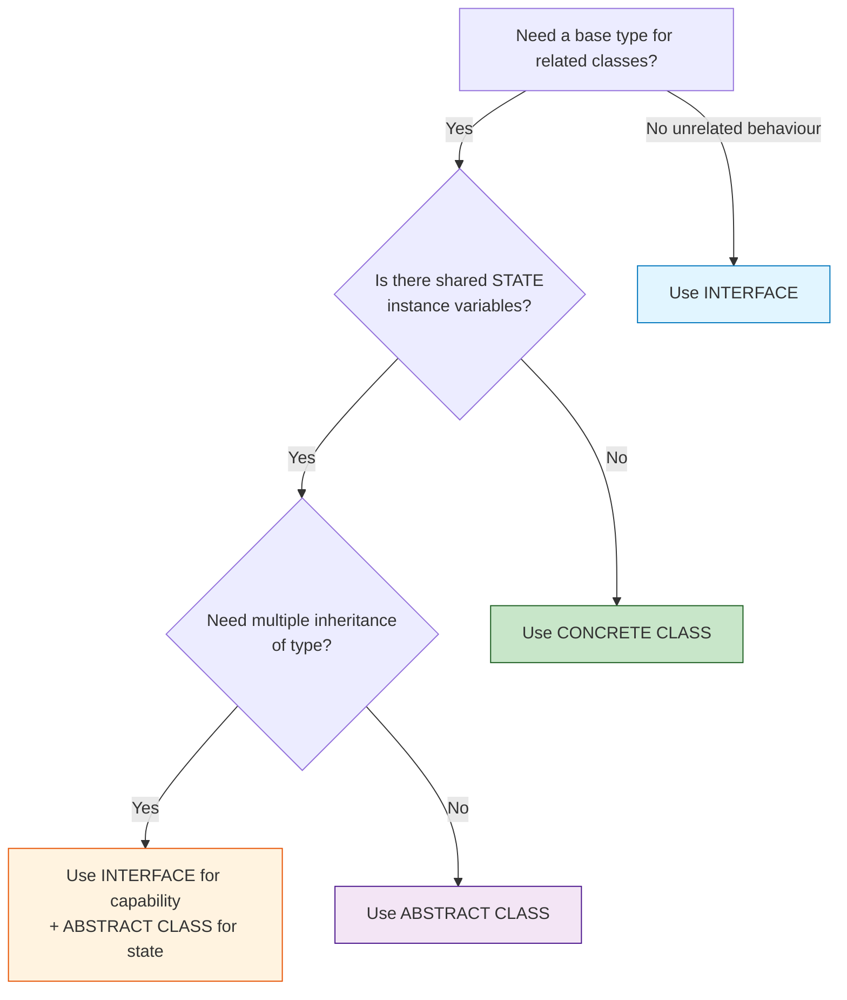
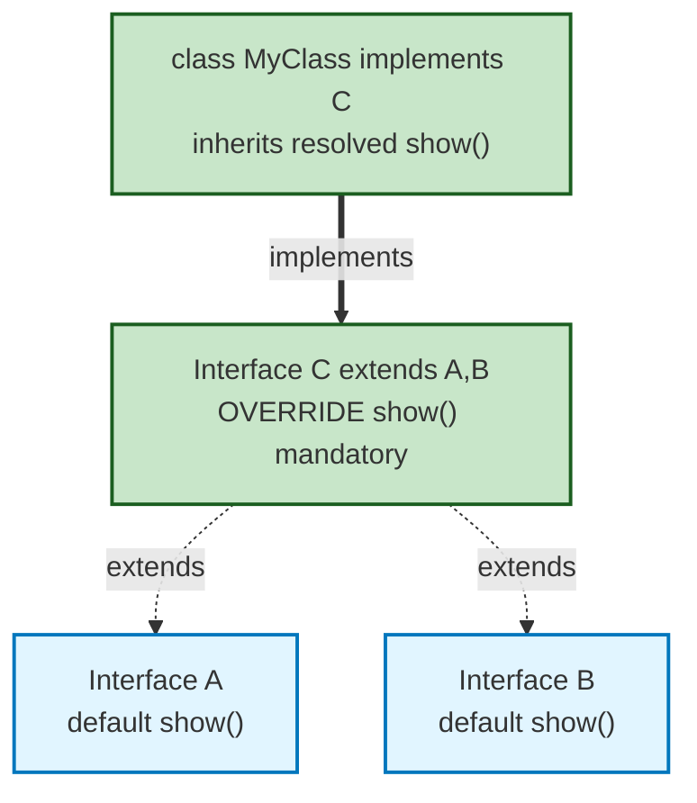
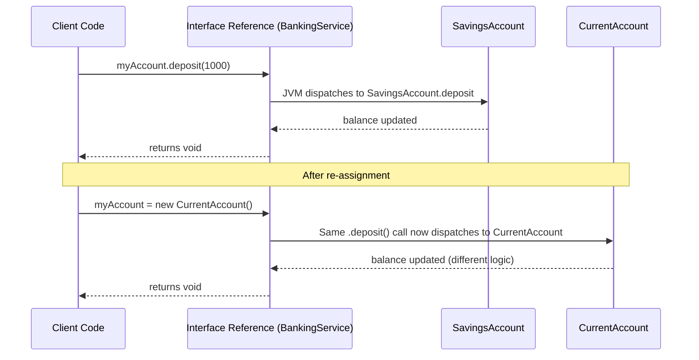
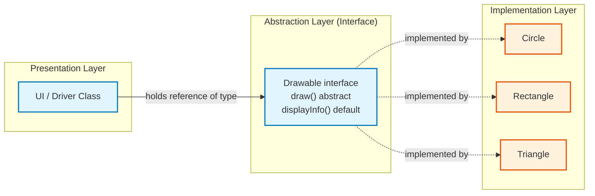

# Interfaces: Interfaces vs Abstract classes, defining/implementing an interface, extending interfaces

<!-- SECTION_1_START -->
# 1. Core Technical Definition & Intuitive Overview

## 1.1 Formal Academic Definition (KTU 2024 Syllabus Terminology)

In the Java programming language, an **Interface** is a reference type, similar to a class, that can contain only **constants, method signatures, default methods, static methods, and nested types**. Interfaces form a contract of behaviour that any implementing class must honour. From the KTU 2024 OOP syllabus perspective, an interface is a **purely abstract blueprint** used to achieve full abstraction, multiple inheritance of type, and loose coupling between collaborating objects.

> [!IMPORTANT]
> **KTU 2024 Definition Highlight:** An interface defines *what* a class must do, but **not** *how* it does it. It establishes a protocol of communication between unrelated classes without forcing inheritance of state (instance variables).

## 1.2 Conceptual Analogy & Intuition

Imagine you plug an electrical appliance into a wall socket. The plug has a specific **shape and pin arrangement** (3-pin, 5-pin, USB-C). Any device whose plug matches that shape — whether it is a laptop, a phone charger, or a mixer — can draw power from that socket. The socket doesn't know (or care) what device is connected; it only guarantees that **whatever is plugged in will deliver a fixed set of services** (power + data).

This is exactly what a Java interface represents:

- **The Socket** → The *Interface* (defines method signatures — the shape of the contract).
- **The Plug on the Device** → The *Implementing Class* (provides the actual implementation).
- **Power flowing through the socket** → The *Runtime Polymorphism* — the same interface reference invokes different behaviour depending on the actual object plugged in.

> [!NOTE]
> **Real-world mapping:** JDBC's `Connection` interface, `List` interface, `Comparable` interface — all define contracts that vendors (MySQL, Oracle) and JDK classes implement independently. This is the **Open/Closed Principle** in action.

## 1.3 Geometric / Structural Intuition (Visualization)

> [!VISUALIZATION CONTROL]
> **Concept:** Interface as a "Service Boundary Layer" between client code and concrete implementations.
> **Visual Description:** Picture a horizontal **dashed boundary line** (the interface). Above the line is the *Client* (caller code that holds a reference of interface type). Below the line are several **concrete class boxes** (`Circle`, `Rectangle`, `Triangle`) all touching the dashed line from below, indicating they "implement" the boundary contract. Arrows from the client pass through the boundary downward to the actual implementation chosen at runtime.
> **Desmos / Mermaid Analogy Inputs:**
> * Boundary: `y = 0` (interface plane)
> * Client: `y = +1` (caller code)
> * Implementations: `y = -1, -2, -3` (concrete classes)

## 1.4 Why Interfaces Matter in OOP (KTU 2024 CO Mapping)

| CO | Learning Outcome Addressed | Cognitive Level |
|---|---|---|
| **CO3** | Apply interface-based polymorphism in real-world Java programs | Apply |
| **CO4** | Distinguish between abstract classes and interfaces to design extensible systems | Analyze |
| **CO2** | Demonstrate multiple inheritance of type using interface extension | Understand |

---

<!-- SECTION_1_END -->

<!-- SECTION_2_START -->
# 2. Deep Theoretical Analysis & KTU High-Yield Formula Sheet

## 2.1 Anatomy of an Interface — Component Breakdown

An interface declaration has the following structure:

```java
[access_modifier] interface InterfaceName [extends ParentInterface1, ParentInterface2, ...] {
    // 1. Constants (implicitly public static final)
    // 2. Abstract methods (implicitly public abstract)
    // 3. Default methods (Java 8+) — has body
    // 4. Static methods (Java 8+) — has body
    // 5. Nested types (classes/interfaces, implicitly public static)
}
```

### 2.1.1 Implicit Modifiers (The "Magic" of Interfaces)

| Member Type | Implicit Modifiers | You Must NOT Write |
|---|---|---|
| Variables | `public static final` | `private`, `protected`, non-`final` |
| Abstract methods | `public abstract` | `private`, `protected`, `final` |
| Default methods | `public` (only) | `abstract`, `final` |
| Static methods | `public static` | `abstract`, `final` |
| Nested types | `public static` | non-static inner class |

> [!IMPORTANT]
> **KTU High-Yield Point:** All interface members are **implicitly `public`**. Writing `public` explicitly is allowed but redundant. Writing `private` or `protected` for top-level interface methods (before Java 9) was a **compile-time error**.

## 2.2 Defining an Interface — Step-by-Step Logic

1. **Choose an access modifier** — either `public` (visible to all packages) or package-private (default, no modifier, visible only within the same package).
2. **Declare the interface** using the `interface` keyword. The name should be an **adjective or noun describing capability** (e.g., `Comparable`, `Drawable`, `Serializable`).
3. **Declare abstract method signatures** — no body, ends with semicolon. These are the *mandatory* behaviours.
4. **(Java 8+)** Add `default` methods with concrete implementation — these provide *optional evolution* without breaking implementers.
5. **(Java 8+)** Add `static` utility methods related to the interface contract.
6. **(Java 9+)** Add `private` helper methods to share code between default methods.

### 2.2.1 Defining an Interface — Code

```java
public interface Drawable {
    // Implicitly public static final
    String DEFAULT_COLOR = "BLACK";
    
    // Implicitly public abstract
    void draw();
    double area();
    
    // Default method (concrete)
    default void displayInfo() {
        System.out.println("Drawing a " + DEFAULT_COLOR + " shape with area " + area());
    }
    
    // Static utility method
    static boolean isDrawable(Object obj) {
        return obj instanceof Drawable;
    }
}
```

## 2.3 Implementing an Interface — Class-Level Contract

A class uses the `implements` keyword to commit to the interface's contract. It must:

- Provide a concrete implementation for **every abstract method** declared in the interface.
- Be declared `abstract` itself if it does not provide all implementations.
- Follow the **access widening rule** — overridden methods cannot reduce visibility (must be `public`).

### 2.3.1 Class Implementing an Interface

```java
public class Circle implements Drawable {
    private double radius;
    
    public Circle(double radius) {
        this.radius = radius;
    }
    
    @Override
    public void draw() {
        System.out.println("Drawing Circle of radius " + radius);
    }
    
    @Override
    public double area() {
        return Math.PI * radius * radius;
    }
}
```

### 2.3.2 Partial Implementation Rule

If a class implements an interface but does not provide bodies for **all** abstract methods, the class itself **must** be declared `abstract`. The KTU board frequently tests this.

```java
public abstract class AbstractShape implements Drawable {
    protected String color;
    
    // Only implements area(), leaves draw() abstract
    @Override
    public double area() {
        return 0.0;
    }
    // draw() not implemented → class must be abstract
}
```

## 2.4 Extending Interfaces — Interface Inheritance

An interface can inherit from one or more parent interfaces using the `extends` keyword. This is how Java achieves **multiple inheritance of type**.

### 2.4.1 Rules of Interface Extension

| Rule | Explanation | Example |
|---|---|---|
| Multiple extension allowed | An interface can extend several parents | `interface C extends A, B` |
| Method conflict resolution | Default method conflict → implementing class MUST override | Two parents with same default method |
| Diamond problem | Interface resolves it via *overriding obligation* | `C extends A, B` both have `show()` |
| No state inheritance | Interfaces don't inherit instance variables | Only `static final` constants flow down |
| Transitive contract | Implementing class must satisfy all inherited abstract methods | `class X implements C` must implement `A.show()` and `B.print()` |

### 2.4.2 Extending an Interface — Code

```java
public interface Shape {
    double area();
    double perimeter();
}

public interface ColoredShape extends Shape {
    String getColor();
    void setColor(String c);
}

public interface Resizable {
    void resize(double factor);
}

// Multiple inheritance of type
public interface FancyShape extends ColoredShape, Resizable {
    void applyEffect();
}
```

Any class implementing `FancyShape` must implement **all** abstract methods from `Shape`, `ColoredShape`, `Resizable`, and `FancyShape` — five methods in total. KTU loves asking this transitive contract question.

## 2.5 Interfaces vs Abstract Classes — The Definitive KTU Comparison

> [!NOTE]
> **Why this is the most-asked KTU question in Module 3:** Examiners target this comparison because it tests depth of OOP design thinking, not just syntax recall.

| Dimension | Interface | Abstract Class |
|---|---|---|
| Keyword | `interface` | `abstract class` |
| Method types | Abstract, default, static, private (Java 9+) | Abstract and concrete (any visibility) |
| Variables | Only `public static final` constants | Any access modifier, any type, instance vars allowed |
| Inheritance | A class can implement **multiple** interfaces | A class can extend **only one** abstract class |
| Constructor | **Not allowed** | **Allowed** (used by subclasses) |
| State (instance vars) | **Cannot have** | **Can have** |
| When to use | Define a *capability* / role (e.g., `Serializable`) | Define a *common base* with shared state and partial implementation |
| Access to `this` in static methods | Not relevant (no `this`) | Not relevant |
| Speed | Slight overhead (indirect dispatch historically) | Direct method calls |
| `final` keyword usage | Interface itself can be `final`? No. Methods cannot be `final`. | Methods/Class can be `final` |
| Object instantiation | Cannot be instantiated | Cannot be instantiated |
| Implements / extends keyword | Class uses `implements` | Class uses `extends` |
| Default method conflict | Subclass MUST override | Not applicable (no multiple inheritance) |
| Loose coupling strength | **High** (no implementation inheritance) | **Medium** (couples subclasses to base) |
| KTU 2024 RBT level | Analyze / Evaluate | Understand / Analyze |

> [!IMPORTANT]
> **KTU Golden Rule (Write This in Exams):** *"Use an **abstract class** when the subclasses share a common **state** and a clear **'is-a'** relationship. Use an **interface** when unrelated classes need to share a common **behavioural contract** — a 'can-do' capability — without sharing state."*

### 2.5.1 When to Choose What — Decision Flow

```
Is there shared state (instance variables) among the related classes?
   ├── YES → Use ABSTRACT CLASS
   └── NO  → Do unrelated classes need this behaviour?
                ├── YES → Use INTERFACE
                └── NO  → Could a concrete base class work? → Use CONCRETE CLASS
```

## 2.6 KTU High-Yield Formula Sheet / Cheat Sheet

| Concept | Syntax | Mandatory Rule |
|---|---|---|
| Interface declaration | `public interface I {}` | Implicitly `abstract` |
| Constants | `int MAX = 100;` | Implicitly `public static final` |
| Abstract method | `void m();` | Implicitly `public abstract` |
| Default method | `default void m() { }` | Must have body |
| Static method | `static void m() { }` | Called via interface name |
| Class implements | `class C implements I {}` | Implement all abstract methods |
| Class implements many | `class C implements I1, I2 {}` | Separate by comma |
| Class extends + implements | `class C extends B implements I {}` | `extends` **before** `implements` |
| Interface extends | `interface I3 extends I1, I2 {}` | Multiple extension allowed |
| Abstract partial implementer | `abstract class A implements I {}` | Class must be `abstract` if not all methods implemented |
| Diamond problem resolution | Override the conflicting default in the implementing class | **Mandatory** to break ambiguity |
| Functional interface | `@FunctionalInterface interface F { void run(); }` | Exactly one abstract method |
| Marker interface | `interface Serializable {}` | No methods — just a tag |

---

<!-- SECTION_2_END -->

<!-- SECTION_3_START -->
# 3. Step-by-Step Derivations & Code/Symbolic Implementation

## 3.1 Exhaustive Worked Example — A Banking System Using Interfaces

This single, comprehensive example demonstrates **interface definition, implementation, multiple inheritance of type, and polymorphic dispatch** — covering the entire Module 3 syllabus.

### 3.1.1 Problem Statement (KTU-Style)

> *"Design a small banking module where different account types (`SavingsAccount`, `CurrentAccount`) can be deposited into, withdrawn from, and can calculate interest. The interest calculation strategy varies per account type. Use an interface named `BankingService` to enforce the contract and demonstrate interface extension and polymorphism."*

### 3.1.2 Step 1 — Define the Base Interface

```java
// File: BankingService.java
public interface BankingService {
    // Implicitly public static final
    double MINIMUM_BALANCE = 500.0;
    
    // Implicitly public abstract
    void deposit(double amount);
    void withdraw(double amount) throws InsufficientFundsException;
    double calculateInterest();
    double getBalance();
    
    // Default method (Java 8+) — provides shared utility
    default void printStatement() {
        System.out.println("Current Balance: ₹" + getBalance());
        System.out.println("Projected Interest: ₹" + calculateInterest());
    }
    
    // Static method (Java 8+) — utility
    static boolean isValidAmount(double amount) {
        return amount > 0 && !Double.isInfinite(amount);
    }
}
```

**Logic Walkthrough:**
- `MINIMUM_BALANCE` is a constant, implicitly `public static final` — every implementing class shares this rule.
- `deposit`, `withdraw`, `calculateInterest`, `getBalance` are abstract — every account type *must* provide its own logic.
- `printStatement()` is `default` because the way to print is the same; only the data comes from the abstract methods.
- `isValidAmount()` is a utility — does not depend on instance state, hence `static`.

### 3.1.3 Step 2 — Create a Custom Exception

```java
// File: InsufficientFundsException.java
public class InsufficientFundsException extends Exception {
    public InsufficientFundsException(String message) {
        super(message);
    }
}
```

### 3.1.4 Step 3 — Define an Extended Interface (Multiple Interface Inheritance)

```java
// File: Auditable.java
public interface Auditable {
    void generateAuditLog();
}

// File: TaxableService.java — extends BankingService AND Auditable
public interface TaxableService extends BankingService, Auditable {
    double calculateTax();
    default void taxSummary() {
        System.out.println("Tax Liability: ₹" + calculateTax());
        generateAuditLog();  // Inherited from Auditable
    }
}
```

**Logic Walkthrough:**
- `TaxableService` inherits **two** interfaces via the `extends` keyword.
- Any class implementing `TaxableService` must implement: `deposit`, `withdraw`, `calculateInterest`, `getBalance` (from `BankingService`), `generateAuditLog` (from `Auditable`), `calculateTax` (from `TaxableService`) → **6 methods total**.
- `taxSummary()` is a default method combining two inherited behaviours.

### 3.1.5 Step 4 — Implement the Interface in `SavingsAccount`

```java
// File: SavingsAccount.java
public class SavingsAccount implements TaxableService {
    private String accountHolder;
    private double balance;
    private static final double INTEREST_RATE = 0.04;  // 4% per annum
    private static final double TAX_RATE = 0.10;       // 10% on interest
    
    public SavingsAccount(String accountHolder, double openingBalance) {
        if (openingBalance < MINIMUM_BALANCE) {
            throw new IllegalArgumentException("Below minimum balance");
        }
        this.accountHolder = accountHolder;
        this.balance = openingBalance;
    }
    
    @Override
    public void deposit(double amount) {
        if (!BankingService.isValidAmount(amount)) {
            throw new IllegalArgumentException("Invalid deposit");
        }
        balance += amount;
        System.out.println("Deposited ₹" + amount + ". New balance: ₹" + balance);
    }
    
    @Override
    public void withdraw(double amount) throws InsufficientFundsException {
        if (!BankingService.isValidAmount(amount)) {
            throw new IllegalArgumentException("Invalid withdrawal");
        }
        if (balance - amount < MINIMUM_BALANCE) {
            throw new InsufficientFundsException(
                "Withdrawal would breach minimum balance of ₹" + MINIMUM_BALANCE);
        }
        balance -= amount;
        System.out.println("Withdrew ₹" + amount + ". New balance: ₹" + balance);
    }
    
    @Override
    public double calculateInterest() {
        return balance * INTEREST_RATE;
    }
    
    @Override
    public double getBalance() {
        return balance;
    }
    
    @Override
    public double calculateTax() {
        return calculateInterest() * TAX_RATE;
    }
    
    @Override
    public void generateAuditLog() {
        System.out.println("[AUDIT] Savings A/C " + accountHolder 
                         + " | Balance: ₹" + balance);
    }
}
```

### 3.1.6 Step 5 — Implement in a Different (Unrelated) Class: `LoanAccount`

This demonstrates the power of interfaces: **unrelated classes can implement the same contract**.

```java
// File: LoanAccount.java — NOT a "BankingAccount" subclass, but still Auditable
public class LoanAccount implements Auditable {
    private String borrowerName;
    private double outstandingPrincipal;
    private static final double LOAN_INTEREST_RATE = 0.085;
    
    public LoanAccount(String borrowerName, double principal) {
        this.borrowerName = borrowerName;
        this.outstandingPrincipal = principal;
    }
    
    public double calculateLoanInterest() {
        return outstandingPrincipal * LOAN_INTEREST_RATE;
    }
    
    @Override
    public void generateAuditLog() {
        System.out.println("[AUDIT] Loan A/C " + borrowerName 
                         + " | Outstanding: ₹" + outstandingPrincipal);
    }
}
```

### 3.1.7 Step 6 — Polymorphic Driver Class

```java
// File: BankApplication.java
public class BankApplication {
    public static void main(String[] args) throws InsufficientFundsException {
        // --- 1. Interface reference to implementing object ---
        TaxableService myAccount = new SavingsAccount("Alice", 10000.0);
        
        myAccount.deposit(5000);
        myAccount.withdraw(2000);
        myAccount.printStatement();   // default method from BankingService
        myAccount.taxSummary();       // default method from TaxableService
        myAccount.generateAuditLog(); // from Auditable
        
        // --- 2. Polymorphism: same Auditable reference, different objects ---
        Auditable[] auditables = {
            new SavingsAccount("Bob", 20000),
            new LoanAccount("Charlie", 500000)
        };
        
        for (Auditable a : auditables) {
            a.generateAuditLog();   // Different behaviour, same call
        }
    }
}
```

### 3.1.8 Step-by-Step Logic of the Driver Code

1. `TaxableService myAccount = new SavingsAccount(...)` → **upcasting**. Compiler only allows calls to `TaxableService` methods, but at runtime JVM dispatches to `SavingsAccount` versions.
2. `myAccount.printStatement()` → invokes the `default` method in `BankingService`, which internally calls `getBalance()` and `calculateInterest()` — both overridden in `SavingsAccount`.
3. `myAccount.taxSummary()` → invokes the `default` method in `TaxableService`, which calls `calculateTax()` and `generateAuditLog()`.
4. The `for` loop demonstrates **runtime polymorphism**: the same `Auditable` reference calls `generateAuditLog()` and gets *different* output for `SavingsAccount` vs `LoanAccount`.

## 3.2 Default Method Conflict Resolution — Diamond Problem

```java
public interface A {
    default void show() {
        System.out.println("A.show()");
    }
}

public interface B {
    default void show() {
        System.out.println("B.show()");
    }
}

public interface C extends A, B {
    // Compiler error! C inherits two show() methods → ambiguous
    // Must override to resolve
    @Override
    default void show() {
        System.out.println("C.show() resolving diamond");
        A.super.show();  // Explicitly call A's version
        B.super.show();  // Explicitly call B's version
    }
}

public class MyClass implements C {
    // Inherits C's resolved show()
}

public class Test {
    public static void main(String[] args) {
        new MyClass().show();
    }
}
```

**Output:**
```
C.show() resolving diamond
A.show()
B.show()
```

**Logic Walkthrough:**
- `C` extends both `A` and `B` — both have `default void show()`.
- Without override, Java compiler throws: *"interface C inherits unrelated defaults for show() from types A and B"*.
- The `InterfaceName.super.methodName()` syntax (Java 8+) is used to disambiguate.

## 3.3 Worked Comparison Code — Interface vs Abstract Class

```java
// Abstract class example
public abstract class Vehicle {
    protected String model;
    protected int year;
    
    public Vehicle(String model, int year) {
        this.model = model;
        this.year = year;
    }
    
    // Concrete shared method
    public void displayBasicInfo() {
        System.out.println(model + " (" + year + ")");
    }
    
    // Abstract method — subclass MUST implement
    public abstract double calculateInsurance();
    
    // Concrete with hook
    public double getValue() {
        return 100000;
    }
}

public class Car extends Vehicle {
    private int numberOfDoors;
    
    public Car(String model, int year, int doors) {
        super(model, year);          // Abstract class constructor used
        this.numberOfDoors = doors;
    }
    
    @Override
    public double calculateInsurance() {
        return 5000 * numberOfDoors;
    }
}

// Interface example
public interface Refuelable {
    void refuel();
    default boolean isHybrid() { return false; }
}

public class ElectricCar extends Car implements Refuelable {
    public ElectricCar(String model, int year, int doors) {
        super(model, year, doors);
    }
    
    @Override
    public void refuel() {
        System.out.println("Charging battery...");
    }
    
    @Override
    public boolean isHybrid() { return true; }
    
    @Override
    public double calculateInsurance() {
        return super.calculateInsurance() * 1.5;  // EVs cost more
    }
}
```

**Logic Walkthrough:**
- `Car` **extends** `Vehicle` (abstract) → it is-a Vehicle, gets `model`, `year`, `displayBasicInfo()`.
- `ElectricCar` **extends** `Car` **and implements** `Refuelable` → shows `extends` MUST come before `implements`.
- `Refuelable` is a separate capability — any unrelated class (e.g., `GasStationPump`) could also implement it.
- This is the textbook **"is-a vs can-do"** distinction.

## 3.4 Functional Interfaces and Lambda Expressions (Bonus — Java 8)

```java
@FunctionalInterface
public interface Calculator {
    double operate(double a, double b);
    
    default void printResult(double a, double b) {
        System.out.println("Result: " + operate(a, b));
    }
}

public class FunctionalDemo {
    public static void main(String[] args) {
        // Lambda implementing the abstract method
        Calculator add = (a, b) -> a + b;
        Calculator multiply = (a, b) -> a * b;
        
        add.printResult(5, 3);       // Result: 8.0
        multiply.printResult(5, 3);  // Result: 15.0
    }
}
```

---

<!-- SECTION_3_END -->

<!-- SECTION_4_START -->
# 4. Structural Diagrams & Schematics

## 4.1 Interface Type Hierarchy (Mermaid Flow)



## 4.2 Interface vs Abstract Class — Decision Flowchart



## 4.3 Diamond Problem — Interface Inheritance Resolution



## 4.4 Runtime Polymorphism — Client Code via Interface Reference



## 4.5 Block-Level Architecture — Interface as Service Layer



---

<!-- SECTION_4_END -->

<!-- SECTION_5_START -->
# 5. KTU 2024 Scheme Examination Question Bank & Topic Recap

## 5.1 Part A — Short Answer Questions (3 Marks Each)

### Q1. [KTU University Exam - Dec 2023]
**Differentiate between an interface and an abstract class in Java. When would you prefer one over the other? (3 Marks)** [CO4, Understand]

**Model Answer:**

An **interface** in Java is a reference type that can contain only abstract methods (until Java 7), default and static methods (Java 8+), and `public static final` constants. It supports **multiple implementation inheritance** (`class C implements I1, I2`). Interfaces cannot have instance variables, constructors, or non-`public` members.

An **abstract class** is a class declared with the `abstract` keyword that may contain both abstract and concrete methods, instance variables, constructors, and static members. A class can **extend only one** abstract class (single inheritance).

**Preference Rule:** Use an **abstract class** when subclasses share a common state and a clear *is-a* relationship (e.g., `Animal → Dog`). Use an **interface** when unrelated classes need to share a behavioural capability (*can-do* relationship) such as `Serializable`, `Comparable`, or `Cloneable`. [3 Marks: 1 for definition of interface, 1 for abstract class, 1 for when-to-use rule]

---

### Q2. [KTU University Exam - July 2024]
**What is the significance of default methods in interfaces? Why were they introduced in Java 8? (3 Marks)** [CO3, Remember]

**Model Answer:**

Default methods in interfaces, introduced in **Java 8**, are methods declared with the `default` keyword that contain a concrete implementation within an interface.

**Significance:**

1. **Backward compatibility / Interface evolution:** They allow new methods to be added to existing interfaces without breaking the classes that already implement them. For example, adding `forEach()` to the `Collection` interface in Java 8 did not break any existing implementations.
2. **Multiple inheritance of behaviour:** A class can inherit concrete behaviour from multiple interfaces (e.g., `class C implements I1, I2` gets default methods from both).
3. **Optional methods with sensible default:** Implementers can choose to use the default or override it with specialized logic.

Default methods solve the famous *"Interface Evolution Problem"* that forced the JDK team to create parallel methods (e.g., `List.stream()` vs. `Collection.stream()` would have been needed without defaults). [3 Marks: 1 for definition, 1 for backward compatibility, 1 for example]

---

## 5.2 Part B — Full 14-Mark Questions (Module Internal Choice)

### Question A — 14 Marks [KTU University Exam - Dec 2024]

**Q.A.(a) [7 Marks]** [CO3, Apply] [CO4, Analyze]

> *"Define an interface in Java. Write a Java program to define an interface `Vehicle` with methods `getSpeed()`, `getFuelType()`, and a default method `displayInfo()`. Implement this interface in two classes: `Car` and `Bike`. The `Car` runs on petrol, has speed 120 km/h, while the `Bike` runs on petrol, has speed 80 km/h. Demonstrate polymorphism by iterating over a list of `Vehicle` references."*

#### Model Solution — Q.A.(a)

**Step 1: Define the interface** [Stating interface contract: 1 Mark]

```java
public interface Vehicle {
    double getSpeed();
    String getFuelType();
    
    default void displayInfo() {
        System.out.println("Type: " + this.getClass().getSimpleName() 
                         + " | Speed: " + getSpeed() + " km/h"
                         + " | Fuel: " + getFuelType());
    }
}
```

**Step 2: Implement `Car` class** [Correct implementation overriding both methods: 1 Mark]

```java
public class Car implements Vehicle {
    @Override
    public double getSpeed() {
        return 120.0;
    }
    
    @Override
    public String getFuelType() {
        return "Petrol";
    }
}
```

**Step 3: Implement `Bike` class** [Correct implementation: 1 Mark]

```java
public class Bike implements Vehicle {
    @Override
    public double getSpeed() {
        return 80.0;
    }
    
    @Override
    public String getFuelType() {
        return "Petrol";
    }
}
```

**Step 4: Polymorphic driver** [Demonstrating interface reference array and runtime dispatch: 2 Marks]

```java
import java.util.ArrayList;
import java.util.List;

public class VehicleDemo {
    public static void main(String[] args) {
        List<Vehicle> vehicles = new ArrayList<>();
        vehicles.add(new Car());
        vehicles.add(new Bike());
        
        for (Vehicle v : vehicles) {
            v.displayInfo();
        }
    }
}
```

**Step 5: Output** [Final correct output: 2 Marks]

```
Type: Car | Speed: 120.0 km/h | Fuel: Petrol
Type: Bike | Speed: 80.0 km/h | Fuel: Petrol
```

#### Q.A.(b) [7 Marks] [CO4, Analyze]

> *"Explain interface inheritance in Java with a suitable example. How does Java resolve the diamond problem when an interface extends two interfaces that have the same default method?"*

#### Model Solution — Q.A.(b)

**Step 1: Define interface inheritance** [Concept definition: 1 Mark]

An interface in Java can **inherit** from one or more parent interfaces using the `extends` keyword. This is called **interface inheritance** and is Java's mechanism for **multiple inheritance of type**.

**Step 2: Code example** [Interface extending multiple: 2 Marks]

```java
public interface Readable {
    default void process() {
        System.out.println("Readable processing");
    }
}

public interface Writable {
    default void process() {
        System.out.println("Writable processing");
    }
}

public interface IO extends Readable, Writable {
    // Diamond problem — process() is ambiguous
    @Override
    default void process() {
        System.out.println("IO resolving diamond");
        Readable.super.process();
        Writable.super.process();
    }
}

public class FileHandler implements IO {
    // Inherits the resolved process() from IO
}
```

**Step 3: Explain the diamond problem and resolution** [Resolution mechanism: 2 Marks]

When `IO` extends both `Readable` and `Writable`, and both define `default void process()`, a conflict (the *diamond problem*) arises. Java's compiler treats this as an error: *"incompatible types: ... unrelated defaults for process() from types Readable and Writable"*. The conflict **must** be resolved by overriding the method in the child interface (`IO`) and explicitly invoking the parent versions using the syntax `ParentInterface.super.methodName()`.

**Step 4: Real-world analogy and importance** [Importance in design: 2 Marks]

This mechanism forces developers to make **explicit design decisions** when the same method name appears in multiple inherited interfaces. It eliminates the silent ambiguity that plagued C++ multiple inheritance. In the JDK, the `Map` interface extends several others, and the `Collection.stream()` default method demonstrates how this resolution is critical in production code.

---

### Question B — 14 Marks (Alternative Choice) [KTU University Exam - July 2024]

**Q.B.(a) [7 Marks]** [CO3, Apply] [CO4, Analyze]

> *"Design a Java program to model a payment gateway system. Define an interface `PaymentMethod` with abstract methods `validate()` and `processPayment(double amount)`, and a default method `generateReceipt()`. Create two implementations: `CreditCardPayment` (max ₹200,000) and `UPIPayment` (max ₹100,000). Demonstrate how the system handles invalid amounts using a custom exception class."*

#### Model Solution — Q.B.(a)

**Step 1: Custom exception** [Defining checked exception: 1 Mark]

```java
public class PaymentFailedException extends Exception {
    public PaymentFailedException(String message) {
        super(message);
    }
}
```

**Step 2: Interface** [Interface contract: 1 Mark]

```java
public interface PaymentMethod {
    boolean validate() throws PaymentFailedException;
    void processPayment(double amount) throws PaymentFailedException;
    
    default void generateReceipt(double amount) {
        System.out.println("Receipt: " + this.getClass().getSimpleName() 
                         + " | Amount: ₹" + amount);
    }
}
```

**Step 3: `CreditCardPayment` implementation** [Override with limit check: 2 Marks]

```java
public class CreditCardPayment implements PaymentMethod {
    private static final double MAX_LIMIT = 200000.0;
    
    @Override
    public boolean validate() {
        return true;  // Assume card is valid
    }
    
    @Override
    public void processPayment(double amount) throws PaymentFailedException {
        if (amount <= 0) {
            throw new PaymentFailedException("Amount must be positive");
        }
        if (amount > MAX_LIMIT) {
            throw new PaymentFailedException("Exceeds Credit Card limit");
        }
        System.out.println("Credit Card payment of ₹" + amount + " processed");
    }
}
```

**Step 4: `UPIPayment` implementation** [Override with UPI limit: 1 Mark]

```java
public class UPIPayment implements PaymentMethod {
    private static final double MAX_LIMIT = 100000.0;
    
    @Override
    public boolean validate() {
        return true;
    }
    
    @Override
    public void processPayment(double amount) throws PaymentFailedException {
        if (amount <= 0) {
            throw new PaymentFailedException("Amount must be positive");
        }
        if (amount > MAX_LIMIT) {
            throw new PaymentFailedException("Exceeds UPI limit");
        }
        System.out.println("UPI payment of ₹" + amount + " processed");
    }
}
```

**Step 5: Polymorphic driver and exception handling** [try-catch + polymorphism: 2 Marks]

```java
public class PaymentApp {
    public static void main(String[] args) {
        PaymentMethod[] methods = { new CreditCardPayment(), new UPIPayment() };
        double[] amounts = { 50000, 150000 };
        
        for (int i = 0; i < methods.length; i++) {
            try {
                methods[i].processPayment(amounts[i]);
                methods[i].generateReceipt(amounts[i]);
            } catch (PaymentFailedException e) {
                System.out.println("FAILED: " + e.getMessage());
            }
        }
    }
}
```

**Output:**
```
Credit Card payment of ₹50000.0 processed
Receipt: CreditCardPayment | Amount: ₹50000.0
FAILED: Exceeds UPI limit
```

#### Q.B.(b) [7 Marks] [CO4, Analyze]

> *"With a clear diagram, explain the differences between abstract classes and interfaces in Java. Provide a scenario where you would use both together in a real-world application."*

#### Model Solution — Q.B.(b)

**Step 1: Tabular differences** [Comparison table: 2 Marks]

| Feature | Abstract Class | Interface |
|---|---|---|
| Instantiation | Cannot instantiate | Cannot instantiate |
| Method types | Abstract + concrete (any) | Abstract, default, static, private (Java 9+) |
| Variables | Any type | Only `public static final` |
| Inheritance | Single (extends) | Multiple (implements, extends) |
| Constructor | Allowed | Not allowed |
| Access modifiers | Any | Implicitly `public` |
| Keyword | `abstract class` | `interface` |
| `final` allowed | Yes | No (methods cannot be `final`) |

**Step 2: Scenario — Online Learning Platform** [Scenario explanation: 2 Marks]

Consider an **Online Learning Platform** like Coursera:

- **Abstract class `User`:** Holds shared state (name, email, joinDate) and concrete methods like `login()`, `logout()`. Both `Student` and `Instructor` extend `User` (is-a relationship).
- **Interface `Assessable`:** Defines a capability `takeAssessment()` and `viewGrade()`. Both `Student` and external `GuestAuditor` can implement it (can-do relationship, even though `GuestAuditor` is not a `User`).
- **Interface `Certifiable`:** Defines `generateCertificate()`. Only `Student` and `Instructor` implement it after course completion.

**Step 3: Code demonstrating both together** [Code: 2 Marks]

```java
public abstract class User {
    protected String name, email;
    public abstract void viewProfile();
    public void login() { System.out.println(name + " logged in"); }
}

public interface Assessable {
    void takeAssessment();
    default void viewGrade() { System.out.println("Grade: A"); }
}

public interface Certifiable {
    void generateCertificate();
}

public class Student extends User implements Assessable, Certifiable {
    public Student(String name, String email) { this.name = name; this.email = email; }
    @Override public void viewProfile() { System.out.println("Student: " + name); }
    @Override public void takeAssessment() { System.out.println(name + " took test"); }
    @Override public void generateCertificate() { System.out.println("Cert issued to " + name); }
}
```

**Step 4: Design justification** [Justification: 1 Mark]

Here, **`User` (abstract class)** captures the **shared state and identity** of all platform users, while **`Assessable` and `Certifiable` (interfaces)** capture **discrete capabilities** that even non-`User` entities (like external reviewers) can have. This is the textbook example of "Abstract class for *is-a*, Interface for *can-do*."

---

## 5.3 KTU Examiner's Valuation Warning / Pitfall Callout

> [!WARNING]
> **Common Mark-Deduction Pitfalls in This Topic:**
>
> 1. **Wrong order of keywords:** Writing `class C implements I extends B` is a **compile-time error**. The correct order is `class C extends B implements I`. KTU examiners specifically check this. **[-1 Mark]**
> 2. **Forgetting to declare the class `abstract`** when not all interface methods are implemented. The compiler error *"X is not abstract and does not override abstract method Y"* is a sure way to lose marks in a written exam if not stated in the explanation. **[-1 Mark]**
> 3. **Reducing visibility:** Writing `void draw()` (package-private) in the implementing class when the interface declared it `public`. This violates the **access widening rule** and is a compile error. **[-1 Mark]**
> 4. **Confusing `extends` and `implements` for interfaces:** Interfaces **extend** other interfaces; classes **implement** interfaces. Using `class A extends I` is wrong. **[-1 Mark]**
> 5. **Forgetting to call `InterfaceName.super.method()`** when resolving the diamond problem. The compiler will not allow ambiguous default methods. **[-1 to -2 Marks]**
> 6. **Writing "interfaces cannot have methods with body"** in Java 7-era terms. Since Java 8, default and static methods **do** have bodies. Stating the old rule in a 2024 exam costs marks. **[-1 Mark]**
> 7. **In the comparison question,** stating "interfaces are 100% abstract" without qualifying "before Java 8." Add the qualifier to be safe. **[-1 Mark]**

---

## 5.4 Topic Recap & Important Things to Remember

### Key Definitions
- **Interface:** A reference type in Java containing constants, abstract methods, default methods, static methods, and nested types.
- **Abstract Class:** A class declared with `abstract` that may contain both abstract and concrete members.
- **Marker Interface:** An interface with no methods (e.g., `Serializable`), used to tag classes.
- **Functional Interface:** An interface with exactly one abstract method (e.g., `Runnable`, `Comparable`).
- **Diamond Problem:** Conflict arising when an interface inherits two default methods with the same signature.

### Critical Syntax Rules
- Use `interface` keyword; class uses `implements`; interface uses `extends`.
- Order: `class C extends SuperClass implements Interface1, Interface2`
- All interface members are **implicitly `public`**; variables are **implicitly `public static final`**; abstract methods are **implicitly `public abstract`**.
- Cannot instantiate an interface; cannot define a constructor in an interface.

### Interface Inheritance Rules
- An interface can extend **multiple** interfaces.
- The implementing class must provide concrete implementations for **all inherited abstract methods** (transitive contract).
- Default method conflicts **must** be resolved by overriding in the child interface or implementing class.
- Use `InterfaceName.super.methodName()` to explicitly call a parent's default method.

### Interface vs Abstract Class — The Golden Rule
- **Abstract class** → *is-a* relationship + shared state + partial implementation + single inheritance.
- **Interface** → *can-do* capability + no shared state + multiple inheritance of type + total abstraction (pre-Java 8).

### Real-World Production Use Cases
- `List`, `Set`, `Map` (Collection framework)
- `Comparable`, `Comparator` (sorting)
- `Serializable`, `Cloneable` (marker)
- `Runnable`, `Callable` (concurrency)
- JDBC's `Connection`, `Statement`, `ResultSet` (vendor-neutral DB access)
- Spring Framework's dependency injection (everything wired through interfaces)

### Java Version Evolution (Frequently Asked in KTU)
| Java Version | Interface Feature Added |
|---|---|
| Java 1.0 | Basic interface (constants + abstract methods) |
| Java 5 | Generic interfaces, annotation types |
| Java 8 | `default` methods, `static` methods, functional interfaces |
| Java 9 | `private` methods inside interfaces |

### Mark-Winning Strategy for KTU 2024
1. Always use the keyword **`implements`** for classes and **`extends`** for interfaces — examiners check this first.
2. In comparison answers, **draw a neat two-column table** — it earns full marks without verbose paragraphs.
3. Always include a **code example** in the answer — theory alone rarely scores 14/14.
4. Mention the **Java version** when discussing default/static methods (Java 8+) and private methods (Java 9+).
5. State the **diamond problem** explicitly when discussing interface inheritance.

<!-- SECTION_5_END -->
