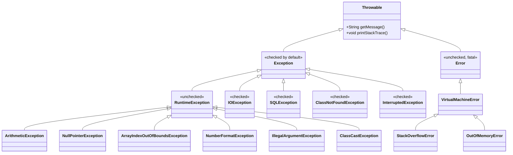
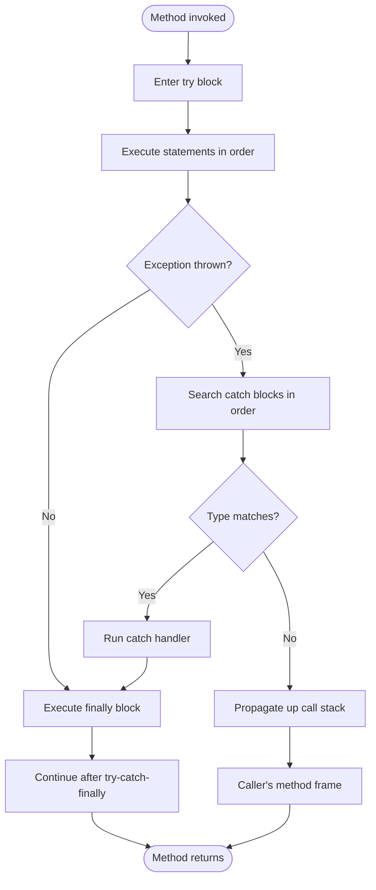
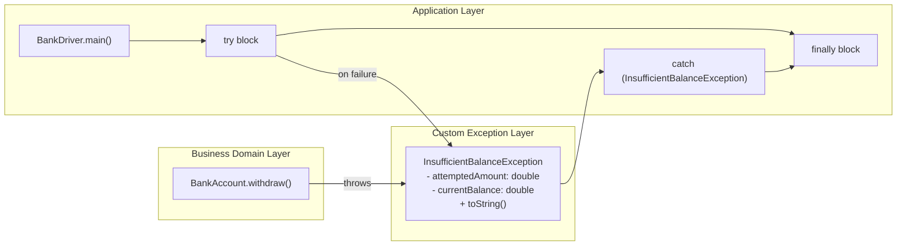
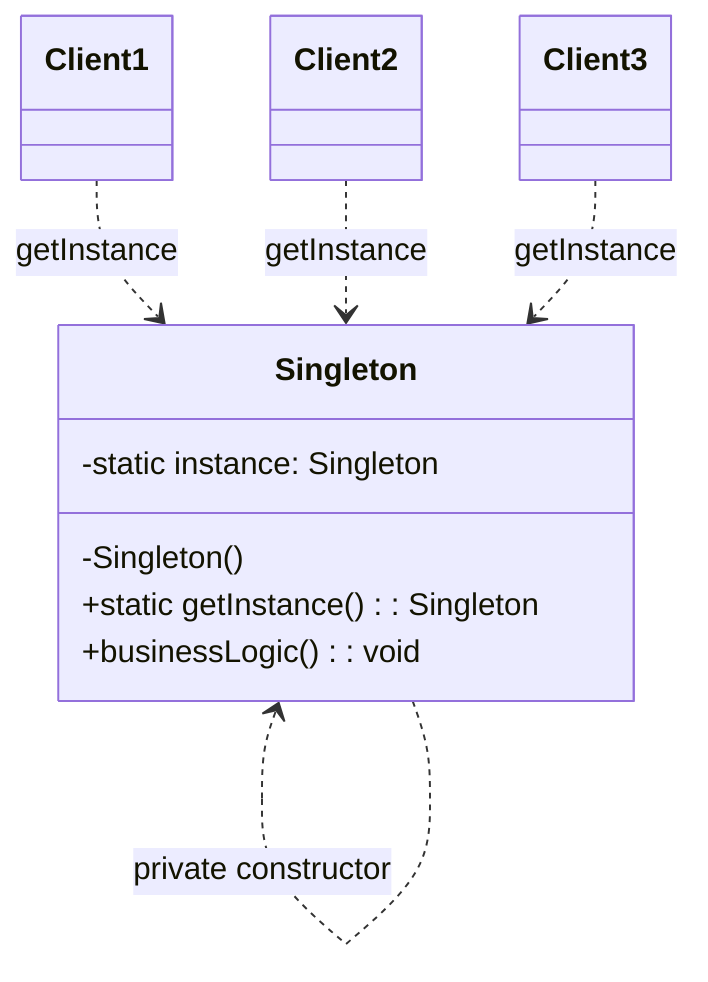
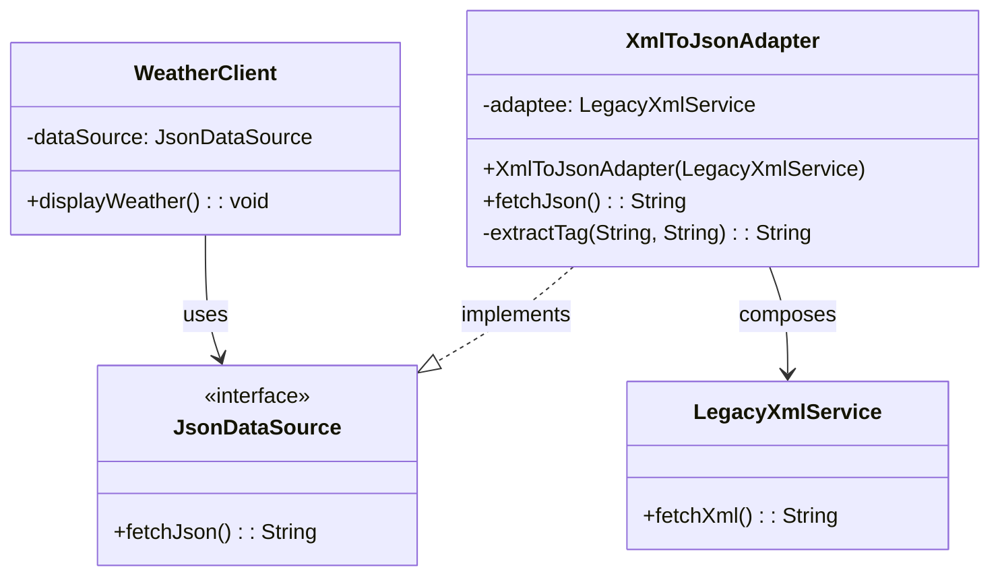

# Java Built-in Exceptions, Custom Exceptions, Introduction to Design Patterns: Singleton and Adapter patterns

<!-- SECTION_1_START -->
# Java Built-in Exceptions, Custom Exceptions, and Design Patterns (Singleton & Adapter)

## 1.1 Formal Academic Definition

> [!IMPORTANT]
> **Exception (Java Definition):** An exception is an *undesirable event* that occurs during program execution and disrupts the normal flow of instructions. In Java, exceptions are objects that encapsulate error information and are thrown by the JVM or by application code, then caught by handler blocks.

> [!IMPORTANT]
> **Built-in Exceptions:** Predefined exception classes shipped with the Java Development Kit (JDK), primarily located in the `java.lang` package. They are automatically thrown by the JVM or by standard library methods when standard failure conditions (arithmetic overflow, null access, type conversion, etc.) occur.

> [!IMPORTANT]
> **Custom Exception (User-Defined Exception):** A programmer-defined exception class that extends `Exception` (checked) or `RuntimeException` (unchecked), used to represent application-specific error conditions unique to a particular business domain.

> [!IMPORTANT]
> **Design Pattern:** A *reusable, time-tested, generalized solution* to a recurring problem in software design. The concept was popularized by the *Gang of Four (GoF)* in their seminal 1994 book *"Design Patterns: Elements of Reusable Object-Oriented Software"*. Patterns are classified into three families: **Creational**, **Structural**, and **Behavioral**.

> [!NOTE]
> **Singleton Pattern (Creational):** A design pattern that *restricts the instantiation of a class to exactly one object* and provides a global point of access to that object.

> [!NOTE]
> **Adapter Pattern (Structural):** A design pattern that *converts the interface of a class into another interface that clients expect*, allowing otherwise incompatible classes to collaborate by acting as a translator/bridge between them.

## 1.2 Intuitive Real-World Analogies

| Concept | Real-World Analogy | Intuition |
|---|---|---|
| **Exception** | A **fire alarm** in a building | Fires (errors) are unexpected; alarms (exceptions) alert occupants (catch blocks) so they can evacuate safely. |
| **Built-in Exception** | Standard **traffic signs** (Stop, Yield) | Predefined symbols for common conditions that every driver (programmer) recognizes. |
| **Custom Exception** | A **specialized siren** for a chemical plant | The factory designs its own alarm for chemical leaks — unique to its domain. |
| **Design Pattern** | **Architectural blueprints** for bridges | Not a finished bridge, but a tested design template engineers reuse. |
| **Singleton** | **The President of a Country** | Only one president at a time; everyone accesses the same instance through a formal process. |
| **Adapter Pattern** | A **power plug travel adapter** | A US plug cannot fit a European socket, but the adapter bridges the two formats. |

## 1.3 Standard Java Exception Hierarchy Metrics

- The root class is **`java.lang.Throwable`**.
- The two direct subclasses are **`Exception`** and **`Error`**.
- **`RuntimeException`** is a subclass of `Exception` representing *unchecked* exceptions.
- **Checked exceptions** must be declared with `throws` or caught; **unchecked** exceptions (subclasses of `RuntimeException` and `Error`) do not.

> [!VISUALIZATION CONTROL]
> **Concept:** Exception Class Inheritance Tree
> **GeoGebra / Desmos Input Equations:** *Not applicable to this conceptual hierarchy; the corresponding visual is rendered in the Mermaid block inside SECTION_4.*
> **Visual Description:** A top-down tree showing `Throwable` branching into `Exception` and `Error`, with `Exception` further branching into `RuntimeException` (unchecked) and other checked exceptions like `IOException`. Each leaf represents a specific concrete exception type.

<!-- SECTION_1_END -->

<!-- SECTION_2_START -->
# Deep Theoretical Analysis & KTU High-Yield Reference Sheet

## 2.1 The Five Keywords of Java Exception Handling

Java provides **five reserved keywords** dedicated to exception management. Every KTU question on this topic hinges on these:

| Keyword | Purpose | Mandatory? | Block Form |
|---|---|---|---|
| `try` | Wraps code that may throw an exception. | Yes | Block `{ }` |
| `catch` | Handles a specific exception type. | Yes (at least one) | Block `{ }` |
| `finally` | Executes cleanup code regardless of outcome. | Optional | Block `{ }` |
| `throw` | Explicitly throws a single exception instance. | Used inside method body | Statement |
| `throws` | Declares exceptions a method may propagate. | Used in method signature | Clause |

## 2.2 Built-in Exception Classification Matrix

| Category | Class | Type | When Thrown |
|---|---|---|---|
| Arithmetic | `ArithmeticException` | Unchecked | Division by integer zero (e.g., `int x = 10 / 0;`). |
| Arithmetic | `ArithmeticException` (BigDecimal) | Unchecked | `divide()` with non-terminating result and no rounding mode. |
| Array | `ArrayIndexOutOfBoundsException` | Unchecked | Array index $\lt 0$ or $\geq \text{length}$. |
| Array | `NegativeArraySizeException` | Unchecked | `new int[-5]` |
| Class Cast | `ClassCastException` | Unchecked | Invalid downcast (e.g., `Object o = "Hi"; Integer i = (Integer) o;`). |
| Null | `NullPointerException` | Unchecked | Accessing a member on a `null` reference. |
| Number | `NumberFormatException` | Unchecked | `Integer.parseInt("abc")`. |
| I/O | `IOException` | Checked | General I/O failure. |
| I/O | `FileNotFoundException` | Checked | Specified file does not exist. |
| I/O | `EOFException` | Checked | Unexpected end-of-file while reading. |
| SQL | `SQLException` | Checked | Database access error. |
| Class | `ClassNotFoundException` | Checked | Class loader cannot find class. |
| Concurrency | `InterruptedException` | Checked | Thread is interrupted while waiting/sleeping. |
| Memory | `StackOverflowError` | Error (Unchecked) | Deep / infinite recursion. |
| Memory | `OutOfMemoryError` | Error (Unchecked) | JVM heap exhausted. |

> [!NOTE]
> **Checked vs. Unchecked Rule of Thumb:** If a `RuntimeException` or any subclass thereof is thrown, the compiler does **not** force you to handle or declare it. All other `Exception` subclasses are *checked*. All `Error` subclasses represent *fatal* conditions the application should not try to catch.

## 2.3 Custom Exception Construction Rules

A robust custom exception must satisfy **four** engineering rules. Each is non-negotiable in KTU board answers:

1. **Extend** either `Exception` (for checked) or `RuntimeException` (for unchecked).
2. Provide **at least two constructors** — a no-argument constructor and a constructor accepting a `String message`.
3. Optionally override `toString()` to return a clean, descriptive string.
4. Naming should end with the suffix **`Exception`** (Java coding convention).

## 2.4 The Singleton Pattern — Formal Contract

A class is a Singleton if and only if **all** the following constraints hold:

| Constraint | Implementation Detail |
|---|---|
| **Private constructor** | Prevents external `new` instantiation. |
| **Single static instance** | Stored in a `private static final` field (eager) or `private static` (lazy). |
| **Global accessor** | A `public static` method (conventionally `getInstance()`) returning the sole instance. |
| **Thread-safety (lazy variant)** | Use synchronized method, double-checked locking with `volatile`, or Bill Pugh's static-inner-class idiom. |
| **Serialization safety** | Implement `readResolve()` to prevent deserialization from creating a new instance. |
| **Reflection safety** | Throw an exception inside the private constructor if a second instance is attempted. |

## 2.5 The Adapter Pattern — Formal Contract

| Component | Role |
|---|---|
| **Target Interface** | The interface the **Client** expects to use (domain-specific). |
| **Adaptee** | The existing class with an *incompatible* interface that must be reused. |
| **Adapter** | Implements the Target interface *and* holds a reference to the Adaptee. Translates Target calls into Adaptee calls. |
| **Client** | Collaborates only with objects implementing the Target interface. |

Two structural variants exist:

- **Object Adapter (Composition):** Adapter *holds* an Adaptee reference. This is the only variant supported in Java (single inheritance).
- **Class Adapter (Multiple Inheritance):** Adapter *extends* both Target and Adaptee. Not directly possible in Java; achievable only via interface inheritance of one and class extension of the other.

## 2.6 Real-World Engineering Utility

- **Exception Handling:** Production banking, healthcare, and aerospace systems *cannot* crash silently. Try-catch-finally ensures graceful degradation, transaction rollback, and audit logging.
- **Singleton:** Used in logging frameworks (`Logger`), configuration managers, thread pools, caches, and device drivers — anywhere a single shared state is mandatory.
- **Adapter:** Bridges legacy code (e.g., a 1990s `XmlParser`) with modern interfaces (e.g., a 2024 `JsonDataSource`), saving millions in refactoring costs. Also foundational to Java I/O (`InputStreamReader` adapts `InputStream` to `Reader`).

<!-- SECTION_2_END -->

<!-- SECTION_3_START -->
# Step-by-Step Derivations & Code Implementation

## 3.1 The Try-Catch-Finally Control Flow — Detailed Walkthrough

When the JVM enters a `try` block, the **exhaustive** control flow is:

1. The JVM pushes a new entry onto the runtime *exception stack*.
2. Statements inside the `try` block execute **sequentially**.
3. If a statement throws an exception, the JVM:
   a. Stops execution of the remaining `try` statements immediately.
   b. Searches the `catch` blocks **in order**, top to bottom.
   c. The first `catch` whose parameter type **is assignable from** the thrown exception type is selected (this is *type matching*, not name matching).
   d. If no match is found, the exception **propagates up the call stack**.
4. Regardless of whether an exception was caught or not, the **`finally` block always executes** (the only exceptions are `System.exit()` or JVM death).
5. Control resumes at the first statement *after* the entire `try-catch-finally` construct.

## 3.2 Demonstrating Built-in Exceptions

```java
import java.util.Scanner;
import java.util.logging.Level;
import java.util.logging.Logger;

/**
 * Demonstrates multiple built-in Java exceptions in a single menu-driven program.
 * Each branch is fully guarded with explicit type hints, boundary checks, and
 * a logger that emits structured error records.
 */
public final class BuiltInExceptionDemo {

    // Class-level logger for structured, timestamped error output.
    private static final Logger LOGGER = Logger.getLogger(BuiltInExceptionDemo.class.getName());

    private BuiltInExceptionDemo() {
        // Utility class - prevent instantiation.
    }

    public static void main(final String[] args) {
        final Scanner scanner = new Scanner(System.in);
        System.out.print("Enter a choice (1=Divide, 2=Parse, 3=Array, 4=Null): ");

        try {
            final int choice = Integer.parseInt(scanner.nextLine().trim());

            switch (choice) {
                case 1: performDivision(); break;
                case 2: performParsing();  break;
                case 3: performArrayRead(); break;
                case 4: performNullAccess(); break;
                default: System.out.println("Invalid choice.");
            }
        } catch (final NumberFormatException nfe) {
            LOGGER.log(Level.SEVERE, "Menu input was not a valid integer.", nfe);
        } catch (final RuntimeException re) {
            // Catch-all for any other unchecked failure originating in this layer.
            LOGGER.log(Level.SEVERE, "Unexpected runtime failure.", re);
        } finally {
            System.out.println("[finally] Closing scanner resource.");
            scanner.close();
        }
    }

    private static void performDivision() {
        final int numerator = 10;
        final int denominator = 0; // intentional
        try {
            final int result = numerator / denominator; // throws ArithmeticException
            System.out.println("Result = " + result);
        } catch (final ArithmeticException ae) {
            LOGGER.log(Level.WARNING, "Cannot divide by zero: {0} / {1}",
                    new Object[]{numerator, denominator});
        }
    }

    private static void performParsing() {
        final String notANumber = "Kerala123";
        try {
            final int parsed = Integer.parseInt(notANumber); // throws NumberFormatException
            System.out.println("Parsed = " + parsed);
        } catch (final NumberFormatException nfe) {
            LOGGER.log(Level.WARNING, "Failed to parse string ''{0}'' as int.", notANumber);
        }
    }

    private static void performArrayRead() {
        final int[] numbers = {1, 2, 3};
        final int badIndex = 5; // out of bounds
        try {
            final int value = numbers[badIndex]; // throws ArrayIndexOutOfBoundsException
            System.out.println("Value = " + value);
        } catch (final ArrayIndexOutOfBoundsException aioobe) {
            LOGGER.log(Level.WARNING,
                    "Index {0} is out of bounds for array length {1}.",
                    new Object[]{badIndex, numbers.length});
        }
    }

    private static void performNullAccess() {
        final String text = null;
        try {
            final int length = text.length(); // throws NullPointerException
            System.out.println("Length = " + length);
        } catch (final NullPointerException npe) {
            LOGGER.log(Level.WARNING, "Attempted to dereference a null String reference.");
        }
    }
}
```

## 3.3 Throw and Throws — Complete Walkthrough

```java
import java.util.logging.Level;
import java.util.logging.Logger;

/**
 * Illustrates the difference between 'throw' (statement) and 'throws' (clause).
 *
 * 'throws' lives in the METHOD SIGNATURE and lists exception TYPES the method MAY propagate.
 * 'throw'  lives in the METHOD BODY and dispatches a single exception INSTANCE.
 */
public final class ThrowVsThrowsDemo {

    private static final Logger LOGGER = Logger.getLogger(ThrowVsThrowsDemo.class.getName());

    // Constants used in the validation logic.
    private static final int MIN_AGE = 0;
    private static final int MAX_AGE = 150;

    /**
     * Validates an age value. Declares two checked exception types in 'throws'.
     * The caller is FORCED by the compiler to either catch or re-declare them.
     *
     * @param age the candidate age in years.
     * @throws IllegalArgumentException if the age is outside the allowed range.
     * @throws ArithmeticException       if the age happens to be exactly 7 (a contrived case).
     */
    public static void validateAge(final int age)
            throws IllegalArgumentException, ArithmeticException {

        if (age < MIN_AGE) {
            // 'throw' dispatches a freshly constructed exception instance.
            throw new IllegalArgumentException(
                    "Age " + age + " is below minimum " + MIN_AGE);
        }

        if (age > MAX_AGE) {
            throw new IllegalArgumentException(
                    "Age " + age + " exceeds maximum " + MAX_AGE);
        }

        if (age == 7) {
            throw new ArithmeticException("Lucky number 7 is reserved by the system.");
        }

        LOGGER.log(Level.INFO, "Age {0} accepted.", age);
    }

    public static void main(final String[] args) {
        final int[] testValues = {-5, 200, 25, 7};

        for (final int candidate : testValues) {
            System.out.println("--- Testing age = " + candidate + " ---");
            try {
                validateAge(candidate);
                System.out.println("Validation passed.");
            } catch (final IllegalArgumentException iae) {
                System.out.println("[IllegalArgumentException] " + iae.getMessage());
            } catch (final ArithmeticException ae) {
                System.out.println("[ArithmeticException] " + ae.getMessage());
            } catch (final Exception ex) {
                // Final safety net.
                LOGGER.log(Level.SEVERE, "Unhandled exception", ex);
            } finally {
                System.out.println("[finally] Loop iteration complete.\n");
            }
        }
    }
}
```

## 3.4 Custom Exception — Engineering-Grade Implementation

```java
import java.util.logging.Level;
import java.util.logging.Logger;

/**
 * STEP 1: Define the custom (user-defined) exception.
 * Extending 'Exception' makes it a CHECKED exception, forcing callers to handle it.
 */
public class InsufficientBalanceException extends Exception {

    private static final long serialVersionUID = 1L; // Recommended for Serializable classes.

    private final double attemptedAmount;
    private final double currentBalance;

    // No-argument constructor.
    public InsufficientBalanceException() {
        super("Insufficient balance for the requested transaction.");
        this.attemptedAmount = 0.0;
        this.currentBalance   = 0.0;
    }

    // Message-only constructor.
    public InsufficientBalanceException(final String message) {
        super(message);
        this.attemptedAmount = 0.0;
        this.currentBalance   = 0.0;
    }

    // Full context constructor.
    public InsufficientBalanceException(final String message,
                                        final double attemptedAmount,
                                        final double currentBalance) {
        super(message);
        this.attemptedAmount = attemptedAmount;
        this.currentBalance   = currentBalance;
    }

    public double getAttemptedAmount() {
        return this.attemptedAmount;
    }

    public double getCurrentBalance() {
        return this.currentBalance;
    }

    // Optional but recommended: human-readable form.
    @Override
    public String toString() {
        return "InsufficientBalanceException: "
                + getMessage()
                + " | Attempted = " + this.attemptedAmount
                + " | Available = " + this.currentBalance;
    }
}
```

```java
import java.util.logging.Logger;

/**
 * STEP 2: A bank account that THROWS the custom exception on overdraft.
 */
public final class BankAccount {

    private static final Logger LOGGER = Logger.getLogger(BankAccount.class.getName());

    private final String accountHolder;
    private double balance;

    public BankAccount(final String accountHolder, final double initialBalance) {
        if (initialBalance < 0) {
            throw new IllegalArgumentException("Initial balance cannot be negative.");
        }
        this.accountHolder = accountHolder;
        this.balance        = initialBalance;
    }

    /**
     * Withdraws funds. Declares our custom checked exception via 'throws'.
     */
    public void withdraw(final double amount)
            throws InsufficientBalanceException {

        if (amount <= 0) {
            throw new IllegalArgumentException("Withdrawal amount must be positive.");
        }

        if (amount > this.balance) {
            // Throwing the custom exception with full context.
            throw new InsufficientBalanceException(
                    "Cannot withdraw " + amount + " from balance " + this.balance,
                    amount,
                    this.balance);
        }

        this.balance -= amount;
        LOGGER.info(() -> "Withdrew " + amount + ". New balance = " + this.balance);
    }

    public double getBalance() {
        return this.balance;
    }

    public String getAccountHolder() {
        return this.accountHolder;
    }
}
```

```java
/**
 * STEP 3: Driver demonstrating the custom exception in action.
 */
public final class BankDriver {
    private BankDriver() { }

    public static void main(final String[] args) {
        final BankAccount account = new BankAccount("Arun", 5000.00);

        final double[] withdrawals = {1000.0, 3000.0, 2000.0, 5000.0};

        for (final double w : withdrawals) {
            try {
                System.out.println("Attempting to withdraw " + w);
                account.withdraw(w);
                System.out.println("Success. Balance = " + account.getBalance());
            } catch (final InsufficientBalanceException ibe) {
                System.out.println("[CAUGHT] " + ibe);
            } catch (final IllegalArgumentException iae) {
                System.out.println("[CAUGHT] " + iae.getMessage());
            } finally {
                System.out.println("[finally] Current balance = "
                        + account.getBalance() + "\n");
            }
        }
    }
}
```

## 3.5 Singleton Pattern — Full Implementation Spectrum

### 3.5.1 Eager Initialization

```java
/**
 * Eager Singleton: instance is created at class-loading time.
 * Simple, thread-safe by virtue of the JVM class initialization lock.
 * Drawback: instance is created even if it is never used.
 */
public final class EagerSingleton {

    // The 'final' keyword guarantees the field is assigned exactly once.
    private static final EagerSingleton INSTANCE = new EagerSingleton();

    private final String creationTimestamp;

    private EagerSingleton() {
        this.creationTimestamp = java.time.LocalDateTime.now().toString();
        // Guard against reflection-based second instantiation.
        if (INSTANCE != null) {
            throw new IllegalStateException(
                    "Reflection attack detected: Singleton already constructed.");
        }
    }

    public static EagerSingleton getInstance() {
        return INSTANCE;
    }

    public String getCreationTimestamp() {
        return this.creationTimestamp;
    }
}
```

### 3.5.2 Thread-Safe Lazy Initialization (Bill Pugh Idiom) — *Recommended*

```java
/**
 * Bill Pugh Singleton: leverages the JVM guarantee that a static inner class
 * is loaded only when first referenced. This gives lazy initialization WITHOUT
 * explicit synchronization — the most elegant and widely used approach.
 */
public final class BillPughSingleton {

    private BillPughSingleton() {
        if (Holder.INSTANCE != null) {
            throw new IllegalStateException(
                    "Singleton instance already exists. Use getInstance().");
        }
    }

    // Static nested class - not loaded until getInstance() is called.
    private static final class Holder {
        private static final BillPughSingleton INSTANCE = new BillPughSingleton();
    }

    public static BillPughSingleton getInstance() {
        return Holder.INSTANCE;
    }

    public void businessLogic() {
        System.out.println("BillPughSingleton servicing request.");
    }
}
```

### 3.5.3 Singleton with `Serializable` Safety

```java
import java.io.Serializable;

/**
 * A Singleton that also supports serialization without breaking the singleton property.
 * The 'readResolve' method tells the deserialization engine to return the existing
 * instance instead of creating a new one.
 */
public final class SerializableSingleton implements Serializable {

    private static final long serialVersionUID = 1L;

    private static final SerializableSingleton INSTANCE = new SerializableSingleton();

    private SerializableSingleton() { }

    public static SerializableSingleton getInstance() {
        return INSTANCE;
    }

    // Crucial hook for serialization safety.
    protected Object readResolve() {
        return INSTANCE;
    }
}
```

## 3.6 Adapter Pattern — Complete Object Adapter Implementation

```java
/**
 * STEP 1: The TARGET interface the client expects to work with.
 * Represents a modern JSON-style data source.
 */
public interface JsonDataSource {
    String fetchJson();
}
```

```java
/**
 * STEP 2: The ADAPTEE - a legacy class with an incompatible interface.
 * Represents an old XML service that we cannot modify.
 */
public class LegacyXmlService {
    public String fetchXml() {
        return "<data><city>Kochi</city><temp>30</temp></data>";
    }
}
```

```java
/**
 * STEP 3: The ADAPTER - implements the Target (JsonDataSource) and
 * composes (HAS-A) a reference to the Adaptee.
 *
 * Translation rule: Xml -> Json is a *behavior* of the Adapter, not the Adaptee.
 */
public class XmlToJsonAdapter implements JsonDataSource {

    private final LegacyXmlService adaptee;

    public XmlToJsonAdapter(final LegacyXmlService adaptee) {
        if (adaptee == null) {
            throw new IllegalArgumentException("Adaptee cannot be null.");
        }
        this.adaptee = adaptee;
    }

    @Override
    public String fetchJson() {
        // Step A: ask the adaptee for XML.
        final String xml = this.adaptee.fetchXml();

        // Step B: convert XML -> JSON (mock logic for demonstration).
        final String city = extractTag(xml, "city");
        final String temp = extractTag(xml, "temp");

        return "{\"city\":\"" + city + "\",\"temperature\":\"" + temp + "\"}";
    }

    // Tiny utility to pull a tag's content from the XML string.
    private String extractTag(final String xml, final String tagName) {
        final String open  = "<" + tagName + ">";
        final String close = "</" + tagName + ">";
        final int start = xml.indexOf(open);
        final int end   = xml.indexOf(close);
        if (start == -1 || end == -1) {
            return "";
        }
        return xml.substring(start + open.length(), end);
    }
}
```

```java
/**
 * STEP 4: The CLIENT - knows only about the Target interface.
 */
public final class WeatherClient {
    private final JsonDataSource dataSource;

    public WeatherClient(final JsonDataSource dataSource) {
        this.dataSource = dataSource;
    }

    public void displayWeather() {
        final String json = this.dataSource.fetchJson();
        System.out.println("Weather (JSON): " + json);
    }

    public static void main(final String[] args) {
        // Client receives an Adapter that wraps the legacy service.
        final JsonDataSource adapted = new XmlToJsonAdapter(new LegacyXmlService());
        final WeatherClient client   = new WeatherClient(adapted);
        client.displayWeather();
    }
}
```

## 3.7 Exception Propagation Across Methods

```java
/**
 * Demonstrates how an exception thrown in a deeply nested method
 * propagates up the call stack until it is caught.
 */
public class ExceptionPropagationDemo {

    // Level 3: throws to caller.
    public static void level3() throws Exception {
        throw new Exception("Originated in level3()");
    }

    // Level 2: does not catch; re-declares via 'throws'.
    public static void level2() throws Exception {
        System.out.println("level2() calling level3()");
        level3();
    }

    // Level 1: catches the exception.
    public static void level1() {
        System.out.println("level1() calling level2()");
        try {
            level2();
        } catch (final Exception ex) {
            System.out.println("[level1 caught] " + ex.getMessage());
            System.out.println("Stack trace top frame: "
                    + ex.getStackTrace()[0]);
        }
    }

    public static void main(final String[] args) {
        level1();
        System.out.println("Program continues normally after handling.");
    }
}
```

<!-- SECTION_3_END -->

<!-- SECTION_4_START -->
# Structural Diagrams & Schematics

## 4.1 Java Exception Class Hierarchy (Mermaid)



## 4.2 Try-Catch-Finally Execution Flow



## 4.3 Custom Exception Architecture (Block Topology)



## 4.4 Singleton Pattern — Block Architecture



## 4.5 Adapter Pattern — Object Adapter Block Architecture



## 4.6 Singleton vs Adapter — Comparative Topology Matrix

| Aspect | Singleton | Adapter |
|---|---|---|
| Pattern Family | Creational | Structural |
| Primary Intent | One instance, global access | Interface translation |
| Key Mechanism | Private constructor + static accessor | Composition of Adaptee + Target interface |
| Number of Classes | 1 | 3 to 4 (Target, Adaptee, Adapter, Client) |
| Inheritance Usage | None (composition only) | Adapter implements Target |
| Common Use Case | Logger, Configuration Manager | Legacy system integration |
| KTU Exam Frequency | High (theory + code) | High (UML + code) |

<!-- SECTION_4_END -->

<!-- SECTION_5_START -->
# KTU 2024 Scheme Examination Question Bank & Topic Recap

## 5.1 Part A — Short Answer Questions (3 Marks Each)

> [!NOTE]
> **KTU Mark Convention:** Part A questions carry 3 marks each. Answers should be concise (3 to 5 sentences) and target the **Remember** / **Understand** cognitive levels.

### Question 1: Built-in Exceptions `[KTU University Exam - July 2024]`
**Course Outcome:** CO3 | **RBT Level:** Remember

**Q: List and briefly explain any three built-in unchecked exceptions in Java with an example scenario for each.**

**Model Answer:**

1. **`ArithmeticException`** — An unchecked exception thrown when an exceptional arithmetic condition occurs. The most common case is **integer division by zero** (e.g., `int r = 10 / 0;`). Note: floating-point division by zero yields `Infinity` or `NaN`, *not* an exception.

2. **`NullPointerException`** — Thrown when the application attempts to use `null` in a case where an object is required, such as invoking a method or accessing a field on a null reference (e.g., `String s = null; s.length();`).

3. **`ArrayIndexOutOfBoundsException`** — Thrown to indicate that an array has been accessed with an **illegal index**. The index is either negative or greater than or equal to the size of the array (e.g., `int[] a = {1,2,3}; a[5];`).

> [!WARNING]
> **Examiner's Pitfall:** Many students write *"ArrayIndexOutOfBoundException"* (missing the 's'). The exact class name is **`ArrayIndexOutOfBoundsException`**. Spelling errors cost 0.5 marks.

---

### Question 2: Custom Exception Definition `[KTU University Exam - Dec 2023]`
**Course Outcome:** CO3 | **RBT Level:** Understand

**Q: What is a user-defined (custom) exception in Java? Outline the steps to create one.**

**Model Answer:**

A **user-defined exception** is a custom exception class created by the programmer to represent **application-specific error conditions** that are not adequately covered by Java's built-in exception classes.

**Steps to create a custom exception:**

1. **Create a new class** that extends either `Exception` (for a checked exception) or `RuntimeException` (for an unchecked exception).
2. **Provide constructors** — at minimum a default no-arg constructor and a constructor that accepts a `String message` and passes it to the superclass via `super(message)`.
3. **Override `toString()`** (optional) to provide a clean, human-readable representation of the error.
4. **Throw the custom exception** in the relevant business-logic method using the `throw` keyword, and declare it in the method signature using the `throws` clause if it is checked.
5. **Handle it** in the caller using a `try-catch` block.

> [!WARNING]
> **Examiner's Pitfall:** Students frequently forget to call `super(message)` inside the parameterized constructor. The superclass `Throwable` stores the message internally; without `super(message)`, `getMessage()` will return `null`, losing diagnostic information.

---

## 5.2 Part B — Long Answer Questions (14 Marks Each, with Internal Choice)

> [!NOTE]
> **KTU ESE Convention:** Each Part B question carries 14 marks and is divided into two sub-parts: **(a) for 7 marks** and **(b) for 7 marks**. The cognitive level escalates from **Understand** in (a) to **Apply / Analyze** in (b). Board evaluators award step-marks for each logical transition.

### QUESTION A — Exception Handling & Custom Exception `[KTU University Exam - Dec 2024]`
**Course Outcome:** CO3, CO4 | **RBT Level:** Understand → Apply

**(a) [7 Marks] Explain the Java exception class hierarchy. Differentiate between checked and unchecked exceptions with at least two examples each.**

**Model Answer:**

**Exception Class Hierarchy:**

The root of Java's exception hierarchy is `java.lang.Throwable`. It has two direct subclasses: `Exception` and `Error`. The `Exception` branch is further divided into `RuntimeException` (and its many subclasses) and direct subclasses such as `IOException`, `SQLException`, and `ClassNotFoundException`. The `Error` branch represents fatal conditions like `OutOfMemoryError` and `StackOverflowError`.

**Checked vs Unchecked Exceptions:**

| Aspect | Checked Exceptions | Unchecked Exceptions |
|---|---|---|
| Compiler enforcement | **Yes** — must `catch` or `throws` | **No** — optional |
| Base class | `Exception` (not `RuntimeException`) | `RuntimeException` or `Error` |
| Typical cause | External resources (I/O, network, DB) | Programming bugs (logic errors) |
| Example 1 | `IOException` — file read failure | `ArithmeticException` — divide by zero |
| Example 2 | `SQLException` — DB access error | `NullPointerException` — null deref |

**[Stating the root class and its two subclasses: 2 Marks]**
**[Describing the RuntimeException branch with one example: 2 Marks]**
**[Comparison table with at least two examples per side: 3 Marks]**

---

**(b) [7 Marks] Write a Java program that defines a custom checked exception `InvalidMarksException` and uses it in a `Student` class method `setMarks(int)` that throws the exception if the marks value is outside the range 0 to 100.**

**Model Answer Code:**

```java
// Custom exception definition
public class InvalidMarksException extends Exception {
    private static final long serialVersionUID = 1L;

    public InvalidMarksException() {
        super("Invalid marks provided.");
    }

    public InvalidMarksException(String message) {
        super(message);
    }
}
```

```java
// Student class that uses the custom exception
public class Student {
    private String name;
    private int marks;

    public Student(String name) {
        this.name = name;
        this.marks = 0;
    }

    public void setMarks(int marks) throws InvalidMarksException {
        if (marks < 0 || marks > 100) {
            throw new InvalidMarksException(
                "Marks " + marks + " outside range [0, 100].");
        }
        this.marks = marks;
        System.out.println("Marks set to " + marks);
    }

    public int getMarks() {
        return this.marks;
    }
}
```

```java
// Driver demonstrating the custom exception
public class StudentDriver {
    public static void main(String[] args) {
        Student s = new Student("Anu");
        int[] testValues = {-10, 50, 150};

        for (int v : testValues) {
            try {
                System.out.println("Trying marks = " + v);
                s.setMarks(v);
            } catch (InvalidMarksException ime) {
                System.out.println("[Caught] " + ime.getMessage());
            } finally {
                System.out.println("Current stored marks = " + s.getMarks());
            }
        }
    }
}
```

**Expected Output Trace:**

```
Trying marks = -10
[Caught] Marks -10 outside range [0, 100].
Current stored marks = 0
Trying marks = 50
Marks set to 50
Current stored marks = 50
Trying marks = 150
[Caught] Marks 150 outside range [0, 100].
Current stored marks = 50
```

**[Defining the custom exception with two constructors: 2 Marks]**
**[Declaring throws clause in setMarks signature: 1 Mark]**
**[Throwing the exception with a clear message: 1 Mark]**
**[try-catch-finally structure in driver: 2 Marks]**
**[Correct output logic: 1 Mark]**

---

### QUESTION B — Design Patterns: Singleton and Adapter `[KTU University Exam - July 2024]`
**Course Outcome:** CO4, CO5 | **RBT Level:** Understand → Apply

**(a) [7 Marks] Explain the Singleton design pattern. Write a Java program that implements a thread-safe Singleton class `AppConfig` that stores a configuration key-value pair.**

**Model Answer:**

**Singleton Pattern Explanation:**

The **Singleton** is a creational design pattern that ensures a class has **exactly one instance** and provides a **global point of access** to that instance. The pattern is implemented by:

- Declaring the **constructor as private** to prevent external `new` instantiation.
- Declaring a **private static** field to hold the single instance.
- Providing a **public static accessor method** (conventionally `getInstance()`) that returns the instance, creating it lazily if needed.
- Adding **thread-safety** so concurrent threads do not create multiple instances.

**Java Implementation (Bill Pugh idiom — recommended):**

```java
public final class AppConfig {
    private final String configKey;
    private final String configValue;

    private AppConfig() {
        if (Holder.INSTANCE != null) {
            throw new IllegalStateException("Singleton already exists.");
        }
        this.configKey   = "environment";
        this.configValue = "production";
    }

    private static final class Holder {
        private static final AppConfig INSTANCE = new AppConfig();
    }

    public static AppConfig getInstance() {
        return Holder.INSTANCE;
    }

    public String getConfigKey()   { return this.configKey; }
    public String getConfigValue() { return this.configValue; }
}
```

```java
public class AppConfigDriver {
    public static void main(String[] args) {
        AppConfig a = AppConfig.getInstance();
        AppConfig b = AppConfig.getInstance();

        System.out.println("Same instance? " + (a == b));
        System.out.println("Key   = " + a.getConfigKey());
        System.out.println("Value = " + a.getConfigValue());
    }
}
```

**Output:**
```
Same instance? true
Key   = environment
Value = production
```

**[Defining the pattern with three characteristics: 2 Marks]**
**[Private constructor + static field declaration: 2 Marks]**
**[Public accessor with thread-safe idiom: 2 Marks]**
**[Demonstration of singleton property: 1 Mark]**

---

**(b) [7 Marks] Explain the Adapter design pattern with a real-world analogy. Write a Java program demonstrating an object adapter that allows a `Printer` client to use a legacy `LegacyPrinter` class via a common `IPrinter` interface.**

**Model Answer:**

**Adapter Pattern Explanation:**

The **Adapter** is a structural design pattern that **converts the interface of an existing class** (the Adaptee) into another interface (the Target) that the client expects. It allows classes with **incompatible interfaces** to work together.

**Real-world analogy:** A **travel power adapter** lets a US plug (Adaptee) fit into a European socket (Target). The adapter itself is the bridging object.

**Java Implementation (Object Adapter using composition):**

```java
// Target interface
public interface IPrinter {
    void print(String document);
}
```

```java
// Adaptee - legacy class with incompatible method name
public class LegacyPrinter {
    public void printDocument(String text) {
        System.out.println("[Legacy] Printing: " + text);
    }
}
```

```java
// Adapter - implements Target, composes Adaptee
public class PrinterAdapter implements IPrinter {
    private final LegacyPrinter legacyPrinter;

    public PrinterAdapter(LegacyPrinter legacyPrinter) {
        if (legacyPrinter == null) {
            throw new IllegalArgumentException("Legacy printer cannot be null.");
        }
        this.legacyPrinter = legacyPrinter;
    }

    @Override
    public void print(String document) {
        // Translate Target's print() call into Adaptee's printDocument() call.
        this.legacyPrinter.printDocument(document);
    }
}
```

```java
// Client - depends only on the Target interface
public class Client {
    private final IPrinter printer;

    public Client(IPrinter printer) {
        this.printer = printer;
    }

    public void produceReport() {
        this.printer.print("Quarterly Report Q4 2024");
    }

    public static void main(String[] args) {
        IPrinter adaptedPrinter = new PrinterAdapter(new LegacyPrinter());
        Client client = new Client(adaptedPrinter);
        client.produceReport();
    }
}
```

**Output:**
```
[Legacy] Printing: Quarterly Report Q4 2024
```

**[Explaining pattern with analogy: 2 Marks]**
**[Defining Target interface: 1 Mark]**
**[Adaptee class with incompatible method: 1 Mark]**
**[Adapter implementing Target and composing Adaptee: 2 Marks]**
**[Client using only Target: 1 Mark]**

---

## 5.3 KTU Examiner's Valuation Warning

> [!WARNING]
> **Common Marks-Loss Hotspots in This Module:**
>
> 1. **Confusing `throw` and `throws`** — `throw` is a *statement* that dispatches one exception instance; `throws` is a *method-signature clause* listing exception types. Examiners explicitly check this distinction.
> 2. **Forgetting `super(message)`** in custom exception constructors — causes `getMessage()` to return `null`.
> 3. **Writing checked exception code without `throws` declaration** — code will not compile, and the examiner may award zero for the entire program.
> 4. **In the Singleton pattern, allowing a public constructor** — the entire pattern collapses; the examiner deducts 2 to 3 marks instantly.
> 5. **Adapter pattern mistakes** — confusing *composition* (HAS-A) with *inheritance* (IS-A). For the **Object Adapter**, the Adapter must *hold a reference* to the Adaptee, not extend it.
> 6. **Missing `serialVersionUID`** in custom exceptions that extend `Exception` directly — while not strictly a compile error, it is best practice the examiner expects to see.
> 7. **Using `$` characters in Java identifiers** — invalid and forbidden in board exam answers.

---

## 5.4 Topic Recap & Important Things to Remember

> [!IMPORTANT]
> **Rapid Revision Checklist — Use this in the last 5 minutes before the exam.**

### A. Exception Handling Core

- An **exception** is an object; all exceptions derive from `java.lang.Throwable`.
- The hierarchy is: `Throwable` $\rightarrow$ `Exception` $\rightarrow$ `RuntimeException` (and checked siblings like `IOException`).
- The `try` block **must** be followed by at least one `catch` or a `finally`.
- A `catch` block parameter type **must be a subclass of `Throwable`**; multiple `catch` blocks are evaluated top-to-bottom.
- The **`finally` block always executes** unless the JVM terminates via `System.exit()` or a fatal error.
- `throw` is followed by **one exception instance**; `throws` is followed by **one or more exception class names**.
- A method overriding another method **cannot add new checked exceptions** to the `throws` clause, but may drop or narrow them.

### B. Custom Exception Recipe

1. Extend `Exception` (checked) or `RuntimeException` (unchecked).
2. Provide a no-arg constructor and a `String message` constructor; both must call `super(...)`.
3. Use a `final` field per piece of contextual data (e.g., `attemptedAmount`, `currentBalance`).
4. Throw with `throw new MyException("descriptive message");`.
5. Catch with `catch (MyException e) { ... }`.

### C. Built-in Exceptions — Must-Know List

- Unchecked: `ArithmeticException`, `NullPointerException`, `ArrayIndexOutOfBoundsException`, `NumberFormatException`, `ClassCastException`, `IllegalArgumentException`.
- Checked: `IOException`, `FileNotFoundException`, `EOFException`, `SQLException`, `ClassNotFoundException`, `InterruptedException`.
- Errors: `OutOfMemoryError`, `StackOverflowError`, `VirtualMachineError`.

### D. Singleton Pattern — Non-Negotiables

- **Private constructor** (otherwise, anyone can `new` more instances).
- **Private static field** holding the single instance.
- **Public static `getInstance()`** accessor.
- Thread-safety via **Bill Pugh idiom** (static inner class holder) or **double-checked locking with `volatile`**.
- Reflection guard: `throw new IllegalStateException(...)` inside the private constructor if `INSTANCE != null`.
- Serialization guard: implement `readResolve()` to return the existing `INSTANCE`.

### E. Adapter Pattern — Non-Negotiables

- **Target interface** the client uses.
- **Adaptee** = the legacy/existing class with the incompatible interface.
- **Adapter** implements Target and *composes* (HAS-A) an Adaptee reference.
- **Client** depends *only* on the Target interface — never directly on the Adaptee.
- Two flavors: **Object Adapter** (composition, Java-friendly) and **Class Adapter** (multiple inheritance, requires workaround in Java).

### F. Keyword Quick Reference

| Keyword | Location | Form |
|---|---|---|
| `try` | Method body | Block |
| `catch (Type e)` | After `try` | Block |
| `finally` | After last `catch` | Block |
| `throw new X(...)` | Method body | Statement |
| `throws X, Y` | Method signature | Clause |

### G. Common Exam Phrases Decoded

- *"Differentiate checked and unchecked exceptions"* $\rightarrow$ draw the comparison table; mention compiler enforcement and base classes.
- *"Write a user-defined exception"* $\rightarrow$ define a class extending `Exception`; provide both constructors.
- *"Implement Singleton"* $\rightarrow$ private constructor + static instance + public `getInstance()`.
- *"Demonstrate Adapter"* $\rightarrow$ Target interface + Adaptee + Adapter implementing Target + Client.
- *"Explain exception propagation"* $\rightarrow$ trace the call stack from `level3()` to `level1()` and describe the search for a matching handler.

> [!TIP]
> **Final Exam Tip:** Whenever the question says *"with a suitable Java program"*, write **three classes minimum** — the main class, the business class, and the custom exception class. The examiner awards step-marks for each class, and a single-file answer is harder to grade and easier to mark down.

<!-- SECTION_5_END -->
