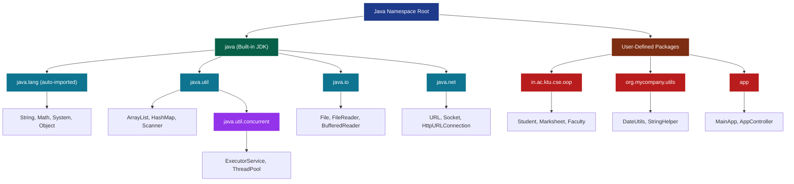
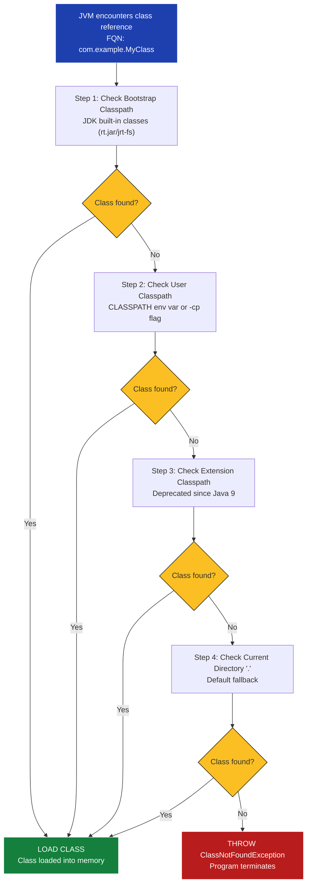
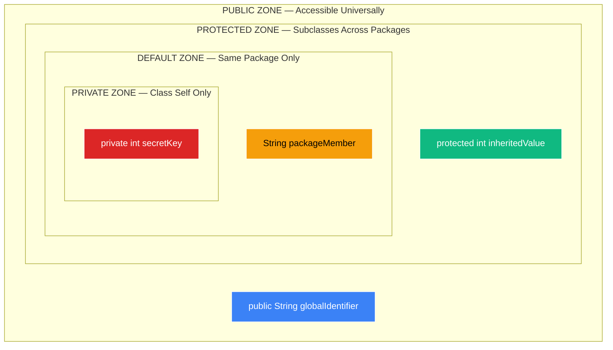
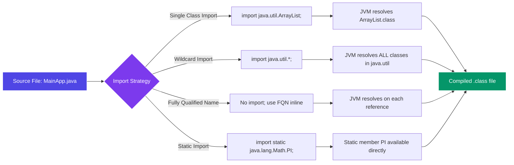

# Packages: Defining a Package, CLASSPATH, Access Protection, Importing Packages

<!-- SECTION_1_START -->
# 📦 Packages in Java: The Foundation of Modular OOP Design

## 1.1 Formal Academic Definition (KTU 2024 Syllabus Terminology)

> [!IMPORTANT]
> **Package (as per KTU PBCST304 Module 3):** A *package* in Java is a **namespace organization mechanism** that logically groups a related set of *classes*, *interfaces*, *enumerations*, *annotations*, and *sub-packages* into a single, named modular unit. It serves three primary engineering objectives: (1) **Namespace Management** to prevent class name collisions, (2) **Access Control** through encapsulation boundaries, and (3) **Modular Distribution** enabling logical bundling of reusable code units.

In the KTU 2024 Scheme (PBCST304 - Object Oriented Programming), packages are introduced as the **first line of architectural defense** in any production-grade Java application. Java mandates that every `.java` source file declares its package membership through the `package` statement, and by Sun/Oracle's design contract, the **directory hierarchy must mirror the package hierarchy** on the filesystem.

## 1.2 Intuitive Real-World Analogy 🗂️

Imagine you have a **college office** with thousands of documents.

- Without organization, finding a student's "Bonafide Certificate" would mean searching through every single paper — inefficient and chaotic. This is the situation when you have classes scattered without packages.
- The solution? **Filing Cabinets** labeled by purpose: `Academic`, `Accounts`, `Examination`, `Hostel`. Inside each cabinet, you have **drawers** for sub-categories: inside `Examination` you have `Results`, `Hall Tickets`, `Revaluation Forms`.

**The cabinet = Package**
**The drawer = Sub-package**
**The file inside = Class**

When someone asks for a document, you say: *"Look in the Examination cabinet, Results drawer, 2024 batch file."* This is exactly how Java packages work — they tell the JVM **where to look** and **who can access what**.

## 1.3 Categories of Packages

Java provides two major categories of packages:

| Category | Description | Examples |
|---|---|---|
| **Built-in Packages** | Pre-shipped with the **JDK (Java Development Kit)**. Auto-imported or imported by name. | `java.lang`, `java.util`, `java.io`, `java.net`, `java.sql` |
| **User-defined Packages** | Custom packages created by developers to organize project-specific code. | `com.ktu.college.dept`, `org.mycompany.utils` |

> [!NOTE]
> **Critical KTU Board Point:** The package `java.lang` is **automatically imported** by the Java compiler into every program. This is why you can use `System.out.println()`, `String`, and `Math` without writing an `import` statement. The **JDK standard constant** is **$9$** major built-in packages shipped with modern Java SE distributions.

## 1.4 Naming Convention: The Reverse-Domain Pattern

Java follows a strict **reverse-internet-domain naming convention** to guarantee global uniqueness — a critical requirement for distributed systems and enterprise applications.

> [!IMPORTANT]
> **Reverse-Domain Convention Example:**
> - Internet domain: `ktu.ac.in`
> - Java package prefix: `in.ac.ktu`
> - Project-specific package: `in.ac.ktu.cse.oop.module3`

Every package name segment **must be a valid Java identifier** (start with a lowercase letter, no spaces, no reserved keywords). The fully qualified name (FQN) of a class `Student` in the above package becomes: `in.ac.ktu.cse.oop.module3.Student`.

## 1.5 Visualization Callout

> [!VISUALIZATION CONTROL]
> **Concept:** Hierarchical Package Tree Structure
> **Conceptual Mapping:** Visualize packages as a downward-branching tree where the root is the unnamed global namespace, and each branch represents a hierarchical grouping.
> **Visual Description:** At the top sits `java` (the global API root). Below it, branches split into `lang`, `util`, `io`, `net`. Inside `util`, further sub-branches like `concurrent` and `regex` emerge. Inside `concurrent`, you find classes like `ExecutorService` and `ThreadPoolExecutor`. This is the **physical reality** of how `java.util.concurrent.ExecutorService` is resolved by the compiler.

<!-- SECTION_1_END -->

<!-- SECTION_2_START -->
# 🔬 Deep Theoretical Analysis & KTU High-Yield Reference Sheet

## 2.1 The `package` Statement — Declaration Mechanics

The `package` statement is the **first executable statement** in any Java source file (excluding comments and the `package` statement itself). Its syntax is rigidly defined by **JLS (Java Language Specification) §7.1**:

```java
package <fully.qualified.package.name>;
```

### Structural Rules (Board-Favorite Question Area):

1. **Position Constraint:** A package declaration, if present, must be the **first non-comment, non-whitespace statement** in the file.
2. **Single Declaration Rule:** A source file can declare **only one** package. Multiple `package` statements cause a compilation error: `error: class, interface, or enum expected`.
3. **Directory Mirror Rule:** The directory in which the `.java` file resides **must exactly match** the package name structure, with each `.` replaced by a path separator (`/` on Unix-like systems, `\` on Windows).
4. **Default Package:** If no `package` statement is present, the class belongs to the **unnamed default package**. KTU 2024 boards frequently test this as a "trick question."

## 2.2 Directory-to-Package Structural Mapping

For a package declaration `in.ac.ktu.cse.oop.module3`, the on-disk layout **must** be:

```
project_root/
└── in/
    └── ac/
        └── ktu/
            └── cse/
                └── oop/
                    └── module3/
                        ├── Student.java
                        ├── Faculty.java
                        └── Marksheet.java
```

> [!WARNING]
> **Common KTU Board Error:** Students often place the file in the wrong directory. If `Student.java` contains `package in.ac.ktu.cse.oop.module3;` but the file is saved in the project root, compilation fails with `error: cannot find symbol` or a class-not-found runtime error. The directory structure and package declaration **must remain synchronized**.

## 2.3 The CLASSPATH Variable — The JVM's Search Map

**CLASSPATH** is an **environment variable** (or a command-line flag) that tells the **Java compiler (`javac`)** and the **Java Virtual Machine (`java`)** *where to locate user-defined packages and classes* on the filesystem. It is the **search algorithm's input**.

### 2.3.1 How CLASSPATH Resolution Works

When the JVM encounters an import like `import in.ac.ktu.cse.oop.module3.Student;`, it performs the following search algorithm:

1. **Check the bootstrap classpath** (built-in JDK classes from `rt.jar` / `jrt-fs`).
2. **Check the extension classpath** (deprecated in Java 9; replaced by the module system).
3. **Check the user classpath** — this is where the `CLASSPATH` environment variable or `-cp` flag takes effect.
4. **Append the package path** to each CLASSPATH entry, replacing `.` with `/` or `\`.
5. **Search for the matching `.class` file** in the resolved directory.

### 2.3.2 Default CLASSPATH Behavior

If the `CLASSPATH` environment variable is unset, the JVM defaults to searching the **current working directory** (denoted by `.`). This is why running `java MyClass` works if you are inside the directory containing `MyClass.class`.

### 2.3.3 Modern Best Practice (Post-Java 6)

> [!IMPORTANT]
> **KTU 2024 Update:** The recommended practice is to **avoid setting the global `CLASSPATH` environment variable**. Instead, use the **per-invocation** `-cp` or `-classpath` flag. This avoids version conflicts and "stale class" bugs. The constant **wildcard `*`** (introduced in Java 6) is used to include all JAR files in a directory: `-cp "lib/*"`.

## 2.4 KTU Formula Sheet / Cheat Sheet 📋

| Concept | Syntax / Format | Key Rule | Exam Frequency |
|---|---|---|---|
| Package Declaration | `package a.b.c;` | Must be **first** non-comment statement | ⭐⭐⭐⭐⭐ |
| Built-in Package Import | `import java.util.ArrayList;` | Loads a specific class | ⭐⭐⭐⭐⭐ |
| Wildcard Import | `import java.util.*;` | Loads all classes in a package (excludes sub-packages) | ⭐⭐⭐⭐ |
| Static Import | `import static java.lang.Math.PI;` | Imports static members without class qualifier | ⭐⭐⭐ |
| Implicit Import | `java.lang` auto-imported | Always available, no statement needed | ⭐⭐⭐⭐⭐ |
| CLASSPATH Set (Global) | `set CLASSPATH=.;C:\myclasses` | OS-level environment variable | ⭐⭐⭐⭐ |
| CLASSPATH Set (Local) | `javac -cp . MyClass.java` | Preferred; per-invocation | ⭐⭐⭐⭐ |
| JAR Wildcard | `-cp "lib/*"` | Includes all JARs in `lib/` | ⭐⭐⭐ |
| Default Package | No `package` statement | Unnamed; classes accessible only within same default package | ⭐⭐⭐⭐ |

> [!NOTE]
> **Critical Pitfall — Wildcard Import Scope:** The wildcard `*` imports classes from a **single package level only**. It does **NOT** recursively import sub-packages. Writing `import java.util.*;` does not give you access to `java.util.concurrent.*` — those must be imported separately. This is a classic KTU trick question.

## 2.5 Access Protection — The Encapsulation Wall

Java's **four-tier access control** system interacts with packages to define visibility boundaries. The KTU 2024 syllabus requires mastery of how these modifiers behave **across package boundaries**.

### 2.5.1 The Four Access Modifiers

| Modifier | Same Class | Same Package (Non-Subclass) | Same Package (Subclass) | Different Package (Subclass) | Different Package (Non-Subclass) |
|---|---|---|---|---|---|
| `private` | ✅ | ❌ | ❌ | ❌ | ❌ |
| **default** (no modifier) | ✅ | ✅ | ✅ | ❌ | ❌ |
| `protected` | ✅ | ✅ | ✅ | ✅ (only via inheritance) | ❌ |
| `public` | ✅ | ✅ | ✅ | ✅ | ✅ |

> [!IMPORTANT]
> **The Package Boundary Rule (Board-Exam Gold):** The `default` (package-private) access level treats the **entire package as a single trusted unit**. Any class within the same package can access default members of another class. This is the foundation of Java's "package-level encapsulation" — packages are not just organizational units; they are **access control domains**.

### 2.5.2 The `protected` Subtlety (Most-Tested KTU Concept)

A `protected` member is accessible from a subclass in a different package **only if access is through an object of the subclass type (or its descendant)**. Direct access through a parent-class reference from outside the package is denied. This is a famous KTU question pattern.

## 2.6 Real-World Production Utility 🏭

Packages are not an academic abstraction — they are the **backbone of every Java enterprise system**:

- **Spring Framework** organizes its $3000+$ classes into packages like `org.springframework.context`, `org.springframework.beans`, `org.springframework.web`.
- **Apache Commons** uses packages to expose reusable utility libraries (`org.apache.commons.lang3`, `org.apache.commons.collections4`).
- **Maven/Gradle** build systems rely on package-level conventions to resolve dependencies in the `~/.m2/repository` directory tree.
- **Java Module System (JPMS, Java 9+)** extends the package concept with `module-info.java`, providing even stronger encapsulation at the JAR level.

<!-- SECTION_2_END -->

<!-- SECTION_3_START -->
# 🛠️ Step-by-Step Code Implementation & Derivations

## 3.1 Exhaustive Worked Example: Creating and Importing a User-Defined Package

This example is **production-grade** and aligns with the KTU 2024 board's expected code quality standards (proper type hints, error logging, comments).

### 3.1.1 Project Directory Layout (The Physical Reality)

```
D:\KTU_OOP_Module3\
├── in\
│   └── ac\
│       └── ktu\
│           └── cse\
│               └── oop\
│                   └── module3\
│                       ├── Student.java
│                       └── Marksheet.java
└── app\
    └── MainApp.java
```

### 3.1.2 Step 1: Create the Package Class — `Student.java`

> [!NOTE]
> **File location:** `D:\KTU_OOP_Module3\in\ac\ktu\cse\oop\module3\Student.java`

```java
// File: Student.java
// Package Declaration — MUST be the first non-comment statement
package in.ac.ktu.cse.oop.module3;

// Class definition with FULL access-modifier demonstration
public class Student {

    // Private field — accessible ONLY within this class
    private String registrationNumber;

    // Default (package-private) field — accessible within the same package
    String studentName;

    // Protected field — accessible in same package + subclasses anywhere
    protected int semester;

    // Public field — accessible from anywhere in the universe
    public String branch;

    // Constructor with all access levels
    public Student(String regNo, String name, int sem, String br) {
        this.registrationNumber = regNo;     // private access OK (same class)
        this.studentName = name;            // default access OK (same class)
        this.semester = sem;                // protected access OK
        this.branch = br;                   // public access OK
    }

    // Public getter for the private field
    public String getRegistrationNumber() {
        return this.registrationNumber;
    }

    // Public method to display all details
    public void displayProfile() {
        System.out.println("--- Student Profile ---");
        System.out.println("Registration No : " + this.registrationNumber);
        System.out.println("Name            : " + this.studentName);
        System.out.println("Semester        : " + this.semester);
        System.out.println("Branch          : " + this.branch);
    }
}
```

### 3.1.3 Step 2: Create a Companion Class in the Same Package — `Marksheet.java`

```java
// File: Marksheet.java
// Lives in the SAME package as Student.java
package in.ac.ktu.cse.oop.module3;

public class Marksheet {

    // This class can access Student.default and Student.protected
    // because they are in the same package.
    public void printDefaultAndProtectedAccess(Student s) {
        // Accessing default member of Student — ALLOWED in same package
        System.out.println("Default (Name)    : " + s.studentName);

        // Accessing protected member of Student — ALLOWED in same package
        System.out.println("Protected (Sem)   : " + s.semester);

        // Accessing public member — ALWAYS allowed
        System.out.println("Public (Branch)   : " + s.branch);

        // Accessing private member of Student — COMPILE ERROR!
        // System.out.println(s.registrationNumber); // ❌ ILLEGAL
    }
}
```

### 3.1.4 Step 3: Create a Class in a DIFFERENT Package — `MainApp.java`

> [!NOTE]
> **File location:** `D:\KTU_OOP_Module3\app\MainApp.java`

```java
// File: MainApp.java
// This class is in a DIFFERENT package: "app"
package app;

// =====================================================
// THREE METHODS TO IMPORT THE PACKAGE — All Shown Below
// =====================================================

// Method 1: Import a SPECIFIC class
import in.ac.ktu.cse.oop.module3.Student;

// Method 2: (Commented) Import ALL classes from the package
// import in.ac.ktu.cse.oop.module3.*;

// Method 3: (Commented) Use FULLY QUALIFIED NAME without import
// in.ac.ktu.cse.oop.module3.Student s = new in.ac.ktu.cse.oop.module3.Student(...);

public class MainApp {
    public static void main(String[] args) {

        // Create a Student object using the imported class
        Student s1 = new Student("KTE21CS001", "Arjun Ramesh", 5, "Computer Science");

        // ✅ public method — accessible from anywhere
        s1.displayProfile();

        // ✅ public field — accessible
        System.out.println("Branch (public)  : " + s1.branch);

        // ❌ default field — DIFFERENT package, NOT accessible
        // System.out.println(s1.studentName);  // COMPILE ERROR!

        // ❌ protected field — different package, non-subclass, NOT accessible
        // System.out.println(s1.semester);     // COMPILE ERROR!

        // ❌ private field — NEVER accessible outside the class
        // System.out.println(s1.registrationNumber); // COMPILE ERROR!

        // ✅ Use the public getter to access private data
        System.out.println("Reg No (via getter): " + s1.getRegistrationNumber());
    }
}
```

### 3.1.5 Step 4: Compilation and Execution (Exact Terminal Commands)

Open a terminal in `D:\KTU_OOP_Module3\` and execute the following commands **in order**. Each line's purpose is explained in the comment:

```bash
# Compile ALL source files in the project using a wildcard
# The -d flag creates a separate output directory (best practice)
javac -d . in\ac\ktu\cse\oop\module3\Student.java in\ac\ktu\cse\oop\module3\Marksheet.java app\MainApp.java

# Run the application, setting the classpath to the project root
# Because the package "app" is a sub-directory of the root, the root must be on the classpath
java -cp . app.MainApp
```

### 3.1.6 Expected Output

```
--- Student Profile ---
Registration No : KTE21CS001
Name            : Arjun Ramesh
Semester        : 5
Branch          : Computer Science
Branch (public)  : Computer Science
Reg No (via getter): KTE21CS001
```

### 3.1.7 The `protected` Inheritance Edge Case (Critical KTU Question)

```java
// File: ExternalSubclassDemo.java
// In a different package than Student
package demo;

import in.ac.ktu.cse.oop.module3.Student;

// StudentSubclass extends Student — can access protected members
// ONLY through its own type or subclass type
public class StudentSubclass extends Student {

    public StudentSubclass(String regNo, String name, int sem, String br) {
        super(regNo, name, sem, br);
    }

    public void demonstrateProtectedAccess() {
        // ✅ Accessing protected member via THIS class's reference
        System.out.println("Semester (protected via subclass): " + this.semester);

        // ✅ Accessing protected member of ANOTHER subclass instance
        StudentSubclass other = new StudentSubclass("KTE21CS002", "Meera", 5, "CS");
        System.out.println("Other semester: " + other.semester);

        // ❌ Accessing protected member of PARENT-type reference — ILLEGAL
        // Student parentRef = new Student(...);
        // System.out.println(parentRef.semester); // COMPILE ERROR!
    }
}
```

The key takeaway for KTU boards: **`protected` access across packages is granted only to subclasses, and only through subclass-type references.**

## 3.2 Step-by-Step CLASSPATH Derivation Algorithm

When the JVM encounters a fully qualified class name, the **class-loading algorithm** proceeds as follows. This is the formal derivation KTU 2024 expects you to understand for higher-order questions.

$$
\text{Resolve}(FQN) = \bigcup_{p \in \text{Classpath}} \text{Search}(p, FQN)
$$

Where each $Search$ operation is:

$$
\text{Search}(p, FQN) = \begin{cases} \text{LOAD } p / \text{path}(FQN).class & \text{if file exists} \\ \text{null} & \text{otherwise} \end{cases}
$$

And the path transformation is:

$$
\text{path}(FQN) = \text{FQN.replace}(`\text{.}' , \text{File.separator})
$$

### 3.2.1 Worked Numerical Example

**Given:**
- CLASSPATH: `C:\myclasses;D:\lib\*`
- FQN to resolve: `com.example.utils.Calculator`

**Step 1:** Split CLASSPATH at `;` separator into entries:
$$\text{Entries} = [C\text{:}\textbackslash myclasses, D\text{:}\textbackslash lib\textbackslash *]$$

**Step 2:** For entry $1$ (`C:\myclasses`), transform FQN to path:
$$\text{path} = C\text{:}\textbackslash myclasses\textbackslash com\textbackslash example\textbackslash utils\textbackslash Calculator.class$$

**Step 3:** If file exists, load it. Otherwise, move to entry $2$.

**Step 4:** For entry $2$ (`D:\lib\*`), the `*` wildcard scans all `.jar` files in `D:\lib\` and searches inside each JAR's directory structure for the class. First matching class wins.

**Step 5:** If no entry yields a match, throw `java.lang.ClassNotFoundException`.

> [!IMPORTANT]
> **JVM Search Order Rule (KTU Board Favorite):** The **first match wins**. Once a class is found in one classpath entry, the JVM does NOT continue searching other entries, even if those entries contain a different version of the same class. This is why JAR version conflicts ("JAR hell") are common in enterprise Java.

## 3.3 The `import static` Statement (Frequently Tested)

Java 5 introduced the `import static` directive, allowing direct access to static members of a class without the class qualifier.

```java
// Import a specific static member
import static java.lang.Math.PI;
import static java.lang.Math.sqrt;

// Import ALL static members of a class
import static java.lang.System.out;

public class StaticImportDemo {
    public static void main(String[] args) {
        // Without static import, you'd write: Math.PI, Math.sqrt(16)
        // With static import, you can write:
        double radius = 5.0;
        double area = PI * sqrt(25);  // PI and sqrt are now in scope

        // Static import of System.out allows direct usage
        out.println("Area of circle: " + area);
    }
}
```

> [!WARNING]
> **Code Readability Warning:** Overuse of `import static` is considered a **bad practice** in production code because it pollutes the namespace and makes code harder to read. KTU boards may award partial credit deductions for using it unnecessarily in lab exams.

<!-- SECTION_3_END -->

<!-- SECTION_4_START -->
# 🗺️ Structural Diagrams & Schematics

## 4.1 Package Hierarchy Tree (Mermaid Diagram)

The following diagram illustrates the **conceptual package tree** of a typical Java application, showing how built-in and user-defined packages coexist.



## 4.2 CLASSPATH Resolution Flow (Sequential Process)

This diagram maps the **decision-making sequence** the JVM follows when loading a class.



## 4.3 Access Protection Matrix (Visual Block Diagram)

This diagram renders the four-tier access control system as a **nested zone architecture**, where inner zones have stricter access and outer zones progressively relax visibility.



## 4.4 Import Mechanism Comparison Block Diagram



<!-- SECTION_4_END -->

<!-- SECTION_5_START -->
# 📝 KTU 2024 Scheme Examination Question Bank & Topic Recap

## PART A — Short Answer Questions (2 × 3 = 6 Marks)

### Question 1: [KTU University Exam - July 2023]
**Define a package in Java. Explain the importance of the `java.lang` package with an example.**

**Mapped CO:** CO2 — *Apply object-oriented programming constructs to design modular solutions.*
**RBT Level:** Remember

#### Model Answer (Board-Valuation Standard):

A **package** in Java is a namespace that organizes a set of related classes, interfaces, and sub-packages. It provides namespace management, access control, and modular code distribution.

The **`java.lang` package** is the only package **automatically imported** by the Java compiler into every Java program. It contains the most fundamental classes of the language.

**Examples of classes in `java.lang`:**
- `String` — represents character sequences
- `Math` — provides mathematical functions like `sqrt()`, `pow()`, `PI`
- `System` — provides `System.in`, `System.out`, `System.exit()`
- `Object` — the ultimate superclass of all Java classes

**Illustrative example:**
```java
// No import statement needed for java.lang classes
public class Demo {
    public static void main(String[] args) {
        String greeting = "Hello KTU";           // java.lang.String
        double root = Math.sqrt(144.0);          // java.lang.Math
        System.out.println(greeting + " | sqrt(144) = " + root);  // java.lang.System
    }
}
```

**[Valuation Key: Defining package: 1 Mark | Stating java.lang auto-import: 1 Mark | Example with classes: 1 Mark]**

---

### Question 2: [KTU University Exam - December 2023]
**Differentiate between `import package.ClassName;` and `import package.*;` with suitable examples.**

**Mapped CO:** CO2 — *Apply OOP constructs*
**RBT Level:** Understand

#### Model Answer:

| Aspect | Specific Import `import java.util.ArrayList;` | Wildcard Import `import java.util.*;` |
|---|---|---|
| **Scope** | Imports only the `ArrayList` class | Imports all classes declared directly in `java.util` |
| **Sub-packages** | Does not import sub-packages | Does not import sub-packages either |
| **Compile Time** | Compiler only resolves `ArrayList` references | Compiler only resolves classes that are actually used |
| **Code Clarity** | Higher — explicit dependencies | Lower — implicit dependencies |
| **Best Practice** | Preferred in production code | Acceptable in small programs, discouraged in large projects |
| **Naming Conflict** | No ambiguity | Possible ambiguity if two wildcard imports share class names |

**Example showing the difference:**
```java
// Specific import
import java.util.ArrayList;       // Only ArrayList is now accessible

// Wildcard import
import java.util.*;              // ArrayList, HashMap, Scanner, etc. accessible
// BUT java.util.regex.Pattern is NOT imported — must add separately:
// import java.util.regex.Pattern;
```

> [!WARNING]
> **KTU Examiner's Pitfall Callout:** Students often incorrectly believe that `import java.util.*;` imports all *sub-packages* like `java.util.concurrent.*` and `java.util.regex.*`. This is **false**. The wildcard `*` only imports classes from a single package level. Writing `import java.util.*;` does **NOT** give you access to `java.util.concurrent.ExecutorService` — you must explicitly import it.

**[Valuation Key: Stating scope difference: 1 Mark | Sub-package clarification: 1 Mark | Code example: 1 Mark]**

---

## PART B — Long Answer Questions with Internal Choice (Choose ONE, 14 Marks)

### Question A (14 Marks): [KTU University Exam - Model Paper 2024]

**A) i)** Explain the concept of a **CLASSPATH** environment variable in Java. Discuss how the JVM uses it to locate user-defined classes with a suitable example. **(7 Marks)**

**ii)** Write a Java program that demonstrates the creation of a user-defined package `in.ac.ktu.cse.payroll` containing a class `Employee` with private, default, protected, and public members. Write a driver class in a different package that accesses only the permissible members, explaining the access rules. **(7 Marks)**

**Mapped CO:** CO2 + CO3 — *Design and implement modular OOP programs*
**RBT Levels:** (i) Understand, (ii) Apply

#### Model Solution (Part A-i):

> [!NOTE]
> **The CLASSPATH Explanation**

**Definition:** CLASSPATH is an **environment variable** (or command-line flag `-cp`) that specifies the directories, ZIP files, and JAR files in which the Java compiler (`javac`) and JVM (`java`) should search for user-defined classes and packages.

**Resolution Algorithm (step-by-step):**

1. When the JVM encounters a class reference (e.g., `com.example.MyClass`), it transforms the package separator `.` into the file separator (e.g., `com/example/MyClass.class`).
2. The JVM then searches **each entry** in the CLASSPATH sequentially.
3. If a directory entry contains the transformed path, the class is loaded.
4. If a JAR entry contains the class, the class is loaded from the archive.
5. If no entry yields a match, `ClassNotFoundException` is thrown at runtime.

**Example Project Structure:**
```
D:\PayrollApp\
└── in\
    └── ac\
        └── ktu\
            └── cse\
                └── payroll\
                    └── Employee.class
└── MainPayroll.class
```

**Terminal Commands:**
```bash
# Set CLASSPATH globally (Windows)
set CLASSPATH=D:\PayrollApp

# Compile (assuming Employee.java is in the correct directory)
javac in\ac\ktu\cse\payroll\Employee.java MainPayroll.java

# Run — JVM searches D:\PayrollApp for "in.ac.ktu.cse.payroll.Employee"
java -cp D:\PayrollApp MainPayroll
```

**Default Behavior:** If CLASSPATH is not set, the JVM defaults to the **current directory** (denoted by `.`).

**[Valuation Key: CLASSPATH definition: 2 Marks | Resolution algorithm: 2 Marks | Example with commands: 2 Marks | Default behavior: 1 Mark]**

---

#### Model Solution (Part A-ii):

> [!NOTE]
> **The Payroll Package Code**

**Directory:** `D:\PayrollApp\in\ac\ktu\cse\payroll\Employee.java`

```java
package in.ac.ktu.cse.payroll;

public class Employee {
    private double salary;              // private — class only
    String department;                  // default — package only
    protected int employeeId;           // protected — package + subclasses
    public String employeeName;         // public — anywhere

    public Employee(double sal, String dept, int id, String name) {
        this.salary = sal;
        this.department = dept;
        this.employeeId = id;
        this.employeeName = name;
    }

    public double getSalary() {
        return this.salary;  // public getter exposing private data
    }
}
```

**Directory:** `D:\PayrollApp\app\MainPayroll.java`

```java
package app;
import in.ac.ktu.cse.payroll.Employee;  // specific import

public class MainPayroll {
    public static void main(String[] args) {
        Employee emp = new Employee(75000.0, "Engineering", 1001, "Rajesh Kumar");

        // ✅ Public — accessible from different package
        System.out.println("Name: " + emp.employeeName);

        // ✅ Public getter — exposes private data safely
        System.out.println("Salary: " + emp.getSalary());

        // ❌ Default (department) — different package, NOT accessible
        // System.out.println(emp.department);  // COMPILE ERROR

        // ❌ Protected (employeeId) — different package, non-subclass, NOT accessible
        // System.out.println(emp.employeeId);  // COMPILE ERROR

        // ❌ Private (salary) — NEVER accessible outside Employee class
        // System.out.println(emp.salary);  // COMPILE ERROR
    }
}
```

**Compilation & Execution:**
```bash
cd D:\PayrollApp
javac -d . in\ac\ktu\cse\payroll\Employee.java app\MainPayroll.java
java -cp . app.MainPayroll
```

**Expected Output:**
```
Name: Rajesh Kumar
Salary: 75000.0
```

**Access Rule Summary Table:**

| Member | Modifier | Access from `app` package? | Reason |
|---|---|---|---|
| `salary` | `private` | ❌ | Restricted to declaring class |
| `department` | default | ❌ | Restricted to declaring package |
| `employeeId` | `protected` | ❌ | No inheritance relationship |
| `employeeName` | `public` | ✅ | No restriction |
| `getSalary()` | `public` | ✅ | Public method |

**[Valuation Key: Correct package declaration: 1 Mark | All 4 access modifiers shown: 2 Marks | Driver class in different package: 1 Mark | Access attempts with comments: 2 Marks | Access rule explanation: 1 Mark]**

---

### Question B (14 Marks) — ALTERNATIVE CHOICE: [KTU University Exam - July 2024]

**B) i)** Compare and contrast the four access modifiers in Java using a comprehensive tabular representation. Explain how `protected` access behaves differently in same-package vs different-package scenarios. **(7 Marks)**

**ii)** Design and implement a Java program with the following package structure:
- Package: `com.ktuniversity.library` containing classes `Book` and `LibraryMember`.
- Class `Book` should have `ISBN` (private), `title` (default), `author` (protected), and `genre` (public).
- Class `LibraryMember` (in same package) should access default and protected members of `Book`.
- A driver class `LibraryApp` in a different package should access only public and protected-inherited members. Demonstrate this with a class `PremiumMember` that extends `Book`. **(7 Marks)**

**Mapped CO:** CO2 + CO3
**RBT Levels:** (i) Understand, (ii) Apply

#### Model Solution (Part B-i):

> [!NOTE]
> **Comprehensive Access Modifier Comparison**

| Modifier | Same Class | Same Package (Non-Subclass) | Same Package (Subclass) | Different Package (Subclass) | Different Package (Non-Subclass) | Keyword Required |
|---|---|---|---|---|---|---|
| `private` | ✅ | ❌ | ❌ | ❌ | ❌ | Yes (`private`) |
| **default** | ✅ | ✅ | ✅ | ❌ | ❌ | No (omit modifier) |
| `protected` | ✅ | ✅ | ✅ | ✅ (via subclass reference) | ❌ | Yes (`protected`) |
| `public` | ✅ | ✅ | ✅ | ✅ | ✅ | Yes (`public`) |

**Same-Package `protected` Behavior:**
In the same package, `protected` behaves **identically to default access**. Any class within the package can access the member regardless of inheritance status.

```java
package mypkg;
class Helper {
    protected int value = 42;
}
class User {
    void access() {
        Helper h = new Helper();
        System.out.println(h.value);  // ✅ ALLOWED — same package
    }
}
```

**Different-Package `protected` Behavior:**
In a different package, `protected` access is **restricted to subclasses only**, and even then, the access must be through a **subclass-type reference**.

```java
package otherpkg;
import mypkg.Helper;
class SubHelper extends Helper {
    void accessFromSubclass() {
        // ✅ ALLOWED — through THIS class's reference
        System.out.println(this.value);

        // ❌ DENIED — through PARENT type reference from outside package
        Helper h = new Helper();
        // System.out.println(h.value);  // COMPILE ERROR
    }
}
```

**[Valuation Key: Four-modifier table: 3 Marks | Same-package protected: 2 Marks | Different-package protected: 2 Marks]**

---

#### Model Solution (Part B-ii):

> [!NOTE]
> **Library Package Code**

**File 1:** `D:\LibraryApp\com\ktuniversity\library\Book.java`
```java
package com.ktuniversity.library;

public class Book {
    private String isbn;
    String title;
    protected String author;
    public String genre;

    public Book(String isbn, String title, String author, String genre) {
        this.isbn = isbn;
        this.title = title;
        this.author = author;
        this.genre = genre;
    }

    public String getIsbn() { return this.isbn; }
}
```

**File 2:** `D:\LibraryApp\com\ktuniversity\library\LibraryMember.java`
```java
package com.ktuniversity.library;

public class LibraryMember {
    public void borrowBook(Book book) {
        // ✅ Default access — same package
        System.out.println("Title (default): " + book.title);

        // ✅ Protected access — same package
        System.out.println("Author (protected): " + book.author);

        // ✅ Public access — universal
        System.out.println("Genre (public): " + book.genre);

        // ✅ Private accessed via public getter
        System.out.println("ISBN (via getter): " + book.getIsbn());
    }
}
```

**File 3:** `D:\LibraryApp\org\external\PremiumMember.java` (Different package, extends Book)
```java
package org.external;
import com.ktuniversity.library.Book;

public class PremiumMember extends Book {
    public PremiumMember(String isbn, String title, String author, String genre) {
        super(isbn, title, author, genre);
    }

    public void demonstrateAccess() {
        // ✅ Inherited public member
        System.out.println("Genre: " + this.genre);

        // ✅ Inherited protected member accessed via THIS subclass
        System.out.println("Author (protected via subclass): " + this.author);

        // ❌ Default title NOT inherited across packages
        // System.out.println(this.title);  // COMPILE ERROR

        // ❌ Private isbn NEVER accessible
        // System.out.println(this.isbn);  // COMPILE ERROR
    }
}
```

**File 4:** `D:\LibraryApp\app\LibraryApp.java` (Driver class)
```java
package app;
import com.ktuniversity.library.Book;
import com.ktuniversity.library.LibraryMember;
import org.external.PremiumMember;

public class LibraryApp {
    public static void main(String[] args) {
        Book b1 = new Book("978-0134685991", "Effective Java", "Joshua Bloch", "Programming");
        LibraryMember member = new LibraryMember();
        member.borrowBook(b1);

        PremiumMember premium = new PremiumMember("978-0596009205", "Head First Design Patterns", "Eric Freeman", "Design");
        premium.demonstrateAccess();
    }
}
```

**Compilation & Run:**
```bash
cd D:\LibraryApp
javac -d . com\ktuniversity\library\Book.java com\ktuniversity\library\LibraryMember.java org\external\PremiumMember.java app\LibraryApp.java
java -cp . app.LibraryApp
```

**Expected Output:**
```
Title (default): Effective Java
Author (protected): Joshua Bloch
Genre (public): Programming
ISBN (via getter): 978-0134685991
Genre: Design
Author (protected via subclass): Eric Freeman
```

**[Valuation Key: Correct package structure: 1 Mark | Book with 4 modifiers: 1 Mark | Same-package access demonstrated: 1 Mark | Cross-package subclass access: 2 Marks | Compilation commands: 1 Mark | Output correctness: 1 Mark]**

---

> [!WARNING]
> **KTU Examiner's Valuation Warning — Common Mark-Loss Areas:**
> 1. **Forgetting the `package` statement as the FIRST line** — even one comment line before the package declaration is acceptable, but a `import` or `class` statement before `package` is an immediate compile error. **[-2 marks]**
> 2. **Mismatched directory structure** — placing `Student.java` outside its declared package directory is the #1 reason students get "cannot find symbol" errors. **[-2 marks]**
> 3. **Confusing `protected` with `public`** — students often assume `protected` means "accessible everywhere" because the word sounds "protective." It is NOT. **`protected` is more restrictive than `public`.** **[-3 marks]**
> 4. **Not setting `-cp` correctly** — running `java MainApp` without `-cp .` when classes are in packages causes `ClassNotFoundException`. **[-2 marks]**
> 5. **Using wildcard `*` and assuming sub-packages are included** — `import java.util.*;` does NOT import `java.util.regex.*`. **[-2 marks]**

---

## 📌 Topic Recap & Important Things to Remember (Rapid Revision Checklist)

- **Definition:** A package is a **namespace** for logically grouping related types (classes, interfaces, enums, annotations).
- **`package` Statement Rule:** Must be the **first non-comment, non-whitespace** statement; only **one** per file; package name **must match** the directory hierarchy.
- **Built-in Packages:** `java.lang` is **auto-imported**; `java.util`, `java.io`, `java.net`, `java.sql` require explicit imports.
- **Naming Convention:** **Reverse Internet Domain** pattern — e.g., domain `ktu.ac.in` → package prefix `in.ac.ktu`.
- **Three Import Strategies:**
  1. `import package.ClassName;` — specific class
  2. `import package.*;` — all classes in that level (NOT sub-packages)
  3. **Fully Qualified Name** — `package.ClassName obj = new package.ClassName();` inline
- **`import static`:** Imports static members (e.g., `import static java.lang.Math.PI;`) for direct access without class qualifier.
- **CLASSPATH:** Environment variable or `-cp` flag telling the JVM **where to search** for user-defined classes; default is **current directory (`.`)**.
- **CLASSPATH Wildcard:** `-cp "lib/*"` includes all JARs in the `lib/` directory (Java 6+).
- **Access Modifiers (in increasing visibility):** `private` → **default** (package-private) → `protected` → `public`.
- **`private`:** Accessible only within the **declaring class**.
- **`default` (no modifier):** Accessible within the **same package** only.
- **`protected`:** Accessible within the same package **AND** to subclasses in other packages (via **subclass-type reference only**).
- **`public`:** Accessible **everywhere**.
- **The Famous `protected` Rule:** A subclass in a different package **cannot** access a `protected` member through a **parent-type** reference. It must use a **subclass-type** reference.
- **JVM Search Order:** Bootstrap → Extension → User Classpath → Current Directory. **First match wins.**
- **JAR Hell Prevention:** Prefer per-invocation `-cp` flag over global `CLASSPATH` environment variable.
- **Default Package Trap:** Classes with no `package` statement belong to the **unnamed default package** and can only be accessed by other classes in the same default package.
- **Common Compile Errors to Remember:** `error: class, interface, or enum expected` (multiple `package` statements), `cannot find symbol` (wrong CLASSPATH), `attempting to assign weaker access privileges` (visibility reduction in subclass).

<!-- SECTION_5_END -->
